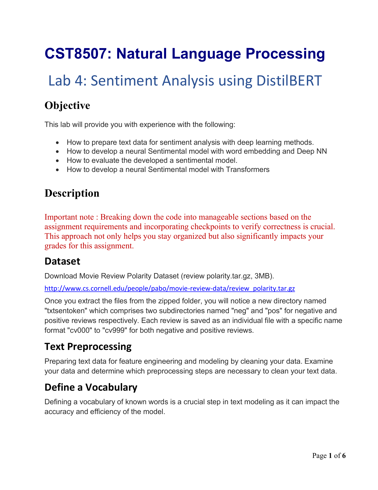
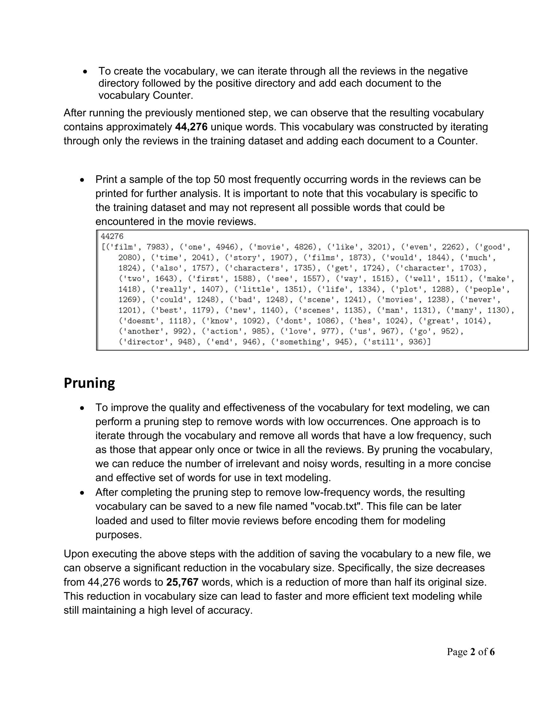
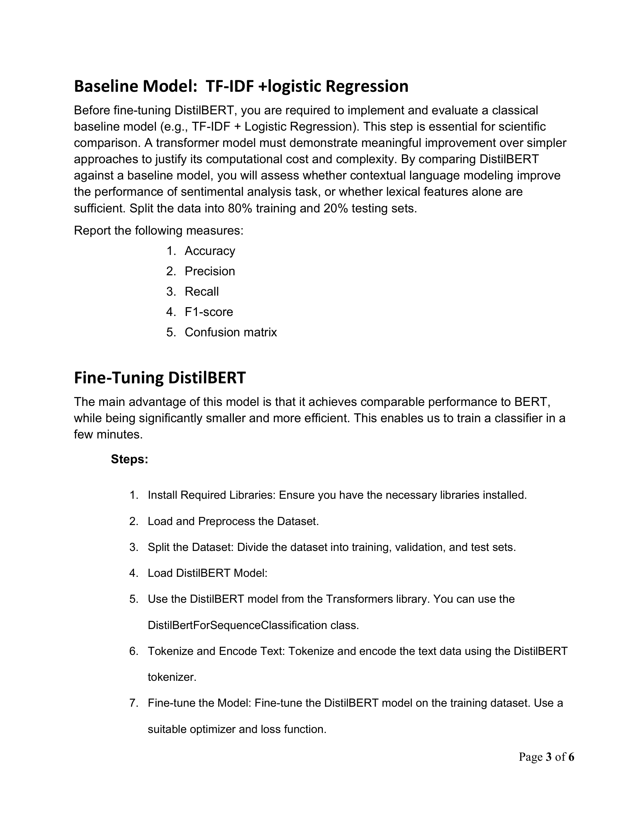
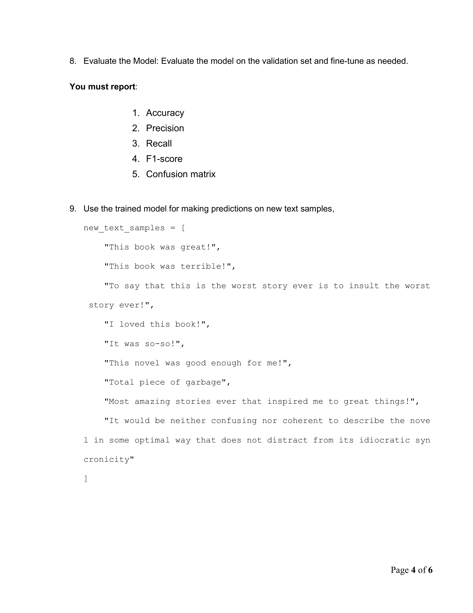
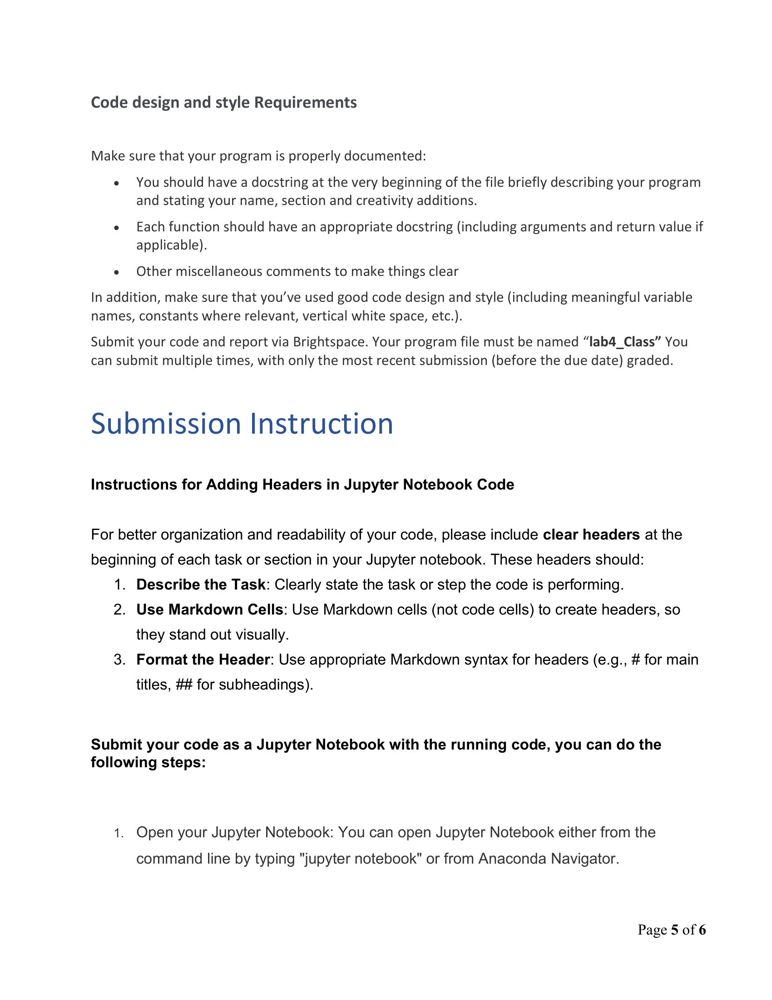
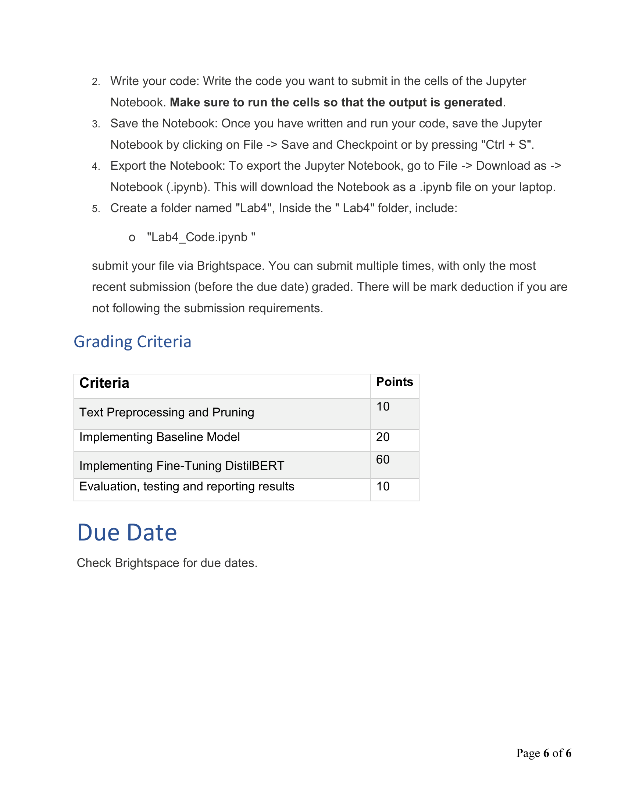

# Lab 4: 使用 DistilBERT 的情感分析 (Sentiment Analysis using DistilBERT)

> Source: `CST82807_Lab4_W26.pdf`
> Total pages: 6
> Course: CST8507 Natural Language Processing

---

## 1. 目标 (Objective)



- How to prepare text data for sentiment analysis with deep learning methods. — 如何为深度学习方法准备文本数据进行情感分析。
- How to develop a neural Sentimental model with word embedding and Deep NN. — 如何使用词嵌入和深度神经网络开发情感模型。
- How to evaluate the developed a sentimental model. — 如何评估已开发的情感模型。
- How to develop a neural Sentimental model with Transformers. — 如何使用 Transformers 开发情感模型。

---

## 2. 说明 (Description)

**Important note — 重要说明:** Breaking down the code into manageable sections based on the assignment requirements and incorporating checkpoints to verify correctness is crucial. This approach not only helps you stay organized but also significantly impacts your grades for this assignment. — 根据作业要求将代码分解为可管理的部分，并加入检查点以验证正确性，这一点至关重要。这种方法不仅帮助你保持条理，还能显著影响你的作业成绩。

---

## 3. 数据集 (Dataset)

**Dataset — 数据集:** Download Movie Review Polarity Dataset (review polarity.tar.gz, 3MB). — 下载电影评论极性数据集（review polarity.tar.gz，3MB）。

http://www.cs.cornell.edu/people/pabo/movie-review-data/review_polarity.tar.gz

- Once you extract the files from the zipped folder, you will notice a new directory named "txtsentoken" which comprises two subdirectories named "neg" and "pos" for negative and positive reviews respectively. — 解压后，你会看到一个名为 "txtsentoken" 的新目录，包含两个子目录 "neg"（负面评论）和 "pos"（正面评论）。
- Each review is saved as an individual file with a specific name format "cv000" to "cv999" for both negative and positive reviews. — 每条评论保存为独立文件，文件名格式从 "cv000" 到 "cv999"。

---

## 4. 文本预处理 (Text Preprocessing)

**Text Preprocessing — 文本预处理:** Preparing text data for feature engineering and modeling by cleaning your data. Examine your data and determine which preprocessing steps are necessary to clean your text data. — 通过清理数据为特征工程和建模准备文本数据。检查数据并确定哪些预处理步骤是清理文本数据所必需的。

---

## 5. 定义词汇表 (Define a Vocabulary)



**Define a Vocabulary — 定义词汇表:** Defining a vocabulary of known words is a crucial step in text modeling as it can impact the accuracy and efficiency of the model. — 定义已知词的词汇表是文本建模中的关键步骤，因为它会影响模型的准确性和效率。

- To create the vocabulary, we can iterate through all the reviews in the negative directory followed by the positive directory and add each document to the vocabulary Counter. — 创建词汇表时，我们可以遍历负面目录和正面目录中的所有评论，将每个文档添加到词汇表 Counter 中。
- After running the previously mentioned step, we can observe that the resulting vocabulary contains approximately 44,276 unique words. — 运行上述步骤后，我们可以观察到词汇表包含约 44,276 个唯一词。
- Print a sample of the top 50 most frequently occurring words in the reviews can be printed for further analysis. — 打印评论中最常出现的前 50 个词以供进一步分析。

---

## 6. 剪枝 (Pruning)

- To improve the quality and effectiveness of the vocabulary for text modeling, we can perform a pruning step to remove words with low occurrences. One approach is to iterate through the vocabulary and remove all words that have a low frequency, such as those that appear only once or twice in all the reviews. — 为了提高词汇表的质量和文本建模的有效性，我们可以执行剪枝步骤以去除低频词。一种方法是遍历词汇表并移除所有低频词，例如在所有评论中仅出现一两次的词。
- After completing the pruning step to remove low-frequency words, the resulting vocabulary can be saved to a new file named "vocab.txt". This file can be later loaded and used to filter movie reviews before encoding them for modeling purposes. — 完成剪枝后，结果词汇表可以保存到名为 "vocab.txt" 的新文件中。该文件可以在编码建模时用于过滤电影评论。
- Upon executing the above steps, we can observe a significant reduction in the vocabulary size. Specifically, the size decreases from 44,276 words to 25,767 words, which is a reduction of more than half its original size. — 执行上述步骤后，词汇表大小显著减少。具体来说，从 44,276 个词减少到 25,767 个词，减少了一半以上。

---

## 7. 基线模型：TF-IDF + 逻辑回归 (Baseline Model: TF-IDF + Logistic Regression)



**Baseline Model: TF-IDF + Logistic Regression — 基线模型：TF-IDF + 逻辑回归:**

- Before fine-tuning DistilBERT, you are required to implement and evaluate a classical baseline model (e.g., TF-IDF + Logistic Regression). — 在微调 DistilBERT 之前，你需要实现并评估一个经典基线模型（例如 TF-IDF + 逻辑回归）。
- This step is essential for scientific comparison. A transformer model must demonstrate meaningful improvement over simpler approaches to justify its computational cost and complexity. — 此步骤对科学比较至关重要。Transformer 模型必须展示出比简单方法有意义的提升，才能证明其计算成本和复杂性的合理性。
- By comparing DistilBERT against a baseline model, you will assess whether contextual language modeling improve the performance of sentimental analysis task, or whether lexical features alone are sufficient. — 通过将 DistilBERT 与基线模型进行比较，你将评估上下文语言模型是否提升了情感分析任务的性能，还是仅靠词汇特征就足够了。
- Split the data into 80% training and 20% testing sets. — 将数据分为 80% 训练集和 20% 测试集。

**Report the following measures — 报告以下指标:**

1. Accuracy — 准确率
2. Precision — 精确率
3. Recall — 召回率
4. F1-score — F1 分数
5. Confusion matrix — 混淆矩阵

---

## 8. 微调 DistilBERT (Fine-Tuning DistilBERT)



**Fine-Tuning DistilBERT — 微调 DistilBERT:** The main advantage of this model is that it achieves comparable performance to BERT, while being significantly smaller and more efficient. This enables us to train a classifier in a few minutes. — 该模型的主要优势在于其性能与 BERT 相当，但体积更小、效率更高。这使我们能够在几分钟内训练一个分类器。

**Steps — 步骤:**

1. Install Required Libraries: Ensure you have the necessary libraries installed. — 安装所需的库：确保已安装必要的库。
2. Load and Preprocess the Dataset. — 加载并预处理数据集。
3. Split the Dataset: Divide the dataset into training, validation, and test sets. — 拆分数据集：将数据集分为训练集、验证集和测试集。
4. Load DistilBERT Model. — 加载 DistilBERT 模型。
5. Use the DistilBERT model from the Transformers library. You can use the DistilBertForSequenceClassification class. — 使用 Transformers 库中的 DistilBERT 模型。可以使用 DistilBertForSequenceClassification 类。
6. Tokenize and Encode Text: Tokenize and encode the text data using the DistilBERT tokenizer. — 分词和编码文本：使用 DistilBERT 分词器对文本数据进行分词和编码。
7. Fine-tune the Model: Fine-tune the DistilBERT model on the training dataset. Use a suitable optimizer and loss function. — 微调模型：在训练数据集上微调 DistilBERT 模型。使用合适的优化器和损失函数。
8. Evaluate the Model: Evaluate the model on the validation set and fine-tune as needed. — 评估模型：在验证集上评估模型并根据需要进行调整。

**You must report — 你必须报告:**

1. Accuracy — 准确率
2. Precision — 精确率
3. Recall — 召回率
4. F1-score — F1 分数
5. Confusion matrix — 混淆矩阵

---

## 9. 新文本预测 (Predictions on New Text)

9. Use the trained model for making predictions on new text samples: — 使用训练好的模型对新文本样本进行预测：

```python
new_text_samples = [
    "This book was great!",
    "This book was terrible!",
    "To say that this is the worst story ever is to insult the worst story ever!",
    "I loved this book!",
    "It was so-so!",
    "This novel was good enough for me!",
    "Total piece of garbage",
    "Most amazing stories ever that inspired me to great things!",
    "It would be neither confusing nor coherent to describe the novel in some optimal way that does not distract from its idiocratic syncronicity"
]
```

---

## 10. 代码设计与风格要求 (Code Design and Style Requirements)



**Code design and style Requirements — 代码设计与风格要求:**

- You should have a docstring at the very beginning of the file briefly describing your program and stating your name, section and creativity additions. — 文件开头应有一个 docstring，简要描述你的程序并说明你的姓名、组别和创新点。
- Each function should have an appropriate docstring (including arguments and return value if applicable). — 每个函数应有适当的 docstring（包括参数和返回值）。
- Other miscellaneous comments to make things clear. — 其他必要注释使代码清晰。
- Make sure that you've used good code design and style (including meaningful variable names, constants where relevant, vertical white space, etc.). — 确保使用良好的代码设计和风格（包括有意义的变量名、适当的常量、垂直空白等）。

---

## 11. 提交说明 (Submission Instructions)



**Submission Instruction — 提交说明:**

- Submit your code and report via Brightspace. Your program file must be named "lab4_Class". — 通过 Brightspace 提交你的代码和报告。程序文件必须命名为 "lab4_Class"。
- You can submit multiple times, with only the most recent submission (before the due date) graded. — 你可以多次提交，只有最近一次提交（截止日期前）会被评分。
- For better organization and readability of your code, please include clear headers at the beginning of each task or section in your Jupyter notebook. — 为了代码的组织性和可读性，请在 Jupyter notebook 的每个任务或部分开头添加清晰的标题。
- Use Markdown cells (not code cells) to create headers, so they stand out visually. — 使用 Markdown 单元格（不是代码单元格）来创建标题，使其视觉上突出。

**Submission folder structure — 提交文件夹结构:**

- Create a folder named "Lab4" — 创建名为 "Lab4" 的文件夹
- Inside the "Lab4" folder, include: "Lab4_Code.ipynb" — 在 "Lab4" 文件夹中包含："Lab4_Code.ipynb"

---

## 12. 评分标准 (Grading Criteria)

| Criteria — 评分项                                               | Points — 分值 |
| --------------------------------------------------------------- | -------------- |
| Text Preprocessing and Pruning — 文本预处理和剪枝                | 10             |
| Implementing Baseline Model — 实现基线模型                       | 20             |
| Implementing Fine-Tuning DistilBERT — 实现微调 DistilBERT        | 60             |
| Evaluation, testing and reporting results — 评估、测试和报告结果 | 10             |

**Due Date — 截止日期:** Check Brightspace for due dates. — 请在 Brightspace 上查看截止日期。
