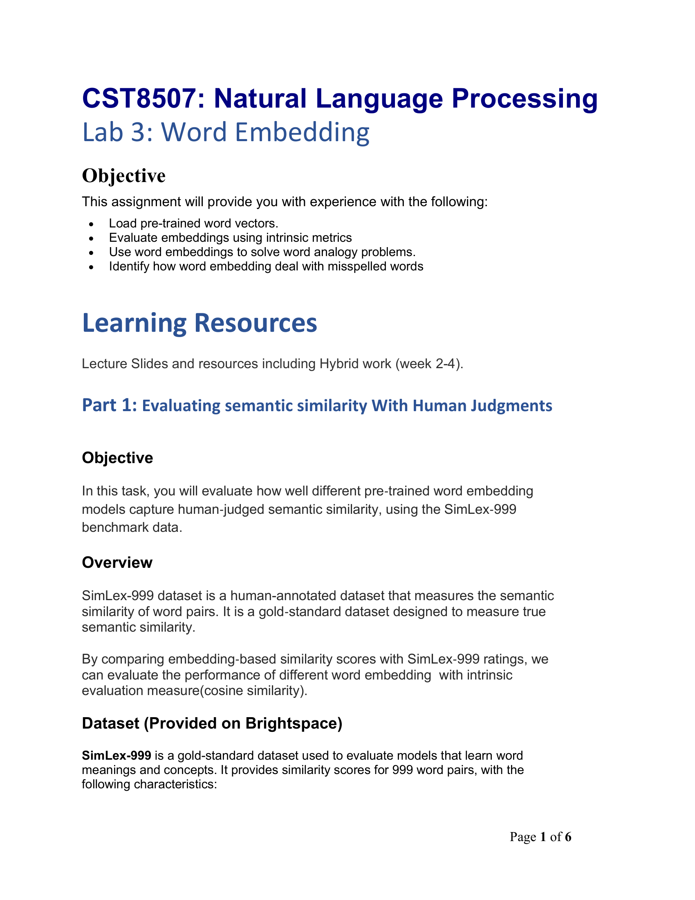
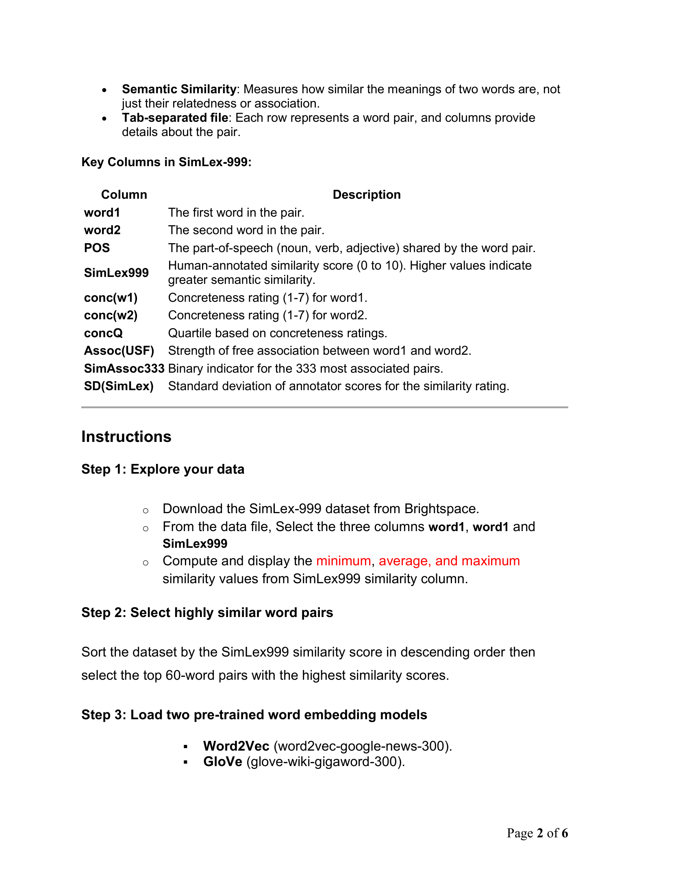
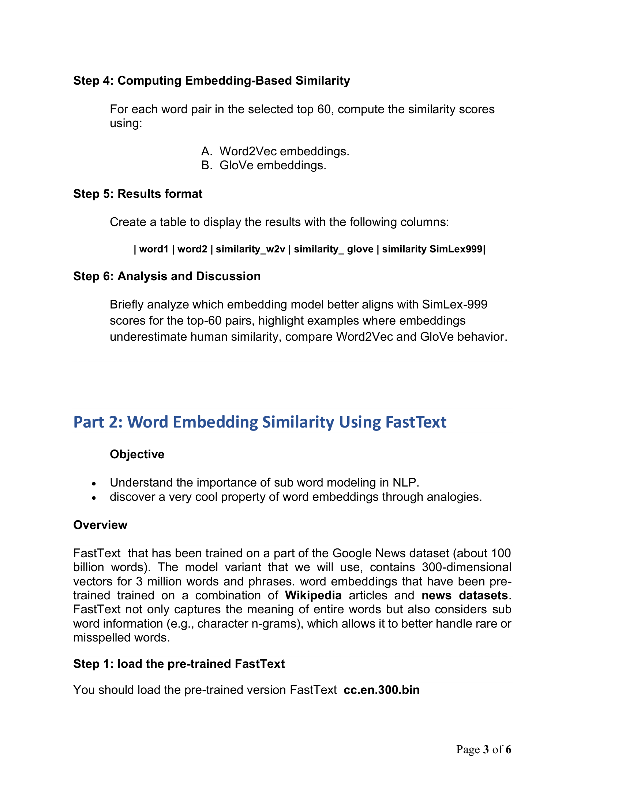
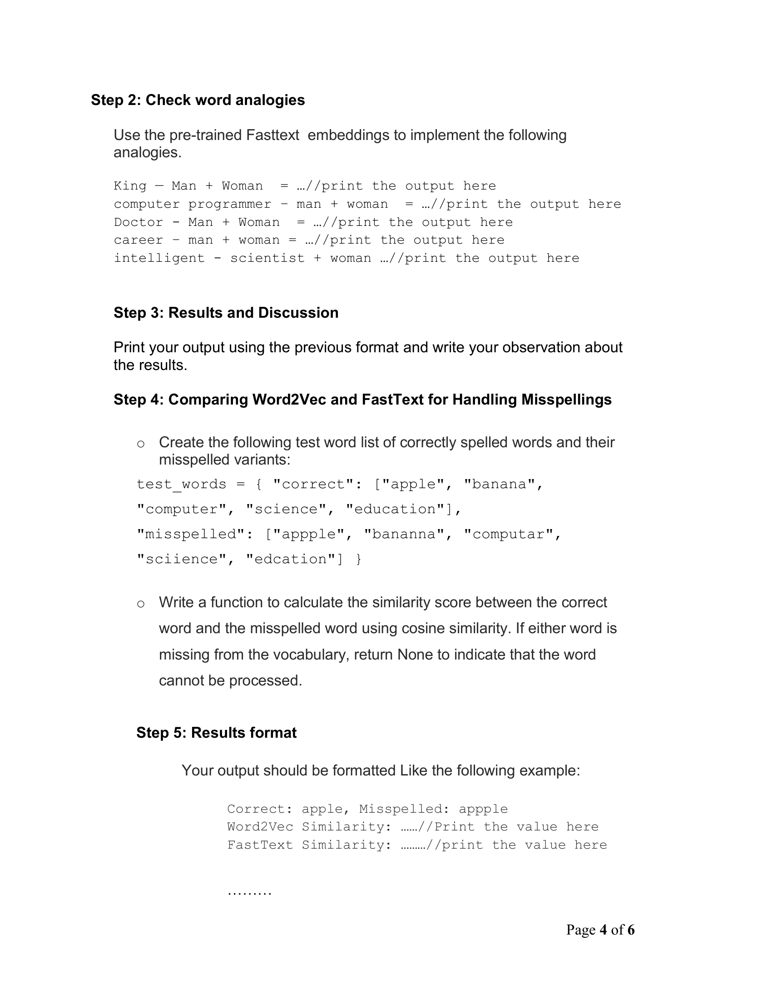
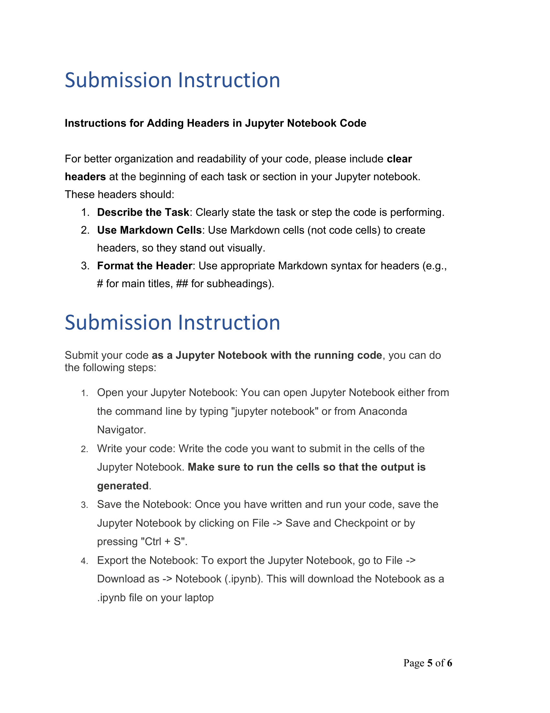
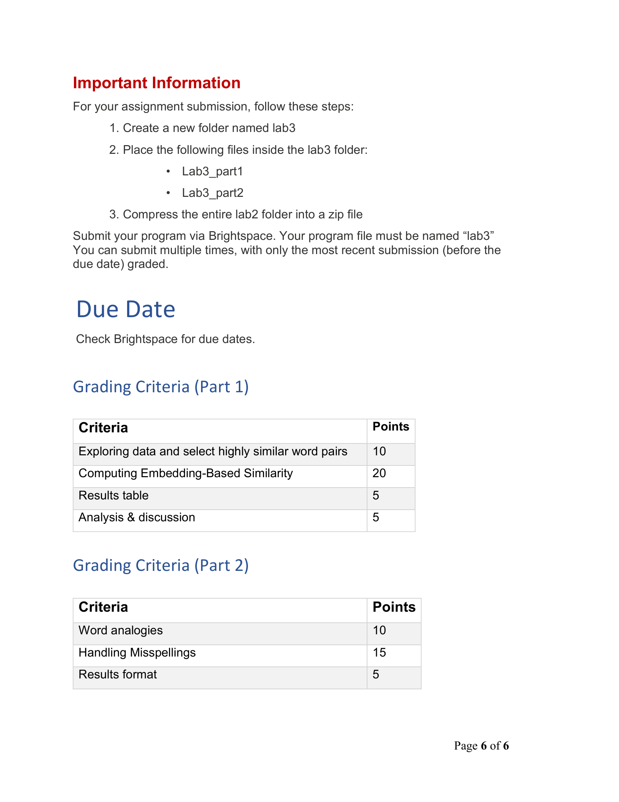

# CST8507 Lab 3 W26

**Source:** `CST8507 Lab 3_W26.pdf`  
**Total Pages:** 6  
**Format:** Hybrid (pdfplumber + PyMuPDF)

---

## Page 1



**CST8507: Natural Language Processing — CST8507：自然语言处理**

**Lab 3: Word Embedding — 实验 3：词嵌入**

**Objective — 目标**

- This assignment will provide you with experience with the following: — 本次实验将让你获得以下方面的经验：
- Load pre-trained word vectors. — 加载预训练词向量。
- Evaluate embeddings using intrinsic metrics — 使用内在评价指标评估词嵌入
- Use word embeddings to solve word analogy problems. — 使用词嵌入解决词类比问题。
- Identify how word embedding deal with misspelled words — 了解词嵌入如何处理拼写错误的词

**Learning Resources — 学习资源**

- Lecture Slides and resources including Hybrid work (week 2-4). — 课程幻灯片及资源，包括混合式学习内容（第 2-4 周）。

**Part 1: Evaluating semantic similarity With Human Judgments — 第一部分：基于人类判断评估语义相似度**

**Objective — 目标**

- In this task, you will evaluate how well different pre‑trained word embedding models capture human‑judged semantic similarity, using the SimLex‑999 benchmark data. — 在本任务中，你将使用 SimLex-999 基准数据评估不同预训练词嵌入模型对人类判断的语义相似度的捕捉能力。

**Overview — 概述**

- SimLex-999 dataset is a human-annotated dataset that measures the semantic similarity of word pairs. It is a gold‑standard dataset designed to measure true semantic similarity. — SimLex-999 数据集是一个人工标注的数据集，用于衡量词对的语义相似度。它是一个衡量真实语义相似度的黄金标准数据集。
- By comparing embedding‑based similarity scores with SimLex‑999 ratings, we can evaluate the performance of different word embedding with intrinsic evaluation measure(cosine similarity). — 通过将基于嵌入的相似度分数与 SimLex-999 评分进行比较，我们可以使用内在评价指标（余弦相似度）评估不同词嵌入的性能。

**Dataset (Provided on Brightspace) — 数据集（在 Brightspace 上提供）**

- SimLex-999 is a gold-standard dataset used to evaluate models that learn word meanings and concepts. It provides similarity scores for 999 word pairs, with the following characteristics: — SimLex-999 是一个用于评估学习词义和概念的模型的黄金标准数据集。它为 999 个词对提供相似度评分，具有以下特征：

---

## Page 2



- Semantic Similarity: Measures how similar the meanings of two words are, not just their relatedness or association. — 语义相似度：衡量两个词含义的相似程度，而非仅仅是它们的相关性或关联性。
- Tab-separated file: Each row represents a word pair, and columns provide details about the pair. — 制表符分隔文件：每一行代表一个词对，各列提供词对的详细信息。

**Key Columns in SimLex-999: — SimLex-999 关键列：**

| Column — 列名 | Description — 描述 |
|---|---|
| word1 | The first word in the pair. — 词对中的第一个词。 |
| word2 | The second word in the pair. — 词对中的第二个词。 |
| POS | The part-of-speech (noun, verb, adjective) shared by the word pair. — 词对共有的词性（名词、动词、形容词）。 |
| SimLex999 | Human-annotated similarity score (0 to 10). Higher values indicate greater semantic similarity. — 人工标注的相似度分数（0 到 10）。值越高表示语义相似度越大。 |
| conc(w1) | Concreteness rating (1-7) for word1. — word1 的具体性评分（1-7）。 |
| conc(w2) | Concreteness rating (1-7) for word2. — word2 的具体性评分（1-7）。 |
| concQ | Quartile based on concreteness ratings. — 基于具体性评分的四分位数。 |
| Assoc(USF) | Strength of free association between word1 and word2. — word1 和 word2 之间的自由联想强度。 |
| SimAssoc333 | Binary indicator for the 333 most associated pairs. — 333 个最相关词对的二元指示符。 |
| SD(SimLex) | Standard deviation of annotator scores for the similarity rating. — 标注者相似度评分的标准差。 |

**Instructions — 操作步骤**

**Step 1: Explore your data — 步骤 1：探索你的数据**

- Download the SimLex-999 dataset from Brightspace. — 从 Brightspace 下载 SimLex-999 数据集。
- From the data file, Select the three columns word1, word2 and SimLex999 — 从数据文件中，选择 word1、word2 和 SimLex999 三列
- Compute and display the minimum, average, and maximum similarity values from SimLex999 similarity column. — 计算并显示 SimLex999 相似度列的最小值、平均值和最大值。

**Step 2: Select highly similar word pairs — 步骤 2：选择高相似度词对**

- Sort the dataset by the SimLex999 similarity score in descending order then select the top 60-word pairs with the highest similarity scores. — 按 SimLex999 相似度分数降序排列数据集，然后选择相似度最高的前 60 个词对。

**Step 3: Load two pre-trained word embedding models — 步骤 3：加载两个预训练词嵌入模型**

- Word2Vec (word2vec-google-news-300). — Word2Vec（word2vec-google-news-300）。
- GloVe (glove-wiki-gigaword-300). — GloVe（glove-wiki-gigaword-300）。

---

## Page 3



**Step 4: Computing Embedding-Based Similarity — 步骤 4：计算基于嵌入的相似度**

- For each word pair in the selected top 60, compute the similarity scores using: — 对选出的前 60 个词对，分别使用以下方法计算相似度分数：
  - A. Word2Vec embeddings. — A. Word2Vec 嵌入。
  - B. GloVe embeddings. — B. GloVe 嵌入。

**Step 5: Results format — 步骤 5：结果格式**

- Create a table to display the results with the following columns: — 创建一个表格显示结果，包含以下列：
  - `| word1 | word2 | similarity_w2v | similarity_glove | similarity SimLex999 |`

**Step 6: Analysis and Discussion — 步骤 6：分析与讨论**

- Briefly analyze which embedding model better aligns with SimLex-999 scores for the top-60 pairs, highlight examples where embeddings underestimate human similarity, compare Word2Vec and GloVe behavior. — 简要分析哪个嵌入模型与前 60 个词对的 SimLex-999 分数更一致，突出嵌入低估人类相似度的示例，比较 Word2Vec 和 GloVe 的行为。

---

**Part 2: Word Embedding Similarity Using FastText — 第二部分：使用 FastText 的词嵌入相似度**

**Objective — 目标**

- Understand the importance of sub word modeling in NLP. — 理解子词建模在 NLP 中的重要性。
- discover a very cool property of word embeddings through analogies. — 通过类比发现词嵌入的一个非常酷的特性。

**Overview — 概述**

- FastText that has been trained on a part of the Google News dataset (about 100 billion words). The model variant that we will use, contains 300-dimensional vectors for 3 million words and phrases. word embeddings that have been pre-trained trained on a combination of Wikipedia articles and news datasets. — FastText 在 Google News 数据集的一部分（约 1000 亿词）上进行了训练。我们将使用的模型变体包含 300 万个词和短语的 300 维向量。词嵌入在 Wikipedia 文章和新闻数据集的组合上进行了预训练。
- FastText not only captures the meaning of entire words but also considers sub word information (e.g., character n-grams), which allows it to better handle rare or misspelled words. — FastText 不仅捕捉整个词的含义，还考虑子词信息（例如字符 n-gram），这使得它能够更好地处理稀有词或拼写错误的词。

**Step 1: load the pre-trained FastText — 步骤 1：加载预训练 FastText**

- You should load the pre-trained version FastText cc.en.300.bin — 你应该加载预训练版本 FastText cc.en.300.bin

---

## Page 4



**Step 2: Check word analogies — 步骤 2：检查词类比**

- Use the pre-trained Fasttext embeddings to implement the following analogies. — 使用预训练的 FastText 嵌入实现以下类比。
  - King — Man + Woman = … — 国王 - 男人 + 女人 = …
  - computer programmer – man + woman = … — 电脑程序员 - 男人 + 女人 = …
  - Doctor - Man + Woman = … — 医生 - 男人 + 女人 = …
  - career – man + woman = … — 职业 - 男人 + 女人 = …
  - intelligent - scientist + woman … — 聪明 - 科学家 + 女人 …

**Step 3: Results and Discussion — 步骤 3：结果与讨论**

- Print your output using the previous format and write your observation about the results. — 使用前面的格式打印输出，并写下你对结果的观察。

**Step 4: Comparing Word2Vec and FastText for Handling Misspellings — 步骤 4：比较 Word2Vec 和 FastText 处理拼写错误**

- Create the following test word list of correctly spelled words and their misspelled variants: — 创建以下测试词列表，包含正确拼写的词及其拼写错误的变体：

```python
test_words = {
    "correct": ["apple", "banana", "computer", "science", "education"],
    "misspelled": ["appple", "bananna", "computar", "sciience", "edcation"]
}
```

- Write a function to calculate the similarity score between the correct word and the misspelled word using cosine similarity. If either word is missing from the vocabulary, return None to indicate that the word cannot be processed. — 编写一个函数，使用余弦相似度计算正确词和拼写错误词之间的相似度分数。如果任一词不在词汇表中，返回 None 以表示该词无法处理。

**Step 5: Results format — 步骤 5：结果格式**

- Your output should be formatted Like the following example: — 你的输出应按以下示例格式化：

```
Correct: apple, Misspelled: appple
Word2Vec Similarity: ……
FastText Similarity: ………
```

---

## Page 5



**Submission Instruction — 提交说明**

**Instructions for Adding Headers in Jupyter Notebook Code — 在 Jupyter Notebook 代码中添加标题的说明**

- For better organization and readability of your code, please include clear headers at the beginning of each task or section in your Jupyter notebook. These headers should: — 为了更好地组织和提高代码的可读性，请在 Jupyter notebook 中每个任务或部分的开头添加清晰的标题。这些标题应：
  1. Describe the Task: Clearly state the task or step the code is performing. — 描述任务：明确说明代码正在执行的任务或步骤。
  2. Use Markdown Cells: Use Markdown cells (not code cells) to create headers, so they stand out visually. — 使用 Markdown 单元格：使用 Markdown 单元格（而非代码单元格）来创建标题，使其在视觉上突出。
  3. Format the Header: Use appropriate Markdown syntax for headers (e.g., # for main titles, ## for subheadings). — 格式化标题：使用适当的 Markdown 语法作为标题（例如 # 用于主标题，## 用于副标题）。

- Submit your code as a Jupyter Notebook with the running code, you can do the following steps: — 以运行过的 Jupyter Notebook 提交代码，你可以执行以下步骤：
  1. Open your Jupyter Notebook: You can open Jupyter Notebook either from the command line by typing "jupyter notebook" or from Anaconda Navigator. — 打开你的 Jupyter Notebook：可以通过命令行输入 "jupyter notebook" 或从 Anaconda Navigator 打开。
  2. Write your code: Write the code you want to submit in the cells of the Jupyter Notebook. Make sure to run the cells so that the output is generated. — 编写代码：在 Jupyter Notebook 的单元格中编写你要提交的代码。确保运行单元格以生成输出。
  3. Save the Notebook: Once you have written and run your code, save the Jupyter Notebook by clicking on File -> Save and Checkpoint or by pressing "Ctrl + S". — 保存 Notebook：编写并运行代码后，点击 File -> Save and Checkpoint 或按 "Ctrl + S" 保存。
  4. Export the Notebook: To export the Jupyter Notebook, go to File -> Download as -> Notebook (.ipynb). This will download the Notebook as a .ipynb file on your laptop — 导出 Notebook：要导出 Jupyter Notebook，前往 File -> Download as -> Notebook (.ipynb)。这将在你的电脑上下载 .ipynb 文件。

---

## Page 6



**Important Information — 重要信息**

- For your assignment submission, follow these steps: — 提交作业时，请按以下步骤操作：
  1. Create a new folder named lab3 — 创建一个名为 lab3 的新文件夹
  2. Place the following files inside the lab3 folder: Lab3_part1, Lab3_part2 — 将以下文件放入 lab3 文件夹：Lab3_part1、Lab3_part2
  3. Compress the entire lab3 folder into a zip file — 将整个 lab3 文件夹压缩为 zip 文件
- Submit your program via Brightspace. Your program file must be named "lab3" — 通过 Brightspace 提交你的程序。程序文件必须命名为 "lab3"
- You can submit multiple times, with only the most recent submission (before the due date) graded. — 你可以多次提交，只有最近一次提交（截止日期前）会被评分。

**Due Date — 截止日期**

- Check Brightspace for due dates. — 请在 Brightspace 上查看截止日期。

**Grading Criteria (Part 1) — 评分标准（第一部分）**

| Criteria — 评分项 | Points — 分值 |
|---|---|
| Exploring data and select highly similar word pairs — 探索数据并选择高相似度词对 | 10 |
| Computing Embedding-Based Similarity — 计算基于嵌入的相似度 | 20 |
| Results table — 结果表格 | - |
| Analysis & discussion — 分析与讨论 | - |

**Grading Criteria (Part 2) — 评分标准（第二部分）**

| Criteria — 评分项 | Points — 分值 |
|---|---|
| Word analogies — 词类比 | 10 |
| Handling Misspellings — 处理拼写错误 | 15 |
| Results format — 结果格式 | - |
