# Week 13: LLM 压缩与提示工程 (LLM Compression & Prompt Engineering)

> Source: `Week 13_W2026_last .pdf`
> Total slides: 55
> Instructor: Hala Own, Ph.D.

---

## 1. 课程概览与期末考试 (Course Overview & Final Exam)

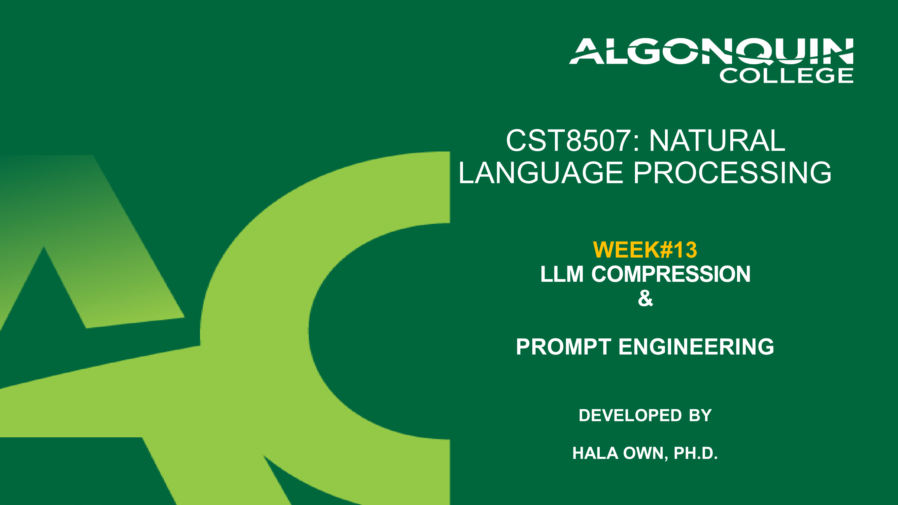

**CST8507: Natural Language Processing — Week #13 — 自然语言处理 第13周**

- LLM Compression & Prompt Engineering — LLM 压缩与提示工程

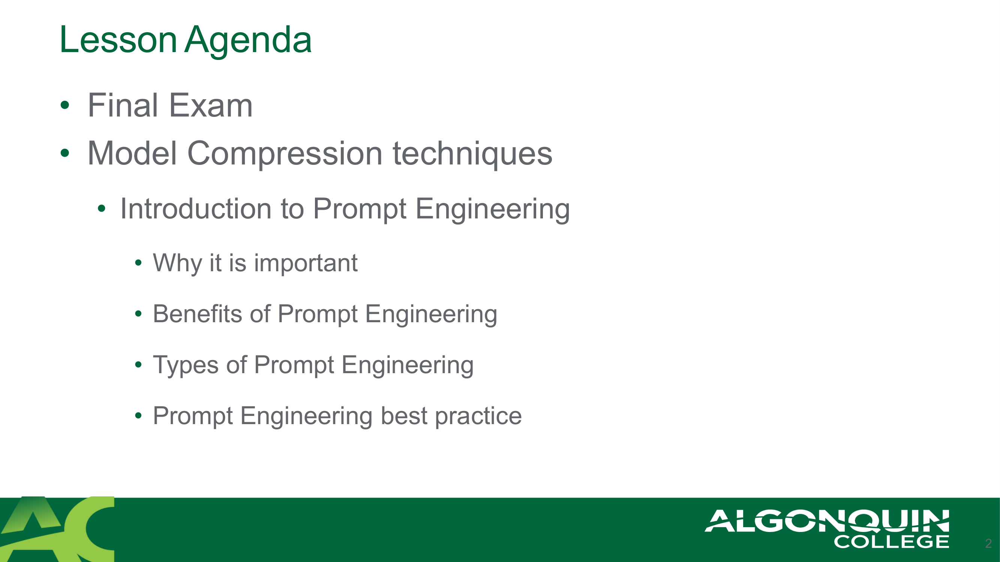

**Lesson Agenda — 课程议程**

- Final Exam — 期末考试
- Model Compression techniques — 模型压缩技术
- Introduction to Prompt Engineering — 提示工程简介
- Why it is important — 为什么重要
- Benefits of Prompt Engineering — 提示工程的好处
- Types of Prompt Engineering — 提示工程的类型
- Prompt Engineering best practice — 提示工程最佳实践

### 1.1 期末考试信息 (Final Exam Information)


**Final Exam — 期末考试**

- Final test duration is **120 minutes** — 期末考试时长 **120 分钟**
- **When:** Monday 20th April 2026 — **时间：** 2026年4月20日 星期一
- **Start:** 12:30 pm — **开始：** 下午 12:30
- **Where:** WB 384A — **地点：** WB 384A
- Closed book exam (one-page, double-sided allowed; please make sure to leave a 5 cm × 5 cm space in the top-left corner of each side of your cheat sheet for the proctor's signature) — 闭卷考试（允许携带一页双面小抄；请在小抄每面的左上角预留 5cm × 5cm 空间用于监考签名）
- **40 questions** – MC and True/False (1 point each) — **40 道题** — 选择题和判断题（每题 1 分）
- **6 questions** – answers (5 points each) — **6 道题** — 简答题（每题 5 分）


**Final Exam Marks — 期末考试成绩**

- Final exam marks will **not** be posted on Brightspace — 期末考试成绩**不会**发布在 Brightspace 上
- Final letter grades will be available on **ACSIS** once they have been approved by the Chair — 最终字母等级将在系主任批准后在 **ACSIS** 上公布
- After this approval, your final exam mark will be released on Brightspace — 批准后，期末考试成绩将在 Brightspace 上发布

### 1.2 备考方法 (How to Prepare)

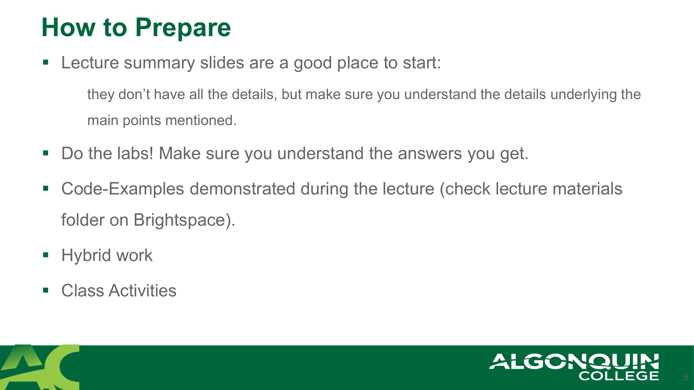

**How to Prepare — 如何备考**

- Lecture summary slides are a good place to start: they don't have all the details, but make sure you understand the details underlying the main points mentioned — 讲义摘要幻灯片是好的起点：虽然不包含所有细节，但要确保理解主要观点背后的细节
- **Do the labs!** Make sure you understand the answers you get — **做实验！** 确保你理解得到的答案
- Code-Examples demonstrated during the lecture (check lecture materials folder on Brightspace) — 课堂演示的代码示例（查看 Brightspace 上的讲义材料文件夹）
- Hybrid work — 混合作业
- Class Activities — 课堂活动

---

## 2. 大型语言模型对比 (Comparison of Popular Large Language Models)


**Comparison of Popular Large Language Models — 流行大型语言模型对比**

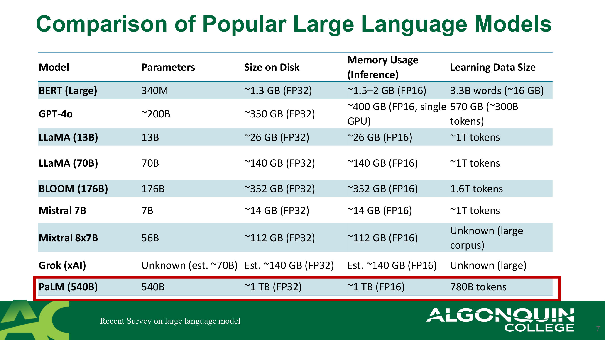

**Comparison of Popular Large Language Models — 流行大型语言模型对比（详细数据）**

| Model — 模型 | Parameters — 参数量 | Size on Disk — 磁盘大小 | Memory Usage (Inference) — 推理内存 | Learning Data Size — 训练数据量 |
|-------|-----------|-------------|--------------------------|-------------------|
| BERT (Large) | 340M | ~1.3 GB (FP32) | ~1.5–2 GB (FP16) | 3.3B words (~16 GB) |
| GPT-4o | ~200B | ~350 GB (FP32) | ~400 GB (FP16, single GPU) | 570 GB (~300B tokens) |
| LLaMA (13B) | 13B | ~26 GB (FP32) | ~26 GB (FP16) | ~1T tokens |
| LLaMA (70B) | 70B | ~140 GB (FP32) | ~140 GB (FP16) | ~1T tokens |
| BLOOM (176B) | 176B | ~352 GB (FP32) | ~352 GB (FP16) | 1.6T tokens |
| Mistral 7B | 7B | ~14 GB (FP32) | ~14 GB (FP16) | ~1T tokens |
| Mixtral 8x7B | 56B | ~112 GB (FP32) | ~112 GB (FP16) | Unknown (large corpus) — 未知（大规模语料） |
| Grok (xAI) | Unknown (est. ~70B) — 未知（估计约70B） | Est. ~140 GB (FP32) | Est. ~140 GB (FP16) | Unknown (large) — 未知(大规模) |
| PaLM (540B) | 540B | ~1 TB (FP32) | ~1 TB (FP16) | 780B tokens |

Ref: Recent Survey on large language model — 参考：大型语言模型近期综述

---

## 3. 模型压缩动机 (Motivation for Model Compression)

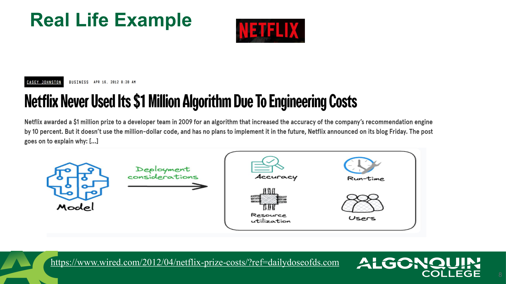

**Real Life Example — 真实案例**

Ref: https://www.wired.com/2012/04/netflix-prize-costs/?ref=dailydoseofds.com

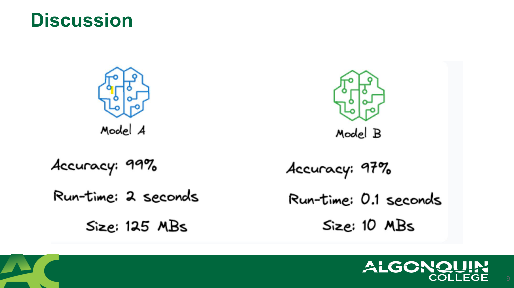

**Discussion — 讨论**

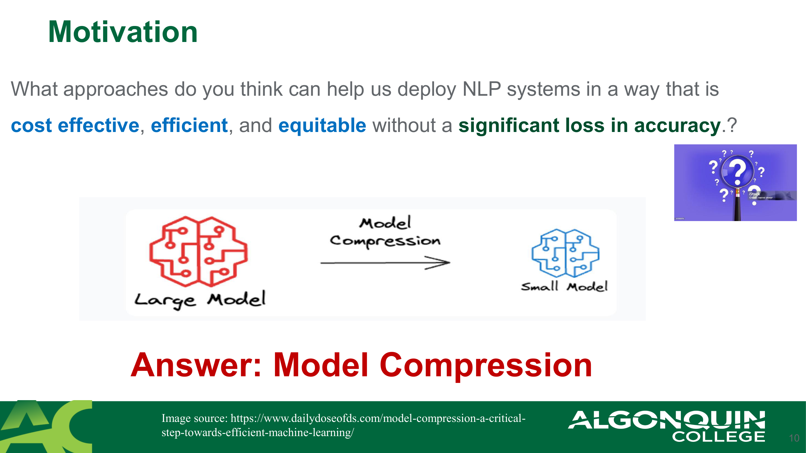

**Motivation — 动机**

- What approaches do you think can help us deploy NLP systems in a way that is cost effective, efficient, and equitable without a significant loss in accuracy? — 你认为哪些方法可以帮助我们以低成本、高效率和公平的方式部署 NLP 系统，同时不会显著损失准确性？
- **Answer: Model Compression** — **答案：模型压缩**

Ref: https://www.dailydoseofds.com/model-compression-a-critical-step-towards-efficient-machine-learning/

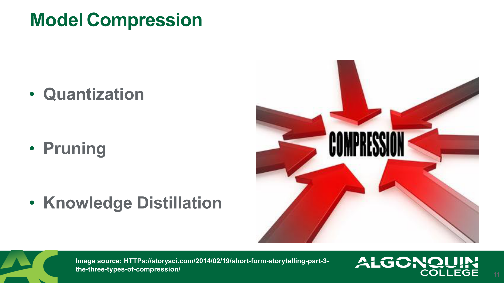

**Model Compression — 模型压缩**

Three main techniques — 三种主要技术：

- **Quantization** — **量化**
- **Pruning** — **剪枝**
- **Knowledge Distillation** — **知识蒸馏**

---

## 4. 量化 (Quantization)

### 4.1 浮点数表示 (Floating Point Representation)


**QUANTIZATION — 量化**

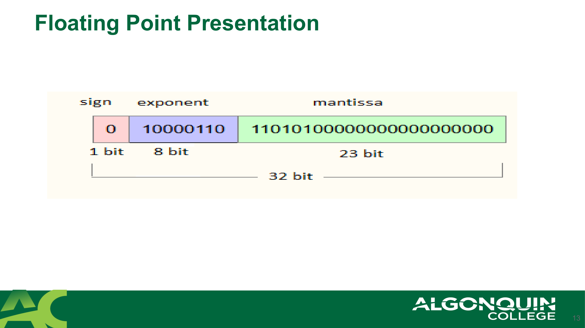

**Floating Point Presentation — 浮点数表示**

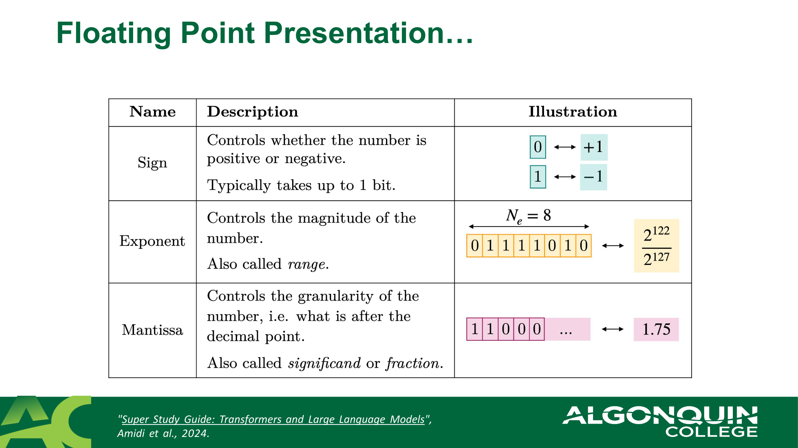

**Floating Point Presentation… — 浮点数表示（续）**

- Source: "Super Study Guide: Transformers and Large Language Models", Amidi et al., 2024. — 来源："Transformers 与大型语言模型超级学习指南"，Amidi 等，2024。

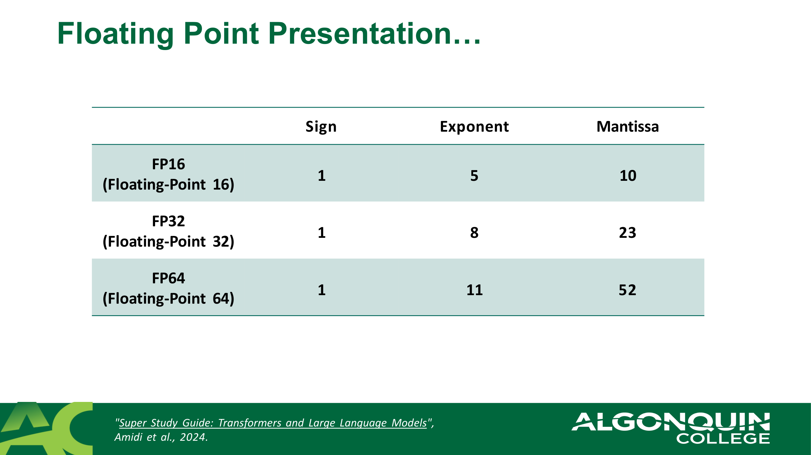

**Floating Point Presentation… — 浮点数表示（精度对比）**

| Format — 格式 | Sign — 符号位 | Exponent — 指数位 | Mantissa — 尾数位 |
|--------|------|----------|----------|
| FP16 (Floating-Point 16) — 半精度浮点 | 1 | 5 | 10 |
| FP32 (Floating-Point 32) — 单精度浮点 | 1 | 8 | 23 |
| FP64 (Floating-Point 64) — 双精度浮点 | 1 | 11 | 52 |

Source: "Super Study Guide: Transformers and Large Language Models", Amidi et al., 2024.

### 4.2 数值精度与量化原理 (Precision of Numbers & Quantization Principle)

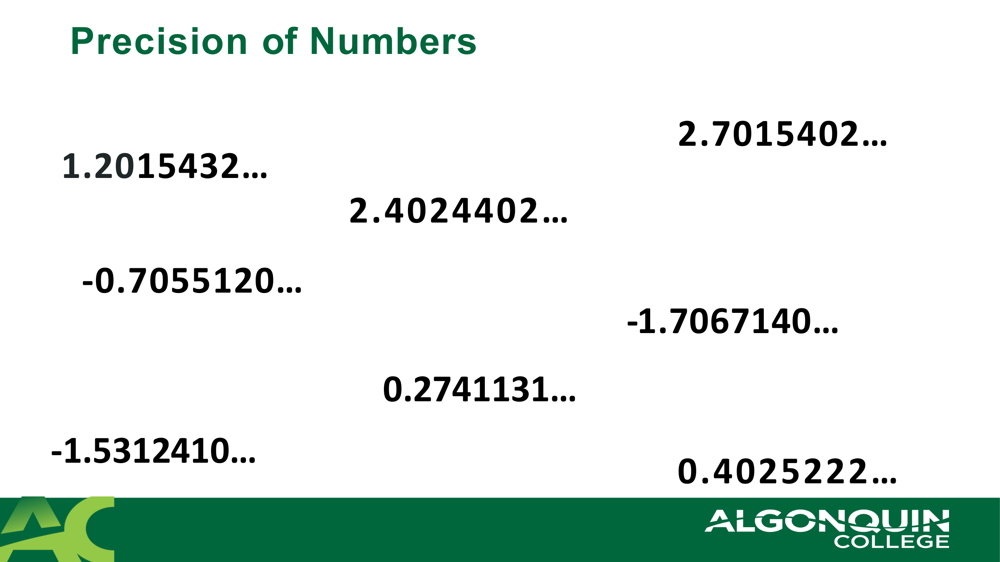

**Precision of Numbers — 数值精度**

- Full precision values demonstration — 全精度数值演示

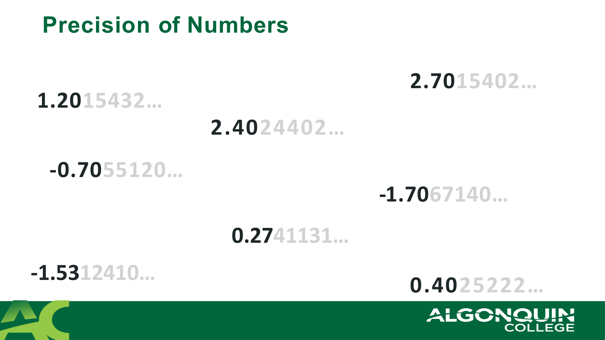

**Precision of Numbers — 数值精度（量化后对比）**

- Demonstrates effect of reducing number precision — 展示降低数值精度的效果

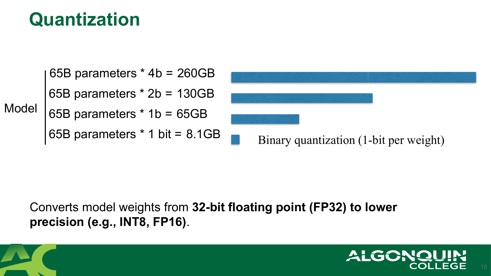

**Quantization — 量化（减小模型体积）**

- 65B parameters × 4 bytes = **260 GB** — 65B 参数 × 4 字节 = **260 GB**
- 65B parameters × 2 bytes = **130 GB** — 65B 参数 × 2 字节 = **130 GB**
- 65B parameters × 1 byte = **65 GB** — 65B 参数 × 1 字节 = **65 GB**
- 65B parameters × 1 bit = **8.1 GB** (Binary quantization) — 65B 参数 × 1 位 = **8.1 GB**（二值量化）
- Converts model weights from **32-bit floating point (FP32)** to lower precision (e.g., **INT8, FP16**) — 将模型权重从 **32位浮点（FP32）** 转换为低精度（如 **INT8, FP16**）

### 4.3 量化性能与代码示例 (Quantization Performance & Code Example)

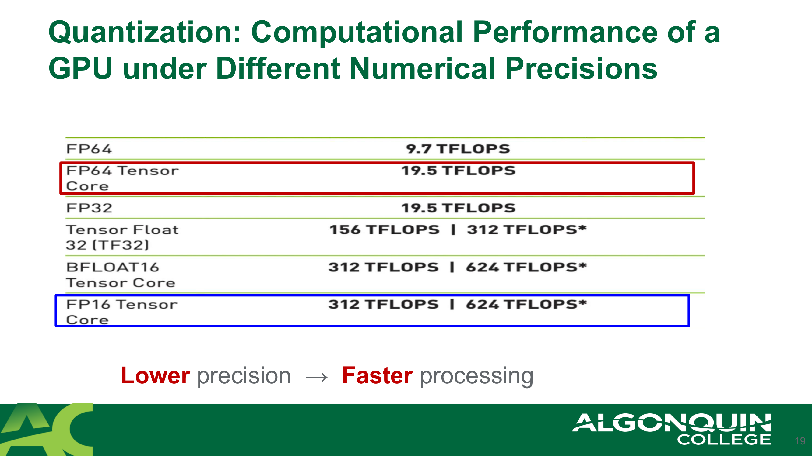

**Quantization: Computational Performance of a GPU under Different Numerical Precisions — 量化：GPU 在不同数值精度下的计算性能**

- Lower precision → Faster processing — 精度越低 → 处理速度越快

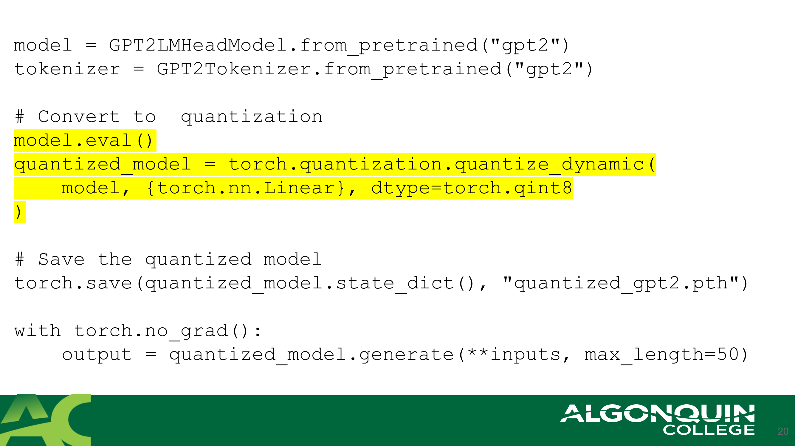

**Code Example — 代码示例（GPT-2 动态量化）：**

```python
model = GPT2LMHeadModel.from_pretrained("gpt2")
tokenizer = GPT2Tokenizer.from_pretrained("gpt2")

# Convert to quantization / 转换为量化模型
model.eval()
quantized_model = torch.quantization.quantize_dynamic(
    model, {torch.nn.Linear}, dtype=torch.qint8
)

# Save the quantized model / 保存量化模型
torch.save(quantized_model.state_dict(), "quantized_gpt2.pth")

with torch.no_grad():
    output = quantized_model.generate(**inputs, max_length=50)
```

### 4.4 二值化神经网络 (Binarized Neural Networks)

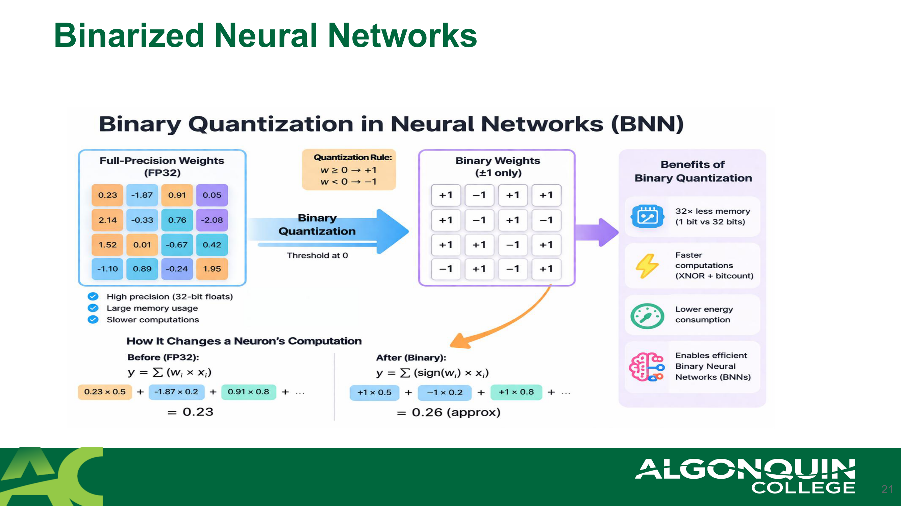

**Binarized Neural Networks — 二值化神经网络**

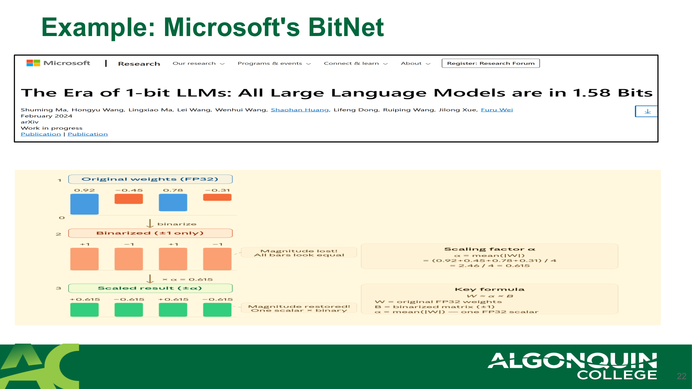

**Example: Microsoft's BitNet — 示例：微软的 BitNet**

- 1-bit weight quantization approach — 1-bit 权重量化方法

---

## 5. 知识蒸馏 (Knowledge Distillation)


**DISTILLATION — 蒸馏**

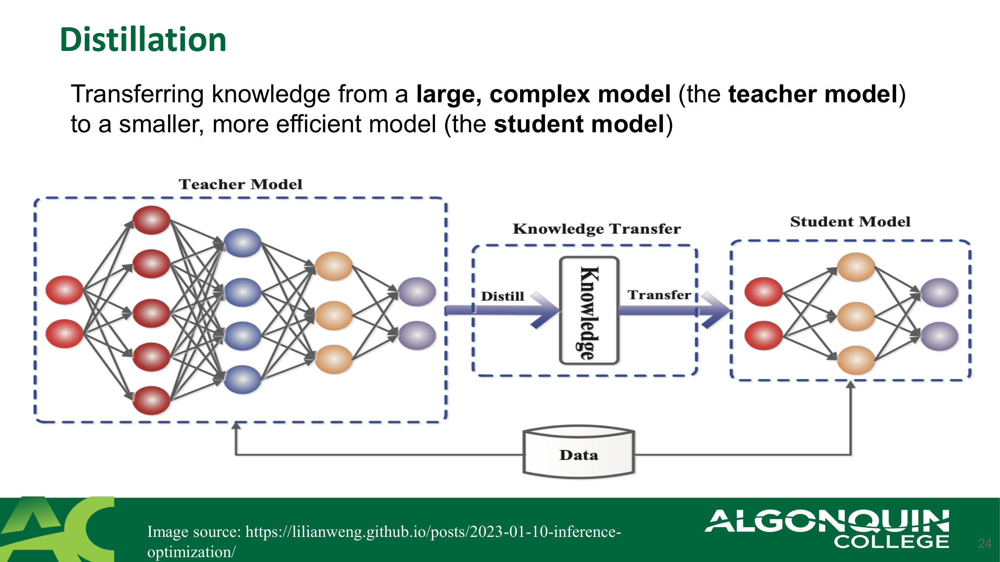

**Distillation — 知识蒸馏**

- Transferring knowledge from a large, complex model (the **teacher model**) to a smaller, more efficient model (the **student model**) — 将知识从大型复杂模型（**教师模型**）转移到更小、更高效的模型（**学生模型**）

Ref: https://lilianweng.github.io/posts/2023-01-10-inference-optimization/

### 5.1 蒸馏损失函数 (Distillation Loss Function)

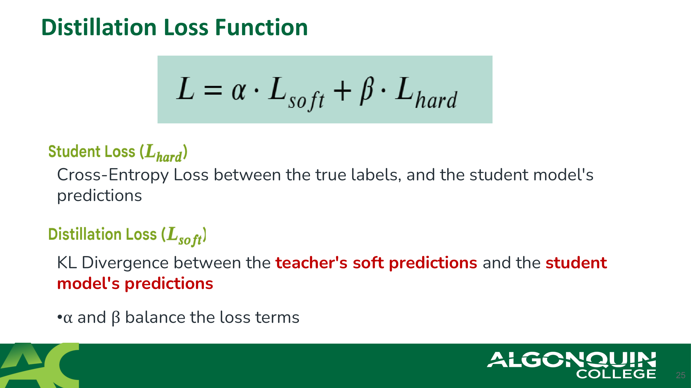

**Distillation Loss Function — 蒸馏损失函数**

- **Cross-Entropy Loss** between the true labels and the student model's predictions — 真实标签与学生模型预测之间的**交叉熵损失**
- **KL Divergence** between the teacher's soft predictions and the student model's predictions — 教师的软预测与学生模型预测之间的 **KL 散度**
- **α** and **β** balance the loss terms — **α** 和 **β** 平衡损失项

### 5.2 蒸馏模型示例 (Examples of Distilled Models)

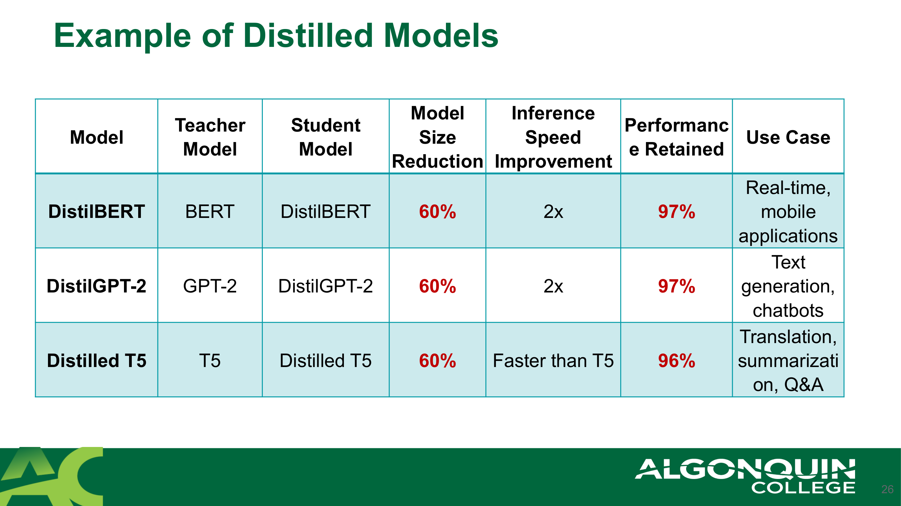

**Example of Distilled Models — 蒸馏模型示例**

| Teacher Model — 教师模型 | Student Model — 学生模型 | Model Size Reduction — 模型缩小 | Inference Speed Improvement — 推理加速 | Performance Retained — 性能保留 | Use Case — 应用场景 |
|--------------|--------------|---------------------|---------------------------|---------------------|----------|
| BERT | DistilBERT | 60% | 2× | 97% | Real-time, mobile applications — 实时/移动应用 |
| GPT-2 | DistilGPT-2 | 60% | 2× | 97% | Text generation, chatbots — 文本生成、聊天机器人 |
| T5 | Distilled T5 | 60% | Faster than T5 — 比T5更快 | 96% | Translation, summarization, Q&A — 翻译、摘要、问答 |

---

## 6. 剪枝 (Pruning)


**PRUNING — 剪枝**

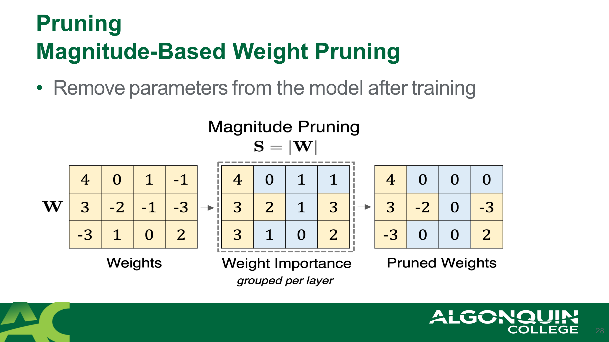

**Pruning — 剪枝**

- **Magnitude-Based Weight Pruning** — **基于幅值的权重剪枝**
- Remove parameters from the model **after training** — 在**训练后**移除模型参数

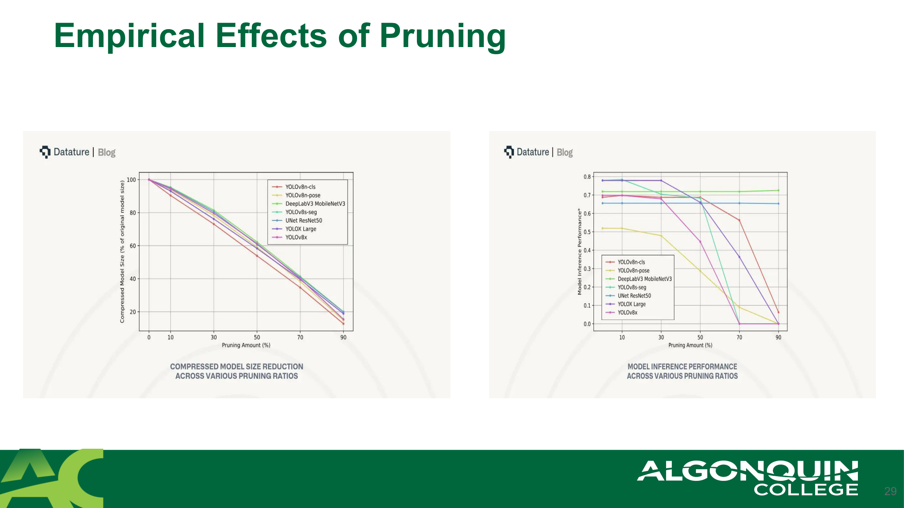

**Empirical Effects of Pruning — 剪枝的实证效果**

- Performance vs. pruning ratio visualization — 性能与剪枝比例关系的可视化

---

## 7. 三种压缩技术对比 (Distillation vs Quantization vs Pruning)

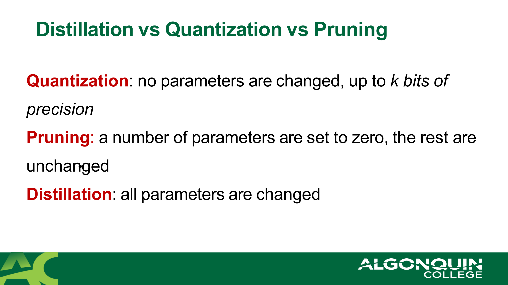

**Distillation vs Quantization vs Pruning — 蒸馏 vs 量化 vs 剪枝**

- **Quantization:** no parameters are changed, up to k bits of precision — **量化：** 不改变参数值，降低到 k 位精度
- **Pruning:** a number of parameters are set to zero, the rest are unchanged — **剪枝：** 部分参数置零，其余不变
- **Distillation:** all parameters are changed — **蒸馏：** 所有参数都改变

---

## 8. 迁移学习与微调 (Transfer Learning & Fine-Tuning)

### 8.1 迁移学习 vs 微调 (Transfer Learning vs Fine-Tuning LLMs)

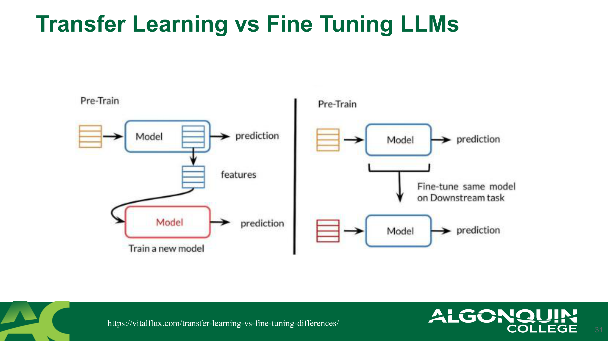

**Transfer Learning vs Fine Tuning LLMs — 迁移学习 vs 微调大型语言模型**

Ref: https://vitalflux.com/transfer-learning-vs-fine-tuning-differences/

### 8.2 监督微调 (Supervised Fine-Tuning)

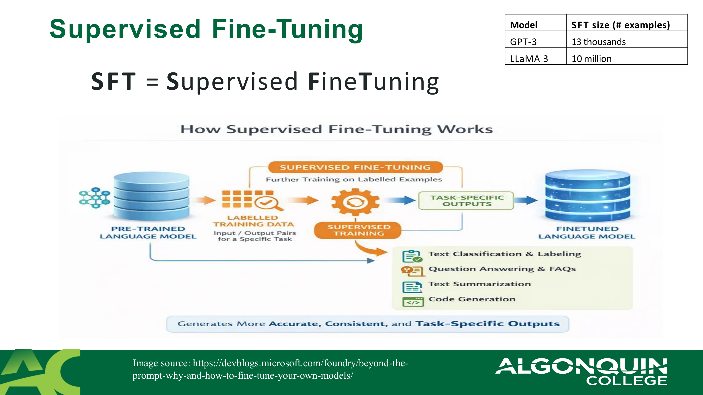

**Supervised Fine-Tuning — 监督微调**

| Model — 模型 | SFT size (# examples) — 监督微调数据量 |
|-------|----------------------|
| GPT-3 | 13 thousand — 1.3万 |
| LLaMA 3 | 10 million — 1000万 |

- **SFT** = Supervised Fine-Tuning — **SFT** = 监督微调

Ref: https://devblogs.microsoft.com/foundry/beyond-the-prompt-why-and-how-to-fine-tune-your-own-models/

### 8.3 微调面临的问题 (Problems with Fine-Tuning)

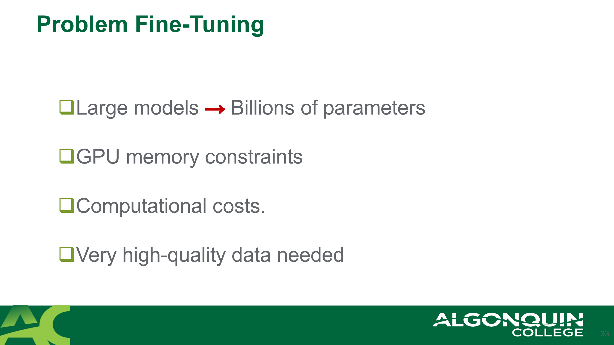

**Problem Fine-Tuning — 微调面临的问题**

- Large models → **Billions of parameters** — 大模型 → **数十亿参数**
- **GPU memory constraints** — **GPU 内存限制**
- **Computational costs** — **计算成本**
- **Very high-quality data needed** — **需要非常高质量的数据**

---

## 9. 参数高效微调 (Parameter-Efficient Fine-Tuning / PEFT)

### 9.1 PEFT 概述 (PEFT Overview)

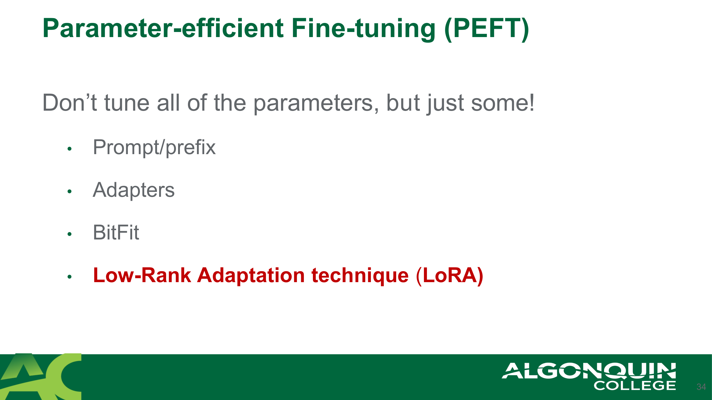

**Parameter-efficient Fine-tuning (PEFT) — 参数高效微调 (PEFT)**

- Don't tune all of the parameters, but just some! — 不调所有参数，只调一部分！
- **Prompt/prefix** — **提示/前缀调优**
- **Adapters** — **适配器**
- **BitFit** — **BitFit（仅调偏置项）**
- **Low-Rank Adaptation technique (LoRA)** — **低秩自适应技术 (LoRA)**

### 9.2 LoRA 原理 (What is LoRA)

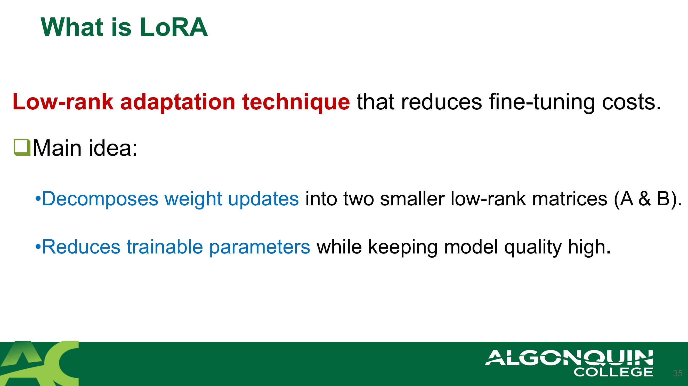

**What is LoRA — 什么是 LoRA**

- Low-rank adaptation technique that reduces fine-tuning costs — 低秩自适应技术，降低微调成本
- **Main idea:** — **核心思想：**
  - Decomposes weight updates into two smaller low-rank matrices (**A & B**) — 将权重更新分解为两个较小的低秩矩阵（**A 和 B**）
  - Reduces trainable parameters while keeping model quality high — 减少可训练参数同时保持模型质量

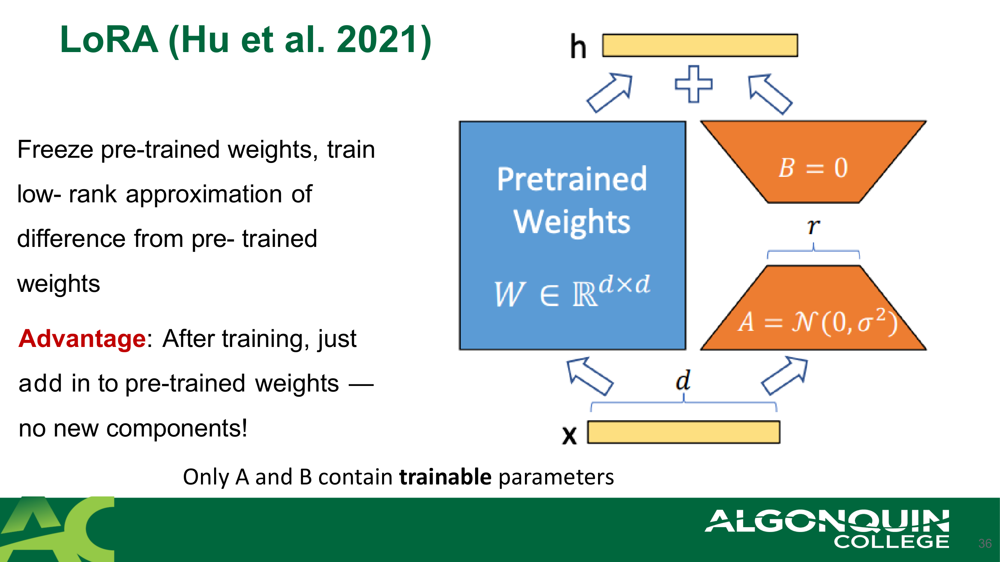

**LoRA (Hu et al. 2021) — LoRA（胡等人，2021）**

- Freeze pre-trained weights, train low-rank approximation of difference from pre-trained weights — 冻结预训练权重，训练与预训练权重差异的低秩近似
- **Advantage:** After training, just add in to pre-trained weights — no new components! — **优势：** 训练后直接加到预训练权重上——不需要新组件！
- Only **A** and **B** contain trainable parameters — 只有 **A** 和 **B** 包含可训练参数

### 9.3 LoRA 应用位置 (Where to Apply LoRA)

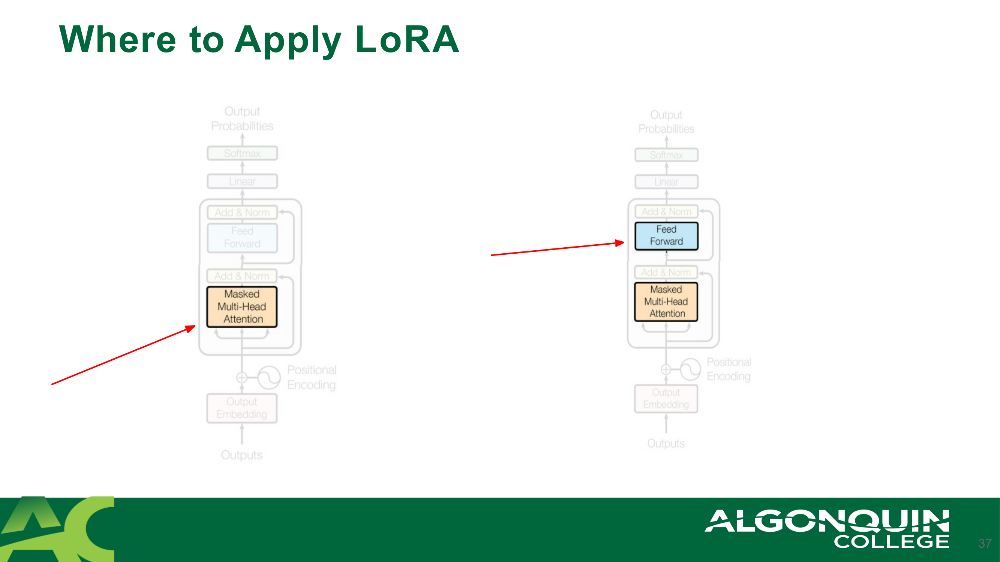

**Where to Apply LoRA — LoRA 应用于哪些位置**

- Typically applied to attention weight matrices (Wq, Wk, Wv, Wo) — 通常应用于注意力权重矩阵（Wq、Wk、Wv、Wo）

### 9.4 LoRA 实证发现 (Empirical Facts about LoRA)

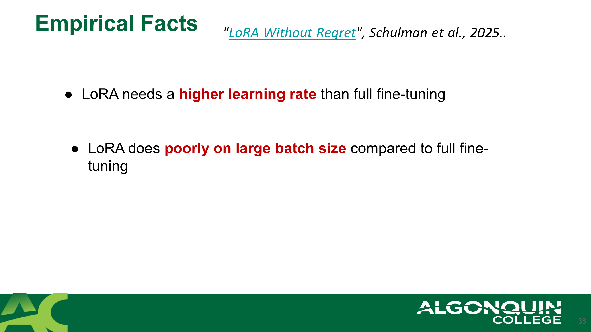

**Empirical Facts — 实证发现**

- Source: "LoRA Without Regret", Schulman et al., 2025. — 来源："无遗憾的LoRA"，Schulman 等，2025。
- LoRA needs a **higher learning rate** than full fine-tuning — LoRA 需要比全量微调**更高的学习率**
- LoRA does poorly on **large batch size** compared to full fine-tuning — LoRA 在**大批量** 下表现比全量微调差

### 9.5 QLoRA

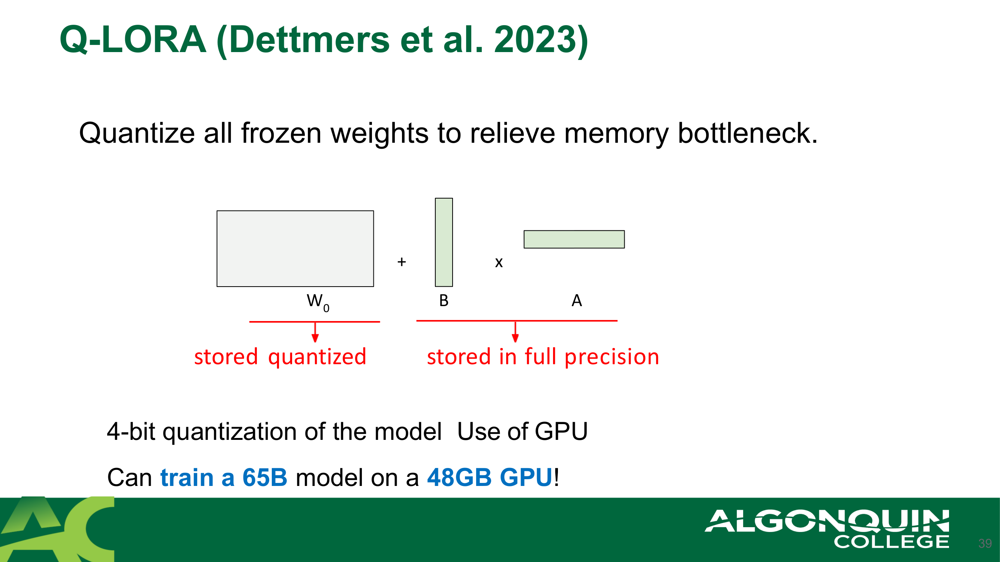

**Q-LoRA (Dettmers et al. 2023) — QLoRA（Dettmers 等，2023）**

- Quantize all frozen weights to relieve memory bottleneck — 量化所有冻结权重以缓解内存瓶颈
- **4-bit quantization** of the model + LoRA adapters in full precision — 模型使用 **4-bit 量化** + LoRA 适配器保持全精度
- Can train a **65B model on a 48GB GPU!** — 可以在 **48GB GPU 上训练 65B 模型！**

---

## 10. 提示工程 (Prompt Engineering)

### 10.1 什么是提示工程 (What is Prompt Engineering)


**PROMPT ENGINEERING — 提示工程**

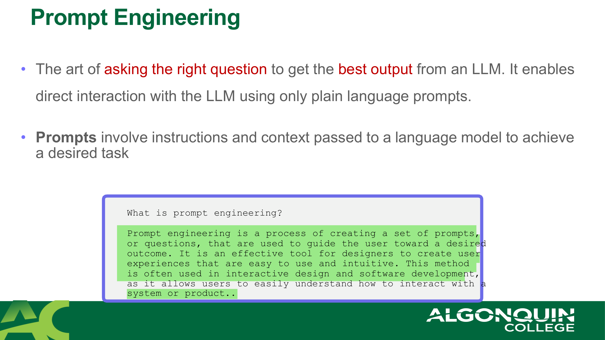

**Prompt Engineering — 提示工程**

- The art of asking the right question to get the best output from an LLM. It enables direct interaction with the LLM using only plain language prompts. — 提示工程是向 LLM 提出正确问题以获得最佳输出的艺术。它使用户仅通过自然语言提示就能直接与 LLM 交互。
- Prompts involve **instructions and context** passed to a language model to achieve a desired task — 提示包含传递给语言模型的**指令和上下文**，以实现期望的任务

### 10.2 提示的组成元素 (Elements of a Prompt)

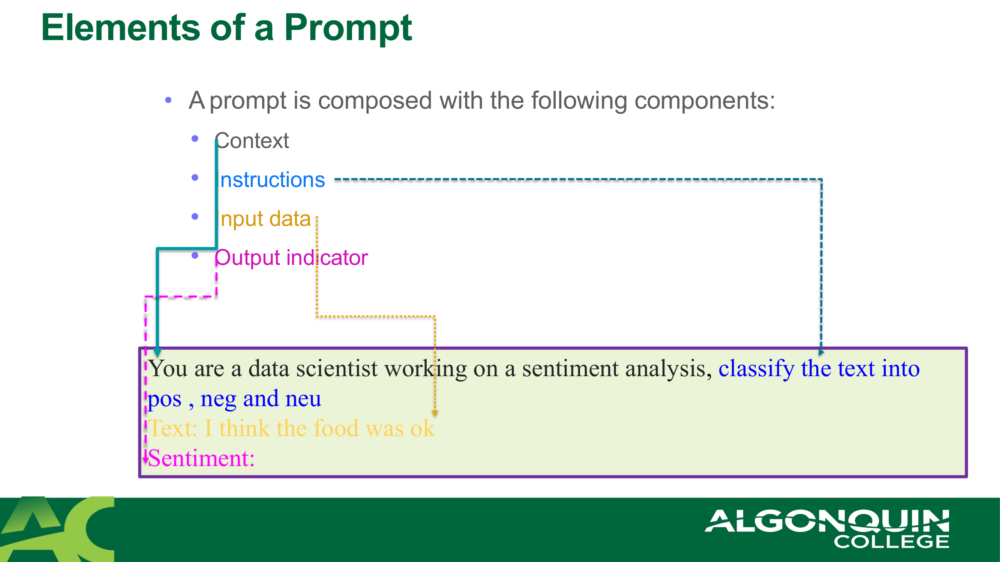

**Elements of a Prompt — 提示的组成元素**

A prompt is composed with the following components — 提示由以下组件构成：

1. **Context** — **上下文**
2. **Instructions** — **指令**
3. **Input data** — **输入数据**
4. **Output indicator** — **输出指示器**

**Example — 示例：**

> You are a data scientist working on a sentiment analysis, classify the text into pos, neg and neu — 你是一位数据科学家，正在做情感分析，将文本分类为 pos（正面）、neg（负面）和 neu（中性）
> Text: I think the food was ok — 文本：我觉得食物还行
> Sentiment: — 情感：

### 10.3 提示工程的好处 (Benefits of Prompt Engineering)

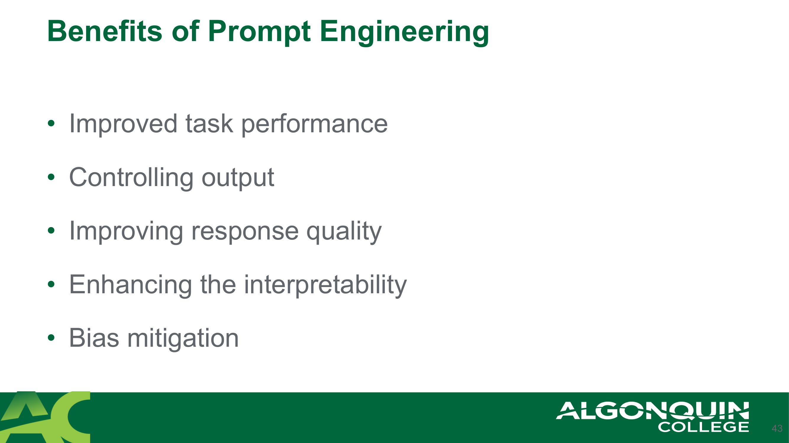

**Benefits of Prompt Engineering — 提示工程的好处**

- **Improved task performance** — **提升任务表现**
- **Controlling output** — **控制输出**
- **Improving response quality** — **提高响应质量**
- **Enhancing the interpretability** — **增强可解释性**
- **Bias mitigation** — **减轻偏见**

---

## 11. 提示工程技术 (Prompting Techniques)

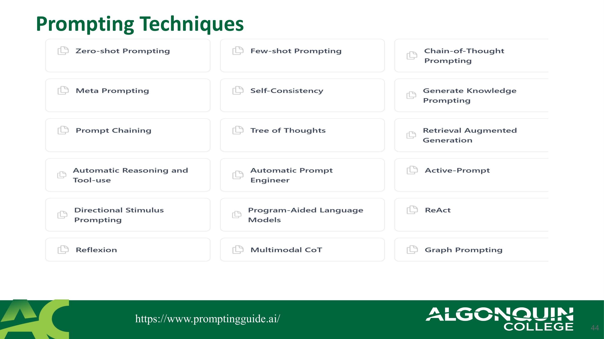

**Prompting Techniques — 提示技术**

Ref: https://www.promptingguide.ai/

### 11.1 常见提示类型 (Common Types of Prompt Engineering)

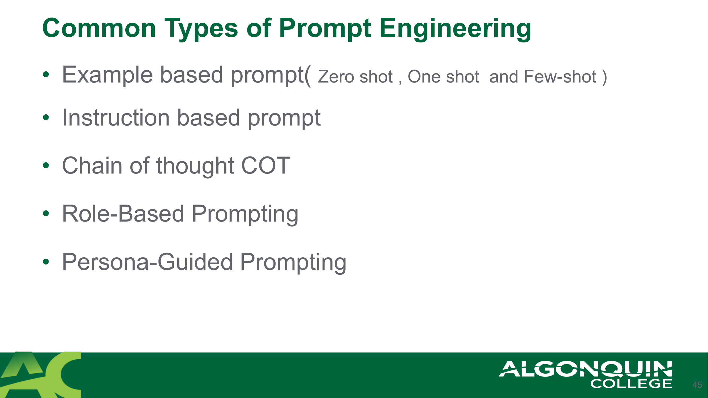

**Common Types of Prompt Engineering — 常见提示工程类型**

- **Example-based prompt** (Zero-shot, One-shot and Few-shot) — **基于示例的提示**（零样本、单样本和少样本）
- **Instruction-based prompt** — **基于指令的提示**
- **Chain of Thought (CoT)** — **思维链（CoT）**
- **Role-Based Prompting** — **基于角色的提示**
- **Persona-Guided Prompting** — **人格引导提示**

### 11.2 基于示例的提示 (Example-Based Prompt)

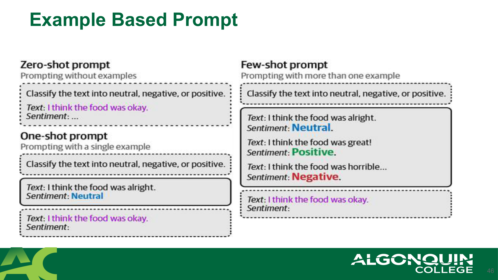

**Example Based Prompt — 基于示例的提示**

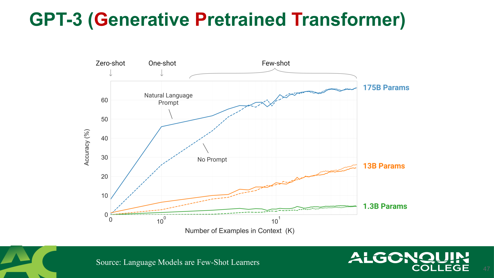

**GPT-3 (Generative Pretrained Transformer) — GPT-3（生成式预训练 Transformer）**

- Source: "Language Models are Few-Shot Learners" — 来源："语言模型是少样本学习者"
- Demonstrates zero-shot, one-shot, and few-shot learning paradigms — 展示零样本、单样本和少样本学习范式

### 11.3 思维链提示 (Chain of Thought / CoT)

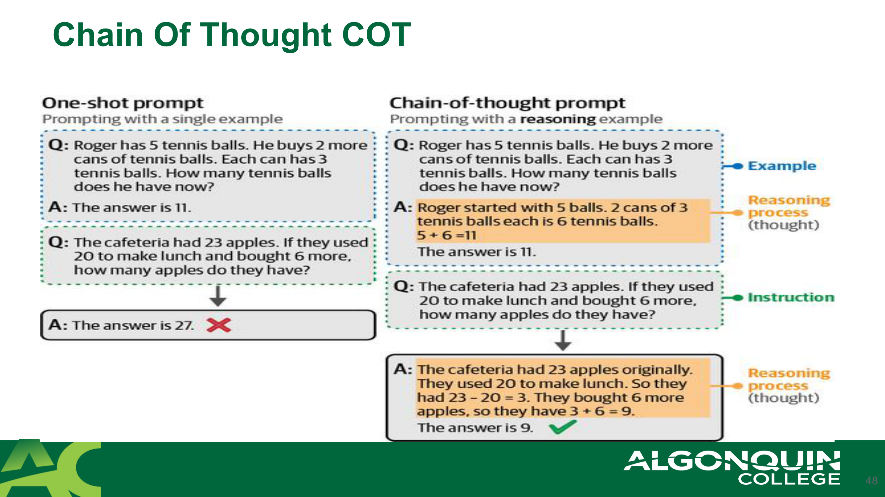

**Chain Of Thought COT — 思维链（CoT）**

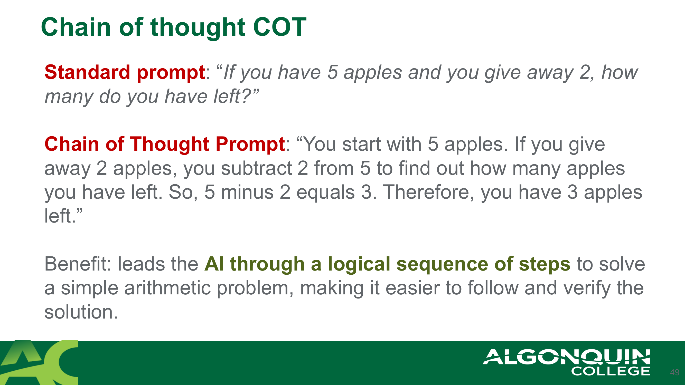

**Chain of thought COT — 思维链 CoT（示例）**

- **Standard prompt:** "If you have 5 apples and you give away 2, how many do you have left?" — **标准提示：** "如果你有5个苹果，送出2个，还剩几个？"
- **Chain of Thought Prompt:** "You start with 5 apples. If you give away 2 apples, you subtract 2 from 5 to find out how many apples you have left. So, 5 minus 2 equals 3. Therefore, you have 3 apples left." — **思维链提示：** "你从5个苹果开始。如果送出2个苹果，用5减去2来求出还剩多少个。所以，5减2等于3。因此，你还剩3个苹果。"
- **Benefit:** leads the AI through a logical sequence of steps to solve a simple arithmetic problem, making it easier to follow and verify the solution — **好处：** 引导 AI 通过逻辑步骤序列解决问题，使解题过程更易跟踪和验证

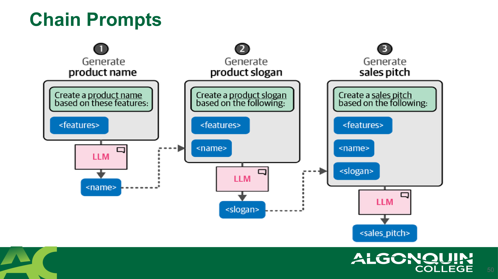

**Chain Prompts — 链式提示**

- Chaining multiple prompts together for complex tasks — 将多个提示串联在一起处理复杂任务

### 11.4 角色化提示 (Role-Based Prompting)


**Role-Based Prompting — 基于角色的提示**

- Example — 示例：

> You are a hiring manager at a top tech company. Conduct a mock interview for a software developer position. Ask one question at a time and wait for my response before continuing. — 你是一家顶级科技公司的招聘经理。为软件开发人员职位进行模拟面试。一次问一个问题，等待我的回答后再继续。

- Response — 回复：

> Great! Let's get started with the interview. — 太好了！让我们开始面试吧。
> Question 1: "Can you please tell me about yourself and your background in software development?" — 问题1："请介绍一下你自己和你的软件开发背景？"

### 11.5 人格引导提示 (Persona-Guided Prompting)


**Persona-Guided Prompting — 人格引导提示**

- Example — 示例：

> You are William Shakespeare. Write a poem about the beauty of the night. — 你是威廉·莎士比亚。写一首关于夜晚之美的诗。

- Response — 回复 — "Ode to the Night" — "夜之颂"：

> Oh, velvet sky with silver'd glow,
> Where quiet winds of midnight blow,
> Thy stars like lanterns gently gleam,
> Soft whisper'd light in slumber's dream.
> The moon, a queen in pale embrace,
> Doth kiss the earth with tender grace,
> She walks 'tween clouds in silent flight,
> A beacon fair to lovers' sight.

---

## 12. 提示工程最佳实践 (Prompt Engineering Best Practices)

### 12.1 提示模板 (Prompt Templates)

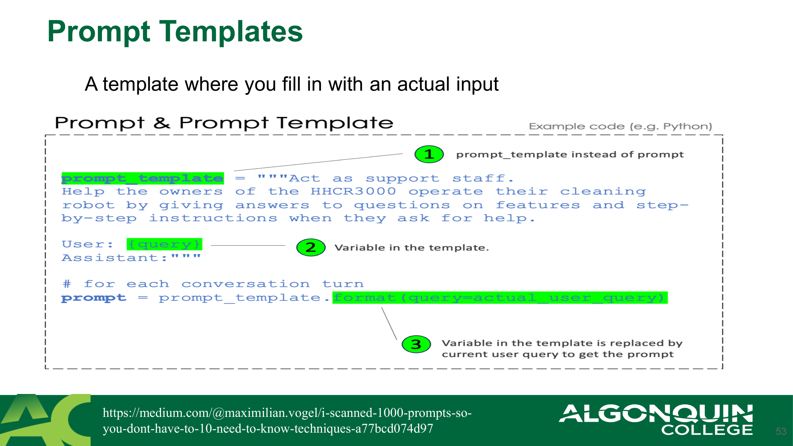

**Prompt Templates — 提示模板**

- A template where you fill in with an actual input — 一个用实际输入填充的模板

Ref: https://medium.com/@maximilian.vogel/i-scanned-1000-prompts-so-you-dont-have-to-10-need-to-know-techniques-a77bcd074d97

### 12.2 最佳实践清单 (Best Practices Checklist)

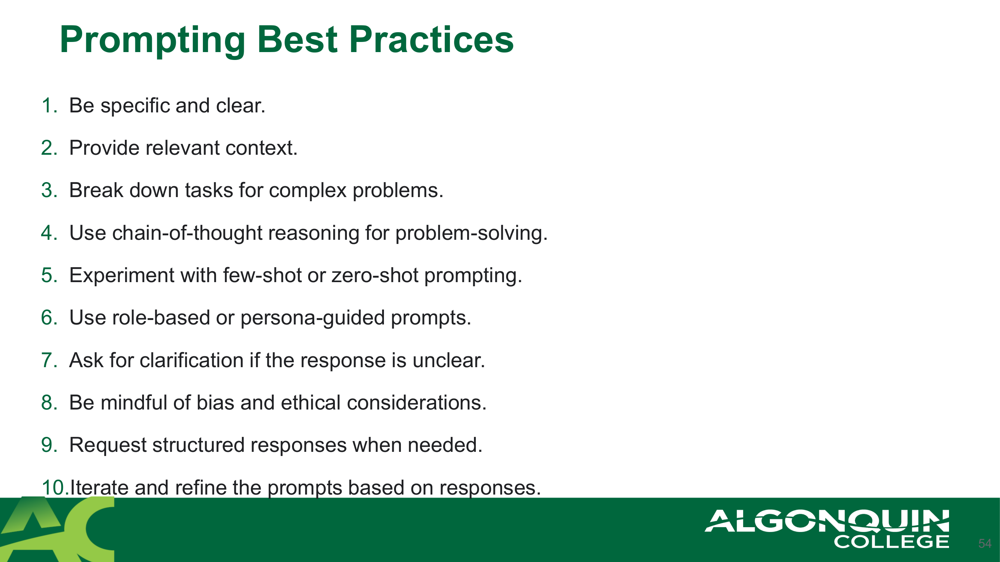

**Prompting Best Practices — 提示最佳实践**

1. **Be specific and clear** — **具体且清晰**
2. **Provide relevant context** — **提供相关上下文**
3. **Break down tasks** for complex problems — 对复杂问题**分解任务**
4. **Use chain-of-thought reasoning** for problem-solving — 用**思维链推理**解决问题
5. **Experiment with few-shot or zero-shot prompting** — **尝试少样本或零样本提示**
6. **Use role-based or persona-guided prompts** — **使用基于角色或人格引导的提示**
7. **Ask for clarification** if the response is unclear — 如果响应不清楚，**要求澄清**
8. **Be mindful of bias and ethical considerations** — **注意偏见和伦理问题**
9. **Request structured responses** when needed — 需要时**要求结构化响应**
10. **Iterate and refine** the prompts based on responses — 根据响应**迭代和优化**提示

---

## 13. Q&A


**Q&A — 问答环节**
