# Week 1: 课程概述与NLP简介 (Course Overview & Introduction to NLP)

> Source: `lecture_1_W26.pdf`
> Total slides: 55
> Instructor: Hala Own, Ph.D.

---

## 1. 课程信息 (Course Information)

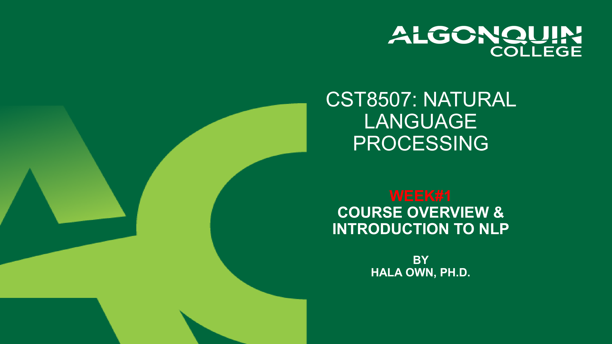

**CST8507: Natural Language Processing** — Week 1: Course Overview & Introduction to NLP — 课程封面页：CST8507自然语言处理——第1周：课程概述与NLP简介

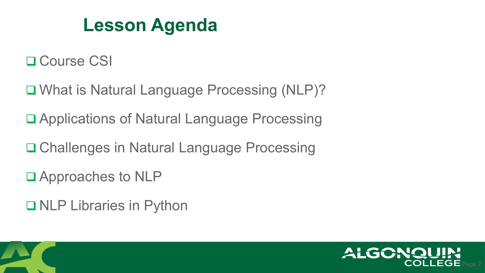

**Lesson Agenda:** — 课程议程

- ❑ Course CSI — 课程CSI
- ❑ What is Natural Language Processing (NLP)? — 什么是自然语言处理（NLP）？
- ❑ Applications of Natural Language Processing — 自然语言处理的应用
- ❑ Challenges in Natural Language Processing — 自然语言处理的挑战
- ❑ Approaches to NLP — NLP的方法
- ❑ NLP Libraries in Python — Python中的NLP库

### 1.1 联系方式 (Contact Information)

**Contact Information:** — 联系方式

- Office hours: TBA — 办公时间：待定
- Room#: WT315 — 办公室：WT315
- Email: ownh@algonquincollege.com — 邮箱：ownh@algonquincollege.com
- Expect email reply is within Two business days. Therefore, you need plan your emails accordingly — 预计邮件回复在两个工作日内。因此，请相应地规划你的邮件
- Include in your email: Your name, Course name and code, Section No. — 邮件中需包含：你的姓名、课程名称和代码、班级编号

### 1.2 评估分数分布 (Evaluation Breakdown)

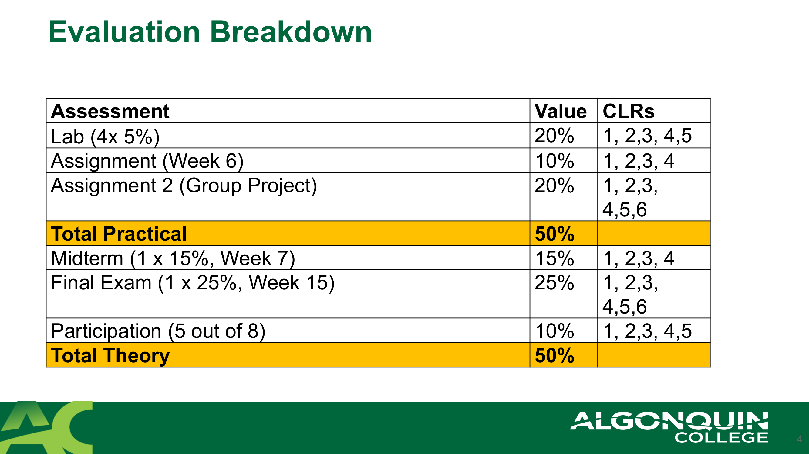

**Evaluation Breakdown:** — 评估分数分布

| Assessment                    | Value         | CLRs          |
| ----------------------------- | ------------- | ------------- |
| Lab (4x 5%)                   | 20%           | 1, 2, 3, 4    |
| Assignment (Week 6)           | 10%           | 1, 2, 3       |
| Assignment 2 (Group Project)  | 20%           | 1, 2, 3, 4, 5 |
| **Total Practical**     | **50%** |               |
| Midterm (1 x 15%, Week 7)     | 15%           | 1, 2, 3       |
| Final Exam (1 x 25%, Week 15) | 25%           | 1, 2, 3, 4, 5 |
| Participation (5 out of 8)    | 10%           | 1, 2, 3, 4    |
| **Total Theory**        | **50%** |               |

### 1.3 实验与作业 (Labs & Assignments)

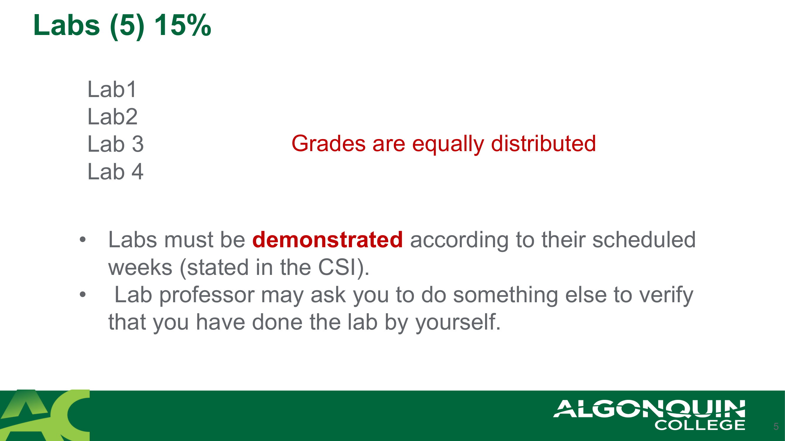

**Labs (5) 15%:** — 实验（5次）15%

- Labs must be demonstrated according to their scheduled weeks (stated in the CSI). — 实验必须按照计划周次进行演示（如CSI中所述）。
- Lab professor may ask you to do something else to verify that you have done the lab by yourself. — 实验教授可能会要求你做其他事情来验证你是否独立完成了实验。

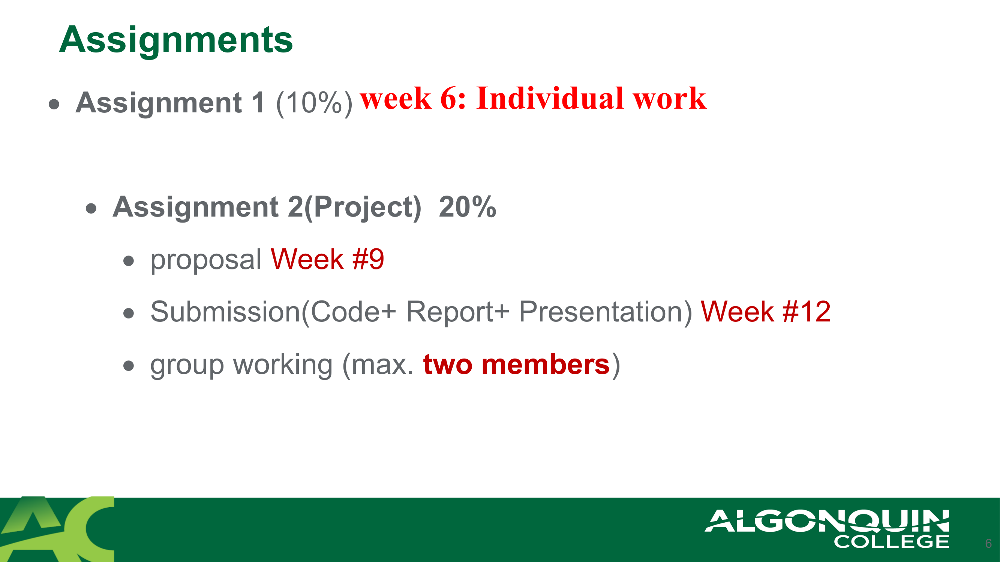

**Assignments:** — 作业

- Assignment 1 (10%) — week 6: Individual work — 作业1（10%）——第6周：个人作业
- Assignment 2 (Project) 20% — 作业2（项目）20%
  - proposal Week #9 — 提案第9周
  - Submission (Code + Report + Presentation) Week #12 — 提交（代码+报告+演示）第12周
  - group working (max. two members) — 小组合作（最多两人）

### 1.4 考试 (Exams)

**Midterm Exam:** — 期中考试

- ❑ Week 7 Lecture — 第7周课堂
- ❑ 60 min — 60分钟
- ❑ Materials: Week 1 till Week 6 — 范围：第1周至第6周
- ❑ Weight: 15% — 权重：15%
- ❑ Closed Book, On paper — 闭卷，纸质
- Bring your own cheat sheet — 可自带小抄

**Final Exam (Theory):** — 期末考试（理论）

- ❑ Week 15 — 第15周
- ❑ Materials: Week 1 till Week 12 — 范围：第1周至第12周
- ❑ Weight: 25% — 权重：25%
- ❑ Closed Book, On paper — 闭卷，纸质
- Bring your own cheat sheet — 可自带小抄

### 1.5 课堂参与 (Participation)

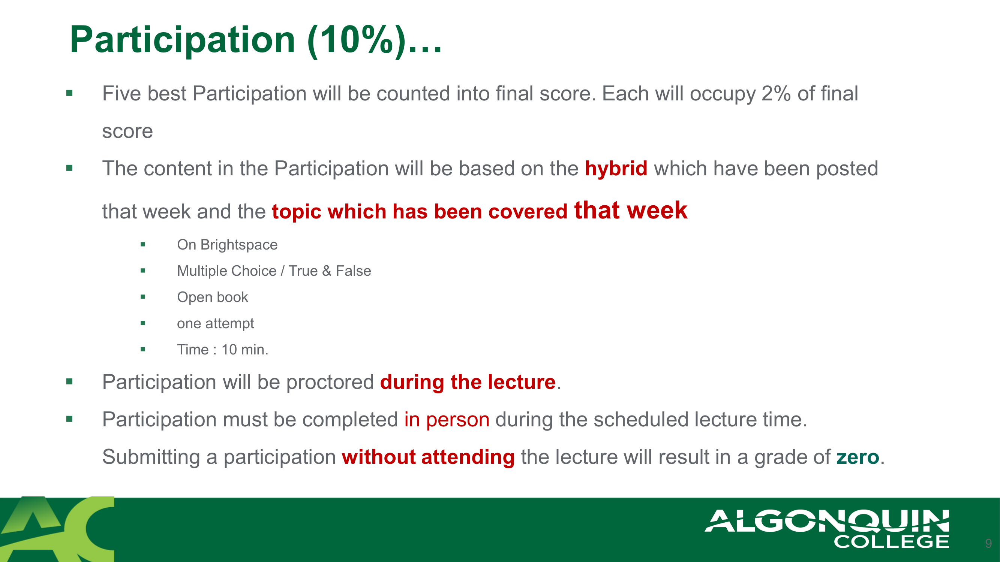

**Participation (10%):** — 课堂参与（10%）

- ▪ Five best Participation will be counted into final score. Each will occupy 2% of final score — 最好的5次参与计入总分。每次占总分的2%
- ▪ The content in the Participation will be based on the hybrid which have been posted that week and the topic which has been covered that week — 参与内容基于当周发布的混合材料和当周涵盖的主题
- ▪ On Brightspace — 在Brightspace上
- ▪ Multiple Choice / True & False — 选择题/判断题
- ▪ Open book — 开卷
- ▪ one attempt — 一次机会
- ▪ Time: 10 min. — 时间：10分钟
- ▪ Participation will be proctored during the lecture. — 参与将在课堂上监考。
- ▪ Participation must be completed in person during the scheduled lecture time. Submitting a participation without attending the lecture will result in a grade of zero. — 参与必须在预定课堂时间内亲自完成。未出席课堂而提交参与将得零分。

### 1.6 课堂与实验规则 (Lecture & Lab Rules)

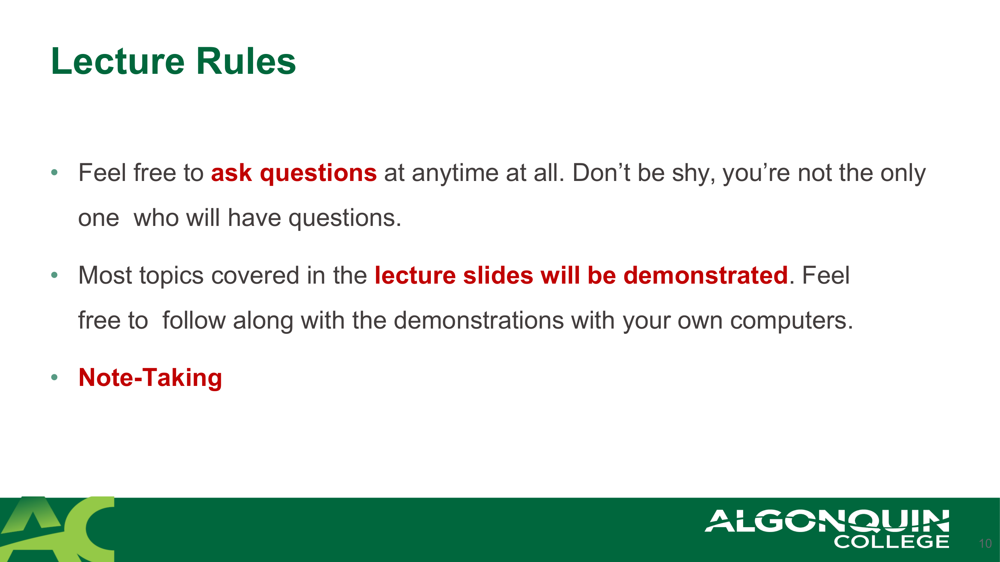

**Lecture Rules:** — 课堂规则

- Feel free to ask questions at anytime at all. Don't be shy, you're not the only one who will have questions. — 随时提问。不要害羞，你不是唯一有问题的人。
- Most topics covered in the lecture slides will be demonstrated. Feel free to follow along with the demonstrations with your own computers. — 课件中涵盖的大多数主题都会演示。欢迎用自己的电脑跟着做。
- Note-Taking — 记笔记

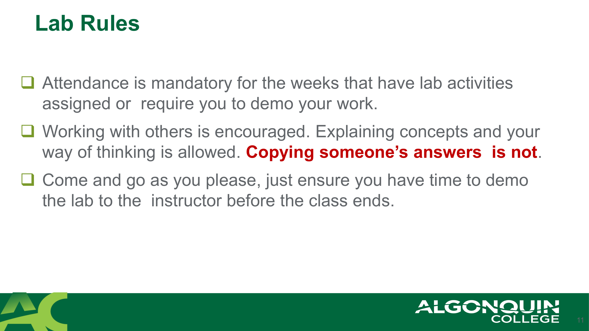

**Lab Rules:** — 实验规则

- ❑ Attendance is mandatory for the weeks that have lab activities assigned or require you to demo your work. — 有实验活动或需要演示作业的周次必须出勤。
- ❑ Working with others is encouraged. Explaining concepts and your way of thinking is allowed. Copying someone's answers is not. — 鼓励与他人合作。允许解释概念和思路。不允许抄袭答案。
- ❑ Come and go as you please, just ensure you have time to demo the lab to the instructor before the class ends. — 可以自由进出，但确保在课程结束前有时间向教师演示实验。

### 1.7 重要提醒 (Important Information)

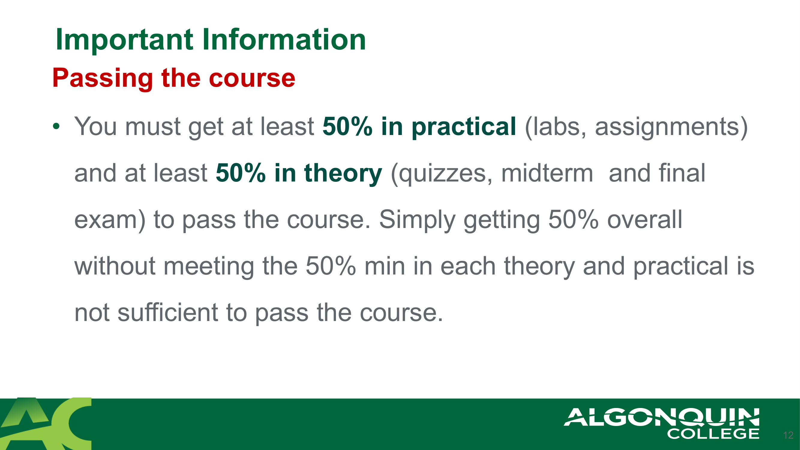

**重要评分政策：** 实践和理论必须分别达到至少50%才能通过。

- You must get at least 50% in practical (labs, assignments) and at least 50% in theory (quizzes, midterm and final exam) to pass the course. Simply getting 50% overall without meeting the 50% min in each theory and practical is not sufficient to pass the course. — 实践（实验、作业）和理论（测验、期中和期末考试）必须分别达到至少50%才能通过课程。仅总分达到50%但未在理论和实践中分别达到50%不足以通过。

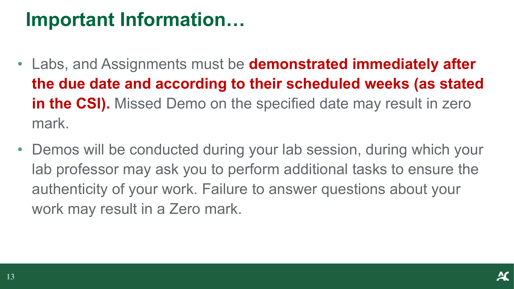

**Demo and submission policy:** — 演示与提交政策

- Labs, and Assignments must be demonstrated immediately after the due date and according to their scheduled weeks (as stated in the CSI). Missed Demo on the specified date may result in zero mark. — 实验和作业必须在截止日期后立即按计划周次演示（如CSI中所述）。错过指定日期的演示可能导致零分。
- Demos will be conducted during your lab session, during which your lab professor may ask you to perform additional tasks to ensure the authenticity of your work. Failure to answer questions about your work may result in a Zero mark. — 演示将在实验课期间进行，实验教授可能要求你执行额外任务以确保作业的真实性。无法回答关于你作业的问题可能导致零分。

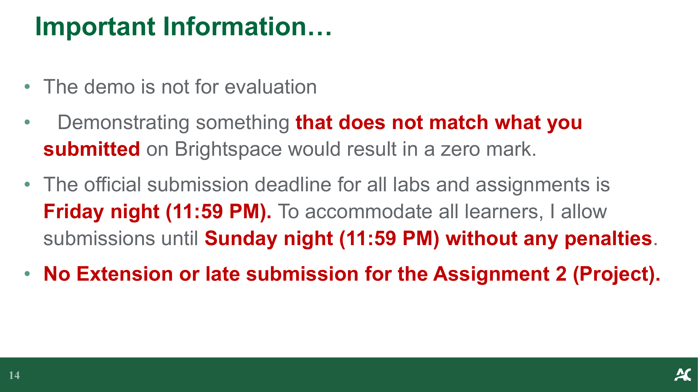

**Submission deadlines:** — 提交截止日期

- The demo is not for evaluation — 演示不用于评分
- Demonstrating something that does not match what you submitted on Brightspace would result in a zero mark. — 演示内容与Brightspace上提交的不一致将导致零分。
- The official submission deadline for all labs and assignments is Friday night (11:59 PM). To accommodate all learners, I allow submissions until Sunday night (11:59 PM) without any penalties. — 所有实验和作业的官方截止日期为周五晚（11:59 PM）。为照顾所有学生，允许延至周日晚（11:59 PM）提交，无惩罚。
- No Extension or late submission for the Assignment 2 (Project). — 作业2（项目）不接受延期或迟交。

### 1.8 混合学习与工具 (Hybrid Work & Tools)

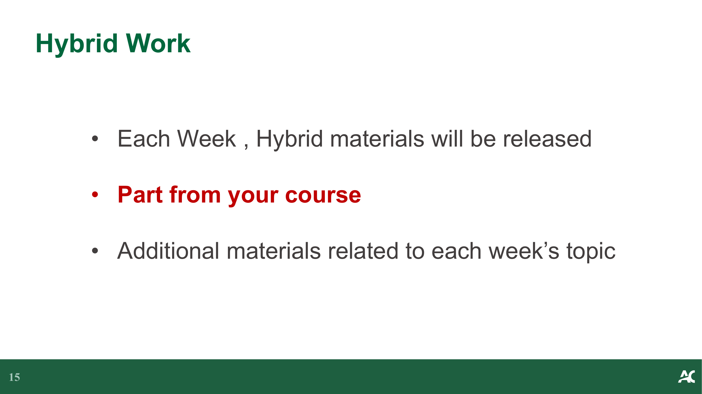

**Hybrid Work:** — 混合学习

- Each Week, Hybrid materials will be released — 每周将发布混合学习材料
- Part from your course — 部分来自你的课程
- Additional materials related to each week's topic — 与每周主题相关的额外材料

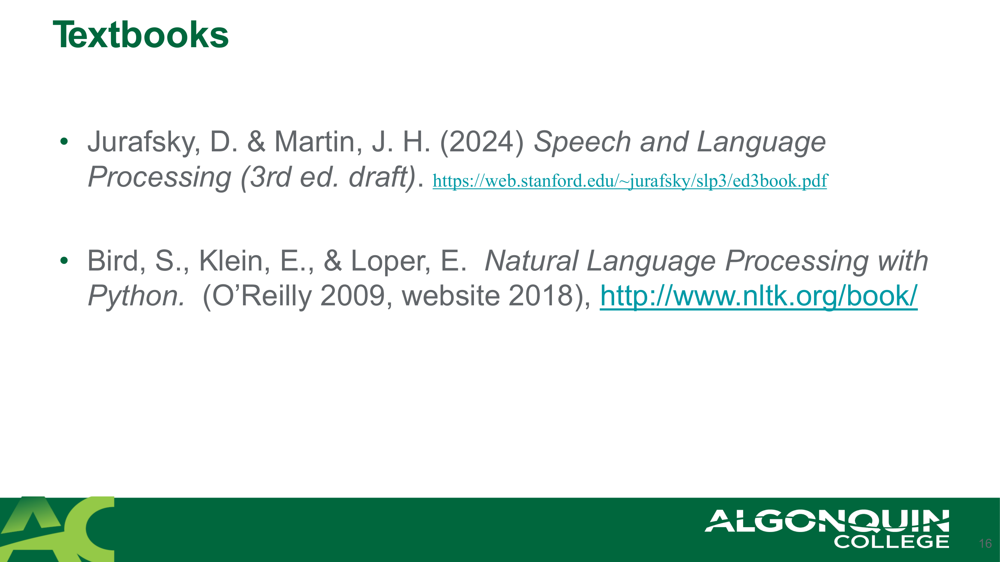

**Textbooks:** — 教材

- Jurafsky, D. & Martin, J. H. (2024) Speech and Language Processing (3rd ed. draft). https://web.stanford.edu/~jurafsky/slp3/ed3book.pdf — 语音与语言处理（第3版草稿）
- Bird, S., Klein, E., & Loper, E. Natural Language Processing with Python. (O'Reilly 2009, website 2018), http://www.nltk.org/book/ — Python自然语言处理

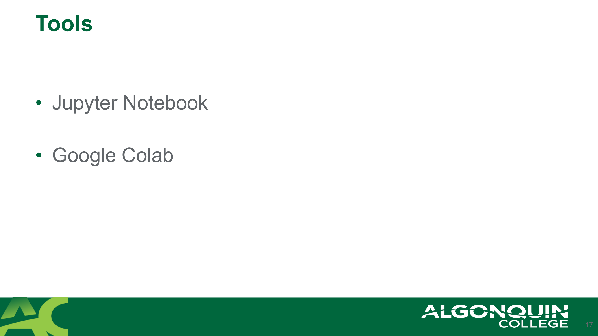

**Tools:** — 工具

- Jupyter Notebook
- Google Colab

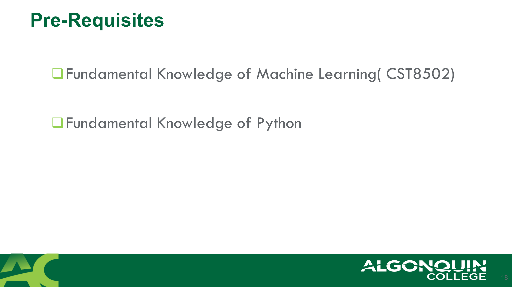

**Pre-Requisites:** — 先修要求

- ❑ Fundamental Knowledge of Machine Learning (CST8502) — 机器学习基础知识（CST8502）
- ❑ Fundamental Knowledge of Python — Python基础知识

---

## 2. 什么是自然语言处理 (What Is Natural Language Processing?)

### 2.1 知识表示 (Knowledge Representation)

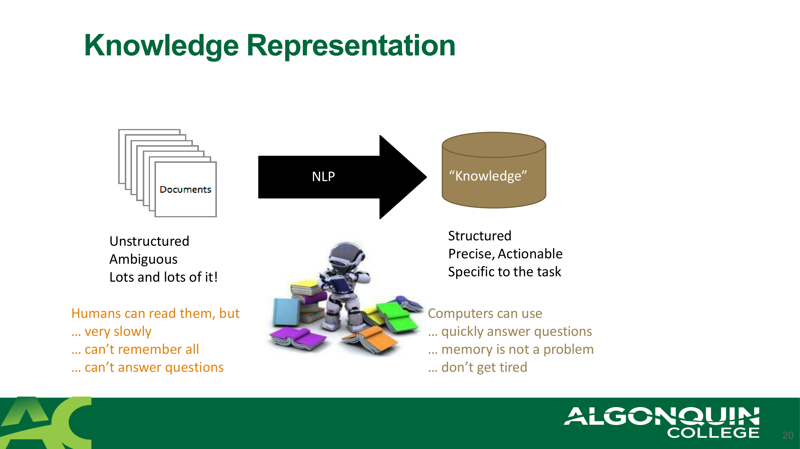

**Knowledge Representation table:** — 知识表示表格

|                     | NLP "Knowledge" Structured                                                  | Unstructured                               |
| ------------------- | --------------------------------------------------------------------------- | ------------------------------------------ |
| **Nature**    | Precise, Actionable                                                         | Ambiguous                                  |
| **Scope**     | Specific to the task                                                        | Lots and lots of it!                       |
| **Humans**    | can read them, but very slowly                                              | can't remember all, can't answer questions |
| **Computers** | can use quickly, answer questions, memory is not a problem, don't get tired | —                                         |

> **📝 Notes:**
>
> **🎯 Why:**
> **(1) The fundamental motivation for NLP (NLP的根本动机):**
>
> Humans produce knowledge in unstructured natural language (books, emails, tweets), but computers need structured data to reason and act. NLP exists to bridge this gap — converting the vast ocean of human text into actionable, machine-readable knowledge.
>
>> 人类以非结构化的自然语言（书籍、邮件、推文）产生知识，但计算机需要结构化数据才能推理和行动。NLP的存在就是为了弥合这一鸿沟——将海量人类文本转化为机器可操作的知识。
>>
>
> **(2) Volume asymmetry (数量不对称):**
>
> Structured knowledge is precise but scarce and expensive to create (requires human experts). Unstructured text is abundant but ambiguous. Over 80% of enterprise data is unstructured — NLP is the key to unlocking it.
>
>> 结构化知识精确但稀少且创建成本高（需要人类专家）。非结构化文本丰富但模糊。超过80%的企业数据是非结构化的——NLP是解锁它们的关键。
>>
>
> **💡 Intuition:**
> **(1) Library catalog vs overheard conversations (图书馆目录 vs 偷听对话):**
>
> Structured knowledge is like a perfectly organized library catalog — every book has an exact location. Unstructured text is like overhearing a million conversations — rich in information but you need NLP to extract and organize the useful parts.
>
>> 结构化知识像完美整理的图书馆目录——每本书都有精确位置。非结构化文本像偷听一百万段对话——信息丰富但需要NLP来提取和组织有用部分。
>>
>
> **⚖️ Compare:**
> **(1) Structured vs Unstructured knowledge:**
>
> | Feature         | Structured                    | Unstructured                  |
> | --------------- | ----------------------------- | ----------------------------- |
> | Format          | Tables, databases, ontologies | Free text, speech, images     |
> | Precision       | High — machine-actionable    | Low — ambiguous              |
> | Volume          | Small (expensive to create)   | Massive (generated naturally) |
> | Computer access | Easy (SQL, API)               | Hard (requires NLP)           |
>
>> | 特性       | 结构化             | 非结构化             |
>> | ---------- | ------------------ | -------------------- |
>> | 格式       | 表格、数据库、本体 | 自由文本、语音、图像 |
>> | 精度       | 高——机器可操作   | 低——歧义           |
>> | 数量       | 少（创建成本高）   | 海量（自然产生）     |
>> | 计算机访问 | 容易（SQL, API）   | 困难（需要NLP）      |
>>
>
> **📝 Exam:**
> **(1) 概念题 (Conceptual):**
>
> "Why is NLP important for businesses?" → Most valuable data (customer feedback, documents, emails) is unstructured text that computers cannot directly process without NLP.
>
>> "为什么NLP对企业重要？" → 最有价值的数据（客户反馈、文档、邮件）都是非结构化文本，没有NLP计算机无法直接处理。
>>

### 2.2 NLP的定义与动机 (NLP Definition & Motivations)

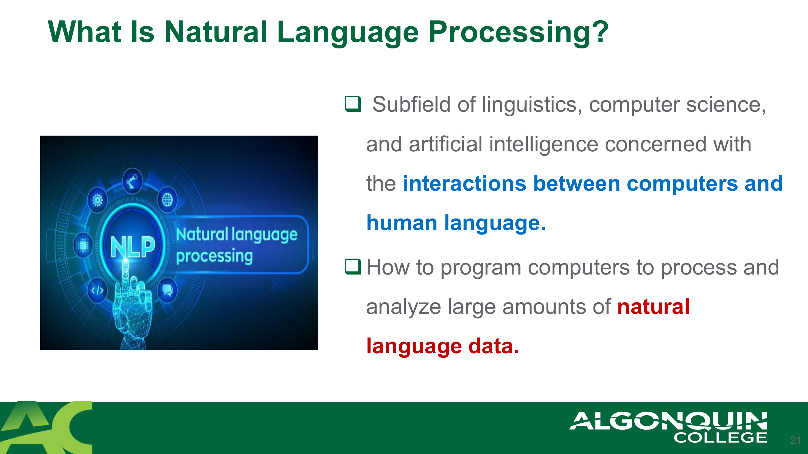

**What Is Natural Language Processing?** — 什么是自然语言处理？

- ❑ Subfield of linguistics, computer science, and artificial intelligence concerned with the interactions between computers and human language. — 语言学、计算机科学和人工智能的交叉子领域，关注计算机与人类语言之间的交互。
- ❑ How to program computers to process and analyze large amounts of natural language data. — 如何编程让计算机处理和分析大量自然语言数据。

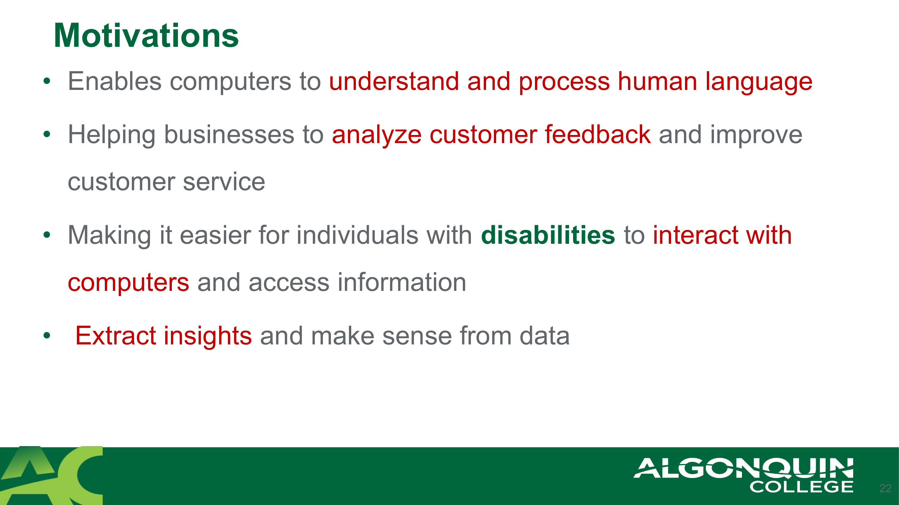

**Motivations:** — 动机

- Enables computers to understand and process human language — 使计算机能够理解和处理人类语言
- Helping businesses to analyze customer feedback and improve customer service — 帮助企业分析客户反馈并改善客户服务
- Making it easier for individuals with disabilities to interact with computers and access information — 让残障人士更容易与计算机交互和获取信息
- Extract insights and make sense from data — 从数据中提取洞察并理解数据

> **📝 Notes:**
>
> **📌 What:**
> **(1) NLP as an interdisciplinary field (NLP作为交叉学科):**
>
> NLP sits at the intersection of three fields: linguistics (how language works), computer science (how to process it efficiently), and AI (how to make machines understand meaning). It is NOT just "text processing" — it requires understanding grammar, semantics, and pragmatics.
>
>> NLP位于三个领域的交汇处：语言学（语言如何运作）、计算机科学（如何高效处理）、AI（如何让机器理解含义）。它不只是"文本处理"——需要理解语法、语义和语用。
>>
>
> **🎯 Why:**
> **(1) Business value (商业价值):**
>
> NLP enables automation of tasks humans find tedious but critical: reading thousands of customer reviews, monitoring social media sentiment, routing support tickets, translating documents. Without NLP, these require expensive human labor.
>
>> NLP能自动化人类觉得繁琐但关键的任务：阅读数千条客户评价、监控社交媒体情感、路由客服工单、翻译文档。没有NLP，这些都需要昂贵的人力。
>>
>
> **(2) Accessibility (可访问性):**
>
> NLP makes technology accessible to people who can't type or read screens — voice assistants, screen readers, and real-time captioning all depend on NLP.
>
>> NLP让无法打字或阅读屏幕的人也能使用技术——语音助手、屏幕阅读器、实时字幕都依赖NLP。
>>
>
> **💡 Intuition:**
> **(1) Universal translator analogy (万能翻译器类比):**
>
> NLP is like building a universal translator between human language and computer language. Humans speak in ambiguous, context-dependent sentences; computers need precise, structured instructions. NLP is the bridge.
>
>> NLP就像在人类语言和计算机语言之间建造一个万能翻译器。人类用歧义的、依赖上下文的句子说话；计算机需要精确的、结构化的指令。NLP就是桥梁。
>>
>
> **📝 Exam:**
> **(1) 定义题 (Definition):**
>
> "What is NLP?" → A subfield at the intersection of linguistics, CS, and AI that focuses on enabling computers to process, understand, and generate human language.
>
>> "什么是NLP？" → 语言学、计算机科学和AI交叉领域的子学科，专注于让计算机处理、理解和生成人类语言。
>>
>
> **(2) 应用题 (Application):**
>
> "List 3 motivations for NLP." → (1) Analyze customer feedback at scale, (2) Improve accessibility for disabled users, (3) Extract insights from unstructured data.
>
>> "列出NLP的3个动机。" → (1) 大规模分析客户反馈，(2) 提高残障用户的可访问性，(3) 从非结构化数据中提取洞察。
>>

### 2.3 AI与NLP的关系 (Interconnections Between AI, ML, DL, and NLP)

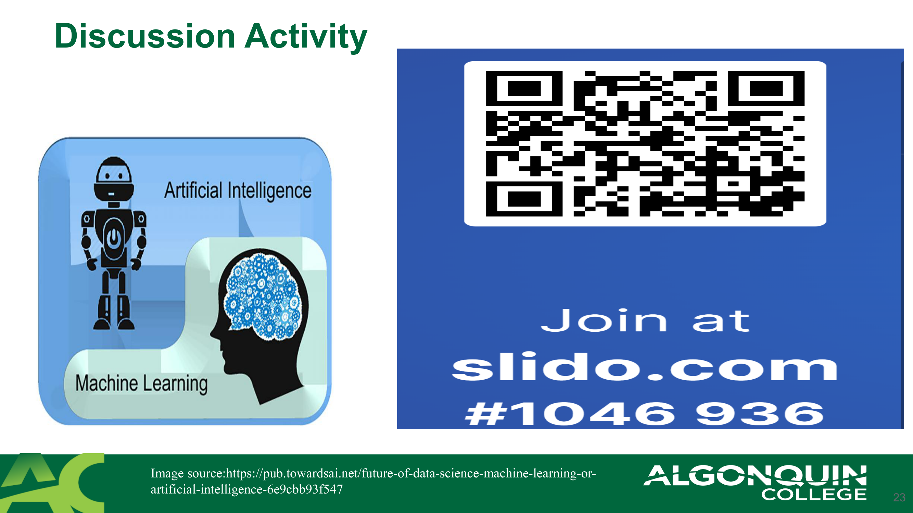

**Discussion Activity:** — 讨论活动

Ref: https://pub.towardsai.net/future-of-data-science-machine-learning-or-artificial-intelligence-6e9cbb93f547

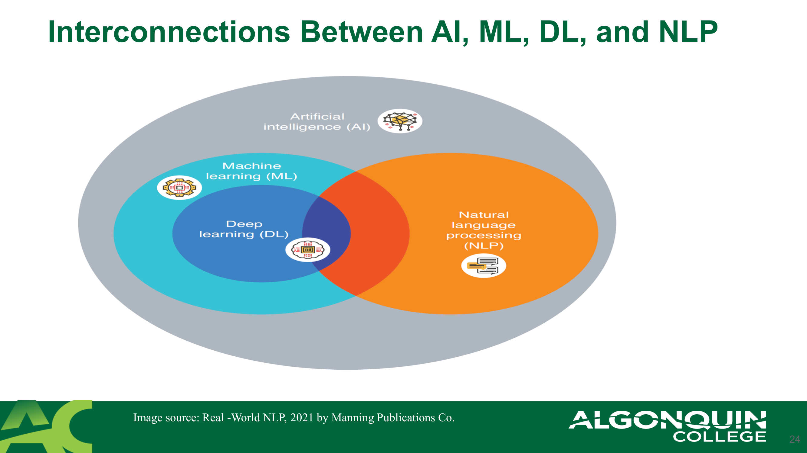

**Interconnections Between AI, ML, DL, and NLP:** — AI/ML/DL/NLP的关联

Ref: Real-World NLP, 2021 by Manning Publications Co.

> **📝 Notes:**
>
> **📌 What:**
> **(1) Nested relationship (嵌套关系):**
>
> AI ⊃ ML ⊃ DL, and NLP cuts across all three. Rule-based NLP is pure AI (no learning). Statistical NLP uses ML (e.g., Naive Bayes). Modern NLP uses DL (e.g., Transformers, BERT, GPT). NLP is a _task domain_, not a technique level.
>
>> AI ⊃ ML ⊃ DL，而NLP横跨这三者。基于规则的NLP是纯AI（不学习）。统计NLP使用ML（如朴素贝叶斯）。现代NLP使用DL（如Transformer、BERT、GPT）。NLP是一个*任务领域*，不是技术层级。
>>
>
> **💡 Intuition:**
> **(1) Russian dolls analogy (俄罗斯套娃类比):**
>
> Think of Russian nesting dolls: AI is the outermost doll (any intelligent behavior), ML is inside (learning from data), DL is the innermost (learning with neural networks). NLP is like a thread that runs through all dolls — you can do NLP at any level.
>
>> 想象俄罗斯套娃：AI是最外层（任何智能行为），ML在里面（从数据学习），DL是最内层（用神经网络学习）。NLP像一根贯穿所有套娃的线——你可以在任何层做NLP。
>>
>
> **⚠️ Pitfall:**
> **(1) NLP ≠ DL (NLP ≠ 深度学习):**
>
> Students often equate NLP with deep learning (GPT, ChatGPT). But NLP existed long before DL — regex, bag-of-words, TF-IDF, and Naive Bayes are all NLP techniques that don't use neural networks. The course covers the full spectrum.
>
>> 学生经常把NLP等同于深度学习（GPT、ChatGPT）。但NLP远在DL之前就存在——正则表达式、词袋模型、TF-IDF、朴素贝叶斯都是不使用神经网络的NLP技术。本课程涵盖完整范围。
>>
>
> **📝 Exam:**
> **(1) 关系题 (Relationship):**
>
> "Explain the relationship between AI, ML, DL, and NLP." → AI is the broadest field; ML is a subset that learns from data; DL is a subset of ML using neural networks. NLP is a cross-cutting application domain that can use techniques from any level.
>
>> "解释AI、ML、DL和NLP之间的关系。" → AI是最广泛的领域；ML是从数据学习的子集；DL是使用神经网络的ML子集。NLP是一个横跨各层的应用领域，可以使用任意层级的技术。
>>

### 2.4 NLP的历史 (History of NLP)

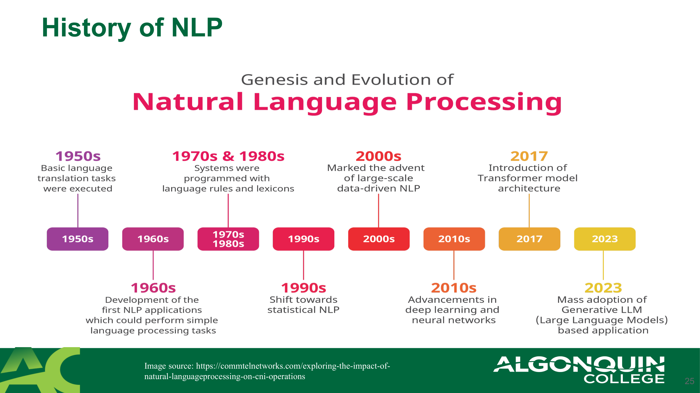

**History of NLP:** — NLP历史

Ref: https://commtelnetworks.com/exploring-the-impact-of-natural-languageprocessing-on-cni-operations

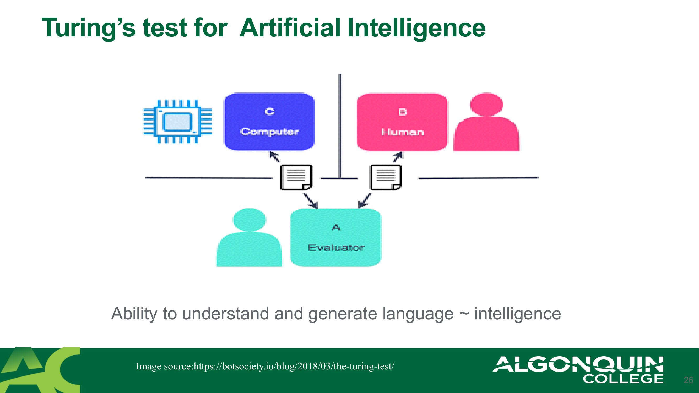

**Turing's test for Artificial Intelligence:** — 图灵的人工智能测试

- Ability to understand and generate language ~ intelligence — 理解和生成语言的能力 ≈ 智能

Ref: https://botsociety.io/blog/2018/03/the-turing-test/

> **📝 Notes:**
>
> **🎯 Why:**
> **(1) Language as the ultimate AI benchmark (语言作为AI的终极基准):**
>
> Turing proposed that if a machine can converse with a human and be indistinguishable from another human, it is "intelligent." This makes language understanding the gold standard for measuring AI — which is why NLP is central to AI research.
>
>> 图灵提出，如果机器能与人对话且无法被区分，那它就是"智能"的。这使得语言理解成为衡量AI的金标准——这就是为什么NLP是AI研究的核心。
>>
>
> **💡 Intuition:**
> **(1) The "imitation game" (模仿游戏):**
>
> Imagine texting two strangers — one human, one machine. If you can't tell which is which after 5 minutes of conversation, the machine passes the Turing Test. This is essentially what modern chatbots (like ChatGPT) attempt.
>
>> 想象给两个陌生人发消息——一个是人，一个是机器。如果5分钟对话后你分不出哪个是哪个，机器就通过了图灵测试。这本质上就是现代聊天机器人（如ChatGPT）在尝试做的事。
>>
>
> **⚙️ How:**
> **(1) Evolution of NLP approaches (NLP方法的演变):**
>
> 1950s–1990s: Rule-based systems (hand-crafted grammars). 1990s–2010s: Statistical methods (n-grams, HMMs, SVMs). 2010s–present: Deep learning (RNNs → LSTMs → Transformers → LLMs). Each era solved problems the previous couldn't.
>
>> 1950s–1990s：基于规则的系统（手工语法）。1990s–2010s：统计方法（n-gram、HMM、SVM）。2010s–今：深度学习（RNN → LSTM → Transformer → LLM）。每个时代解决了前一代无法解决的问题。
>>
>
> **⚠️ Pitfall:**
> **(1) Turing Test ≠ true understanding (图灵测试 ≠ 真正理解):**
>
> Passing the Turing Test doesn't mean the machine truly "understands" language. Modern LLMs can fool humans but still make nonsensical errors — they pattern-match rather than reason. This is the "Chinese Room" argument (Searle, 1980).
>
>> 通过图灵测试不代表机器真正"理解"语言。现代LLM能骗过人类但仍会犯荒谬错误——它们做模式匹配而非推理。这就是"中文房间"论证（Searle, 1980）。
>>
>
> **📝 Exam:**
> **(1) 概念题 (Conceptual):**
>
> "What is the Turing Test and why is it relevant to NLP?" → A test where a machine must be indistinguishable from a human in conversation. It's relevant because it establishes language understanding as the benchmark for AI.
>
>> "什么是图灵测试，它与NLP有什么关系？" → 机器在对话中必须与人类无法区分的测试。它的相关性在于将语言理解确立为AI的基准。
>>

---

## 3. NLP应用 (Applications of Natural Language Processing)

### 3.1 NLU与NLG (NLU and NLG)

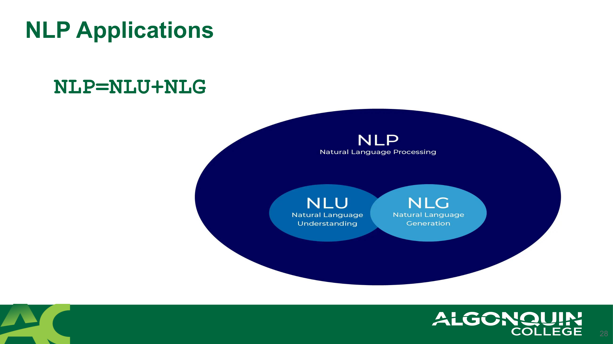

**NLP Applications: NLP = NLU + NLG:** — NLP应用：NLP = NLU + NLG

> **📝 Notes:**
>
> **📌 What:**
> **(1) NLU — Natural Language Understanding (自然语言理解):**
>
> The ability of a machine to _read and comprehend_ text/speech. Tasks: sentiment analysis, named entity recognition, intent detection, text classification. Input: human language → Output: structured meaning.
>
>> 机器*阅读和理解*文本/语音的能力。任务：情感分析、命名实体识别、意图检测、文本分类。输入：人类语言 → 输出：结构化含义。
>>
>
> **(2) NLG — Natural Language Generation (自然语言生成):**
>
> The ability of a machine to _produce_ human-readable text/speech. Tasks: text summarization, machine translation, dialogue generation, report writing. Input: structured data/meaning → Output: human language.
>
>> 机器*生成*人类可读文本/语音的能力。任务：文本摘要、机器翻译、对话生成、报告撰写。输入：结构化数据/含义 → 输出：人类语言。
>>
>
> **🎯 Why:**
> **(1) Two sides of the same coin (同一硬币的两面):**
>
> A complete NLP system needs both: NLU to _listen_ (understand user input) and NLG to _speak_ (produce responses). A chatbot without NLU can't understand questions; without NLG it can't formulate answers.
>
>> 完整的NLP系统需要两者：NLU用来*听*（理解用户输入），NLG用来*说*（产生回应）。没有NLU的聊天机器人无法理解问题；没有NLG则无法组织答案。
>>
>
> **💡 Intuition:**
> **(1) Ear and mouth analogy (耳朵和嘴巴类比):**
>
> NLU is the "ear" of NLP — it listens and interprets. NLG is the "mouth" — it speaks and writes. Just like human communication requires both listening and speaking, NLP requires both understanding and generation.
>
>> NLU是NLP的"耳朵"——它倾听和解读。NLG是"嘴巴"——它说话和写作。就像人类交流需要听和说，NLP需要理解和生成两者。
>>
>
> **📝 Exam:**
> **(1) 对比题 (Comparison):**
>
> "What is the difference between NLU and NLG?" → NLU converts human language to structured representation (understanding); NLG converts structured data to human language (generation). NLP = NLU + NLG.
>
>> "NLU和NLG有什么区别？" → NLU将人类语言转换为结构化表示（理解）；NLG将结构化数据转换为人类语言（生成）。NLP = NLU + NLG。
>>

### 3.2 语音识别 (Speech Recognition)

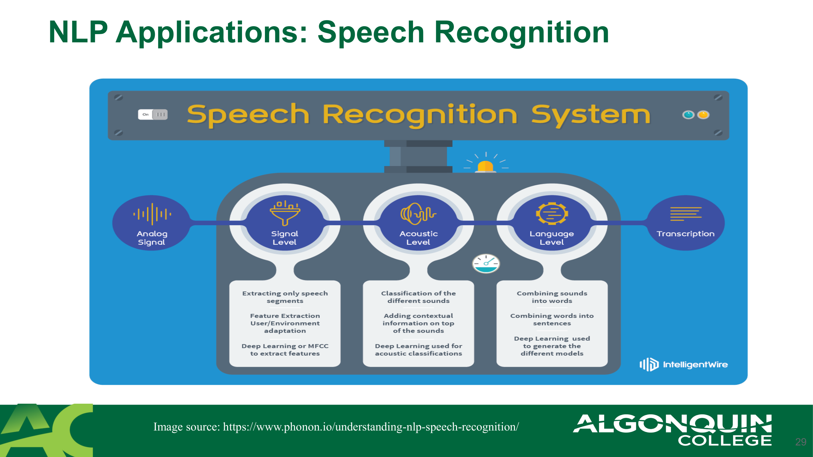

**NLP Applications: Speech Recognition:** — NLP应用：语音识别

Ref: https://www.phonon.io/understanding-nlp-speech-recognition/

### 3.3 对话代理与聊天机器人 (Conversation Agents and Chatbots)

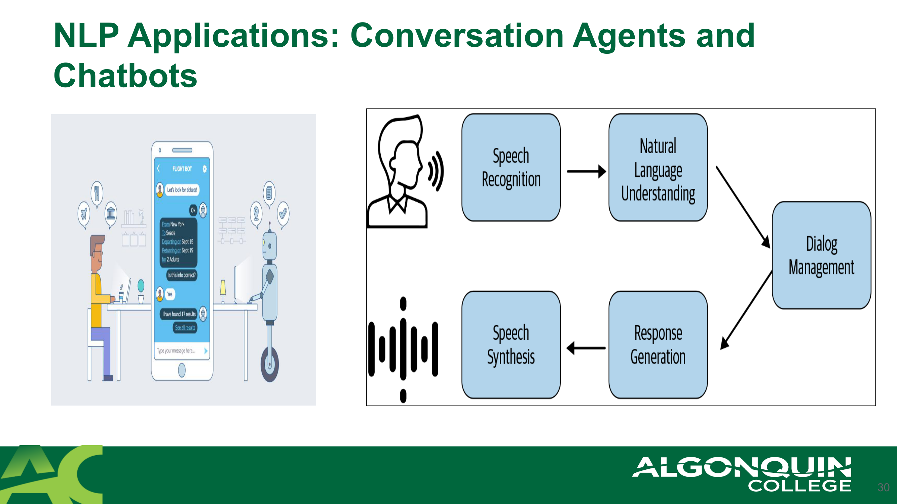

**NLP Applications: Conversation Agents and Chatbots:** — NLP应用：对话代理与聊天机器人

### 3.4 文本分类 (Text Classification)

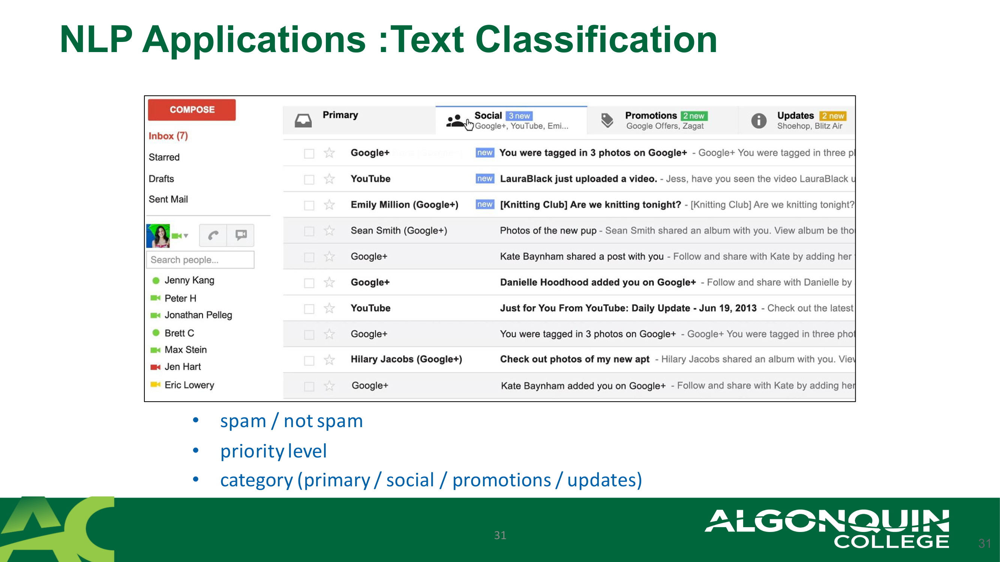

**NLP Applications: Text Classification:** — NLP应用：文本分类

- spam / not spam — 垃圾邮件/非垃圾邮件
- priority level — 优先级
- category (primary / social / promotions / updates) — 分类（主要/社交/促销/更新）

### 3.5 情感分析 (Sentiment Analysis)

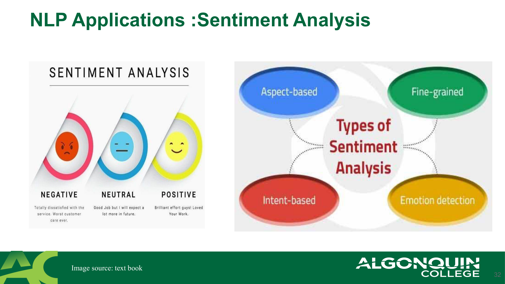

**NLP Applications: Sentiment Analysis:** — NLP应用：情感分析

Ref: text book

### 3.6 文本摘要 (Text Summarization)

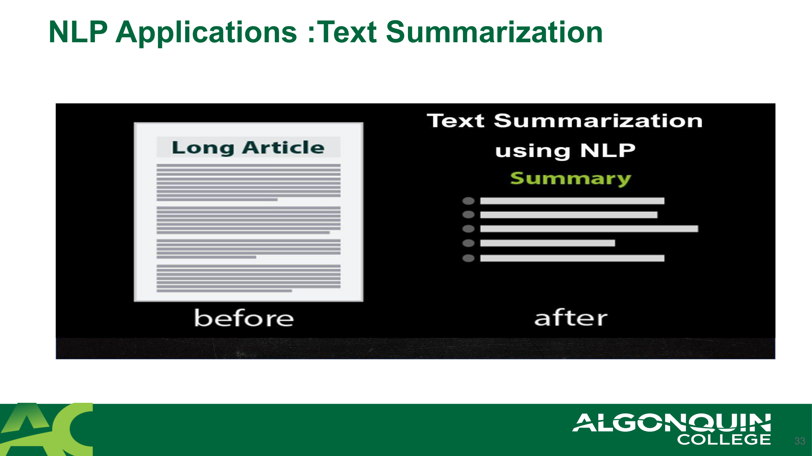

**NLP Applications: Text Summarization:** — NLP应用：文本摘要

### 3.7 问答系统 (Question Answering)

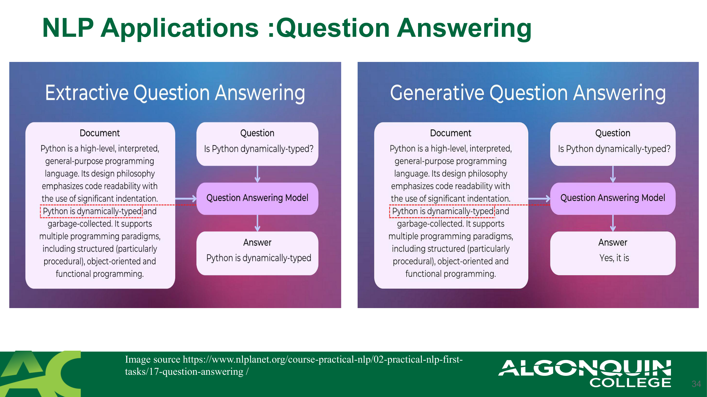

**NLP Applications: Question Answering:** — NLP应用：问答系统

Ref: https://www.nlplanet.org/course-practical-nlp/02-practical-nlp-first-tasks/17-question-answering/

### 3.8 生成式AI (Generative AI)

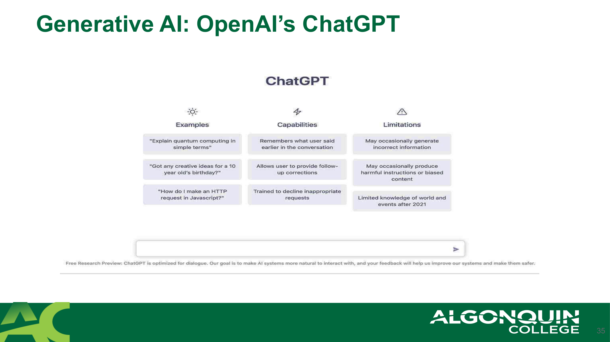

**Generative AI: OpenAI's ChatGPT:** — 生成式AI：OpenAI的ChatGPT

> **📝 Notes:**
>
> **📌 What:**
> **(1) Seven major NLP application areas (七大NLP应用领域):**
>
> Speech Recognition (speech→text), Chatbots (dialogue systems), Text Classification (categorize documents), Sentiment Analysis (opinion mining), Text Summarization (extract key points), Question Answering (find answers from text), Generative AI (produce new content).
>
>> 语音识别（语音→文本）、聊天机器人（对话系统）、文本分类（文档分类）、情感分析（意见挖掘）、文本摘要（提取要点）、问答系统（从文本中找答案）、生成式AI（产生新内容）。
>>
>
> **🎯 Why:**
> **(1) Real-world impact (现实世界的影响):**
>
> These aren't academic exercises — they power products used by billions daily: Google Search (QA), Gmail spam filter (classification), Siri/Alexa (speech + chatbot), Google Translate (NLG), ChatGPT (generative AI).
>
>> 这些不是学术练习——它们驱动着数十亿人每天使用的产品：Google搜索（QA）、Gmail垃圾邮件过滤器（分类）、Siri/Alexa（语音+聊天机器人）、Google翻译（NLG）、ChatGPT（生成式AI）。
>>
>
> **⚖️ Compare:**
> **(1) NLU-heavy vs NLG-heavy applications:**
>
> | Application         | NLU or NLG | Core challenge                             |
> | ------------------- | ---------- | ------------------------------------------ |
> | Sentiment Analysis  | NLU        | Understanding opinion polarity             |
> | Text Classification | NLU        | Mapping text to categories                 |
> | Chatbots            | Both       | Understanding + generating responses       |
> | Text Summarization  | Both       | Understanding content + generating summary |
> | Machine Translation | Both       | Understanding source + generating target   |
> | Generative AI (GPT) | NLG-heavy  | Producing coherent, contextual text        |
>
>> | 应用           | NLU还是NLG | 核心挑战                   |
>> | -------------- | ---------- | -------------------------- |
>> | 情感分析       | NLU        | 理解观点极性               |
>> | 文本分类       | NLU        | 将文本映射到类别           |
>> | 聊天机器人     | 两者       | 理解+生成回应              |
>> | 文本摘要       | 两者       | 理解内容+生成摘要          |
>> | 机器翻译       | 两者       | 理解源语言+生成目标语言    |
>> | 生成式AI (GPT) | 偏NLG      | 产生连贯、上下文相关的文本 |
>>
>
> **📝 Exam:**
> **(1) 应用题 (Application):**
>
> "Give 3 examples of NLP applications and classify each as NLU, NLG, or both." → Sentiment analysis (NLU), text summarization (both), chatbots (both).
>
>> "举3个NLP应用的例子并将每个分类为NLU、NLG或两者。" → 情感分析（NLU）、文本摘要（两者）、聊天机器人（两者）。
>>

---

## 4. NLP的挑战 (Challenges in Natural Language Processing)

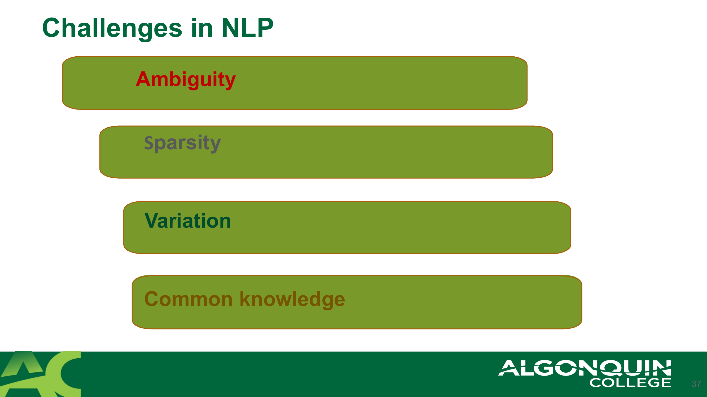

**Challenges in NLP:** — NLP的挑战：歧义性、稀疏性、变异性、常识知识

### 4.1 歧义性 (Ambiguity)

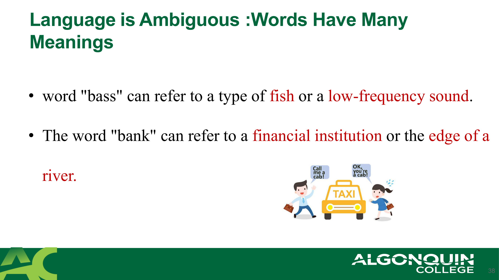

**Language is Ambiguous: Words Have Many Meanings:** — 语言是歧义的：词有多种含义

- word "bass" can refer to a type of fish or a low-frequency sound. — 词"bass"可以指一种鱼或低频声音。
- The word "bank" can refer to a financial institution or the edge of a river. — 词"bank"可以指金融机构或河岸。

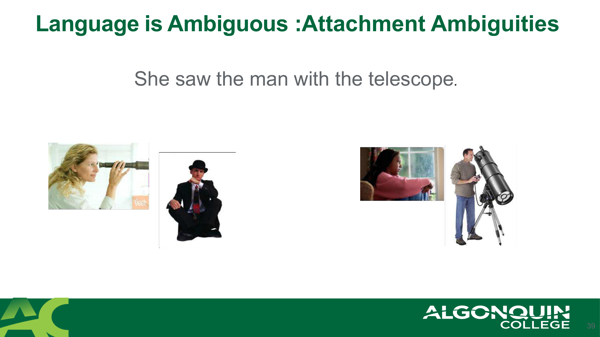

**Language is Ambiguous: Attachment Ambiguities:** — 语言是歧义的：附着歧义

- She saw the man with the telescope. — 她用望远镜看到了那个男人。/ 她看到了拿望远镜的那个男人。

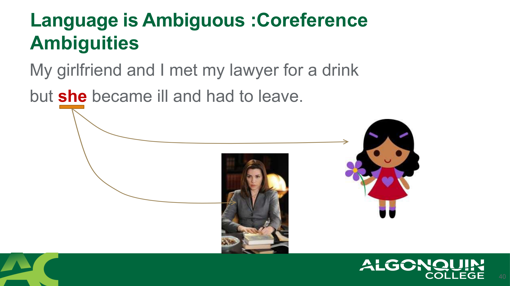

**Language is Ambiguous: Coreference Ambiguities:** — 语言是歧义的：指代歧义

- My girlfriend and I met my lawyer for a drink but she became ill and had to leave. — 我和女朋友约了律师喝酒，但她生病了不得不离开。（"她"指谁？）

> **📝 Notes:**
>
> **📌 What:**
> **(1) Three types of ambiguity (三种歧义类型):**
>
> Lexical ambiguity: same word, multiple meanings ("bank" = river bank or financial bank). Syntactic/attachment ambiguity: same sentence, multiple parse trees ("saw the man with the telescope" — who has the telescope?). Coreference ambiguity: pronouns with unclear referents ("she" = girlfriend or lawyer?).
>
>> 词汇歧义：同一词，多种含义（"bank" = 河岸或银行）。句法/附着歧义：同一句子，多种解析树（"用望远镜看到那个男人"——谁拿着望远镜？）。指代歧义：代词指代不清（"她" = 女朋友还是律师？）。
>>
>
> **🎯 Why:**
> **(1) The #1 reason NLP is hard (NLP困难的首要原因):**
>
> Unlike programming languages where every statement has exactly one meaning, human language is inherently ambiguous. A single sentence can have multiple valid interpretations. Resolving ambiguity requires _context_ — something computers struggle with.
>
>> 与编程语言中每条语句只有一种含义不同，人类语言天然是歧义的。一个句子可以有多种有效解读。消除歧义需要*上下文*——这是计算机难以处理的。
>>
>
> **💡 Intuition:**
> **(1) "I saw her duck" puzzle ("我看到她的鸭子"难题):**
>
> Consider: "I saw her duck." This has at least 3 meanings: (1) I saw her pet duck, (2) I saw her duck down to avoid something, (3) I used a saw to cut her duck. Humans resolve this instantly from context; machines need sophisticated models to do the same.
>
>> 考虑："I saw her duck." 至少有3种含义：(1) 我看到了她的宠物鸭，(2) 我看到她弯腰躲避，(3) 我用锯子切了她的鸭子。人类从上下文瞬间理解；机器需要复杂模型才能做到。
>>
>
> **⚠️ Pitfall:**
> **(1) Ambiguity is not noise — it's a feature of language (歧义不是噪声——它是语言的特征):**
>
> Don't think of ambiguity as a "bug" to fix. Humans deliberately use ambiguity for humor, poetry, diplomacy, and efficiency. NLP systems must handle it gracefully, not eliminate it.
>
>> 不要把歧义当作要修复的"bug"。人类故意利用歧义来制造幽默、诗歌、外交辞令和效率。NLP系统必须优雅地处理它，而不是消除它。
>>
>
> **📝 Exam:**
> **(1) 分析题 (Analysis):**
>
> "Give an example of lexical ambiguity and syntactic ambiguity." → Lexical: "bank" (financial/river). Syntactic: "She saw the man with the telescope" (who has the telescope?).
>
>> "举一个词汇歧义和句法歧义的例子。" → 词汇歧义："bank"（金融/河流）。句法歧义："She saw the man with the telescope"（谁拿着望远镜？）。
>>
>
> **(2) 概念题 (Conceptual):**
>
> "Why is ambiguity the biggest challenge in NLP?" → Because human language inherently allows multiple interpretations, and resolving them requires contextual understanding that machines lack.
>
>> "为什么歧义是NLP最大的挑战？" → 因为人类语言天然允许多种解读，消除歧义需要机器缺乏的上下文理解能力。
>>

### 4.2 稀疏性 (Sparsity)

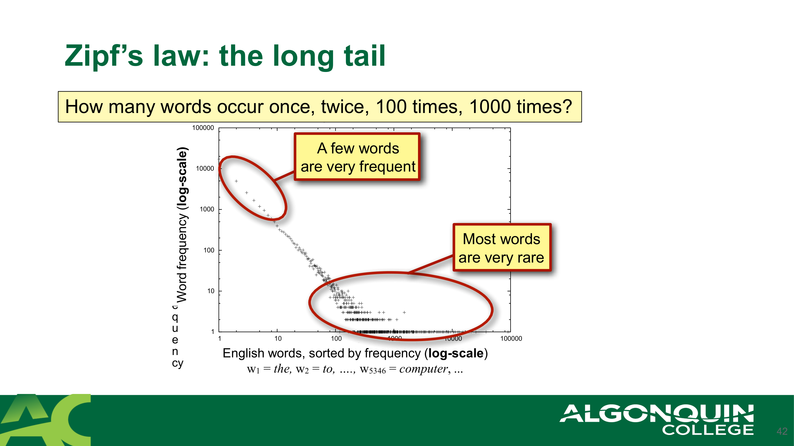

**Zipf's law: the long tail:** — 齐夫定律：长尾

- How many words occur once, twice, 100 times, 1000 times? — 有多少词出现过1次、2次、100次、1000次？
- A few words are very frequent — 少数词非常频繁
- Most words are very rare — 大多数词非常稀有
- English words, sorted by frequency (log-scale): w₁ = the, w₂ = to, …, w₅₃₄₆ = computer, ... — 英语单词按频率排序（对数尺度）

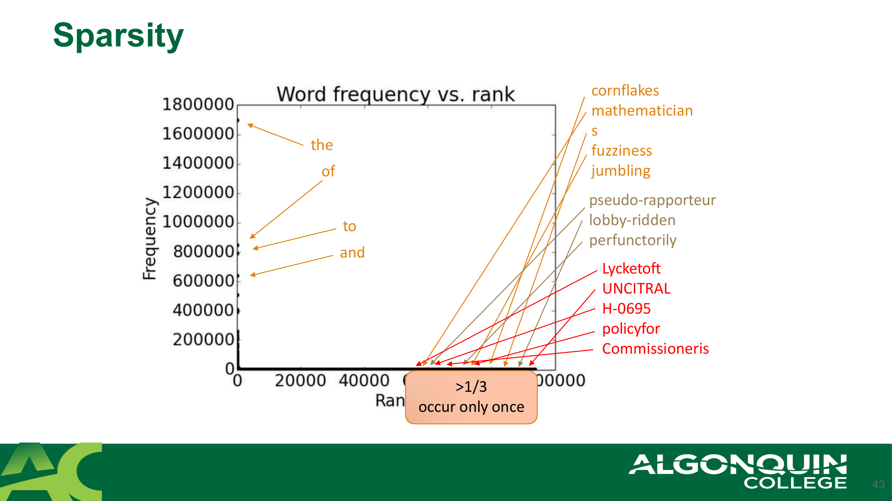

**Sparsity:** — 稀疏性

- Examples of rare/unique words: cornflakes, mathematician, fuzziness, jumbling, pseudo-rapporteur, lobby-ridden, perfunctorily, Lycketoft, UNCITRAL, H-0695, policyfor, Commissioneris
- > 1/3 of words occur only once
  >

> **📝 Notes:**
>
> **📌 What:**
> **(1) Zipf's Law (齐夫定律):**
>
> Word frequency follows a power law: if the most frequent word appears N times, the k-th most frequent word appears roughly N/k times. In any text corpus, a few words ("the", "of", "to") appear extremely often, while most words appear only once or twice.
>
>> 词频遵循幂律分布：如果最频繁的词出现N次，第k个最频繁的词大约出现N/k次。在任何文本语料库中，少数词（"the"、"of"、"to"）出现频率极高，而大多数词只出现一两次。
>>
>
> **🎯 Why:**
> **(1) The long tail makes NLP models hungry for data (长尾让NLP模型需要大量数据):**
>
> If >1/3 of words appear only once, a model trained on limited data will constantly encounter unseen words. This is the **out-of-vocabulary (OOV) problem** — the model has no representation for words it hasn't seen before.
>
>> 如果超过1/3的词只出现过一次，在有限数据上训练的模型会不断遇到未见过的词。这就是**未登录词（OOV）问题**——模型对没见过的词没有表示。
>>
>
> **💡 Intuition:**
> **(1) Iceberg analogy (冰山类比):**
>
> Common words are the tip of the iceberg — visible and well-understood. But >90% of unique words are the submerged part — rare, unseen, and hard to model. NLP must handle both the tip and the mass below.
>
>> 常用词是冰山一角——可见且充分理解。但超过90%的独特词是水下部分——稀有、未见、难以建模。NLP必须同时处理冰山尖和水下主体。
>>
>
> **⚠️ Pitfall:**
> **(1) Don't ignore rare words (不要忽视稀有词):**
>
> Rare words often carry the most meaning — proper nouns ("Lycketoft"), technical terms ("UNCITRAL"), and compound words. Dropping all rare words (a common preprocessing step) can destroy important information.
>
>> 稀有词往往携带最多信息——专有名词（"Lycketoft"）、技术术语（"UNCITRAL"）、复合词。丢弃所有稀有词（常见预处理步骤）可能会破坏重要信息。
>>
>
> **📝 Exam:**
> **(1) 概念题 (Conceptual):**
>
> "What is Zipf's law and why does it matter for NLP?" → Word frequency follows a power law distribution. It matters because most words are rare, creating the OOV problem where models encounter unseen words.
>
>> "什么是齐夫定律，为什么它对NLP重要？" → 词频遵循幂律分布。它重要是因为大多数词都是稀有的，产生了模型遇到未见词的OOV问题。
>>

### 4.3 变异性 (Variation)

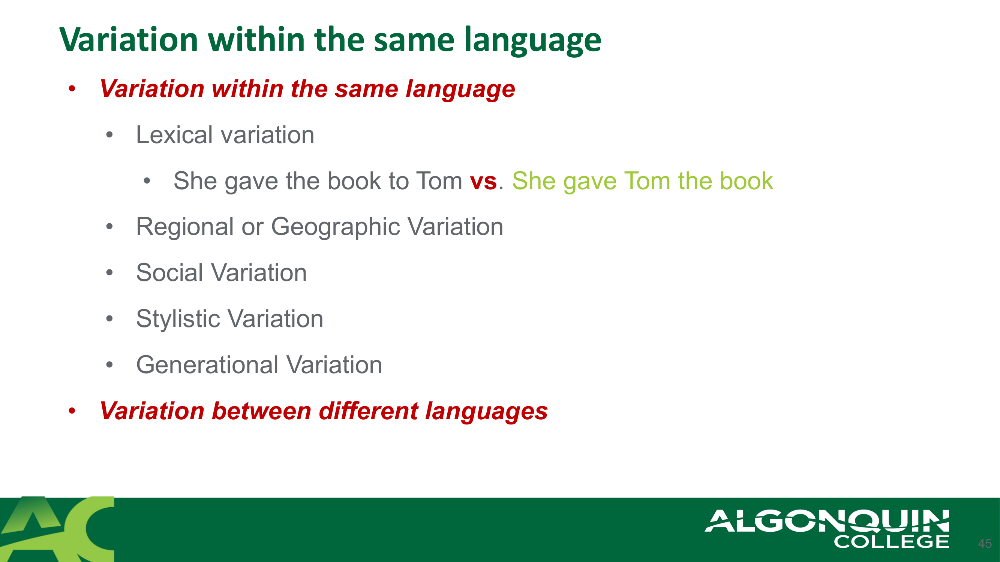

**Variation within the same language:** — 同一语言内的变异

- Lexical variation — She gave the book to Tom vs. She gave Tom the book — 词汇变异
- Regional or Geographic Variation — 地域或地理变异
- Social Variation — 社会变异
- Stylistic Variation — 风格变异
- Generational Variation — 代际变异
- Variation between different languages — 不同语言之间的变异

> **📝 Notes:**
>
> **📌 What:**
> **(1) Six types of variation (六种变异类型):**
>
> Lexical (word choice: "couch" vs "sofa"), syntactic (sentence structure: dative alternation), regional/geographic (British "lift" vs American "elevator"), social (formal vs slang), stylistic (academic vs casual), generational ("cool" vs "lit").
>
>> 词汇变异（用词："couch" vs "sofa"）、句法变异（句式：与格交替）、地域变异（英式"lift" vs 美式"elevator"）、社会变异（正式 vs 俗语）、风格变异（学术 vs 随意）、代际变异（"cool" vs "lit"）。
>>
>
> **🎯 Why:**
> **(1) Same meaning, infinite expressions (同一含义，无限表达):**
>
> "She gave the book to Tom" and "She gave Tom the book" mean the same thing but have different syntax. NLP models must recognize that these express the same intent — this is called **paraphrase detection**.
>
>> "她把书给了Tom"和"她给了Tom那本书"含义相同但句法不同。NLP模型必须识别它们表达相同意图——这叫做**释义检测**。
>>
>
> **💡 Intuition:**
> **(1) Accent analogy (口音类比):**
>
> Just as the same person sounds different in Texas vs London vs Mumbai, the same idea can be expressed with completely different words and structures. NLP must be robust to all these "accents" of writing.
>
>> 就像同一个人在德州、伦敦和孟买听起来不同，同一个想法可以用完全不同的词汇和结构表达。NLP必须对所有这些写作"口音"具有鲁棒性。
>>
>
> **📝 Exam:**
> **(1) 示例题 (Example):**
>
> "Give an example of linguistic variation that challenges NLP." → Regional variation: British "colour" vs American "color" — a model must know these are the same word.
>
>> "举一个挑战NLP的语言变异例子。" → 地域变异：英式"colour" vs 美式"color"——模型必须知道这是同一个词。
>>

### 4.4 常识知识 (Common Knowledge)

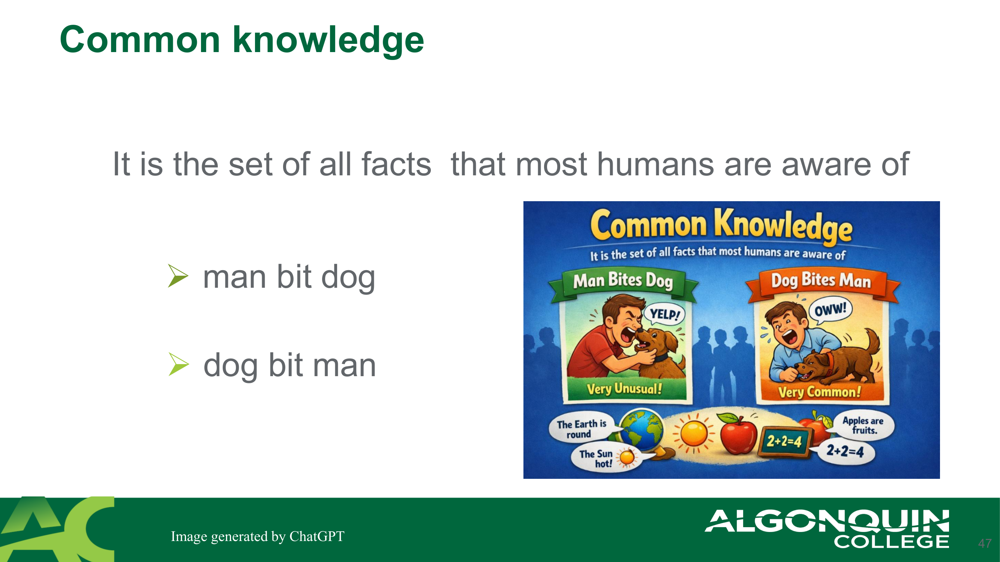

**Common knowledge:** — 常识知识

- It is the set of all facts that most humans are aware of — 大多数人类都知道的所有事实的集合
- ➢ man bit dog — 人咬狗（新闻！）
- ➢ dog bit man — 狗咬人（平常事）

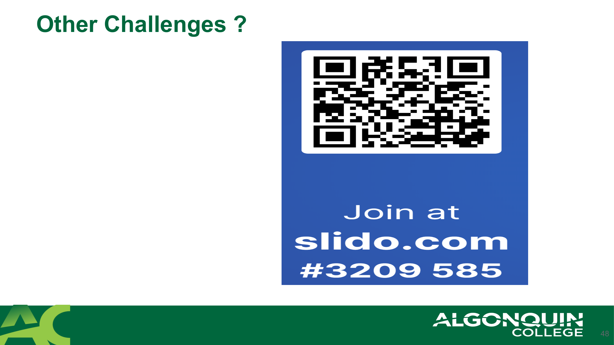

**Other Challenges?** — 其他挑战？

> **📝 Notes:**
>
> **🎯 Why:**
> **(1) Computers lack world knowledge (计算机缺乏世界知识):**
>
> "Man bit dog" is newsworthy; "dog bit man" is not. Both are grammatically valid, but humans instantly know which is unusual because of **common knowledge** — dogs bite people, not vice versa. NLP systems have no built-in world knowledge.
>
>> "人咬狗"是新闻；"狗咬人"不是。两者语法都正确，但人类立刻知道哪个不寻常，因为有**常识知识**——狗咬人而不是反过来。NLP系统没有内置的世界知识。
>>
>
> **💡 Intuition:**
> **(1) The "alien visitor" thought experiment ("外星访客"思想实验):**
>
> Imagine teaching an alien all English grammar and vocabulary but no facts about Earth. It could parse "the cat sat on the mat" perfectly but wouldn't know that cats sit on things and mats go on floors. That missing layer is common knowledge.
>
>> 想象教一个外星人所有英语语法和词汇但不教关于地球的任何事实。它能完美解析"猫坐在地毯上"，但不会知道猫会坐在东西上、地毯放在地板上。缺少的那层就是常识知识。
>>
>
> **⚠️ Pitfall:**
> **(1) LLMs still struggle with common sense (LLM仍然在常识上挨打):**
>
> Even GPT-4 makes common sense errors (e.g., "how many R's in strawberry?"). Statistical patterns ≠ genuine understanding. This remains one of the hardest unsolved problems in AI.
>
>> 即使GPT-4也会犯常识错误（如"草莓里有几个R？"）。统计模式 ≠ 真正理解。这仍然是AI中最难的未解问题之一。
>>
>
> **📝 Exam:**
> **(1) 推理题 (Reasoning):**
>
> "Why is common knowledge a challenge for NLP?" → Because computers have no built-in understanding of how the world works. They process text statistically without knowing that dogs bite people (not vice versa) or that ice is cold.
>
>> "为什么常识知识是NLP的挑战？" → 因为计算机没有内置的世界运作方式的理解。它们统计地处理文本，不知道狗咬人（不是反过来）或冰是冷的。
>>

---

## 5. NLP的方法 (Approaches to NLP)

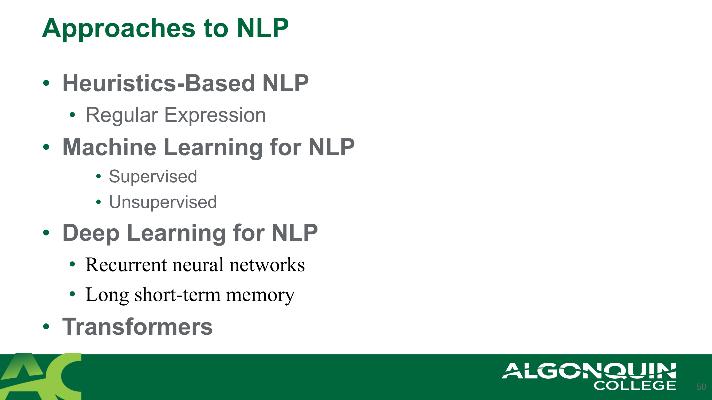

**Approaches to NLP:** — NLP的方法

- Heuristics-Based NLP — 基于启发式的NLP
  - Regular Expression — 正则表达式
- Machine Learning for NLP — 用于NLP的机器学习
  - Supervised — 监督学习
  - Unsupervised — 无监督学习
- Deep Learning for NLP — 用于NLP的深度学习
  - Recurrent neural networks — 循环神经网络
  - Long short-term memory — 长短期记忆网络
  - Transformers — Transformer架构

> **📝 Notes:**
>
> **📌 What:**
> **(1) Three eras of NLP (NLP的三个时代):**
>
> Heuristics-based (hand-written rules, regex) → Machine Learning (learn patterns from labeled data) → Deep Learning (learn representations automatically with neural networks). Each era didn't replace the previous — simpler methods are still used when appropriate.
>
>> 基于启发式（手写规则、正则表达式）→ 机器学习（从标注数据学习模式）→ 深度学习（用神经网络自动学习表示）。每个时代没有取代前一个——简单方法在合适时仍然使用。
>>
>
> **🎯 Why:**
> **(1) Regex is still king for patterns (正则表达式仍是模式之王):**
>
> For structured patterns (emails, phone numbers, dates), regex is faster, cheaper, and more reliable than any ML model. Don't use a Transformer to extract email addresses!
>
>> 对于结构化模式（邮箱、电话号码、日期），正则表达式比任何ML模型更快、更便宜、更可靠。不要用Transformer来提取邮箱地址！
>>
>
> **(2) Transformers changed everything (Transformer改变了一切):**
>
> The Transformer architecture (2017) enabled models to learn long-range dependencies in text, leading to BERT, GPT, and the current LLM revolution. This is the most important architecture in NLP history.
>
>> Transformer架构（2017）使模型能够学习文本中的长距离依赖关系，催生了BERT、GPT和当前的LLM革命。这是NLP历史上最重要的架构。
>>
>
> **⚖️ Compare:**
> **(1) Three approaches comparison:**
>
> | Approach              | Strengths                                | Weaknesses                               | Example          |
> | --------------------- | ---------------------------------------- | ---------------------------------------- | ---------------- |
> | Heuristics/Regex      | Fast, interpretable, no data needed      | Can't handle ambiguity, brittle          | Email extraction |
> | ML (Naive Bayes, SVM) | Learns from data, handles some variation | Needs feature engineering, labeled data  | Spam detection   |
> | DL (RNN, Transformer) | Learns representations, handles context  | Needs massive data, expensive, black box | ChatGPT, BERT    |
>
>> | 方法                   | 优势                     | 劣势                   | 示例          |
>> | ---------------------- | ------------------------ | ---------------------- | ------------- |
>> | 启发式/正则            | 快速、可解释、无需数据   | 无法处理歧义、脆弱     | 邮箱提取      |
>> | ML（NB、SVM）          | 从数据学习、处理部分变异 | 需特征工程、标注数据   | 垃圾邮件检测  |
>> | DL（RNN、Transformer） | 自学表示、处理上下文     | 需海量数据、昂贵、黑箱 | ChatGPT、BERT |
>>
>
> **📝 Exam:**
> **(1) 对比题 (Comparison):**
>
> "Compare rule-based and ML-based approaches to NLP." → Rule-based: fast, interpretable, but brittle and can't handle ambiguity. ML-based: learns patterns from data, handles variation, but needs labeled data and feature engineering.
>
>> "比较基于规则和基于ML的NLP方法。" → 规则：快、可解释，但脆弱且无法处理歧义。ML：从数据学习模式、处理变异，但需要标注数据和特征工程。
>>

---

## 6. Python中的NLP库 (NLP Libraries in Python)

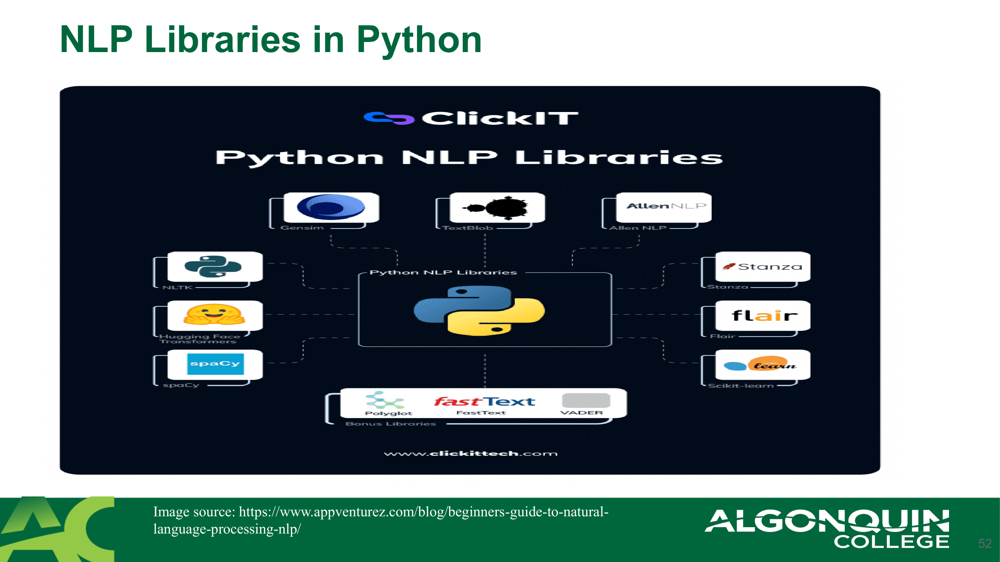

**NLP Libraries in Python:** — Python中的NLP库

Ref: https://www.appventurez.com/blog/beginners-guide-to-natural-language-processing-nlp/

> **📝 Notes:**
>
> **📌 What:**
> **(1) Key Python NLP libraries (主要的Python NLP库):**
>
> **NLTK** (Natural Language Toolkit): oldest, most educational, great for learning. **spaCy**: industrial-strength, fast, production-ready. **Hugging Face Transformers**: state-of-the-art pretrained models (BERT, GPT). **Gensim**: topic modeling and word embeddings. **TextBlob**: simple API for common tasks.
>
>> **NLTK**（自然语言工具包）：最古老、最有教育意义、适合学习。**spaCy**：工业级、快速、生产就绪。**Hugging Face Transformers**：最先进的预训练模型（BERT、GPT）。**Gensim**：主题建模和词嵌入。**TextBlob**：常见任务的简单API。
>>
>
> **⚖️ Compare:**
> **(1) NLTK vs spaCy:**
>
> | Feature  | NLTK                  | spaCy                     |
> | -------- | --------------------- | ------------------------- |
> | Focus    | Education, research   | Production, speed         |
> | Speed    | Slower                | 10-100x faster            |
> | API      | Modular, many choices | Opinionated, one best way |
> | Best for | Learning NLP concepts | Building NLP products     |
>
>> | 特性   | NLTK           | spaCy                  |
>> | ------ | -------------- | ---------------------- |
>> | 重点   | 教育、研究     | 生产、速度             |
>> | 速度   | 较慢           | 快10-100倍             |
>> | API    | 模块化、多选择 | 带观点的、一种最佳方式 |
>> | 最适合 | 学习NLP概念    | 构建NLP产品            |
>>
>
> **📝 Exam:**
> **(1) 工具选择题 (Tool selection):**
>
> "Which Python library would you use for a production NLP pipeline?" → spaCy for fast text processing, or Hugging Face Transformers for state-of-the-art model inference.
>
>> "你会用哪个Python库来构建生产NLP管道？" → spaCy用于快速文本处理，或Hugging Face Transformers用于最先进的模型推理。
>>

---

## 7. 总结与下周预告 (Summary & Next Week Preview)

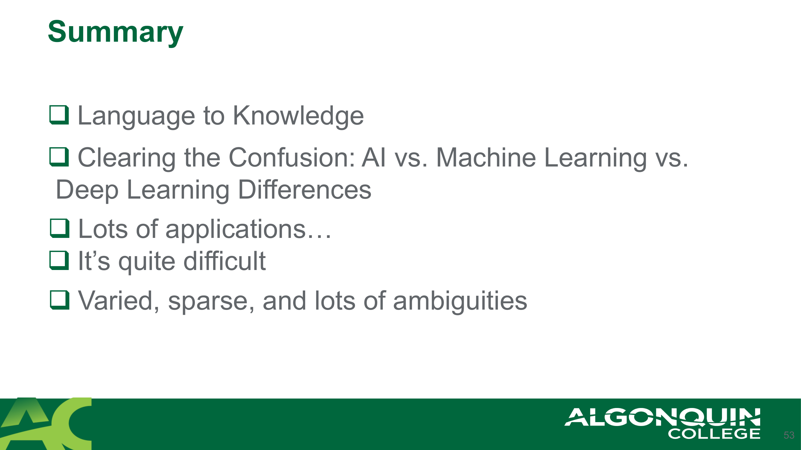

**Summary:** — 总结

- ❑ Language to Knowledge — 从语言到知识
- ❑ Clearing the Confusion: AI vs. Machine Learning vs. Deep Learning Differences — 澄清混淆：AI vs 机器学习 vs 深度学习的区别
- ❑ Lots of applications… — 大量应用…
- ❑ It's quite difficult — 非常困难
- ❑ Varied, sparse, and lots of ambiguities — 变异、稀疏、大量歧义

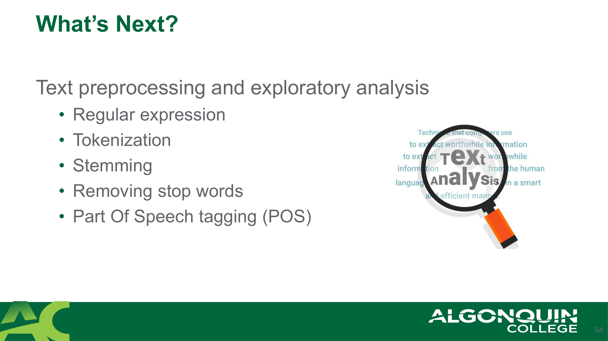

**What's Next? — Text preprocessing and exploratory analysis:** — 下周预告——文本预处理和探索性分析

- Regular expression — 正则表达式
- Tokenization — 分词/词元化
- Stemming — 词干提取
- Removing stop words — 去除停用词
- Part Of Speech tagging (POS) — 词性标注
