# Week 3: 文本向量化与相似度 (Text Vectorization & Similarity)

> Source: `lecture_3_W26.pdf`
> Total slides: 48
> Instructor: Hala Own, Ph.D.

---

## 1. 课程议程 (Lesson Agenda)

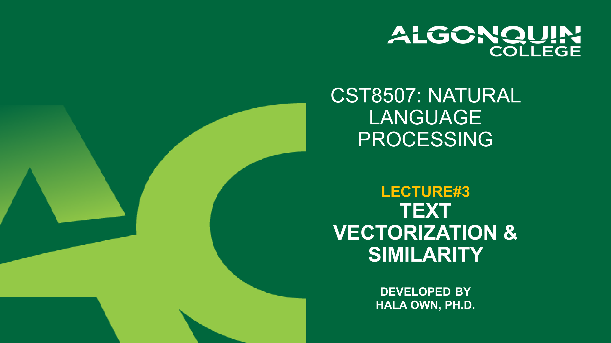

**CST8507: Natural Language Processing — Lecture #3: Text Vectorization & Similarity** — CST8507自然语言处理，第3讲：文本向量化与相似度

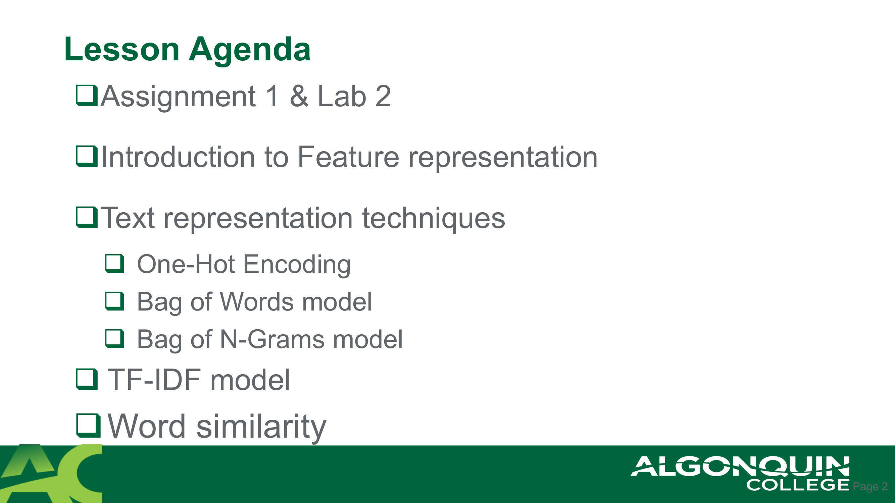

**Lesson Agenda:** — 本节课议程：

- ❑Assignment 1 & Lab — 作业1和实验
- ❑Introduction to Feature representation — 特征表示概述
- ❑Text representation techniques — 文本表示技术
  - ❑ One-Hot Encoding — 独热编码
  - ❑ Bag of Words model — 词袋模型
  - ❑ Bag of N-Grams model — N元词袋模型
  - ❑ TF-IDF model — TF-IDF模型
- ❑ Word similarity — 词语相似度

---

## 2. NLP开发生命周期 (NLP Development Life Cycle)

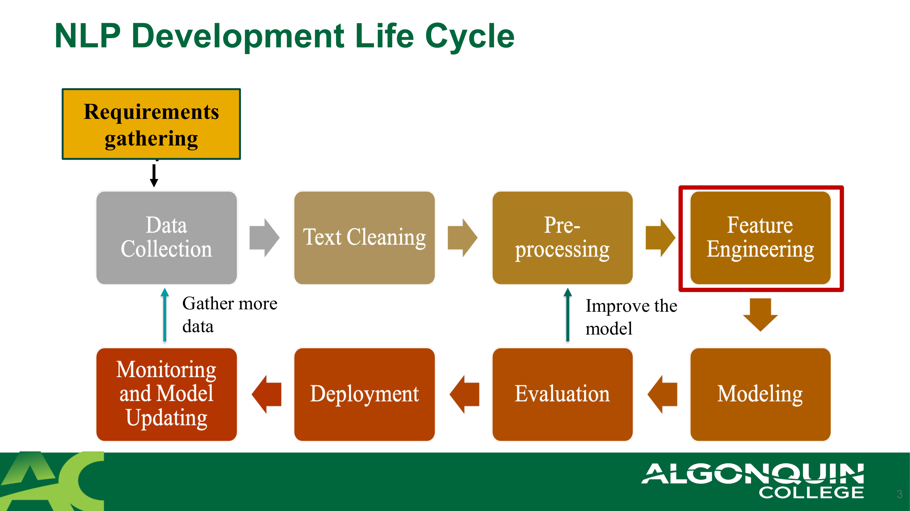

**NLP Development Life Cycle:** Circular pipeline diagram — 8 stages looping: Requirements gathering → Data collection → Text preprocessing → Feature extraction → Model building → Evaluation → Deployment → Gather more data / Improve the model. — NLP开发生命周期循环流程图——8个阶段：需求收集→数据收集→文本预处理→特征提取→模型构建→评估→部署→收集更多数据/改进模型。

---

## 3. 特征表示 (Feature Representation)

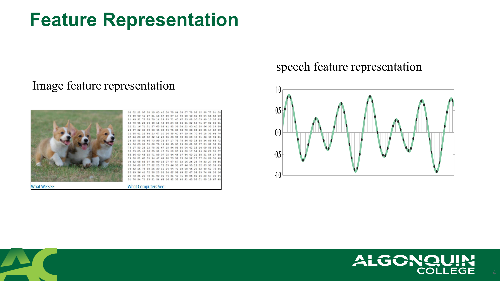

**Feature Representation:** Three-column diagram showing each data modality (speech, image, text) maps to its own representation form. — 三列示意图，展示语音、图像、文本三种数据模态各自对应不同的表示形式。

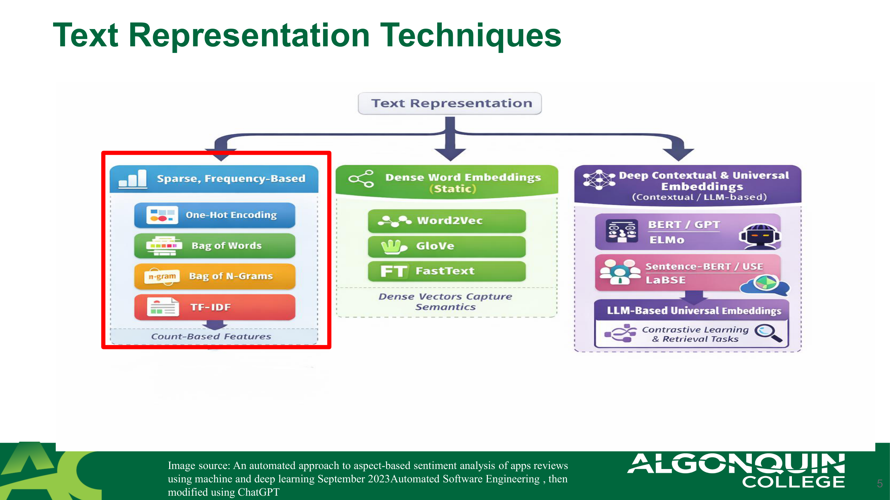

**Text Representation Techniques:** Taxonomy tree from traditional sparse methods (One-Hot, BOW, N-Gram, TF-IDF) to modern dense neural embeddings (Word2Vec, GloVe, FastText, BERT). — 文本表示方法全景树状图：从传统稀疏方法（One-Hot/BOW/N-Gram/TF-IDF）到现代稠密神经嵌入（Word2Vec/GloVe/FastText/BERT）。

Ref: An automated approach to aspect-based sentiment analysis of apps reviews using machine and deep learning, September 2023, Automated Software Engineering


---

## 4. 向量空间模型 (Vector Space Model)

### 4.1 概念介绍 (Concept Introduction)

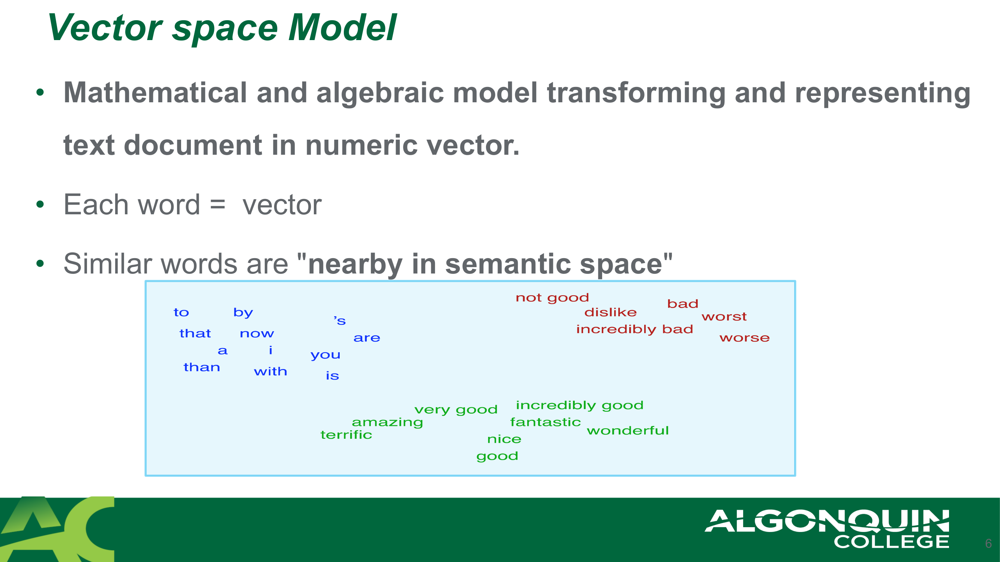

**Vector Space Model:** Mathematical model that represents text as numeric vectors in high-dimensional space; similar words end up "nearby." — 数学模型，将文本表示为高维空间中的数值向量；语义相似的词在空间中距离相近。

- Mathematical and algebraic model transforming and representing text document in numeric vector. — 数学和代数模型，将文本文档转换并表示为数值向量。
- Each word = vector — 每个词 = 向量
- Similar words are "nearby in semantic space" — 相似的词在"语义空间中靠近"

### 4.2 向量基础 (Vector Basics)

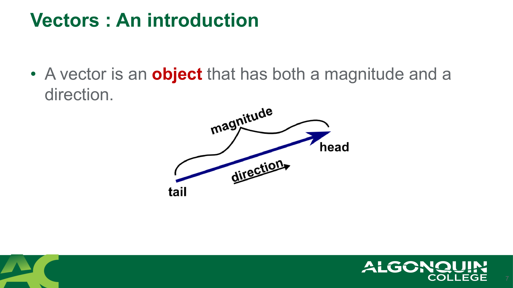

**Vectors: An introduction:** Slide introducing vectors as objects with both magnitude and direction. — 向量简介：向量是同时具有大小（模）和方向的数学对象。

- A vector is an object that has both a magnitude and a direction. — 向量是同时具有大小和方向的对象。

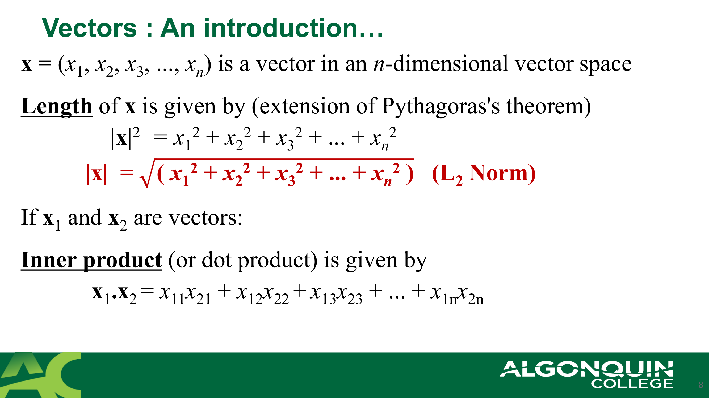

**Vectors: An introduction (continued):** Formulas for vector length (L₂ norm) and inner product (dot product) in n-dimensional space. — 续：n维空间中向量长度（L₂范数）和内积（点积）的公式推导。

- x = (x₁, x₂, x₃, ..., xₙ) is a vector in an n-dimensional vector space — x = (x₁, x₂, x₃, ..., xₙ) 是n维向量空间中的一个向量
- Length of x is given by (extension of Pythagoras's theorem): — x的长度由（勾股定理的推广）给出：
  - |x|² = x₁² + x₂² + x₃² + ... + xₙ²
  - |x| = √(x₁² + x₂² + x₃² + ... + xₙ²) (L₂ Norm / L₂范数)
- If x₁ and x₂ are vectors: — 如果x₁和x₂是向量：
  - Inner product (or dot product) is given by: x₁·x₂ = x₁₁x₂₁ + x₁₂x₂₂ + x₁₃x₂₃ + ... + x₁ₙx₂ₙ — 内积（或点积）为：x₁·x₂ = x₁₁x₂₁ + x₁₂x₂₂ + x₁₃x₂₃ + ... + x₁ₙx₂ₙ

### 4.3 文本向量化 (Text Vectorizing)

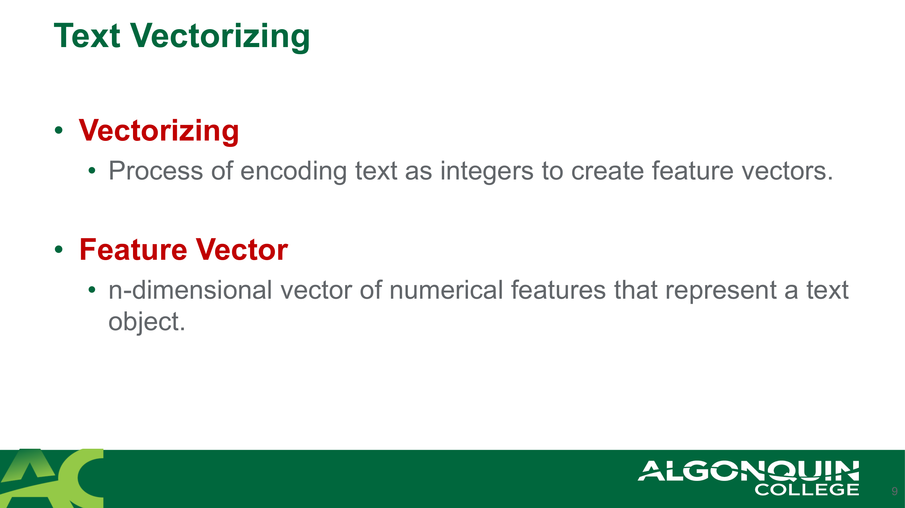

**Text Vectorizing:** Defines vectorizing (encoding text as integers) and feature vector (n-dimensional numerical representation of a text). — 定义向量化（将文本编码为整数）和特征向量（文本的n维数值表示）。

- **Vectorizing:** Process of encoding text as integers to create feature vectors. — **向量化：** 将文本编码为整数以创建特征向量的过程。
- **Feature Vector:** n-dimensional vector of numerical features that represent a text object. — **特征向量：** 表示文本对象的n维数值特征向量。


---

## 5. 独热编码 (One-Hot Encoding)

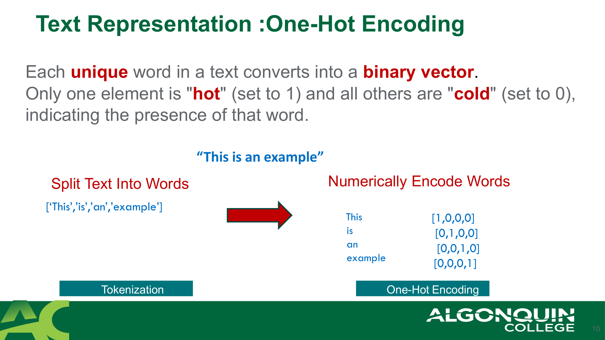

**Text Representation: One-Hot Encoding:** Shows tokenization of "This is an example" into 4 words, then encoding each word as a 4-dim binary vector with exactly one 1. — 展示将"This is an example"分词为4词，每个词用一个4维二进制向量表示，只有对应位为1。

- Each unique word in a text converts into a binary vector. — 文本中的每个唯一词都转换为二进制向量。
- Only one element is "hot" (set to 1) and all others are "cold" (set to 0), indicating the presence of that word. — 只有一个元素是"热的"（设为1），其余都是"冷的"（设为0），表示该词是否出现。
- "This is an example"
  - Split Text Into Words (Tokenization): ['This','is','an','example'] — 将文本分割成词（分词）：['This','is','an','example']
  - Numerically Encode Words (One-Hot Encoding): — 数值编码词（独热编码）：
    - This → [1,0,0,0]
    - is → [0,1,0,0]
    - an → [0,0,1,0]
    - example → [0,0,0,1]

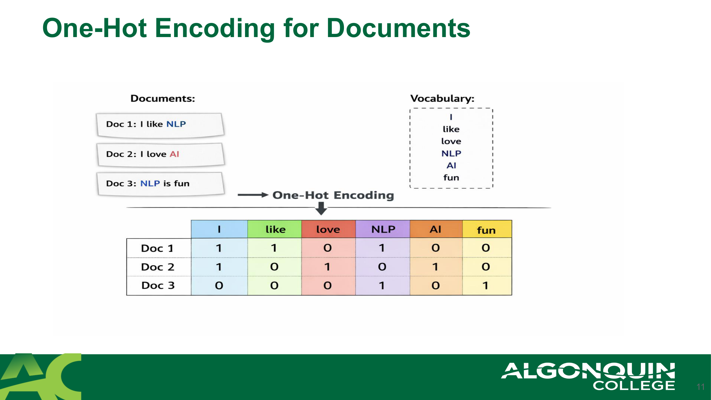

**One-Hot Encoding for Documents:** Vocabulary × Documents matrix where each row is a one-hot vector and each column represents one document. — 词表×文档矩阵，每行是一个独热向量，每列代表一个文档。


**One-Hot Encoding — Discussion:** Slide summarizing pros and cons: simple but sparse, no semantic relationships, high dimensionality. — 总结优缺点：简单直观，但稀疏、无语义关系、高维度。


---

## 6. 词袋模型 (Bag of Words — BOW)

### 6.1 概念介绍 (Concept Introduction)

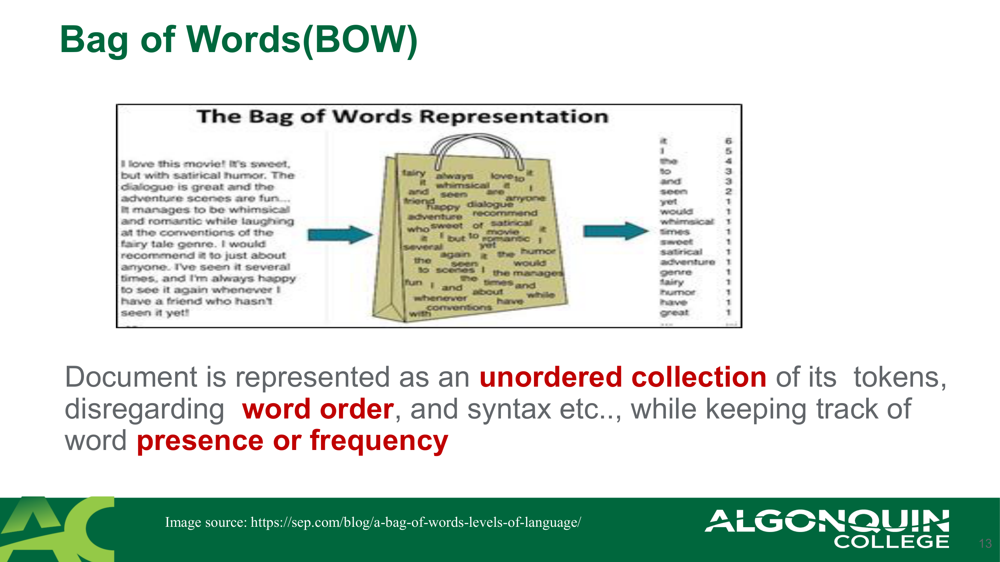

**Bag of Words (BOW):** Illustrates the "bag" concept — words are treated as an unordered collection, ignoring grammar and position, only tracking frequency. — 图解"词袋"概念：词被视为无序集合，忽略语法和位置，只记录出现频率。

- Document is represented as an unordered collection of its tokens, disregarding word order, and syntax etc., while keeping track of word presence or frequency — 文档被表示为其词符的无序集合，忽略词序、语法等，同时跟踪词的出现与否或频率

Ref: https://sep.com/blog/a-bag-of-words-levels-of-language/

### 6.2 计数向量化 (Count Vectorization)

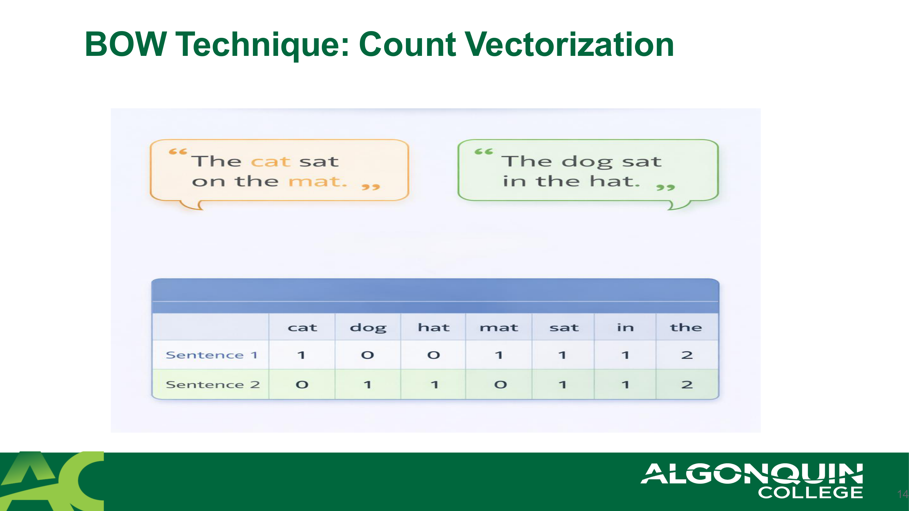

**BOW Technique: Count Vectorization:** Diagram showing 3 sample documents being mapped into a shared vocabulary then converted to count vectors (Document-Term Matrix). — 图示3个示例文档被映射到共享词表后转换为计数向量（文档-词项矩阵）。

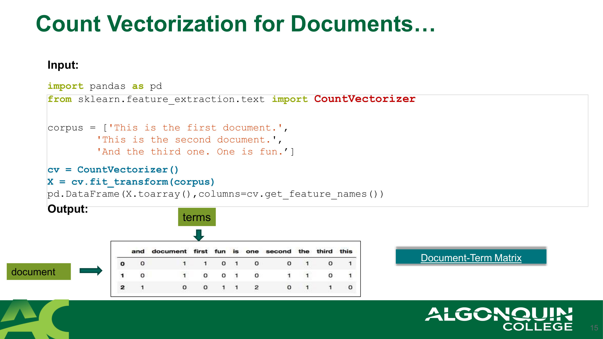

**Count Vectorization for Documents — Code Example:** sklearn CountVectorizer code and the resulting Document-Term Matrix output. — sklearn CountVectorizer 代码及其输出的文档-词项矩阵。

```python
import pandas as pd
from sklearn.feature_extraction.text import CountVectorizer
corpus = ['This is the first document.',
          'This is the second document.',
          'And the third one. One is fun.']
cv = CountVectorizer()
X = cv.fit_transform(corpus)
pd.DataFrame(X.toarray(), columns=cv.get_feature_names())
```

Output: Document-Term Matrix showing word frequencies across all documents. — 输出：文档-词项矩阵，展示所有文档中每个词的频次。

### 6.3 词序丢失问题 (Word Order Loss)

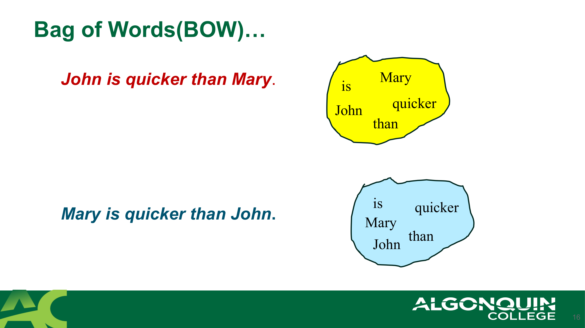

**Bag of Words (BOW) — Word Order Issue:** Demonstrates that "John is quicker than Mary" and "Mary is quicker than John" produce the same BOW vector — completely losing the opposite meaning. — 演示"John is quicker than Mary"和"Mary is quicker than John"产生相同BOW向量——含义相反但表示完全相同。

- "John is quicker than Mary" and "Mary is quicker than John" produce the same BOW vector — word order is completely lost. — "John is quicker than Mary"和"Mary is quicker than John"产生相同的BOW向量——词序完全丢失。

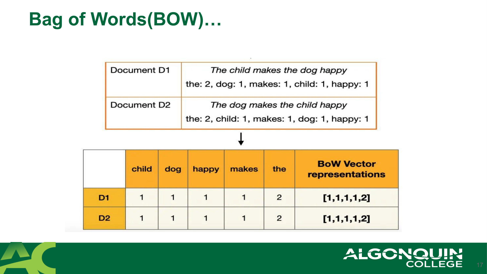

**Bag of Words (BOW) — Additional example:** Another document pair showing identical BOW representations despite different word order. — 另一个文档对示例，展示不同词序产生相同BOW表示。

### 6.4 优缺点 (Advantages & Disadvantages)

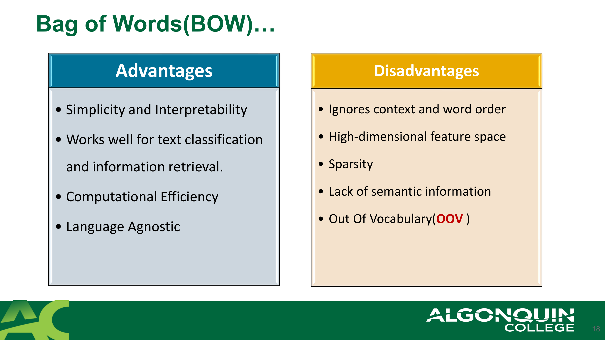

**Bag of Words (BOW) — Advantages vs Disadvantages:** Two-column summary slide comparing BOW's strengths (simple, efficient, language-agnostic) against its weaknesses (no word order, sparse, no semantics, OOV). — 双列摘要幻灯片对比BOW的优点（简单、高效、语言无关）和缺点（无词序、稀疏、无语义、OOV）。

| Advantages                                                                            | Disadvantages                                     |
| ------------------------------------------------------------------------------------- | ------------------------------------------------- |
| Simplicity and Interpretability — 简单性与可解释性                                    | Ignores context and word order — 忽略上下文和词序 |
| Works well for text classification and information retrieval — 适合文本分类和信息检索 | High-dimensional feature space — 高维特征空间     |
| Computational Efficiency — 计算效率高                                                 | Sparsity — 稀疏性                                 |
| Language Agnostic — 语言无关性                                                        | Lack of semantic information — 缺乏语义信息       |
|                                                                                       | Out Of Vocabulary (OOV) — 词汇表外词语（OOV）     |


---

## 7. N-Gram词袋模型 (Bag of N-Grams — BON)

### 7.1 概念介绍 (Concept Introduction)

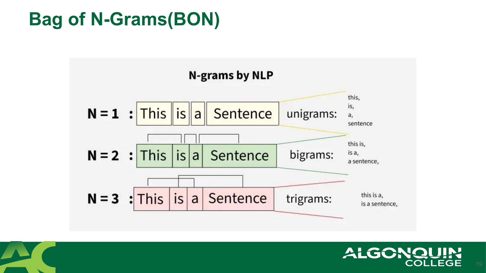

**Bag of N-Grams (BON):** Introduces the concept — instead of single words, uses N consecutive words as features. Reduces the word-order problem of plain BOW. — 介绍N-Gram概念：以N个连续词为特征单元，部分保留了BOW中完全丢失的词序信息。

### 7.2 N-Gram类型 (N-Gram Types)

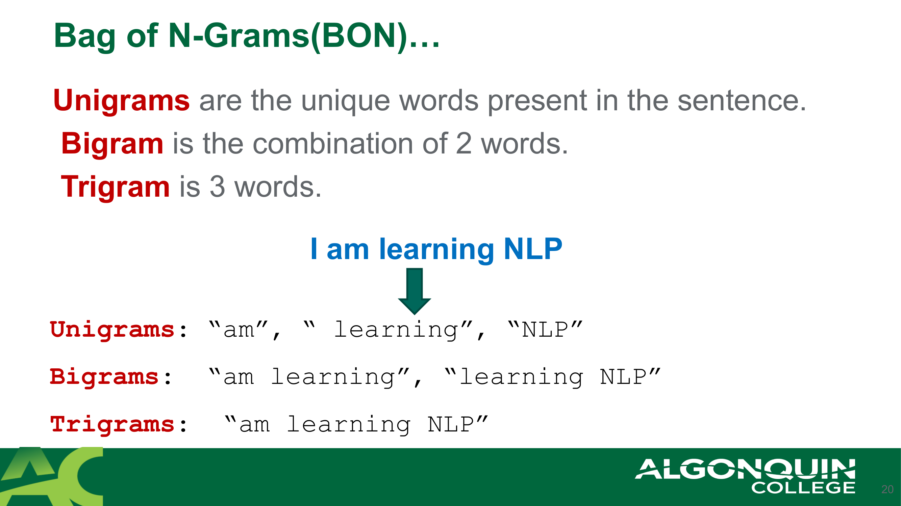

**Bag of N-Grams (BON) — Types:** Three types shown with example "I am learning NLP": Unigrams (single words), Bigrams (2-word sequences), Trigrams (3-word sequences). — 以"I am learning NLP"为例展示三种粒度：Unigram（单词）、Bigram（双词序列）、Trigram（三词序列）。

- Unigrams are the unique words present in the sentence. — Unigram是句子中出现的唯一词语。
- Bigram is the combination of 2 words. — Bigram是2个词的组合。
- Trigram is 3 words. — Trigram是3个词。
- Example: "I am learning NLP" — 示例："I am learning NLP"
  - Unigrams: "am", "learning", "NLP"
  - Bigrams: "am learning", "learning NLP"
  - Trigrams: "am learning NLP"

### 7.3 优缺点 (Advantages & Disadvantages)

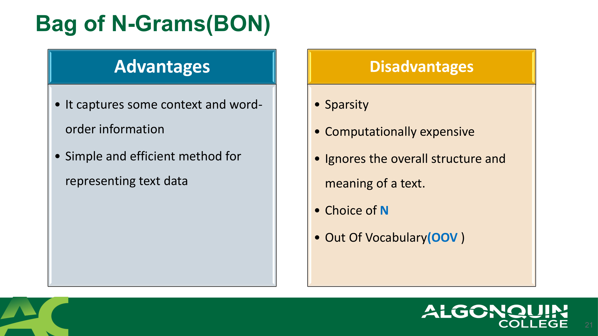

**Bag of N-Grams (BON) — Advantages vs Disadvantages:** Two-column slide; left: captures context/word-order, simple and efficient; right: sparsity, expensive, ignores overall meaning, OOV, hard to choose N. — 双列对比；左：捕获上下文/词序、简单高效；右：稀疏、计算开销大、忽略整体语义、OOV、N难以选择。

| Advantages                                                                      | Disadvantages                                                            |
| ------------------------------------------------------------------------------- | ------------------------------------------------------------------------ |
| It captures some context and word-order information — 捕获部分上下文和词序信息  | Sparsity — 稀疏性                                                        |
| Simple and efficient method for representing text data — 简单高效的文本表示方法 | Computationally expensive — 计算开销大                                   |
|                                                                                 | Ignores the overall structure and meaning of a text — 忽略整体结构和语义 |
|                                                                                 | Choice of N — N的选择困难                                                |
|                                                                                 | Out Of Vocabulary (OOV) — 词汇表外词语                                   |


---

## 8. TF-IDF模型 (Term Frequency-Inverse Document Frequency)

### 8.1 直觉理解 (TF-IDF Intuition)

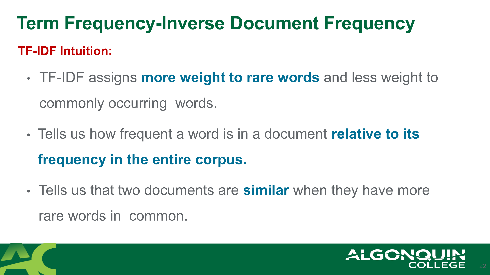

**Term Frequency-Inverse Document Frequency — Intuition:** Explains the core idea: rare words get higher weight, common words get lower weight; similarity = shared rare words. — 核心思想：稀有词权重高，常见词权重低；两文档越相似，共有的稀有词越多。

- TF-IDF assigns more weight to rare words and less weight to commonly occurring words. — TF-IDF给稀有词赋予更高权重，给常见词赋予更低权重。
- Tells us how frequent a word is in a document relative to its frequency in the entire corpus. — 告诉我们一个词在文档中的频率相对于其在整个语料库中的频率。
- Tells us that two documents are similar when they have more rare words in common. — 告诉我们当两个文档共有更多稀有词时，它们更相似。


**TF-IDF score = TF × IDF** — TF-IDF分数 = 词频 × 逆文档频率

### 8.2 词频 (Term Frequency)

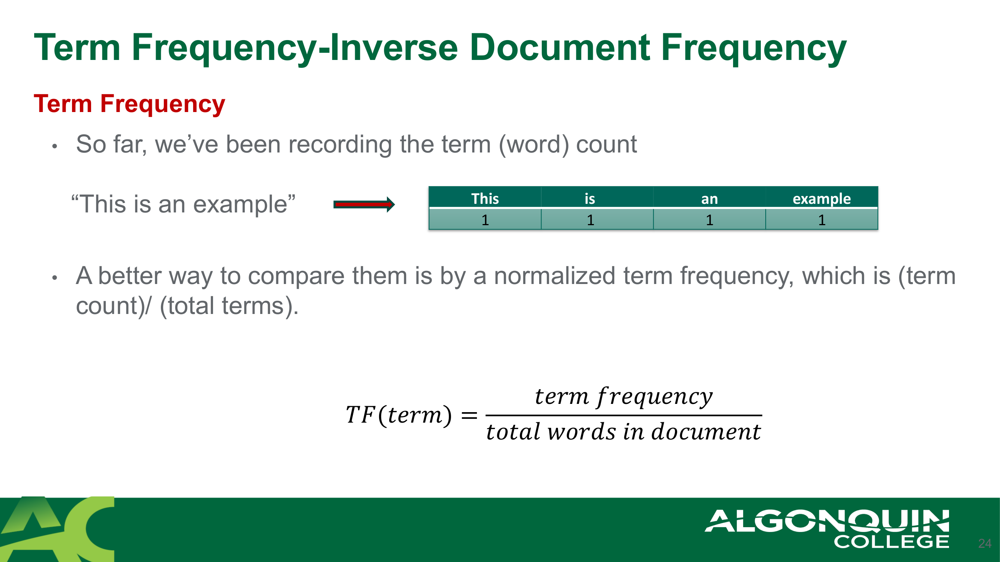

**Term Frequency:** Motivates normalizing raw count by document length — TF(term) = count / total terms. — 词频：用文档长度归一化原始计数——TF(词) = 词出现次数 / 文档总词数。

- So far, we've been recording the term (word) count — 目前我们只是记录词的原始计数
- A better way to compare is by a normalized term frequency: (term count) / (total terms) — 更好的做法是用归一化词频：词计数 / 总词数
- TF(term) = (Number of times term appears in document) / (Total number of terms in document) — TF(词) = 词在文档中出现次数 / 文档中总词数

### 8.3 逆文档频率 (Inverse Document Frequency)

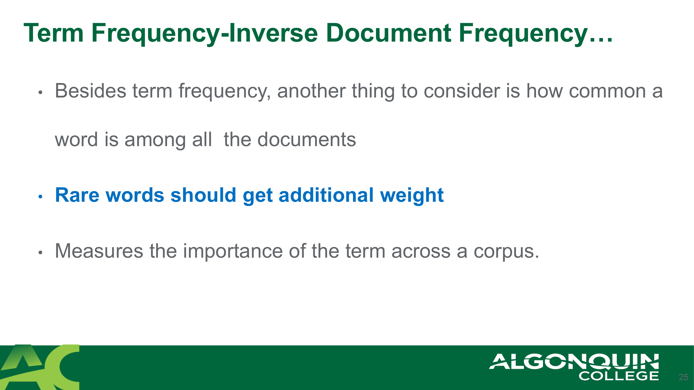

**Inverse Document Frequency:** Introduces the need to weight by global rarity — words appearing in all documents should get low weight. — 逆文档频率：引入全局稀有度加权——在所有文档中都出现的词应获得低权重。

- Besides term frequency, another thing to consider is how common a word is among all the documents — 除了词频，还需要考虑词在所有文档中的普遍程度
- Rare words should get additional weight — 稀有词应获得额外权重
- Measures the importance of the term across a corpus — 衡量词在整个语料库中的重要性

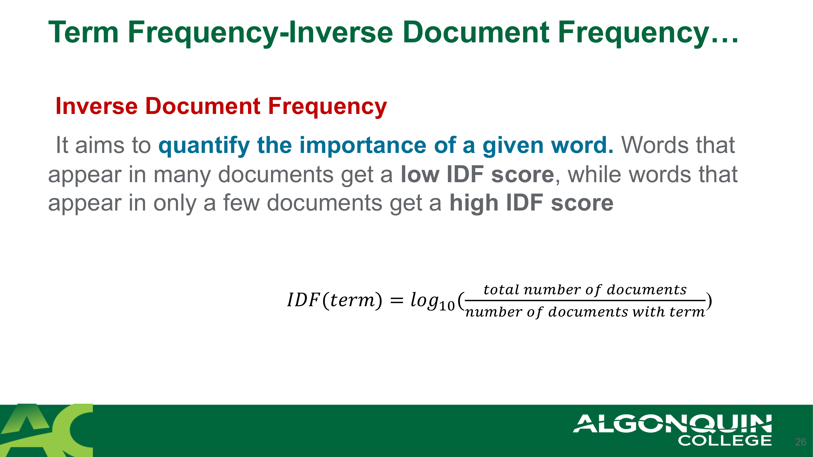

**IDF Formula:** IDF(term) = log(N / df) where N = total docs, df = docs containing the term. Log compresses extreme values. — IDF公式：IDF(词) = log(N / df)，N=总文档数，df=包含该词的文档数；log压缩极端值。

- IDF(term) = log(Total number of documents / Number of documents containing the term) — IDF(词) = log(总文档数 / 包含该词的文档数)
- Words that appear in many documents get a low IDF score — 在很多文档中出现的词得到低IDF分数
- Words that appear in only a few documents get a high IDF score — 只在少数文档中出现的词得到高IDF分数

### 8.4 TF-IDF计算 (TF-IDF Calculation)

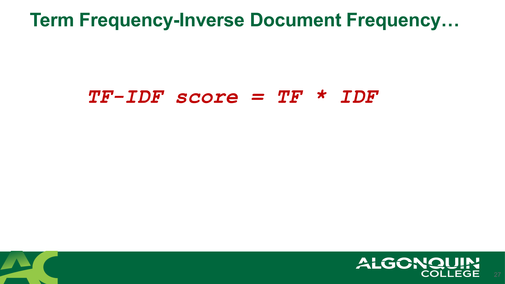

**TF-IDF score = TF × IDF** — TF-IDF分数 = TF × IDF，兼顾局部频率与全局稀有度

### 8.5 TF-IDF示例 (TF-IDF Example)

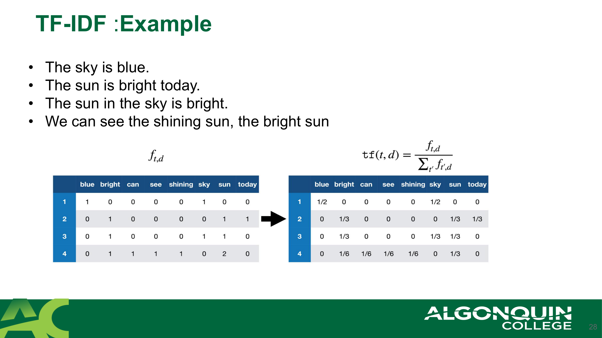

**TF-IDF Example — Documents:** Four example documents about sky/sun/brightness used to demonstrate TF-IDF computation. — 四个关于天空/太阳/亮度的示例文档，用于演示TF-IDF计算。

- The sky is blue.
- The sun is bright today.
- The sun in the sky is bright.
- We can see the shining sun, the bright sun.

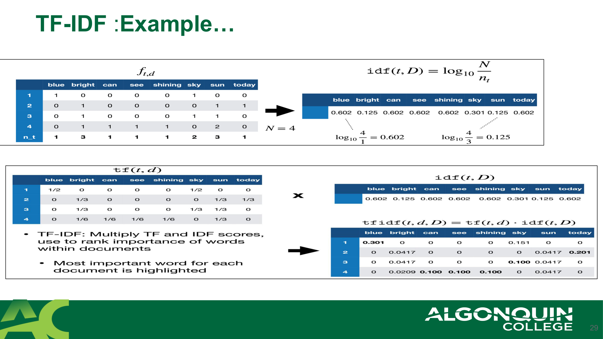

**TF-IDF Example — Calculation:** Matrix showing TF, IDF, and TF-IDF scores for each term across all four documents. — 矩阵展示4个文档中每个词的TF、IDF、TF-IDF分值。

### 8.6 课堂练习 (Group Work)

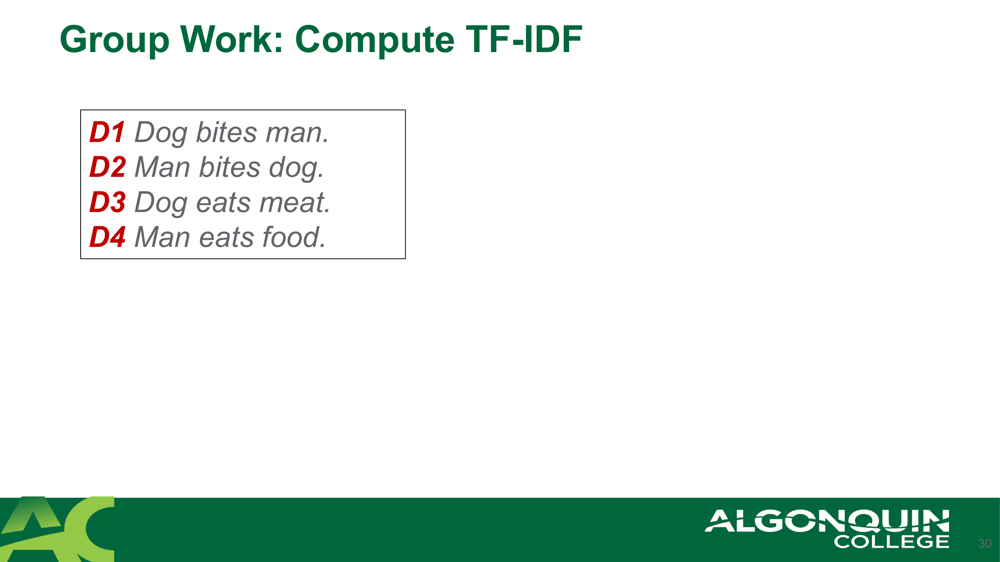

**Group Work: Compute TF-IDF** — 小组作业：计算TF-IDF

- D1: Dog bites man.
- D2: Man bites dog.
- D3: Dog eats meat.
- D4: Man eats food.

### 8.7 CountVectorizer vs TfidfVectorizer

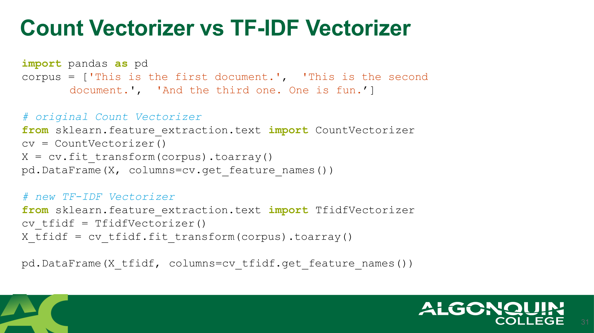

**Count Vectorizer vs TF-IDF Vectorizer — Code:** Side-by-side sklearn code using CountVectorizer and TfidfVectorizer on the same corpus. — sklearn代码对比：在相同语料库上使用CountVectorizer和TfidfVectorizer。

```python
import pandas as pd
corpus = ['This is the first document.', 'This is the second document.', 'And the third one. One is fun.']

# original Count Vectorizer
from sklearn.feature_extraction.text import CountVectorizer
cv = CountVectorizer()
X = cv.fit_transform(corpus).toarray()
pd.DataFrame(X, columns=cv.get_feature_names())

# new TF-IDF Vectorizer
from sklearn.feature_extraction.text import TfidfVectorizer
cv_tfidf = TfidfVectorizer()
X_tfidf = cv_tfidf.fit_transform(corpus).toarray()
pd.DataFrame(X_tfidf, columns=cv_tfidf.get_feature_names())
```

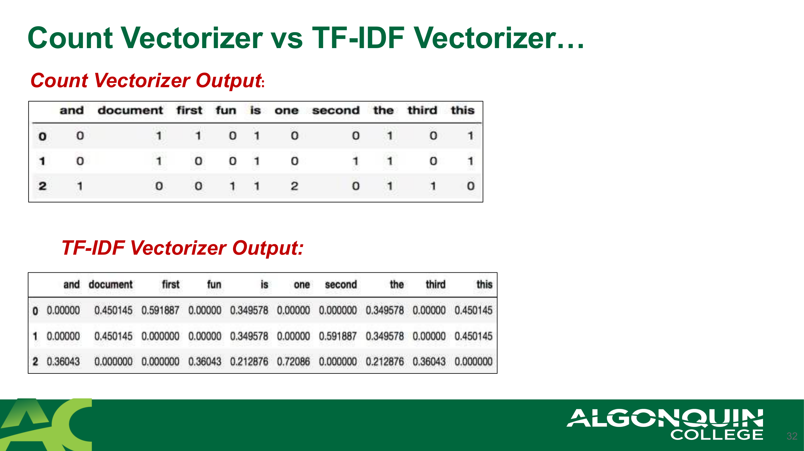

**Count Vectorizer vs TF-IDF Vectorizer — Output:** Side-by-side output showing how common words ("the", "is") get high counts in CountVectorizer but low TF-IDF weights. — 对比输出：常见词（"the"、"is"）在CountVectorizer中计数高，但TF-IDF权重低。

### 8.8 为什么需要log (Why We Need log)

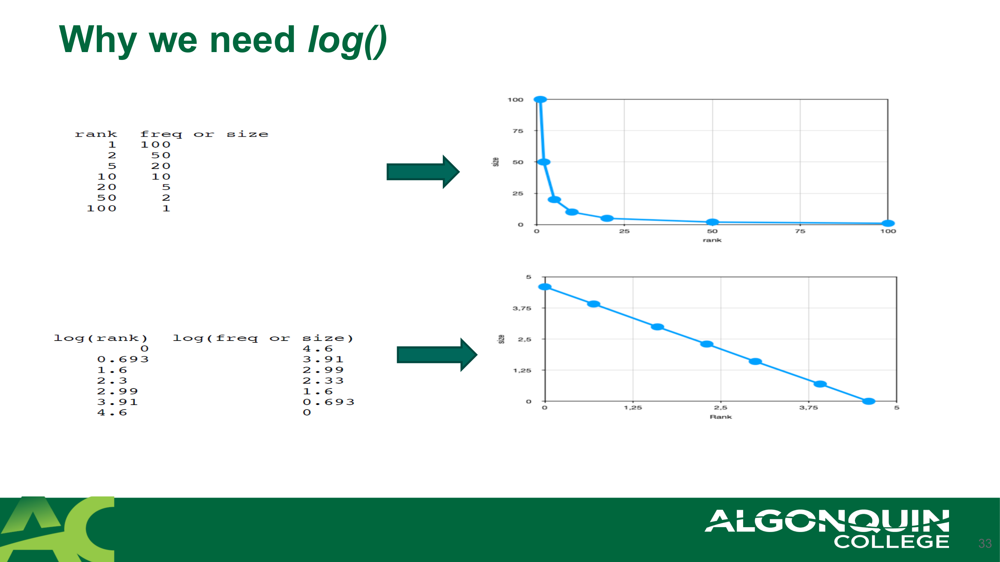

**Why we need log():** Chart/explanation showing that without log, IDF for a very rare word could be millions — log compresses the scale to a manageable range. — 说明若无log，极稀有词的IDF值可达百万级；log将其压缩到可用范围内。

### 8.9 TF-IDF局限性 (TF-IDF Limitations)

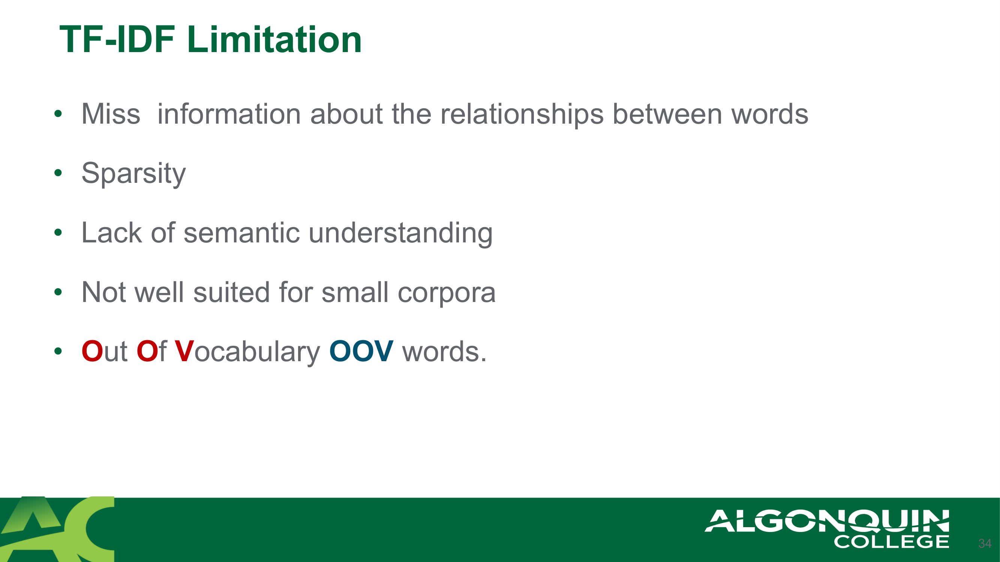

**TF-IDF Limitations:** Five listed limitations — no word relationships, sparsity, no semantic understanding, poor for small corpora, OOV. — 五项局限性：无词间关系、稀疏、无语义理解、小语料库效果差、OOV问题。

- Miss information about the relationships between words — 缺失词语之间的关系信息
- Sparsity — 稀疏性
- Lack of semantic understanding — 缺乏语义理解
- Not well suited for small corpora — 不适合小语料库
- Out Of Vocabulary (OOV) words — 词汇表外词语（OOV）


---

## 9. 文本相似度度量 (Text Similarity Measures)

### 9.1 概述 (Overview)

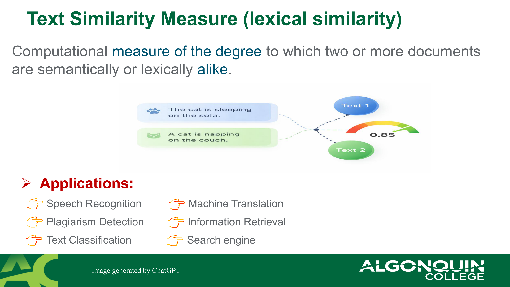

**Text Similarity Measure (lexical similarity):** Defines text similarity as a computational measure of how alike two documents are, with 6 application areas listed. — 定义文本相似度：衡量两个文档相似程度的计算度量，列举了6个应用领域。

- Computational measure of the degree to which two or more documents are semantically or lexically alike. — 计算两个或多个文档在语义或词汇上相似程度的度量。
- Applications: Speech Recognition, Machine Translation, Plagiarism Detection, Information Retrieval, Text Classification, Search engine — 应用：语音识别、机器翻译、抄袭检测、信息检索、文本分类、搜索引擎

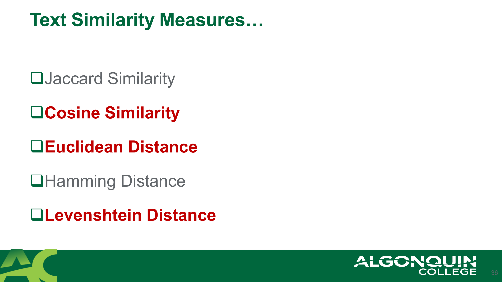

**Text Similarity Measures — Types:** Five common similarity measures listed as agenda items. — 列出5种常见的文本相似度度量方法。

- ❑Jaccard Similarity — Jaccard相似度
- ❑Cosine Similarity — 余弦相似度
- ❑Euclidean Distance — 欧几里得距离
- ❑Hamming Distance — 汉明距离
- ❑Levenshtein Distance — Levenshtein距离（编辑距离）

### 9.2 Levenshtein距离 (Levenshtein Distance)

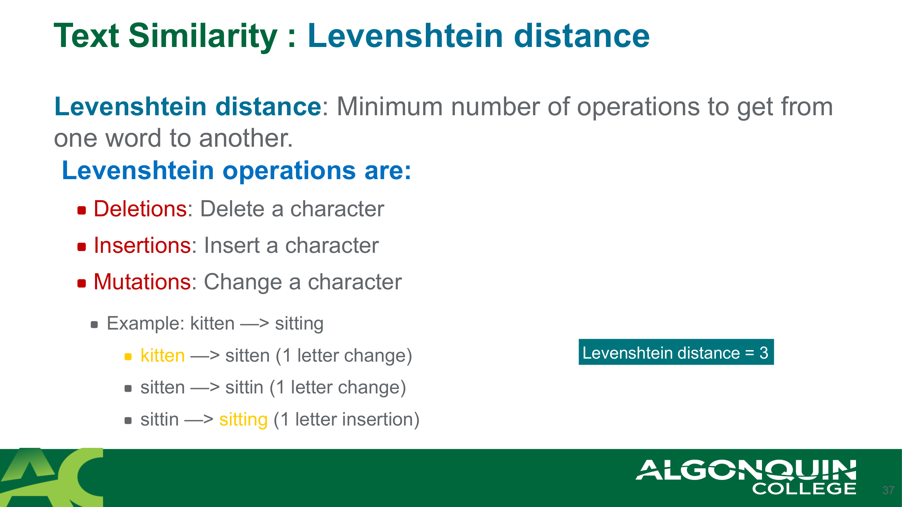

**Text Similarity: Levenshtein distance:** Defines edit distance (min operations to transform one word into another) with example kitten→sitting = 3 operations. — 定义编辑距离（将一个词转换为另一个词所需的最少操作数），以kitten→sitting = 3步为例。

- Levenshtein distance: Minimum number of operations to get from one word to another. — Levenshtein距离：从一个词转换到另一个词所需的最少操作数。
- Levenshtein operations are: — Levenshtein操作包括：
  - ▪ Deletions: Delete a character — 删除：删除一个字符
  - ▪ Insertions: Insert a character — 插入：插入一个字符
  - ▪ Mutations: Change a character — 替换：更改一个字符
- Example: kitten → sitting — 示例：kitten → sitting
  - ▪ kitten → sitten (1 letter change) — kitten → sitten（1次替换）
  - ▪ sitten → sittin (1 letter change) — sitten → sittin（1次替换）
  - ▪ sittin → sitting (1 letter insertion) — sittin → sitting（1次插入）
  - Levenshtein distance = 3 — Levenshtein距离 = 3

### 9.3 欧几里得距离 (Euclidean Distance)

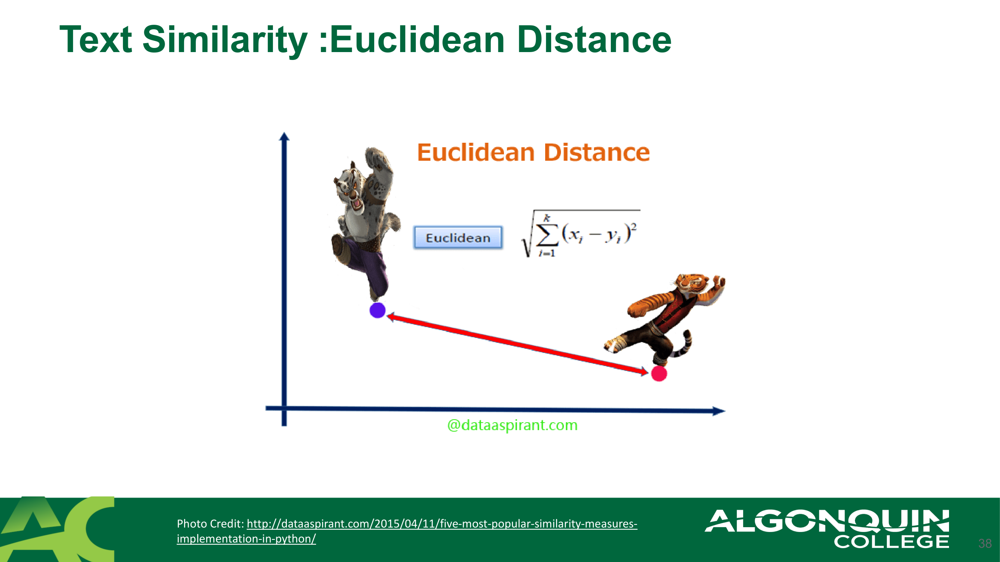

**Text Similarity: Euclidean Distance:** Geometric illustration showing the straight-line distance between two vector endpoints in 2D space. — 几何示意图：2D空间中两个向量端点之间的直线距离（"直线"距离）。

Ref: http://dataaspirant.com/2015/04/11/five-most-popular-similarity-measures-implementation-in-python/

### 9.4 余弦相似度 (Cosine Similarity)

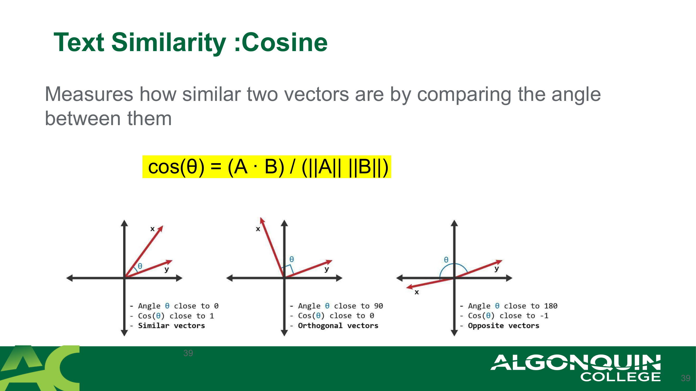

**Text Similarity: Cosine:** Formula cos(θ) = (A·B)/(‖A‖‖B‖) — measures angle between vectors, not magnitude. Values range 0 (orthogonal) to 1 (identical direction). — 余弦公式：cos(θ) = (A·B)/(‖A‖‖B‖)，衡量向量夹角而非长度，值域0（正交）到1（同向）。

- Measures how similar two vectors are by comparing the angle between them — 通过比较向量之间的角度来衡量两个向量的相似性
- cos(θ) = (A · B) / (‖A‖ ‖B‖)

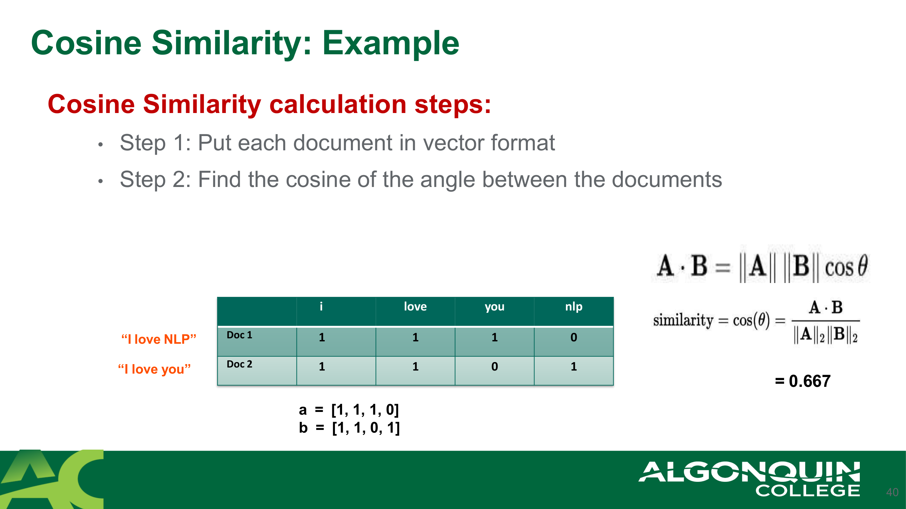

**Cosine Similarity: Example:** Two doc vectors shown — Doc1=[1,1,0,1] for "I love NLP", Doc2=[1,1,1,0] for "I love you". Cosine similarity = 0.667. — 两个文档向量示例：Doc1=[1,1,0,1]对应"I love NLP"，Doc2=[1,1,1,0]对应"I love you"，余弦相似度 = 0.667。

- Step 1: Put each document in vector format — 步骤1：将每个文档转换为向量格式
- Step 2: Find the cosine of the angle between the documents — 步骤2：计算文档间向量夹角的余弦值
- "I love NLP" → Doc1: [1, 1, 0, 1]
- "I love you" → Doc2: [1, 1, 1, 0]
- Cosine similarity = 0.667

### 9.5 课堂练习 (In-Class Exercises)

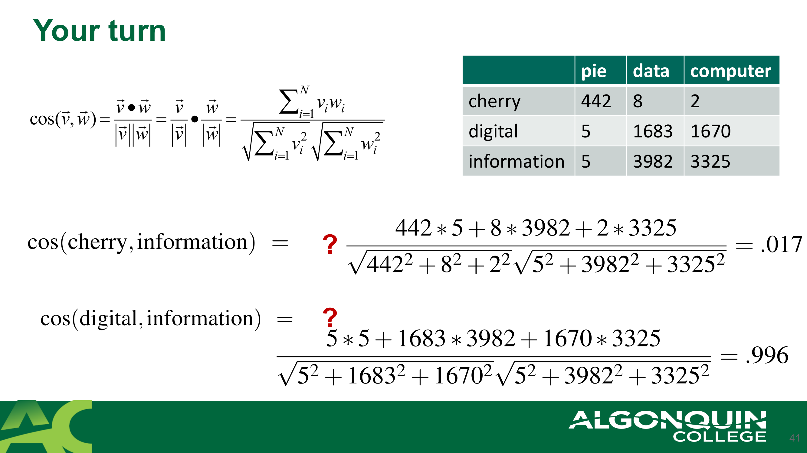

**Your turn — Cosine similarity with word co-occurrence data:** Word co-occurrence matrix for 3 words (cherry, digital, information) × 3 contexts (pie, data, computer). Compute cosine similarity between word vectors. — 词共现矩阵：3个词（cherry/digital/information）× 3个上下文（pie/data/computer），计算词向量间的余弦相似度。

|             | pie | data | computer |
| ----------- | --- | ---- | -------- |
| cherry      | 442 | 8    | 2        |
| digital     | 5   | 1683 | 1670     |
| information | 5   | 3982 | 3325     |

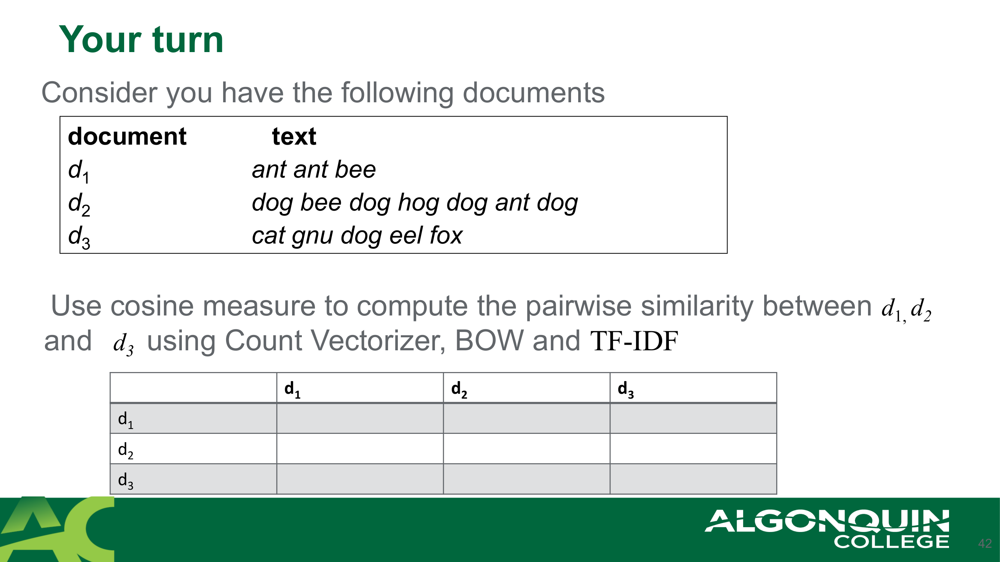

**Your turn — Document similarity exercise:** Three short documents (d₁/d₂/d₃) using animal words. Compute pairwise cosine similarity using Count Vectorizer and TF-IDF. — 三个简短文档（d₁/d₂/d₃）使用动物词汇，分别用CountVectorizer和TF-IDF计算两两余弦相似度。

- d₁: ant ant bee
- d₂: dog bee dog hog dog ant dog
- d₃: cat gnu dog eel fox

Use cosine measure to compute pairwise similarity using Count Vectorizer, BOW, and TF-IDF. — 使用余弦相似度度量，分别用计数向量化、BOW和TF-IDF计算两两相似度。


---

## 10. 文档相似度实战 (Document Similarity in Practice)

### 10.1 CountVectorizer结果 (Count Vectorizer Results)

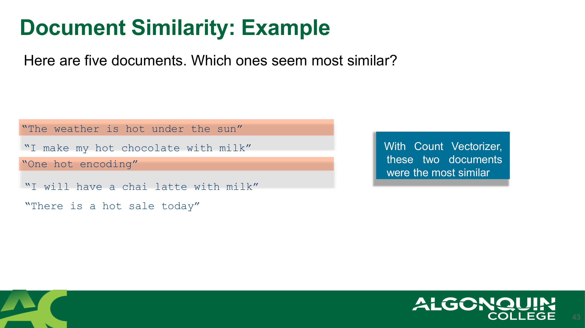

**Document Similarity: Example — Five documents:** Five short sentences all containing the word "hot" but with different contexts (weather, chocolate, encoding, latte, sale). — 五个含"hot"的短句，但上下文各不同（天气/巧克力/编码/拿铁/促销）。

- "The weather is hot under the sun"
- "I make my hot chocolate with milk"
- "One hot encoding"
- "I will have a chai latte with milk"
- "There is a hot sale today"

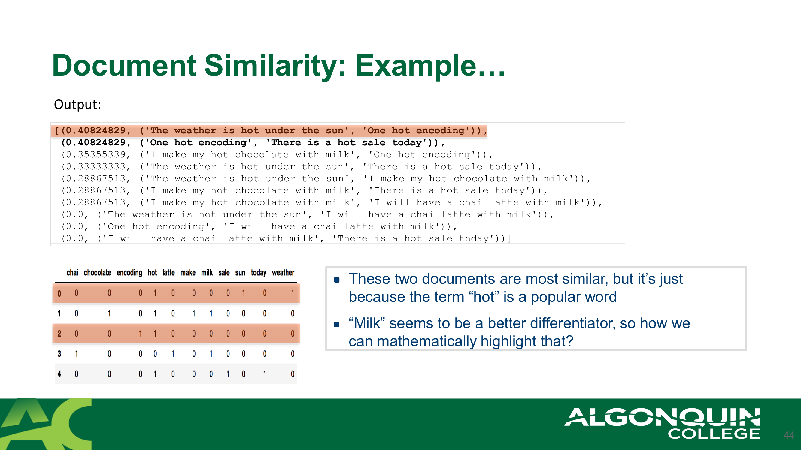

**Document Similarity: Example — Count Vectorizer Output:** Similarity matrix showing CountVectorizer ranks doc1 & doc3 as most similar (0.408) because both share "hot" — but this is misleading since "hot" is too common. — 相似度矩阵：CountVectorizer将doc1和doc3排为最相似（0.408），因为都有"hot"——但这具有误导性，因为"hot"太常见。

- Top similarity: (0.408, "The weather is hot under the sun" vs "One hot encoding") — 最高相似度：（0.408，"The weather is hot under the sun" vs "One hot encoding"）
- These two documents are most similar, but it's just because the term "hot" is a popular word — 这两个文档最相似，但仅仅因为"hot"是个常见词
- "Milk" seems to be a better differentiator, so how can we mathematically highlight that? — "Milk"似乎是更好的区分词，那么如何在数学上突显这一点？

### 10.2 TF-IDF结果 (TF-IDF Results)

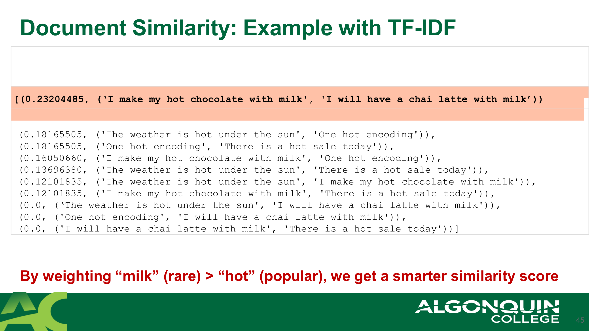

**Document Similarity: Example with TF-IDF:** After TF-IDF reweighting, doc2 & doc4 become most similar (0.232) because they both share "milk" — a rarer word — showing TF-IDF gives smarter similarity. — TF-IDF重新加权后，doc2和doc4变得最相似（0.232），因为两者共有"milk"（稀有词），体现了TF-IDF更智能的相似度判断。

- Top similarity: (0.232, "I make my hot chocolate with milk" vs "I will have a chai latte with milk") — 最高相似度：（0.232，"I make my hot chocolate with milk" vs "I will have a chai latte with milk"）
- By weighting "milk" (rare) > "hot" (popular), we get a smarter similarity score — 通过将"milk"（稀有）权重 > "hot"（常见）权重，我们得到了更智能的相似度分数


---

## 11. 讨论与伦理 (Discussion & Ethics)


**Discussion:** Open question slide — What are the ethical concerns related to frequency-based text representation? — 开放式讨论：基于频率的文本表示法有哪些伦理问题？

---

## 12. 总结 (Summary)

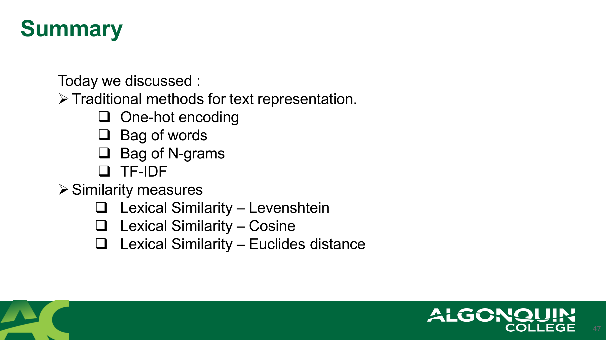

**Summary — Today we discussed:** Recap slide listing all 4 representation methods and 3 similarity measures covered. — 总结幻灯片，列举本节课覆盖的4种文本表示方法和3种相似度度量。

- ➢ Traditional methods for text representation: — 传统文本表示方法：
  - ❑ One-hot encoding — 独热编码
  - ❑ Bag of words — 词袋模型
  - ❑ Bag of N-grams — N元词袋
  - ❑ TF-IDF
- ➢ Similarity measures: — 相似度度量：
  - ❑ Lexical Similarity – Levenshtein — 词汇相似度 – 编辑距离
  - ❑ Lexical Similarity – Cosine — 词汇相似度 – 余弦相似度
  - ❑ Lexical Similarity – Euclidean distance — 词汇相似度 – 欧几里得距离
