# Week 4: 词嵌入 (Word Embedding)

> Source: `lecture_4_W26.pdf`
> Total slides: 54
> Instructor: Hala Own, Ph.D.

---

## 1. 课程议程 (Lesson Agenda)


**CST8507: Natural Language Processing — Week #4: Word Embedding** — CST8507自然语言处理，第4周：词嵌入

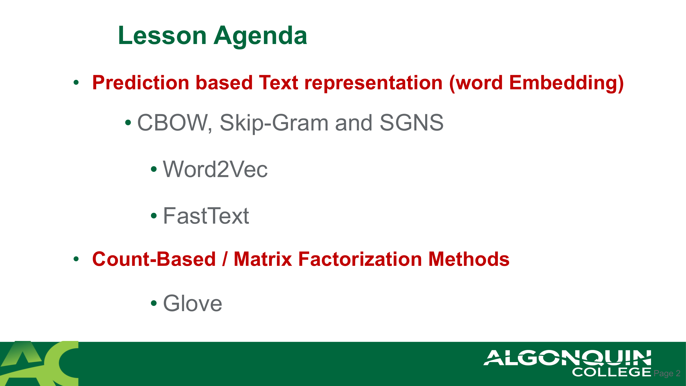

**Lesson Agenda:** — 本节课议程：

- ❑ Prediction based Text representation (word Embedding) — 基于预测的文本表示（词嵌入）
- ❑ CBOW, Skip-Gram and SGNS — CBOW、Skip-Gram和SGNS
- ❑ Word2Vec — Word2Vec
- ❑ FastText — FastText
- ❑ Count-Based / Matrix Factorization Methods — 基于计数/矩阵分解的方法
- ❑ GloVe — GloVe

---

## 2. NLP开发生命周期 (NLP Development Life Cycle)


**NLP Development Life Cycle:** Circular pipeline diagram — 8 stages looping: Requirements gathering → Data collection → Text preprocessing → Feature extraction → Model building → Evaluation → Deployment → Gather more data / Improve the model. — NLP开发生命周期循环流程图——8个阶段：需求收集→数据收集→文本预处理→特征提取→模型构建→评估→部署→收集更多数据/改进模型。

---

## 3. 从频率到预测 (From Frequency to Prediction)

### 3.1 文本表示技术全景 (Text Representation Techniques Overview)

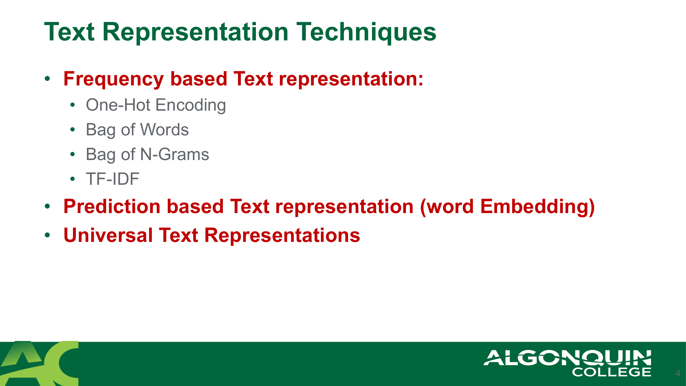

**Text Representation Techniques:** Taxonomy listing from traditional frequency-based methods to modern prediction-based and universal representations. — 文本表示方法分类树，从传统频率方法到现代预测方法和通用表示。

- Frequency based Text representation: — 基于频率的文本表示：
  - One-Hot Encoding — 独热编码
  - Bag of Words — 词袋模型
  - Bag of N-Grams — N元词袋
  - TF-IDF — TF-IDF
- Prediction based Text representation (word Embedding) — 基于预测的文本表示（词嵌入）
- Universal Text Representations — 通用文本表示

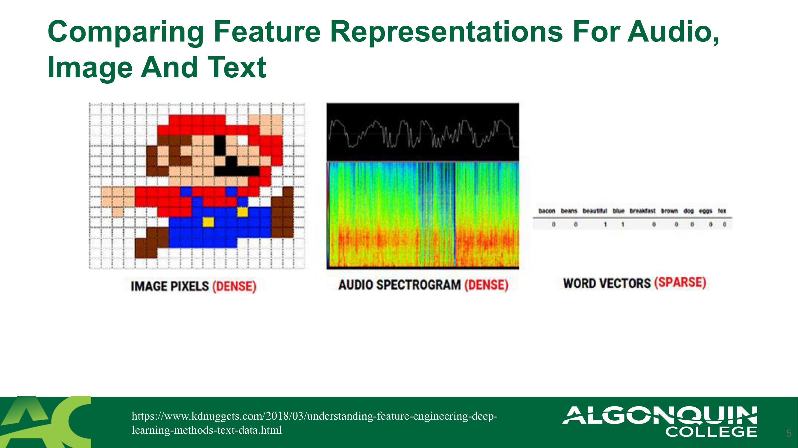

**Comparing Feature Representations for Audio, Image and Text:** Three-column diagram showing each data modality maps to its own representation form. — 三列示意图，展示语音、图像、文本三种数据模态各自对应不同的表示形式。

Ref: https://www.kdnuggets.com/2018/03/understanding-feature-engineering-deep-learning-methods-text-data.html

### 3.2 频率方法的局限性 (Limitations of Frequency-Based Methods)

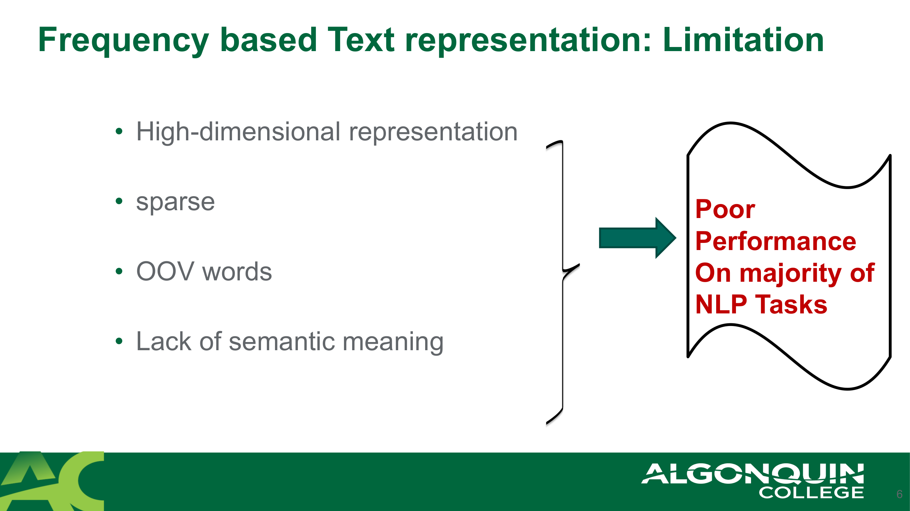

**Frequency based Text representation: Limitation:** Lists four key limitations that lead to poor performance on majority of NLP tasks. — 列出四个关键局限性，导致在大多数NLP任务上性能不佳。

- High-dimensional representation — 高维表示
- Sparse — 稀疏
- OOV words — 词汇表外词语
- Lack of semantic meaning — 缺乏语义含义
- → Poor Performance On majority of NLP Tasks — → 在大多数NLP任务上性能不佳

> **📝 Notes:**
>
> **🎯 Why:**
> **(1) Motivation for this lecture (本讲的动机):**
>
> Week 3 covered frequency-based methods (OHE, BOW, TF-IDF). They all share a fatal flaw: they treat words as atomic symbols with no semantic relationships. "happy" and "glad" are as unrelated as "happy" and "volcano." This lecture introduces **prediction-based** methods that learn meaning from context.
>
> > 第3周讲了频率方法（OHE、BOW、TF-IDF）。它们都有一个致命缺陷：把词当作没有语义关系的原子符号。"happy"和"glad"在它们看来就像"happy"和"volcano"一样无关。本讲引入**基于预测**的方法，从上下文中学习含义。
>
> **(2) From counting to learning (从计数到学习):**
>
> Frequency methods **count** word occurrences (static statistics). Prediction methods **learn** word relationships by training a neural network to predict words from their context. The learned weights become the word vectors — this is the paradigm shift.
>
> > 频率方法**统计**词的出现次数（静态统计）。预测方法通过训练神经网络根据上下文预测词来**学习**词间关系。学到的权重就成为词向量——这是范式转变。
>
> **💡 Intuition:**
> **(1) Dictionary vs experience (字典 vs 经验):**
>
> Frequency methods are like looking up words in a dictionary — you know they exist but not what they mean. Prediction methods are like learning a language by living in a country — you understand words through the company they keep ("You shall know a word by the company it keeps" — J.R. Firth).
>
> > 频率方法像查字典——你知道词存在但不知其意。预测方法像在一个国家生活中学语言——你通过词的"同伴"来理解词（"你可以通过一个词的同伴来了解它"——J.R. Firth）。
>
> **⚖️ Compare:**
> **(1) Frequency vs Prediction methods:**
>
> | Feature           | Frequency (Week 3)          | Prediction (Week 4)       |
> | ----------------- | --------------------------- | ------------------------- |
> | Vectors           | Sparse, high-dimensional    | Dense, low-dimensional    |
> | Semantic info     | None                        | Captures meaning          |
> | "happy" ≈ "glad"? | No — completely unrelated   | Yes — similar vectors     |
> | Training          | No training (just counting) | Neural network training   |
> | Examples          | OHE, BOW, TF-IDF            | Word2Vec, GloVe, FastText |
>
> > | 特性              | 频率方法（第3周）    | 预测方法（第4周）         |
> > | ----------------- | -------------------- | ------------------------- |
> > | 向量              | 稀疏、高维           | 稠密、低维                |
> > | 语义信息          | 无                   | 捕获含义                  |
> > | "happy" ≈ "glad"? | 否——完全不相关       | 是——相似向量              |
> > | 训练              | 无需训练（只是计数） | 神经网络训练              |
> > | 示例              | OHE、BOW、TF-IDF     | Word2Vec、GloVe、FastText |
>
> **📝 Exam:**
> **(1) 概念题 (Conceptual):**
>
> "What are the limitations of frequency-based text representations?" → High dimensionality, sparsity, no semantic meaning, cannot handle OOV words. These lead to poor performance on most NLP tasks.
>
> > "频率方法的局限是什么？" → 高维度、稀疏性、无语义含义、无法处理OOV。这导致大多数NLP任务性能差。

---

## 4. 词语关系与WordNet (Word Relations & WordNet)

### 4.1 词语相似性 (Word Similarity)

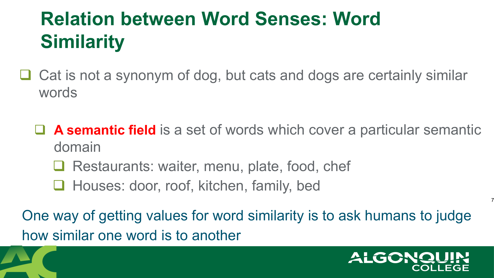

**Relation between Word Senses: Word Similarity:** Explains that words can be similar without being synonyms, and introduces semantic fields. — 解释词语可以相似但不是同义词，并引入语义场概念。

- ❑ Cat is not a synonym of dog, but cats and dogs are certainly similar words — Cat不是dog的同义词，但cats和dogs确实是相似的词
- ❑ A semantic field is a set of words which cover a particular semantic domain — 语义场是覆盖特定语义域的一组词
  - ❑ Restaurants: waiter, menu, plate, food, chef — 餐厅：服务员、菜单、盘子、食物、厨师
  - ❑ Houses: door, roof, kitchen, family, bed — 房屋：门、屋顶、厨房、家庭、床
- One way of getting values for word similarity is to ask humans to judge how similar one word is to another — 获取词语相似度数值的一种方式是让人类判断两个词有多相似

### 4.2 WordNet概述 (WordNet Overview)

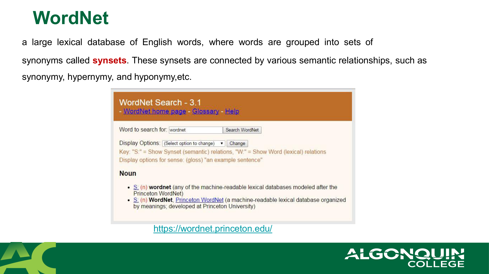

**WordNet:** A large lexical database of English words, where words are grouped into sets of synonyms called synsets. These synsets are connected by various semantic relationships, such as synonymy, hypernymy, and hyponymy, etc. — WordNet：大型英语词汇数据库，词语被分组为同义词集（synsets），并通过同义、上位、下位等语义关系相连。

Ref: https://wordnet.princeton.edu/

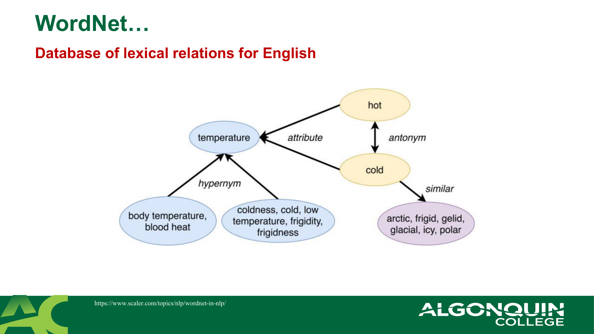

**WordNet: Database of lexical relations for English.** Diagram showing hierarchical tree structure of WordNet's synset relationships. — WordNet：英语词汇关系数据库。图示WordNet同义词集关系的层次树结构。

Ref: https://www.scaler.com/topics/nlp/wordnet-in-nlp/

### 4.3 WordNet核心概念 (WordNet Important Concepts)

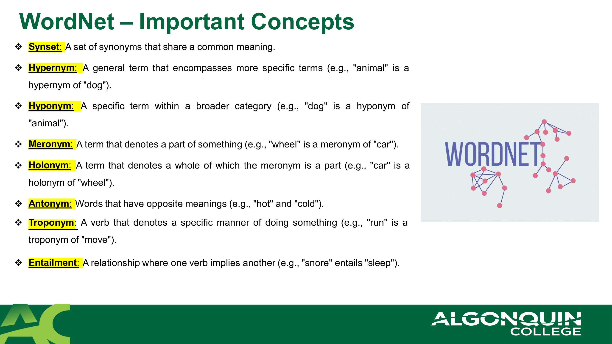

**WordNet – Important Concepts:** Lists 8 key relationship types in WordNet. — 列出WordNet中8种关键关系类型。

- ❖ **Synset:** A set of synonyms that share a common meaning — 同义词集：共享同一含义的同义词集合
- ❖ **Hypernym:** A general term that encompasses more specific terms (e.g., "animal" is a hypernym of "dog") — 上位词：包含更具体术语的通用术语（如"animal"是"dog"的上位词）
- ❖ **Hyponym:** A specific term within a broader category (e.g., "dog" is a hyponym of "animal") — 下位词：更广泛类别中的具体术语（如"dog"是"animal"的下位词）
- ❖ **Meronym:** A term that denotes a part of something (e.g., "wheel" is a meronym of "car") — 部分词：表示某物的一部分（如"wheel"是"car"的部分词）
- ❖ **Holonym:** A term that denotes a whole of which the meronym is a part (e.g., "car" is a holonym of "wheel") — 整体词：表示整体（如"car"是"wheel"的整体词）
- ❖ **Antonym:** Words that have opposite meanings (e.g., "hot" and "cold") — 反义词：含义相反的词（如"hot"和"cold"）
- ❖ **Troponym:** A verb that denotes a specific manner of doing something (e.g., "run" is a troponym of "move") — 方式动词：表示某种行为特定方式的动词（如"run"是"move"的方式动词）
- ❖ **Entailment:** A relationship where one verb implies another (e.g., "snore" entails "sleep") — 蕴含：一个动词隐含另一个（如"snore"蕴含"sleep"）

### 4.4 WordNet应用与局限 (WordNet Applications & Limitations)

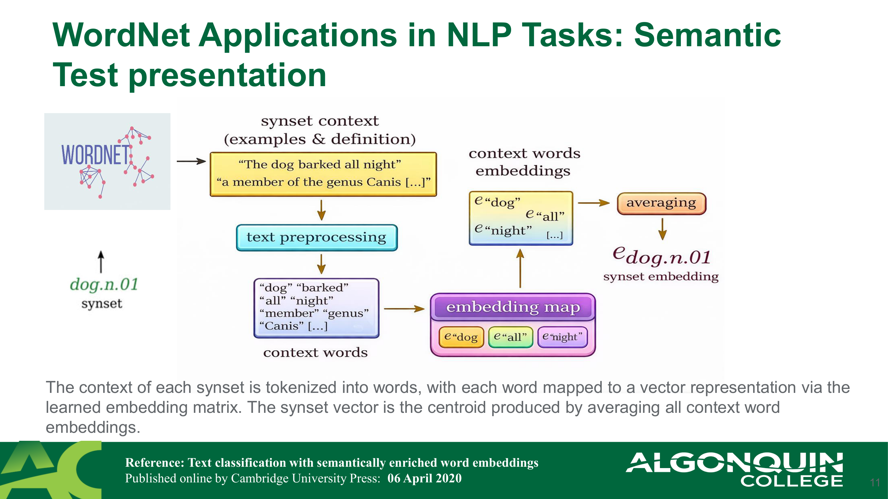

**WordNet Applications in NLP Tasks: Semantic Text Representation:** The context of each synset is tokenized into words, with each word mapped to a vector representation via the learned embedding matrix. The synset vector is the centroid produced by averaging all context word embeddings. — WordNet在NLP中的应用——语义文本表示：每个同义词集的上下文被分词，每个词通过学习的嵌入矩阵映射到向量，同义词集向量是所有上下文词嵌入的质心。

Ref: Text classification with semantically enriched word embeddings, Cambridge University Press, 2020

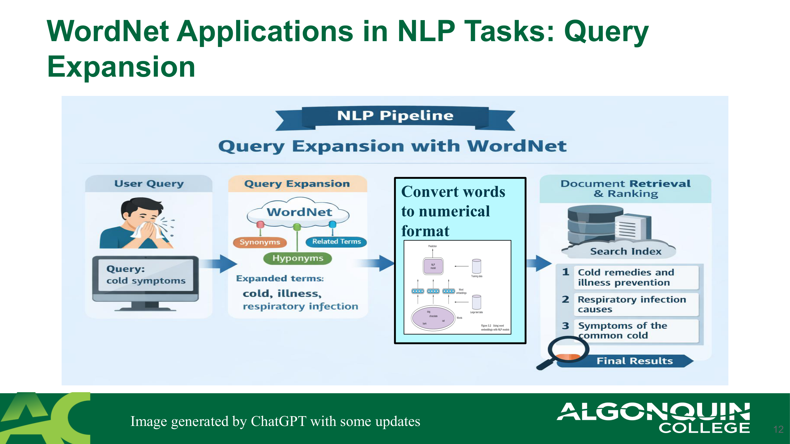

**WordNet Applications in NLP Tasks: Query Expansion:** Diagram showing how WordNet can expand search queries by finding synonyms and related terms, then converting words to numerical format. — WordNet用于查询扩展：通过查找同义词和相关术语来扩展搜索查询。


**WordNet: Limitations:** Five key limitations listed. — WordNet的五个关键局限性。

- ❑ Limited Coverage and Static Nature — 覆盖有限且静态
- ❑ Not Computational — 不可计算
- ❑ Domain Specificity — 领域特定性
- ❑ Language Limitation — 语言限制
- ❑ Manual Curation Challenges — 人工维护挑战

> **📝 Notes:**
>
> **📌 What:**
> **(1) WordNet (词网):**
>
> A hand-crafted lexical database where words are organized into synsets (synonym sets) connected by semantic relations (hypernymy, hyponymy, meronymy, etc.). It's like a structured thesaurus designed for computational use.
>
> > 手工构建的词汇数据库，词语被组织为通过语义关系（上位、下位、部分等）连接的同义词集。像一个为计算使用设计的结构化词库。
>
> **(2) Semantic field (语义场):**
>
> A group of words related by meaning that cover a specific domain. E.g., {waiter, menu, chef, plate} all belong to the "restaurant" semantic field. Words within a field are more similar to each other than to words outside it.
>
> > 一组通过含义相关、覆盖特定领域的词。例如{waiter, menu, chef, plate}都属于"餐厅"语义场。场内的词彼此比场外的词更相似。
>
> **🎯 Why:**
> **(1) Why WordNet matters but isn't enough (为什么WordNet重要但不够):**
>
> WordNet was a pioneering attempt to encode word relationships computationally. But it's **manually curated** (expensive, incomplete, static) and **not computational** — it tells you "dog IS-A animal" but doesn't give you a vector you can use in a neural network. This limitation motivates the move to learned embeddings.
>
> > WordNet是将词语关系计算化的开创性尝试。但它是**人工维护的**（昂贵、不完整、静态）且**不可计算**——它告诉你"dog IS-A animal"但不给你一个可用于神经网络的向量。这个局限推动了向学习嵌入的转变。
>
> **💡 Intuition:**
> **(1) Library catalog vs reading (图书馆目录 vs 阅读):**
>
> WordNet is like a library catalog — it lists all books and their categories, but it doesn't understand the content. Word embeddings are like actually reading the books — they understand relationships through experience, not just labels.
>
> > WordNet像图书馆目录——列出所有书及其分类，但不理解内容。词嵌入像真正阅读书籍——通过经验而非标签理解关系。
>
> **⚠️ Pitfall:**
> **(1) Confusing WordNet relations (混淆WordNet关系):**
>
> Hypernym/hyponym: IS-A relationship (dog IS-A animal). Meronym/holonym: PART-OF relationship (wheel PART-OF car). Troponym: manner-of for VERBS only (run is a manner of move). Students often mix up hypernym vs holonym in exams.
>
> > 上位/下位词：IS-A关系（dog IS-A animal）。部分/整体词：PART-OF关系（wheel PART-OF car）。方式动词：仅用于动词的方式关系（run是move的一种方式）。学生考试中经常混淆上位词和整体词。
>
> **📝 Exam:**
> **(1) 定义题 (Definition):**
>
> "What is a synset?" → A set of synonyms that share a common meaning in WordNet. E.g., {car, auto, automobile} form one synset.
>
> > "什么是synset？" → WordNet中共享同一含义的同义词集合。如{car, auto, automobile}组成一个synset。
>
> **(2) 关系题 (Relationship):**
>
> "Give an example of hypernym and hyponym." → "Animal" is a hypernym of "dog"; "dog" is a hyponym of "animal." Hypernym = general category; hyponym = specific instance.
>
> > "举例说明上位词和下位词。" → "Animal"是"dog"的上位词；"dog"是"animal"的下位词。上位词=通用类别；下位词=具体实例。

---

## 5. 词嵌入基础 (Word Embedding Fundamentals)

### 5.1 关键术语 (Key Terms)

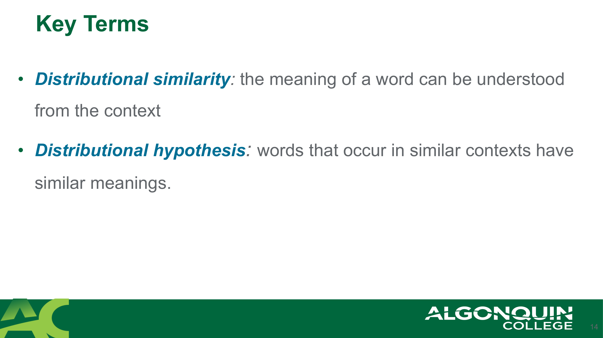

**Key Terms:** Two foundational concepts underlying word embeddings. — 词嵌入的两个基础概念。

- **Distributional similarity:** the meaning of a word can be understood from the context — **分布相似性：** 一个词的含义可以从其上下文中理解
- **Distributional hypothesis:** words that occur in similar contexts have similar meanings — **分布假说：** 出现在相似上下文中的词具有相似含义

### 5.2 向量语义与词嵌入 (Vector Semantics & Word Embedding)

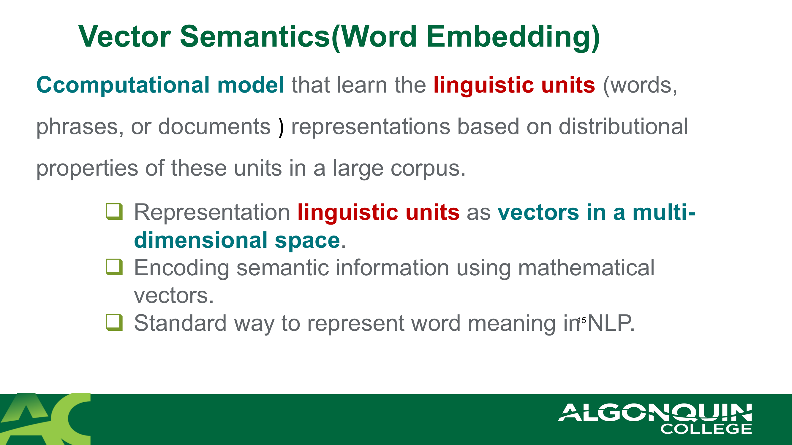

**Vector Semantics (Word Embedding):** Computational model that learns the linguistic units (words, phrases, or documents) representations based on distributional properties of these units in a large corpus. — 向量语义（词嵌入）：基于语言单位在大语料库中的分布特性来学习其表示的计算模型。

- ❑ Representation linguistic units as vectors in a multi-dimensional space — 将语言单位表示为多维空间中的向量
- ❑ Encoding semantic information using mathematical vectors — 使用数学向量编码语义信息
- ❑ Standard way to represent word meaning in NLP — NLP中表示词义的标准方式

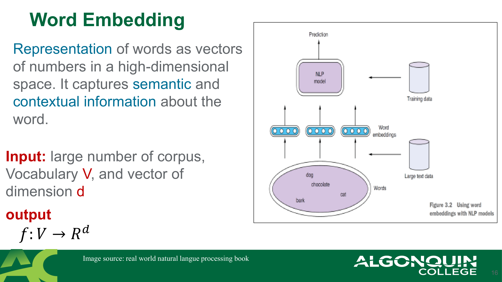

**Word Embedding:** Representation of words as vectors of numbers in a high-dimensional space. It captures semantic and contextual information about the word. — 词嵌入：将词表示为高维空间中的数字向量，捕获词的语义和上下文信息。

- Input: large number of corpus, Vocabulary V, and vector of dimension d — 输入：大量语料库、词汇表V、维度d的向量
- output: f: V → R^d — 输出：f: V → R^d

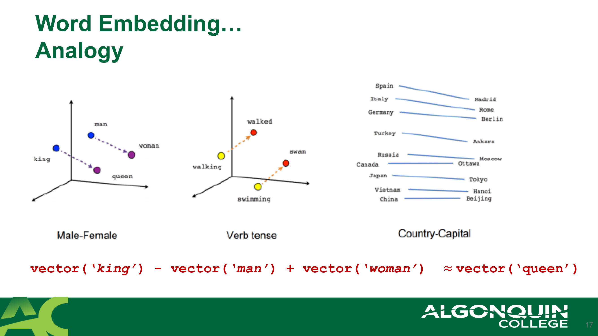

**Word Embedding — Analogy:** Classic analogy example showing vector arithmetic captures semantic relationships. — 词嵌入类比：经典类比示例，展示向量算术捕获语义关系。

- vector('king') - vector('man') + vector('woman') ≈ vector('queen') — vector('king') - vector('man') + vector('woman') ≈ vector('queen')

> **📝 Notes:**
>
> **📌 What:**
> **(1) Distributional hypothesis (分布假说):**
>
> The foundational idea behind ALL word embeddings: "A word is characterized by the company it keeps" (J.R. Firth, 1957). If "cat" and "dog" frequently appear near words like "pet", "feed", "cute", they must have similar meanings. This hypothesis lets us learn meaning from raw text without any human labeling.
>
> > 所有词嵌入背后的基础思想："一个词由它的同伴来定义"（J.R. Firth, 1957）。如果"cat"和"dog"经常出现在"pet"、"feed"、"cute"等词附近，它们一定有相似含义。这个假说让我们无需人工标注就能从原始文本中学习含义。
>
> **(2) Word embedding as a function (词嵌入作为函数):**
>
> Formally, a word embedding is a mapping f: V → R^d, where V is the vocabulary (set of all words) and d is the embedding dimension (typically 50-300). Each word becomes a dense vector of d real numbers. Unlike OHE's 50,000-dim sparse vectors, embeddings are 300-dim dense vectors — much more efficient.
>
> > 形式上，词嵌入是一个映射f: V → R^d，其中V是词汇表（所有词的集合），d是嵌入维度（通常50-300）。每个词变成d个实数的稠密向量。不像OHE的50,000维稀疏向量，嵌入是300维的稠密向量——效率高得多。
>
> **🎯 Why:**
> **(1) Why "king - man + woman = queen" works (为什么向量算术有效):**
>
> The embedding space encodes relationships as **directions**. The vector from "man" to "king" captures the concept of "royalty." The vector from "woman" to "queen" captures the SAME concept. So king - man ≈ queen - woman. This means the model has learned abstract relationships — not just word frequencies!
>
> > 嵌入空间将关系编码为**方向**。从"man"到"king"的向量捕获了"皇室"概念。从"woman"到"queen"的向量捕获了相同概念。所以king - man ≈ queen - woman。这意味着模型学到了抽象关系——不仅仅是词频！
>
> **💡 Intuition:**
> **(1) GPS coordinates analogy (GPS坐标类比):**
>
> OHE gives each word a unique ID (like a phone number — no spatial meaning). Word embeddings give each word GPS coordinates in a "meaning space." Words with similar meanings are geographically close. You can even measure the "direction" from one word to another (king→queen = royalty direction).
>
> > OHE给每个词一个唯一ID（像电话号码——无空间含义）。词嵌入给每个词一个"意义空间"中的GPS坐标。相似含义的词在地理上接近。你甚至可以测量一个词到另一个词的"方向"（king→queen = 皇室方向）。
>
> **(2) Dense vs sparse (稠密 vs 稀疏):**
>
> OHE vector for "cat" with 50,000 vocab: [0,0,0,...,1,...,0,0,0] — 50,000 dimensions, only 1 non-zero. Word2Vec vector for "cat": [0.23, -0.45, 0.12, ...] — 300 dimensions, ALL non-zero. Every dimension contributes some meaning.
>
> > OHE中50,000词表的"cat"向量：[0,0,0,...,1,...,0,0,0]——50,000维，仅1个非零。Word2Vec的"cat"向量：[0.23, -0.45, 0.12, ...]——300维，全部非零。每个维度都贡献一些含义。
>
> **⚠️ Pitfall:**
> **(1) Analogy arithmetic isn't perfect (类比算术不完美):**
>
> The "king - man + woman = queen" example is cherry-picked. In practice, analogy accuracy is only ~40-70%. The result is the NEAREST vector, not an exact match. Don't oversell this capability — it works for some common analogies but fails for many others.
>
> > "king - man + woman = queen"的例子是精心挑选的。实际上类比的准确率只有~40-70%。结果是最近的向量，不是精确匹配。不要过度宣传这个能力——它对一些常见类比有效，但对许多其他类比无效。
>
> **📝 Exam:**
> **(1) 概念题 (Conceptual):**
>
> "What is the distributional hypothesis?" → Words that occur in similar contexts have similar meanings. This is the theoretical foundation of all word embedding methods.
>
> > "什么是分布假说？" → 出现在相似上下文中的词具有相似含义。这是所有词嵌入方法的理论基础。
>
> **(2) 类比题 (Analogy):**
>
> "How do word embeddings capture semantic relationships?" → Through vector arithmetic. The direction king→queen encodes "royalty" and is parallel to man→woman. This shows embeddings learn abstract relationships.
>
> > "词嵌入如何捕获语义关系？" → 通过向量算术。king→queen的方向编码"皇室"且与man→woman平行。这表明嵌入学到了抽象关系。

---

## 6. Word2Vec架构 (Word2Vec Architectures)

### 6.1 基于预测的表示 (Prediction-Based Representation)

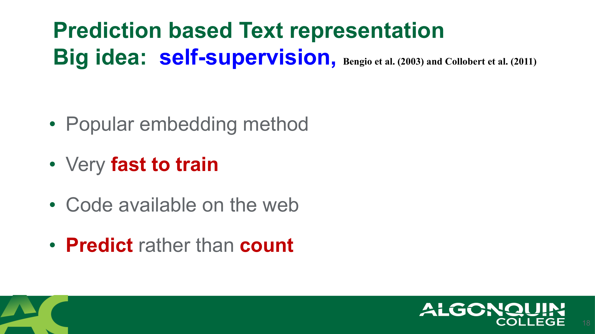

**Prediction based Text representation:** Self-supervision approach introduced by Bengio et al. (2003) and Collobert et al. (2011). — 基于预测的文本表示：Bengio等人（2003）和Collobert等人（2011）提出的自监督方法。

- Big idea: self-supervision — 核心思想：自监督
- Popular embedding method — 流行的嵌入方法
- Very fast to train — 训练速度非常快
- Code available on the web — 网上有现成代码
- Predict rather than count — 预测而非计数

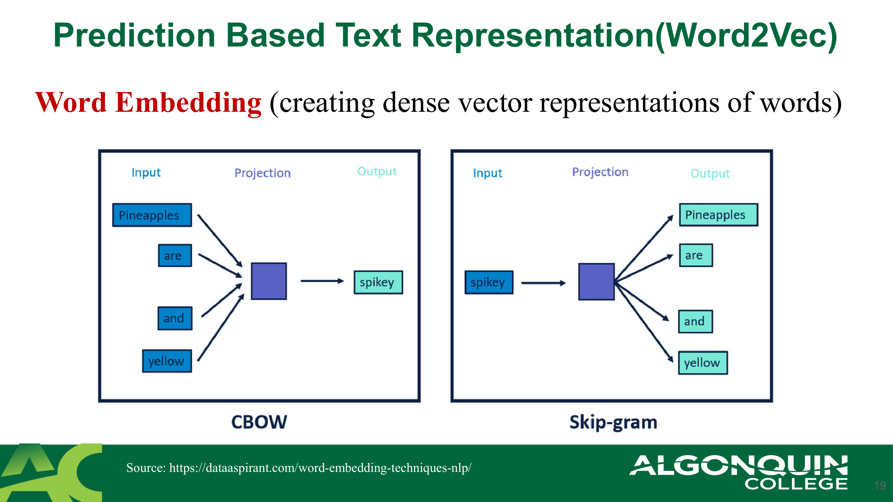

**Prediction Based Text Representation (Word2Vec):** Diagram showing Word2Vec creates dense vector representations of words. Two architectures: CBOW and Skip-gram. — 图示Word2Vec创建词的稠密向量表示。两种架构：CBOW和Skip-gram。

Ref: https://dataaspirant.com/word-embedding-techniques-nlp/

### 6.2 CBOW (连续词袋模型)

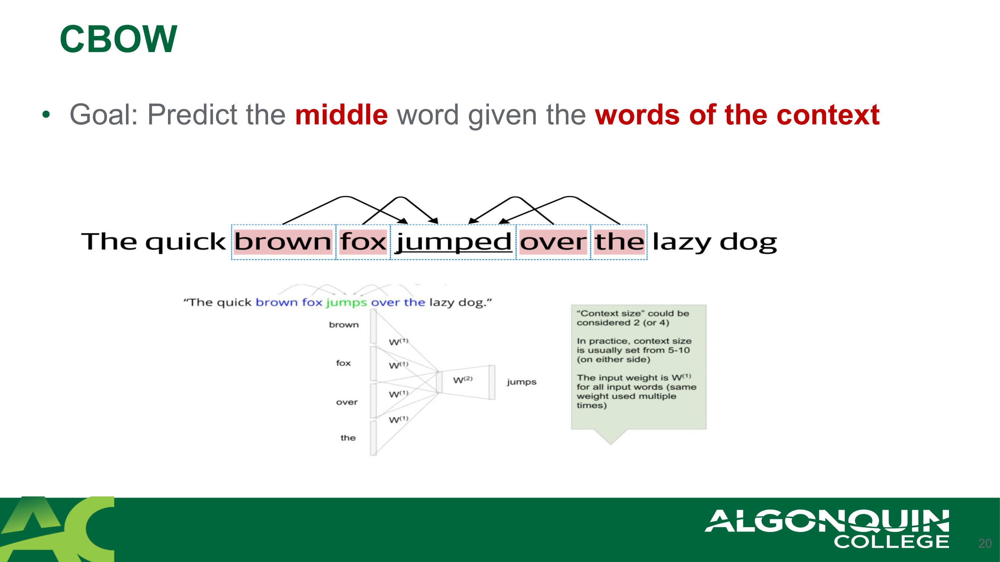

**CBOW (Continuous Bag of Words):** Neural network architecture diagram showing context words as input, predicting the target (middle) word as output. — CBOW神经网络架构图：上下文词作为输入，预测目标（中间）词作为输出。

- Goal: Predict the middle word given the words of the context — 目标：给定上下文词，预测中间词

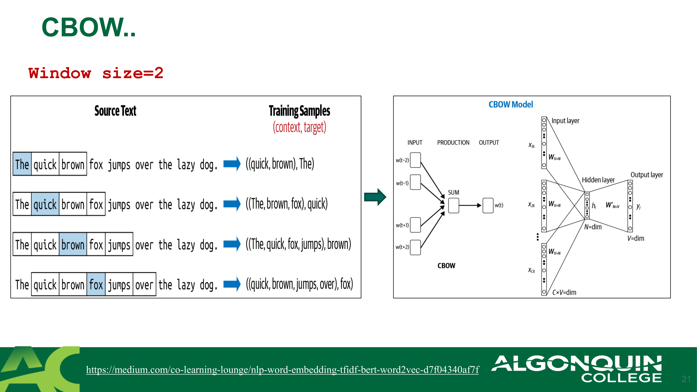

**CBOW with window size=2:** Detailed sliding window visualization. — 窗口大小=2的CBOW详细滑动窗口可视化。

Ref: https://medium.com/co-learning-lounge/nlp-word-embedding-tfidf-bert-word2vec-d7f04340af7f

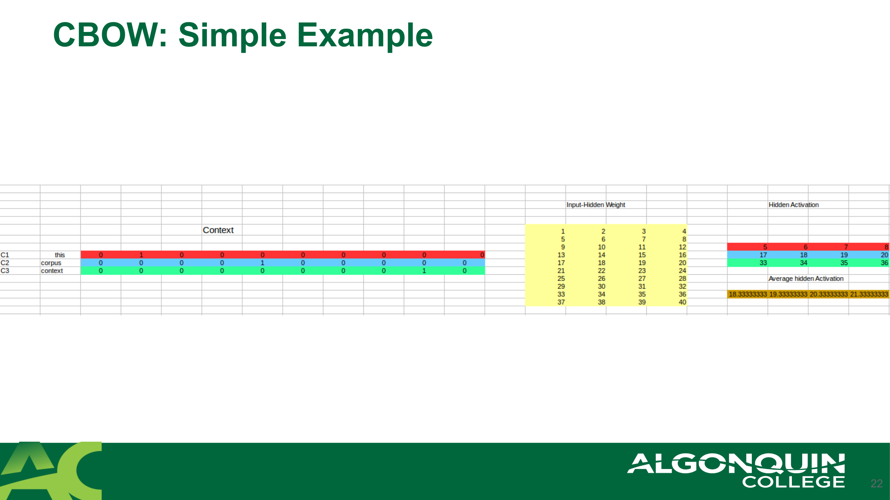

**CBOW: Simple Example:** Worked example showing input context vectors being averaged and passed through the network to predict the center word. — 简单示例：输入上下文向量取平均后通过网络预测中心词。

### 6.3 Skip-gram

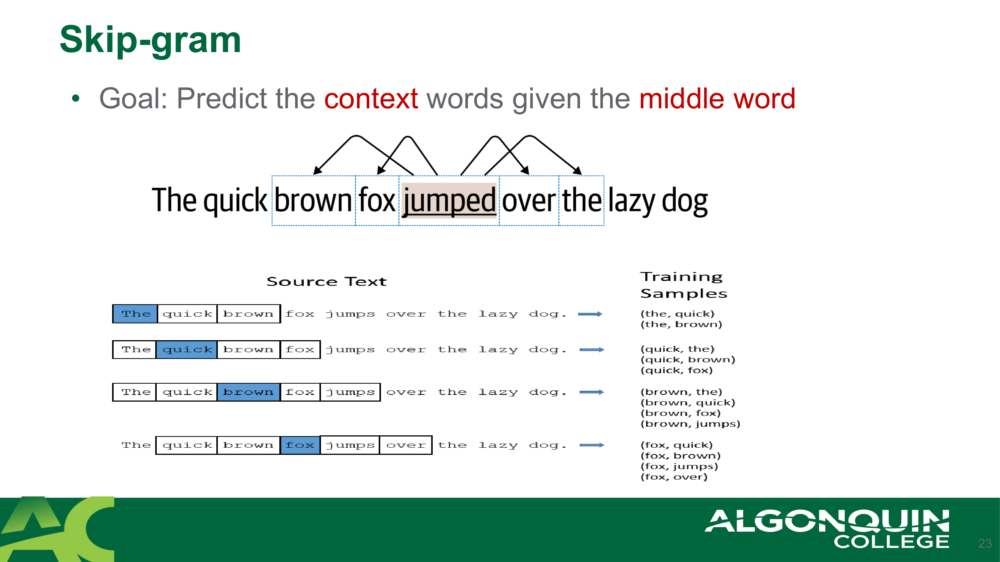

**Skip-gram:** The reverse of CBOW. Takes the middle word as input, predicts context words as output. — Skip-gram——CBOW的反向。以中间词为输入，预测上下文词为输出。

- Goal: Predict the context words given the middle word — 目标：给定中间词，预测上下文词

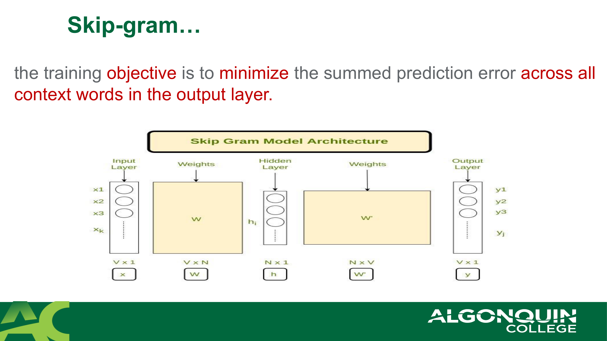

**Skip-gram training:** The training objective is to minimize the summed prediction error across all context words in the output layer. — 训练目标是最小化输出层所有上下文词的预测误差之和。

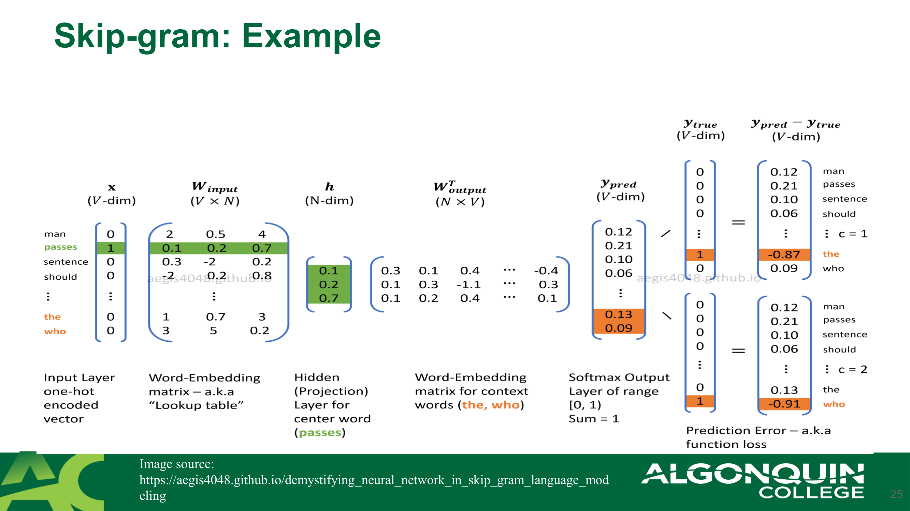

**Skip-gram: Example:** Neural network diagram showing input word mapped to hidden layer (embedding), then predicting multiple context words. — 神经网络图，展示输入词映射到隐藏层（嵌入），然后预测多个上下文词。

Ref: https://aegis4048.github.io/demystifying_neural_network_in_skip_gram_language_modeling

### 6.4 Skip-gram预测示例 (Skip-gram Prediction Examples)

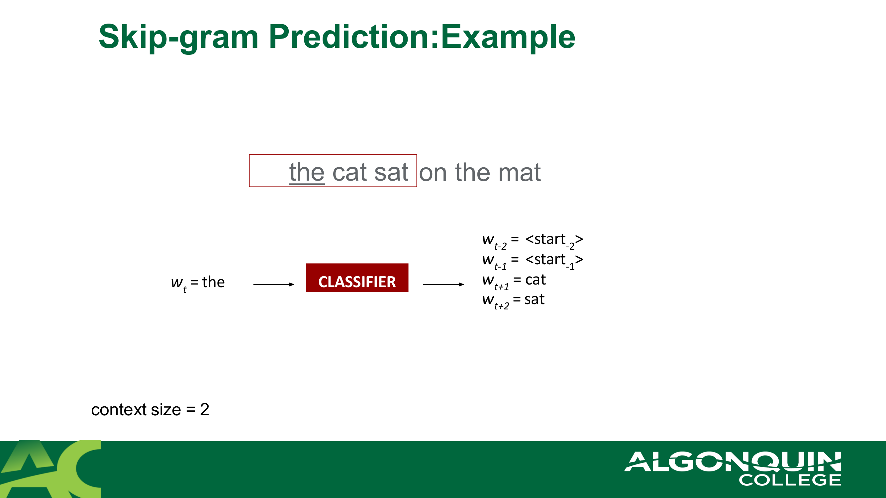

**Step 1:** "the cat sat on the mat", center="the"(pos 1), context: ⟨start⟩, ⟨start⟩, cat, sat.

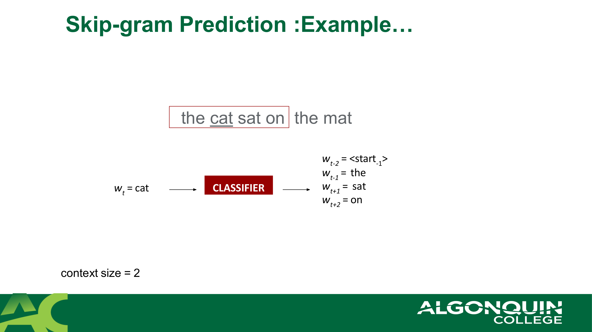

**Step 2:** center="cat", context: ⟨start⟩, the, sat, on.

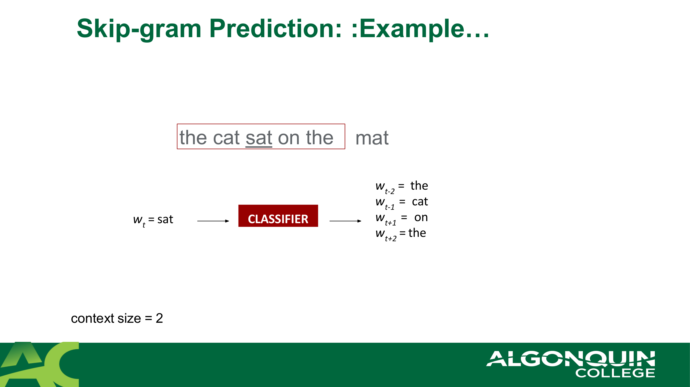

**Step 3:** center="sat", context: the, cat, on, the.

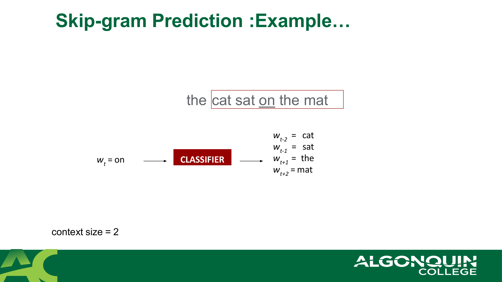

**Step 4:** center="on", context: cat, sat, the, mat.

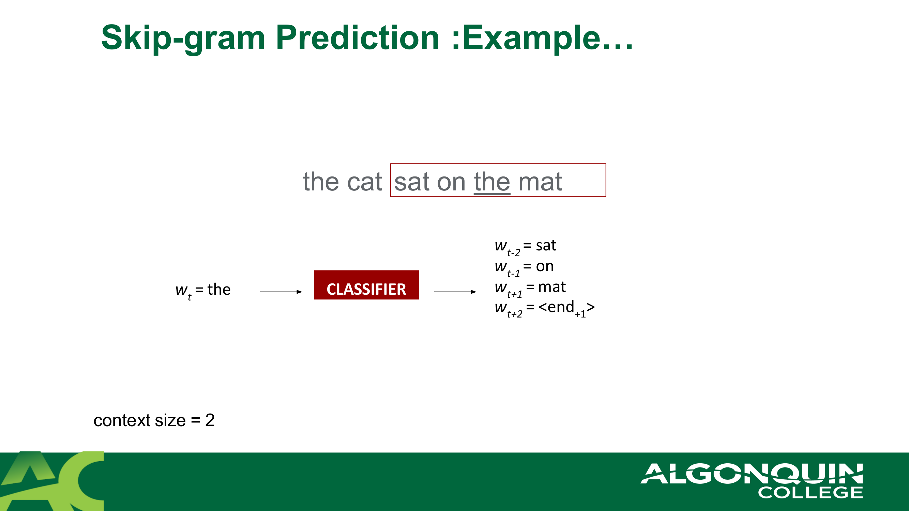

**Step 5:** center="the"(pos 5), context: sat, on, mat, ⟨end⟩.

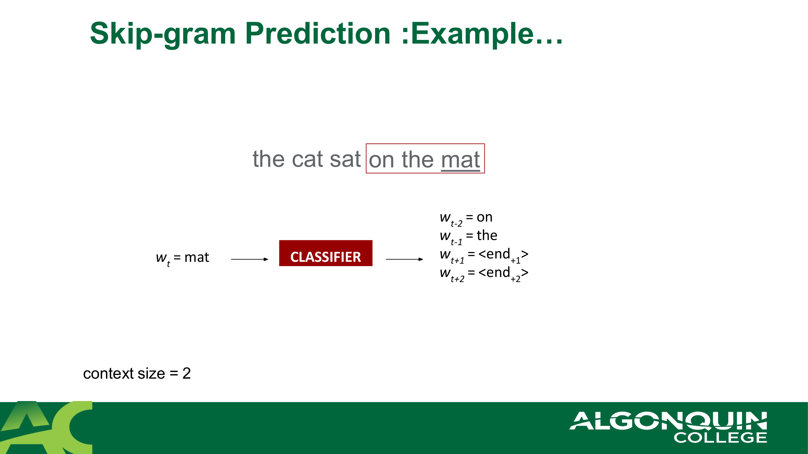

**Step 6:** center="mat", context: on, the, ⟨end⟩, ⟨end⟩.

### 6.5 Skip-gram vs CBOW对比

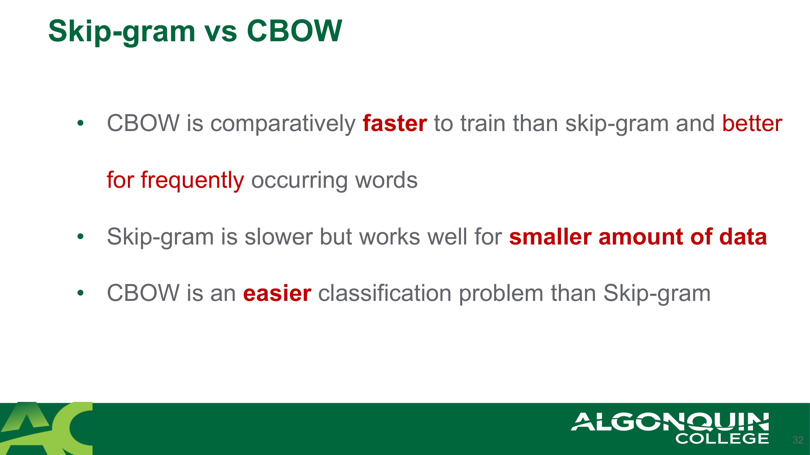

**Skip-gram vs CBOW:** — 两种架构的总结对比。

- CBOW is comparatively faster to train than skip-gram and better for frequently occurring words — CBOW训练速度比skip-gram更快，对高频词效果更好
- Skip-gram is slower but works well for smaller amount of data — Skip-gram较慢但对少量数据效果好
- CBOW is an easier classification problem than Skip-gram — CBOW是比Skip-gram更简单的分类问题

> **📝 Notes:**
>
> **📌 What:**
> **(1) CBOW — Continuous Bag of Words (连续词袋模型):**
>
> A shallow neural network that takes surrounding context words as input (one-hot encoded, then averaged in the projection layer) and predicts the center word. "Continuous" = continuous vector representations. "Bag" = order of context words doesn't matter (they're averaged).
>
> > 浅层神经网络，将周围的上下文词作为输入（独热编码，然后在投影层取平均），预测中心词。"连续"=连续向量表示。"袋"=上下文词的顺序不重要（取平均）。
>
> **(2) Skip-gram (跳字模型):**
>
> The reverse of CBOW: takes the center word as input and predicts surrounding context words. Generates |context| training pairs per position. More training pairs = better for rare words, but slower.
>
> > CBOW的反向：以中心词为输入，预测周围的上下文词。每个位置生成|context|个训练对。更多训练对=对稀有词更好，但更慢。
>
> **🎯 Why:**
> **(1) Why two architectures? (为什么有两种架构？):**
>
> CBOW averages context → smooths noise → better for frequent words. Skip-gram creates separate prediction per context word → more training signal per rare word → better for rare words and small datasets. In practice, Skip-gram is more commonly used.
>
> > CBOW对上下文取平均→平滑噪声→对高频词更好。Skip-gram对每个上下文词做单独预测→稀有词有更多训练信号→对稀有词和小数据更好。实践中Skip-gram更常用。
>
> **(2) Self-supervision is the key insight (自监督是关键洞察):**
>
> No human labels needed! The training signal comes from the text itself — "predict the missing word." This means you can train on billions of words for free. Same principle behind BERT and GPT.
>
> > 不需要人工标注！训练信号来自文本本身。这意味着可以免费在数十亿词上训练。与BERT和GPT背后的原理相同。
>
> **💡 Intuition:**
> **(1) Fill-in-the-blank game (填空游戏):**
>
> CBOW: "The \_\_\_ sat on the mat" → predict "cat" from context. Skip-gram: Given "cat", predict what words surround it → {the, sat, on, mat}. Both force the network to learn word meaning through usage.
>
> > CBOW："The \_\_\_ sat on the mat" → 从上下文预测"cat"。Skip-gram：给定"cat"，预测周围词→{the, sat, on, mat}。两者都迫使网络通过使用学习词义。
>
> **(2) Window size trade-off (窗口大小权衡):**
>
> Small window (2-3): captures syntactic patterns (grammar). Large window (5-10): captures semantic/topical similarity. The window is the model's "attention span."
>
> > 小窗口（2-3）：捕获句法模式（语法）。大窗口（5-10）：捕获语义/主题相似性。窗口是模型的"注意力范围"。
>
> **⚖️ Compare:**
> **(1) CBOW vs Skip-gram:**
>
> | Feature        | CBOW                  | Skip-gram                  |
> | -------------- | --------------------- | -------------------------- |
> | Input → Output | Context → Center word | Center word → Context      |
> | Speed          | Faster                | Slower                     |
> | Rare words     | Worse (averaged out)  | Better (individual signal) |
> | Common words   | Better (smoothed)     | Worse (noisy)              |
> | Data size      | Better for large data | Better for small data      |
>
> > | 特性      | CBOW           | Skip-gram        |
> > | --------- | -------------- | ---------------- |
> > | 输入→输出 | 上下文→中心词  | 中心词→上下文    |
> > | 速度      | 更快           | 更慢             |
> > | 稀有词    | 较差（被平均） | 较好（独立信号） |
> > | 常见词    | 较好（平滑）   | 较差（有噪声）   |
> > | 数据量    | 大数据更好     | 小数据更好       |
>
> **⚠️ Pitfall:**
> **(1) The word vectors ARE the weights (词向量就是权重):**
>
> The word embeddings are NOT the network's output. They are the WEIGHT MATRIX of the hidden layer. After training, we throw away the output layer and keep the hidden layer weights as our word vectors.
>
> > 词嵌入不是网络的输出，而是隐藏层的**权重矩阵**。训练后，丢弃输出层，保留隐藏层权重作为词向量。
>
> **📝 Exam:**
> **(1) 对比题 (Comparison):**
>
> "Compare CBOW and Skip-gram." → CBOW: context→center, faster, better for frequent words. Skip-gram: center→context, slower, better for rare words.
>
> > "比较CBOW和Skip-gram。" → CBOW：上下文→中心词，更快，对高频词更好。Skip-gram：中心词→上下文，更慢，对稀有词更好。
>
> **(2) 应用题 (Application):**
>
> "Given 'the cat sat on the mat' and context size=2, list all Skip-gram training pairs when center='sat'." → (sat, the), (sat, cat), (sat, on), (sat, the).
>
> > "给定'the cat sat on the mat'，上下文大小=2，列出center='sat'的所有Skip-gram训练对。" → (sat, the), (sat, cat), (sat, on), (sat, the)。

---

## 7. SGNS与训练优化 (SGNS & Training Optimization)

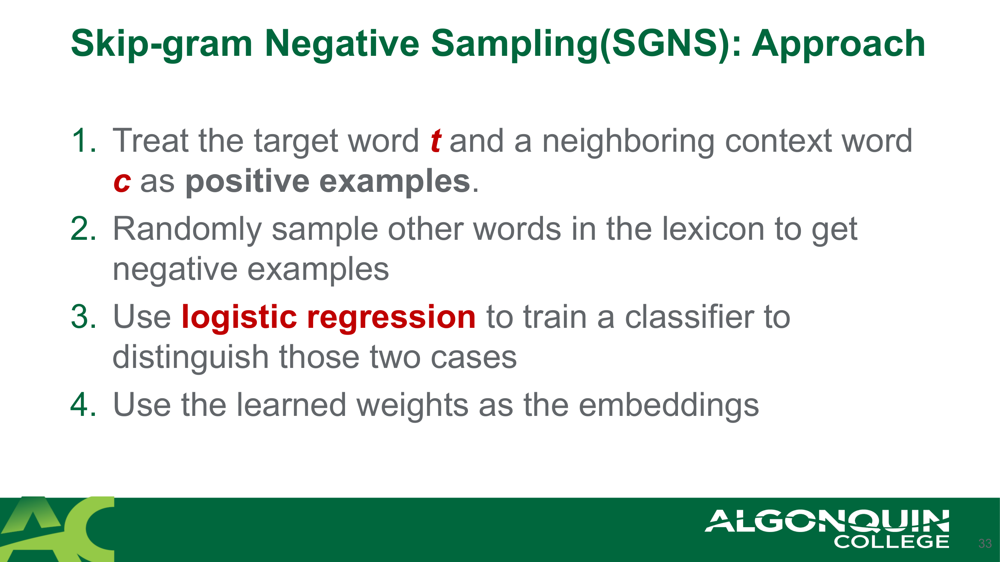

**Skip-gram Negative Sampling (SGNS): Approach:** — SGNS四步流程。

1. Treat the target word t and a neighboring context word c as positive examples — 将目标词t和相邻上下文词c作为正样本
2. Randomly sample other words in the lexicon to get negative examples — 从词典中随机采样其他词作为负样本
3. Use logistic regression to train a classifier to distinguish those two cases — 使用逻辑回归训练分类器区分两种情况
4. Use the learned weights as the embeddings — 使用学到的权重作为嵌入

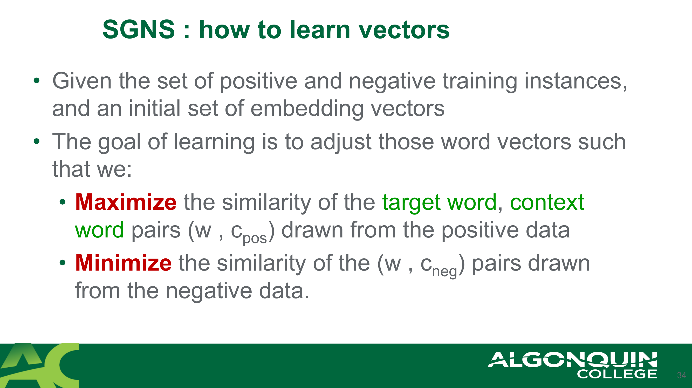

**SGNS: how to learn vectors:** Maximize similarity of positive pairs (w, c_pos), minimize similarity of negative pairs (w, c_neg). — 最大化正样本对相似度，最小化负样本对相似度。

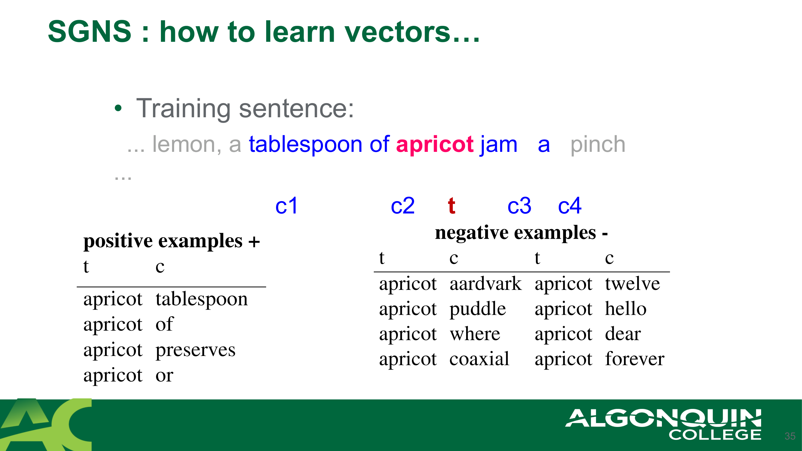

**SGNS: Training example:** "... lemon, a tablespoon of apricot jam a pinch ..." — target="apricot", context: c1="tablespoon", c2="of", c3="jam", c4="a". — SGNS训练示例。

> **📝 Notes:**
>
> **📌 What:**
> **(1) SGNS — Skip-gram with Negative Sampling (带负采样的跳字模型):**
>
> An optimization replacing the expensive softmax over the ENTIRE vocabulary with binary classification: "Is this (word, context) pair real or fake?" Compare against k random "negative" words (typically k=5-15) instead of all V words.
>
> > Skip-gram的优化版本，用二分类替代对整个词汇表的softmax："这个（词、上下文）对是真还是假？"只与k个随机"负"样本比较（通常k=5-15），而非所有V个词。
>
> **🎯 Why:**
> **(1) Softmax bottleneck (Softmax瓶颈):**
>
> Original Skip-gram uses softmax over V words (50K-1M). For EACH training pair, compute scores for ALL words — extremely slow. SGNS reduces this to comparing with just k negatives. Speedup: O(V) → O(k) per step.
>
> > 原始Skip-gram对V个词使用softmax（50K-1M）。每个训练对都必须计算所有词的分数——极慢。SGNS只与k个负样本比较。加速：O(V)→O(k)。
>
> **💡 Intuition:**
> **(1) Multiple choice vs true/false (选择题 vs 判断题):**
>
> Original softmax: "Which of 50,000 words is the correct context?" SGNS: "Is 'jam' a real context of 'apricot'? Yes/No" — much simpler questions, same learning.
>
> > 原始softmax："50,000个词中哪个是正确上下文？"SGNS："'jam'是'apricot'的真实上下文吗？是/否"——更简单的问题，同样的学习效果。
>
> **⚠️ Pitfall:**
> **(1) Negative sampling isn't random-uniform (负采样不是均匀随机的):**
>
> Negatives are sampled ∝ f(w)^(3/4). The 3/4 power boosts rare words' sampling probability. Without this, common words like "the" would dominate negatives.
>
> > 负样本按f(w)^(3/4)比例采样。3/4次方提升稀有词的采样概率。否则"the"等常见词会主导负样本。
>
> **📝 Exam:**
> **(1) 概念题 (Conceptual):**
>
> "What is negative sampling and why is it needed?" → Samples k random negative words instead of softmax over all V words. Reduces O(V) to O(k) per step.
>
> > "什么是负采样？" → 采样k个随机负样本词代替对所有V个词做softmax。将O(V)减少到O(k)。

---

## 8. 预训练模型与代码 (Pretrained Models & Code)

### 8.1 Word2Vec


**Pretrained Word Embeddings Models:** Three major pretrained models. — 三个主要预训练模型。

- Word2vec (Mikolov et al.) 2013
- Fasttext 2016
- GloVe (Pennington, Socher, Manning) 2014

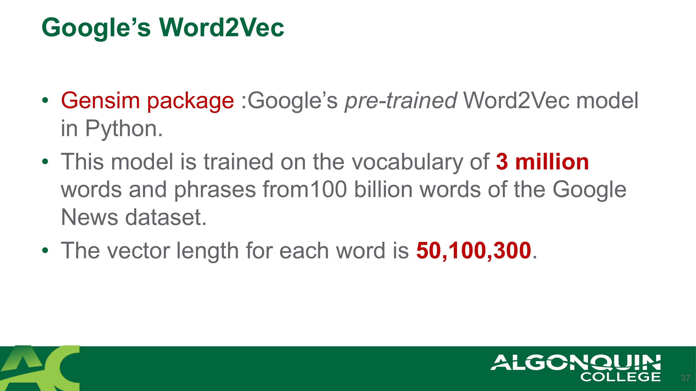

**Google's Word2Vec:** — Google预训练Word2Vec模型详情。

- Gensim package: Google's pre-trained Word2Vec model in Python — Gensim包：Python中Google的预训练Word2Vec模型
- Trained on 3 million words/phrases from 100 billion words of Google News — 在Google新闻的1000亿词中的300万词/短语上训练
- Vector length: 50, 100, 300 — 向量长度：50、100、300

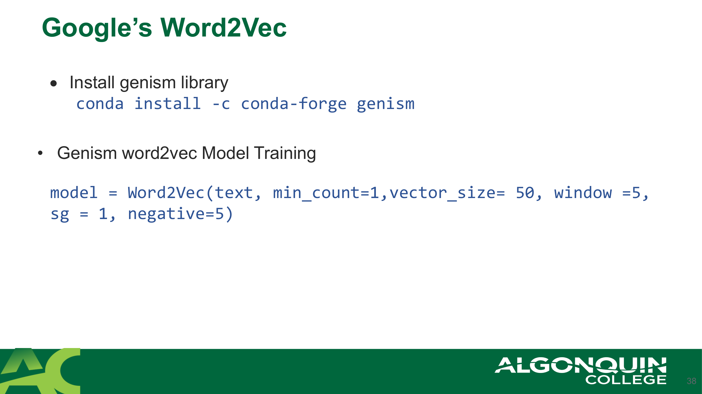

**Word2Vec — Code:** — Word2Vec代码。

```python
# Install gensim library
# conda install -c conda-forge gensim

# Gensim Word2Vec Model Training
model = Word2Vec(text, min_count=1, vector_size=50, window=5,
                 sg=1, negative=5)
```

- `min_count=1`: include words appearing at least 1 time — 包含至少出现1次的词
- `vector_size=50`: embedding dimension — 嵌入维度
- `window=5`: context window size — 上下文窗口大小
- `sg=1`: 1=Skip-gram, 0=CBOW — 1=Skip-gram, 0=CBOW
- `negative=5`: number of negative samples — 负样本数量


**Demo:** In-class code demonstration. — 课堂代码演示。

---

## 9. GloVe (全局向量模型)

### 9.1 GloVe概述 (GloVe Overview)

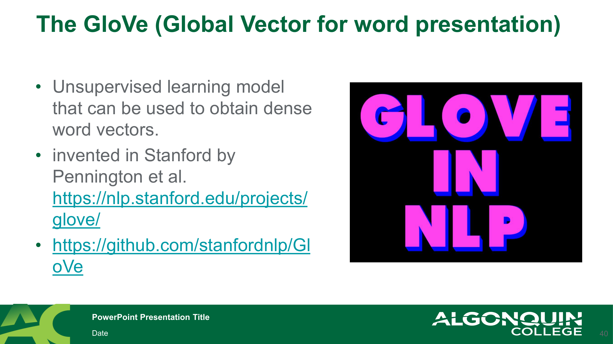

**The GloVe (Global Vector for word representation):** Unsupervised learning model for dense word vectors, invented at Stanford by Pennington et al. — GloVe（全局词向量表示）：斯坦福大学Pennington等人发明的无监督稠密词向量模型。

- Unsupervised learning model that can be used to obtain dense word vectors — 可用于获取稠密词向量的无监督学习模型
- Invented in Stanford by Pennington et al. — 斯坦福大学Pennington等人发明

Ref: https://nlp.stanford.edu/projects/glove/ | https://github.com/stanfordnlp/GloVe

### 9.2 GloVe算法与共现矩阵 (GloVe Algorithm & Co-Occurrence Matrix)

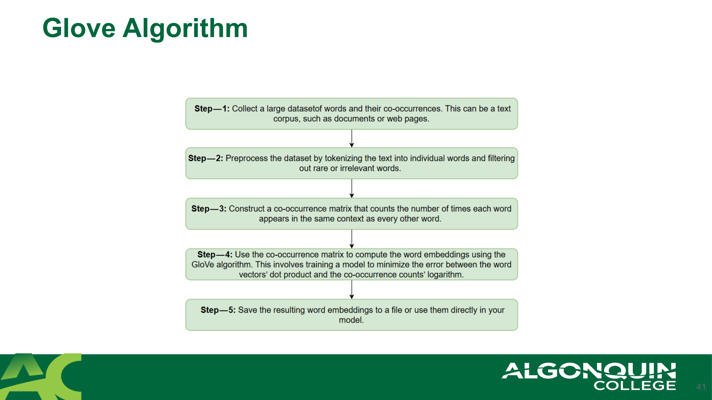

**GloVe Algorithm:** Diagram showing the GloVe training process — builds a word-word co-occurrence matrix, then factorizes it to learn vectors. — GloVe算法图示——构建词-词共现矩阵，然后分解它来学习向量。

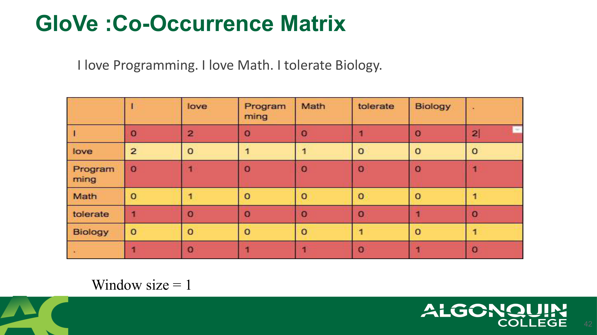

**GloVe: Co-Occurrence Matrix:** Example with "I love Programming. I love Math. I tolerate Biology." and window size=1. — 共现矩阵示例：句子"I love Programming. I love Math. I tolerate Biology."，窗口大小=1。

### 9.3 预训练GloVe向量 (Pretrained GloVe Vectors)

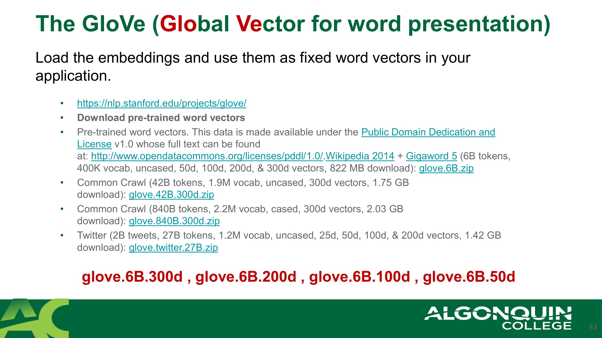

**GloVe: Pretrained Vectors:** Available pretrained vectors from Stanford. — 斯坦福大学提供的预训练向量。

- Wikipedia 2014 + Gigaword 5: 6B tokens, 400K vocab, 50d/100d/200d/300d vectors — 维基百科2014+Gigaword 5：60亿token，40万词表，50/100/200/300维向量
- Common Crawl (42B tokens): 1.9M vocab, 300d — Common Crawl（420亿token）：190万词表，300维
- Common Crawl (840B tokens): 2.2M vocab, 300d — Common Crawl（8400亿token）：220万词表，300维
- Twitter (2B tweets, 27B tokens): 1.2M vocab, 25d/50d/100d/200d — Twitter（20亿推文，270亿token）：120万词表

> **📝 Notes:**
>
> **📌 What:**
> **(1) GloVe — Global Vectors (全局向量):**
>
> GloVe combines the best of count-based (like TF-IDF) and prediction-based (like Word2Vec) methods. It builds a word-word co-occurrence matrix from the corpus, then learns vectors such that the dot product of two word vectors equals the log of their co-occurrence probability.
>
> > GloVe结合了基于计数（如TF-IDF）和基于预测（如Word2Vec）方法的优点。它从语料库构建词-词共现矩阵，然后学习向量使得两个词向量的点积等于它们共现概率的对数。
>
> **(2) Co-occurrence matrix (共现矩阵):**
>
> A V×V matrix where entry (i,j) = how many times word i appears near word j within a context window. This captures global statistics — unlike Word2Vec which only sees local windows during training.
>
> > 一个V×V矩阵，(i,j)项=词i在上下文窗口内出现在词j附近的次数。这捕获了全局统计信息——不像Word2Vec在训练时只看到局部窗口。
>
> **🎯 Why:**
> **(1) Count-based + prediction-based = best of both (计数+预测=两者之长):**
>
> Word2Vec only sees local context windows (prediction-based). Older methods like SVD on term-document matrices use global statistics (count-based) but don't optimize for analogies. GloVe bridges both: it uses GLOBAL co-occurrence statistics but optimizes a PREDICTION-like objective.
>
> > Word2Vec只看局部上下文窗口（基于预测）。SVD等旧方法在词-文档矩阵上使用全局统计（基于计数）但不优化类比。GloVe桥接两者：使用全局共现统计但优化类似预测的目标。
>
> **⚖️ Compare:**
> **(1) Word2Vec vs GloVe:**
>
> | Feature             | Word2Vec                      | GloVe                              |
> | ------------------- | ----------------------------- | ---------------------------------- |
> | Approach            | Prediction (local windows)    | Count + prediction (global matrix) |
> | Training data usage | Iterates over text            | Builds co-occurrence matrix first  |
> | Analogy quality     | Good                          | Slightly better (designed for it)  |
> | Training speed      | Fast                          | Fast (matrix factorization)        |
> | Inventor            | Google (Mikolov et al., 2013) | Stanford (Pennington et al., 2014) |
>
> > | 特性     | Word2Vec               | GloVe                       |
> > | -------- | ---------------------- | --------------------------- |
> > | 方法     | 预测（局部窗口）       | 计数+预测（全局矩阵）       |
> > | 数据使用 | 遍历文本               | 先构建共现矩阵              |
> > | 类比质量 | 好                     | 稍好（为此设计）            |
> > | 训练速度 | 快                     | 快（矩阵分解）              |
> > | 发明者   | Google (Mikolov, 2013) | Stanford (Pennington, 2014) |
>
> **📝 Exam:**
> **(1) 概念题 (Conceptual):**
>
> "How does GloVe differ from Word2Vec?" → GloVe uses global co-occurrence statistics (matrix factorization) while Word2Vec uses local context windows (prediction). GloVe optimizes: w_i · w_j = log(P(i,j)).
>
> > "GloVe和Word2Vec有什么不同？" → GloVe使用全局共现统计（矩阵分解），Word2Vec使用局部上下文窗口（预测）。GloVe优化：w_i · w_j = log(P(i,j))。

---

## 10. FastText模型 (FastText Model)

### 10.1 OOV问题与FastText方案 (OOV Problem & FastText Solution)


**Dealing with OOV:** Traditional methods to handle Out-of-Vocabulary words, and FastText as a better solution. — 处理OOV的传统方法以及FastText作为更好的解决方案。

- Use a Default Vector — 使用默认向量
- Fallback to a Similar Word — 回退到相似词
- Train Your Own Embeddings — 训练自己的嵌入
- **Better Solution: The FastText Model** — **更好的解决方案：FastText模型**

### 10.2 FastText概述 (FastText Overview)

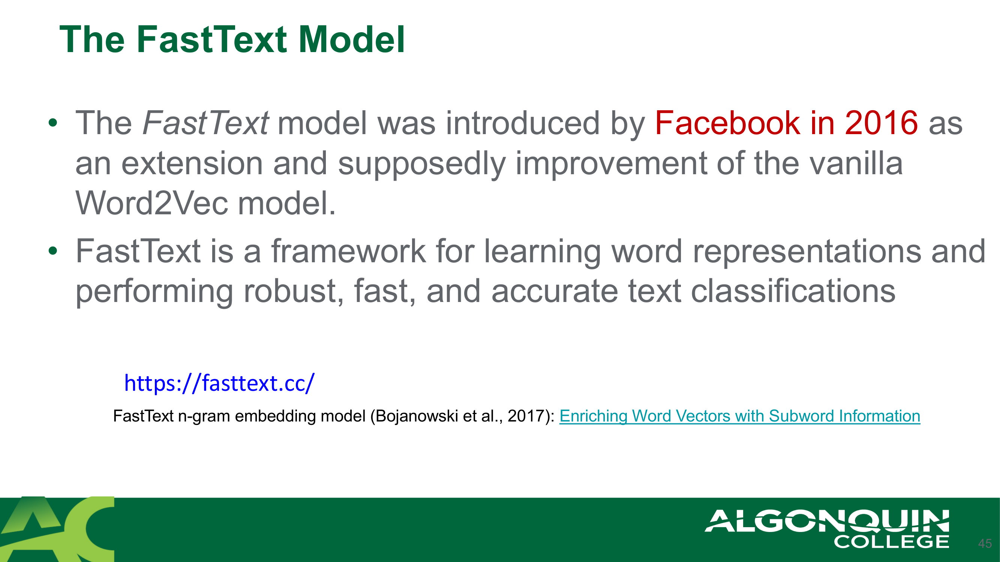

**The FastText Model:** Introduced by Facebook in 2016 as an extension of Word2Vec. — Facebook于2016年推出，作为Word2Vec的扩展。

- Introduced by Facebook in 2016 as an extension and supposedly improvement of the vanilla Word2Vec model — Facebook于2016年作为Word2Vec的扩展和改进推出
- Framework for learning word representations and performing robust, fast, and accurate text classifications — 用于学习词表示和执行鲁棒、快速、准确文本分类的框架

Ref: Bojanowski et al., 2017 — Enriching Word Vectors with Subword Information | https://fasttext.cc/

### 10.3 子词生成 (Subword Generation)

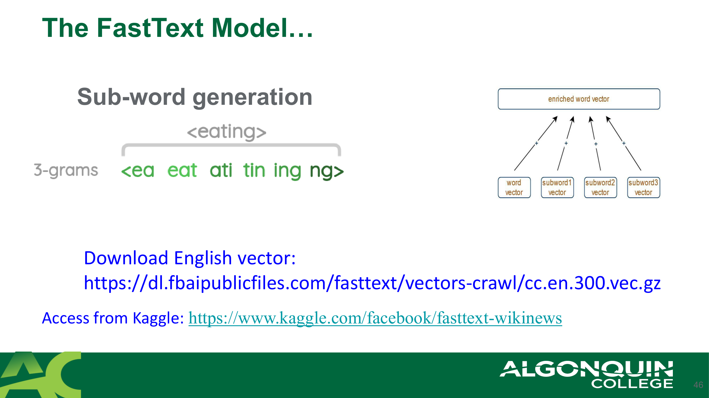

**FastText: Sub-word generation:** Diagram showing how a word is decomposed into character n-grams. — 图示词如何被分解为字符n-gram。

Ref: https://dl.fbaipublicfiles.com/fasttext/vectors-crawl/cc.en.300.vec.gz

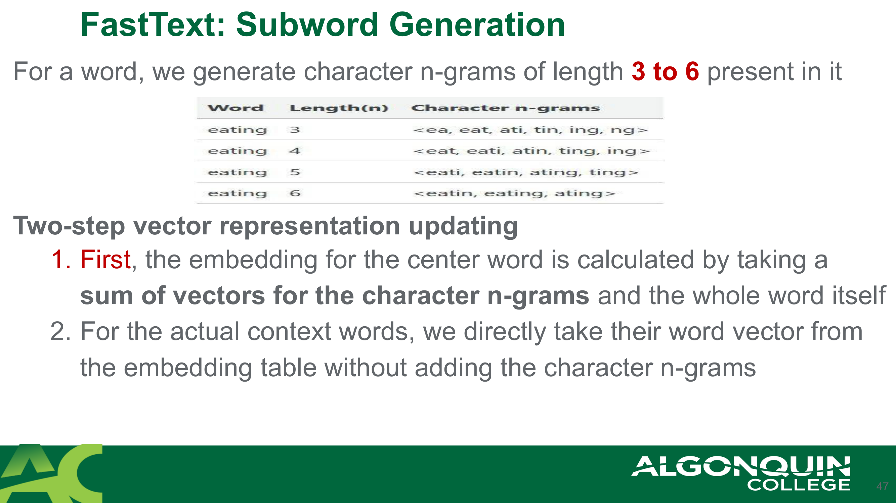

**FastText: Subword Generation Detail:** — FastText子词生成详情。

- For a word, we generate character n-grams of length 3 to 6 present in it — 对一个词，生成其中长度3到6的字符n-gram
- Two-step vector representation updating: — 两步向量表示更新：
  1. First, the embedding for the center word is calculated by taking a sum of vectors for the character n-grams and the whole word itself — 首先，中心词的嵌入通过对字符n-gram和整个词本身的向量求和来计算
  2. For the actual context words, we directly take their word vector from the embedding table without adding the character n-grams — 对于实际上下文词，直接从嵌入表中获取词向量，不添加字符n-gram

### 10.4 FastText优点 (FastText Advantages)

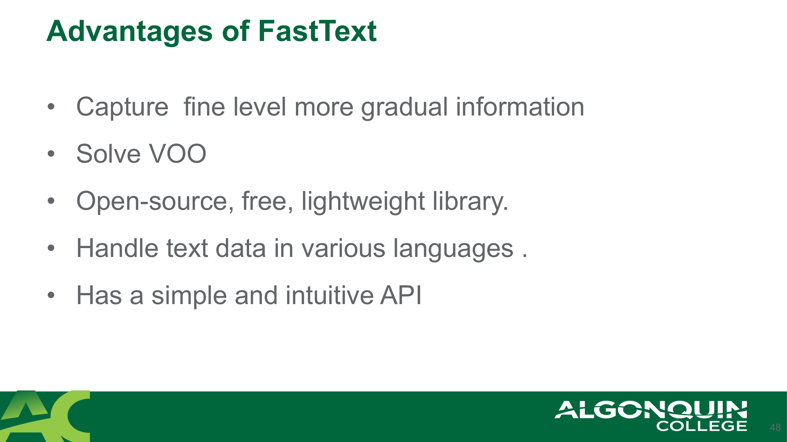

**Advantages of FastText:** — FastText的优点。

- Capture fine level more gradual information — 捕获更细粒度的信息
- Solve OOV — 解决OOV问题
- Open-source, free, lightweight library — 开源、免费、轻量级库
- Handle text data in various languages — 处理多种语言的文本数据
- Has a simple and intuitive API — 有简单直观的API

> **📝 Notes:**
>
> **📌 What:**
> **(1) FastText — Subword embeddings (子词嵌入):**
>
> FastText represents each word as a bag of character n-grams (length 3-6). "where" → {⟨wh, whe, her, ere, re⟩, ⟨whe, wher, here, ere⟩, ...} plus the whole word. A word's vector = sum of its n-gram vectors + whole-word vector. This means ANY word can get a vector — even if never seen during training!
>
> > FastText将每个词表示为字符n-gram（长度3-6）的集合。"where"→{⟨wh, whe, her, ere, re⟩, ⟨whe, wher, here, ere⟩, ...}加上整个词。词向量=其n-gram向量之和+整词向量。这意味着任何词都能得到向量——即使训练时从未见过！
>
> **🎯 Why:**
> **(1) OOV is the killer problem (OOV是致命问题):**
>
> Word2Vec and GloVe can ONLY represent words seen during training. New words (typos, slang, technical jargon, other languages) get NO vector. FastText solves this by building vectors from character pieces — "unhappiness" shares n-grams with "happy", "unhappy", "happiness", so it gets a meaningful vector even if never trained on.
>
> > Word2Vec和GloVe只能表示训练时见过的词。新词（拼写错误、俚语、专业术语、其他语言）得不到向量。FastText通过从字符片段构建向量来解决——"unhappiness"与"happy"、"unhappy"、"happiness"共享n-gram，所以即使从未训练过也能得到有意义的向量。
>
> **💡 Intuition:**
> **(1) Root words analogy (词根类比):**
>
> Like recognizing the meaning of a new word from its parts: "un-" (not) + "happy" + "-ness" (state). FastText does this automatically with character n-grams. Even misspelled words ("hapy") share enough n-grams with "happy" to get a similar vector.
>
> > 像通过词的各部分理解新词含义："un-"(不)+"happy"(快乐)+"-ness"(状态)。FastText通过字符n-gram自动完成。甚至拼错的词（"hapy"）也与"happy"共享足够的n-gram以获得相似向量。
>
> **⚖️ Compare:**
> **(1) Word2Vec vs GloVe vs FastText:**
>
> | Feature        | Word2Vec    | GloVe         | FastText                   |
> | -------------- | ----------- | ------------- | -------------------------- |
> | Unit           | Whole word  | Whole word    | Character n-grams          |
> | OOV handling   | ❌ Cannot   | ❌ Cannot     | ✅ Subword vectors         |
> | Morphology     | Ignores     | Ignores       | Captures (un-, -ness, -ly) |
> | Typo tolerance | None        | None          | High                       |
> | Inventor       | Google 2013 | Stanford 2014 | Facebook 2016              |
>
> > | 特性     | Word2Vec    | GloVe         | FastText                |
> > | -------- | ----------- | ------------- | ----------------------- |
> > | 单位     | 整词        | 整词          | 字符n-gram              |
> > | OOV处理  | ❌ 不能     | ❌ 不能       | ✅ 子词向量             |
> > | 形态学   | 忽略        | 忽略          | 捕获（un-、-ness、-ly） |
> > | 拼写容错 | 无          | 无            | 高                      |
> > | 发明者   | Google 2013 | Stanford 2014 | Facebook 2016           |
>
> **⚠️ Pitfall:**
> **(1) Larger model size (更大的模型尺寸):**
>
> FastText stores vectors for ALL n-grams, not just whole words. This makes the model significantly larger (GBs vs MBs). The trade-off: OOV handling and morphological awareness come at the cost of memory.
>
> > FastText存储所有n-gram的向量，不仅仅是整词。这使模型显著增大（GB vs MB）。权衡：OOV处理和形态学感知以内存为代价。
>
> **📝 Exam:**
> **(1) 概念题 (Conceptual):**
>
> "How does FastText handle OOV words?" → It represents words as bags of character n-grams (length 3-6). An unseen word's vector = sum of its n-gram vectors. Since n-grams are shared across words, even new words get meaningful vectors.
>
> > "FastText如何处理OOV词？" → 它将词表示为字符n-gram的集合（长度3-6）。未见词的向量=其n-gram向量之和。由于n-gram在词之间共享，新词也能获得有意义的向量。

---

## 11. 词嵌入优缺点总结 (Word Embedding Benefits & Limitations)

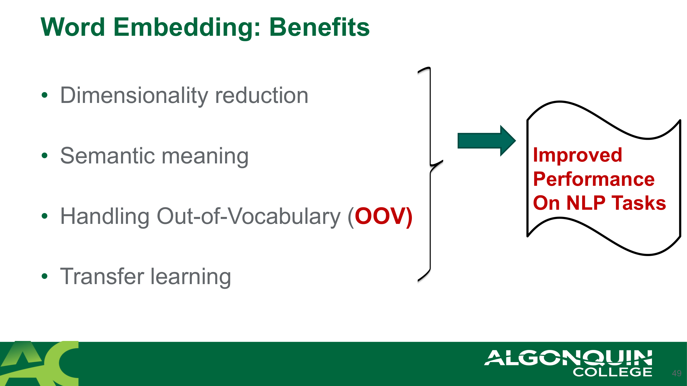

**Word Embedding: Benefits:** Four key benefits. — 词嵌入的四个关键优点。

- Dimensionality reduction — 降维
- Semantic meaning — 语义含义
- Handling Out-of-Vocabulary (OOV) — 处理OOV（FastText）
- Transfer learning — 迁移学习
- → Improved Performance On NLP Tasks — → 在NLP任务上性能提升

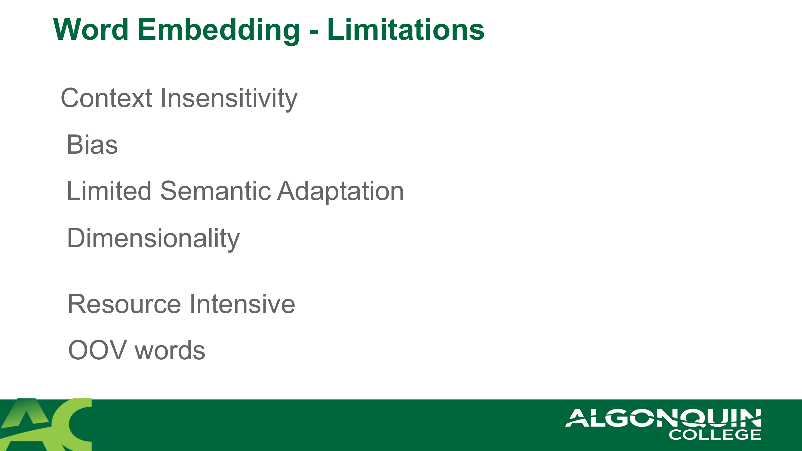

**Word Embedding - Limitations:** Six key limitations. — 词嵌入的六个关键局限性。

- Context Insensitivity — 上下文不敏感
- Bias — 偏见
- Limited Semantic Adaptation — 有限的语义适应
- Dimensionality — 维度
- Resource Intensive — 资源密集
- OOV words — OOV问题

> **📝 Notes:**
>
> **🎯 Why:**
> **(1) Context insensitivity is the fatal flaw (上下文不敏感是致命缺陷):**
>
> Word2Vec/GloVe/FastText give each word ONE fixed vector regardless of context. "bank" (river bank) has the same vector as "bank" (financial bank). This is why contextual embeddings (ELMo, BERT) were developed — they assign DIFFERENT vectors to the same word in different contexts.
>
> > Word2Vec/GloVe/FastText给每个词一个固定向量，不管上下文。"bank"（河岸）和"bank"（银行）的向量相同。这就是为什么开发了上下文嵌入（ELMo、BERT）——它们在不同上下文中给同一个词分配不同向量。
>
> **(2) Bias in embeddings (嵌入中的偏见):**
>
> Embeddings learn from text data, which contains human biases. If "doctor" co-occurs with "he" and "nurse" with "she" in training data, the embeddings encode gender bias. "Man:Computer_programmer :: Woman:Homemaker" is a real analogy found in Word2Vec.
>
> > 嵌入从文本数据中学习，文本包含人类偏见。如果训练数据中"doctor"与"he"共现、"nurse"与"she"共现，嵌入就编码了性别偏见。"Man:Computer_programmer :: Woman:Homemaker"是Word2Vec中发现的真实类比。
>
> **⚖️ Compare:**
> **(1) Static vs Contextual embeddings (静态 vs 上下文嵌入):**
>
> | Feature      | Static (Word2Vec/GloVe/FastText) | Contextual (ELMo/BERT)           |
> | ------------ | -------------------------------- | -------------------------------- |
> | Word "bank"  | One fixed vector                 | Different vector per context     |
> | Training     | Unsupervised, fast               | Pre-train + fine-tune, expensive |
> | Introduced   | 2013-2016                        | 2018+                            |
> | This lecture | ✅ Covered                       | Preview for later                |
>
> > | 特性       | 静态（Word2Vec/GloVe/FastText） | 上下文（ELMo/BERT） |
> > | ---------- | ------------------------------- | ------------------- |
> > | "bank"一词 | 一个固定向量                    | 每个上下文不同向量  |
> > | 训练       | 无监督，快速                    | 预训练+微调，昂贵   |
> > | 提出       | 2013-2016                       | 2018+               |
> > | 本讲       | ✅ 已讲                         | 后续预告            |
>
> **📝 Exam:**
> **(1) 推理题 (Reasoning):**
>
> "What is the main limitation of static word embeddings?" → They are context-insensitive. The same word gets the same vector regardless of its meaning in context. E.g., "bank" (river) = "bank" (financial) in Word2Vec.
>
> > "静态词嵌入的主要局限是什么？" → 上下文不敏感。同一个词不管上下文含义都得到相同向量。例如Word2Vec中"bank"（河岸）="bank"（银行）。

---

## 12. 通用文本表示与评估 (Universal Text Representations & Evaluation)

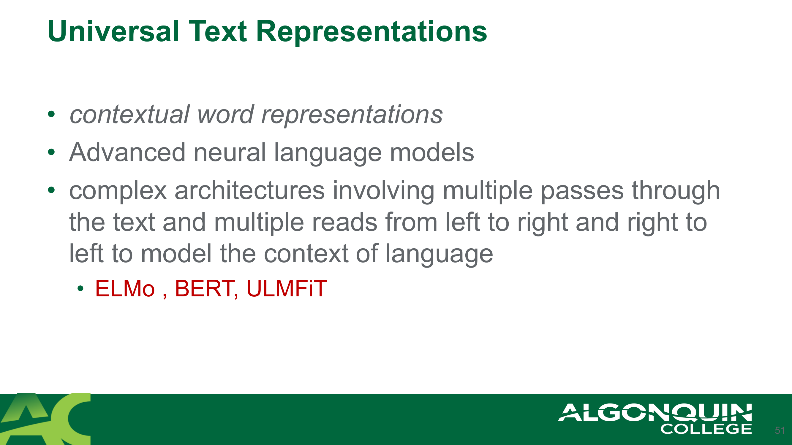

**Universal Text Representations:** Preview of next-generation contextual models. — 下一代上下文模型预告。

- Contextual word representations — 上下文词表示
- Advanced neural language models — 高级神经语言模型
- Complex architectures involving multiple passes through the text and multiple reads from left to right and right to left to model the context of language — 复杂架构，涉及对文本的多次遍历和从左到右、从右到左的多次读取以建模语言上下文
- ELMo, BERT, ULMFiT — ELMo、BERT、ULMFiT

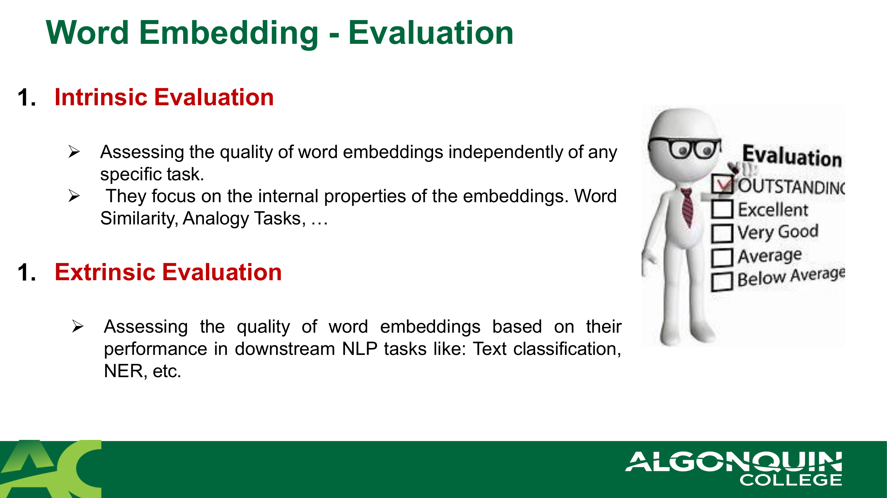

**Word Embedding - Evaluation:** Two evaluation methods. — 两种评估方法。

1. **Intrinsic Evaluation** — Assessing quality independently of any specific task. Focus on internal properties: Word Similarity, Analogy Tasks, … — **内在评估** — 独立于任何特定任务评估质量。关注内部属性：词相似度、类比任务等
2. **Extrinsic Evaluation** — Assessing quality based on performance in downstream NLP tasks like: Text classification, NER, etc. — **外在评估** — 基于下游NLP任务（文本分类、NER等）的性能评估质量

> **📝 Notes:**
>
> **📌 What:**
> **(1) Intrinsic vs Extrinsic evaluation (内在 vs 外在评估):**
>
> Intrinsic: test the embeddings DIRECTLY — "Does king-man+woman≈queen?" (analogy), "Is cos(happy,glad) > cos(happy,sad)?" (similarity). Extrinsic: test embeddings INDIRECTLY — "Does using GloVe instead of BOW improve my sentiment classifier's accuracy?"
>
> > 内在评估：直接测试嵌入——"king-man+woman≈queen吗？"（类比），"cos(happy,glad)>cos(happy,sad)吗？"（相似度）。外在评估：间接测试嵌入——"用GloVe代替BOW是否提高了我的情感分类器准确率？"
>
> **⚠️ Pitfall:**
> **(1) Good intrinsic ≠ good extrinsic (内在好≠外在好):**
>
> Embeddings that ace analogy tests may not improve your specific task. Always evaluate on YOUR downstream task. The best intrinsic evaluation is just a proxy — what matters is downstream performance.
>
> > 在类比测试中表现优异的嵌入可能不会改善你的特定任务。始终在你的下游任务上评估。最好的内在评估只是一个代理——重要的是下游性能。
>
> **📝 Exam:**
> **(1) 概念题 (Conceptual):**
>
> "What is the difference between intrinsic and extrinsic evaluation of word embeddings?" → Intrinsic: tests embedding quality directly (analogy, similarity tasks). Extrinsic: tests embedding quality through downstream task performance (classification, NER).
>
> > "词嵌入的内在和外在评估有什么区别？" → 内在：直接测试嵌入质量（类比、相似度任务）。外在：通过下游任务性能测试嵌入质量（分类、NER）。

---

## 13. 本周总结 (Week Summary)


**Week 4 Summary:** — 第4周总结。

- ❖ WordNet and word senses — WordNet与词义
- ❖ Distributed representation — 分布式表示
- ❖ Word Embedding — 词嵌入
- ❖ Word2Vec — Word2Vec
- ❖ GloVe — GloVe
- ❖ FastText — FastText
- ❖ Evaluation of Word Embeddings — 词嵌入评估
- ❖ Problems with Word Embedding — 词嵌入的问题


**Q&A** — 问答环节
