# lecture 5 W26

**Source:** `lecture_5_W26.pdf`  
**Total Pages:** 63  
**Format:** Hybrid (pdfplumber + PyMuPDF)

---

## Page 1

### 📷 Page Image

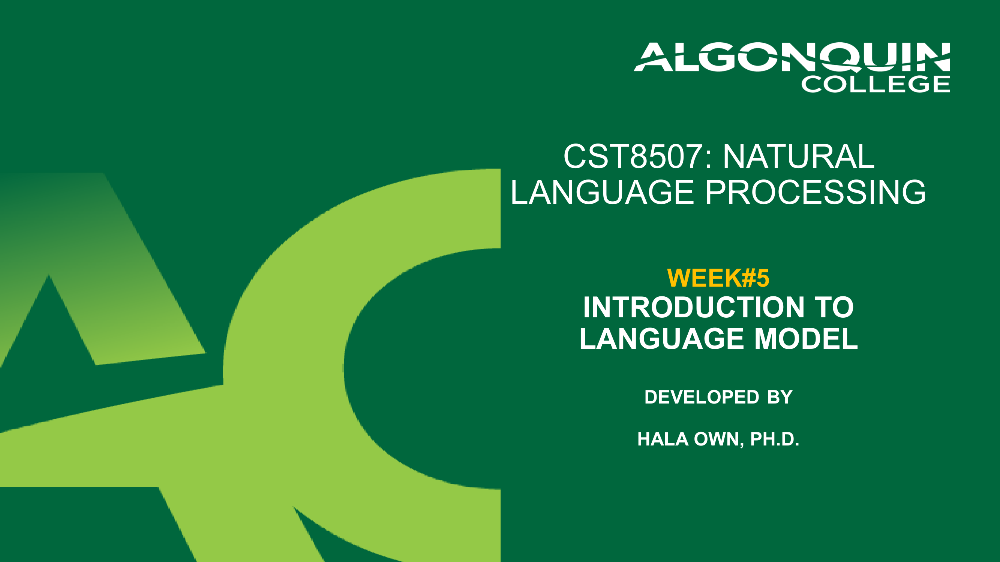

### 📝 Text Content

**CST8507: NATURAL**

LANGUAGE PROCESSING
WEEK#5
INTRODUCTION TO
LANGUAGE MODEL
DEVELOPED BY
HALA OWN, PH.D.


### ✍️ Notes

> 本讲主题：语言模型导论 (Introduction to Language Model)
> 涵盖从统计方法 (N-gram) 到神经网络 (RNN/LSTM) 的语言模型演进

---

## Page 2

### 📷 Page Image

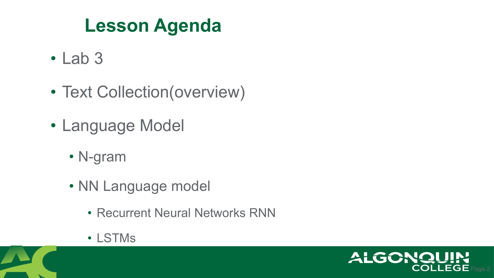

### 📝 Text Content

**Lesson Agenda**


• Lab

• Text Collection(overview)

• Language Model

• N-gram

• NN Language model

• Recurrent Neural Networks RNN

• LSTMs

Page


### ✍️ Notes

> 本周内容涵盖以下几大主题：
> - **文本收集 (Text Collection):** 如何从社交平台获取数据（X API, Web Scraping）
> - **语言模型 (Language Model):** 预测下一个词的任务
> - **N-gram:** 基于统计的语言模型
> - **神经网络语言模型 (NN Language Model):** 用神经网络替代统计方法
> - **循环神经网络 (RNN):** 处理序列数据的网络
> - **长短时记忆网络 (LSTM):** 解决 RNN 梯度消失的改进方案

---

## Page 3

### 📷 Page Image

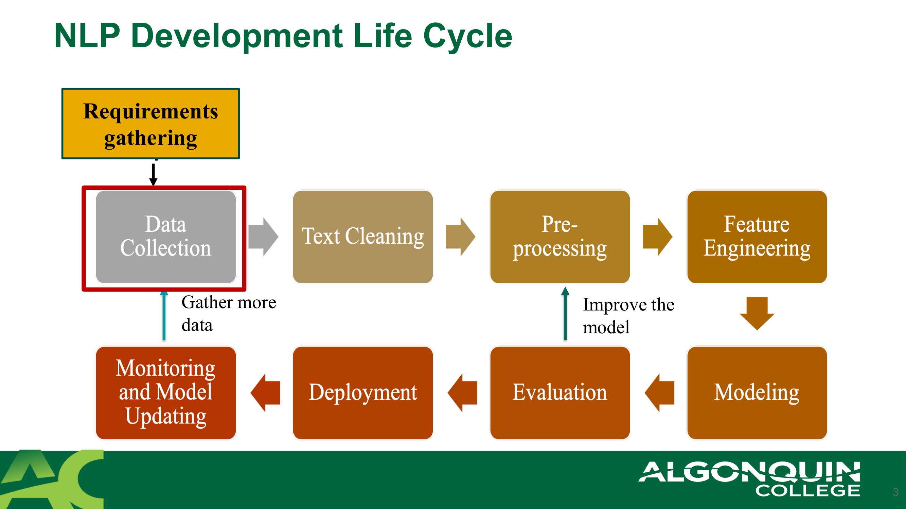

### 📝 Text Content

**NLP Development Life Cycle**

Requirements
gathering
Gather more Improve the
data model


### ✍️ Notes

> NLP 项目的典型开发流程是一个**迭代循环**：
> - **需求收集 (Requirements Gathering):** 明确任务目标
> - **收集更多数据 (Gather More Data):** 数据不够时需扩充
> - **改进模型 (Improve the Model):** 根据反馈调整
>
> **💡 提示:** NLP 不是一次完成的，通常需要多轮迭代才能达到理想效果

---

## Page 4

### 📷 Page Image


### 📝 Text Content

**Data generated in one minute on various social platforms**

Image source: HTTPs://localiq.com/blog/what-happens-in-an-internet-minute/


### ✍️ Notes

> **社交平台数据量:** 各社交平台每分钟生成海量数据，是 NLP 的重要数据来源

---

## Page 5

### 📷 Page Image


### 📝 Text Content

**Text Collection**


• Tweet Collecting

• X API


### ✍️ Notes

> **推文收集方式:**
> - **X API (Twitter API):** 通过官方开发者接口获取推文数据
> - 需要先创建 X Developer Account

---

## Page 6

### 📷 Page Image


### 📝 Text Content

**Create X Developer Account**

https://help.rssground.com/articles/233141-how-to-create-x-twitter-
developer-app


### ✍️ Notes

> 需要先创建 X Developer Account 才能使用 X API 获取推文数据

---

## Page 7

### 📷 Page Image


### 📝 Text Content

**Web Scraping:Extraction of data from a website**

Python libraries are widely used for parsing HTML:
1. Beautiful Soup: A popular library for parsing HTML and XML documents. It
simplifies extracting data from web pages and has an active community with
detailed documentation.
2. lxml: Known for its speed, lxml is one of the fastest parsing libraries available. It
receives regular updates, with the latest released in July 2023.
3. html5lib: A pure-Python library designed to conform to the WHATWG
Web Hypertext Application Technology Working Group HTML
( )
specification, ensuring compatibility with major web browsers.


### ✍️ Notes

> **网页抓取 (Web Scraping):** 从网站提取数据的技术
> - **Beautiful Soup:** 最流行的 HTML/XML 解析库，社区活跃，文档详尽
> - **lxml:** 速度最快的解析库之一
> - **html5lib:** 纯 Python 库，遵循 WHATWG 规范，与主流浏览器兼容
>
> **💡 提示:** Web Scraping 需要注意网站的 robots.txt 和使用条款

---

## Page 8

### 📷 Page Image


### 📝 Text Content

**Demo**


• Inclass code


### ✍️ Notes

> [Add your notes here]

---

## Page 9

### 📷 Page Image


### 📝 Text Content

**Reminder**

PROBABILITY THEORY


### ✍️ Notes

> 概率论是语言模型的数学基础，需要复习以下核心概念

---

## Page 10

### 📷 Page Image

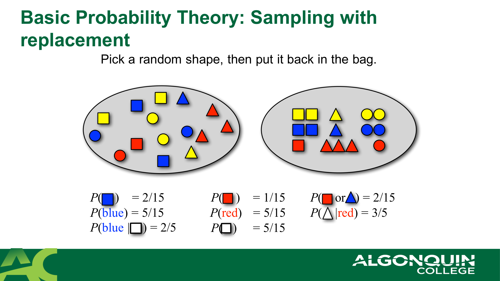

### 📝 Text Content

**Basic Probability Theory: Sampling with**

replacement
Pick a random shape, then put it back in the bag.
P( ) = 2/15 P( ) = 1/15 P( or ) = 2/15
P(blue) = 5/15 P(red) = 5/15 P( |red) = 3/5
P(blue | ) = 2/5 P( ) = 5/15
CS447: Natural Language Processing (J. Hockenmaier) 10


### ✍️ Notes

> **有放回抽样:** 每次抽取后将物品放回袋中，再进行下一次抽取
> - 每次抽取是**独立事件**，概率不变
> - P(形状) = 该形状数量 / 总数量
> - 例如：P(blue) = 5/15, P(red) = 5/15

---

## Page 11

### 📷 Page Image

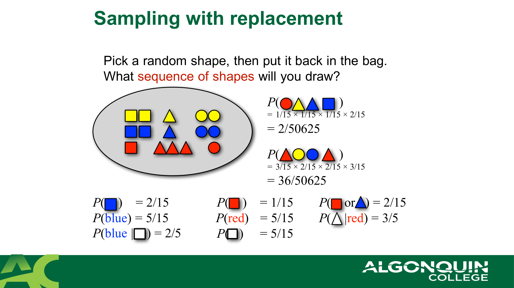

### 📝 Text Content

**Sampling with replacement**

Pick a random shape, then put it back in the bag.
What sequence of shapes will you draw?
P( )
= 1/15 × 1/15 × 1/15 × 2/15
= 2/50625
P( )
= 3/15 × 2/15 × 2/15 × 3/15
= 36/50625
P( ) = 2/15 P( ) = 1/15 P( or ) = 2/15
P(blue) = 5/15 P(red) = 5/15 P( |red) = 3/5
P(blue | ) = 2/5 P( ) = 5/15
CS447: Natural Language Processing (J. Hockenmaier) 11


### ✍️ Notes

> **序列概率:** 连续抽取多个物品的概率等于各次概率的**乘积**
> - 例：P(序列) = 1/15 × 1/15 × 1/15 × 2/15 = 2/50625
>
> **💡 提示:** 语言模型中，"预测下一个词" 就类似于有放回抽样的概率计算

---

## Page 12

### 📷 Page Image

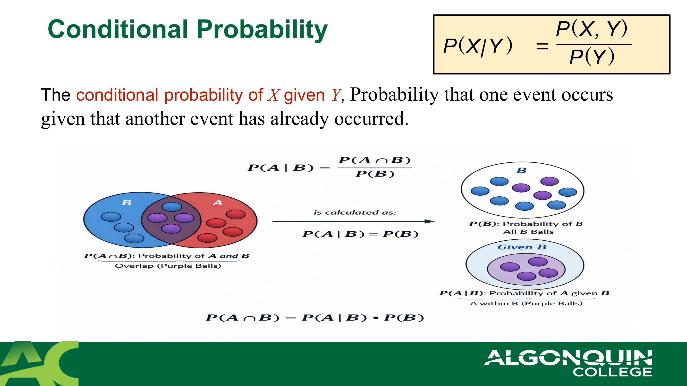

### 📝 Text Content

**Conditional Probability P(X, Y )**

P(X|Y ) =
P(Y )
The conditional probability of X given Y, Probability that one event occurs
given that another event has already occurred.
CS447: Natural Language Processing (J. Hockenmaier) 12


### ✍️ Notes

> **条件概率公式:**
> ```
> P(X|Y) = P(X, Y) / P(Y)
> ```
> - P(X|Y)：已知 Y 发生的条件下，X 发生的概率
> - P(X, Y)：X 和 Y 同时发生的**联合概率**
> - P(Y)：Y 发生的概率
>
> **💡 提示:** 条件概率是语言模型的核心——"已知前面的词，下一个词出现的概率"

---

## Page 13

### 📷 Page Image

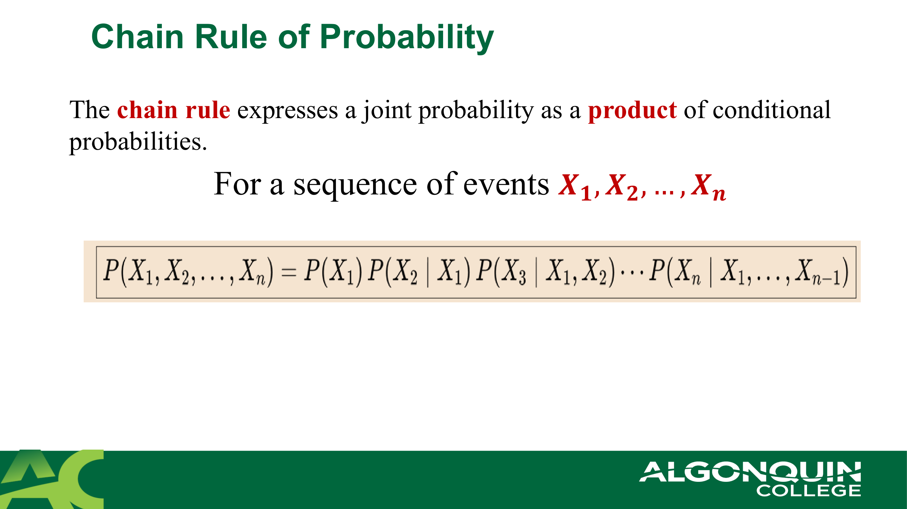

### 📝 Text Content

**Chain Rule of Probability**

The chain rule expresses a joint probability as a product of conditional
probabilities.
For a sequence of events
𝑿 , 𝑿 , … , 𝑿
𝟏 𝟐 𝒏


### ✍️ Notes

> **链式法则:** 将联合概率分解为一系列条件概率的乘积
> - 对于事件序列 X₁, X₂, ..., Xₙ：
> ```
> P(X₁, X₂, ..., Xₙ) = P(X₁) × P(X₂|X₁) × P(X₃|X₁,X₂) × ... × P(Xₙ|X₁,...,Xₙ₋₁)
> ```
> - 这是语言模型计算句子概率的数学基础
>
> **💡 提示:** 链式法则在 N-gram 模型中被简化——只考虑前 n-1 个词

---

## Page 14

### 📷 Page Image


### 📝 Text Content

**LANGUAGE MODELING**


### ✍️ Notes

> **语言建模 (Language Modeling):** 预测下一个词的任务
> - 给定一个词序列，计算下一个词的概率分布
> - 执行该任务的系统称为**语言模型 (Language Model, LM)**

---

## Page 15

### 📷 Page Image

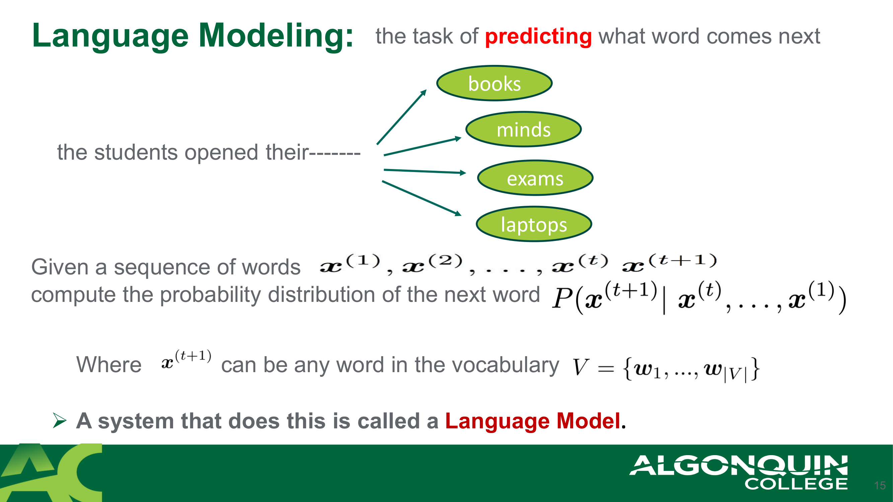

### 📝 Text Content

**the task of predicting what word comes next**

Language Modeling:
books
minds
the students opened their-------
exams
laptops
Given a sequence of words
compute the probability distribution of the next word
Where can be any word in the vocabulary
➢ A system that does this is called a Language Model.


### ✍️ Notes

> **语言建模定义:** 给定一个词序列，计算下一个词的概率分布
> - 例："the students opened their ____" → books? minds? exams? laptops?
> - 执行该任务的系统称为**语言模型 (Language Model, LM)**

---

## Page 16

### 📷 Page Image


### 📝 Text Content

**Popular Usages**


### ✍️ Notes

> **常见应用:** 自动补全、机器翻译、语音识别、文本生成等

---

## Page 17

### 📷 Page Image

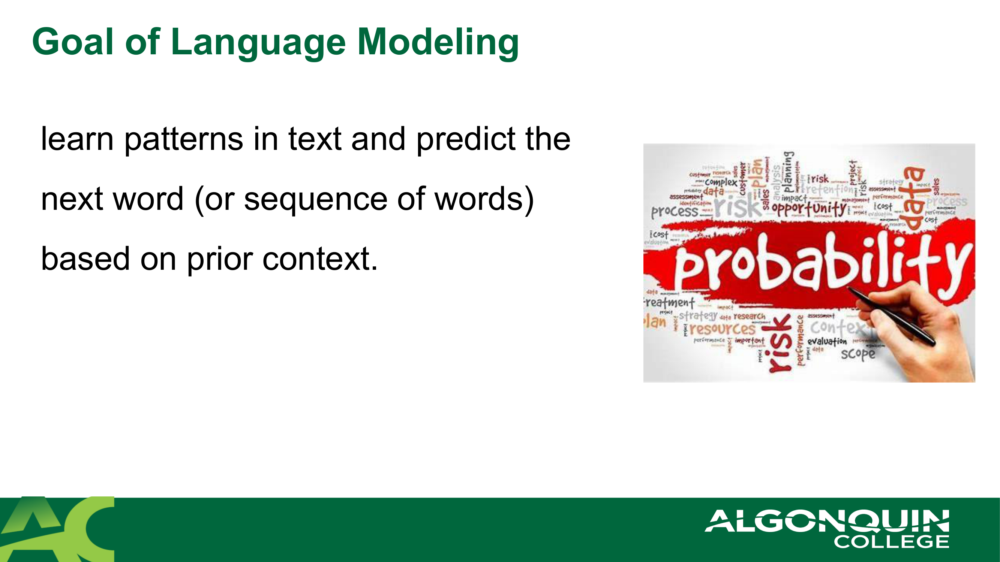

### 📝 Text Content

**Goal of Language Modeling**

learn patterns in text and predict the
next word (or sequence of words)
based on prior context.


### ✍️ Notes

> **目标:** 学习文本中的模式，根据上下文预测下一个词或词序列

---

## Page 18

### 📷 Page Image

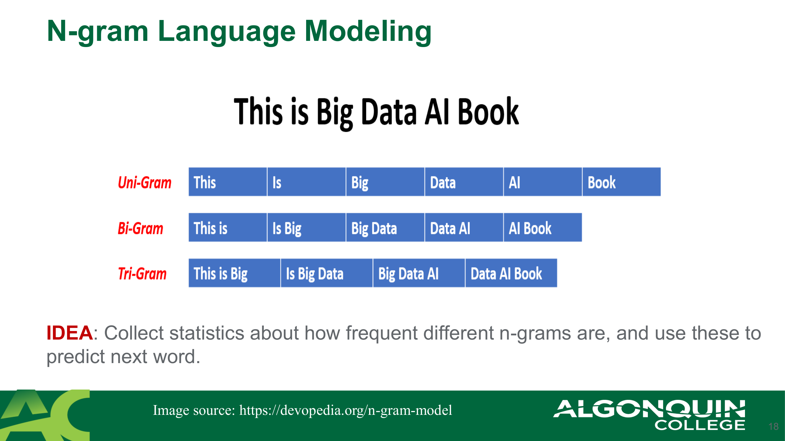

### 📝 Text Content

**N-gram Language Modeling**

IDEA: Collect statistics about how frequent different n-grams are, and use these to
predict next word.
Image source: https://devopedia.org/n-gram-model


### ✍️ Notes

> **核心思想:** 收集不同 N-gram（连续 N 个词）的频率统计，用这些统计来预测下一个词
>
> **N-gram 类型:**
> - Unigram (1-gram): 单个词
> - Bigram (2-gram): 两个连续词
> - Trigram (3-gram): 三个连续词
> - 4-gram: 四个连续词

---

## Page 19

### 📷 Page Image

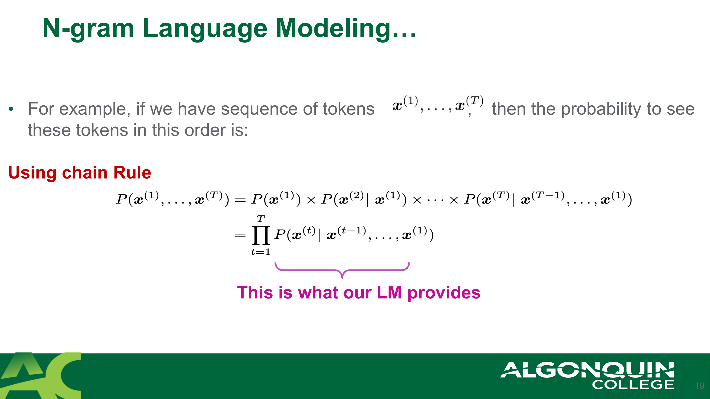

### 📝 Text Content

**N-gram Language Modeling…**


• For example, if we have sequence of tokens , then the probability to see

these tokens in this order is:
Using chain Rule
This is what our LM provides


### ✍️ Notes

> **计算方式（使用链式法则 + 简化假设）:**
> - 句子概率 P(w₁w₂...wₙ) = ∏ P(wᵢ | wᵢ₋ₙ₊₁...wᵢ₋₁)
> - 只看前 n-1 个词，不看更远的历史

---

## Page 20

### 📷 Page Image

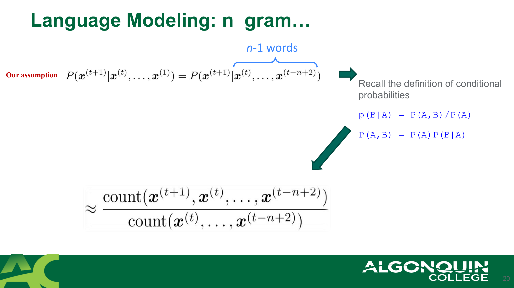

### 📝 Text Content

**Language Modeling: n gram…**

n-1 words
Our assumption
Recall the definition of conditional
probabilities
p(B|A) = P(A,B)/P(A)
P(A,B) = P(A)P(B|A)


### ✍️ Notes

> **条件概率回顾:**
> ```
> p(B|A) = P(A,B) / P(A)
> P(A,B) = P(A) × P(B|A)
> ```

---

## Page 21

### 📷 Page Image

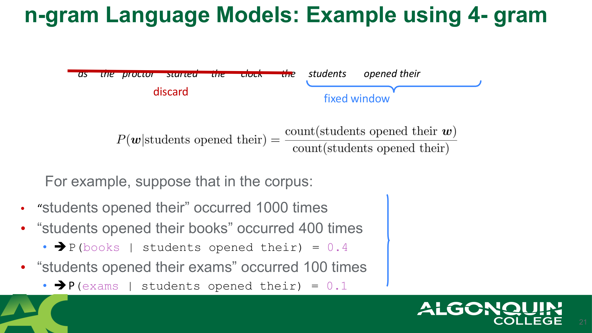

### 📝 Text Content

**n-gram Language Models: Example using 4- gram**

as the proctor started the clock the students opened their
discard
fixed window
For example, suppose that in the corpus:
students opened their” occurred 1000 times

• “

• “students opened their books” occurred 400 times

• ➔P(books | students opened their) = 0.4

• “students opened their exams” occurred 100 times

• ➔P(exams | students opened their) = 0.1


### ✍️ Notes

> [Add your notes here]

---

## Page 22

### 📷 Page Image

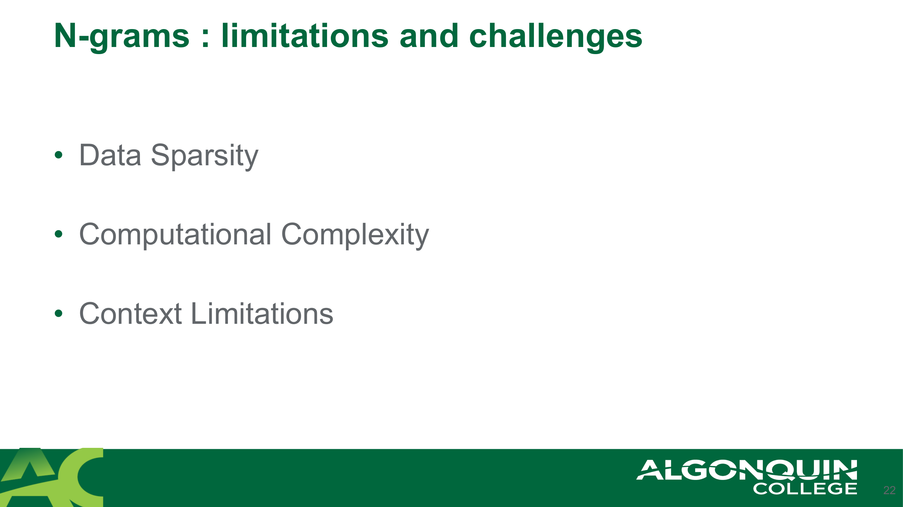

### 📝 Text Content

**N-grams : limitations and challenges**


• Data Sparsity

• Computational Complexity

• Context Limitations


### ✍️ Notes

> N-gram 模型存在三大主要问题：
> - **数据稀疏 (Data Sparsity):** 很多 N-gram 组合在训练数据中从未出现过，概率为 0
> - **计算复杂度 (Computational Complexity):** N 越大，需要存储的 N-gram 组合数呈指数增长
> - **上下文限制 (Context Limitations):** 只能看前 n-1 个词，无法捕捉更远的依赖关系
>
> **💡 提示:** 这些局限性催生了基于神经网络的语言模型

---

## Page 23

### 📷 Page Image

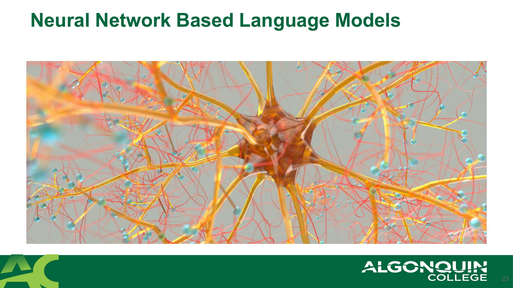

### 📝 Text Content

**Neural Network Based Language Models**


### ✍️ Notes

> N-gram 的局限性催生了基于神经网络的语言模型，用神经网络学习词的表示和概率分布

---

## Page 24

### 📷 Page Image

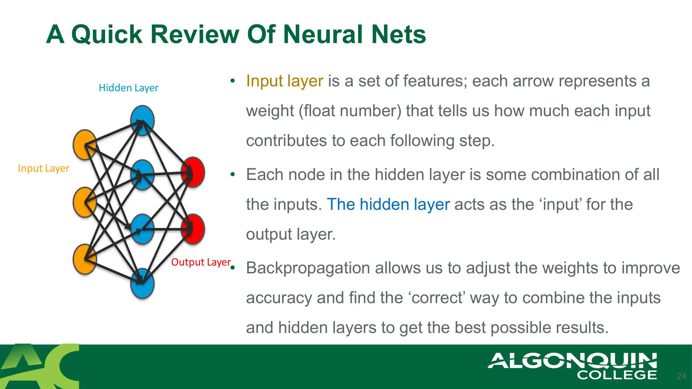

### 📝 Text Content

**A Quick Review Of Neural Nets**


• Input layer is a set of features; each arrow represents a

HiddenLayer
weight (float number) that tells us how much each input
contributes to each following step.
InputLayer

• Each node in the hidden layer is some combination of all

the inputs. The hidden layer acts as the ‘input’ for the
output layer.
OutputLayer

• Backpropagation allows us to adjust the weights to improve

accuracy and find the ‘correct’ way to combine the inputs
and hidden layers to get the best possible results.


### ✍️ Notes

> **三层结构:**
> - **输入层 (Input Layer):** 一组特征值
> - **隐藏层 (Hidden Layer):** 对所有输入的某种组合
> - **输出层 (Output Layer):** 最终预测结果
>
> **关键概念:**
> - **权重 (Weight):** 每个箭头代表一个权重（浮点数），表示每个输入对下一步的贡献程度
> - **反向传播 (Backpropagation):** 调整权重以提高准确率的算法

---

## Page 25

### 📷 Page Image

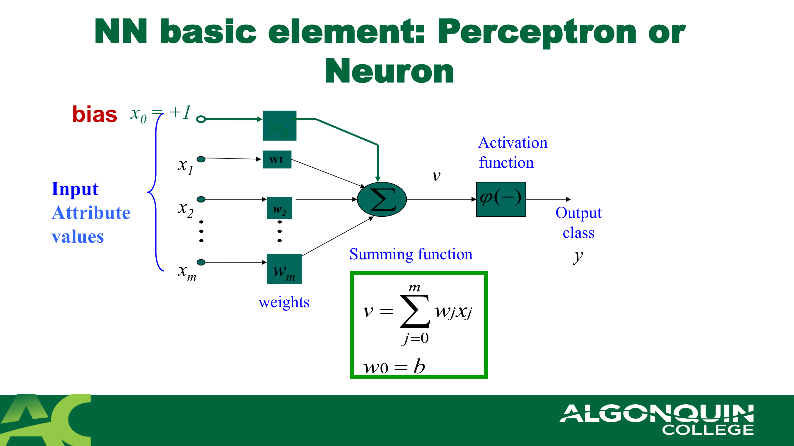

### 📝 Text Content

**NN basic element: Perceptron or**

Neuron
Activation
x W1 function
1 v
Input
x
Attribute 2 w 2 Output
values class
Summing function y
x w
m m
weights
 
 ( − )
x = +1
w

v
w
=
=

j
m
=
b
w
j
x
j
bias


### ✍️ Notes

> **感知器是神经网络的基本单元:**
> - 输入: x₁, x₂, ..., xₘ（属性值）
> - 权重: w₁, w₂, ..., wₘ
> - 求和函数: v = Σ(wⱼ × xⱼ) + b（其中 b 是偏置 bias）
> - 激活函数 (Activation Function): 将求和结果映射为输出 y
>
> **💡 提示:** 每个神经元本质上是 "加权求和 + 非线性变换"

---

## Page 26

### 📷 Page Image

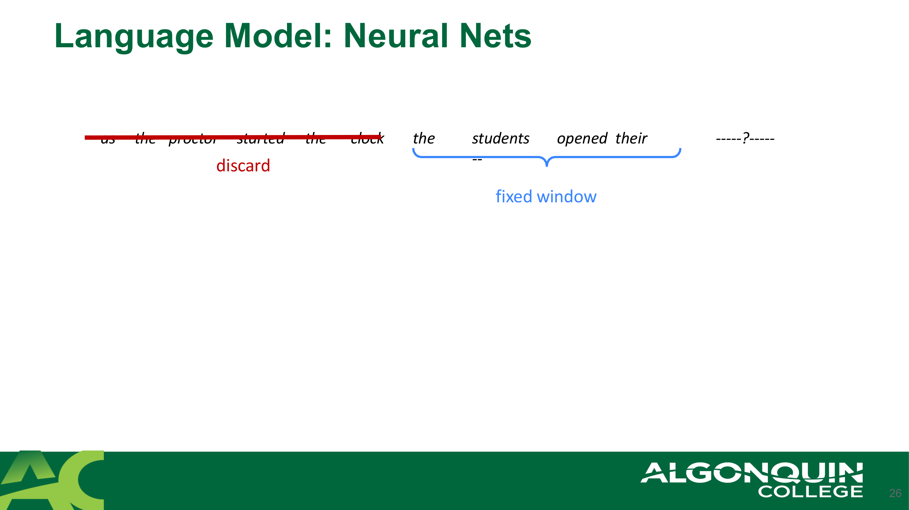

### 📝 Text Content

**Language Model: Neural Nets**

as the proctor started the clock the students opened their -----?-----
--
discard
fixed window


### ✍️ Notes

> [Add your notes here]

---

## Page 27

### 📷 Page Image

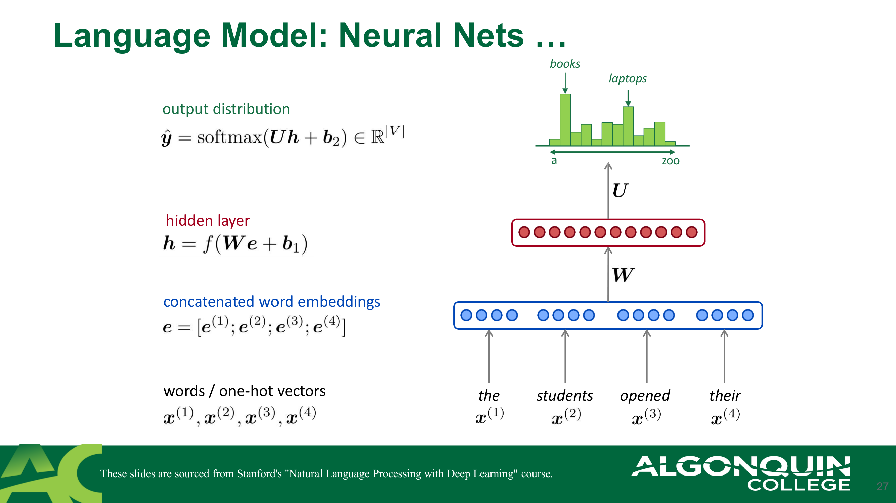

### 📝 Text Content

**Language Model: Neural Nets …**

books
laptops
output distribution
a zoo
hidden layer
concatenated word embeddings
words / one-hot vectors
the students opened their
These slides are sourced from Stanford's "Natural Language Processing with Deep Learning" course.


### ✍️ Notes

> **输入结构:** 词的 one-hot 向量 → 词嵌入 (Word Embeddings) → 拼接 → 隐藏层 → 输出分布
> - 输出: 词汇表中每个词的概率分布

---

## Page 28

### 📷 Page Image

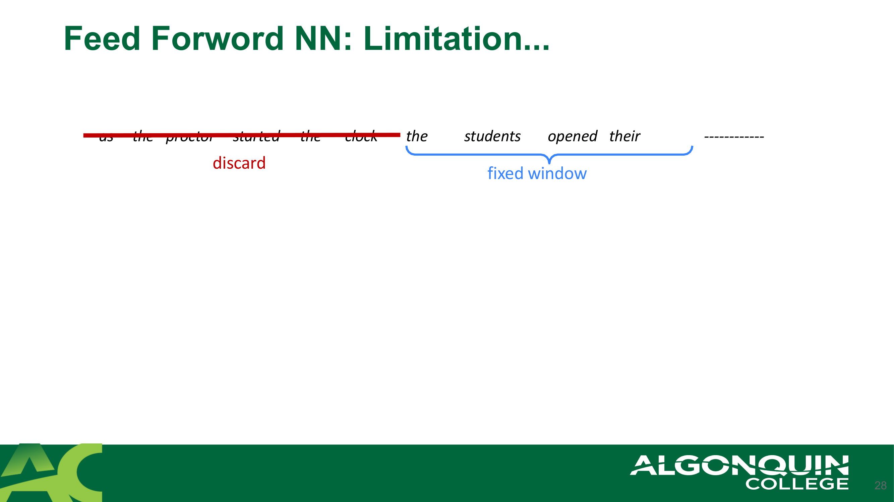

### 📝 Text Content

**as the proctor started the clock the students opened their ------------**

Feed Forword NN: Limitation...
discard
fixed window


### ✍️ Notes

> **前馈 NN 的局限性:** 固定窗口大小，仍然无法处理任意长度的输入

---

## Page 29

### 📷 Page Image

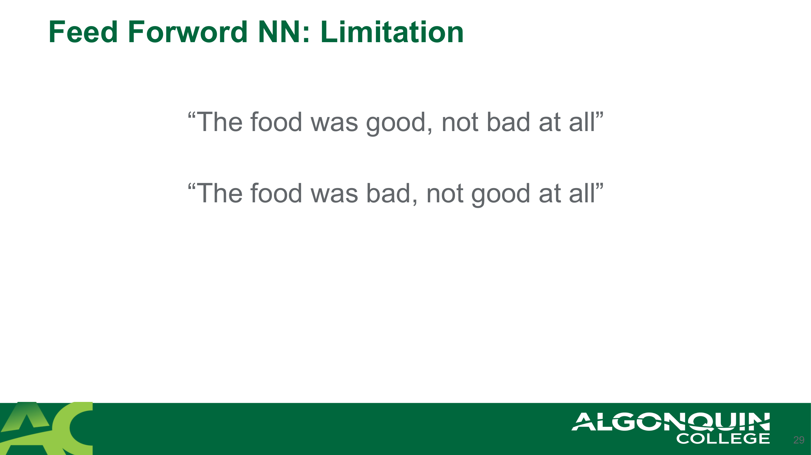

### 📝 Text Content

**Feed Forword NN: Limitation**

“The food was good, not bad at all”
“The food was bad, not good at all”


### ✍️ Notes

> **固定窗口问题示例:** 含义完全相反，但固定窗口可能看到相同的局部上下文

---

## Page 30

### 📷 Page Image


### 📝 Text Content

**Feed Forword NN: Limitation…**

“Just watched the new movie. Loved it! #entertained”
“The storyline was captivating, the characters were well-
developed, and the cinematography was impressive. Overall,
a fantastic movie night! #movienight #recommend”


### ✍️ Notes

> [Add your notes here]

---

## Page 31

### 📷 Page Image

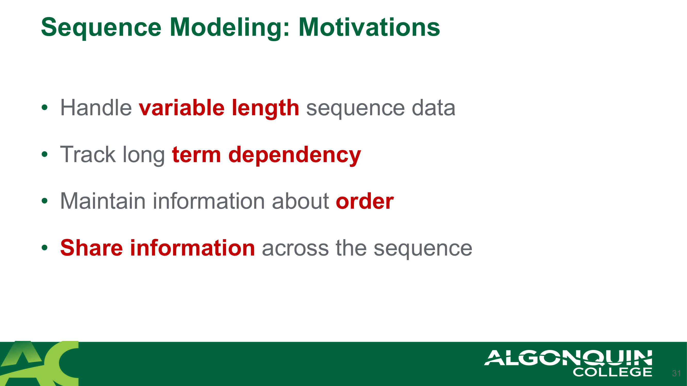

### 📝 Text Content

**Sequence Modeling: Motivations**


• Handle variable length sequence data

• Track long term dependency

• Maintain information about order

• Share information across the sequence


### ✍️ Notes

> **这一页是关键转折点：** 前面刚讲完 N-gram（Page 22）和 Feed Forward NN（Page 28-30）的局限性，这里列出了我们**真正需要**的四个能力，为引出 RNN 做铺垫。
>
> **四个核心需求:**
> - **处理变长序列数据 (Handle Variable Length Sequence Data):**
>   句子可以是 3 个词，也可以是 300 个词。N-gram 和 FFNN 用固定窗口大小（如 4-gram），无法灵活处理不同长度的输入。
> - **追踪长期依赖关系 (Track Long-Term Dependency):**
>   例: "The **cat**, which sat on the mat, **was** sleeping." 中 "cat" 和 "was" 相隔很远，但有语法依赖（主谓一致）。N-gram 短窗口捕捉不到。
> - **维护顺序信息 (Maintain Information About Order):**
>   "dog bites man" ≠ "man bites dog"，词的顺序至关重要，模型必须区分相同词在不同位置的含义。
> - **在序列中共享信息 (Share Information Across the Sequence):**
>   模型在一个位置学到的模式应能复用到其他位置（如学到 "like" 后接名词，既适用于 "I like cats" 也适用于 "You like dogs"）。
>
> **💡 提示:** 这四个需求恰好是 N-gram 和 FFNN 都无法满足的。接下来的 RNN 通过**隐藏状态 (hidden state)** 在时间步之间传递信息，天然支持变长输入、长期依赖、顺序保持和参数共享——正好对应这四个需求。

---

## Page 32

### 📷 Page Image

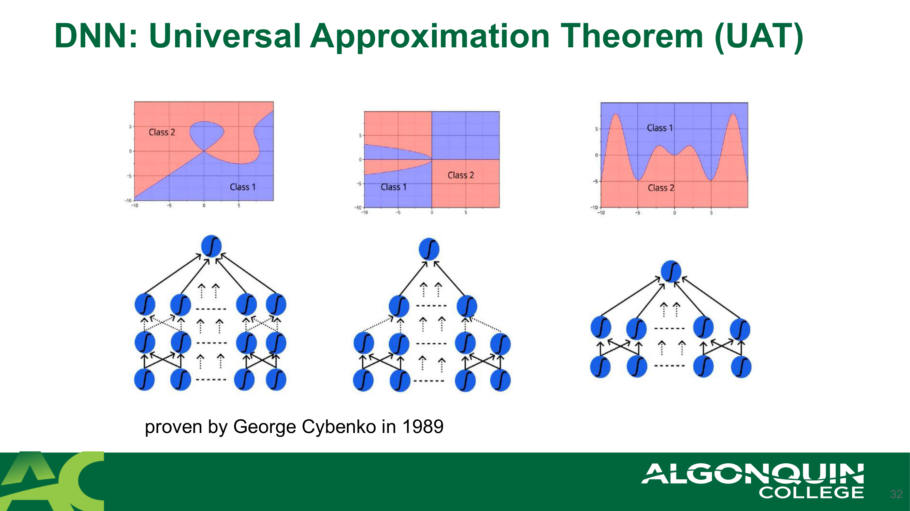

### 📝 Text Content

**DNN: Universal Approximation Theorem (UAT)**

proven by George Cybenko in 1989


### ✍️ Notes

> **通用近似定理 (Universal Approximation Theorem, UAT):**
> 由 George Cybenko 于 1989 年证明。
>
> **核心含义:** 一个具有**至少一个隐藏层**且隐藏层有**足够多神经元**的前馈神经网络，可以以**任意精度**近似任意连续函数。
>
> **重点看上面三张彩色图（决策边界 Decision Boundary）:**
> - **中图 — 最简单:** 决策边界几乎是**直线/V 形**，红蓝区域用直线分隔
> - **左图 — 中等复杂:** 决策边界是一条**平滑曲线**，把红蓝区域弯曲地分开
> - **右图 — 最复杂:** 决策边界极其**扭曲不规则**，像锯齿波一样，红蓝区域交错复杂
>
> **这三张图的核心信息:**
> 不管分类问题多复杂（决策边界多扭曲），只要神经网络够深够宽，理论上**都能学出来**。
> 下面三个网络结构图差别不大，只是示意不同架构对应不同复杂度的决策边界。
>
> **关键理解:**
> - 网络越深越宽 → 决策边界越精细复杂 → 能拟合越复杂的函数
> - UAT 说的是"**理论上可行**"，实际训练能否学到取决于数据量、优化算法等
> - 这为后续的 RNN（本质也是深度网络）提供了理论支撑：DNN 能近似任意函数 → 用 DNN 建模语言有理论基础
>
> **💡 提示:** UAT 是"深度学习为什么有效"的数学理论基础之一，但它只保证**存在性**（一定存在这样的网络），不保证我们一定能**找到**它

---

## Page 33

### 📷 Page Image

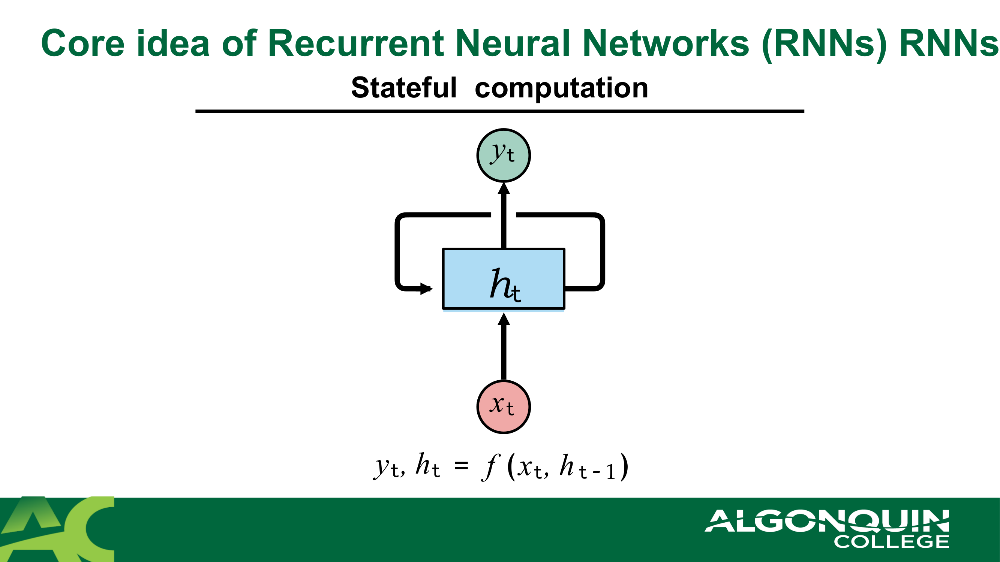

### 📝 Text Content

**Core idea of Recurrent Neural Networks (RNNs) RNNs**

Stateful computation
y
t
h
t
x
t
y , h = f (x , h )
t t t t -


### ✍️ Notes

> **RNN 的核心思想: 有状态的计算 (Stateful Computation)**
>
> **图解读（从下到上）:**
> - **xₜ（粉红色圆）:** 当前时间步的**输入**（例如当前词的词嵌入）
> - **hₜ（蓝色方块）:** 当前时间步的**隐藏状态**（Hidden State），是 RNN 的"记忆"
> - **yₜ（绿色圆）:** 当前时间步的**输出**（例如预测下一个词的概率分布）
> - **hₜ 右侧的自循环箭头:** 这是 RNN 的关键！hₜ 会被传递回自己，作为**下一步的输入之一**
>
> **核心公式:**
> ```
> yₜ, hₜ = f(xₜ, hₜ₋₁)
> ```
> - 输入: 当前词 xₜ + 上一步的隐藏状态 hₜ₋₁
> - 输出: 当前预测 yₜ + 新的隐藏状态 hₜ（传给下一步）
>
> **与 FFNN 的关键区别:**
> - **FFNN:** 每次输入独立处理，没有记忆，处理完就忘了
> - **RNN:** 通过 hₜ 把"之前看过的所有信息"压缩传递下去，有**记忆能力**
>
> **NLP 例子:** 处理句子 "the students opened their"
> - t=1: 输入 "the" → 产生 h₁（记住了 "the"）
> - t=2: 输入 "students" + h₁ → 产生 h₂（记住了 "the students"）
> - t=3: 输入 "opened" + h₂ → 产生 h₃（记住了 "the students opened"）
> - t=4: 输入 "their" + h₃ → 预测下一个词（如 "books"）
>
> **💡 提示:** hₜ 就像一个**不断更新的摘要**，把之前所有输入的信息压缩在一个向量里。这正好解决了 Page 31 提到的四个需求：变长输入、长期依赖、顺序信息、信息共享

---

## Page 34

### 📷 Page Image

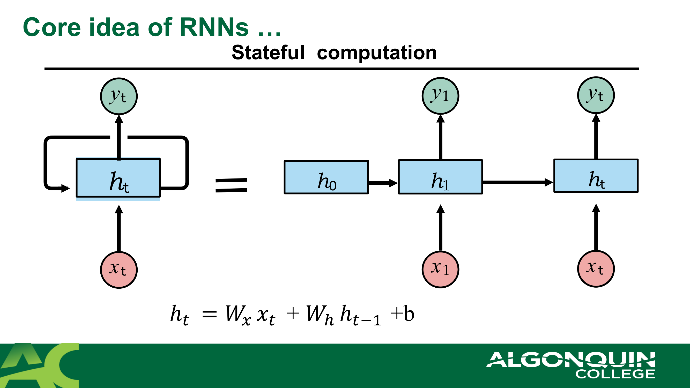

### 📝 Text Content

**Core idea of RNNs …**

Stateful computation
y y y
t 1 t
h h h h
t 0 1 t
x x x
t 1 t
h = 𝑊 x + 𝑊 h +b

*[Mathematical formula - see image above]*


### ✍️ Notes

> **这页展示了 RNN 的两种视角:**
>
> **左边 — 折叠 (Folded) 形式:** 就是 Page 33 的图，ht 有一个自循环箭头（代表记忆循环传递）
>
> **右边 — 展开 (Unrolled) 形式:** 把自循环在时间轴上展开，清楚看到信息如何一步步传递：
> - h0 -> h1 -> ... -> ht（隐藏状态从左到右传递）
> - 每个时间步都接收一个输入 xt 和前一步的隐藏状态
> - 每个时间步都可以产生一个输出 yt
>
> **核心公式:**
> ```
> ht = Wx * xt + Wh * ht-1 + b
> ```
> - **Wx:** 输入到隐藏状态的权重矩阵（怎么理解当前输入）
> - **Wh:** 隐藏状态到隐藏状态的权重矩阵（怎么保留历史记忆）
> - **b:** 偏置项
> - **关键:** Wx 和 Wh 在**所有时间步共享**（同一套权重重复使用）
>
> **💡 提示:** 权重共享有两大好处：
> 1. 参数量不随序列长度增长（不管句子多长，权重矩阵就那几个）
> 2. 在一个位置学到的模式可以泛化到其他位置

---

## Page 35

### 📷 Page Image

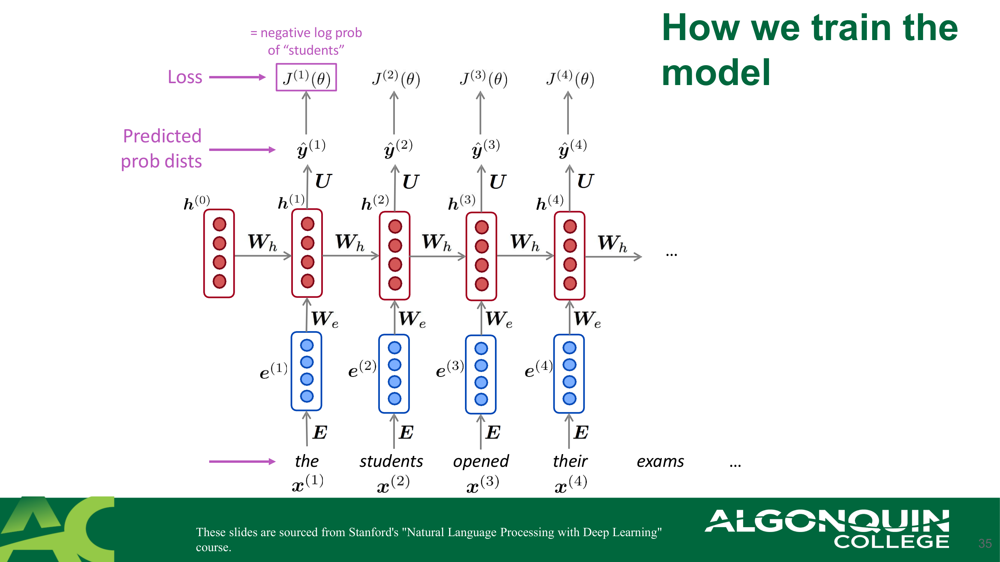

### 📝 Text Content

**How we train the**

=negative logprob
of“students”
model
Loss
Predicted
prob dists
…
the students opened their exams …
These slides are sourced from Stanford's "Natural Language Processing with Deep Learning"
course.


### ✍️ Notes

> **这张图非常重要！完整展示了 RNN 语言模型的训练流程（从下到上）:**
>
> **第 1 层 — 输入词 (底部):** x(1)="the", x(2)="students", x(3)="opened", x(4)="their"
>
> **第 2 层 — 词嵌入 E:** 通过嵌入矩阵 **E** 将 one-hot 向量转为词嵌入向量 e(1), e(2), ...
>
> **第 3 层 — 隐藏状态（红色节点）:** 通过权重矩阵 **We**（输入）和 **Wh**（历史）计算隐藏状态
> - h(0) -> h(1) -> h(2) -> h(3) -> h(4)（信息从左到右传递）
> - 注意每一步之间的箭头都标着 **Wh**（同一个权重矩阵，参数共享）
>
> **第 4 层 — 预测输出 y-hat:** 通过权重矩阵 **U** 将隐藏状态映射为概率分布
> - y-hat(1) 是模型对 "the 后面是什么词" 的预测
> - y-hat(2) 是模型对 "the students 后面是什么词" 的预测
>
> **第 5 层 — 损失 J(theta):** 每个时间步计算一个损失
> - 损失 = **负对数概率 (Negative Log Probability)**
> - 例: J(1) = -log P("students" | "the")
> - 真实下一个词是 "students"，看模型给它多高的概率
> - 概率越高 -> -log 值越小 -> 损失越小 -> 模型预测越好
>
> **💡 提示:** 三个权重矩阵 E, Wh, U 在所有时间步**共享**——这就是 RNN 参数高效的原因

---

## Page 36

### 📷 Page Image

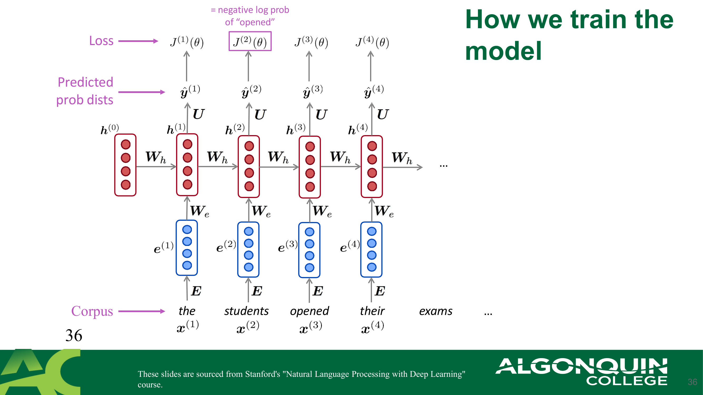

### 📝 Text Content

**=negative logprob**

How we train the
of“opened”
Loss
model
Predicted
prob dists
…
Corpus the students opened their exams …
These slides are sourced from Stanford's "Natural Language Processing with Deep Learning"
course.


### ✍️ Notes

> **Page 35-38 是同一张图，每页高亮不同的时间步:**
>
> 这页高亮的是 **J(2)(θ)** — 第 2 个时间步的损失
> - 输入: x(1)="the", x(2)="students"
> - 真实下一个词: "opened"
> - 损失: J(2) = -log P("opened" | "the students")
>
> **设计意图:** 老师通过逐步高亮让你看清楚每个时间步分别计算哪个词的损失

---

## Page 37

### 📷 Page Image

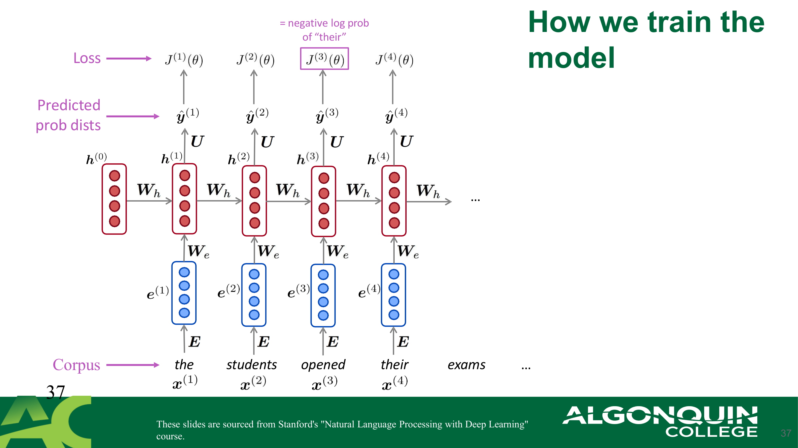

### 📝 Text Content

**How we train the**

=negative logprob
of“their”
model
Loss
Predicted
prob dists
…
Corpus the students opened their exams …
These slides are sourced from Stanford's "Natural Language Processing with Deep Learning"
course.


### ✍️ Notes

> 高亮 **J(3)(θ)** — 第 3 个时间步的损失
> - 输入: x(1)="the", x(2)="students", x(3)="opened"
> - 真实下一个词: "their"
> - 损失: J(3) = -log P("their" | "the students opened")

---

## Page 38

### 📷 Page Image

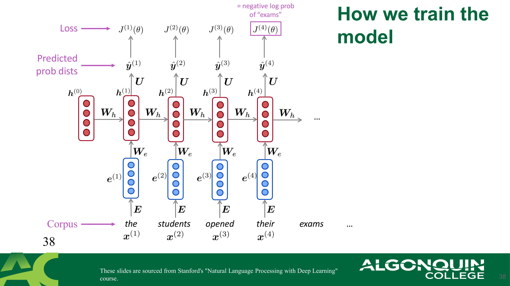

### 📝 Text Content

**=negative logprob**

How we train the
of“exams”
Loss
model
Predicted
prob dists
…
Corpus the students opened their exams …
These slides are sourced from Stanford's "Natural Language Processing with Deep Learning"
course.


### ✍️ Notes

> 高亮 **J(4)(θ)** — 第 4 个时间步的损失
> - 输入: x(1)="the", x(2)="students", x(3)="opened", x(4)="their"
> - 真实下一个词: "exams"
> - 损失: J(4) = -log P("exams" | "the students opened their")

---

## Page 39

### 📷 Page Image

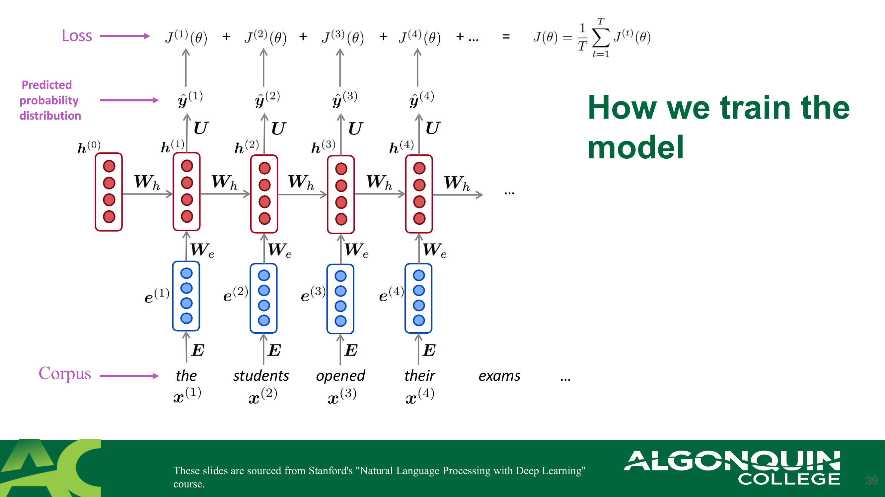

### 📝 Text Content

**Loss + + + + … =**

Predicted
probability How we train the
distribution
model
…
Corpus
the students opened their exams …
These slides are sourced from Stanford's "Natural Language Processing with Deep Learning"
course.


### ✍️ Notes

> **这页是 Page 35-38 的总结！把所有时间步的损失加起来:**
>
> **总损失公式:**
> ```
> J(θ) = (1/T) × ∑ J(t)(θ)    (t = 1 到 T)
> ```
> - 将每个时间步的损失 J(1), J(2), J(3), J(4), ... 全部**加起来取平均**
> - 这个总损失就是我们要最小化的目标
> - 通过反向传播 (Backpropagation) 调整所有权重 E, Wh, We, U
>
> **训练流程总结 (Page 35-39):**
> 1. 前向传播: 输入词 -> 词嵌入 -> 隐藏状态 -> 预测分布
> 2. 计算损失: 每个时间步的 -log P(真实下一个词)
> 3. 总损失: 所有时间步损失的平均值
> 4. 反向传播: 根据总损失调整权重
>
> **💡 提示:** 这就是为什么叫 "Language Model" — 模型学习的就是“给定前文，下一个词最可能是什么”

---

## Page 40

### 📷 Page Image

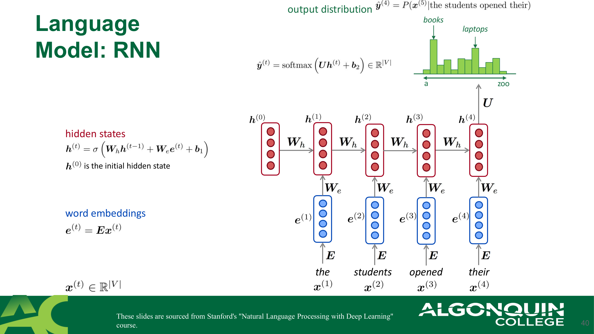

### 📝 Text Content

**output distribution**

Language
books
laptops
Model: RNN
a zoo
hidden states
is the initial hidden state
word embeddings
the students opened their
These slides are sourced from Stanford's "Natural Language Processing with Deep Learning"
course.


### ✍️ Notes

> **这页是 RNN 语言模型的完整架构图，带所有公式！**
>
> **三个核心公式（从下到上）:**
>
> **1. 词嵌入 (Word Embeddings):**
> ```
> e(t) = E * x(t)
> ```
> - x(t) ∈ R^|V| 是 one-hot 向量（词汇表大小的维度）
> - E 是嵌入矩阵，将高维 one-hot 转为低维密集向量
>
> **2. 隐藏状态 (Hidden States):**
> ```
> h(t) = σ(Wh * h(t-1) + We * e(t) + b1)
> ```
> - σ 是激活函数（如 tanh 或 sigmoid）
> - h(0) 是初始隐藏状态（通常初始化为零向量）
> - Wh 和 We 在所有时间步共享
>
> **3. 输出分布 (Output Distribution):**
> ```
> y-hat(t) = softmax(U * h(t) + b2) ∈ R^|V|
> ```
> - 通过 softmax 将隐藏状态映射为词汇表上的概率分布
> - 图中右上角的柱状图就是这个分布："books" 概率最高，"laptops" 较低，"a zoo" 更低
>
> **💡 提示:** 这页把 Page 33-39 的所有内容综合在一张图里，是复习 RNN 语言模型的最佳参考图

---

## Page 41

### 📷 Page Image

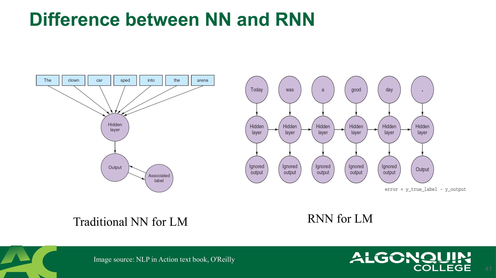

### 📝 Text Content

**Difference between NN and RNN**

RNN for LM
Traditional NN for LM
Image source: NLP in Action text book, O'Reilly


### ✍️ Notes

> **这页直观对比了传统 NN 和 RNN 的结构差异：**
>
> | | 左图: Traditional NN for LM | 右图: RNN for LM |
> |---|---|---|
> | **输入方式** | 所有词同时输入一个 Hidden layer | 每个词按顺序逐个输入 |
> | **Hidden layer** | 只有 1 个，不连接 | 多个，且彼此**水平连接**（箭头从左到右） |
> | **输出** | 1 个 Associated label | 每个时间步都有输出（但可以选择忽略） |
> | **顺序信息** | 丢失了！所有词混在一起 | 保留了！每个词按时间步处理 |
> | **记忆** | 无 | 有！隐藏状态在时间步间传递 |
>
> **右图重要细节:**
> - 只有最后一个时间步的输出是 "Output"，前面都是 "Ignored output"
> - 这是因为此例中只关心句子最终的输出（如情感分类）
> - 但在语言模型中，每个时间步的输出都会用到（如 Page 35-39 所示）
> - error = y_true_label - y_output（简单的差值损失）
>
> **💡 核心区别:** 传统 NN 把 "The clown car sped into the arena" 当成一个无序的词袋 (bag of words)；RNN 把 "Today was a good day." 作为有序序列处理，每步都记住前文

---

## Page 42

### 📷 Page Image


### 📝 Text Content

**Fun With RNN Language Model**


• https://medium.com/@samim/obama-rnn-machine-

generated-political-speeches-c8abd18a2ea0


### ✍️ Notes

> **趣味应用:** 用 RNN 语言模型生成 Obama 风格的政治演讲
>
> 这个例子展示了 RNN LM 的实际应用：
> - 用大量 Obama 演讲词训练 RNN 语言模型
> - 模型学会了 Obama 的用词习惯、句式结构
> - 然后用模型自动生成新的演讲词
>
> **💡 提示:** 这就是现代 ChatGPT 等文本生成 AI 的最早雏形——原理相同，只是规模和架构进化了

---

## Page 43

### 📷 Page Image

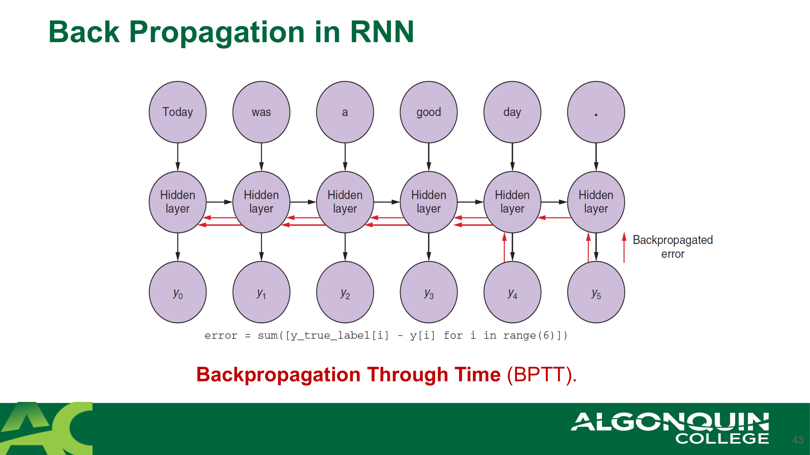

### 📝 Text Content

**Back Propagation in RNN**

Backpropagation Through Time (BPTT).


### ✍️ Notes

> **时间反向传播 (Backpropagation Through Time, BPTT):**
>
> **图中的箭头含义:**
> - **黑色箭头 (->):** 前向传播（从左到右）— 输入 -> Hidden -> 输出
> - **红色箭头 (<-):** 反向传播（从右到左）— 误差信号往回传
>
> **训练过程:**
> 1. **前向传播:** 输入 "Today was a good day ." → 每个时间步算出隐藏状态和输出 y0~y5
> 2. **计算误差:** error = sum(y_true_label[i] - y[i] for i in range(6))
> 3. **反向传播:** 误差从最后一个时间步往回传（红色箭头），更新每个时间步的权重
>
> **为什么叫 "时间反向传播"?**
> - 普通网络的反向传播是从上层往下层传
> - RNN 多了一个维度: 除了上下层之间，还要在**时间步之间**（从右到左）传播误差
> - 因此叫做 "Through Time"
>
> **💡 提示:** BPTT 的问题是当序列很长时，梯度会在时间步之间不断相乘，导致**梯度消失 (Vanishing Gradient)** — 这就是下一页 (Page 44) 的内容

---

## Page 44

### 📷 Page Image

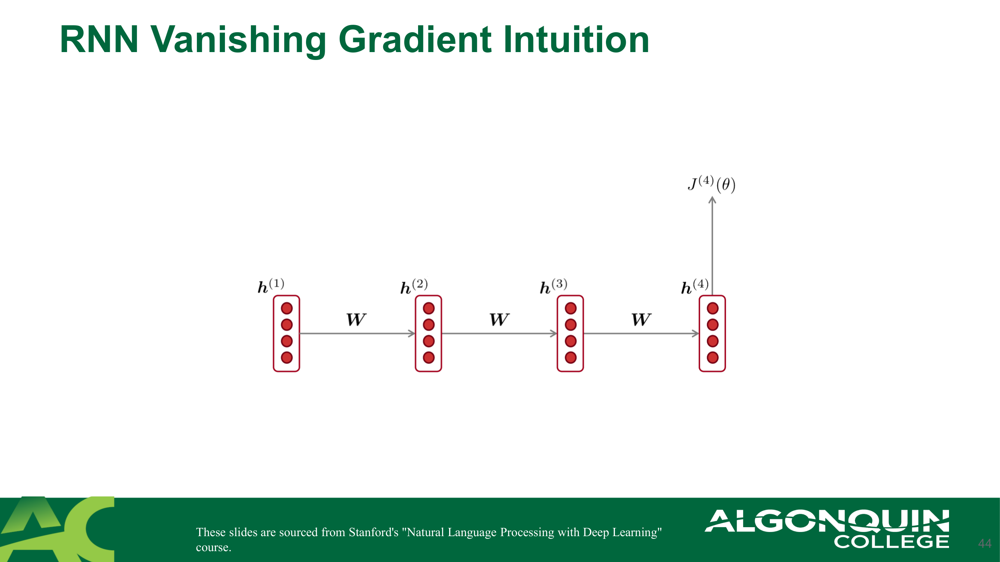

### 📝 Text Content

**RNN Vanishing Gradient Intuition**

These slides are sourced from Stanford's "Natural Language Processing with Deep Learning"
course.


### ✍️ Notes

> **Page 44-49 是同一张图的逐步动画，展示梯度消失的直觉：**
>
> **这页 (Page 44) — 起点:**
> - 图中展示了 4 个隐藏状态 h(1) → h(2) → h(3) → h(4)，之间用**同一个权重 W** 连接
> - 损失 J(4)(θ) 在最右边的 h(4) 上方
> - **问题:** 我们想更新 h(1) 的参数，但 J(4) 的梯度要从 h(4) 一路传回 h(1)
> - 每经过一步都要乘以 W 的导数 → 如果 W 的值 < 1，多次相乘后梯度趋近于 0
>
> **💡 类比:** 想象你在传话游戏中，每个人只能以 50% 音量传递消息。经过 4 个人后，声音就几乎听不到了 — 这就是梯度消失

---

## Page 45

### 📷 Page Image

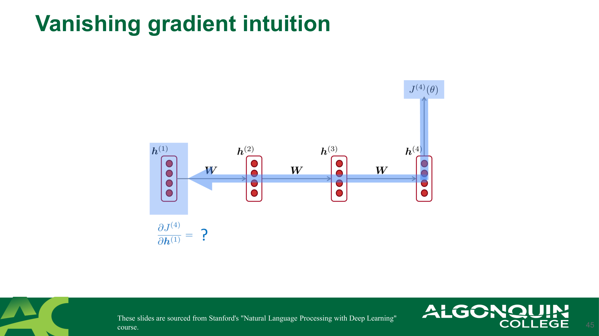

### 📝 Text Content

**Vanishing gradient intuition**

These slides are sourced from Stanford's "Natural Language Processing with Deep Learning"
course.


### ✍️ Notes

> **Page 45 — 提出问题:**
> - 图中 h(1) 被蓝色高亮，反向箭头从 h(4) 回指向 h(1)
> - 底部公式: **∂J(4)/∂h(1) = ?**
> - 意思是: J(4) 的损失对 h(1) 的梯度是多少？
> - h(1) 距离 J(4) 有 3 步之遥，梯度要经过 h(2)、h(3)、h(4) 才能传到 h(1)
>
> **💡 提示:** 这就是在问 "最早的输入对最终损失有多大影响？" — 如果影响趋近 0，模型就无法学习远距离依赖

---

## Page 46

### 📷 Page Image

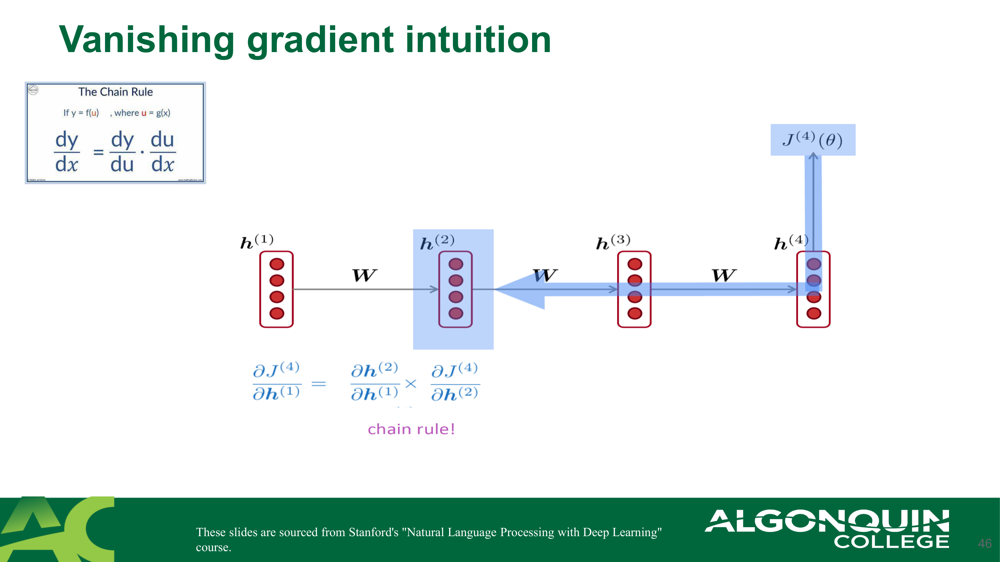

### 📝 Text Content

**Vanishing gradient intuition**

These slides are sourced from Stanford's "Natural Language Processing with Deep Learning"
course.


### ✍️ Notes

> **Page 46 — 用链式法则 (Chain Rule) 分解（第 1 步）:**
> - 左上角展示了链式法则公式: dy/dx = (dy/du) × (du/dx)
> - h(2) 被蓝色高亮 — 表示梯度传播到 h(2) 这一步
> - 底部公式:
>   ```
>   ∂J(4)/∂h(1) = ∂h(2)/∂h(1) × ∂J(4)/∂h(2)
>   ```
> - 意思是: 先看 h(1) 对 h(2) 的影响，再看 h(2) 对 J(4) 的影响，两者相乘
>
> **💡 提示:** Chain Rule 就是微积分中的链式求导法则 — 复合函数的导数等于各层导数的乘积

---

## Page 47

### 📷 Page Image

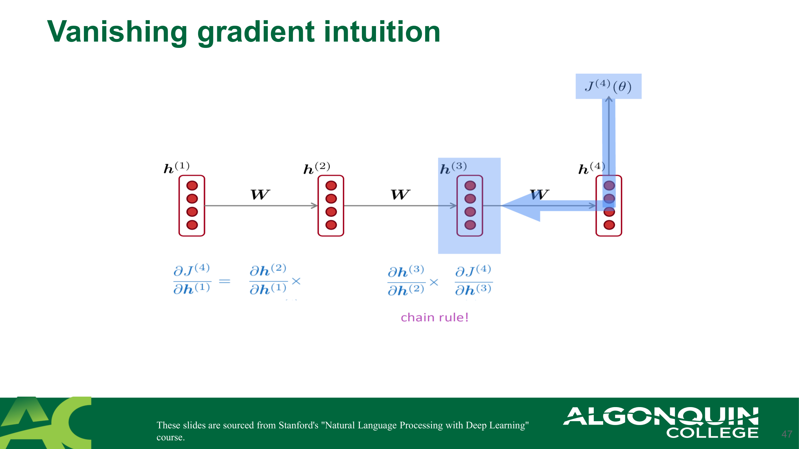

### 📝 Text Content

**Vanishing gradient intuition**

These slides are sourced from Stanford's "Natural Language Processing with Deep Learning"
course.


### ✍️ Notes

> **Page 47 — 继续展开链式法则（第 2 步）:**
> - h(3) 被蓝色高亮 — 梯度继续传播到 h(3)
> - 底部公式进一步展开:
>   ```
>   ∂J(4)/∂h(1) = ∂h(2)/∂h(1) × ∂h(3)/∂h(2) × ∂J(4)/∂h(3)
>   ```
> - 现在有 **2 个梯度项** 相乘了
>
> **💡 提示:** 注意每一项 ∂h(t+1)/∂h(t) 本质上就是权重矩阵 W 的某种变换（取决于激活函数的导数）

---

## Page 48

### 📷 Page Image

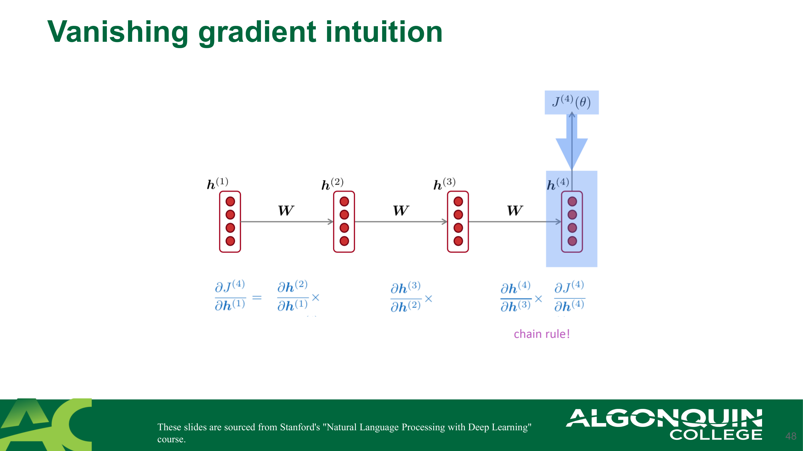

### 📝 Text Content

**Vanishing gradient intuition**

These slides are sourced from Stanford's "Natural Language Processing with Deep Learning"
course.


### ✍️ Notes

> **Page 48 — 完全展开链式法则（第 3 步）:**
> - h(4) 被蓝色高亮 — 梯度传播的最后一步
> - 蓝色大箭头从 J(4)(θ) 向下指向 h(4)（损失传入隐藏状态）
> - 底部公式完全展开:
>   ```
>   ∂J(4)/∂h(1) = ∂h(2)/∂h(1) × ∂h(3)/∂h(2) × ∂h(4)/∂h(3) × ∂J(4)/∂h(4)
>   ```
> - 现在有 **3 个梯度项** 相乘！
>
> **💡 关键观察:** 如果每个 ∂h(t+1)/∂h(t) 都 < 1（比如 0.5），那么 3 次相乘后 = 0.5³ = 0.125，梯度已经缩小到原来的 1/8

---

## Page 49

### 📷 Page Image

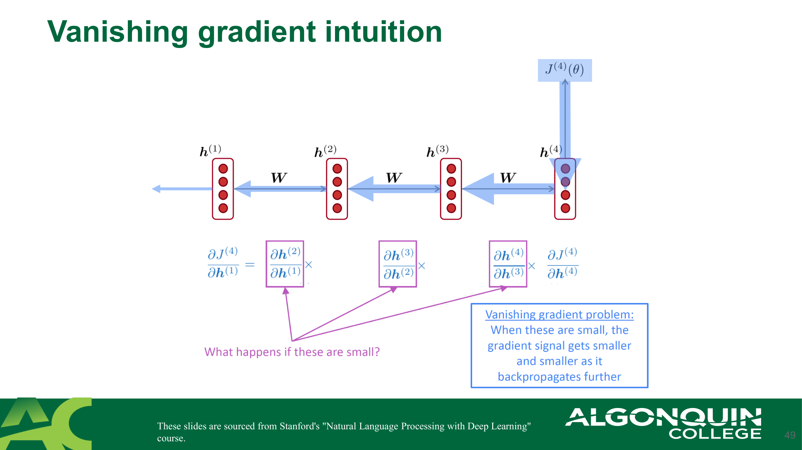

### 📝 Text Content

**Vanishing gradient intuition**

These slides are sourced from Stanford's "Natural Language Processing with Deep Learning"
course.


### ✍️ Notes

> **Page 49 — 揭示梯度消失的根源！（总结页）**
>
> - 图中所有隐藏状态都被标注，反向箭头贯穿整个序列
> - 底部公式中，3 个梯度项被**紫色方框**圈出:
>   ```
>   ∂J(4)/∂h(1) = [∂h(2)/∂h(1)] × [∂h(3)/∂h(2)] × [∂h(4)/∂h(3)] × ∂J(4)/∂h(4)
>   ```
> - 左下角问: **"What happens if these are small?"**
> - 右下角回答: **"Vanishing gradient problem: When these are small, the gradient signal gets smaller and smaller as it backpropagates further"**
>
> **数学解释:**
> - 如果每个 ∂h(t+1)/∂h(t) ≈ 0.1
> - 那么 3 个相乘: 0.1 × 0.1 × 0.1 = 0.001
> - 如果序列长度是 100: 0.1^99 ≈ 0 → 梯度**完全消失**
> - h(1) 几乎收不到任何来自 J(4) 的梯度信号 → 无法学习远距离依赖
>
> **💡 反过来想:** 如果每个梯度项 > 1（比如 2），那么 2^99 会**爆炸** → 这就是**梯度爆炸 (Exploding Gradient)** 问题

---

## Page 50

### 📷 Page Image

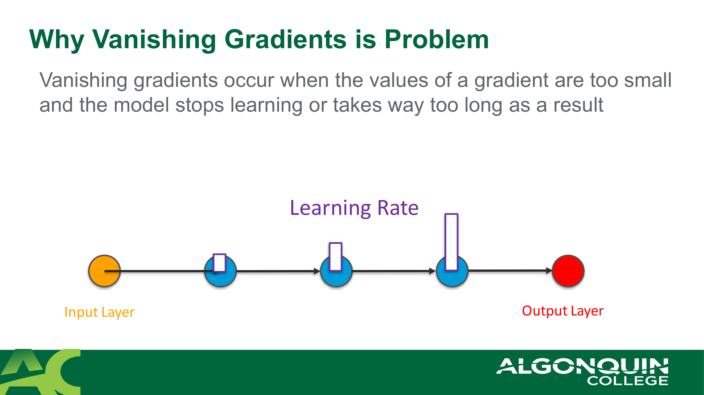

### 📝 Text Content

**Why Vanishing Gradients is Problem**

Vanishing gradients occur when the values of a gradient are too small
and the model stops learning or takes way too long as a result
Learning Rate
Input Layer Output Layer


### ✍️ Notes

> **为什么梯度消失是严重问题 (Why Vanishing Gradients is Problem):**
>
> **Slide 原文:** "Vanishing gradients occur when the values of a gradient are too small and the model stops learning or takes way too long as a result"
>
> **图示解读:**
> - 从左到右: Input Layer (橙色) → 多个 Hidden Layer (蓝色) → Output Layer (红色)
> - 每个 Hidden Layer 上方有一个**紫色柱子**代表 Learning Rate（学习率/梯度大小）
> - 注意柱子**越靠近 Input Layer 越矮** → 靠近输入的层梯度越小越学不动
> - 靠近 Output Layer 的梯度还算正常，但越往回传越弱
>
> **后果:**
> 1. **前面的层几乎不更新** — 离输出远的层收到的梯度趋近于 0，权重不变化
> 2. **模型学不到长距离依赖** — 对应 RNN: 早期时间步的词对后面的预测几乎无影响
> 3. **训练停滞或极慢** — 模型看似在训练，实际前面的层已经 "冻住" 了
>
> **💡 提示:** 梯度消失是 RNN 最大的弱点，直接催生了 **LSTM (Long Short-Term Memory)** 和 **GRU (Gated Recurrent Unit)** 的发明 — 它们用"门控机制"来让梯度能顺利传过很长的序列

---

## Page 51

### 📷 Page Image

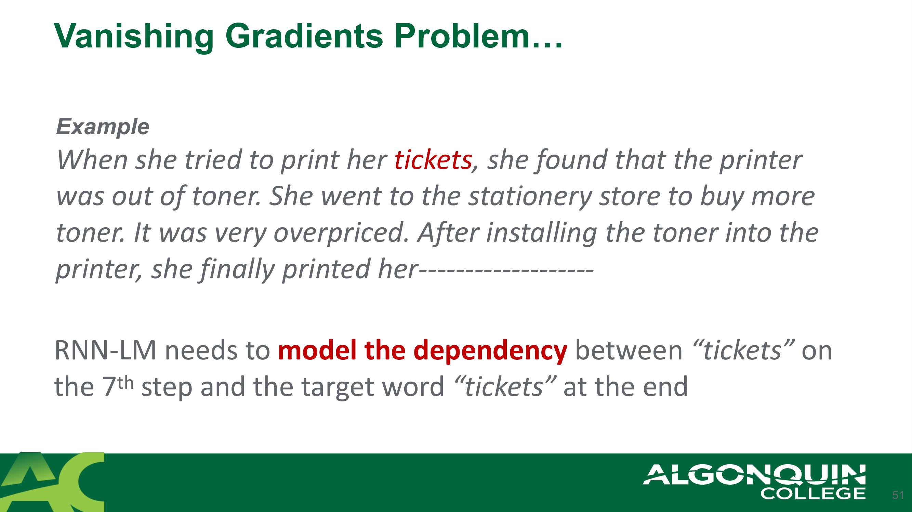

### 📝 Text Content

**Vanishing Gradients Problem…**

Example
When she tried to print her tickets, she found that the printer
was out of toner. She went to the stationery store to buy more
toner. It was very overpriced. After installing the toner into the
printer, she finally printed her-------------------
RNN-LM needs to model the dependency between “tickets” on
the 7th step and the target word “tickets” at the end


### ✍️ Notes

> **梯度消失的实际 NLP 例子:**
>
> **原文:**
> "When she tried to print her **tickets**, she found that the printer was out of toner. She went to the stationery store to buy more toner. It was very overpriced. After installing the toner into the printer, she finally printed her ___________"
>
> **分析:**
> - 人类一眼就知道空格应该填 **"tickets"** — 因为整个故事都在讲打印机票
> - 但对 RNN 来说，"tickets" 出现在第 7 个词，而要预测的位置在最后（隔了约 30 个词）
> - RNN-LM 需要 **model the dependency**（建模依赖关系）：第 7 步的 "tickets" ↔ 最后的 "tickets"
> - 由于梯度消失，第 7 步的信息传到最后时梯度几乎为 0 → 模型**学不到这个依赖**
>
> **💡 提示:** 这就是为什么 RNN 在实际应用中处理长文本效果差 — 它理论上能看到所有历史，但梯度消失让它**实际上只能记住近几步**

---

## Page 52

### 📷 Page Image

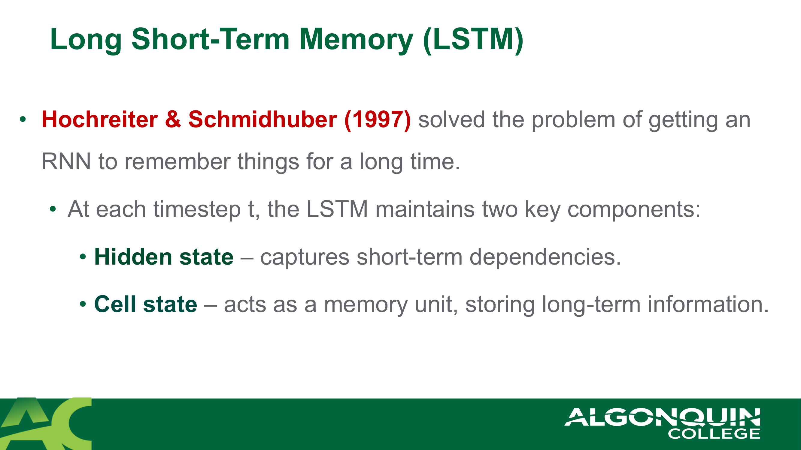

### 📝 Text Content

**Long Short-Term Memory (LSTM)**


• Hochreiter & Schmidhuber (1997) solved the problem of getting an

RNN to remember things for a long time.

• At each timestep t, the LSTM maintains two key components:

• Hidden state – captures short-term dependencies.

• Cell state – acts as a memory unit, storing long-term information.


### ✍️ Notes

> **LSTM (Long Short-Term Memory)** 由 **Hochreiter & Schmidhuber** 于 **1997 年**提出
>
> **核心思想:** 专门为解决 RNN 的梯度消失问题而设计 — 让网络能"记住"长期信息
>
> **与标准 RNN 的关键区别 — 每个时间步维护两个状态:**
>
> | 状态 | 名称 | 作用 | 类比 |
> |------|------|------|------|
> | **hₜ** | Hidden State（隐藏状态） | 捕捉**短期**依赖 | 工作记忆（正在想的事） |
> | **cₜ** | Cell State（细胞状态） | 存储**长期**信息 | 长期记忆（背景知识） |
>
> **💡 类比:** 标准 RNN 只有一个笔记本（hₜ），什么都往里写，写满就覆盖。LSTM 多了一个保险箱（cₜ），重要信息锁进去，不会被轻易覆盖

---

## Page 53

### 📷 Page Image

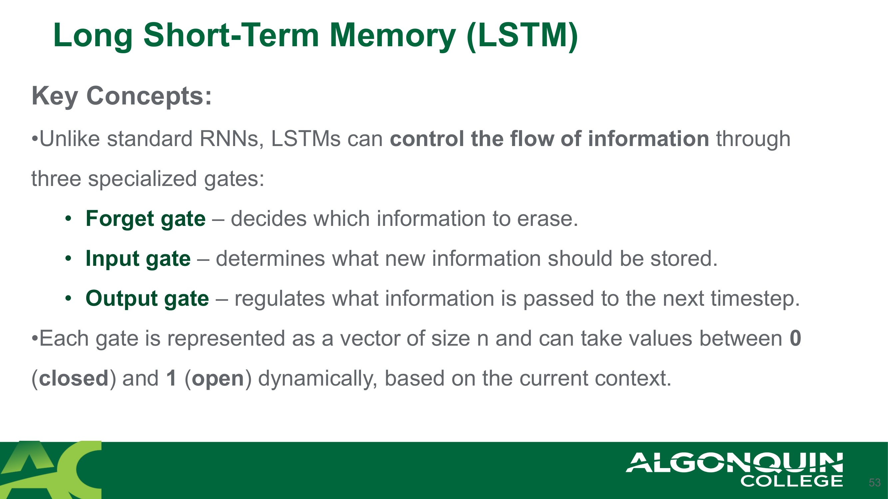

### 📝 Text Content

**Long Short-Term Memory (LSTM)**

Key Concepts:

• Unlike standard RNNs, LSTMs can control the flow of information through

three specialized gates:

• Forget gate – decides which information to erase.

• Input gate – determines what new information should be stored.

• Output gate – regulates what information is passed to the next timestep.

• Each gate is represented as a vector of size n and can take values between

(closed) and 1 (open) dynamically, based on the current context.


### ✍️ Notes

> **LSTM 的三个门 (Gates) — 核心创新:**
>
> LSTM 与标准 RNN 的根本区别：LSTM 可以**主动控制信息流**，而不是被动地让所有信息都通过
>
> | 门 | 英文 | 功能 | 类比 |
> |---|------|------|------|
> | **遗忘门 fₜ** | Forget Gate | 决定从旧记忆中**丢弃**哪些信息 | 清理保险箱：过期的票据扔掉 |
> | **输入门 iₜ** | Input Gate | 决定**存入**什么新信息 | 往保险箱放新东西 |
> | **输出门 oₜ** | Output Gate | 控制**输出**什么信息到下一步 | 从保险箱取出需要的东西 |
>
> **门的数学本质:**
> - 每个门是一个**大小为 n 的向量**（n = 隐藏层维度）
> - 值域: **0（完全关闭）到 1（完全打开）**
> - 通过 **Sigmoid 函数 σ** 实现（输出总在 0~1 之间）
> - 值是**动态计算**的，根据当前输入 xₜ 和上一步 hₜ₋₁ 决定
>
> **💡 为什么门能解决梯度消失？** 因为 Cell State 的更新用的是**加法**（而非乘法），梯度可以沿着 Cell State 这条"高速公路"顺畅流过，不会不断缩小

---

## Page 54

### 📷 Page Image

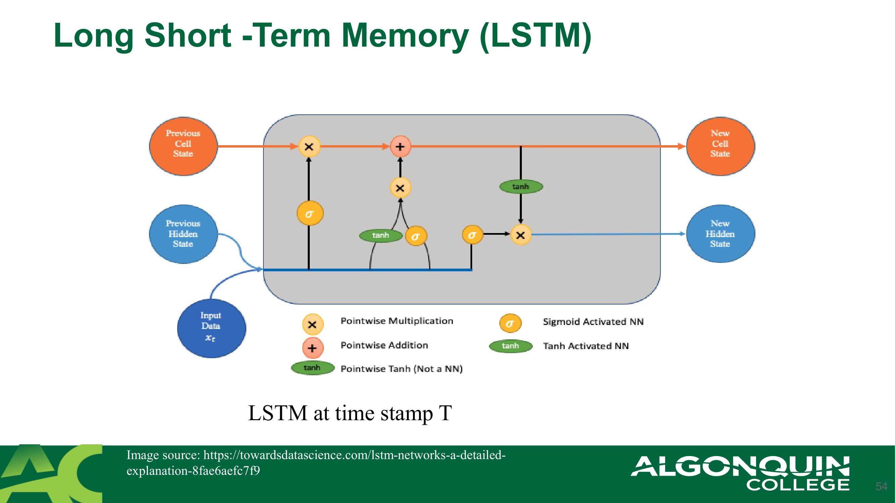

### 📝 Text Content

**Long Short -Term Memory (LSTM)**

LSTM at time stamp T
Image source: https://towardsdatascience.com/lstm-networks-a-detailed-
explanation-8fae6aefc7f9


### ✍️ Notes

> **LSTM 内部结构完整图示（时间步 T）：**
>
> **三个输入（左侧）:**
> - 🟠 **Previous Cell State** (cₜ₋₁) — 上一步的长期记忆（橙色，顶部水平线）
> - 🔵 **Previous Hidden State** (hₜ₋₁) — 上一步的短期记忆（蓝色，中间）
> - 🔵 **Input Data xₜ** — 当前时间步的输入（蓝色，底部）
>
> **两个输出（右侧）:**
> - 🟠 **New Cell State** (cₜ) — 更新后的长期记忆
> - 🔵 **New Hidden State** (hₜ) — 更新后的短期记忆
>
> **图中的符号含义（图例）:**
> - **×** = Pointwise Multiplication（逐元素相乘）— 门控操作
> - **+** = Pointwise Addition（逐元素相加）— 信息合并
> - **σ** = Sigmoid Activated NN — 输出 0~1 的门控值
> - **tanh** (绿色方框) = Tanh Activated NN — 输出 -1~1 的候选值
> - **tanh** (黄色圆角) = Pointwise Tanh (Not a NN) — 单纯的 tanh 变换
>
> **信息流（从左到右）:**
> 1. Cell State 沿顶部水平线流过（这就是"高速公路"）
> 2. 第 1 个 × 节点 = Forget Gate（决定丢弃什么）
> 3. + 节点 = 加入新信息（Input Gate 的输出）
> 4. 最右侧 × 节点 = Output Gate（决定输出什么作为新 hₜ）
>
> **💡 关键观察:** Cell State 线（顶部橙色线）几乎是直通的，只经过一次乘法和一次加法 — 这就是梯度能顺利传播的原因

---

## Page 55

### 📷 Page Image

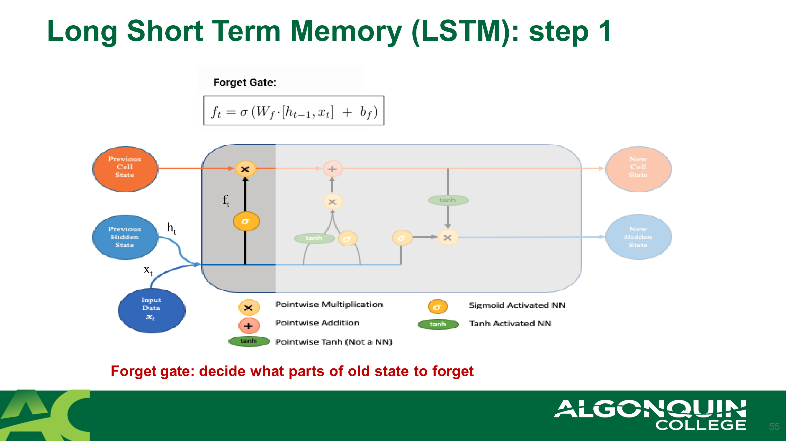

### 📝 Text Content

**Long Short Term Memory (LSTM): step**

f
t
h
t
x
t
Forget gate: decide what parts of old state to forget


### ✍️ Notes

> **Step 1 — 遗忘门 (Forget Gate):**
>
> **公式:**
> ```
> fₜ = σ(W_f · [hₜ₋₁, xₜ] + b_f)
> ```
>
> **公式解读:**
> - **输入:** 将 hₜ₋₁ 和 xₜ **拼接** (concatenate) 成一个向量 [hₜ₋₁, xₜ]
> - **W_f:** 遗忘门的权重矩阵
> - **b_f:** 偏置项
> - **σ (Sigmoid):** 将结果压缩到 **0~1** 之间
> - **输出 fₜ:** 一个 0~1 的向量，每个元素代表对应维度的"遗忘程度"
>   - fₜ = 1 → 完全保留该维度的旧记忆
>   - fₜ = 0 → 完全遗忘该维度的旧记忆
>
> **图中高亮部分:**
> - 左侧灰色区域：hₜ 和 xₜ 输入到第一个 σ 节点
> - σ 节点输出 fₜ → 向上指向第一个 × 节点
> - × 节点: Previous Cell State × fₜ = 遗忘后的旧记忆
>
> **💡 例子:** 在处理 "她买了一只**猫**。... 后来她养了一只**狗**。" 时，遗忘门会在看到 "狗" 时让 fₜ 趋近 0，遗忘之前关于 "猫" 的部分记忆，为新信息腾出空间

---

## Page 56

### 📷 Page Image

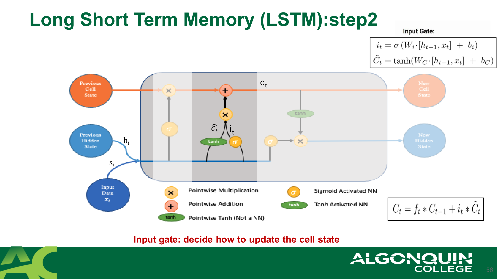

### 📝 Text Content

**Long Short Term Memory (LSTM):step2**

c
t
𝑐ෝ i
𝑡 t
h
t
x
t
Input gate: decide how to update the cell state


### ✍️ Notes

> **Step 2 - 输入门 (Input Gate):**
> - 输入: hₜ₋₁ 和 xₜ
> - 输出: iₜ 和 c̃ₜ（候选新记忆）
> - 更新细胞状态: cₜ = fₜ × cₜ₋₁ + iₜ × c̃ₜ

---

## Page 57

### 📷 Page Image

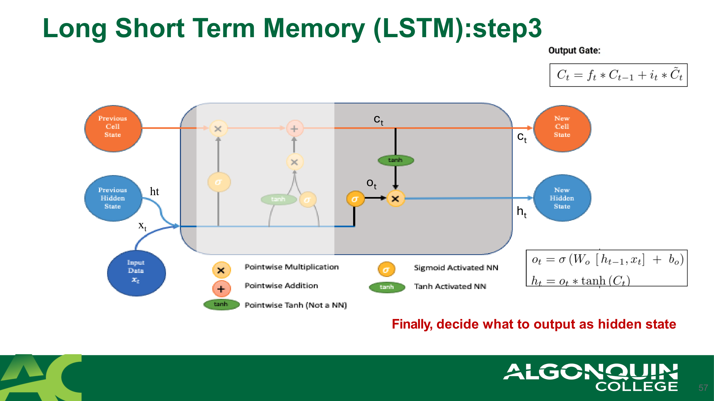

### 📝 Text Content

**Long Short Term Memory (LSTM):step3**

c
t
c
t
o
t
ht
h
t
x
t
Finally, decide what to output as hidden state


### ✍️ Notes

> **Step 3 - 输出门 (Output Gate):**
> - 输入: hₜ₋₁ 和 xₜ
> - 输出: oₜ — 决定从细胞状态中输出什么作为隐藏状态
> - hₜ = oₜ × tanh(cₜ)
>
> **💡 提示:** LSTM 的核心优势是细胞状态 cₜ 可以像"传送带"一样，让梯度几乎无损地传递到很远的时间步

---

## Page 58

### 📷 Page Image

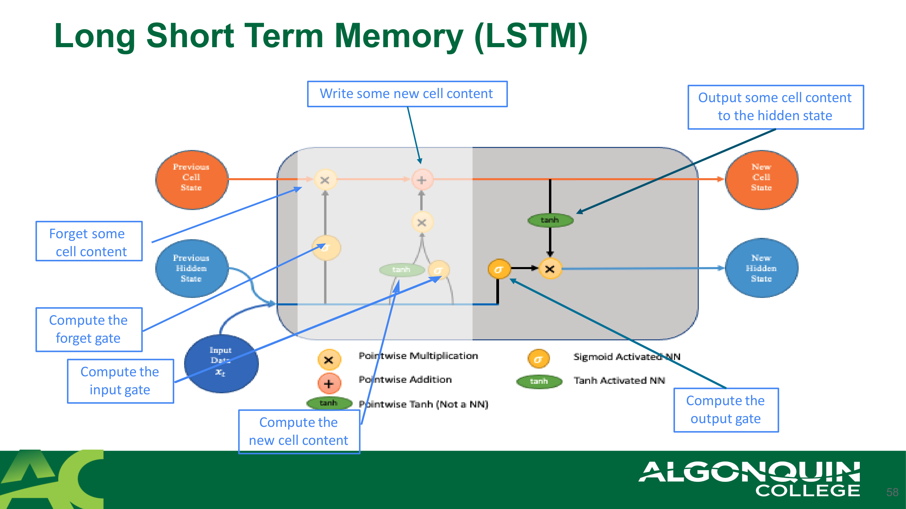

### 📝 Text Content

**Long Short Term Memory (LSTM)**

Write some new cell content
Output some cell content
to the hidden state
Forget some
cell content
Computethe
forget gate
Computethe
inputgate
Computethe
output gate
Computethe
new cell content


### ✍️ Notes

> 每个时间步的完整操作：
> 1. **计算遗忘门 (Compute Forget Gate)** → 丢弃部分旧记忆
> 2. **计算输入门 (Compute Input Gate)** → 准备新信息
> 3. **计算新的细胞内容 (Compute New Cell Content)** → 候选记忆
> 4. **写入新细胞内容 (Write New Cell Content)** → 更新细胞状态
> 5. **计算输出门 (Compute Output Gate)** → 选择输出
> 6. **输出部分细胞内容到隐藏状态 (Output to Hidden State)**

---

## Page 59

### 📷 Page Image

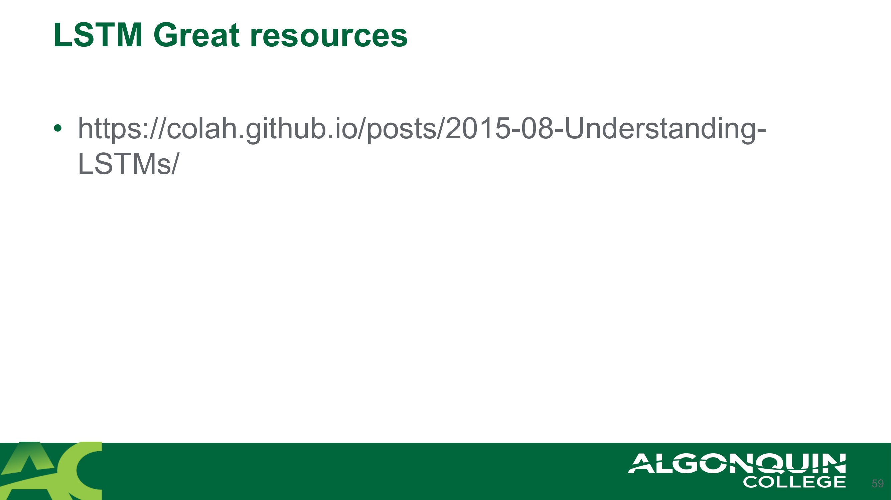

### 📝 Text Content

**LSTM Great resources**


• https://colah.github.io/posts/2015-08-Understanding-

LSTMs/


### ✍️ Notes

> [Add your notes here]

---

## Page 60

### 📷 Page Image

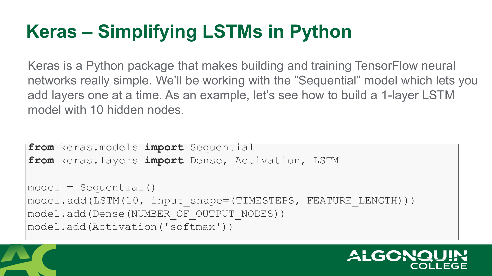

### 📝 Text Content

**Keras – Simplifying LSTMs in Python**

Keras is a Python package that makes building and training TensorFlow neural
networks really simple. We’ll be working with the ”Sequential” model which lets you
add layers one at a time. As an example, let’s see how to build a 1-layer LSTM
model with 10 hidden nodes.
from keras.models import Sequential
from keras.layers import Dense, Activation, LSTM
model = Sequential()
model.add(LSTM(10, input_shape=(TIMESTEPS, FEATURE_LENGTH)))
model.add(Dense(NUMBER_OF_OUTPUT_NODES))
model.add(Activation('softmax'))


### ✍️ Notes

> **Keras** 是简化 TensorFlow 神经网络构建和训练的 Python 包
>
> **一层 LSTM 示例（10个隐藏节点）:**
> - `LSTM(10)`: 10 个隐藏节点
> - `input_shape=(TIMESTEPS, FEATURE_LENGTH)`: 时间步数 × 特征长度
> - `Dense`: 全连接层
> - `softmax`: 输出每个类别的概率

---

## Page 61

### 📷 Page Image

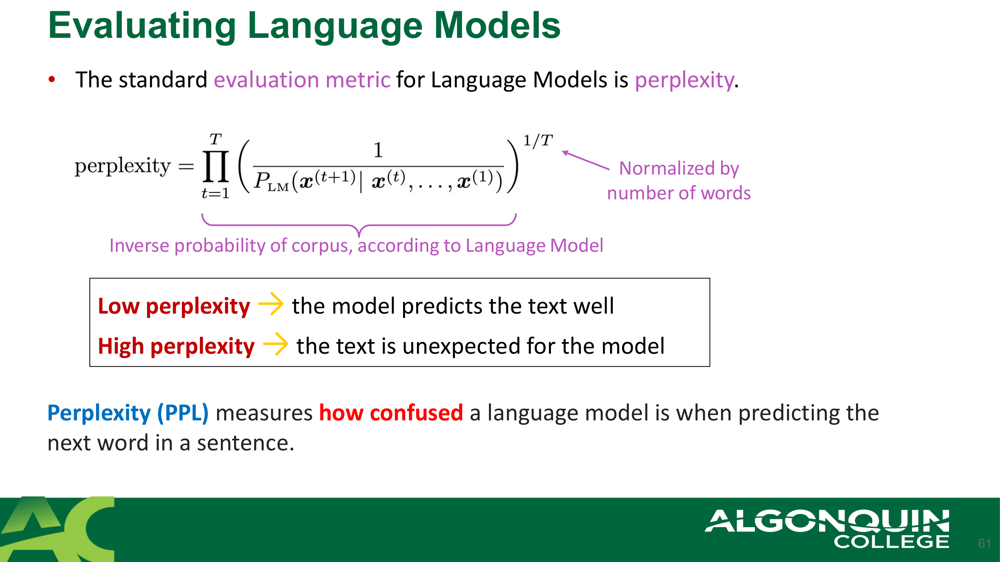

### 📝 Text Content

**Evaluating Language Models**


• The standard evaluation metric for Language Models is perplexity.

Normalized by
number of words
Inverse probability of corpus, according to Language Model
→
Low perplexity the model predicts the text well
→
High perplexity the text is unexpected for the model
Perplexity (PPL) measures how confused a language model is when predicting the
next word in a sentence.


### ✍️ Notes

> **困惑度 (Perplexity, PPL):** 语言模型的**标准评估指标**
>
> **定义:** 衡量语言模型在预测下一个词时有多"困惑"
> - PPL = 语料库的逆概率，按词数归一化
> - **PPL 低** → 模型预测文本效果**好**（模型"不困惑"）
> - **PPL 高** → 模型认为文本是**出乎意料的**（模型"很困惑"）
>
> **💡 提示:** PPL可以理解为"模型在每个位置平均需要从多少个词中做选择"——PPL=10 意味着模型平均在 10 个等可能的词中选择

---

## Page 62

### 📷 Page Image

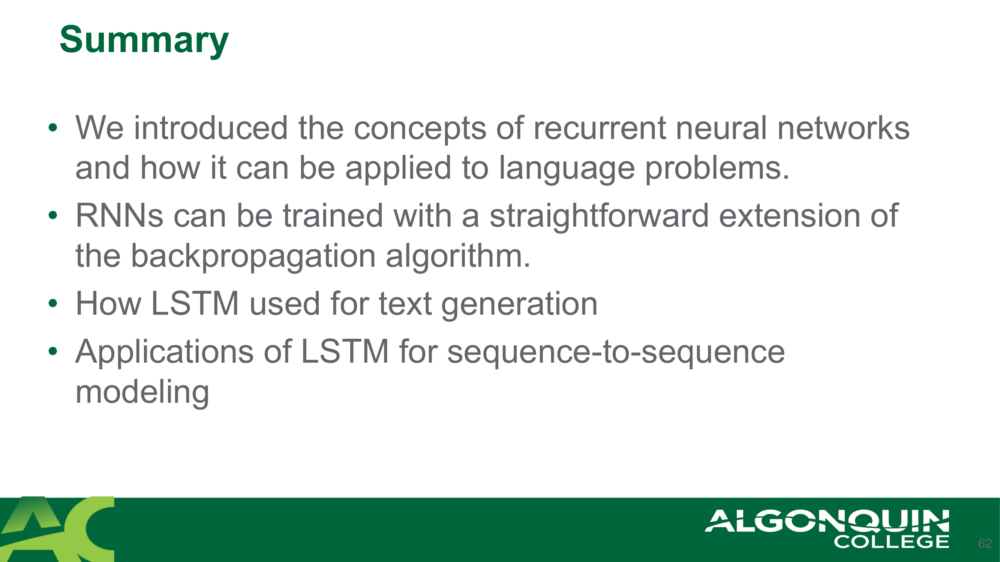

### 📝 Text Content

**Summary**


• We introduced the concepts of recurrent neural networks

and how it can be applied to language problems.

• RNNs can be trained with a straightforward extension of

the backpropagation algorithm.

• How LSTM used for text generation

• Applications of LSTM for sequence-to-sequence

modeling


### ✍️ Notes

> 本讲关键要点：
> 1. **语言模型** 的任务是预测下一个词
> 2. **N-gram** 基于统计频率，简单但有数据稀疏和上下文限制
> 3. **前馈 NN** 使用固定窗口，仍无法处理变长序列
> 4. **RNN** 通过隐藏状态传递实现变长序列处理
> 5. **梯度消失** 使 RNN 难以学习长距离依赖
> 6. **LSTM** 通过三个门（遗忘、输入、输出）和细胞状态解决梯度消失问题
> 7. **困惑度 (Perplexity)** 是评估语言模型的标准指标
>
> **技术演进路线:**
> ```
> 统计方法 (N-gram) → 前馈 NN → RNN → LSTM → (下一讲: Transformer?)
> ```

---

## Page 63

### 📷 Page Image


### 📝 Text Content

Q&A


### ✍️ Notes

> [Add your notes here]

---
