# Week 6: 序列到序列模型 (Sequence to Sequence Models - Seq2Seq)

> Source: `lecture_6_W26.pdf`
> Total slides: 50
> Instructor: Hala Own, Ph.D.

---

## 1. 课程议程与期中考试 (Lesson Agenda & Midterm)

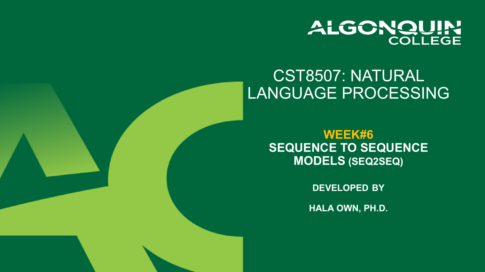

**CST8507: Natural Language Processing — Week #6: Sequence to Sequence Models (Seq2Seq)** — CST8507自然语言处理，第6周：序列到序列模型

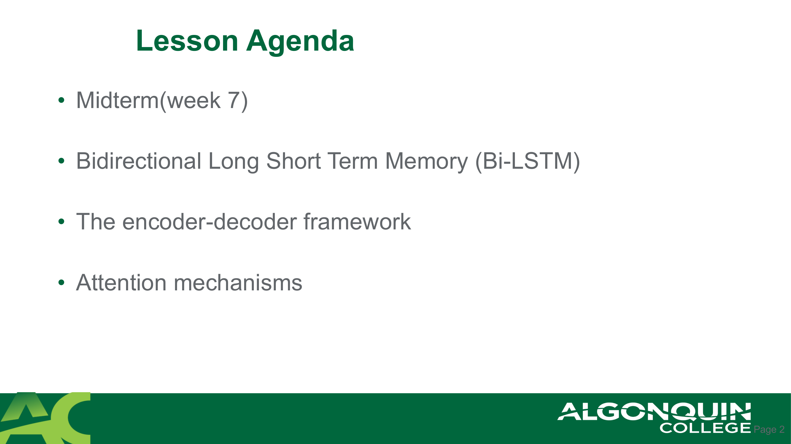

**Lesson Agenda:** — 本节课议程：

- Midterm (week 7) — 期中考试（第7周）
- Bidirectional Long Short Term Memory (Bi-LSTM) — 双向长短时记忆网络
- The encoder-decoder framework — 编码器-解码器框架
- Attention mechanisms — 注意力机制

### 1.1 期中考试信息 (Midterm Information)


**Midterm:** — 期中考试信息：

- Midterm is on Tuesday, Feb. 23, at 2:00 pm. — 期中考试时间：2月23日周二下午2:00
- The exam will consist of 30 questions, including multiple-choice and true/false questions, with no essay questions. — 考试包含30道题，含选择题和判断题，无论述题
- Material includes from week 1 – week 6 — 考试范围：第1-6周
- You will have 60 minutes to complete the exam. — 考试时间60分钟
- The exam is closed book. However, you may bring one cheat sheet: a single letter-size page (8.5 × 11 inches) that may be used on both sides. — 闭卷考试，但允许携带一张单面/双面小抄
- Ensure that you leave a 5 cm by 5 cm space in the top-left corner of each side of your cheat sheet for the proctor's signature. — 小抄左上角需留5cm×5cm空白供监考签名


**Midterm preparation:** — 考前准备：

- Read the instruction before starting your exam. — 开考前阅读说明
- Write your name and ID number on the spaces provided on the questionnaire and Answer sheet. — 在试卷和答题卡上写姓名和学号
- Make sure to have your ID. — 确保携带证件
- Please do not forget to bring your HB pencils and eraser. — 携带HB铅笔和橡皮
- Submit both the questionnaire and the Scantron answer sheet — 提交试卷和答题卡

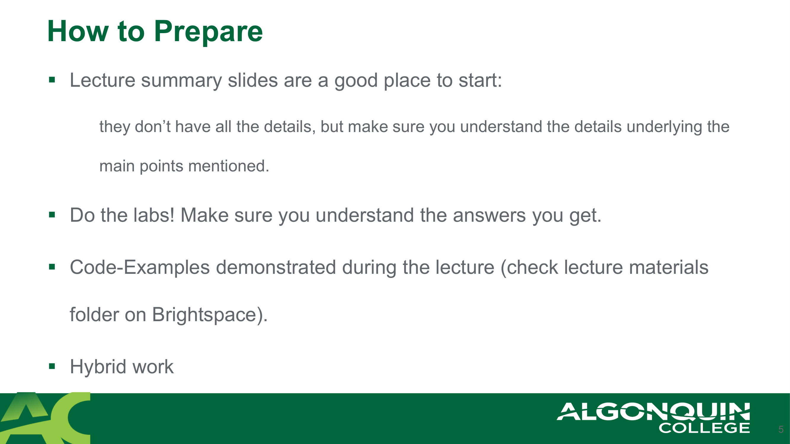

**How to Prepare:** — 如何准备：

- Lecture summary slides are a good place to start: they don't have all the details, but make sure you understand the details underlying the main points mentioned. — 从课程总结幻灯片开始复习
- Do the labs! Make sure you understand the answers you get. — 做实验！确保理解答案
- Code-Examples demonstrated during the lecture (check lecture materials folder on Brightspace). — 课堂代码示例
- Hybrid work — 混合作业

---

## 2. 回顾：N-gram、RNN与LSTM (Recap: N-gram, RNN & LSTM)

### 2.1 N-gram回顾 (N-gram Recap)

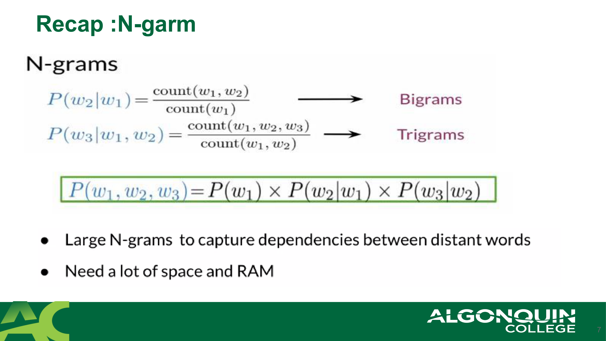

**Recap: N-gram** — 回顾N-gram模型的基本概率计算

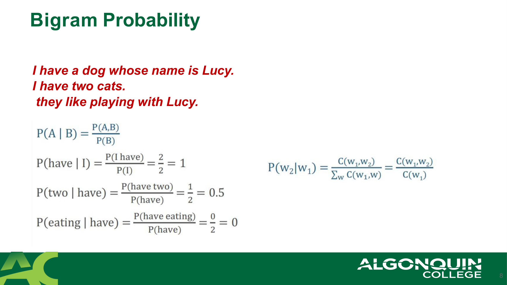

**Bigram Probability:** — Bigram概率：

- I have a dog whose name is Lucy. I have two cats. They like playing with Lucy. — 示例语料库用于计算Bigram概率

### 2.2 RNN回顾 (RNN Recap)

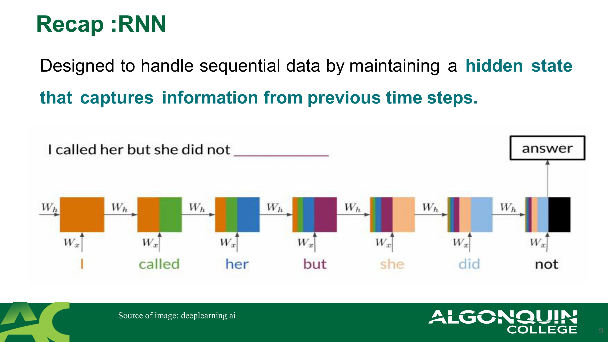

**Recap: RNN** — 回顾RNN：

- Designed to handle sequential data by maintaining a hidden state that captures information from previous time steps. — 通过维护隐藏状态捕获前一时间步的信息来处理序列数据

### 2.3 LSTM回顾 (LSTM Recap)

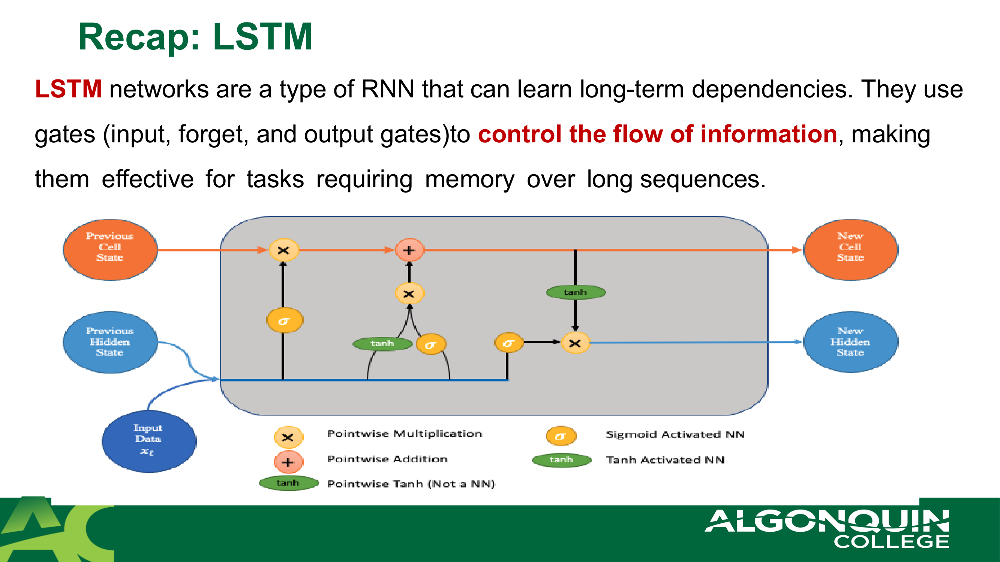

**Recap: LSTM** — 回顾LSTM：

- LSTM networks are a type of RNN that can learn long-term dependencies. They use gates (input, forget, and output gates) to control the flow of information, making them effective for tasks requiring memory over long sequences. — LSTM是一种能学习长期依赖的RNN，使用门控（输入门、遗忘门、输出门）控制信息流

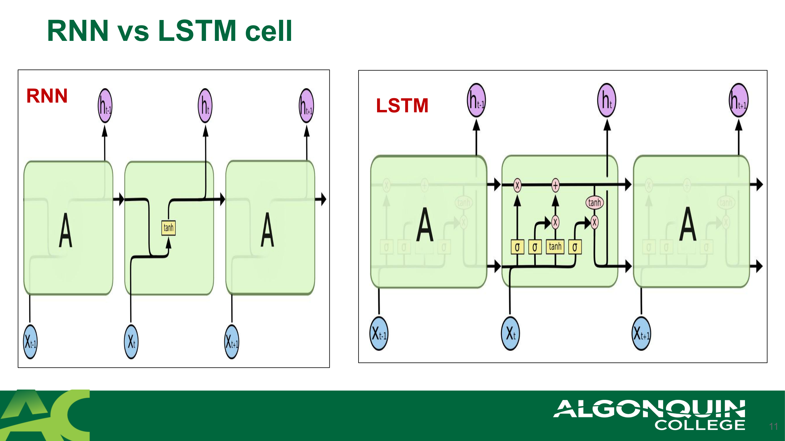

**RNN vs LSTM cell:** Diagram comparing the internal structure of an RNN cell (simple tanh activation) vs an LSTM cell (with forget gate, input gate, cell state, output gate). — RNN单元（简单tanh激活）vs LSTM单元（含遗忘门、输入门、细胞状态、输出门）的内部结构对比图

**RNN与LSTM单元对比图：** 左侧为RNN的简单结构，右侧为LSTM的复杂门控结构。

> **📝 Notes:**
>
> **🎯 Why:**
> **(1) Why recap before Seq2Seq (为什么在Seq2Seq前回顾):**
>
> Seq2Seq models are BUILT ON TOP of RNN/LSTM. The encoder and decoder are both RNN/LSTM networks. Without understanding how hidden states carry information forward (RNN) and how gates prevent gradient vanishing (LSTM), Seq2Seq architecture makes no sense.
>
> > Seq2Seq模型建立在RNN/LSTM之上。编码器和解码器都是RNN/LSTM网络。不理解隐藏状态如何传递信息（RNN）和门控如何防止梯度消失（LSTM），就无法理解Seq2Seq架构。
>
> **(2) Why LSTM over vanilla RNN (为什么用LSTM而非原始RNN):**
>
> Vanilla RNN suffers from vanishing/exploding gradients — it can't remember information from 20+ steps ago. LSTM's cell state acts like a "conveyor belt" that carries information unchanged across time steps. The forget gate decides what to keep; the input gate decides what to add. This is critical for translation where the first word of the input may affect the last word of the output.
>
> > 原始RNN有梯度消失/爆炸问题——无法记住20步以前的信息。LSTM的细胞状态像"传送带"，不变地传递信息。遗忘门决定保留什么；输入门决定添加什么。这对翻译至关重要，因为输入的第一个词可能影响输出的最后一个词。
>
> **💡 Intuition:**
> **(1) Memory upgrade analogy (记忆升级类比):**
>
> RNN = writing notes on a whiteboard that gets partially erased each step. After 10 steps, early notes are gone. LSTM = writing notes in a notebook (cell state) with a pencil. The eraser (forget gate) only removes what you choose, and you can add new notes (input gate) while keeping old ones.
>
> > RNN = 在白板上写笔记，每一步都被部分擦除。10步后，早期笔记消失。LSTM = 用铅笔在笔记本（细胞状态）上写笔记。橡皮（遗忘门）只擦你选择的，可以添加新笔记（输入门）同时保留旧的。
>
> **⚖️ Compare:**
> **(1) RNN vs LSTM comparison (RNN与LSTM对比):**
>
> | Feature          | RNN                       | LSTM                      |
> | ---------------- | ------------------------- | ------------------------- |
> | Long-term memory | Poor (vanishing gradient) | Good (cell state)         |
> | Gates            | None                      | 3 (forget, input, output) |
> | Parameters       | Fewer                     | ~4x more                  |
> | Training speed   | Faster per step           | Slower per step           |
> | Use case         | Short sequences           | Long sequences            |
>
> > | 特性     | RNN            | LSTM                    |
> > | -------- | -------------- | ----------------------- |
> > | 长期记忆 | 差（梯度消失） | 好（细胞状态）          |
> > | 门控     | 无             | 3个（遗忘、输入、输出） |
> > | 参数量   | 较少           | 约4倍                   |
> > | 训练速度 | 每步更快       | 每步更慢                |
> > | 适用场景 | 短序列         | 长序列                  |
>
> **📝 Exam:**
> **(1) 对比题 (Comparison):**
>
> "What are the three gates in LSTM and their functions?" → Forget gate (decides what to discard from cell state), Input gate (decides what new info to store), Output gate (decides what to output from cell state).
>
> > "LSTM的三个门及其功能是什么？" → 遗忘门（决定从细胞状态中丢弃什么）、输入门（决定存储什么新信息）、输出门（决定从细胞状态中输出什么）。

---

## 3. NLP序列问题类型 (Types of Sequence Problems in NLP)

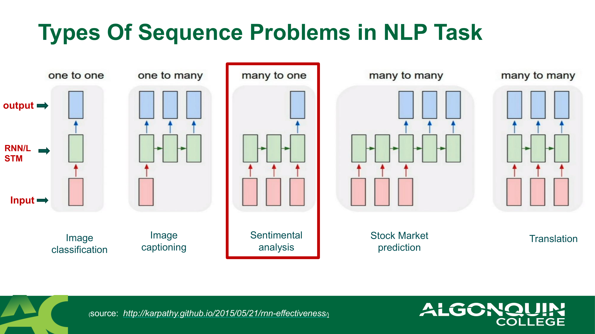

**Types of Sequence Problems in NLP Task:** Five architectures shown with diagrams — one-to-one (Image classification), one-to-many (Image captioning), many-to-one (Sentimental analysis, highlighted with red box), many-to-many (Stock Market prediction), many-to-many (Translation). Each shows input (red), RNN/LSTM (green), output (blue) blocks. — NLP中的五种序列问题类型，展示了不同的输入输出结构。

**NLP序列问题类型图：** 五种架构 —— 一对一（图像分类）、一对多（图像描述）、多对一（情感分析，红框高亮）、多对多（股票预测）、多对多（翻译）。

Ref: http://karpathy.github.io/2015/05/21/rnn-effectiveness/

> **📝 Notes:**
>
> **📌 What:**
> **(1) Five sequence architectures (五种序列架构):**
>
> | Type                    | Input    | Output                      | Example              |
> | ----------------------- | -------- | --------------------------- | -------------------- |
> | One-to-one              | Fixed    | Fixed                       | Image classification |
> | One-to-many             | Fixed    | Sequence                    | Image captioning     |
> | Many-to-one             | Sequence | Fixed                       | Sentiment analysis   |
> | Many-to-many (synced)   | Sequence | Sequence (same length)      | Stock prediction     |
> | Many-to-many (unsynced) | Sequence | Sequence (different length) | Translation          |
>
> > | 类型           | 输入 | 输出           | 示例     |
> > | -------------- | ---- | -------------- | -------- |
> > | 一对一         | 固定 | 固定           | 图像分类 |
> > | 一对多         | 固定 | 序列           | 图像描述 |
> > | 多对一         | 序列 | 固定           | 情感分析 |
> > | 多对多（同步） | 序列 | 序列（等长）   | 股票预测 |
> > | 多对多（异步） | 序列 | 序列（不等长） | 翻译     |
>
> **🎯 Why:**
> **(1) Why this taxonomy matters (为什么这个分类很重要):**
>
> This week's topic — Seq2Seq — is specifically about the **many-to-many (unsynced)** case where input and output have DIFFERENT lengths. Machine translation ("il a m' entarté" → "he hit me with a pie") is the canonical example. This requires a fundamentally different architecture (encoder-decoder) than the others.
>
> > 本周主题——Seq2Seq——专门处理输入输出长度不同的**多对多（异步）**情况。机器翻译是典型例子。这需要与其他情况根本不同的架构（编码器-解码器）。
>
> **⚠️ Pitfall:**
> **(1) Synced vs unsynced many-to-many (同步 vs 异步多对多):**
>
> Students often confuse the two many-to-many types. Synced = output at each input step (e.g., POS tagging, each word gets a tag). Unsynced = output AFTER reading all input (e.g., translation, output length ≠ input length). Seq2Seq handles the unsynced case.
>
> > 学生常混淆两种多对多类型。同步 = 每个输入步都有输出（如POS标注）。异步 = 读完所有输入后才输出（如翻译，输出长度≠输入长度）。Seq2Seq处理异步情况。

---

## 4. 双向LSTM (Bidirectional LSTM — Bi-LSTM)

### 4.1 动机 (Motivation)

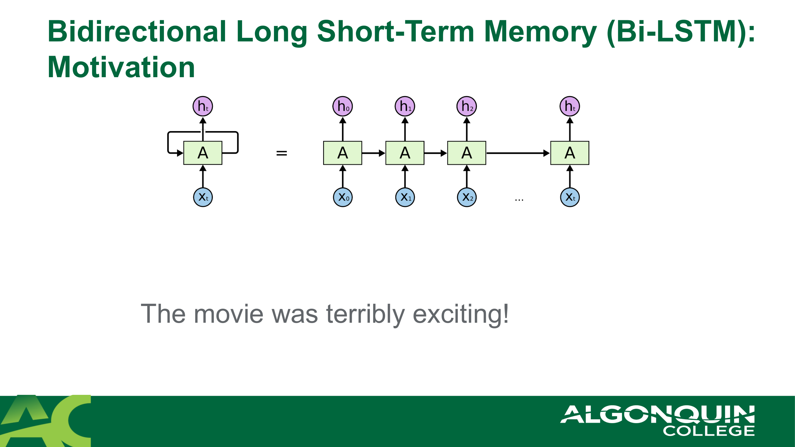

**Motivation — Bidirectional Long Short-Term Memory (Bi-LSTM):** Example sentence "The movie was terribly exciting!" — the word "terribly" requires BOTH left context ("was") and right context ("exciting") to determine it means "very" (positive) rather than "horrible" (negative). — 动机示例：句子"The movie was terribly exciting!"中，"terribly"需要左右两侧上下文才能判断含义。

**动机示意图：** 仅看左侧上下文，"terribly"看起来像负面词；需要看到右侧的"exciting"才能确定是"非常"（正面）的意思。

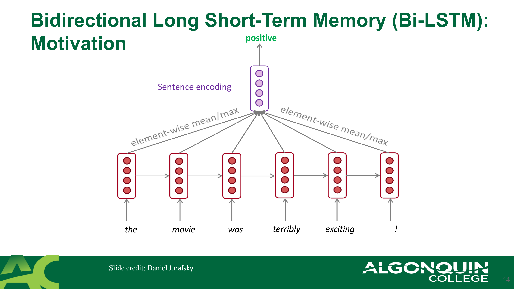

**Motivation positive — Sentence encoding:** The word "terribly" in "the movie was terribly exciting!" is positive. Forward-only RNN would see "was terribly" and might predict negative sentiment. — 正向RNN只看到"was terribly"可能预测负面情感。

### 4.2 Bi-LSTM架构 (Bi-LSTM Architecture)

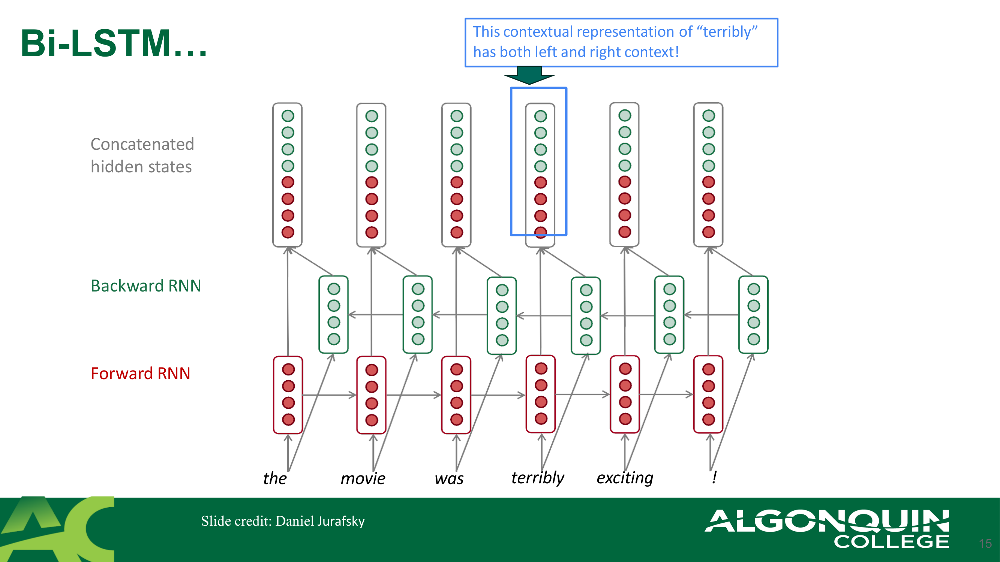

**Bi-LSTM architecture:** Three-layer diagram showing: Bottom — Forward RNN processes "the movie was terribly exciting !" left-to-right (red nodes). Middle — Backward RNN processes right-to-left (green nodes). Top — Concatenated hidden states (grey/green nodes) combine both directions. A callout box highlights: "This contextual representation of 'terribly' has both left and right context!" — Bi-LSTM三层架构图。

**Bi-LSTM架构图：** 底层——正向RNN从左到右处理（红色节点）。中层——反向RNN从右到左处理（绿色节点）。顶层——拼接的隐藏状态（灰绿节点）结合两个方向。标注框强调"terribly"的上下文表示包含左右两侧信息。

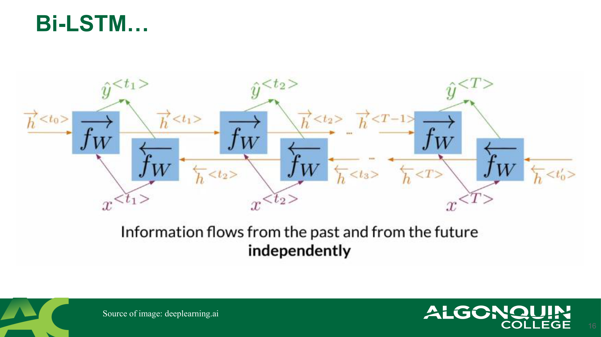

**Bi-LSTM detailed diagram:** Detailed architecture from deeplearning.ai showing forward and backward LSTM cells with concatenated outputs at each timestep. — 来自deeplearning.ai的Bi-LSTM详细架构图。

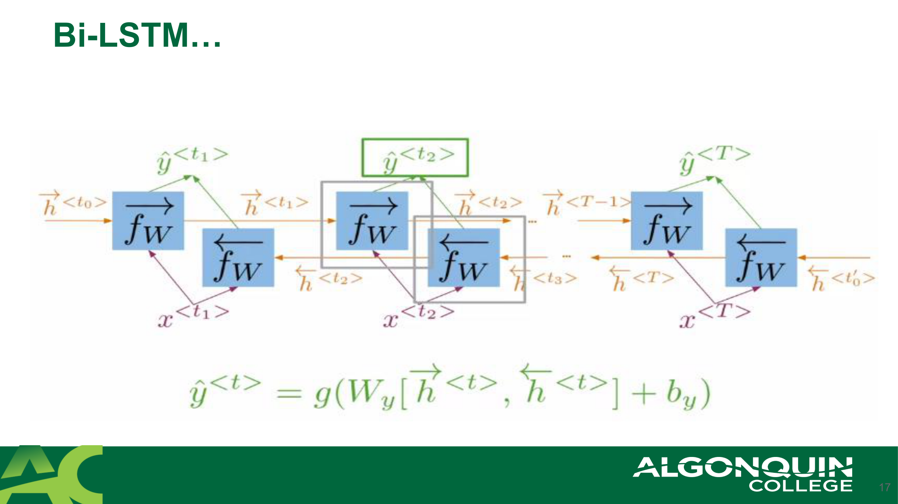

**Bi-LSTM summary diagram:** Compact visualization of bidirectional processing. — Bi-LSTM总结图。

### 4.3 数学表示 (Mathematical Notation)

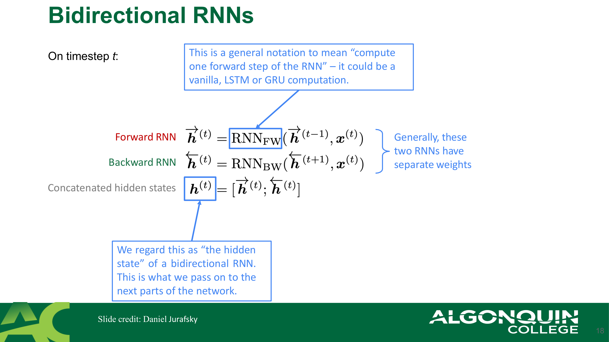

**Bidirectional RNNs — On timestep t:** — 双向RNN时间步t：

- This is a general notation to mean "compute one forward step of the RNN" – it could be a vanilla, LSTM or GRU computation. — 这是"计算RNN一步前向传播"的通用符号
- Forward RNN and Backward RNN generally have **separate weights** — 正向和反向RNN通常有**独立的权重**
- Concatenated hidden states: We regard this as "the hidden state" of a bidirectional RNN. This is what we pass on to the next parts of the network. — 拼接的隐藏状态被视为双向RNN的"隐藏状态"，传递给网络后续部分

### 4.4 单向LSTM vs Bi-LSTM (Single vs Bi-LSTM)

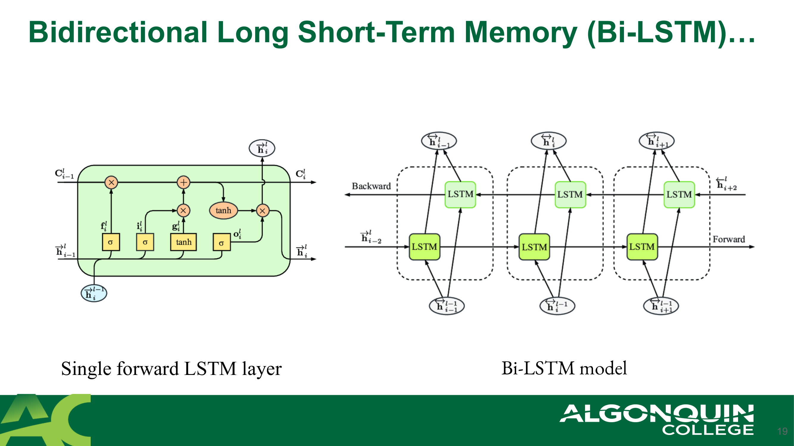

**Single forward LSTM layer vs Bi-LSTM model:** Side-by-side comparison showing single-direction LSTM (left) and bidirectional LSTM (right) with double the hidden states. — 单向LSTM层（左）与Bi-LSTM模型（右）对比图。

### 4.5 Bi-LSTM分类模型代码 (Bi-LSTM Classification Code)

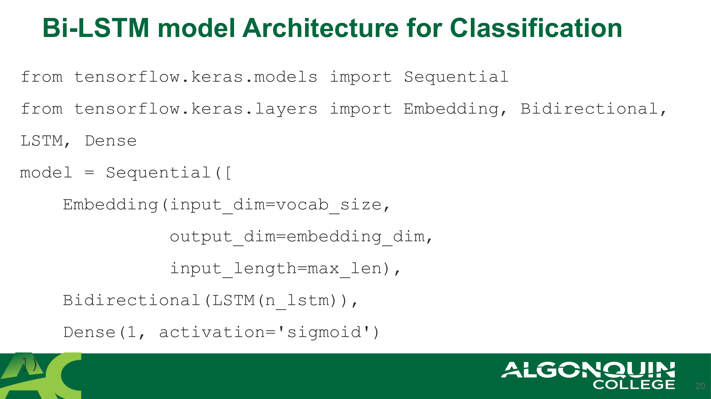

**Bi-LSTM model Architecture for Classification:** — 用于分类的Bi-LSTM模型架构：

```python
from tensorflow.keras.models import Sequential
from tensorflow.keras.layers import Embedding, Bidirectional, LSTM, Dense

model = Sequential([
    Embedding(input_dim=vocab_size,
              output_dim=embedding_dim,
              input_length=max_len),
    Bidirectional(LSTM(n_lstm)),
    Dense(1, activation='sigmoid')
])
```

### 4.6 多层RNN/LSTM (Multi-layer RNNs/LSTM)

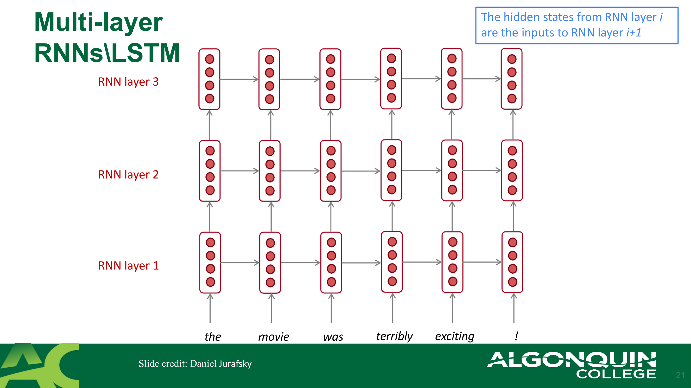

**Multi-layer RNNs/LSTM:** The hidden states from RNN layer i are the inputs to RNN layer i+1. Diagram shows 3 stacked RNN layers processing "the movie was terribly exciting !". — 多层RNN：第i层的隐藏状态是第i+1层的输入。

**多层RNN/LSTM图：** 展示3层叠加的RNN层处理示例句子。

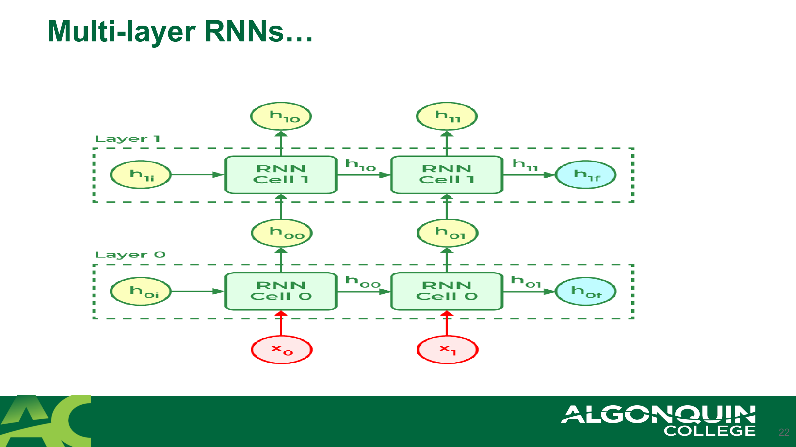

**Multi-layer RNNs continued:** Additional detail on stacking multiple layers. — 多层RNN补充说明。

> **📝 Notes:**
>
> **📌 What:**
> **(1) Bi-LSTM definition (Bi-LSTM定义):**
>
> A Bi-LSTM runs TWO separate LSTMs on the input sequence: one forward (left→right) and one backward (right→left). At each timestep, the hidden states from both directions are concatenated to form a single representation: h_t = [h_forward_t ; h_backward_t]. This doubles the hidden state dimension.
>
> > Bi-LSTM在输入序列上运行两个独立的LSTM：一个正向（从左到右），一个反向（从右到左）。每个时间步，两个方向的隐藏状态被拼接为一个表示：h_t = [h_forward_t ; h_backward_t]。这使隐藏状态维度翻倍。
>
> **(2) Multi-layer stacking (多层堆叠):**
>
> Multiple RNN/LSTM layers can be stacked. Layer i's hidden states become Layer i+1's inputs. Deeper networks can learn more abstract features. In practice, 2-4 layers are common; more layers rarely help and risk overfitting.
>
> > 可以堆叠多个RNN/LSTM层。第i层的隐藏状态成为第i+1层的输入。更深的网络可以学习更抽象的特征。实践中通常用2-4层；更多层很少有帮助且有过拟合风险。
>
> **🎯 Why:**
> **(1) Why bidirectional matters (为什么双向很重要):**
>
> In "the movie was terribly exciting", a forward-only RNN at "terribly" has seen "the movie was" but NOT "exciting". It might encode "terribly" as negative. The backward RNN sees "exciting !" BEFORE "terribly", so it knows the sentiment is positive. Concatenating both gives the full picture. This is critical for tasks like sentiment analysis, NER, and POS tagging.
>
> > 在"the movie was terribly exciting"中，仅正向的RNN在"terribly"处只看到了"the movie was"但没看到"exciting"。它可能把"terribly"编码为负面。反向RNN在"terribly"之前看到了"exciting !"，所以知道情感是正面的。拼接两者给出完整图景。
>
> **💡 Intuition:**
> **(1) Reading a sentence from both ends (从两端读句子):**
>
> Imagine two people reading a sentence: one from left to right, one from right to left. Each person understands parts the other misses. When they compare notes at each word position, they have a complete understanding. That's exactly what Bi-LSTM does — two readers, one representation.
>
> > 想象两个人读一个句子：一个从左到右，一个从右到左。每人理解对方遗漏的部分。当他们在每个词位置比较笔记时，就有了完整理解。这正是Bi-LSTM做的——两个读者，一个表示。
>
> **⚙️ How:**
> **(1) Keras Bidirectional wrapper (Keras双向包装器):**
>
> `Bidirectional(LSTM(n))` wraps any RNN layer. It automatically creates forward + backward copies, runs both, and concatenates outputs. Output dimension = 2 × n_lstm. For classification, the final concatenated state is fed to Dense layer.
>
> > `Bidirectional(LSTM(n))`包装任何RNN层。自动创建正向+反向副本，运行两者并拼接输出。输出维度 = 2 × n_lstm。分类时，最终拼接状态馈入Dense层。
>
> **⚠️ Pitfall:**
> **(1) Bi-LSTM cannot be used for language generation (Bi-LSTM不能用于语言生成):**
>
> Bi-LSTM needs the ENTIRE sequence upfront (both directions). You can't use it to generate text word-by-word because future words don't exist yet. Use Bi-LSTM for understanding tasks (classification, NER, tagging), NOT for generation. For generation, use unidirectional LM or decoder-only models.
>
> > Bi-LSTM需要预先获得完整序列（两个方向）。你不能用它逐词生成文本，因为未来的词还不存在。Bi-LSTM用于理解任务（分类、NER、标注），而非生成。生成任务用单向LM或仅解码器模型。
>
> **(2) 2x parameters ≠ 2x performance (2倍参数≠2倍性能):**
>
> Bi-LSTM has roughly 2x the parameters of a unidirectional LSTM. It's slower to train and requires more memory. For tasks where only left context matters (e.g., next-word prediction), Bi-LSTM wastes computation with no benefit.
>
> > Bi-LSTM的参数量约为单向LSTM的2倍。训练更慢且需要更多内存。对于只需要左侧上下文的任务（如下一词预测），Bi-LSTM浪费计算而无收益。
>
> **📝 Exam:**
> **(1) 概念题 (Conceptual):**
>
> "Why can't Bi-LSTM be used for language modeling (next-word prediction)?" → Because it requires access to future words (backward pass), which don't exist during generation. LMs must be strictly left-to-right.
>
> > "为什么Bi-LSTM不能用于语言建模（下一词预测）？" → 因为它需要访问未来的词（反向传递），而在生成过程中未来的词不存在。LM必须严格从左到右。
>
> **(2) 对比题 (Comparison):**
>
> "Compare unidirectional LSTM and Bi-LSTM for sentiment analysis." → Bi-LSTM is better because sentiment depends on full context. "Not bad" vs "bad" — the backward pass captures "not" even if it appears before "bad".
>
> > "比较单向LSTM和Bi-LSTM用于情感分析。" → Bi-LSTM更好，因为情感依赖完整上下文。"Not bad" vs "bad"——反向传递即使"not"出现在"bad"之前也能捕获它。

---

## 5. 序列到序列模型 (Sequence-to-Sequence — Seq2Seq)

### 5.1 Seq2Seq简介 (Introduction to Seq2Seq)

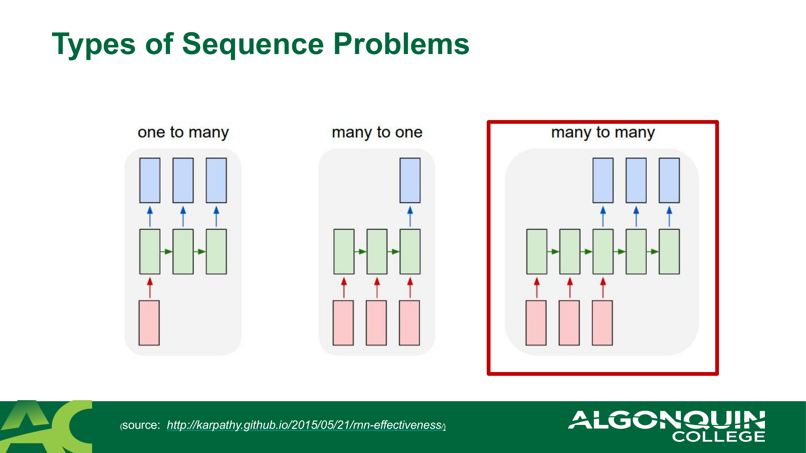

**Types of Sequence Problems:** Same Karpathy diagram again, highlighting the many-to-many (unsynced) architecture — the focus of Seq2Seq. — 再次展示Karpathy的序列问题类型图，强调多对多（异步）架构。

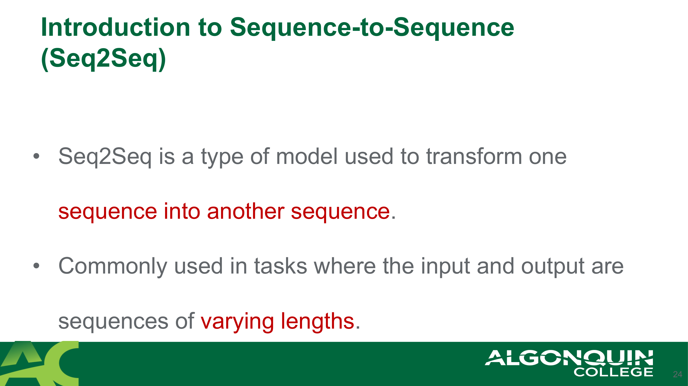

**Introduction to Sequence-to-Sequence (Seq2Seq):** — Seq2Seq简介：

- Seq2Seq is a type of model used to transform one sequence into another sequence. — Seq2Seq将一个序列转换为另一个序列
- Commonly used in tasks where the input and output are sequences of varying lengths. — 常用于输入输出长度不同的任务

### 5.2 编码器-解码器模型 (Encoder-Decoder Model)

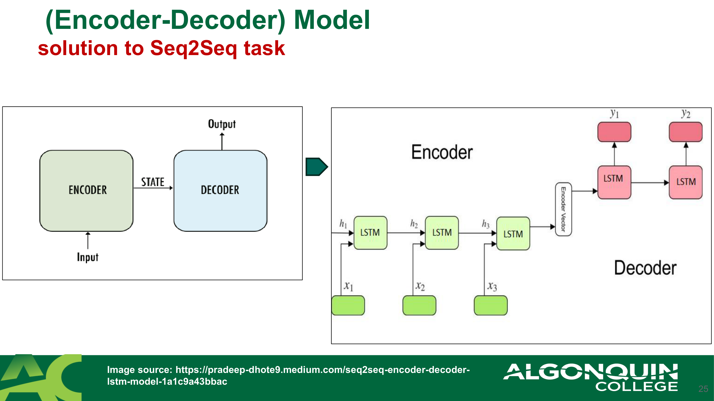

**Encoder-Decoder Model — solution to Seq2Seq task:** Left — abstract block diagram: ENCODER receives Input, passes STATE to DECODER, which produces Output. Right — detailed LSTM implementation: Encoder processes x₁, x₂, x₃ through LSTM cells producing h₁, h₂, h₃, final state becomes "Encoder Vector" that initializes Decoder LSTM cells producing y₁, y₂. — 编码器-解码器模型图。

**编码器-解码器模型图：** 左侧为抽象框图（编码器→状态→解码器）。右侧为详细LSTM实现（编码器处理输入序列产生编码向量，初始化解码器生成输出序列）。

Ref: https://pradeep-dhote9.medium.com/seq2seq-encoder-decoder-lstm-model-1a1c9a43bbac

### 5.3 机器翻译作为条件语言模型 (MT as Conditional Language Model)

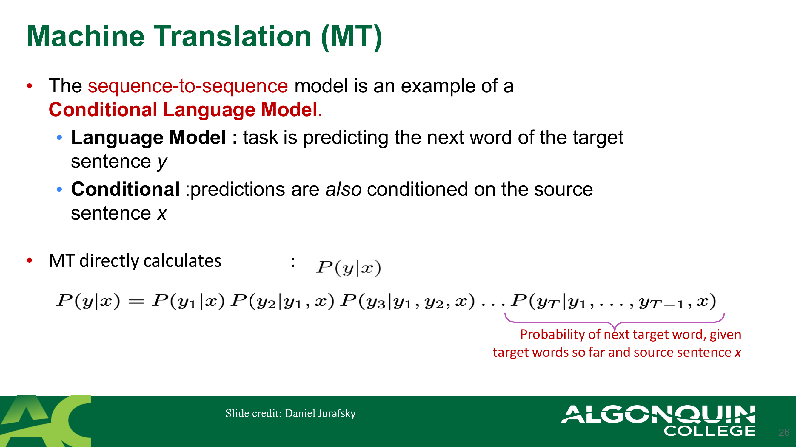

**Machine Translation (MT):** — 机器翻译：

- The sequence-to-sequence model is an example of a **Conditional Language Model**. — 序列到序列模型是**条件语言模型**的一个例子
- **Language Model:** task is predicting the next word of the target sentence y — 语言模型：预测目标句子的下一个词
- **Conditional:** predictions are also conditioned on the source sentence x — 条件性：预测还以源句子x为条件
- MT directly calculates: Probability of next target word, given target words so far and source sentence x — MT直接计算：给定已有目标词和源句子x，下一个目标词的概率

### 5.4 训练Seq2Seq (Training Seq2Seq)

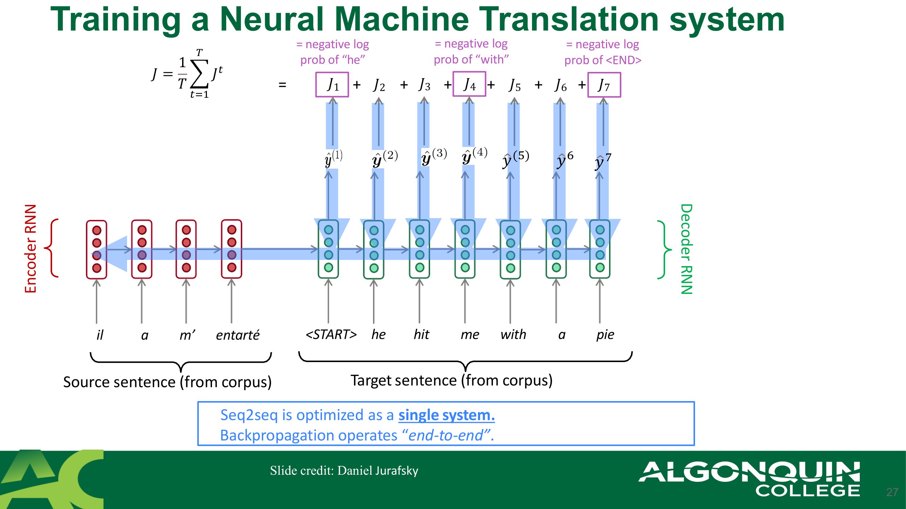

**Training a Neural Machine Translation system:** Diagram showing end-to-end training: Source sentence "il a m' entarté" → Encoder RNN → Decoder RNN → generates "he hit me with a pie". Loss J = (1/T)Σ Jₜ = sum of negative log probabilities for each target word. Seq2seq is optimized as a single system. Backpropagation operates "end-to-end". — 端到端训练NMT系统的示意图。

**NMT训练图：** 源句子通过编码器RNN处理，解码器RNN逐步生成目标词。损失函数是每个目标词负对数概率的平均值。整个系统端到端优化。

### 5.5 测试阶段 (Testing/Inference)

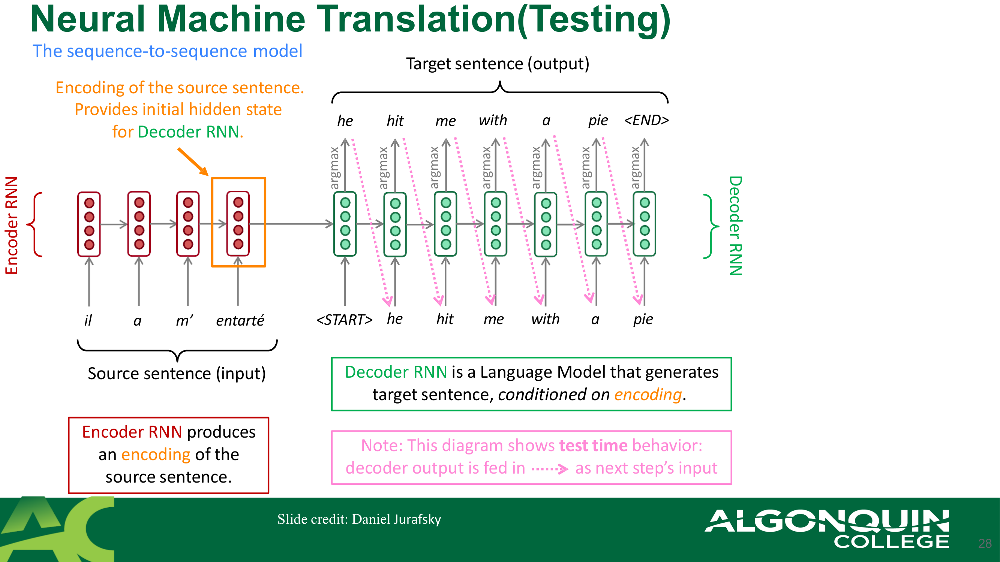

**Neural Machine Translation (Testing):** Diagram showing test-time behavior: Encoder RNN produces an encoding of the source sentence. This provides initial hidden state for Decoder RNN. Decoder RNN is a Language Model that generates target sentence, conditioned on encoding. Note: decoder output is fed in as next step's input (autoregressive). — 测试时行为图。

**NMT测试图：** 编码器RNN生成源句子的编码。此编码提供解码器RNN的初始隐藏状态。解码器是一个条件语言模型，自回归地生成目标句子（上一步输出作为下一步输入）。

### 5.6 瓶颈问题 (Bottleneck Problem)

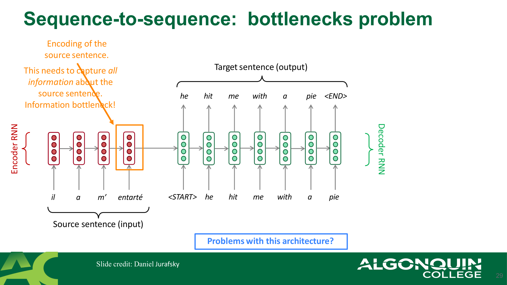

**Sequence-to-sequence: bottleneck problem:** Same diagram but highlighting the single encoding vector that must capture ALL information about the source sentence. Arrow points to the connection between encoder and decoder labeled "Information bottleneck!" — 展示信息瓶颈问题。

**Seq2Seq瓶颈图：** 与之前相同的架构图，但高亮了编码器与解码器之间的单一编码向量，标注"Information bottleneck!"——这一个向量必须包含源句子的所有信息。

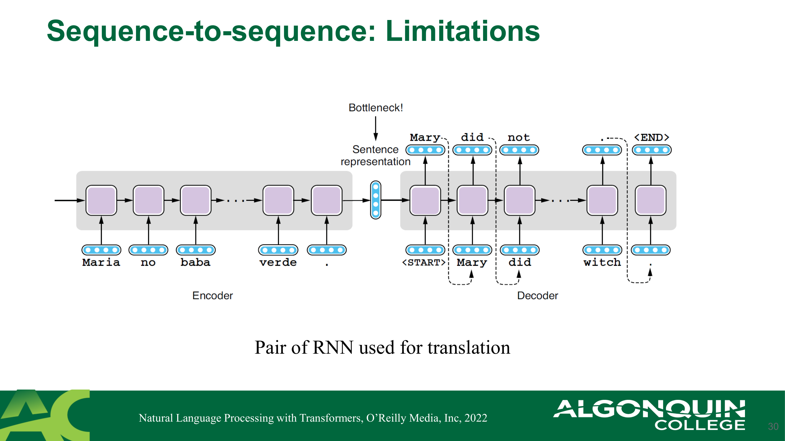

**Sequence-to-sequence: Limitations** — Seq2Seq的局限性

- Pair of RNN used for translation — 一对RNN用于翻译

> **📝 Notes:**
>
> **📌 What:**
> **(1) Encoder-Decoder framework (编码器-解码器框架):**
>
> The encoder reads the entire input sequence and compresses it into a fixed-length vector (the "context vector" or "encoding"). The decoder takes this vector as its initial hidden state and generates the output sequence one token at a time, autoregressively. Both encoder and decoder are typically LSTMs.
>
> > 编码器读取整个输入序列，压缩为固定长度的向量（"上下文向量"或"编码"）。解码器将此向量作为初始隐藏状态，自回归地每次生成一个token。编码器和解码器通常都是LSTM。
>
> **(2) Conditional Language Model (条件语言模型):**
>
> A regular LM computes P(y₁, y₂, ..., yₜ). A conditional LM computes P(y₁, y₂, ..., yₜ | x₁, x₂, ..., xₛ). The decoder is a regular LM conditioned on the encoder's output. This elegant formulation unifies translation, summarization, and dialogue as "conditional text generation."
>
> > 普通LM计算P(y₁, y₂, ..., yₜ)。条件LM计算P(y₁, y₂, ..., yₜ | x₁, x₂, ..., xₛ)。解码器是以编码器输出为条件的普通LM。这个优雅的公式将翻译、摘要和对话统一为"条件文本生成"。
>
> **🎯 Why:**
> **(1) Why bottleneck is a fatal flaw (为什么瓶颈是致命缺陷):**
>
> Compressing an entire sentence (potentially 50+ words) into a single fixed-size vector (e.g., 256 or 512 dimensions) inevitably loses information. It's like trying to summarize a novel in one sentence — you WILL lose details. For long sentences, the decoder receives a blurry, incomplete representation of the input. This is the exact problem that ATTENTION solves (next section).
>
> > 将整个句子（可能50+个词）压缩为一个固定大小的向量（如256或512维）不可避免地丢失信息。就像试图用一句话概括一部小说——你一定会丢失细节。对于长句子，解码器收到的是输入的模糊、不完整表示。这正是注意力机制（下一节）解决的问题。
>
> **💡 Intuition:**
> **(1) Telephone game analogy (传话游戏类比):**
>
> Seq2Seq without attention is like a telephone game: person A (encoder) reads a book and whispers ONE summary sentence to person B (decoder). Person B must reconstruct the entire book from that one sentence. Obviously, longer books lose more detail. Attention = letting person B ask "what was on page 7?" at any time.
>
> > 无注意力的Seq2Seq就像传话游戏：A（编码器）读一本书，向B（解码器）低语一句总结。B必须从这一句话重建整本书。显然，书越长丢失越多。注意力 = 让B随时问"第7页是什么？"
>
> **(2) Training vs Testing difference (训练与测试的区别):**
>
> During training, the decoder receives the CORRECT previous word (teacher forcing). During testing, the decoder uses its OWN previous prediction. If the decoder makes a mistake early on, all subsequent words may be wrong — errors accumulate. This is called "exposure bias."
>
> > 训练时，解码器收到正确的前一个词（教师强制）。测试时，解码器使用自己之前的预测。如果解码器早期犯错，所有后续词都可能错误——错误累积。这称为"暴露偏差"。
>
> **⚠️ Pitfall:**
> **(1) Teacher forcing trap (教师强制陷阱):**
>
> During training, we feed the GROUND TRUTH previous word to the decoder (teacher forcing), not its own prediction. This makes training faster but creates a mismatch with test time, where the model must use its own predictions. This "exposure bias" means training loss can be low but test performance poor.
>
> > 训练时，我们把真实的前一个词（而非模型自己的预测）喂给解码器（教师强制）。这加速训练但与测试时不匹配。这种"暴露偏差"意味着训练损失低但测试性能差。
>
> **📝 Exam:**
> **(1) 概念题 (Conceptual):**
>
> "Explain the bottleneck problem in Seq2Seq." → The entire source sentence is compressed into a single fixed-size vector. For long sentences, this vector cannot capture all information, leading to information loss and poor translation quality. Solution: attention mechanism.
>
> > "解释Seq2Seq中的瓶颈问题。" → 整个源句子被压缩为单个固定大小向量。长句子无法在此向量中捕获所有信息，导致信息丢失和翻译质量下降。解决方案：注意力机制。
>
> **(2) 定义题 (Definition):**
>
> "What is a Conditional Language Model?" → A language model where predictions are conditioned on an additional input. In MT: P(y₁...yₜ | x₁...xₛ) — the target sequence probability is conditioned on the source sequence.
>
> > "什么是条件语言模型？" → 预测以额外输入为条件的语言模型。在MT中：P(y₁...yₜ | x₁...xₛ)——目标序列概率以源序列为条件。

---

## 6. 注意力机制 (Attention Mechanism)

### 6.1 注意力的动机与定义 (Motivation & Definition)

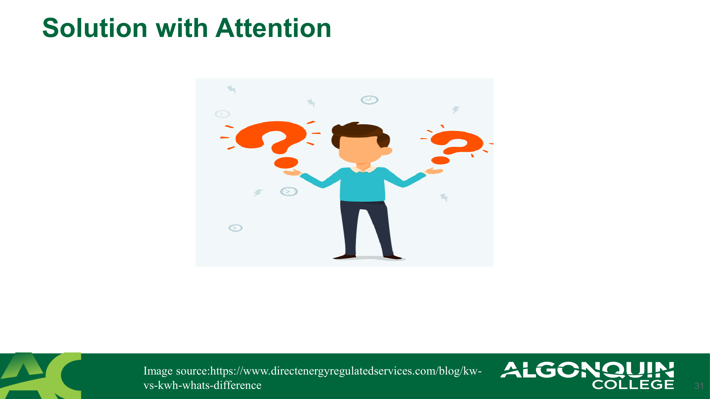

**Solution with Attention:** Title slide introducing attention as the solution to the bottleneck problem. — 注意力作为瓶颈问题的解决方案。

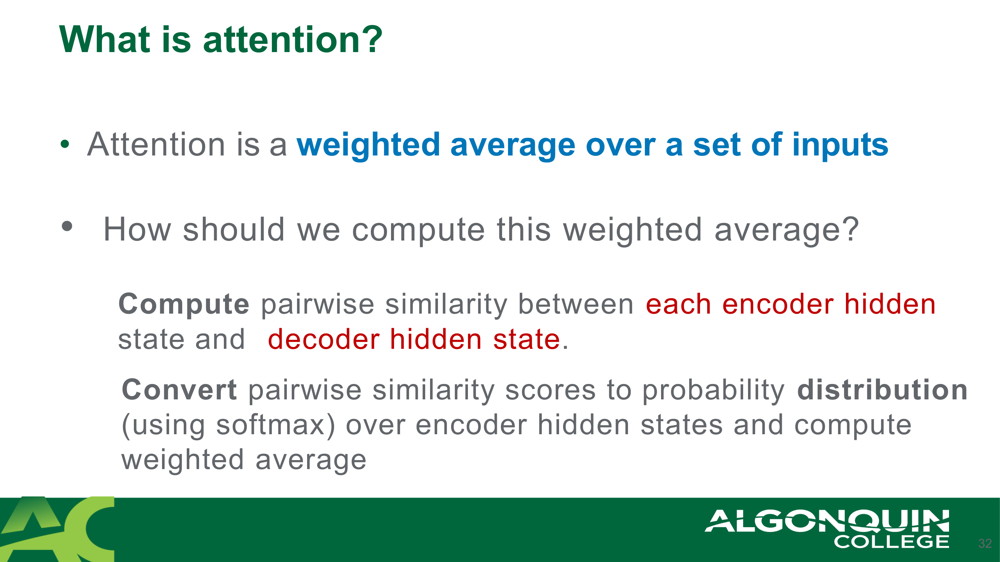

**What is attention?** — 什么是注意力？

- Attention is a **weighted average over a set of inputs** — 注意力是输入集合上的**加权平均**
- How should we compute this weighted average? — 如何计算这个加权平均？
  - **Compute** pairwise similarity between **each encoder hidden state** and **decoder hidden state**. — 计算每个编码器隐藏状态与解码器隐藏状态之间的成对相似度
  - **Convert** pairwise similarity scores to probability distribution (using softmax) over encoder hidden states and compute weighted average — 将相似度分数通过softmax转为概率分布，计算加权平均

### 6.2 注意力的优势 (Attention Benefits)

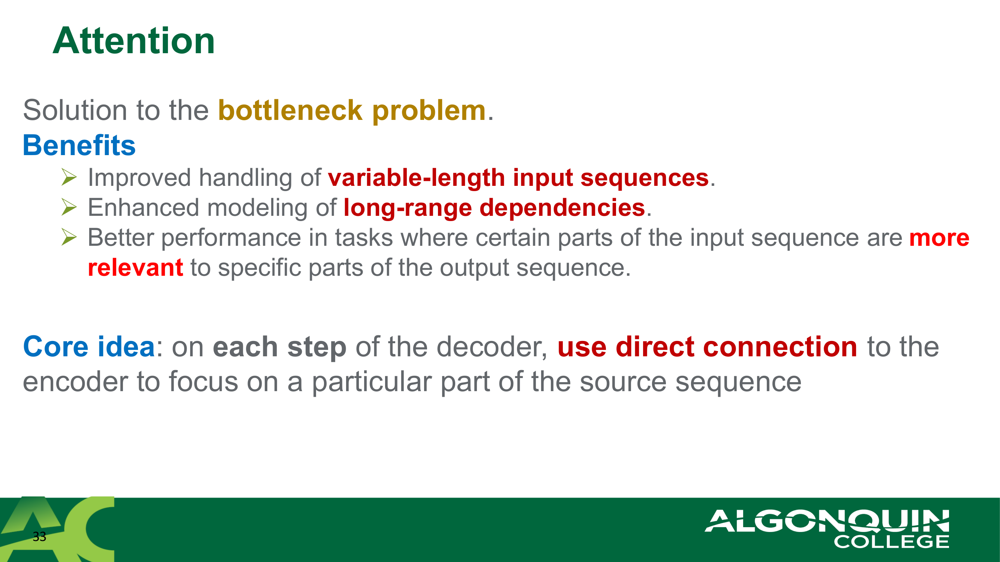

**Attention — Solution to the bottleneck problem:** — 注意力——瓶颈问题的解决方案：

- Benefits: — 优势：
  - ➢ Improved handling of variable-length input sequences. — 改善对变长输入序列的处理
  - ➢ Enhanced modeling of long-range dependencies. — 增强长距离依赖建模
  - ➢ Better performance in tasks where certain parts of the input sequence are more relevant to specific parts of the output sequence. — 在输入特定部分与输出特定部分更相关的任务中表现更好
- Core idea: on each step of the decoder, use direct connection to the encoder to focus on a particular part of the source sequence — 核心思想：解码器每一步都直接连接到编码器，聚焦于源序列的特定部分

### 6.3 注意力分步详解 (Attention Step-by-Step)

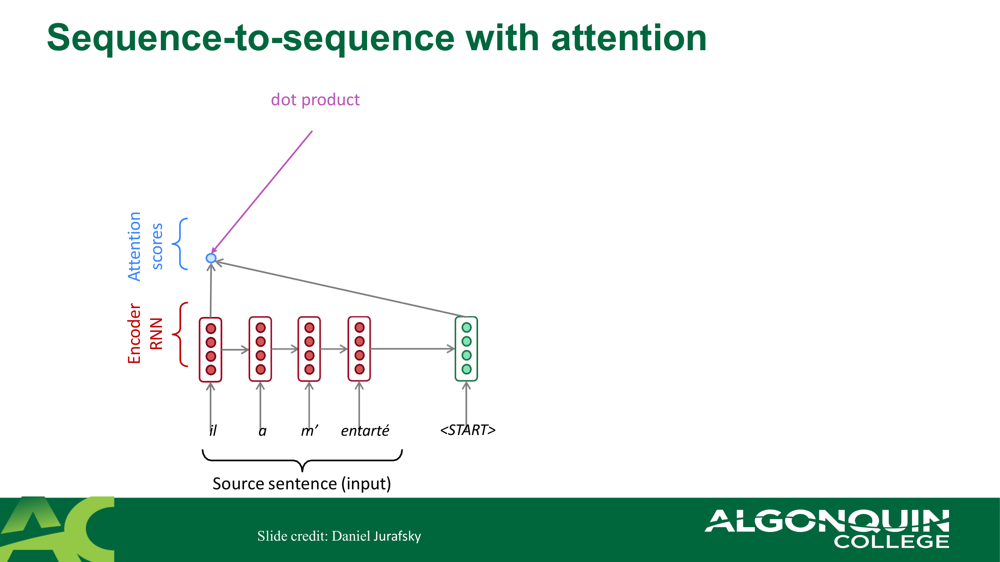

**Sequence-to-sequence with attention — Step 1:** Architecture diagram showing: Encoder RNN processes source sentence "il a m' entarté". At decoder \<START\> token, dot product attention scores are computed between decoder hidden state and each encoder hidden state. — 注意力Seq2Seq第1步：编码器处理源句子，解码器\<START\>位置计算注意力分数。

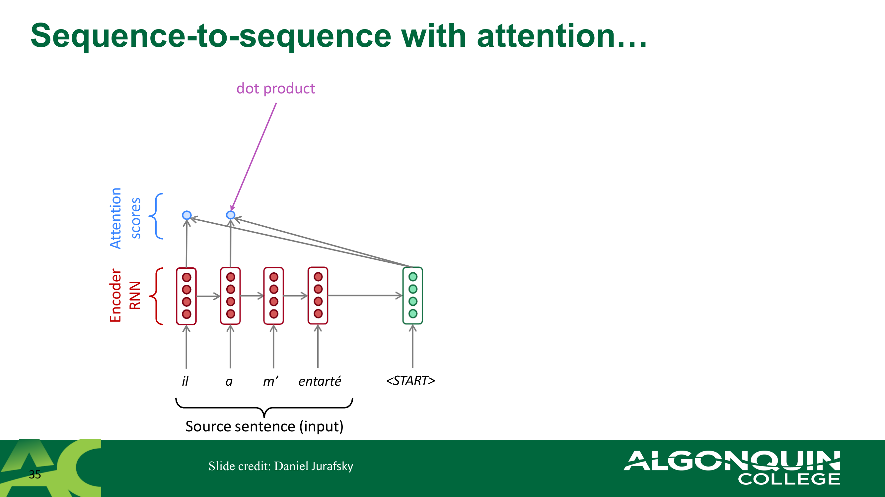

**Step 2: Compute attention scores** — Dot product between decoder state and each encoder state produces raw scores. — 第2步：计算注意力分数。

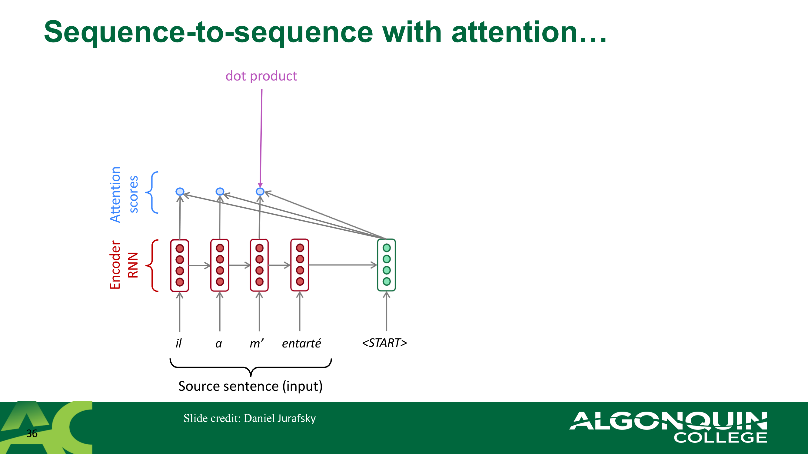

**Step 3: Apply softmax** — Convert raw scores to probability distribution. — 第3步：对原始分数应用softmax得到概率分布。

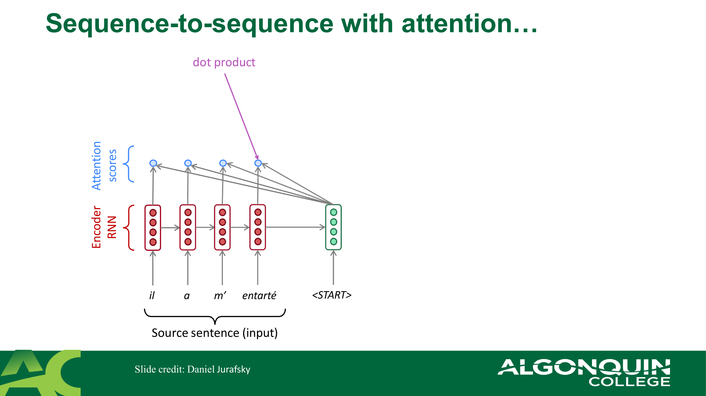

**Step 4: Attention distribution** — The softmax output gives an attention distribution over encoder states. — 第4步：softmax输出给出编码器状态上的注意力分布。

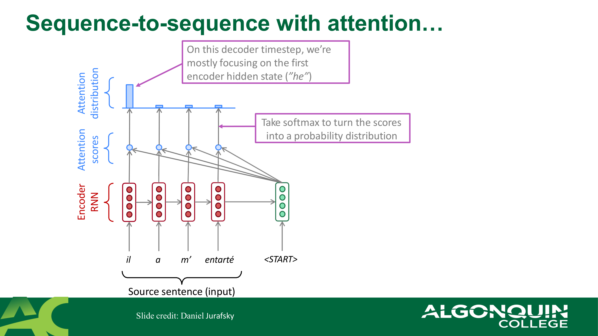

**Step 5: Focus on relevant input:** On this decoder timestep, we're mostly focusing on the first encoder hidden state ("he"). Take softmax to turn the scores into a probability distribution. The attention distribution shows high weight on "il" (French for "he"). — 第5步：聚焦相关输入——解码器主要关注第一个编码器隐藏状态（"il"对应"he"）。

**注意力聚焦图：** 在解码"he"时，注意力分布在"il"上给出最高权重。底部标注展示softmax将分数转为概率分布。

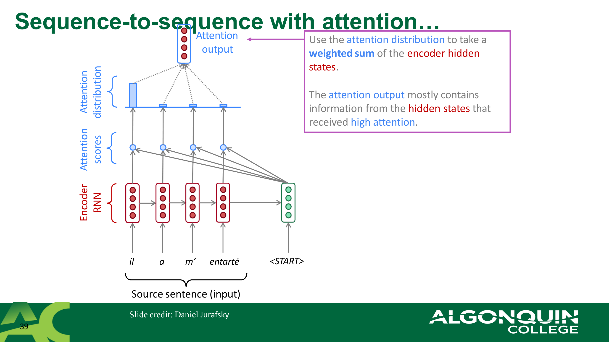

**Step 6: Compute attention output:** Use the attention distribution to take a weighted sum of the encoder hidden states. The attention output mostly contains information from the hidden states that received high attention. — 第6步：用注意力分布对编码器隐藏状态做加权求和。

**注意力输出图：** 注意力输出主要包含获得高注意力的隐藏状态信息。

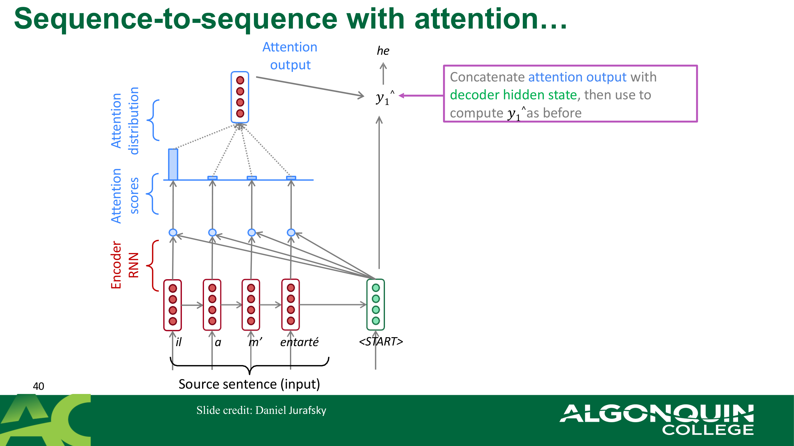

**Step 7: Generate output word:** Concatenate attention output with decoder hidden state, then use to compute ŷ₁ as before. Output: "he". — 第7步：拼接注意力输出与解码器隐藏状态，生成输出词"he"。

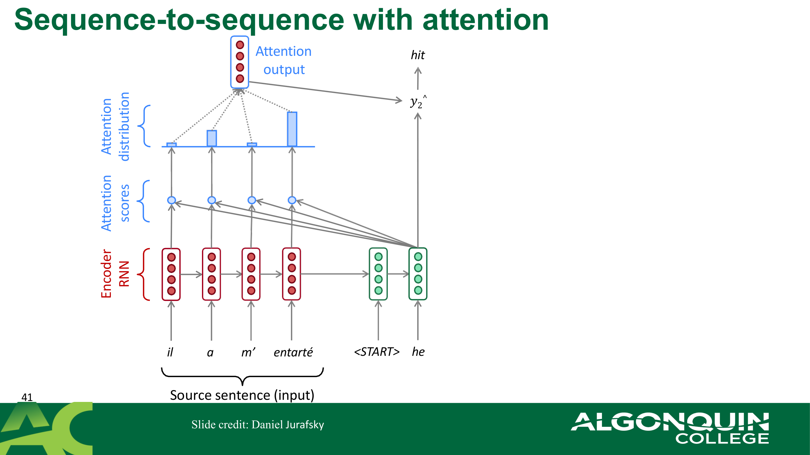

**Step 8: Next timestep — "hit":** Same process repeats. Attention now focuses on different source words. Output: "hit". — 第8步：重复过程，注意力聚焦不同源词，输出"hit"。

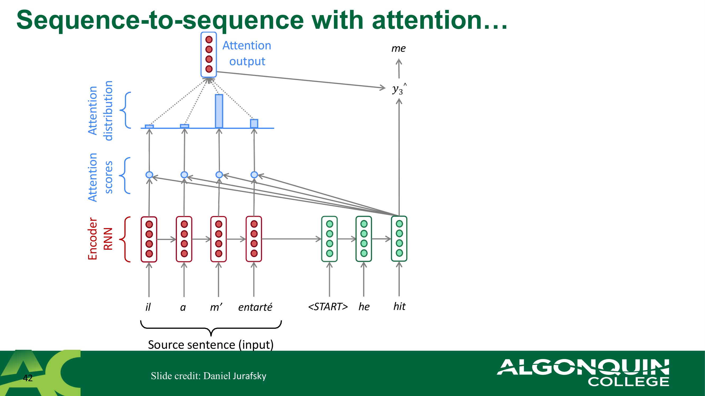

**Step 9: "me":** Attention shifts to "m'" in the source. Output: "me". — 第9步：注意力转向源句的"m'"，输出"me"。

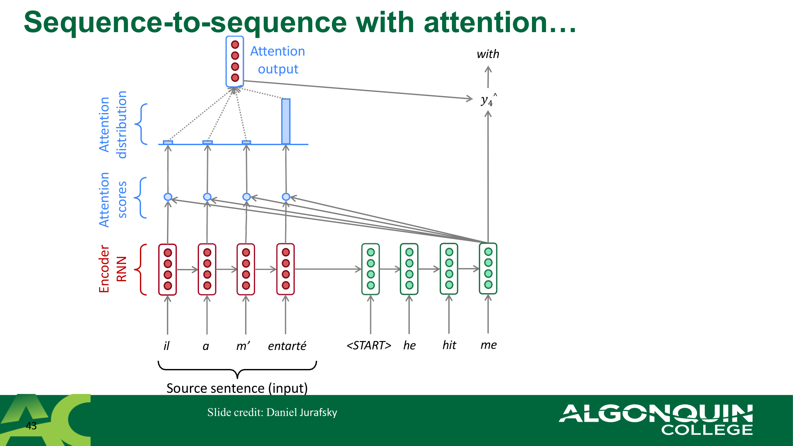

**Step 10: "with":** Attention distributes across relevant source words. Output: "with". — 第10步：输出"with"。

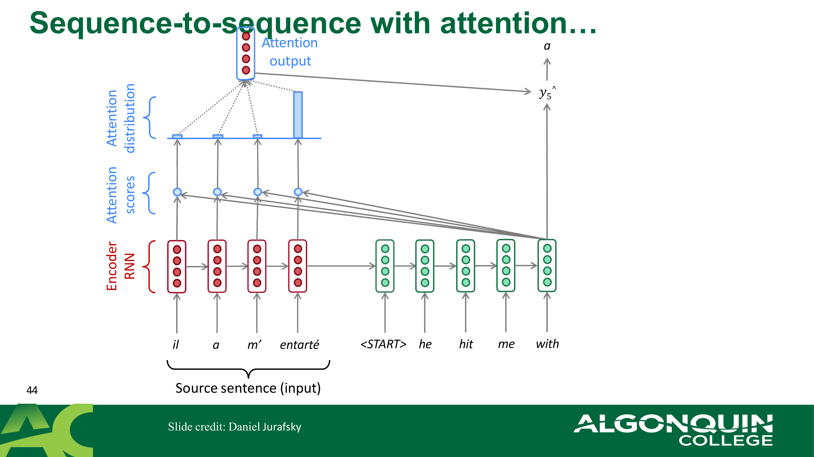

**Step 11: "a":** Output: "a". — 第11步：输出"a"。

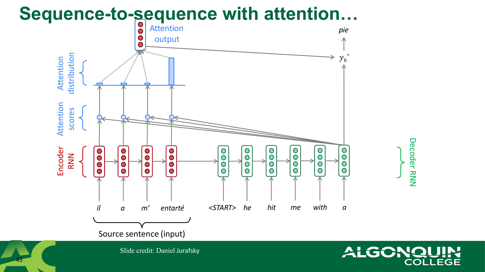

**Step 12: "pie":** Attention focuses on "entarté" (French for "pied/pie"). Output: "pie". Full translation complete. — 第12步：注意力聚焦"entarté"，输出"pie"。翻译完成。

### 6.4 注意力机制优势与挑战 (Benefits vs Challenges)

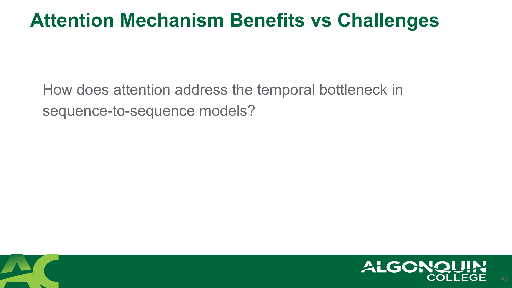

**Attention Mechanism Benefits vs Challenges:** Discussion question — "How does attention address the temporal bottleneck in sequence-to-sequence models?" — 讨论题："注意力如何解决Seq2Seq模型中的时间瓶颈？"

> **📝 Notes:**
>
> **📌 What:**
> **(1) Attention mechanism definition (注意力机制定义):**
>
> Attention computes a weighted average of encoder hidden states at EACH decoder step. The weights (attention distribution) are determined by how "relevant" each encoder state is to the current decoder state. This replaces the single bottleneck vector with a dynamic, step-specific context vector.
>
> > 注意力在解码器的每一步计算编码器隐藏状态的加权平均。权重（注意力分布）由每个编码器状态与当前解码器状态的"相关性"决定。这用动态的、步骤特定的上下文向量替代了单一瓶颈向量。
>
> **🎯 Why:**
> **(1) Why attention solves the bottleneck (为什么注意力解决了瓶颈):**
>
> Without attention: decoder gets ONE fixed vector for the entire source. With attention: decoder gets a DIFFERENT weighted combination of ALL encoder states at each step. When generating "pie", it can look directly at "entarté" instead of hoping the single vector remembers it. The bottleneck is eliminated because information flows directly from any encoder position to any decoder position.
>
> > 无注意力：解码器对整个源句子只得到一个固定向量。有注意力：解码器每步得到所有编码器状态的不同加权组合。生成"pie"时，它可以直接看到"entarté"，而不是寄希望于单一向量还记得它。瓶颈被消除，因为信息直接从任何编码器位置流向任何解码器位置。
>
> **(2) Why dot product for similarity (为什么用点积计算相似度):**
>
> Dot product measures how "aligned" two vectors are. If decoder state represents "I need a noun meaning food thrown at someone" and encoder state for "entarté" represents "pie-throwing", their dot product will be high. Other options exist (additive attention, multiplicative), but dot product is simplest and fastest.
>
> > 点积衡量两个向量的"对齐"程度。如果解码器状态表示"我需要一个表示扔向某人的食物的名词"，而"entarté"的编码器状态表示"扔派"，它们的点积会很高。还有其他选项（加性注意力、乘性），但点积最简单最快。
>
> **⚙️ How:**
> **(1) Attention computation pipeline (注意力计算流水线):**
>
> At each decoder step t:
>
> 1. Compute attention scores: eₜ,ᵢ = dot(sₜ, hᵢ) for each encoder state hᵢ
> 2. Apply softmax: αₜ,ᵢ = softmax(eₜ,ᵢ) — now a probability distribution
> 3. Compute context vector: cₜ = Σᵢ αₜ,ᵢ · hᵢ — weighted sum
> 4. Concatenate: [sₜ ; cₜ] → feed to output layer → ŷₜ
>
> > 解码器每步t：
> >
> > 1.  计算注意力分数：eₜ,ᵢ = dot(sₜ, hᵢ)
> > 2.  应用softmax：αₜ,ᵢ = softmax(eₜ,ᵢ)——现在是概率分布
> > 3.  计算上下文向量：cₜ = Σᵢ αₜ,ᵢ · hᵢ——加权求和
> > 4.  拼接：[sₜ ; cₜ] → 馈入输出层 → ŷₜ
>
> **💡 Intuition:**
> **(1) Spotlight analogy (聚光灯类比):**
>
> Imagine the source sentence is a stage with actors (encoder states). Without attention, the decoder watches through a tiny peephole (bottleneck vector). With attention, the decoder has a spotlight it can AIM at any actor at any time. When translating "pie", the spotlight shines on "entarté". When translating "he", the spotlight moves to "il".
>
> > 想象源句子是一个舞台，演员是编码器状态。无注意力时，解码器通过一个小窥视孔（瓶颈向量）观看。有注意力时，解码器有一个聚光灯，可以随时对准任何演员。翻译"pie"时，聚光灯照在"entarté"上。翻译"he"时，聚光灯移到"il"上。
>
> **⚖️ Compare:**
> **(1) Seq2Seq without vs with attention (无注意力 vs 有注意力的Seq2Seq):**
>
> | Feature          | Without Attention | With Attention                |
> | ---------------- | ----------------- | ----------------------------- |
> | Context vector   | Single, fixed     | Different per step            |
> | Long sentences   | Degrades severely | Handles well                  |
> | Alignment        | Implicit (hidden) | Explicit (visualizable)       |
> | Computation      | O(1) per step     | O(n) per step (n=source len)  |
> | Interpretability | Black box         | Attention weights = alignment |
>
> > | 特性       | 无注意力 | 有注意力        |
> > | ---------- | -------- | --------------- |
> > | 上下文向量 | 单一固定 | 每步不同        |
> > | 长句子     | 严重退化 | 处理良好        |
> > | 对齐       | 隐式     | 显式（可视化）  |
> > | 计算量     | 每步O(1) | 每步O(n)        |
> > | 可解释性   | 黑盒     | 注意力权重=对齐 |
>
> **⚠️ Pitfall:**
> **(1) Attention is O(n) per step (注意力每步O(n)):**
>
> Attention must compare the decoder state with ALL n encoder states at each step. For m output steps and n input steps, total cost is O(m×n). For very long sequences (thousands of tokens), this becomes expensive. Transformers address this differently with self-attention.
>
> > 注意力必须在每步将解码器状态与所有n个编码器状态比较。m个输出步和n个输入步，总成本O(m×n)。对于超长序列（数千token），这变得昂贵。Transformer用自注意力以不同方式解决。
>
> **(2) Attention ≠ understanding (注意力≠理解):**
>
> High attention weight on a word doesn't mean the model "understands" that word. Attention is just a soft pointer — it tells you WHERE the model is looking, not WHAT it understands. Don't over-interpret attention visualizations.
>
> > 某个词上的高注意力权重不意味着模型"理解"了该词。注意力只是一个软指针——它告诉你模型在哪里看，而非它理解了什么。不要过度解读注意力可视化。
>
> **📝 Exam:**
> **(1) 概念题 (Conceptual):**
>
> "How does attention address the bottleneck in Seq2Seq?" → Instead of compressing the entire source into one vector, attention allows the decoder to directly access ALL encoder hidden states at each step via a weighted sum. The weights are computed by comparing decoder state with each encoder state using dot product + softmax.
>
> > "注意力如何解决Seq2Seq中的瓶颈？" → 不将整个源句子压缩为一个向量，注意力允许解码器在每步通过加权求和直接访问所有编码器隐藏状态。权重通过解码器状态与每个编码器状态的点积+softmax计算。
>
> **(2) 计算题 (Calculation):**
>
> "Given attention scores [2, 1, 0, 1] for 4 encoder states, what are the attention weights after softmax?" → softmax([2,1,0,1]) = [e²/(e²+2e¹+e⁰), ...] ≈ [0.47, 0.17, 0.06, 0.17]. The decoder focuses most on encoder state 1.
>
> > "给定4个编码器状态的注意力分数[2,1,0,1]，softmax后的注意力权重是什么？" → ≈ [0.47, 0.17, 0.06, 0.17]。解码器主要关注编码器状态1。

---

## 7. Transformer简介 (Introduction to Transformers)

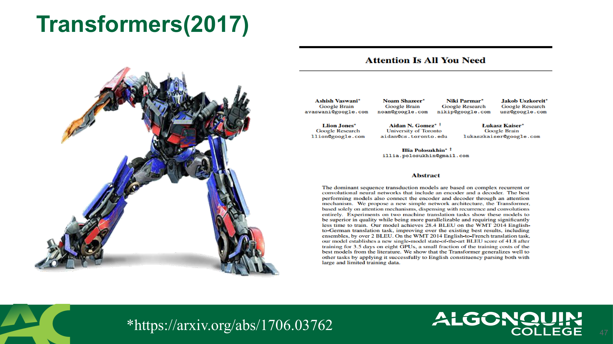

**Transformers (2017):** Title slide. — Transformer（2017年提出）标题页。

Ref: https://arxiv.org/abs/1706.03762

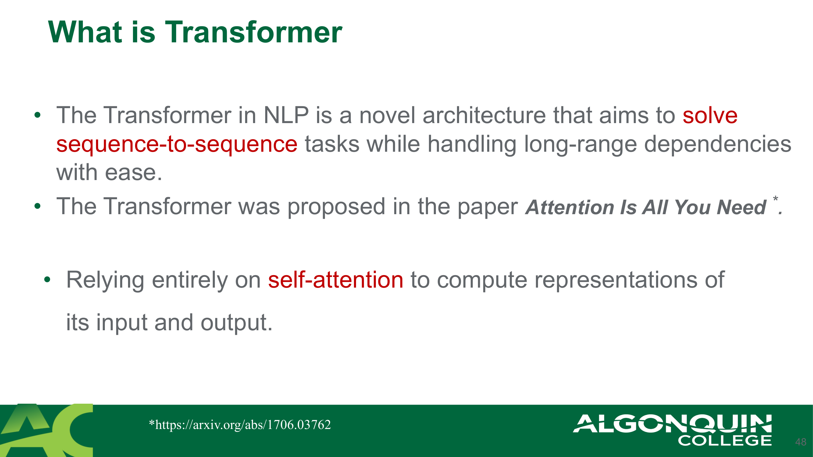

**What is Transformer:** — 什么是Transformer：

- The Transformer in NLP is a novel architecture that aims to **solve sequence-to-sequence** tasks while handling long-range dependencies with ease. — Transformer是一种旨在解决序列到序列任务同时轻松处理长距离依赖的新型架构
- The Transformer was proposed in the paper **_Attention Is All You Need_**. — Transformer在论文*Attention Is All You Need*中提出
- Relying entirely on **self-attention** to compute representations of its input and output. — 完全依赖**自注意力**计算输入输出的表示

Ref: https://arxiv.org/abs/1706.03762

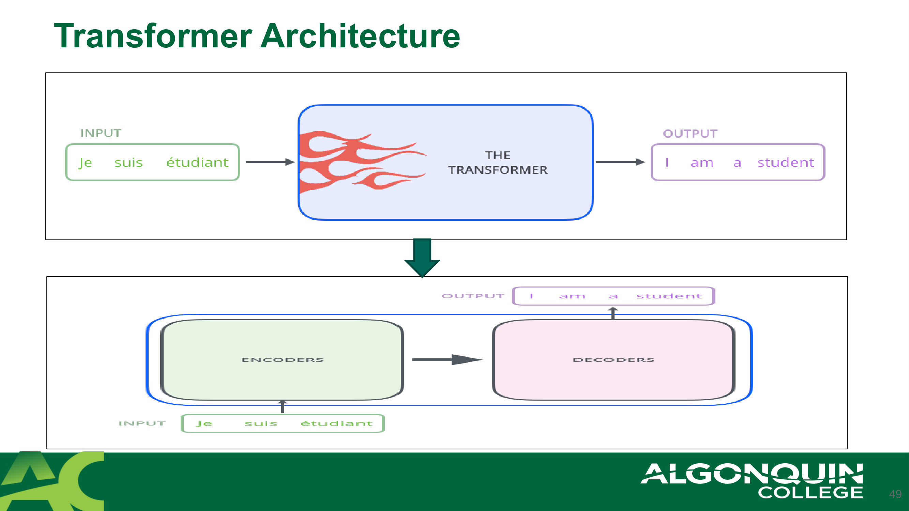

**Transformer Architecture:** Diagram showing the full Transformer architecture with encoder (left) and decoder (right) stacks, multi-head attention, feed-forward networks, and positional encoding. — Transformer完整架构图。

**Transformer架构图：** 展示完整架构，左侧为编码器堆栈，右侧为解码器堆栈，包含多头注意力、前馈网络和位置编码。

> **📝 Notes:**
>
> **📌 What:**
> **(1) Transformer overview (Transformer概述):**
>
> The Transformer (Vaswani et al., 2017) replaces RNN/LSTM entirely with self-attention. It processes ALL positions in parallel (no sequential dependency), making it much faster to train. It still uses encoder-decoder architecture but with stacked self-attention + feed-forward layers instead of recurrence.
>
> > Transformer（Vaswani等，2017）完全用自注意力替代RNN/LSTM。它并行处理所有位置（无顺序依赖），训练速度更快。仍使用编码器-解码器架构，但用堆叠的自注意力+前馈层替代循环。
>
> **🎯 Why:**
> **(1) Why Transformer replaced RNN (为什么Transformer取代了RNN):**
>
> RNNs process tokens sequentially — token 5 must wait for tokens 1-4 to finish. This prevents parallelization on GPUs. Self-attention computes ALL token relationships simultaneously — O(1) sequential steps instead of O(n). This enabled training on massive datasets, leading to GPT, BERT, and all modern LLMs.
>
> > RNN顺序处理token——token 5必须等token 1-4完成。这阻止了GPU上的并行化。自注意力同时计算所有token关系——O(1)顺序步骤而非O(n)。这使大规模数据集上的训练成为可能，催生了GPT、BERT和所有现代LLM。
>
> **💡 Intuition:**
> **(1) Self-attention = every word looks at every other word (自注意力 = 每个词看每个其他词):**
>
> In RNN attention (this lecture), the decoder attends to encoder states. In self-attention, every word in a sentence attends to EVERY OTHER WORD in the same sentence. This means "it" in "The cat sat on the mat because it was tired" can directly look at "cat" regardless of distance — no hidden state bottleneck at all.
>
> > 在RNN注意力（本讲）中，解码器关注编码器状态。在自注意力中，句子中的每个词关注同一句子中的每个其他词。这意味着"The cat sat on the mat because it was tired"中的"it"可以直接看到"cat"，无论距离多远——完全没有隐藏状态瓶颈。
>
> **⚖️ Compare:**
> **(1) Evolution of NLP architectures (NLP架构演进):**
>
> | Era       | Model       | Context       | Parallelizable | Key Limitation |
> | --------- | ----------- | ------------- | -------------- | -------------- |
> | Pre-2013  | N-gram      | n-1 words     | Yes            | No semantics   |
> | 2013-2017 | RNN/LSTM    | All previous  | No             | Sequential     |
> | 2017+     | Transformer | All positions | Yes            | O(n²) memory   |
>
> > | 时代      | 模型        | 上下文     | 可并行 | 关键限制  |
> > | --------- | ----------- | ---------- | ------ | --------- |
> > | 2013前    | N-gram      | n-1个词    | 是     | 无语义    |
> > | 2013-2017 | RNN/LSTM    | 所有前面的 | 否     | 顺序处理  |
> > | 2017+     | Transformer | 所有位置   | 是     | O(n²)内存 |
>
> **📝 Exam:**
> **(1) 概念题 (Conceptual):**
>
> "What is the key innovation of Transformers over RNN-based Seq2Seq?" → Replacing recurrence with self-attention, enabling parallel computation of all positions. The paper title says it all: "Attention Is All You Need."
>
> > "Transformer相对于基于RNN的Seq2Seq的关键创新是什么？" → 用自注意力替代循环，实现所有位置的并行计算。论文标题说明了一切："Attention Is All You Need。"

---

## 8. 问答环节 (Q&A)

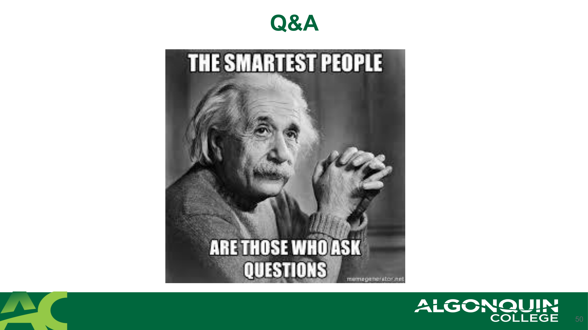

**Q&A** — 问答环节
