# Week 9: 基于 Transformer 的语言模型 (Transformer-Based Language Models)

> Source: `lecture_9_W26.pdf`
> Total slides: 49
> Instructor: Hala Own, Ph.D.

---

## 1. 课程议程与问题背景 (Agenda & Motivation)

### 1.1 课程议程 (Lesson Agenda)

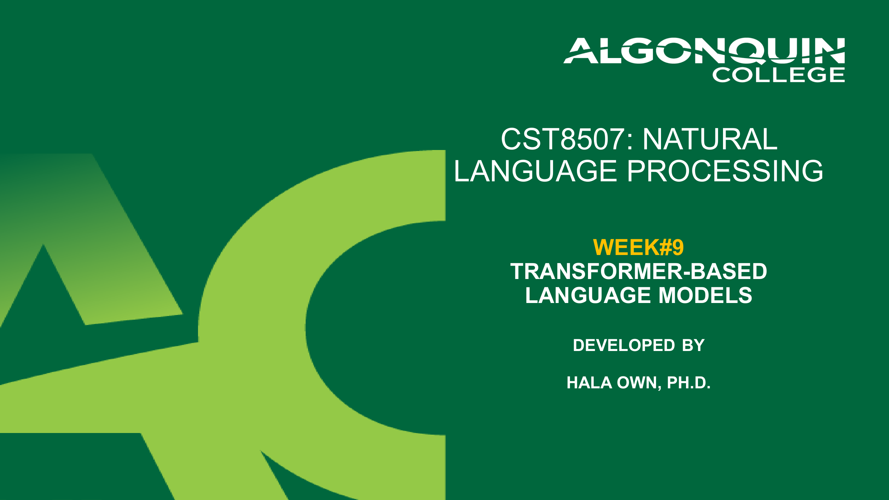

**CST8507: Natural Language Processing — Week #9: Transformer-Based Language Models** — 第9周：基于 Transformer 的语言模型

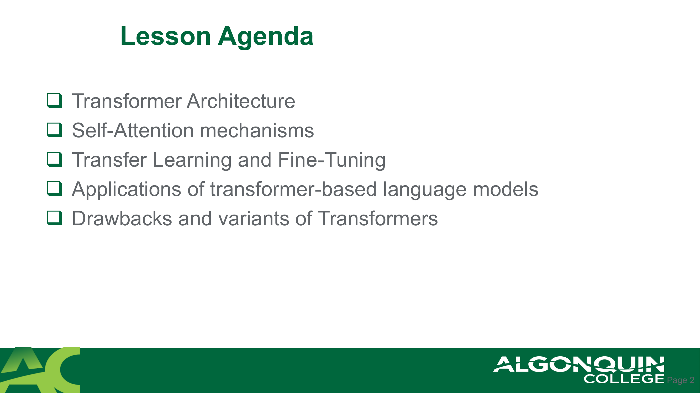

**Lesson Agenda:** — 课程议程：

- ❑ Transformer Architecture — Transformer 架构
- ❑ Self-Attention mechanisms — 自注意力机制
- ❑ Transfer Learning and Fine-Tuning — 迁移学习与微调
- ❑ Applications of transformer-based language models — 基于 Transformer 的语言模型的应用
- ❑ Drawbacks and variants of Transformers — Transformer 的局限与变体

### 1.2 文本表示回顾 (Text Representation Review)

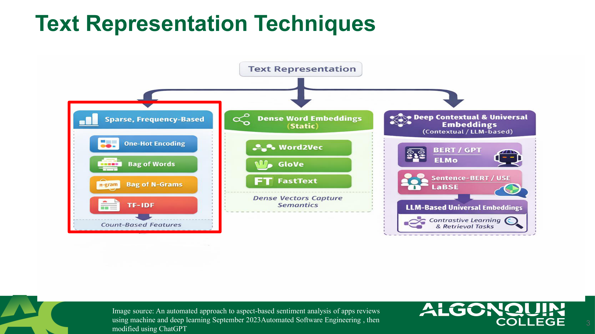

**Text Representation Techniques:** — 文本表示技术：图示回顾文本表示技术从传统方法（如 BoW、TF-IDF）到深度表示（如 word2vec、contextual embeddings）的演进。

Image source: An automated approach to aspect-based sentiment analysis of apps reviews using machine and deep learning, September 2023, Automated Software Engineering, then modified using ChatGPT

### 1.3 静态词嵌入的局限 (Problems with Static Embeddings)

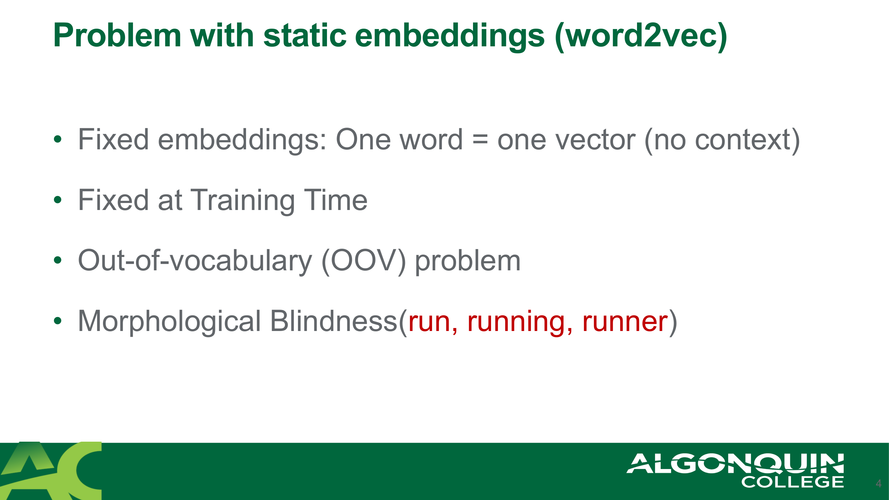

**Problem with static embeddings (word2vec):** — 静态词嵌入（word2vec）的问题：

- **Fixed embeddings:** One word = one vector (no context) — **固定嵌入：** 一个词只有一个固定向量（无上下文信息）
- **Fixed at Training Time** — **训练时固定：** 训练完成后向量不再变化
- **Out-of-vocabulary (OOV) problem** — **未登录词（OOV）问题：** 训练集中未出现的词无法表示
- **Morphological Blindness** (run, running, runner) — **词形盲：** 无法区分同一词根的不同形态（如 run/running/runner）

### 1.4 上下文化嵌入 (Contextual Embeddings)

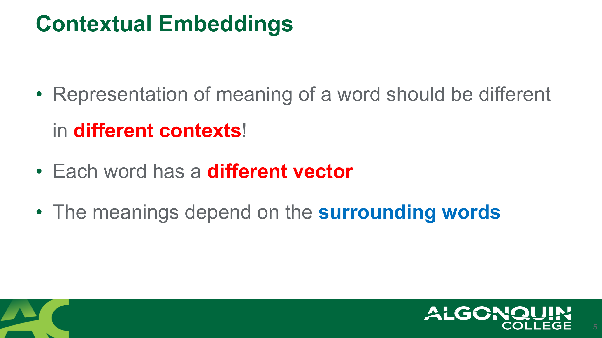

**Contextual Embeddings:** — 上下文化嵌入：

- Representation of meaning of a word should be different in different contexts! — 一个词的意义表示在不同上下文中应该不同！
- Each word has a different vector — 每个词在不同语境中有不同的向量
- The meanings depend on the surrounding words — 词义由周围的词共同决定

> **📝 Notes:**
>
> **承接**: 本节作为开篇，回顾了文本表示技术的演进——从静态词嵌入（word2vec）的局限到上下文化嵌入的需求；这一"静态→动态"的演进动机将为下一节「自注意力机制」的引入提供核心问题背景。

---

## 2. 自注意力机制 (Self-Attention Mechanism)

### 2.1 自注意力的动机 (Motivations for Self-Attention)

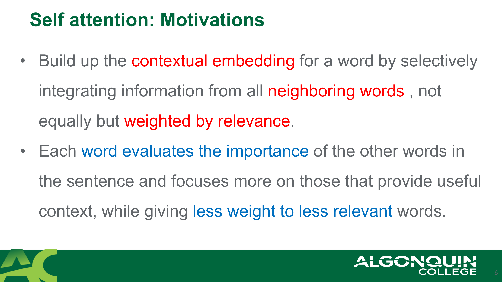

**Self attention: Motivations:** — 自注意力：动机

- Build up the contextual embedding for a word by selectively integrating information from all neighboring words, not equally but weighted by relevance. — 通过从所有邻近词中有选择地整合信息来构建一个词的上下文化嵌入，不是均等地整合，而是按相关性加权。
- Each word evaluates the importance of the other words in the sentence and focuses more on those that provide useful context, while giving less weight to less relevant words. — 每个词评估句中其他词的重要性，更关注那些提供有用上下文的词，同时降低不相关词的权重。

### 2.2 什么是自注意力 (What is Self-Attention)

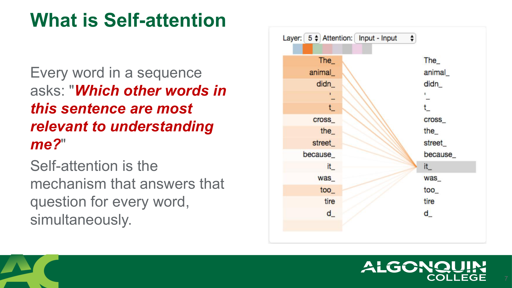

**What is Self-attention:** — 什么是自注意力：

- Every word in a sequence asks: "Which other words in this sentence are most relevant to understanding me?" — 序列中的每个词都会问："在这个句子里，哪些其他词对理解我最有帮助？"
- Self-attention is the mechanism that answers that question for every word, simultaneously. — 自注意力就是同时为每个词回答这个问题的机制。

### 2.3 为什么需要多头注意力 (Why Multi-Head Attention?)

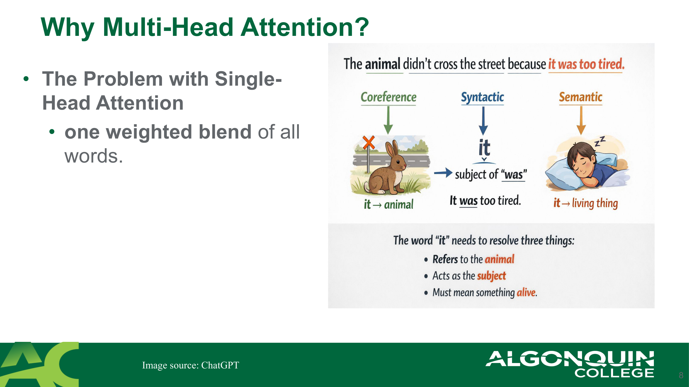

**Why Multi-Head Attention?** — 为什么需要多头注意力？

- **The Problem with Single-Head Attention:** one weighted blend of all words. — **单头注意力的问题：** 只能产生一份所有词的加权混合，表达能力有限。

Image source: ChatGPT

> **📝 Notes:**
>
> **承接**: 上一节引出了静态词嵌入的局限和上下文化表示的需求；本节详解自注意力机制如何解决这一需求——通过让每个词评估句中其他词的相关性来构建上下文化向量，以及多头注意力如何增强表达能力；这些核心概念为下一节完整的 Transformer 架构介绍奠定基础。

---

## 3. Transformer 总体结构 (Transformer Architecture Overview)

### 3.1 Transformer 论文与定义 (Origin & Definition)

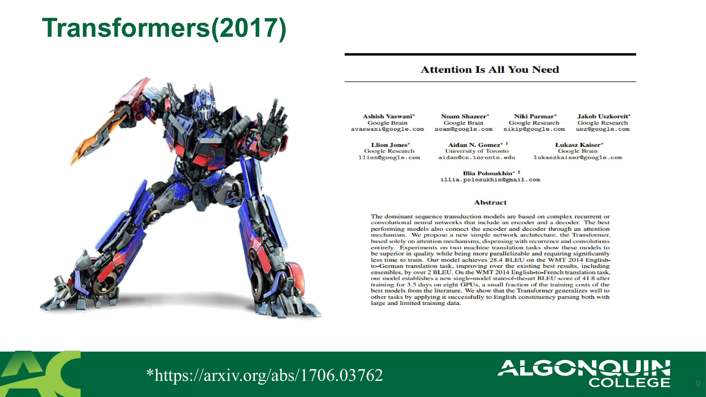

**Transformers (2017):** — Transformer（2017年提出）

Ref: https://arxiv.org/abs/1706.03762

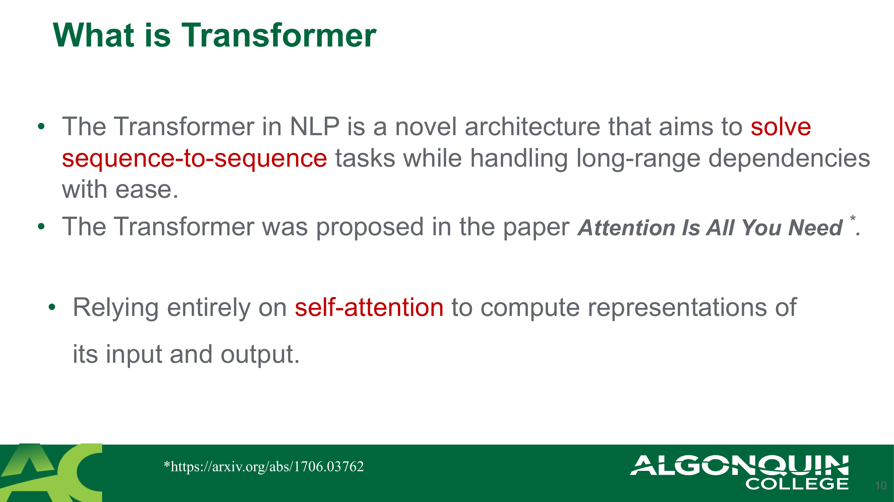

**What is Transformer:** — 什么是 Transformer：

- The Transformer in NLP is a novel architecture that aims to solve sequence-to-sequence tasks while handling long-range dependencies with ease. — Transformer 是一种新颖的序列到序列架构，旨在轻松处理长距离依赖关系。
- The Transformer was proposed in the paper *Attention Is All You Need*. — Transformer 在论文《Attention Is All You Need》中被提出。
- Relying entirely on self-attention to compute representations of its input and output. — 完全依赖自注意力来计算其输入和输出的表示。

Ref: https://arxiv.org/abs/1706.03762

### 3.2 总体架构图 (Architecture Diagram)

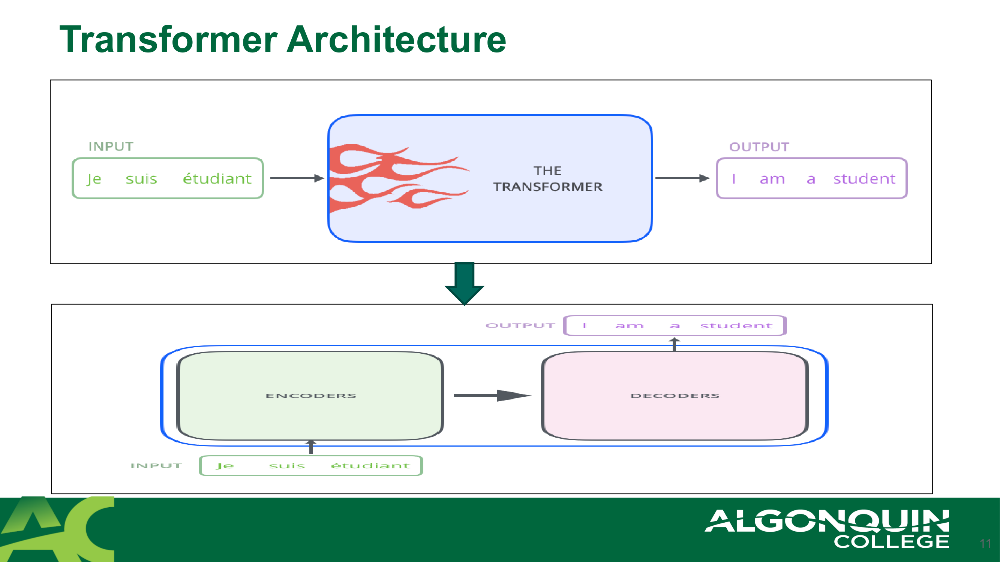

**Transformer Architecture:** — Transformer 架构：整体结构概览图。

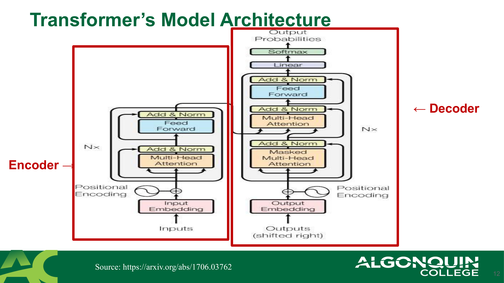

**Transformer's Model Architecture:** — Transformer 模型架构：

- ← Decoder — ← 解码器
- Encoder → — 编码器 →

Source: https://arxiv.org/abs/1706.03762

### 3.3 编码器剖析 (Encoder Anatomy)

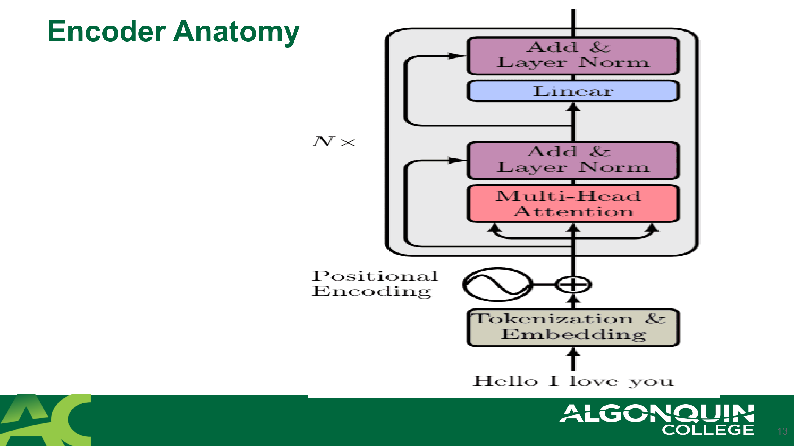

**Encoder Anatomy:** — 编码器剖析：编码器的基本模块包括：

- Multi-head self-attention — 多头自注意力
- Feed-forward layer — 前馈层
- Residual connection — 残差连接
- Layer normalization — 层归一化

> **📝 Notes:**
>
> **承接**: 上一节介绍了自注意力和多头注意力的基本原理；本节给出 Transformer 的完整架构——论文来源、Encoder-Decoder 结构、编码器内部模块组成；理解整体架构是下一节深入位置编码细节的前提。

---

## 4. 位置编码 (Positional Encoding)

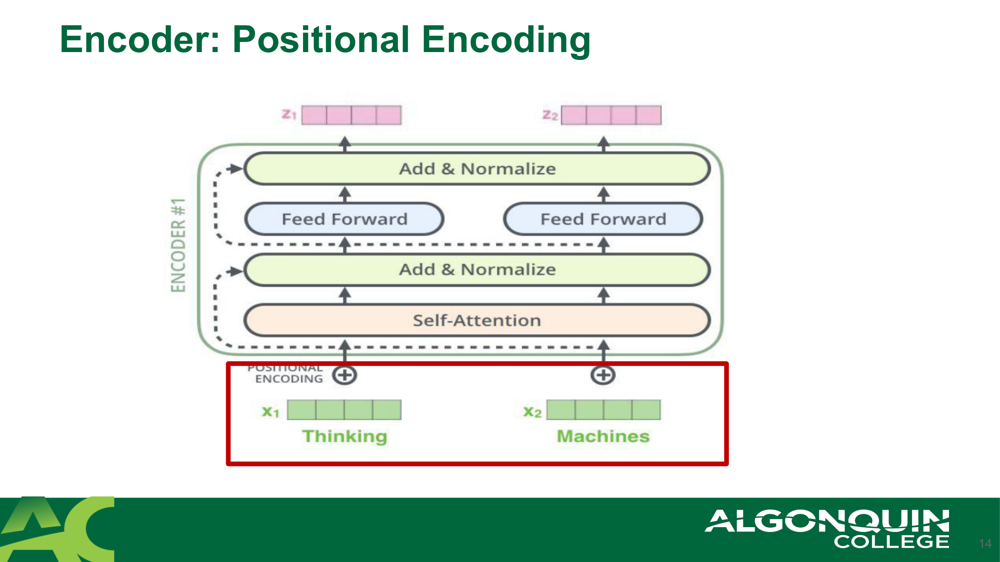

**Encoder: Positional Encoding:** — 编码器：位置编码。因为 Transformer 不依赖循环结构，词序信息必须显式加入输入表示。

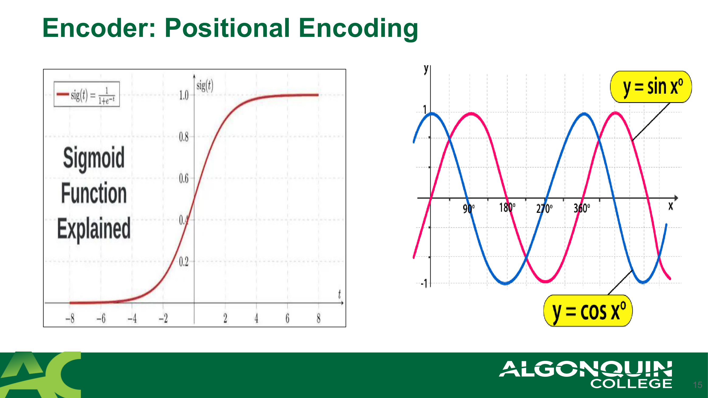

**Encoder: Positional Encoding (续):** — 编码器：位置编码（续）。位置编码方案的可视化说明。

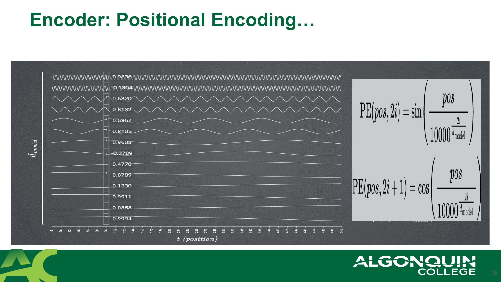

**Encoder: Positional Encoding (续):** — 编码器：位置编码（续）。正弦/余弦位置编码的数学定义：

- `PE(pos, 2i) = sin(pos / 10000^(2i/d_model))`
- `PE(pos, 2i+1) = cos(pos / 10000^(2i/d_model))`

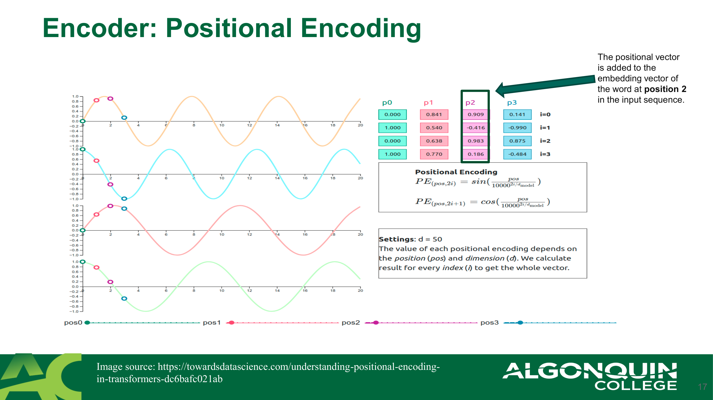

**Encoder: Positional Encoding:** — 编码器：位置编码

- The positional vector is added to the embedding vector of the word at position in the input sequence. — 位置向量与输入序列中对应位置词的嵌入向量相加。

Ref: https://towardsdatascience.com/understanding-positional-encoding-in-transformers-dc6bafc021ab

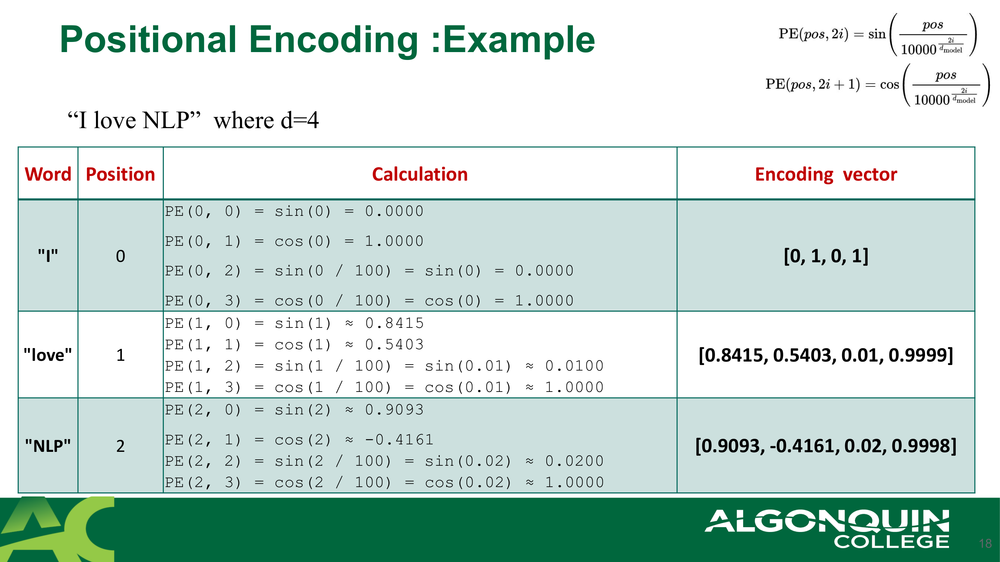

**Positional Encoding: Example** — 位置编码示例

"I love NLP" where d=4（其中 d=4）

| 词 (Word) | 位置 (Position) | 计算过程 (Calculation) | 编码向量 (Encoding vector) |
| ---------- | --------------- | ------------------------------------------------------------------------------------------------------------ | ------------------------------------ |
| "I"    | 0        | PE(0,0)=sin(0)=0.0000; PE(0,1)=cos(0)=1.0000; PE(0,2)=sin(0/100)=0.0000; PE(0,3)=cos(0/100)=1.0000        | [0, 1, 0, 1]                        |
| "love" | 1        | PE(1,0)=sin(1)≈0.8415; PE(1,1)=cos(1)≈0.5403; PE(1,2)=sin(1/100)≈0.0100; PE(1,3)=cos(1/100)≈1.0000        | [0.8415, 0.5403, 0.01, 0.9999]      |
| "NLP"  | 2        | PE(2,0)=sin(2)≈0.9093; PE(2,1)=cos(2)≈-0.4161; PE(2,2)=sin(2/100)≈0.0200; PE(2,3)=cos(2/100)≈1.0000       | [0.9093, -0.4161, 0.02, 0.9998]     |

> **📝 Notes:**
>
> **承接**: 上一节介绍了 Transformer 的整体架构；本节详解位置编码——Transformer 不使用循环机制，必须通过 sin/cos 函数显式注入词序信息，并通过 "I love NLP" 实例演示计算过程；理解位置编码是下一节学习编码器自注意力计算流程的前提。

---

## 5. 编码器中的自注意力计算 (Self-Attention Computation in the Encoder)

### 5.1 编码器自注意力 (Encoder: Self Attention)

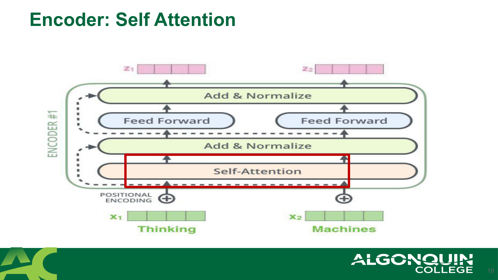

**Encoder: Self Attention:** — 编码器：自注意力。编码器内部每个词都能直接看见整句中所有其他词。

### 5.2 注意力工作流 (Attention Mechanism Workflow)

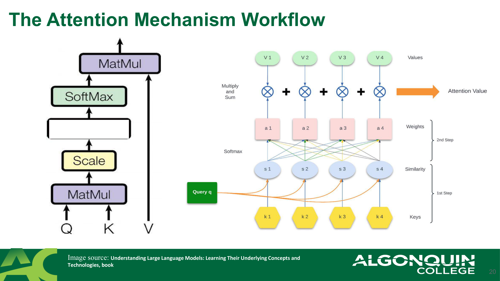

**The Attention Mechanism Workflow:** — 注意力机制工作流程：该页用流程图说明注意力从打分到加权汇总的全过程。

Image source: Understanding Large Language Models: Learning Their Underlying Concepts and Technologies, book

### 5.3 自注意力详解 (Self-Attention Detail)

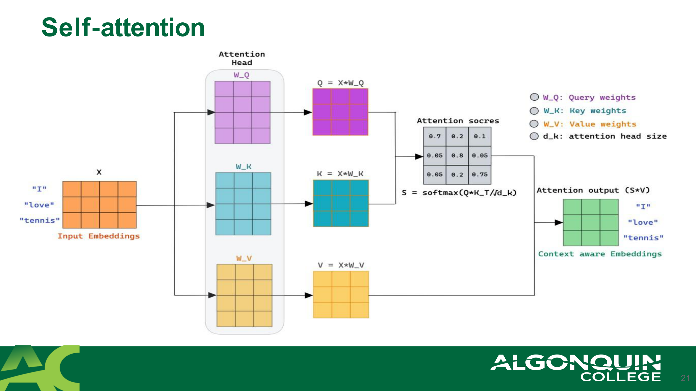

**Self-attention:** — 自注意力：核心是把一个词的表示更新为"自己 + 与其他词的相关信息"的加权组合。

### 5.4 缩放点积的动机 (Scale Dot-Product Motivation)

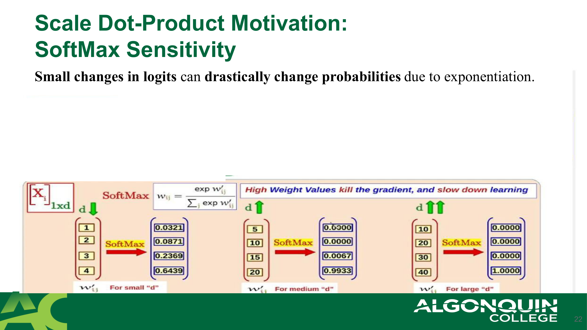

**SoftMax Sensitivity:** — Softmax 敏感性：

- Scale Dot-Product Motivation: Small changes in logits can drastically change probabilities due to exponentiation. — 缩放点积的动机：由于指数运算，logits 的微小变化可能导致概率的剧烈变化。

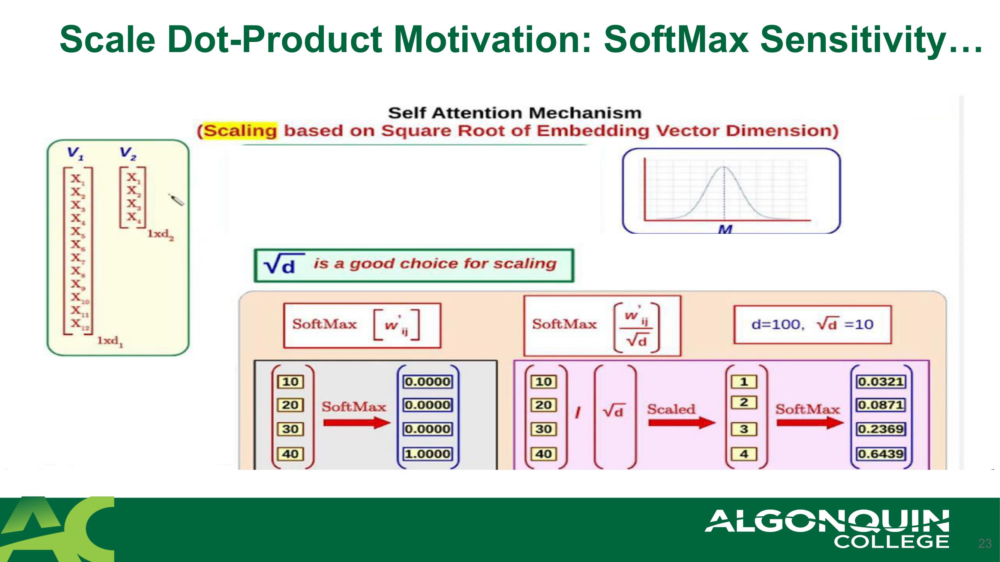

**Scale Dot-Product Motivation: SoftMax Sensitivity (续):** — 缩放点积动机：Softmax 敏感性（续）。进一步说明 softmax 对大数值的敏感特性。

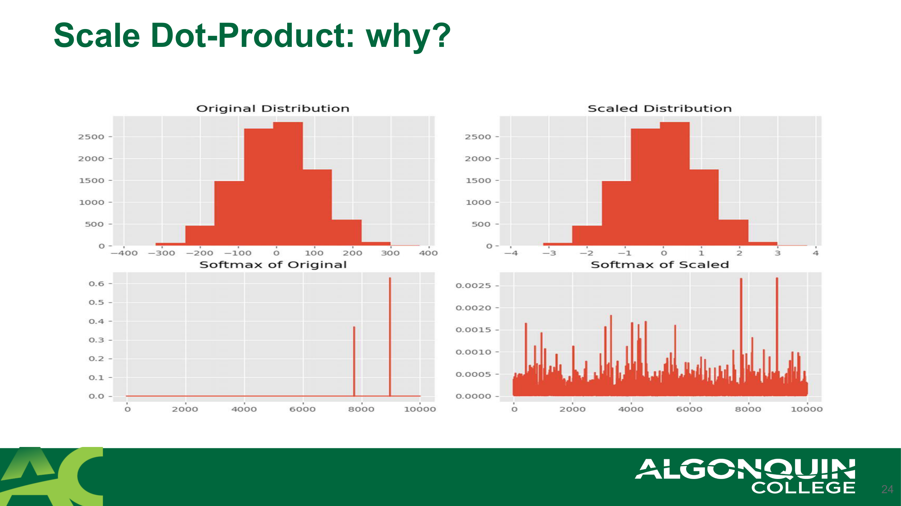

**Scale Dot-Product: why?** — 缩放点积：为什么需要？解释为什么需要除以 √d_k 来稳定梯度——当维度 d 较大时，点积结果的方差也变大，导致 softmax 分布过于尖锐（接近 one-hot），梯度消失。

### 5.5 缩放点积注意力实例 (Scaled Dot-Product Attention Example)

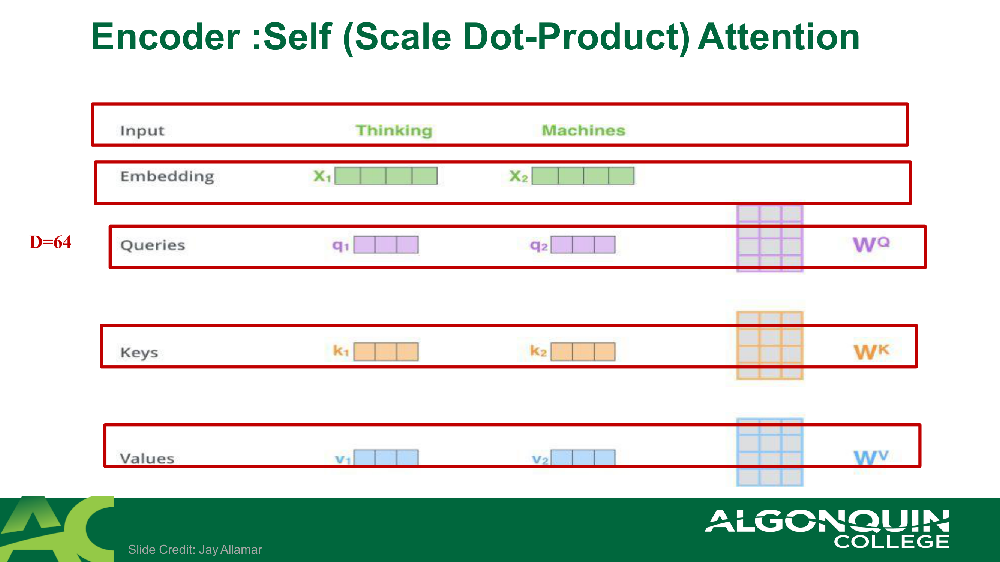

**Encoder: Self (Scale Dot-Product) Attention:** — 编码器：自（缩放点积）注意力

- D=64 — 维度 D=64

Slide Credit: Jay Alammar

### 5.6 自注意力计算步骤 (Self-Attention Computation Steps)

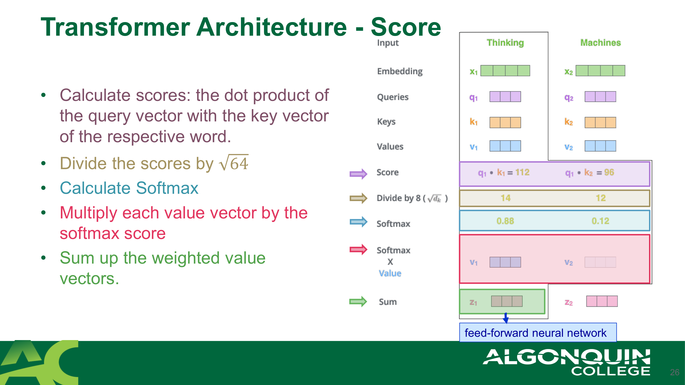

**Transformer Architecture - Score:** — Transformer 架构 - 打分计算：

1. Calculate scores: the dot product of the query vector with the key vector of the respective word. — 计算分数：将查询向量（Query）与对应词的键向量（Key）做点积。
2. Divide the scores by 64 — 将分数除以 64（即 √d_k，用于缩放）
3. Calculate Softmax — 计算 Softmax（得到注意力权重分布）
4. Multiply each value vector by the softmax score — 将每个值向量（Value）乘以 softmax 得分
5. Sum up the weighted value vectors. — 将加权后的值向量求和

→ feed-forward neural network — → 前馈神经网络

### 5.7 多头注意力 (Multi-Headed Attention)

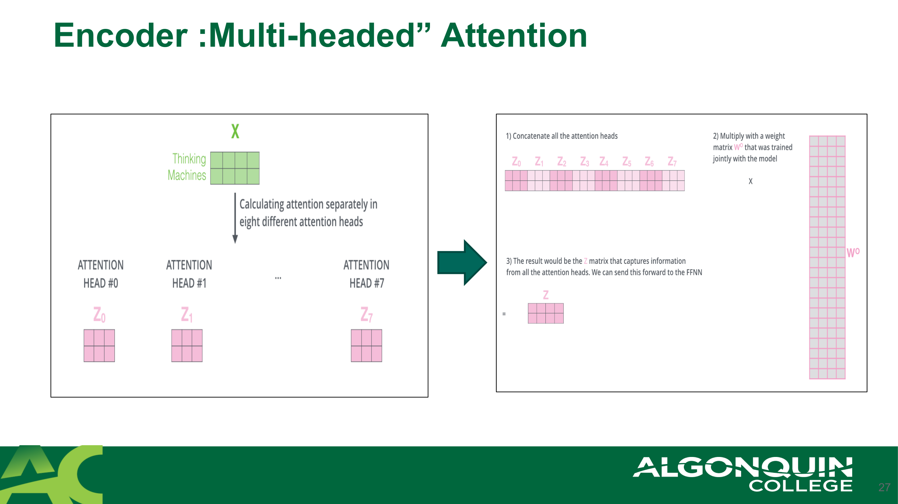

**Encoder: Multi-headed Attention:** — 编码器：多头注意力。多头注意力让模型从不同子空间、不同关系模式上并行建模，每个头关注不同类型的关系。

> **📝 Notes:**
>
> **承接**: 上一节介绍了位置编码的原理与计算方法；本节详解编码器中自注意力的完整计算流程——从 Q·K 点积打分到缩放、softmax 归一化、加权求和，并引入多头注意力的并行机制；这些计算细节为下一节理解前馈层和残差连接提供基础。

---

## 6. 前馈层、残差连接与归一化 (FFN, Residual Connections & Add & Norm)

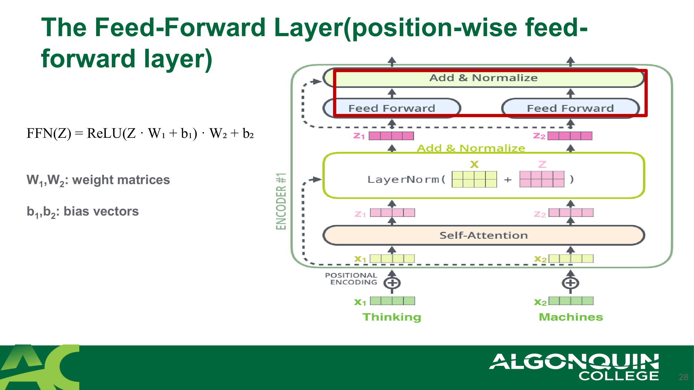

**The Feed-Forward Layer (position-wise feed-forward layer):** — 前馈层（逐位置前馈层）：

`FFN(Z) = ReLU(Z · W₁ + b₁) · W₂ + b₂`

- W₁, W₂: weight matrices — W₁、W₂：权重矩阵
- b₁, b₂: bias vectors — b₁、b₂：偏置向量

该层对每个位置独立地做非线性变换，提高表示能力。

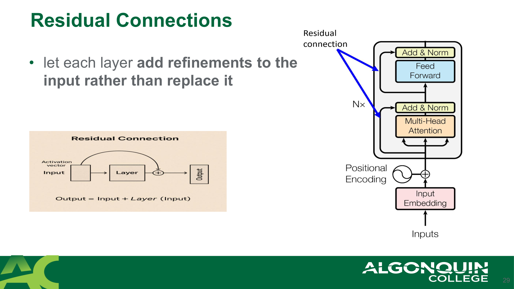

**Residual Connections:** — 残差连接：

- Let each layer add refinements to the input rather than replace it — 让每层对输入做增量修正，而不是完全替换输入表示

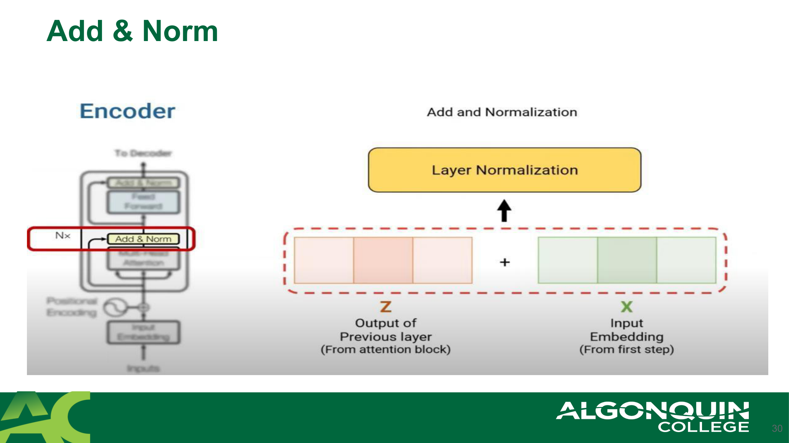

**Add & Norm:** — 相加与归一化：残差相加后接 Layer Normalization（层归一化），有助于训练稳定、加速收敛。

> **📝 Notes:**
>
> **承接**: 上一节完成了自注意力的完整计算流程；本节介绍编码器中的其他关键组件——位置级前馈层（FFN）用于非线性变换，残差连接用于稳定训练，Add & Norm 用于归一化；这些组件构成完整的编码器模块，为下一节理解并行计算优势打下基础。

---

## 7. 并行计算优势 (Parallel Processing)

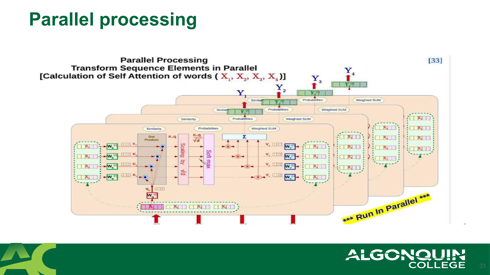

**Parallel processing:** — 并行处理：Transformer 相比 RNN 的核心优势之一。

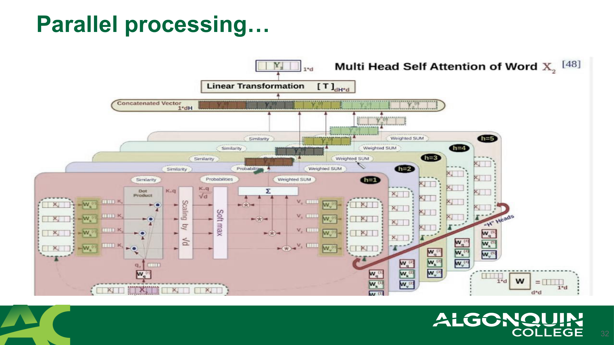

**Parallel processing (续):** — 并行处理（续）：进一步对比串行处理（RNN 逐时间步）与并行处理（Transformer 一次性）。

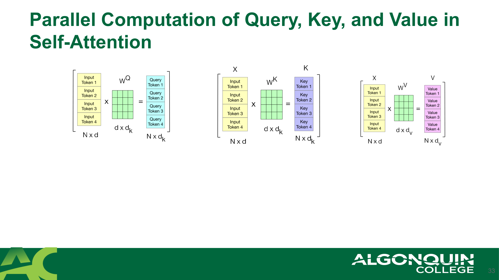

**Parallel Computation of Query, Key, and Value in Self-Attention:** — 自注意力中 Query、Key 和 Value 的并行计算：

- 整句的 Query、Key、Value 可以一次性并行计算，而不像 RNN 那样必须按时间步顺序执行。
- The entire sentence's Q, K, V matrices can be computed in a single parallel operation, unlike RNNs which must process sequentially step-by-step.

> **📝 Notes:**
>
> **承接**: 上一节介绍了编码器的 FFN、残差连接和归一化；本节强调 Transformer 最大的工程优势——并行计算：Q、K、V 矩阵对整句一次性计算，突破了 RNN 的顺序瓶颈；理解并行化对于下一节学习解码器的"不能并行"（masked attention）形成对照。

---

## 8. 解码器、掩码与交叉注意力 (Decoder, Masking & Cross-Attention)

### 8.1 解码器概述 (Decoder Overview)

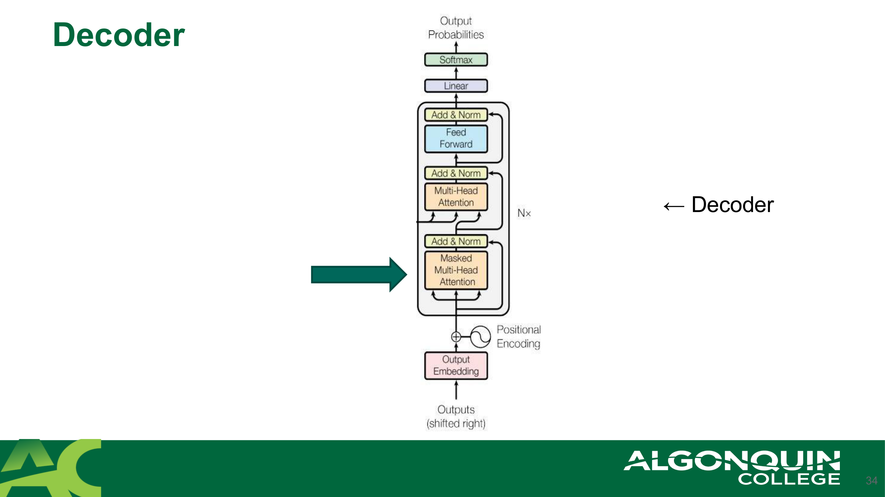

**Decoder:** — 解码器：负责自回归（autoregressive）地逐步产生输出序列。

### 8.2 掩码自注意力 (Masking the Future)

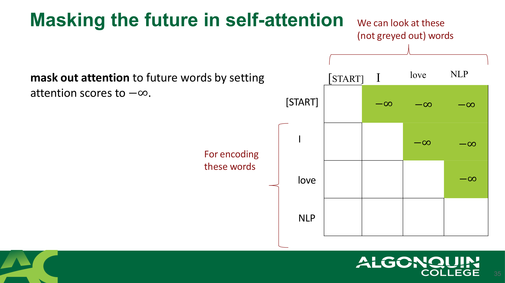

**Masking the future in self-attention:** — 在自注意力中屏蔽未来信息：

- We can look at these (not greyed out) words — 我们只能看到这些（未灰色显示的）词
- Mask out attention to future words by setting attention scores to −∞ — 通过将未来词的注意力分数设为 −∞ 来屏蔽

解码器中的 masked self-attention 会屏蔽未来词，确保当前位置只能看到已经生成的历史词，不能"偷看"后面的正确答案。

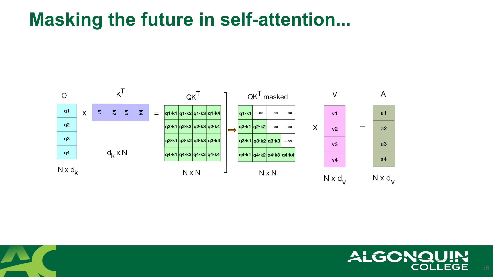

**Masking the future in self-attention (续):** — 屏蔽未来信息（续）：进一步的掩码机制可视化。

### 8.3 交叉注意力 (Cross-Attention)

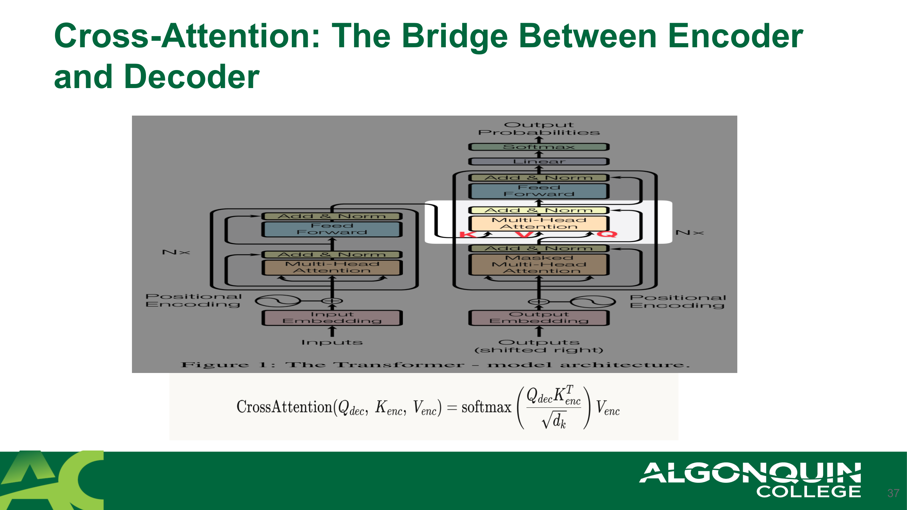

**Cross-Attention: The Bridge Between Encoder and Decoder:** — 交叉注意力：编码器与解码器之间的桥梁。

交叉注意力让解码器在生成每个词时读取编码器的输出，从源序列中提取当前最相关的信息。Key 和 Value 来自编码器，Query 来自解码器。

### 8.4 编码器-解码器堆叠工作方式 (Encoder-Decoder Stack)

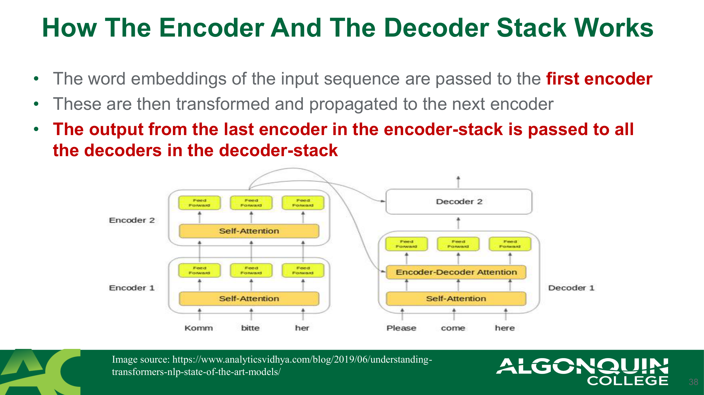

**How The Encoder And The Decoder Stack Works:** — 编码器和解码器堆叠的工作方式：

- The word embeddings of the input sequence are passed to the first encoder — 输入序列的词嵌入被传递给第一个编码器
- These are then transformed and propagated to the next encoder — 然后被变换并传播到下一个编码器
- The output from the last encoder in the encoder-stack is passed to all the decoders in the decoder-stack — 编码器堆叠中最后一个编码器的输出被传递给解码器堆叠中的所有解码器

Ref: https://www.analyticsvidhya.com/blog/2019/06/understanding-transformers-nlp-state-of-the-art-models/

### 8.5 最终 Softmax 层 (Final SoftMax Layer)

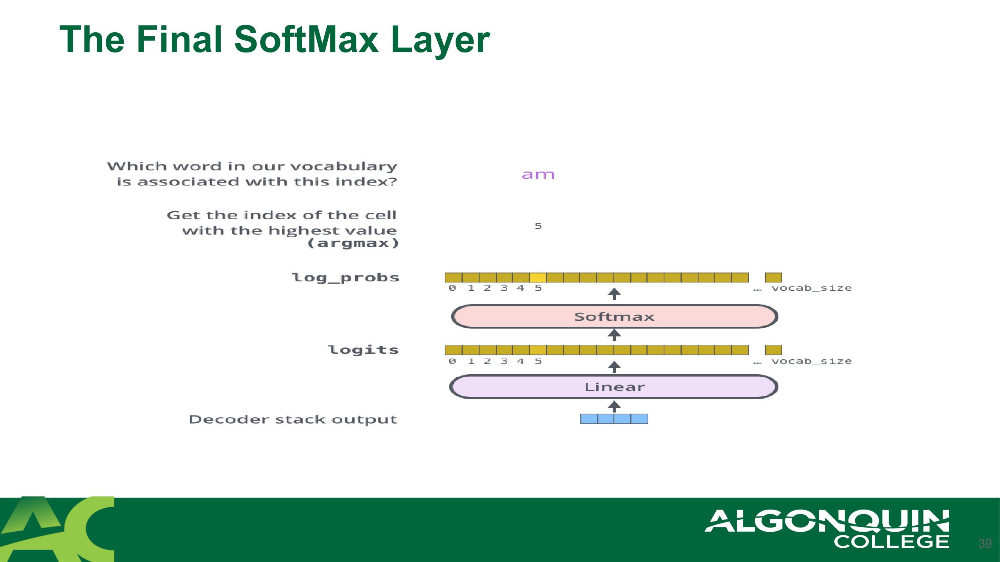

**The Final SoftMax Layer:** — 最终 Softmax 层：最后通过 softmax 在整个词表上输出下一个词的概率分布，选择概率最高的词作为输出。

> **📝 Notes:**
>
> **承接**: 上一节介绍了编码器的并行计算能力；本节详解解码器——masked self-attention 屏蔽未来信息实现自回归生成，cross-attention 桥接编码器输出，以及最终 softmax 输出词概率；编码器+解码器构成完整 Transformer，为下一节 Hugging Face 生态与应用提供模型基础。

---

## 9. Hugging Face 生态与应用 (Ecosystem & Applications)

### 9.1 Hugging Face 生态 (Hugging Face Ecosystem)

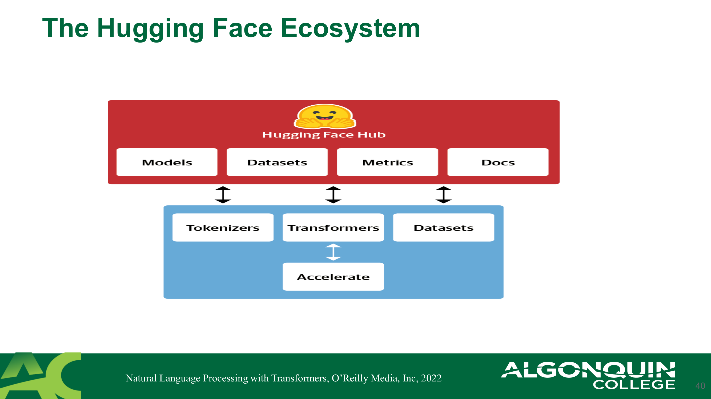

**The Hugging Face Ecosystem:** — Hugging Face 生态系统：介绍 Transformer 时代最常用的开源工具生态。

Source: Natural Language Processing with Transformers, O'Reilly Media, Inc, 2022


**The Hugging Face Hub:** — Hugging Face Hub：模型、数据集和演示代码的共享平台，提供一站式的预训练模型下载与部署。

Source: Natural Language Processing with Transformers, O'Reilly Media, Inc, 2022

### 9.2 文本分类 (Text Classification)

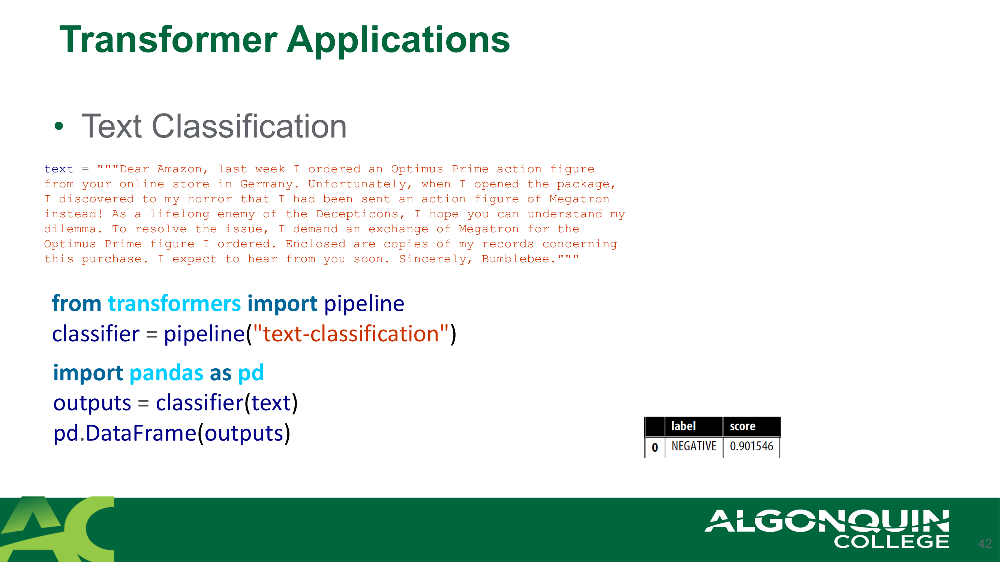

**Transformer Applications — Text Classification:** — Transformer 应用 — 文本分类：

```python
text = """Dear Amazon, last week I ordered an Optimus Prime action figure
from your online store in Germany. Unfortunately, when I opened the package,
I discovered to my horror that I had been sent an action figure of Megatron
instead! As a lifelong enemy of the Decepticons, I hope you can understand my
dilemma. To resolve the issue, I demand an exchange of Megatron for the
Optimus Prime figure I ordered. Enclosed are copies of my records concerning
this purchase. I expect to hear from you soon. Sincerely, Bumblebee."""

from transformers import pipeline
classifier = pipeline("text-classification")
import pandas as pd
outputs = classifier(text)
pd.DataFrame(outputs)
```

### 9.3 命名实体识别 (Named Entity Recognition)

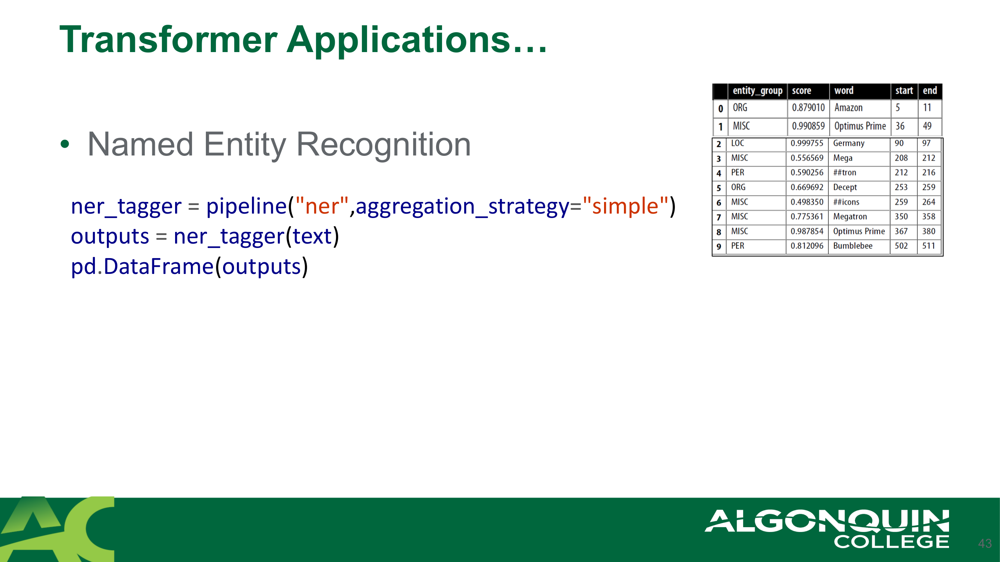

**Transformer Applications — Named Entity Recognition:** — Transformer 应用 — 命名实体识别：

```python
ner_tagger = pipeline("ner", aggregation_strategy="simple")
outputs = ner_tagger(text)
pd.DataFrame(outputs)
```

### 9.4 问答 (Question Answering)

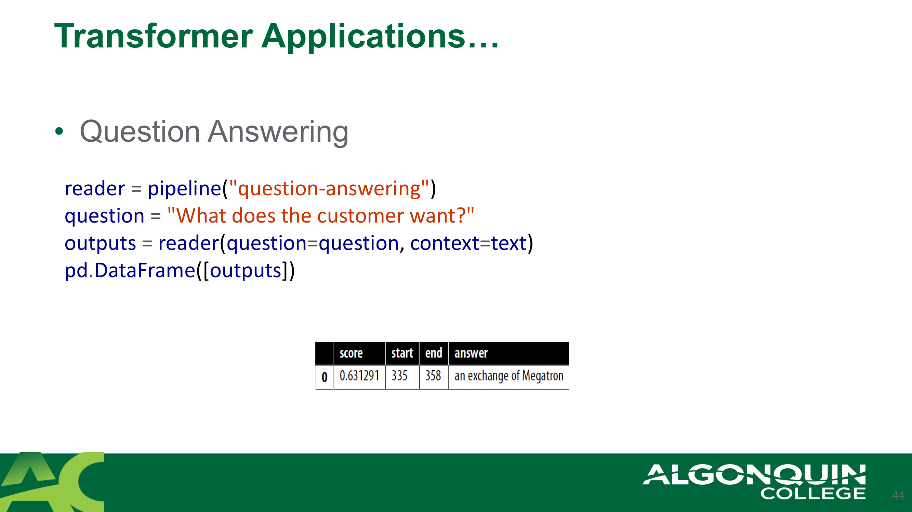

**Transformer Applications — Question Answering:** — Transformer 应用 — 问答：

```python
reader = pipeline("question-answering")
question = "What does the customer want?"
outputs = reader(question=question, context=text)
pd.DataFrame([outputs])
```

### 9.5 文本摘要 (Summarization)

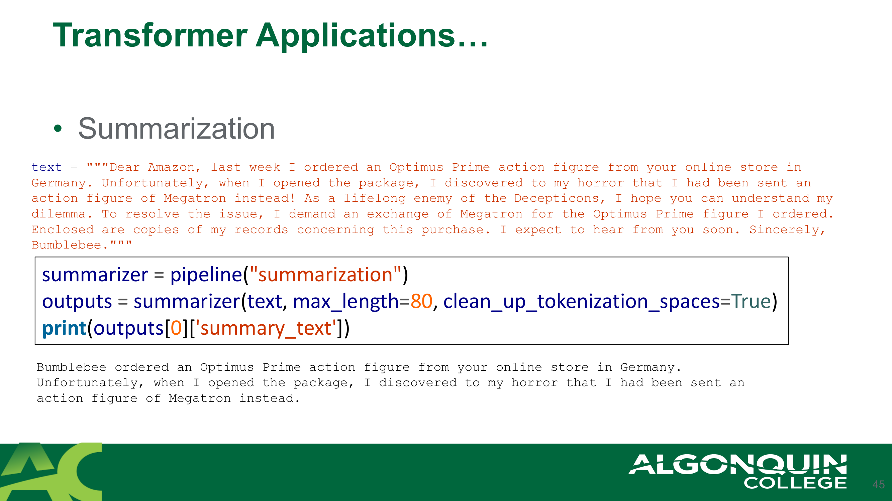

**Transformer Applications — Summarization:** — Transformer 应用 — 文本摘要：

```python
text = """Dear Amazon, last week I ordered an Optimus Prime action figure from your online store in
Germany. Unfortunately, when I opened the package, I discovered to my horror that I had been sent an
action figure of Megatron instead! As a lifelong enemy of the Decepticons, I hope you can understand my
dilemma. To resolve the issue, I demand an exchange of Megatron for the Optimus Prime figure I ordered.
Enclosed are copies of my records concerning this purchase. I expect to hear from you soon. Sincerely,
Bumblebee."""

summarizer = pipeline("summarization")
outputs = summarizer(text, max_length=80, clean_up_tokenization_spaces=True)
print(outputs[0]['summary_text'])
```

Output — 输出: `Bumblebee ordered an Optimus Prime action figure from your online store in Germany. Unfortunately, when I opened the package, I discovered to my horror that I had been sent an action figure of Megatron instead.`

### 9.6 Transformer 家族分支 (Transformer Tree of Life)

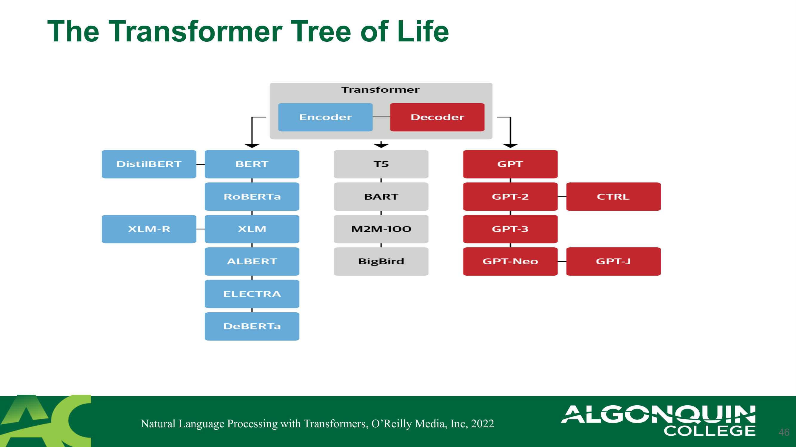

**The Transformer Tree of Life:** — Transformer 生命之树：展示 Transformer 系列模型家族和后续分支发展，包括 Encoder-only（如 BERT）、Decoder-only（如 GPT）、Encoder-Decoder（如 T5）三大分支。

Source: Natural Language Processing with Transformers, O'Reilly Media, Inc, 2022

> **📝 Notes:**
>
> **承接**: 上一节完成了 Transformer 编码器-解码器架构的全部细节；本节展示 Hugging Face 生态如何让 Transformer 落地——通过 `pipeline()` API 只需数行代码即可完成文本分类、NER、QA、摘要等任务，并通过 Transformer 家族树展示模型演化分支；这些应用场景为下一节讨论 Transformer 的局限性和挑战提供现实基础。

---

## 10. 局限与总结 (Challenges & Summary)

### 10.1 Transformer 面临的挑战 (Challenges with Transformers)

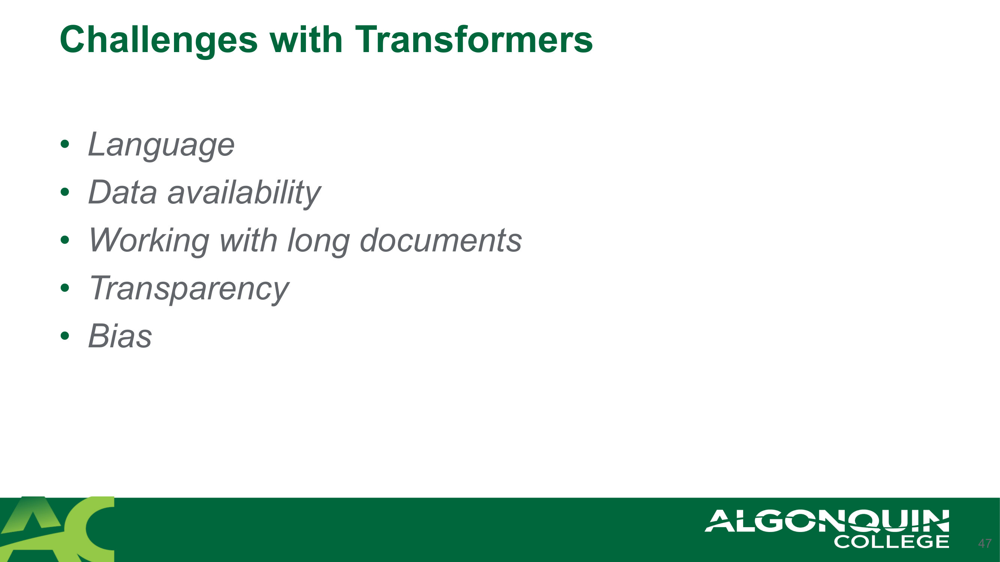

**Challenges with Transformers:** — Transformer 面临的挑战：

- **Language** — **语言：** 语言覆盖不均衡，低资源语言的预训练数据不足，跨语言迁移效果有限
- **Data availability** — **数据可用性：** 需要大量高质量训练数据，数据获取和标注成本高
- **Working with long documents** — **长文档处理：** 自注意力的计算复杂度为 O(n²)，长文档处理面临内存和速度瓶颈
- **Transparency** — **透明度：** 模型可解释性有限，难以理解模型做出特定决策的原因
- **Bias** — **偏见：** 容易继承训练数据中的偏差（性别、种族等），可能产生不公平的输出

### 10.2 课程总结 (Summary)

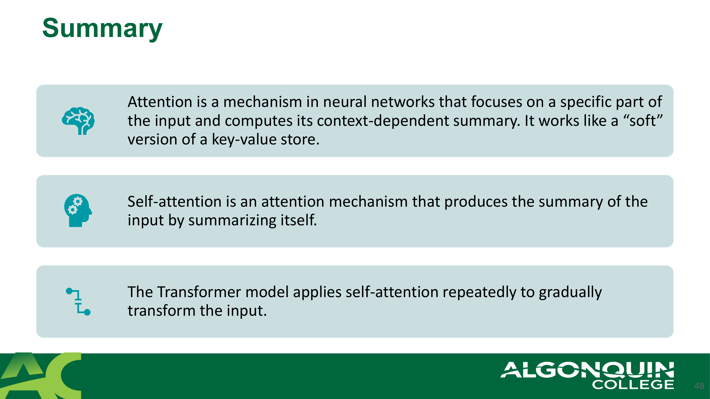

**Summary:** — 总结：

- Attention is a mechanism in neural networks that focuses on a specific part of the input and computes its context-dependent summary. It works like a "soft" version of a key-value store. — 注意力是神经网络中的一种机制，聚焦于输入的特定部分并计算其上下文相关的摘要。它类似于"软性"的键值存储。
- Self-attention is an attention mechanism that produces the summary of the input by summarizing itself. — 自注意力是一种通过对自身进行总结来生成输入摘要的注意力机制。
- The Transformer model applies self-attention repeatedly to gradually transform the input. — Transformer 模型通过反复应用自注意力来逐步变换输入表示。

> **📝 Notes:**
>
> **承接**: 前面各节完成了从静态词嵌入的局限到 Transformer 完整架构（编码器+解码器）再到实际应用（Hugging Face pipeline）的全流程；本节概括 Transformer 面临的五大挑战并总结核心要点——注意力是"软键值存储"，自注意力是"对自身的总结"，Transformer 通过反复应用自注意力逐步变换表示。

---

## 11. 问答环节 (Q&A)

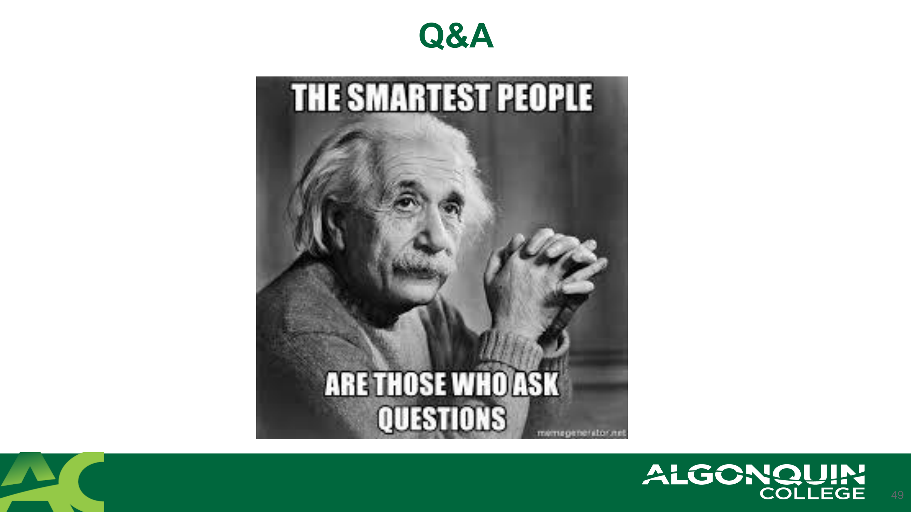

- Q&A — 问答环节
