# Week 10: BERT 与问答系统简介 (BERT & Introduction to Question Answering)

> Source: `lecture_10_W26.pdf`
> Total slides: 60
> Instructor: Hala Own, Ph.D.

---

## 1. 课程议程 (Lesson Agenda)

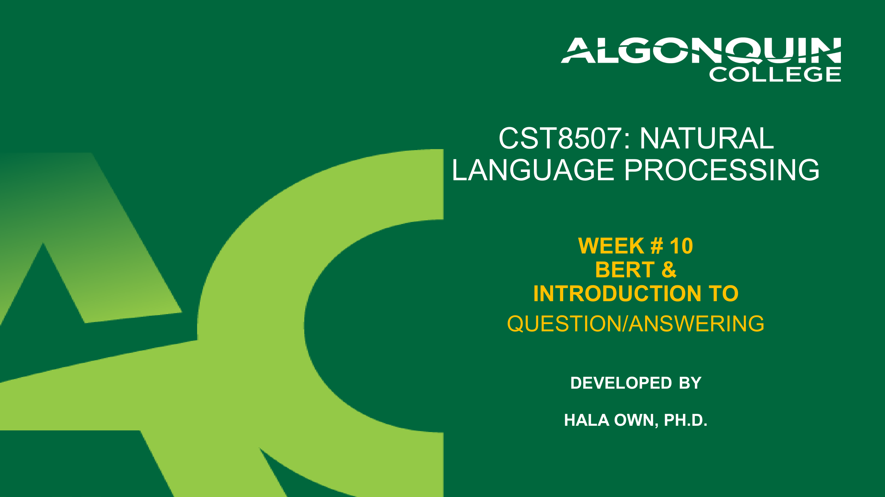

- CST8507: Natural Language Processing — Week #10
- BERT & Introduction to Question/Answering
- 本课程由 Hala Own 博士开发 (Developed by Hala Own, Ph.D.)

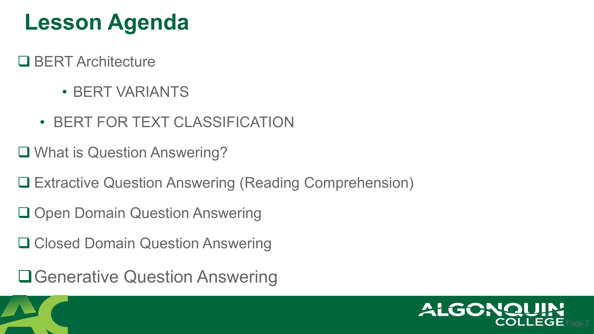

**课程议程 (Lesson Agenda):**

- ❑ BERT 架构 (BERT Architecture)
  - BERT 变体 (BERT Variants)
  - BERT 用于文本分类 (BERT for Text Classification)
- ❑ 什么是问答系统？ (What is Question Answering?)
- ❑ 抽取式问答 / 阅读理解 (Extractive Question Answering / Reading Comprehension)
- ❑ 开放域问答 (Open Domain Question Answering)
- ❑ 封闭域问答 (Closed Domain Question Answering)
- ❑ 生成式问答 (Generative Question Answering)

> **📝 Notes:**
>
> _(To be added by note_taking skill)_

---

## 2. Transformer 发展树与时间线 (Transformer Tree of Life & Timeline)

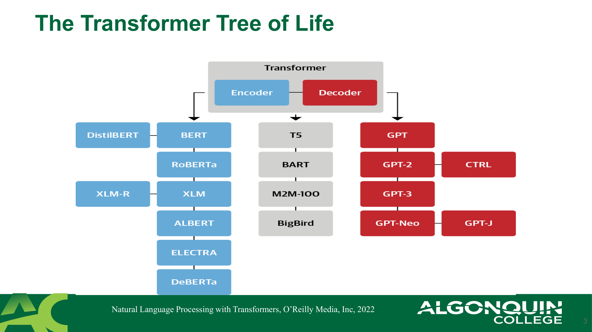

- Transformer 生命之树 (The Transformer Tree of Life)
- 来源 (Source): Natural Language Processing with Transformers, O'Reilly Media, Inc, 2022

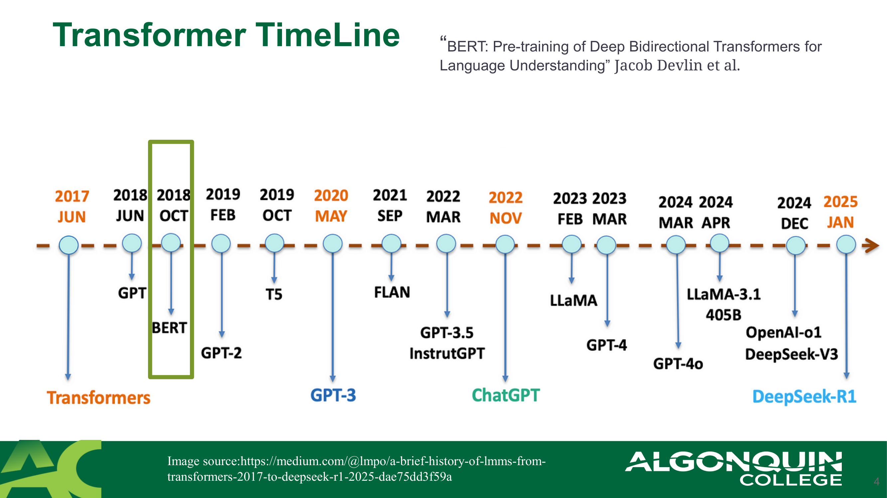

- Transformer 时间线 (Transformer Timeline)
- "BERT: Pre-training of Deep Bidirectional Transformers for Language Understanding" — Jacob Devlin et al.

Ref: https://medium.com/@lmpo/a-brief-history-of-lmms-from-transformers-2017-to-deepseek-r1-2025-dae75dd3f59a

> **📝 Notes:**
>
> _(To be added by note_taking skill)_

---

## 3. BERT 架构 (BERT Architecture)

### 3.1 BERT 概述 (BERT Overview)

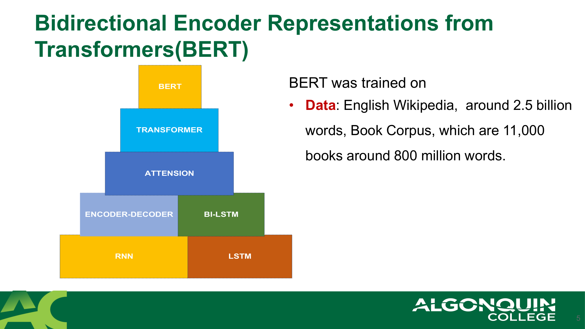

- **BERT** — 来自 Transformer 的双向编码器表示 (Bidirectional Encoder Representations from Transformers)
- BERT 的训练数据 (BERT was trained on):
  - 数据 (Data): 英语 Wikipedia，约 25 亿词 (around 2.5 billion words)；BookCorpus，约 11,000 本书，约 8 亿词 (800 million words)
- BERT 所处的技术演化路径 (Evolution): RNN → LSTM → Bi-LSTM → Attention → Encoder-Decoder → Transformer → **BERT**

### 3.2 BERT 在 Google 搜索中的应用 (BERT: Google Search)


- BERT 用于改进 Google 搜索结果 (BERT improves Google Search results)

Ref: http://jalammar.github.io/a-visual-guide-to-using-bert-for-the-first-time/


- BERT 对搜索查询理解的影响（续）(BERT: Google Search continued)

### 3.3 BERT 模型结构 (BERT Model Architecture)

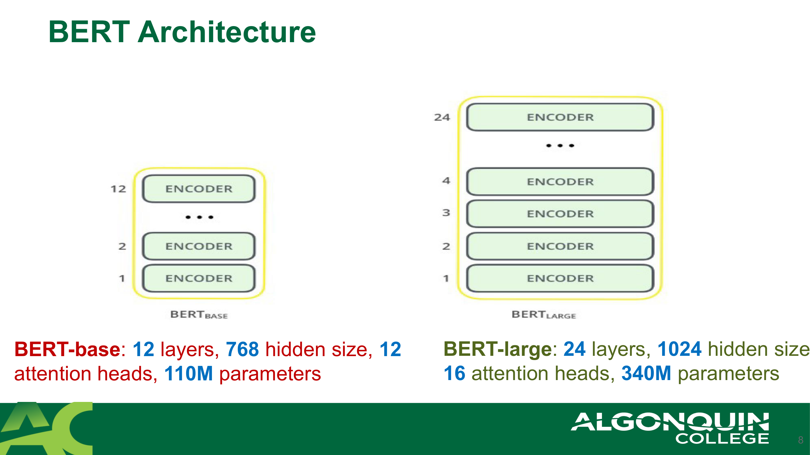

- **BERT-base**: 12 层 (12 layers)，768 隐藏层维度 (768 hidden size)，12 个注意力头 (12 attention heads)，1.1 亿参数 (110M parameters)
- **BERT-large**: 24 层 (24 layers)，1024 隐藏层维度 (1024 hidden size)，16 个注意力头 (16 attention heads)，3.4 亿参数 (340M parameters)

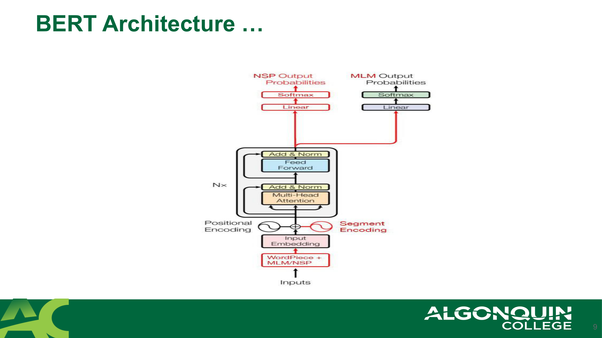

- BERT 架构详细示意图 (BERT Architecture detailed diagram)

> **📝 Notes:**
>
> _(To be added by note_taking skill)_

---

## 4. BERT 输入与输出 (BERT Input & Output)

### 4.1 模型输入 (Model Input)

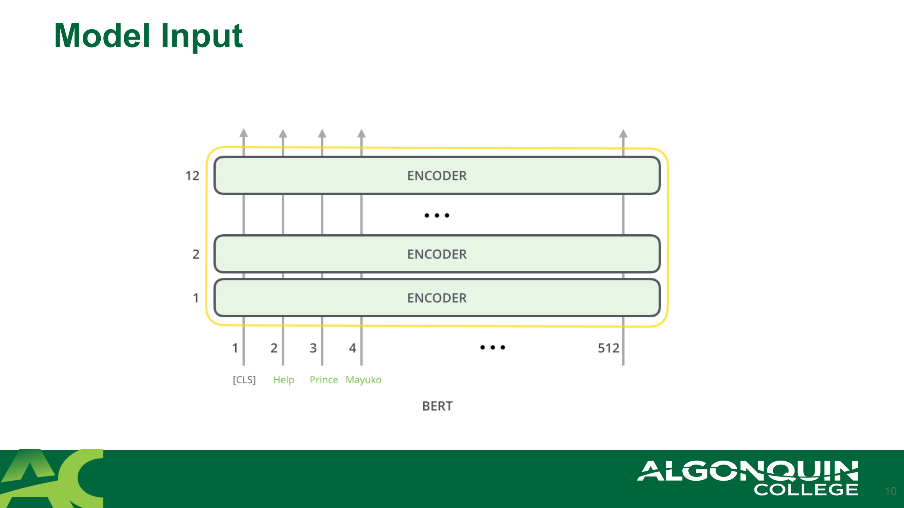

- 模型输入的组成 (Model Input components)

### 4.2 输入处理 (Input Processing)

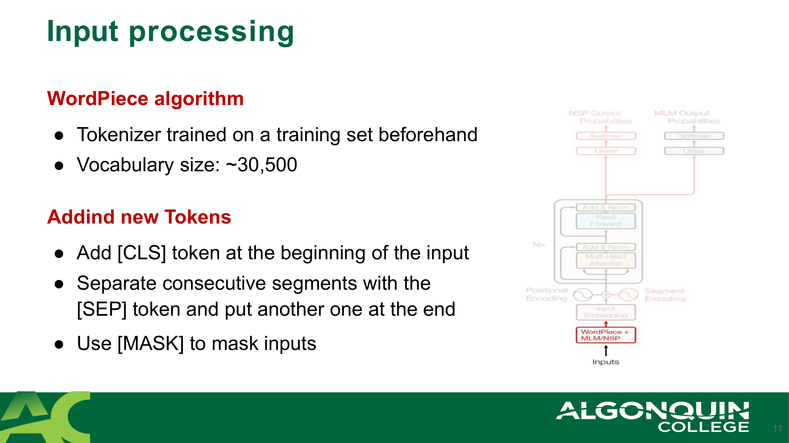

- **WordPiece 算法 (WordPiece algorithm)**
  - 分词器在训练集上预先训练 (Tokenizer trained on a training set beforehand)
  - 词汇表大小约 30,500 (Vocabulary size: ~30,500)
- **添加特殊 Token (Adding new Tokens)**
  - 在输入开头添加 `[CLS]` token (Add [CLS] token at the beginning of the input)
  - 用 `[SEP]` token 分隔连续的句子段，并在末尾添加一个 (Separate consecutive segments with the [SEP] token and put another one at the end)
  - 用 `[MASK]` 来掩码输入 (Use [MASK] to mask inputs)

### 4.3 分词示例 (Tokenization Example)

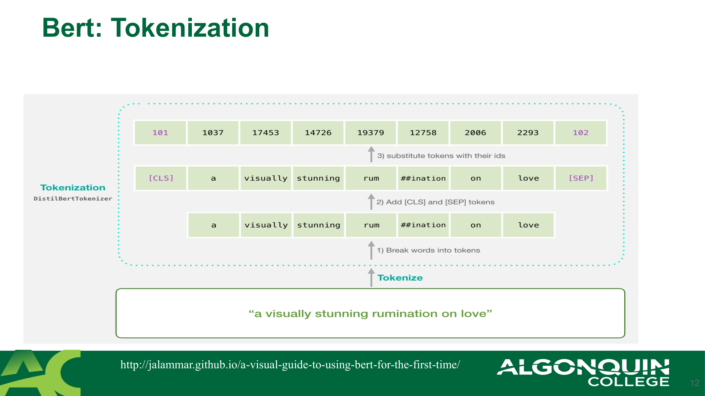

- BERT 分词可视化 (BERT Tokenization visualization)

Ref: http://jalammar.github.io/a-visual-guide-to-using-bert-for-the-first-time/

### 4.4 Token 嵌入 (Token Embedding)

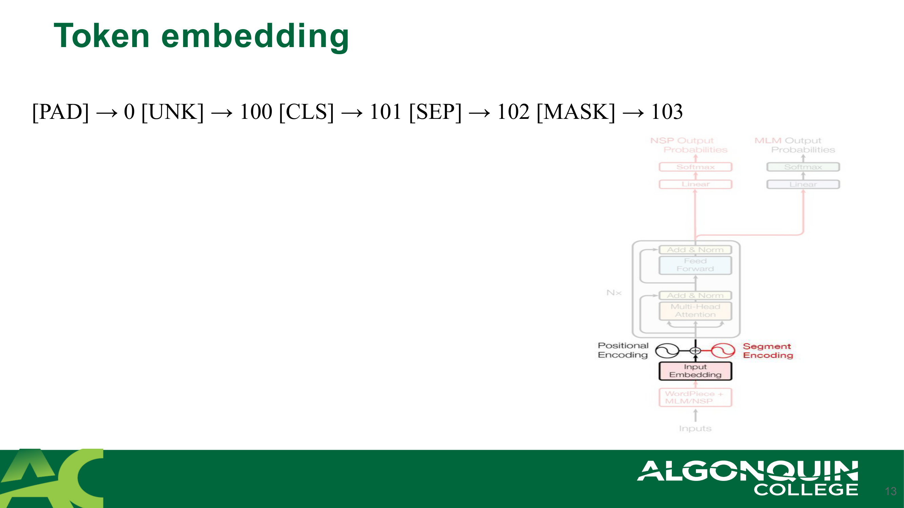

- 特殊 Token 对应的 ID (Special Token IDs):
  - `[PAD]` → 0, `[UNK]` → 100, `[CLS]` → 101, `[SEP]` → 102, `[MASK]` → 103

### 4.5 输入嵌入 (Input Embedding)

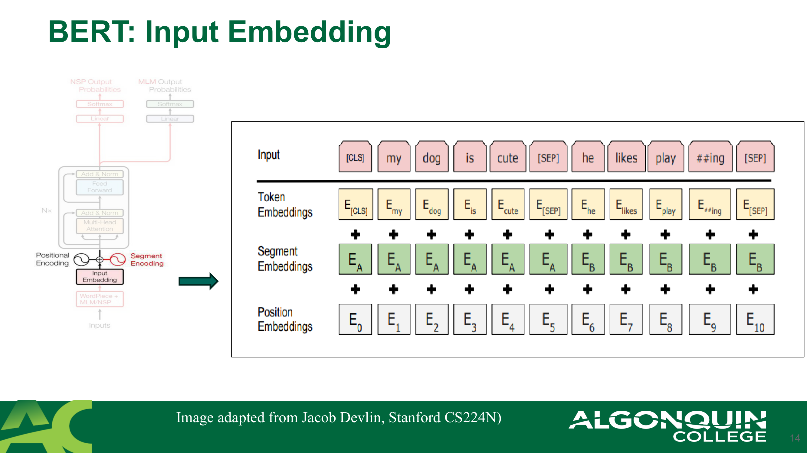

- BERT 输入嵌入结构 (BERT Input Embedding structure)
- 图片来自 Jacob Devlin, Stanford CS224N (Image adapted from Jacob Devlin, Stanford CS224N)

### 4.6 模型输出 (Model Outputs)

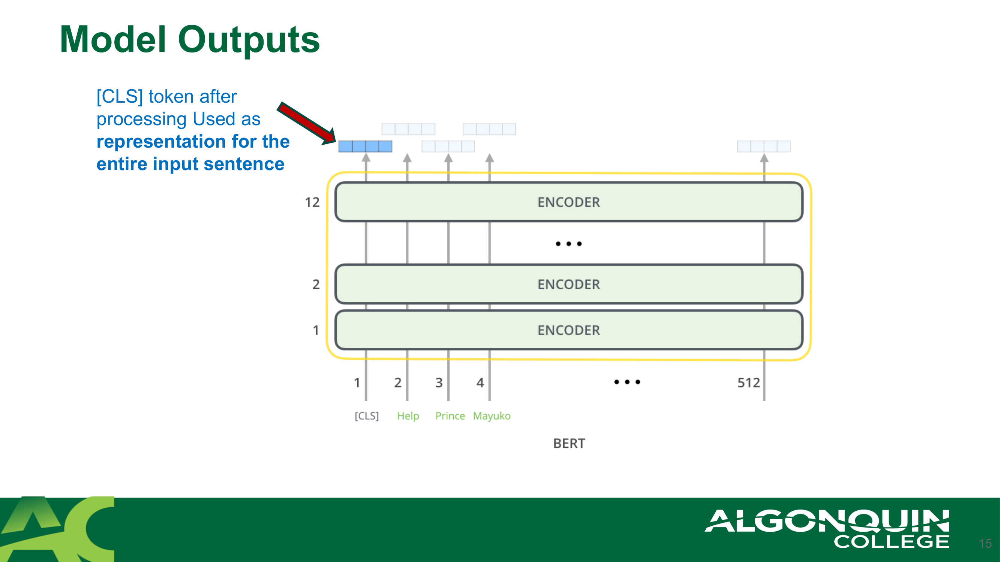

- 经过处理的 `[CLS]` token 被用作整个输入句子的表示 ([CLS] token after processing — used as representation for the entire input sentence)

> **📝 Notes:**
>
> _(To be added by note_taking skill)_

---

## 5. BERT 训练方法 (How BERT Was Trained)

### 5.1 训练概述 (Training Overview)

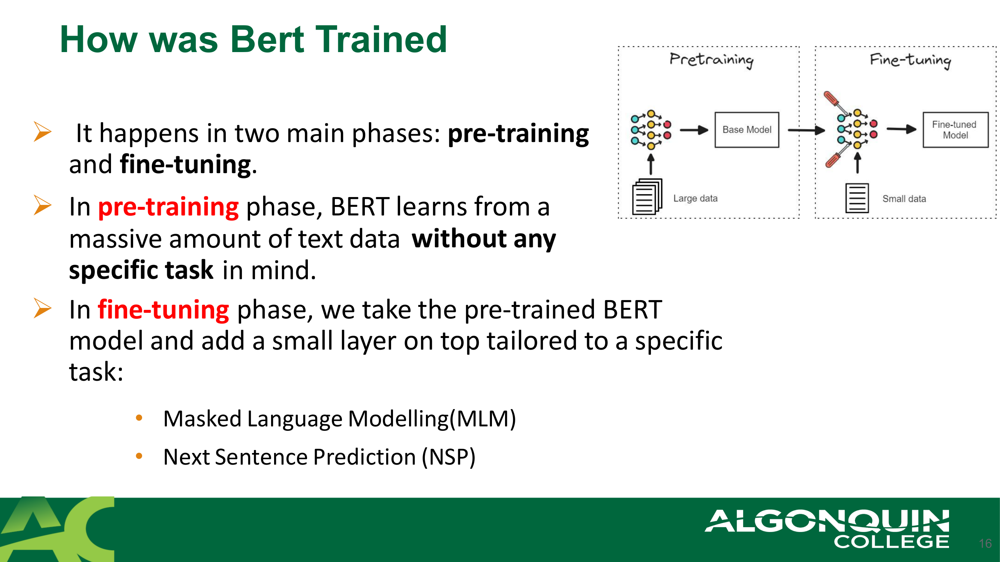

- BERT 训练分为两个主要阶段 (Two main phases):
  - **预训练 (Pre-training)**: BERT 从大量文本数据中学习，不针对特定任务 (learns from a massive amount of text data without any specific task in mind)
  - **微调 (Fine-tuning)**: 在预训练模型上添加一个小层，针对特定任务进行调整 (add a small layer on top tailored to a specific task)
- 预训练任务 (Pre-training tasks):
  - **掩码语言模型 MLM (Masked Language Modelling)**
  - **下一句预测 NSP (Next Sentence Prediction)**

### 5.2 掩码语言模型 MLM (Masked Language Modelling)

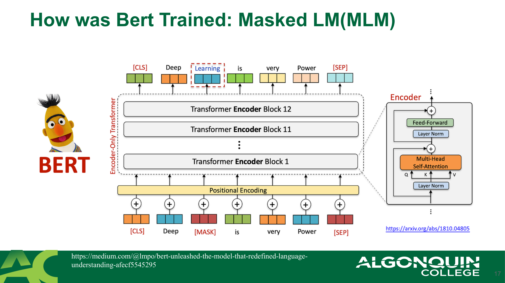

- 掩码语言模型示意图 (Masked LM diagram)

Ref: https://medium.com/@lmpo/bert-unleashed-the-model-that-redefined-language-understanding-afecf5545295

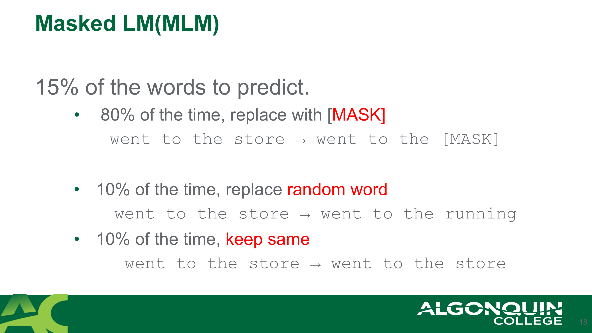

- 随机选取 15% 的词进行预测 (15% of the words to predict):
  - **80% 的概率**用 `[MASK]` 替换 (80% of the time, replace with [MASK])
    - 例: went to the store → went to the [MASK]
  - **10% 的概率**用随机词替换 (10% of the time, replace random word)
    - 例: went to the store → went to the running
  - **10% 的概率**保持不变 (10% of the time, keep same)
    - 例: went to the store → went to the store

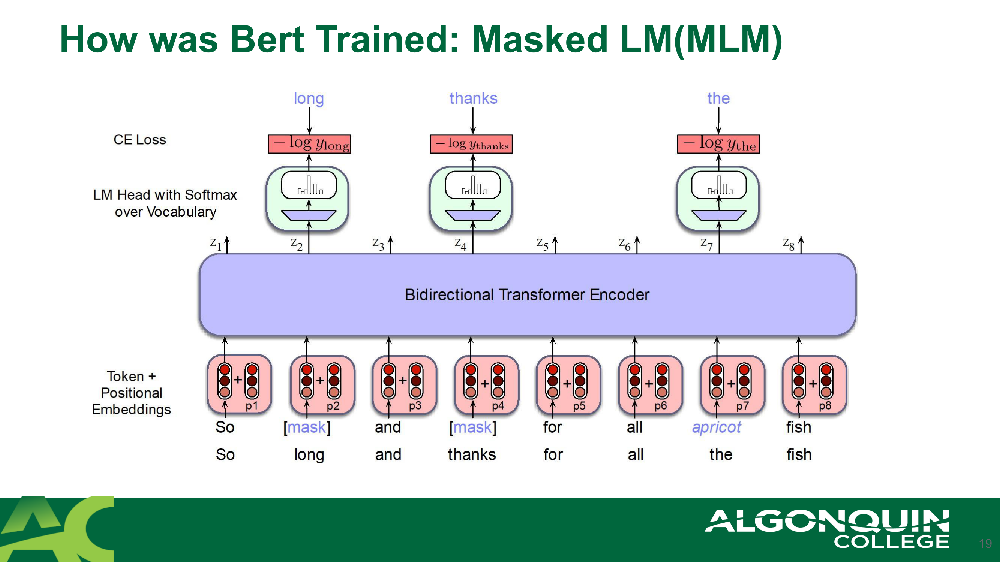

- 掩码语言模型 MLM 可视化（续）(Masked LM visualization continued)

### 5.3 下一句预测 NSP / 双句任务 (Next Sentence Prediction / Two-sentence Tasks)

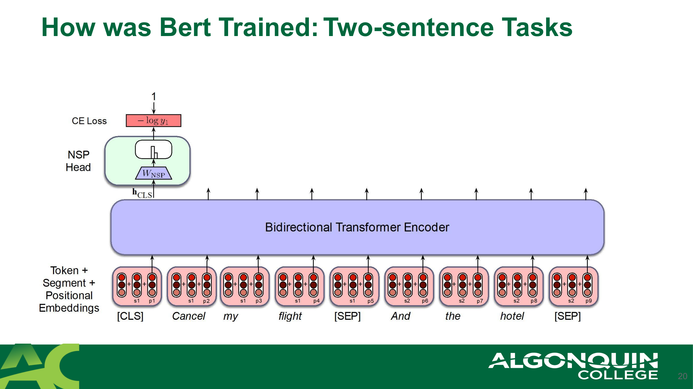

- 双句任务示意图 (Two-sentence Tasks diagram)

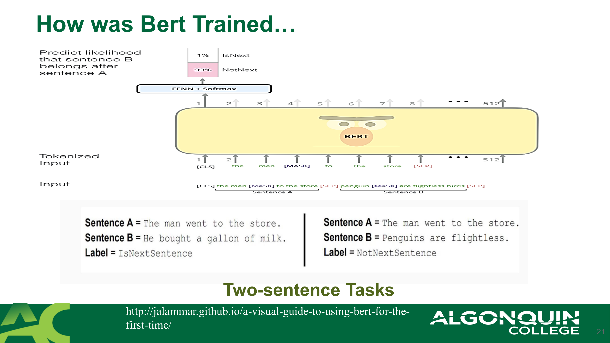

- 双句任务详解 (Two-sentence Tasks detail)

Ref: http://jalammar.github.io/a-visual-guide-to-using-bert-for-the-first-time/

### 5.4 BERT 预训练：整合 (BERT Pre-training: Putting Together)

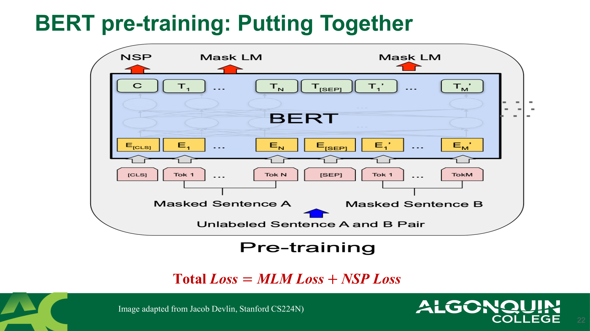

- **总损失 = MLM 损失 + NSP 损失 (Total Loss = MLM Loss + NSP Loss)**
- 图片来自 Jacob Devlin, Stanford CS224N (Image adapted from Jacob Devlin, Stanford CS224N)

> **📝 Notes:**
>
> _(To be added by note_taking skill)_

---

## 6. 迁移学习与 BERT 微调 (Transfer Learning & BERT Fine-tuning)

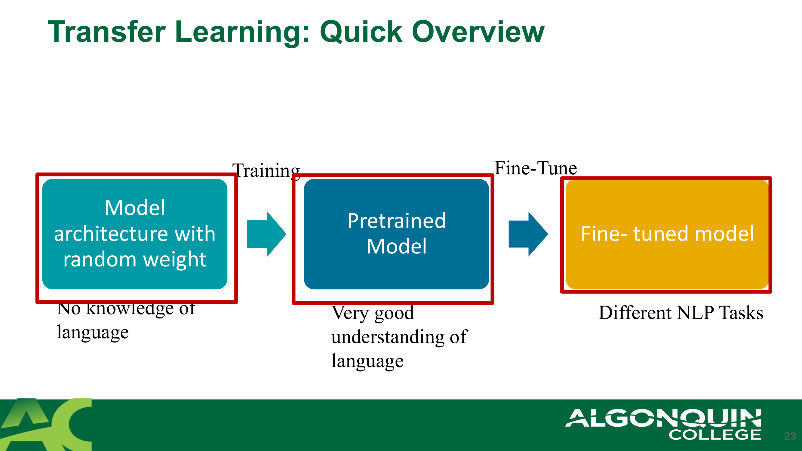

- **迁移学习概述 (Transfer Learning: Quick Overview)**
  - 预训练模型 (Pretrained Model) → 对语言没有认知 (No knowledge of language)
  - 训练 (Training) → 对语言有很好的理解 (Very good understanding of language)
  - 微调模型 (Fine-tuned Model) → 适用于不同 NLP 任务 (Different NLP Tasks)

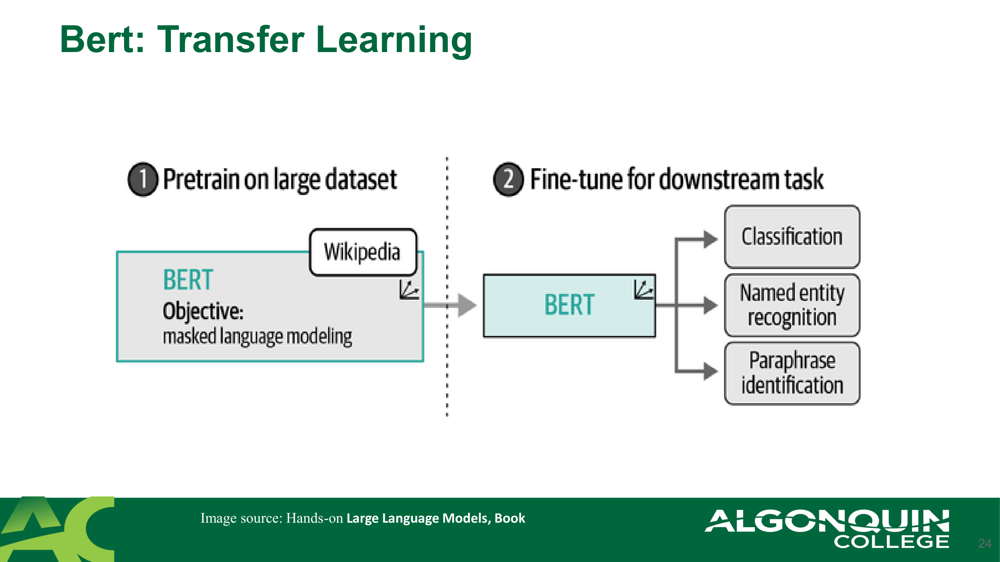

- BERT 迁移学习详解 (BERT: Transfer Learning)
- 来源 (Image source): Hands-on Large Language Models, Book

> **📝 Notes:**
>
> _(To be added by note_taking skill)_

---

## 7. BERT 用于文本分类与 BERT 变体 (BERT for Text Classification & Variants)

### 7.1 文本分类 (Text Classification)

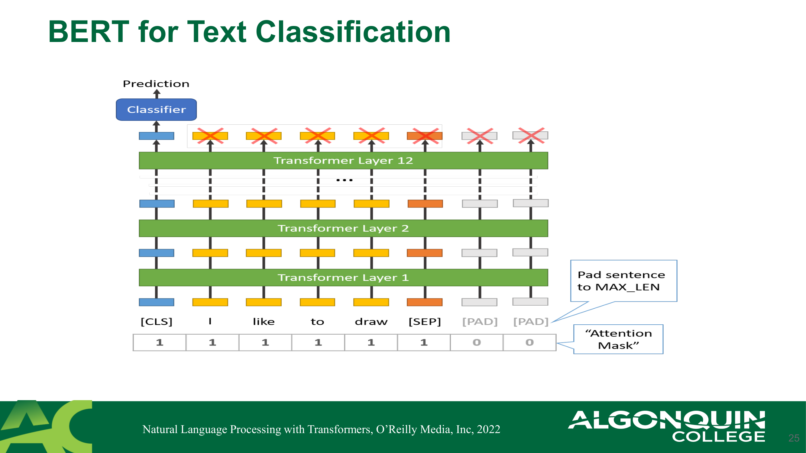

- BERT 用于文本分类 (BERT for Text Classification)
- 来源 (Source): Natural Language Processing with Transformers, O'Reilly Media, Inc, 2022


- **演示 (DEMO)**

### 7.2 预训练 BERT 模型列表 (List of Pre-trained BERT Models)

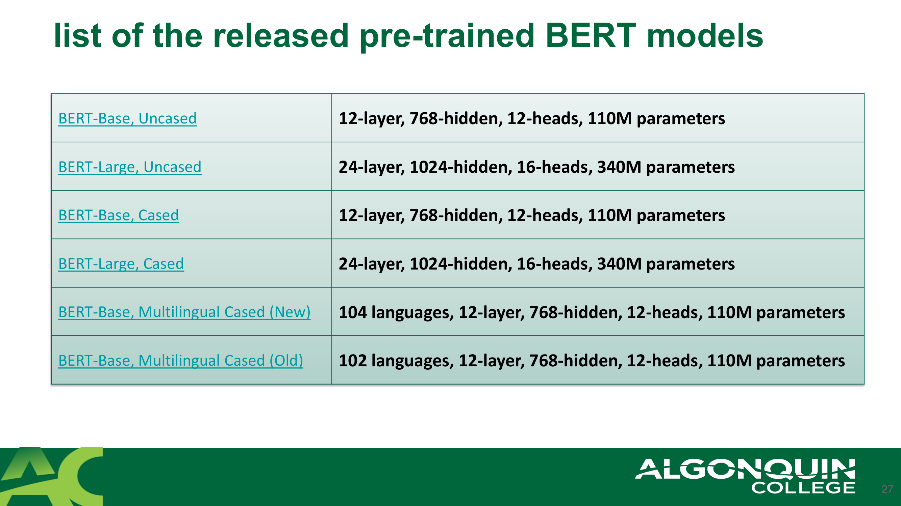

| 模型 (Model)                        | 配置 (Configuration)                                                                                           |
| ----------------------------------- | -------------------------------------------------------------------------------------------------------------- |
| BERT-Base, Uncased                  | 12 层, 768 隐藏, 12 头, 110M 参数 (12-layer, 768-hidden, 12-heads, 110M parameters)                            |
| BERT-Large, Uncased                 | 24 层, 1024 隐藏, 16 头, 340M 参数 (24-layer, 1024-hidden, 16-heads, 340M parameters)                          |
| BERT-Base, Cased                    | 12 层, 768 隐藏, 12 头, 110M 参数 (12-layer, 768-hidden, 12-heads, 110M parameters)                            |
| BERT-Large, Cased                   | 24 层, 1024 隐藏, 16 头, 340M 参数 (24-layer, 1024-hidden, 16-heads, 340M parameters)                          |
| BERT-Base, Multilingual Cased (New) | 104 种语言, 12 层, 768 隐藏, 12 头, 110M 参数 (104 languages, 12-layer, 768-hidden, 12-heads, 110M parameters) |
| BERT-Base, Multilingual Cased (Old) | 102 种语言, 12 层, 768 隐藏, 12 头, 110M 参数 (102 languages, 12-layer, 768-hidden, 12-heads, 110M parameters) |

### 7.3 BERT 变体 (BERT Variants)

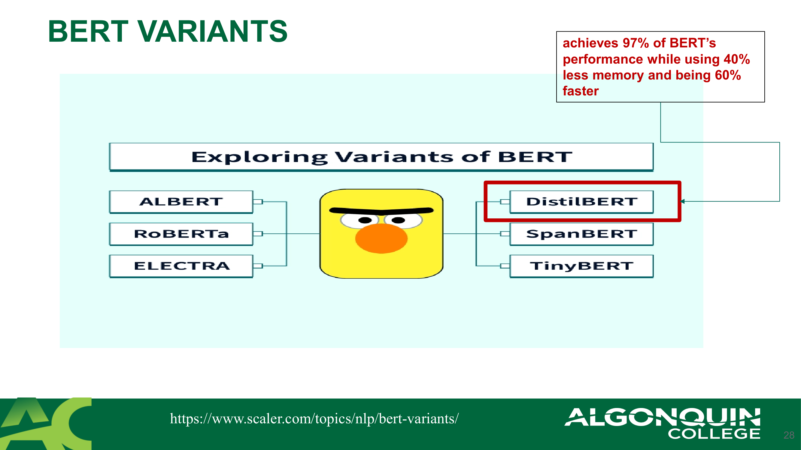

- DistilBERT 达到 BERT **97%** 的性能，同时减少 **40%** 内存，速度快 **60%** (achieves 97% of BERT's performance while using 40% less memory and being 60% faster)

Ref: https://www.scaler.com/topics/nlp/bert-variants/

> **📝 Notes:**
>
> _(To be added by note_taking skill)_

---

## 8. 问答系统概述 (Q/A System Overview)

### 8.1 问答系统分类法 (Taxonomy of Q/A System)


- 问答系统简介 (Q/A System introduction)

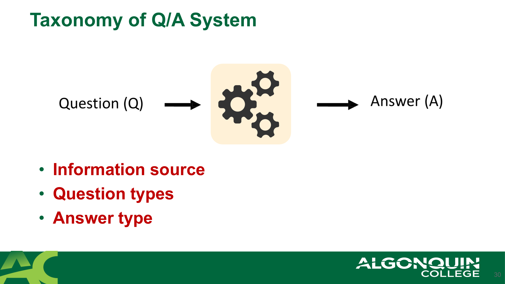

- **分类维度 (Taxonomy dimensions):**
  - 信息源 (Information source)
  - 问题类型 (Question types)
  - 答案类型 (Answer type)

### 8.2 信息源 (Information Source)

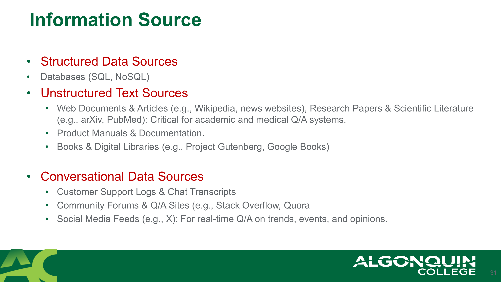

- **结构化数据源 (Structured Data Sources)**
  - 数据库 (Databases): SQL, NoSQL
- **非结构化文本源 (Unstructured Text Sources)**
  - 网页文档和文章 (Web Documents & Articles): 如 Wikipedia、新闻网站 (e.g., Wikipedia, news websites)
  - 研究论文和科学文献 (Research Papers & Scientific Literature): 如 arXiv、PubMed — 对学术和医疗 QA 系统至关重要 (Critical for academic and medical Q/A systems)
  - 产品手册和文档 (Product Manuals & Documentation)
  - 书籍和数字图书馆 (Books & Digital Libraries): 如 Project Gutenberg、Google Books
- **对话数据源 (Conversational Data Sources)**
  - 客户支持日志和聊天记录 (Customer Support Logs & Chat Transcripts)
  - 社区论坛和问答网站 (Community Forums & Q/A Sites): 如 Stack Overflow、Quora
  - 社交媒体 (Social Media Feeds): 如 X — 用于实时问答 (For real-time Q/A on trends, events, and opinions)

### 8.3 问题类型 (Types of Questions)

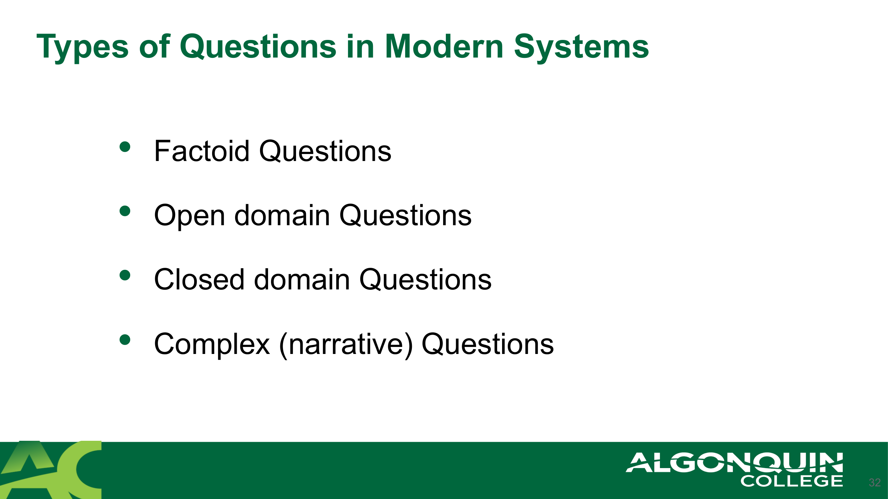

- **事实型问题 (Factoid Questions)**
- **开放域问题 (Open domain Questions)**
- **封闭域问题 (Closed domain Questions)**
- **复杂（叙事型）问题 (Complex/narrative Questions)**

### 8.4 答案类型 (Answer Types)

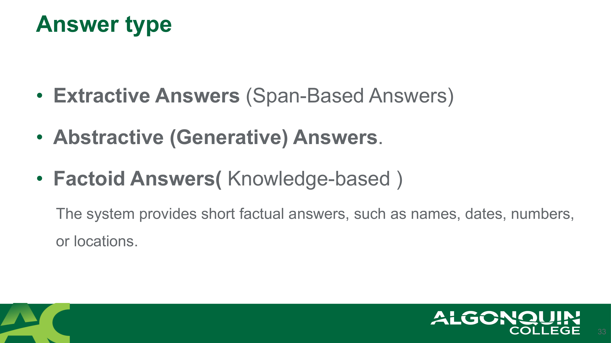

- **抽取式答案 / 基于跨度的答案 (Extractive Answers / Span-Based Answers)**
- **摘要式（生成式）答案 (Abstractive / Generative Answers)**
- **事实型答案 / 基于知识的答案 (Factoid Answers / Knowledge-based)**
  - 系统提供简短的事实答案，如姓名、日期、数字或地点 (The system provides short factual answers, such as names, dates, numbers, or locations)

### 8.5 问答范式 (Question Answering Paradigms)

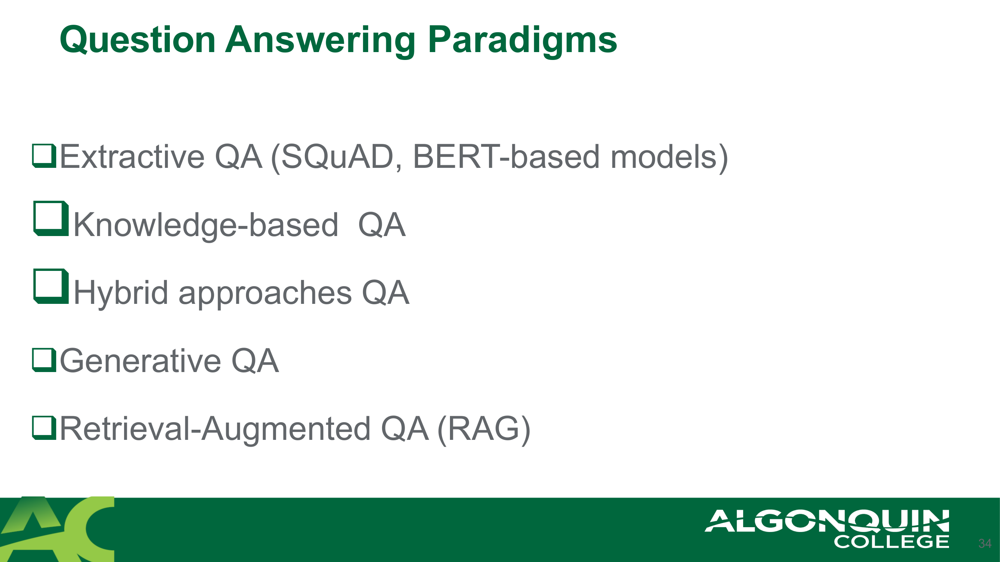

- ❑ 抽取式 QA (Extractive QA): SQuAD, BERT-based models
- ❑ 基于知识的 QA (Knowledge-based QA)
- ❑ 混合方法 QA (Hybrid approaches QA)
- ❑ 生成式 QA (Generative QA)
- ❑ 检索增强 QA / RAG (Retrieval-Augmented QA / RAG)

> **📝 Notes:**
>
> _(To be added by note_taking skill)_

---

## 9. 抽取式问答 / 阅读理解 (Extractive QA / Reading Comprehension)

### 9.1 IBM Watson 与 Jeopardy (IBM Watson & Jeopardy)

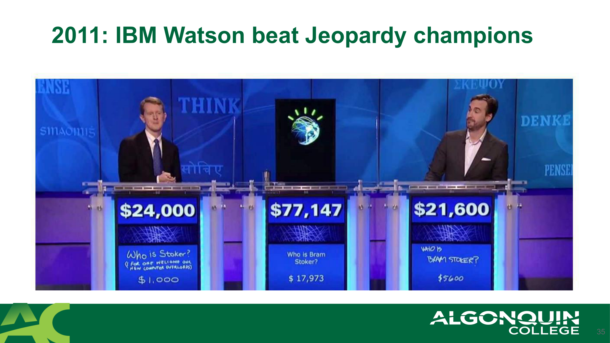

- 2011 年 IBM Watson 击败 Jeopardy 冠军 (2011: IBM Watson beat Jeopardy champions)

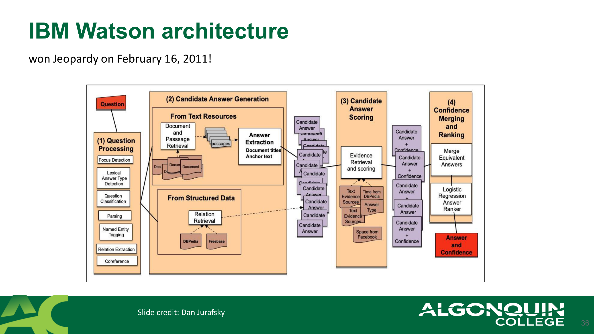

- IBM Watson 架构 (IBM Watson architecture)
- 2011 年 2 月 16 日赢得 Jeopardy！(won Jeopardy on February 16, 2011!)
- 致谢 (Slide credit): Dan Jurafsky

### 9.2 阅读理解 (Reading Comprehension)

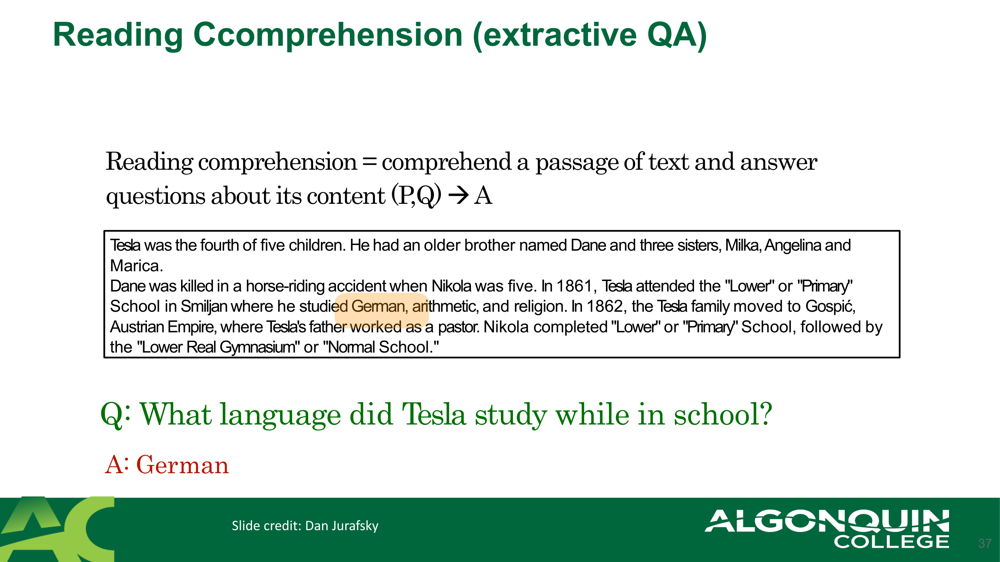

- **阅读理解 = 理解一段文本并回答关于其内容的问题 (Reading comprehension = comprehend a passage of text and answer questions about its content)**
- 公式: (P, Q) → A — 给定段落 P 和问题 Q，输出答案 A (Given Passage P and Question Q, output Answer A)
- 示例 (Example):
  - 段落: Tesla 的早年经历 (Tesla's early life)
  - 问题 (Q): What language did Tesla study while in school?
  - 答案 (A): German
- 致谢 (Slide credit): Dan Jurafsky

### 9.3 SQuAD 数据集 (Stanford Question Answering Dataset)

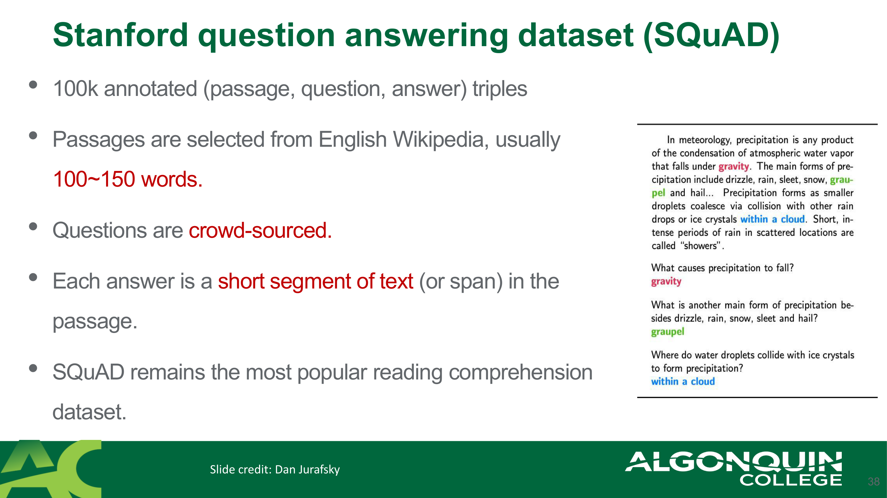

- **SQuAD** — 斯坦福问答数据集 (Stanford Question Answering Dataset)
  - 10 万个标注的（段落、问题、答案）三元组 (100k annotated (passage, question, answer) triples)
  - 段落选自英语 Wikipedia，通常 100~150 词 (Passages are selected from English Wikipedia, usually 100~150 words)
  - 问题由众包生成 (Questions are crowd-sourced)
  - 每个答案是段落中的一个短文本片段或跨度 (Each answer is a short segment of text or span in the passage)
  - SQuAD 仍然是最流行的阅读理解数据集 (SQuAD remains the most popular reading comprehension dataset)

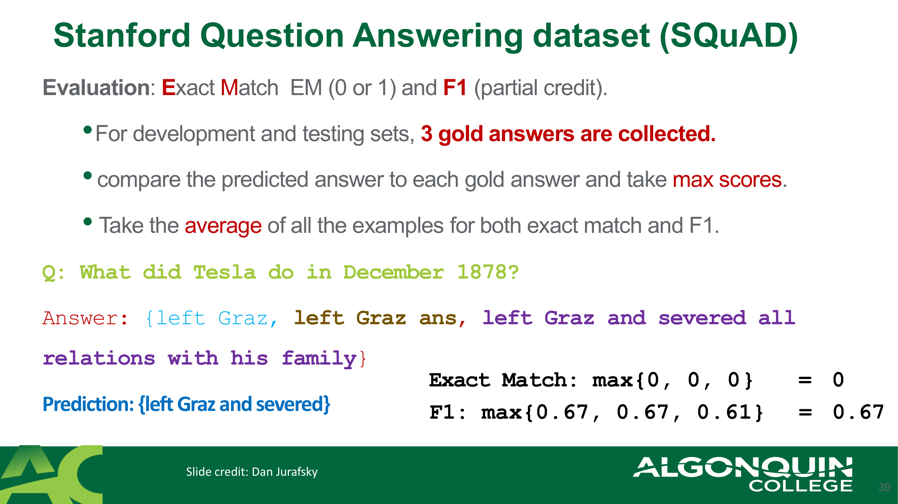

- **评估指标 (Evaluation):**
  - **精确匹配 EM (Exact Match):** 0 或 1
  - **F1 分数 (F1 score):** 部分匹配得分 (partial credit)
- 开发和测试集收集 3 个金标准答案 (For development and testing sets, 3 gold answers are collected)
- 将预测答案与每个金标准答案比较，取最高分 (compare predicted answer to each gold answer and take max scores)
- 对所有样本取平均 (Take the average of all examples for both EM and F1)
- 示例 (Example):
  - Q: What did Tesla do in December 1878?
  - Gold: {left Graz, left Graz ans, left Graz and severed all relations with his family}
  - Prediction: {left Graz and severed}
  - Exact Match: max{0, 0, 0} = 0
  - F1: max{0.67, 0.67, 0.61} = 0.67
- 致谢 (Slide credit): Dan Jurafsky

> **📝 Notes:**
>
> _(To be added by note_taking skill)_

---

## 10. 阅读理解的神经模型 (Neural Models for Reading Comprehension)

### 10.1 问题建模 (Problem Formulation)

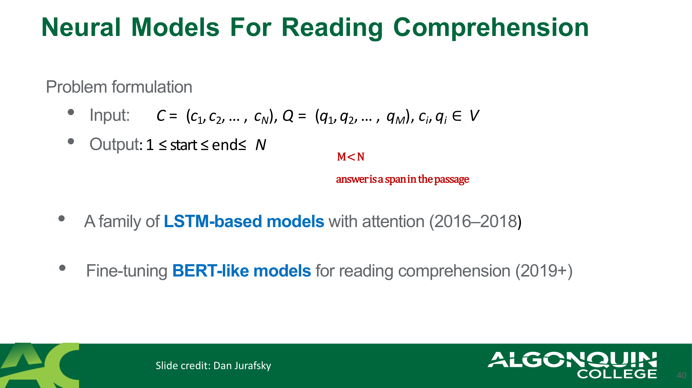

- 输入 (Input): C = (c₁, c₂, …, cₙ), Q = (q₁, q₂, …, qₘ), cᵢ, qᵢ ∈ V
- M < N — 答案是段落中的一个跨度 (answer is a span in the passage)
- 模型发展 (Model evolution):
  - 基于 LSTM 的注意力模型系列 (A family of LSTM-based models with attention): 2016–2018
  - 微调 BERT 类模型用于阅读理解 (Fine-tuning BERT-like models for reading comprehension): 2019+
- 致谢 (Slide credit): Dan Jurafsky

### 10.2 BiDAF 模型 (BiDAF: Bidirectional Attention Flow)

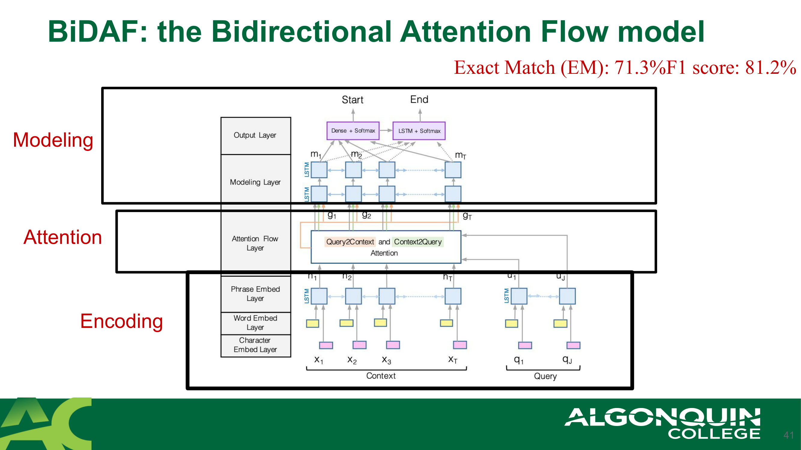

- **BiDAF** — 双向注意力流模型 (Bidirectional Attention Flow model)
- 性能 (Performance): EM: 71.3%, F1: 81.2%
- 架构 (Architecture): Encoding → Attention → Modeling

### 10.3 BERT 用于阅读理解 (BERT for Reading Comprehension)

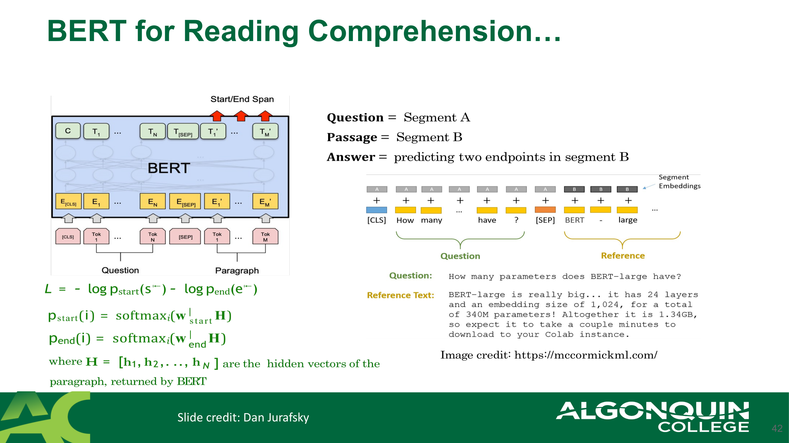

- BERT 用于阅读理解的整体架构 (BERT for Reading Comprehension overview)
- 致谢 (Slide credit): Dan Jurafsky

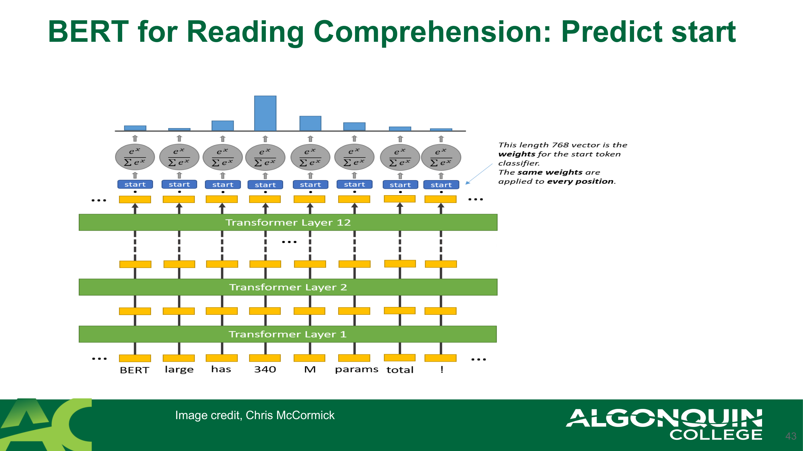

- **预测起始位置 (Predict start)** — BERT 预测答案跨度的起始 token
- 致谢 (Image credit): Chris McCormick

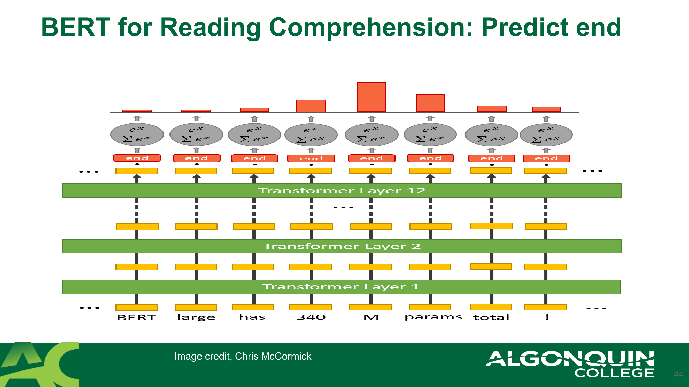

- **预测结束位置 (Predict end)** — BERT 预测答案跨度的结束 token
- 致谢 (Image credit): Chris McCormick

### 10.4 模型对比 (Model Comparisons on SQuAD 2.0)

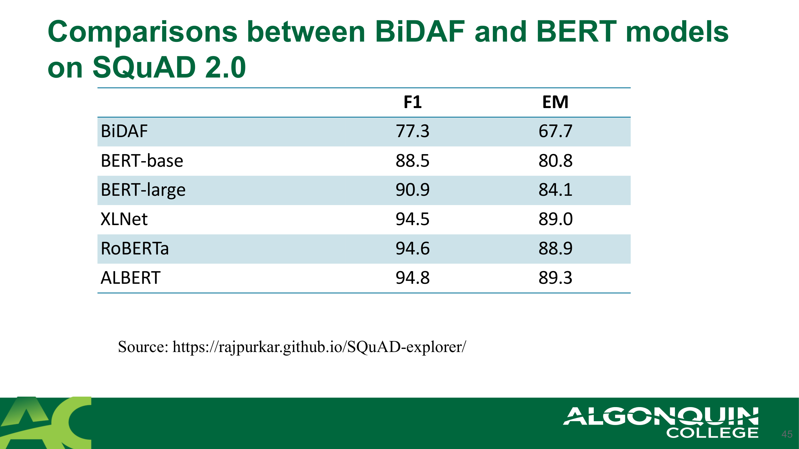

| 模型 (Model) | F1   | EM   |
| ------------ | ---- | ---- |
| BiDAF        | 77.3 | 67.7 |
| BERT-base    | 88.5 | 80.8 |
| BERT-large   | 90.9 | 84.1 |
| XLNet        | 94.5 | 89.0 |
| RoBERTa      | 94.6 | 88.9 |
| ALBERT       | 94.8 | 89.3 |

Ref: https://rajpurkar.github.io/SQuAD-explorer/

> **📝 Notes:**
>
> _(To be added by note_taking skill)_

---

## 11. 处理长文本与 QA 实现 (Dealing With Long Passages & QA Implementation)

### 11.1 处理长段落 (Dealing With Long Passages)

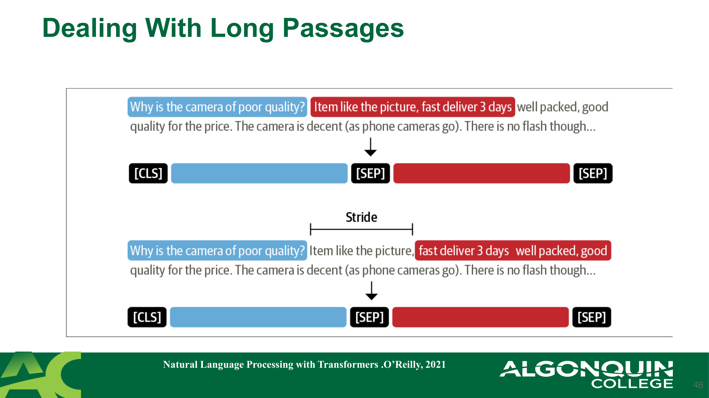

- 长段落处理策略 (Long passage handling strategy)
- 来源 (Source): Natural Language Processing with Transformers. O'Reilly, 2021

### 11.2 BERT QA 的分词实现 (Tokenizing Questions and Contexts for BERT-based QA)

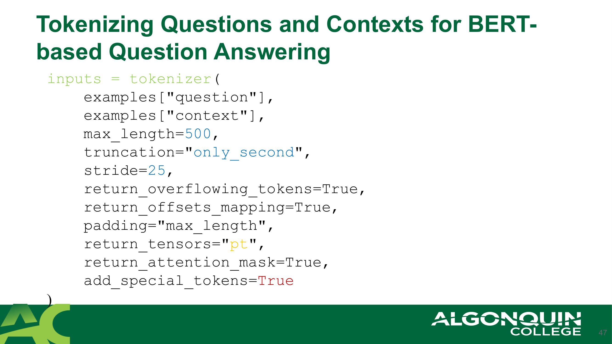

```python
inputs = tokenizer(
    examples["question"],
    examples["context"],
    max_length=500,
    truncation="only_second",
    stride=25,
    return_overflowing_tokens=True,
    return_offsets_mapping=True,
    padding="max_length",
    return_tensors="pt",
    return_attention_mask=True,
    add_special_tokens=True
)
```

- `max_length=500`: 最大 token 长度 (max token length)
- `truncation="only_second"`: 只截断上下文，不截断问题 (only truncate context, not question)
- `stride=25`: 滑动窗口步长 (sliding window stride)
- `return_overflowing_tokens=True`: 返回溢出的 token (return overflow tokens for long passages)


- **演示 (DEMO)**

> **📝 Notes:**
>
> _(To be added by note_taking skill)_

---

## 12. 开放域问答与信息检索 (Open Domain QA & Information Retrieval)

### 12.1 QA 开放数据集 (Open Datasets for Question Answering)

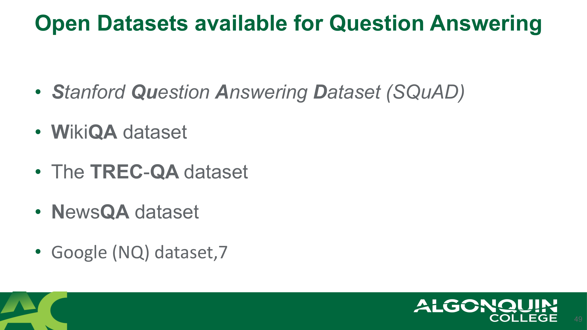

- Stanford Question Answering Dataset (**SQuAD**)
- **WikiQA** dataset
- **TREC-QA** dataset
- **NewsQA** dataset
- Google Natural Questions (**NQ**) dataset

### 12.2 检索器-阅读器架构 (Retriever-Reader Architecture)

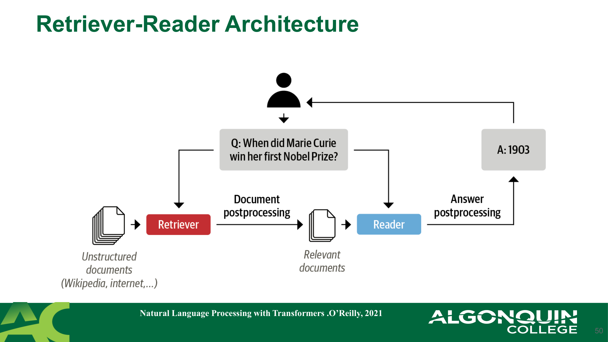

- 检索器-阅读器架构示意图 (Retriever-Reader Architecture diagram)
- 来源 (Source): Natural Language Processing with Transformers. O'Reilly, 2021

### 12.3 检索文档存储 (Retrieval Document Stores)

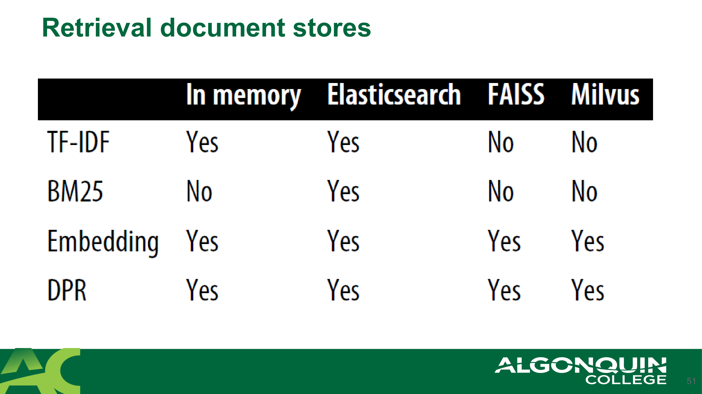

- 检索文档存储方式 (Retrieval document stores)

### 12.4 信息检索中的嵌入 (Embeddings in Information Retrieval)

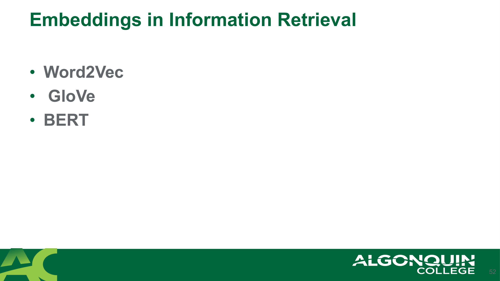

- 常用嵌入方法 (Common embedding methods):
  - **Word2Vec**
  - **GloVe**
  - **BERT**

### 12.5 密集段落检索 DPR (Dense Passage Retrieval)

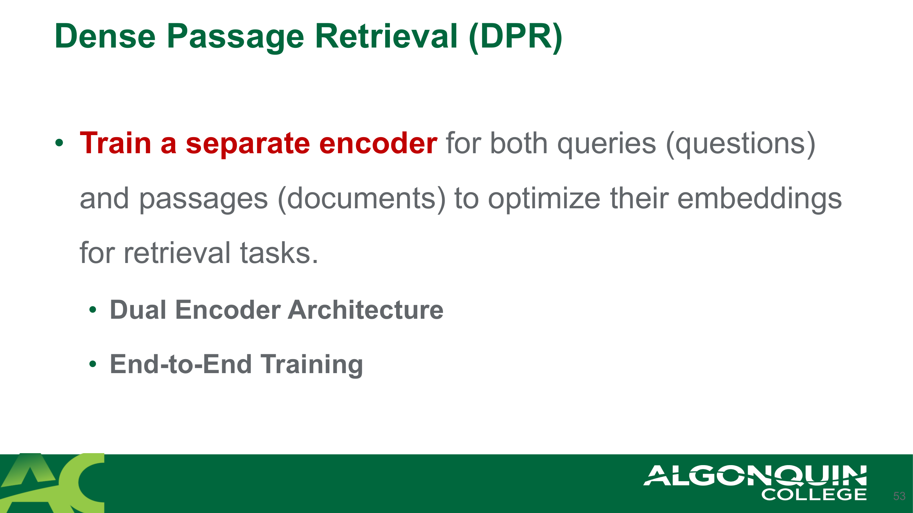

- **DPR** — 密集段落检索 (Dense Passage Retrieval)
  - 分别训练查询（问题）和段落（文档）编码器，优化其嵌入用于检索任务 (Train a separate encoder for both queries and passages to optimize their embeddings for retrieval tasks)
  - **双编码器架构 (Dual Encoder Architecture)**
  - **端到端训练 (End-to-End Training)**

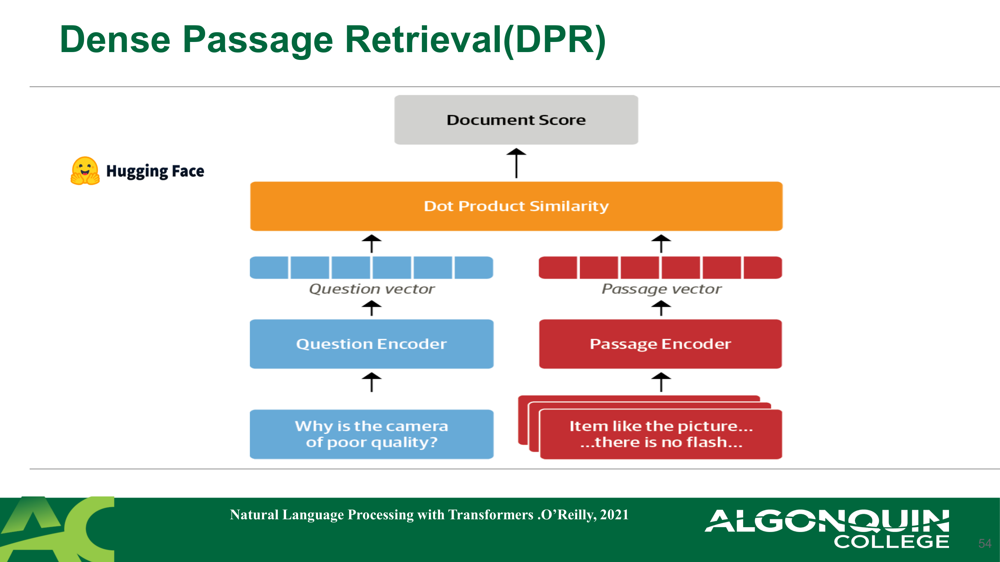

- DPR 架构示意图 (DPR architecture diagram)
- 来源 (Source): Natural Language Processing with Transformers. O'Reilly, 2021

> **📝 Notes:**
>
> _(To be added by note_taking skill)_

---

## 13. QA 框架与评估 (QA Frameworks & Evaluation)

### 13.1 Haystack 库 (Haystack Library)

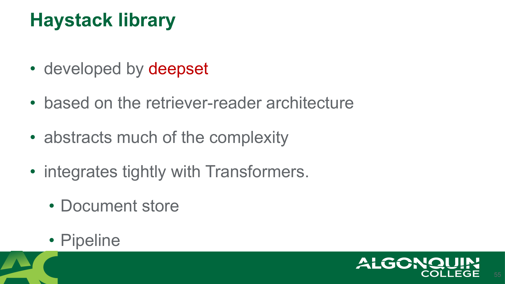

- **Haystack** — 由 deepset 开发 (developed by deepset)
  - 基于检索器-阅读器架构 (based on the retriever-reader architecture)
  - 抽象了大部分复杂性 (abstracts much of the complexity)
  - 与 Transformers 紧密集成 (integrates tightly with Transformers)
  - 核心组件 (Core components): Document store, Pipeline


- **演示 (DEMO)**

### 13.2 类似 Haystack 的其他框架 (Other Frameworks Similar to Haystack)

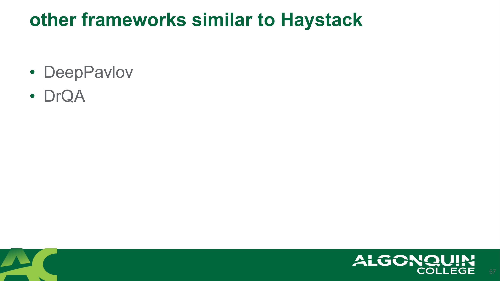

- **DeepPavlov**
- **DrQA**

### 13.3 评估阅读器 (Evaluating the Reader)

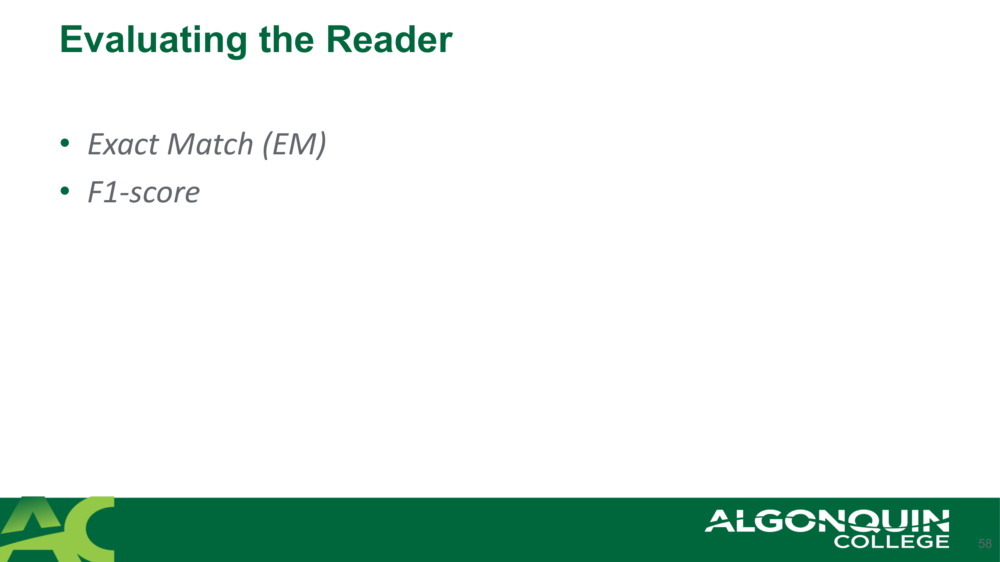

- **精确匹配 (Exact Match / EM)**
- **F1 分数 (F1-score)**

> **📝 Notes:**
>
> _(To be added by note_taking skill)_

---

## 14. 超越抽取式 QA (Going Beyond Extractive QA)

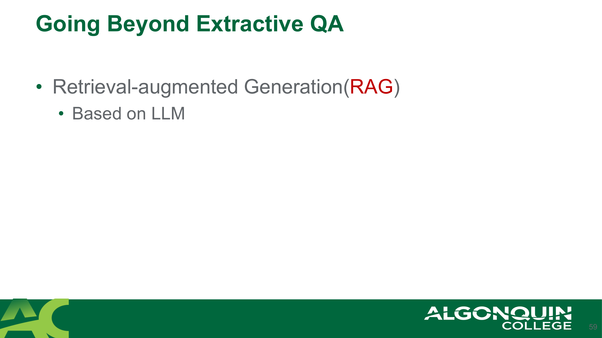

- **检索增强生成 RAG (Retrieval-augmented Generation / RAG)**
- **基于大语言模型 (Based on LLM)**

> **📝 Notes:**
>
> _(To be added by note_taking skill)_

---

## 15. 问答环节 (Q&A)

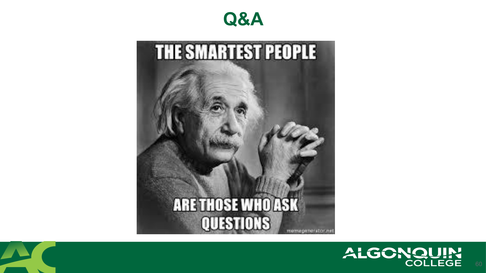

- Q&A
