# Week 12: 大语言模型与检索增强生成 (LLM & RAG)

> Source: `lecture_LLM_week 12W26.pdf`
> Total slides: 45
> Instructor: Hala Own, Ph.D.

---

## 1. 课程议程 (Lesson Agenda)

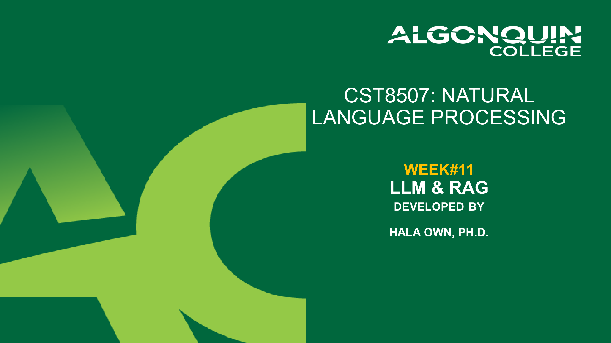

- CST8507: Natural Language Processing — Week #11
- LLM & RAG
- 本课程由 Hala Own 博士开发 (Developed by Hala Own, Ph.D.)

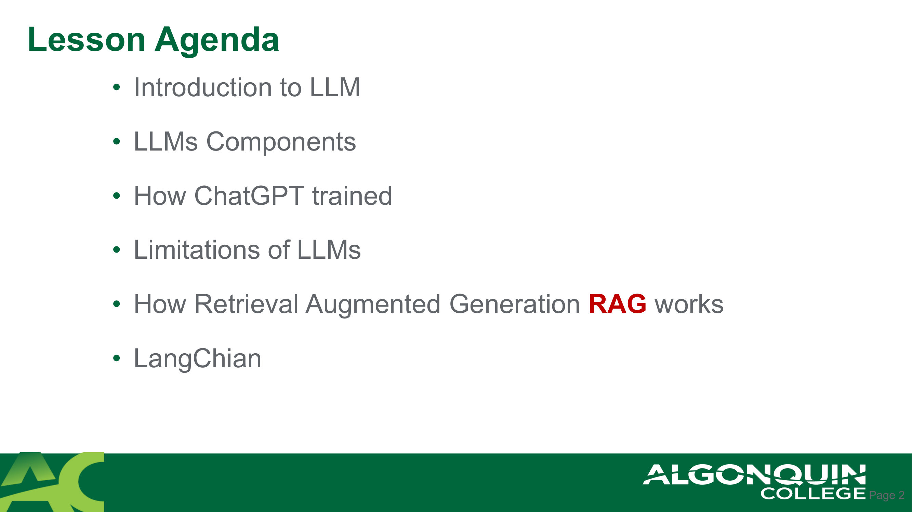

**课程议程 (Lesson Agenda):**

- Introduction to LLM — LLM 简介
- LLMs Components — LLM 组件
- How ChatGPT trained — ChatGPT 是如何训练的
- Limitations of LLMs — LLM 的局限性
- How Retrieval Augmented Generation RAG works — 检索增强生成 RAG 如何工作
- LangChain — LangChain 框架

> **📝 Notes:**
>
> _(To be added by note_taking skill)_

---

## 2. LLM 简介 (What is LLMs)

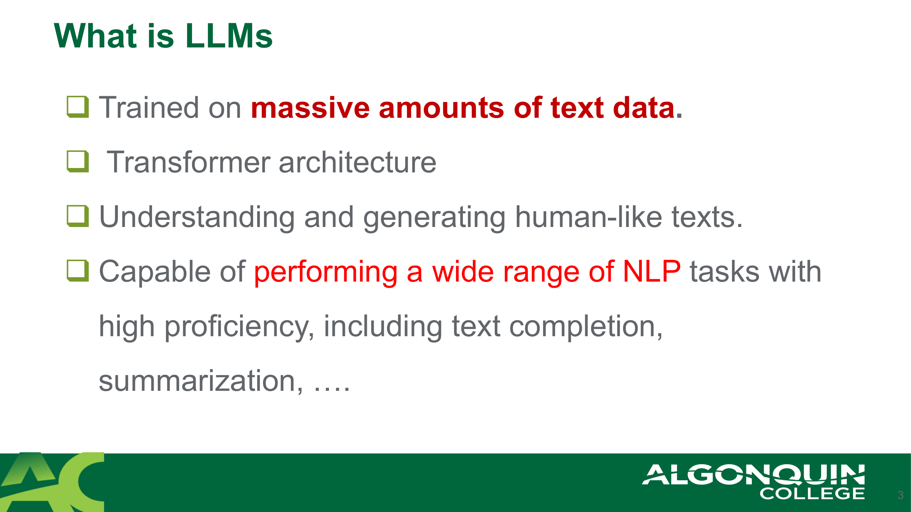

**What is LLMs:** — 什么是大语言模型

- ❑ Trained on massive amounts of text data. — 在大量文本数据上训练
- ❑ Transformer architecture — Transformer 架构
- ❑ Understanding and generating human-like texts. — 理解并生成类人文本
- ❑ Capable of performing a wide range of NLP tasks with high proficiency, including text completion, summarization, …. — 能够高水平地执行广泛的 NLP 任务，包括文本补全、摘要等

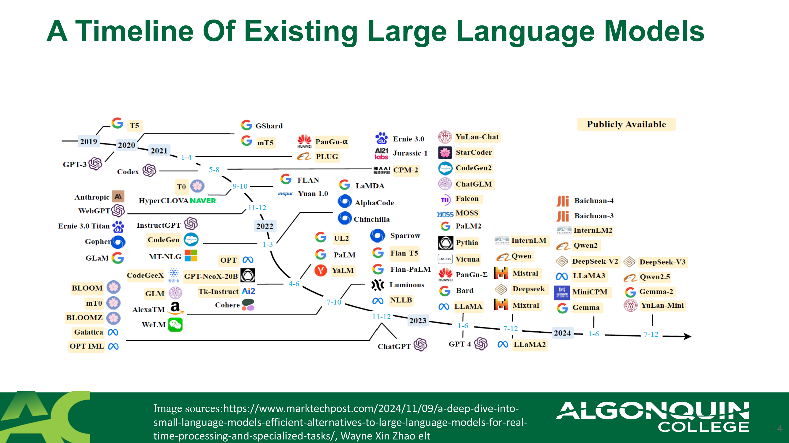

**A Timeline Of Existing Large Language Models:** — 现有大语言模型时间线

Ref: https://www.marktechpost.com/2024/11/09/a-deep-dive-into-small-language-models-efficient-alternatives-to-large-language-models-for-real-time-processing-and-specialized-tasks/

> **📝 Notes:**
>
> _(To be added by note_taking skill)_

---

## 3. LLM 核心组件 (LLMs Components)

### 3.1 组件概览 (Components Overview)

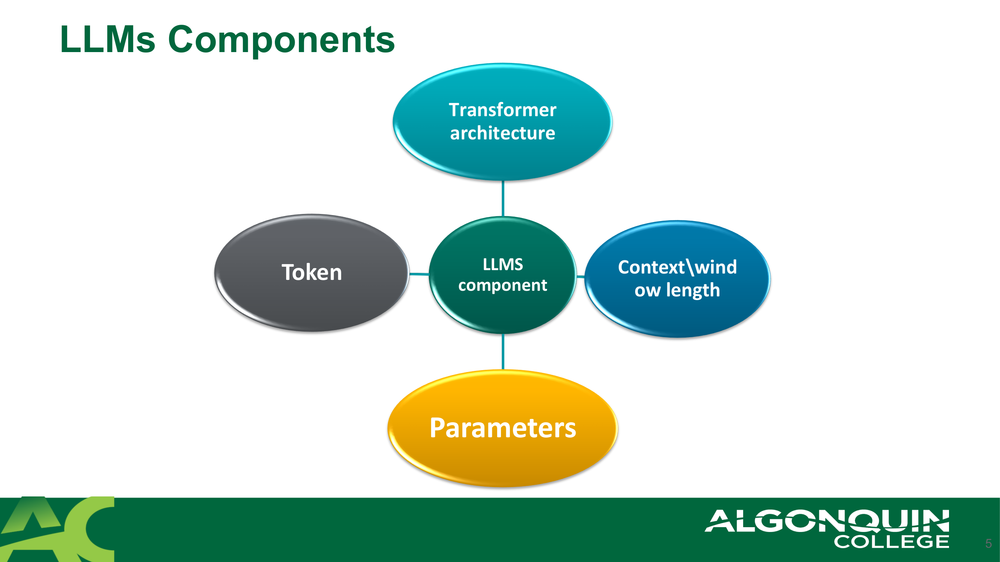

**LLMs Components:** — LLM 组件

- **Transformer architecture** — Transformer 架构
- **Context/window length** — 上下文/窗口长度
- **Parameters** — 参数
- **Token** — 词元

### 3.2 主流 LLM 对比 (Comparison of Popular LLMs)

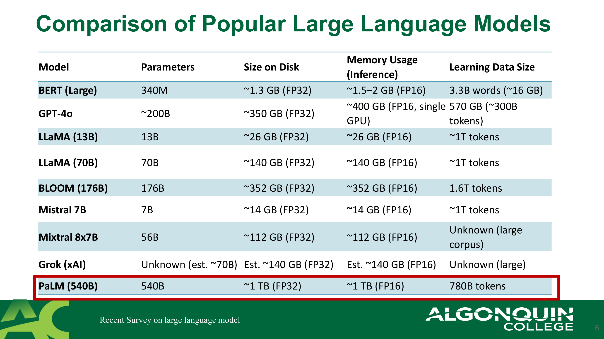

**Comparison of Popular Large Language Models:** — 主流大语言模型对比

| Model — 模型 | Parameters — 参数 | Size on Disk — 磁盘大小 | Memory Usage (Inference) — 推理内存 | Learning Data Size — 训练数据量 |
|---|---|---|---|---|
| BERT (Large) | 340M | ~1.3 GB (FP32) | ~1.5–2 GB (FP16) | 3.3B words (~16 GB) |
| GPT-4o | ~200B | ~350 GB (FP32) | ~400 GB (FP16, single GPU) | 570 GB (~300B tokens) |
| LLaMA (13B) | 13B | ~26 GB (FP32) | ~26 GB (FP16) | ~1T tokens |
| LLaMA (70B) | 70B | ~140 GB (FP32) | ~140 GB (FP16) | ~1T tokens |
| BLOOM (176B) | 176B | ~352 GB (FP32) | ~352 GB (FP16) | 1.6T tokens |
| Mistral 7B | 7B | ~14 GB (FP32) | ~14 GB (FP16) | ~1T tokens |
| Mixtral 8x7B | 56B | ~112 GB (FP32) | ~112 GB (FP16) | Unknown (large corpus) |
| Grok (xAI) | Unknown (est. ~70B) | Est. ~140 GB (FP32) | Est. ~140 GB (FP16) | Unknown (large) |
| PaLM (540B) | 540B | ~1 TB (FP32) | ~1 TB (FP16) | 780B tokens |

Ref: Recent Survey on large language model

### 3.3 LLM 分词器 (LLM Tokenizer)

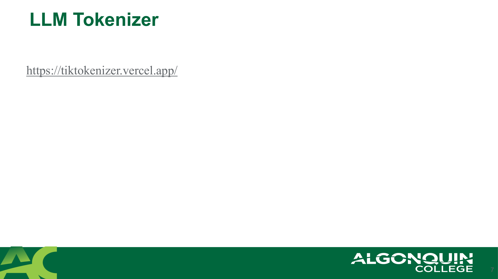

**LLM Tokenizer:** — LLM 分词器

Ref: https://tiktokenizer.vercel.app/

### 3.4 上下文长度 (Context Length)

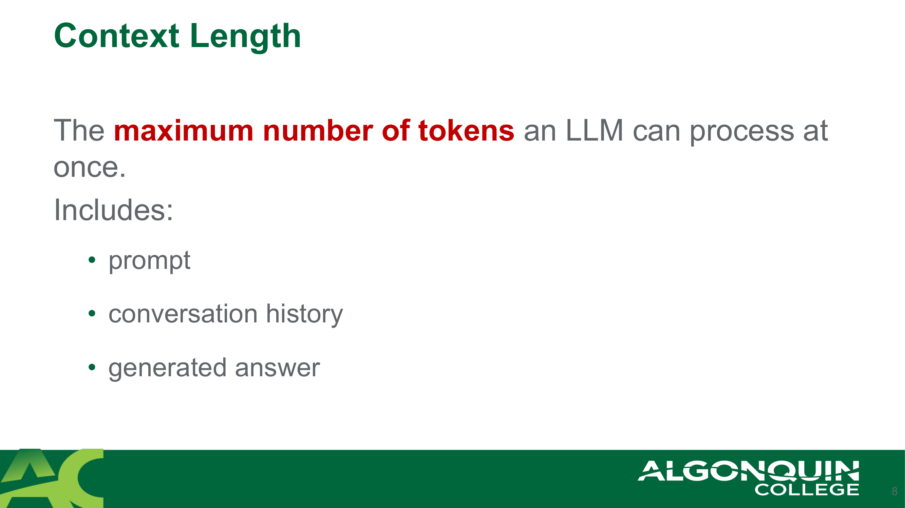

**Context Length:** — 上下文长度

- The maximum number of tokens an LLM can process at once. — LLM 一次能处理的最大 token 数量
- Includes: — 包括：
  - prompt — 提示词
  - conversation history — 对话历史
  - generated answer — 生成的回答

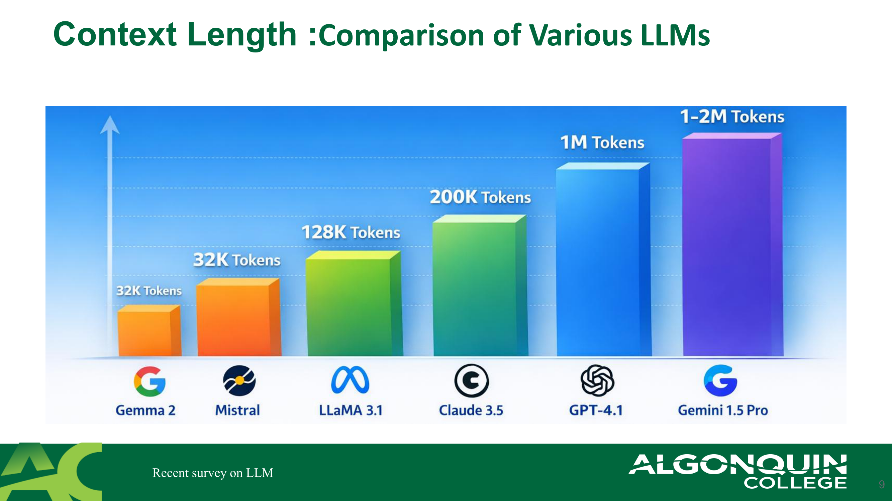

**Context Length: Comparison of Various LLMs:** — 上下文长度：各种 LLM 的对比

Ref: Recent survey on LLM

> **📝 Notes:**
>
> _(To be added by note_taking skill)_

---

## 4. LLM 类型 (Types of Large Language Models)

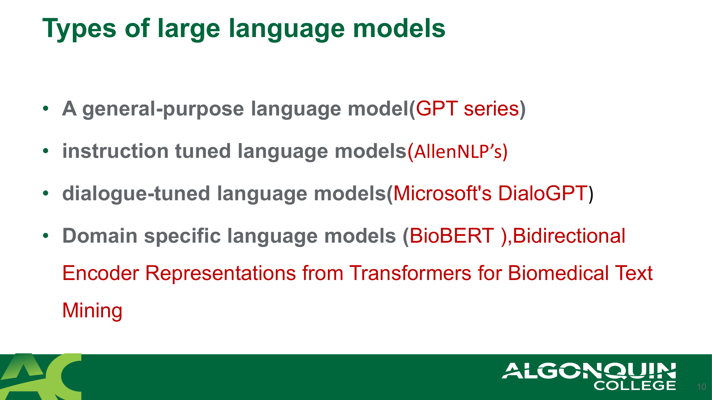

**Types of large language models:** — 大语言模型的类型

- A general-purpose language model (GPT series) — 通用语言模型（GPT 系列）
- Instruction tuned language models (AllenNLP's) — 指令微调语言模型（AllenNLP）
- Dialogue-tuned language models (Microsoft's DialoGPT) — 对话微调语言模型（微软 DialoGPT）
- Domain specific language models (BioBERT), Bidirectional Encoder Representations from Transformers for Biomedical Text Mining — 领域特定语言模型（BioBERT），用于生物医学文本挖掘的 Transformer 双向编码器表示

> **📝 Notes:**
>
> _(To be added by note_taking skill)_

---

## 5. ChatGPT 如何训练 (How ChatGPT Was Trained)

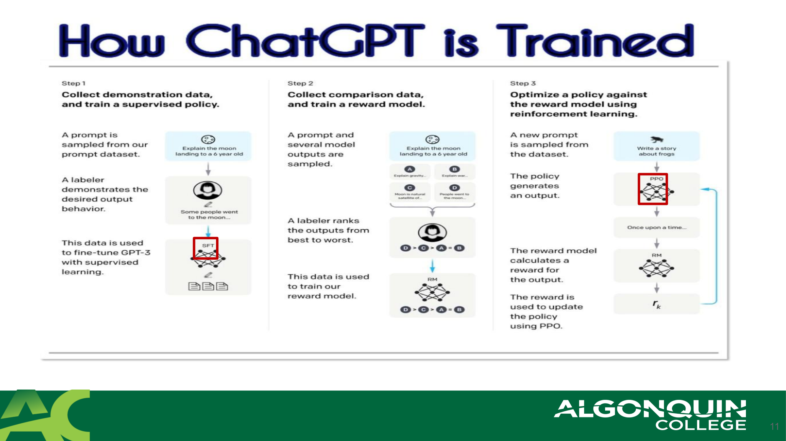

**How ChatGPT Was Trained:** — ChatGPT 的训练过程

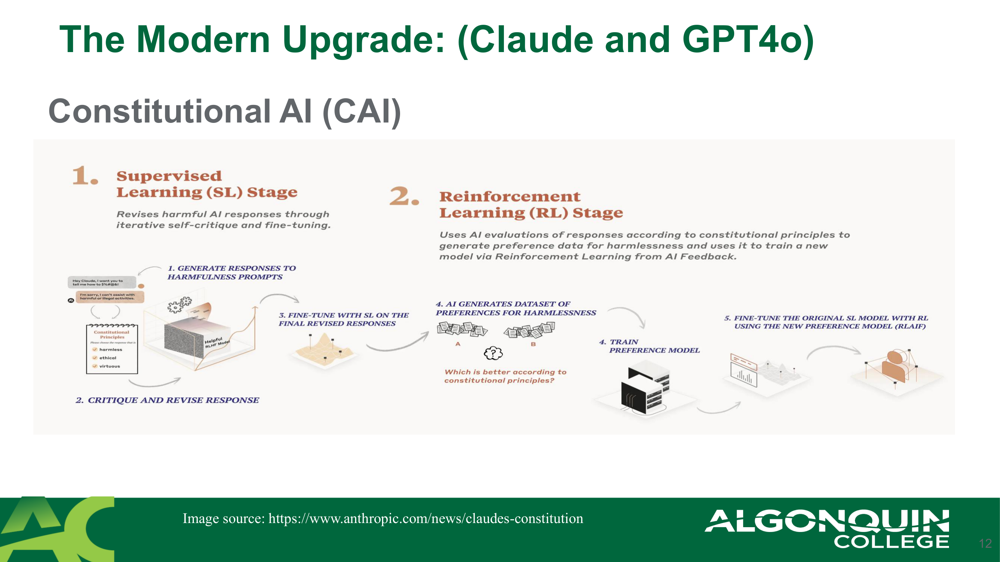

**The Modern Upgrade: (Claude and GPT4o) — Constitutional AI (CAI):** — 现代升级：（Claude 和 GPT4o）— 宪法 AI（CAI）

Ref: https://www.anthropic.com/news/claudes-constitution

> **📝 Notes:**
>
> _(To be added by note_taking skill)_

---

## 6. LLM 的局限性 (LLM Limitations)

### 6.1 知识受限于预训练数据 (Knowledge Constrained to Pretraining Data)

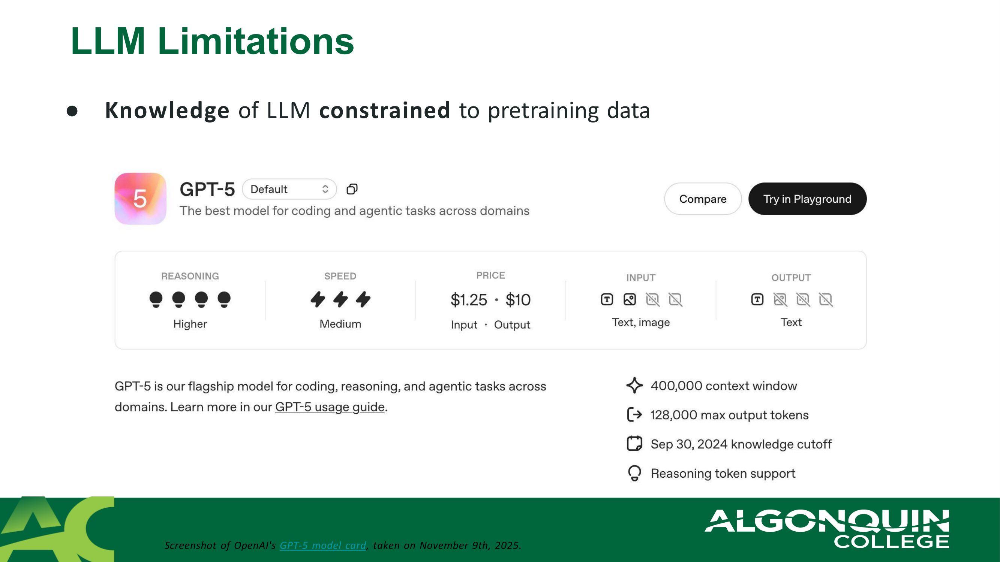

**LLM Limitations:** — LLM 局限性

- Knowledge of LLM constrained to pretraining data — LLM 的知识受限于预训练数据
- Screenshot of OpenAI's GPT-5 model card, taken on November 9th, 2025. — OpenAI GPT-5 模型卡截图，拍摄于 2025 年 11 月 9 日

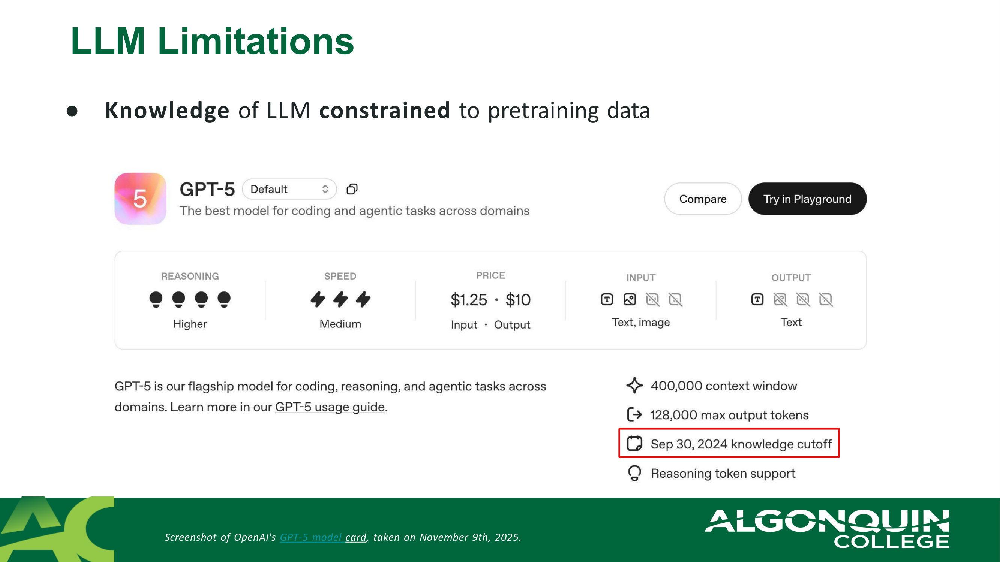

**LLM Limitations (continued):** — LLM 局限性（续）

- Knowledge of LLM constrained to pretraining data — LLM 的知识受限于预训练数据

### 6.2 有限的上下文大小 (Limited Context Size)

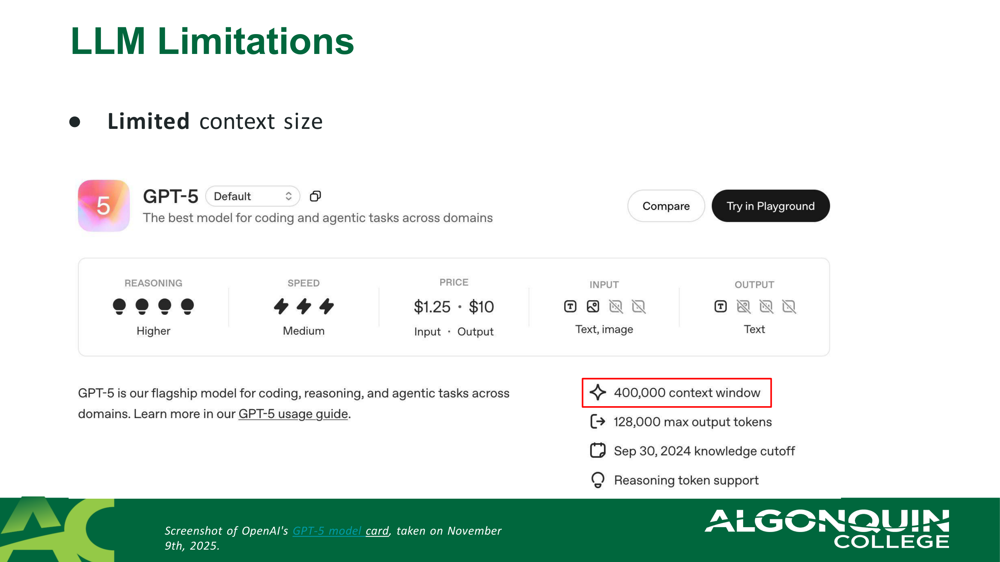

**LLM Limitations — Limited context size:** — LLM 局限性 — 有限的上下文大小

### 6.3 按 Token 定价 (Pricing Per Token)

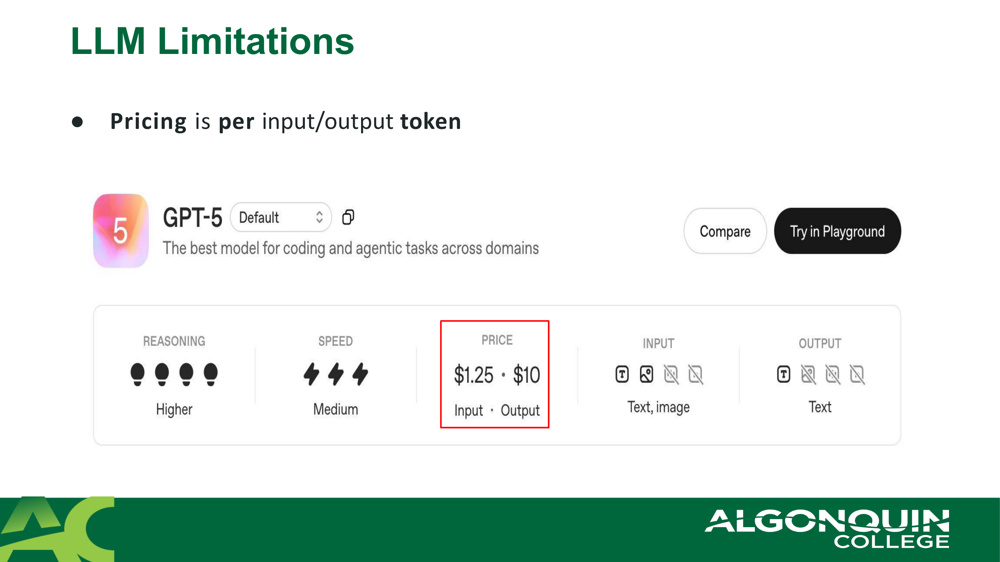

**LLM Limitations — Pricing is per input/output token:** — LLM 局限性 — 按输入/输出 token 定价

### 6.4 其他挑战 (Other LLM Challenges)

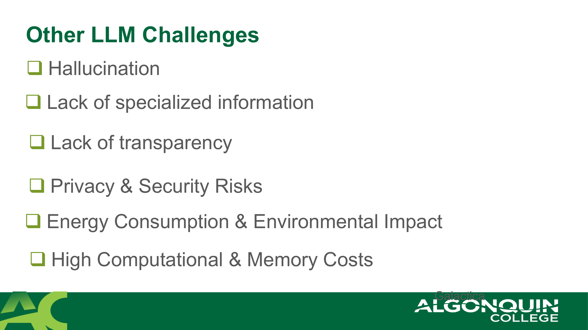

**Other LLM Challenges:** — 其他 LLM 挑战

- ❑ Hallucination — 幻觉（生成不真实的内容）
- ❑ Lack of specialized information — 缺乏专业领域信息
- ❑ Lack of transparency — 缺乏透明度
- ❑ Privacy & Security Risks — 隐私和安全风险
- ❑ Energy Consumption & Environmental Impact — 能源消耗和环境影响
- ❑ High Computational & Memory Costs — 高计算和内存成本

> **📝 Notes:**
>
> _(To be added by note_taking skill)_

---

## 7. RAG 动机与概述 (RAG: Motivations & Overview)

### 7.1 RAG 动机 (RAG Motivations)

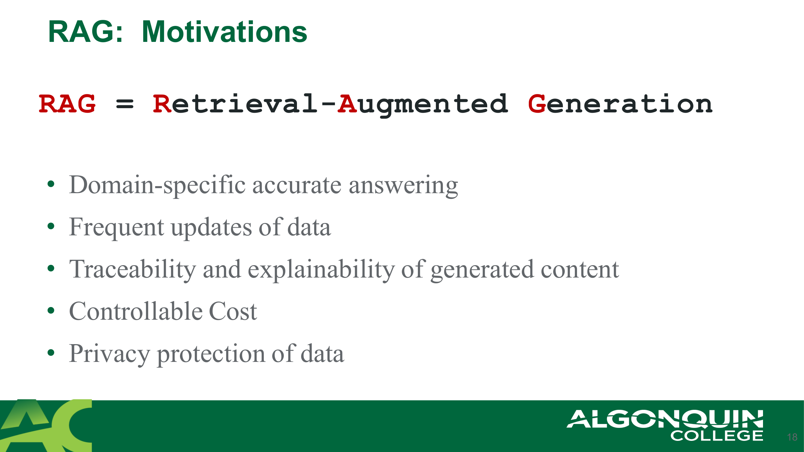

**RAG: Motivations:** — RAG 动机

- RAG = Retrieval-Augmented Generation — RAG = 检索增强生成
- Domain-specific accurate answering — 领域特定的精确回答
- Frequent updates of data — 数据频繁更新
- Traceability and explainability of generated content — 生成内容的可追溯性和可解释性
- Controllable Cost — 可控成本
- Privacy protection of data — 数据隐私保护

### 7.2 构建知识库 (Create Knowledge Base)

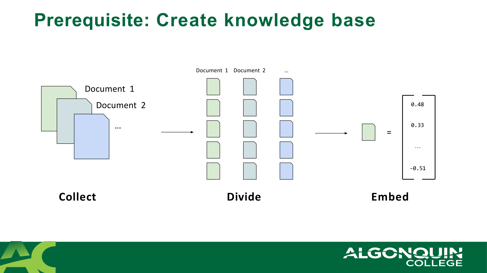

**Prerequisite: Create knowledge base:** — 前提条件：创建知识库

- **Collect** → **Divide** → **Embed** — 收集 → 分割 → 嵌入
- Document 1, Document 2, … → Chunks → Embedding vectors [0.48, 0.33, …, -0.51] — 文档 1, 文档 2, … → 分块 → 嵌入向量

### 7.3 RAG 系统 (RAG Systems)

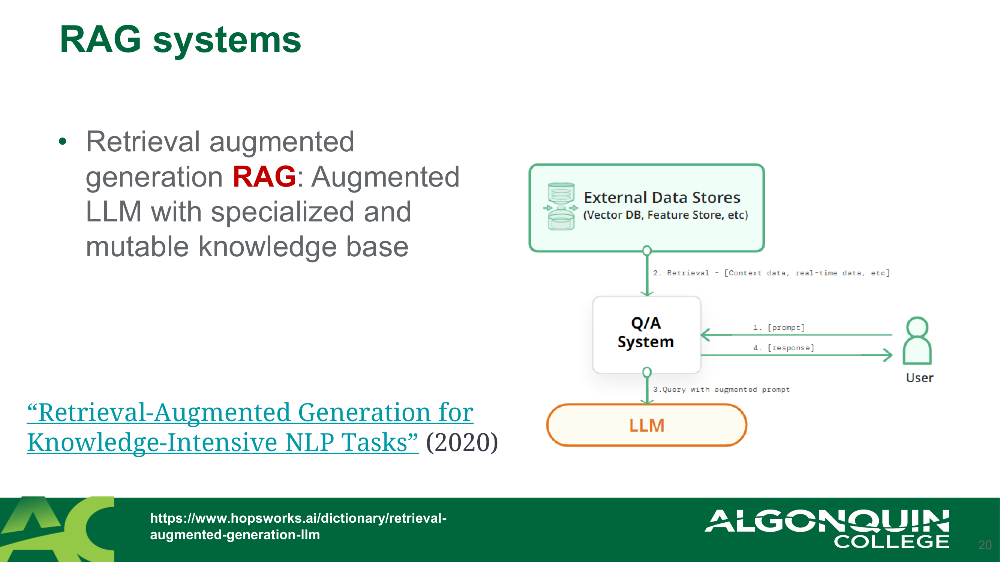

**RAG systems:** — RAG 系统

- Retrieval augmented generation RAG: Augmented LLM with specialized and mutable knowledge base — 检索增强生成 RAG：用专业且可变的知识库增强 LLM
- "Retrieval-Augmented Generation for Knowledge-Intensive NLP Tasks" (2020)

Ref: https://www.hopsworks.ai/dictionary/retrieval-augmented-generation-llm

> **📝 Notes:**
>
> _(To be added by note_taking skill)_

---

## 8. RAG 工作原理 (How RAG Works)

### 8.1 RAG 流程 (RAG Pipeline)

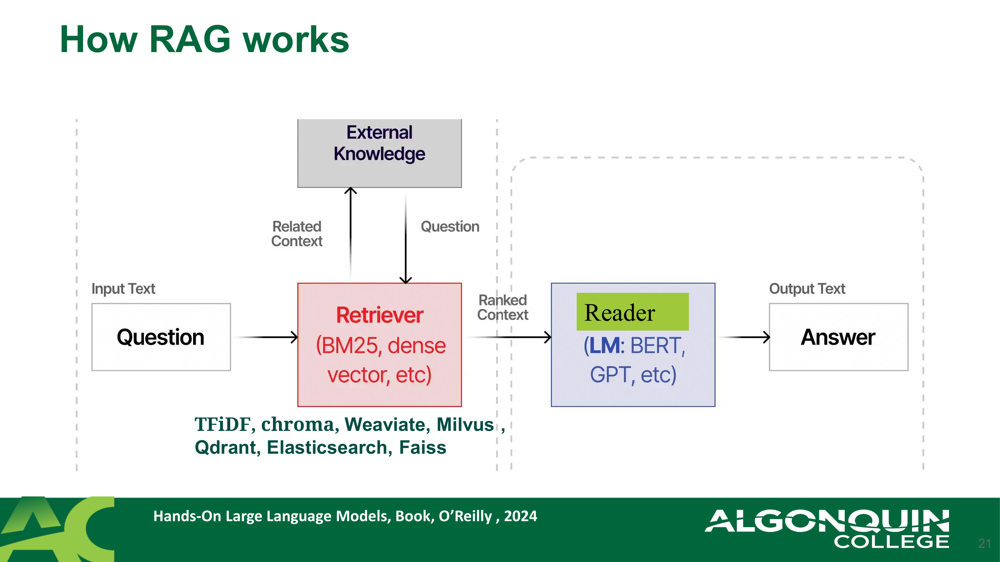

**How RAG works:** — RAG 如何工作

- Reader — 阅读器
- 向量数据库选项 (Vector DB options): TFiDF, Chroma, Weaviate, Milvus, Qdrant, Elasticsearch, Faiss

Ref: Hands-On Large Language Models, Book, O'Reilly, 2024

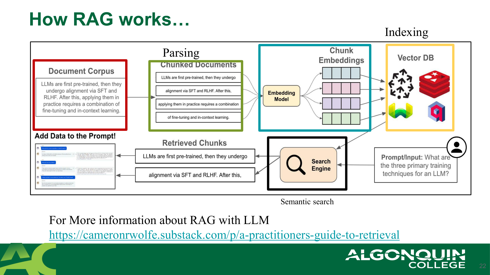

**How RAG works…:** — RAG 如何工作（续）

- **Parsing** — 解析
- **Indexing** — 索引
- **Semantic search** — 语义搜索

Ref: https://cameronrwolfe.substack.com/p/a-practitioners-guide-to-retrieval

### 8.2 分块方法 (Chunking Methods)

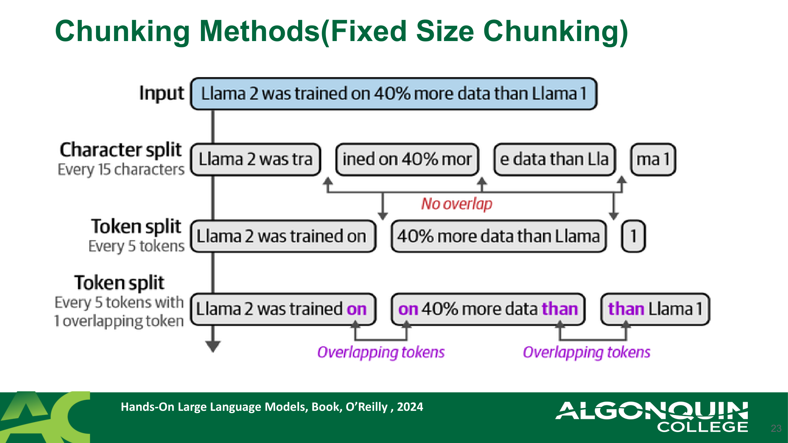

**Chunking Methods (Fixed Size Chunking):** — 分块方法（固定大小分块）

Ref: Hands-On Large Language Models, Book, O'Reilly, 2024

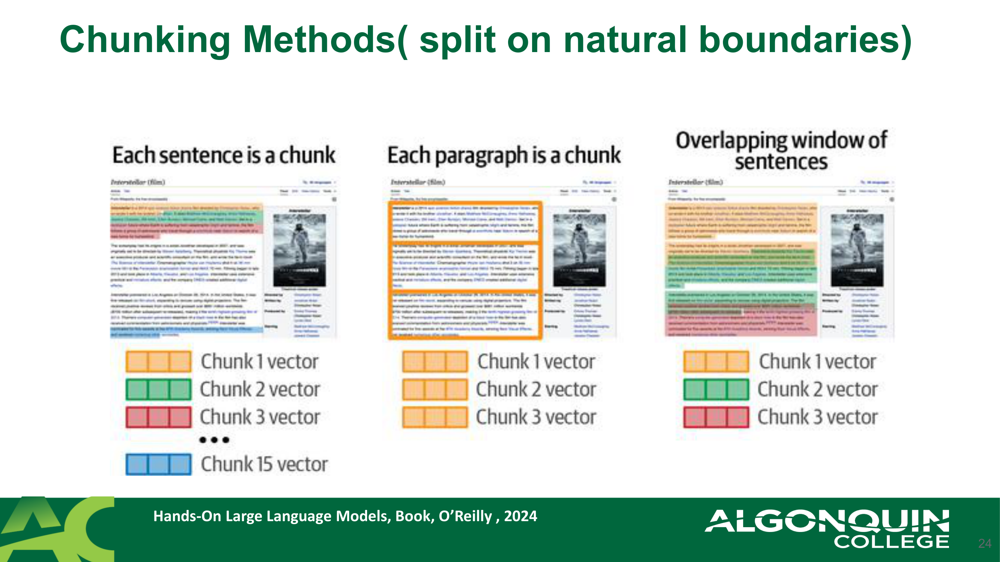

**Chunking Methods (Split on natural boundaries):** — 分块方法（按自然边界分割）

Ref: Hands-On Large Language Models, Book, O'Reilly, 2024

### 8.3 Prompt 模板 (Prompt Template)

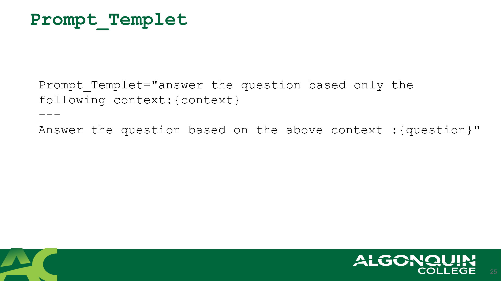

**Prompt Template:** — 提示词模板

```python
Prompt_Templet = "answer the question based only the following context:{context}
---
Answer the question based on the above context :{question}"
```

### 8.4 向量数据库 (Vector Database)

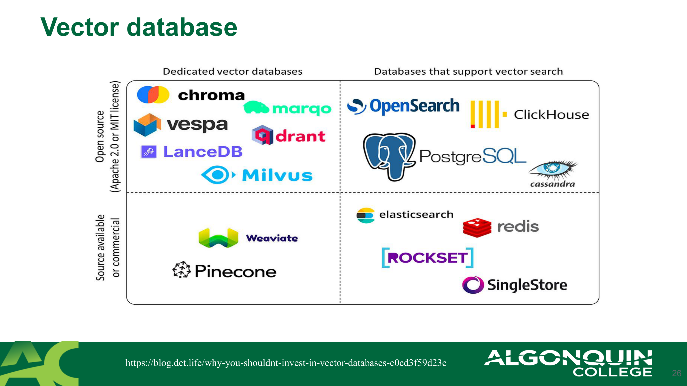

**Vector database:** — 向量数据库

Ref: https://blog.det.life/why-you-shouldnt-invest-in-vector-databases-c0cd3f59d23c

> **📝 Notes:**
>
> _(To be added by note_taking skill)_

---

## 9. 检索性能量化 (Quantify Performance of Retrieval)

### 9.1 NDCG@k (归一化折损累积增益)

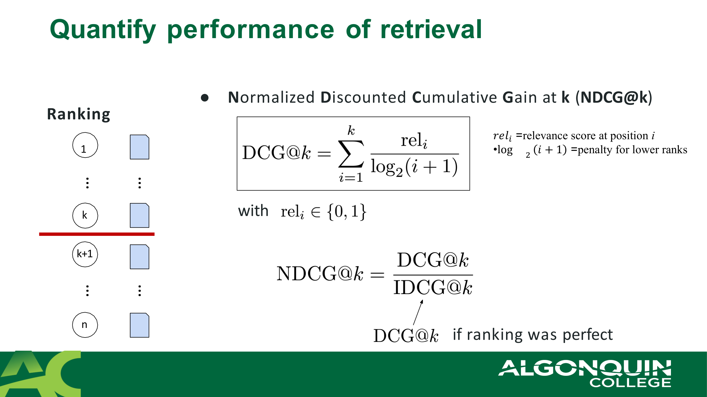

**Quantify performance of retrieval — NDCG@k:** — 检索性能量化 — 归一化折损累积增益

- **Normalized Discounted Cumulative Gain at k (NDCG@k)** — 归一化折损累积增益
- 𝑟𝑒𝑙ᵢ = relevance score at position i — 位置 i 处的相关性分数
- log₂(i + 1) = penalty for lower ranks — 对较低排名的惩罚
- IDCG = if ranking was perfect — IDCG = 如果排名是完美的

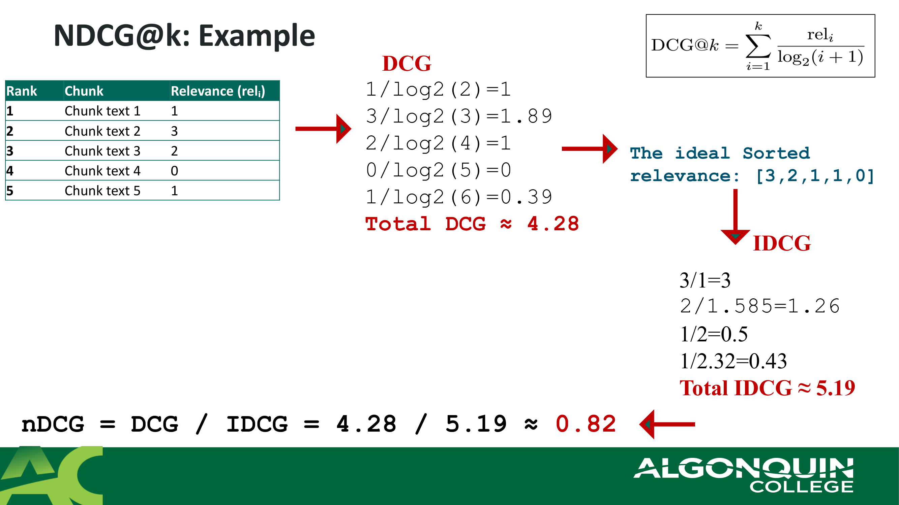

**NDCG@k: Example:** — NDCG@k 示例

| Rank — 排名 | Chunk — 分块 | Relevance (relᵢ) — 相关性 |
|---|---|---|
| 1 | Chunk text 1 | 1 |
| 2 | Chunk text 2 | 3 |
| 3 | Chunk text 3 | 2 |
| 4 | Chunk text 4 | 0 |
| 5 | Chunk text 5 | 1 |

- **DCG 计算 (DCG Calculation):**
  - 1/log₂(2)=1, 3/log₂(3)=1.89, 2/log₂(4)=1, 0/log₂(5)=0, 1/log₂(6)=0.39
  - Total DCG ≈ 4.28
- **IDCG 计算 (IDCG Calculation):** The ideal sorted relevance: [3,2,1,1,0] — 理想排序的相关性
  - 3/1=3, 2/1.585=1.26, 1/2=0.5, 1/2.32=0.43
  - Total IDCG ≈ 5.19
- **nDCG = DCG / IDCG = 4.28 / 5.19 ≈ 0.82**

### 9.2 RR@k (倒数排名)

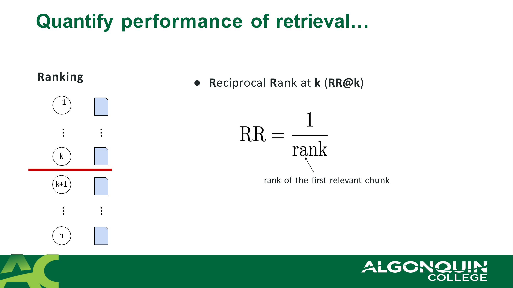

**Reciprocal Rank at k (RR@k):** — k 处的倒数排名

- rank of the first relevant chunk — 第一个相关分块的排名

### 9.3 Recall@k (召回率)

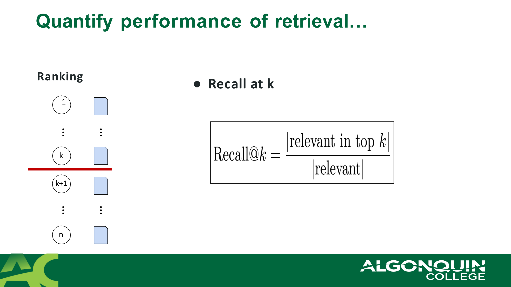

**Recall at k:** — k 处的召回率

### 9.4 Precision@k (精确率)

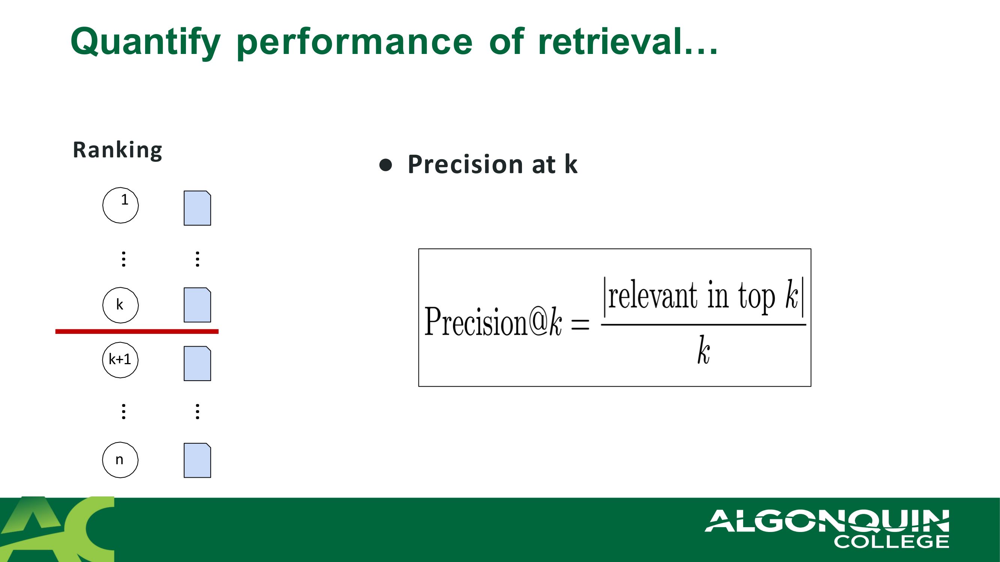

**Precision at k:** — k 处的精确率

> **📝 Notes:**
>
> _(To be added by note_taking skill)_

---

## 10. LLM 生成设置 (Settings to Keep in Mind)

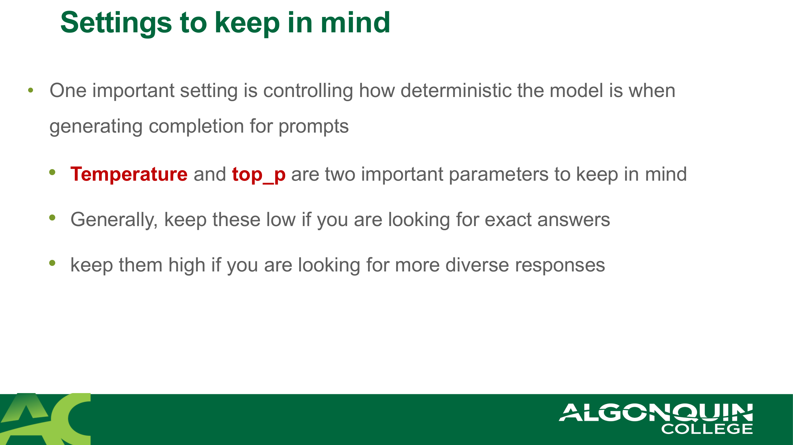

**Settings to keep in mind:** — 需要注意的设置

- One important setting is controlling how deterministic the model is when generating completion for prompts — 一个重要的设置是控制模型在生成补全时的确定性
- **Temperature** and **top_p** are two important parameters to keep in mind — Temperature 和 top_p 是两个需要记住的重要参数
- Generally, keep these low if you are looking for exact answers — 一般来说，如果需要精确答案，将这些值设低
- Keep them high if you are looking for more diverse responses — 如果需要更多样化的回答，将这些值设高

> **📝 Notes:**
>
> _(To be added by note_taking skill)_

---

## 11. RAG 框架与 LangChain (RAG Frameworks & LangChain)

### 11.1 RAG 框架概览 (RAG Frameworks Overview)

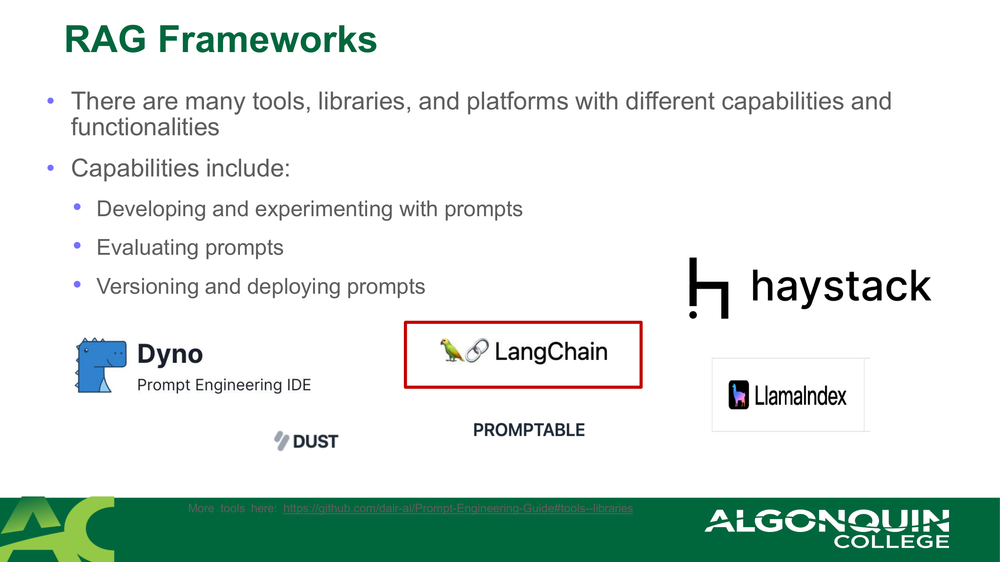

**RAG Frameworks:** — RAG 框架

- There are many tools, libraries, and platforms with different capabilities and functionalities — 有许多工具、库和平台，具有不同的功能
- Capabilities include: — 功能包括：
  - Developing and experimenting with prompts — 开发和实验提示词
  - Evaluating prompts — 评估提示词
  - Versioning and deploying prompts — 提示词版本管理和部署

Ref: https://github.com/dair-ai/Prompt-Engineering-Guide#tools--libraries

### 11.2 LangChain 框架 (LangChain Framework)

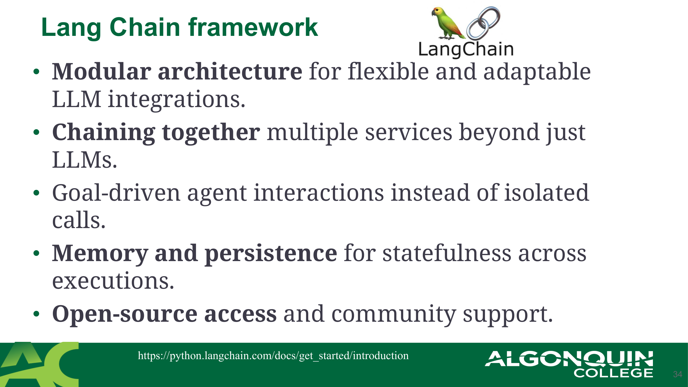

**LangChain framework:** — LangChain 框架

- Modular architecture for flexible and adaptable LLM integrations. — 模块化架构，灵活且可适配的 LLM 集成
- Chaining together multiple services beyond just LLMs. — 链接多个服务，不仅仅是 LLM
- Goal-driven agent interactions instead of isolated calls. — 目标驱动的代理交互，而非孤立调用
- Memory and persistence for statefulness across executions. — 跨执行的记忆和持久化，实现状态保持
- Open-source access and community support. — 开源访问和社区支持

Ref: https://python.langchain.com/docs/get_started/introduction

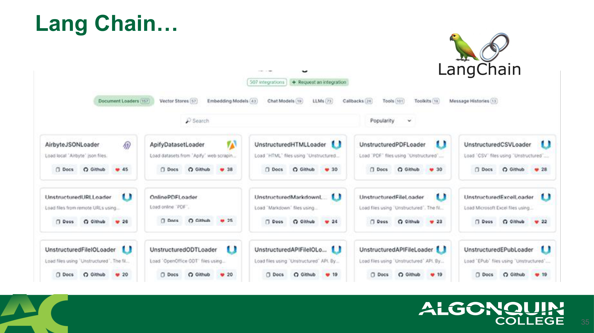

**LangChain (continued):** — LangChain（续）

> **📝 Notes:**
>
> _(To be added by note_taking skill)_

---

## 12. 开源 LLM 与本地部署 (Open Source LLMs & Local Deployment)

### 12.1 开源 LLM 概览 (Open Source LLM Overview)

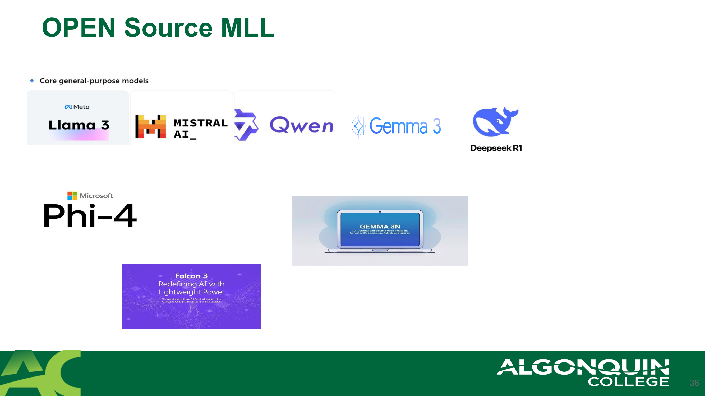

**Open Source LLMs:** — 开源大语言模型

### 12.2 8GB RAM 可运行的模型 (Models for 8 GB RAM — Laptop / Low-End PC)

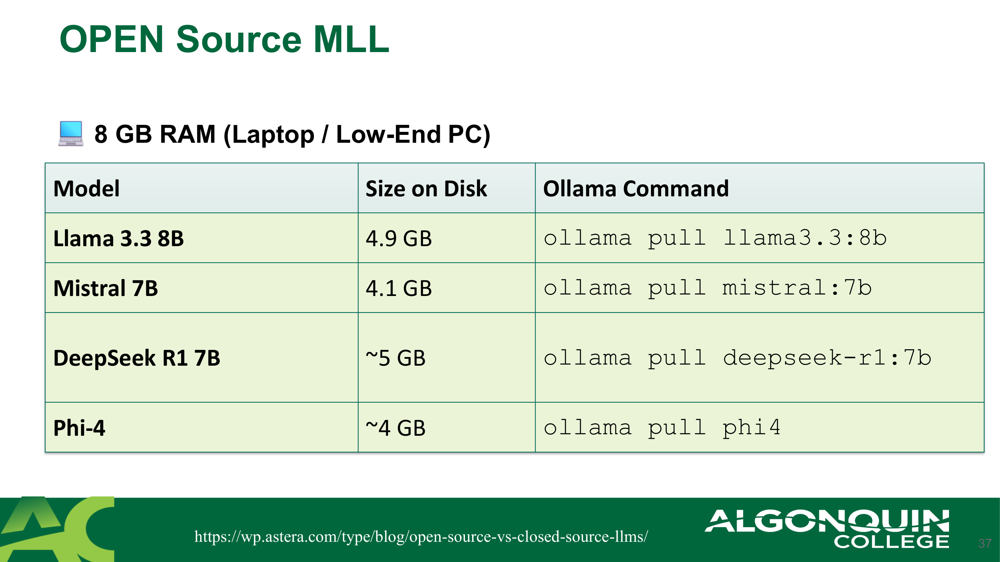

**Open Source LLMs — 8 GB RAM (Laptop / Low-End PC):** — 开源 LLM — 8 GB 内存（笔记本/低端 PC）

| Model — 模型 | Size on Disk — 磁盘大小 | Ollama Command — Ollama 命令 |
|---|---|---|
| Llama 3.3 8B | 4.9 GB | `ollama pull llama3.3:8b` |
| Mistral 7B | 4.1 GB | `ollama pull mistral:7b` |
| DeepSeek R1 7B | ~5 GB | `ollama pull deepseek-r1:7b` |
| Phi-4 | ~4 GB | `ollama pull phi4` |

Ref: https://wp.astera.com/type/blog/open-source-vs-closed-source-llms/

### 12.3 16GB RAM 可运行的模型 (Models for 16 GB RAM — Mid-Range Workstation)

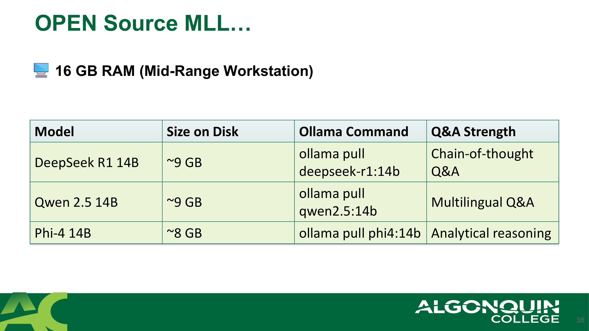

**Open Source LLMs — 16 GB RAM (Mid-Range Workstation):** — 开源 LLM — 16 GB 内存（中端工作站）

| Model — 模型 | Size on Disk — 磁盘大小 | Ollama Command — Ollama 命令 | Q&A Strength — 问答优势 |
|---|---|---|---|
| DeepSeek R1 14B | ~9 GB | `ollama pull deepseek-r1:14b` | Chain-of-thought Q&A — 思维链问答 |
| Qwen 2.5 14B | ~9 GB | `ollama pull qwen2.5:14b` | Multilingual Q&A — 多语言问答 |
| Phi-4 14B | ~8 GB | `ollama pull phi4:14b` | Analytical reasoning — 分析推理 |

### 12.4 选择运行 LLM 的平台 (Choosing a Platform to Run LLMs)

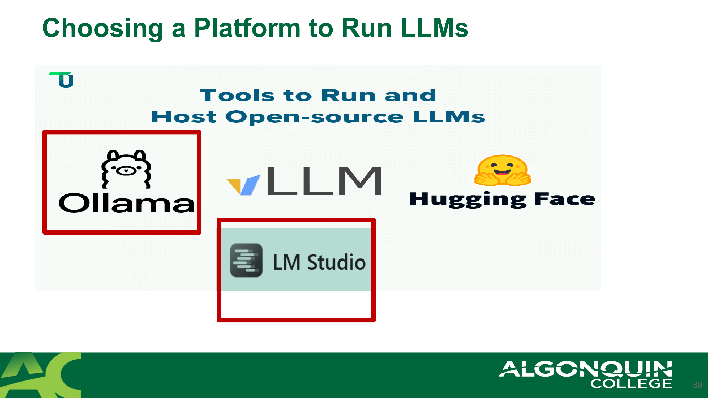

**Choosing a Platform to Run LLMs:** — 选择运行 LLM 的平台

### 12.5 Ollama vs vLLM vs Hugging Face 对比 (Comparison)

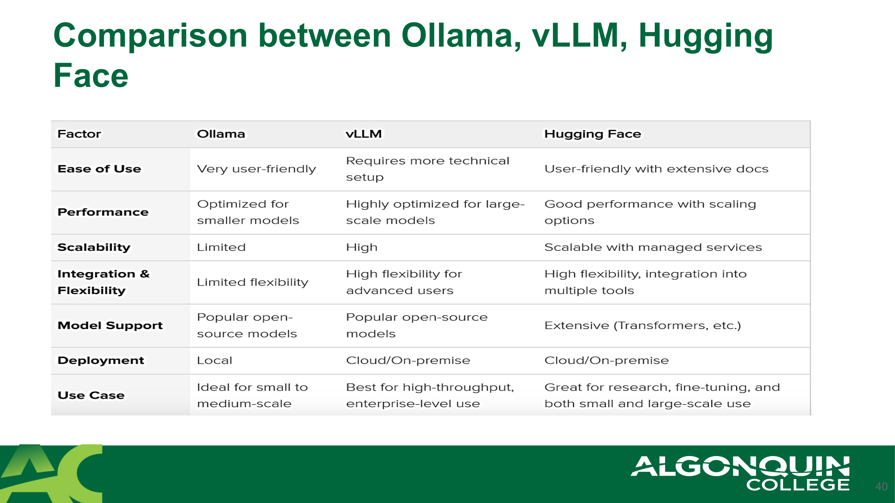

**Comparison between Ollama, vLLM, Hugging Face:** — Ollama、vLLM、Hugging Face 对比

### 12.6 开源模型资源 (Open Source Model Resources)

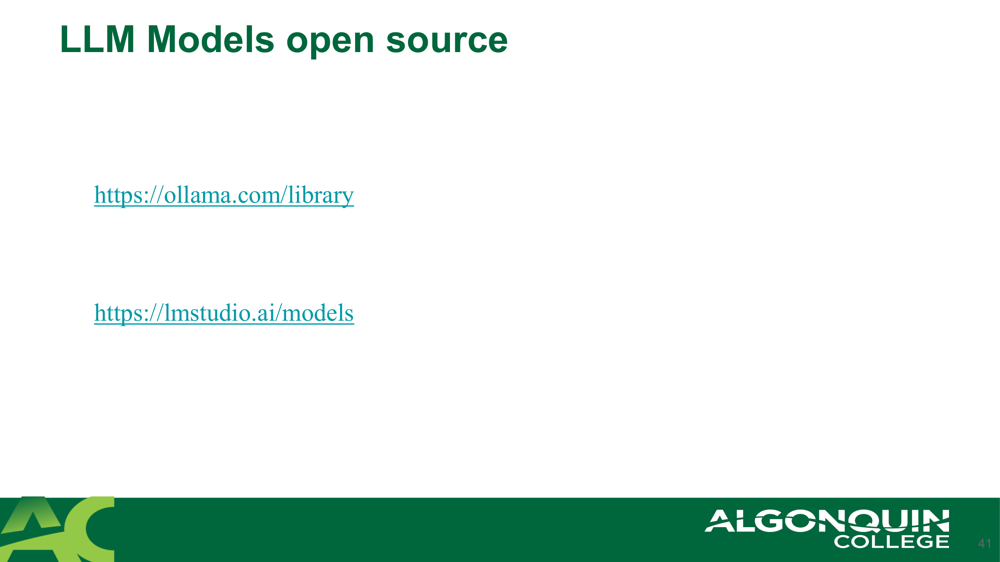

**LLM Models open source:** — 开源 LLM 模型

- https://ollama.com/library
- https://lmstudio.ai/models

> **📝 Notes:**
>
> _(To be added by note_taking skill)_

---

## 13. LLM 评估与基准 (LLM Evaluation & Benchmarks)

### 13.1 排行榜 (Leaderboard)

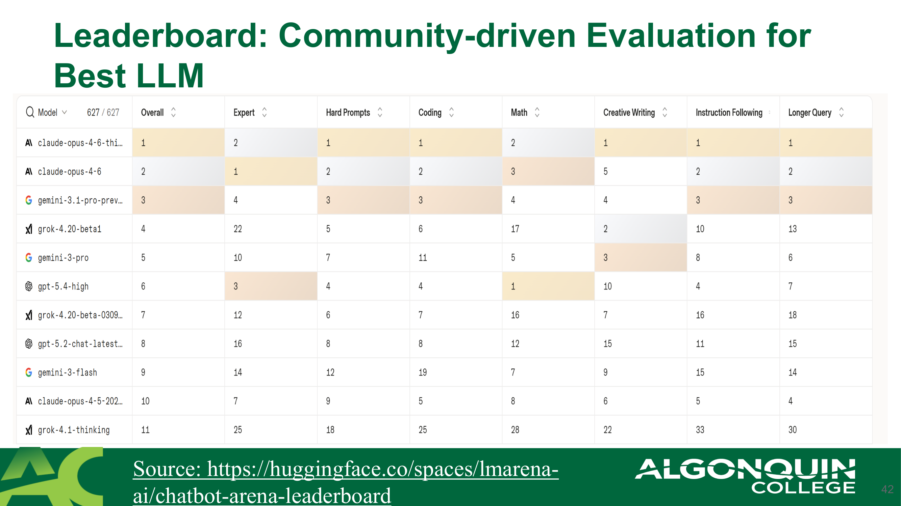

**Leaderboard: Community-driven Evaluation for Best LLM:** — 排行榜：社区驱动的最佳 LLM 评估

Ref: https://huggingface.co/spaces/lmarena-ai/chatbot-arena-leaderboard

### 13.2 HELM 评估 (Comparing Different LLM Models)

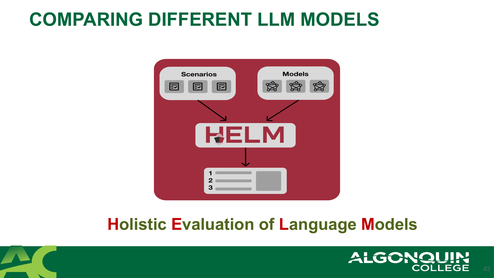

**Comparing Different LLM Models — Holistic Evaluation of Language Models (HELM):** — 对比不同 LLM 模型 — 语言模型全面评估（HELM）

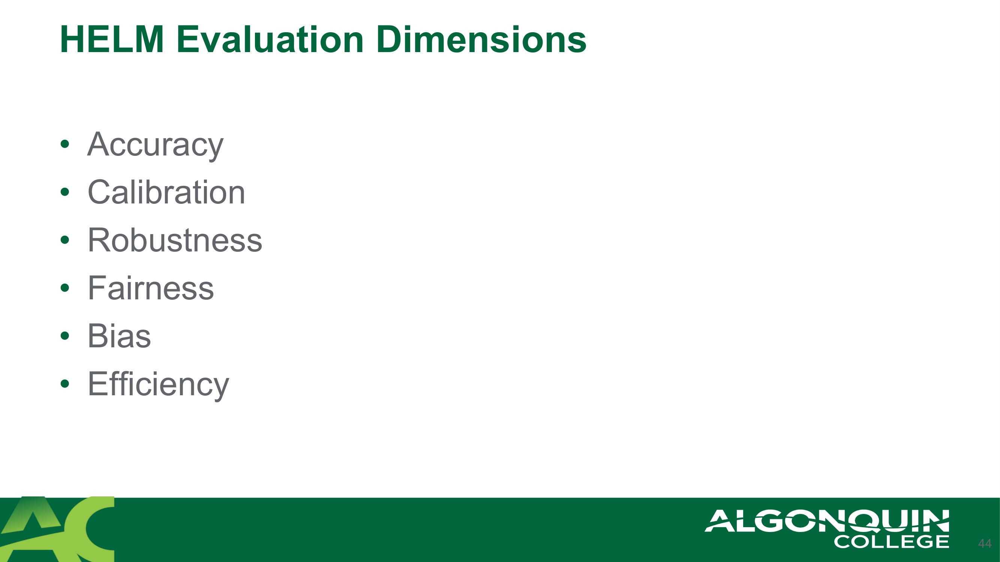

**HELM Evaluation Dimensions:** — HELM 评估维度

- **Accuracy** — 准确性
- **Calibration** — 校准性
- **Robustness** — 鲁棒性
- **Fairness** — 公平性
- **Bias** — 偏见
- **Efficiency** — 效率

> **📝 Notes:**
>
> _(To be added by note_taking skill)_

---

## 14. 问答环节 (Q&A)

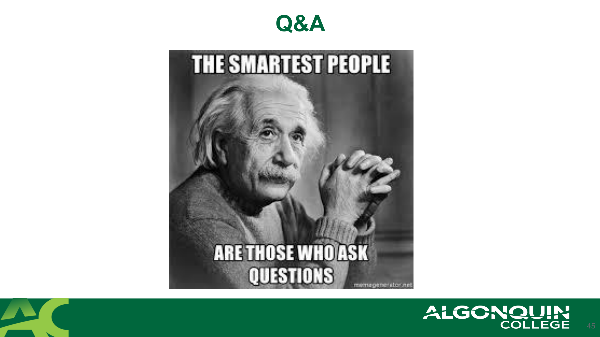

- Q&A
