# Project: AI 教科书问答系统 (AI Textbook Q&A System)

> Source: `CST 8507_Project_Presentation_v3.pdf`
> Total slides: 21
> Presenters: Hye Ran Yoo (041145212) | Peng Wang (041107730)
> Course: CST8507 Natural Language Processing | April 3, 2026

---

## 1. 项目概述 (Project Overview)

**AI Textbook Q&A System — AI 教科书问答系统**

- A RAG-Based Educational Question Answering System with Deep Source Tracing & ROS 2 Voice Integration — 一个基于 RAG 的教育问答系统，支持深度溯源和 ROS 2 语音集成
- Part 1: RAG Pipeline — 第一部分：RAG 管道
- Part 2: ROS 2 Voice — 第二部分：ROS 2 语音

---

## 2. 问题引入与动机 (Introduction & Motivation)

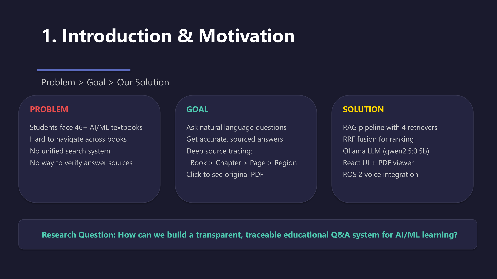

**Introduction & Motivation — 问题引入与动机**

### 2.1 问题 (Problem)

- Students face **46+ AI/ML textbooks** — 学生面对 **46+ 本 AI/ML 教科书**
- Hard to navigate across books — 跨书查找困难
- No unified search system — 没有统一的搜索系统
- No way to verify answer sources — 无法验证答案来源

### 2.2 目标 (Goal)

- Ask natural language questions — 用自然语言提问
- Get accurate, sourced answers — 获得准确、有出处的答案
- **Deep source tracing:** Book > Chapter > Page > Region — **深度溯源：** 书 > 章节 > 页码 > 区域
- Click to see original PDF — 点击查看原始 PDF

### 2.3 解决方案 (Solution)

- RAG pipeline with **4 retrievers** — 使用 **4 种检索器** 的 RAG 管道
- **RRF fusion** for ranking — **RRF 融合** 用于排名
- **Ollama LLM** (qwen2.5:0.5b) — **Ollama 大语言模型** (qwen2.5:0.5b)
- React UI + PDF viewer — React 界面 + PDF 查看器
- ROS 2 voice integration — ROS 2 语音集成

**Research Question:** How can we build a transparent, traceable educational Q&A system for AI/ML learning? — **研究问题：** 如何构建一个透明、可溯源的 AI/ML 学习教育问答系统？

---

## 3. 数据集 (Dataset — 46 AI/ML Textbooks)

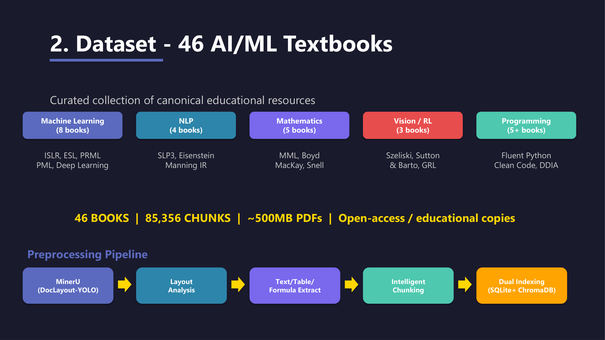

**Dataset - 46 AI/ML Textbooks — 数据集 — 46 本 AI/ML 教科书**

- Curated collection of canonical educational resources — 精选的经典教育资源

| Category — 分类 | # Books — 书数 | Examples — 示例 |
|----------|---------|----------|
| Machine Learning — 机器学习 | 8 | ISLR, ESL, PRML, PML, Deep Learning |
| NLP — 自然语言处理 | 4 | SLP3, Eisenstein, Manning IR |
| Mathematics — 数学 | 5 | MML, Boyd, MacKay, Snell |
| Vision / RL — 视觉/强化学习 | 3 | Szeliski, Sutton & Barto, GRL |
| Programming — 编程 | 5+ | Fluent Python, Clean Code, DDIA |

- **46 books** | **85,356 chunks** | **~500MB PDFs** | Open-access / educational copies — **46 本书** | **85,356 个文本块** | **约 500MB PDF** | 开源/教育副本

**Preprocessing Pipeline — 预处理管道：**

1. **MinerU** (DocLayout-YOLO) → Layout Analysis — 版面分析
2. Text / Table / Formula Extraction — 文本/表格/公式提取
3. Intelligent Chunking — 智能分块
4. **Dual Indexing** (SQLite + ChromaDB) — **双重索引**

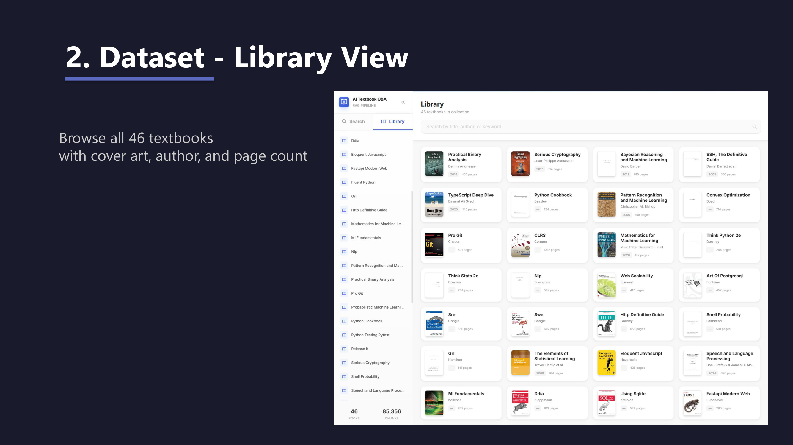

**Library View — 图书馆视图**

- Browse all 46 textbooks with cover art, author, and page count — 浏览全部 46 本教科书，含封面、作者和页数

---

## 4. RAG 架构 (RAG Architecture — Dual Scoring)

### 4.1 混合检索 + 双重评分 (4-Method Hybrid Retrieval + Dual Scoring)

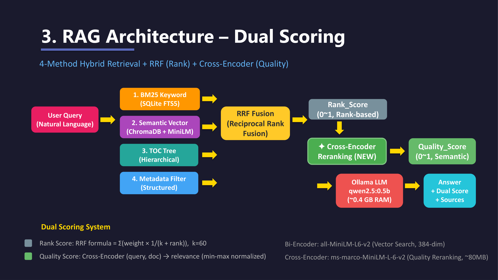

**RAG Architecture – Dual Scoring — RAG 架构 – 双重评分**

**4-Method Hybrid Retrieval + RRF (Rank) + Cross-Encoder (Quality) — 4 种混合检索 + RRF（排名）+ Cross-Encoder（质量）：**

1. **BM25 Keyword** — SQLite FTS5 — BM25 关键词检索
2. **Semantic Vector** — ChromaDB + MiniLM — 语义向量检索
3. **TOC Tree** — Hierarchical (NEW) — 目录树检索（层级式，新增）
4. **Metadata Filter** — Structured — 元数据过滤（结构化）

**Dual Scoring System — 双重评分系统：**

- **Rank Score:** RRF formula = `Σ(weight × 1/(k + rank))`, k=60 — **排名分数：** RRF 公式
- **Quality Score:** Cross-Encoder (query, doc) → relevance (min-max normalized) — **质量分数：** Cross-Encoder 语义相关性（最小-最大归一化）
- **Bi-Encoder:** all-MiniLM-L6-v2 (Vector Search, 384-dim) — **双编码器：** 向量检索，384 维
- **Cross-Encoder:** ms-marco-MiniLM-L-6-v2 (Quality Reranking, ~80MB) — **交叉编码器：** 质量重排序，约 80MB

**LLM:** Ollama qwen2.5:0.5b (~0.4 GB RAM) — 大语言模型：约 0.4GB 内存

### 4.2 评分解读 (Score Interpretation)

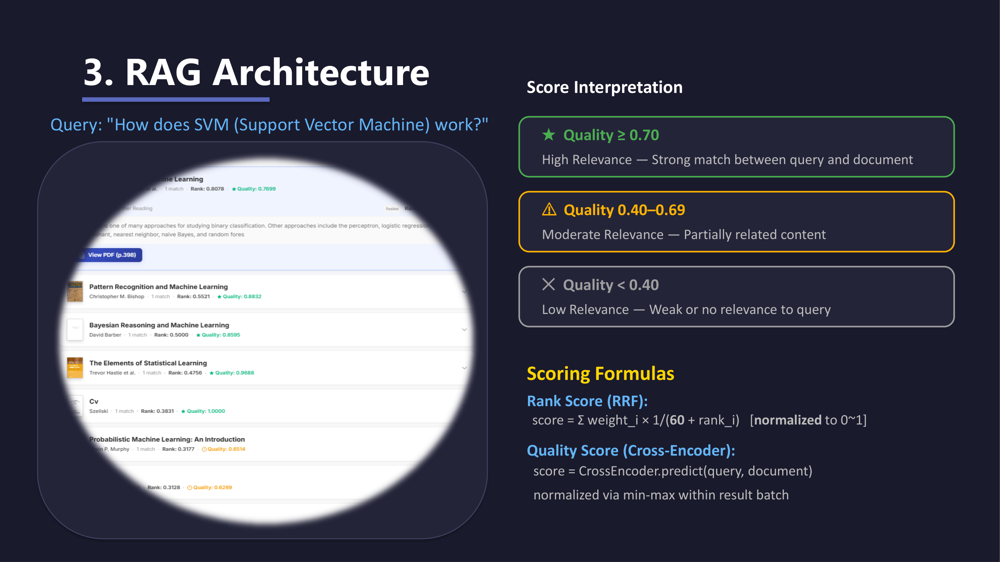

**Score Interpretation — 评分解读**

- Query: "How does SVM (Support Vector Machine) work?" — 查询："SVM（支持向量机）是如何工作的？"

| Score Range — 分数范围 | Interpretation — 解读 |
|-------------|---------------|
| ★ Quality ≥ 0.70 | High Relevance — Strong match — 高相关性 — 强匹配 |
| Quality 0.40–0.69 | Moderate Relevance — Partially related — 中等相关性 — 部分相关 |
| ✕ Quality < 0.40 | Low Relevance — Weak or no relevance — 低相关性 — 弱或不相关 |

**Scoring Formulas — 评分公式：**

- **Rank Score (RRF) — 排名分数：** `score = Σ weight_i × 1/(60 + rank_i)` [normalized to 0~1 — 归一化到 0~1]
- **Quality Score (Cross-Encoder) — 质量分数：** `score = CrossEncoder.predict(query, document)` — normalized via min-max within result batch — 在结果批次内最小-最大归一化

### 4.3 为什么需要双重评分 (Why Dual Scoring?)

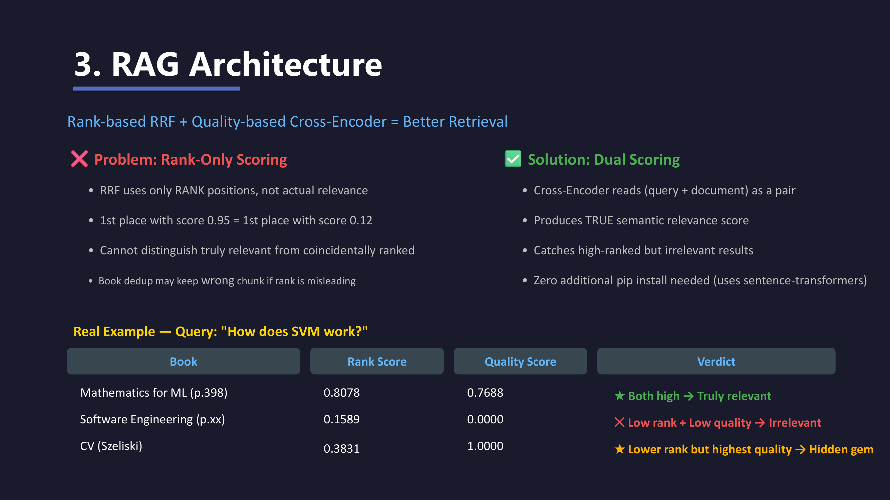

**Rank-based RRF + Quality-based Cross-Encoder = Better Retrieval — 基于排名的 RRF + 基于质量的 Cross-Encoder = 更好的检索**

**Problem: Rank-Only Scoring — 问题：仅排名评分**

- RRF uses only RANK positions, not actual relevance — RRF 仅使用排名位置，不考虑实际相关性
- 1st place with score 0.95 = 1st place with score 0.12 — 得分 0.95 的第 1 名 = 得分 0.12 的第 1 名
- Cannot distinguish truly relevant from coincidentally ranked — 无法区分真正相关和巧合排名的结果
- Book dedup may keep wrong chunk if rank is misleading — 书籍去重可能保留错误的文本块

**Solution: Dual Scoring — 解决方案：双重评分**

- Cross-Encoder reads (query + document) as a pair — Cross-Encoder 将（查询 + 文档）作为一对阅读
- Produces TRUE semantic relevance score — 产生真正的语义相关性分数
- Catches high-ranked but irrelevant results — 捕获排名高但不相关的结果
- Zero additional pip install needed (uses sentence-transformers) — 无需额外安装（使用 sentence-transformers）

**Real Example — 真实示例 — Query: "How does SVM work?"**

| Book — 书籍 | Rank Score — 排名分数 | Quality Score — 质量分数 | Verdict — 判定 |
|------|-----------|---------------|---------|
| Mathematics for ML (p.398) | 0.8078 | 0.7688 | ★ Both high → Truly relevant — 两项都高 → 真正相关 |
| Software Engineering (p.xx) | 0.1589 | 0.0000 | ✕ Low rank + Low quality → Irrelevant — 低排名 + 低质量 → 不相关 |
| CV (Szeliski) | 0.3831 | 1.0000 | ★ Lower rank but highest quality → Hidden gem — 排名低但质量最高 → 隐藏宝石 |

---

## 5. 深度溯源 (Key Feature — Deep Source Tracing)

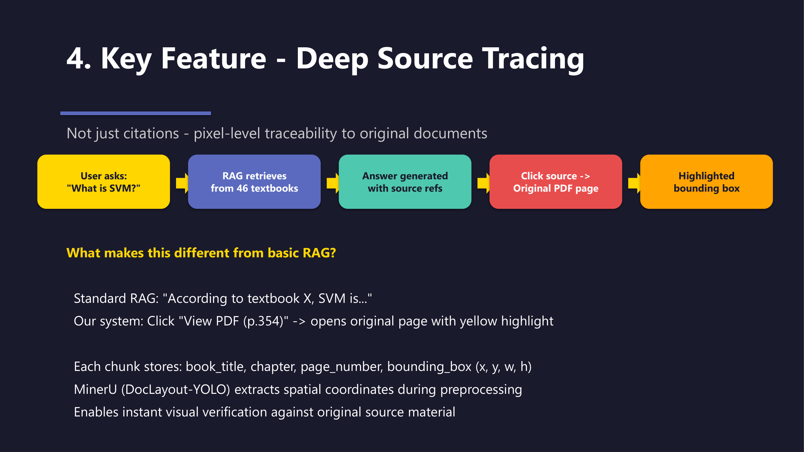

**Deep Source Tracing — 深度溯源**

- Not just citations — **pixel-level traceability** to original documents — 不仅是引用 — 到原始文档的**像素级可追溯性**

**Flow — 流程：** User asks "What is SVM?" → RAG retrieves from 46 textbooks → Answer generated with source refs → Click source → Highlighted original PDF page with bounding box — 用户提问"什么是SVM？" → RAG 从 46 本教科书中检索 → 生成带出处的答案 → 点击来源 → 显示带高亮边框的原始 PDF 页面

**What makes this different from basic RAG? — 与基本 RAG 有什么不同？**

- **Standard RAG:** "According to textbook X, SVM is..." — **标准 RAG：** "根据教科书 X，SVM 是..."
- **Our system:** Click "View PDF (p.354)" → opens original page with **yellow highlight** — **我们的系统：** 点击"查看 PDF (p.354)" → 打开原始页面并**黄色高亮**

**Each chunk stores — 每个文本块存储：**

- `book_title` — 书名, `chapter` — 章节, `page_number` — 页码, `bounding_box` (x, y, w, h) — 边界框
- **MinerU** (DocLayout-YOLO) extracts spatial coordinates during preprocessing — **MinerU** 在预处理时提取空间坐标
- Enables instant visual verification against original source material — 支持即时对照原始资料进行视觉验证

---

## 6. React UI 界面 (React UI — Search & Results & PDF Viewer)

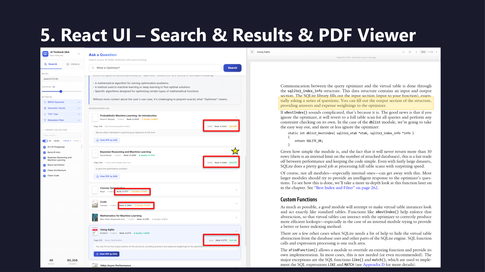

**React UI – Search & Results & PDF Viewer — React 界面 — 搜索、结果与 PDF 查看器**

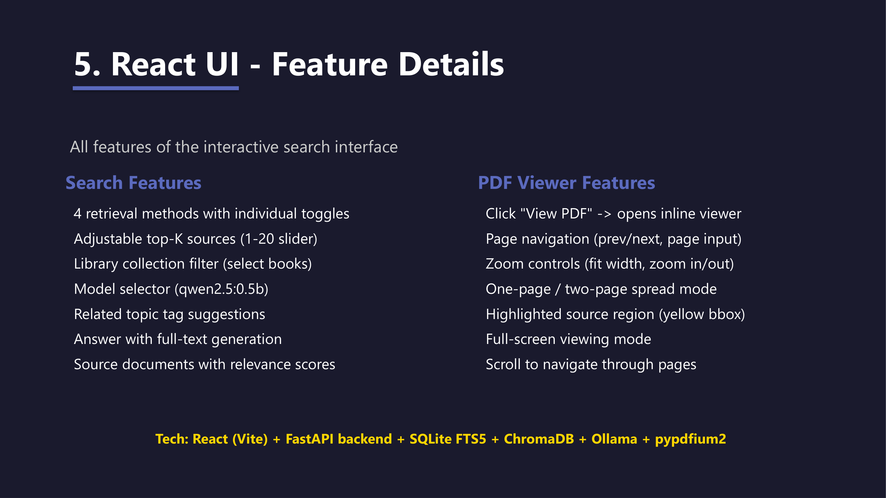

**React UI - Feature Details — React 界面 — 功能详情**

### 6.1 搜索功能 (Search Features)

- 4 retrieval methods with individual toggles — 4 种检索方法，可独立切换
- Adjustable **top-K sources** (1–20 slider) — 可调节的 **top-K 来源**（1–20 滑块）
- Library collection filter (select books) — 图书馆馆藏过滤（选择书籍）
- Model selector (qwen2.5:0.5b) — 模型选择器
- Related topic tag suggestions — 相关主题标签建议
- Answer with full-text generation — 全文生成答案
- Source documents with relevance scores — 带相关性分数的来源文档

### 6.2 PDF 查看器 (PDF Viewer Features)

- Click "View PDF" → opens inline viewer — 点击"查看 PDF" → 打开内嵌查看器
- Page navigation (prev/next, page input) — 页面导航（上一页/下一页、页码输入）
- Zoom controls (fit width, zoom in/out) — 缩放控制（适应宽度、放大/缩小）
- One-page / two-page spread mode — 单页/双页展开模式
- **Highlighted source region** (yellow bbox) — **高亮来源区域**（黄色边框）
- Full-screen viewing mode — 全屏查看模式
- Scroll to navigate through pages — 滚动浏览页面

**Tech — 技术栈：** React (Vite) + FastAPI backend + SQLite FTS5 + ChromaDB + Ollama + pypdfium2

---

## 7. 评估 (Evaluation — 20 Test Questions)

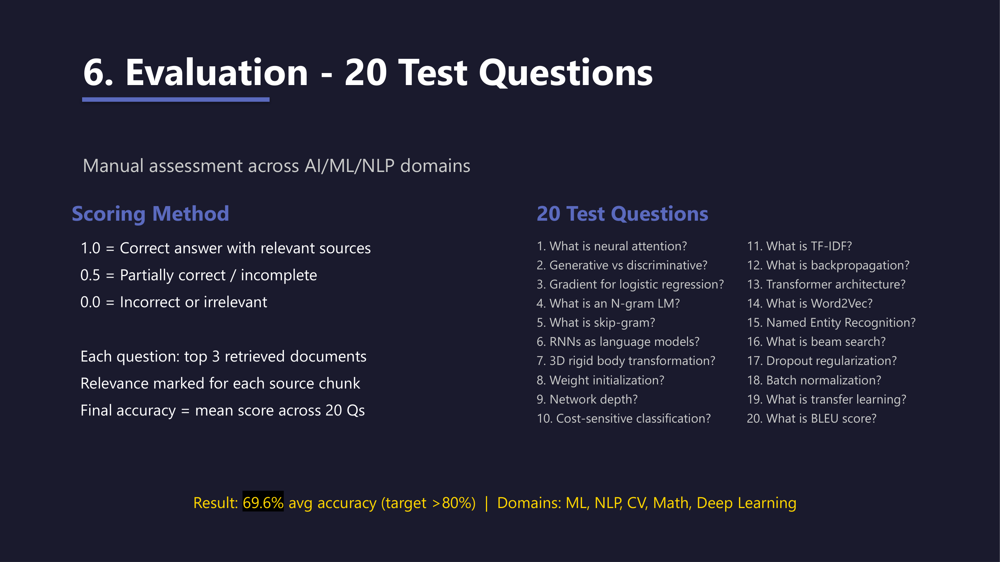

**Evaluation - 20 Test Questions — 评估 — 20 个测试问题**

**Scoring Method — 评分方法：**

- **1.0** = Correct answer with relevant sources — 正确答案且来源相关
- **0.5** = Partially correct / incomplete — 部分正确/不完整
- **0.0** = Incorrect or irrelevant — 错误或不相关

**20 Test Questions — 20 个测试问题** — Manual assessment across AI/ML/NLP domains — 跨 AI/ML/NLP 领域的人工评估：

| # | Question — 问题 | # | Question — 问题 |
|---|----------|---|----------|
| 1 | What is neural attention? — 什么是神经注意力？ | 11 | What is TF-IDF? — 什么是 TF-IDF？ |
| 2 | Generative vs discriminative? — 生成式 vs 判别式？ | 12 | What is backpropagation? — 什么是反向传播？ |
| 3 | Gradient for logistic regression? — 逻辑回归的梯度？ | 13 | Transformer architecture? — Transformer 架构？ |
| 4 | What is an N-gram LM? — 什么是 N-gram 语言模型？ | 14 | What is Word2Vec? — 什么是 Word2Vec？ |
| 5 | What is skip-gram? — 什么是 skip-gram？ | 15 | Named Entity Recognition? — 命名实体识别？ |
| 6 | RNNs as language models? — RNN 作为语言模型？ | 16 | What is beam search? — 什么是束搜索？ |
| 7 | 3D rigid body transformation? — 3D 刚体变换？ | 17 | Dropout regularization? — Dropout 正则化？ |
| 8 | Weight initialization? — 权重初始化？ | 18 | Batch normalization? — 批量归一化？ |
| 9 | Network depth? — 网络深度？ | 19 | What is transfer learning? — 什么是迁移学习？ |
| 10 | Cost-sensitive classification? — 代价敏感分类？ | 20 | What is BLEU score? — 什么是 BLEU 分数？ |

**Result — 结果：** 69.6% avg accuracy (target >80%) — 69.6% 平均准确率（目标 >80%） | Domains — 领域：ML, NLP, CV, Math, Deep Learning

---

## 8. ROS 2 语音集成 (ROS 2 Voice Integration)

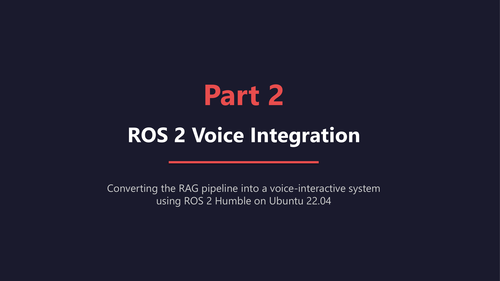

**ROS 2 Voice Integration — ROS 2 语音集成**

- Converting the RAG pipeline into a **voice-interactive system** using ROS 2 Humble on Ubuntu 22.04 — 将 RAG 管道转换为**语音交互系统**，使用 Ubuntu 22.04 上的 ROS 2 Humble

### 8.1 五节点架构 (5-Node Pipeline Architecture)

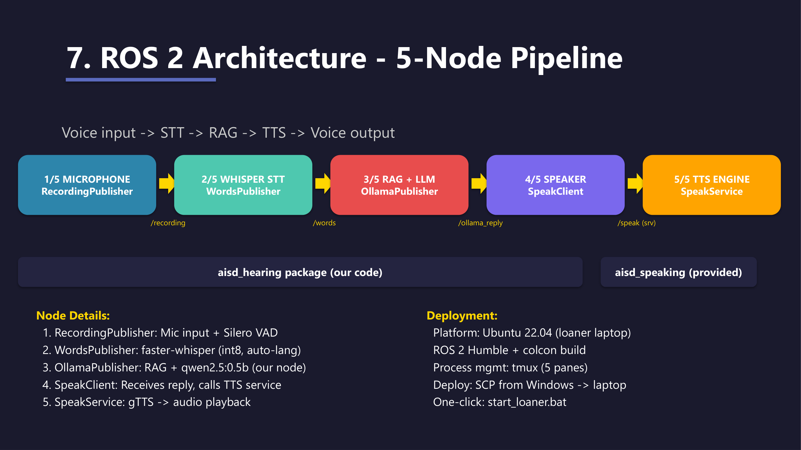

**ROS 2 Architecture - 5-Node Pipeline — ROS 2 架构 — 五节点管道**

**Voice input → STT → RAG → TTS → Voice output — 语音输入 → 语音转文字 → RAG → 文字转语音 → 语音输出**

| # | Node — 节点 | Topic/Service — 话题/服务 | Package — 包 |
|---|------|---------------|---------|
| 1 | RecordingPublisher — 录音发布者 | `/recording` | aisd_hearing (our code — 我们的代码) |
| 2 | WordsPublisher (Whisper STT) — 文字发布者 | `/words` | aisd_hearing |
| 3 | OllamaPublisher (RAG + LLM) — Ollama 发布者 | `/ollama_reply` | aisd_hearing |
| 4 | SpeakClient — 朗读客户端 | `/speak` (srv) | aisd_speaking (provided — 提供的) |
| 5 | SpeakService (TTS Engine) — 朗读服务 | `/speak` (srv) | aisd_speaking |

**Node Details — 节点详情：**

1. **RecordingPublisher:** Mic input + Silero VAD — 麦克风输入 + Silero 语音活动检测
2. **WordsPublisher:** faster-whisper (int8, auto-lang) — 快速 Whisper（int8 量化，自动语言检测）
3. **OllamaPublisher:** RAG + qwen2.5:0.5b (our node) — RAG + qwen2.5:0.5b（我们的节点）
4. **SpeakClient:** Receives reply, calls TTS service — 接收回复，调用 TTS 服务
5. **SpeakService:** gTTS → audio playback — gTTS → 音频播放

**Deployment — 部署：** Ubuntu 22.04 (loaner laptop — 借用笔记本) | ROS 2 Humble + colcon build | Process mgmt: tmux (5 panes — 5 个窗格) | Deploy: SCP from Windows → laptop — 从 Windows SCP 到笔记本 | One-click: `start_loaner.bat` — 一键启动

### 8.2 实现细节 (Implementation Details)

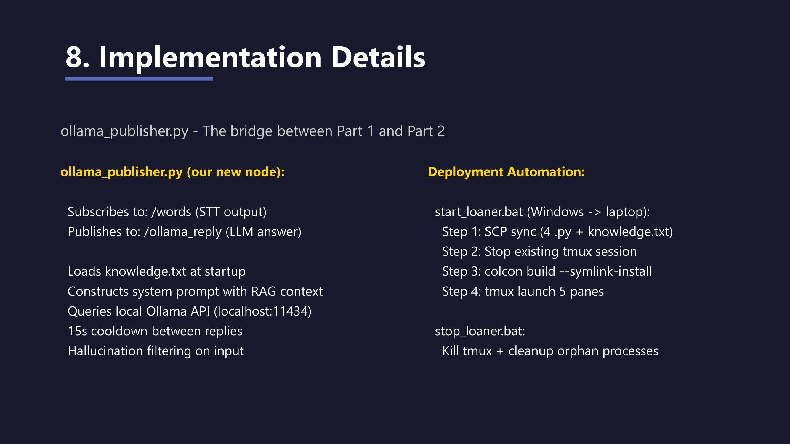

**Implementation Details — 实现细节**

**`ollama_publisher.py` — The bridge between Part 1 and Part 2 — 第一部分和第二部分之间的桥梁：**

- Subscribes to: `/words` (STT output) — 订阅：`/words`（语音转文字输出）
- Publishes to: `/ollama_reply` (LLM answer) — 发布到：`/ollama_reply`（LLM 答案）
- Loads `knowledge.txt` at startup — 启动时加载 `knowledge.txt`
- Constructs system prompt with RAG context — 用 RAG 上下文构建系统提示词
- Queries local Ollama API (`localhost:11434`) — 查询本地 Ollama API
- 15s cooldown between replies — 回复间隔 15 秒冷却
- Hallucination filtering on input — 输入端幻觉过滤

**Deployment Automation — 部署自动化：**

- `start_loaner.bat` (Windows → laptop — 从 Windows 到笔记本):
  1. SCP sync (4 `.py` + `knowledge.txt`) — SCP 同步
  2. Stop existing tmux session — 停止现有 tmux 会话
  3. `colcon build --symlink-install` — 编译构建
  4. tmux launch 5 panes — tmux 启动 5 个窗格

- `stop_loaner.bat`: Kill tmux + cleanup orphan processes — 终止 tmux + 清理孤儿进程

---

## 9. ROS 2 演示 (ROS 2 Demo — Live Voice Q&A)

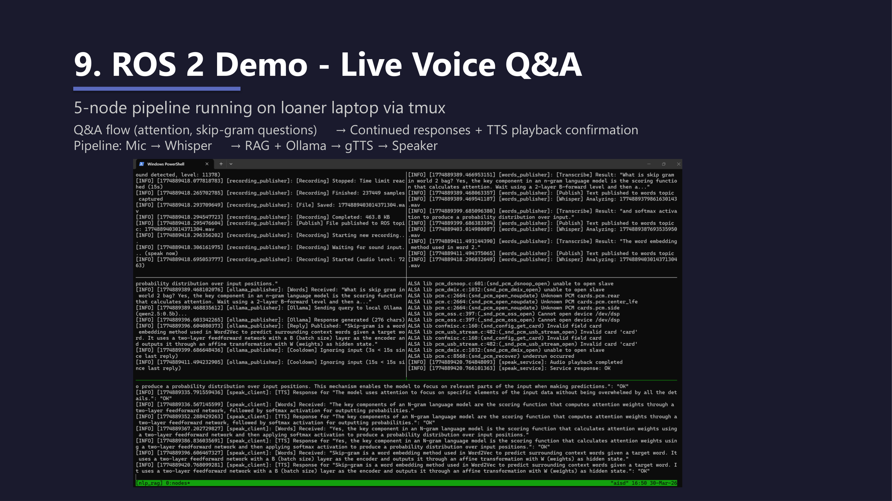

**ROS 2 Demo - Live Voice Q&A — ROS 2 演示 — 实时语音问答**

- 5-node pipeline running on loaner laptop via tmux — 五节点管道通过 tmux 在借用笔记本上运行
- Q&A flow (attention, skip-gram questions) → Continued responses + TTS playback confirmation — 问答流程（注意力、skip-gram 问题）→ 持续回复 + TTS 播放确认
**Pipeline — 管道：**

| 步骤 | 组件 | 干了什么 | 类比 |
|---|---|---|---|
| ① | **Mic** (麦克风) | 录下你说的话，保存为 `.wav` 音频文件 | 你对着系统说话 |
| ② | **Whisper** (语音转文字) | 把音频变成文字，比如你说 "What is attention" → 输出文字 `"What is attention"` | 速记员把你说的话写下来 |
| ③ | **RAG + Ollama** (检索+生成) | **RAG** 从 `knowledge.txt` 里找到相关知识，**Ollama** (qwen2.5 模型) 根据这些知识生成一段回答文字 | 学生翻书找答案，然后用自己的话写出来 |
| ④ | **gTTS** (文字转语音) | 把生成的回答文字变成语音音频 | 把写好的答案念出来 |
| ⑤ | **Speaker** (扬声器) | 播放语音，你就听到了答案 | 你听到回答 |

**tmux 五窗格说明 (5 Panes Explained):**

| # | Pane Position — 窗格位置 | Node — 节点 | Function — 功能 |
|---|---|---|---|
| 1 | Top-Left — 左上 | **RecordingPublisher** (录音发布者) | Mic capture + Silero VAD → records `.wav` → publishes to `/recording` topic. Logs: "Recording Started/Finished/File Saved" — 麦克风采集 + Silero 语音活动检测 → 录制 `.wav` → 发布到 `/recording` 话题 |
| 2 | Top-Right — 右上 | **WordsPublisher** (Whisper STT 文字发布者) | Subscribes `/recording` → faster-whisper (int8) transcribes audio to text → publishes to `/words` topic. Logs: "[Transcribe] Result: ..." — 订阅 `/recording` → 语音转文字 → 发布到 `/words` 话题 |
| 3 | Middle-Left — 左中 | **OllamaPublisher** (RAG + LLM 节点) | Subscribes `/words` → builds RAG prompt with `knowledge.txt` → queries Ollama qwen2.5:0.5b → publishes to `/ollama_reply`. Logs: "[Words] Received / [Reply] Published" + 15s cooldown — 订阅 `/words` → 构建 RAG 提示词 → 查询 Ollama → 发布到 `/ollama_reply`，含 15 秒冷却 |
| 4 | Middle-Right — 右中 | **SpeakService** (TTS 语音合成服务) | Provides `/speak` service → gTTS converts text to speech → audio playback. Logs: "Audio playback completed / Service response: OK" — 提供 `/speak` 服务 → gTTS 文字转语音 → 播放音频 |
| 5 | Bottom (full-width) — 底部全宽 | **SpeakClient** (朗读客户端) | Subscribes `/ollama_reply` → calls `/speak` service to read aloud. Logs: "[Words] Received / [TTS] Response" — 订阅 `/ollama_reply` → 调用 `/speak` 服务朗读回答 |

**Data Flow — 数据流：** 🎤 Mic → ① RecordingPublisher → ② WordsPublisher (Whisper) → ③ OllamaPublisher (RAG+LLM) → ⑤ SpeakClient → ④ SpeakService (gTTS) → 🔊 Speaker

**tmux session — tmux 会话：** `[nlp_rag] 0:nodes*` (green status bar at bottom — 底部绿色状态栏)

---

## 10. 成果总结 (Results — Key Achievements)

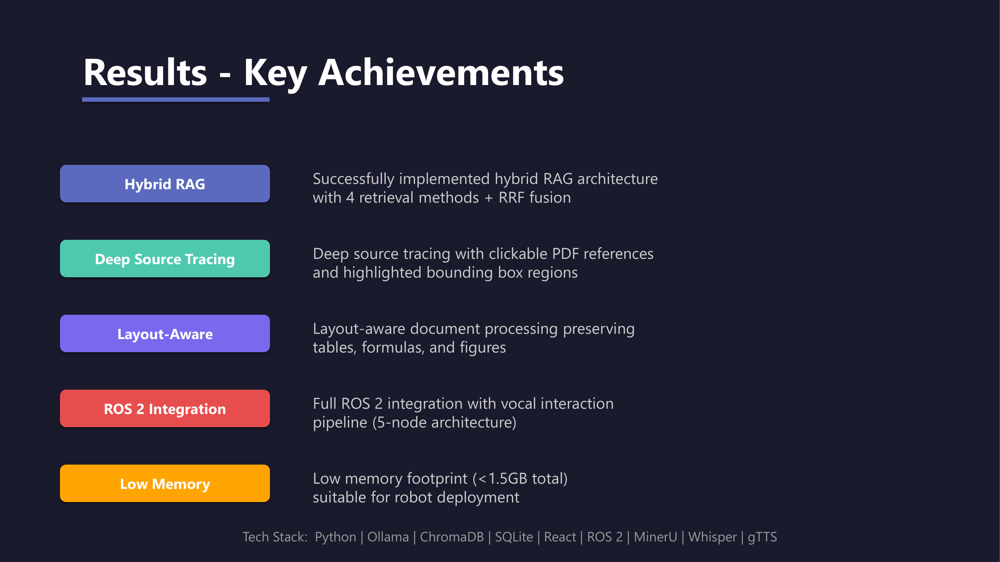

**Results - Key Achievements — 成果 — 关键成就**

| Achievement — 成就 | Description — 描述 |
|-------------|-------------|
| **Hybrid RAG — 混合 RAG** | 4 retrieval methods + RRF fusion — 4 种检索方法 + RRF 融合 |
| **Deep Source Tracing — 深度溯源** | Clickable PDF references + highlighted bounding box regions — 可点击 PDF 引用 + 高亮边界框区域 |
| **Layout-Aware — 版面感知** | Document processing preserving tables, formulas, and figures — 保留表格、公式和图形的文档处理 |
| **ROS 2 Integration — ROS 2 集成** | Full vocal interaction pipeline (5-node architecture) — 完整语音交互管道（5 节点架构） |
| **Low Memory — 低内存** | <1.5GB total, suitable for robot deployment — 总共 <1.5GB，适合机器人部署 |

**Tech Stack — 技术栈：** Python | Ollama | ChromaDB | SQLite | React | ROS 2 | MinerU | Whisper | gTTS

---

## 11. 挑战与解决方案 (Challenges & Solutions)

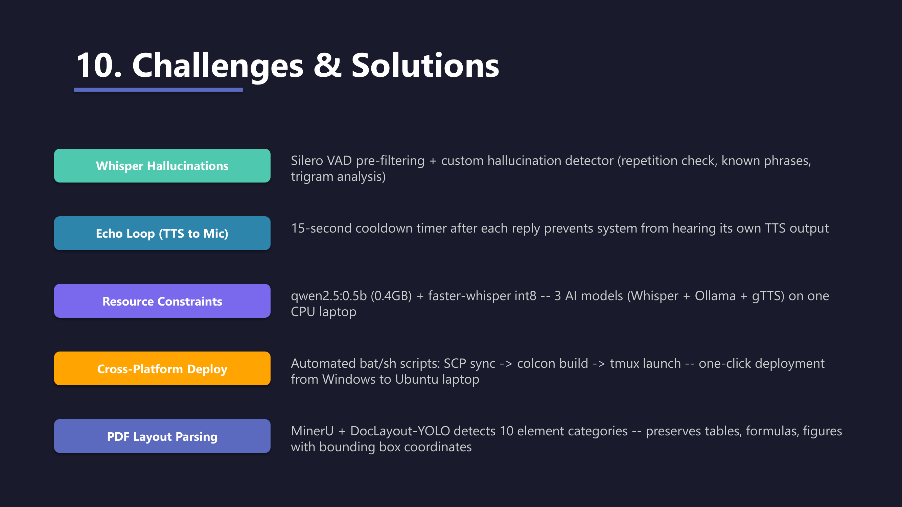

**Challenges & Solutions — 挑战与解决方案**

| Challenge — 挑战 | Solution — 解决方案 |
|-----------|----------|
| **Whisper Hallucinations — Whisper 幻觉** | Silero VAD pre-filtering + custom hallucination detector (repetition check, known phrases, trigram analysis) — Silero VAD 预过滤 + 自定义幻觉检测器（重复检查、已知短语、三元组分析） |
| **Echo Loop (TTS to Mic) — 回声循环（TTS 到麦克风）** | 15-second cooldown timer after each reply prevents system from hearing its own TTS output — 每次回复后 15 秒冷却计时器，防止系统听到自己的 TTS 输出 |
| **Resource Constraints — 资源限制** | qwen2.5:0.5b (0.4GB) + faster-whisper int8 — 3 AI models on one CPU laptop — qwen2.5:0.5b (0.4GB) + faster-whisper int8 — 3 个 AI 模型在一台 CPU 笔记本上 |
| **Cross-Platform Deploy — 跨平台部署** | Automated bat/sh scripts: SCP sync → colcon build → tmux launch — one-click Windows to Ubuntu — 自动化 bat/sh 脚本：SCP 同步 → colcon 构建 → tmux 启动 — 一键从 Windows 到 Ubuntu |
| **PDF Layout Parsing — PDF 版面解析** | MinerU + DocLayout-YOLO detects 10 element categories — preserves tables, formulas, figures with bounding box coordinates — MinerU + DocLayout-YOLO 检测 10 种元素类别 — 保留表格、公式、图形及边界框坐标 |

---

## 12. 讨论与未来工作 (Discussion & Future Work)

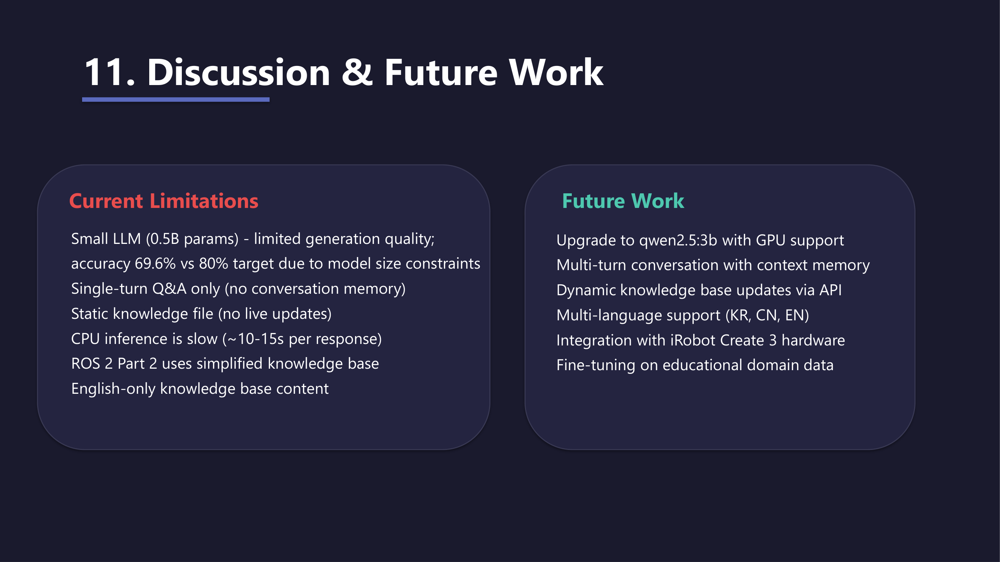

**Discussion & Future Work — 讨论与未来工作**

### 12.1 当前局限 (Current Limitations)

- Small LLM (0.5B params) — limited generation quality; accuracy 69.6% vs 80% target due to model size constraints — 小型 LLM（0.5B 参数）— 生成质量有限；因模型大小限制，准确率 69.6% vs 目标 80%
- Single-turn Q&A only (no conversation memory) — 仅支持单轮问答（无对话记忆）
- Static knowledge file (no live updates) — 静态知识文件（无实时更新）
- CPU inference is slow (~10–15s per response) — CPU 推理速度慢（每次回复约 10-15 秒）
- ROS 2 Part 2 uses simplified knowledge base — ROS 2 第二部分使用简化的知识库
- English-only knowledge base content — 仅英文知识库内容

### 12.2 未来方向 (Future Work)

- Upgrade to qwen2.5:3b with GPU support — 升级到 qwen2.5:3b 并支持 GPU
- Multi-turn conversation with context memory — 支持上下文记忆的多轮对话
- Dynamic knowledge base updates via API — 通过 API 动态更新知识库
- Multi-language support (KR, CN, EN) — 多语言支持（韩文、中文、英文）
- Integration with iRobot Create 3 hardware — 与 iRobot Create 3 硬件集成
- Fine-tuning on educational domain data — 在教育领域数据上微调

---

## 13. 结论 (Conclusion)

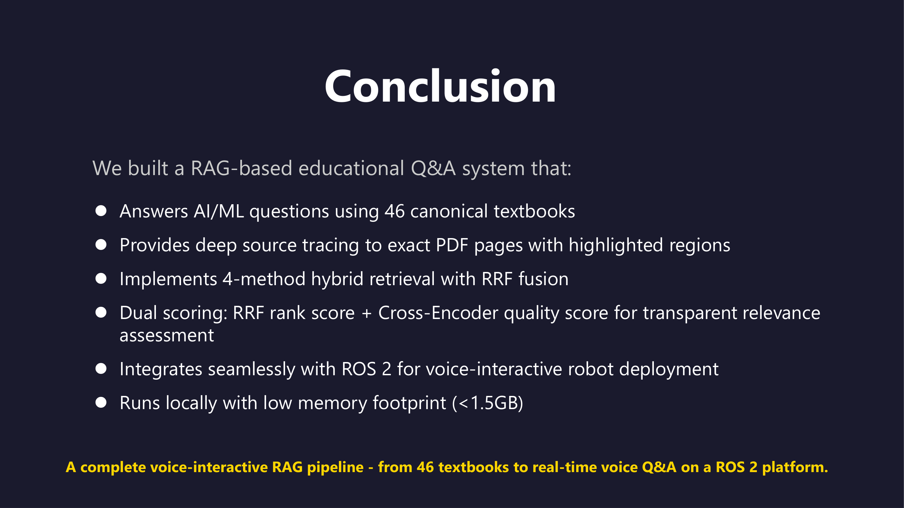

**Conclusion — 结论**

We built a **RAG-based educational Q&A system** that: — 我们构建了一个**基于 RAG 的教育问答系统**：

- Answers AI/ML questions using **46 canonical textbooks** — 使用 **46 本经典教科书** 回答 AI/ML 问题
- Provides **deep source tracing** to exact PDF pages with highlighted regions — 提供到精确 PDF 页面的**深度溯源**，带高亮区域
- Implements **4-method hybrid retrieval** with RRF fusion — 实现 **4 种混合检索方法** 和 RRF 融合
- **Dual scoring:** RRF rank score + Cross-Encoder quality score for transparent relevance assessment — **双重评分：** RRF 排名分数 + Cross-Encoder 质量分数，透明的相关性评估
- Integrates seamlessly with **ROS 2** for voice-interactive robot deployment — 与 **ROS 2** 无缝集成，支持语音交互机器人部署
- Runs locally with **low memory footprint (<1.5GB)** — 本地运行，**低内存占用（<1.5GB）**

> A complete voice-interactive RAG pipeline — from 46 textbooks to real-time voice Q&A on a ROS 2 platform. — 一个完整的语音交互 RAG 管道 — 从 46 本教科书到 ROS 2 平台上的实时语音问答。

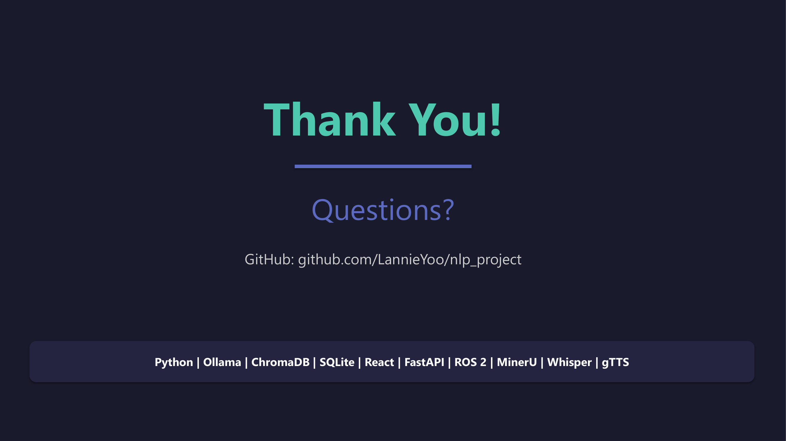

**Thank You! — 谢谢！**

**GitHub:** github.com/LannieYoo/nlp_project

**Tech Stack — 技术栈：** Python | Ollama | ChromaDB | SQLite | React | FastAPI | ROS 2 | MinerU | Whisper | gTTS
