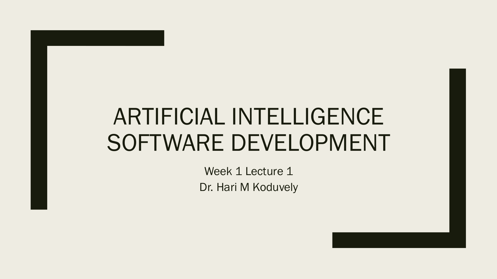
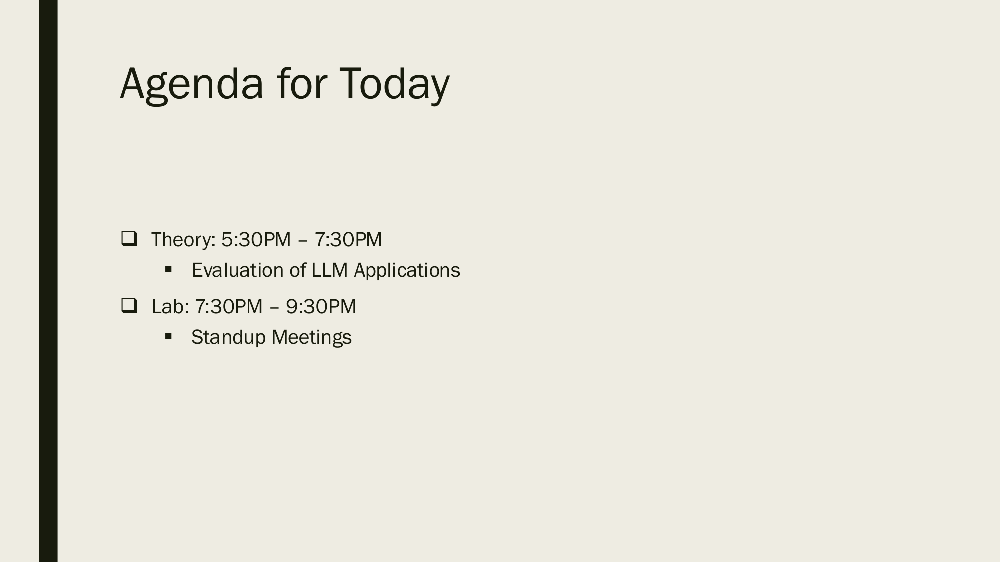
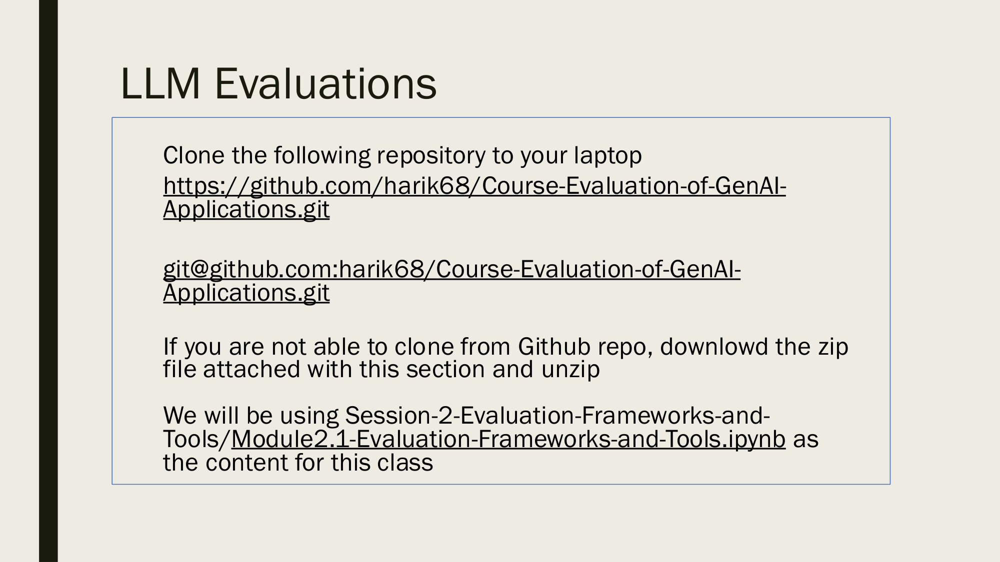

# Week 2: 评估框架与工具 (Evaluation Frameworks and Tools)

> Source: `Week 2-Lecture 1.pdf`
> Total slides: 3
> Instructor: Dr. Hari M Koduvely

---

## 1. 课程封面 (Title Slide)

**ARTIFICIAL INTELLIGENCE SOFTWARE DEVELOPMENT — 人工智能软件开发**

- Week 2 Lecture — 第2周课程
- Dr. Hari M Koduvely

---

## 2. 今日议程 (Agenda for Today)

**Agenda for Today — 今日议程**

- ❑ Theory: 5:30PM – 7:30PM — 理论课：5:30PM – 7:30PM
  - ▪ Evaluation of LLM Applications — LLM 应用评估
- ❑ Lab: 7:30PM – 9:30PM — 实验课：7:30PM – 9:30PM
  - ▪ Standup Meetings — 站会

---

## 3. LLM 评估 (LLM Evaluations)

**LLM Evaluations — LLM 评估**

- Clone the following repository to your laptop — 将以下仓库克隆到你的电脑
  - https://github.com/harik68/Course-Evaluation-of-GenAI-Applications.git
  - git@github.com:harik68/Course-Evaluation-of-GenAI-Applications.git
- If you are not able to clone from Github repo, download the zip file attached with this section and unzip — 如果无法从 GitHub 克隆，请下载本节附带的 zip 文件并解压
- We will be using Session-2-Evaluation-Frameworks-and-Tools/Module2.1-Evaluation-Frameworks-and-Tools.ipynb as the content for this class — 本节课使用 Session-2 中的 Module2.1 Notebook 作为教学内容
