# Week 11: 提示优化、反思与高级 RAG (Prompt Optimization, Reflection, and Advanced RAG)

> Source: `26W-CST8510-Week11-Lecture1.pdf`
> Total slides: 26
> Instructor: Dr. Hari M Koduvely

---

## 1. 课程议程 (Agenda)

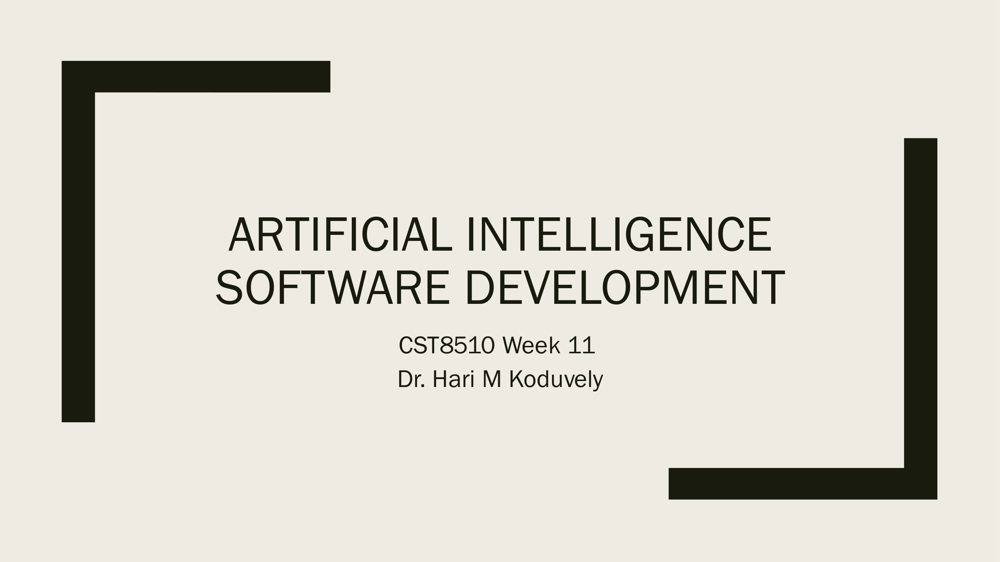

**ARTIFICIAL INTELLIGENCE SOFTWARE DEVELOPMENT — 人工智能软件开发**

- CST8510 Week 11

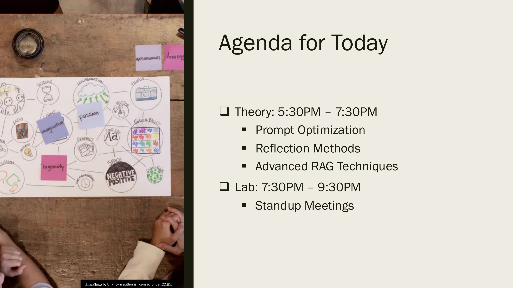

**Agenda for Today — 今日议程**

- ❑ Theory: 5:30PM – 7:30PM — 理论课：5:30PM – 7:30PM
  - Prompt Optimization — 提示优化
  - Reflection Methods — 反思方法
  - Advanced RAG Techniques — 高级 RAG 技术
- ❑ Lab: 7:30PM – 9:30PM — 实验课：7:30PM – 9:30PM
  - Standup Meetings — 站会

---

## 2. 提示优化 (Prompt Optimization)

### 2.1 不确定性阈值与自一致性 (Uncertainty Thresholding with Self-Consistency)

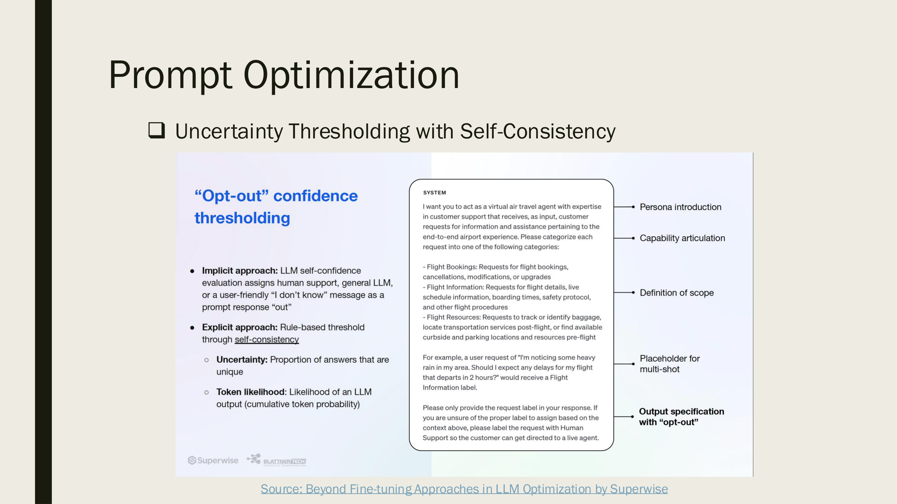

**Prompt Optimization — 提示优化**

- ❑ Uncertainty Thresholding with Self-Consistency — 不确定性阈值与自一致性

> 📖 **图解读笔记：**
>
> 该图展示了三种不同的 LLM 优化策略分类（来自 Superwise "Beyond Fine-tuning Approaches in LLM Optimization"）：
>
> | 策略 Strategy | 含义 Meaning |
> |------|------|
> | Prompt Optimization | 提示优化 — 通过改进输入提示来提升 LLM 输出质量 |
> | Knowledge Optimization | 知识优化 — 通过外部知识（如 RAG）增强 LLM 的知识 |
> | Inference Optimization | 推理优化 — 通过解码策略/缓存等提升推理效率 |
>
> **核心思想**：不需要微调模型权重，仅通过优化"输入"和"推理过程"就能大幅提升 LLM 表现。

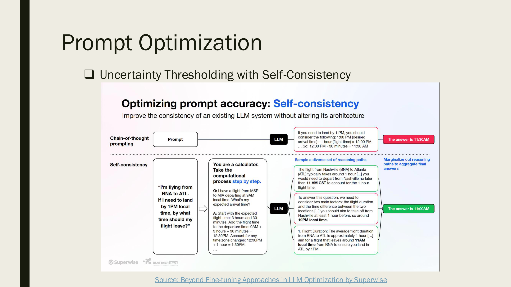

**Prompt Optimization — 提示优化（方法概览）**

> 📖 **图解读笔记：**
>
> 该图将 Prompt Optimization 展开为多种具体方法：
>
> | 方法 Method | 含义 Meaning |
> |------|------|
> | **Prompt Engineering** | 提示工程 — 手动设计提示（Zero-shot, Few-shot, CoT 等） |
> | **Prompt Tuning / Prefix Tuning** | 提示调优 — 学习可训练的 soft prompt 前缀 |
> | **Self-Consistency** | 自一致性 — 多次采样 + 多数投票选最佳答案 |
> | **OPRO** | 通过提示优化 — 用 LLM 自身迭代优化提示 |
>
> **人话解释**：从手动写提示 → 自动学提示 → 多次投票选最佳 → 让 LLM 自己优化提示，方法越来越自动化。

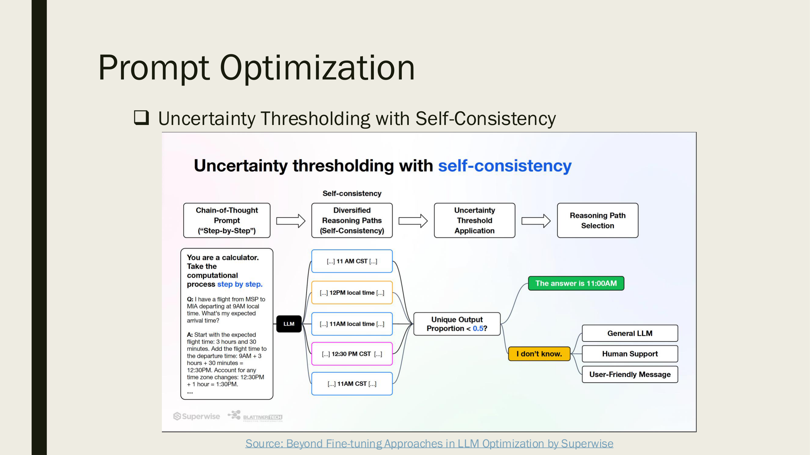

**Self-Consistency — 自一致性**

> 📖 **图解读笔记：**
>
> 该图展示了 Self-Consistency 的工作流程：
>
> 1. **同一问题** 输入 LLM，使用不同解码路径（diverse reasoning paths）
> 2. LLM 生成 **多个不同的 Chain-of-Thought 推理链**
> 3. 每条推理链得出一个答案
> 4. 对所有答案进行 **多数投票（Majority Vote）**，选出最终答案
>
> **人话解释**：问同一个问题 N 次 → 得到 N 个答案 → 投票选最多的那个。像"三个臭皮匠赛过诸葛亮"。
>
> **关键洞察**：Self-Consistency 不需要任何额外训练，只需在推理时增加采样次数，用投票消除随机性。

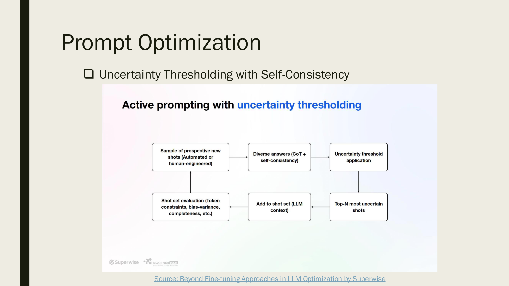

**Uncertainty Thresholding — 不确定性阈值**

> 📖 **图解读笔记：**
>
> 该图在 Self-Consistency 基础上增加了一个"守门员"——不确定性阈值：
>
> 1. 多次采样得到多个答案
> 2. 计算 **一致性比例（Agreement Ratio）**
> 3. 如果一致性 ≥ 阈值 → 直接返回答案
> 4. 如果一致性 < 阈值 → 说明 LLM 对这个问题 **不确定**，交给人类或更强模型处理
>
> **考试要点**：Uncertainty Thresholding = Self-Consistency + 置信度阈值判断。低置信度时拒绝回答，避免"胡说八道"。

---

### 2.2 OPRO — 通过提示优化 (Optimization by Prompting)

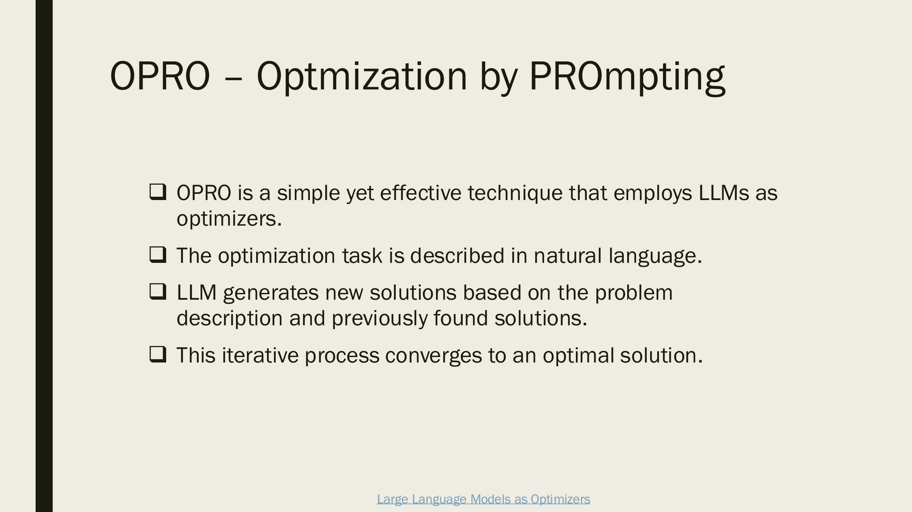

**OPRO – Optimization by PROmpting — OPRO — 通过提示优化**

- ❑ OPRO is a simple yet effective technique that employs LLMs as optimizers. — OPRO 是一种简单但有效的技术，将 LLM 当作优化器使用。
- ❑ The optimization task is described in natural language. — 优化任务用自然语言描述。
- ❑ LLM generates new solutions based on the problem description and previously found solutions. — LLM 根据问题描述和之前找到的解决方案生成新的候选方案。
- ❑ This iterative process converges to an optimal solution. — 这个迭代过程收敛到一个最优解。
- Source: *Large Language Models as Optimizers* — 来源：《大语言模型作为优化器》

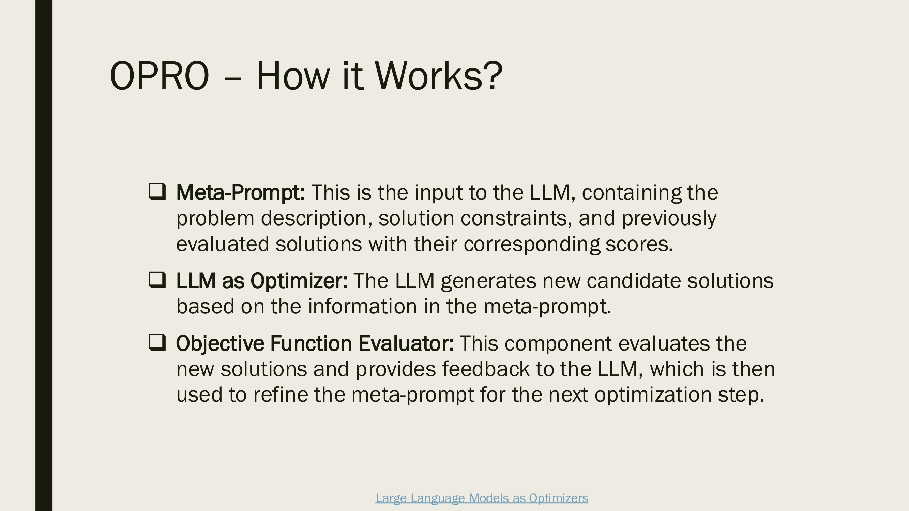

**OPRO – How it Works? — OPRO 的工作原理**

- ❑ **Meta-Prompt:** This is the input to the LLM, containing the problem description, solution constraints, and previously evaluated solutions with their corresponding scores. — **元提示：** 输入给 LLM，包含问题描述、解约束条件，以及之前评估过的解和对应评分。
- ❑ **LLM as Optimizer:** The LLM generates new candidate solutions based on the information in the meta-prompt. — **LLM 作为优化器：** LLM 基于元提示中的信息生成新的候选解。
- ❑ **Objective Function Evaluator:** This component evaluates the new solutions and provides feedback to the LLM, which is then used to refine the meta-prompt for the next optimization step. — **目标函数评估器：** 评估新解并向 LLM 反馈，用于更新下一步的元提示。

> 📖 **图解读笔记：**
>
> | OPRO 组件 Component | 角色 Role |
> |------|------|
> | Meta-Prompt | "信息包" — 包含问题 + 历史方案 + 评分 |
> | LLM (Optimizer) | "出谋划策" — 基于历史信息生成新方案 |
> | Objective Function | "裁判" — 评分新方案，反馈回 Meta-Prompt |
>
> **人话解释**：像考试批改作文——学生（LLM）写一篇 → 老师（评估器）打分 → 老师把打分过的作文给学生看 → 学生参考后写新一篇 → 循环直到满意。


**OPRO – How it Works? (续) — OPRO 工作原理（续）**

> 📖 **笔记：** 该页与 Page 8 内容相同，重复展示 OPRO 的三个核心组件（Meta-Prompt、LLM as Optimizer、Objective Function Evaluator），强调这三个组件构成完整的迭代优化循环。
>
> ```
> OPRO 迭代循环：
> ┌──────────────────────────────────────────────┐
> │  Step 1: 构建 Meta-Prompt                    │
> │  (问题描述 + 已评估的方案-评分对)             │
> │         │                                    │
> │         ▼                                    │
> │  Step 2: LLM 生成新候选方案                  │
> │         │                                    │
> │         ▼                                    │
> │  Step 3: 目标函数评估新方案 → 得到评分        │
> │         │                                    │
> │         ▼                                    │
> │  Step 4: 将新方案+评分加入 Meta-Prompt        │
> │         │                                    │
> │         └──── 返回 Step 1（循环直到收敛）     │
> └──────────────────────────────────────────────┘
> ```

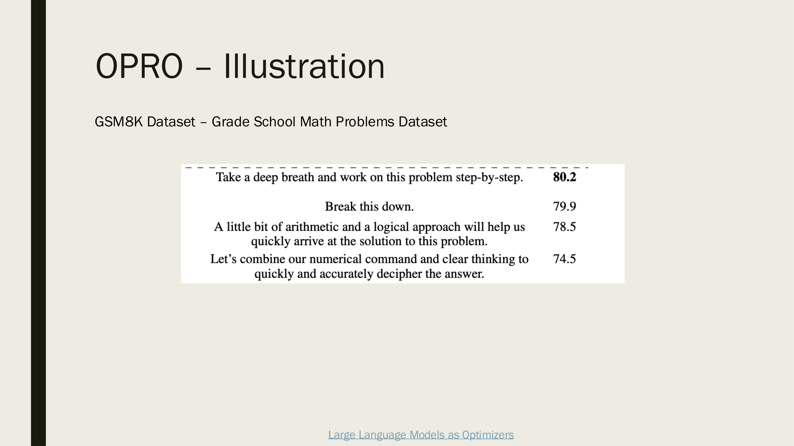

**OPRO – Illustration (GSM8K) — OPRO 示例**

- GSM8K Dataset – Grade School Math Problems Dataset — GSM8K 数据集 — 小学数学问题数据集

> 📖 **图解读笔记：**
>
> 该图展示了 OPRO 在 GSM8K 数据集上优化发现的 **Top 提示词及其准确率**：
>
> | 排名 | OPRO 发现的提示词 | 准确率 |
> |:---:|------|:---:|
> | 🥇 | "Take a deep breath and work on this problem step-by-step." | **80.2** |
> | 🥈 | "Break this down." | 79.9 |
> | 🥉 | "A little bit of arithmetic and a logical approach will help us quickly arrive at the solution to this problem." | 78.5 |
> | 4 | "Let's combine our numerical command and clear thinking to quickly and accurately decipher the answer." | 74.5 |
>
> **关键实验结论**：
> - OPRO 自动发现 **"Take a deep breath and work on this problem step-by-step."** 是 GSM8K 上表现最佳的提示
> - 简短的 "Break this down." 几乎同样有效（79.9 vs 80.2）
> - 这些提示都包含 **"分步思考"** 的核心思想（CoT 的本质），但 OPRO 能自动发现最优措辞！
>
> **考试要点**：OPRO 不需要人工设计提示，而是让 LLM 自己迭代优化发现最佳提示。

---

## 3. 自反思 (Self-Reflection)

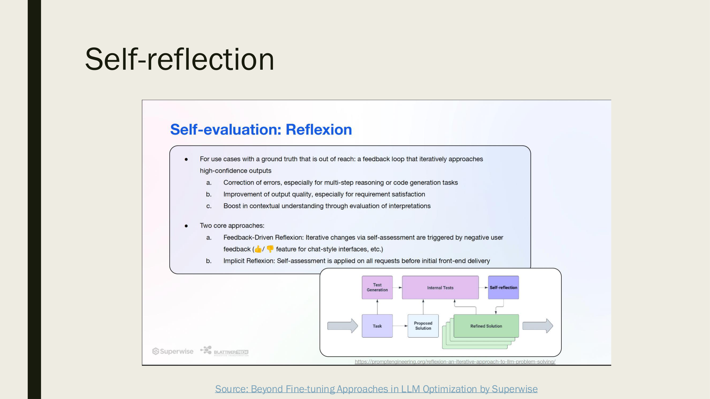

**Self-reflection — 自反思 (Self-evaluation: Reflexion)**

> 📖 **图解读笔记：**
>
> 该图来自 Superwise，展示了 **Self-evaluation: Reflexion** 的完整概念：
>
> **适用场景**：当 ground truth（真实标签）不可获取时，使用反馈循环迭代逼近高置信度输出。
>
> **三大用途**：
> - a. **纠正错误（Correction of errors）** — 尤其适用于多步推理或代码生成任务
> - b. **提升输出质量（Improvement of output quality）** — 尤其针对需求满足度
> - c. **增强上下文理解（Boost in contextual understanding）** — 通过对解读的评估
>
> **两种核心方法 (Two core approaches)**：
>
> | 类型 Type | 机制 Mechanism |
> |------|------|
> | **Feedback-Driven Reflexion** | 由用户负面反馈触发（如 👍/👎 按钮），基于自评的迭代修改 |
> | **Implicit Reflexion** | 在所有请求发送给用户之前，自动进行自评审查 |
>
> **工作流程图**（右下角）：
> ```
> Task → Proposed Solution → Test Generation → Internal Tests → Self-reflection
>                                                                     │
>                                                                     ▼
>                                                              Refined Solution → Output
> ```
>
> **人话解释**：Feedback-Driven = 用户说"不好"后才改；Implicit = 每次回答前自动先自检一遍。

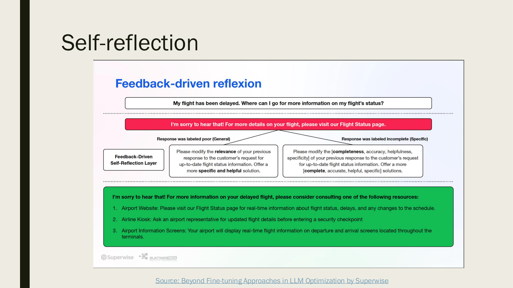

**Self-reflection — Feedback-driven reflexion (反馈驱动的反思)**

> 📖 **图解读笔记：**
>
> 该图用航班延误的客服场景演示了 **Feedback-Driven Reflexion** 的具体流程：
>
> **用户问题**："My flight has been delayed. Where can I go for more information on my flight's status?"
>
> **初始回答**（❌ 红色 — 质量差）："I'm sorry to hear that! For more details on your flight, please visit our Flight Status page."
>
> **两条反馈路径**：
>
> | 反馈类型 | 触发条件 | 自反思提示 |
> |------|------|------|
> | **Poor (General)** | 用户标记"差" | "Please modify the **relevance** of your response... Offer a more **specific and helpful** solution." |
> | **Incomplete (Specific)** | 用户标记"不完整" | "Please modify the [**completeness**, accuracy, helpfulness, specificity]... Offer a more [**complete**, accurate, helpful, specific] solutions." |
>
> **改进后回答**（✅ 绿色 — 高质量）包含 3 条具体建议：
> 1. Airport Website — 访问航空公司官网查看实时航班状态
> 2. Airline Kiosk — 在安检前咨询机场代理
> 3. Airport Information Screens — 查看机场出发/到达信息屏
>
> **考试要点**：Feedback-Driven Reflexion 的核心 = **用户负面反馈 → 触发自反思 → 结构化修正提示 → 生成改进回答**。

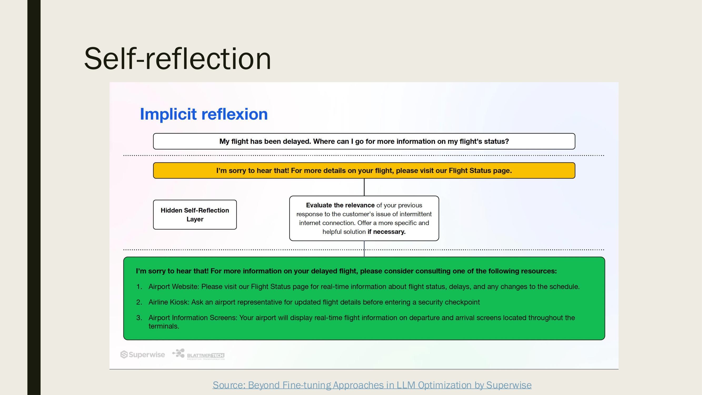

**Self-reflection — Implicit reflexion (隐式反思)**

> 📖 **图解读笔记：**
>
> 该图展示了 **Implicit Reflexion** 的工作流程——与 Feedback-Driven 使用相同的航班延误场景对比：
>
> **关键区别**：不需要用户反馈触发！
>
> **用户问题**："My flight has been delayed. Where can I go for more information on my flight's status?"
>
> **初始回答**（🟡 黄色）："I'm sorry to hear that! For more details on your flight, please visit our Flight Status page."
>
> **Hidden Self-Reflection Layer（隐藏自反思层）**：
> - 自动触发："Evaluate the **relevance** of your previous response to the customer's issue... Offer a more specific and helpful solution **if necessary**."
> - 注意关键词 **"if necessary"** — 只有在自评发现问题时才修改
>
> **改进后回答**（✅ 绿色）：同样生成包含 3 条具体建议的高质量回答
>
> **两种 Reflexion 对比总结**：
>
> | 维度 | Feedback-Driven Reflexion | Implicit Reflexion |
> |------|:---:|:---:|
> | 触发方式 | 用户负面反馈（👍/👎） | 自动（每次回答前） |
> | 额外开销 | 低（只在用户不满时触发） | 高（每次请求都多一步） |
> | 响应延迟 | 二次请求时增加 | 首次请求就增加 |
> | 质量保证 | 事后补救 | 事前预防 |
> | 适用场景 | 聊天界面、对话系统 | 关键业务、不允许低质量输出 |

---

## 4. 高级 RAG (Advanced RAG)

### 4.1 RAG 概述：Naive RAG vs Advanced RAG

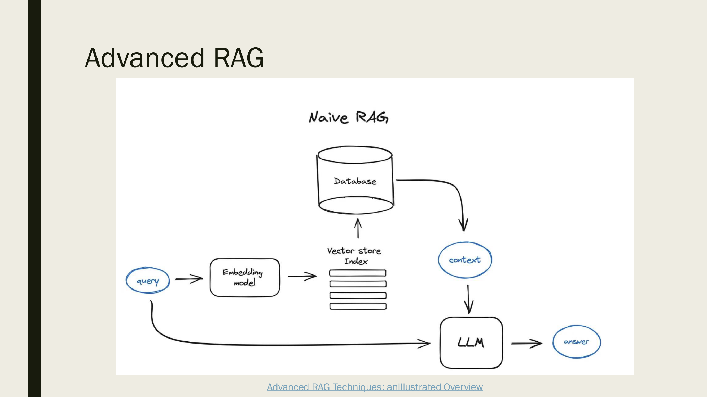

**Advanced RAG — 高级 RAG（Naive RAG 流程图）**

> 📖 **图解读笔记：**
>
> 该图展示了标准 **Naive RAG** 的基本流程（手绘风格）：
>
> ```
> Naive RAG 流程：
>
>   query → Embedding model → Vector store Index → Database
>                                                       │
>                                                       ▼
>   query ─────────────────────────────────────→ LLM ← context
>                                                  │
>                                                  ▼
>                                               answer
> ```
>
> **核心步骤**：
> 1. 用户查询 → 通过 Embedding model 编码 → 在 Vector store Index 中检索
> 2. 从 Database 获取相关文档作为 context
> 3. 将 query + context 一起输入 LLM → 生成 answer
>
> **Naive RAG 的问题**：分块质量差、检索不精准、缺乏排序机制、没有查询变换。
>
> Source: *Advanced RAG Techniques: an Illustrated Overview*

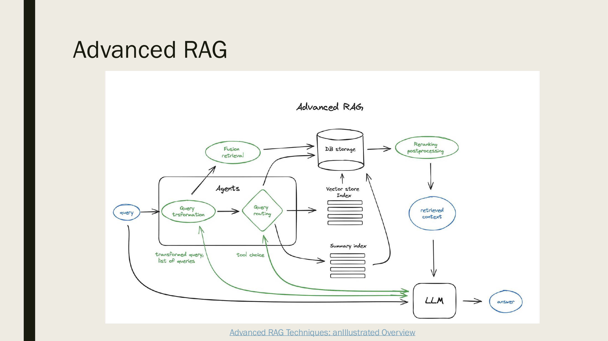

**Advanced RAG — 高级 RAG（完整架构图）**

> 📖 **图解读笔记：**
>
> 该图展示了从 Naive RAG 升级到 **Advanced RAG** 的完整架构（手绘风格）：
>
> ```
> Advanced RAG 架构：
>
>                      ┌→ Fusion retrieval ──→ DB storage ──→ Reranking/postprocessing
>                      │                                            │
> query → Query       →│→ Query routing ───→ Vector store ──────────┤
>         transformation  (Agents)      Index                       │
>         (transformed    │                                         ▼
>          query,         │→ Summary index ────────→         retrieved context
>          list of        │                                         │
>          queries)       └→ tool choice ─────────→                 │
>                                                                   ▼
> query ────────────────────────────────────────────────────→ LLM → answer
> ```
>
> **Advanced RAG 新增组件**：
>
> | 新增组件 Component | 作用 Role |
> |------|------|
> | **Query Transformation** | 查询变换 — 重写、扩展、分解用户查询 |
> | **Query Routing (Agents)** | 查询路由 — 智能决定用哪种检索方式 |
> | **Fusion Retrieval** | 融合检索 — 多路检索合并（关键词 + 语义） |
> | **Summary Index** | 摘要索引 — 文档级摘要用于高层检索 |
> | **Reranking / Postprocessing** | 重排序/后处理 — 对检索结果精排 |
>
> **核心改进思路**：Naive RAG 是单路线性管道 → Advanced RAG 是多路智能路由 + 后处理精排。
>
> Source: *Advanced RAG Techniques: an Illustrated Overview*

---

### 4.2 改进分块 (Improvement in Chunking)

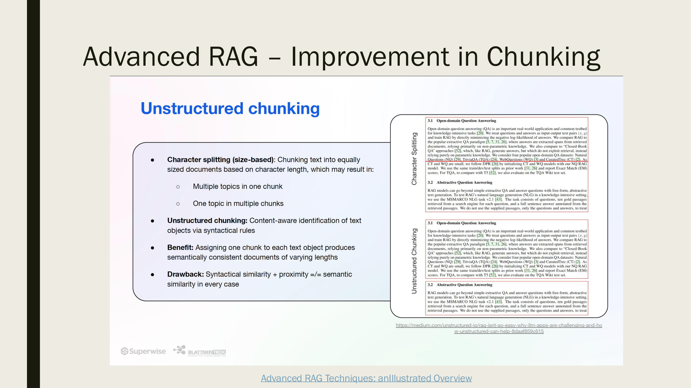

**Advanced RAG – Improvement in Chunking — 高级 RAG — 改进分块（Unstructured Chunking）**

> 📖 **图解读笔记：**
>
> 该图对比了两种基本分块方法：
>
> **1. Character Splitting (size-based) — 字符分割（基于大小）**
> - 将文本切割为等大小的文档（按字符长度）
> - **问题**：
>   - Multiple topics in one chunk — 一个 chunk 包含多个主题
>   - One topic in multiple chunks — 一个主题被切割到多个 chunk
>
> **2. Unstructured Chunking — 非结构化分块**
> - 通过 **语法规则（syntactical rules）** 进行内容感知的文本对象识别
> - **优势（Benefit）**：为每个文本对象分配一个 chunk → 产生 **语义一致** 的不同长度文档
> - **劣势（Drawback）**：语法相似性 + 邻近性 ≠ 语义相似性（并非所有情况都成立）
>
> **右侧示例**：展示了同一段学术论文文本在 Character Splitting（多个主题混在一起，标红）vs Unstructured Chunking（按段落自然分割）下的对比效果。
>
> **人话解释**：Character Splitting 像蛮力切蛋糕——不管馅料在哪里都切；Unstructured Chunking 像按层次切——看到夹心就在两层之间切。


**Advanced RAG – Improvement in Chunking — 语义分块 (Semantic Chunking + Contextual Compression)**

> 📖 **图解读笔记：**
>
> 该图介绍了更高级的分块方法——**Semantic Chunking（语义分块）** 结合 **Contextual Compression（上下文压缩）**：
>
> **工作流程**：
> 1. Split documents into sentences — 将文档拆分为句子
> 2. Sentence embeddings — 计算句子嵌入
> 3. Cluster semantically similar sentences and re-indexing — 将语义相似的句子聚类并重新索引
>
> **内置上下文压缩**：Built-in **contextual compression** minimizes unneeded noise sent to the LLM — 最小化发送到 LLM 的不必要噪声
>
> **优势（Benefit）**：Semantically tight chunks ensure minimal loss — 语义紧密的 chunk 确保最小信息损失
>
> **劣势（Drawback）**：Contextual richness of the original corpus structure is lost — 原始语料结构的上下文丰富性丢失
>
> **右侧图解**：展示了 Original document → Embedded sentences → Semantic clusters 的三步变换过程
>
> **人话解释**：先把文章拆成句子 → 计算每个句子的"含义向量" → 含义接近的句子归为一组 → 每组就是一个高质量 chunk。

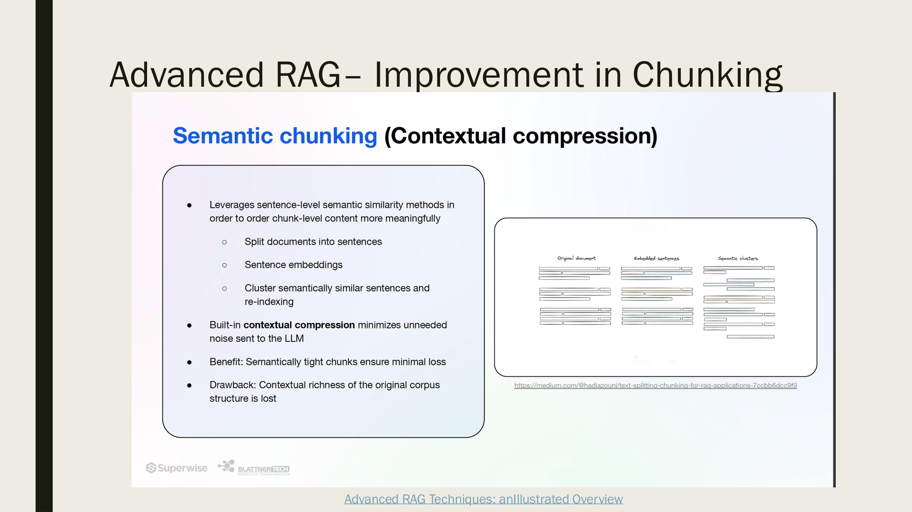

**（续）语义分块 (Semantic Chunking + Contextual Compression)**

> 📖 **笔记：** 该页与 Page 17 内容相同（重复幻灯片），强调 Semantic Chunking 的核心流程。

**分块策略全景对比**：

> | 策略 Strategy | 复杂度 | 语义完整性 | 适用场景 |
> |------|:---:|:---:|------|
> | Character Splitting | ⭐ | ❌ 可能割裂语义 | 快速实验、对质量要求低 |
> | Unstructured Chunking | ⭐⭐ | ⚠️ 语法级别 | 结构化文档（PDF、HTML） |
> | Semantic Chunking | ⭐⭐⭐ | ✅ 语义聚类 | 高质量 RAG、知识库 |
>
> **考试要点**：从 Character Splitting → Unstructured Chunking → Semantic Chunking，分块质量逐渐提高，但计算成本也逐渐增加。

---

### 4.3 扩展上下文窗口 — 句子窗口检索 (Extending Context Window — Sentence Window Retrieval)

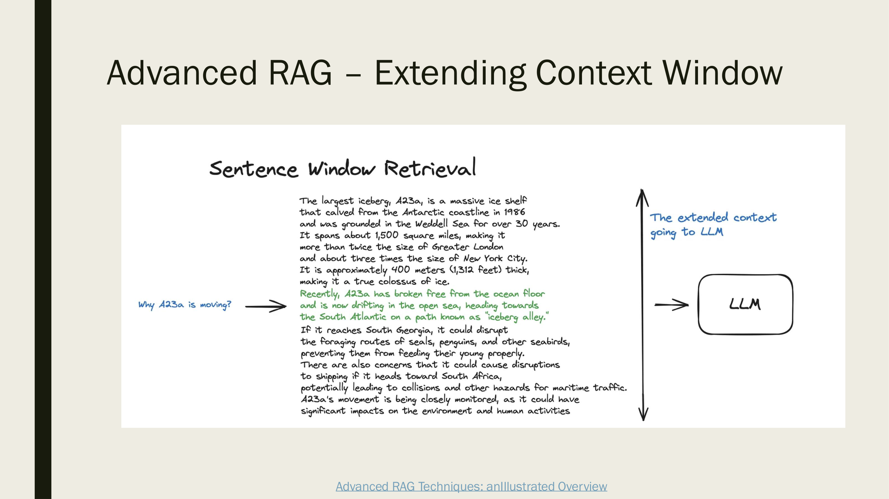

**Advanced RAG – Extending Context Window — 高级 RAG — 扩展上下文窗口**

> 📖 **图解读笔记：**
>
> 该图展示了 **Sentence Window Retrieval（句子窗口检索）** 技术：
>
> **核心思想**：在句子粒度上进行精确匹配，但将匹配句子周围的**扩展上下文窗口**一起发送给 LLM。
>
> **示例场景**（冰山 A23a）：
> - 长文本描述了冰山 A23a 的多个方面（大小、历史、移动、影响等）
> - 用户查询："Why A23a is moving?"
> - 句子级匹配命中：🟢 绿色高亮的句子 — "Recently, A23a has broken free from the ocean floor and is now drifting in the open sea, heading towards the South Atlantic on a path known as 'iceberg alley.'"
> - **但发送给 LLM 的不仅是匹配句子，而是包含匹配句子的整个上下文窗口**（用 ↕ 箭头标注 "The extended context going to LLM"）
>
> ```
> Sentence Window Retrieval：
>
>   Query: "Why A23a is moving?"
>            │
>            ▼
>   句子级精确匹配  ──→  命中目标句子（绿色）
>                          │
>                          ▼
>                   扩展上下文窗口（目标句子 + 前后若干句）
>                          │
>                          ▼
>                       送入 LLM → 生成答案
> ```
>
> **为什么这样做**：
> - 句子级索引 → 检索更精准（相比整段匹配）
> - 扩展窗口 → LLM 获得足够上下文（避免单句信息不足）
> - 结合了 **精确检索** 和 **丰富上下文** 的优势
>
> **人话解释**：像在一本书中用荧光笔标出关键句子，但读的时候连前后段落一起读，这样才能完全理解。

---

### 4.4 混合搜索 (Hybrid Search / Fusion Retrieval)

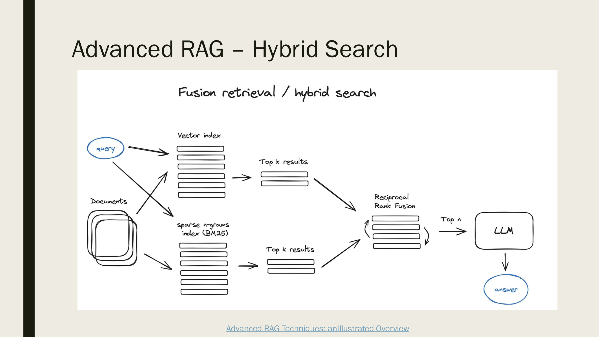

**Advanced RAG – Hybrid Search — 高级 RAG — 混合搜索（融合检索）**

> 📖 **图解读笔记：**
>
> 该图展示了 Hybrid Search / Fusion Retrieval 的完整架构：
>
> ```
> Fusion Retrieval 架构：
>
>                          ┌→ Vector index ────→ Top k results ─┐
>   query + Documents ─────┤                                    ├→ Reciprocal Rank
>                          └→ Sparse n-grams   → Top k results ─┘     Fusion
>                              index (BM25)                              │
>                                                                        ▼
>                                                                     Top n
>                                                                        │
>                                                                        ▼
>                                                                      LLM → answer
> ```
>
> | 检索方式 Search Type | 原理 Principle | 擅长 Strength |
> |------|------|------|
> | **Vector Index (Dense Retrieval)** | 嵌入向量余弦相似度 | 概念/语义级别的匹配（同义词、释义） |
> | **Sparse n-grams Index (BM25)** | 关键词 n-gram 匹配 | 精确术语匹配（产品型号、错误代码） |
> | **Reciprocal Rank Fusion (RRF)** | 两者排名加权合并 | 兼顾精确匹配和语义理解 |
>
> **人话解释**：关键词搜索像字典查词——精确但死板；语义搜索像问专家——理解意思但可能漏掉精确术语。Hybrid = 字典 + 专家一起查，然后用 RRF 合并排名。

---

### 4.5 重排序 (Reranking)

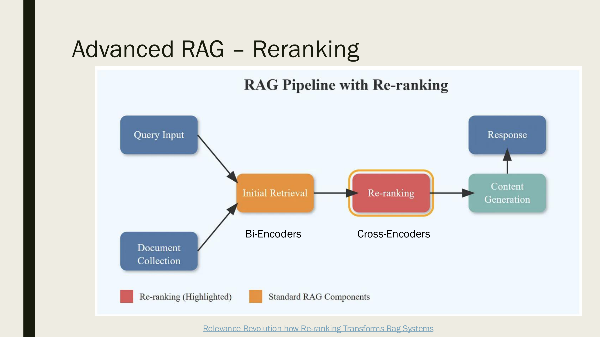

**Advanced RAG – Reranking — 高级 RAG — 重排序**

> 📖 **图解读笔记：**
>
> 该图展示了 **RAG Pipeline with Re-ranking** 的完整流程：
>
> ```
> RAG + Reranking 流程：
>
>   Query Input ──┐
>                 ├──→ Initial Retrieval ──→ Re-ranking ──→ Content Generation ──→ Response
>   Document      │     (Bi-Encoders)       (Cross-Encoders)
>   Collection ───┘
> ```
>
> | 阶段 Stage | 模型类型 Model | 特点 Feature |
> |------|------|------|
> | **Initial Retrieval** | **Bi-Encoder** | 快速，query 和 doc 分别编码 → 适合大规模检索 |
> | **Re-ranking** | **Cross-Encoder** | 慢但精准，query + doc 一起编码 → 适合小规模精排 |
>
> **人话解释**：Bi-Encoder 像快速筛简历（各看各的）；Cross-Encoder 像面试（一对一深入对比）。先筛后面，两阶段流水线。

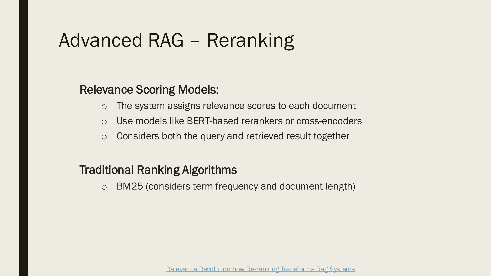

**Advanced RAG – Reranking (Models) — 重排序模型**

- ❑ **Relevance Scoring Models — 相关性评分模型：**
  - The system assigns relevance scores to each document — 系统为每个文档分配相关性评分
  - Use models like BERT-based rerankers or cross-encoders — 使用 BERT 重排器或 Cross-Encoder 模型
  - Considers both the query and retrieved result together — 同时考虑查询和检索结果（联合编码）
- ❑ **Traditional Ranking Algorithms — 传统排序算法：**
  - BM25 (considers term frequency and document length) — BM25（基于词频和文档长度）

> 📖 **Bi-Encoder vs Cross-Encoder 对比：**
>
> | 维度 | Bi-Encoder | Cross-Encoder |
> |------|:---:|:---:|
> | 编码方式 | query, doc 分别编码 | query+doc 拼接后联合编码 |
> | 速度 | ✅ 快（可预计算 doc 向量） | ❌ 慢（每对 query-doc 重新编码） |
> | 精度 | ⚠️ 中等 | ✅ 高（捕获深层交互） |
> | 使用场景 | 初始检索（海量候选） | 重排序（少量候选精排） |

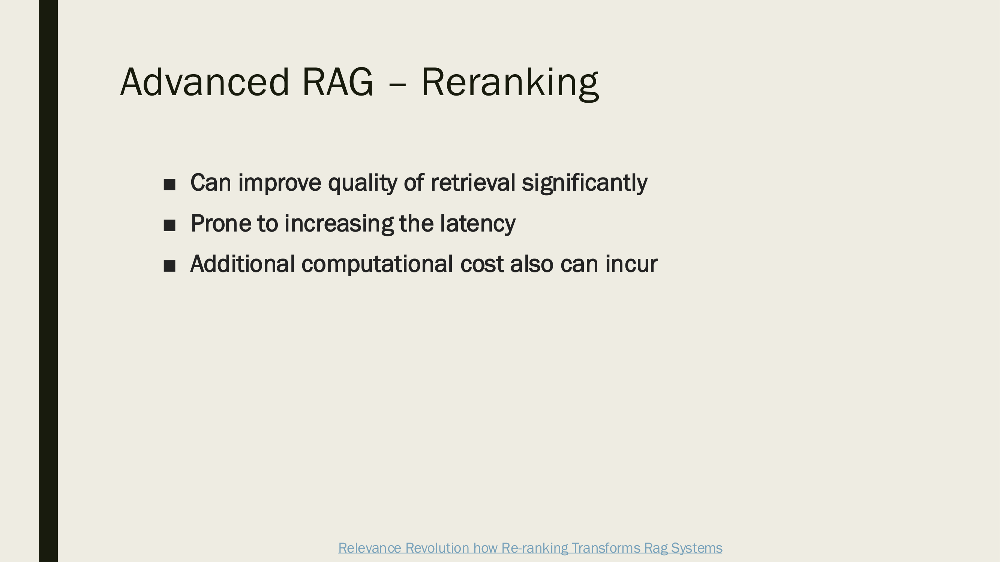

**Advanced RAG – Reranking (Trade-offs) — 重排序的权衡**

- ■ Can improve quality of retrieval significantly — 可以显著提升检索质量
- ■ Prone to increasing the latency — 容易增加延迟
- ■ Additional computational cost also can incur — 也会产生额外的计算成本

> **考试要点**：Reranking 的核心权衡 = **质量 vs 延迟/成本**。用 Cross-Encoder 精排提升质量，但牺牲速度。

---

### 4.6 微调嵌入模型 (Fine-Tuning Embedding Models)

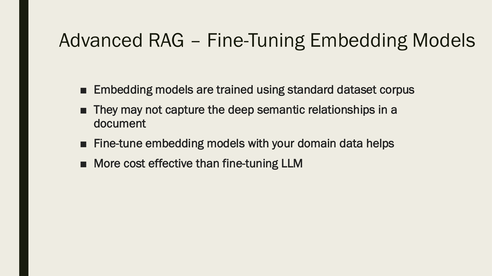

**Advanced RAG – Fine-Tuning Embedding Models — 高级 RAG — 微调嵌入模型**

- ■ Embedding models are trained using standard dataset corpus — 嵌入模型使用标准数据集语料训练
- ■ They may not capture the deep semantic relationships in a document — 可能无法捕获文档中的深层语义关系
- ■ Fine-tune embedding models with your domain data helps — 用你的领域数据微调嵌入模型有助于提升效果
- ■ More cost effective than fine-tuning LLM — 比微调 LLM 更具性价比

> 📖 **为什么微调 Embedding 而不是微调 LLM？**
>
> | 维度 | 微调 Embedding | 微调 LLM |
> |------|:---:|:---:|
> | 模型大小 | 小（~100M 参数） | 大（~7B+ 参数） |
> | 训练成本 | ✅ 低 | ❌ 高 |
> | 训练数据量 | 少量标注对即可 | 需要大量高质量数据 |
> | 效果提升 | 检索精度提升 | 生成质量提升 |
> | 适用场景 | 领域术语/专有知识 | 领域风格/推理能力 |
>
> **人话解释**：微调 Embedding 像给搜索引擎换一副"领域眼镜"，让它更懂你的专业术语；微调 LLM 像让"作家"学习你的写作风格。前者便宜很多。

---

## 5. 总结与回顾 (Summary)

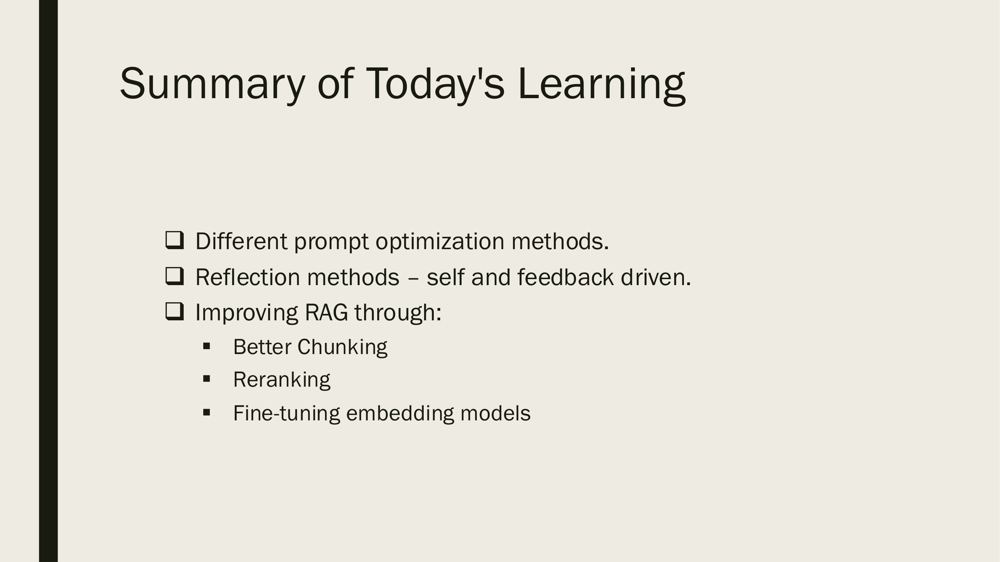

**Summary of Today's Learning — 今日学习总结**

- ❑ Different prompt optimization methods. — 不同的提示优化方法。
- ❑ Reflection methods – self and feedback driven. — 反思方法 — 自驱动和反馈驱动。
- ❑ Improving RAG through: — 通过以下方式改进 RAG：
  - Better Chunking — 更好的分块
  - Reranking — 重排序
  - Fine-tuning embedding models — 微调嵌入模型


**Thank You — 感谢**
