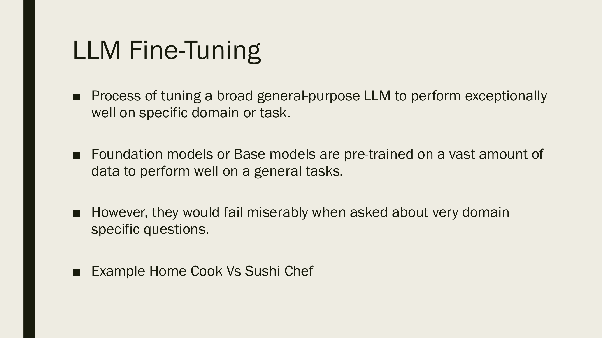
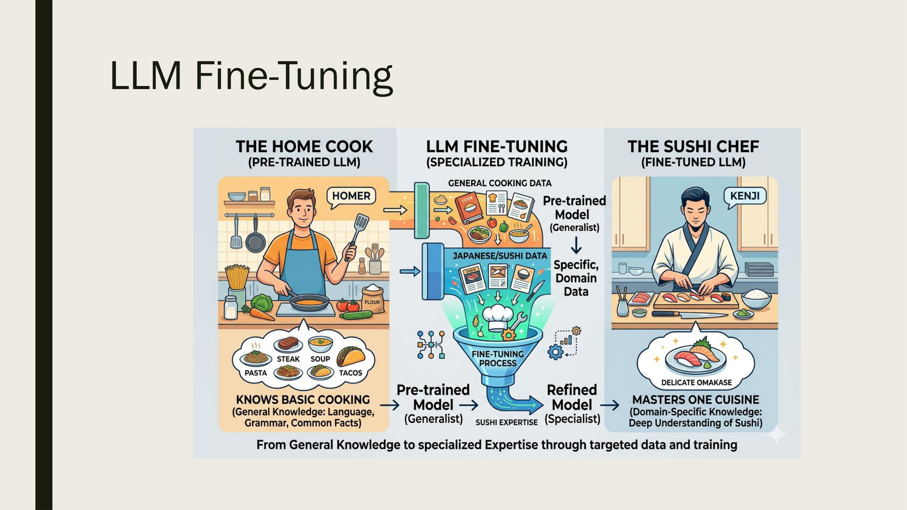
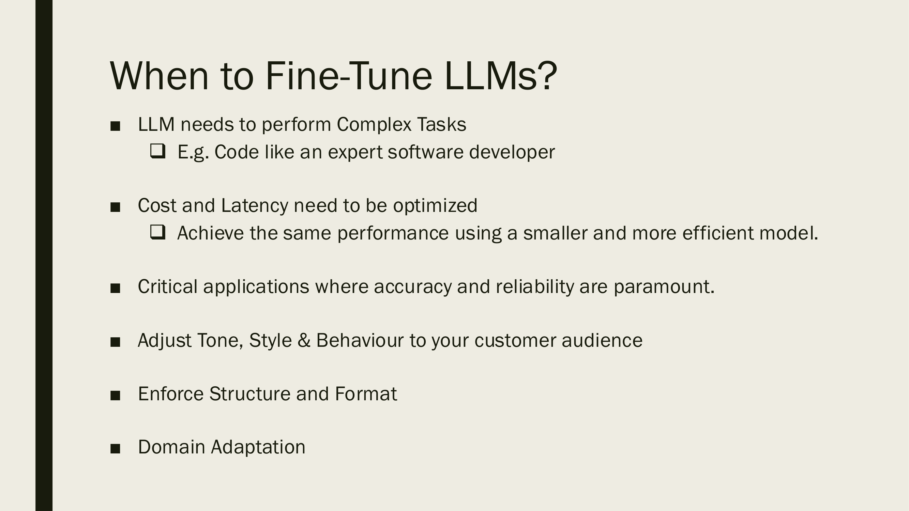
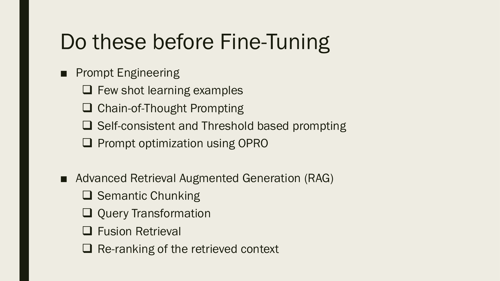
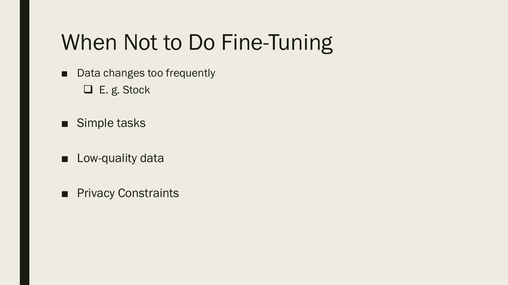
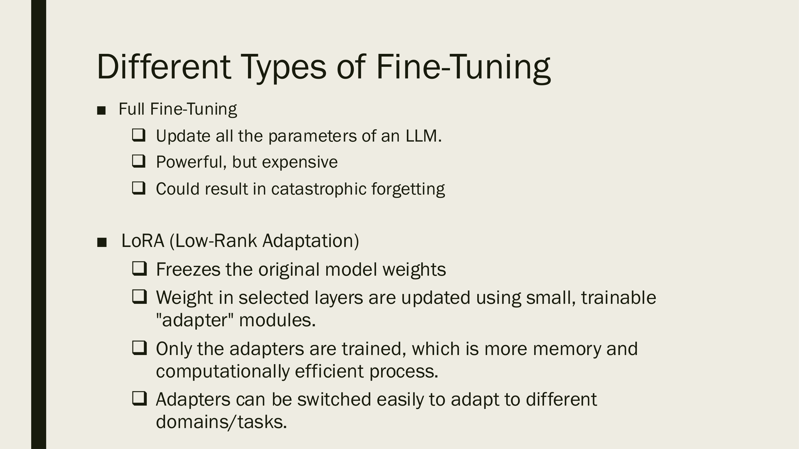
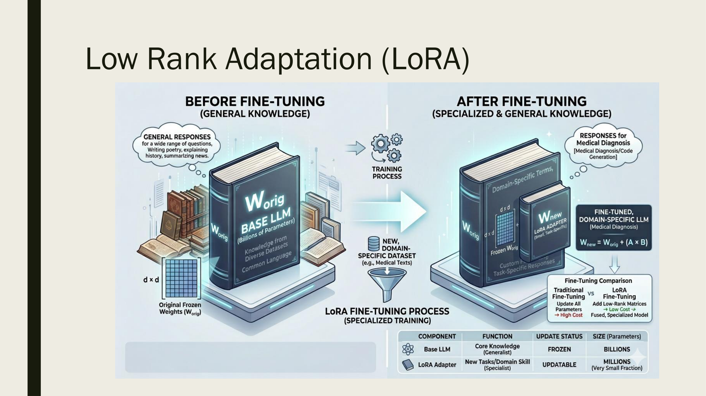
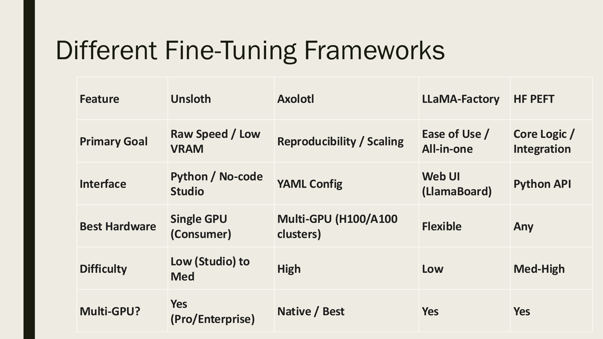
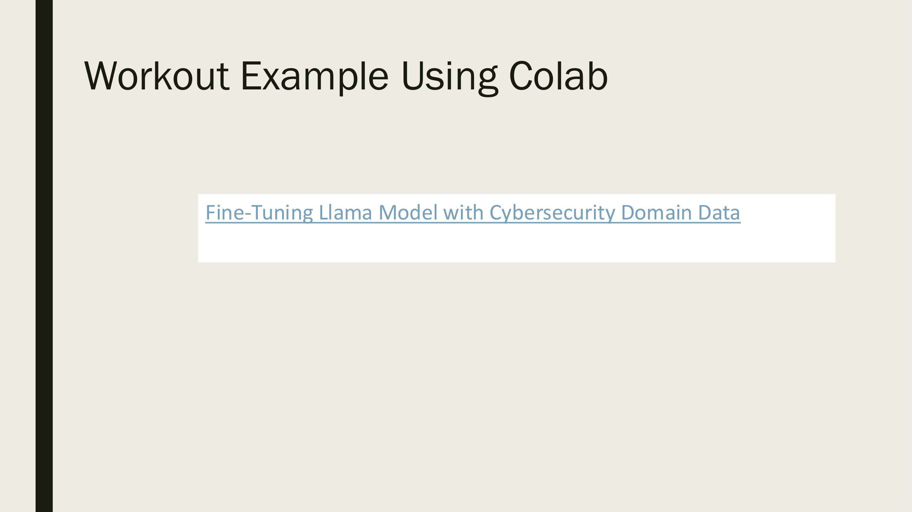
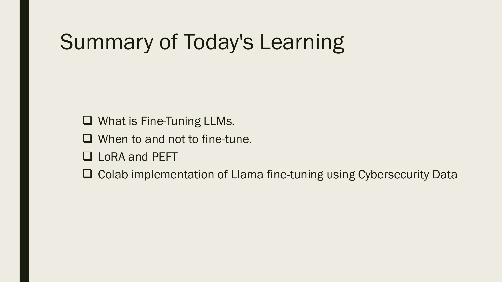

# Week 12: LLM 微调 (LLM Fine-Tuning)

> Source: `26W-CST8510-Week12-Lecture1.pdf`
> Total slides: 13
> Instructor: Dr. Hari M Koduvely

---

## 1. LLM 微调概述 (What is LLM Fine-Tuning)

- **LLM Fine-Tuning（LLM 微调）** 是将通用大语言模型调优，使其在**特定领域或任务**上表现出色的过程。
- Process of tuning a broad general-purpose LLM to perform exceptionally well on specific domain or task.
- **Foundation models（基础模型）** or **Base models（基座模型）** are pre-trained on a vast amount of data to perform well on general tasks.
  - 基础模型/基座模型在海量数据上预训练，能胜任通用任务。
- However, they would fail miserably when asked about very **domain specific questions（领域特定问题）**.
  - 但面对非常专业的领域问题时，它们往往表现很差。

### 1.1 类比：家庭厨师 vs 寿司大厨 (Analogy: Home Cook vs Sushi Chef)

> 📖 **图解读笔记：**
>
> | 符号/区域 | 含义 |
> |-----------|------|
> | 左侧 — THE HOME COOK（家庭厨师） | **Pre-trained LLM（预训练 LLM）**：会做各种基本菜（pasta, steak, soup, tacos），代表通用知识 |
> | 中间 — LLM FINE-TUNING（微调过程） | 用 **Japanese/Sushi Data（日料/寿司领域数据）** 对通用模型进行专项训练 |
> | 右侧 — THE SUSHI CHEF（寿司大厨） | **Fine-tuned LLM（微调后 LLM）**：精通一种料理（Delicate Omakase），代表领域专家 |
> | 底部流程箭头 | Pre-trained Model (Generalist) → Sushi Expertise → Refined Model (Specialist) |
>
> **阅读顺序**：左→中→右，从"通用能力"到"领域微调"再到"专家模型"
>
> **人话解释**：预训练 LLM 就像家庭厨师——什么菜都会做但不精通；微调就是用特定领域的数据（如寿司配方）来"培训"它，最终变成该领域的专家。
>
> **考试关联**：用这个类比理解为什么需要 Fine-Tuning——基座模型有通用知识但缺乏领域深度。

> **📝 Notes:**
>
> **承接**: 本节作为开篇，用"家庭厨师 vs 寿司大厨"的类比解释了 LLM 微调的本质——从通用走向专精；这一定义将为下一节「何时需要微调」提供判断基础。

---

## 2. 何时需要微调 (When to Fine-Tune LLMs)

- **LLM needs to perform Complex Tasks（需要执行复杂任务）**
  - E.g. Code like an expert software developer（例如：像专业开发者一样编写代码）
- **Cost and Latency need to be optimized（需要优化成本和延迟）**
  - Achieve the same performance using a smaller and more efficient model.（用更小、更高效的模型达到同等性能。）
- **Critical applications（关键应用）** where accuracy and reliability are paramount.
  - 在准确性和可靠性至关重要的关键应用场景中。
- **Adjust Tone, Style & Behaviour（调整语气、风格和行为）** to your customer audience
  - 根据目标客户群体调整输出的语气、风格和行为模式。
- **Enforce Structure and Format（强制结构和格式）**
  - 要求输出遵守特定的结构化格式。
- **Domain Adaptation（领域适配）**
  - 使模型适应特定专业领域。

> **📝 Notes:**
>
> **承接**: 上一节定义了微调的概念，自然引出"什么时候应该用微调"；本节列出的六种场景将与下一节「微调前的替代方案」形成对比——有些场景可以用更轻量的方法解决。

---

## 3. 微调前应优先尝试的方法 (Do These Before Fine-Tuning)

### 3.1 提示工程 (Prompt Engineering)

- **Few-shot learning examples（少样本学习示例）**
  - 在提示中给出几个示例，引导模型输出。
- **Chain-of-Thought Prompting（思维链提示）**
  - 让模型逐步推理，提升复杂任务表现。
- **Self-consistent and Threshold based prompting（自一致性与阈值提示）**
  - 多次采样取一致性最高的答案。
- **Prompt optimization using OPRO（使用 OPRO 优化提示）**
  - 用优化算法自动搜索最优提示词。

### 3.2 高级 RAG (Advanced Retrieval Augmented Generation)

- **Semantic Chunking（语义切块）**
  - 按语义边界而非固定长度切分文档。
- **Query Transformation（查询变换）**
  - 改写或扩展用户查询以提高检索质量。
- **Fusion Retrieval（融合检索）**
  - 结合多种检索方法的结果。
- **Re-ranking of the retrieved context（检索上下文重排序）**
  - 对检索结果进行二次排序提高相关性。

> **📝 Notes:**
>
> **承接**: 上一节说明了何时需要微调，但本节强调 **"先试轻量方法再考虑微调"**——Prompt Engineering 和 RAG 是成本更低的替代方案；下一节将反过来说明「何时不应微调」，形成完整的决策框架。

---

## 4. 何时不应微调 (When Not to Fine-Tune)

- **Data changes too frequently（数据变化太快）**
  - E.g. Stock（例如：股票数据）
  - 数据频繁更新的场景不适合微调，因为模型无法及时反映最新数据。
- **Simple tasks（简单任务）**
  - 简单任务用提示工程就能解决，不需要微调。
- **Low-quality data（低质量数据）**
  - 垃圾数据只会产出垃圾模型——低质量数据微调比没微调更差。
- **Privacy Constraints（隐私限制）**
  - 敏感数据不能用于训练，存在合规和数据泄露风险。

> **📝 Notes:**
>
> **承接**: 前两节建立了"何时需要微调"和"先试替代方案"的判断框架；本节补充了四种**不应微调**的情况，完善了决策树；下一节将进入具体的微调方法——Full Fine-Tuning vs LoRA。

---

## 5. 微调类型 (Different Types of Fine-Tuning)

### 5.1 全量微调 (Full Fine-Tuning)

- **Update all the parameters（更新所有参数）** of an LLM.
  - 对 LLM 的全部参数进行训练更新。
- **Powerful, but expensive（强大但昂贵）**
  - 效果好，但计算成本、内存占用极高。
- Could result in **catastrophic forgetting（灾难性遗忘）**
  - 全量微调可能导致模型遗忘原有的通用能力。

### 5.2 LoRA — 低秩适配 (Low-Rank Adaptation)

- **Freezes the original model weights（冻结原始模型权重）**
  - 保持原始基座模型参数不变。
- Weights in selected layers are updated using small, trainable **"adapter" modules（适配器模块）**.
  - 在选定层中加入小型可训练的适配器模块来更新权重。
- Only the adapters are trained, which is more **memory and computationally efficient（内存和计算效率更高）** process.
  - 只训练适配器，大幅降低资源消耗。
- Adapters can be **switched easily（轻松切换）** to adapt to different domains/tasks.
  - 适配器可以轻松切换，快速适配不同领域/任务。

> **📝 Notes:**
>
> **承接**: 上一节判断了"是否需要微调"，本节开始讲 **怎么微调**——Full Fine-Tuning 虽强但有灾难性遗忘和高成本问题，LoRA 通过冻结原始权重+小型适配器解决了这些问题；下一节将用图解深入展示 LoRA 的内部工作机制。

---

## 6. LoRA 详解 (LoRA In-Depth)

> 📖 **图解读笔记：**
>
> | 符号/区域 | 含义 |
> |-----------|------|
> | 左侧 — BEFORE FINE-TUNING | **Base LLM（基座 LLM）**：W_orig（原始权重矩阵，d×d 维），拥有通用知识（Language, Grammar, Common Facts） |
> | 中间 — Training Process | 使用 **New, Domain-Specific Dataset**（如 Medical Texts）进行微调训练 |
> | 右侧 — AFTER FINE-TUNING | 微调后的模型保留原始 W_orig（Frozen）+ 新增 LoRA Adapter（W_new） |
> | 公式 `W_new = W_orig + (A × B)` | LoRA 核心公式：最终权重 = 冻结的原始权重 + 低秩矩阵乘积 |
> | 底部对比表 | Traditional（更新所有参数→高成本） vs LoRA（添加低秩矩阵→低成本） |
> | 底部组件表 | Base LLM: FROZEN / BILLIONS ↔ LoRA Adapter: UPDATABLE / MILLIONS（极小比例） |
>
> **阅读顺序**：左（原始模型）→ 中（训练过程）→ 右（微调结果），再看底部对比表
>
> **人话解释**：LoRA 不改动原始模型的数十亿参数（Frozen），而是在旁边"贴"一小组可训练的低秩矩阵（A×B），只需训练百万级参数就能达到全量微调的效果。最终权重 = 原始权重 + 适配器贡献。
>
> **考试关联**：
> - 记住公式 `W_new = W_orig + (A × B)`
> - Base LLM 参数是 **Frozen（冻结）**、数量级是 **Billions（数十亿）**
> - LoRA Adapter 参数是 **Updatable（可更新）**、数量级是 **Millions（数百万）**——只是原始参数的极小比例

> **📝 Notes:**
>
> **承接**: 上一节概述了 LoRA 的核心思想（冻结原始权重+小型适配器），本节通过详细图解展示了内部机制和关键公式 `W_new = W_orig + (A×B)`；下一节将介绍不同的微调框架工具选型。

---

## 7. 微调框架对比 (Fine-Tuning Frameworks Comparison)

| Feature（特性） | Unsloth | Axolotl | LLaMA-Factory | HF PEFT |
|-----------------|---------|---------|---------------|---------|
| **Primary Goal（主要目标）** | Raw Speed / Low VRAM（极致速度/低显存） | Reproducibility / Scaling（可复现性/可扩展性） | Ease of Use / All-in-one（易用/一体化） | Core Logic / Integration（核心逻辑/集成性） |
| **Interface（交互界面）** | Python / No-code Studio | YAML Config | Web UI (LlamaBoard) | Python API |
| **Best Hardware（最佳硬件）** | Single GPU (Consumer)（单卡/消费级） | Multi-GPU (H100/A100 clusters)（多卡集群） | Flexible（灵活） | Any（任意） |
| **Difficulty（难度）** | Low (Studio) to Med | High（高） | Low（低） | Med-High |
| **Multi-GPU?（多卡支持）** | Yes (Pro/Enterprise) | Native / Best（原生/最佳） | Yes | Yes |

> **📝 Notes:**
>
> **承接**: 上一节详解了 LoRA 的原理，本节转向实际工具选型——四种主流微调框架各有侧重：Unsloth 追求速度，Axolotl 追求大规模可复现，LLaMA-Factory 追求易用性，HF PEFT 追求灵活集成；下一节将给出实际的 Colab 实操案例。

---

## 8. 实操演示 (Workout Example Using Colab)

- **Fine-Tuning Llama Model with Cybersecurity Domain Data（使用网络安全领域数据微调 Llama 模型）**
  - 使用 Colab 平台进行实际微调操作演示。
  - 以网络安全数据为领域数据，对 Llama 模型进行 LoRA 微调。

> **📝 Notes:**
>
> **承接**: 前面各节从概念到原理再到工具选型层层推进，本节是理论到实践的落地——在 Colab 上用 Cybersecurity 数据微调 Llama 模型；下一节是全课总结。

---

## 9. 本课总结 (Summary)

- ❑ What is Fine-Tuning LLMs.（什么是 LLM 微调。）
- ❑ When to and not to fine-tune.（何时该/不该微调。）
- ❑ LoRA and PEFT（LoRA 与 PEFT 方法。）
- ❑ Colab implementation of Llama fine-tuning using Cybersecurity Data（使用 Cybersecurity 数据在 Colab 上微调 Llama 的实操。）

> **📝 Notes:**
>
> **承接**: 前面各节完成了从概念（什么是微调）→ 判断（何时微调）→ 方法（Full vs LoRA）→ 工具（框架对比）→ 实操（Colab）的完整学习路径；本节回顾要点。
