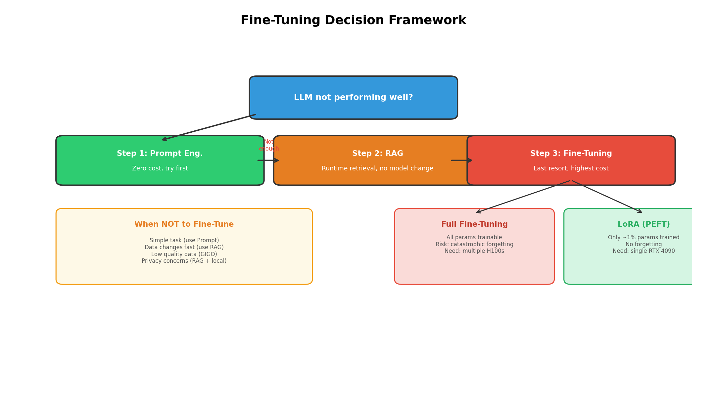
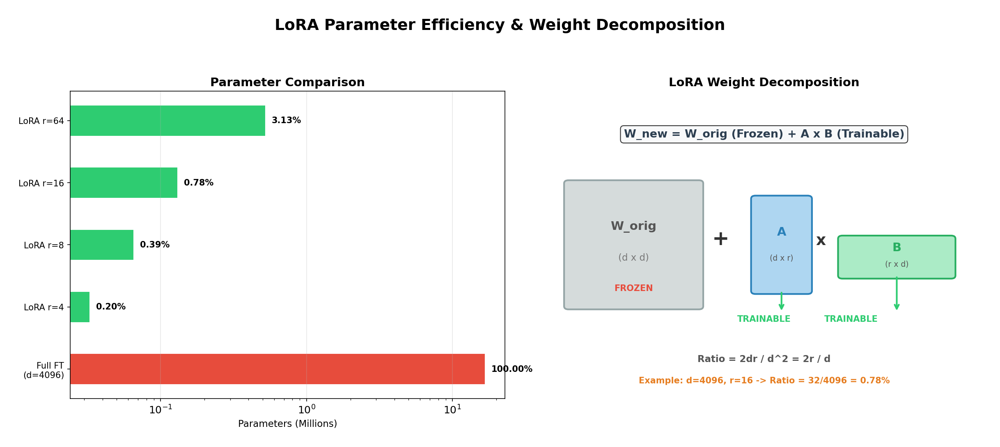

# Week 12 故事线：LLM 微调——从"什么都会"到"样样精通"

> **Source:** `26W-CST8510-Week12-Lecture1.pdf`
> **核心主题：** 通用大语言模型（LLM）虽然知识渊博，但面对专业领域时"不够精"——微调（Fine-Tuning）就是让"全科医生"变成"专科医生"的过程。
> **故事线：** 家庭厨师（Pre-trained LLM）→ 决定是否要进修（决策框架）→ 全日制 vs 周末班（Full Fine-Tuning vs LoRA）→ 选择哪家烹饪学校（框架对比）→ 实操练习（Colab Demo）

---

## 🎬 序幕：我们在解决什么问题？

### 从 GPT 到领域专家——通用模型的天花板

想象你有一个 ChatGPT 级别的模型，它能写诗、翻译、聊天，但当你让它：

- 为你的网络安全团队分析恶意软件特征
- 用你公司特有的代码风格写 API
- 按医院规定的格式生成诊断报告

…它就开始"胡说八道"了。

**根本原因：** Pre-trained LLM（预训练大语言模型）在海量通用数据上训练，拥有广泛但浅层的知识——就像一个**家庭厨师（Home Cook）**，什么菜都会做一点，但让他做精致的寿司 omakase？做不到。

> 💡 **类比记忆：** 预训练 = 大学通识教育（什么都学了一点），微调 = 研究生专攻一个方向。

**核心问题：** 如何让一个通用 LLM 在保持基础能力的同时，获得特定领域的深度专业能力？

**答案：** Fine-Tuning（微调）。

---

## 📚 第一章：微调的本质——从"会做菜"到"精通寿司"

### 1.1 什么是 LLM 微调

**① 一句话定义：** 微调就是用领域数据"再训练"一个已经学过通用知识的模型，让它在特定任务上变成专家。

**② 原理：** Pre-trained Model（通用知识）+ Domain-Specific Data（领域数据）→ Fine-Tuned Model（领域专家）

**③ 课程中的例子（Home Cook → Sushi Chef）：**

```
Homer（家庭厨师）                    Kenji（寿司大厨）
 ├─ 会做 pasta, steak, soup, tacos     ├─ 精通 Delicate Omakase
 ├─ 知道基本烹饪技巧                   ├─ 深谙日料食材与刀工
 └─ ❌ 做不出精致寿司                  └─ ✅ 领域顶级水准

           │                                   ▲
           └── 用 Japanese/Sushi Data 微调 ──→ ┘
```

**④ 记忆技巧：** 微调不是从零学起——Homer 已经会切菜、控火（通用能力），微调只是教他寿司的特殊技法。这就是为什么微调比从头训练高效得多。

---

## 🎭 第二章：决策框架——到底要不要微调？

在动手之前，必须先回答三个问题：**什么时候该微调？什么时候有更轻的替代方案？什么时候绝对不该微调？**

### 2.1 ✅ 六种需要微调的场景

| 场景 | 说明 | 例子 |
|------|------|------|
| **复杂任务** | 模型需要像专家一样完成高难度工作 | 像资深开发者一样写代码 |
| **优化成本/延迟** | 用小模型达到大模型效果，降低推理成本 | GPT-4 效果，Llama-7B 价格 |
| **高可靠性要求** | 准确性和一致性必须极高 | 医疗诊断、法律文书 |
| **定制语气/风格** | 匹配品牌调性 | 客服机器人用年轻化语气 |
| **强制输出格式** | 必须输出特定结构 | JSON Schema、特定报告模板 |
| **领域适配** | 模型缺乏特定领域知识 | 网络安全、生物医学 |

### 2.2 ⏸️ 先试这些轻量替代方案

> 🔑 **决策原则：** 微调是"最后手段"——如果 Prompt Engineering 或 RAG 能解决问题，就不应该微调。

**Prompt Engineering（提示工程）——不改模型，只改问法：**

| 方法 | 中文译名 | 核心思路 |
|------|----------|----------|
| Few-shot Learning | 少样本学习 | 在提示中给示例，让模型"照着做" |
| Chain-of-Thought | 思维链 | 让模型逐步推理，而非直接给答案 |
| Self-Consistency | 自一致性 | 多次采样，选最一致的答案 |
| OPRO Optimization | 提示词优化 | 用算法自动搜索最佳提示 |

**Advanced RAG（高级检索增强生成）——不改模型，只改知识源：**

| 方法 | 中文译名 | 核心思路 |
|------|----------|----------|
| Semantic Chunking | 语义切块 | 按含义（而非字数）分割文档 |
| Query Transformation | 查询变换 | 改写用户问题提高检索命中率 |
| Fusion Retrieval | 融合检索 | 合并多路检索结果 |
| Re-ranking | 重排序 | 用交叉编码器二次排序提高相关性 |

### 2.3 ❌ 四种不该微调的情况

| 情况 | 原因 | 应该怎么做 |
|------|------|------------|
| **数据变化太快**（如股票） | 模型训练完就过时了 | 用 RAG 实时检索 |
| **简单任务** | 杀鸡用牛刀 | 用 Prompt Engineering |
| **低质量数据** | 垃圾进→垃圾出，比不微调更差 | 先清洗数据 |
| **隐私限制** | 敏感数据不能用于训练 | 用 RAG + 本地部署 |



> 💡 **决策树速记：**
> ```
> 问题能用 Prompt Engineering 解决吗？
>   ├─ Yes → 不微调
>   └─ No → 能用 RAG 解决吗？
>              ├─ Yes → 不微调
>              └─ No → 数据够好、够稳定、无隐私问题？
>                         ├─ Yes → ✅ 微调
>                         └─ No → ❌ 不微调，先解决数据问题
> ```

### 2.4 ❗ 决策框架的局限——决定微调后，怎么选方法？

决定要微调之后，立刻面临新问题：**怎么微调？**

如果暴力更新模型的全部参数（数十亿个），会遇到两大麻烦：
1. **计算成本极高**——需要多张 H100 级别 GPU
2. **灾难性遗忘**——学了新领域，忘了老知识

> 🔑 **故事转折点：** 全量微调太贵、太危险 → 我们需要一种"既能学新知识，又不改动原有知识"的方法！

---

## 🏆 第三章：LoRA——用"便利贴"代替"重写整本书"

### 3.1 两种微调方法对比

| 维度 | Full Fine-Tuning（全量微调） | LoRA（低秩适配） |
|------|:---:|:---:|
| 更新范围 | **全部**参数 | **冻结原始** + 训练小型适配器 |
| 参数量 | Billions（数十亿） | Millions（数百万，极小比例） |
| 计算成本 | ❌ 极高 | ✅ 低 |
| 内存需求 | ❌ 极大 | ✅ 小 |
| 灾难性遗忘 | ⚠️ 可能 | ✅ 不会（原始权重冻结） |
| 多任务切换 | ❌ 每个任务一份完整模型 | ✅ 换个适配器就行 |
| 效果 | ✅ 强大 | ✅ 接近全量微调 |

### 3.2 LoRA 核心原理

**① 一句话定义：** LoRA 不改原书（冻结原始权重），只在书页边贴上便利贴（低秩适配器矩阵），推理时把书的内容和便利贴合并起来读。

**② 核心公式：**

```
W_new = W_orig + (A × B)
```

| 符号 | 含义 | 大小 | 状态 |
|------|------|------|------|
| `W_orig` | 原始预训练权重 | d × d（巨大） | **Frozen**（冻结） |
| `A` | 低秩矩阵 A | d × r（r ≪ d） | **Trainable**（可训练） |
| `B` | 低秩矩阵 B | r × d（r ≪ d） | **Trainable**（可训练） |
| `A × B` | 适配器贡献 | d × d | 训练产物 |
| `W_new` | 最终使用的权重 | d × d | 合并后 |

**③ 数值直觉（假设 d = 4096, r = 16）：**

```
原始权重参数量：4096 × 4096 = 16,777,216（1677 万）
LoRA 参数量：  4096 × 16 + 16 × 4096 = 131,072（13 万）
比例：         131,072 / 16,777,216 ≈ 0.78%  ← 不到 1% 的参数!
```



**④ 类比记忆：** 
> 💡 你有一本 1000 页的百科全书（W_orig），要让它包含网络安全知识。
> - **全量微调** = 重新印刷一整本新书（贵、慢、可能把旧内容改坏）
> - **LoRA** = 在相关页面贴便利贴（A×B），阅读时书的内容 + 便利贴一起看（W_orig + A×B = W_new）

### 3.3 LoRA 的组件角色

| 组件 | 功能 | 更新状态 | 参数规模 |
|------|------|----------|----------|
| **Base LLM** | 核心通用知识（Generalist） | **FROZEN** | **Billions** |
| **LoRA Adapter** | 新任务/领域技能（Specialist） | **UPDATABLE** | **Millions**（极小比例） |

### 3.4 LoRA 的实际优势

- **多任务共享**：同一个 Base LLM + 不同 LoRA Adapter = 不同领域专家
  - 医疗 Adapter、法律 Adapter、代码 Adapter…随时切换
- **部署灵活**：只需存储小型 Adapter 文件，不需要为每个任务复制整个大模型
- **训练民主化**：消费级 GPU（如 RTX 4090）就能训练，不再需要 H100 集群

---

## 📖 第四章：工具选型——该用哪个微调框架？

知道了方法（LoRA），还需要选对工具。四大主流框架各有定位：

| 特性 | Unsloth | Axolotl | LLaMA-Factory | HF PEFT |
|------|---------|---------|---------------|---------|
| **定位** | 极致速度/低显存 | 可复现性/大规模 | 易用一体化 | 核心逻辑/灵活集成 |
| **界面** | Python / No-code Studio | YAML 配置文件 | Web UI (LlamaBoard) | Python API |
| **适合硬件** | 单卡消费级 GPU | 多卡 H100/A100 集群 | 灵活 | 任意 |
| **上手难度** | 低~中 | 高 | 低 | 中~高 |
| **多卡支持** | Yes (Pro/Enterprise) | 原生最佳 | Yes | Yes |

> 💡 **选型速记：**
> - **个人学习/小项目** → **Unsloth**（速度快、显存低）
> - **企业大规模训练** → **Axolotl**（多卡扩展性最强）
> - **想快速上手、不写代码** → **LLaMA-Factory**（Web UI 一键操作）
> - **需要深度集成到已有项目** → **HF PEFT**（纯 API，最灵活）

---

## 📹 第五章：实操——Colab 微调 Llama

课程演示了在 Google Colab 上用**网络安全领域数据（Cybersecurity Domain Data）**微调 **Llama** 模型的完整流程。

**典型 LoRA 微调流程：**

```
1. 加载基座模型（Base Model）       ← 如 Llama-3-8B
2. 配置 LoRA 参数（rank, alpha）    ← 决定适配器大小
3. 准备领域数据                      ← 网络安全 Q&A、漏洞分析文本
4. 训练（只更新 Adapter 权重）       ← 几分钟到几小时
5. 合并 & 推理                       ← W_new = W_orig + (A × B)
```

---

## 🗺️ 全局回顾：技术演进路线图

```
┌──────────────────────────────────────────────────────┐
│             LLM 微调决策与方法演进                      │
│                                                      │
│ Pre-trained LLM（通用模型）                           │
│ ✅ 通用知识广博                                       │
│ ❌ 领域专精度不够                                     │
│         │                                            │
│         ▼                                            │
│ 先试轻量方案                                          │
│ ├─ Prompt Engineering（改问法）                       │
│ └─ RAG（加外部知识）                                  │
│ ✅ 低成本、无需训练                                    │
│ ❌ 复杂任务仍不够                                     │
│         │                                            │
│         ▼                                            │
│ Full Fine-Tuning（全量微调）                          │
│ ✅ 效果最强                                          │
│ ❌ 成本高 + 灾难性遗忘                                │
│         │                                            │
│         ▼                                            │
│ LoRA（低秩适配）                                      │
│ ✅ 效果接近全量、成本极低                              │
│ ✅ 无灾难性遗忘、可切换适配器                          │
│         │                                            │
│         ▼                                            │
│ 选择框架：Unsloth / Axolotl / LLaMA-Factory / HF PEFT │
│         │                                            │
│         ▼                                            │
│ 实操：Colab 微调 Llama                                │
└──────────────────────────────────────────────────────┘
```

### 关键转折点总结

| 从 → 到 | 解决了什么核心问题？ |
|---------|---------------------|
| Pre-trained → Prompt Eng./RAG | 无需训练就能提升特定任务表现 |
| Prompt Eng./RAG → Fine-Tuning | Prompt/RAG 无法满足的复杂深度需求 |
| Full Fine-Tuning → LoRA | 成本太高 + 灾难性遗忘 → 冻结原始权重 + 低秩适配器 |
| LoRA 原理 → 框架选型 | 知道方法后，选对工具落地 |

---

## 📝 考试/复习重点检查清单

- [ ] **定义**：能用一句话解释什么是 LLM 微调（从通用到专精）
- [ ] **类比**：能用 Home Cook vs Sushi Chef 类比解释微调的必要性
- [ ] **六种微调场景**：复杂任务、成本优化、高可靠性、定制风格、强制格式、领域适配
- [ ] **四种不微调场景**：数据变化快、简单任务、低质量数据、隐私限制
- [ ] **先试后调**：Prompt Engineering（Few-shot, CoT, Self-consistency, OPRO）+ RAG（Semantic Chunking, Query Transformation, Fusion Retrieval, Re-ranking）
- [ ] **Full Fine-Tuning 的问题**：成本极高 + 灾难性遗忘
- [ ] **LoRA 核心公式**：`W_new = W_orig + (A × B)`
- [ ] **LoRA 关键数字**：Base LLM = Frozen / Billions；Adapter = Updatable / Millions
- [ ] **LoRA 优势**：低成本、无遗忘、多任务可切换
- [ ] **四大框架定位**：Unsloth（速度）、Axolotl（大规模）、LLaMA-Factory（易用）、HF PEFT（灵活集成）

---

## 📚 参考资料

- 📄 [Week12_slides.md](Week12_slides.md) — 原始 slides 笔记（Phase 4 翻译版）
