# Week 3: MLOps 回顾与特征工程 (MLOps Recap & Feature Engineering)

> Source: `Week3-Lecture1 .pdf`
> Total slides: 29
> Instructor: Dr. Hari M Koduvely

---

## 1. 今日议程 (Agenda for Today)

**Agenda for Today — 今日议程**

- ❑ Theory: 5:30PM – 7:30PM — 理论课：5:30PM – 7:30PM
  - ▪ Recap of MLOps from Term — 上学期 MLOps 回顾
  - ▪ Feature Engineering — 特征工程
- ❑ Lab: 7:30PM – 9:30PM — 实验课：7:30PM – 9:30PM
  - ▪ Standup Meetings — 站会

---

## 2. MLOps 回顾 (MLOps Recap)

**MLOps Recap — MLOps 回顾**

- Summary of topics covered in course — 课程涵盖的主题总结
  - ❑ Data Engineering — 数据工程
  - ❑ Training Data Generation — 训练数据生成

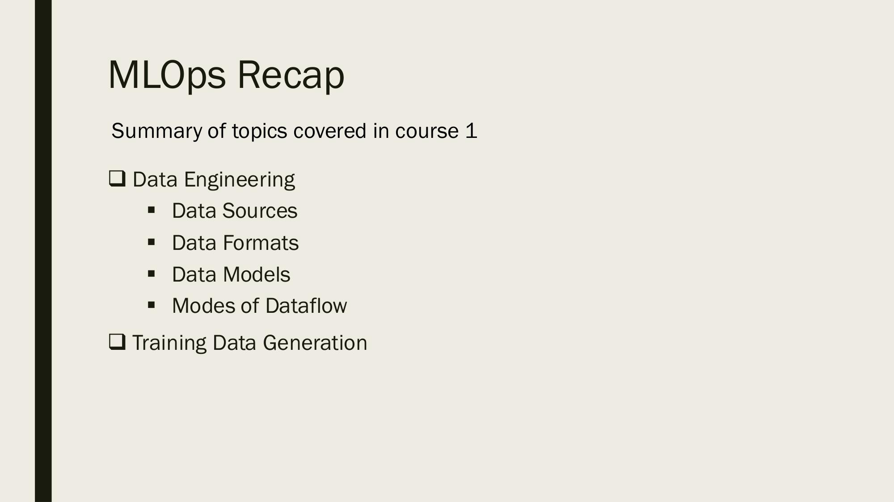

**MLOps Recap — MLOps 回顾（详细）**

- ❑ Data Engineering — 数据工程
  - ▪ Data Sources — 数据源
  - ▪ Data Formats — 数据格式
  - ▪ Data Models — 数据模型
  - ▪ Modes of Dataflow — 数据流模式
- ❑ Training Data Generation — 训练数据生成

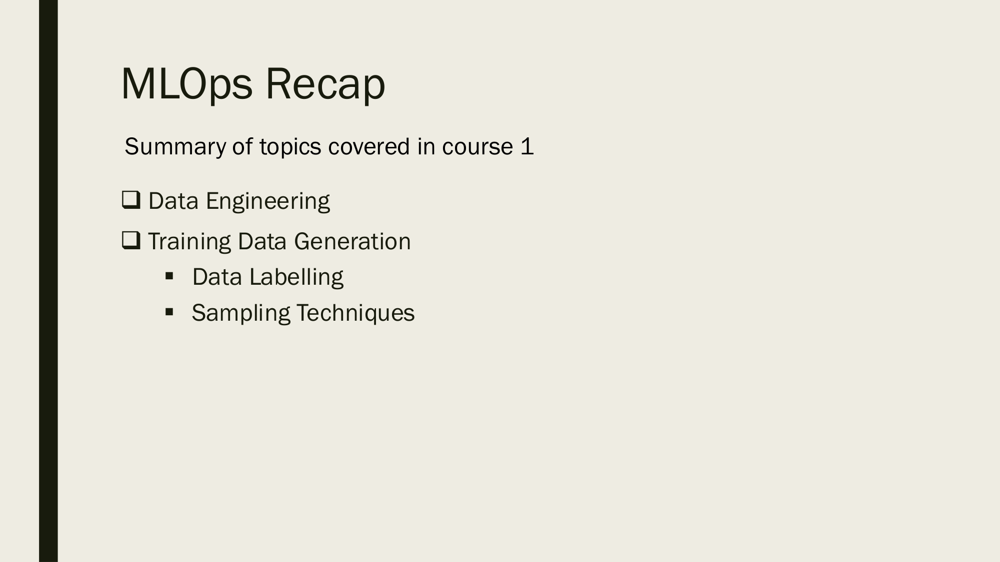

**MLOps Recap — MLOps 回顾（续）**

- ❑ Data Engineering — 数据工程
- ❑ Training Data Generation — 训练数据生成
  - ▪ Data Labelling — 数据标注
  - ▪ Sampling Techniques — 采样技术

---

## 3. 特征工程概览 (Feature Engineering Overview)

**Feature Engineering — 特征工程**

- ❑ Importance of Feature Engineering — 特征工程的重要性
- ❑ Handling Missing Values — 处理缺失值
- ❑ Feature Scaling — 特征缩放
- ❑ Encoding Categorical Features — 类别特征编码
- ❑ Positional Embeddings — 位置嵌入
- ❑ Data Leakage — 数据泄漏
- ❑ Feature Selection — 特征选择

---

## 4. 特征工程的重要性 (Importance of Feature Engineering)

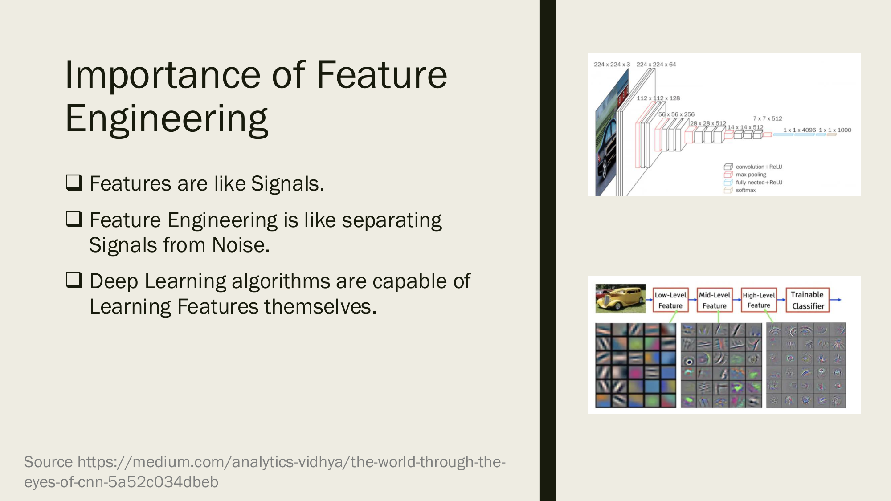

**Importance of Feature Engineering — 特征工程的重要性**

- ❑ Features are like Signals. — 特征就像信号。
- ❑ Feature Engineering is like separating Signals from Noise. — 特征工程就像从噪声中分离出信号。
- ❑ Deep Learning algorithms are capable of Learning Features themselves. — 深度学习算法能够自动学习特征。

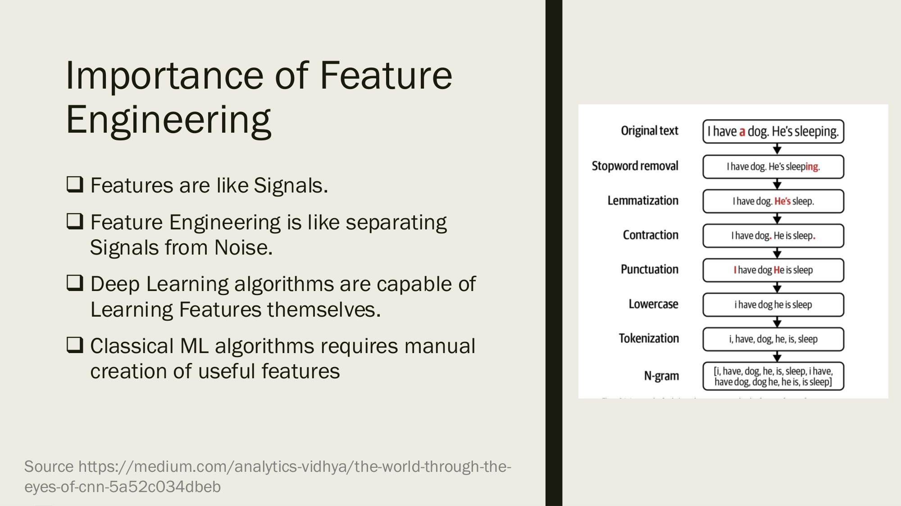

**Importance of Feature Engineering — 特征工程的重要性（续）**

- ❑ Features are like Signals. — 特征就像信号。
- ❑ Feature Engineering is like separating Signals from Noise. — 特征工程就像从噪声中分离出信号。
- ❑ Deep Learning algorithms are capable of Learning Features themselves. — 深度学习算法能够自动学习特征。
- ❑ Classical ML algorithms requires manual creation of useful features — 传统 ML 算法需要手动创建有用的特征

Ref: https://medium.com/analytics-vidhya/the-world-through-the-eyes-of-cnn-5a52c034dbeb

---

## 5. 处理缺失值 (Handling Missing Values)

### 5.1 缺失值类型 (Types of Missing Values)

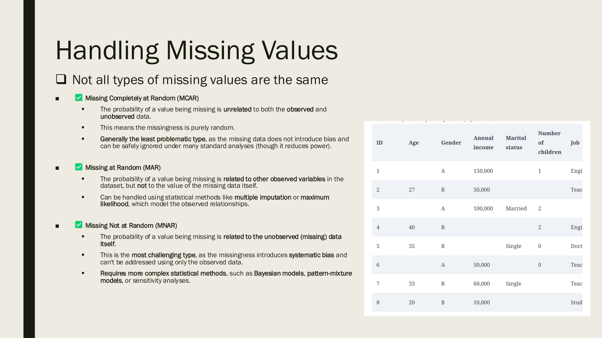

**Handling Missing Values — 处理缺失值**

- ❑ Not all types of missing values are the same — 不是所有缺失值的类型都相同
  - ■ **Missing Completely at Random (MCAR)** — 完全随机缺失
    - ▪ The probability of a value being missing is unrelated to both the observed and unobserved data. — 缺失的概率与观测数据和未观测数据均无关。
    - ▪ This means the missingness is purely random. — 这意味着缺失是纯随机的。
    - ▪ Generally the least problematic type, as the missing data does not introduce bias and can be safely ignored under many standard analyses (though it reduces power). — 通常是最不成问题的类型，因为缺失数据不会引入偏差，可以在许多标准分析中安全忽略（但会降低统计效力）。
  - ■ **Missing at Random (MAR)** — 随机缺失
    - ▪ The probability of a value being missing is related to other observed variables in the dataset, but not to the value of the missing data itself. — 缺失的概率与数据集中的其他观测变量有关，但与缺失数据本身的值无关。
    - ▪ Can be handled using statistical methods like multiple imputation or maximum likelihood, which model the observed relationships. — 可以使用多重插补或最大似然等统计方法处理。
  - ■ **Missing Not at Random (MNAR)** — 非随机缺失
    - ▪ The probability of a value being missing is related to the unobserved (missing) data itself. — 缺失的概率与未观测（缺失）数据本身有关。
    - ▪ This is the most challenging type, as the missingness introduces systematic bias and can't be addressed using only the observed data. — 这是最具挑战性的类型，因为缺失会引入系统性偏差，仅使用观测数据无法解决。
    - ▪ Requires more complex statistical methods, such as Bayesian models, pattern-mixture models, or sensitivity analyses. — 需要更复杂的统计方法，如贝叶斯模型、模式混合模型或敏感性分析。

### 5.2 缺失值示例 (Missing Value Examples)

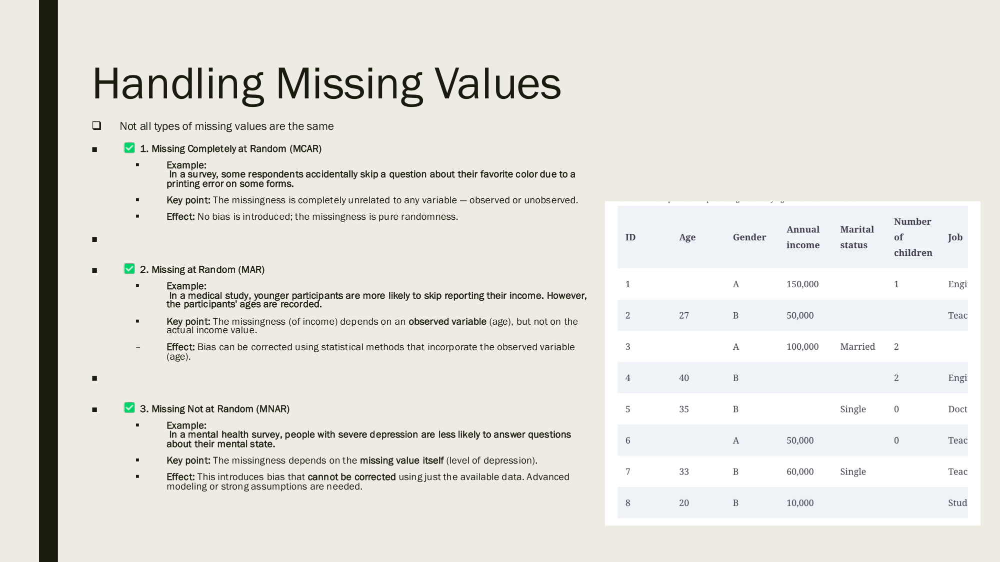

**Handling Missing Values — 处理缺失值（示例）**

- ■ 1. **Missing Completely at Random (MCAR)** — 完全随机缺失
  - ▪ Example: In a survey, some respondents accidentally skip a question about their favorite color due to a printing error on some forms. — 示例：在一项调查中，一些受访者因部分表格的印刷错误而意外跳过了关于最喜欢颜色的问题。
  - ▪ Key point: The missingness is completely unrelated to any variable — observed or unobserved. — 关键点：缺失与任何变量完全无关——无论是观测到的还是未观测到的。
  - ▪ Effect: No bias is introduced; the missingness is pure randomness. — 效果：不引入偏差；缺失是纯随机的。
- ■ 2. **Missing at Random (MAR)** — 随机缺失
  - ▪ Example: In a medical study, younger participants are more likely to skip reporting their income. However, the participants' ages are recorded. — 示例：在一项医学研究中，年轻参与者更可能跳过报告收入。但参与者的年龄是记录的。
  - ▪ Key point: The missingness (of income) depends on an observed variable (age), but not on the actual income value. — 关键点：（收入的）缺失取决于一个观测变量（年龄），而非实际收入值。
  - ▪ Effect: Bias can be corrected using statistical methods that incorporate the observed variable (age). — 效果：可以使用纳入观测变量（年龄）的统计方法来纠正偏差。
- ■ 3. **Missing Not at Random (MNAR)** — 非随机缺失
  - ▪ Example: In a mental health survey, people with severe depression are less likely to answer questions about their mental state. — 示例：在一项心理健康调查中，严重抑郁的人不太可能回答关于心理状态的问题。
  - ▪ Key point: The missingness depends on the missing value itself (level of depression). — 关键点：缺失取决于缺失值本身（抑郁程度）。
  - ▪ Effect: This introduces bias that cannot be corrected using just the available data. Advanced modeling or strong assumptions are needed. — 效果：这引入了仅使用可用数据无法纠正的偏差。需要高级建模或强假设。

### 5.3 处理缺失值的方法 (Methods for Handling Missing Values)

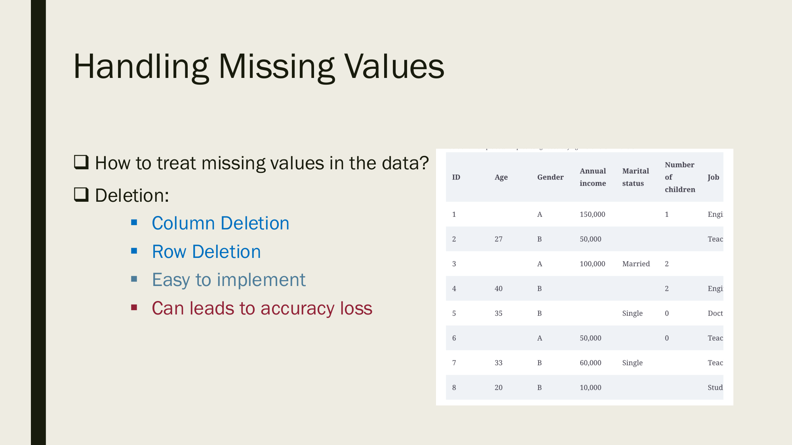

**Handling Missing Values — 处理缺失值（删除法）**

- ❑ How to treat missing values in the data? — 如何处理数据中的缺失值？
- ❑ **Deletion（删除法）:**
  - ▪ Column Deletion — 列删除
  - ▪ Row Deletion — 行删除
  - ▪ Easy to implement — 易于实现
  - ▪ Can lead to accuracy loss — 可能导致准确性损失

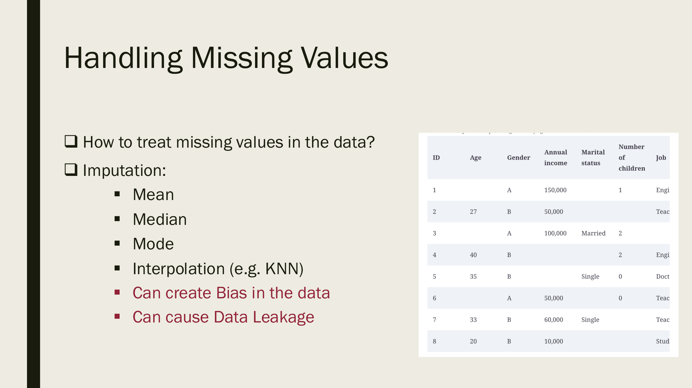

**Handling Missing Values — 处理缺失值（插补法）**

- ❑ **Imputation（插补法）:**
  - ▪ Mean — 均值插补
  - ▪ Median — 中位数插补
  - ▪ Mode — 众数插补
  - ▪ Interpolation (e.g. KNN) — 插值法（如 KNN）
  - ▪ Can create Bias in the data — 可能在数据中产生偏差
  - ▪ Can cause Data Leakage — 可能导致数据泄漏

---

## 6. 特征缩放 (Feature Scaling)

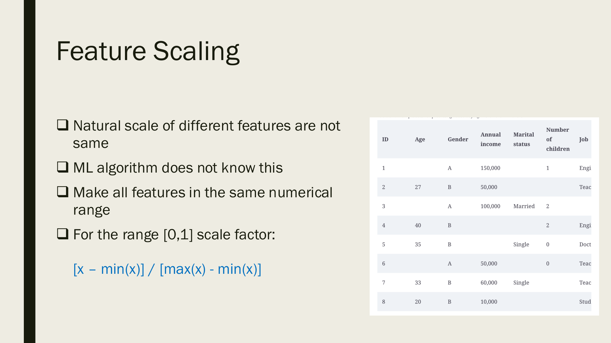

**Feature Scaling — 特征缩放**

- ❑ Natural scale of different features are not same — 不同特征的自然尺度不同
- ❑ ML algorithm does not know this — ML 算法不知道这一点
- ❑ Make all features in the same numerical range — 使所有特征在相同的数值范围内
- ❑ For the range [0,1] scale factor: `[x – min(x)] / [max(x) - min(x)]` — 对于 [0,1] 范围的缩放因子：`[x – min(x)] / [max(x) - min(x)]`

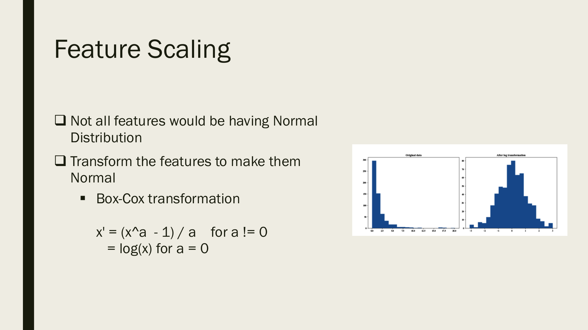

**Feature Scaling — 特征缩放（Box-Cox 变换）**

- ❑ Not all features would be having Normal Distribution — 并非所有特征都服从正态分布
- ❑ Transform the features to make them Normal — 变换特征使其呈正态分布
  - ▪ Box-Cox transformation — Box-Cox 变换
    - x' = (x^a - 1) / a for a ≠ 0 — 当 a ≠ 0 时
    - = log(x) for a = 0 — 当 a = 0 时

---

## 7. 离散化 (Discretization)

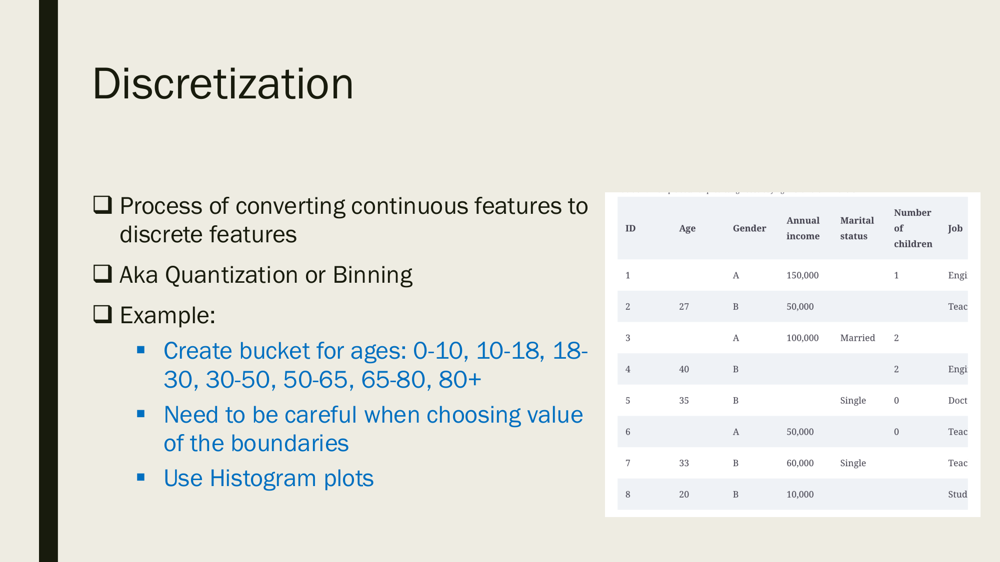

**Discretization — 离散化**

- ❑ Process of converting continuous features to discrete features — 将连续特征转换为离散特征的过程
- ❑ Aka Quantization or Binning — 也称为量化或分箱
- ❑ Example — 示例：
  - ▪ Create bucket for ages: 0-10, 10-18, 18-30, 30-50, 50-65, 65-80, 80+ — 为年龄创建桶：0-10, 10-18, 18-30, 30-50, 50-65, 65-80, 80+
  - ▪ Need to be careful when choosing value of the boundaries — 选择边界值时需要谨慎
  - ▪ Use Histogram plots — 使用直方图

---

## 8. 类别特征编码与嵌入 (Encoding Categorical Features & Embeddings)

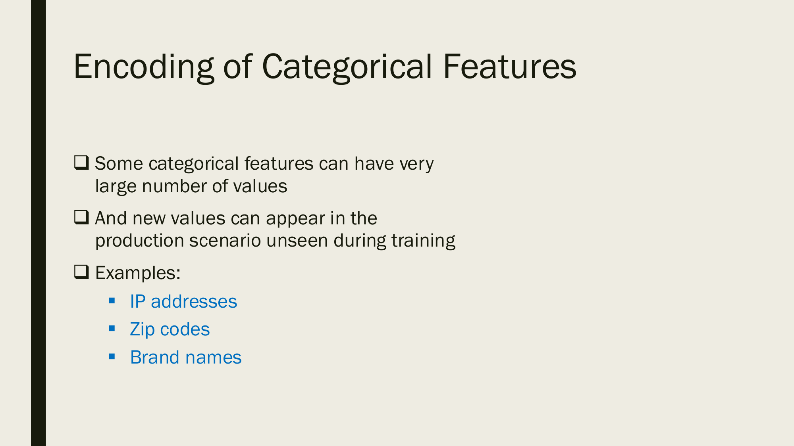

**Encoding of Categorical Features — 类别特征编码**

- ❑ Some categorical features can have very large number of values — 一些类别特征可以有非常大量的值
- ❑ And new values can appear in the production scenario unseen during training — 在生产场景中可能出现训练时未见过的新值
- ❑ Examples — 示例：
  - ▪ IP addresses — IP 地址
  - ▪ Zip codes — 邮编
  - ▪ Brand names — 品牌名称

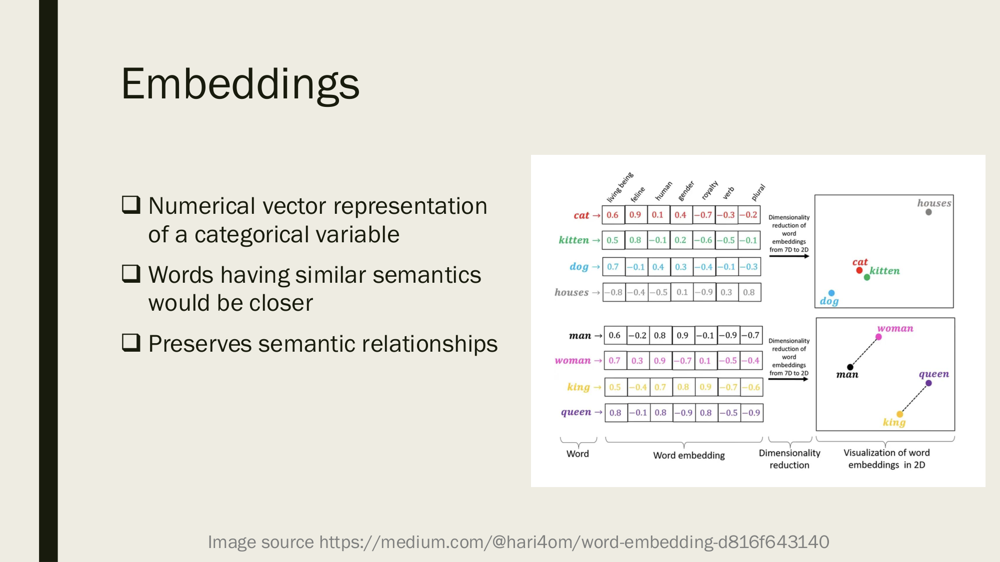

**Embeddings — 嵌入**

- ❑ Numerical vector representation of a categorical variable — 类别变量的数值向量表示
- ❑ Words having similar semantics would be closer — 语义相似的词在向量空间中更接近
- ❑ Preserves semantic relationships — 保留语义关系

Ref: https://medium.com/@hari4om/word-embedding-d816f643140

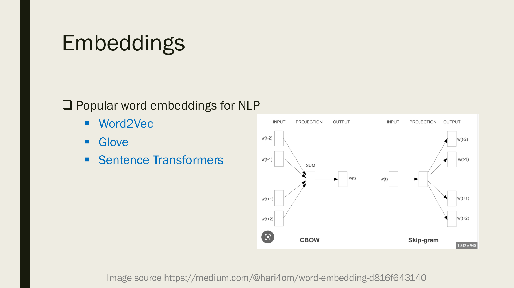

**Embeddings — 嵌入（流行方法）**

- ❑ Popular word embeddings for NLP — NLP 中流行的词嵌入方法
  - ▪ Word2Vec
  - ▪ Glove
  - ▪ Sentence Transformers — 句子变换器

---

## 9. 数据泄漏 (Data Leakage)

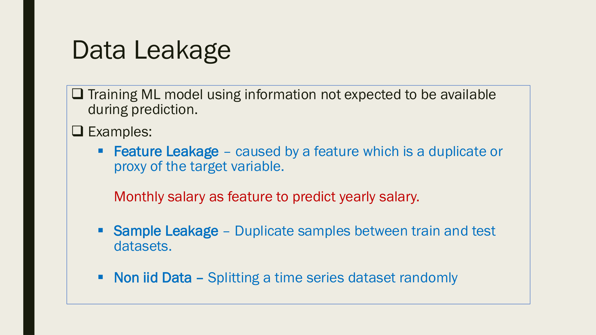

**Data Leakage — 数据泄漏**

- ❑ Training ML model using information not expected to be available during prediction. — 使用预测时不应可用的信息训练 ML 模型。
- ❑ Examples — 示例：
  - ▪ **Feature Leakage** – caused by a feature which is a duplicate or proxy of the target variable. — **特征泄漏** – 由目标变量的副本或代理特征引起。
    - Monthly salary as feature to predict yearly salary. — 用月薪作为特征预测年薪。
  - ▪ **Sample Leakage** – Duplicate samples between train and test datasets. — **样本泄漏** – 训练集和测试集之间存在重复样本。
  - ▪ **Non iid Data** – Splitting a time series dataset randomly — **非独立同分布数据** – 随机拆分时间序列数据集

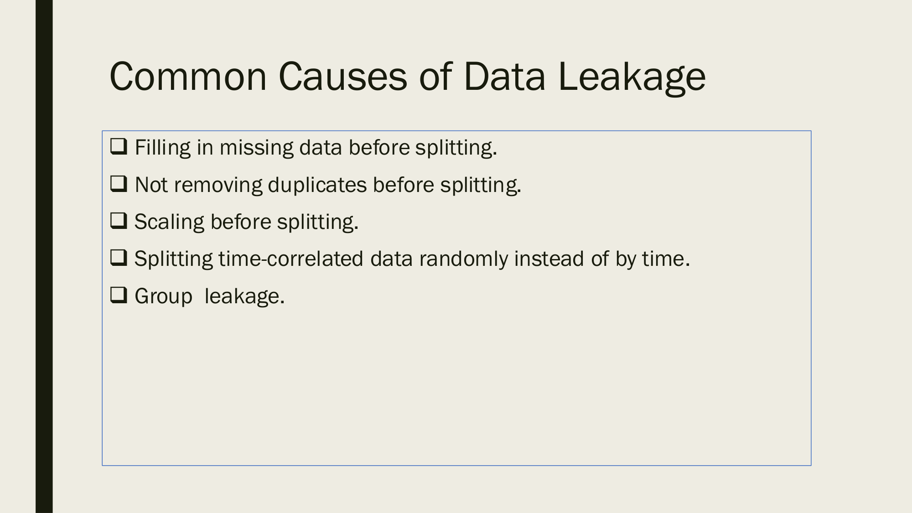

**Common Causes of Data Leakage — 数据泄漏的常见原因**

- ❑ Filling in missing data before splitting. — 在拆分前填充缺失数据。
- ❑ Not removing duplicates before splitting. — 在拆分前不去除重复。
- ❑ Scaling before splitting. — 在拆分前进行缩放。
- ❑ Splitting time-correlated data randomly instead of by time. — 随机拆分而非按时间拆分时间相关数据。
- ❑ Group leakage. — 分组泄漏。

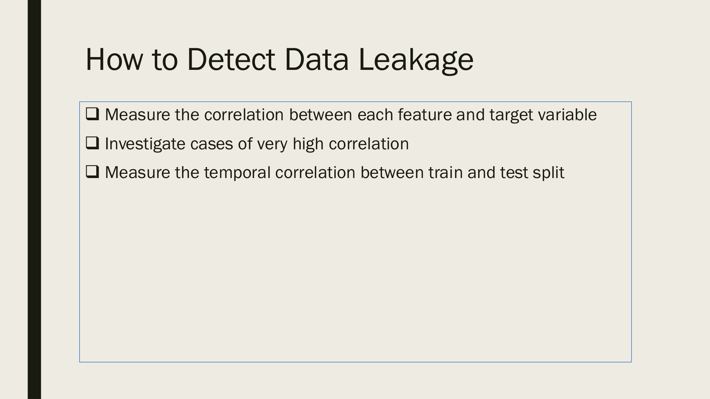

**How to Detect Data Leakage — 如何检测数据泄漏**

- ❑ Measure the correlation between each feature and target variable — 测量每个特征与目标变量的相关性
- ❑ Investigate cases of very high correlation — 调查相关性非常高的情况
- ❑ Measure the temporal correlation between train and test split — 测量训练集和测试集之间的时间相关性

---

## 10. 特征选择 (Feature Selection)

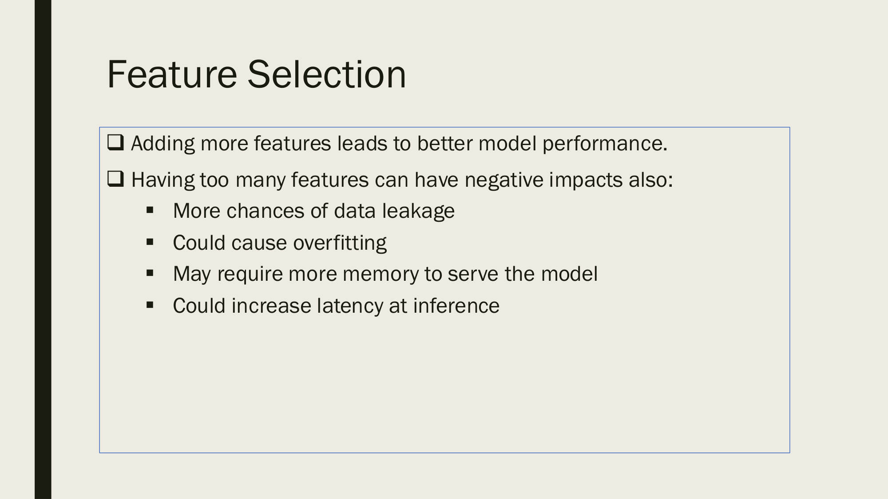

**Feature Selection — 特征选择**

- ❑ Adding more features leads to better model performance. — 添加更多特征可以提升模型性能。
- ❑ Having too many features can have negative impacts also: — 但特征太多也会产生负面影响：
  - ▪ More chances of data leakage — 更多数据泄漏的机会
  - ▪ Could cause overfitting — 可能导致过拟合
  - ▪ May require more memory to serve the model — 可能需要更多内存来服务模型
  - ▪ Could increase latency at inference — 可能增加推理延迟

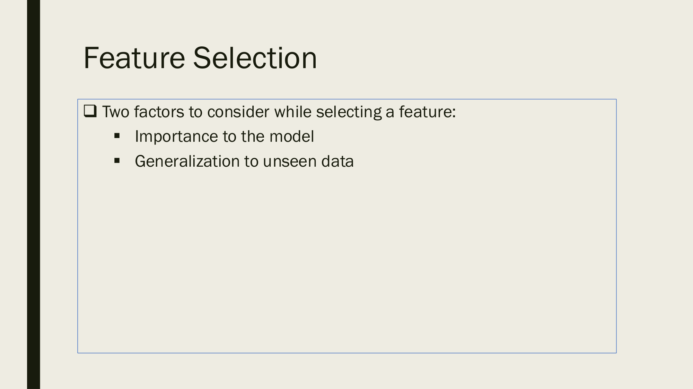

**Feature Selection — 特征选择（考虑因素）**

- ❑ Two factors to consider while selecting a feature: — 选择特征时需考虑两个因素：
  - ▪ Importance to the model — 对模型的重要性
  - ▪ Generalization to unseen data — 对未知数据的泛化能力

---

## 11. 特征重要性 — SHAP (Feature Importance — SHAP)

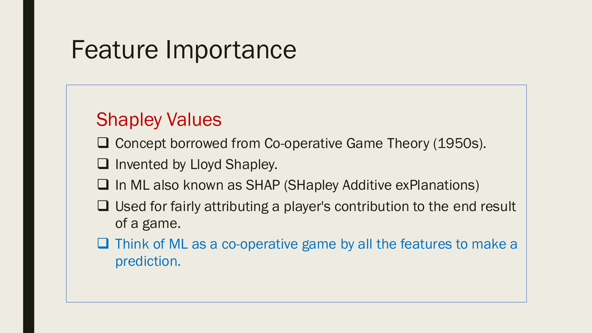

**Feature Importance — Shapley Values — 特征重要性 — Shapley 值**

- ❑ Concept borrowed from Co-operative Game Theory (1950s). — 概念借鉴自合作博弈论（1950年代）。
- ❑ Invented by Lloyd Shapley. — 由 Lloyd Shapley 发明。
- ❑ In ML also known as **SHAP** (SHapley Additive exPlanations) — 在 ML 中也称为 **SHAP**（SHapley Additive exPlanations）
- ❑ Used for fairly attributing a player's contribution to the end result of a game. — 用于公平地将参与者的贡献归因于游戏的最终结果。
- ❑ Think of ML as a co-operative game by all the features to make a prediction. — 将 ML 视为所有特征合作完成预测的博弈。

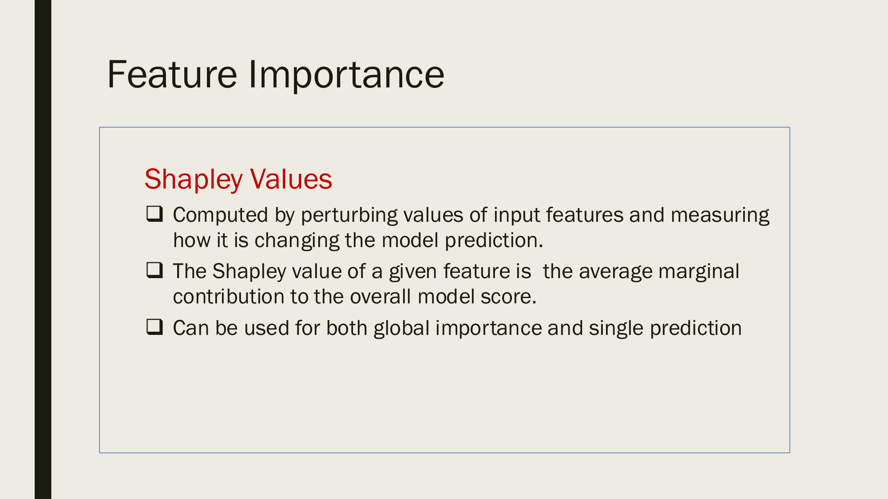

**Feature Importance — Shapley Values — 特征重要性 — Shapley 值（计算）**

- ❑ Computed by perturbing values of input features and measuring how it is changing the model prediction. — 通过扰动输入特征值并测量模型预测的变化来计算。
- ❑ The Shapley value of a given feature is the average marginal contribution to the overall model score. — 给定特征的 Shapley 值是其对整体模型得分的平均边际贡献。
- ❑ Can be used for both global importance and single prediction — 可用于全局重要性和单次预测的解释

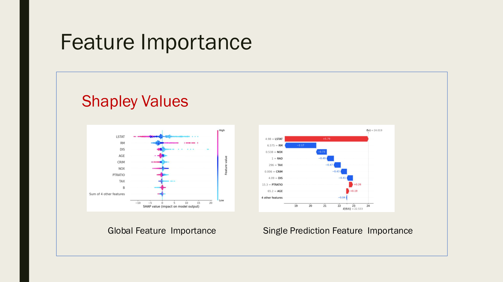

**Feature Importance — Shapley Values — 全局 vs 单次预测**

- Global Feature Importance — 全局特征重要性
- Single Prediction Feature Importance — 单次预测特征重要性

---

## 12. 特征泛化 (Feature Generalization)

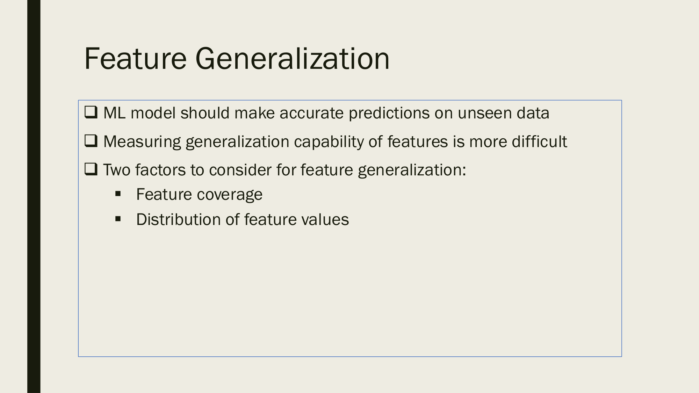

**Feature Generalization — 特征泛化**

- ❑ ML model should make accurate predictions on unseen data — ML 模型应在未见过的数据上做出准确预测
- ❑ Measuring generalization capability of features is more difficult — 衡量特征的泛化能力更加困难
- ❑ Two factors to consider for feature generalization: — 特征泛化需考虑两个因素：
  - ▪ Feature coverage — 特征覆盖率
  - ▪ Distribution of feature values — 特征值的分布

---

## 13. 最佳实践总结 (Summary of Best Practices)

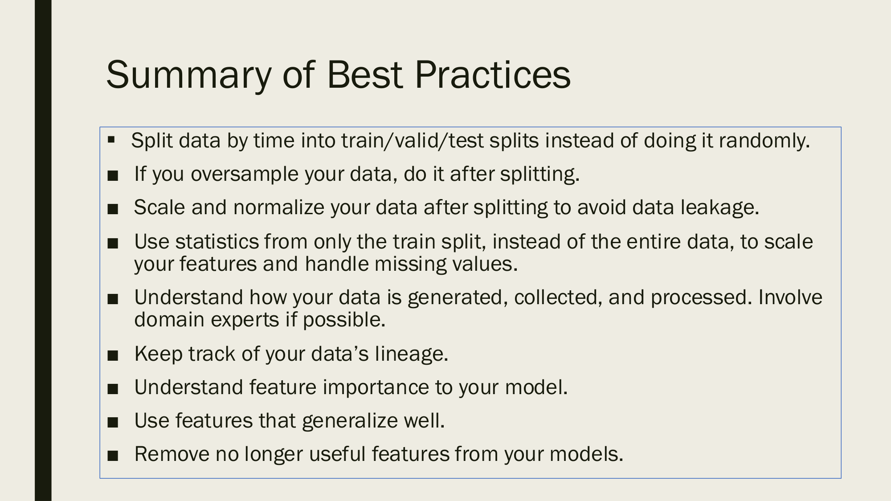

**Summary of Best Practices — 最佳实践总结**

- ▪ Split data by time into train/valid/test splits instead of doing it randomly. — 按时间拆分数据为训练/验证/测试集，而不是随机拆分。
- ■ If you oversample your data, do it after splitting. — 如果你过采样数据，在拆分后进行。
- ■ Scale and normalize your data after splitting to avoid data leakage. — 在拆分后缩放和归一化数据，以避免数据泄漏。
- ■ Use statistics from only the train split, instead of the entire data, to scale your features and handle missing values. — 仅使用训练集的统计量来缩放特征和处理缺失值，而非整个数据集。
- ■ Understand how your data is generated, collected, and processed. Involve domain experts if possible. — 了解数据的生成、收集和处理方式。如有可能，让领域专家参与。
- ■ Keep track of your data's lineage. — 跟踪数据血缘。
- ■ Understand feature importance to your model. — 了解特征对模型的重要性。
- ■ Use features that generalize well. — 使用泛化能力强的特征。
- ■ Remove no longer useful features from your models. — 从模型中移除不再有用的特征。

---

## 14. 练习 (Exercise)

**Feature Importance — Shapley Values — 练习**

- ❑ Google Colab Notebook - Credit Risk Score Prediction — Google Colab Notebook - 信用风险评分预测
