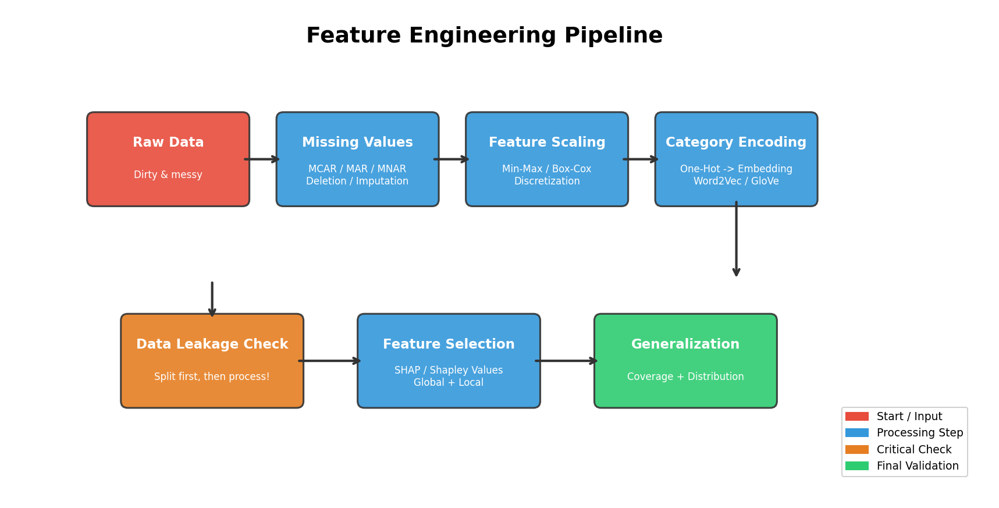
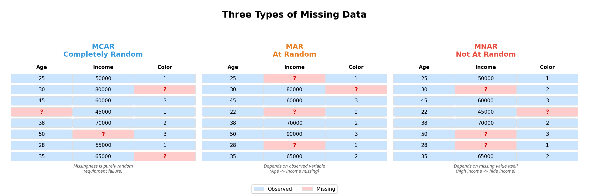
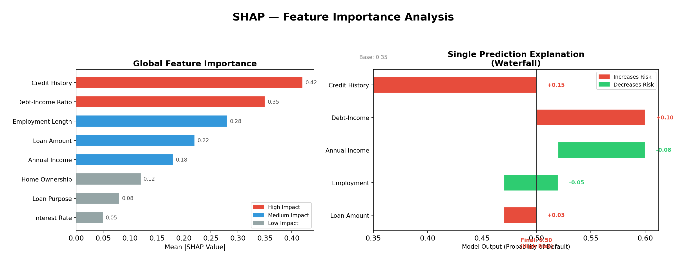

# Week 3 故事线：从"原始数据"到"可用特征"——特征工程全链路

> **Source:** `Week3-Lecture1.pdf`
> **核心主题：** 拿到一堆原始数据后，怎么把它变成 ML 模型真正能用的、高质量的特征？
> **故事线：** 一条净化链——原始数据（脏、乱、杂） → 清洗缺失值 → 统一尺度 → 编码类别 → 防止泄漏 → 选出关键特征 → 验证泛化能力

---

## 🎬 序幕：我们在解决什么问题？

你已经搭好了数据管道（Data Engineering），也标注好了训练数据（Training Data Generation）。现在要训练模型了——但等等：

- 有些列一半是空的（缺失值）
- 年龄是 0-100，收入是 0-1000000，尺度天差地别
- "品牌名"、"邮编"这种文字特征，模型根本不认识
- 你不小心把测试集的信息混进了训练集（数据泄漏）
- 100 个特征里，可能只有 20 个真正有用

> 💡 **核心直觉：** 特征工程 = 从噪声中分离信号。Features are Signals, Feature Engineering is separating Signals from Noise.

**传统 ML 与深度学习的分水岭就在这里：**

| 类型 | 特征怎么来？ | 对特征工程的依赖 |
|------|-------------|-----------------|
| **传统 ML**（SVM、随机森林等） | **人工设计** | ⭐⭐⭐⭐⭐ 极度依赖 |
| **深度学习**（CNN、Transformer） | **模型自动学习** | ⭐⭐ 依赖较少（但数据清洗仍不可少） |

本周沿着"数据净化链"，一步步把脏数据变成干净的、可用的特征。



---

## 📚 第一章：MLOps 回顾——我们已经走到哪了？

在进入特征工程之前，先回顾一下上学期已经完成的工作：

### 1.1 数据工程 (Data Engineering)

整个 ML 系统的"供水管道"：

| 模块 | 功能 | 类比 |
|------|------|------|
| **数据源 (Data Sources)** | 数据从哪来？DB、API、日志、传感器… | 水源 |
| **数据格式 (Data Formats)** | CSV、JSON、Parquet、TFRecord… | 水管规格 |
| **数据模型 (Data Models)** | 关系型、文档型、图数据库… | 水库设计图 |
| **数据流模式 (Modes of Dataflow)** | 批处理 vs 流处理 | 按需供水 vs 连续供水 |

### 1.2 训练数据生成 (Training Data Generation)

有了管道之后，需要生成可用于训练的标注数据：

| 模块 | 功能 |
|------|------|
| **数据标注 (Data Labelling)** | 给数据贴标签（人工、半自动、主动学习） |
| **采样技术 (Sampling Techniques)** | 从海量数据中选出有代表性的子集 |

> 🔑 **故事转折点：** 数据管道搭好了，标注也做完了——但原始数据依然**脏、乱、杂**。直接扔给模型？模型会"吃坏肚子"！→ **特征工程**登场！

---

## 🎭 第二章：清洗缺失值——数据里的"空洞"怎么填？

### 2.1 为什么缺失值是大问题？

真实世界的数据几乎不可能没有缺失值。但关键是：**缺失的原因不同，处理方式也不同**。

### 2.2 三种缺失机制

| 类型 | 英文 | 缺失原因 | 严重程度 | 例子 |
|------|------|---------|---------|------|
| **完全随机缺失** | MCAR (Missing Completely at Random) | 与任何变量无关 | ⭐ 最轻 | 问卷因印刷错误少了一题 |
| **随机缺失** | MAR (Missing at Random) | 与**已观测**变量有关 | ⭐⭐ 中等 | 年轻人更不愿填收入——缺失与年龄有关，但与收入本身无关 |
| **非随机缺失** | MNAR (Missing Not at Random) | 与**缺失值本身**有关 | ⭐⭐⭐ 最严重 | 重度抑郁者不愿回答心理健康问题——越严重越不填 |



> 💡 **核心区分：** MCAR = 纯意外；MAR = 与其他已知变量有关（可补救）；MNAR = 与缺失值自身有关（需要强假设才能处理）。

### 2.3 两大处理策略

拿到缺失数据后，选择其一：

#### 策略一：删除法 (Deletion)

| 方式 | 做法 | 优点 | 缺点 |
|------|------|------|------|
| **列删除 (Column Deletion)** | 整列缺失太多就删掉该特征 | 简单粗暴 | 可能丢失有用特征 |
| **行删除 (Row Deletion)** | 删掉含缺失值的样本 | 不引入假数据 | 数据量减少→模型准确性下降 |

#### 策略二：插补法 (Imputation)

| 方式 | 做法 | 适用场景 | ⚠️ 风险 |
|------|------|---------|---------|
| **均值 (Mean)** | 用该列的均值填充 | 数值型，MCAR | 压缩方差，歪曲分布 |
| **中位数 (Median)** | 用中位数填充 | 有离群值时 | 同上但更鲁棒 |
| **众数 (Mode)** | 用出现最多的值填充 | 类别型 | 放大多数类 |
| **KNN 插值** | 用相似样本的值估算 | MAR | 计算成本高 |

> ⚠️ **考试陷阱：** 插补法可能导致**数据泄漏 (Data Leakage)**！如果你用包含测试集的全部数据计算均值/中位数，再填充训练集——这就是泄漏。

> 🔑 **故事转折点：** 缺失值处理完了，数据不再有"空洞"。但还有一个问题——特征的**尺度**完全不统一！年龄是 0-100，收入是 0-1000000，模型会被大尺度特征"带偏"。→ 我们需要**特征缩放**！

---

## 📖 第三章：统一尺度——特征缩放与变换

### 3.1 为什么需要缩放？

ML 算法不"知道"特征的物理含义。它只看数值大小：

```
问题示例：
┌─────────────┬──────────────┐
│   年龄       │   年收入      │
│   25         │   80,000     │
│   30         │   120,000    │
│   45         │   55,000     │
└─────────────┴──────────────┘

在距离类算法（KNN、SVM）中：
  年收入的数值差异 >> 年龄的数值差异
  → 模型会认为"年收入"比"年龄"重要得多（但这不一定正确！）
```

### 3.2 Min-Max 归一化

将所有特征缩放到 [0, 1] 范围：

```
x' = (x - min(x)) / (max(x) - min(x))
```

- 优点：所有值在同一范围
- 缺点：对离群值敏感

### 3.3 Box-Cox 变换

有些特征本身就不是正态分布（偏态分布），需要先"变正态"：

```
Box-Cox 变换公式：
  x' = (x^a - 1) / a    当 a ≠ 0
  x' = log(x)            当 a = 0
```

> 💡 **什么时候用？** 当特征的直方图明显偏斜时。Box-Cox 自动找到最佳的 a 值，把数据"拉"成近似正态分布。

### 3.4 离散化 / 分箱 (Discretization / Binning)

有时候反过来——把连续特征转为离散特征更有效：

```
年龄 → 年龄段（分箱）：
  0-10   → "儿童"
  10-18  → "青少年"
  18-30  → "青年"
  30-50  → "中年"
  50-65  → "壮年"
  65-80  → "老年"
  80+    → "高龄"
```

- 需要**谨慎选择边界**——边界选错会丢失关键模式
- 建议先画直方图 (Histogram) 观察分布再选边界

> 🔑 **故事转折点：** 数值特征搞定了——缺失值填好、尺度统一。但数据里还有**文字型特征**（品牌名、城市、IP 地址…），模型完全不认识！→ 我们需要**类别特征编码**！

---

## 🏆 第四章：让模型"读懂"文字——类别编码与嵌入

### 4.1 类别特征的挑战

有些类别特征值的数量可能非常庞大，且在生产环境中会出现训练时未见过的新值：

| 特征 | 可能的取值数量 | 新值问题 |
|------|--------------|---------|
| IP 地址 | 数十亿 | ✅ 频繁出现新 IP |
| 邮编 | 数十万 | ✅ 新邮编区 |
| 品牌名称 | 数千~数万 | ✅ 新品牌上市 |

简单的 One-Hot 编码在这种场景下会产生**极度高维且稀疏**的特征。

### 4.2 嵌入 (Embeddings)——优雅的解

> **一句话定义：** 嵌入 = 将类别变量映射为低维稠密向量（每个类别 → 一个固定维度的向量）。

核心优势：

| 能力 | 说明 |
|------|------|
| **语义保留** | 语义相似的词在向量空间中距离更近 |
| **维度可控** | 不管类别有多少个值，向量维度固定（如 50-300 维） |
| **泛化能力** | 新值可以通过与已知值的语义相似性获得合理表示 |

### 4.3 流行的嵌入方法

| 方法 | 原理 | 适用场景 |
|------|------|---------|
| **Word2Vec** | 预测上下文窗口中的相邻词 | 单词级嵌入 |
| **GloVe** | 全局共现矩阵分解 | 单词级嵌入 |
| **Sentence Transformers** | Transformer 编码整个句子 | 句子/段落级嵌入 |

> 💡 **类比：** One-Hot = 给每个人发一个唯一的身份证号（1000 人就要 1000 维）；Embedding = 用"身高、体重、年龄"三个数字描述每个人（3 维就够了，而且相似的人数字接近）。

> 🔑 **故事转折点：** 缺失值填了、尺度统一了、文字编码了——特征看起来很完美？小心！你可能已经**不知不觉地作弊了**。→ **数据泄漏 (Data Leakage)** ！

---

## ⚠️ 第五章：隐形杀手——数据泄漏 (Data Leakage)

### 5.1 什么是数据泄漏？

> **一句话定义：** 训练时使用了**预测时不应该拥有的信息**。

模型的训练指标看起来好得不真实——但上线后性能暴跌。如果你遇到了 99%+ 的准确率，**先别高兴，先查泄漏**。

### 5.2 三种泄漏类型

| 类型 | 英文 | 怎么发生？ | 经典例子 |
|------|------|-----------|---------|
| **特征泄漏** | Feature Leakage | 某个特征是目标变量的"马甲" | 用**月薪**预测**年薪**（月薪×12=年薪） |
| **样本泄漏** | Sample Leakage | 训练集和测试集有重复样本 | 同一张 CT 图出现在 train 和 test |
| **非 IID 泄漏** | Non-IID Leakage | 时序数据被随机拆分 | 用周五的股价数据"预测"周三的价格 |

### 5.3 五大常见原因

这些操作如果在 train/test 拆分**之前**做，都会导致泄漏：

```
❌ 拆分前填缺失值      → 测试集的统计信息泄入训练集
❌ 拆分前不去重         → 同一样本出现在两边
❌ 拆分前缩放/归一化    → 用了全局 min/max/mean
❌ 随机拆分时序数据      → 未来信息泄入过去
❌ 组泄漏 (Group Leak)  → 同一患者的多张 CT 分散在两边
```

### 5.4 如何检测泄漏？

| 检测方法 | 做法 | 原理 |
|---------|------|------|
| **特征-目标相关性** | 测量每个特征与目标变量的相关系数 | 异常高的相关 → 可能是泄漏 |
| **异常高准确率** | 模型准确率高得不正常（>99%） | 太好 = 可能在作弊 |
| **时间相关性** | 检查 train 和 test 的时间分布 | 应完全不重叠 |

> 💡 **记忆口诀：** "先拆分，后处理"——所有数据预处理（填充、缩放、去重、过采样）都应该在 train/test 拆分**之后**进行。

> 🔑 **故事转折点：** 堵住了泄漏。但现在你有 100 个特征——它们不可能全是有用的。留着太多无用特征会过拟合、增加延迟、消耗内存。→ 我们需要**特征选择**！

---

## 📖 第六章：去芜存菁——特征选择 (Feature Selection)

### 6.1 为什么不能"特征越多越好"？

直觉上，更多特征 = 更多信息 = 更好的模型。但事实恰恰相反：

| 特征过多的危害 | 说明 |
|--------------|------|
| **过拟合 (Overfitting)** | 模型记住了噪声而非模式 |
| **数据泄漏风险增大** | 更多特征 = 更多可能的泄漏源 |
| **内存消耗增大** | 服务模型需要更多内存 |
| **推理延迟增加** | 特征越多，计算越慢 |

### 6.2 选择的两大标准

| 标准 | 英文 | 含义 |
|------|------|------|
| **对模型的重要性** | Importance to the Model | 这个特征对预测有多大贡献？ |
| **对未知数据的泛化能力** | Generalization to Unseen Data | 这个特征在新数据上还管用吗？ |

### 6.3 SHAP——公平衡量特征贡献

> **一句话定义：** SHAP (SHapley Additive exPlanations) = 借鉴合作博弈论中的 Shapley 值，公平地衡量每个特征对预测结果的贡献。

**概念起源：** 1950 年代 Lloyd Shapley 提出，解决合作博弈中"如何公平分配收益"的问题。在 ML 中，把"特征"看成"玩家"，"模型预测"看成"收益"。

**SHAP 工作原理（四步法）：**

| 步骤 | 做法 |
|------|------|
| ① 选定特征 | 比如特征 A |
| ② 扰动值 | 改变特征 A 的值（保持其他不变） |
| ③ 观察变化 | 看模型预测变了多少 |
| ④ 平均贡献 | 在所有可能的特征组合中取平均 → 得到 Shapley 值 |

**SHAP 的两种用法：**

| 用法 | 英文 | 含义 | 可视化 |
|------|------|------|--------|
| **全局重要性** | Global Feature Importance | 哪些特征整体上对模型最重要？ | Bar plot（按重要性排序） |
| **单次预测解释** | Single Prediction Importance | 对于这一个预测，哪些特征推高/推低了结果？ | Waterfall / Force plot |



> 💡 **类比：** 你和 3 个朋友合伙开店赚了 100 万。SHAP 就是计算每个人"如果TA不参加，收益会少多少"——在所有可能的组合中取平均，得到每人的公平贡献。

---

## 📹 第七章：特征的"保质期"——泛化能力

### 7.1 为什么需要关注泛化？

训练集上重要的特征，在新数据上可能完全没用。特征泛化需要考虑两个因素：

| 因素 | 英文 | 含义 | 例子 |
|------|------|------|------|
| **特征覆盖率** | Feature Coverage | 该特征在多大比例的数据中有值？ | "VIP 等级"特征只有 5% 用户有值 → 覆盖率太低 |
| **特征值分布** | Distribution of Feature Values | 训练集和生产数据的分布是否一致？ | 训练数据主要是北京用户，上线后全国用户涌入 → 分布漂移 |

> 💡 **关键洞察：** 一个特征即使在训练集上 SHAP 值很高，如果它在新数据上**覆盖率极低**或者**分布差异巨大**，那它就是一个"过拟合的功臣"——必须警惕！

---

## 🗺️ 全局回顾：技术演进路线图

```
┌────────────────────────────────────────────────────────────────┐
│  从"原始数据"到"可用特征" — 特征工程净化链                       │
│                                                                │
│  序幕：MLOps 回顾                                              │
│  ✅ 数据管道已搭好，训练数据已标注                               │
│  ❌ 问题：原始数据脏乱杂，不能直接喂给模型！                     │
│           │                                                    │
│           ▼                                                    │
│  第二章：处理缺失值                                             │
│  ✅ 区分 MCAR / MAR / MNAR 三种缺失机制                        │
│  ✅ 删除法（简单）vs 插补法（保留数据）                          │
│  ❌ 问题：数值填好了，但尺度不统一！                             │
│           │                                                    │
│           ▼                                                    │
│  第三章：特征缩放与变换                                         │
│  ✅ Min-Max 归一化 → [0,1] 范围                                │
│  ✅ Box-Cox 变换 → 非正态→正态                                  │
│  ✅ 离散化/分箱 → 连续→类别                                     │
│  ❌ 问题：数值搞定了，文字型特征模型不认识！                     │
│           │                                                    │
│           ▼                                                    │
│  第四章：类别编码与嵌入                                         │
│  ✅ One-Hot（简单但高维） vs Embeddings（低维稠密）             │
│  ✅ Word2Vec / GloVe / Sentence Transformers                   │
│  ❌ 问题：特征看着完美？小心数据泄漏！                           │
│           │                                                    │
│           ▼                                                    │
│  第五章：数据泄漏防治                                           │
│  ✅ 三种泄漏：特征 / 样本 / 非 IID                              │
│  ✅ 黄金法则："先拆分，后处理"                                   │
│  ❌ 问题：100 个特征太多了，过拟合 + 高延迟！                    │
│           │                                                    │
│           ▼                                                    │
│  第六章：特征选择                                               │
│  ✅ SHAP（Shapley 值）衡量特征贡献                              │
│  ✅ 全局 vs 单次预测两种解释                                    │
│           │                                                    │
│           ▼                                                    │
│  第七章：泛化验证                                               │
│  ✅ 覆盖率 + 分布一致性 → 确保特征在新数据上仍有效               │
│                                                                │
│  净化链完整路径：                                               │
│  脏数据 → 填缺失 → 统一尺度 → 编码文字 → 防泄漏 → 选特征 → 验泛化│
└────────────────────────────────────────────────────────────────┘
```

### 关键概念对比总结

| 从 → 到 | 解决了什么核心问题？ |
|---------|---------------------|
| 原始数据 → 缺失值处理 | 数据有"空洞"，需区分机制后合理填充或删除 |
| 缺失值处理 → 特征缩放 | 不同特征尺度差异极大，距离类算法会被大尺度特征误导 |
| 特征缩放 → 类别编码 | 文字型特征模型不认识，需转为数值向量 |
| One-Hot → Embeddings | 高基数类别特征用 One-Hot 会维度爆炸，嵌入是低维稠密替代 |
| 特征准备 → 数据泄漏防治 | 预处理顺序错误会导致"看似完美实则作弊"的模型 |
| 全部特征 → 特征选择 | 太多特征→过拟合+高延迟，SHAP 公平衡量贡献 |
| 特征重要性 → 泛化验证 | 训练集上重要不代表新数据上有效，需检查覆盖率和分布 |

---

## 📋 最佳实践速查（考试必记）

| # | 最佳实践 | 原因 |
|---|---------|------|
| 1 | **按时间拆分**，而非随机拆分 | 防止时序数据泄漏 |
| 2 | **过采样在拆分之后**做 | 防止重复样本跨越 train/test |
| 3 | **缩放/归一化在拆分之后**做 | 防止用全局统计量泄漏信息 |
| 4 | **仅用 train 的统计量**处理缺失值和缩放 | 模拟生产环境（test = 未知数据） |
| 5 | 了解数据的**生成、收集和处理方式** | 领域知识可发现隐藏的泄漏和偏差 |
| 6 | 跟踪**数据血缘 (Data Lineage)** | 可追溯数据问题的根源 |
| 7 | 理解**特征重要性** (SHAP) | 移除无用特征，保留关键特征 |
| 8 | 使用**泛化能力强**的特征 | 训练集和生产数据分布要一致 |
| 9 | 定期**移除不再有用的特征** | 数据分布会漂移，旧特征可能已失效 |

---

## 📝 考试/复习重点检查清单

- [ ] 能解释**特征工程的核心思想**："从噪声中分离信号"
- [ ] 能区分**传统 ML vs 深度学习**对特征工程的依赖差异
- [ ] 能说出并区分 **MCAR / MAR / MNAR** 三种缺失机制，并各给一个例子
- [ ] 能说出处理缺失值的**两大策略**（删除法 vs 插补法）及各自的优缺点
- [ ] 能写出 **Min-Max 归一化**的公式
- [ ] 能解释 **Box-Cox 变换**的目的和公式
- [ ] 能解释**离散化/分箱**的概念和注意事项
- [ ] 能解释为什么高基数类别特征需要 **Embedding** 而非 One-Hot
- [ ] 能说出三种流行的嵌入方法（Word2Vec, GloVe, Sentence Transformers）
- [ ] 能定义**数据泄漏**并说出三种类型（特征 / 样本 / 非 IID）
- [ ] 能列出导致数据泄漏的 **五大常见原因**
- [ ] 能说出数据泄漏的**检测方法**
- [ ] 能背出黄金法则：**"先拆分，后处理"**
- [ ] 能解释特征过多的**四大危害**（过拟合、泄漏、内存、延迟）
- [ ] 能解释 **SHAP / Shapley 值**的概念、来源和计算思路
- [ ] 能区分 SHAP 的**全局 vs 单次预测**两种用法
- [ ] 能说出特征泛化的**两个因素**（覆盖率 + 分布一致性）
- [ ] 能默写出 **9 条最佳实践**

---

## 📚 参考资料

- [Week3_slides.md](Week3_slides.md) — 原始 slides 格式化笔记
- Course: CST8510 Artificial Intelligence Software Development
- Instructor: Dr. Hari M Koduvely
- Word Embedding Reference: https://medium.com/@hari4om/word-embedding-d816f643140
- CNN Feature Learning: https://medium.com/analytics-vidhya/the-world-through-the-eyes-of-cnn-5a52c034dbeb
