# Week 4: 选择 ML 算法、分布式训练与 AutoML (Choosing ML Algorithm, Distributed Training & AutoML)

> Source: `Week4-Lecture1.pdf`
> Total slides: 34
> Instructor: Dr. Hari M Koduvely

---

## 1. 今日议程 (Agenda for Today)

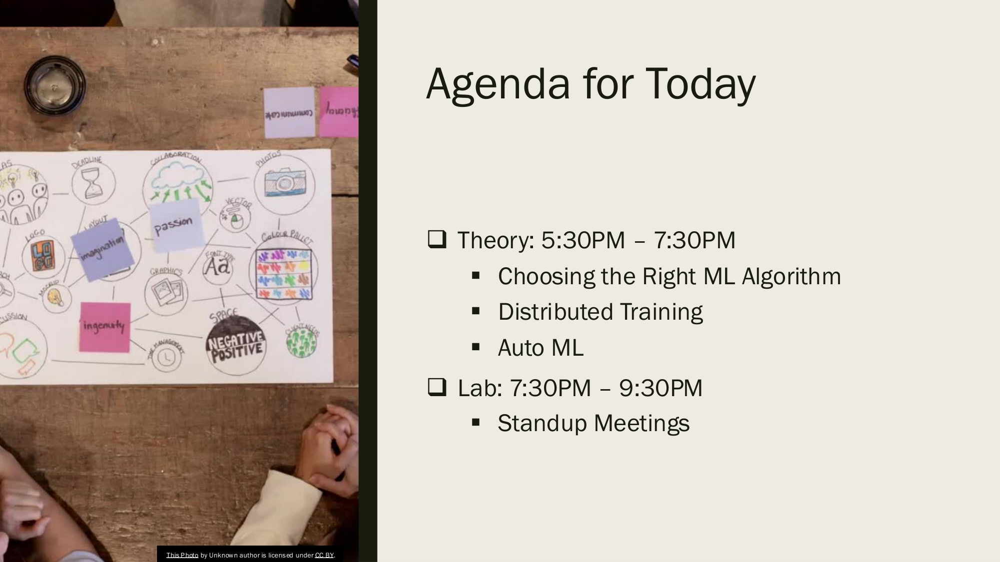

**Agenda for Today — 今日议程**

- ❑ Theory: 5:30PM – 7:30PM — 理论课：5:30PM – 7:30PM
  - ▪ Choosing the Right ML Algorithm — 选择正确的 ML 算法
  - ▪ Distributed Training — 分布式训练
  - ▪ Auto ML — 自动机器学习
- ❑ Lab: 7:30PM – 9:30PM — 实验课：7:30PM – 9:30PM
  - ▪ Standup Meetings — 站会

---

## 2. 选择正确的 ML 算法 (Choosing the Right ML Algorithm)

### 2.1 避免人为偏差 (Avoid Human Biases)

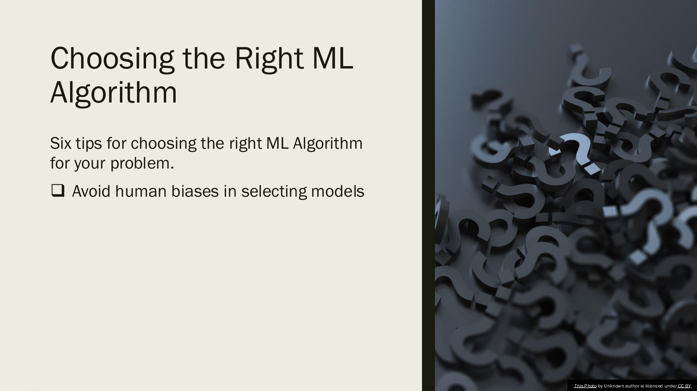

**Choosing the Right ML Algorithm — 选择正确的 ML 算法**

- Six tips for choosing the right ML Algorithm for your problem. — 为你的问题选择正确 ML 算法的六个技巧。
- ❑ Avoid human biases in selecting models — 避免选择模型时的人为偏差

### 2.2 不要只用 SOTA 模型 (Don't Only Use SOTA Models)

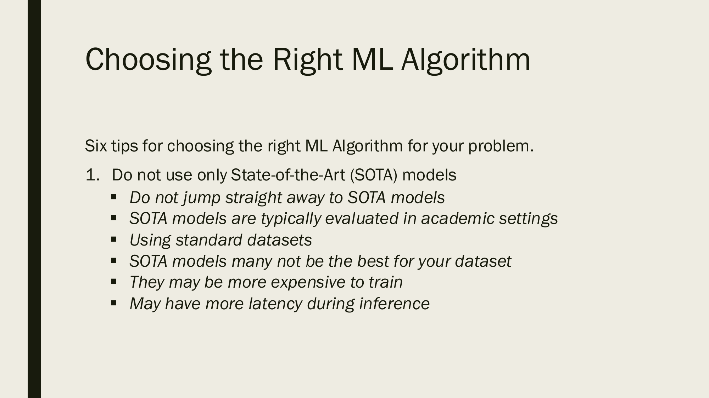

**Choosing the Right ML Algorithm — 技巧 1**

- 1. Do not use only State-of-the-Art (SOTA) models — 不要只使用最先进（SOTA）的模型
  - ▪ Do not jump straight away to SOTA models — 不要直接跳到 SOTA 模型
  - ▪ SOTA models are typically evaluated in academic settings — SOTA 模型通常在学术环境中评估
  - ▪ Using standard datasets — 使用标准数据集
  - ▪ SOTA models may not be the best for your dataset — SOTA 模型可能不是你的数据集的最佳选择
  - ▪ They may be more expensive to train — 训练成本可能更高
  - ▪ May have more latency during inference — 推理时可能有更高延迟

### 2.3 从简单模型开始 (Start with Simple Models)

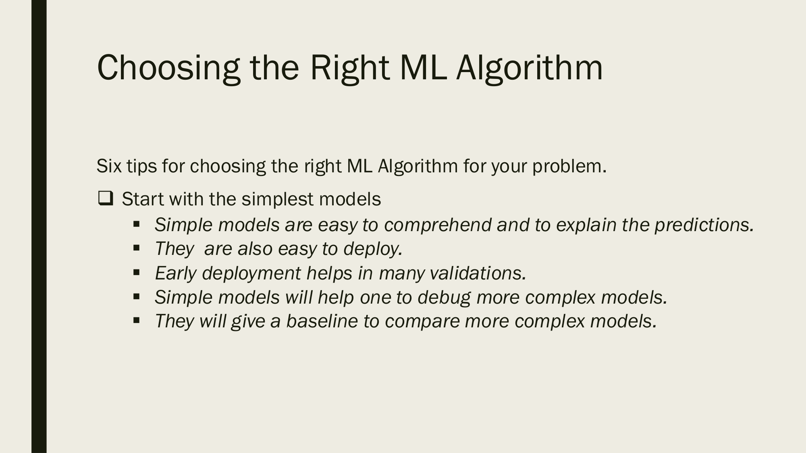

**Choosing the Right ML Algorithm — 技巧 2**

- ❑ Start with the simplest models — 从最简单的模型开始
  - ▪ Simple models are easy to comprehend and to explain the predictions. — 简单模型易于理解和解释预测。
  - ▪ They are also easy to deploy. — 它们也容易部署。
  - ▪ Early deployment helps in many validations. — 早期部署有助于多种验证。
  - ▪ Simple models will help one to debug more complex models. — 简单模型有助于调试更复杂的模型。
  - ▪ They will give a baseline to compare more complex models. — 它们提供基线来比较更复杂的模型。

### 2.4 不同时间点的性能评估 (Evaluate Performance at Different Time Points)

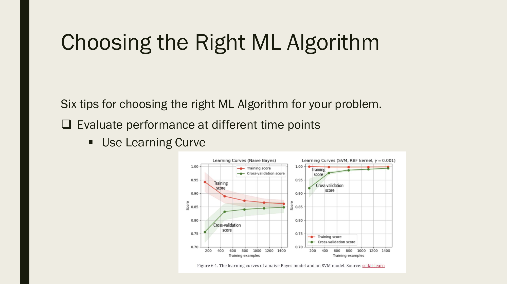

**Choosing the Right ML Algorithm — 技巧 3**

- ❑ Evaluate performance at different time points — 在不同时间点评估性能
  - ▪ Use Learning Curve — 使用学习曲线

### 2.5 评估权衡 (Evaluate Trade-offs)

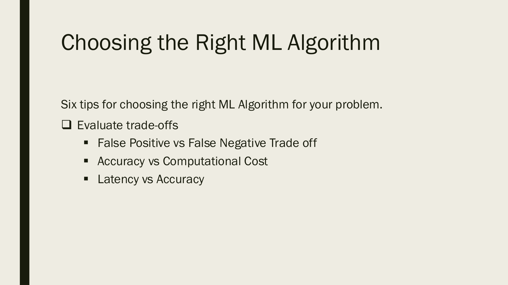

**Choosing the Right ML Algorithm — 技巧 4**

- ❑ Evaluate trade-offs — 评估权衡
  - ▪ False Positive vs False Negative Trade off — 假阳性 vs 假阴性权衡
  - ▪ Accuracy vs Computational Cost — 准确性 vs 计算成本
  - ▪ Latency vs Accuracy — 延迟 vs 准确性

### 2.6 理解模型假设 (Understand Model Assumptions)

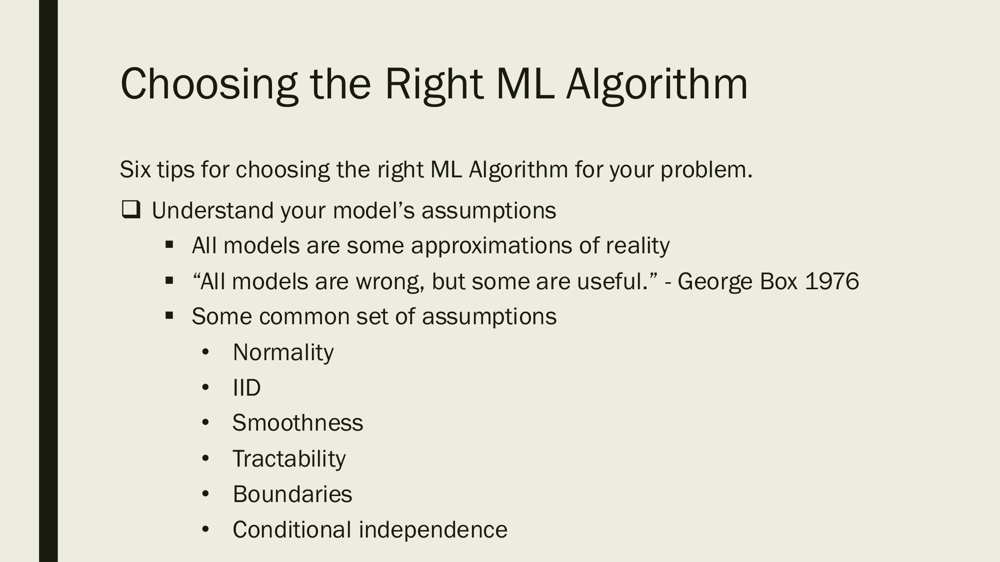

**Choosing the Right ML Algorithm — 技巧 5**

- ❑ Understand your model's assumptions — 理解模型的假设
  - ▪ All models are some approximations of reality — 所有模型都是对现实的某种近似
  - ▪ "All models are wrong, but some are useful." - George Box 1976 — "所有模型都是错的，但有些是有用的。" - George Box 1976
  - ▪ Some common set of assumptions — 一些常见的假设集合
    - Normality — 正态性
    - IID — 独立同分布
    - Smoothness — 平滑性
    - Tractability — 可处理性
    - Boundaries — 边界
    - Conditional independence — 条件独立

### 2.7 算法选择速查表 (Algorithm Selection Cheat Sheet)

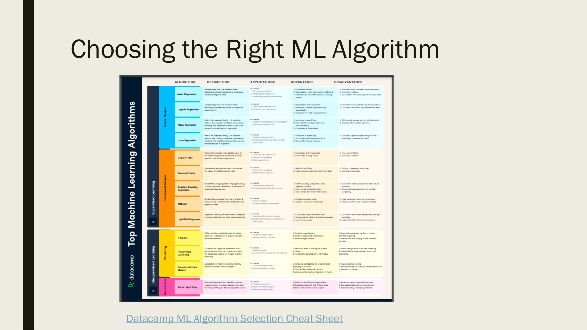

**Choosing the Right ML Algorithm — 算法选择速查表**

- Datacamp ML Algorithm Selection Cheat Sheet — Datacamp ML 算法选择速查表

### 2.8 实践问题 (Practice Question)

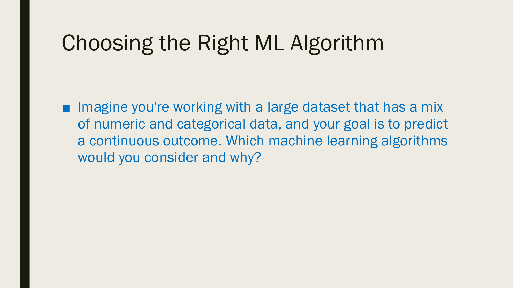

**Choosing the Right ML Algorithm — 实践问题**

- ■ Imagine you're working with a large dataset that has a mix of numeric and categorical data, and your goal is to predict a continuous outcome. Which machine learning algorithms would you consider and why? — 假设你有一个混合了数值和类别数据的大型数据集，目标是预测连续输出。你会考虑哪些 ML 算法，为什么？

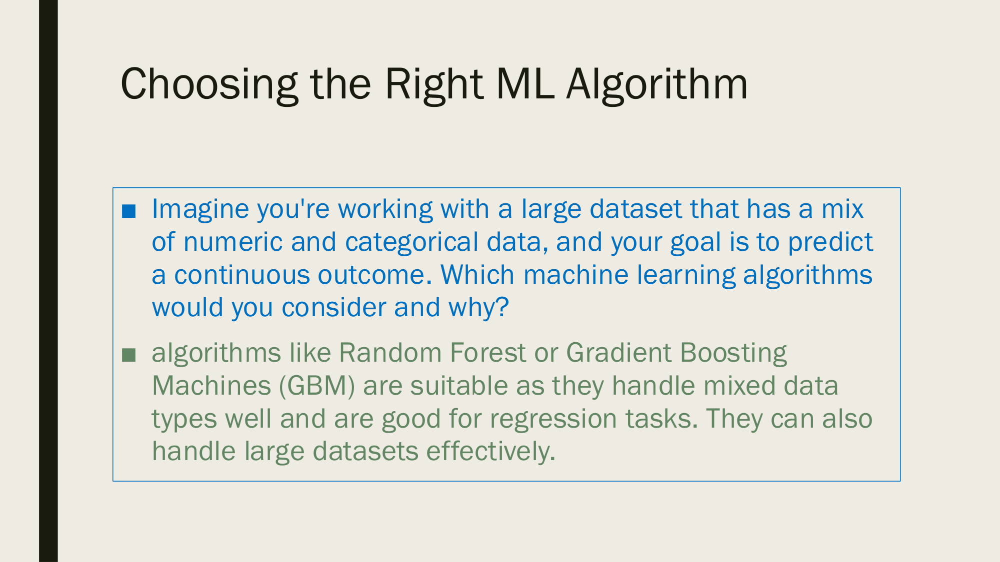

**Choosing the Right ML Algorithm — 答案**

- ■ Algorithms like **Random Forest** or **Gradient Boosting Machines (GBM)** are suitable as they handle mixed data types well and are good for regression tasks. They can also handle large datasets effectively. — **随机森林**或**梯度提升机（GBM）**等算法是合适的，因为它们能很好地处理混合数据类型，适合回归任务，也能有效处理大型数据集。

---

## 3. 分布式训练 (Distributed Training)

### 3.1 何时需要分布式训练 (When is Distributed Training Necessary?)

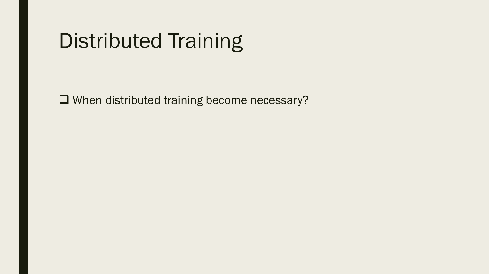

**Distributed Training — 分布式训练**

- ❑ When distributed training become necessary? — 何时需要分布式训练？

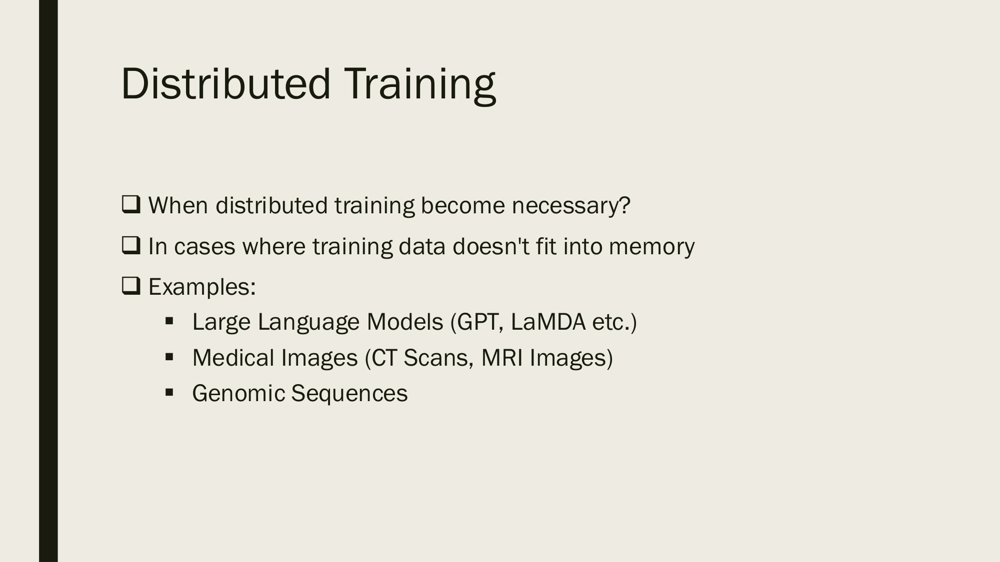

**Distributed Training — 分布式训练（场景）**

- ❑ In cases where training data doesn't fit into memory — 当训练数据无法放入内存时
- ❑ Examples — 示例：
  - ▪ Large Language Models (GPT, LaMDA etc.) — 大语言模型（GPT、LaMDA 等）
  - ▪ Medical Images (CT Scans, MRI Images) — 医学图像（CT 扫描、MRI 图像）
  - ▪ Genomic Sequences — 基因组序列

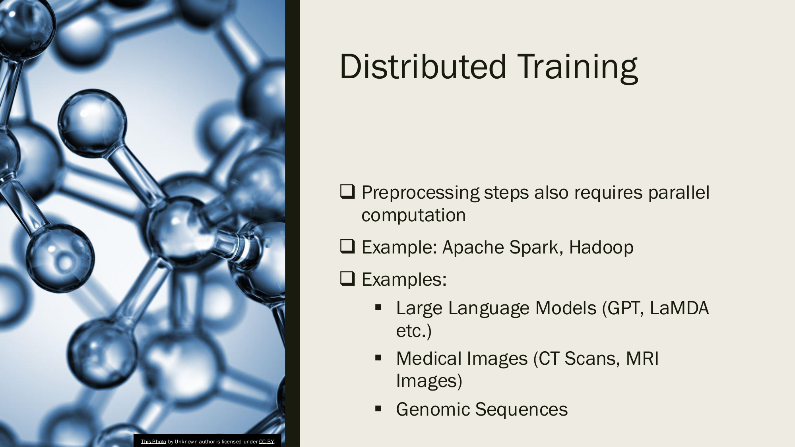

**Distributed Training — 分布式训练（预处理）**

- ❑ Preprocessing steps also requires parallel computation — 预处理步骤也需要并行计算
- ❑ Example: Apache Spark, Hadoop — 示例：Apache Spark、Hadoop

### 3.2 内存优化方法 (Memory Optimization Methods)

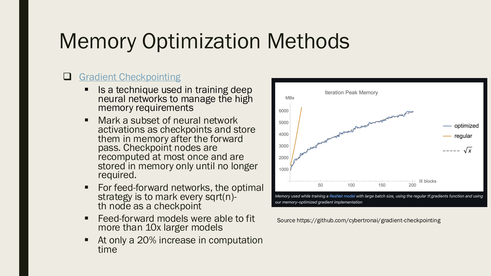

**Memory Optimization Methods — 内存优化方法**

- ❑ **Gradient Checkpointing** — **梯度检查点**
  - ▪ Is a technique used in training deep neural networks to manage the high memory requirements — 用于训练深度神经网络以管理高内存需求的技术
  - ▪ Mark a subset of neural network activations as checkpoints and store them in memory after the forward pass. Checkpoint nodes are recomputed at most once and are stored in memory only until no longer required. — 将神经网络激活的子集标记为检查点，前向传播后存储在内存中。检查点节点最多重新计算一次，仅在不再需要时释放。
  - ▪ For feed-forward networks, the optimal strategy is to mark every sqrt(n)-th node as a checkpoint — 对于前馈网络，最优策略是每 sqrt(n) 个节点标记一个检查点
  - ▪ Feed-forward models were able to fit more than 10x larger models — 前馈模型能够容纳大 10 倍以上的模型
  - ▪ At only a 20% increase in computation time — 仅增加 20% 的计算时间

Ref: https://github.com/cybertronai/gradient-checkpointing

### 3.3 并行化策略 (Strategies for Parallelization)

**Strategies for Parallelization — 并行化策略**

- ❑ Data Parallelism — 数据并行
- ❑ Model Parallelism — 模型并行
- ❑ Pipeline Parallelism — 流水线并行

### 3.4 数据并行 (Data Parallelism)

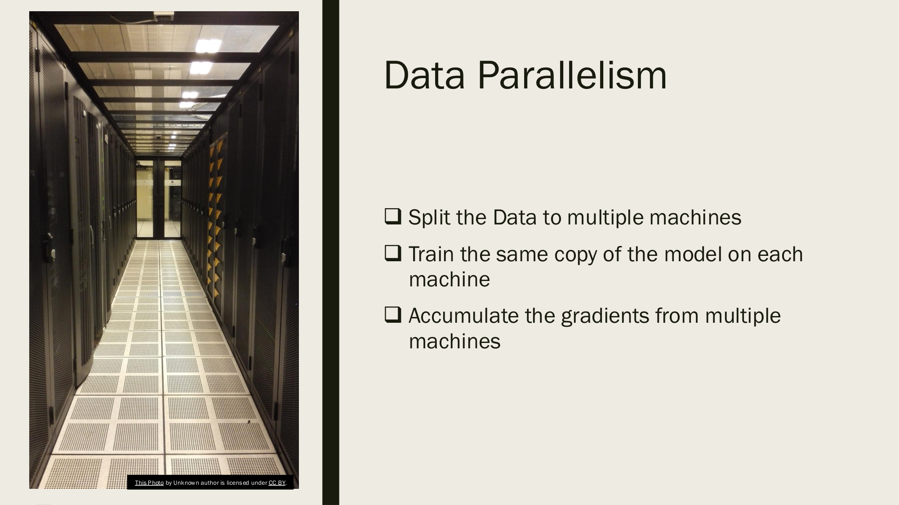

**Data Parallelism — 数据并行**

- ❑ Split the Data to multiple machines — 将数据拆分到多台机器
- ❑ Train the same copy of the model on each machine — 在每台机器上训练相同的模型副本
- ❑ Accumulate the gradients from multiple machines — 从多台机器累积梯度

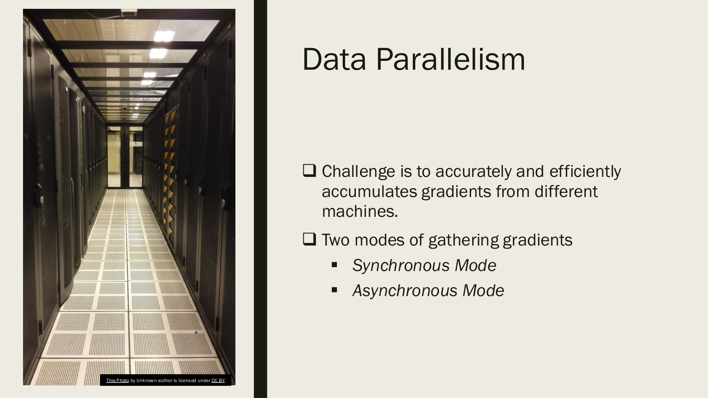

**Data Parallelism — 数据并行（梯度收集模式）**

- ❑ Challenge is to accurately and efficiently accumulate gradients from different machines. — 挑战在于准确高效地从不同机器累积梯度。
- ❑ Two modes of gathering gradients — 两种梯度收集模式
  - ▪ Synchronous Mode — 同步模式
  - ▪ Asynchronous Mode — 异步模式

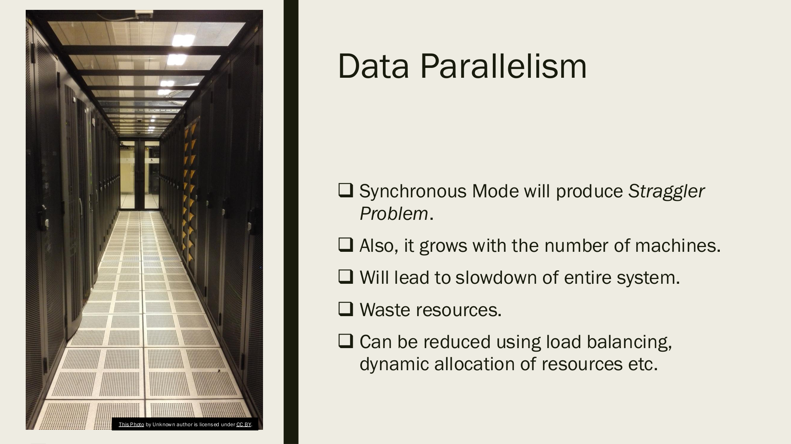

**Data Parallelism — 同步模式的问题**

- ❑ Synchronous Mode will produce **Straggler Problem**. — 同步模式会产生**落后者问题**。
- ❑ Also, it grows with the number of machines. — 而且，它随机器数量增长。
- ❑ Will lead to slowdown of entire system. — 会导致整个系统减速。
- ❑ Waste resources. — 浪费资源。
- ❑ Can be reduced using load balancing, dynamic allocation of resources etc. — 可以通过负载均衡、动态资源分配等减少。

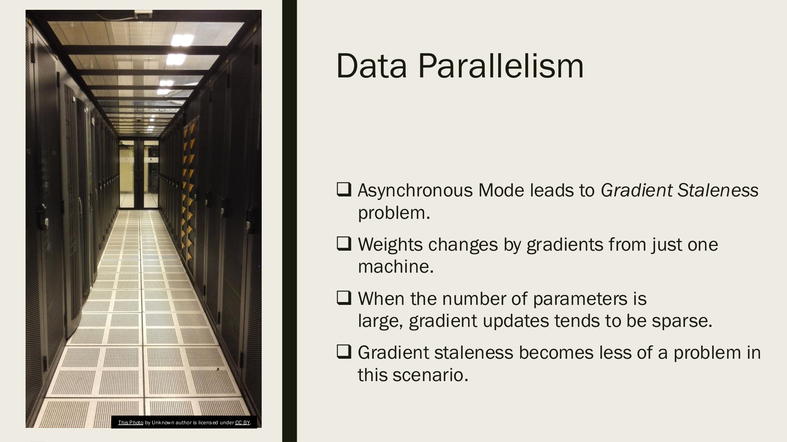

**Data Parallelism — 异步模式的问题**

- ❑ Asynchronous Mode leads to **Gradient Staleness** problem. — 异步模式导致**梯度过时**问题。
- ❑ Weights changes by gradients from just one machine. — 权重仅由一台机器的梯度更新。
- ❑ When the number of parameters is large, gradient updates tends to be sparse. — 当参数数量很大时，梯度更新趋于稀疏。
- ❑ Gradient staleness becomes less of a problem in this scenario. — 在这种情况下，梯度过时问题会减轻。

### 3.5 模型并行 (Model Parallelism)

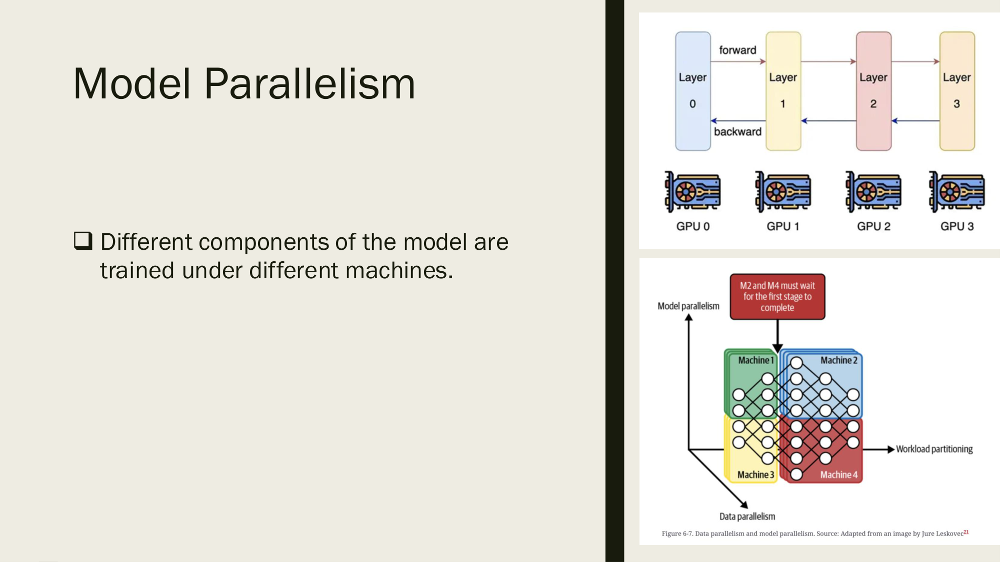

**Model Parallelism — 模型并行**

- ❑ Different components of the model are trained under different machines. — 模型的不同组件在不同机器上训练。

### 3.6 流水线并行 (Pipeline Parallelism)

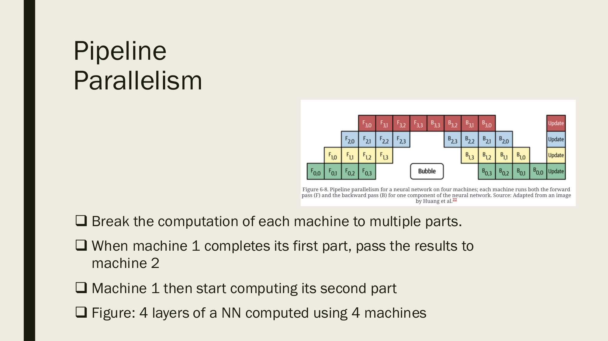

**Pipeline Parallelism — 流水线并行**

- ❑ Break the computation of each machine to multiple parts. — 将每台机器的计算分成多个部分。
- ❑ When machine 1 completes its first part, pass the results to machine 2. — 当机器 1 完成第一部分时，将结果传递给机器 2。
- ❑ Machine 1 then start computing its second part — 机器 1 然后开始计算第二部分
- ❑ Figure: 4 layers of a NN computed using 4 machines — 图示：使用 4 台机器计算 NN 的 4 层

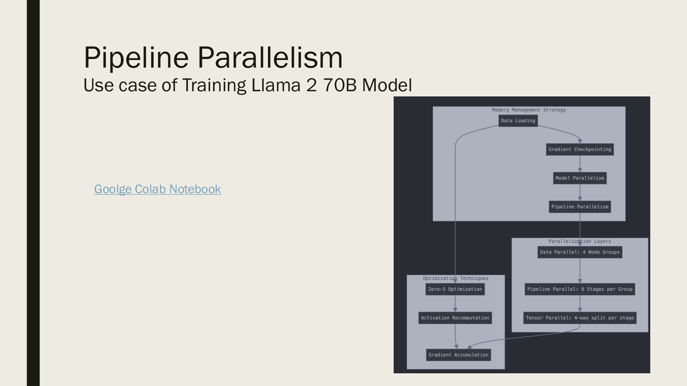

**Pipeline Parallelism — 流水线并行（案例）**

- Use case of Training Llama 2 70B Model — 训练 Llama 2 70B 模型的用例
- Google Colab Notebook

### 3.7 PyTorch 分布式训练 (Distributed Training with PyTorch)

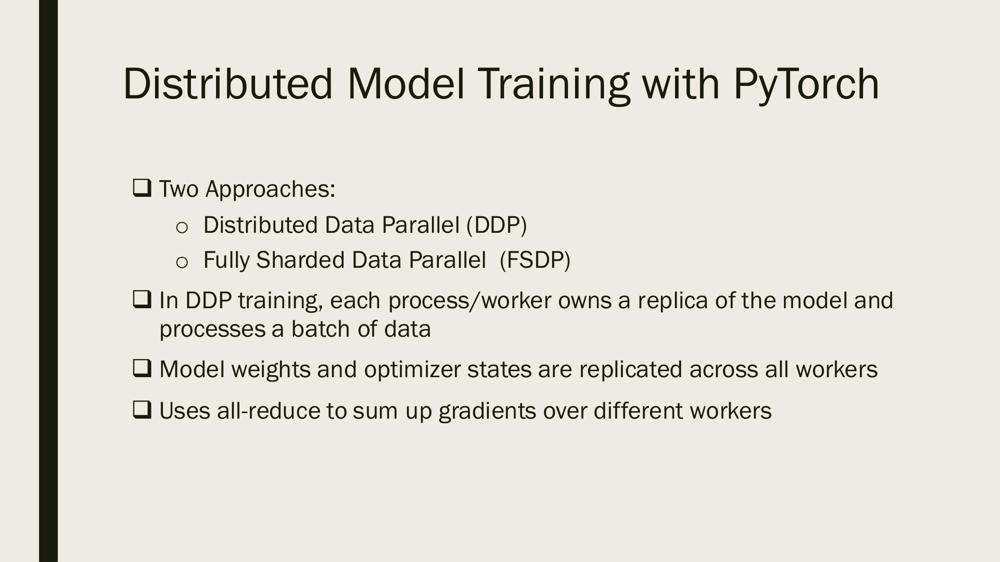

**Distributed Model Training with PyTorch — PyTorch 分布式模型训练（DDP）**

- ❑ Two Approaches — 两种方法：
  - Distributed Data Parallel (DDP) — 分布式数据并行
  - Fully Sharded Data Parallel (FSDP) — 全分片数据并行
- ❑ In DDP training, each process/worker owns a replica of the model and processes a batch of data — 在 DDP 训练中，每个进程/worker 拥有模型的一个副本并处理一批数据
- ❑ Model weights and optimizer states are replicated across all workers — 模型权重和优化器状态在所有 worker 间复制
- ❑ Uses all-reduce to sum up gradients over different workers — 使用 all-reduce 在不同 worker 间汇总梯度

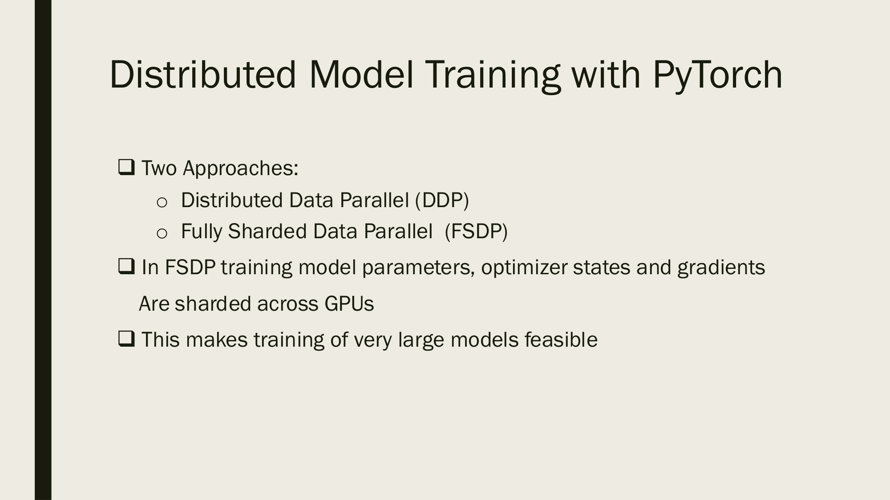

**Distributed Model Training with PyTorch — PyTorch 分布式模型训练（FSDP）**

- ❑ In FSDP training model parameters, optimizer states and gradients are sharded across GPUs — 在 FSDP 训练中，模型参数、优化器状态和梯度在 GPU 间分片
- ❑ This makes training of very large models feasible — 这使得训练超大模型成为可能

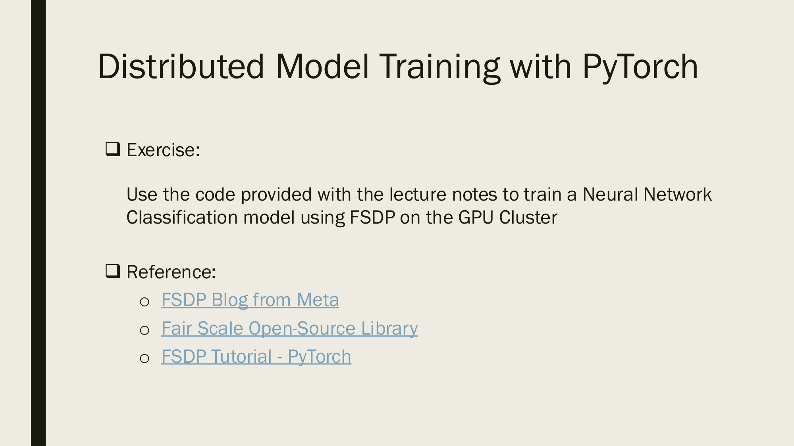

**Distributed Model Training with PyTorch — PyTorch 分布式训练（练习）**

- ❑ Exercise: Use the code provided with the lecture notes to train a Neural Network Classification model using FSDP on the GPU Cluster — 练习：使用讲义代码在 GPU 集群上使用 FSDP 训练神经网络分类模型
- ❑ Reference — 参考资料：
  - FSDP Blog from Meta — Meta 的 FSDP 博客
  - Fair Scale Open-Source Library — Fair Scale 开源库
  - FSDP Tutorial - PyTorch — PyTorch FSDP 教程

---

## 4. 自动机器学习 (Auto ML)

### 4.1 AutoML 概述 (AutoML Overview)

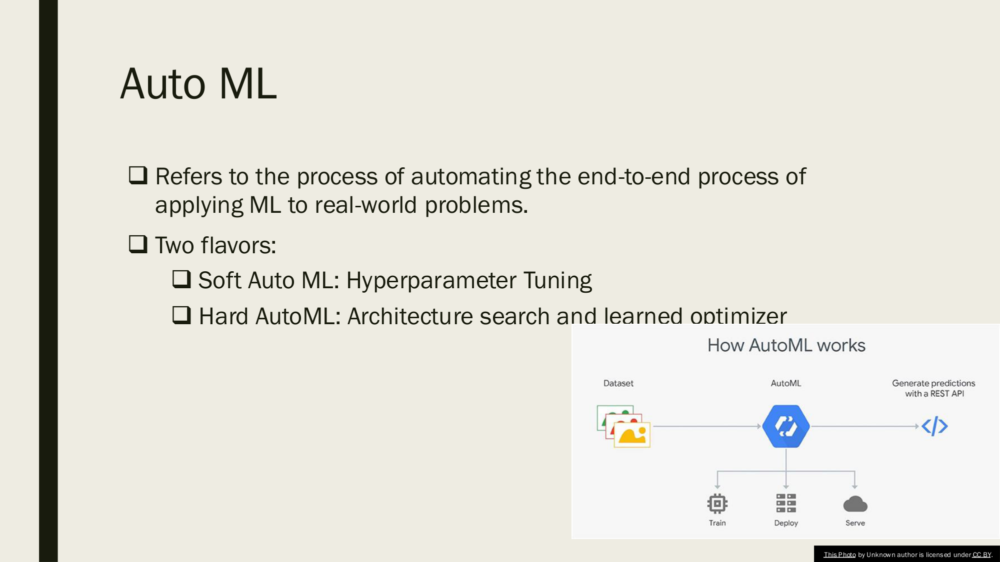

**Auto ML — 自动机器学习**

- ❑ Refers to the process of automating the end-to-end process of applying ML to real-world problems. — 指将 ML 应用于实际问题的端到端过程自动化。
- ❑ Two flavors — 两种类型：
  - ❑ **Soft Auto ML**: Hyperparameter Tuning — **软 AutoML**：超参数调优
  - ❑ **Hard AutoML**: Architecture search and learned optimizer — **硬 AutoML**：架构搜索和学习型优化器

### 4.2 软 AutoML — 超参数调优 (Soft AutoML — Hyperparameter Tuning)

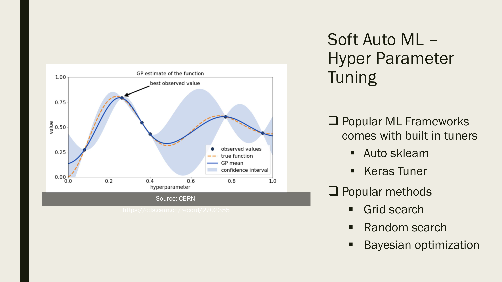

**Soft Auto ML – Hyper Parameter Tuning — 软 AutoML — 超参数调优**

- ❑ Popular ML Frameworks comes with built in tuners — 流行的 ML 框架自带调参工具
  - ▪ Auto-sklearn
  - ▪ Keras Tuner
- ❑ Popular methods — 常用方法
  - ▪ Grid search — 网格搜索
  - ▪ Random search — 随机搜索
  - ▪ Bayesian optimization — 贝叶斯优化

Ref: CERN https://cds.cern.ch/record/2702355

### 4.3 硬 AutoML — 神经架构搜索 NAS (Hard AutoML — Neural Architecture Search)

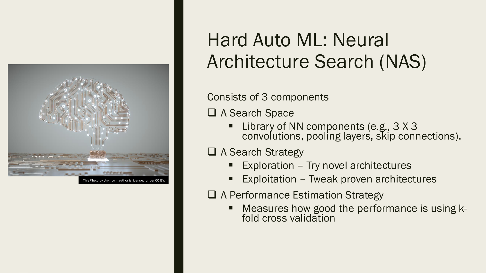

**Hard Auto ML: Neural Architecture Search (NAS) — 硬 AutoML：神经架构搜索**

- Consists of 3 components — 包含 3 个组件：
  - ❑ **A Search Space** — **搜索空间**
    - ▪ Library of NN components (e.g., 3×3 convolutions, pooling layers, skip connections). — NN 组件库（如 3×3 卷积、池化层、跳跃连接）。
  - ❑ **A Search Strategy** — **搜索策略**
    - ▪ Exploration – Try novel architectures — 探索 – 尝试新颖的架构
    - ▪ Exploitation – Tweak proven architectures — 利用 – 调整经过验证的架构
  - ❑ **A Performance Estimation Strategy** — **性能估计策略**
    - ▪ Measures how good the performance is using k-fold cross validation — 使用 k 折交叉验证衡量性能

### 4.4 NAS — 强化学习方法 (NAS — Reinforcement Learning-Based)

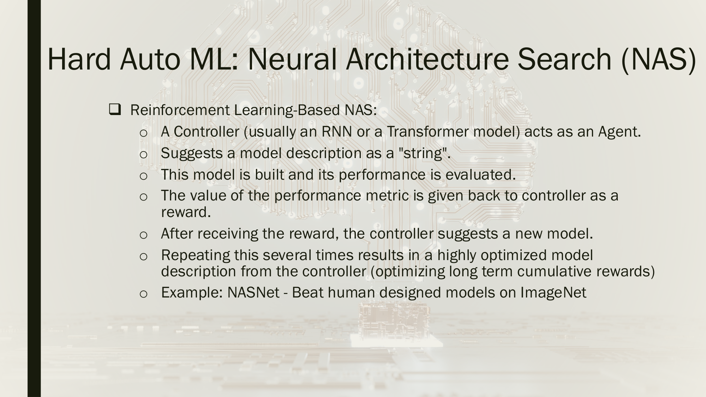

**Hard Auto ML: NAS — RL-Based NAS — 基于强化学习的 NAS**

- ❑ **Reinforcement Learning-Based NAS** — **基于强化学习的 NAS**：
  - A Controller (usually an RNN or a Transformer model) acts as an Agent. — 控制器（通常是 RNN 或 Transformer 模型）充当 Agent。
  - Suggests a model description as a "string". — 以"字符串"形式提出模型描述。
  - This model is built and its performance is evaluated. — 构建并评估该模型的性能。
  - The value of the performance metric is given back to controller as a reward. — 性能指标的值作为奖励反馈给控制器。
  - After receiving the reward, the controller suggests a new model. — 收到奖励后，控制器提出新模型。
  - Repeating this several times results in a highly optimized model description from the controller (optimizing long term cumulative rewards) — 重复多次后，控制器产出高度优化的模型描述（优化长期累积奖励）
  - Example: **NASNet** - Beat human designed models on ImageNet — 示例：**NASNet** - 在 ImageNet 上击败人工设计的模型

### 4.5 NAS — 进化算法 (NAS — Evolutionary Algorithms)

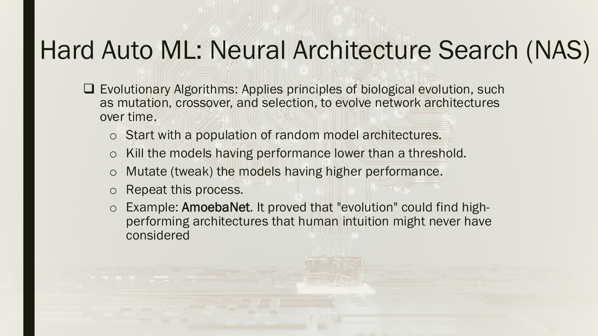

**Hard Auto ML: NAS — Evolutionary Algorithms — 进化算法**

- ❑ **Evolutionary Algorithms**: Applies principles of biological evolution, such as mutation, crossover, and selection, to evolve network architectures over time. — **进化算法**：应用生物进化原理（如变异、交叉和选择）来随时间演化网络架构。
  - Start with a population of random model architectures. — 从一组随机模型架构开始。
  - Kill the models having performance lower than a threshold. — 淘汰性能低于阈值的模型。
  - Mutate (tweak) the models having higher performance. — 变异（调整）性能较高的模型。
  - Repeat this process. — 重复此过程。
  - Example: **AmoebaNet**. It proved that "evolution" could find high-performing architectures that human intuition might never have considered — 示例：**AmoebaNet**。它证明了"进化"能找到人类直觉可能从未考虑过的高性能架构

### 4.6 NAS — 可微分方法 DARTS (NAS — Differentiable/Gradient-Based)

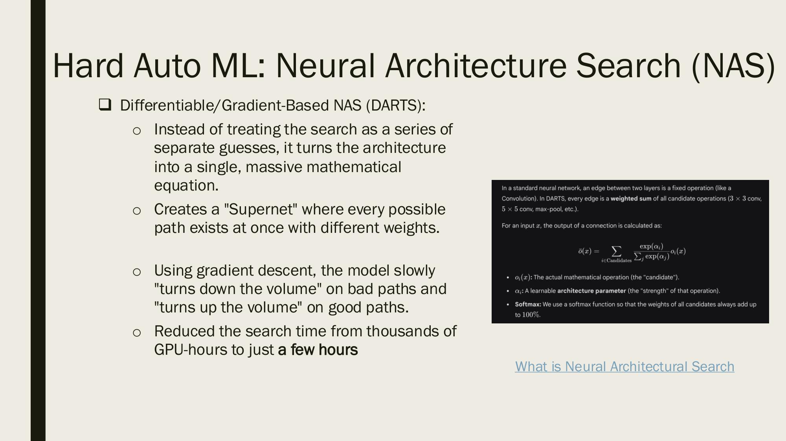

**Hard Auto ML: NAS — DARTS — 可微分/基于梯度的 NAS**

- ❑ **Differentiable/Gradient-Based NAS (DARTS)** — **可微分/基于梯度的 NAS (DARTS)**：
  - Instead of treating the search as a series of separate guesses, it turns the architecture into a single, massive mathematical equation. — 不将搜索视为一系列单独的猜测，而是将架构转化为一个单一的大型数学方程。
  - Creates a "Supernet" where every possible path exists at once with different weights. — 创建一个"超级网络"，其中每条可能的路径同时存在且有不同的权重。
  - Using gradient descent, the model slowly "turns down the volume" on bad paths and "turns up the volume" on good paths. — 使用梯度下降，模型慢慢"降低"坏路径的权重，"提高"好路径的权重。
  - Reduced the search time from thousands of GPU-hours to just a few hours — 将搜索时间从数千 GPU 小时减少到几小时

---

## 5. 今日学习总结 (Summary of Today's Learning)

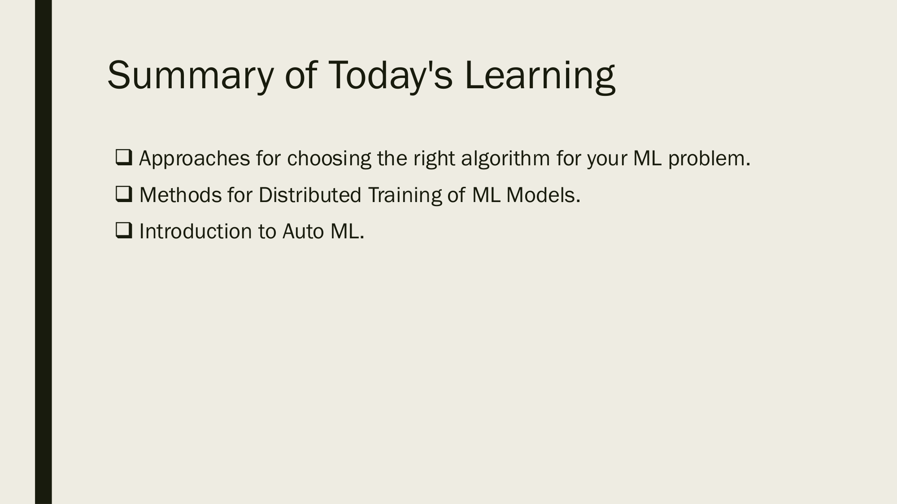

**Summary of Today's Learning — 今日学习总结**

- ❑ Approaches for choosing the right algorithm for your ML problem. — 为 ML 问题选择正确算法的方法。
- ❑ Methods for Distributed Training of ML Models. — ML 模型分布式训练的方法。
- ❑ Introduction to Auto ML. — AutoML 简介。

---

## 6. 有用的链接 (Useful Links)

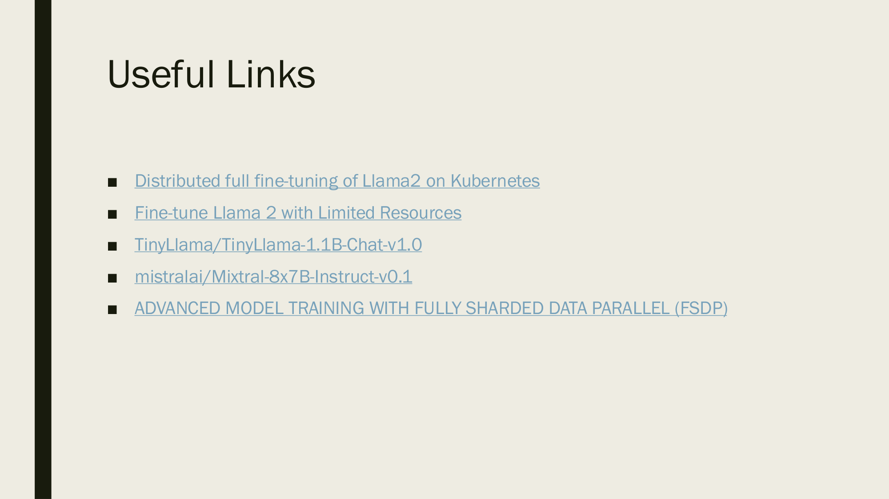

**Useful Links — 有用的链接**

- ■ Distributed full fine-tuning of Llama2 on Kubernetes — 在 Kubernetes 上分布式全量微调 Llama2
- ■ Fine-tune Llama 2 with Limited Resources — 有限资源下微调 Llama 2
- ■ TinyLlama/TinyLlama-1.1B-Chat-v1.0
- ■ mistralai/Mixtral-8x7B-Instruct-v0.1
- ■ ADVANCED MODEL TRAINING WITH FULLY SHARDED DATA PARALLEL (FSDP) — 使用 FSDP 进行高级模型训练
