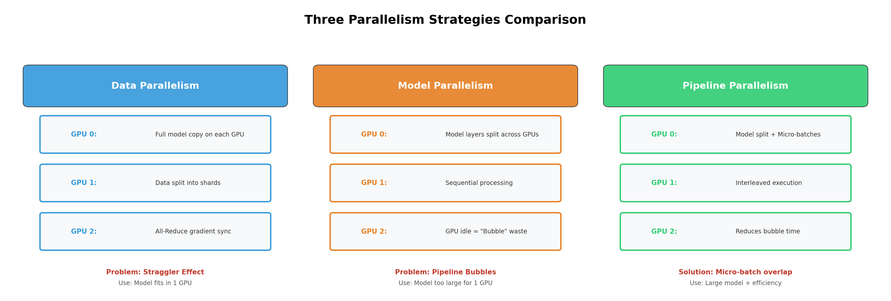
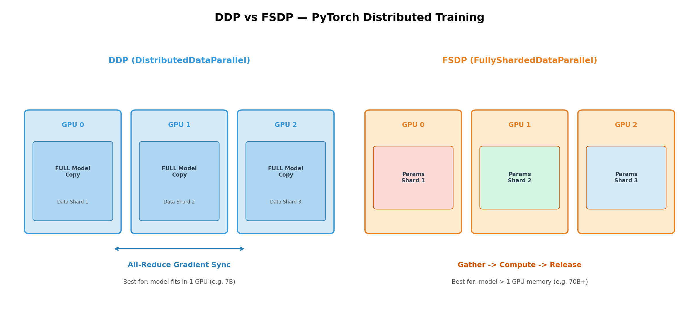
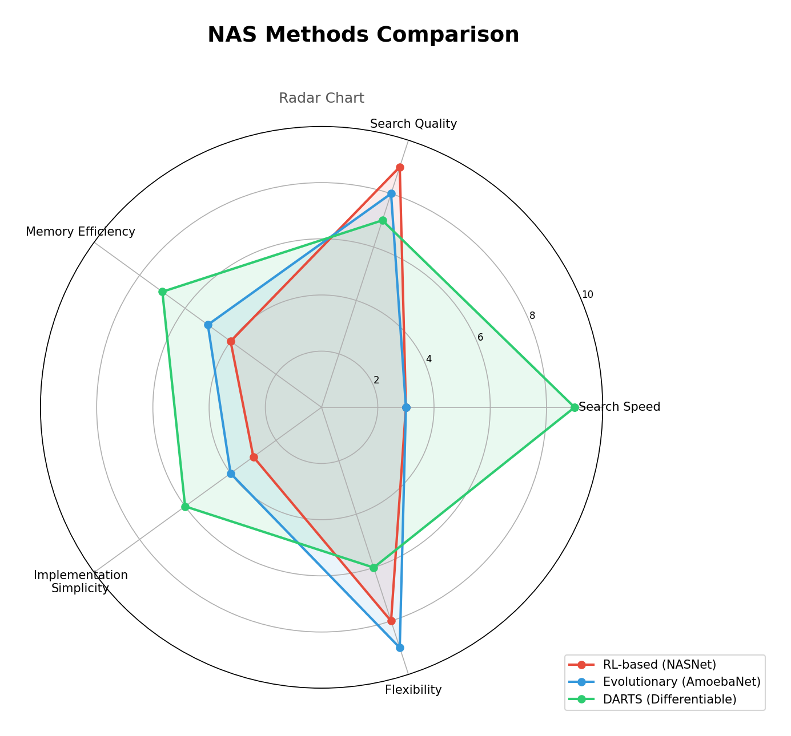

# Week 4 故事线：从"选对模型"到"让机器自己选"——算法选择、分布式训练与 AutoML

> **Source:** `Week4-Lecture1.pdf`
> **核心主题：** 面对一个 ML 问题，怎么选对算法？选对之后模型太大怎么训练？能不能让机器自动帮你做这些决定？
> **故事线：** 一条进化链——人工挑模型（六条军规） → 模型太大单机装不下（分布式训练） → 干脆让机器自己设计模型（AutoML / NAS）

---

## 🎬 序幕：我们在解决什么问题？

你拿到一个 ML 问题——比如预测用户是否流失。打开 scikit-learn 文档一看：

- **线性回归？逻辑回归？SVM？随机森林？XGBoost？LSTM？Transformer？**

> 💡 **核心困境：** 算法太多了，该选哪个？选错了浪费时间和算力，选对了还要能跑起来。

**更深一层的问题是：**

| 阶段 | 核心问题 | 谁来做？ |
|------|---------|---------|
| ① 选模型 | 这么多算法，哪个最适合我的数据？ | **人** ← 容易有偏见 |
| ② 训练模型 | 数据太大/模型太大，单机跑不动怎么办？ | **分布式系统** |
| ③ 调超参/设计架构 | 能不能让机器自动帮我找最优方案？ | **AutoML / NAS** |

本周就沿着这条进化链，从"人工决策"一步步走到"机器自决策"。

---

## 📚 第一章：六条军规——如何选对 ML 算法

### 1.1 为什么选算法这么难？

新手常犯的错误：**看到最新论文就直接用最新模型**。但 SOTA（State-of-the-Art）模型不一定是最好的选择。

原因有三：

| SOTA 的陷阱 | 说明 |
|-------------|------|
| **学术环境 ≠ 生产环境** | SOTA 在 ImageNet 上最强，但你的数据可能完全不同 |
| **训练成本高** | GPT 级模型训练一次耗费百万级算力 |
| **推理延迟大** | 模型越复杂，线上推理越慢，用户等不起 |

> 💡 **George Box 名言（1976）：** "All models are wrong, but some are useful." —— "所有模型都是错的，但有些是有用的。" 你的目标不是找到"正确的模型"，而是找到**对你的问题最有用的模型**。

### 1.2 六条军规速览

这六条来自工业界的实战经验，不是教科书的抽象理论：

| # | 军规 | 一句话 | 为什么重要 |
|---|------|--------|-----------|
| 1 | **不要只用 SOTA** | 先问"适不适合"，再问"先不先进" | SOTA 在学术基准上评估，不一定适合你的数据 |
| 2 | **从简单模型开始** | 先 Logistic Regression，再 XGBoost，最后 DNN | 简单模型提供 baseline + 易部署 + 易解释 |
| 3 | **看学习曲线** | 在不同数据量下评估性能随时间的变化 | 防止过拟合/欠拟合，判断是否需要更多数据 |
| 4 | **评估权衡** | FP vs FN / 准确率 vs 计算成本 / 延迟 vs 精度 | 没有完美模型，只有最佳权衡 |
| 5 | **理解模型假设** | 每个算法都有隐含假设（正态性、IID、平滑性）| 违反假设 → 模型静默失败 |
| 6 | **用速查表** | 如 Datacamp/scikit-learn 的算法选择图 | 快速缩小候选范围 |

### 1.3 深入理解：从简单到复杂的金字塔

为什么要从简单模型开始？因为简单模型的价值不只是"跑得快"：

```
模型复杂度金字塔：
┌─────────────────────┐
│    Deep Learning     │  ← 最后尝试：强大但昂贵
│    (DNN/Transformer) │
├─────────────────────┤
│  Ensemble Methods    │  ← 中间尝试：RF、GBM、XGBoost
│  (随机森林/GBM)       │
├─────────────────────┤
│  Linear/Logistic     │  ← 最先尝试：提供 baseline
│  Regression / SVM    │
└─────────────────────┘
```

- **Baseline 作用**：简单模型的结果是衡量复杂模型价值的标尺——如果 XGBoost 只比 Logistic Regression 高 1%，那复杂模型的额外成本不值得
- **调试工具**：简单模型的输出可以帮你理解数据特征，发现异常
- **早期部署验证**：简单模型可以快速上线，验证整个数据 pipeline 是否正确

### 1.4 模型假设——容易被忽略的地雷

每个算法都有"隐含假设"，违反假设 → 模型静默失败（不报错，但结果不可信）：

| 假设 | 含义 | 典型算法 | 违反时的后果 |
|------|------|---------|-------------|
| **正态性 (Normality)** | 数据服从正态分布 | 线性回归、LDA | 参数估计有偏 |
| **IID** | 数据独立同分布 | 大多数 ML 算法 | 时序数据直接用会"数据泄漏" |
| **平滑性 (Smoothness)** | 相似输入产生相似输出 | KNN、核方法 | 高维空间中失效 |
| **可处理性 (Tractability)** | 计算可行 | 贝叶斯方法 | 需要近似推断 |
| **边界 (Boundaries)** | 类别间存在可分边界 | SVM | 数据重叠严重时效果差 |
| **条件独立 (Cond. Indep.)** | 特征在给定类别下独立 | 朴素贝叶斯 | 强相关特征 → 概率估计偏差 |

### 1.5 实战问题：混合数据预测连续值

**问题：** 大型数据集，既有数值特征也有类别特征，目标是回归（预测连续值）。选什么算法？

**推荐答案：** **Random Forest** 或 **Gradient Boosting Machines (GBM)**

**为什么？**

| 能力 | Random Forest / GBM | 线性回归 | DNN |
|------|:-------------------:|:--------:|:---:|
| 处理混合数据类型 | ✅ 天然支持 | ❌ 需要编码 | ⚠️ 需要嵌入 |
| 处理大数据集 | ✅ 高效 | ✅ 高效 | ⚠️ 需要 GPU |
| 可解释性 | ✅ 特征重要性 | ✅ 系数解读 | ❌ 黑箱 |
| 无需太多预处理 | ✅ 对缺失值/尺度鲁棒 | ❌ 需要标准化 | ❌ 需要标准化 |

> 🔑 **故事转折点：** 六条军规帮你"选对模型"。但选完之后发现——模型太大了（比如 LLM），或数据太多了（比如医学影像），**一台机器的内存根本放不下！** → 我们需要**分布式训练**！

---

## 🎭 第二章：单机装不下——分布式训练 (Distributed Training)

### 2.1 什么时候需要分布式训练？

一句话：**当训练数据或模型参数无法放入单台机器的内存时**。

典型场景：

| 场景 | 数据/模型规模 | 为什么单机不够 |
|------|-------------|---------------|
| **大语言模型 (LLM)** | GPT-3: 175B 参数 | 模型权重本身就占 700GB |
| **医学影像** | CT/MRI 扫描，单张数百 MB | 批量处理内存爆炸 |
| **基因组序列** | 数十亿碱基对 | 数据量本身就是 TB 级 |

而且不只是训练——**预处理步骤也需要并行**（如用 Apache Spark、Hadoop 做特征工程）。

### 2.2 救命稻草一：梯度检查点 (Gradient Checkpointing)

在进入分布式之前，先看一个**单机内存优化**的技巧：

> **核心思想：** 前向传播时不保存所有中间激活值，只保存少数"检查点"，反向传播时重新计算。

| 维度 | 正常训练 | 梯度检查点 |
|------|---------|-----------|
| 内存占用 | 保存所有 N 层激活值 | 只保存 √N 个检查点 |
| 计算时间 | 1x | 1.2x（多 20%） |
| 模型容量 | 1x | **10x+**（可装大 10 倍以上） |

> 💡 **类比：** 就像打游戏的存档——你不是每一步都存档（太占硬盘），而是每打完一个 Boss 存一次。需要回放时，从最近的存档点重新开始。

**最优策略：** 对于前馈网络，每 √n 个节点标记一个检查点。

### 2.3 三种并行化策略

梯度检查点是单机优化。当单机也不够时，就需要**多机分布式训练**。三种核心策略：

```
三种并行化策略：
┌────────────────────────────────────┐
│  ① 数据并行 (Data Parallelism)     │ ← 最常用
│     数据分片，模型复制              │
├────────────────────────────────────┤
│  ② 模型并行 (Model Parallelism)    │ ← 模型太大时用
│     模型分片，各机器负责不同层      │
├────────────────────────────────────┤
│  ③ 流水线并行 (Pipeline Parallel.)  │ ← 结合两者
│     模型分层 + 微批次交错执行       │
└────────────────────────────────────┘
```



### 2.4 数据并行 (Data Parallelism)

**最常用的分布式策略**，核心步骤：

1. **拆分数据**：训练数据按 batch 分到多台机器
2. **复制模型**：每台机器持有完整模型副本
3. **各自训练**：每台机器用自己的数据计算梯度
4. **汇总梯度**：所有机器的梯度聚合后同步更新模型

**但梯度汇总有两种模式，各有问题：**

| 模式 | 工作方式 | 致命问题 | 解决方案 |
|------|---------|---------|---------|
| **同步模式** | 等所有机器都算完，统一汇总 | **落后者问题 (Straggler)**：最慢的机器拖慢全局 | 负载均衡、动态资源分配 |
| **异步模式** | 不等待，每台机器算完就更新 | **梯度过时 (Gradient Staleness)**：旧梯度更新新权重 | 当参数量很大时，梯度稀疏，问题自动缓解 |

> 💡 **类比同步 vs 异步：**
> - **同步** = 安排全班同学一起交作业——总有人拖延，导致老师收不齐
> - **异步** = 谁写完谁交——效率高但可能改到"旧版"的作业

### 2.5 模型并行 (Model Parallelism)

**当模型本身太大、一台机器放不下时**，把模型拆开：

- 不同的模型组件（层）放在不同机器上
- 前向传播时数据依次流过各机器
- ⚠️ **缺点**：机器间有依赖关系，容易出现空闲等待（"气泡"问题）

### 2.6 流水线并行 (Pipeline Parallelism)

**模型并行 + 微批次 = 流水线并行**——消除"气泡"：

```
流水线并行示意（4 层 NN，4 台机器）：

时间 →    t₁      t₂      t₃      t₄
Machine 1: [Batch1] [Batch2] [Batch3] [Batch4]
Machine 2:          [Batch1] [Batch2] [Batch3]
Machine 3:                   [Batch1] [Batch2]
Machine 4:                            [Batch1]
```

- 每台机器**不用等前一个 batch 走完所有层**，只要走完自己负责的层就可以接下一个 batch
- 大幅提高 GPU 利用率
- **实战案例：** Llama 2 70B 的训练就使用了流水线并行

### 2.7 PyTorch 分布式训练：DDP vs FSDP

PyTorch 提供两种分布式训练 API：

| 维度 | DDP（分布式数据并行） | FSDP（全分片数据并行） |
|------|:-------------------:|:--------------------:|
| 模型存储 | 每个 Worker 持有**完整模型副本** | 参数/优化器/梯度在 GPU 间**分片** |
| 内存效率 | ⚠️ 冗余存储 | ✅ 极高——可训练超大模型 |
| 梯度同步 | All-Reduce 汇总梯度 | 按需收集分片参数再同步 |
| 适用场景 | 模型放得进单卡 | 模型**放不进**单卡 |
| 编程复杂度 | 简单 | 较复杂 |

> 💡 **关键区分：** DDP = 每人一本完整教材，各自做笔记再汇总；FSDP = 教材太厚了拆成章节分着拿，要看时再拼起来。



> 🔑 **故事转折点：** 分布式训练解决了"跑得动"的问题。但等等——你还是得**手动选模型、手动调超参、手动设计网络架构**。能不能让机器自己来？→ **AutoML** 登场！

---

## 🏆 第三章：让机器自己决策——AutoML

### 3.1 AutoML 是什么？

**AutoML = 将 ML 应用于实际问题的端到端过程自动化。**

它有两个层次，难度完全不同：

| 类型 | 英文 | 自动化内容 | 难度 | 代表方法 |
|------|------|-----------|------|---------|
| **软 AutoML** | Soft AutoML | 超参数调优 | ⭐⭐ | Grid Search, Random Search, 贝叶斯优化 |
| **硬 AutoML** | Hard AutoML | 网络架构搜索 + 学习型优化器 | ⭐⭐⭐⭐⭐ | NAS (NASNet, AmoebaNet, DARTS) |

> 💡 **类比：** 软 AutoML = 自动调节空调温度（参数微调）；硬 AutoML = 自动设计整栋楼的空调系统（架构设计）

### 3.2 软 AutoML——超参数调优

**问题：** 学习率选 0.01 还是 0.001？BatchSize 用 32 还是 128？层数用 3 还是 5？

三种自动搜索方法：

| 方法 | 原理 | 优点 | 缺点 |
|------|------|------|------|
| **网格搜索 (Grid Search)** | 穷举所有组合 | 保证找到最优 | 维度灾难——参数一多就爆炸 |
| **随机搜索 (Random Search)** | 随机采样参数组合 | 高维空间效率更高 | 不保证最优 |
| **贝叶斯优化 (Bayesian Opt.)** | 用概率模型预测下一个最优点 | 样本效率最高 | 实现复杂 |

> 💡 **直觉：** Grid Search = 地毯式搜索每个格子；Random Search = 随机扔飞镖；Bayesian = 看上一个飞镖扎哪了再决定下一个往哪扔——越来越准。

**工具支持：**
- **Auto-sklearn**：scikit-learn 的自动化版本
- **Keras Tuner**：Keras 的超参搜索框架

### 3.3 硬 AutoML——神经架构搜索 NAS

**终极目标：让机器自动设计神经网络架构。**

NAS 三大核心组件：

```
NAS 三大组件：
┌──────────────────────────────────────┐
│  ① 搜索空间 (Search Space)           │
│     "可以选哪些积木块？"              │
│     → 3×3 Conv, Pooling, Skip Conn.  │
├──────────────────────────────────────┤
│  ② 搜索策略 (Search Strategy)        │
│     "怎么组合这些积木块？"            │
│     → 探索(新方案) vs 利用(改良方案)  │
├──────────────────────────────────────┤
│  ③ 性能估计 (Performance Estimation) │
│     "组合得好不好？"                  │
│     → k-fold 交叉验证评估性能        │
└──────────────────────────────────────┘
```

> 💡 **类比：** NAS = 乐高机器人——给它一盒积木（搜索空间）、一套拼法（搜索策略）、一个评分标准（性能估计），让它自己拼出最强的模型。



### 3.4 NAS 方法一：基于强化学习 (RL-Based NAS)

**核心思想：** 把架构搜索当做 RL 问题。

| RL 概念 | NAS 中的角色 |
|---------|-------------|
| **Agent（控制器）** | RNN 或 Transformer，负责"提出"网络架构 |
| **Action（动作）** | 生成一个架构描述"字符串" |
| **Environment（环境）** | 构建并训练该架构 |
| **Reward（奖励）** | 验证集上的性能指标 |

**工作流程：**

```
RL-Based NAS 循环：
Controller(RNN) → 提出架构字符串 → 构建网络 → 训练+评估
       ↑                                              │
       └────── 性能指标作为 reward 反馈 ←──────────────┘
```

- 重复多次后，Controller 学会生成越来越好的架构
- **代表成果：NASNet** —— 在 ImageNet 上**击败了人工设计的模型**！
- ⚠️ **缺点：** 需要数千 GPU 小时，搜索成本极其昂贵

### 3.5 NAS 方法二：进化算法 (Evolutionary Algorithms)

**核心思想：** 模仿生物进化——变异、交叉、淘汰。

**工作流程：**

1. **初始化种群**：随机生成一批网络架构
2. **评估适应度**：训练并测试每个架构的性能
3. **淘汰 (Selection)**：干掉性能低于阈值的架构
4. **变异 (Mutation)**：对高性能架构做微小改动（加一层/删一层/换激活函数）
5. **重复**：直到收敛

**代表成果：AmoebaNet** —— 证明了"进化"能找到**人类直觉从未考虑过的高性能架构**。

> 💡 **对比 RL vs 进化：** RL 有一个中央控制器在"指挥"；进化是"群体智慧"——没有指挥者，靠集体突变和淘汰自然涌现出最优解。

### 3.6 NAS 方法三：可微分方法 DARTS（突破性革新！）

**DARTS 的革命性想法：** 不把搜索当离散选择题，而是**转化为连续优化问题**。

| 维度 | RL / 进化方法 | DARTS |
|------|:------------:|:-----:|
| 搜索方式 | 离散：一个个"猜"架构 | 连续：把所有路径放在一起用梯度优化 |
| 搜索时间 | 数千 GPU 小时 | **几小时** |
| 核心技巧 | 无 | **Supernet（超级网络）** |

**DARTS 工作原理：**

1. **构建 Supernet**：每条可能的路径（卷积/池化/跳跃连接）都同时存在，每条路径有一个权重 α
2. **梯度下降**：用梯度下降同时优化模型参数 w 和架构权重 α
3. **"调音量"**：好的路径 α 越来越大（"开大音量"），差的路径 α 越来越小（"关小音量"）
4. **最终选择**：保留 α 最大的路径，删掉其余

> 💡 **类比：** RL/进化 = 一个个试菜谱，做一道尝一道；DARTS = 把所有菜同时放一个大锅里煮，观察哪些食材味道好就留下，味道差就捞出来。

**DARTS 的突破意义：**

- 将搜索时间从 **数千 GPU 小时→几小时**（降低 1000 倍以上！）
- 使 NAS 从"只有巨型公司能玩"变成"普通实验室也能用"

---

## 🗺️ 全局回顾：技术演进路线图

```
┌────────────────────────────────────────────────────────────────┐
│  从"选对模型"到"让机器自己选" — 技术演进路线图                    │
│                                                                │
│  第一章：人工选模型（六条军规）                                  │
│  ✅ 六条实战经验：不追 SOTA、从简入手、看矩阵、评权衡、查假设     │
│  ❌ 问题：模型太大/数据太多，单机跑不动！                        │
│           │                                                    │
│           ▼                                                    │
│  第二章：分布式训练                                              │
│  ✅ 三种并行策略：数据并行 → 模型并行 → 流水线并行               │
│  ✅ PyTorch: DDP（模型放得下单卡）vs FSDP（放不下单卡）          │
│  ✅ 梯度检查点：单机内存优化，20% 时间换 10x 容量               │
│  ❌ 问题：还是需要人工选模型、调超参、设计架构！                  │
│           │                                                    │
│           ▼                                                    │
│  第三章：AutoML — 让机器自己决策                                 │
│  ├── 软 AutoML：Grid / Random / Bayesian → 超参数调优           │
│  └── 硬 AutoML：NAS → 自动设计网络架构                          │
│       ├── RL-Based NAS → NASNet（击败人工设计）                  │
│       ├── Evolutionary → AmoebaNet（群体智慧涌现）               │
│       └── DARTS（可微分）→ 搜索时间降低 1000 倍！                │
│                                                                │
│  完整链路：                                                     │
│  人工选模型 → 分布式训练跑起来 → AutoML 自动化一切               │
│  (六条军规)    (三种并行策略)   (超参调优 + NAS)                  │
└────────────────────────────────────────────────────────────────┘
```

### 关键概念对比总结

| 从 → 到 | 解决了什么核心问题？ |
|---------|---------------------|
| 追 SOTA → 六条军规 | 避免盲目追新，系统化选择算法 |
| 单机训练 → 梯度检查点 | 用 20% 额外计算换 10x 内存空间 |
| 单机 → 数据并行 | 数据太多：分片到多机，共享模型 |
| 数据并行 → 模型并行 | 模型太大：一台放不下，拆分到多机 |
| 模型并行 → 流水线并行 | 消除"气泡"空闲，微批次交错执行 |
| DDP → FSDP | 从"完整副本"到"分片存储"，可训练超大模型 |
| 手动调参 → 软 AutoML | 自动搜索最优超参数 |
| 手动设计架构 → NAS | 让机器自动设计网络结构 |
| RL/进化 NAS → DARTS | 离散搜索 → 连续优化，搜索效率提升 1000 倍 |

---

## 📝 考试/复习重点检查清单

- [ ] 能说出选择 ML 算法的**六条军规**并解释每条的原因
- [ ] 能解释为什么不应该直接使用 **SOTA 模型**
- [ ] 能说出模型的**六种常见假设**（正态性、IID、平滑性、可处理性、边界、条件独立）
- [ ] 能解释 **Gradient Checkpointing** 的原理和权衡（20% 计算换 10x 内存）
- [ ] 能画出**三种并行化策略**的示意图（数据/模型/流水线）
- [ ] 能解释数据并行中**同步 vs 异步**的区别及各自的问题
- [ ] 能解释 **Straggler Problem（落后者问题）** 和 **Gradient Staleness（梯度过时）**
- [ ] 能区分 **DDP vs FSDP** 的核心差异（完整副本 vs 分片存储）
- [ ] 能区分 **软 AutoML** 和 **硬 AutoML** 的区别
- [ ] 能说出超参数调优的三种方法（Grid / Random / Bayesian）
- [ ] 能说出 **NAS 的三大组件**（搜索空间、搜索策略、性能估计）
- [ ] 能解释 **RL-Based NAS** 的工作流程和 NASNet 的意义
- [ ] 能解释**进化算法 NAS** 的变异-淘汰流程和 AmoebaNet 的意义
- [ ] 能解释 **DARTS** 的 Supernet 思想和为什么搜索效率提升 1000 倍
- [ ] 能对比 RL / 进化 / DARTS 三种 NAS 方法的优缺点

---

## 📚 参考资料

- [Week4_slides.md](Week4_slides.md) — 原始 slides 格式化笔记
- Course: CST8510 Artificial Intelligence Software Development
- Gradient Checkpointing: https://github.com/cybertronai/gradient-checkpointing
- CERN Hyperparameter Tuning: https://cds.cern.ch/record/2702355
