# Week 6: 模型部署、批量与在线预测、模型压缩 (Model Deployment, Batch vs Online, Model Compression)

> Source: `Week6-Lecture-1.pdf`
> Total slides: 35
> Instructor: Dr. Hari M Koduvely

---

## 1. 今日议程 (Agenda for Today)

**Agenda for Today — 今日议程**

- ❑ Theory: 5:30PM – 7:30PM — 理论课：5:30PM – 7:30PM
  - ▪ Model Deployment — 模型部署
  - ▪ Batch Vs Online — 批量 vs 在线
  - ▪ Model Compression — 模型压缩
- ❑ Lab: 7:30PM – 9:30PM — 实验课：7:30PM – 9:30PM
  - ▪ Standup Meetings — 站会

---

## 2. 模型部署 (Model Deployment)

### 2.1 部署误区 (Model Deployment Myths)

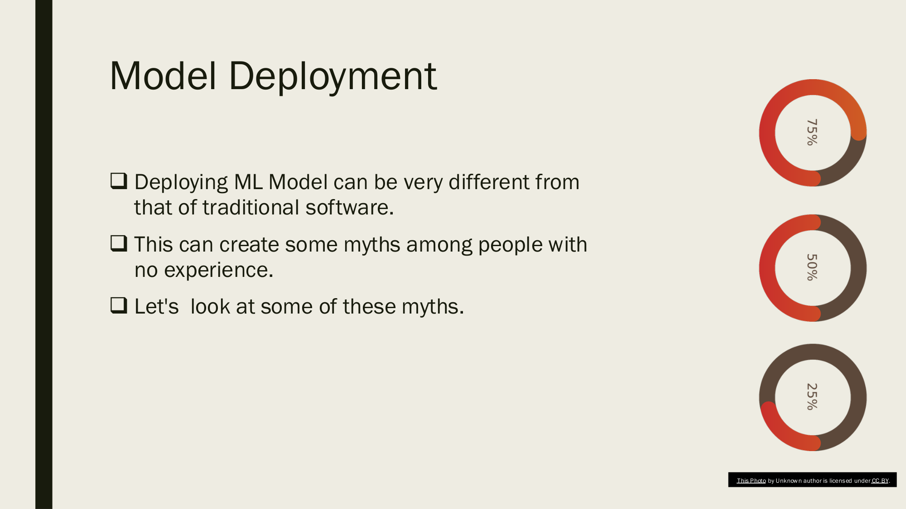

**Model Deployment — 模型部署**

- ❑ Deploying ML Model can be very different from that of traditional software. — 部署 ML 模型与传统软件部署可能非常不同。
- ❑ This can create some myths among people with no experience. — 这可能在没有经验的人中产生一些误区。
- ❑ Let's look at some of these myths. — 让我们看看一些常见误区。

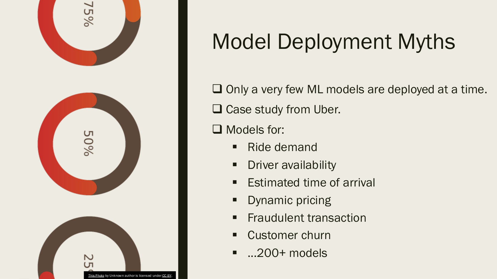

**Model Deployment Myths — 部署误区 1：只有少量模型被部署**

- ❑ Only a very few ML models are deployed at a time. — 一次只部署很少的 ML 模型。
- ❑ Case study from **Uber** — **Uber** 案例研究：
  - ▪ Ride demand — 出行需求
  - ▪ Driver availability — 司机可用性
  - ▪ Estimated time of arrival — 预计到达时间
  - ▪ Dynamic pricing — 动态定价
  - ▪ Fraudulent transaction — 欺诈交易
  - ▪ Customer churn — 客户流失
  - ▪ ...200+ models — ...200+ 个模型

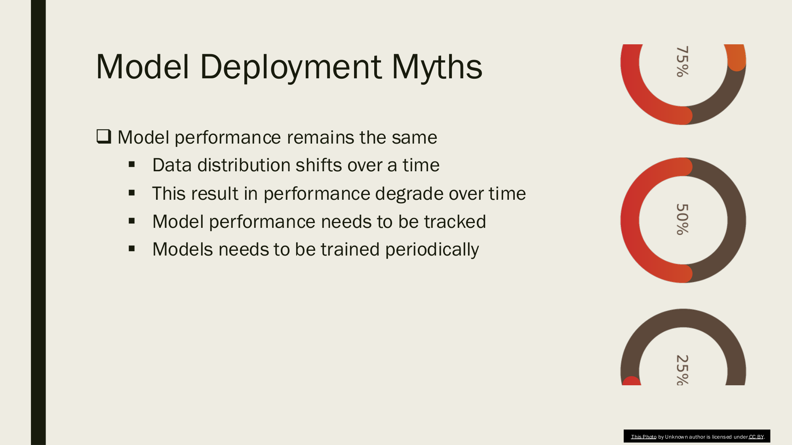

**Model Deployment Myths — 部署误区 2：模型性能保持不变**

- ❑ Model performance remains the same — 模型性能保持不变
  - ▪ Data distribution shifts over a time — 数据分布随时间变化
  - ▪ This results in performance degrade over time — 导致性能随时间下降
  - ▪ Model performance needs to be tracked — 需要跟踪模型性能
  - ▪ Models needs to be trained periodically — 模型需要定期重新训练

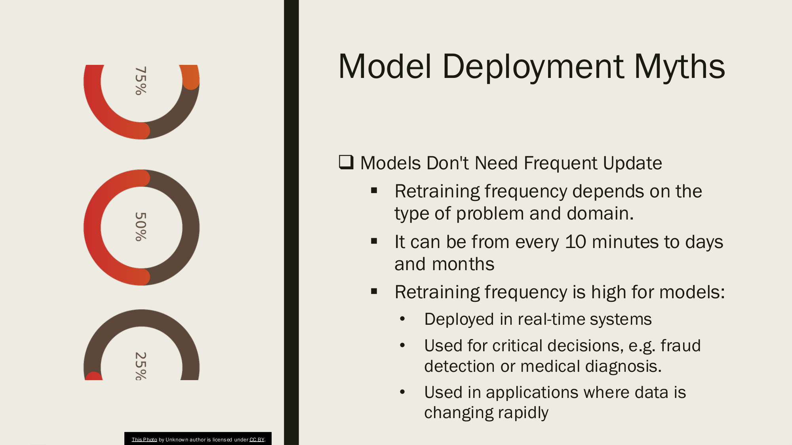

**Model Deployment Myths — 部署误区 3：模型不需要频繁更新**

- ❑ Models Don't Need Frequent Update — 模型不需要频繁更新
  - ▪ Retraining frequency depends on the type of problem and domain. — 重训频率取决于问题类型和领域。
  - ▪ It can be from every 10 minutes to days and months — 可以从每 10 分钟到几天甚至几个月
  - ▪ Retraining frequency is high for models: — 以下模型的重训频率较高：
    - Deployed in real-time systems — 部署在实时系统中
    - Used for critical decisions, e.g. fraud detection or medical diagnosis. — 用于关键决策，如欺诈检测或医疗诊断。
    - Used in applications where data is changing rapidly — 用于数据快速变化的应用

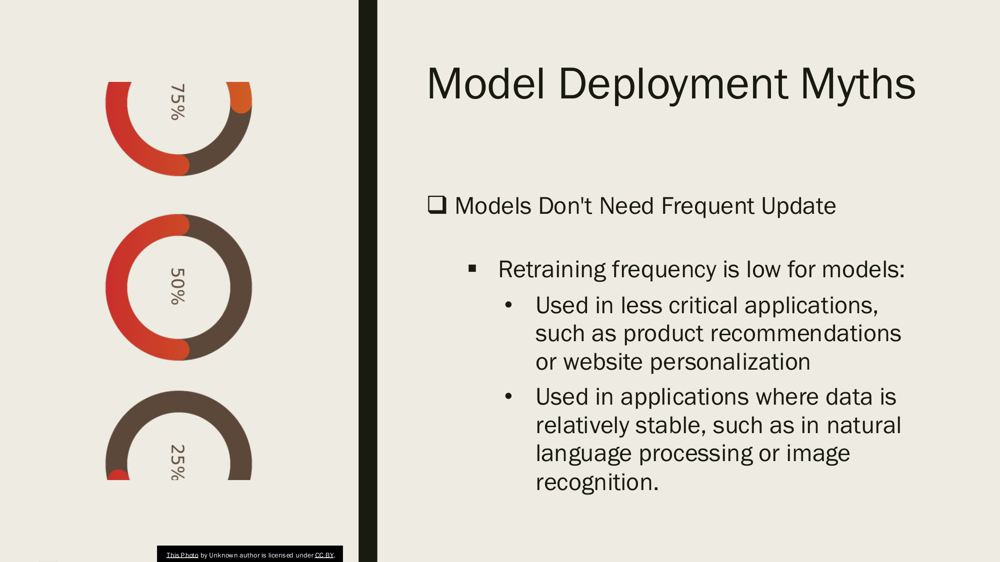

**Model Deployment Myths — 部署误区 3（续）：低频更新场景**

- ❑ Retraining frequency is low for models: — 以下模型的重训频率较低：
  - Used in less critical applications, such as product recommendations or website personalization — 用于不太关键的应用，如产品推荐或网站个性化
  - Used in applications where data is relatively stable, such as in natural language processing or image recognition. — 用于数据相对稳定的应用，如自然语言处理或图像识别。

**Model Deployment Myths — 部署误区 4：不需要担心规模**

- ❑ Most ML Engineers Don't Need to Worry About Scale — 大多数 ML 工程师不需要担心规模
  - ▪ Except those works for Google, Amazon, FB etc. — 除了在 Google、Amazon、FB 等工作的人。
  - ▪ You can have a startup with 100+ employees but having products with millions of customers — 你可以有一个 100+ 员工的创业公司，但产品拥有数百万客户
  - ▪ E.g. Open AI, Slack — 如 OpenAI、Slack

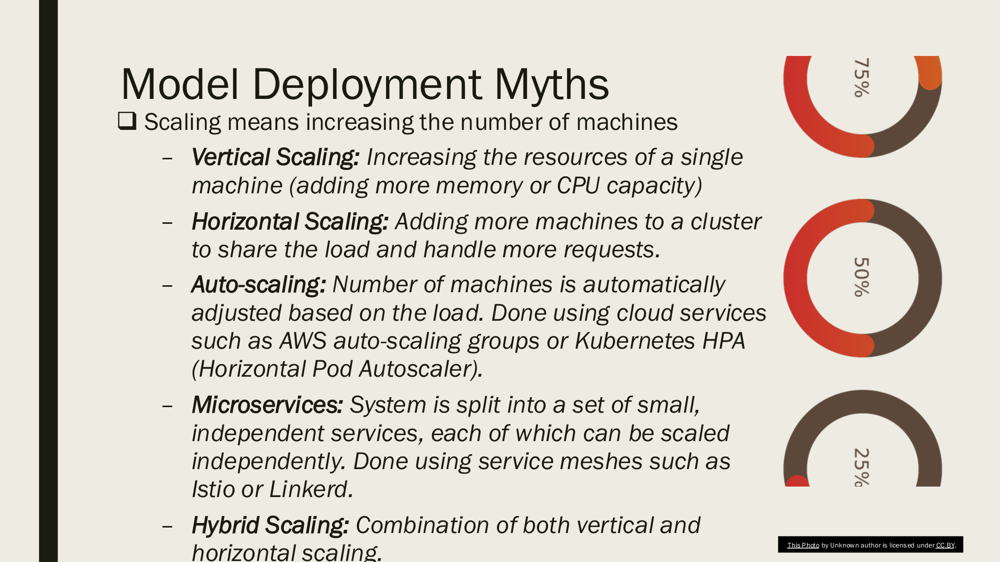

**Model Deployment Myths — 部署误区 5：扩展意味着增加机器数量**

- ❑ Scaling means increasing the number of machines — 扩展意味着增加机器数量
  - **Vertical Scaling**: Increasing the resources of a single machine (adding more memory or CPU capacity) — **垂直扩展**：增加单台机器的资源（添加更多内存或 CPU 容量）
  - **Horizontal Scaling**: Adding more machines to a cluster to share the load and handle more requests. — **水平扩展**：向集群添加更多机器以分担负载和处理更多请求。
  - **Auto-scaling**: Number of machines is automatically adjusted based on the load. Done using cloud services such as AWS auto-scaling groups or Kubernetes HPA. — **自动扩展**：机器数量根据负载自动调整。使用 AWS 自动扩展组或 Kubernetes HPA 等云服务实现。
  - **Microservices**: System is split into a set of small, independent services, each of which can be scaled independently. Done using service meshes such as Istio or Linkerd. — **微服务**：系统拆分为一组小型独立服务，可独立扩展。使用 Istio 或 Linkerd 等服务网格实现。
  - **Hybrid Scaling**: Combination of both vertical and horizontal scaling. — **混合扩展**：垂直和水平扩展的结合。

---

## 3. 批量 vs 在线预测 (Batch vs Online Predictions)

### 3.1 三种部署类型 (Three Types of Deployments)

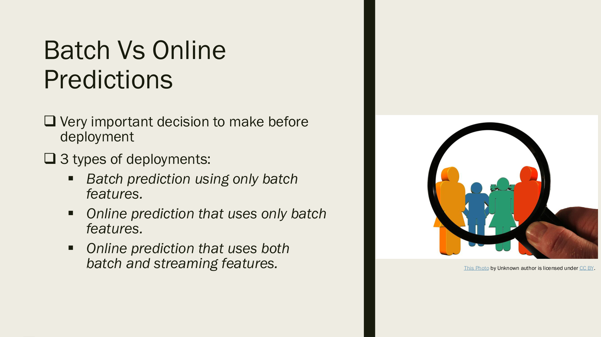

**Batch Vs Online Predictions — 批量 vs 在线预测**

- ❑ Very important decision to make before deployment — 部署前需要做出的非常重要的决定
- ❑ 3 types of deployments — 3 种部署类型：
  - ▪ Batch prediction using only batch features. — 仅使用批量特征的批量预测。
  - ▪ Online prediction that uses only batch features. — 仅使用批量特征的在线预测。
  - ▪ Online prediction that uses both batch and streaming features. — 同时使用批量和流式特征的在线预测。

### 3.2 在线预测 (Online Predictions)

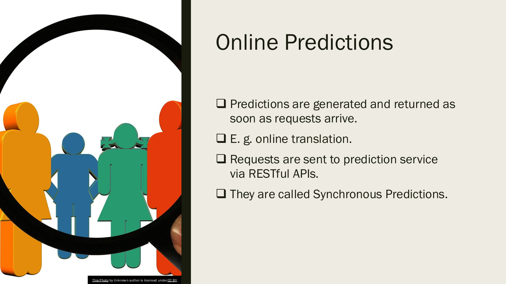

**Online Predictions — 在线预测**

- ❑ Predictions are generated and returned as soon as requests arrive. — 请求到达后立即生成并返回预测。
- ❑ E.g. online translation. — 如在线翻译。
- ❑ Requests are sent to prediction service via RESTful APIs. — 请求通过 RESTful API 发送到预测服务。
- ❑ They are called Synchronous Predictions. — 也称为同步预测。

### 3.3 批量预测 (Batch Predictions)

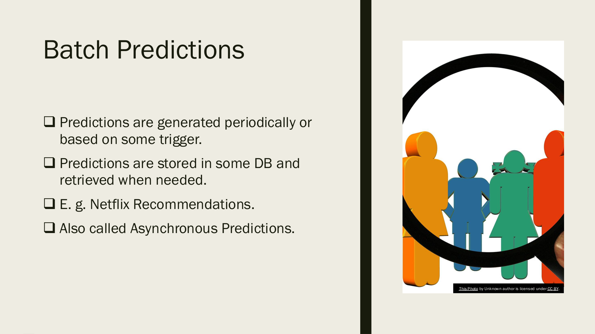

**Batch Predictions — 批量预测**

- ❑ Predictions are generated periodically or based on some trigger. — 定期或基于某些触发器生成预测。
- ❑ Predictions are stored in some DB and retrieved when needed. — 预测存储在数据库中，需要时检索。
- ❑ E.g. Netflix Recommendations. — 如 Netflix 推荐。
- ❑ Also called Asynchronous Predictions. — 也称为异步预测。

### 3.4 架构对比 (Architecture Comparison)

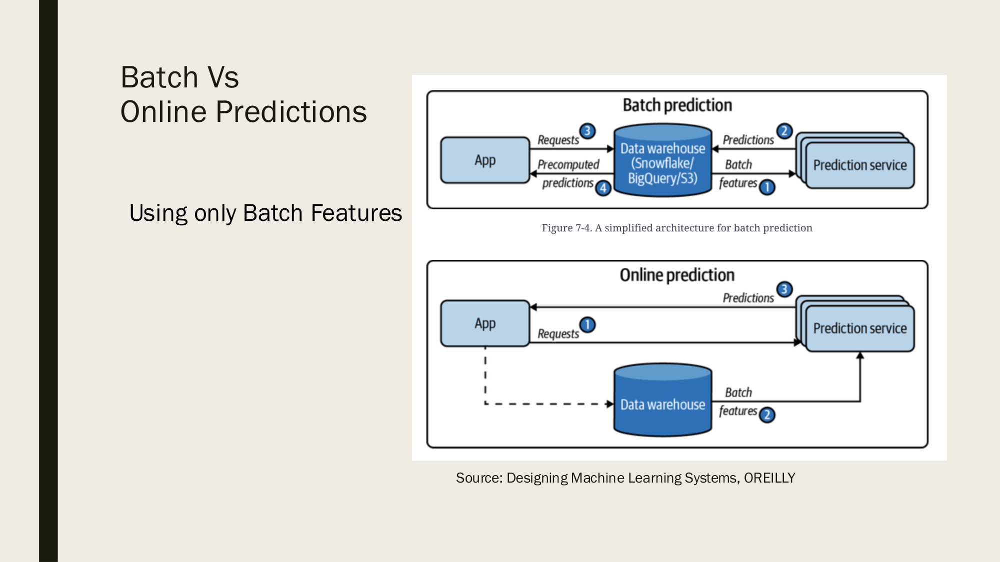

**Batch Vs Online Predictions Using only Batch Features — 仅使用批量特征的批量 vs 在线预测**

Ref: Designing Machine Learning Systems, O'REILLY

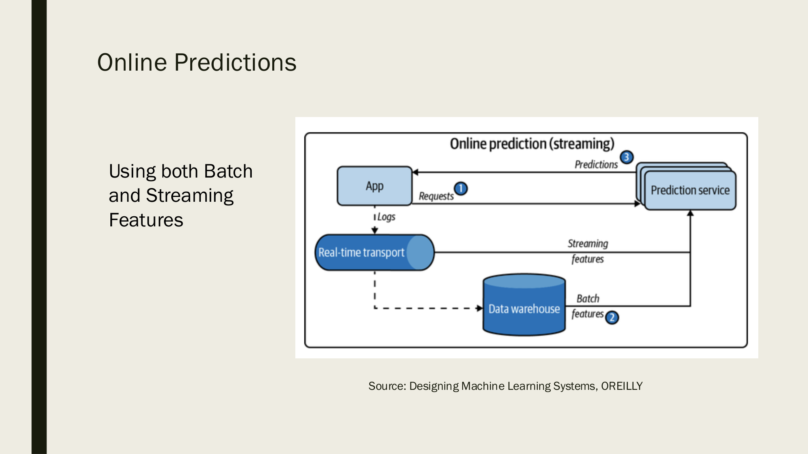

**Online Predictions Using both Batch and Streaming Features — 使用批量和流式特征的在线预测**

Ref: Designing Machine Learning Systems, O'REILLY

### 3.5 批量预测的优缺点 (Batch Predictions — Merits vs Demerits)

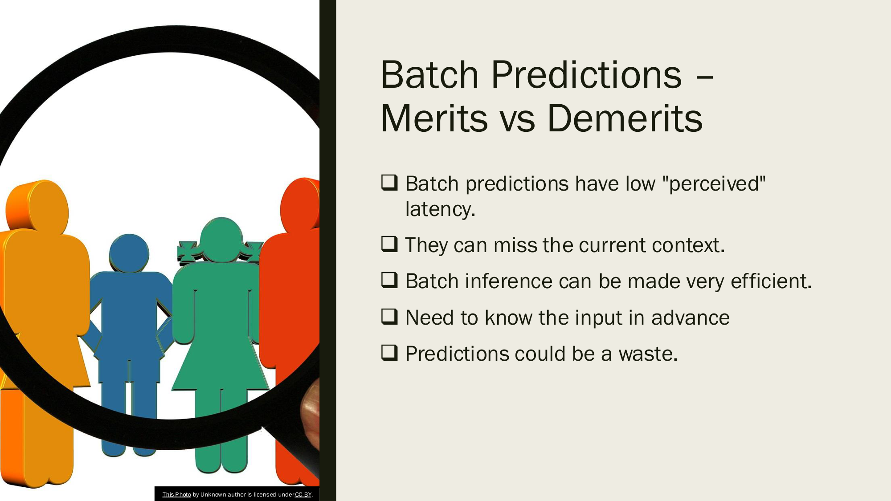

**Batch Predictions – Merits vs Demerits — 批量预测的优缺点**

- ❑ Batch predictions have low "perceived" latency. — 批量预测有较低的"感知"延迟。
- ❑ They can miss the current context. — 可能会错过当前上下文。
- ❑ Batch inference can be made very efficient. — 批量推理可以做得非常高效。
- ❑ Need to know the input in advance — 需要提前知道输入
- ❑ Predictions could be a waste. — 预测可能是浪费的。

### 3.6 在线预测的优缺点 (Online Predictions — Merits vs Demerits)

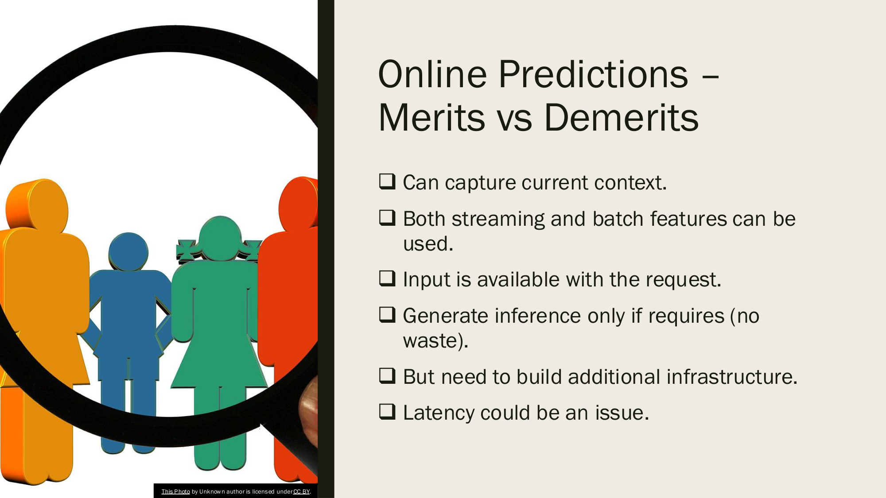

**Online Predictions – Merits vs Demerits — 在线预测的优缺点**

- ❑ Can capture current context. — 可以捕获当前上下文。
- ❑ Both streaming and batch features can be used. — 可以同时使用流式和批量特征。
- ❑ Input is available with the request. — 输入随请求一起提供。
- ❑ Generate inference only if required (no waste). — 仅在需要时生成推理（无浪费）。
- ❑ But need to build additional infrastructure. — 但需要构建额外的基础设施。
- ❑ Latency could be an issue. — 延迟可能是一个问题。

### 3.7 降低在线预测延迟 (Reducing Latency)

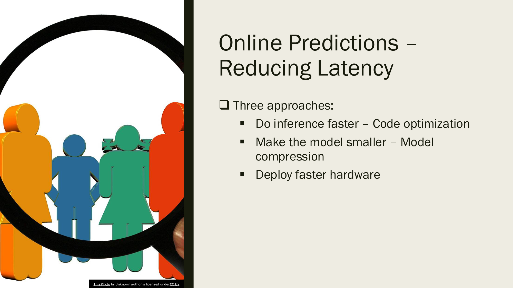

**Online Predictions – Reducing Latency — 在线预测 — 降低延迟**

- ❑ Three approaches — 三种方法：
  - ▪ Do inference faster – Code optimization — 更快推理 – 代码优化
  - ▪ Make the model smaller – Model compression — 缩小模型 – 模型压缩
  - ▪ Deploy faster hardware — 部署更快的硬件

---

## 4. 模型压缩 (Model Compression)

### 4.1 概述 (Overview)

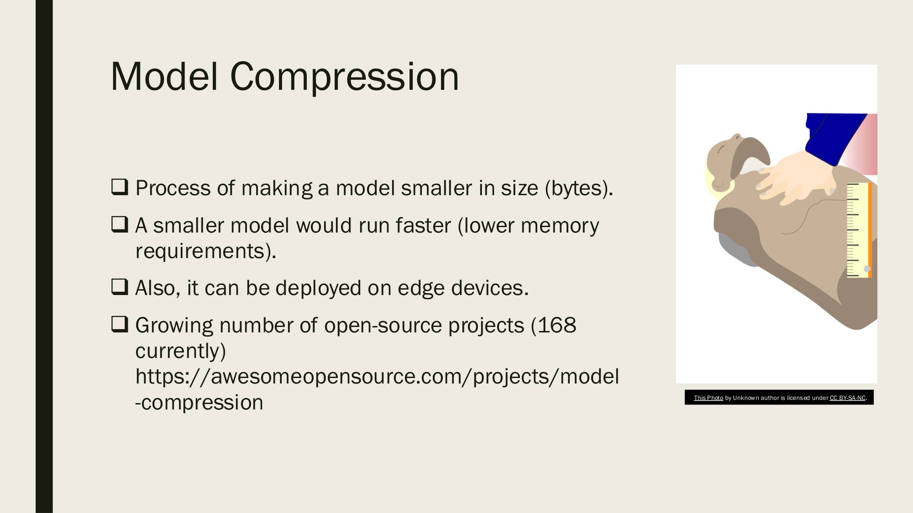

**Model Compression — 模型压缩**

- ❑ Process of making a model smaller in size (bytes). — 使模型更小（字节数）的过程。
- ❑ A smaller model would run faster (lower memory requirements). — 更小的模型运行更快（更低的内存需求）。
- ❑ Also, it can be deployed on edge devices. — 也可以部署在边缘设备上。

Ref: https://awesomeopensource.com/projects/model-compression

**Model Compression — 模型压缩（四种技术）**

- ❑ Mainly 4 types of techniques — 主要 4 种技术：
  - ▪ **Low-rank optimization** — **低秩优化**
  - ▪ **Knowledge distillation** — **知识蒸馏**
  - ▪ **Pruning** — **剪枝**
  - ▪ **Quantization** — **量化**

### 4.2 低秩分解 (Low Rank Factorization)

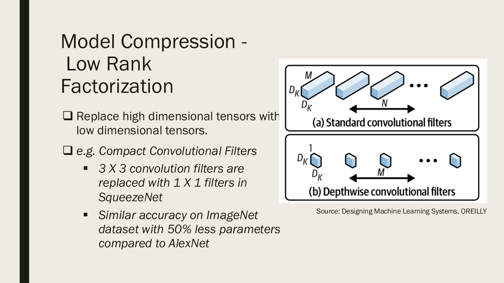

**Model Compression - Low Rank Factorization — 模型压缩 — 低秩分解**

- ❑ Replace high dimensional tensors with low dimensional tensors. — 用低维张量替换高维张量。
- ❑ e.g. **Compact Convolutional Filters** — 如**紧凑卷积滤波器**
  - ▪ 3×3 convolution filters are replaced with 1×1 filters in SqueezeNet — 在 SqueezeNet 中将 3×3 卷积滤波器替换为 1×1 滤波器
  - ▪ Similar accuracy on ImageNet dataset with 50% less parameters compared to AlexNet — 在 ImageNet 上达到相似准确率，参数比 AlexNet 少 50%

### 4.3 知识蒸馏 (Knowledge Distillation)

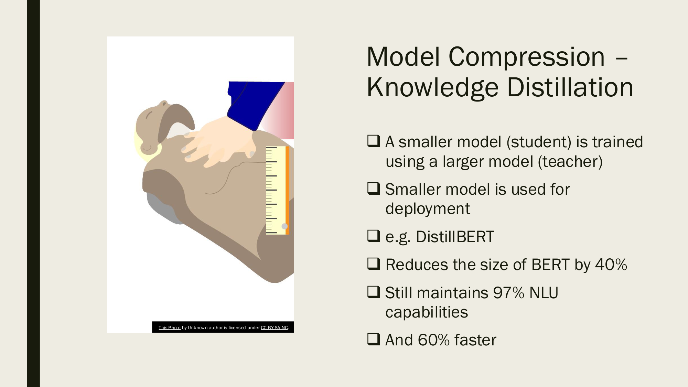

**Model Compression – Knowledge Distillation — 模型压缩 — 知识蒸馏**

- ❑ A smaller model (**student**) is trained using a larger model (**teacher**) — 小模型（**学生**）使用大模型（**教师**）进行训练
- ❑ Smaller model is used for deployment — 小模型用于部署
- ❑ e.g. **DistilBERT** — 如 **DistilBERT**
  - ❑ Reduces the size of BERT by 40% — 将 BERT 大小减少 40%
  - ❑ Still maintains 97% NLU capabilities — 仍保持 97% 的 NLU 能力
  - ❑ And 60% faster — 且快 60%

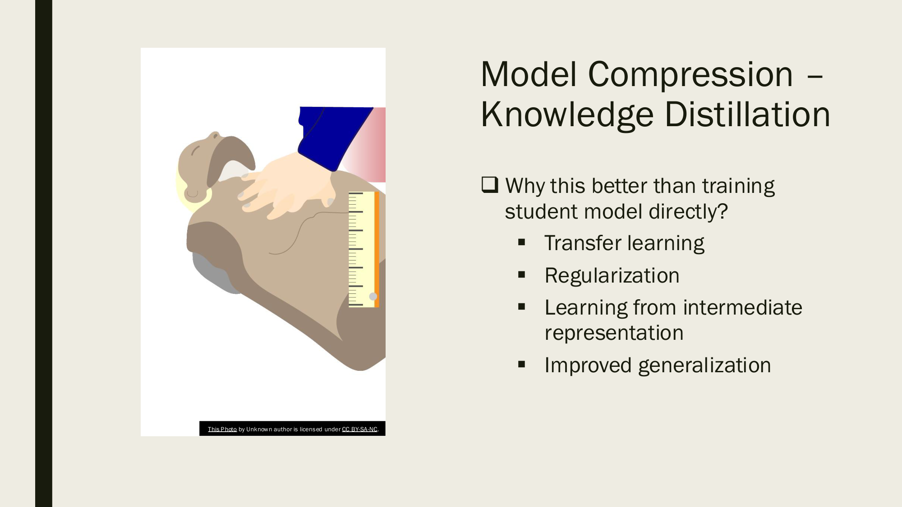

**Knowledge Distillation — 知识蒸馏（为什么优于直接训练？）**

- ❑ Why this better than training student model directly? — 为什么这比直接训练学生模型更好？
  - ▪ Transfer learning — 迁移学习
  - ▪ Regularization — 正则化
  - ▪ Learning from intermediate representation — 从中间表示学习
  - ▪ Improved generalization — 改善泛化能力

### 4.4 剪枝 (Pruning)

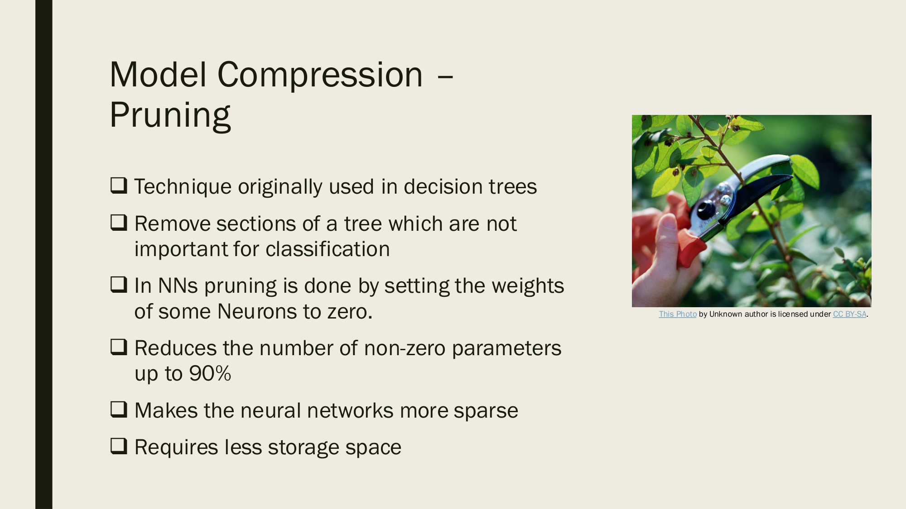

**Model Compression – Pruning — 模型压缩 — 剪枝**

- ❑ Technique originally used in decision trees — 最初用于决策树的技术
- ❑ Remove sections of a tree which are not important for classification — 移除对分类不重要的树的部分
- ❑ In NNs pruning is done by setting the weights of some Neurons to zero. — 在 NN 中，剪枝通过将某些神经元的权重设为零来实现。
- ❑ Reduces the number of non-zero parameters up to 90% — 可将非零参数数量减少高达 90%
- ❑ Makes the neural networks more sparse — 使神经网络更加稀疏
- ❑ Requires less storage space — 需要更少的存储空间

### 4.5 量化 (Quantization)

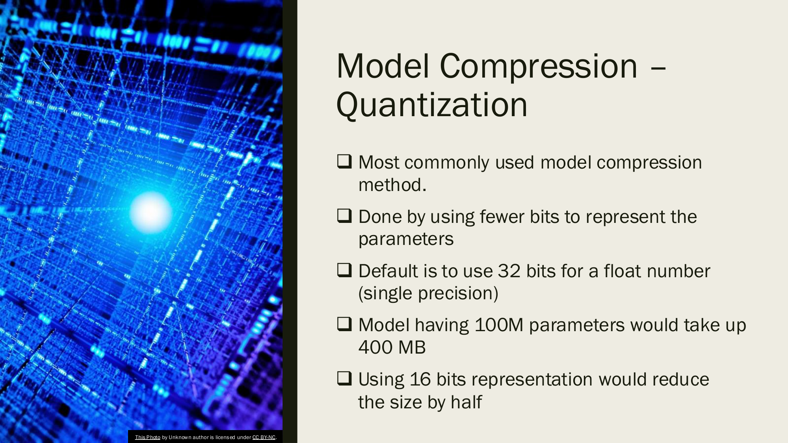

**Model Compression – Quantization — 模型压缩 — 量化**

- ❑ Most commonly used model compression method. — 最常用的模型压缩方法。
- ❑ Done by using fewer bits to represent the parameters — 通过使用更少的位来表示参数
- ❑ Default is to use 32 bits for a float number (single precision) — 默认使用 32 位表示浮点数（单精度）
- ❑ Model having 100M parameters would take up 400 MB — 拥有 1 亿参数的模型将占用 400 MB
- ❑ Using 16 bits representation would reduce the size by half — 使用 16 位表示可将大小减半

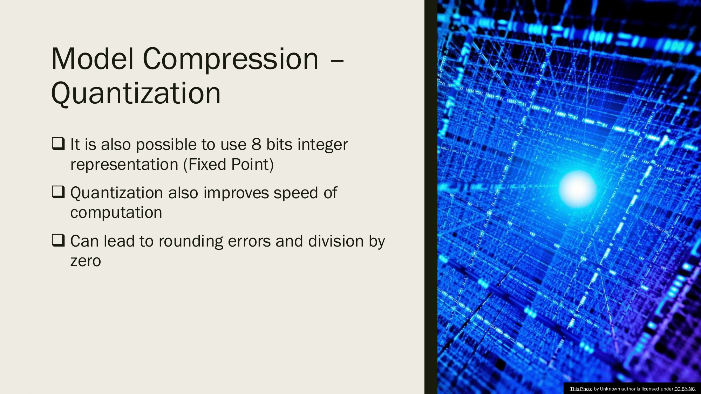

**Quantization — 量化（8 位整数）**

- ❑ It is also possible to use 8 bits integer representation (Fixed Point) — 也可以使用 8 位整数表示（定点数）
- ❑ Quantization also improves speed of computation — 量化还可以提高计算速度
- ❑ Can lead to rounding errors and division by zero — 可能导致舍入误差和除以零

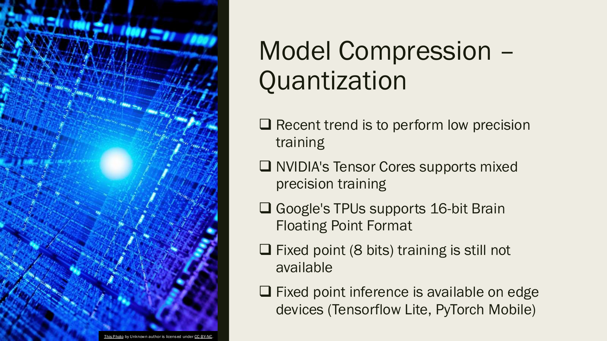

**Quantization — 量化（最新趋势）**

- ❑ Recent trend is to perform low precision training — 最近的趋势是进行低精度训练
- ❑ NVIDIA's Tensor Cores supports mixed precision training — NVIDIA 的 Tensor Cores 支持混合精度训练
- ❑ Google's TPUs supports 16-bit Brain Floating Point Format — Google 的 TPU 支持 16 位 BFloat16 格式
- ❑ Fixed point (8 bits) training is still not available — 定点（8 位）训练仍不可用
- ❑ Fixed point inference is available on edge devices (Tensorflow Lite, PyTorch Mobile) — 定点推理可在边缘设备上使用（TensorFlow Lite、PyTorch Mobile）

---

## 5. 案例研究：Roblox BERT 优化 (Case Study: Roblox BERT Optimization)

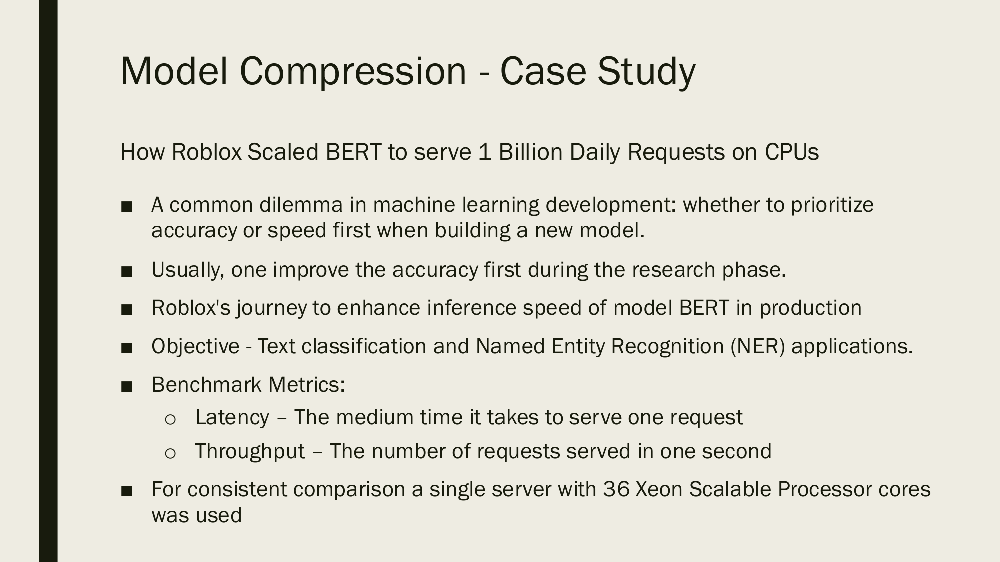

**Model Compression - Case Study — 案例研究：Roblox 如何扩展 BERT 以在 CPU 上处理每天 10 亿次请求**

- How Roblox Scaled BERT to serve 1 Billion Daily Requests on CPUs — Roblox 如何扩展 BERT 以在 CPU 上处理每天 10 亿次请求
- ■ A common dilemma: whether to prioritize accuracy or speed first when building a new model. — 常见的困境：构建新模型时优先考虑准确性还是速度。
- ■ Usually, one improves the accuracy first during the research phase. — 通常在研究阶段先提高准确性。
- ■ Objective - Text classification and Named Entity Recognition (NER) applications. — 目标 - 文本分类和命名实体识别（NER）应用。
- ■ Benchmark Metrics — 基准指标：
  - Latency – The median time it takes to serve one request — 延迟 – 服务一个请求的中位时间
  - Throughput – The number of requests served in one second — 吞吐量 – 一秒钟内服务的请求数
- ■ For consistent comparison a single server with 36 Xeon Scalable Processor cores was used — 为一致比较，使用了一台 36 核 Xeon 可扩展处理器的服务器

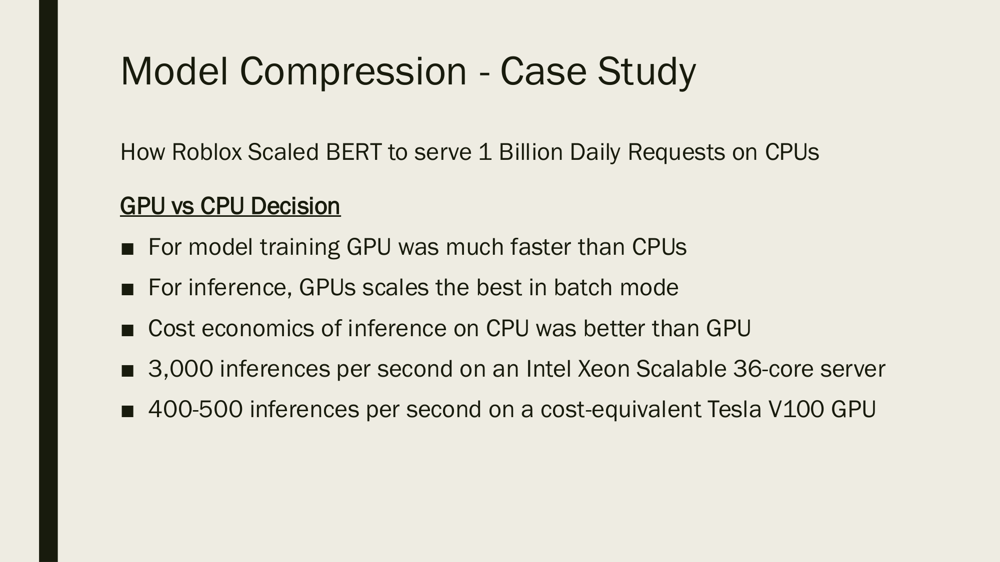

**Case Study — GPU vs CPU Decision — GPU vs CPU 决策**

- ■ For model training GPU was much faster than CPUs — 模型训练中 GPU 比 CPU 快得多
- ■ For inference, GPUs scales the best in batch mode — 推理时，GPU 在批量模式下扩展性最好
- ■ Cost economics of inference on CPU was better than GPU — CPU 推理的成本经济性优于 GPU
- ■ 3,000 inferences per second on an Intel Xeon Scalable 36-core server — Intel Xeon 36 核服务器上每秒 3,000 次推理
- ■ 400-500 inferences per second on a cost-equivalent Tesla V100 GPU — 成本相当的 Tesla V100 GPU 上每秒 400-500 次推理

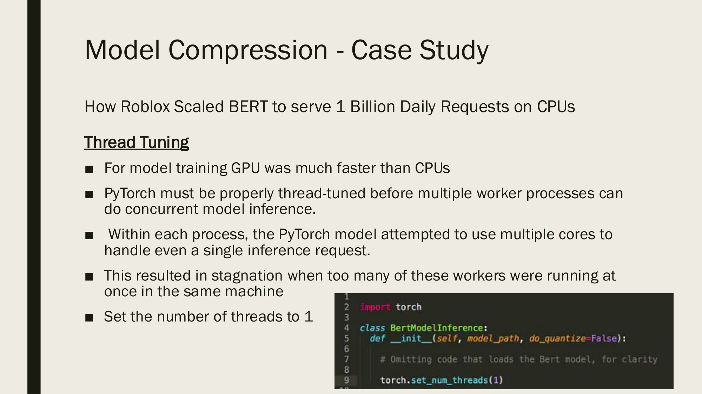

**Case Study — Thread Tuning — 线程调优**

- ■ PyTorch must be properly thread-tuned before multiple worker processes can do concurrent model inference. — PyTorch 必须在多个 worker 进程执行并发模型推理前正确调优线程。
- ■ Within each process, the PyTorch model attempted to use multiple cores to handle even a single inference request. — 在每个进程中，PyTorch 模型尝试使用多个核心来处理单个推理请求。
- ■ This resulted in stagnation when too many of these workers were running at once in the same machine — 当同一台机器上同时运行太多 worker 时会导致停滞
- ■ Set the number of threads to 1 — 将线程数设为 1

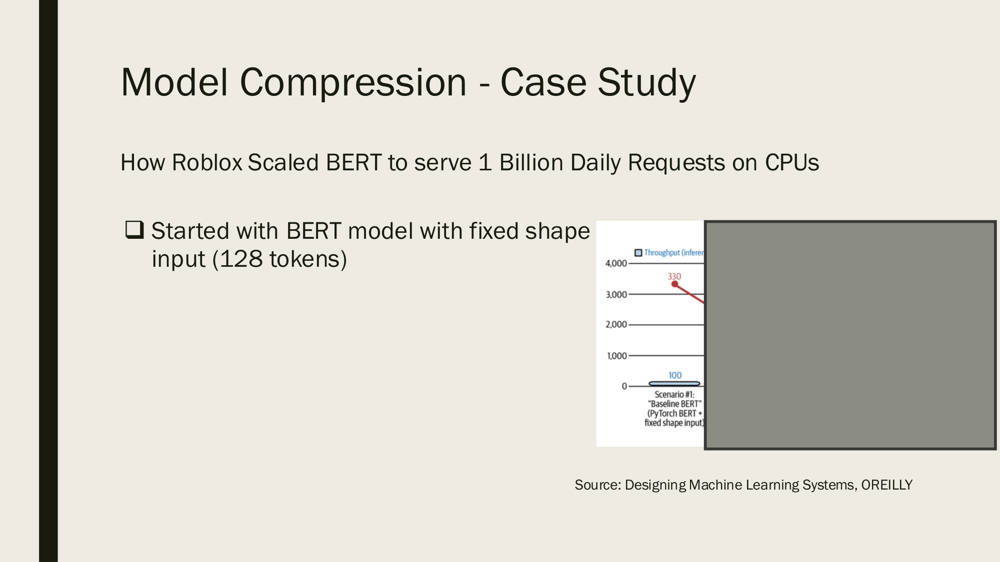

**Case Study — 优化步骤 1：固定输入 BERT**

- ❑ Started with BERT model with fixed shape input (128 tokens) — 从固定形状输入（128 tokens）的 BERT 模型开始

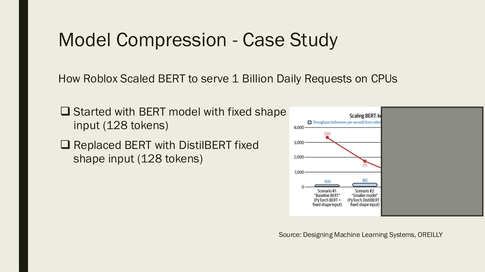

**Case Study — 优化步骤 2：用 DistilBERT 替换**

- ❑ Replaced BERT with DistilBERT fixed shape input (128 tokens) — 用固定形状输入（128 tokens）的 DistilBERT 替换 BERT

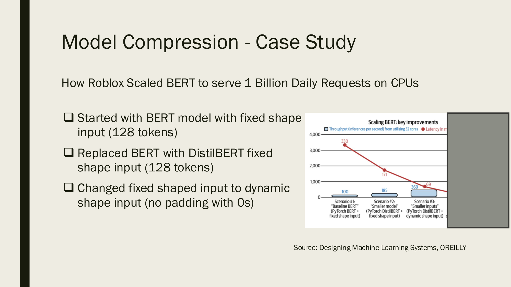

**Case Study — 优化步骤 3：动态输入形状**

- ❑ Changed fixed shaped input to dynamic shape input (no padding with 0s) — 将固定形状输入改为动态形状输入（不用 0 填充）

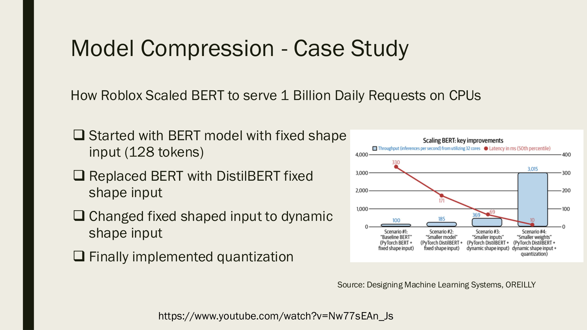

**Case Study — 优化步骤 4：量化**

- ❑ Finally implemented quantization — 最终实施了量化

Ref: https://www.youtube.com/watch?v=Nw77sEAn_Js
Ref: Designing Machine Learning Systems, O'REILLY

**Case Study — 课后作业**

- Home assignment – Watch the YouTube Video talk about this — 课后作业 – 观看关于此主题的 YouTube 视频
- https://www.youtube.com/watch?v=Nw77sEAn_Js

---

## 6. 今日学习总结 (Summary of Today's Learning)

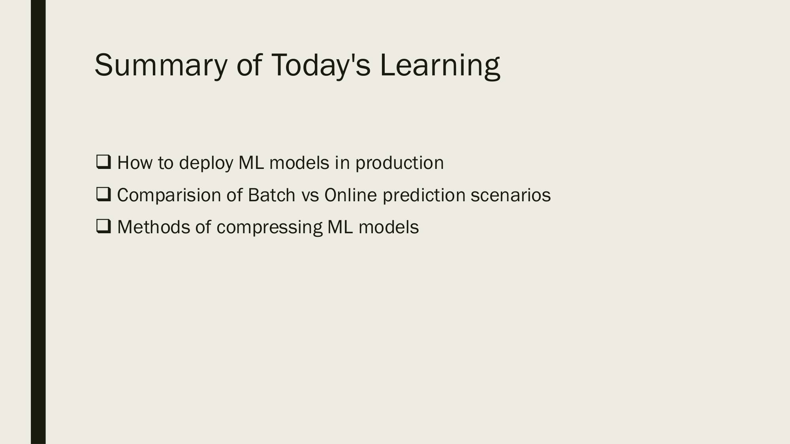

**Summary of Today's Learning — 今日学习总结**

- ❑ How to deploy ML models in production — 如何在生产环境中部署 ML 模型
- ❑ Comparison of Batch vs Online prediction scenarios — 批量 vs 在线预测场景的对比
- ❑ Methods of compressing ML models — ML 模型压缩方法
