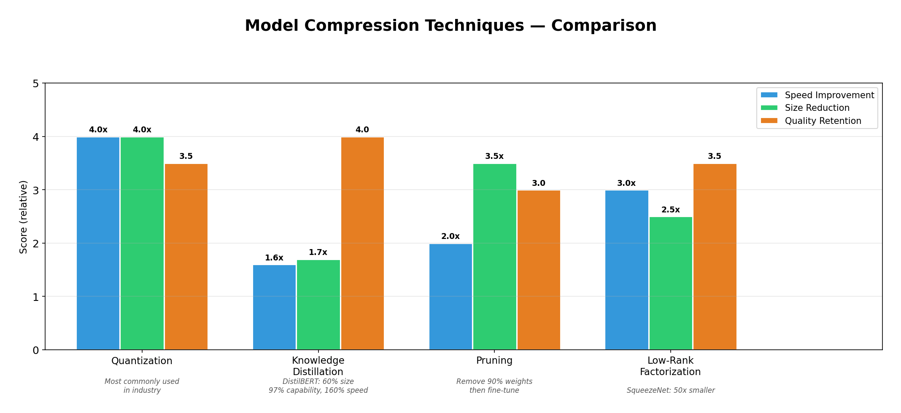
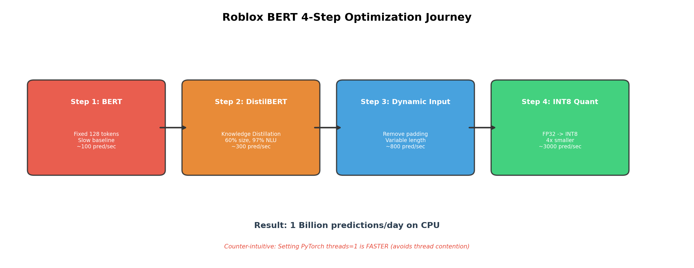

# Week 6 故事线：模型部署——从"准确率最高"到"用户能用"

> **Source:** `Week6-Lecture-1.pdf`
> **核心主题：** 模型训练完成后，怎么让它在真实世界中为用户服务？
> **故事线：** 一场从实验室到生产线的搬迁——破除误区（心态校准） → 选择服务模式（批量 vs 在线） → 解决延迟瓶颈（模型压缩） → 真实案例验证（Roblox BERT）

---

## 🎬 序幕：我们在解决什么问题？

你花三个月训练了一个 NLP 模型，准确率 95%，老板很开心。然后他问：

- **"用户怎么调用它？"** —— 是实时返回还是先算好存起来？
- **"100 万用户同时来呢？"** —— 一台服务器扛得住吗？
- **"手机上能跑吗？"** —— 模型 2GB，用户手机只有 3GB 内存……
- **"模型准确率下降了怎么办？"** —— 上线一个月后用户投诉越来越多。

> 💡 **核心洞察：** 模型训练只是 ML 项目的 20%。剩下的 80% 是**部署、维护和优化**——这就是本周的主题。

本周的故事分三幕：

| 幕 | 核心问题 | 一句话 |
|------|---------|--------|
| ① 部署误区 (Deployment Myths) | 新手容易踩哪些坑？ | 心态校准 |
| ② 批量 vs 在线预测 (Batch vs Online) | 模型预测用哪种服务模式？ | 选择策略 |
| ③ 模型压缩 (Model Compression) | 模型太大太慢怎么办？ | 瘦身手术 |

---

## 📚 第一章：心态校准——破除五大部署误区

### 1.1 为什么先讲误区？

> 🔑 **知道什么是错的，比知道什么是对的更重要。**

对于没有实际部署经验的 ML 工程师来说，这些误区会导致错误的架构决策、低估运维复杂度，最终白费几周的工作。

### 1.2 误区一："一次只部署很少的模型"

**现实：** 大公司同时运行成百上千个模型。

**Uber 案例：** 仅 Uber 一家公司就同时运行 **200+** 个 ML 模型：

| 业务场景 | 对应模型 |
|---------|---------|
| 出行需求 (Ride demand) | 需求预测模型 |
| 司机可用性 (Driver availability) | 供给匹配模型 |
| 预计到达时间 (ETA) | 路径/时间估算模型 |
| 动态定价 (Dynamic pricing) | 定价优化模型 |
| 欺诈交易 (Fraudulent transaction) | 欺诈检测模型 |
| 客户流失 (Customer churn) | 流失预警模型 |

> 💡 **启示：** 如果你的架构只能管理"一两个模型"，等公司业务增长后就会崩溃。从一开始就要考虑**多模型并行管理**。

### 1.3 误区二："模型性能保持不变"

**现实：** 模型性能会随时间**自然衰退 (Model Decay)**。

**原因：** **数据分布漂移 (Data Distribution Shift)**——模型训练时的数据和实际使用时的数据不一样了。

> 💡 **例子：** 你训练了一个房价预测模型。训练数据是 2019 年的。2020 年疫情来了——在家办公爆发，郊区房价暴涨，城中心公寓需求暴跌。如果你不重新训练，预测就完全失准。

**结论：**
- 需要**持续监控**模型性能（跟踪指标随时间的变化）
- 需要**定期重新训练**模型

### 1.4 误区三："模型不需要频繁更新"

**现实：** 重训频率从**每 10 分钟到每几个月**不等，取决于应用场景。

| 重训频率 | 场景 | 为什么 |
|---------|------|-------|
| **高频**（分钟-天） | 实时系统、欺诈检测、医疗诊断 | 数据变化快，决策影响大 |
| **低频**（周-月） | 产品推荐、网站个性化、NLP/图像识别 | 数据相对稳定，错误代价低 |

> 💡 **记忆口诀：** **数据变化快 + 决策影响大 = 高频重训**

### 1.5 误区四："不需要担心规模"

**现实：** 即使是**小团队**也可能面对**百万级用户**。

| 公司 | 员工数 | 用户数 |
|------|--------|--------|
| OpenAI (早期) | 100+ | 数百万 |
| Slack (早期) | 100+ | 数百万 |

> 💡 **关键洞察：** 团队小 ≠ 规模小。从第一天就要考虑可扩展性。

### 1.6 误区五："扩展就是加机器"

**现实：** 扩展有五种策略，不只是"加机器"：

| 策略 | 含义 | 适用场景 |
|------|------|---------|
| **垂直扩展 (Vertical Scaling)** | 给单台机器加 CPU/内存 | 简单但有天花板 |
| **水平扩展 (Horizontal Scaling)** | 增加更多机器 | 适合无状态服务 |
| **自动扩展 (Auto-scaling)** | 根据负载自动调节机器数 | AWS Auto Scaling / K8s HPA |
| **微服务 (Microservices)** | 系统拆分为独立服务，各自扩展 | Istio / Linkerd |
| **混合扩展 (Hybrid Scaling)** | 垂直 + 水平结合 | 大多数实际系统 |

> 🔑 **故事转折点：** 误区破除了，心态校准了。现在进入正题——模型训练完成，要开始服务用户了。第一个关键决策：**用户请求来了，是实时算还是提前算好？** → 批量 vs 在线预测！

---

## 🎭 第二章：选择策略——批量 vs 在线预测

### 2.1 为什么这个选择如此重要？

> 🔑 **批量 vs 在线，不是技术细节——是架构方向。选错了就要重建整个服务链路。**

在部署模型前，你必须做出一个根本性决策：预测结果是**提前算好存起来**，还是**用户请求来了现场算**？

三种部署类型：

| 类型 | 特征 | 一句话 |
|------|------|--------|
| ① 批量预测 (Batch) | 仅用批量特征，定期计算 | 提前算好，用户来了直接查 |
| ② 在线预测 (Online) — 批量特征 | 仅用批量特征，实时计算 | 用户来了现场算，但数据是旧的 |
| ③ 在线预测 (Online) — 混合特征 | 同时用批量 + 流式特征 | 用户来了现场算，用最新数据 |

### 2.2 在线预测 (Online Predictions)

**一句话定义：** 请求到达后**立即**生成并返回预测结果。

- 也叫**同步预测 (Synchronous Predictions)**
- 通过 **RESTful API** 接收请求
- 典型场景：在线翻译——你输入一句话，翻译结果立刻返回

```
用户请求 ──→ [ API 网关 ] ──→ [ 模型推理服务 ] ──→ 返回结果
                                    ↑
                              实时计算，延迟敏感
```

### 2.3 批量预测 (Batch Predictions)

**一句话定义：** 预测结果**定期批量生成**并存入数据库，用户需要时直接查。

- 也叫**异步预测 (Asynchronous Predictions)**
- 典型场景：Netflix 推荐——你打开 App 看到的推荐列表不是实时算的，而是提前算好存在数据库里的

```
定时触发 ──→ [ 批量计算 ] ──→ 结果存入 DB
                                    ↑
用户请求 ──→ [ 查询 DB ] ──→ 返回存好的结果
```

### 2.4 优缺点对比——核心考试知识点

> 💡 **这张表是考试高频考点，务必记住每一行：**

| 维度 | 批量预测 (Batch) | 在线预测 (Online) |
|------|:-:|:-:|
| **延迟 (Latency)** | ✅ 低感知延迟（提前算好） | ⚠️ 可能有高延迟 |
| **当前上下文 (Context)** | ❌ 可能错过当前上下文 | ✅ 可以捕获当前上下文 |
| **计算效率** | ✅ 批量推理很高效 | ⚠️ 单条推理开销大 |
| **输入需求** | ❌ 需要提前知道输入 | ✅ 输入随请求提供 |
| **资源浪费** | ❌ 预测可能浪费（算了没人用） | ✅ 按需推理，无浪费 |
| **特征类型** | 仅批量特征 | 批量 + 流式特征都可以 |
| **基础设施** | ✅ 相对简单 | ❌ 需要额外基础设施 |

### 2.5 ❗ 在线预测的致命问题——延迟

在线预测虽然灵活，但有一个致命瓶颈：**延迟 (Latency)**。

用户发送请求 → 模型推理 → 返回结果。如果模型太大、计算太慢，用户等不了！

> 💡 **现实：** Google 的研究表明，搜索结果延迟增加 **500ms**，用户流量就会下降 **20%**。

三种降低延迟的方法：

| 方法 | 策略 | 适用场景 |
|------|------|---------|
| **代码优化** | 更高效的推理代码 | 投入产出比高 |
| **模型压缩** | 让模型变小变快 | 本周重点！ |
| **更快硬件** | 用 GPU / TPU / 专用芯片 | 烧钱但有效 |

> 🔑 **故事转折点：** 在线预测的延迟瓶颈暴露了一个核心矛盾——**模型越大越准，但也越慢越贵**。怎么在保持准确率的同时让模型变小变快？→ 模型压缩登场！

---

## 🏆 第三章：瘦身手术——模型压缩 (Model Compression)

### 3.1 为什么需要模型压缩？

> 🔑 **模型压缩 = 让模型更小（字节）、更快（推理速度），同时尽量少丢准确率。**

两大核心驱动力：

| 驱动力 | 含义 |
|--------|------|
| **降低延迟** | 更小的模型 → 更少的内存 → 更快的推理 |
| **边缘部署** | 手机、IoT 设备内存有限，大模型装不下 |

### 3.2 四种压缩技术全景

| 技术 | 一句话定义 | 比喻 |
|------|-----------|------|
| **低秩分解 (Low-Rank Factorization)** | 用低维矩阵替代高维矩阵 | 用简笔画替代油画 |
| **知识蒸馏 (Knowledge Distillation)** | 大模型教小模型 | 老教授教本科生 |
| **剪枝 (Pruning)** | 删除不重要的权重 | 修剪树枝 |
| **量化 (Quantization)** | 用更少的位表示参数 | 把精装修降级为简装 |



### 3.3 低秩分解 (Low-Rank Factorization)

**核心思想：** 用低维张量 (Low-Dimensional Tensors) 替换高维张量。

**典型案例：SqueezeNet**
- 将 3×3 卷积滤波器替换为 1×1 滤波器
- 在 ImageNet 上准确率与 AlexNet 相当
- 参数量**减少 50%**

> 💡 **直觉：** 很多参数其实是冗余的——就像一张 1000 万像素的照片，压缩成 500 万像素肉眼几乎看不出差别。

### 3.4 知识蒸馏 (Knowledge Distillation)

**核心思想：** 用大模型（教师 Teacher）训练小模型（学生 Student），小模型用于部署。

```
┌────────────┐                  ┌────────────┐
│  Teacher   │  ── 教学信号 ──→ │  Student   │
│  (大模型)   │                  │  (小模型)   │
│  高准确率   │                  │  低延迟    │
│  高延迟    │                  │  高准确率↓  │
└────────────┘                  └────────────┘
       ↑                              ↑
    训练阶段                        部署阶段
```

**典型案例：DistilBERT**

| 指标 | BERT | DistilBERT | 改进 |
|------|------|-----------|------|
| 模型大小 | 100% | **60%** | 减少 40% |
| NLU 能力 | 100% | **97%** | 几乎无损 |
| 推理速度 | 1x | **1.6x** | 快 60% |

**为什么蒸馏比直接训练小模型更好？**

| 优势 | 解释 |
|------|------|
| **迁移学习 (Transfer Learning)** | Student 从 Teacher 学到通用知识 |
| **正则化 (Regularization)** | Teacher 的 soft labels 比 hard labels 包含更多信息 |
| **中间表示学习** | Student 学习 Teacher 的中间层特征（不只是最终输出） |
| **改善泛化 (Generalization)** | Teacher 的知识帮助 Student 避免过拟合 |

> 💡 **类比：** 直接训练小模型 = 让本科生自学高等数学。知识蒸馏 = 让教授先理解透彻，再用简单的方式教给本科生——学习效率高很多。

### 3.5 剪枝 (Pruning)

**核心思想：** 将不重要的神经元权重设为零，使网络变得**稀疏 (Sparse)**。

- 最初用于**决策树**——剪掉对分类不重要的分支
- 在神经网络中：将某些权重置零
- 可减少**高达 90%** 的非零参数
- 更稀疏 → 更少存储空间 → 更快推理

```
剪枝前（密集网络）：          剪枝后（稀疏网络）：
[0.3] [0.1] [0.8] [0.02]     [0.3] [  0 ] [0.8] [  0  ]
[0.5] [0.7] [0.04] [0.6]     [0.5] [0.7] [  0 ] [0.6]
[0.01] [0.9] [0.3] [0.1]     [  0 ] [0.9] [0.3] [  0  ]

绝对值小于阈值的权重 → 设为 0
```

> 💡 **直觉：** 就像修剪一棵树——去掉枯枝烂叶后，树不仅没死，反而更健康（更快）。

### 3.6 量化 (Quantization)

**核心思想：** 用**更少的位 (bits)** 表示模型参数。

> 🔑 **这是最常用的模型压缩方法。**

#### 位数与存储的关系

| 精度 | 位数 | 1 亿参数占用 | 相比 FP32 |
|------|------|------------|----------|
| 单精度浮点 (FP32) | 32 bits | **400 MB** | 基准 |
| 半精度浮点 (FP16) | 16 bits | **200 MB** | 减半 |
| 8 位整数 (INT8) | 8 bits | **100 MB** | 减 75% |

#### 量化的代价

| 优势 | 风险 |
|------|------|
| ✅ 模型更小 | ⚠️ 舍入误差 (Rounding Errors) |
| ✅ 推理更快 | ⚠️ 除以零问题 (Division by Zero) |
| ✅ 内存占用更低 | ⚠️ 精度可能下降 |

#### 量化的最新趋势

| 趋势 | 状态 | 代表 |
|------|------|------|
| 低精度**训练** (FP16) | ✅ 可用 | NVIDIA Tensor Cores（混合精度训练） |
| 低精度**训练** (BF16) | ✅ 可用 | Google TPU（BFloat16 格式） |
| 定点**训练** (INT8) | ❌ 仍不可用 | 精度损失太大 |
| 定点**推理** (INT8) | ✅ 可用 | TensorFlow Lite, PyTorch Mobile（边缘设备） |

> 💡 **记忆技巧：** **训练可以半精度 (FP16/BF16)，推理可以 INT8，但 INT8 训练还不行。**

---

## 📹 第四章：实战验证——Roblox BERT 优化案例

### 4.1 为什么这个案例重要？

> 🔑 **理论再好，不如看一个真实公司如何把这些技术串联起来用。**

**Roblox 的挑战：** 在 CPU 上用 BERT 处理**每天 10 亿次请求**，用于文本分类和命名实体识别 (NER)。

**核心矛盾：** 准确率 vs 速度——先优化哪个？

> 💡 **Roblox 的策略：** 先在研究阶段把准确率做到最好，然后通过**四步工程优化**把延迟降到可接受水平。

### 4.2 基准指标

| 指标 | 定义 |
|------|------|
| **延迟 (Latency)** | 服务一个请求的中位时间 |
| **吞吐量 (Throughput)** | 一秒内可服务的请求数 |

测试环境：Intel Xeon 36 核处理器服务器（单台）

### 4.3 关键决策：为什么选 CPU 而非 GPU？

| 维度 | GPU | CPU |
|------|-----|-----|
| **训练** | ✅ 远快于 CPU | ❌ 慢 |
| **批量推理** | ✅ 扩展性好 | ⚠️ 一般 |
| **单条推理成本** | ❌ 贵 | ✅ 便宜 |
| **实际吞吐** | 400-500 次/秒 (V100) | **3,000 次/秒** (Xeon 36核) |

> 💡 **关键结论：** 在**同等成本**下，CPU 推理吞吐量是 GPU 的 **6-7 倍**！对于海量在线推理场景，CPU 反而更经济。

### 4.4 线程调优：一个反直觉的优化

**问题：** PyTorch 默认会让每个推理进程使用**多个 CPU 核心**。当多个 worker 同时运行时，线程竞争导致**性能停滞**。

**解决方案：** 将每个进程的线程数**设为 1**。

> 💡 **反直觉：** 减少线程反而更快——因为避免了线程切换的开销。

### 4.5 四步优化旅程

| 步骤 | 操作 | 效果 |
|------|------|------|
| **Step 1** | BERT + 固定输入 128 tokens | 基准线 |
| **Step 2** | BERT → **DistilBERT**（知识蒸馏） | 模型更小更快 |
| **Step 3** | 固定输入 → **动态输入**（去掉 0 填充） | 短文本推理更快 |
| **Step 4** | 实施**量化 (Quantization)** | 进一步压缩 + 加速 |

```
优化路径：
BERT (固定128)
    │ Step 2: 知识蒸馏
    ▼
DistilBERT (固定128)
    │ Step 3: 动态输入
    ▼
DistilBERT (动态长度)
    │ Step 4: 量化
    ▼
DistilBERT (量化 + 动态)  ← 最终方案：10亿次/天 on CPU ✅
```



> 💡 **关键启示：** Roblox 的优化策略完美串联了本周学的三大技术——**知识蒸馏 + 动态输入优化 + 量化**。每一步都在"准确率-速度"天平上找更好的平衡点。

---

## 🗺️ 全局回顾：技术演进路线图

```
┌──────────────────────────────────────────────────────────────┐
│  Week 6 技术决策链 — 从"模型训好了"到"用户能用"               │
│                                                              │
│  Phase 1: 部署误区校准                                       │
│  ✅ 破除：模型少/不衰退/不需更新/不需规模/扩展=加机器        │
│  → 认识到：200+ 模型并行、数据漂移、多种扩展策略             │
│           │                                                  │
│           ▼                                                  │
│  Phase 2: 选择服务模式                                       │
│  ✅ 批量预测：低延迟、高效率，但错过上下文、可能浪费          │
│  ✅ 在线预测：捕获上下文、无浪费，但延迟高、基础设施复杂      │
│  ❌ 问题：在线预测延迟太高，模型太大太慢！                    │
│           │                                                  │
│           ▼                                                  │
│  Phase 3: 模型压缩                                           │
│  ✅ 四种武器：低秩分解、知识蒸馏、剪枝、量化                 │
│  ✅ 最常用：量化（FP32→FP16→INT8）                          │
│  ✅ 最有效：知识蒸馏（DistilBERT: -40% 大小, 97% 能力）     │
│           │                                                  │
│           ▼                                                  │
│  Phase 4: 实战验证 — Roblox BERT                             │
│  ✅ 四步串联：DistilBERT + 动态输入 + 量化                   │
│  ✅ 结果：CPU 上每天 10 亿次请求                              │
│                                                              │
│  完整链路：                                                  │
│  误区校准 → 服务模式选择 → 模型压缩 → 实战验证               │
│  (心态)    (架构决策)     (瘦身手术)   (落地)                 │
└──────────────────────────────────────────────────────────────┘
```

### 关键概念对比总结

| 从 → 到 | 解决了什么核心问题？ |
|---------|---------------------|
| 部署误区 → 正确认知 | 避免低估模型运维复杂度 |
| 批量预测 → 在线预测 | 从"提前算好"到"实时响应"，但带来延迟问题 |
| 大模型 → 压缩模型 | 在准确率-速度之间找平衡 |
| 低秩分解 → 知识蒸馏 | 从"压缩矩阵"到"教学生"——更灵活、效果更好 |
| 剪枝 → 量化 | 从"删权重"到"减精度"——量化是最常用的方法 |
| BERT → DistilBERT + 量化 | Roblox 实战：CPU 上 10 亿次/天 |

---

## 📝 考试/复习重点检查清单

- [ ] 能列举 **5 大部署误区**并用例子反驳
- [ ] 能解释 **数据分布漂移 (Data Distribution Shift)** 如何导致模型性能下降
- [ ] 能说出哪些场景需要**高频重训** vs **低频重训**
- [ ] 能列举 **5 种扩展策略**（垂直/水平/自动/微服务/混合）
- [ ] 能区分 **3 种部署类型**（批量、在线-批量特征、在线-混合特征）
- [ ] 能解释在线预测 (Synchronous) vs 批量预测 (Asynchronous) 的区别
- [ ] 能画出**批量 vs 在线预测的优缺点对比表**（延迟/上下文/效率/输入/浪费/基础设施）
- [ ] 能列举**降低在线预测延迟的 3 种方法**（代码优化/模型压缩/更快硬件）
- [ ] 能列举**模型压缩的 4 种技术**并各给一句话定义
- [ ] 能解释 **SqueezeNet** 如何用低秩分解将参数减少 50%
- [ ] 能解释**知识蒸馏**的 Teacher-Student 架构
- [ ] 能说出 **DistilBERT** 的 3 个关键数字（-40% 大小、97% 能力、+60% 速度）
- [ ] 能解释蒸馏比直接训练小模型**更好的 4 个原因**
- [ ] 能解释**剪枝**的原理（权重置零 → 稀疏化 → 减少 90% 非零参数）
- [ ] 能计算**量化**的存储节省（1 亿参数: FP32=400MB → FP16=200MB → INT8=100MB）
- [ ] 能说出**量化的最新趋势**（训练: FP16/BF16 ✅、INT8 ❌；推理: INT8 ✅）
- [ ] 能复述 Roblox 的 **CPU vs GPU 决策**及其成本分析
- [ ] 能说出 Roblox 的**四步优化路径**（BERT → DistilBERT → 动态输入 → 量化）
- [ ] 能解释为什么 Roblox 将 PyTorch **线程数设为 1** 反而更快

---

## 📚 参考资料

- [Week6_slides.md](Week6_slides.md) — 原始 slides 格式化笔记
- Course: CST8510 Artificial Intelligence Software Development
- Textbook reference: Chip Huyen, *Designing Machine Learning Systems* (O'Reilly, 2022)
- Case study: [Roblox — How to Scale BERT to Serve 1B Daily Requests on CPUs](https://www.youtube.com/watch?v=Nw77sEAn_Js)
