# Week 7: MLOps 基础设施与工具 (Infrastructure and Tooling for MLOps)

> Source: `Week7-Lecture1.pdf`
> Total slides: 32
> Instructor: Dr. Hari M Koduvely

---

## 1. 今日议程 (Agenda for Today)

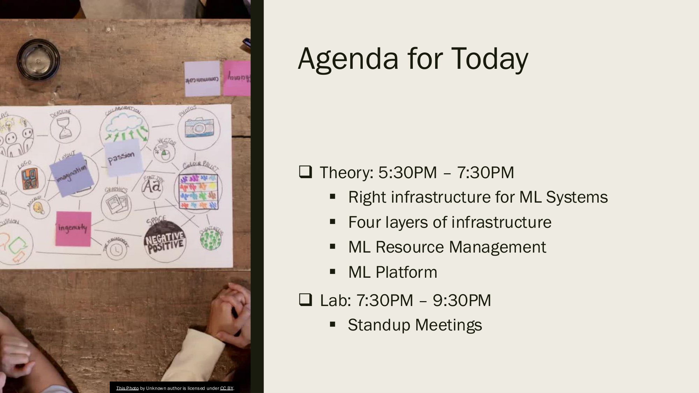

**Agenda for Today — 今日议程**

- ❑ Theory: 5:30PM – 7:30PM — 理论课：5:30PM – 7:30PM
  - ▪ Right infrastructure for ML Systems — ML 系统的正确基础设施
  - ▪ Four layers of infrastructure — 四层基础设施
  - ▪ ML Resource Management — ML 资源管理
  - ▪ ML Platform — ML 平台
- ❑ Lab: 7:30PM – 9:30PM — 实验课：7:30PM – 9:30PM
  - ▪ Standup Meetings — 站会

> **📝 Notes:**
>
> **承接**: 本节作为开篇，列出本周学习内容的整体框架（四层基础设施 + ML 资源管理 + ML 平台）；这些主题的概览将为下一节「基础设施需求概览」提供学习路径指引。

---

## 2. 基础设施需求概览 (Infrastructure Overview)

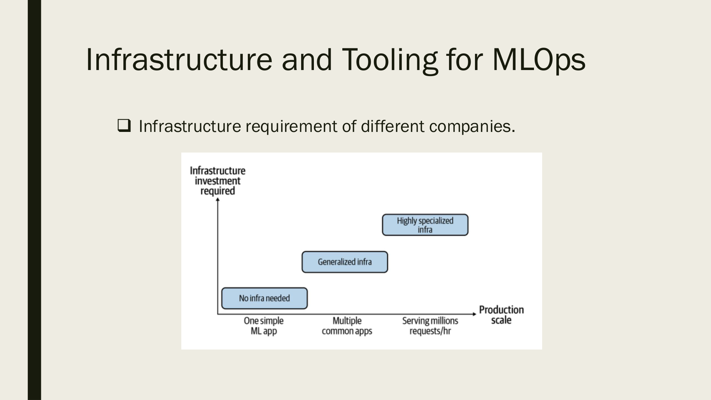

**Infrastructure and Tooling for MLOps — MLOps 的基础设施与工具**

- ❑ Infrastructure requirement of different companies. — 不同公司的基础设施需求。

> **📝 Notes:**
>
> **承接**: 上一节概述了本周的议程主题，本节引出核心问题——不同规模的公司对 ML 基础设施的需求差异；这为下一节「四层基础设施」的分层架构设计提供了现实动机。

---

## 3. 四层基础设施 (Four Layers of Infrastructure)

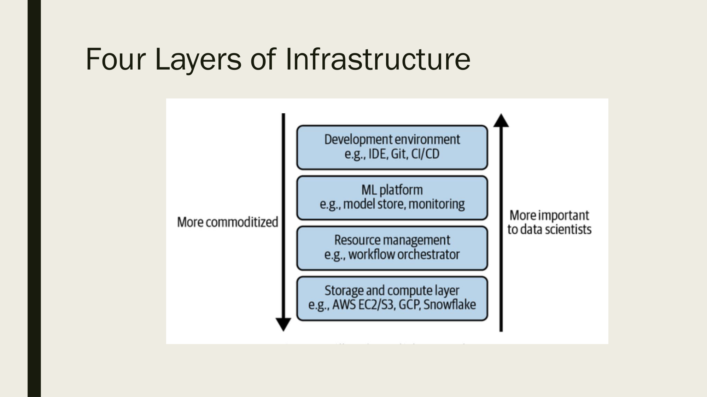

**Four Layers of Infrastructure — 四层基础设施（概览图）**

> 📖 **图解读笔记：**
>
> | 符号/区域 | 含义 |
> |-----------|------|
> | 底层 | Storage and Compute — 数据存储与计算资源 |
> | 第二层 | Resource Management — 工作流调度与编排 |
> | 第三层 | ML Platform — 模型/特征/部署工具集 |
> | 顶层 | Development Environment — 开发者工作环境 |
>
> **阅读顺序**：从底层向上看——底层是地基（存储计算），中间是管理层（调度编排 + 平台工具），顶层是开发者直接接触的环境。
>
> **人话解释**：ML 基础设施就像盖楼——先打地基（存数据、提供算力），再装水电（调度任务、分配资源），然后精装修（模型管理工具），最后入住（开发环境）。
>
> **考试关联**：画出四层架构图并说明每层职责是高频考点。

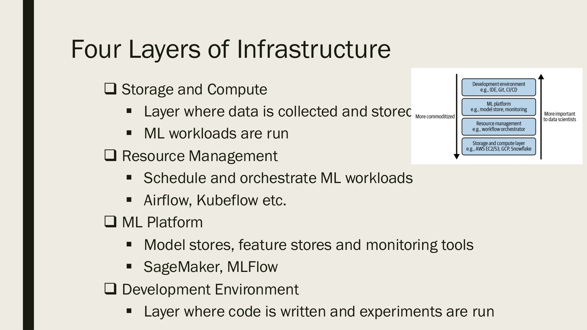

**Four Layers of Infrastructure — 四层基础设施（详细）**

- ❑ **Storage and Compute** — **存储与计算**
  - ▪ Layer where data is collected and stored — 数据收集和存储的层
  - ▪ ML workloads are run — ML 工作负载运行
- ❑ **Resource Management** — **资源管理**
  - ▪ Schedule and orchestrate ML workloads — 调度和编排 ML 工作负载
  - ▪ Airflow, Kubeflow etc. — Airflow、Kubeflow 等
- ❑ **ML Platform** — **ML 平台**
  - ▪ Model stores, feature stores and monitoring tools — 模型存储、特征存储和监控工具
  - ▪ SageMaker, MLFlow
- ❑ **Development Environment** — **开发环境**
  - ▪ Layer where code is written and experiments are run — 编写代码和运行实验的层

> **📝 Notes:**
>
> **承接**: 上一节提出了“不同公司有不同基础设施需求”的问题，本节给出四层分层架构作为通用解答框架；后续章节将逐层深入讲解每一层的具体内容，首先从最底层「存储与计算」开始。

---

## 4. 存储与计算层 (Storage and Compute Layer)

### 4.1 存储层 (Storage Layer)

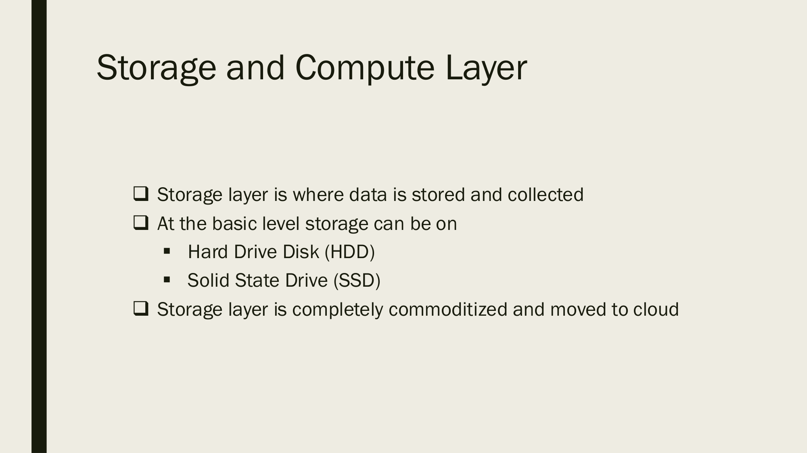

**Storage and Compute Layer — 存储与计算层（存储）**

- ❑ Storage layer is where data is stored and collected — 存储层是数据存储和收集的地方
- ❑ At the basic level storage can be on — 在基本层面，存储可以是
  - ▪ Hard Drive Disk (HDD) — 硬盘驱动器（HDD）
  - ▪ Solid State Drive (SSD) — 固态硬盘（SSD）
- ❑ Storage layer is completely commoditized and moved to cloud — 存储层已完全商品化并迁移到云端

### 4.2 计算层 (Compute Layer)

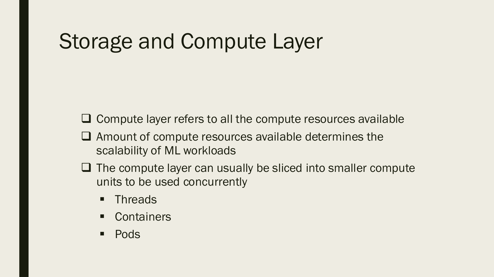

**Storage and Compute Layer — 存储与计算层（计算）**

- ❑ Compute layer refers to all the compute resources available — 计算层指所有可用的计算资源
- ❑ Amount of compute resources available determines the scalability of ML workloads — 可用计算资源的数量决定了 ML 工作负载的可扩展性
- ❑ The compute layer can usually be sliced into smaller compute units to be used concurrently — 计算层通常可以切分为更小的计算单元并发使用
  - ▪ Threads — 线程
  - ▪ Containers — 容器
  - ▪ Pods

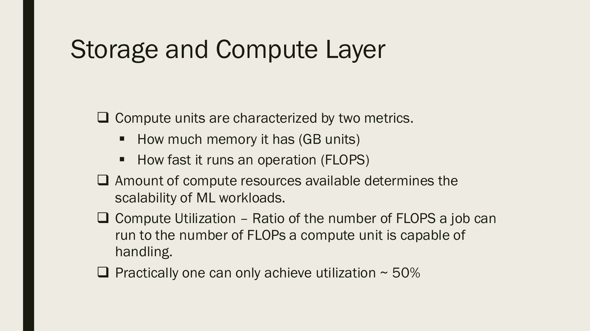

**Storage and Compute Layer — 存储与计算层（计算指标）**

- ❑ Compute units are characterized by two metrics — 计算单元由两个指标表征：
  - ▪ How much memory it has (GB units) — 有多少内存（GB 为单位）
  - ▪ How fast it runs an operation (FLOPS) — 运行操作有多快（FLOPS）
- ❑ **Compute Utilization** – Ratio of the number of FLOPS a job can run to the number of FLOPS a compute unit is capable of handling. — **计算利用率** – 作业能运行的 FLOPS 数与计算单元能处理的 FLOPS 数的比率。
- ❑ Practically one can only achieve utilization ~ 50% — 实际上只能达到约 50% 的利用率

### 4.3 云支出 (Cloud Spending)

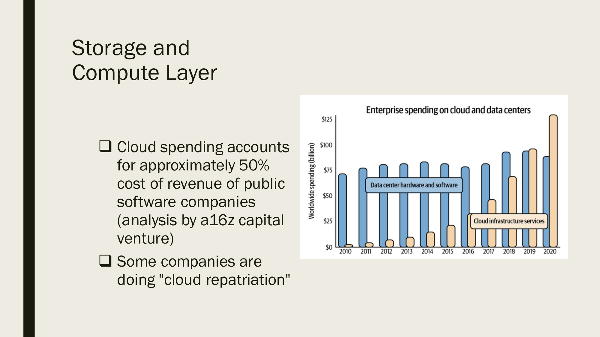

**Storage and Compute Layer — 存储与计算层（云支出）**

- ❑ Cloud spending accounts for approximately 50% cost of revenue of public software companies (analysis by a16z capital venture) — 云支出约占上市软件公司收入成本的 50%（a16z 风投分析）
- ❑ Some companies are doing "cloud repatriation" — 一些公司正在进行"云回迁"

> **📝 Notes:**
>
> **承接**: 本节深入第一层——存储与计算层（HDD/SSD、计算单元、FLOPS、计算利用率、云成本）；存储计算层作为“地基”，其成本和利用率问题将动机性地引出下一节「开发环境」中对容器化技术的需求。

---

## 5. 开发环境 (Development Environment)

### 5.1 环境组成 (Environment Components)

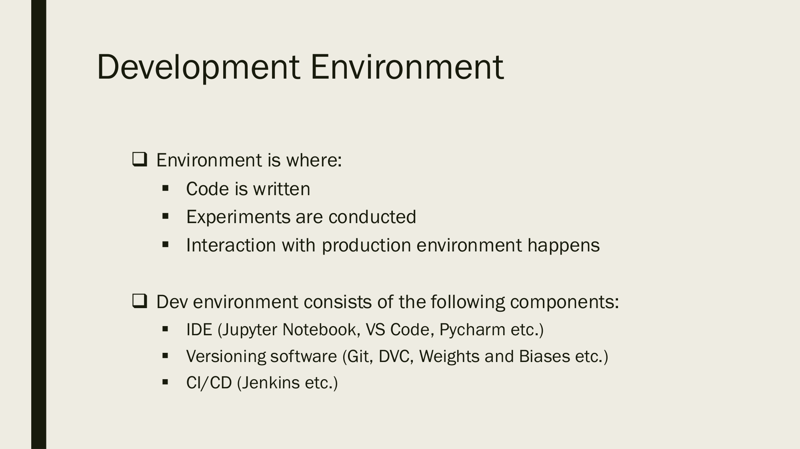

**Development Environment — 开发环境**

- ❑ Environment is where: — 环境是以下活动发生的地方：
  - ▪ Code is written — 编写代码
  - ▪ Experiments are conducted — 进行实验
  - ▪ Interaction with production environment happens — 与生产环境交互
- ❑ Dev environment consists of the following components — 开发环境包含以下组件：
  - ▪ IDE (Jupyter Notebook, VS Code, Pycharm etc.) — IDE（Jupyter Notebook、VS Code、PyCharm 等）
  - ▪ Versioning software (Git, DVC, Weights and Biases etc.) — 版本控制软件（Git、DVC、Weights and Biases 等）
  - ▪ CI/CD (Jenkins etc.) — CI/CD（Jenkins 等）

### 5.2 Notebooks

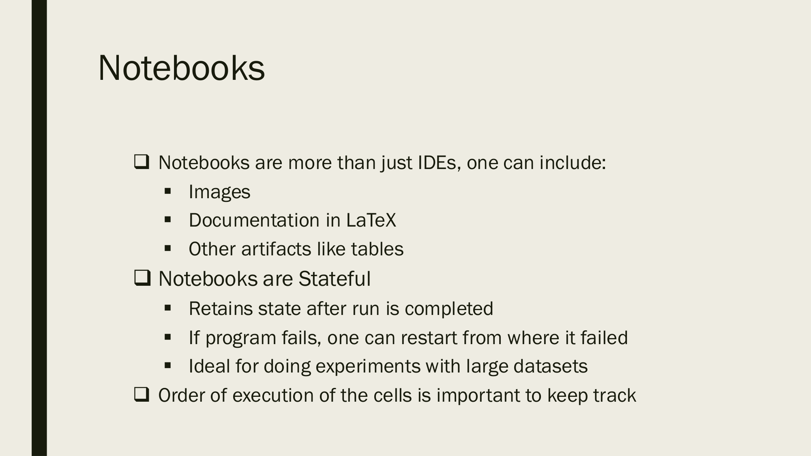

**Notebooks — Notebooks**

- ❑ Notebooks are more than just IDEs, one can include: — Notebook 不仅仅是 IDE，还可以包含：
  - ▪ Images — 图片
  - ▪ Documentation in LaTeX — LaTeX 文档
  - ▪ Other artifacts like tables — 其他内容如表格
- ❑ Notebooks are **Stateful** — Notebook 是**有状态的**
  - ▪ Retains state after run is completed — 运行完成后保留状态
  - ▪ If program fails, one can restart from where it failed — 如果程序失败，可以从失败处重新开始
  - ▪ Ideal for doing experiments with large datasets — 非常适合在大型数据集上进行实验
- ❑ Order of execution of the cells is important to keep track — 需要跟踪单元格的执行顺序

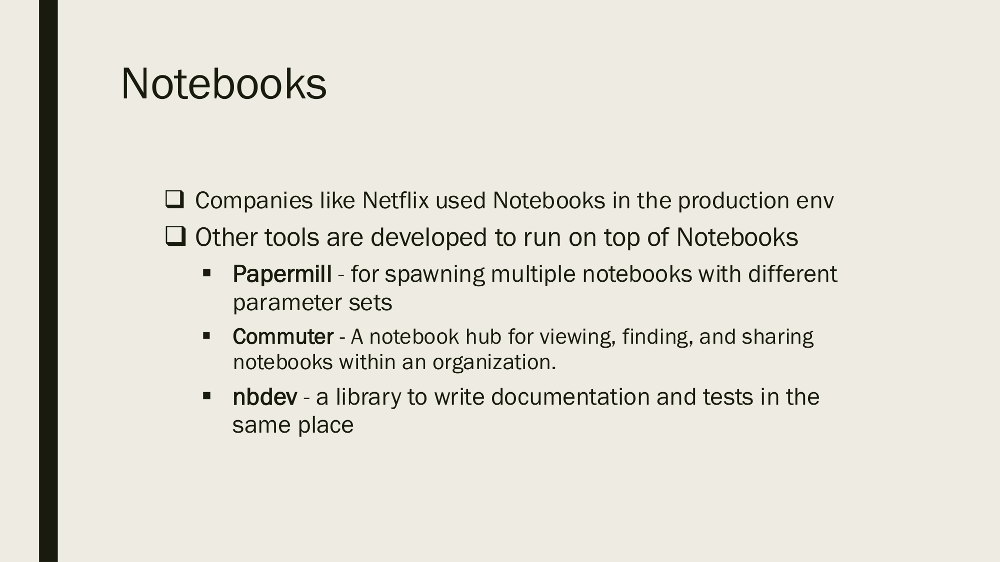

**Notebooks — Notebooks（生产环境应用）**

- ❑ Companies like Netflix used Notebooks in the production env — Netflix 等公司在生产环境中使用 Notebook
- ❑ Other tools are developed to run on top of Notebooks — 其他工具被开发出来在 Notebook 之上运行
  - ▪ **Papermill** - for spawning multiple notebooks with different parameter sets — **Papermill** - 用不同参数集生成多个 notebook
  - ▪ **Commuter** - A notebook hub for viewing, finding, and sharing notebooks within an organization. — **Commuter** - 组织内查看、查找和共享 notebook 的中心
  - ▪ **nbdev** - a library to write documentation and tests in the same place — **nbdev** - 在同一处编写文档和测试的库

> **📝 Notes:**
>
> **承接**: 本节介绍了开发环境层的组成（IDE、版本控制、CI/CD）和 Notebook 的有状态特性；Notebook 的生产化需求自然引出下一节对「容器和 Pod」的讨论——如何把开发环境打包到容器中实现一致性部署。

---

## 6. 容器与 Pod (Containers and Pods)

### 6.1 容器基础 (Container Basics)

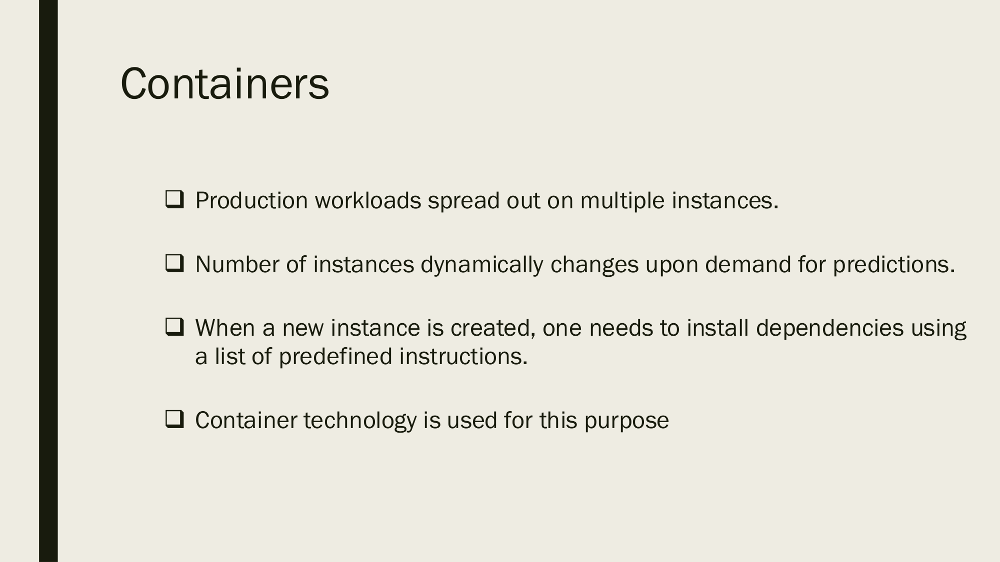

**Containers — 容器**

- ❑ Production workloads spread out on multiple instances. — 生产工作负载分布在多个实例上。
- ❑ Number of instances dynamically changes upon demand for predictions. — 实例数量根据预测需求动态变化。
- ❑ When a new instance is created, one needs to install dependencies using a list of predefined instructions. — 创建新实例时，需要使用预定义的指令列表安装依赖。
- ❑ Container technology is used for this purpose — 容器技术用于此目的

### 6.2 Docker 容器 (Docker Containers)

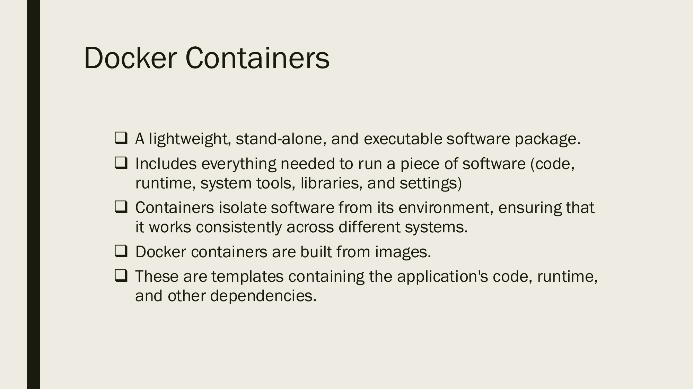

**Docker Containers — Docker 容器**

- ❑ A lightweight, stand-alone, and executable software package. — 轻量级、独立、可执行的软件包。
- ❑ Includes everything needed to run a piece of software (code, runtime, system tools, libraries, and settings) — 包含运行软件所需的一切（代码、运行时、系统工具、库和设置）
- ❑ Containers isolate software from its environment, ensuring that it works consistently across different systems. — 容器将软件与环境隔离，确保在不同系统上一致工作。
- ❑ Docker containers are built from images. — Docker 容器从镜像构建。
- ❑ These are templates containing the application's code, runtime, and other dependencies. — 这些是包含应用代码、运行时和其他依赖的模板。

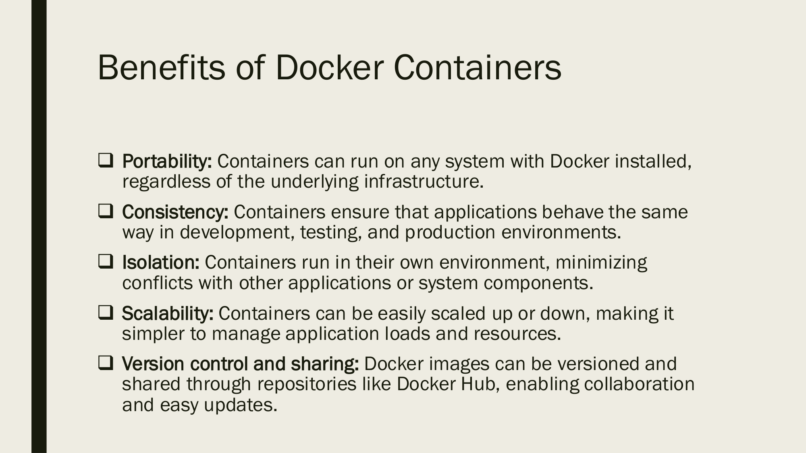

**Benefits of Docker Containers — Docker 容器的优点**

- ❑ **Portability**: Containers can run on any system with Docker installed. — **可移植性**：容器可以在安装了 Docker 的任何系统上运行。
- ❑ **Consistency**: Containers ensure that applications behave the same way in development, testing, and production environments. — **一致性**：容器确保应用在开发、测试和生产环境中行为一致。
- ❑ **Isolation**: Containers run in their own environment, minimizing conflicts with other applications. — **隔离性**：容器在自己的环境中运行，最小化与其他应用的冲突。
- ❑ **Scalability**: Containers can be easily scaled up or down. — **可扩展性**：容器可以轻松伸缩。
- ❑ **Version control and sharing**: Docker images can be versioned and shared through repositories like Docker Hub. — **版本控制和共享**：Docker 镜像可以通过 Docker Hub 等仓库进行版本控制和共享。

### 6.3 Docker 示例 (Docker Example)

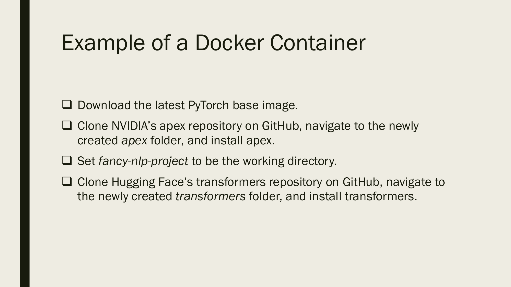

**Example of a Docker Container — Docker 容器示例（说明）**

- ❑ Download the latest PyTorch base image. — 下载最新的 PyTorch 基础镜像。
- ❑ Clone NVIDIA's apex repository on GitHub, navigate to the newly created apex folder, and install apex. — 克隆 NVIDIA 的 apex 仓库，导航到 apex 文件夹并安装。
- ❑ Set fancy-nlp-project to be the working directory. — 设置 fancy-nlp-project 为工作目录。
- ❑ Clone Hugging Face's transformers repository on GitHub and install transformers. — 克隆 Hugging Face 的 transformers 仓库并安装。

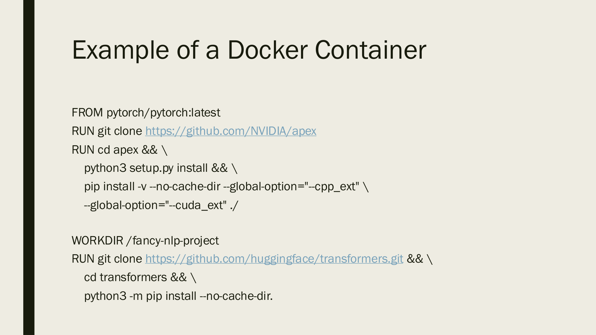

**Example of a Docker Container — Docker 容器示例（Dockerfile）**

```dockerfile
FROM pytorch/pytorch:latest
RUN git clone https://github.com/NVIDIA/apex
RUN cd apex && \
    python3 setup.py install && \
    pip install -v --no-cache-dir --global-option="--cpp_ext" \
    --global-option="--cuda_ext" ./
WORKDIR /fancy-nlp-project
RUN git clone https://github.com/huggingface/transformers.git && \
    cd transformers && \
    python3 -m pip install --no-cache-dir .
```

### 6.4 Kubernetes Pod

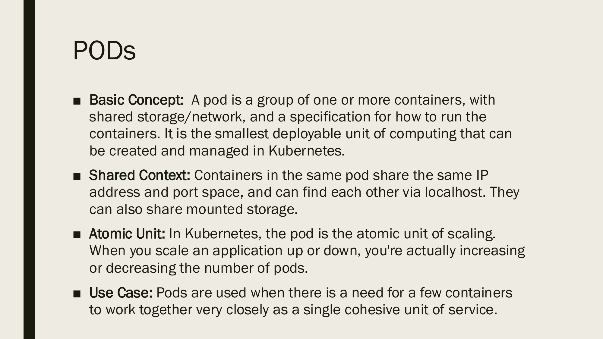

**PODs — Kubernetes Pod**

- ■ **Basic Concept**: A pod is a group of one or more containers, with shared storage/network. It is the smallest deployable unit in Kubernetes. — **基本概念**：Pod 是一个或多个容器的组合，共享存储/网络。它是 Kubernetes 中最小的可部署单元。
- ■ **Shared Context**: Containers in the same pod share the same IP address and port space, and can find each other via localhost. — **共享上下文**：同一 Pod 中的容器共享相同的 IP 地址和端口空间，可以通过 localhost 相互访问。
- ■ **Atomic Unit**: In Kubernetes, the pod is the atomic unit of scaling. — **原子单元**：在 Kubernetes 中，Pod 是扩展的原子单元。
- ■ **Use Case**: Pods are used when there is a need for a few containers to work together very closely as a single cohesive unit of service. — **使用场景**：当需要几个容器紧密协作作为一个内聚的服务单元时使用 Pod。

> **📝 Notes:**
>
> **承接**: 本节介绍了容器化技术——Docker 容器（隔离性、一致性、可移植性）和 Kubernetes Pod（容器组合、原子扩缩容单元）；容器和 Pod 是“运行环境的标准化单位”，它们将由下一节的「资源管理」层来调度和编排。

---

## 7. 资源管理 (Resource Management)

### 7.1 资源管理概述 (Overview)

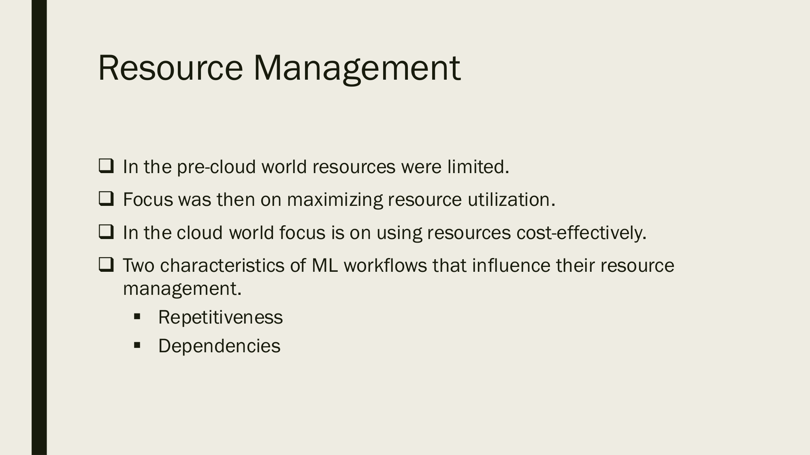

**Resource Management — 资源管理**

- ❑ In the pre-cloud world resources were limited. — 在前云时代，资源是有限的。
- ❑ Focus was then on maximizing resource utilization. — 重点是最大化资源利用率。
- ❑ In the cloud world focus is on using resources cost-effectively. — 在云时代，重点是以成本效益的方式使用资源。
- ❑ Two characteristics of ML workflows that influence their resource management — ML 工作流影响其资源管理的两个特征：
  - ▪ Repetitiveness — 重复性
  - ▪ Dependencies — 依赖性

### 7.2 调度器与编排器 (Schedulers and Orchestrators)

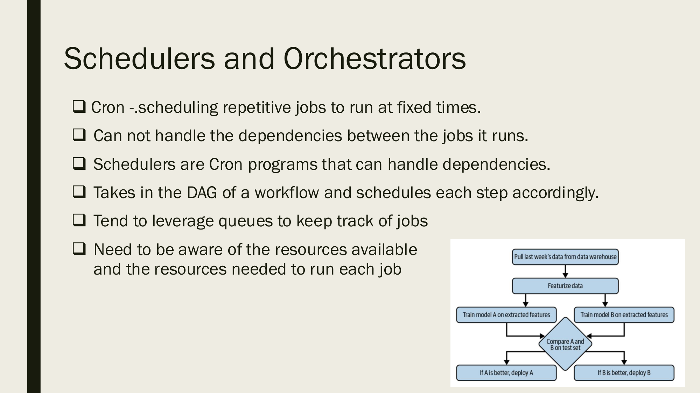

**Schedulers and Orchestrators — 调度器与编排器**

- ❑ **Cron** - scheduling repetitive jobs to run at fixed times. — **Cron** - 调度重复作业在固定时间运行。
- ❑ Can not handle the dependencies between the jobs it runs. — 无法处理其运行作业之间的依赖关系。
- ❑ **Schedulers** are Cron programs that can handle dependencies. — **调度器**是能处理依赖关系的 Cron 程序。
- ❑ Takes in the DAG of a workflow and schedules each step accordingly. — 接收工作流的 DAG 并相应地调度每个步骤。
- ❑ Tend to leverage queues to keep track of jobs — 倾向于使用队列来跟踪作业
- ❑ Need to be aware of the resources available and the resources needed to run each job — 需要了解可用资源和运行每个作业所需的资源

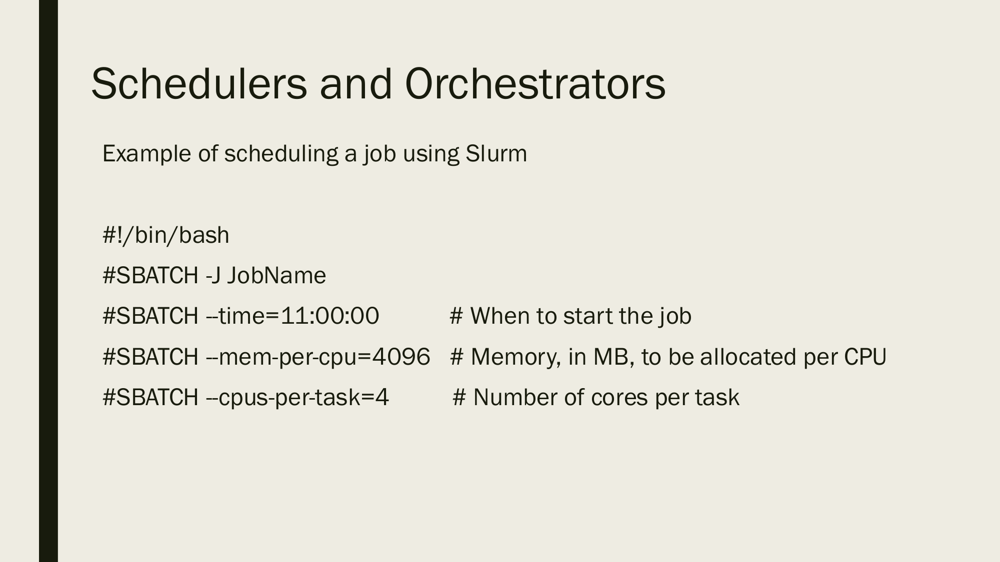

**Schedulers and Orchestrators — 调度器与编排器（Slurm 示例）**

- Example of scheduling a job using Slurm — 使用 Slurm 调度作业的示例

```bash
#!/bin/bash
#SBATCH -J JobName
#SBATCH --time=11:00:00           # When to start the job — 作业开始时间
#SBATCH --mem-per-cpu=4096        # Memory, in MB, per CPU — 每个 CPU 的内存（MB）
#SBATCH --cpus-per-task=4         # Number of cores per task — 每个任务的核心数
```

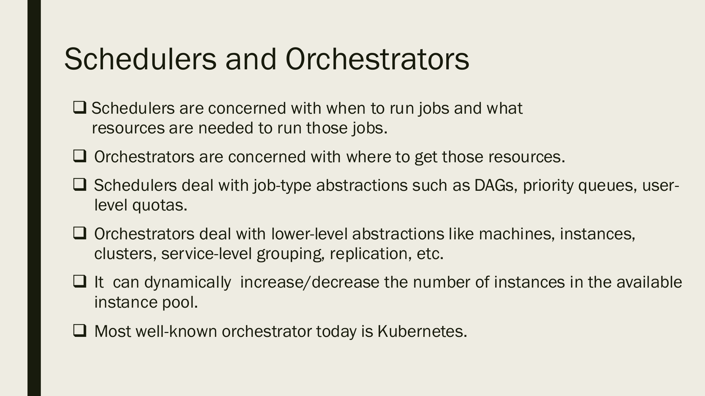

**Schedulers and Orchestrators — 调度器 vs 编排器的区别**

- ❑ Schedulers are concerned with **when** to run jobs and **what** resources are needed. — 调度器关注**何时**运行作业以及需要**什么**资源。
- ❑ Orchestrators are concerned with **where** to get those resources. — 编排器关注**在哪里**获取这些资源。
- ❑ Schedulers deal with job-type abstractions such as DAGs, priority queues, user-level quotas. — 调度器处理作业类型抽象，如 DAG、优先队列、用户级配额。
- ❑ Orchestrators deal with lower-level abstractions like machines, instances, clusters, service-level grouping, replication, etc. — 编排器处理更低层次的抽象，如机器、实例、集群、服务级分组、复制等。
- ❑ It can dynamically increase/decrease the number of instances in the available instance pool. — 可以动态增减可用实例池中的实例数量。
- ❑ Most well-known orchestrator today is **Kubernetes**. — 当今最知名的编排器是 **Kubernetes**。

### 7.3 工作流管理 (Workflow Management)

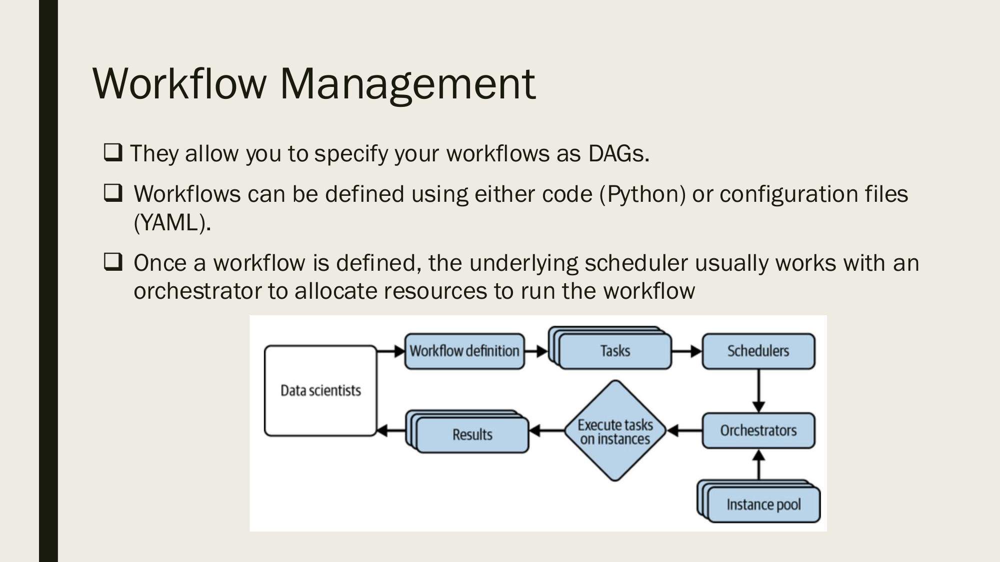

**Workflow Management — 工作流管理**

- ❑ They allow you to specify your workflows as DAGs. — 允许您将工作流指定为 DAG。
- ❑ Workflows can be defined using either code (Python) or configuration files (YAML). — 工作流可以使用代码（Python）或配置文件（YAML）定义。
- ❑ Once a workflow is defined, the underlying scheduler usually works with an orchestrator to allocate resources to run the workflow — 工作流定义后，底层调度器通常与编排器协作分配资源来运行工作流

### 7.4 Airflow

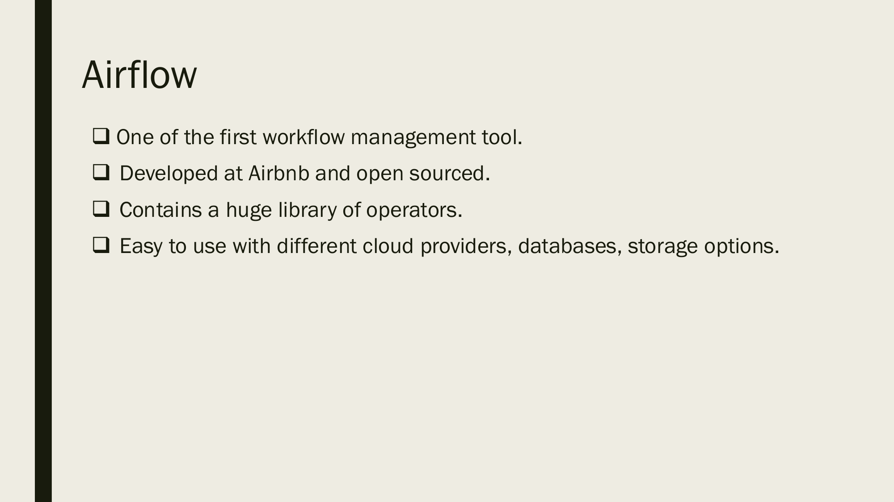

**Airflow — Airflow**

- ❑ One of the first workflow management tools. — 最早的工作流管理工具之一。
- ❑ Developed at Airbnb and open sourced. — 由 Airbnb 开发并开源。
- ❑ Contains a huge library of operators. — 包含大量的操作算子库。
- ❑ Easy to use with different cloud providers, databases, storage options. — 易于与不同的云提供商、数据库、存储选项配合使用。

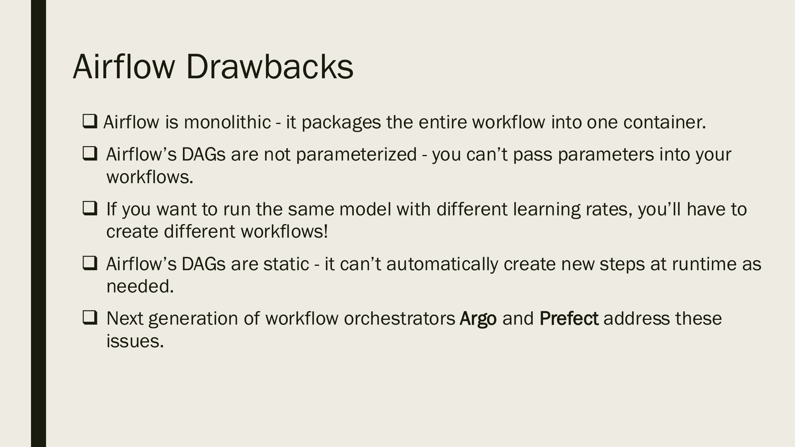

**Airflow Drawbacks — Airflow 的缺点**

- ❑ Airflow is **monolithic** - it packages the entire workflow into one container. — Airflow 是**单体的** - 它将整个工作流打包到一个容器中。
- ❑ Airflow's DAGs are **not parameterized** - you can't pass parameters into your workflows. — Airflow 的 DAG 是**不可参数化的** - 不能向工作流传递参数。
- ❑ If you want to run the same model with different learning rates, you'll have to create different workflows! — 如果你想用不同的学习率运行同一个模型，必须创建不同的工作流！
- ❑ Airflow's DAGs are **static** - it can't automatically create new steps at runtime as needed. — Airflow 的 DAG 是**静态的** - 不能在运行时按需自动创建新步骤。
- ❑ Next generation of workflow orchestrators **Argo** and **Prefect** address these issues. — 下一代工作流编排器 **Argo** 和 **Prefect** 解决了这些问题。

> **📝 Notes:**
>
> **承接**: 本节讲解了资源管理层——从 Cron 到调度器到编排器的演进、DAG 工作流管理、Airflow 的优缺点；资源管理层解决了“任务怎么跑”的问题，但还缺少“模型怎么管”的能力→ 引出下一节「ML 平台」。

---

## 8. ML 平台 (ML Platform)

### 8.1 ML 平台概述 (Overview)

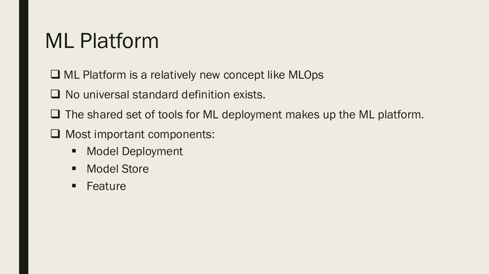

**ML Platform — ML 平台**

- ❑ ML Platform is a relatively new concept like MLOps — ML 平台是与 MLOps 类似的相对较新的概念
- ❑ No universal standard definition exists. — 没有通用的标准定义。
- ❑ The shared set of tools for ML deployment makes up the ML platform. — ML 部署的共享工具集构成了 ML 平台。
- ❑ Most important components — 最重要的组件：
  - ▪ Model Deployment — 模型部署
  - ▪ Model Store — 模型存储
  - ▪ Feature Store — 特征存储

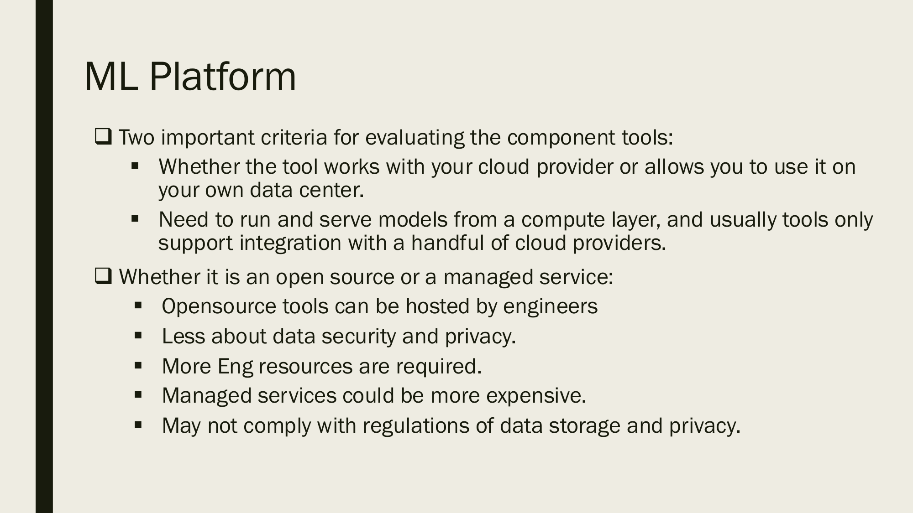

**ML Platform — ML 平台（评估标准）**

- ❑ Two important criteria for evaluating the component tools — 评估组件工具的两个重要标准：
  - ▪ Whether the tool works with your cloud provider or allows you to use it on your own data center. — 工具是否与你的云提供商兼容或允许在自己的数据中心使用。
  - ▪ Need to run and serve models from a compute layer, usually tools only support integration with a handful of cloud providers. — 需要从计算层运行和服务模型，通常工具仅支持与少数云提供商集成。
- ❑ Whether it is an open source or a managed service — 是否是开源还是托管服务：
  - ▪ Opensource tools can be hosted by engineers — 开源工具可由工程师托管
  - ▪ Less about data security and privacy. — 数据安全和隐私方面的担忧较少。
  - ▪ More Eng resources are required. — 需要更多工程资源。
  - ▪ Managed services could be more expensive. — 托管服务可能更贵。
  - ▪ May not comply with regulations of data storage and privacy. — 可能不符合数据存储和隐私法规。

### 8.2 模型部署服务 (Model Deployment)

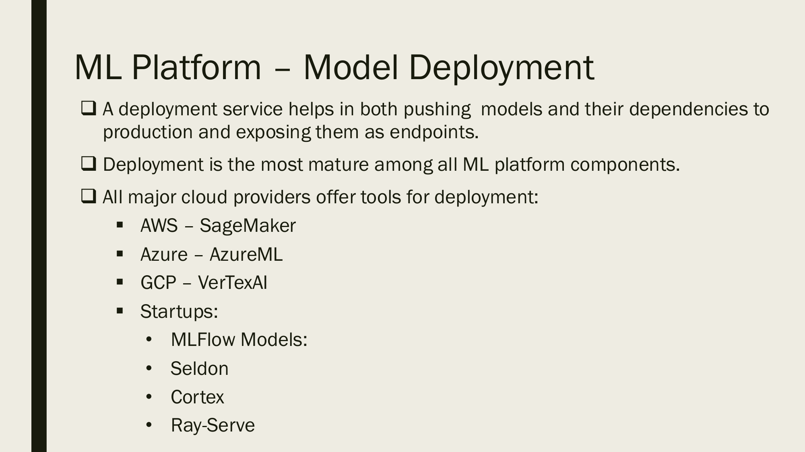

**ML Platform – Model Deployment — ML 平台 — 模型部署**

- ❑ A deployment service helps in both pushing models and their dependencies to production and exposing them as endpoints. — 部署服务帮助将模型及其依赖推送到生产环境并将其暴露为端点。
- ❑ Deployment is the most mature among all ML platform components. — 部署是所有 ML 平台组件中最成熟的。
- ❑ All major cloud providers offer tools for deployment — 所有主要云提供商都提供部署工具：
  - ▪ AWS – SageMaker
  - ▪ Azure – AzureML
  - ▪ GCP – VertexAI
  - ▪ Startups: MLFlow Models, Seldon, Cortex, Ray-Serve — 创业公司：MLFlow Models、Seldon、Cortex、Ray-Serve

### 8.3 模型存储 (Model Store)

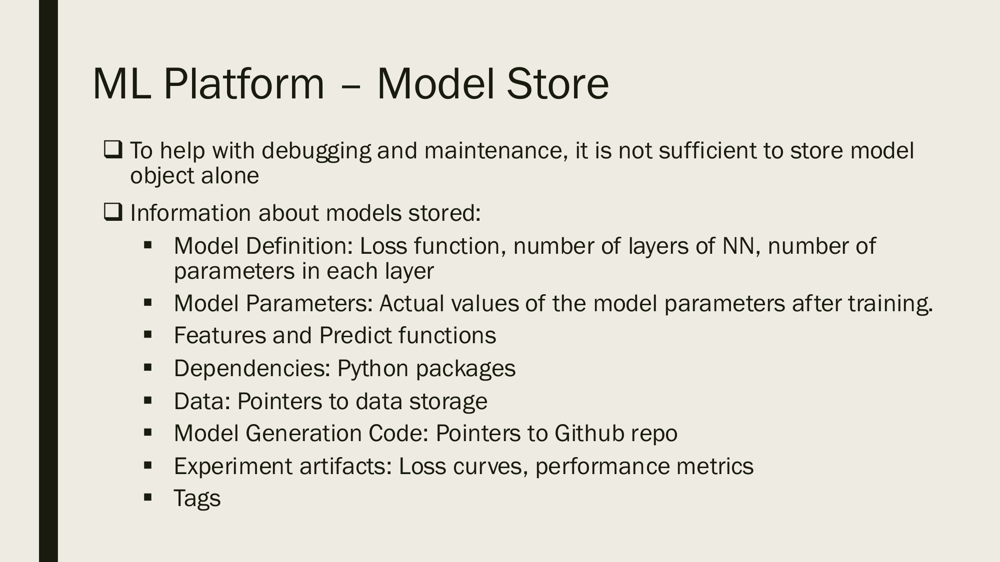

**ML Platform – Model Store — ML 平台 — 模型存储**

- ❑ To help with debugging and maintenance, it is not sufficient to store model object alone — 为了帮助调试和维护，仅存储模型对象是不够的
- ❑ Information about models stored — 存储的模型信息：
  - ▪ **Model Definition**: Loss function, number of layers of NN, number of parameters in each layer — **模型定义**：损失函数、NN 层数、每层参数数
  - ▪ **Model Parameters**: Actual values of the model parameters after training. — **模型参数**：训练后模型参数的实际值。
  - ▪ **Features and Predict functions** — **特征和预测函数**
  - ▪ **Dependencies**: Python packages — **依赖**：Python 包
  - ▪ **Data**: Pointers to data storage — **数据**：指向数据存储的指针
  - ▪ **Model Generation Code**: Pointers to Github repo — **模型生成代码**：指向 GitHub 仓库的指针
  - ▪ **Experiment artifacts**: Loss curves, performance metrics — **实验产物**：损失曲线、性能指标
  - ▪ **Tags** — **标签**

### 8.4 特征存储 (Feature Store)

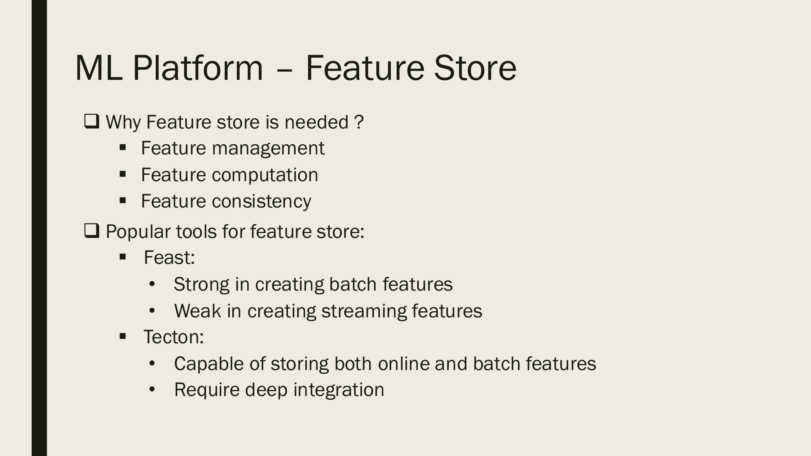

**ML Platform – Feature Store — ML 平台 — 特征存储**

- ❑ Why Feature store is needed? — 为什么需要特征存储？
  - ▪ Feature management — 特征管理
  - ▪ Feature computation — 特征计算
  - ▪ Feature consistency — 特征一致性
- ❑ Popular tools for feature store — 流行的特征存储工具：
  - ▪ **Feast**: — **Feast**：
    - Strong in creating batch features — 擅长创建批量特征
    - Weak in creating streaming features — 不擅长创建流式特征
  - ▪ **Tecton**: — **Tecton**：
    - Capable of storing both online and batch features — 能够存储在线和批量特征
    - Require deep integration — 需要深度集成

> **📝 Notes:**
>
> **承接**: 本节介绍了 ML 平台层的三大核心组件——模型部署、模型存储、特征存储；ML 平台是四层架构的第三层，加上前面的存储计算、资源管理、开发环境，共同构成 MLOps 完整基础设施。

---

## 9. 今日学习总结 (Summary of Today's Learning)

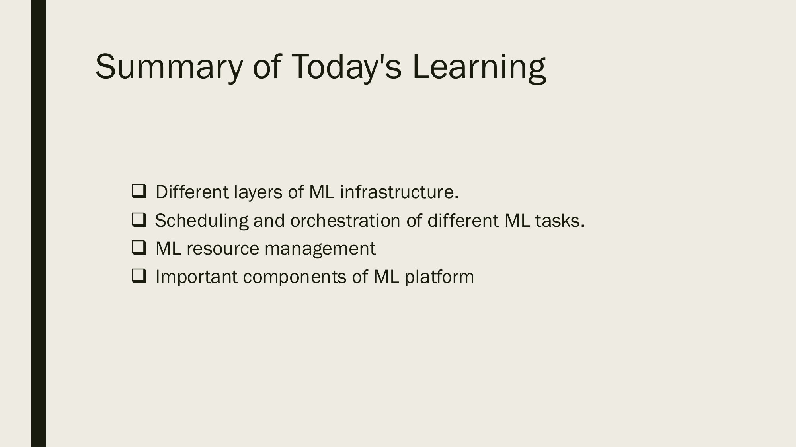

**Summary of Today's Learning — 今日学习总结**

- ❑ Different layers of ML infrastructure. — ML 基础设施的不同层次。
- ❑ Scheduling and orchestration of different ML tasks. — 不同 ML 任务的调度和编排。
- ❑ ML resource management — ML 资源管理
- ❑ Important components of ML platform — ML 平台的重要组件
