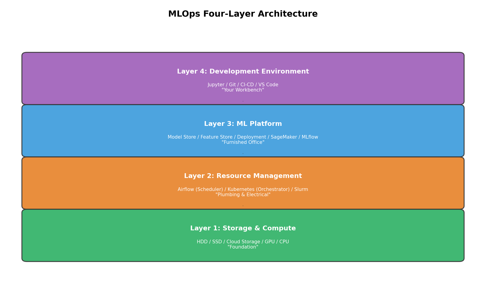
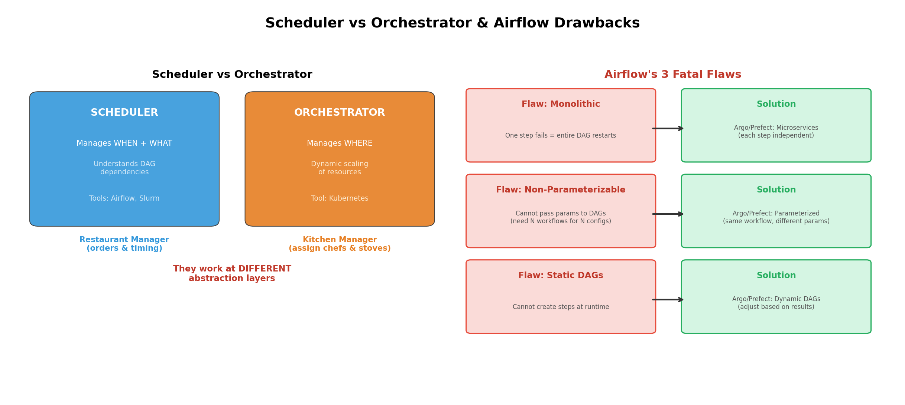

# Week 7 故事线：MLOps 基础设施——从"能跑模型"到"能上线服务"

> **Source:** `Week7-Lecture1.pdf`
> **核心主题：** 一个 ML 模型从 Notebook 里"能跑"到生产环境里"能用"，中间需要多少层基础设施？
> **故事线：** 盖一栋 ML 大楼——地基（存储计算） → 入住（开发环境） → 打包搬家（容器化） → 水电管道（资源调度） → 精装修（ML 平台）

---

## 🎬 序幕：我们在解决什么问题？

你训练了一个 ML 模型，在 Jupyter Notebook 里效果很好。然后呢？

- **数据存哪？** 训练数据 50GB，模型权重 2GB，存本地硬盘？还是云上？
- **怎么让别人用？** 同事想调用你的模型，你总不能让他打开你的 Notebook 跑一遍吧？
- **多人同时训练怎么办？** 团队里 5 个人都要用 GPU，谁先来？
- **模型更新了怎么办？** 旧模型下线、新模型上线，怎么无缝切换？

> 💡 **核心洞察：** 从"模型能跑"到"模型能上线服务"，中间隔的不是一行代码——而是**一整栋基础设施大楼**。

本周的答案是一个 **四层架构**：

| 层次 | 核心问题 | 一句话 |
|------|---------|--------|
| ① Storage & Compute（存储与计算） | 数据放哪？算力从哪来？ | 地基 |
| ② Resource Management（资源管理） | 多个任务怎么排队？ | 水电管道 |
| ③ ML Platform（ML 平台） | 模型/特征/部署怎么管？ | 精装修 |
| ④ Development Environment（开发环境） | 在哪写代码？ | 入住 |



接下来，我们从地基开始，一层一层盖起来。

---

## 📚 第一章：地基——存储与计算层 (Storage & Compute)

### 1.1 为什么先讲存储？

> 🔑 **没有存储就没有数据，没有数据就没有 ML。**

存储是最基础的需求。ML 系统需要存储的东西远比你想的多：

- 原始数据（图片、文本、日志）
- 处理后的特征数据
- 模型权重文件
- 实验日志和指标

### 1.2 存储的选择

存储介质只有两种基本类型：

| 存储类型 | 速度 | 成本 | 适合场景 |
|---------|------|------|---------|
| **HDD**（机械硬盘） | 慢 | 便宜 | 冷数据归档 |
| **SSD**（固态硬盘） | 快 | 贵 | 热数据访问 |

但在实际中，存储层已经**完全商品化并迁移到云端**——你不需要自己买硬盘，直接用 AWS S3、Azure Blob、GCP Cloud Storage。

### 1.3 计算层：算力从哪来？

计算层的核心任务：**提供 GPU/CPU 算力跑 ML 工作负载**。

计算资源可以被切分为不同粒度的单元并发使用：

```
计算资源的三种切分方式：
┌──────────────────────────────────┐
│  物理机器 (Physical Machine)      │
│  ├── 线程 (Threads)              │ ← 最细粒度，共享内存空间
│  ├── 容器 (Containers)           │ ← 隔离的运行环境
│  └── Pods                        │ ← K8s 调度单元，容器的"组队"
└──────────────────────────────────┘
```

### 1.4 关键概念：计算利用率 (Compute Utilization)

每个计算单元由两个指标衡量：

- **内存 (Memory)**：有多少 GB——决定能装多大的模型
- **算力 (FLOPS)**：每秒浮点运算次数——决定跑得多快

**Compute Utilization = 作业实际使用的 FLOPS / 计算单元最大 FLOPS 能力**

> 💡 **类比：** 就像一辆车最高时速 200km/h，但因为红灯、堵车、弯道等原因，实际平均只有 100km/h。计算利用率就是这个比值——理论上 100%，实际只有 **~50%**。

这意味着你付了 100% 的云费用，但只用到了 50% 的算力。

### 1.5 云成本的现实

- 云支出约占上市软件公司**收入成本的 50%**（a16z 风投分析）
- 因为成本太高，一些公司开始 **"云回迁" (Cloud Repatriation)**——把工作负载从公有云搬回自有数据中心

> 🔑 **故事转折点：** 地基打好了——数据有地方存，算力有地方来。但问题来了：开发者在哪里写代码、做实验？直接 SSH 到服务器上？不行，我们需要一个像样的**开发环境**！

---

## 📖 第二章：入住——开发环境 (Development Environment)

### 2.1 开发者的三大工具

开发环境是 ML 工程师每天"住"的地方，由三个核心组件构成：

| 组件 | 功能 | 代表工具 |
|------|------|---------| 
| **IDE** | 写代码、调试 | Jupyter Notebook, VS Code, PyCharm |
| **版本控制** | 跟踪代码/数据/模型变更 | Git, DVC, Weights & Biases |
| **CI/CD** | 自动化测试和部署 | Jenkins, GitHub Actions |

### 2.2 Notebook 的特殊地位

Notebook 不是普通的 IDE。它最大的特点是**有状态 (Stateful)**：

- ✅ 运行完成后**保留状态**——变量、数据都在内存中
- ✅ 程序中断后**可从断点恢复**——大数据集实验的"存档点"
- ✅ 可嵌入图片、LaTeX、表格——代码 + 文档一体化
- ⚠️ **需要跟踪单元格执行顺序**——乱序执行会导致隐蔽 bug

> 💡 **关键事实：** Netflix 在**生产环境**中使用 Notebook，不只是实验工具。

### 2.3 Notebook 的工具生态

为了让 Notebook 更强大，围绕它发展出了一系列工具：

| 工具 | 功能 | 一句话解释 |
|------|------|-----------| 
| **Papermill** | 参数化执行 | 同一个 Notebook 自动跑 N 组超参数 |
| **Commuter** | 共享平台 | 团队内查看、搜索、共享 Notebook |
| **nbdev** | 文档+测试 | 代码、文档、测试写在同一个 Notebook 里 |

> 🔑 **故事转折点：** 开发环境搭好了，实验也做了。但新问题来了——模型在你的笔记本上能跑，在同事的机器上就报错。部署到服务器上？依赖冲突！版本不对！→ 我们需要**容器化**来解决环境一致性问题！

---

## 🎭 第三章：打包搬家——容器与 Docker (Containers)

### 3.1 经典问题："在我电脑上能跑啊！"

生产环境最头疼的问题就是**环境不一致**：

- 开发时用 Python 3.9，服务器上是 3.7
- 本地装了 CUDA 11.8，服务器是 12.0
- 依赖包版本不同导致微妙的行为差异

解决方案：**把整个运行环境打包成一个"集装箱"**——Docker 容器。

### 3.2 Docker 容器是什么？

**Docker 容器 = 一个轻量级、独立、可执行的软件包**

它包含运行软件所需的一切：
- 代码
- 运行时 (runtime)
- 系统工具
- 库和依赖
- 配置文件

容器从 **Docker 镜像 (Image)** 构建——镜像就是"配方"，容器是"做出来的菜"。

### 3.3 Dockerfile 实战

一个真实的 NLP 项目 Dockerfile：

```dockerfile
FROM pytorch/pytorch:latest          # 基础镜像：PyTorch
RUN git clone https://github.com/NVIDIA/apex
RUN cd apex && \
    python3 setup.py install && \
    pip install -v --no-cache-dir \
    --global-option="--cpp_ext" \
    --global-option="--cuda_ext" ./  # 安装 NVIDIA 混合精度训练库
WORKDIR /fancy-nlp-project           # 设置工作目录
RUN git clone https://github.com/huggingface/transformers.git && \
    cd transformers && \
    python3 -m pip install --no-cache-dir .  # 安装 HuggingFace
```

> 💡 **读法：** 从上到下就是一步步搭建环境的过程——先选基础镜像，再装依赖，最后设置工作目录。任何人拿到这个 Dockerfile 都能构建出完全相同的环境。

### 3.4 Docker 的五大优势

| 优势 | 含义 | ML 场景 |
|------|------|---------|
| **Portability（可移植性）** | 一次构建，到处运行 | 本地训练 → 云端部署，无需修改 |
| **Consistency（一致性）** | 开发/测试/生产行为相同 | 告别"在我机器上能跑" |
| **Isolation（隔离性）** | 容器间互不干扰 | 多个模型版本可并行运行 |
| **Scalability（可扩展性）** | 一键伸缩容 | 流量高峰时自动扩容 |
| **Version Control（版本控制）** | 镜像可版本化共享 | 通过 Docker Hub 分享环境 |

### 3.5 Pod：容器的"组队"

单个容器有时不够——一个 ML 服务可能需要多个容器协作：

```
Kubernetes Pod 结构：
┌─────────────────────────────────┐
│  Pod（最小部署单元）             │
│  ├── Container A (Model API)    │  ← 模型推理服务
│  ├── Container B (Logging)      │  ← 日志收集
│  └── 共享存储 & 网络             │  ← 通过 localhost 通信
└─────────────────────────────────┘
```

**关键概念：**

- Pod 中的容器**共享 IP 地址和端口空间**
- 容器间可通过 **localhost** 互相访问
- Pod 是 Kubernetes 扩缩容的**原子单元**——你增减的不是容器，而是 Pod

> 🔑 **故事转折点：** 有了容器和 Pod，环境一致性问题解决了。但新问题来了——你有 100 个容器化的 ML 任务，8 台 GPU 服务器，谁先跑？谁等着？任务之间有依赖怎么办？→ 我们需要**资源管理层**来调度！

---

## 🏆 第四章：水电管道——资源管理层 (Resource Management)

### 4.1 ML 工作流的两个特点

ML 工作流与普通软件不同，有两个影响资源管理的关键特征：

| 特征 | 含义 | 例子 |
|------|------|------|
| **重复性 (Repetitiveness)** | 同类任务反复运行 | 每天重新训练模型 |
| **依赖性 (Dependencies)** | 任务之间有先后顺序 | 数据清洗 → 特征工程 → 训练 |

### 4.2 从 Cron 到调度器：依赖关系的挑战

最原始的调度工具是 **Cron**——在固定时间运行任务。

但 Cron 有致命缺陷：**不理解任务间的依赖关系**。

> 💡 **例子：** ML Pipeline 是：数据清洗(1h) → 特征工程(30min) → 训练(2h)。如果用 Cron 设定每个任务在固定时间跑，万一数据清洗还没完，特征工程就开始了——垃圾输入垃圾输出！

**调度器 (Scheduler)** = 升级版 Cron——它理解 **DAG（有向无环图）**，知道 B 必须等 A 完成。

### 4.3 调度器 vs 编排器：容易混淆的关键区分

| 维度 | 调度器 (Scheduler) | 编排器 (Orchestrator) |
|------|:------------------:|:--------------------:|
| 关心什么 | **When** + **What** | **Where** |
| 核心问题 | 何时运行？需要什么资源？ | 从哪里获取这些资源？ |
| 抽象层级 | 高层：DAG、优先队列、用户配额 | 底层：机器、实例、集群、副本 |
| 代表工具 | Slurm, Airflow | **Kubernetes** |
| 动态能力 | 按 DAG 调度 | 动态增减实例池大小 |



> 💡 **比喻：** 调度器 = 餐厅经理（安排顾客点菜顺序），编排器 = 厨房主管（调配厨师和灶台）。

### 4.4 Slurm 示例：声明式资源请求

```bash
#!/bin/bash
#SBATCH -J JobName            # 作业名称
#SBATCH --time=11:00:00       # 运行时间上限
#SBATCH --mem-per-cpu=4096    # 每 CPU 4GB 内存
#SBATCH --cpus-per-task=4     # 每任务 4 个核
```

> 💡 **关键洞察：** 你只需"声明"需要什么，调度器自动排队分配。这种**声明式 (declarative)** 风格也是 Kubernetes 的设计哲学。

### 4.5 工作流管理 (Workflow Management)

工作流管理工具允许你把整个 ML Pipeline 定义为 DAG：

- 用 **Python 代码**定义（如 Airflow）
- 或用 **YAML 配置文件**定义（如 Argo）
- 定义完后，调度器 + 编排器协作分配资源执行

### 4.6 Airflow：第一代的教训

**Airflow** 由 Airbnb 开发开源，是最早的工作流管理工具之一。

**优点：** 庞大的算子库、易于与各种云服务集成

**三大致命缺陷：**

| 缺陷 | 含义 | 后果 |
|------|------|------|
| **单体架构 (Monolithic)** | 整个工作流打包在一个容器中 | 一个步骤失败，全部重启 |
| **不可参数化 (Not Parameterized)** | 无法向 DAG 传递参数 | 试不同学习率？创建 N 个工作流！ |
| **静态 DAG (Static)** | 运行时不能动态创建新步骤 | 无法根据中间结果自动调整后续步骤 |

新一代编排器 **Argo** 和 **Prefect** 解决了这三个问题。

> 🔑 **故事转折点：** 资源管理解决了"任务怎么跑"的问题。但还有更高层的需求没解决——模型都部署了怎么管理？50 个模型版本怎么追踪？训练和推理的特征不一致怎么办？→ 我们需要**ML 平台**！

---

## 🏅 第五章：精装修——ML 平台 (ML Platform)

### 5.1 为什么需要 ML 平台？

有了存储、计算、调度、开发环境，模型可以训练和部署了。但新问题不断涌现：

- 部署了 50 个模型版本，哪个在线？哪个是最好的？
- 训练时用的特征和推理时用的特征不一致，结果对不上？
- 模型回滚到旧版本，相关的依赖、参数怎么恢复？

> 🔑 **ML 平台 = ML 模型全生命周期管理的"精装修"工具集**

三大核心组件：

```
┌──────────────────────────────────────────┐
│  ML Platform 三大核心组件                 │
│                                          │
│  ① Model Deployment（模型部署）          │
│     → 推送到生产 + 暴露 API 端点         │
│                                          │
│  ② Model Store（模型存储）               │
│     → 管理模型的"身份证"（元数据）        │
│                                          │
│  ③ Feature Store（特征存储）             │
│     → 保证训练和推理特征 100% 一致        │
└──────────────────────────────────────────┘
```

### 5.2 选型时的两个关键维度

| 维度 | 选项 A | 选项 B |
|------|--------|--------|
| **云兼容性** | 支持你的云服务商 ✅ | 仅支持特定云 ⚠️ |
| **开源 vs 托管** | 开源（自控，需工程资源） | 托管（省心但贵，可能有合规问题） |

### 5.3 模型部署 (Model Deployment)

**最成熟的 ML 平台组件**——将模型推送到生产环境并暴露为 API 端点。

| 云提供商 | 部署工具 |
|---------|---------|
| AWS | **SageMaker** |
| Azure | **AzureML** |
| GCP | **VertexAI** |
| 初创公司 | MLFlow Models, Seldon, Cortex, Ray-Serve |

### 5.4 模型存储 (Model Store)

仅存储 `model.pt` 权重文件远远不够。一个完整的模型存储需要 **8 类元数据**：

| 元数据 | 内容 | 为什么需要 |
|--------|------|-----------|
| **Model Definition** | 损失函数、层数、每层参数数 | 重现实验 |
| **Model Parameters** | 训练后的参数值 | 加载推理 |
| **Features & Predict** | 特征化和预测函数 | 保证推理一致 |
| **Dependencies** | Python 包版本 | 环境重现 |
| **Data** | 数据存储指针 | 数据溯源 |
| **Model Gen Code** | GitHub 仓库指针 | 代码审计 |
| **Experiment Artifacts** | 损失曲线、性能指标 | 对比模型 |
| **Tags** | 标签 | 检索定位 |

> 💡 **记忆口诀：** "**定参函依数码品标**"——定义、参数、函数、依赖、数据、代码、制品、标签

### 5.5 特征存储 (Feature Store)

特征存储解决三个核心问题：

| 问题 | 含义 |
|------|------|
| **Feature Management（管理）** | 特征太多怎么组织？ |
| **Feature Computation（计算）** | 特征计算逻辑怎么复用？ |
| **Feature Consistency（一致性）** | 训练和推理用的特征怎么保证完全一致？ |

> 💡 **为什么一致性很关键？** 如果训练时用的是"过去7天平均消费"，推理时却用了"过去30天平均消费"——模型的预测完全不可信！Feature Store 通过统一管理计算逻辑来杜绝这种问题。

两大工具对比：

| 工具 | 优势 | 劣势 |
|------|------|------|
| **Feast** | 擅长批量特征 (batch) | 流式特征 (streaming) 弱 |
| **Tecton** | 同时支持在线和批量特征 | 需要深度集成 |

---

## 🗺️ 全局回顾：技术演进路线图

```
┌──────────────────────────────────────────────────────────────┐
│  ML 基础设施四层架构 — 从"能跑模型"到"能上线服务"             │
│                                                              │
│  Layer 1: Storage & Compute（地基）                          │
│  ✅ 解决：数据存储 + 算力提供                                │
│  ❌ 问题：开发者在哪里写代码做实验？                         │
│           │                                                  │
│           ▼                                                  │
│  Layer 4: Development Environment（入住）                    │
│  ✅ 解决：IDE + 版本控制 + CI/CD + Notebook 生态             │
│  ❌ 问题：模型在我机器上能跑，别人机器上不行？               │
│           │                                                  │
│           ▼                                                  │
│  容器化技术（打包搬家）                                      │
│  ✅ 解决：Docker 容器 + K8s Pod → 环境一致性                 │
│  ❌ 问题：100 个容器化任务，8 台 GPU，谁先跑？               │
│           │                                                  │
│           ▼                                                  │
│  Layer 2: Resource Management（水电管道）                    │
│  ✅ 解决：Cron → Scheduler → Orchestrator → 工作流管理       │
│  ❌ 问题：模型/特征/部署怎么管理？                           │
│           │                                                  │
│           ▼                                                  │
│  Layer 3: ML Platform（精装修）                              │
│  ✅ 解决：模型部署 + 模型存储 + 特征存储                     │
│                                                              │
│  完整链路：                                                  │
│  存储计算 → 开发环境 → 容器化 → 资源调度 → ML 平台           │
│  (地基)    (入住)    (搬家)   (管道)     (装修)               │
└──────────────────────────────────────────────────────────────┘
```

### 关键概念对比总结

| 从 → 到 | 解决了什么核心问题？ |
|---------|---------------------|
| 本地存储 → 云存储 | 存储商品化，无需自建机房 |
| 本地开发 → Notebook | 有状态、可嵌入文档/图片、支持断点恢复 |
| "在我机器上能跑" → Docker | 环境一致性、可移植性、隔离性 |
| 单容器 → Pod | 多容器协作 + K8s 原子扩缩容 |
| Cron → Scheduler | 加入 DAG 依赖关系 |
| Scheduler → Orchestrator | 从"管时间"到"管资源位置" |
| Airflow → Argo/Prefect | 解决单体、静态、不可参数化三缺陷 |
| 手动管理 → ML Platform | 模型/特征/部署的全生命周期管理 |

---

## 📝 考试/复习重点检查清单

- [ ] 能画出四层架构图并说明每层的职责
- [ ] 能解释 **Compute Utilization** 的公式和实际意义（~50%）
- [ ] 能区分 **HDD vs SSD** 的适用场景
- [ ] 能列举开发环境的三大组件（IDE、版本控制、CI/CD）
- [ ] 能解释 Notebook 的 **Stateful** 特性及其优势
- [ ] 能说出 **Papermill / Commuter / nbdev** 各自的功能
- [ ] 能解释 Docker 容器的五大优势（Portability, Consistency, Isolation, Scalability, Version Control）
- [ ] 能读懂一个简单的 **Dockerfile**
- [ ] 能解释 **Pod** 在 Kubernetes 中的角色（原子扩缩容单元、共享 IP 和端口空间）
- [ ] 能区分 **Scheduler vs Orchestrator**（When/What vs Where）
- [ ] 能读懂一个简单的 **Slurm** 脚本
- [ ] 能列举 Airflow 的三大缺陷（单体 / 不可参数化 / 静态 DAG）
- [ ] 能说出 ML Platform 的三大核心组件（Model Deployment / Model Store / Feature Store）
- [ ] 能列举 Model Store 需要存储的 **8 类元数据**
- [ ] 能对比 **Feast vs Tecton** 的特征存储能力
- [ ] 能说出选型的两个关键维度（云兼容性、开源 vs 托管）

---

## 📚 参考资料

- [Week7_slides.md](Week7_slides.md) — 原始 slides 格式化笔记
- Course: CST8510 Artificial Intelligence Software Development
- Textbook reference: Chip Huyen, *Designing Machine Learning Systems* (O'Reilly, 2022)
