# Week 9: MLOps 基础设施与工具 (Infrastructure and Tooling for MLOps)

> Source: `CSI-CST8510-Week9.pptx`
> Total slides: 32
> Instructor: Dr. Hari M Koduvely

---

## 1. 课程议程 (Agenda)


**ARTIFICIAL INTELLIGENCE SOFTWARE DEVELOPMENT — 人工智能软件开发**

- CST8510 Week 9

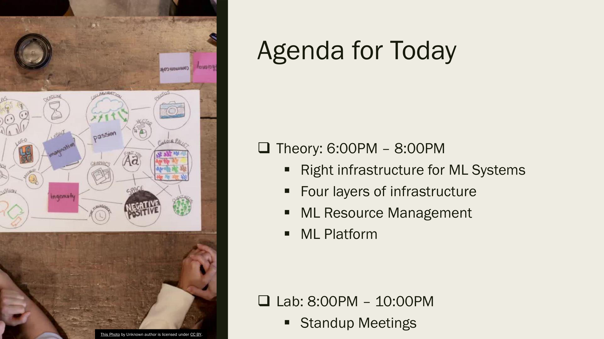

**Agenda for Today — 今日议程**

- ❑ Theory: 6:00PM – 8:00PM — 理论课：6:00PM – 8:00PM
  - Right infrastructure for ML Systems — ML 系统的合适基础设施
  - Four layers of infrastructure — 基础设施的四个层次
  - ML Resource Management — ML 资源管理
  - ML Platform — ML 平台
- ❑ Lab: 8:00PM – 10:00PM — 实验课：8:00PM – 10:00PM
  - Standup Meetings — 站会

---

## 2. ML 基础设施四层架构 (Four Layers of Infrastructure)

### 2.1 总览 (Overview)

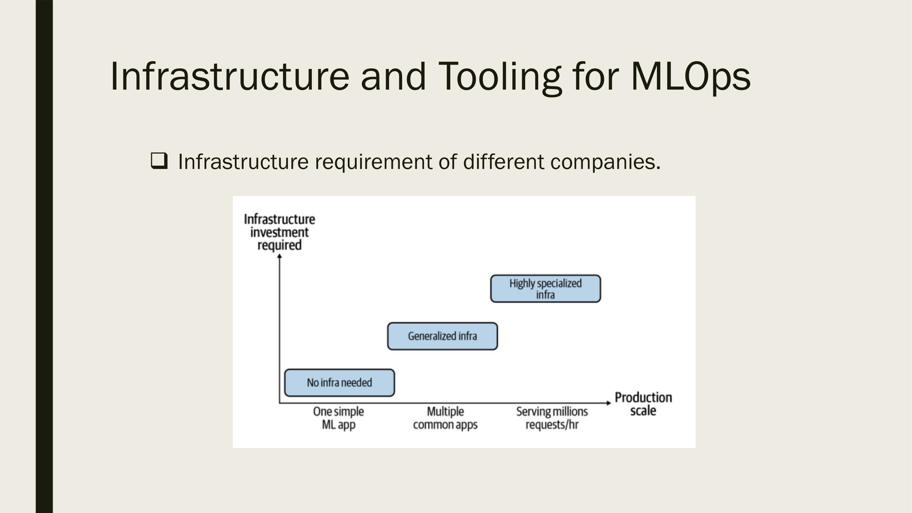

**Infrastructure and Tooling for MLOps — MLOps 的基础设施与工具**

- ❑ Infrastructure requirement of different companies. — 不同公司的基础设施需求各不相同。

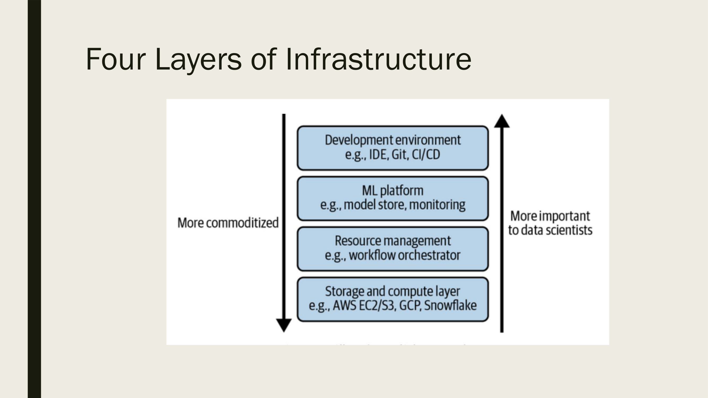

**Four Layers of Infrastructure — 基础设施的四个层次**

> 📖 **图解读笔记：**
>
> | 元素 Element | 含义 Meaning |
> |------|------|
> | 底层 Bottom Layer | Storage and Compute — 存储与计算层 |
> | 第二层 2nd Layer | Resource Management — 资源管理层 |
> | 第三层 3rd Layer | ML Platform — ML 平台层 |
> | 顶层 Top Layer | Development Environment — 开发环境层 |
>
> **阅读顺序 Reading order**：从底层向上阅读，底层提供基础资源，上层消费下层的服务。Read bottom-up; lower layers provide resources consumed by upper layers.
> **人话解释**：整个 ML 系统就像一栋楼——地基是存储和计算资源，二层是调度管理，三层是模型/特征等工具平台，顶层是开发者日常写代码和做实验的环境。

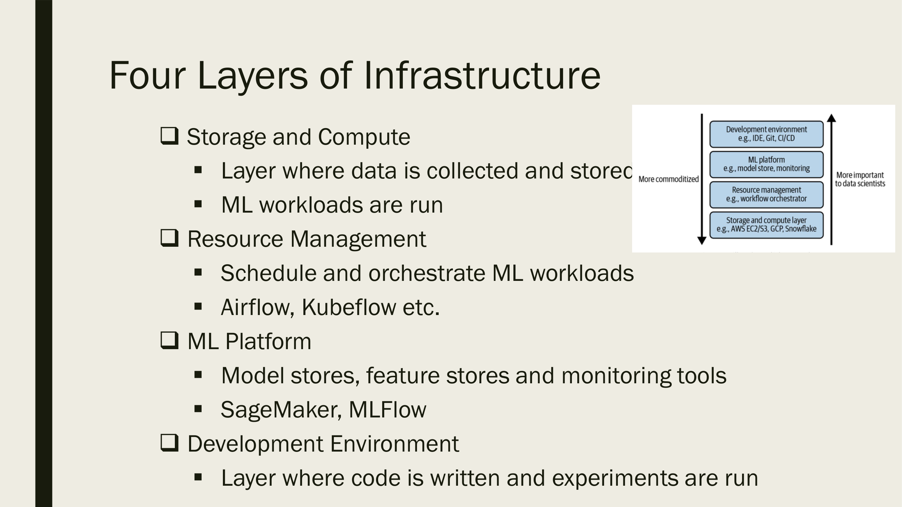

**Four Layers of Infrastructure — 基础设施的四个层次**

- ❑ **Storage and Compute** — **存储与计算层**
  - Layer where data is collected and stored — 数据收集和存储的层
  - ML workloads are run — ML 工作负载在此运行
- ❑ **Resource Management** — **资源管理层**
  - Schedule and orchestrate ML workloads — 调度和编排 ML 工作流
  - Airflow, Kubeflow etc. — 如 Airflow、Kubeflow 等工具
- ❑ **ML Platform** — **ML 平台层**
  - Model stores, feature stores and monitoring tools — 模型存储、特征存储和监控工具
  - SageMaker, MLFlow — 如 SageMaker、MLFlow
- ❑ **Development Environment** — **开发环境层**
  - Layer where code is written and experiments are run — 编写代码和运行实验的层

---

## 3. 存储与计算层 (Storage and Compute Layer)

### 3.1 存储层 (Storage Layer)

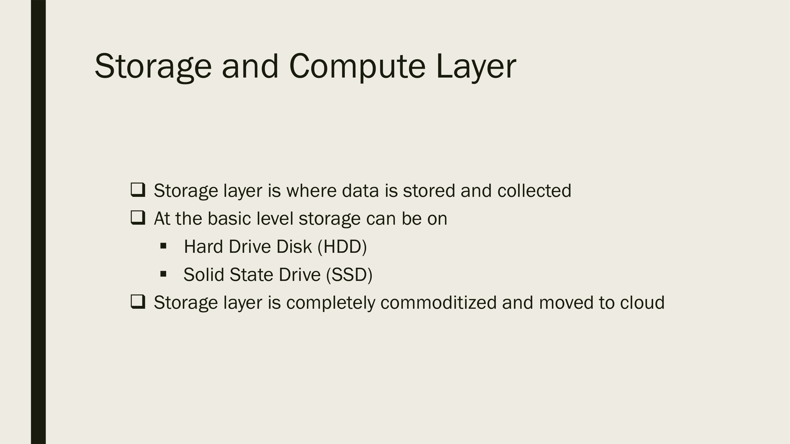

**Storage and Compute Layer — 存储与计算层**

- ❑ Storage layer is where data is stored and collected — 存储层是数据收集和存储的地方
- ❑ At the basic level storage can be on — 最基础的存储可以是：
  - Hard Drive Disk (HDD) — 机械硬盘
  - Solid State Drive (SSD) — 固态硬盘
- ❑ Storage layer is completely commoditized and moved to cloud — 存储层已完全商品化并迁移到云端

### 3.2 计算层 (Compute Layer)

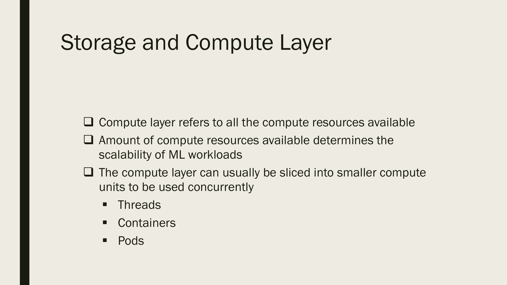

**Storage and Compute Layer — 存储与计算层**

- ❑ Compute layer refers to all the compute resources available — 计算层指所有可用的计算资源
- ❑ Amount of compute resources available determines the scalability of ML workloads — 可用计算资源量决定了 ML 工作负载的可扩展性
- ❑ The compute layer can usually be sliced into smaller compute units to be used concurrently — 计算层通常可以切分为更小的计算单元并发使用：
  - Threads — 线程
  - Containers — 容器
  - Pods — Pod 集群单元

### 3.3 计算指标 (Compute Metrics)

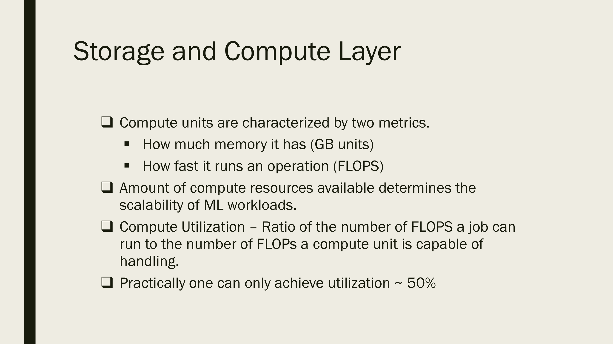

**Storage and Compute Layer — 存储与计算层**

- ❑ Compute units are characterized by two metrics. — 计算单元由两个指标衡量：
  - How much memory it has (GB units) — 内存容量（GB 为单位）
  - How fast it runs an operation (FLOPS) — 运算速度（每秒浮点运算次数）
- ❑ Amount of compute resources available determines the scalability of ML workloads. — 可用计算资源量决定了 ML 工作负载的可扩展性。
- ❑ **Compute Utilization** – Ratio of the number of FLOPS a job can run to the number of FLOPs a compute unit is capable of handling. — **计算利用率** = 作业实际 FLOPS / 计算单元最大 FLOPS 能力
- ❑ Practically one can only achieve utilization ~ 50% — 实际中通常只能达到约 50% 的利用率

### 3.4 云成本 (Cloud Cost)

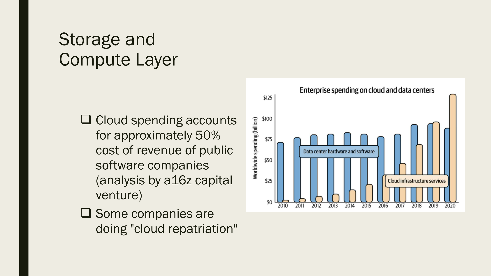

**Storage and Compute Layer — 存储与计算层**

- ❑ Cloud spending accounts for approximately 50% cost of revenue of public software companies (analysis by a16z capital venture) — 云端支出约占上市软件公司收入成本的 50%（a16z 风投分析数据）
- ❑ Some companies are doing "cloud repatriation" — 部分公司正在进行"云回迁"（将工作负载从公有云迁回自有数据中心以降低成本）

---

## 4. 开发环境 (Development Environment)

### 4.1 概述 (Overview)

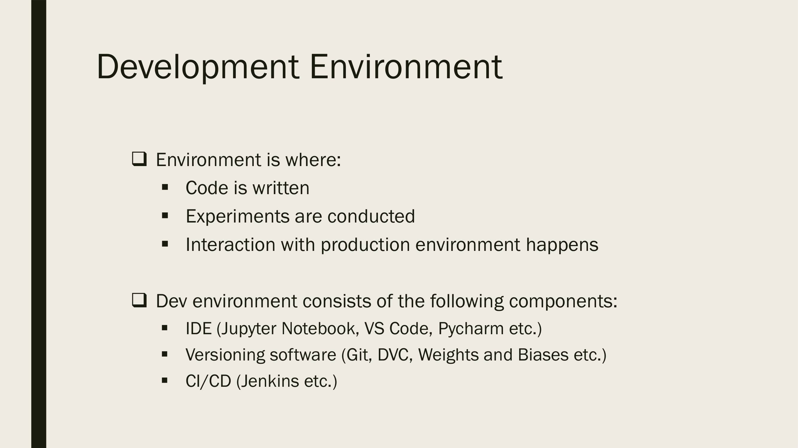

**Development Environment — 开发环境**

- ❑ Environment is where: — 开发环境用于：
  - Code is written — 编写代码
  - Experiments are conducted — 进行实验
  - Interaction with production environment happens — 与生产环境交互
- ❑ Dev environment consists of the following components: — 开发环境由以下组件组成：
  - IDE (Jupyter Notebook, VS Code, Pycharm etc.) — 集成开发环境
  - Versioning software (Git, DVC, Weights and Biases etc.) — 版本控制工具
  - CI/CD (Jenkins etc.) — 持续集成/持续部署

### 4.2 Notebooks

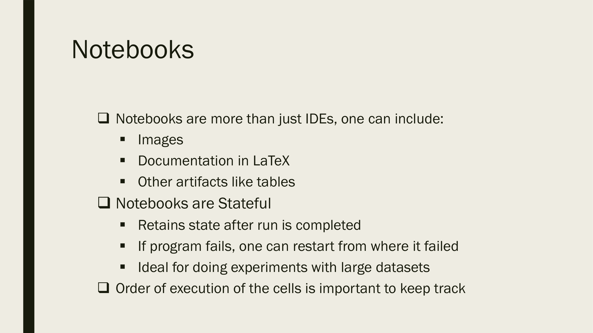

**Notebooks — Notebook 笔记本环境**

- ❑ Notebooks are more than just IDEs, one can include: — Notebook 不仅仅是 IDE，还可以包含：
  - Images — 图像
  - Documentation in LaTeX — LaTeX 文档
  - Other artifacts like tables — 表格等其他制品
- ❑ Notebooks are Stateful — Notebook 是有状态的
  - Retains state after run is completed — 运行完成后保留状态
  - If program fails, one can restart from where it failed — 程序失败可从断点恢复
  - Ideal for doing experiments with large datasets — 适合大数据集实验
- ❑ Order of execution of the cells is important to keep track — cell 执行顺序很重要，需要跟踪管理

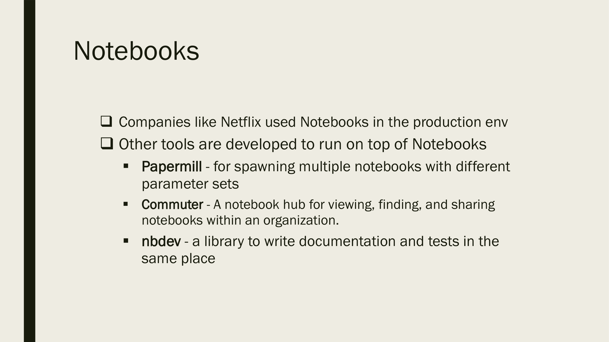

**Notebooks — Notebook 工具生态**

- ❑ Companies like Netflix used Notebooks in the production env — Netflix 等公司在生产环境中使用 Notebook
- ❑ Other tools are developed to run on top of Notebooks: — 基于 Notebook 开发的其他工具：
  - **Papermill** - for spawning multiple notebooks with different parameter sets — 用于参数化批量运行 Notebook
  - **Commuter** - A notebook hub for viewing, finding, and sharing notebooks within an organization. — 组织内 Notebook 共享平台
  - **nbdev** - a library to write documentation and tests in the same place — 在同一处编写文档和测试的库

### 4.3 容器 (Containers)

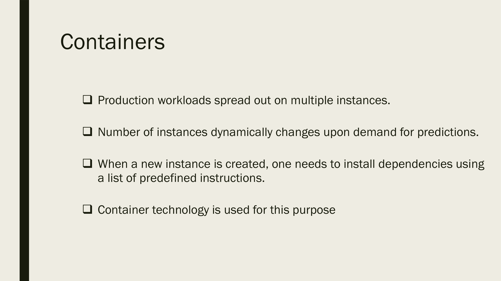

**Containers — 容器**

- ❑ Production workloads spread out on multiple instances. — 生产工作负载分布在多个实例上。
- ❑ Number of instances dynamically changes upon demand for predictions. — 实例数量根据预测需求动态变化。
- ❑ When a new instance is created, one needs to install dependencies using a list of predefined instructions. — 创建新实例时需要按预定义指令安装依赖。
- ❑ Container technology is used for this purpose — 容器技术就是为此目的而生的

### 4.4 Docker 容器 (Docker Containers)

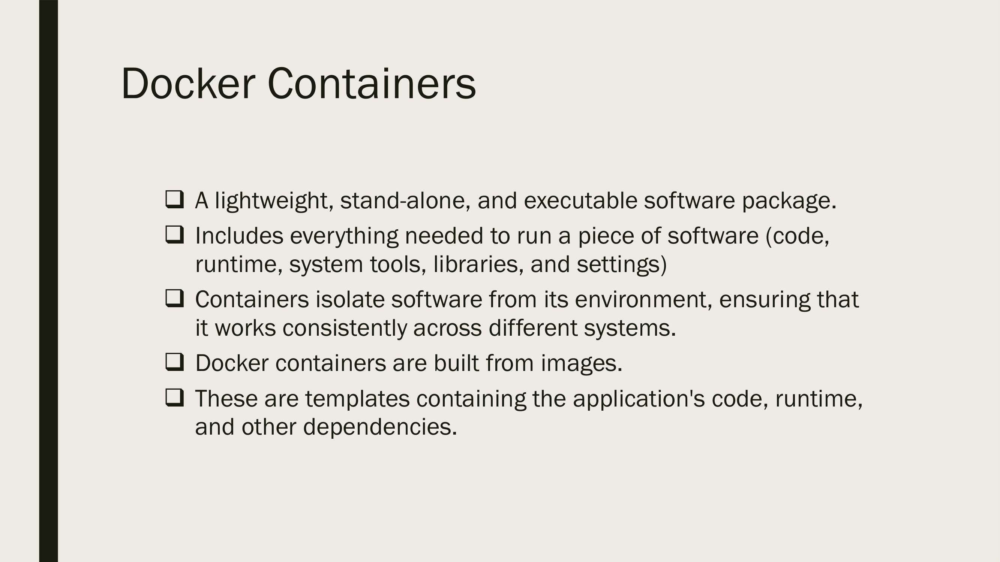

**Docker Containers — Docker 容器**

- ❑ A lightweight, stand-alone, and executable software package. — 轻量级、独立的可执行软件包。
- ❑ Includes everything needed to run a piece of software (code, runtime, system tools, libraries, and settings) — 包含运行软件所需的一切（代码、运行时、系统工具、库和设置）
- ❑ Containers isolate software from its environment, ensuring that it works consistently across different systems. — 容器将软件与环境隔离，确保在不同系统上一致运行。
- ❑ Docker containers are built from images. — Docker 容器由镜像（images）构建。
- ❑ These are templates containing the application's code, runtime, and other dependencies. — 镜像是包含应用代码、运行时和其他依赖的模板。

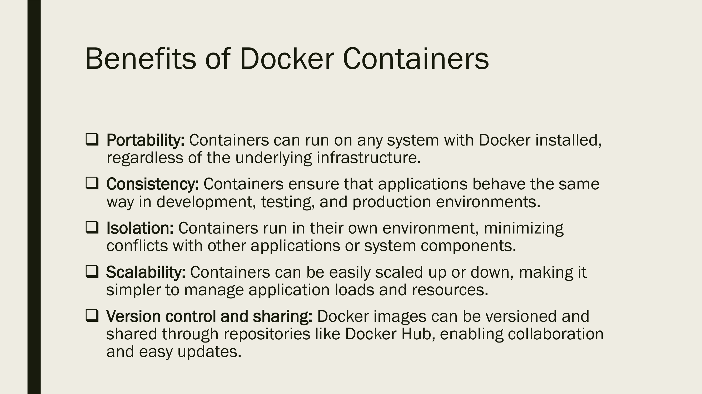

**Benefits of Docker Containers — Docker 容器的优势**

- ❑ **Portability:** Containers can run on any system with Docker installed, regardless of the underlying infrastructure. — **可移植性：** 容器可在任何安装了 Docker 的系统上运行，不受底层基础设施限制。
- ❑ **Consistency:** Containers ensure that applications behave the same way in development, testing, and production environments. — **一致性：** 容器确保应用在开发、测试和生产环境中行为一致。
- ❑ **Isolation:** Containers run in their own environment, minimizing conflicts with other applications or system components. — **隔离性：** 容器在自己的环境中运行，最大限度减少与其他应用或系统组件的冲突。
- ❑ **Scalability:** Containers can be easily scaled up or down, making it simpler to manage application loads and resources. — **可扩展性：** 容器可以轻松扩缩容，简化应用负载和资源管理。
- ❑ **Version control and sharing:** Docker images can be versioned and shared through repositories like Docker Hub, enabling collaboration and easy updates. — **版本控制与共享：** Docker 镜像可通过 Docker Hub 等仓库进行版本管理和共享。

### 4.5 Docker 容器示例 (Example of a Docker Container)

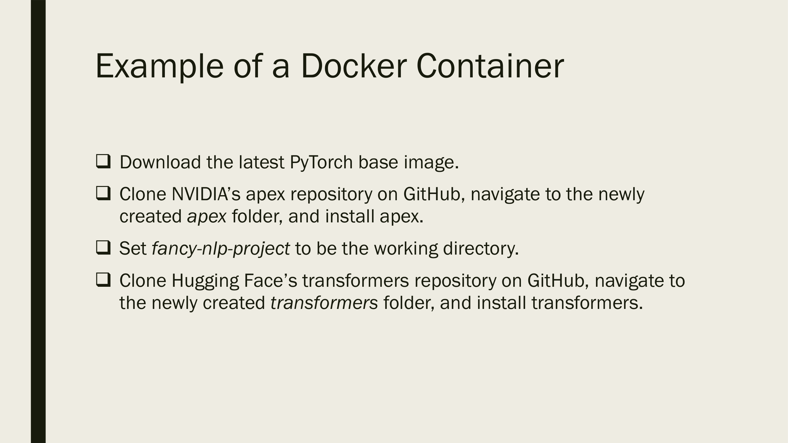

**Example of a Docker Container — Docker 容器示例**

- ❑ Download the latest PyTorch base image. — 下载最新 PyTorch 基础镜像。
- ❑ Clone NVIDIA's apex repository on GitHub, navigate to the newly created apex folder, and install apex. — 克隆 NVIDIA apex 仓库并安装。
- ❑ Set fancy-nlp-project to be the working directory. — 设置工作目录为 fancy-nlp-project。
- ❑ Clone Hugging Face's transformers repository on GitHub, navigate to the newly created transformers folder, and install transformers. — 克隆 HuggingFace transformers 仓库并安装。

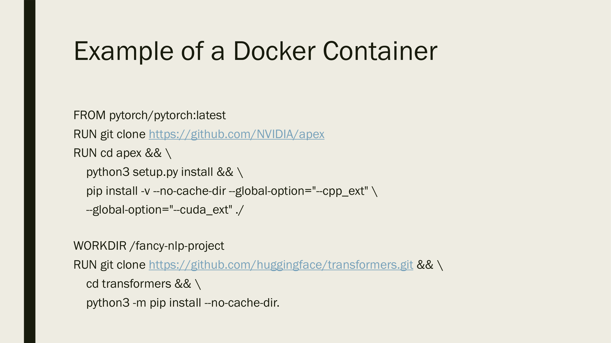

**Example of a Docker Container — Docker 容器示例（Dockerfile 代码）**

```dockerfile
FROM pytorch/pytorch:latest
RUN git clone https://github.com/NVIDIA/apex
RUN cd apex && \
    python3 setup.py install && \
    pip install -v --no-cache-dir --global-option="--cpp_ext" \
    --global-option="--cuda_ext" ./
WORKDIR /fancy-nlp-project
RUN git clone https://github.com/huggingface/transformers.git && \
    cd transformers && \
    python3 -m pip install --no-cache-dir .
```

> 📖 **图解读笔记：**
>
> | Dockerfile 指令 Instruction | 含义 Meaning |
> |----------------|------|
> | `FROM` | Base image — 指定基础镜像（PyTorch 最新版） |
> | `RUN` | Execute command in container — 在容器内执行命令 |
> | `WORKDIR` | Set working directory — 设置容器内工作目录 |

### 4.6 Pods

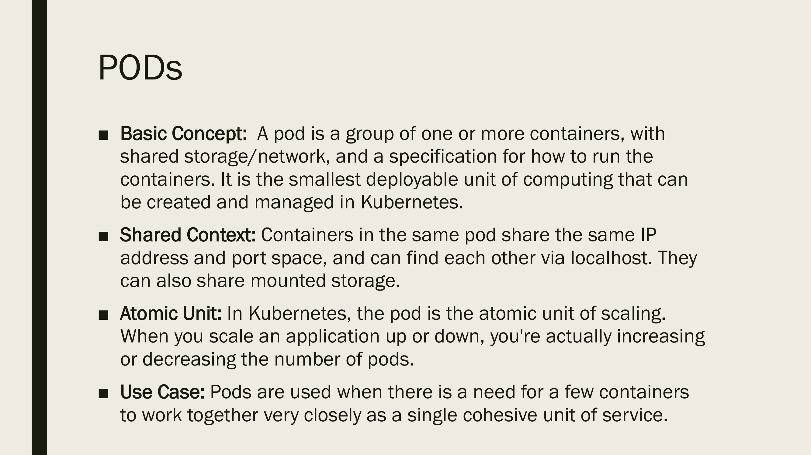

**PODs — Pod 集群单元**

- ■ **Basic Concept:** A pod is a group of one or more containers, with shared storage/network, and a specification for how to run the containers. It is the smallest deployable unit of computing that can be created and managed in Kubernetes. — **基本概念：** Pod 是一个或多个容器的组合，共享存储/网络，是 Kubernetes 中最小的可部署计算单元。
- ■ **Shared Context:** Containers in the same pod share the same IP address and port space, and can find each other via localhost. They can also share mounted storage. — **共享上下文：** 同一 Pod 中的容器共享 IP 地址和端口空间，可通过 localhost 互相通信，也可共享挂载存储。
- ■ **Atomic Unit:** In Kubernetes, the pod is the atomic unit of scaling. When you scale an application up or down, you're actually increasing or decreasing the number of pods. — **原子单元：** 在 Kubernetes 中，Pod 是扩缩容的原子单位。扩缩容实际上是增减 Pod 数量。
- ■ **Use Case:** Pods are used when there is a need for a few containers to work together very closely as a single cohesive unit of service. — **使用场景：** 当多个容器需要紧密协作时使用 Pod。

---

## 5. 资源管理 (Resource Management)

### 5.1 概述 (Overview)

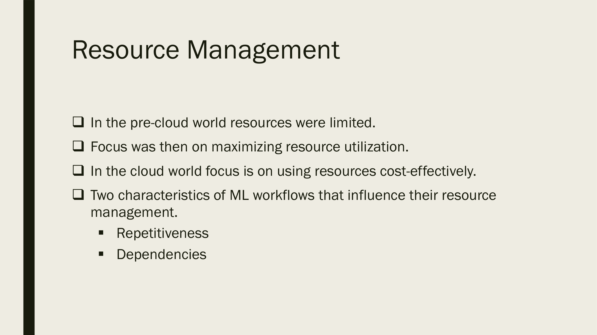

**Resource Management — 资源管理**

- ❑ In the pre-cloud world resources were limited. — 云计算之前的世界中资源是有限的。
- ❑ Focus was then on maximizing resource utilization. — 当时的重点是最大化资源利用率。
- ❑ In the cloud world focus is on using resources cost-effectively. — 在云计算时代，重点是经济高效地使用资源。
- ❑ Two characteristics of ML workflows that influence their resource management. — ML 工作流影响资源管理的两个特征：
  - **Repetitiveness** — **重复性**（工作流需要反复执行，如超参数搜索）
  - **Dependencies** — **依赖性**（各步骤之间存在依赖关系）

### 5.2 调度器与编排器 (Schedulers and Orchestrators)

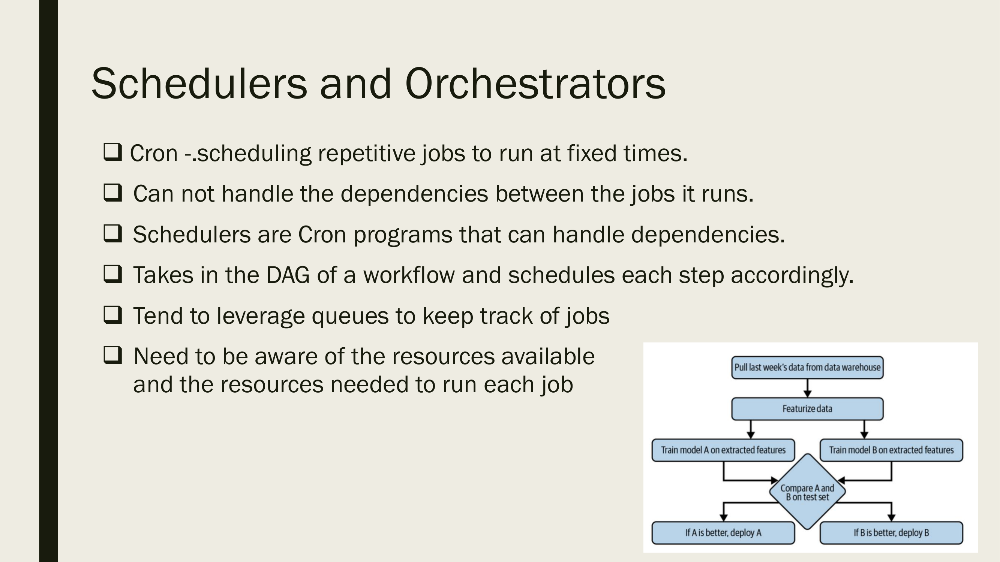

**Schedulers and Orchestrators — 调度器与编排器**

- ❑ **Cron** - scheduling repetitive jobs to run at fixed times. — **Cron** — 在固定时间调度重复任务。
- ❑ Can not handle the dependencies between the jobs it runs. — Cron 无法处理任务之间的依赖关系。
- ❑ **Schedulers** are Cron programs that can handle dependencies. — **调度器**是能处理依赖关系的升级版 Cron。
- ❑ Takes in the **DAG** of a workflow and schedules each step accordingly. — 接收工作流的 **DAG**（有向无环图）并按步骤调度。
- ❑ Tend to leverage **queues** to keep track of jobs — 使用**队列**跟踪作业
- ❑ Need to be aware of the resources available and the resources needed to run each job — 需要了解可用资源和每个作业所需资源

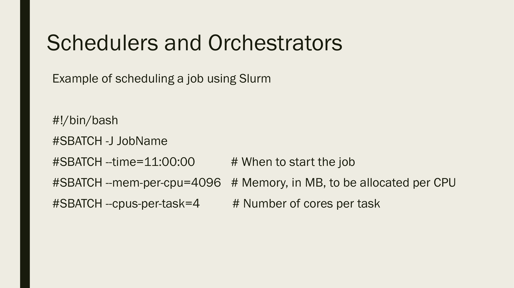

**Schedulers and Orchestrators — 调度器与编排器（Slurm 示例）**

- Example of scheduling a job using Slurm — 使用 Slurm 调度作业示例：

```bash
#!/bin/bash
#SBATCH -J JobName
#SBATCH --time=11:00:00          # When to start the job — 作业运行时间
#SBATCH --mem-per-cpu=4096       # Memory, in MB, to be allocated per CPU — 每 CPU 分配内存（MB）
#SBATCH --cpus-per-task=4        # Number of cores per task — 每个任务分配的 CPU 核数
```

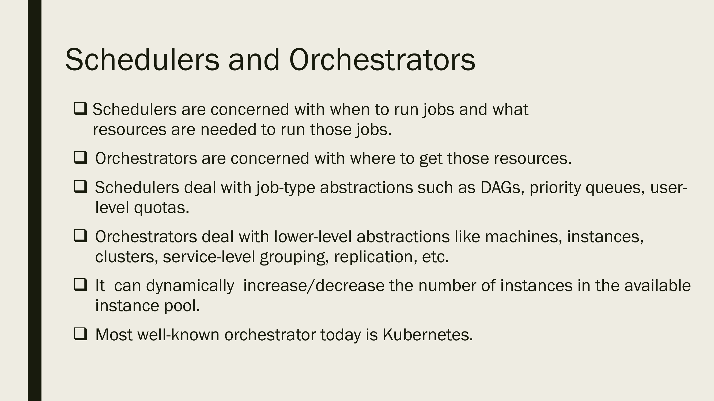

**Schedulers and Orchestrators — 调度器与编排器（区别对比）**

- ❑ **Schedulers** are concerned with **when** to run jobs and **what** resources are needed to run those jobs. — **调度器**关注"**何时**运行"和"**需要什么**资源"。
- ❑ **Orchestrators** are concerned with **where** to get those resources. — **编排器**关注"**从哪里**获取资源"。
- ❑ Schedulers deal with job-type abstractions such as **DAGs, priority queues, user-level quotas**. — 调度器处理作业级别的抽象（DAG、优先级队列、用户配额）。
- ❑ Orchestrators deal with lower-level abstractions like **machines, instances, clusters, service-level grouping, replication**, etc. — 编排器处理更底层的抽象（机器、实例、集群、服务分组、副本等）。
- ❑ It can dynamically increase/decrease the number of instances in the available instance pool. — 编排器可动态增减实例池中的实例数量。
- ❑ Most well-known orchestrator today is **Kubernetes**. — 当今最知名的编排器是 **Kubernetes**。

### 5.3 工作流管理 (Workflow Management)

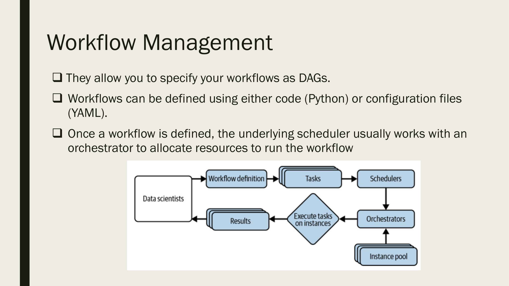

**Workflow Management — 工作流管理**

- ❑ They allow you to specify your workflows as **DAGs**. — 允许将工作流定义为 **DAG**（有向无环图）。
- ❑ Workflows can be defined using either **code (Python)** or **configuration files (YAML)**. — 工作流可用**代码（Python）**或**配置文件（YAML）**定义。
- ❑ Once a workflow is defined, the underlying scheduler usually works with an orchestrator to allocate resources to run the workflow — 工作流定义后，调度器与编排器协同分配资源来运行工作流

### 5.4 Airflow

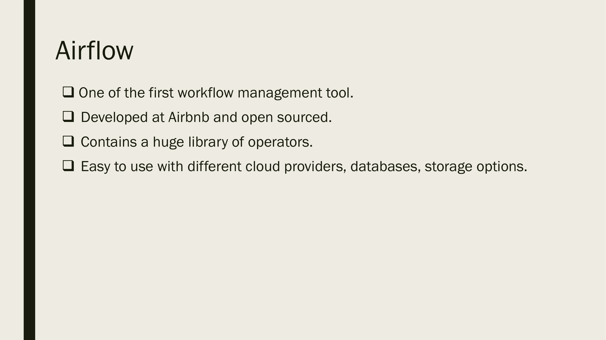

**Airflow — Airflow 工作流管理工具**

- ❑ One of the first workflow management tool. — 最早的工作流管理工具之一。
- ❑ Developed at **Airbnb** and open sourced. — 由 **Airbnb** 开发并开源。
- ❑ Contains a huge library of **operators**. — 拥有庞大的算子库。
- ❑ Easy to use with different cloud providers, databases, storage options. — 易于与不同云服务商、数据库和存储方案集成。

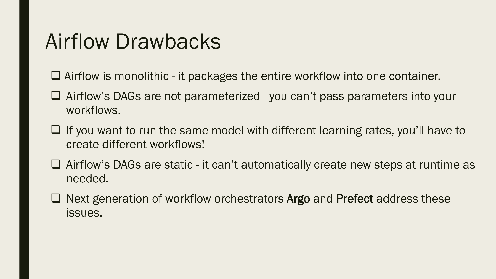

**Airflow Drawbacks — Airflow 的局限性**

- ❑ Airflow is **monolithic** - it packages the entire workflow into one container. — Airflow 是**单体架构**——将整个工作流打包到一个容器中。
- ❑ Airflow's DAGs are **not parameterized** - you can't pass parameters into your workflows. — Airflow 的 DAG **不支持参数化**——无法向工作流传递参数。
- ❑ If you want to run the same model with different learning rates, you'll have to create different workflows! — 如果想用不同学习率运行同一模型，必须创建不同的工作流！
- ❑ Airflow's DAGs are **static** - it can't automatically create new steps at runtime as needed. — Airflow 的 DAG 是**静态的**——无法在运行时自动创建新步骤。
- ❑ Next generation of workflow orchestrators **Argo** and **Prefect** address these issues. — 新一代工作流编排器 **Argo** 和 **Prefect** 解决了这些问题。

---

## 6. ML 平台 (ML Platform)

### 6.1 概述 (Overview)

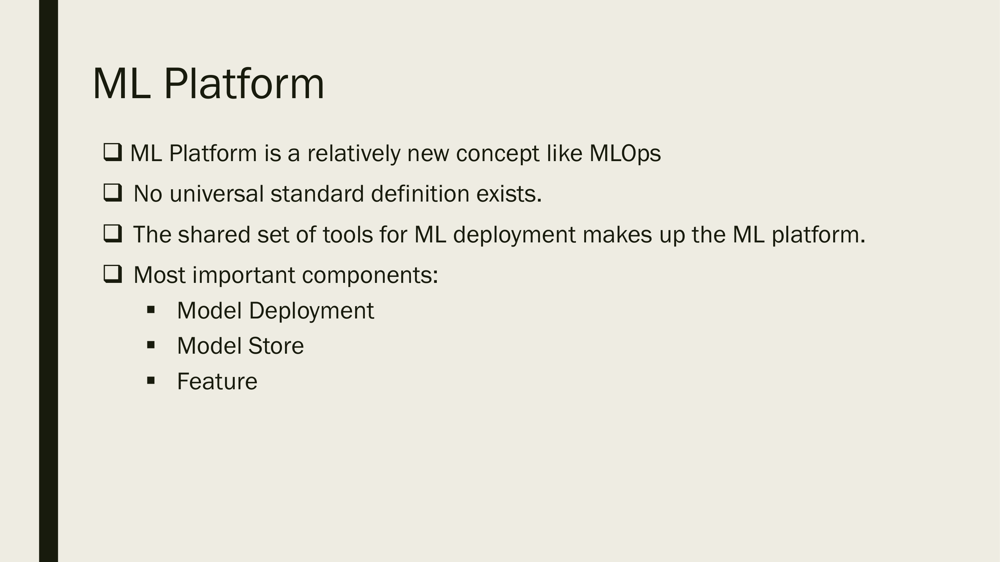

**ML Platform — ML 平台**

- ❑ ML Platform is a relatively new concept like MLOps — ML 平台是一个相对较新的概念，类似 MLOps
- ❑ No universal standard definition exists. — 没有统一的标准定义。
- ❑ The shared set of tools for ML deployment makes up the ML platform. — ML 部署的一套共享工具构成了 ML 平台。
- ❑ Most important components: — 最重要的组件：
  - **Model Deployment** — **模型部署**
  - **Model Store** — **模型存储**
  - **Feature Store** — **特征存储**

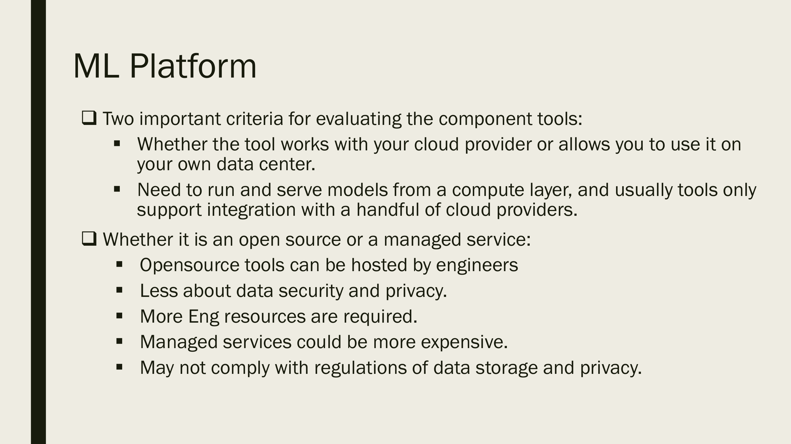

**ML Platform — ML 平台（评估标准）**

- ❑ Two important criteria for evaluating the component tools: — 评估组件工具的两个重要标准：
  - Whether the tool works with your cloud provider or allows you to use it on your own data center. — 工具是否支持你的云服务商或允许在自建数据中心使用。
  - Need to run and serve models from a compute layer, and usually tools only support integration with a handful of cloud providers. — 需要从计算层运行和服务模型，通常工具只支持几家云服务商。
- ❑ Whether it is an **open source** or a **managed service**: — 是**开源**还是**托管服务**：
  - Opensource tools can be hosted by engineers — 开源工具可自行托管
  - Less about data security and privacy. — 数据安全顾虑较少。
  - More Eng resources are required. — 需要更多工程资源。
  - Managed services could be more expensive. — 托管服务可能更贵。
  - May not comply with regulations of data storage and privacy. — 可能不符合数据存储和隐私法规。

### 6.2 模型部署 (Model Deployment)

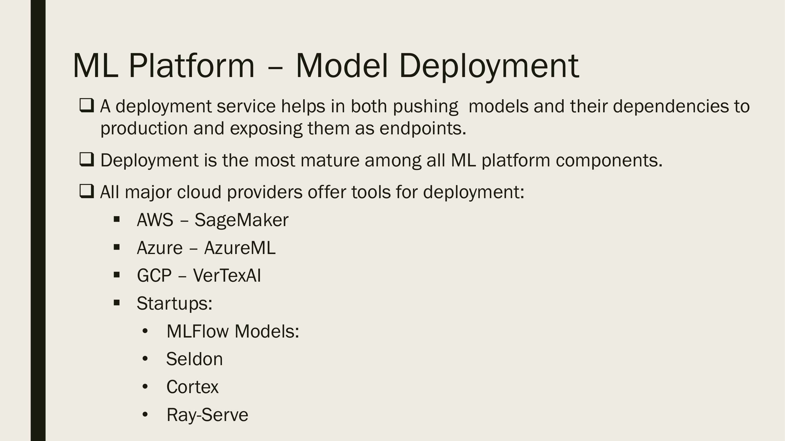

**ML Platform – Model Deployment — ML 平台 – 模型部署**

- ❑ A deployment service helps in both pushing models and their dependencies to production and exposing them as endpoints. — 部署服务将模型及依赖推送到生产环境，并暴露为 API 端点。
- ❑ Deployment is the most mature among all ML platform components. — 部署是所有 ML 平台组件中最成熟的。
- ❑ All major cloud providers offer tools for deployment: — 所有主要云服务商都提供部署工具：
  - AWS – SageMaker
  - Azure – AzureML
  - GCP – VertexAI
  - Startups: MLFlow Models, Seldon, Cortex, Ray-Serve — 初创公司工具

### 6.3 模型存储 (Model Store)

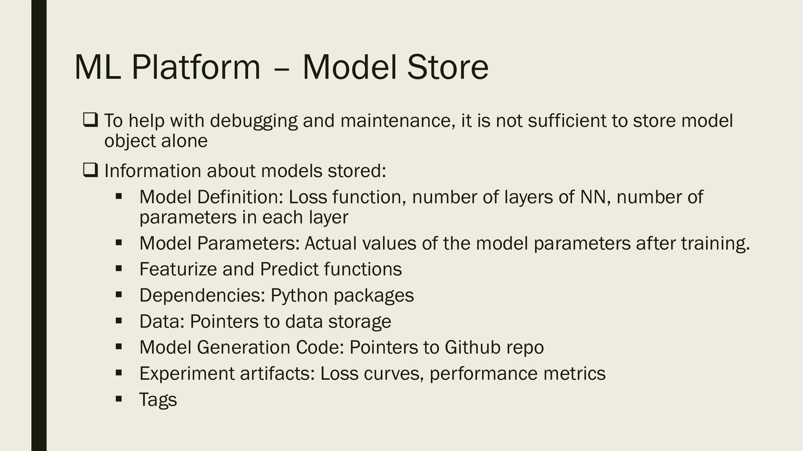

**ML Platform – Model Store — ML 平台 – 模型存储**

- ❑ To help with debugging and maintenance, it is not sufficient to store model object alone — 仅存储模型对象不足以支撑调试和维护
- ❑ Information about models stored: — 需要存储的模型相关信息：
  - **Model Definition:** Loss function, number of layers of NN, number of parameters in each layer — **模型定义：** 损失函数、神经网络层数、每层参数数量
  - **Model Parameters:** Actual values of the model parameters after training. — **模型参数：** 训练后的实际参数值
  - **Featurize and Predict functions** — **特征化和预测函数**
  - **Dependencies:** Python packages — **依赖：** Python 包
  - **Data:** Pointers to data storage — **数据：** 数据存储指针
  - **Model Generation Code:** Pointers to Github repo — **模型生成代码：** GitHub 仓库指针
  - **Experiment artifacts:** Loss curves, performance metrics — **实验制品：** 损失曲线、性能指标
  - **Tags** — **标签**

### 6.4 特征存储 (Feature Store)

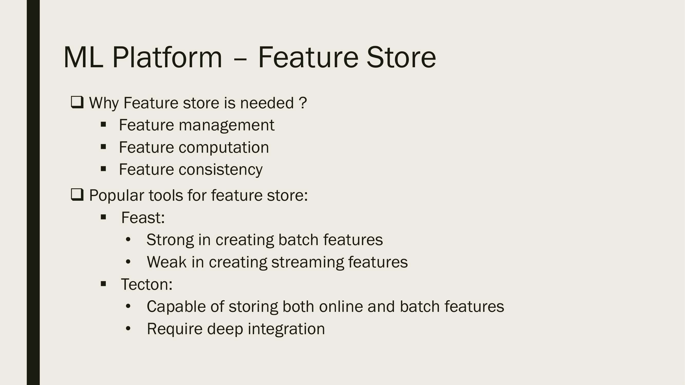

**ML Platform – Feature Store — ML 平台 – 特征存储**

- ❑ Why Feature store is needed? — 为什么需要特征存储？
  - **Feature management** — **特征管理**
  - **Feature computation** — **特征计算**
  - **Feature consistency** — **特征一致性**
- ❑ Popular tools for feature store: — 常用特征存储工具：
  - **Feast:**
    - Strong in creating batch features — 擅长创建批量特征
    - Weak in creating streaming features — 在流式特征方面较弱
  - **Tecton:**
    - Capable of storing both online and batch features — 可同时存储在线和批量特征
    - Require deep integration — 需要深度集成

---

## 7. 总结与回顾 (Summary)

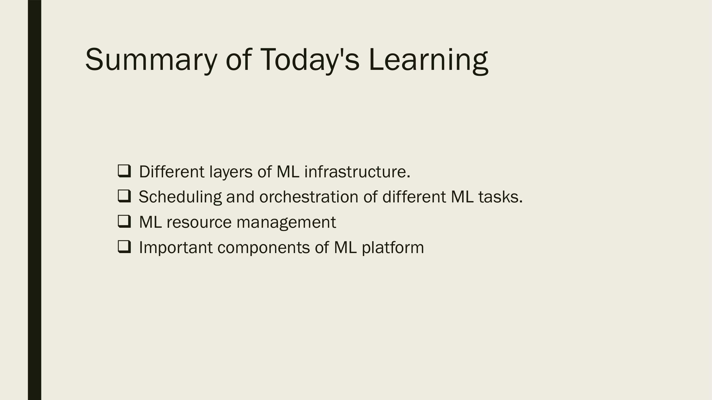

**Summary of Today's Learning — 今日学习总结**

- ❑ Different layers of ML infrastructure. — ML 基础设施的不同层次。
- ❑ Scheduling and orchestration of different ML tasks. — 不同 ML 任务的调度与编排。
- ❑ ML resource management — ML 资源管理
- ❑ Important components of ML platform — ML 平台的重要组件


**Thank You — 感谢**
