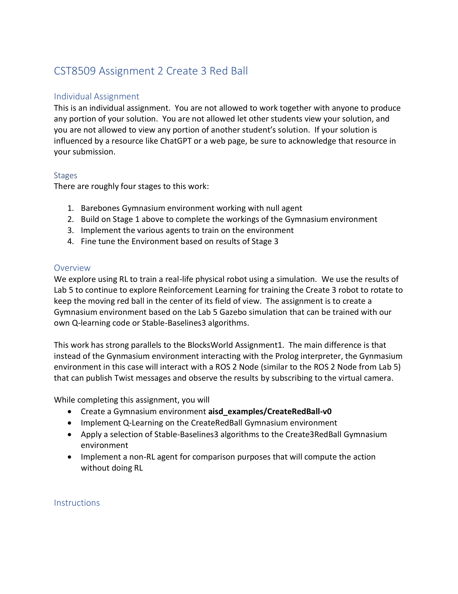
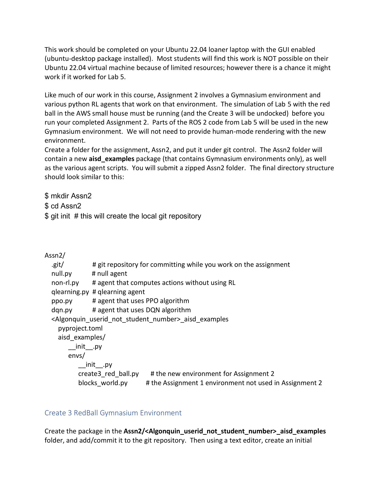
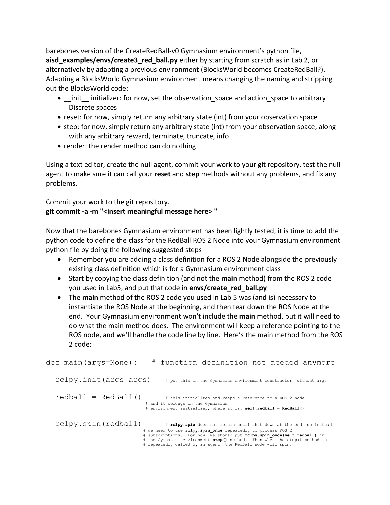
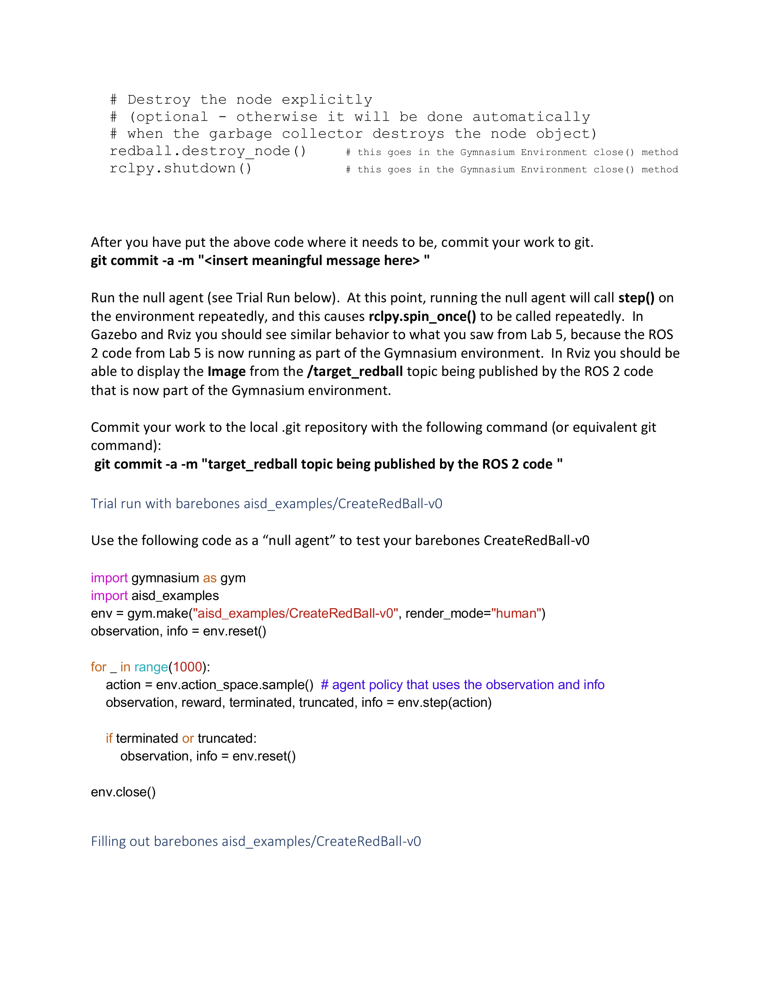
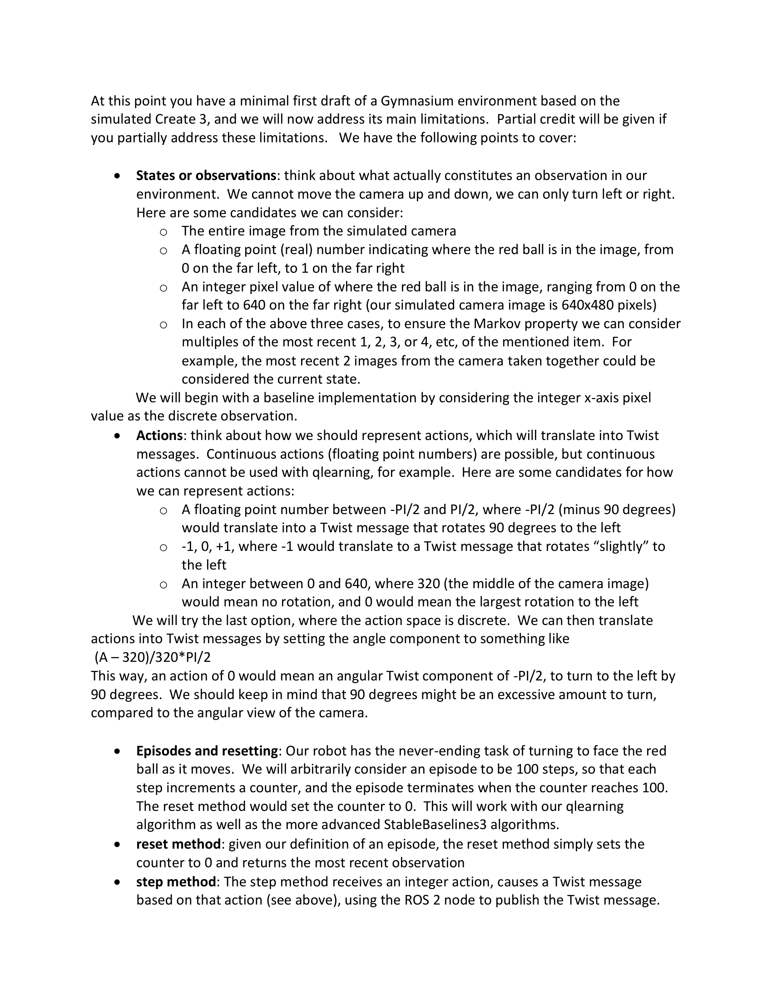
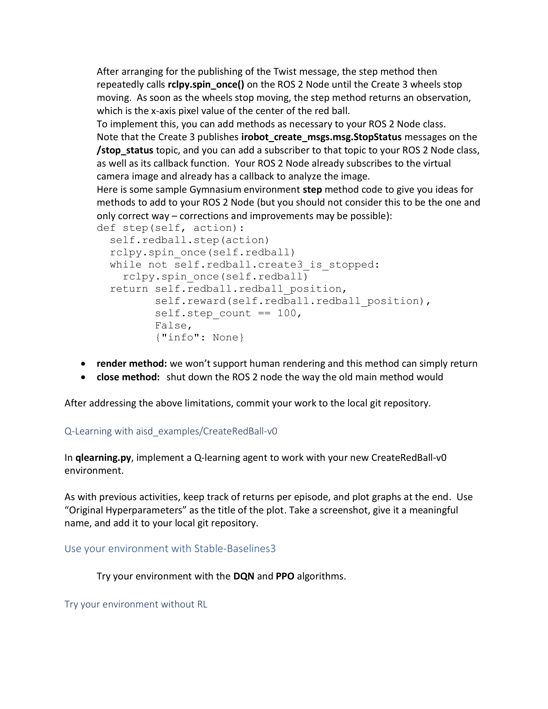
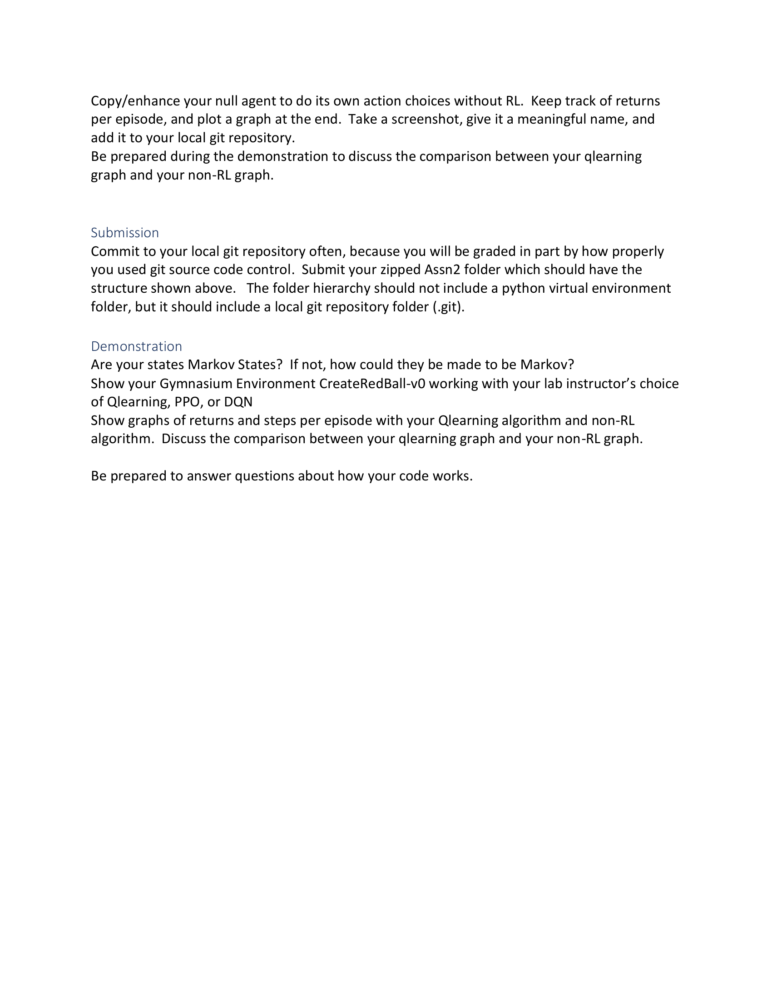

# Assignment 2: Create3RedBall — 作业2：Create3 红球追踪

> Source: `CST8509_Assn2_Create3RedBall.pdf`
> Total Pages: 7
> Course: CST8509 Reinforcement Learning — 强化学习

---

## 1. 作业要求 (Assignment Requirements)



**Individual Assignment — 个人作业**

- This is an individual assignment. You are not allowed to work together with anyone to produce any portion of your solution. — 这是个人作业。不允许与任何人合作完成解决方案的任何部分。
- You are not allowed let other students view your solution, and you are not allowed to view any portion of another student's solution. — 不允许让其他学生查看你的解决方案，也不允许查看其他学生解决方案的任何部分。
- If your solution is influenced by a resource like ChatGPT or a web page, be sure to acknowledge that resource in your submission. — 如果你的解决方案受到 ChatGPT 或网页等资源的影响，请务必在提交中注明该资源。

**Stages — 阶段**

There are roughly four stages to this work: — 这项工作大致分为四个阶段：

1. Barebones Gymnasium environment working with null agent — 最基本的 Gymnasium 环境配合空代理运行
2. Build on Stage 1 above to complete the workings of the Gymnasium environment — 在阶段1基础上完善 Gymnasium 环境的功能
3. Implement the various agents to train on the environment — 实现各种代理在环境上进行训练
4. Fine tune the Environment based on results of Stage 3 — 根据阶段3的结果微调环境

---

## 2. 概述 (Overview)

- We explore using RL to train a real-life physical robot using a simulation. — 我们探索使用 RL 通过仿真来训练现实中的物理机器人。
- We use the results of Lab 5 to continue to explore Reinforcement Learning for training the Create 3 robot to rotate to keep the moving red ball in the center of its field of view. — 我们使用 Lab 5 的结果，继续探索强化学习，训练 Create 3 机器人旋转以保持移动的红球在其视野中心。
- The assignment is to create a Gymnasium environment based on the Lab 5 Gazebo simulation that can be trained with our own Q-learning code or Stable-Baselines3 algorithms. — 作业是基于 Lab 5 的 Gazebo 仿真创建一个 Gymnasium 环境，可以用我们自己的 Q-learning 代码或 Stable-Baselines3 算法进行训练。
- This work has strong parallels to the BlocksWorld Assignment1. The main difference is that instead of the Gymnasium environment interacting with the Prolog interpreter, the Gymnasium environment in this case will interact with a ROS 2 Node (similar to the ROS 2 Node from Lab 5) that can publish Twist messages and observe the results by subscribing to the virtual camera. — 这项工作与 BlocksWorld 作业1有很强的相似性。主要区别在于，Gymnasium 环境不再与 Prolog 解释器交互，而是与一个 ROS 2 节点交互（类似于 Lab 5 的 ROS 2 节点），该节点可以发布 Twist 消息并通过订阅虚拟摄像头观察结果。

**While completing this assignment, you will: — 完成本作业时，你将：**

- Create a Gymnasium environment `aisd_examples/CreateRedBall-v0` — 创建 Gymnasium 环境 `aisd_examples/CreateRedBall-v0`
- Implement Q-Learning on the CreateRedBall Gymnasium environment — 在 CreateRedBall Gymnasium 环境上实现 Q-Learning
- Apply a selection of Stable-Baselines3 algorithms to the Create3RedBall Gymnasium environment — 将多种 Stable-Baselines3 算法应用于 Create3RedBall Gymnasium 环境
- Implement a non-RL agent for comparison purposes that will compute the action without doing RL — 实现一个非 RL 代理用于对比，该代理不使用 RL 直接计算动作

---

## 3. 环境设置与目录结构 (Environment Setup & Directory Structure)



- This work should be completed on your Ubuntu 22.04 loaner laptop with the GUI enabled (ubuntu-desktop package installed). — 这项工作应在安装了 GUI 的 Ubuntu 22.04 借用笔记本上完成（需安装 ubuntu-desktop 包）。
- Most students will find this work is NOT possible on their Ubuntu 22.04 virtual machine because of limited resources; however there is a chance it might work if it worked for Lab 5. — 大多数学生会发现由于资源有限，在 Ubuntu 22.04 虚拟机上无法完成此工作；但如果 Lab 5 能运行，也有可能可以。
- The simulation of Lab 5 with the red ball in the AWS small house must be running (and the Create 3 will be undocked) before you run your completed Assignment 2. — 在运行完成的作业2之前，Lab 5 的仿真（红球在 AWS 小房子中）必须正在运行（且 Create 3 必须已解除对接）。
- We will not need to provide human-mode rendering with the new environment. — 新环境不需要提供人类模式渲染。

**Directory Structure — 目录结构：**

```
Assn2/
  .git/                   # git repository — git 仓库
  null.py                 # null agent — 空代理
  non-rl.py               # agent that computes actions without using RL — 非 RL 代理
  qlearning.py            # qlearning agent — Q-learning 代理
  ppo.py                  # agent that uses PPO algorithm — PPO 算法代理
  dqn.py                  # agent that uses DQN algorithm — DQN 算法代理
  <Algonquin_userid_not_student_number>_aisd_examples/
    pyproject.toml
    aisd_examples/
      __init__.py
      envs/
        __init__.py
        create3_red_ball.py   # the new environment — 新环境
        blocks_world.py       # Assignment 1 environment (not used) — 作业1环境（不使用）
```

**Setup commands — 设置命令：**

```bash
$ mkdir Assn2
$ cd Assn2
$ git init    # this will create the local git repository — 创建本地 git 仓库
```

---

## 4. Stage 1：最小化 Gymnasium 环境 (Barebones Gymnasium Environment)



**Create3 RedBall Gymnasium Environment — Create3 红球 Gymnasium 环境**

- Create the package in the `Assn2/<Algonquin_userid>_aisd_examples` folder, and add/commit it to the git repository. — 在 `Assn2/<Algonquin_userid>_aisd_examples` 文件夹中创建包，并将其添加/提交到 git 仓库。
- Create an initial barebones version of the `CreateRedBall-v0` Gymnasium environment's python file `aisd_examples/envs/create3_red_ball.py` either by starting from scratch as in Lab 2, or alternatively by adapting a previous environment (BlocksWorld becomes CreateRedBall). — 创建 `CreateRedBall-v0` Gymnasium 环境的初始最小化 Python 文件 `aisd_examples/envs/create3_red_ball.py`，可以像 Lab 2 一样从头开始，也可以改编之前的环境（BlocksWorld 改为 CreateRedBall）。

**Barebones methods — 最小化方法：**

- `__init__` initializer: for now, set the `observation_space` and `action_space` to arbitrary Discrete spaces — `__init__` 初始化器：暂时将 `observation_space` 和 `action_space` 设置为任意的 Discrete 空间
- `reset`: for now, simply return any arbitrary state (int) from your observation space — `reset`：暂时从观察空间返回任意状态（int）
- `step`: for now, simply return any arbitrary state (int) from your observation space, along with any arbitrary reward, terminate, truncate, info — `step`：暂时返回任意状态（int）以及任意的 reward、terminate、truncate、info
- `render`: the render method can do nothing — `render`：渲染方法可以什么都不做

**Testing — 测试：**

- Using a text editor, create the null agent, commit your work to your git repository, test the null agent to make sure it can call your reset and step methods without any problems, and fix any problems. — 使用文本编辑器创建空代理，提交到 git 仓库，测试空代理确保它可以无问题地调用 reset 和 step 方法，修复发现的问题。

```bash
git commit -a -m "<insert meaningful message here>"
```

---

## 5. 集成 ROS 2 节点 (Integrating the ROS 2 Node)


- Now that the barebones Gymnasium environment has been lightly tested, it is time to add the python code to define the class for the RedBall ROS 2 Node into your Gymnasium environment python file. — 现在最小化的 Gymnasium 环境已经过简单测试，是时候将 RedBall ROS 2 节点的类定义添加到 Gymnasium 环境 Python 文件中了。

**Suggested steps — 建议步骤：**

- Remember you are adding a class definition for a ROS 2 Node alongside the previously existing class definition which is for a Gymnasium environment class — 请记住你是在已有的 Gymnasium 环境类定义旁添加一个 ROS 2 节点的类定义
- Start by copying the class definition (and not the main method) from the ROS 2 code you used in Lab 5, and put that code in `envs/create_red_ball.py` — 首先从 Lab 5 使用的 ROS 2 代码中复制类定义（不包括 main 方法），放入 `envs/create_red_ball.py`



**How to handle the main method — 如何处理 main 方法：**

The main method of the ROS 2 code needs to be distributed across the Gymnasium environment: — ROS 2 代码的 main 方法需要分散到 Gymnasium 环境的各部分中：

```python
def main(args=None):             # function definition not needed anymore
                                 # 函数定义不再需要
    rclpy.init(args=args)
    # put this in the Gymnasium environment constructor, without args
    # 放入 Gymnasium 环境构造函数中，不带 args

    redball = RedBall()
    # this initializes and keeps a reference to a ROS 2 node
    # and it belongs in the Gymnasium environment initializer,
    # where it is: self.redball = RedBall()
    # 初始化并保留 ROS 2 节点的引用
    # 放在 Gymnasium 环境初始化器中：self.redball = RedBall()

    rclpy.spin(redball)
    # rclpy.spin does not return until shut down at the end, so instead
    # we need to use rclpy.spin_once repeatedly to process ROS subscriptions.
    # For now, we should put rclpy.spin_once(self.redball) in
    # the Gymnasium environment step() method.
    # rclpy.spin 在关闭前不会返回，因此我们需要反复使用
    # rclpy.spin_once 来处理 ROS 订阅。
    # 暂时将 rclpy.spin_once(self.redball) 放在 step() 方法中。

    # Destroy the node explicitly — 显式销毁节点
    redball.destroy_node()
    # this goes in the Gymnasium Environment close() method
    # 放在 Gymnasium 环境的 close() 方法中

    rclpy.shutdown()
    # this goes in the Gymnasium Environment close() method
    # 放在 Gymnasium 环境的 close() 方法中
```

```bash
git commit -a -m "<insert meaningful message here>"
```

---

## 6. 空代理试运行 (Trial Run with Null Agent)

- Run the null agent. At this point, running the null agent will call `step()` on the environment repeatedly, and this causes `rclpy.spin_once()` to be called repeatedly. — 运行空代理。此时运行空代理会反复调用环境的 `step()`，从而反复调用 `rclpy.spin_once()`。
- In Gazebo and Rviz you should see similar behavior to what you saw from Lab 5, because the ROS 2 code from Lab 5 is now running as part of the Gymnasium environment. — 在 Gazebo 和 Rviz 中你应该看到与 Lab 5 相似的行为，因为 Lab 5 的 ROS 2 代码现在作为 Gymnasium 环境的一部分运行。
- In Rviz you should be able to display the Image from the `/target_redball` topic being published by the ROS 2 code. — 在 Rviz 中你应该能够显示由 ROS 2 代码发布的 `/target_redball` 主题的图像。

```bash
git commit -a -m "target_redball topic being published by the ROS 2 code"
```

**Trial run null agent code — 空代理试运行代码：**

```python
import gymnasium as gym
import aisd_examples

env = gym.make("aisd_examples/CreateRedBall-v0", render_mode="human")
observation, info = env.reset()

for _ in range(1000):
    action = env.action_space.sample()  # agent policy that uses the observation and info
                                        # 使用观察和信息的代理策略
    observation, reward, terminated, truncated, info = env.step(action)
    if terminated or truncated:
        observation, info = env.reset()

env.close()
```

---

## 7. 完善环境 (Filling Out the Environment)



At this point you have a minimal first draft of a Gymnasium environment based on the simulated Create 3, and we will now address its main limitations. Partial credit will be given if you partially address these limitations. — 此时你有了一个基于仿真 Create 3 的最小化 Gymnasium 环境初稿，现在我们将解决其主要局限性。即使只部分解决也会给予部分分数。

### 7.1 观察空间 (States / Observations)

- We cannot move the camera up and down, we can only turn left or right. — 我们不能上下移动摄像头，只能左右旋转。

**Candidates — 候选方案：**

- The entire image from the simulated camera — 来自仿真摄像头的完整图像
- A floating point (real) number indicating where the red ball is in the image, from 0 on the far left, to 1 on the far right — 一个浮点数，表示红球在图像中的位置，最左端为0，最右端为1
- An integer pixel value of where the red ball is in the image, ranging from 0 on the far left to 640 on the far right (our simulated camera image is 640x480 pixels) — 一个整数像素值，表示红球在图像中的位置，最左端为0，最右端为640（我们的仿真摄像头图像为 640x480 像素）
- In each of the above three cases, to ensure the Markov property we can consider multiples of the most recent 1, 2, 3, or 4, etc, of the mentioned item. For example, the most recent 2 images from the camera taken together could be considered the current state. — 在以上三种情况中，为了确保马尔可夫性质，我们可以考虑最近 1、2、3 或 4 个上述项的组合。例如，最近 2 张摄像头图像的组合可以被视为当前状态。

**Baseline implementation — 基线实现：**

- We will begin with a baseline implementation by considering the integer x-axis pixel value as the discrete observation. — 我们将以整数 x 轴像素值作为离散观察来开始基线实现。

### 7.2 动作空间 (Actions)

- Actions will translate into Twist messages. Continuous actions (floating point numbers) are possible, but continuous actions cannot be used with Q-learning. — 动作将转换为 Twist 消息。连续动作（浮点数）是可能的，但连续动作不能用于 Q-learning。

**Candidates — 候选方案：**

- A floating point number between -PI/2 and PI/2, where -PI/2 (minus 90 degrees) would translate into a Twist message that rotates 90 degrees to the left — -PI/2 到 PI/2 之间的浮点数，其中 -PI/2（-90度）转换为向左旋转90度的 Twist 消息
- -1, 0, +1, where -1 would translate to a Twist message that rotates "slightly" to the left — -1、0、+1，其中 -1 转换为"微微"向左旋转的 Twist 消息
- An integer between 0 and 640, where 320 (the middle of the camera image) would mean no rotation, and 0 would mean the largest rotation to the left — 0 到 640 之间的整数，其中 320（摄像头图像中心）表示不旋转，0 表示最大程度向左旋转

**Chosen approach — 选定方案：**

- We will try the last option, where the action space is discrete. — 我们将使用最后一个选项，即离散动作空间。
- We can then translate actions into Twist messages by setting the angle component to: — 我们可以通过设置角度分量将动作转换为 Twist 消息：

```
(A – 320) / 320 * PI/2
```

- An action of 0 → angular Twist component of -PI/2, to turn to the left by 90 degrees. — 动作 0 → 角度 Twist 分量为 -PI/2，向左转90度。
- We should keep in mind that 90 degrees might be an excessive amount to turn, compared to the angular view of the camera. — 需要注意90度的旋转量可能过大，相比于摄像头的视角范围。

### 7.3 回合与重置 (Episodes and Resetting)

- Our robot has the never-ending task of turning to face the red ball as it moves. — 机器人有一个永不停止的任务：随着红球移动而转向面对它。
- We will arbitrarily consider an episode to be 100 steps, so that each step increments a counter, and the episode terminates when the counter reaches 100. — 我们任意定义一个回合为100步，每步递增一个计数器，计数器到达100时回合结束。
- The reset method would set the counter to 0. — reset 方法将计数器重置为0。
- This will work with our Q-learning algorithm as well as the more advanced StableBaselines3 algorithms. — 这适用于我们的 Q-learning 算法以及更高级的 StableBaselines3 算法。

### 7.4 核心方法实现 (Core Method Implementation)



**`reset` method — `reset` 方法：**

- Given our definition of an episode, the reset method simply sets the counter to 0 and returns the most recent observation. — 根据我们对回合的定义，reset 方法只需将计数器设为0并返回最近的观察。

**`step` method — `step` 方法：**

- The step method receives an integer action, causes a Twist message based on that action, using the ROS 2 node to publish the Twist message. — step 方法接收一个整数动作，基于该动作生成 Twist 消息，使用 ROS 2 节点发布 Twist 消息。
- After publishing, the step method repeatedly calls `rclpy.spin_once()` on the ROS 2 Node until the Create 3 wheels stop moving. — 发布后，step 方法反复调用 ROS 2 节点的 `rclpy.spin_once()`，直到 Create 3 的轮子停止转动。
- As soon as the wheels stop moving, the step method returns an observation, which is the x-axis pixel value of the center of the red ball. — 轮子一停止，step 方法就返回观察值，即红球中心的 x 轴像素值。
- Note: Create 3 publishes `irobot_create_msgs.msg.StopStatus` messages on the `/stop_status` topic. You can add a subscriber to that topic to your ROS 2 Node class. — 注意：Create 3 在 `/stop_status` 主题上发布 `irobot_create_msgs.msg.StopStatus` 消息。你可以为 ROS 2 节点类添加该主题的订阅者。

**Sample step method code — step 方法示例代码：**

```python
def step(self, action):
    self.redball.step(action)
    rclpy.spin_once(self.redball)
    while not self.redball.create3_is_stopped:
        rclpy.spin_once(self.redball)
    return self.redball.redball_position,
           self.reward(self.redball.redball_position),
           self.step_count == 100,
           False,
           {"info": None}
```

> Note: you should not consider this to be the one and only correct way – corrections and improvements may be possible. — 注意：不应将此视为唯一正确的方式——可能存在修正和改进的空间。

**`render` method — `render` 方法：**

- We won't support human rendering and this method can simply return. — 我们不支持人类渲染，此方法可以直接返回。

**`close` method — `close` 方法：**

- Shut down the ROS 2 node the way the old main method would. — 按照旧的 main 方法的方式关闭 ROS 2 节点。

```bash
git commit -a -m "<insert meaningful message here>"
```

---

## 8. Q-Learning 训练 (Q-Learning with CreateRedBall-v0)

- In `qlearning.py`, implement a Q-learning agent to work with your new `CreateRedBall-v0` environment. — 在 `qlearning.py` 中，实现一个与新的 `CreateRedBall-v0` 环境配合工作的 Q-learning 代理。
- Keep track of returns per episode, and plot graphs at the end. — 记录每个回合的回报，并在最后绘制图表。
- Use "Original Hyperparameters" as the title of the plot. — 使用"Original Hyperparameters"作为图表标题。
- Take a screenshot, give it a meaningful name, and add it to your local git repository. — 截屏，给一个有意义的名称，并添加到本地 git 仓库。

---

## 9. Stable-Baselines3 算法 (Use with Stable-Baselines3)

- Try your environment with the **DQN** and **PPO** algorithms. — 使用 **DQN** 和 **PPO** 算法测试你的环境。

---

## 10. 非 RL 代理 (Try Without RL)



- Copy/enhance your null agent to do its own action choices without RL. — 复制/增强你的空代理，使其在不使用 RL 的情况下自行选择动作。
- Keep track of returns per episode, and plot a graph at the end. — 记录每个回合的回报，并在最后绘制图表。
- Take a screenshot, give it a meaningful name, and add it to your local git repository. — 截屏，给一个有意义的名称，并添加到本地 git 仓库。
- Be prepared during the demonstration to discuss the comparison between your Q-learning graph and your non-RL graph. — 在演示时准备好讨论 Q-learning 图表和非 RL 图表之间的比较。

---

## 11. 提交要求 (Submission)

- Commit to your local git repository often, because you will be graded in part by how properly you used git source code control. — 经常提交到本地 git 仓库，因为你的评分部分取决于你是否正确使用了 git 版本控制。
- Submit your zipped `Assn2` folder which should have the structure shown above. — 提交压缩的 `Assn2` 文件夹，目录结构如上所示。
- The folder hierarchy should not include a python virtual environment folder, but it should include a local git repository folder (`.git`). — 文件夹层次结构不应包含 Python 虚拟环境文件夹，但应包含本地 git 仓库文件夹（`.git`）。

---

## 12. 演示要求 (Demonstration)

- Are your states Markov States? If not, how could they be made to be Markov? — 你的状态是马尔可夫状态吗？如果不是，如何使其成为马尔可夫状态？
- Show your Gymnasium Environment `CreateRedBall-v0` working with your lab instructor's choice of Q-learning, PPO, or DQN. — 展示你的 Gymnasium 环境 `CreateRedBall-v0` 使用实验指导教师选择的 Q-learning、PPO 或 DQN 运行。
- Show graphs of returns and steps per episode with your Q-learning algorithm and non-RL algorithm. Discuss the comparison between your Q-learning graph and your non-RL graph. — 展示 Q-learning 算法和非 RL 算法的每回合回报和步数图表。讨论 Q-learning 图表和非 RL 图表之间的比较。
- Be prepared to answer questions about how your code works. — 准备好回答关于代码工作原理的问题。
