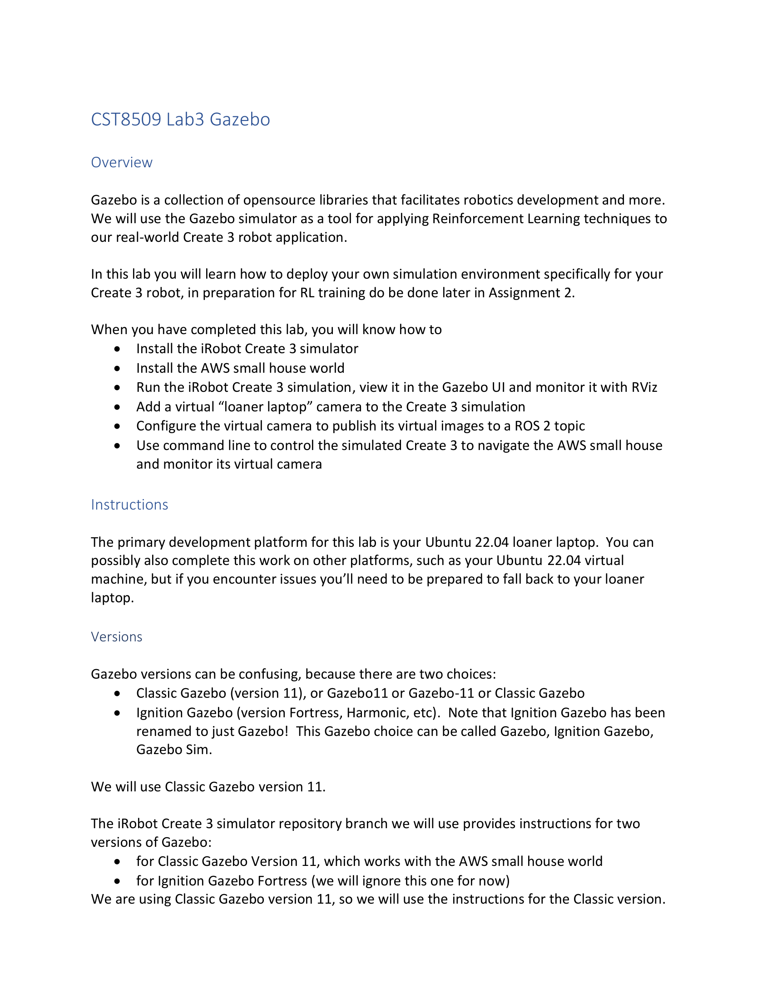
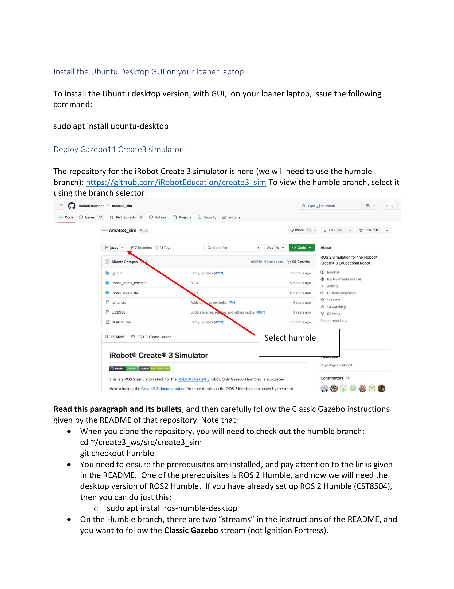
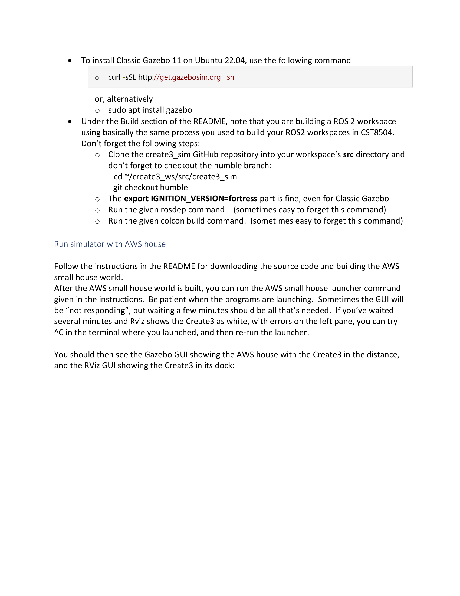
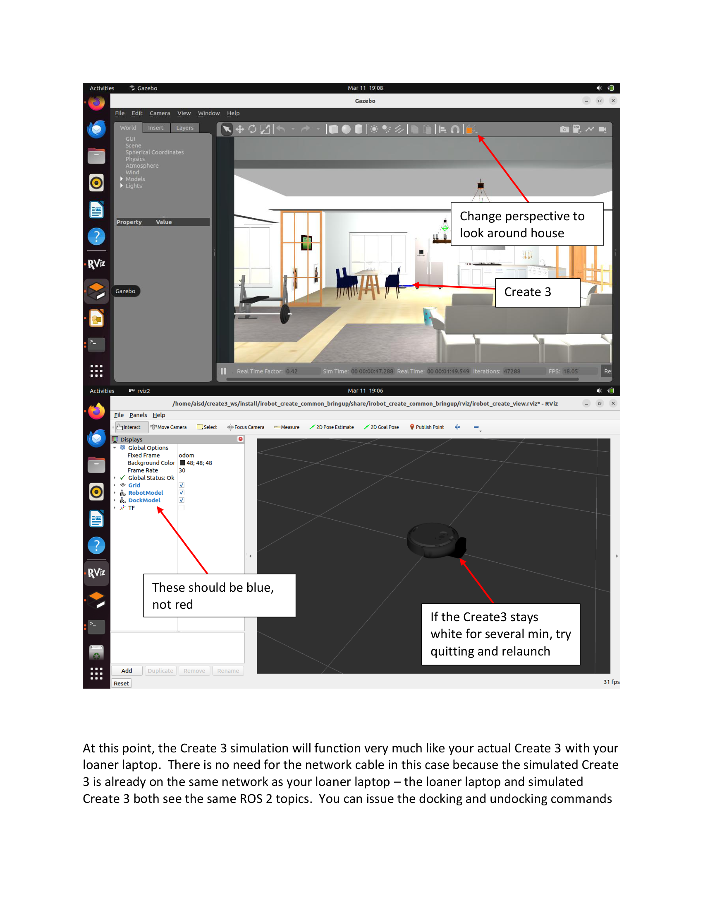
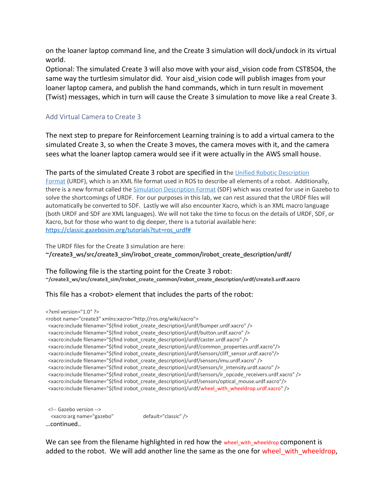
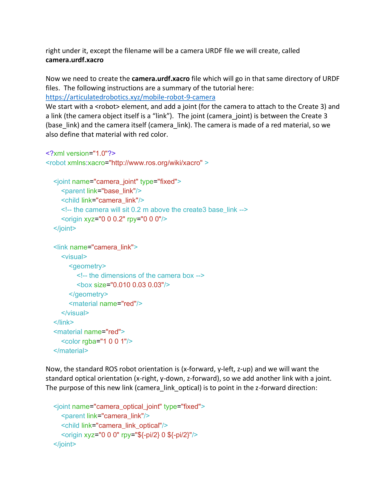
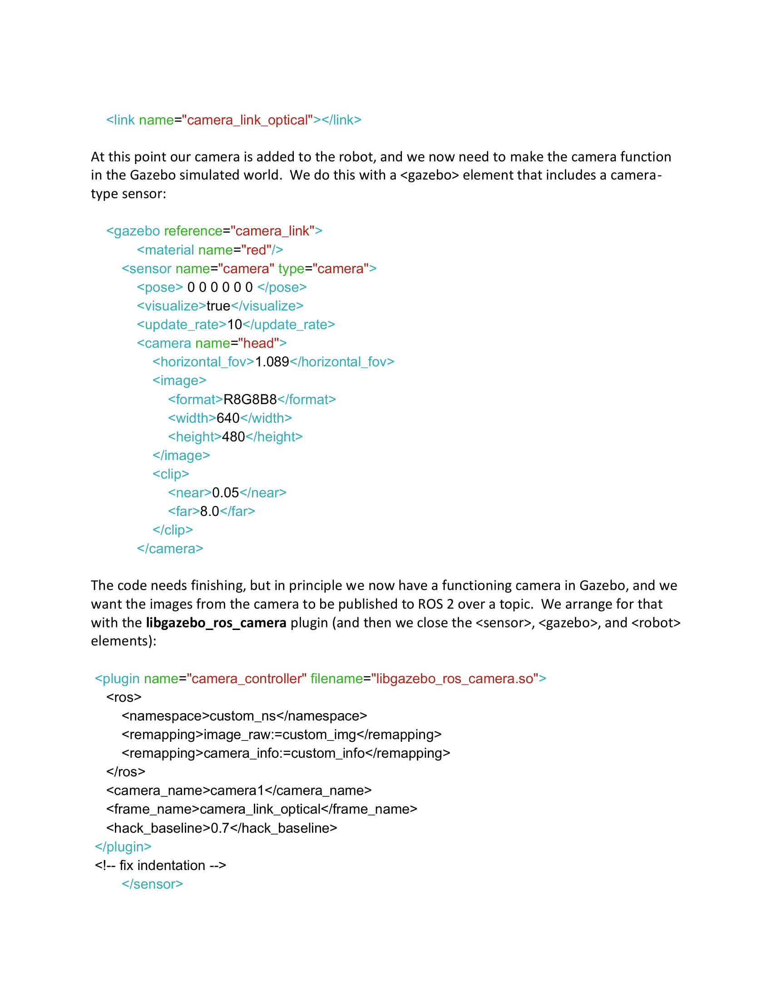
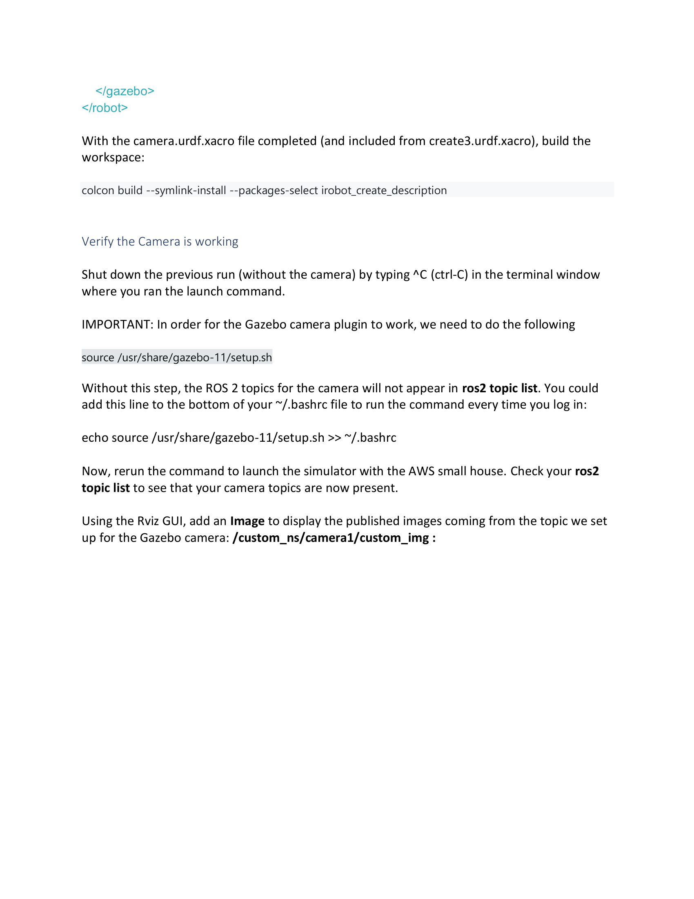
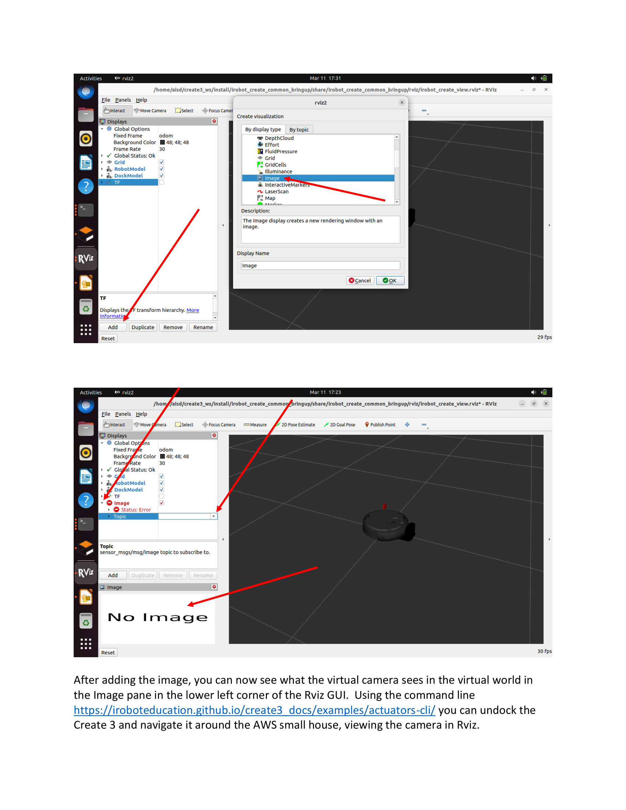

# Lab 3: Gazebo 仿真环境 (Gazebo Simulation)

> Source: `CST8509_Lab3_Gazebo.pdf`
> Total pages: 10
> Course: CST8509 - Reinforcement Learning

---

## 1. 概述 (Overview)



**Overview — 概述**

- Gazebo is a collection of opensource libraries that facilitates robotics development and more. — Gazebo 是一组促进机器人开发的开源库集合。
- We will use the Gazebo simulator as a tool for applying Reinforcement Learning techniques to our real-world Create 3 robot application. — 我们将使用 Gazebo 模拟器将强化学习技术应用于真实的 Create 3 机器人。
- In this lab you will learn how to deploy your own simulation environment specifically for your Create 3 robot, in preparation for RL training to be done later in Assignment 2. — 本实验将学习如何部署用于 Create 3 机器人的仿真环境，为 Assignment 2 的 RL 训练做准备。

**When you have completed this lab, you will know how to — 完成本实验后，你将掌握：**

- Install the iRobot Create 3 simulator — 安装 iRobot Create 3 模拟器
- Install the AWS small house world — 安装 AWS 小房子世界环境
- Run the iRobot Create 3 simulation, view it in the Gazebo UI and monitor it with RViz — 运行 Create 3 仿真，在 Gazebo UI 中查看并用 RViz 监控
- Add a virtual "loaner laptop" camera to the Create 3 simulation — 为 Create 3 仿真添加虚拟"loaner laptop"摄像头
- Configure the virtual camera to publish its virtual images to a ROS 2 topic — 配置虚拟摄像头将图像发布到 ROS 2 topic
- Use command line to control the simulated Create 3 to navigate the AWS small house and monitor its virtual camera — 使用命令行控制模拟 Create 3 在 AWS 小房子中导航并监控虚拟摄像头

**Instructions — 说明**

- The primary development platform for this lab is your Ubuntu 22.04 loaner laptop. — 本实验的主要开发平台是 Ubuntu 22.04 loaner laptop。
- You can possibly also complete this work on other platforms, such as your Ubuntu 22.04 virtual machine, but if you encounter issues you'll need to be prepared to fall back to your loaner laptop. — 也可以使用其他平台（如 Ubuntu 22.04 虚拟机），但遇到问题需退回 loaner laptop。

---

## 2. Gazebo 版本说明 (Versions)

**Gazebo versions can be confusing, because there are two choices — Gazebo 版本可能令人困惑，因为有两种选择：**

- Classic Gazebo (version 11), or Gazebo11 or Gazebo-11 or Classic Gazebo — Classic Gazebo（版本 11），也叫 Gazebo11 或 Gazebo-11
- Ignition Gazebo (version Fortress, Harmonic, etc). Note that Ignition Gazebo has been renamed to just Gazebo! This Gazebo choice can be called Gazebo, Ignition Gazebo, Gazebo Sim. — Ignition Gazebo（版本 Fortress、Harmonic 等）。注意 Ignition Gazebo 已被重命名为 Gazebo！

**We will use Classic Gazebo version 11. — 我们使用 Classic Gazebo 版本 11。**

- The iRobot Create 3 simulator repository branch we will use provides instructions for two versions of Gazebo — 我们使用的 iRobot Create 3 模拟器仓库的 humble 分支提供两个版本的说明：
  - for Classic Gazebo Version 11, which works with the AWS small house world — Classic Gazebo 版本 11，兼容 AWS 小房子世界
  - for Ignition Gazebo Fortress (we will ignore this one for now) — Ignition Gazebo Fortress（我们暂时不用这个）
- We are using Classic Gazebo version 11, so we will use the instructions for the Classic version. — 我们使用 Classic Gazebo 版本 11，因此按照 Classic 版本的说明操作。

---

## 3. 安装 Ubuntu Desktop GUI (Install Ubuntu Desktop GUI)



**Install the Ubuntu Desktop GUI on your loaner laptop — 在 loaner laptop 上安装 Ubuntu Desktop GUI**

- To install the Ubuntu desktop version, with GUI, on your loaner laptop, issue the following command: — 在 loaner laptop 上安装带 GUI 的 Ubuntu 桌面版，执行以下命令：

```bash
sudo apt install ubuntu-desktop
```

---

## 4. 部署 Gazebo11 Create3 模拟器 (Deploy Gazebo11 Create3 Simulator)

**Deploy Gazebo11 Create3 simulator — 部署 Gazebo11 Create3 模拟器**

- The repository for the iRobot Create 3 simulator is here (we will need to use the humble branch): — iRobot Create 3 模拟器仓库在此（需要使用 humble 分支）：

Ref: https://github.com/iRobotEducation/create3_sim

- To view the humble branch, select it using the branch selector. — 使用分支选择器查看 humble 分支。

**Read this paragraph and its bullets, and then carefully follow the Classic Gazebo instructions given by the README of that repository. Note that — 阅读以下要点，然后仔细按照仓库 README 中的 Classic Gazebo 说明操作。注意：**

- When you clone the repository, you will need to check out the humble branch: — 克隆仓库后，需要切换到 humble 分支：

```bash
cd ~/create3_ws/src/create3_sim
git checkout humble
```

- You need to ensure the prerequisites are installed, and pay attention to the links given in the README. One of the prerequisites is ROS 2 Humble, and now we will need the desktop version of ROS2 Humble. If you have already set up ROS 2 Humble (CST8504), then you can do just this: — 需要确保已安装前置依赖，注意 README 中的链接。前置依赖之一是 ROS 2 Humble，需要桌面版本。如果已安装 ROS 2 Humble（CST8504），只需执行：

```bash
sudo apt install ros-humble-desktop
```

- On the Humble branch, there are two "streams" in the instructions of the README, and you want to follow the Classic Gazebo stream (not Ignition Fortress). — humble 分支的 README 中有两条"路线"，需要跟随 Classic Gazebo 路线（不是 Ignition Fortress）。

---

## 5. 安装 Classic Gazebo 11 并构建 (Install Classic Gazebo 11 & Build)



**To install Classic Gazebo 11 on Ubuntu 22.04, use the following command — 在 Ubuntu 22.04 上安装 Classic Gazebo 11，使用以下命令：**

```bash
curl -sSL http://get.gazebosim.org | sh
```

- or, alternatively — 或者：

```bash
sudo apt install gazebo
```

**Under the Build section of the README — README 的 Build 部分：**

- Note that you are building a ROS 2 workspace using basically the same process you used to build your ROS2 workspaces in CST8504. Don't forget the following steps: — 构建 ROS 2 工作空间的过程与 CST8504 中基本相同。不要忘记以下步骤：
  - Clone the create3_sim GitHub repository into your workspace's src directory and don't forget to checkout the humble branch: — 将 create3_sim 仓库克隆到工作空间的 src 目录，别忘了切换 humble 分支：

```bash
cd ~/create3_ws/src/create3_sim
git checkout humble
```

- The `export IGNITION_VERSION=fortress` part is fine, even for Classic Gazebo — `export IGNITION_VERSION=fortress` 对 Classic Gazebo 也适用
- Run the given rosdep command. (sometimes easy to forget this command) — 运行给定的 rosdep 命令（容易遗漏此命令）
- Run the given colcon build command. (sometimes easy to forget this command) — 运行给定的 colcon build 命令（容易遗漏此命令）

---

## 6. 运行带 AWS 小房子的模拟器 (Run Simulator with AWS House)



**Run simulator with AWS house — 运行带 AWS 小房子的模拟器**

- Follow the instructions in the README for downloading the source code and building the AWS small house world. — 按照 README 的说明下载源码并构建 AWS 小房子世界。
- After the AWS small house world is built, you can run the AWS small house launcher command given in the instructions. — 构建完成后，运行说明中给出的 AWS 小房子启动命令。
- Be patient when the programs are launching. Sometimes the GUI will be "not responding", but waiting a few minutes should be all that's needed. — 启动程序时需要耐心等待。GUI 有时会显示"not responding"，等待几分钟即可。
- If you've waited several minutes and Rviz shows the Create3 as white, with errors on the left pane, you can try ^C in the terminal where you launched, and then re-run the launcher. — 如果等了几分钟 RViz 中 Create3 仍为白色且左侧面板有错误，可以在启动终端中 ^C 终止后重新启动。
- You should then see the Gazebo GUI showing the AWS house with the Create3 in the distance, and the RViz GUI showing the Create3 in its dock. — 然后应该看到 Gazebo GUI 显示远处 AWS 房屋中的 Create3，以及 RViz GUI 显示停靠中的 Create3。



- At this point, the Create 3 simulation will function very much like your actual Create 3 with your loaner laptop. — 此时，Create 3 仿真的工作方式与真实 Create 3 非常相似。
- There is no need for the network cable in this case because the simulated Create 3 is already on the same network as your loaner laptop – the loaner laptop and simulated Create 3 both see the same ROS 2 topics. — 不需要网线，因为模拟的 Create 3 已经与 loaner laptop 在同一网络上——两者共享相同的 ROS 2 topics。
- You can issue the docking and undocking commands on the loaner laptop command line, and the Create 3 simulation will dock/undock in its virtual world. — 可以在 loaner laptop 命令行发出停靠/解除停靠命令，Create 3 仿真将在虚拟世界中执行。
- Optional: The simulated Create 3 will also move with your aisd_vision code from CST8504. — 可选：模拟的 Create 3 也可以配合 CST8504 的 aisd_vision 代码工作。

---

## 7. 为 Create 3 添加虚拟摄像头 (Add Virtual Camera to Create 3)

**Add Virtual Camera to Create — 为 Create 添加虚拟摄像头**

- The next step to prepare for Reinforcement Learning training is to add a virtual camera to the simulated Create 3, so when the Create 3 moves, the camera moves with it, and the camera sees what the loaner laptop camera would see if it were actually in the AWS small house. — 为 RL 训练做准备的下一步是为模拟的 Create 3 添加虚拟摄像头，这样 Create 3 移动时摄像头随之移动，看到 loaner laptop 摄像头在 AWS 小房子中应看到的画面。

**Key Formats — 关键格式：**

- URDF (Unified Robotic Description Format) — an XML file format used in ROS to describe all elements of a robot — URDF（统一机器人描述格式）——ROS 中用于描述机器人所有元素的 XML 格式
- SDF (Simulation Description Format) — created for use in Gazebo to solve the shortcomings of URDF — SDF（仿真描述格式）——为 Gazebo 创建以解决 URDF 的不足
- Xacro — an XML macro language (both URDF and SDF are XML languages) — Xacro——XML 宏语言

Ref: https://classic.gazebosim.org/tutorials?tut=ros_urdf#

**The URDF files for the Create 3 simulation are here — Create 3 仿真的 URDF 文件位置：**

```
~/create3_ws/src/create3_sim/irobot_create_common/irobot_create_description/urdf/
```

**The starting point file — 起始文件：**

```
~/create3_ws/src/create3_sim/irobot_create_common/irobot_create_description/urdf/create3.urdf.xacro
```

### 7.1 修改 create3.urdf.xacro (Modify create3.urdf.xacro)

- This file has a `<robot>` element that includes the parts of the robot. — 该文件有一个 `<robot>` 元素，包含机器人的各个部件。
- We will add another line the same as the one for wheel_with_wheeldrop, except the filename will be a camera URDF file we will create, called `camera.urdf.xacro` — 我们将添加一行类似 wheel_with_wheeldrop 的引用，但文件名为我们要创建的 `camera.urdf.xacro`

### 7.2 创建 camera.urdf.xacro (Create camera.urdf.xacro)



Ref: https://articulatedrobotics.xyz/mobile-robot-9-camera

**Part 1: Joint and Link — 第一部分：关节和链接**

- We start with a `<robot>` element, and add a joint (for the camera to attach to the Create 3) and a link (the camera object itself is a "link"). — 从 `<robot>` 元素开始，添加一个关节（将摄像头连接到 Create 3）和一个链接（摄像头本身是一个"link"）。
- The joint (camera_joint) is between the Create (base_link) and the camera itself (camera_link). — 关节（camera_joint）连接 Create（base_link）和摄像头（camera_link）。
- The camera is made of a red material, so we also define that material with red color. — 摄像头使用红色材质。

```xml
<?xml version="1.0"?>
<robot xmlns:xacro="http://www.ros.org/wiki/xacro" >

    <joint name="camera_joint" type="fixed">
        <parent link="base_link"/>
        <child link="camera_link"/>
        <!-- the camera will sit 0.2 m above the create3 base_link -->
        <origin xyz="0 0 0.2" rpy="0 0 0"/>
    </joint>

    <link name="camera_link">
        <visual>
            <geometry>
                <!-- the dimensions of the camera box -->
                <box size="0.010 0.03 0.03"/>
            </geometry>
            <material name="red"/>
        </visual>
    </link>

    <material name="red">
        <color rgba="1 0 0 1"/>
    </material>
```

**Part 2: Optical Link — 第二部分：光学链接**



- Now, the standard ROS robot orientation is (x-forward, y-left, z-up) and we will want the standard optical orientation (x-right, y-down, z-forward), so we add another link with a joint. — ROS 标准机器人方向为（x 前, y 左, z 上），而光学标准方向为（x 右, y 下, z 前），因此需要添加另一个链接。
- The purpose of this new link (camera_link_optical) is to point in the z-forward direction. — 新链接（camera_link_optical）的作用是将方向转换为 z 朝前。

```xml
    <joint name="camera_optical_joint" type="fixed">
        <parent link="camera_link"/>
        <child link="camera_link_optical"/>
        <origin xyz="0 0 0" rpy="${-pi/2} 0 ${-pi/2}"/>
    </joint>

    <link name="camera_link_optical"></link>
```

**Part 3: Gazebo Camera Plugin — 第三部分：Gazebo 摄像头插件**

- We now need to make the camera function in the Gazebo simulated world. We do this with a `<gazebo>` element that includes a camera-type sensor. — 现在需要让摄像头在 Gazebo 仿真世界中工作。通过 `<gazebo>` 元素添加摄像头类型的传感器。
- We want the images from the camera to be published to ROS 2 over a topic. We arrange for that with the `libgazebo_ros_camera` plugin. — 我们希望摄像头图像通过 ROS 2 topic 发布，使用 `libgazebo_ros_camera` 插件实现。

```xml
    <gazebo reference="camera_link">
        <material name="red"/>
        <sensor name="camera" type="camera">
            <pose> 0 0 0 0 0 0 </pose>
            <visualize>true</visualize>
            <update_rate>10</update_rate>
            <camera name="head">
                <horizontal_fov>1.089</horizontal_fov>
                <image>
                    <format>R8G8B8</format>
                    <width>640</width>
                    <height>480</height>
                </image>
                <clip>
                    <near>0.05</near>
                    <far>8.0</far>
                </clip>
            </camera>

            <plugin name="camera_controller" filename="libgazebo_ros_camera.so">
                <ros>
                    <namespace>custom_ns</namespace>
                    <remapping>image_raw:=custom_img</remapping>
                    <remapping>camera_info:=custom_info</remapping>
                </ros>
                <camera_name>camera1</camera_name>
                <frame_name>camera_link_optical</frame_name>
                <hack_baseline>0.7</hack_baseline>
            </plugin>
        </sensor>
    </gazebo>

</robot>
```

---

## 8. 构建和验证摄像头 (Build and Verify Camera)



**Build — 构建**

- With the camera.urdf.xacro file completed (and included from create3.urdf.xacro), build the workspace: — 完成 camera.urdf.xacro 文件（并在 create3.urdf.xacro 中引用）后，构建工作空间：

```bash
colcon build --symlink-install --packages-select irobot_create_description
```

**Verify the Camera is working — 验证摄像头工作**

- Shut down the previous run (without the camera) by typing ^C (ctrl-C) in the terminal window where you ran the launch command. — 在启动终端中按 ^C 关闭之前的运行（无摄像头版本）。

**IMPORTANT — 重要：**

- In order for the Gazebo camera plugin to work, we need to do the following: — 为了让 Gazebo 摄像头插件工作，需要执行：

```bash
source /usr/share/gazebo-11/setup.sh
```

- Without this step, the ROS 2 topics for the camera will not appear in ros2 topic list. — 不执行此步骤，摄像头 topics 不会出现在 ros2 topic list 中。
- You could add this line to the bottom of your ~/.bashrc file to run the command every time you log in: — 可以将此行添加到 ~/.bashrc 文件末尾使其每次登录自动执行：

```bash
echo source /usr/share/gazebo-11/setup.sh >> ~/.bashrc
```

- Now, rerun the command to launch the simulator with the AWS small house. — 重新运行启动模拟器的命令。
- Check your ros2 topic list to see that your camera topics are now present. — 检查 ros2 topic list 确认摄像头 topics 已出现。

---

## 9. 在 RViz 中查看摄像头 (View Camera in RViz)



- Using the Rviz GUI, add an Image to display the published images coming from the topic we set up for the Gazebo camera: `/custom_ns/camera1/custom_img` — 在 RViz GUI 中，添加 Image 显示组件来查看 Gazebo 摄像头发布的图像，topic 为：`/custom_ns/camera1/custom_img`
- After adding the image, you can now see what the virtual camera sees in the virtual world in the Image pane in the lower left corner of the Rviz GUI. — 添加后，可以在 RViz GUI 左下角的 Image 面板中看到虚拟摄像头在虚拟世界中看到的画面。
- Using the command line you can undock the Create 3 and navigate it around the AWS small house, viewing the camera in Rviz. — 使用命令行解除 Create 3 的停靠并在 AWS 小房子中导航，同时在 RViz 中查看摄像头画面。

Ref: https://iroboteducation.github.io/create3_docs/examples/actuators-cli/

---

## 10. 提交要求 (Submission)


**You are now ready for the future assignment where we will use our setup to do RL training on our simulated Create 3. — 现在你已准备好进行未来的作业，我们将使用此设置在模拟的 Create 3 上进行 RL 训练。**

> **📋 Submission — 提交：**
>
> - Submit your `camera.urdf.xacro` file to Brightspace — 将 `camera.urdf.xacro` 文件提交到 Brightspace

**Demonstration — 演示要求：**

- Show your lab instructor your running simulation with the camera added to the Create3 — 向指导教师展示带摄像头的运行中仿真
- Run commands to undock the create3 and drive it around the AWS small house — 运行命令解除 Create3 停靠并在 AWS 小房子中驾驶
- Show the camera image being simulated and projected in the Gazebo GUI — 展示 Gazebo GUI 中模拟和投影的摄像头图像
- Show the camera image being monitored in RViz — 展示 RViz 中监控的摄像头图像
