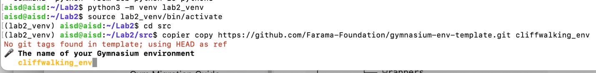

# Lab 2: Gymnasium Environments for Reinforcement Learning

**Course:** CST8509 - Reinforcement Learning
**Student Information:**
- **Name:** Peng Wang
- **Student Number:** 041107730
- **Email:** Wang1059@algonquinlive.com
- **Date:** 2026-01-27

## Overview

Gymnasium (successor to OpenAI Gym) provides a standard API for Reinforcement Learning Environments. Gymnasium environments are compatible with the Stable-Baselines3 set of Reinforcement Learning algorithms. This compatibility makes it straightforward to implement a variety of agents that use standard Reinforcement Algorithms in a given Gymnasium environment.

In this lab exercise, you will implement a custom Gymnasium environment for the CliffWalking environment, and evaluate your Q-learning algorithm and a selection of Stable-Baselines3 algorithms in that environment.

> **📝 笔记:**
> 
> **Gymnasium 概述:**
> 
> - Gymnasium 是强化学习（RL）环境的标准 API（由 OpenAI Gym 演变而来）。
> - 关键优势：与主流 RL 算法库（如 Stable-Baselines3）高度兼容。
> - 实验背景：利用 Gymnasium 封装 CliffWalking 经典强化学习场景。
> 
> **💡 提示:** 理解 Gymnasium 的核心在于掌握 `reset()` 和 `step()` 这两个标准接口。

### Learning Objectives
By the end of this lab, you will be able to:
- Modify an existing custom PyGame-enabled Gymnasium environment, `gymnasium_env/GridWorld-v0`, to turn it into a cliffwalking environment.
- Manipulate the form of data passed from environment to agent.
- Use your own `lab2_qlearning_agent.py` Q-Learning agent with your Gymnasium environment.
- Apply a selection of Stable-Baselines3 algorithms to your Gymnasium environment.

> **📝 笔记:**
> 
> **实验目标:**
> 
> - 核心目标是掌握自定义 Gymnasium 环境的开发流程。
> - 学习如何将传统的 RL 算法（如 Q-Learning）与现代 Gymnasium 接口对接。
> - 初步接触 Stable-Baselines3 这一工业级强化学习库。
> 
> **💡 提示:** 实验核心在于理解环境与代理（Agent）之间的数据流转。

---

## Instructions

### 1. Implement `cliffwalking_env/GridWorld-v0`

1. **Environment Setup:**
   It is recommended to do this lab exercise on your loaner laptop or alternatively on your Ubuntu Server 22.04 Virtual Machine. To enable the GUI on your loaner laptop, issue the following command and reboot:
   ```bash
   sudo apt install ubuntu-desktop
   ```

> **📝 笔记:**
> - 安装 `ubuntu-desktop` 以支持图形界面。
> - 重启后生效。
> **💡 提示:** 建议在实验期间保持虚拟机的 GUI 开启。

2. **Project Initialization:**
   Create a `Lab2` folder with a `src` subfolder. You will use `copier` to copy the `gymnasium_env` package to `Lab2/src/cliffwalking_env`.

> **📝 笔记:**
> - 使用 `copier` 同步模板项目。
> - 目录结构：`Lab2/src/cliffwalking_env`。
> **💡 提示:** 确保 `copier` 命令在 `Lab2/src` 目录下运行。

3. **Virtual Environment:**
   In your `Lab2` folder, create a Python virtual environment called `lab2_venv`:
   ```bash
   python3 -m venv lab2_venv
   source lab2_venv/bin/activate  # On Windows: lab2_venv\Scripts\activate
   ```

> **📝 笔记:**
> - 创建名为 `lab2_venv` 的虚拟环境。
> - 激活环境以便安装依赖。
> **💡 提示:** 每次打开终端都需确认环境已激活。

4. **Environment Creation:**
   In your `Lab2/src` folder, use `copier` to create the environment package. Follow the tutorial at: [Gymnasium Environment Creation](https://gymnasium.farama.org/tutorials/gymnasium_basics/environment_creation/)
   - **Path to directory:** `<your_userid>_cliffwalking_env`
   - **Environment name:** `cliffwalking_env`
   
   Structure result: `Lab2/src/<your_userid>_cliffwalking_env/cliffwalking_env/pyproject.toml`

   

> **📝 笔记:**
> - 设置环境名称为 `cliffwalking_env`。
> - 最终应生成 `pyproject.toml` 文件。
> **💡 提示:** 跟着教程步骤走，确保路径正确。

5. **Installation:**
   Install the local package in editable mode:
   ```bash
   # Run inside Lab2/src/<your_userid>_cliffwalking_env
   pip install -e .
   ```

> **📝 笔记:**
> - 使用 `pip install -e .` 进行可编辑安装。
> - 这样修改代码后无需重新安装。
> **💡 提示:** 确保安装时是在 `userid_cliffwalking_env` 目录下。

> **💡 提示:** 务必在虚拟环境 `lab2_venv` 激活状态下执行所有安装 and 运行命令。

### 2. Trial Run with `gymnasium_env/GridWorld-v0`

1. **Initialize Git:**
   ```bash
   cd Lab2/src
   git init
   git add .
   git commit -m "initial commit"
   ```

> **📝 笔记:**
> - 初始化 Git 仓库以便追踪 Lab 2 的所有变更。
> - 在修改模板代码前进行初始提交是一个良好的开发习惯，方便随时回滚。
> **💡 提示:** 确保在 `Lab2/src` 目录下运行这些命令，而不是根目录。


2. **Null Agent Implementation:**
   Create a file called `null_agent.py` to test the environment:
   ```python
   import gymnasium
   import cliffwalking_env

   env = gymnasium.make("cliffwalking_env/GridWorld-v0", render_mode="human")
   observation, info = env.reset()

   # Perform random actions for 1000 steps
   for _ in range(1000):
       action = env.action_space.sample()  # Get a random action
       observation, reward, terminated, truncated, info = env.step(action)
       
       if terminated or truncated:
           observation, info = env.reset()

   env.close()
   ```

> **📝 笔记:**
> - `null_agent.py` 用于验证 Gymnasium 环境的基本循环（Reset -> Step -> Render）。
> - 使用 `env.action_space.sample()` 纯随机动作来测试碰撞和渲染逻辑是否正常。
> **💡 提示:** 渲染模式 `render_mode="human"` 会弹出 GUI 窗口，如果运行在无头服务器上会报错。


3. **Commit Changes:** `git add null_agent.py && git commit -m "Add null agent"`

> **📝 笔记:**
> - 将测试脚本存入版本控制。
> **💡 提示:** 保持 Commit 留言简洁明了。

> **📝 笔记:**
> 
> **环境验证:**
> 
> - `null_agent.py` 的作用是验证环境配置是否正确。
> - 此时运行应看到基础的 5x5 网格，且代理在不断执行随机动作。
> 
> **💡 提示:** 如果无法弹出 PyGame 窗口，请检查是否在有桌面的环境下运行，或检查 `render_mode` 设置。

---

### 3. Adding `cliffwalking_env/CliffWalking-v0`

1. **Copy Logic:**
   Copy `grid_world.py` to `cliff_walking.py`:
   ```bash
   cp Lab2/src/userid_cliffwalking_env/cliffwalking_env/envs/grid_world.py Lab2/src/userid_cliffwalking_env/cliffwalking_env/envs/cliff_walking.py
   ```

> **📝 笔记:**
> - 复制现有的 GridWorld 逻辑作为起点。这是创建新环境的最快捷方案。
> **💡 提示:** 确保目标文件名 `cliff_walking.py` 拼写无误。

2. **Rename Class:** Change `GridWorldEnv` to `CliffWalkingEnv` in `cliff_walking.py`.

> **📝 笔记:**
> - 类名必须全局替换，包括构造函数引用。
> **💡 提示:** 遵循驼峰命名规范。


3. **Register Environment:** Update `cliffwalking_env/__init__.py` and `cliffwalking_env/envs/__init__.py` to register and import the new class.

> **📝 笔记:**
> - 注册环境是为了能通过 `gymnasium.make` 调用。
> - 漏掉此步会导致 `EnvNotFound` 错误。
> **💡 提示:** 仔细检查注册时的 ID 是否唯一。

4. **Update Null Agent:** Change `null_agent.py` to use `CliffWalking-v0`.

> **📝 笔记:**
> - 测试新注册的 ID 是否生效。此时行为应仍与 GridWorld 一致。
> **💡 提示:** 修改 `gymnasium.make` 的第一个参数。

5. **Modify Grid Shape (12x4):**
   Update `cliff_walking.py` to change the 5x5 grid into a 12x4 grid:
   - Change `size=5` to `size=(12,4)` in `__init__`.
   - Update `self.size` logic to handles `xsize` and `ysize`.
   - Update `spaces.Box` to use independent bounds:
     ```python
     spaces.Box(low=np.array([0,0]), high=np.array([self.xsize-1,self.ysize-1]), shape=(2,), dtype=int)
     ```
   - Update PyGame rendering logic (window size, grid lines, pix square size).

> **📝 笔记:**
> - 核心修改：将 `size` 改为 `(12, 4)`，并使用 `spaces.Box` 分别定义 X/Y 轴边界。
> - 网格坐标：X 轴范围 [0, 11]，Y 轴范围 [0, 3]。
> **💡 提示:** 修改 `spaces.Box` 时需导入 `numpy` (`np`) 并使用 `high=np.array([self.xsize-1, self.ysize-1])`。

---

### 4. Integration with Q-Learning Agent

1. **Copy Agent:** Copy your `lab2_qlearning_agent.py` from Lab 1 into `Lab2/src`.

> **📝 笔记:**
> - 将 Lab 1 的 Agent 文件重用。确保文件名包含自己的 ID。
> **💡 提示:** 检查文件路径是否正确。

2. **Adapt Environment Interface:**
   - **States Calculation:**
     ```python
     numstates = (env.observation_space['agent'].high[0] + 1) * (env.observation_space['agent'].high[1] + 1)
     ```
   - **Actions Calculation:**
     ```python
     numactions = env.action_space.n
     ```
   - **Observation Handling:** Extract the agent location from the observation dictionary:
     ```python
     state = state_dict['agent'][1] * (env.observation_space['agent'].high[0] + 1) + state_dict['agent'][0]
     ```
   - **Step Function Return Values:** Handle the 5 returns from Gymnasium step:
     ```python
     next_state_dict, reward, done, truncated, info = env.step(action)
     ```

> **📝 笔记:**
> - 适配新的观测值接口（字典型）和 Step 函数返回值（5 个值）。
> **💡 提示:** 计算 `numstates` 时应基于 `env.observation_space['agent'].high`。

3. **Visualization:**
   Plot episode returns and steps per episode using matplotlib.

> **📝 笔记:**
> - 使用 Matplotlib 绘制结果，包含回报曲线和步数曲线。
> **💡 提示:** 确保已安装 `pyqt5` 或 `python3-tk`。


---

### 5. Using Stable-Baselines3

1. **Installation:**
   ```bash
   pip install stable-baselines3[extra]
   ```

> **📝 笔记:**
> - SB3 需要单独安装，包含 `[extra]` 以获得完整功能。
> **💡 提示:** 安装过程可能较慢，请耐心等待。

2. **DQN Agent Example (`DQN_agent.py`):**
   ```python
   import gymnasium
   import cliffwalking_env  # Note: Ensure correct env import
   from stable_baselines3 import DQN

   env = gymnasium.make("cliffwalking_env/CliffWalking-v0", render_mode="human")
   model = DQN("MultiInputPolicy", env, verbose=1)
   model.learn(total_timesteps=10000, log_interval=4)
   model.save("dqn_cliff")

   del model # Demonstrate loading
   model = DQN.load("dqn_cliff")

   obs, info = env.reset()
   while True:
       action, _states = model.predict(obs, deterministic=True)
       obs, reward, terminated, truncated, info = env.step(action)
       if terminated or truncated:
           obs, info = env.reset()
   ```

> **📝 笔记:**
> - SB3 针对多输入需使用 `MultiInputPolicy`。
> - 演示了模型训练、保存与加载流程。
> **💡 提示:** 深度 RL 的训练通常比基础 Q-Learning 更慢。

3. **Evaluation:** Compare **DQN** and **PPO** algorithm performance against your Q-Learning implementation.

> **📝 笔记:**
> - 对比不同算法的表现。记录下你的观察结论。
> **💡 提示:** SB3 算法在默认参数下可能不一定优于你的 Q-Learning。


---

## Submission Checklist

- [ ] Zipped `src` folder (excluding `lab2_venv`).
- [ ] Agent files included.
- [ ] `<userid>_cliffwalking_env` folder included.

> **提交要求:**
> 
> - 截图：训练过程中的回报曲线 (Episode Returns) 和步数曲线 (Steps per Episode)。
> - 文件命名：`<userid>_lab2_qlearning_agent.py`。
> - 文件夹结构：压缩 `src` 文件夹，确保包含所有代码 and 环境包，**严禁包含 `lab2_venv`**。
> - 提交格式：`.zip` 压缩包上传至 Brightspace。

## Demonstration Requirements

- [ ] Explain your solution logic.
- [ ] Show Gymnasium Environment working with Q-Learning agent.
- [ ] Show graphs of returns and steps.
- [ ] Show Gymnasium Environment working with Stable-Baselines3.
