# CST8509 01 RL Intro

**Source:** `CST8509_01_RL_Intro.pdf`
**Total Pages:** 37
**Format:** Hybrid (pdfplumber + PyMuPDF)

---

## Page 1

### 📷 Page Image

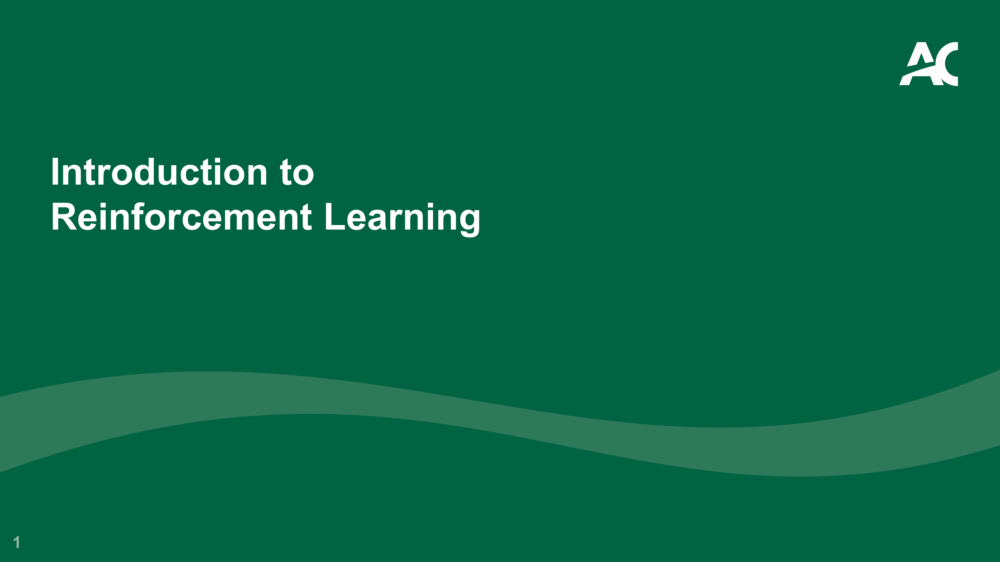

### 📝 Text Content

**Introduction to**

Reinforcement Learning

### ✍️ Notes

> [Add your notes here]

---

## Page 2

### 📷 Page Image

### 📝 Text Content

**Welcome**

• CST8509: Reinforcement Learning

• Meet your Professors

Lectures: Todd Kelley
Office: T315
Phone: 613-727-4723 x7474
Email: kelleyt@algonquincollege.com
Labs: Ali Mohamed Ali <mohamea2@algonquincollege.com>

• Contact your Professor

email me with enquiries (can expect reply same or next day)
email me to arrange office-hour style meetings

### ✍️ Notes

> [Add your notes here]

---

## Page 3

### 📷 Page Image

### 📝 Text Content

**Logistics**

• Weekly schedule

Lecture Mondays 1:00-3:00pm in C346
Lab Section 101 Wednesdays 5:00 to 7:00pm in B320
Lab Section 102 Wednesdays 7:00 to 9:00pm in B119
One hour (average) of asynchronous (Hybrid) activity

• Let's look at the Course Section Information on Brightspace

• Let's look at the submission requirements on Brightspace

• Late lab/assignment submissions are subject to a penalty:

10% < 1 week
100% > 1 week

### ✍️ Notes

> [Add your notes here]

---

## Page 4

### 📷 Page Image

### 📝 Text Content

**Expectations for Assignments**

Unless an Assignment or Lab explicitly states that it is a group activity, ALL
practical and theory work in this course is individual work:

• You must complete solutions by yourself

• You are allowed to participate in study groups and use ChatGPT or similar

facilities.

• You are allowed to help each other understand the concepts of the course.

• You are not allowed to copy or use for any purpose any portion of a solution

from another student, from ChatGPT, or from any other source.

• You are not allowed to provide any portion of your solution to anyone else.

### ✍️ Notes

> [Add your notes here]

---

## Page 5

### 📷 Page Image

### 📝 Text Content

**Tips for Success**

Assignments are large bodies of work that cannot reasonably be
completed in one or two sessions, even long sessions
Get started early
Get clarification and help early
Make good use of Lab Periods

### ✍️ Notes

> [Add your notes here]

---

## Page 6

### 📷 Page Image

### 📝 Text Content

**Tips for Success (cont'd)**

Rule One: 15 minute rule
if you are frustrated and not making progress for 15
minutes, you need to
take a break, move on to another part of the
assignment, switch to other course work, come back
to it later
sleep on it
seek help from a peer
seek help from the instructor

### ✍️ Notes

> [Add your notes here]

---

## Page 7

### 📷 Page Image

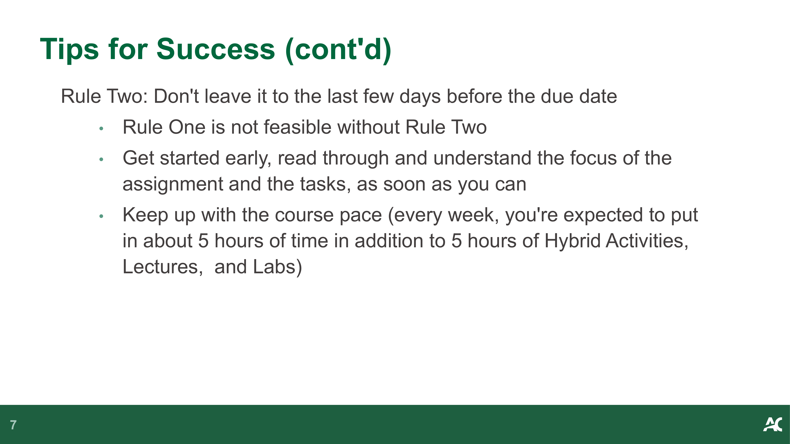

### 📝 Text Content

**Tips for Success (cont'd)**

Rule Two: Don't leave it to the last few days before the due date
Rule One is not feasible without Rule Two
Get started early, read through and understand the focus of the
assignment and the tasks, as soon as you can
Keep up with the course pace (every week, you're expected to put
in about 5 hours of time in addition to 5 hours of Hybrid Activities,
Lectures, and Labs)

### ✍️ Notes

> [Add your notes here]

---

## Page 8

### 📷 Page Image

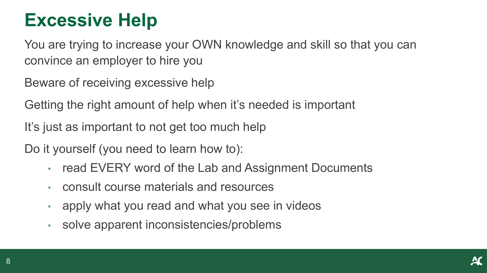

### 📝 Text Content

**Excessive Help**

You are trying to increase your OWN knowledge and skill so that you can
convince an employer to hire you
Beware of receiving excessive help
Getting the right amount of help when it’s needed is important
It’s just as important to not get too much help
Do it yourself (you need to learn how to):
read EVERY word of the Lab and Assignment Documents
consult course materials and resources
apply what you read and what you see in videos
solve apparent inconsistencies/problems

### ✍️ Notes

> [Add your notes here]

---

## Page 9

### 📷 Page Image

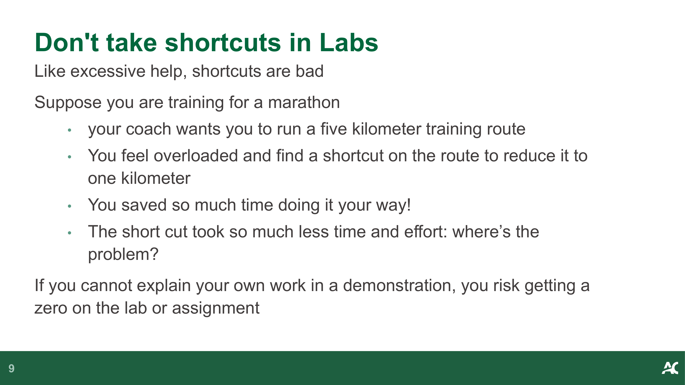

### 📝 Text Content

**Don't take shortcuts in Labs**

Like excessive help, shortcuts are bad
Suppose you are training for a marathon
your coach wants you to run a five kilometer training route
You feel overloaded and find a shortcut on the route to reduce it to
one kilometer
You saved so much time doing it your way!
The short cut took so much less time and effort: where’s the
problem?
If you cannot explain your own work in a demonstration, you risk getting a
zero on the lab or assignment

### ✍️ Notes

> [Add your notes here]

---

## Page 10

### 📷 Page Image

### 📝 Text Content

**Plagiarism**

Cheating is unacceptable
You may not copy or provide code or text: don't plagiarize
The person you copy from is in just as much trouble as you
Adherence to acceptable standards of academic honesty is an important aspect of the
learning process at Algonquin College. Academic work submitted by a student is
evaluated on the assumption that the work presented by the student is his or her own,
unless designated otherwise. For further details consult Algonquin College Policies
AA18(https://www.algonquincollege.com/policies/files/2016/04/AA18.pdf) and
AA20 (https://www.algonquincollege.com/policies/files/2016/04/AA20.pdf)

### ✍️ Notes

> [Add your notes here]

---

## Page 11

### 📷 Page Image

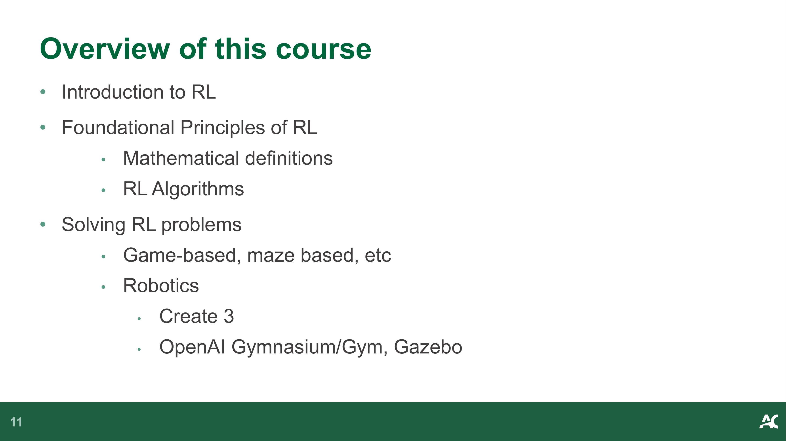

### 📝 Text Content

**Overview of this course**

• Introduction to RL

• Foundational Principles of RL

Mathematical definitions
RL Algorithms

• Solving RL problems

Game-based, maze based, etc
Robotics
Create
OpenAI Gymnasium/Gym, Gazebo

### ✍️ Notes

> [Add your notes here]

---

## Page 12

### 📷 Page Image

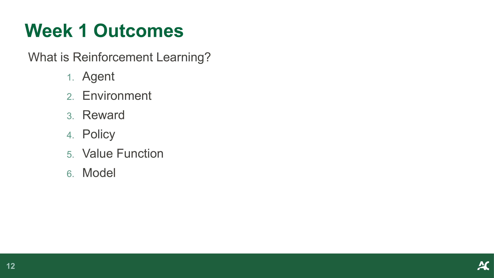

### 📝 Text Content

**Week 1 Outcomes**

What is Reinforcement Learning?
Agent
1.
Environment
2.
Reward
3.
Policy
4.
Value Function
5.
Model
6.

### ✍️ Notes

> [Add your notes here]

---

## Page 13

### 📷 Page Image

### 📝 Text Content

**From CST8504: Reinforcement Learning**

• Reinforcement Learning is a third type of Machine Learning

• Based on Markov Decision Processes

• Used for agent-based systems

Agent uses a policy for choosing an action in each time step
Each action taken results in a reward
The goal is for the agent to learn a policy that maximizes the reward

### ✍️ Notes

> [Add your notes here]

---

## Page 14

### 📷 Page Image

### 📝 Text Content

**Who's who of Reinforcement Learning**

• Andrew Barto, University of Massachusetts Amherst

• Richard Sutton, University of Alberta (Co-founder of Edmonton office of

DeepMind)
textbook

• David Silver, University of Alberta PhD graduate, now at DeepMind and

University College London
David Silver's RL course on Youtube
https://www.youtube.com/playlist?list=PLzuuYNsE1EZAXYR4FJ75jcJseBmo4KQ9-

### ✍️ Notes

> [Add your notes here]

---

## Page 15

### 📷 Page Image

### 📝 Text Content

**How broad and applicable is**

Reinforcement Learning?

• David Silver lecture 1 (youtube), 6:29

(venn diagrams showing RL is at the intersection of many
different fields of human endeavor)

### ✍️ Notes

> [Add your notes here]

---

## Page 16

### 📷 Page Image

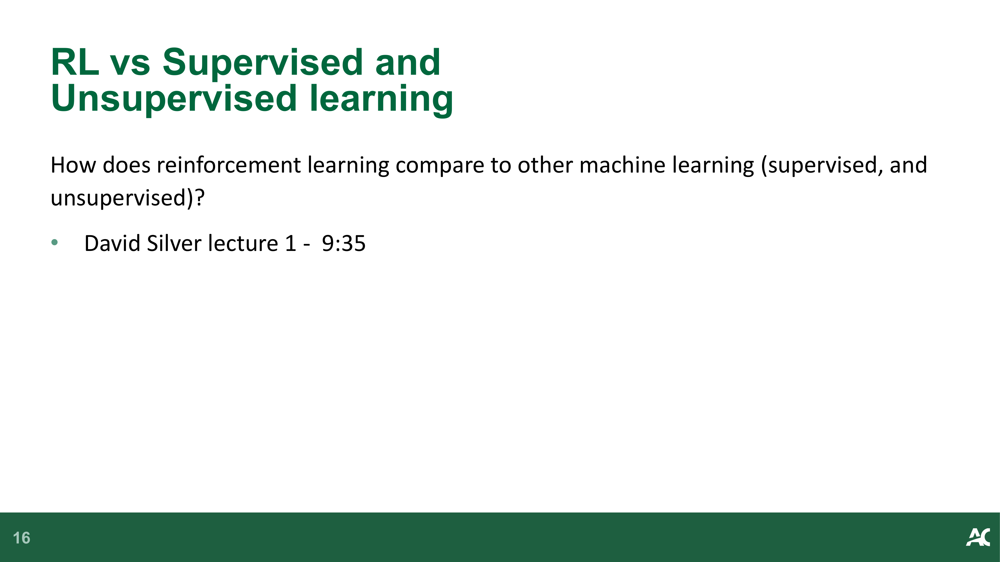

### 📝 Text Content

**RL vs Supervised and**

Unsupervised learning
How does reinforcement learning compare to other machine learning (supervised, and
unsupervised)?

• David Silver lecture 1 - 9:35

### ✍️ Notes

> [Add your notes here]

---

## Page 17

### 📷 Page Image

### 📝 Text Content

**RL Examples**

• David Silver Lecture 1: 12:45 - examples of RL, starting with stunt

manoeuvers model helicopter (training is done offline with a model of a
helicopter world)

• David Silver Lecture 1: after helicopter - video games (many Atari games

better than humans) decisions at 15HZ (3 or 4 days of training per game)

• Tetris: https://www.cbc.ca/player/play/2296942659841

• our coffee robot?

• monkey and banana?

### ✍️ Notes

> [Add your notes here]

---

## Page 18

### 📷 Page Image

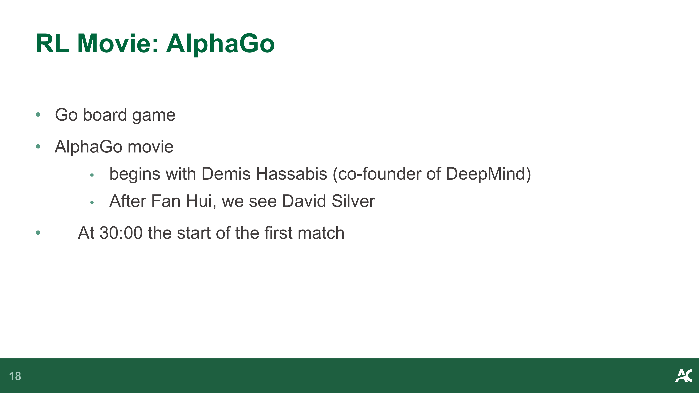

### 📝 Text Content

**RL Movie: AlphaGo**

• Go board game

• AlphaGo movie

begins with Demis Hassabis (co-founder of DeepMind)
After Fan Hui, we see David Silver

• At 30:00 the start of the first match

### ✍️ Notes

> [Add your notes here]

---

## Page 19

### 📷 Page Image

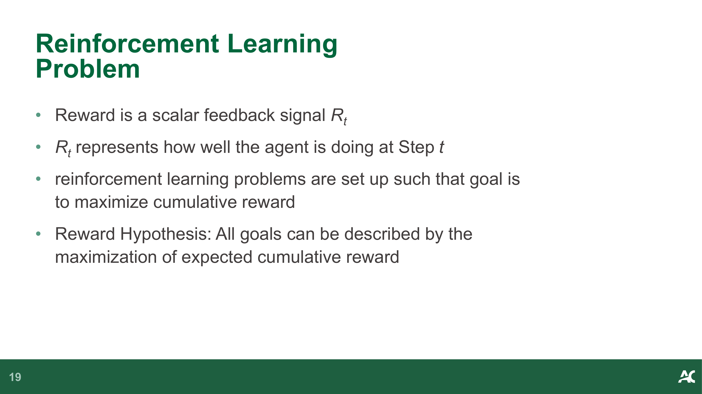

### 📝 Text Content

**Reinforcement Learning**

Problem

• Reward is a scalar feedback signal R

t

• R represents how well the agent is doing at Step t

t

• reinforcement learning problems are set up such that goal is

to maximize cumulative reward

• Reward Hypothesis: All goals can be described by the

maximization of expected cumulative reward

### ✍️ Notes

> [Add your notes here]

---

## Page 20

### 📷 Page Image

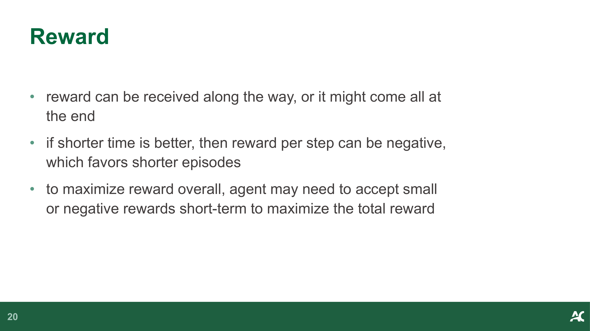

### 📝 Text Content

**Reward**

• reward can be received along the way, or it might come all at

the end

• if shorter time is better, then reward per step can be negative,

which favors shorter episodes

• to maximize reward overall, agent may need to accept small

or negative rewards short-term to maximize the total reward

### ✍️ Notes

> [Add your notes here]

---

## Page 21

### 📷 Page Image

### 📝 Text Content

**Anatomy of a Reinforcement**

Learning Problem

• agent and environment diagram

• our algorithm operates in the agent

### ✍️ Notes

> [Add your notes here]

---

## Page 22

### 📷 Page Image

### 📝 Text Content

**Anatomy of a Reinforcement**

Learning Problem

• each time step, the agent receives Reward, Observation, and performs Action

• the time series of Reward, Observation, and Actions is the data for

Reinforcement learning

• the history at time step t is H = R , O , A , ... , R , O , A

t 1 1 1 t t t

### ✍️ Notes

> [Add your notes here]

---

## Page 23

### 📷 Page Image

### 📝 Text Content

**Anatomy of a Reinforcement**

Learning Problem

• the agent picks the next action at time t based on the

information/data contained in H
t

• the environment determines Observations and Rewards

• processing the whole history is cumbersome after many steps

• State is a summary of the information that is used to

determine what happens next (t+1)

### ✍️ Notes

> [Add your notes here]

---

## Page 24

### 📷 Page Image

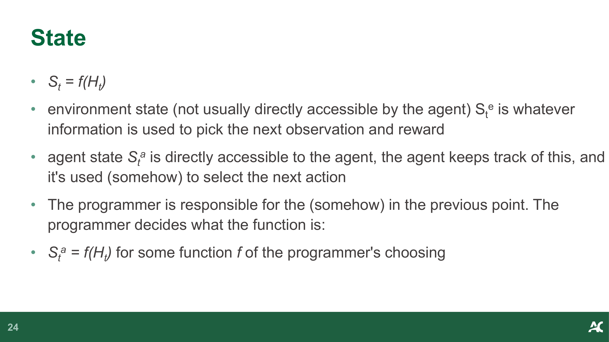

### 📝 Text Content

**State**

• S = f(H )

t t

• environment state (not usually directly accessible by the agent) S e is whatever

t
information is used to pick the next observation and reward

• agent state S a is directly accessible to the agent, the agent keeps track of this, and

t
it's used (somehow) to select the next action

• The programmer is responsible for the (somehow) in the previous point. The

programmer decides what the function is:

• S a = f(H ) for some function f of the programmer's choosing

t t

### ✍️ Notes

> [Add your notes here]

---

## Page 25

### 📷 Page Image

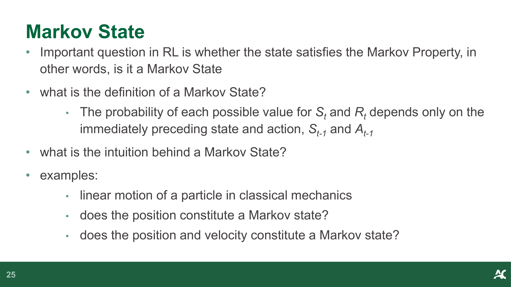

### 📝 Text Content

**Markov State**

• Important question in RL is whether the state satisfies the Markov Property, in

other words, is it a Markov State

• what is the definition of a Markov State?

The probability of each possible value for S and R depends only on the
t t
immediately preceding state and action, S and A
t-1 t-1

• what is the intuition behind a Markov State?

• examples:

linear motion of a particle in classical mechanics
does the position constitute a Markov state?
does the position and velocity constitute a Markov state?

### ✍️ Notes

> [Add your notes here]

---

## Page 26

### 📷 Page Image

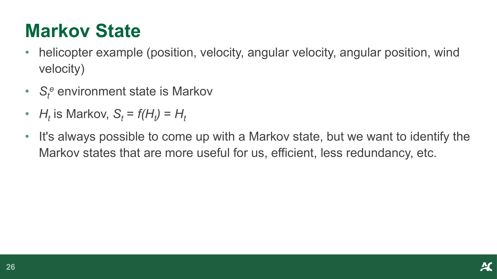

### 📝 Text Content

**Markov State**

• helicopter example (position, velocity, angular velocity, angular position, wind

velocity)

• S e environment state is Markov

t

• H is Markov, S = f(H ) = H

t t t t

• It's always possible to come up with a Markov state, but we want to identify the

Markov states that are more useful for us, efficient, less redundancy, etc.

### ✍️ Notes

> [Add your notes here]

---

## Page 27

### 📷 Page Image

### 📝 Text Content

**Rat Example**

• David Silver Lecture 1, 47:54

• depending on what function is chosen for f(H ), the question mark can be electric

t
shock, cheese, or unknown.

### ✍️ Notes

> [Add your notes here]

---

## Page 28

### 📷 Page Image

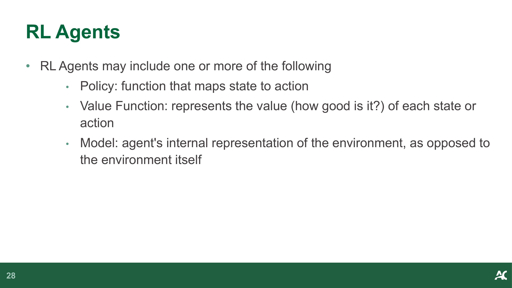

### 📝 Text Content

**RL Agents**

• RL Agents may include one or more of the following

Policy: function that maps state to action
Value Function: represents the value (how good is it?) of each state or
action
Model: agent's internal representation of the environment, as opposed to
the environment itself

### ✍️ Notes

> [Add your notes here]

---

## Page 29

### 📷 Page Image

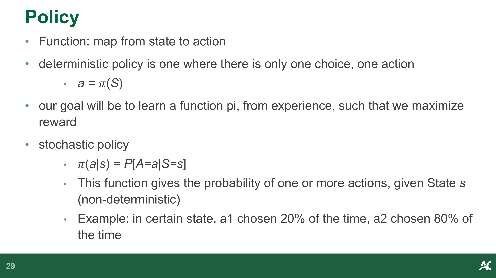

### 📝 Text Content

**Policy**

• Function: map from state to action

• deterministic policy is one where there is only one choice, one action

a = 𝜋(S)

• our goal will be to learn a function pi, from experience, such that we maximize

reward

• stochastic policy

𝜋(a|s) = P[A=a|S=s]
This function gives the probability of one or more actions, given State s
(non-deterministic)
Example: in certain state, a1 chosen 20% of the time, a2 chosen 80% of
the time

### ✍️ Notes

> [Add your notes here]

---

## Page 30

### 📷 Page Image

### 📝 Text Content

**Value Function**

• the value function indicates how good it is to be in a particular state with respect

to expected future reward

• used to pick actions, interacts with policy

• the value function for a policy is the sum of the expected reward for all future

states

### ✍️ Notes

> [Add your notes here]

---

## Page 31

### 📷 Page Image

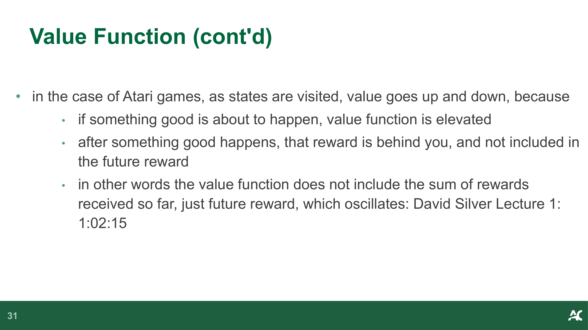

### 📝 Text Content

**Value Function (cont'd)**

• in the case of Atari games, as states are visited, value goes up and down, because

if something good is about to happen, value function is elevated
after something good happens, that reward is behind you, and not included in
the future reward
in other words the value function does not include the sum of rewards
received so far, just future reward, which oscillates: David Silver Lecture 1:
1:02:15

### ✍️ Notes

> [Add your notes here]

---

## Page 32

### 📷 Page Image

### 📝 Text Content

**Model**

• allows inferences about how the environment will behave

• model indicates or implies the next state and next reward.

• From Sutton, page 7: "Models are used for planning, by which we mean any

way of deciding on a course of action by considering possible future situations
before they are actually experienced."

• David Silver Lecture 1: Transition model (predicts states) Reward Model

(predicts rewards)

• not all Reinforcement Learning Problems/Solutions include a model

### ✍️ Notes

> [Add your notes here]

---

## Page 33

### 📷 Page Image

### 📝 Text Content

**Maze Example**

• David Silver, Lecture 1: 1:08:00

### ✍️ Notes

> [Add your notes here]

---

## Page 34

### 📷 Page Image

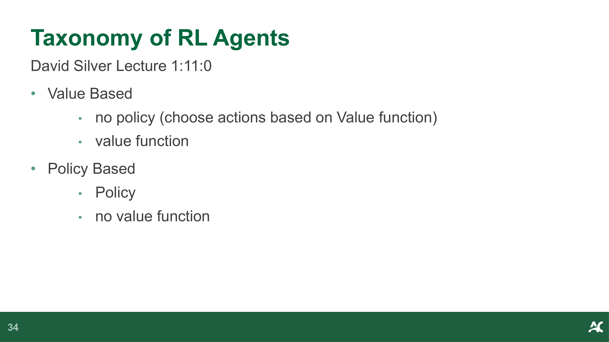

### 📝 Text Content

**Taxonomy of RL Agents**

David Silver Lecture 1:11:0

• Value Based

no policy (choose actions based on Value function)
value function

• Policy Based

Policy
no value function

### ✍️ Notes

> [Add your notes here]

---

## Page 35

### 📷 Page Image

### 📝 Text Content

**Taxonomy of RL Agents**

• Actor Critic

Policy (actor)
Value Function (critic)

• Model Free

Policy and/or Value Function
no Model

• Model Based

Policy and/or Value Function
Model

### ✍️ Notes

> [Add your notes here]

---

## Page 36

### 📷 Page Image

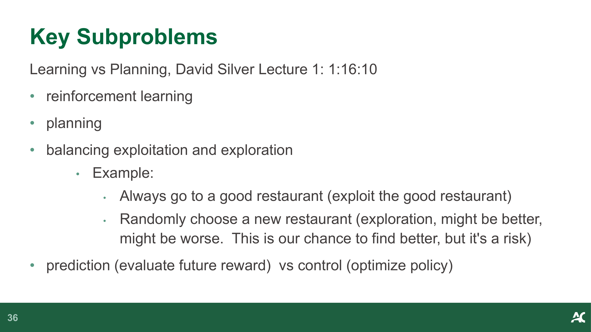

### 📝 Text Content

**Key Subproblems**

Learning vs Planning, David Silver Lecture 1: 1:16:10

• reinforcement learning

• planning

• balancing exploitation and exploration

Example:
Always go to a good restaurant (exploit the good restaurant)
Randomly choose a new restaurant (exploration, might be better,
might be worse. This is our chance to find better, but it's a risk)

• prediction (evaluate future reward) vs control (optimize policy)

### ✍️ Notes

> [Add your notes here]

---

## Page 37

### 📷 Page Image

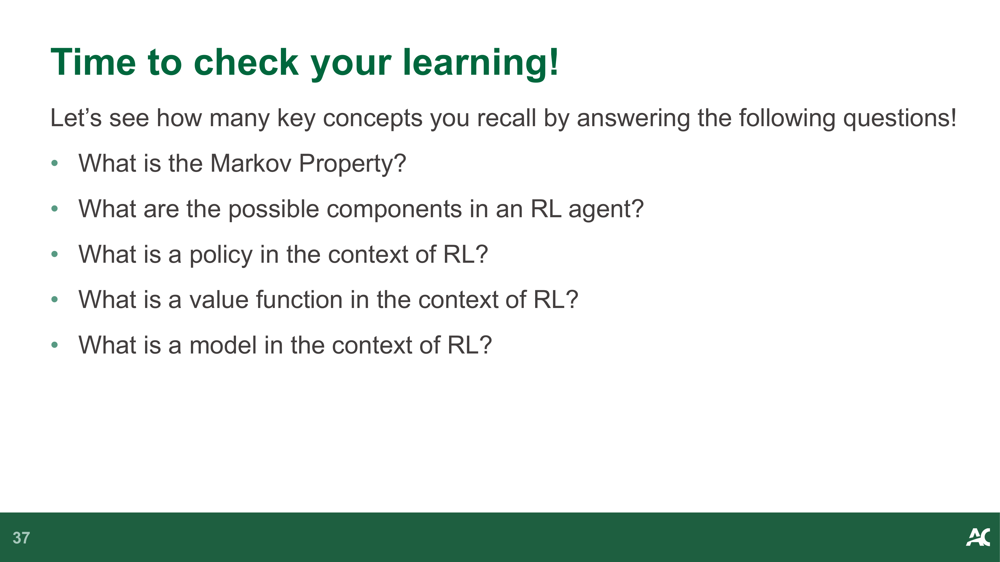

### 📝 Text Content

**Time to check your learning!**

Let’s see how many key concepts you recall by answering the following questions!

• What is the Markov Property?

• What are the possible components in an RL agent?

• What is a policy in the context of RL?

• What is a value function in the context of RL?

• What is a model in the context of RL?

### ✍️ Notes

> [Add your notes here]

---
