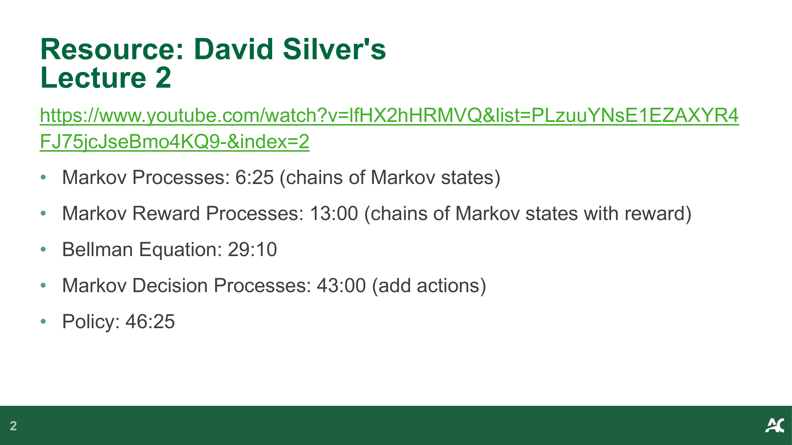
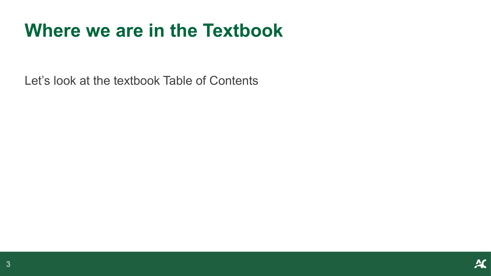
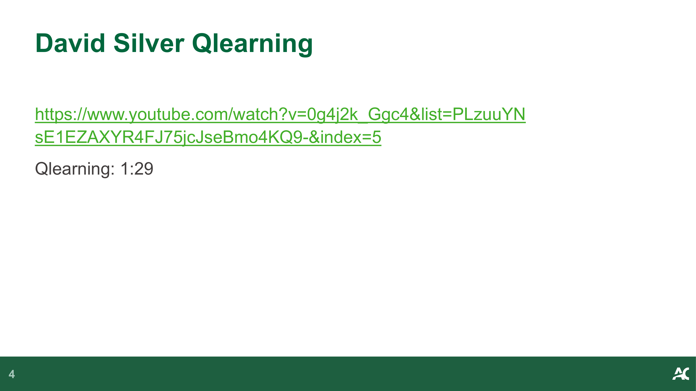
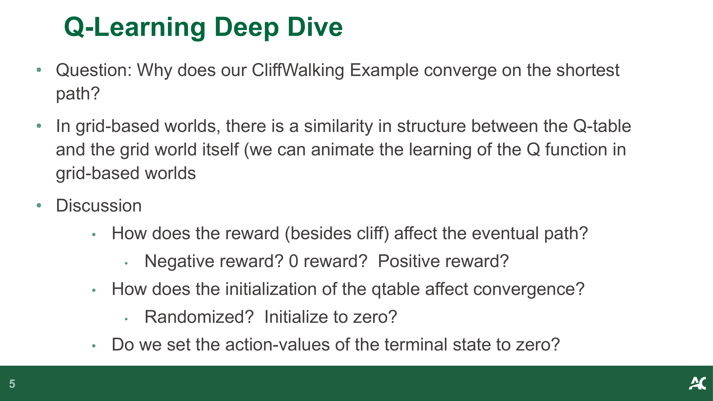
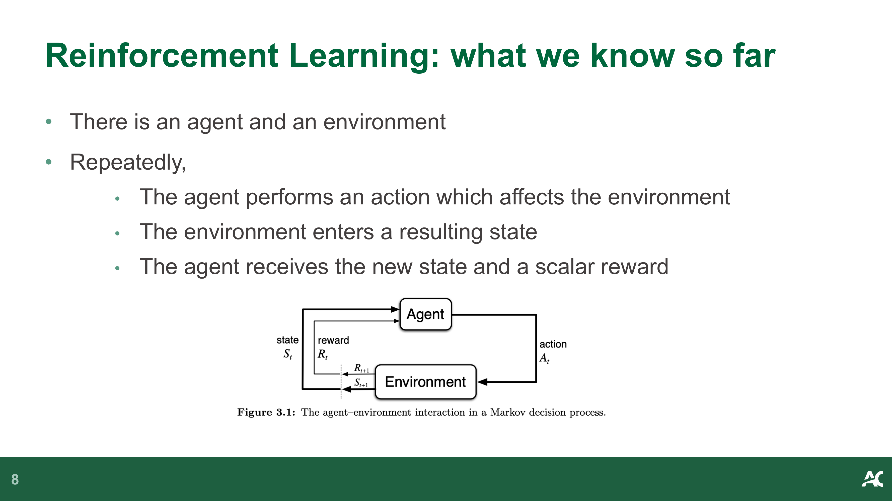
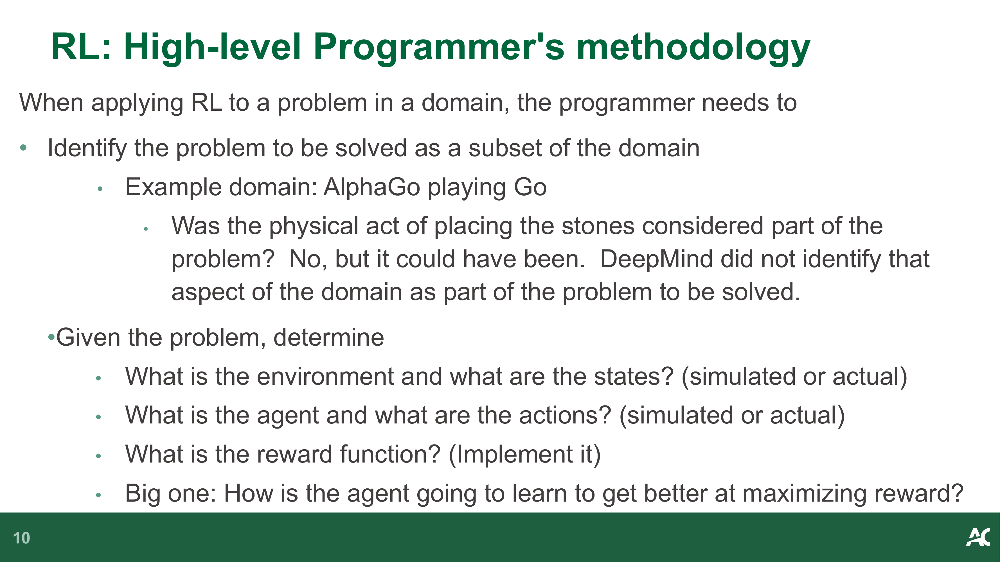
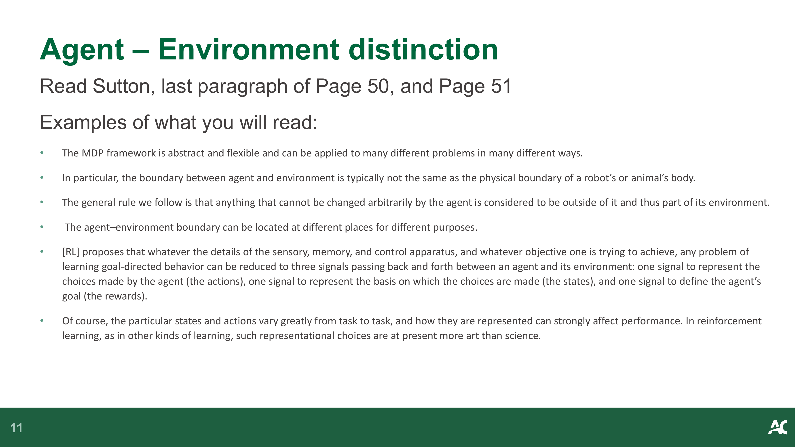
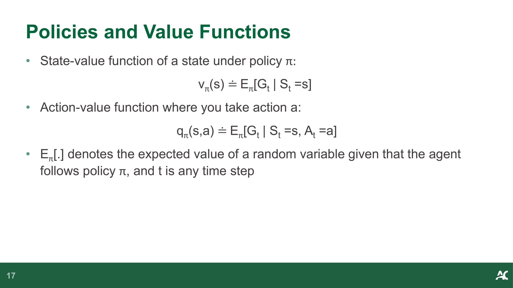
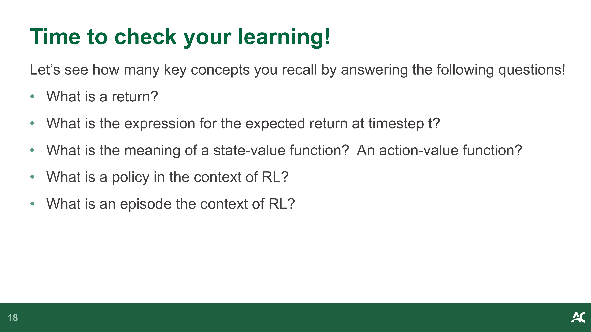

# CST8509 02 MDP

**Source:** `CST8509_02_MDP.pdf`  
**Total Pages:** 18  
**Format:** Hybrid (pdfplumber + PyMuPDF)

---

## Page 1

### 📷 Page Image


### 📝 Text Content

**Markov Decision Processes**


### ✍️ Notes

**📝 笔记:**

**主题:** Markov Decision Processes (马尔可夫决策过程)

- 本讲座介绍 MDP 的核心概念
- 是强化学习的理论基础

---

## Page 2

### 📷 Page Image



### 📝 Text Content

**Resource: David Silver's Lecture 2 **
https://www.youtube.com/watch?v=lfHX2hHRMVQ&list=PLzuuYNsE1EZAXYR4FJ75jcJseBmo4KQ9-&index=2

• Markov Processes: 6:25 (chains of Markov states)

• Markov Reward Processes: 13:00 (chains of Markov states with reward)

• Bellman Equation: 29:10

• Markov Decision Processes: 43:00 (add actions)

• Policy: 46:25


### ✍️ Notes

**📝 笔记:**

**学习资源:**

- David Silver 的经典 RL 课程
- 按时间戳组织的关键概念：从 Markov Processes → MRP → MDP → Policy
- 建议按顺序观看，逐步理解概念演进

**💡 提示:** 可以跳转到特定时间戳复习单个概念

---

## Page 3

### 📷 Page Image



### 📝 Text Content

**Where we are in the Textbook**

Let’s look at the textbook Table of Contents


### ✍️ Notes

> [Add your notes here]

---

## Page 4

### 📷 Page Image



### 📝 Text Content

**David Silver Qlearning**

https://www.youtube.com/watch?v=0g4j2k_Ggc4&list=PLzuuYNsE1EZAXYR4FJ75jcJseBmo4KQ9-&index=5
Qlearning: 1:29


### ✍️ Notes

**📝 笔记:**

**Q-Learning 视频:**
- David Silver 第5讲 1:29 开始讲解 Q-Learning
- Q-Learning 是 off-policy 的 TD 控制算法

---

## Page 5

### 📷 Page Image



### 📝 Text Content

**Q-Learning Deep Dive**


• Question: Why does our CliffWalking Example converge on the shortest path?

• In grid-based worlds, there is a similarity in structure between the Q-table and the grid world itself (we can animate the learning of the Q function in grid-based worlds

• Discussion

- How does the reward (besides cliff) affect the eventual path?
  - Negative reward? 0 reward? Positive reward?
- How does the initialization of the qtable affect convergence?
  - Randomized? Initialize to zero?
- Do we set the action-values of the terminal state to zero?


### ✍️ Notes

**📝 笔记:**

**Q-Learning 深入讨论:**
- CliffWalking 为什么收敛到最短路径？
- 网格世界中 Q-table 结构与环境相似，可以可视化学习过程

**关键问题:**
- 奖励如何影响最终路径？（负奖励/零奖励/正奖励）
- Q-table 初始化如何影响收敛？（随机/零初始化）
- 终止状态的动作值是否设为零？

**💡 提示:** 不同的奖励设置会导致不同的最优策略

---

## Page 6

### 📷 Page Image


### 📝 Text Content

**SARSA**

• An implementation of the SARSA algorithm

```python
# SARSA algorithm from Sutton textbook
# Algorithm parameters: step size alpha in (0, 1], small epsilon > 0
# Initialize Q(s,a), for all s in S+, a in A(s), arbitrarily except that Q(terminal,·) = 0
# Loop for each episode:
#   Initialize S
#   Choose A from S using policy derived from Q (e.g., epsilon-greedy)
#   Loop for each step of episode:
#     Take action A, observe R, S_prime
#     Choose A_prime from S_prime using policy derived from Q (e.g., epsilon-greedy)
#     Q(S, A) = Q(S, A) + alpha * (R + gamma * Q(S_prime, A_prime) - Q(S, A))
#     S = S_prime; A = A_prime;
#   until S is terminal
```

### ✍️ Notes

**📝 笔记:**

**SARSA 算法:**
- State-Action-Reward-State-Action 的缩写
- On-policy TD 控制算法
- 更新公式: Q(S,A) ← Q(S,A) + α[R + γQ(S',A') - Q(S,A)]

**关键步骤:**
1. 初始化 Q(s,a)，终止状态设为 0
2. 选择动作 A（使用 ε-greedy）
3. 执行 A，观察 R 和 S'
4. 选择下一个动作 A'（使用 ε-greedy）
5. 更新 Q 值
6. S←S', A←A'

**💡 提示:** SARSA 使用实际执行的动作来更新 Q 值

---

## Page 7

### 📷 Page Image


### 📝 Text Content

**On-policy vs Off-policy**

• SARSA is an on-policy control method and Q-learning is an off-policy control method

• Why, what is the difference?

• In both, we have an implicit policy (epsilon-greedy):

```python
# act randomly sometimes to allow exploration
if np.random.uniform() < epsilon:
    action = env.action_space.sample()
# otherwise select max action in Qtable (act greedy)
else:
    action = qtable[state].index(max(qtable[state]))
```

• The difference is magnified if we set epsilon = 1 (totally random policy)

  • SARSA update the qtable using the value of the random action
  • Q-Learning update the qtable using the action with max value


### ✍️ Notes

**📝 笔记:**

**On-policy vs Off-policy:**
- SARSA: on-policy（在策略）
- Q-Learning: off-policy（离策略）

**核心区别:**
- 两者都使用 ε-greedy 策略
- 当 ε=1（完全随机）时差异最明显：
  - SARSA: 使用实际执行的随机动作更新 Q 值
  - Q-Learning: 使用最大 Q 值的动作更新（贪婪）

**💡 提示:** Q-Learning 学习最优策略，SARSA 学习当前策略

---

## Page 8

### 📷 Page Image



### 📝 Text Content

**Reinforcement Learning: what we know so far**


• There is an agent and an environment

• Repeatedly,

The agent performs an action which affects the environment
The environment enters a resulting state
The agent receives the new state and a scalar reward


### ✍️ Notes

**📝 笔记:**

**强化学习基本框架:**
- 智能体 (Agent) 与环境 (Environment) 交互
- 循环过程：动作 → 状态 → 奖励

**三个核心信号:**
1. 动作 (Action): 智能体的选择
2. 状态 (State): 环境的反馈
3. 奖励 (Reward): 标量信号

---

## Page 9

### 📷 Page Image


### 📝 Text Content

**Reinforcement Learning: what we know so far**


• The agent learns by interacting with the environment

• The goal of the agent is to maximize reward

- The agent learns how to maximize reward
- The agent takes actions to maximize reward

• Reward Hypothesis (from Sutton):

That all of what we mean by goals and purposes can be well thought of as the
maximization of the expected value of the cumulative sum of a received scalar
signal (called reward).


### ✍️ Notes

**📝 笔记:**

**强化学习核心原则:**
- 智能体通过与环境交互学习
- 目标：最大化累积奖励

**奖励假设 (Reward Hypothesis):**
- 所有目标和目的都可以表示为最大化累积奖励的期望值
- 奖励是标量信号

**💡 提示:** 奖励设计是 RL 问题建模的关键

---

## Page 10

### 📷 Page Image



### 📝 Text Content

**RL: High-level Programmer's methodology**

When applying RL to a problem in a domain, the programmer needs to

• Identify the problem to be solved as a subset of the domain

Example domain: AlphaGo playing Go
Was the physical act of placing the stones considered part of the
problem? No, but it could have been. DeepMind did not identify that
aspect of the domain as part of the problem to be solved.

• Given the problem, determine

What is the environment and what are the states? (simulated or actual)
What is the agent and what are the actions? (simulated or actual)
What is the reward function? (Implement it)
Big one: How is the agent going to learn to get better at maximizing reward?


### ✍️ Notes

**📝 笔记:**

**RL 问题建模步骤:**

1. **识别问题:** 确定要解决的具体问题
   - 例：AlphaGo 不考虑物理放置棋子的动作

2. **确定要素:**
   - 环境和状态是什么？（模拟或真实）
   - 智能体和动作是什么？（模拟或真实）
   - 奖励函数如何设计？（需要实现）
   - 智能体如何学习最大化奖励？

**💡 提示:** 问题边界的划分是建模的艺术

---

## Page 11

### 📷 Page Image



### 📝 Text Content

**Agent – Environment distinction**

Read Sutton, last paragraph of Page 50, and Page 51
Examples of what you will read:

• The MDP framework is abstract and flexible and can be applied to many different problems in many different ways.

• In particular, the boundary between agent and environment is typically not the same as the physical boundary of a robot’s or animal’s body.

• The general rule we follow is that anything that cannot be changed arbitrarily by the agent is considered to be outside of it and thus part of its environment.

• The agent–environment boundary can be located at different places for different purposes.

• [RL] proposes that whatever the details of the sensory, memory, and control apparatus, and whatever objective one is trying to achieve, any problem of

learning goal-directed behavior can be reduced to three signals passing back and forth between an agent and its environment: one signal to represent the
choices made by the agent (the actions), one signal to represent the basis on which the choices are made (the states), and one signal to define the agent’s
goal (the rewards).

• Of course, the particular states and actions vary greatly from task to task, and how they are represented can strongly affect performance. In reinforcement

learning, as in other kinds of learning, such representational choices are at present more art than science.


### ✍️ Notes

**📝 笔记:**

**智能体-环境边界 (Sutton 第50-51页):**

**关键原则:**
- MDP 框架抽象且灵活，可应用于多种问题
- 边界不等于物理边界（如机器人身体）
- 智能体无法任意改变的部分属于环境
- 边界位置可根据目的不同而变化

**三个信号:**
1. 动作 (Actions): 智能体的选择
2. 状态 (States): 选择的依据
3. 奖励 (Rewards): 定义目标

**💡 提示:** 状态和动作的表示方式会强烈影响性能，目前更多是艺术而非科学

---

## Page 12

### 📷 Page Image


### 📝 Text Content

**Rewards + Goals**

Sutton, Pages 53-4:

• We must provide rewards in such a way that in maximizing them the agent will

also achieve our goals. It is thus critical that the rewards we set up truly indicate
what we want accomplished. In particular, the reward signal is not the place to
impart to the agent prior knowledge about how to achieve what we want it to do.

• Do not design the reward around subgoals

• The reward signal is your way of communicating to the robot what you want it to

achieve, not how you want it achieved. (compare with Declarative
programming)

• Do not base rewards on previous actions (unless the action sequence IS the

goal, like maybe dance moves?)


### ✍️ Notes

**📝 笔记:**

**奖励设计原则 (Sutton 第53-54页):**

**正确做法:**
- 奖励表达"想要什么"，而非"如何实现"
- 类似声明式编程 (Declarative Programming)

**错误做法:**
- ❌ 不要围绕子目标设计奖励
- ❌ 不要将先验知识编码到奖励中
- ❌ 不要基于之前的动作给奖励（除非动作序列本身就是目标，如舞蹈动作）

**💡 提示:** 奖励是沟通目标的方式，不是实现方法的指导

---

## Page 13

### 📷 Page Image


### 📝 Text Content

**Returns and Episodes**


• Some processes/tasks have a terminal state (episodic tasks, episodes):

A single play of a game
A run through a maze, or race around a track (finish line)
Making a cup of coffee
These processes have a terminal state
The time-step of termination, T, is a random variable that normally
varies from episode to episode.

• Other processes never finish (continuing tasks, T=∞):

Controlling a power plant
Home thermostat controlling humidity, temperature


### ✍️ Notes

**📝 笔记:**

**回报与情节 (Returns and Episodes):**

**情节式任务 (Episodic Tasks):**
- 有终止状态
- 例子：游戏、迷宫、泡咖啡
- 终止时间步 T 是随机变量

**持续式任务 (Continuing Tasks):**
- 永不终止 (T=∞)
- 例子：电厂控制、温控器

**💡 提示:** 任务类型决定了回报的计算方式

---

## Page 14

### 📷 Page Image


### 📝 Text Content

**Returns and Episodes**


• We seek to maximize expected return, where return, G could be defined as

t
G ≐ R +R +R +···+R
t t+1 t+2 t+3 T
but this is a problem for continuing tasks, because return blows up.

• To address this problem, there is discounting, with a discount rate 𝛾:

G ≐ R + 𝛾 R + 𝛾2 R +···
t t+1 t+2 t+3
= R + 𝛾 G
t+1 t+1
As 𝛾 approaches 1, the return objective takes future rewards into account more
strongly; the agent becomes more farsighted

• For episodic tasks, to make this work, there is a special state ("absorbing state")

that always transitions to itself, with a reward of


### ✍️ Notes

> [Add your notes here]

---

## Page 15

### 📷 Page Image


### 📝 Text Content

**Epochs**

In RL, we have episodes
Sometimes (Lab 1) you'll see a notion of epochs in a RL context. An Epoch is a
single pass through the dataset, but RL has no such dataset!


### ✍️ Notes

**📝 笔记:**

**术语区分:**
- **Episode（情节）:** RL 中的一次完整交互过程
- **Epoch（轮次）:** 监督学习中遍历整个数据集一次

**💡 提示:** RL 没有固定数据集，所以不使用 epoch 概念

---

## Page 16

### 📷 Page Image


### 📝 Text Content

**Policies and Value Functions**


• A Policy is a mapping (a function) from states to probabilities of selecting each

possible action: π(a|s) = P[A = a|S = s]
t t

• A deterministic policy is a mapping from states to actions: π(s) = a

• Value function of a state (or state-action pair):

Gives the expected return when starting at a state
Different policies result in different returns


### ✍️ Notes

**📝 笔记:**

**策略 (Policy):**
- 从状态到动作概率的映射：π(a|s) = P[A_t=a|S_t=s]
- 确定性策略：π(s) = a（直接映射到动作）

**价值函数 (Value Function):**
- 状态价值函数：从某状态开始的期望回报
- 不同策略产生不同的回报

**💡 提示:** 策略决定行为，价值函数评估策略的好坏

---

## Page 17

### 📷 Page Image



### 📝 Text Content

**Policies and Value Functions**


• State-value function of a state under policy π:

v (s) ≐ E [G | S =s]
π π t t

• Action-value function where you take action a:

q (s,a) ≐ E [G | S =s, A =a]
π π t t t

• E [.] denotes the expected value of a random variable given that the agent

π
follows policy π, and t is any time step


### ✍️ Notes

**📝 笔记:**

**价值函数定义:**

**状态价值函数:**
- v_π(s) = E_π[G_t | S_t=s]
- 在策略 π 下，从状态 s 开始的期望回报

**动作价值函数:**
- q_π(s,a) = E_π[G_t | S_t=s, A_t=a]
- 在状态 s 执行动作 a 后，遵循策略 π 的期望回报

**符号说明:**
- E_π[·]: 在策略 π 下的期望值
- t: 任意时间步

**💡 提示:** q 函数比 v 函数多了动作选择的信息

---

## Page 18

### 📷 Page Image



### 📝 Text Content

**Time to check your learning!**

Let’s see how many key concepts you recall by answering the following questions!

• What is a return?

• What is the expression for the expected return at timestep t?

• What is the meaning of a state-value function? An action-value function?

• What is a policy in the context of RL?

• What is an episode the context of RL?


### ✍️ Notes

**📝 笔记:**

**自测问题:**

1. **什么是回报 (Return)?**
   - 从当前时刻开始的累积奖励（可能带折扣）

2. **时间步 t 的期望回报表达式是什么?**
   - G_t = R_{t+1} + γR_{t+2} + γ²R_{t+3} + ...

3. **状态价值函数和动作价值函数的含义?**
   - v_π(s): 从状态 s 开始的期望回报
   - q_π(s,a): 在状态 s 执行动作 a 后的期望回报

4. **RL 中的策略是什么?**
   - 从状态到动作（概率）的映射

5. **RL 中的情节是什么?**
   - 从初始状态到终止状态的完整交互序列

**💡 提示:** 这些是 MDP 的核心概念，需要牢固掌握

---
