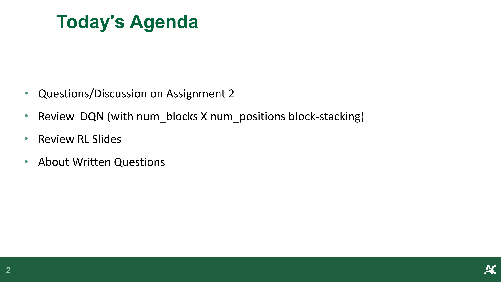
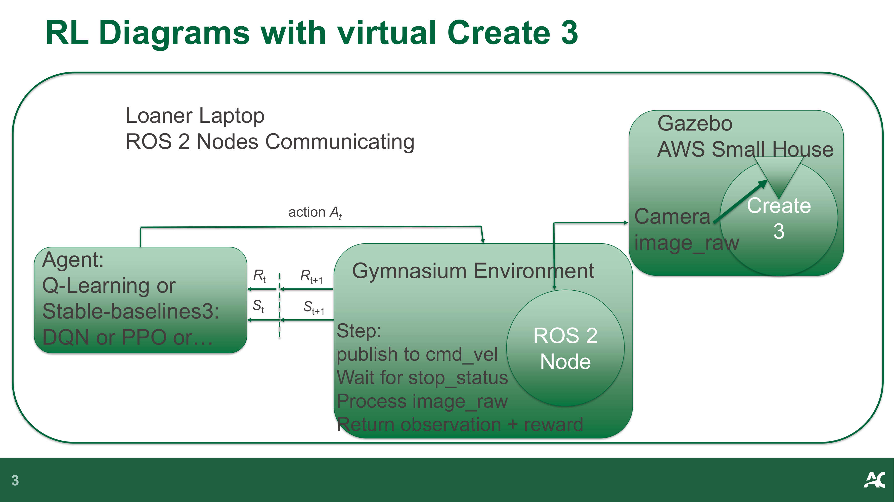
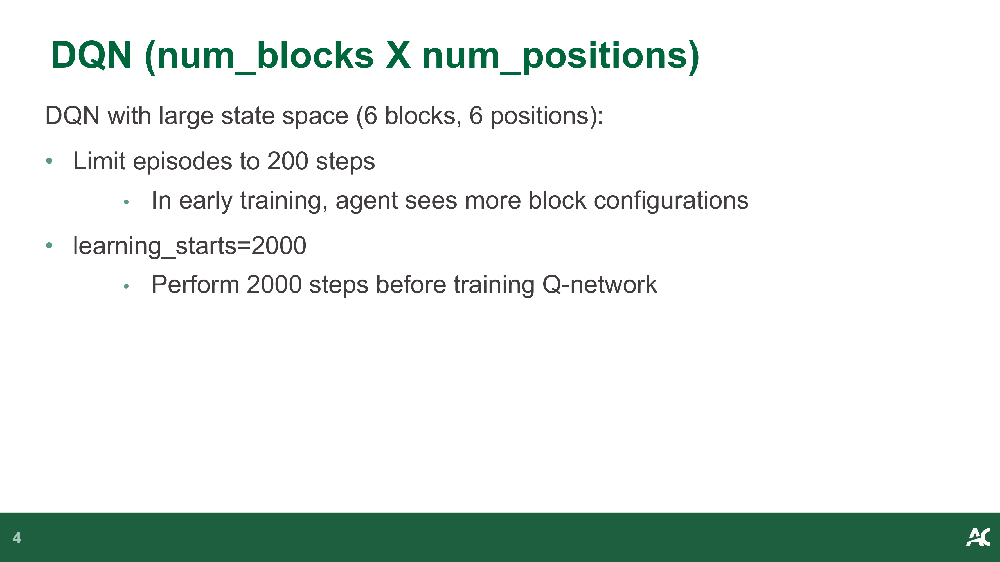
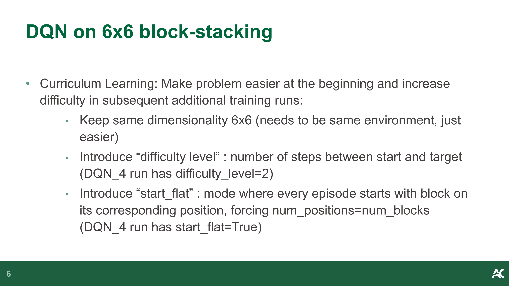
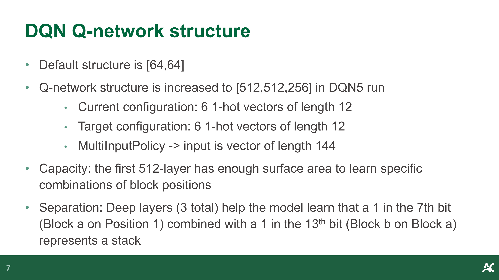
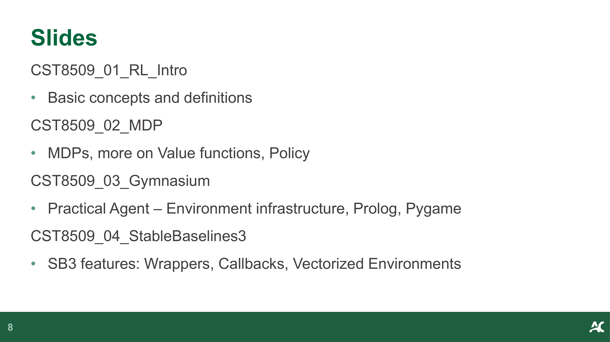
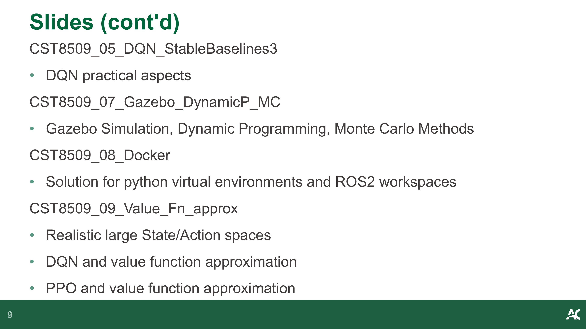
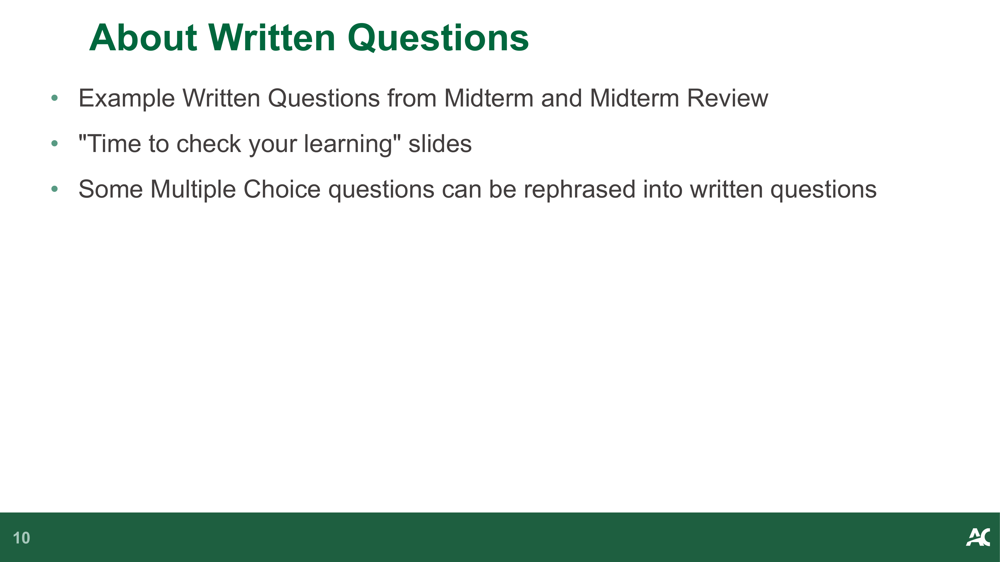
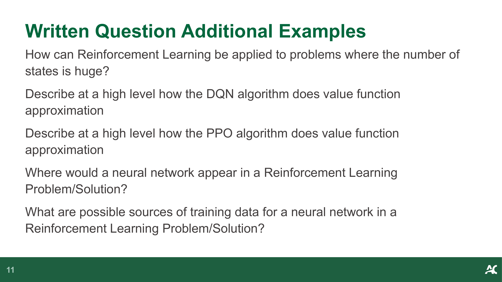
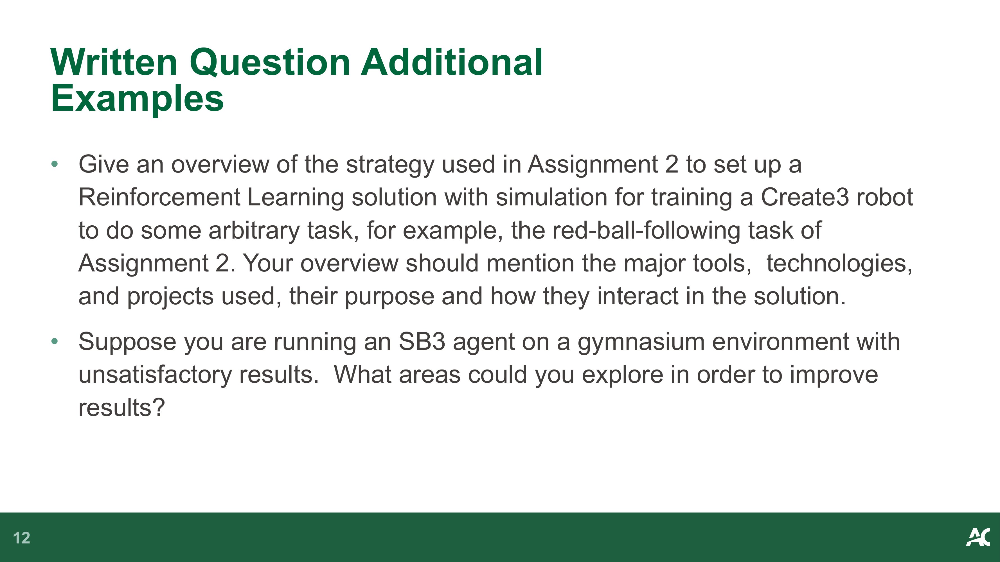

# Week 10: 期末复习 (Final Review)

> Source: `CST8509_10_Final_Review.pdf`
> Total slides: 12
> Instructor: TBD | TBD

---

## 1. 今日议程 (Today's Agenda)

**Final Review** — 期末复习

**Today's Agenda** — 今日议程

- Questions/Discussion on Assignment — 关于作业的提问与讨论
- Review DQN (with num_blocks X num_positions block-stacking) — 复习 DQN（带 num_blocks X num_positions 的方块堆叠）
- Review RL Slides — 复习强化学习课件
- About Written Questions — 关于笔试题

> **📝 Notes:**
>
> **承接**: 本节作为开篇，介绍期末复习的核心议程；这将为接下来的系统复习提供框架导航。

---

## 2. 虚拟 Create 机器人的强化学习架构 (RL Diagrams with virtual Create)

**RL Diagrams with virtual Create** — 虚拟 Create 机器人的强化学习架构

- **Environment setup:** Loaner Laptop, Gazebo, ROS 2 Nodes Communicating, AWS Small House — **环境设置**：外借笔记本，Gazebo，ROS 2 节点通信，AWS 小屋
- **Agent/Gymnasium Environment Cycle:** — **智能体/Gymnasium 环境循环：**
  - $S_t$ (State) and $R_t$ (Reward) feed into the Agent — $S_t$（状态）和 $R_t$（奖励）输入到智能体中
  - Agent (Q-Learning or Stable-baselines3: DQN or PPO or...) processes and outputs $A_t$ (Action) — 智能体（Q-Learning 或 Stable-baselines3: DQN, PPO 等）处理并输出 $A_t$（动作）
  - Action goes to Environment ($S_{t+1}$, $R_{t+1}$ generation) — 动作传入环境（生成 $S_{t+1}$，$R_{t+1}$）
- **Node Interaction:** — **节点交互：**
  - `publish to cmd_vel` — 发布到 `cmd_vel`
  - `Wait for stop_status` — 等待 `stop_status`
  - `Process image_raw` — 处理 `image_raw`
  - `Return observation + reward` — 返回观察值 + 奖励

> **📝 Notes:**
>
> **承接**: 上一节明确了复习大纲；本节回顾了基于 ROS2 和 Gazebo 的 Create 机器人仿真环境架构，为下一节的 DQN 算法应用复习提供了环境背景。

---

## 3. 针对方块堆叠的 DQN (DQN on Block-Stacking)

### 3.1 训练策略与课程学习 (Training Strategy & Curriculum Learning)

**DQN (num_blocks X num_positions)** — DQN（方块数 X 位置数）

DQN with large state space (6 blocks, 6 positions): — 具有大状态空间的 DQN（6个方块，6个位置）：
- Limit episodes to **200 steps** — 将回合限制为 **200 步**
  - In early training, agent sees more block configurations — 在早期训练中，智能体会看到更多的方块配置
- `learning_starts=2000` — `learning_starts=2000` 模型开始学习的步数
  - Perform 2000 steps before training Q-network — 在训练 Q 网络之前执行 2000 步

**DQN on 6x6 block-stacking** — 6x6 方块堆叠的 DQN

- **Curriculum Learning**: Make problem easier at the beginning and increase difficulty in subsequent additional training runs: — **课程学习 (Curriculum Learning)**：一开始让问题更容易，在随后的附加训练运行中增加难度：
  - Keep same dimensionality 6x6 (needs to be same environment, just easier) — 保持相同的 6x6 维度（需要是相同的环境，只是更容易）
  - Introduce "**difficulty level**": number of steps between start and target (DQN_4 run has difficulty_level=2) — 引入“**难度级别 (difficulty level)**”：起点和目标之间的步数（DQN_4 运行的难度级别为 2）
  - Introduce "**start_flat**": mode where every episode starts with block on its corresponding position, forcing num_positions=num_blocks (DQN_4 run has start_flat=True) — 引入“**平铺启动 (start_flat)**”：每个回合都从相应位置上的方块开始的模式，强制 位置数=方块数（DQN_4 运行的 start_flat=True）

### 3.2 DQN Q 网络结构 (DQN Q-network structure)

**DQN Q-network structure** — DQN Q 网络结构

- Default structure is `[64,64]` — 默认结构为 `[64,64]`
- Q-network structure is increased to `[512,512,256]` in DQN5 run — 在 DQN5 运行中，Q 网络结构增加到 `[512,512,256]`
  - Current configuration: 6 1-hot vectors of length 12 — 当前配置：6 个长度为 12 的独热 (1-hot) 向量
  - Target configuration: 6 1-hot vectors of length 12 — 目标配置：6 个长度为 12 的独热 (1-hot) 向量
  - `MultiInputPolicy` -> input is vector of length 144 — `MultiInputPolicy` -> 输入是长度为 144 的向量
- **Capacity**: the first 512-layer has enough surface area to learn specific combinations of block positions — **容量 (Capacity)**：第一个 512 层有足够的表面积来学习方块位置的具体组合
- **Separation**: Deep layers (3 total) help the model learn that a 1 in the 7th bit (Block a on Position 1) combined with a 1 in the 13th bit (Block b on Block a) represents a stack — **分离性 (Separation)**：深层（共 3 层）有助于模型学习：第 7 位的 1（方块 a 在位置 1）与第 13 位的 1（方块 b 在方块 a 上）组合表示一个堆叠

> **📝 Notes:**
>
> **承接**: 上一节回顾了基本的 RL 架构，本节深入回顾了 Assignment 中的 DQN 方块堆叠任务，包括课程学习和网络结构设计；这将为后续的课程总体回顾铺平道路。

---

## 4. 课程资料总体回顾 (Review RL Slides)

**Slides** — 课件内容

- **CST8509_01_RL_Intro**: Basic concepts and definitions — **CST8509_01_RL_Intro**：基本概念和定义
- **CST8509_02_MDP**: MDPs, more on Value functions, Policy — **CST8509_02_MDP**：马尔可夫决策过程 (MDP)，值函数、策略概述
- **CST8509_03_Gymnasium**: Practical Agent – Environment infrastructure, Prolog, Pygame — **CST8509_03_Gymnasium**：实用的智能体 - 环境基础设施、Prolog、Pygame
- **CST8509_04_StableBaselines3**: SB3 features: Wrappers, Callbacks, Vectorized Environments — **CST8509_04_StableBaselines3**：SB3 特性：Wrappers封装器、Callbacks回调、Vectorized Environments向量化环境

**Slides (cont'd)** — 课件内容（续）

- **CST8509_05_DQN_StableBaselines3**: DQN practical aspects — **CST8509_05_DQN_StableBaselines3**：DQN 实践方面
- **CST8509_07_Gazebo_DynamicP_MC**: Gazebo Simulation, Dynamic Programming, Monte Carlo Methods — **CST8509_07_Gazebo_DynamicP_MC**：Gazebo 仿真、动态规划、蒙特卡洛方法
- **CST8509_08_Docker**: Solution for python virtual environments and ROS2 workspaces — **CST8509_08_Docker**：Python 虚拟环境和 ROS2 工作空间的解决方案
- **CST8509_09_Value_Fn_approx**: — **CST8509_09_Value_Fn_approx**（值函数近似）：
  - Realistic large State/Action spaces — 现实的大规模状态/动作空间
  - DQN and value function approximation — DQN 与值函数近似
  - PPO and value function approximation — PPO 与值函数近似

> **📝 Notes:**
>
> **承接**: 上一节详细分析了具体项目的 DQN 细节；本节梳理了这学期所有强化学习的讲义内容大纲，为接下来的期末笔试题复习提供了知识库索引。

---

## 5. 关于笔试题 (About Written Questions)

### 5.1 题型说明 (Question Types Overview)

**About Written Questions** — 关于笔试题

- Example Written Questions from Midterm and Midterm Review — 期中考试及期中复习中的示范笔试题
- "Time to check your learning" slides — "检查你的学习时间" 幻灯片
- Some Multiple Choice questions can be rephrased into written questions — 一些选择题可以改写成笔试题

### 5.2 补充示例题 (Additional Examples)

**Written Question Additional Examples** — 笔试部分补充实例题

- How can Reinforcement Learning be applied to problems where the number of states is huge? — 强化学习如何应用于状态数量庞大的问题中？
- Describe at a high level how the DQN algorithm does value function approximation — 概要描述 DQN 算法是如何进行值函数近似的
- Describe at a high level how the PPO algorithm does value function approximation — 概要描述 PPO 算法是如何进行值函数近似的
- Where would a neural network appear in a Reinforcement Learning Problem/Solution? — 神经网络会在强化学习问题/解决方案中的什么地方出现？
- What are possible sources of training data for a neural network in a Reinforcement Learning Problem/Solution? — 在强化学习问题/解决方案中，神经网络训练数据的可能来源有哪些？

**Written Question Additional Examples (cont'd)** — 笔试部分补充实例题（续）

- Give an overview of the strategy used in Assignment 2 to set up a Reinforcement Learning solution with simulation for training a Create3 robot to do some arbitrary task, for example, the red-ball-following task of Assignment 2. Your overview should mention the major tools, technologies, and projects used, their purpose and how they interact in the solution. — 概述在 Assignment 2 中使用的策略：该策略通过仿真设置强化学习解决方案，以训练 Create3 机器人执行某些特定任务（例如 Assignment 2 中的红球跟随任务）。你的概述应提及所使用的主要工具、技术和项目，它们的用途以及它们在解决方案中的交互方式。
- Suppose you are running an SB3 agent on a gymnasium environment with unsatisfactory results. What areas could you explore in order to improve results? — 假设你在 Gymnasium 环境中运行一个 SB3 (Stable Baselines 3) 智能体，但结果不理想。为了改善结果，你可以探索哪些方向？

> **📝 Notes:**
>
> **承接**: 上一节梳理了全部课程大纲；本节给出了期末笔试的具体题型和示范问题，作为总结以指导针对性的考前准备。
