# L2-MDP

**Source:** `L2-MDP.pdf`  
**Total Pages:** 57  
**Format:** Page Image + OCR Text

---

## Page 1

### 📷 Page Image

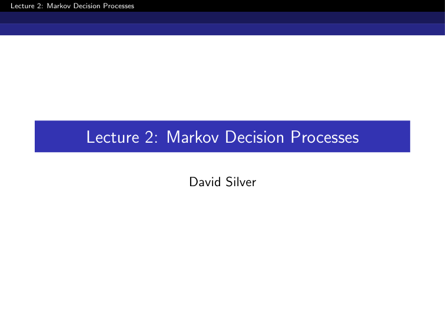

### 📝 Text Content

**Leture 2: Marko Decson Prcess**

Lecture 2: Markov Decision Processes
David Silver

### ✍️ Notes

> [Add your notes here]

---

## Page 2

### 📷 Page Image

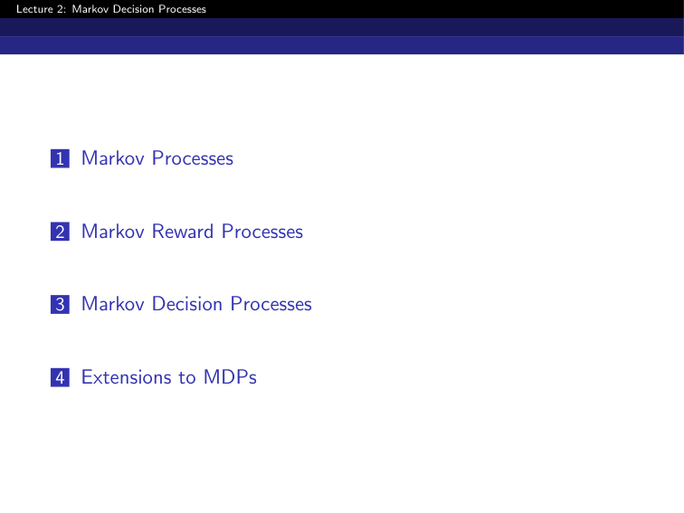

### 📝 Text Content

**Lecture 2: Marko Decison Processes**

I Markov Processes
Markov Reward Processes
Markov Decision Processes
Extensions to MDPs

### ✍️ Notes

> [Add your notes here]

---

## Page 3

### 📷 Page Image

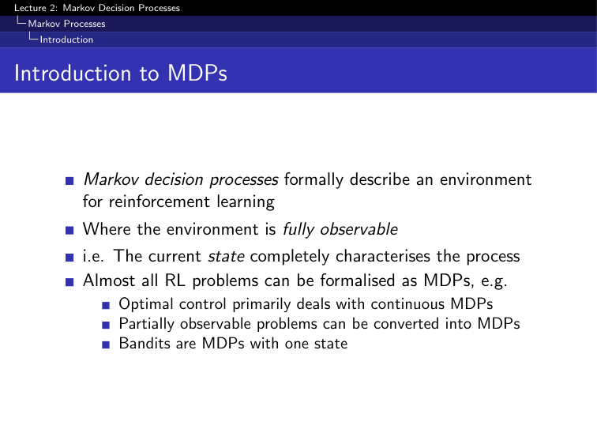

### 📝 Text Content

**Lecture 2: Markov Decision Processes**

-Markov Processes
-Introducion
Introduction to MDPs
Markov decision processes formally describe an environment
for reinforcement learning
Where the environment is fully observable
n i.e. The current state completely characterises the process
Almost all RL problems can be formalised as MDPs, e.g.
Optimal control primarily deals with continuous MDPs
Partially observable problems can be converted into MDPs
Bandits are MDPs with one state

### ✍️ Notes

> [Add your notes here]

---

## Page 4

### 📷 Page Image

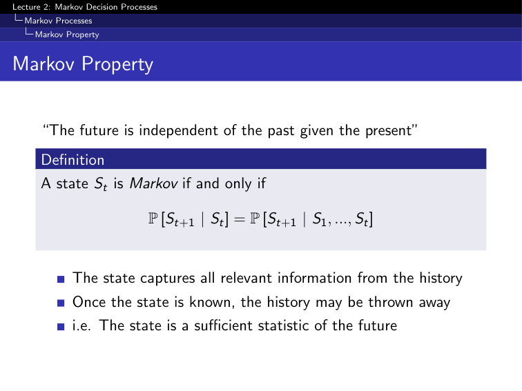

### 📝 Text Content

**Lecture 2: Markov Decision Processes**

-Markoy Processes
-Maro Poperty
Markov Property
rheiunent pat genthepef
Definition
$\mathsf{A}$ state $s_{t}$ is ako if and only if
$$
\mathbb{P} \left[ S_{t+1} \ \middle| \ S_{t} \right]=\mathbb{P} \left[ S_{t+1} \ \middle| \ S_{1} , . . . , S_{t} \right]
$$
The sate cautues all relelant iformation from the history
Once the state is known, the history may be thrown away
i. Th state isa ufin ststic ot te utur

### ✍️ Notes

> [Add your notes here]

---

## Page 5

### 📷 Page Image

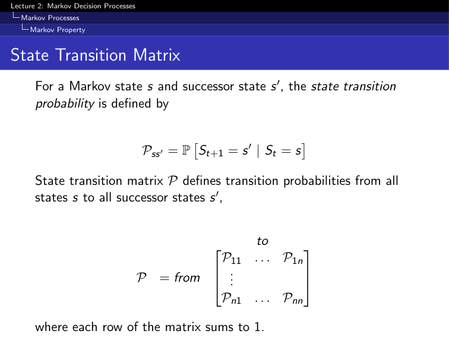

### 📝 Text Content

**Lecture 2: Markov Decision Processes**

-Markov Processes
-Mrov Property
State Transition Matrix
For a Markov state $s$ and successor state $s^{\prime}$ , the state transition
probability is defined by
$$
\mathcal{P}_{\boldsymbol{s} \boldsymbol{s}^{\prime}}=\mathbb{P} \left[ S_{t+\boldsymbol{1}}=s^{\prime} \ | \ S_{t}=s \right]
$$
State transition matrix $\mathcal{P}$ defines transition probabilities from all states $s$ to all successor states $s^{\prime}$ ,
$$
\begin{array} {l c c} {} & {} & {t o} \\ {\mathcal{P}} & {=\it{\it f r o m}} & {\left[ \begin{matrix} {\mathcal{P}_{1 1}} & {\ldots} & {\mathcal{P}_{1 n}} \\ {\vdots} \\ {\mathcal{P}_{n 1}} & {\ldots} & {\mathcal{P}_{n n}} \\ \end{matrix} \right]} \\ \end{array}
$$
where each row of the matrix sums to 1.

### ✍️ Notes

> [Add your notes here]

---

## Page 6

### 📷 Page Image

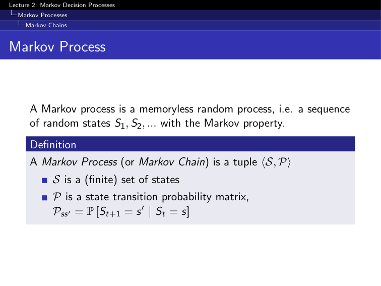

### 📝 Text Content

**Lecture 2: Markov Decision Processes**

Markov Processes
Markov Chains
Markov Process
全M业海线 T线T线业线ET S线
$S_{1} , S_{2} , \ldots$ . with the Markov roperty
Definition
A Markov Process (or Markov Chain) is a tuple $\langle{\cal S} , {\cal P} \rangle$
$\mathcal{S}$ is a (finite) set of states
$\mathcal{P}$ is a state transition probability matrix,
I ${\mathcal{P}}_{\mathfrak{s} \mathfrak{s}^{\prime}}=\mathbb{P} \left[ S_{t+1}=s^{\prime} \ | \ S_{t}=s \right]$

### ✍️ Notes

> [Add your notes here]

---

## Page 7

### 📷 Page Image

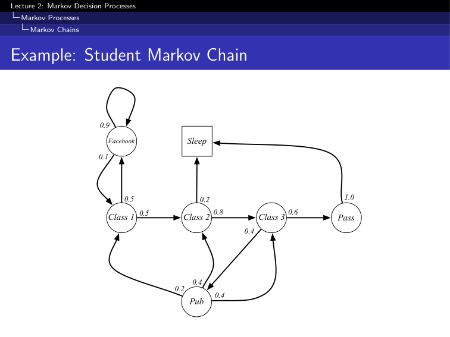

### 📝 Text Content

**Lecture 2: Markov Decision Processes**

Markov Process
-Markov Chains
Example: Student Markov Chain
0.9\
(racbok) | $S l e e p$ I
$o . I$
I $\varrho. s$ I $\varrho. 2$ I $l . 0$
Classr fs uas2 $o . 8$ Cas3 $0 . 6$ ( $P a s s$ )
$0 . 4$
$\varrho. 2$  $0 . 4$  $0 . 4$
$P u b$

### ✍️ Notes

> [Add your notes here]

---

## Page 8

### 📷 Page Image

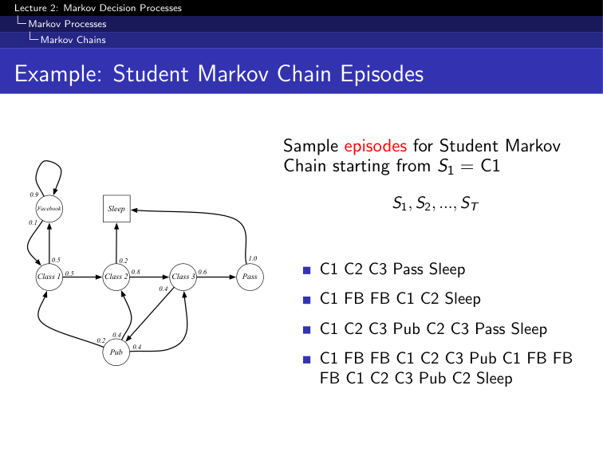

### 📝 Text Content

**Lecture 2: Markov Decision Processes**

Markov Processes
Markov Chains
Example: Student Markov Chain Episodes
Sample episodes for Student Markov $S_{1}=\mathsf{C 1}$
Chain starting from
品 Step
$$
s_{1} , s_{2} , . . . , s_{T}
$$
8.1
Cass）na Cuasn)g Class 3 $l . 0$ C1 C C3 Pass Sleep
05 $\varrho_{2}$
0.6 $P a s s$
$o . 4$ C1 FB FB C1 C2 Sleep
C1 C2 C3 Pub C2 C3 Pass Sleep
$P u b$ e4 C1 FB FB C1 C2 C3 Pub C1 FB FB
FB CI C2 C3 Pub c2 Sleep

### ✍️ Notes

> [Add your notes here]

---

## Page 9

### 📷 Page Image

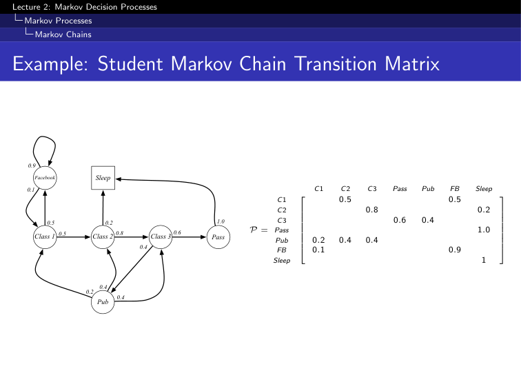

### ✍️ Notes

> [Add your notes here]

---

## Page 10

### 📷 Page Image

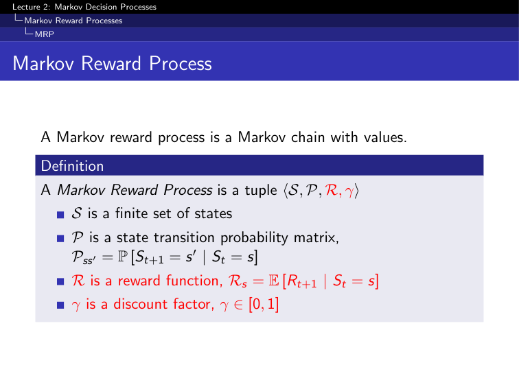

### ✍️ Notes

> [Add your notes here]

---

## Page 11

### 📷 Page Image

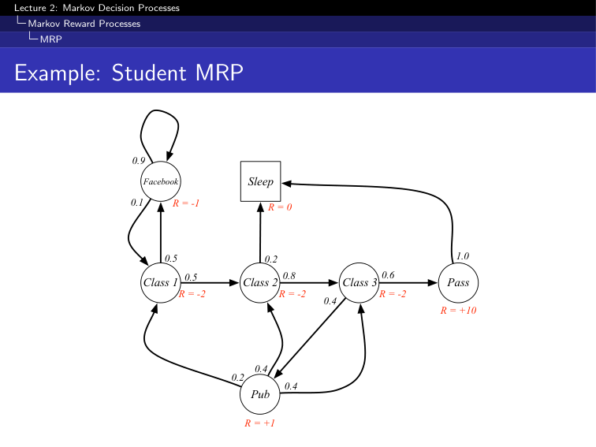

### ✍️ Notes

> [Add your notes here]

---

## Page 12

### 📷 Page Image

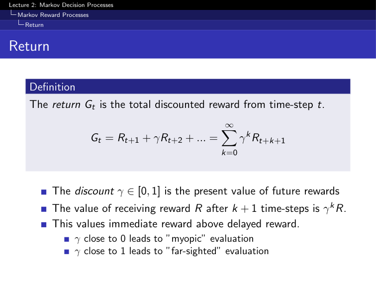

### 📝 Text Content

**More ewe Procses**

Return
Definition
The return $G_{t}$ is the total discounted reward from time-step $t$ .
$$
G_{t}=R_{t+1}+\gamma R_{t+2}+. . .=\sum_{k=0}^{\infty} \gamma^{k} R_{t+k+1}
$$
The discount $\gamma\in[ 0 , 1 ]$ is the resent value of future rewards The value of receiving reward $R$ after $k+1$ time-steps is $\gamma^{k} R$ . This values immediate reward above delayed reward.
$\gamma$ close to $\circ$ leads to" myopic'" evaluation
$\gamma$ close to 1 leads to "far-sighted" evaluaton

### ✍️ Notes

> [Add your notes here]

---

## Page 13

### 📷 Page Image

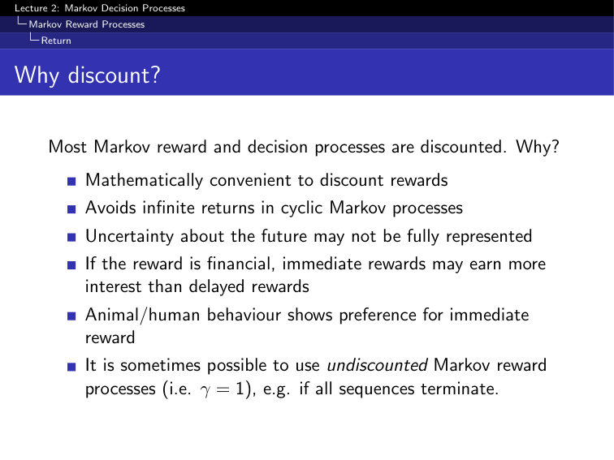

### 📝 Text Content

**More ewe Procses**

Why discount?
Mst Maro vreward ndcison pocesses e icutnd. WhyZ
Mathematically convenient to discount rewards
Avoids infinite returns in cyclic Markov processes
Uncertainty about the future may not be fully represented
lf the reward is financial, immediate rewards may earn more
interest than delayed rewards
-Animal/human behaviour shows preference for immediate
reward
m lt is sometimes possible to use undiscounted Markov reward
processes (i.e. $\gamma=1$ ), e.g. if al suences terminate.

### ✍️ Notes

> [Add your notes here]

---

## Page 14

### 📷 Page Image

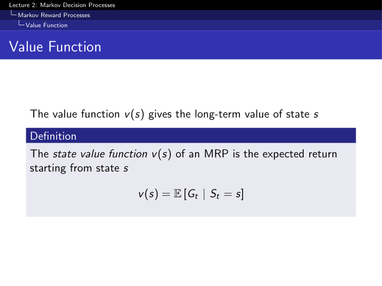

### 📝 Text Content

**Lecture 2: Markov Decision Processes**

Markov Reward Process
Value Function
Value Function
The value function $v ( s )$ gies the long-tem aleo tate $s$
Definition
The state value function $v ( s )$ of an MRP is the expected return starting from state $s$
$$
v ( s )=\mathbb{E} \left[ G_{t} \mid S_{t}=s \right]
$$

### ✍️ Notes

> [Add your notes here]

---

## Page 15

### 📷 Page Image

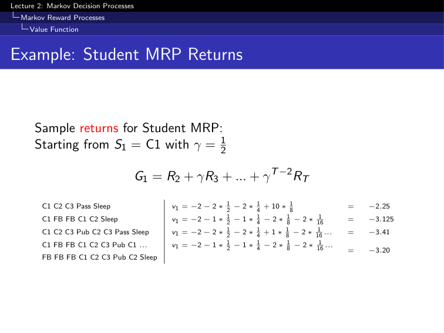

### ✍️ Notes

> [Add your notes here]

---

## Page 16

### 📷 Page Image

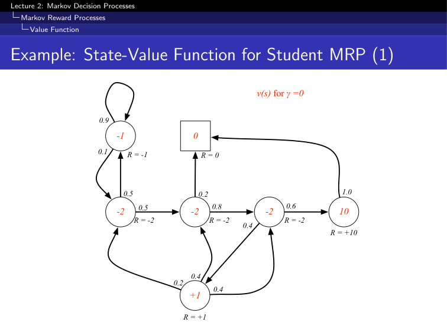

### ✍️ Notes

> [Add your notes here]

---

## Page 17

### 📷 Page Image

### ✍️ Notes

> [Add your notes here]

---

## Page 18

### 📷 Page Image

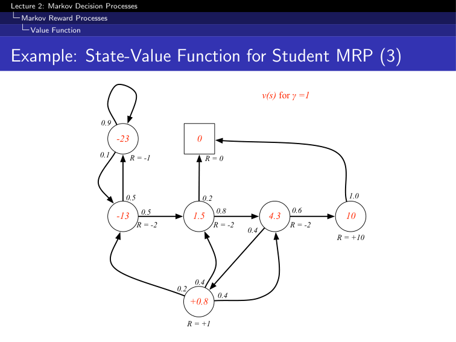

### ✍️ Notes

> [Add your notes here]

---

## Page 19

### 📷 Page Image

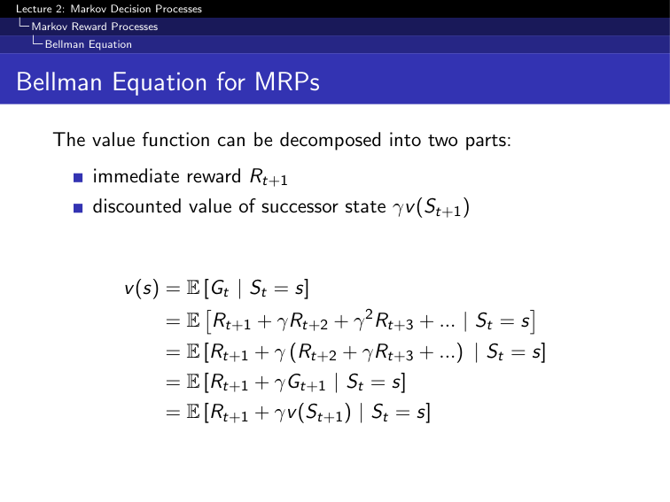

### ✍️ Notes

> [Add your notes here]

---

## Page 20

### 📷 Page Image

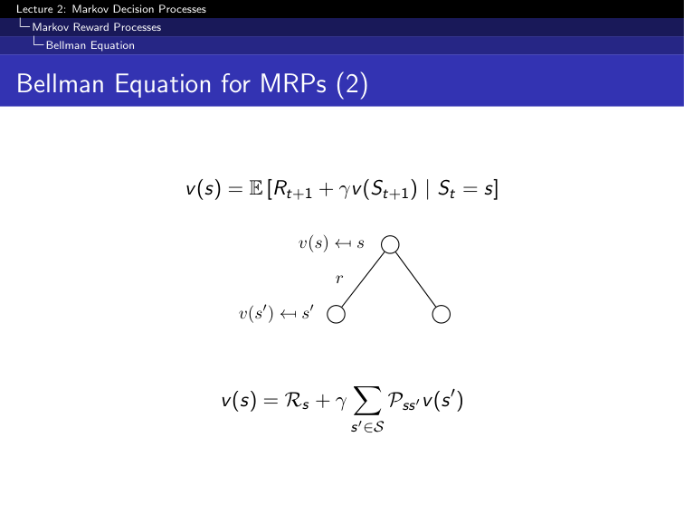

### ✍️ Notes

> [Add your notes here]

---

## Page 21

### 📷 Page Image

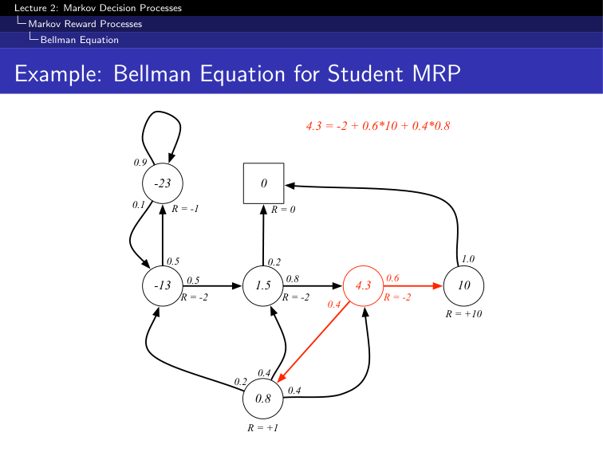

### ✍️ Notes

> [Add your notes here]

---

## Page 22

### 📷 Page Image

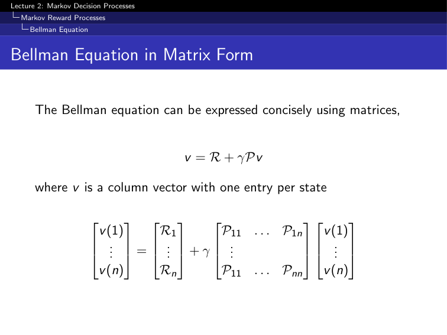

### ✍️ Notes

> [Add your notes here]

---

## Page 23

### 📷 Page Image

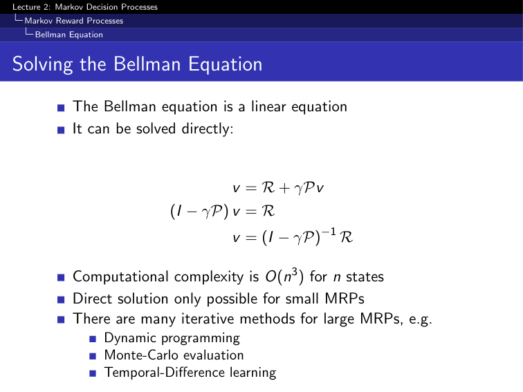

### 📝 Text Content

**Lecture 2: Markov Decision Processes**

Markov Reward Process
Bellman Equation
Solving the Bellman Equation
The Bellman equation is a linear equation
t can be solved directly:
$$
\begin{aligned} {v} & {{}={\mathcal R}+\gamma{\mathcal P} v} \\ {\left( I-\gamma{\mathcal P} \right) v} & {{}={\mathcal R}} \\ {v} & {{}=\left( I-\gamma{\mathcal P} \right)^{-1} {\mathcal R}} \\ \end{aligned}
$$
Computational complexity is $O ( n^{3} )$ for $n$ states
Direct solution only possible for small MRPs
There are many iterative methods for large MRPs, e.g.
Dynamic programming
Monte-Carlo evaluation
Temporal-Difference learning

### ✍️ Notes

> [Add your notes here]

---

## Page 24

### 📷 Page Image

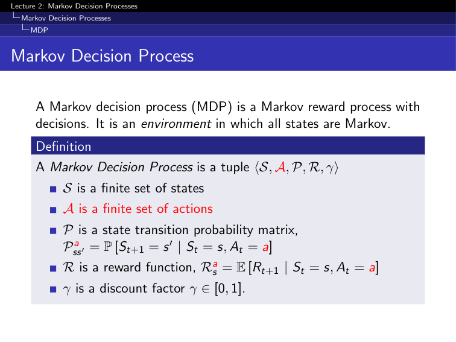

### ✍️ Notes

> [Add your notes here]

---

## Page 25

### 📷 Page Image

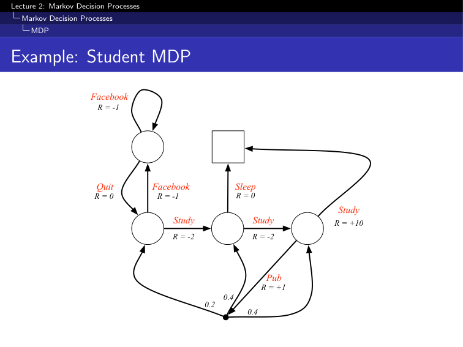

### ✍️ Notes

> [Add your notes here]

---

## Page 26

### 📷 Page Image

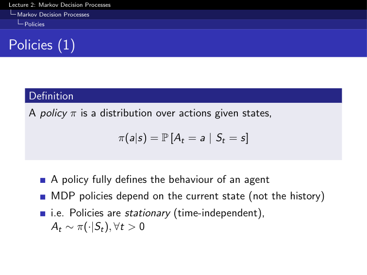

### 📝 Text Content

**Lecture 2: Markov Decision Processes**

Markov Decision Processes
-Polices
Polies (1)
Definiton
$\mathsf{A}$ policy $\pi$ is a distibuionover acions given states,
$$
\pi( a | s )=\mathbb{P} \left[ A_{t}=a \ | \ S_{t}=s \right]
$$
$\mathsf{A}$ policy fully deiesthe behaviour of an agent
MDP policies depend on the current state (not the history)
$A_{t} \sim\pi( \cdot| S_{t} ) , \forall t > 0$ nyiendenmn.

### ✍️ Notes

> [Add your notes here]

---

## Page 27

### 📷 Page Image

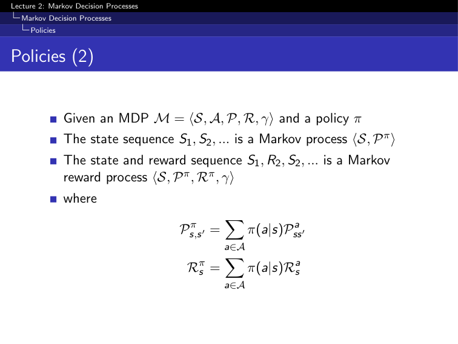

### ✍️ Notes

> [Add your notes here]

---

## Page 28

### 📷 Page Image

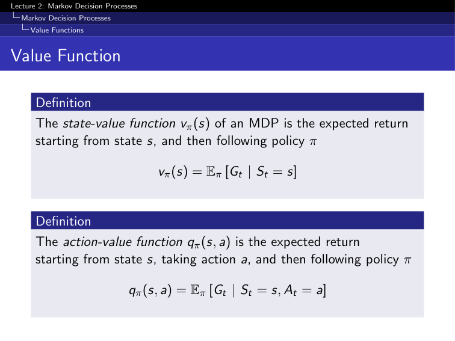

### 📝 Text Content

**Lecture 2: Markov Decision Processes**

Marko Decison Proceses
-Vale Funtions
Value Function
Defintion
The state-value function $v_{\pi} ( s )$ of an MDP is the expected return starting from state $s$ , and then following policy $\pi$
$$
v_{\pi} ( s )=\mathbb{E}_{\pi} \left[ G_{t} \ | \ S_{t}=s \right]
$$
Definition
The action-value function $s$ , taking action $a$ . andten foloing policy $\pi$ starting from state $q_{\pi} ( s , a )$ is the expected return
$$
q_{\pi} ( s , a )=\mathbb{E}_{\pi} \left[ G_{t} \ | \ S_{t}=s , A_{t}=a \right]
$$

### ✍️ Notes

> [Add your notes here]

---

## Page 29

### 📷 Page Image

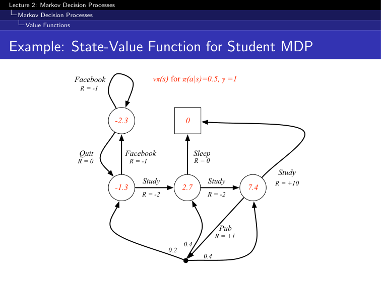

### ✍️ Notes

> [Add your notes here]

---

## Page 30

### 📷 Page Image

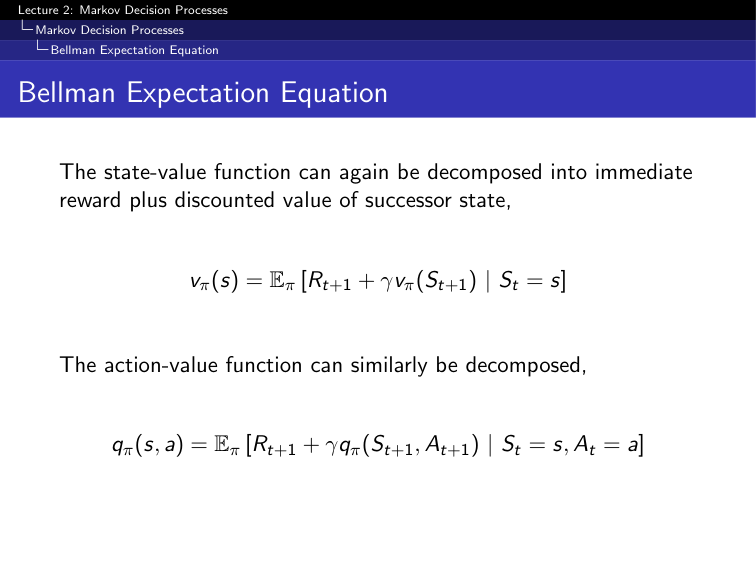

### 📝 Text Content

**Lecture 2: Markov Decision Processes**

Markov Decision Processes
-Belman Expectaton quation
Bellman Expectation $\mathsf{E q}$ uation
The state-value function can again be decomposed into immediate reward plus discounted value of successor state,
$$
v_{\pi} ( s )=\mathbb{E}_{\pi} \left[ R_{t+1}+\gamma v_{\pi} ( S_{t+1} ) \ | \ S_{t}=s \right]
$$
The acionvale function can simiarly be decomposed,
$$
q_{\pi} ( s , a )=\mathbb{E}_{\pi} \left[ R_{t+1}+\gamma q_{\pi} ( S_{t+1} , A_{t+1} ) \ \vert\ S_{t}=s , A_{t}=a \right]
$$

### ✍️ Notes

> [Add your notes here]

---

## Page 31

### 📷 Page Image

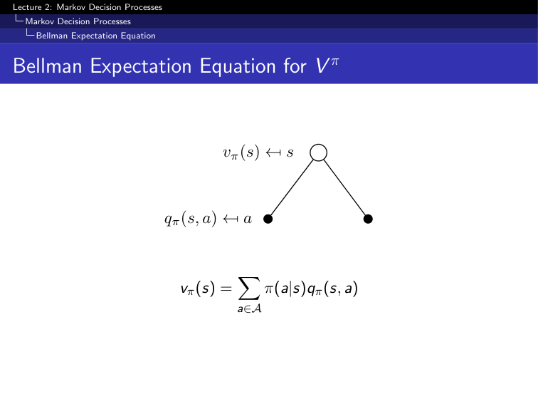

### 📝 Text Content

**Lecture 2: Markov Decision Processes**

Markov Decision Processes
Bellman Expectation Equation
Belman Expectation $\mathrm{E q}$ uatin for $V^{\pi}$
$$
\break q_{\pi} ( s , a ) \leftrightarrow a \Bigm/ a \hookleftarrow
$$
$$
v_{\pi} ( s )=\sum_{a \in\mathcal{A}} \pi( a | s ) q_{\pi} ( s , a )
$$

### ✍️ Notes

> [Add your notes here]

---

## Page 32

### 📷 Page Image

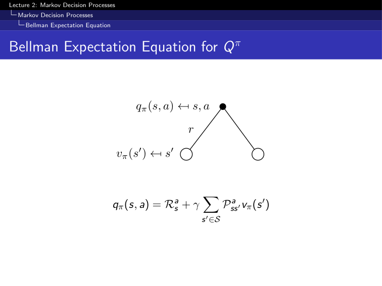

### ✍️ Notes

> [Add your notes here]

---

## Page 33

### 📷 Page Image

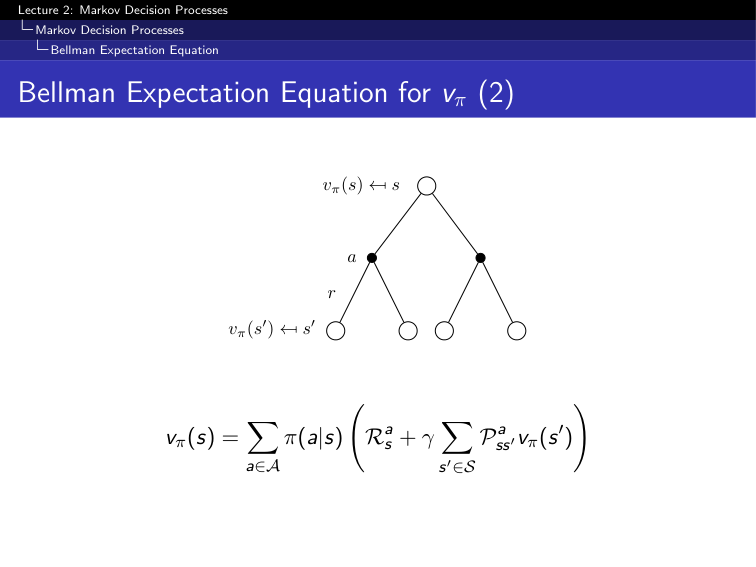

### ✍️ Notes

> [Add your notes here]

---

## Page 34

### 📷 Page Image

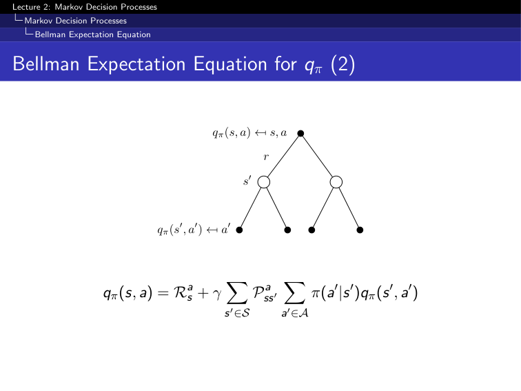

### ✍️ Notes

> [Add your notes here]

---

## Page 35

### 📷 Page Image

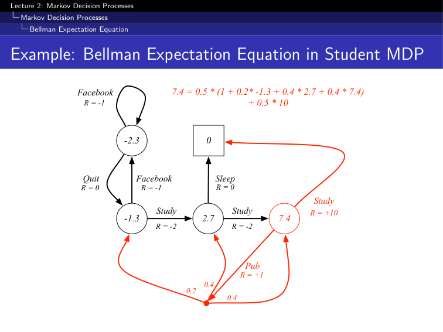

### ✍️ Notes

> [Add your notes here]

---

## Page 36

### 📷 Page Image

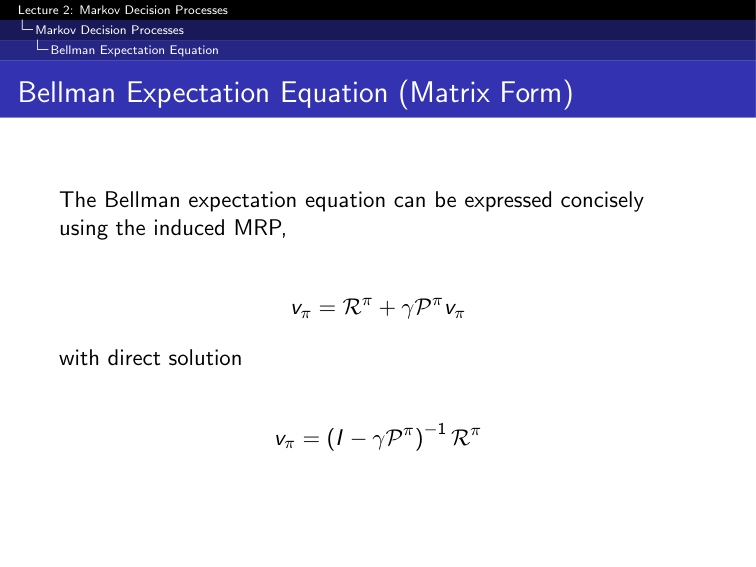

### 📝 Text Content

**Lecture 2: Markov Decision Processes**

中西和ATSTaTRomn
Expectation Equation
Bellman Expecation $\mathrm{E q}$ uation (Matrix Form)
NCTNAMASA uan ncora w
$$
v_{\pi}=\mathcal{R}^{\pi}+\gamma\mathcal{P}^{\pi} v_{\pi}
$$
wit direct solution
$$
v_{\pi}=\left( I-\gamma\mathcal{P}^{\pi} \right)^{-1} \mathcal{R}^{\pi}
$$

### ✍️ Notes

> [Add your notes here]

---

## Page 37

### 📷 Page Image

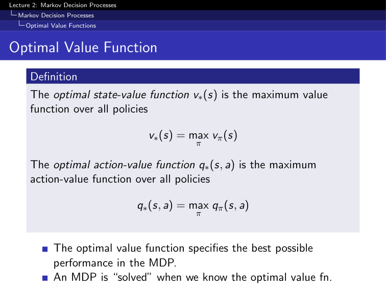

### 📝 Text Content

**Lecture 2: Markov Decision Processes**

Markov Decision Processes
-optial ValeFuncions
Optimal Value Function
Deinition
The optimal state-value function $v_{*} ( s )$ is the maximum value function over all policies
$$
v_{*} ( s )=\underset{\pi} {\mathrm{m a x}} ~ v_{\pi} ( s )
$$
The optimal action-value function $q_{*} ( s , a )$ is the maximum action-value function over all policies
$$
q_{*} ( s , a )=\underset{\pi} {\operatorname* {m a x}} \; q_{\pi} ( s , a )
$$
An MDP is "Soled" when we know the optimal value fn.

### ✍️ Notes

> [Add your notes here]

---

## Page 38

### 📷 Page Image

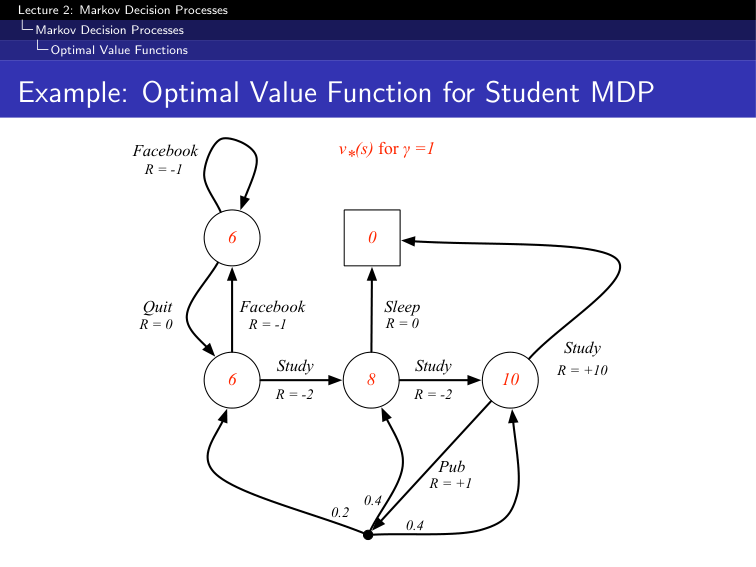

### 📝 Text Content

**Lecture 2: Markov Decision Processes**

Markov Decision Processes
Optimal Value Functions
Example: Optimal Value Function for Student MDP
rcox $\nu_{*} ( s )$ for $\gamma=I$
$R=-I$
$6$  $( \lambda)$
$\begin{array} {c} {Q u i t} \\ {R=0} \\ \end{array}$  $R=-I$  $S t u d y$  $\frac{\alpha} {\beta}$  $\begin{array} {c} {{S l e e p}} \\ {{R=0}} \end{array}$ 1o $R=+I 0$
$F a c e b o o k$  $S t u d y$ Study
$\sigma$ ） $R=-2$  $R=-2$
$o . 2$  $0 . 4$  $P u b$
$R=+I$
$0 . 4$

### ✍️ Notes

> [Add your notes here]

---

## Page 39

### 📷 Page Image

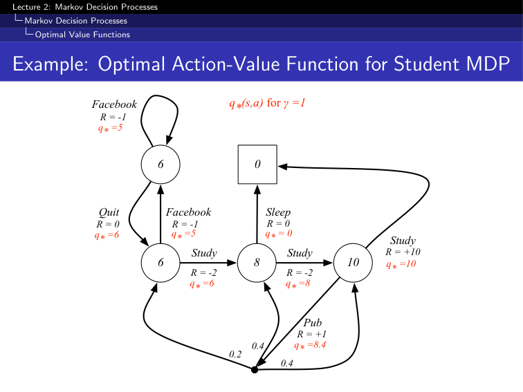

### ✍️ Notes

> [Add your notes here]

---

## Page 40

### 📷 Page Image

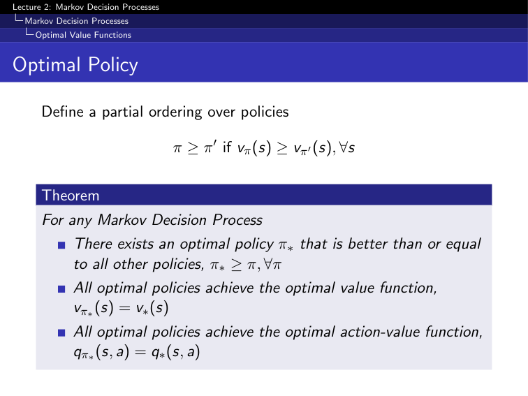

### 📝 Text Content

**Lecture 2: Markov Decision Processes**

Markov Decision Processes
-opimal ValueFunctions
Optimal Poliy
eiea prialoderingove polices
$$
\pi\geq\pi^{\prime} \mathrm{~ i f ~} v_{\pi} ( s ) \geq v_{\pi^{\prime}} ( s ) , \forall s
$$
Theorem
For any Markov Decision Process
There exists an optimal policy $\pi_{*}$ that is better than or equal
to all other policies, $\pi_{*} \geq\pi, \forall\pi$
$v_{\pi_{*}} ( s )=v_{*} ( s )$ ceschencmnendao
$q_{\pi_{*}} ( s , a )=q_{*} ( s , a )$ mnrcruin nm

### ✍️ Notes

> [Add your notes here]

---

## Page 41

### 📷 Page Image

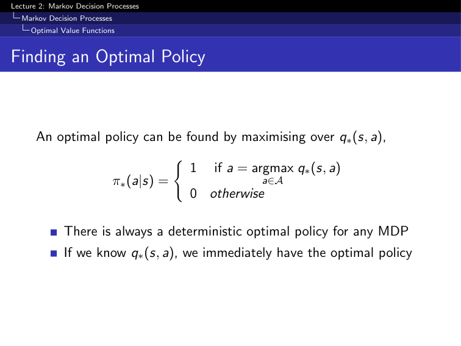

### 📝 Text Content

**Lecture 2: Markov Decision Processes**

Markov Decision Processes
Optima Value Functions
Finingan Optimal Poiey
nopimaloili cnb fondb maiming oer $q_{*} ( s , a )$
$$
\pi_{*} ( a | s )=\left\{\begin{array} {c l} {1} & {\mathrm{~ i f ~} a=\underset{a \in\mathcal{A}} {\operatorname{a r g}} \operatorname* {m a x} q_{*} ( s , a )} \\ {0} & {o t h e r w i s e} \\ \end{array} \right.
$$
There is always a deterministic optimal policy for ny MDP
l f we Know $q_{*} ( s , a )$ we imedately ae the optimal poicy

### ✍️ Notes

> [Add your notes here]

---

## Page 42

### 📷 Page Image

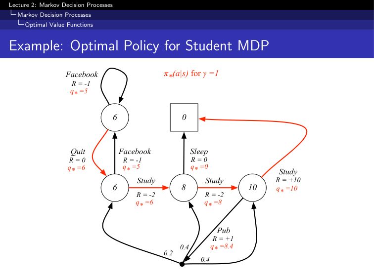

### ✍️ Notes

> [Add your notes here]

---

## Page 43

### 📷 Page Image

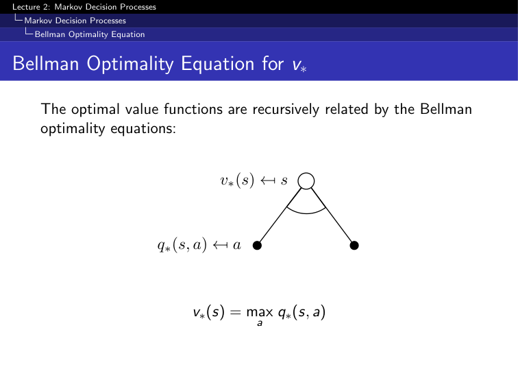

### 📝 Text Content

**Lecture 2: Markov Decision Processes**

Markov Decision Processes
-Belman Optimaiy Equation
Bellman Optimality Equation for $v_{*}$
The optimal value functions are recursively related by the Bellman optimality equations:
$$
\break q_{*} ( s , a ) \leftrightarrow a \swarrow\cdots
$$
$$
v_{*} ( s )=\underset{a} {\operatorname* {m a x}} \; q_{*} ( s , a )
$$

### ✍️ Notes

> [Add your notes here]

---

## Page 44

### 📷 Page Image

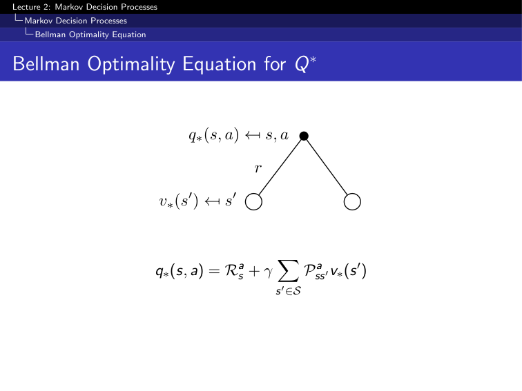

### ✍️ Notes

> [Add your notes here]

---

## Page 45

### 📷 Page Image

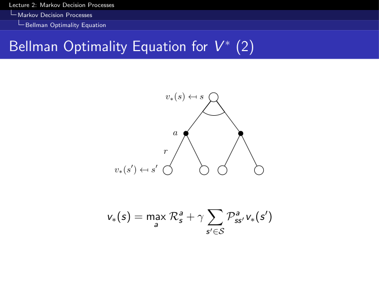

### 📝 Text Content

**Lecture 2: Markov Decision Processes**

Markov Decision Processes
-BlmanOpimality Euation
Bellman OtimaliyEquation for $V^{*} \left( 2 \right)$
$$
\frac{v_{*} ( s ) \leftrightarrow s \nearrow s} {r \nearrow\nearrow}_{v_{*} ( s^{\prime} ) \leftrightarrow s^{\prime}} \diamondsuit
$$
$$
v_{*} ( s )=\underset{a} {\operatorname* {m a x}} \; \mathcal{R}_{s}^{a}+\gamma\sum_{s^{\prime} \in\mathcal{S}} \mathcal{P}_{s s^{\prime}}^{a} v_{*} ( s^{\prime} )
$$

### ✍️ Notes

> [Add your notes here]

---

## Page 46

### 📷 Page Image

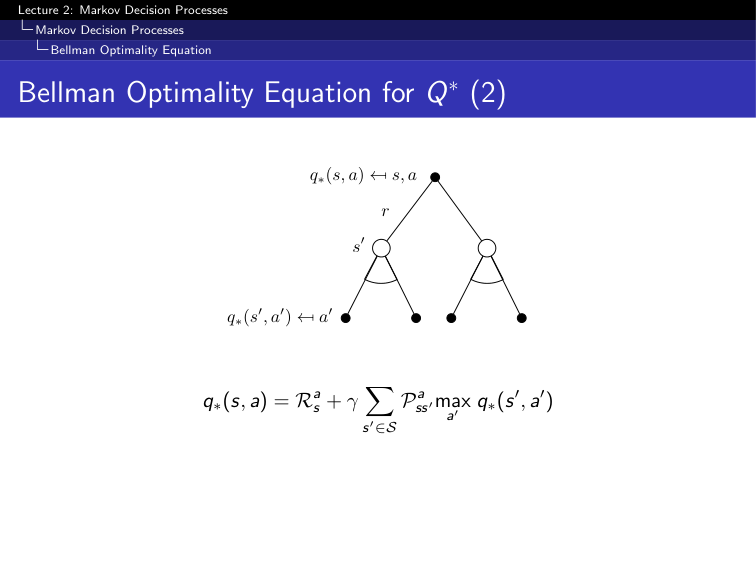

### ✍️ Notes

> [Add your notes here]

---

## Page 47

### 📷 Page Image

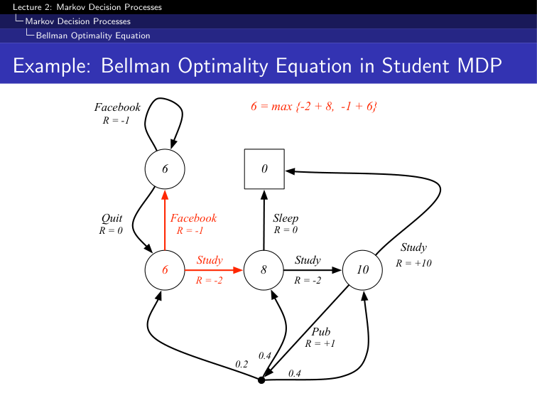

### ✍️ Notes

> [Add your notes here]

---

## Page 48

### 📷 Page Image

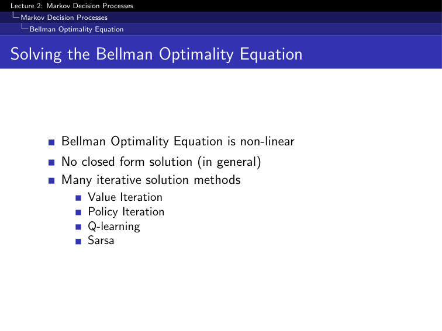

### 📝 Text Content

**Lecture 2: Markov Decision Processes**

Markov Decision Processes
Blma Optimlily Equton
Solving the Bellman Optimality Equation
Bellman Optimality Euation is non-linear
No closed form solution (in general)
Many iterative solution methods
Value lteration
Policy Iteration
Q-learning
Sarsa

### ✍️ Notes

> [Add your notes here]

---

## Page 49

### 📷 Page Image

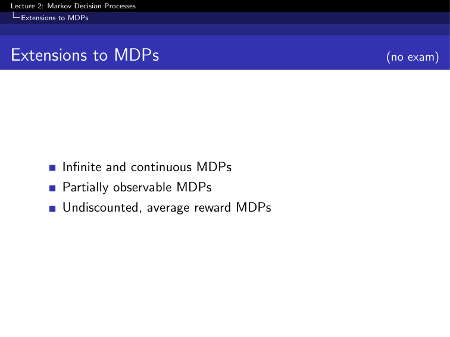

### 📝 Text Content

**Lecture 2: Markov Decision Processes**

Extensions to MDPs
Extensions to MDPs (no exam)
lnfinite and continuous MDPs
Partially observable MDPs
Undiscounted, average reward MDPs

### ✍️ Notes

> [Add your notes here]

---

## Page 50

### 📷 Page Image

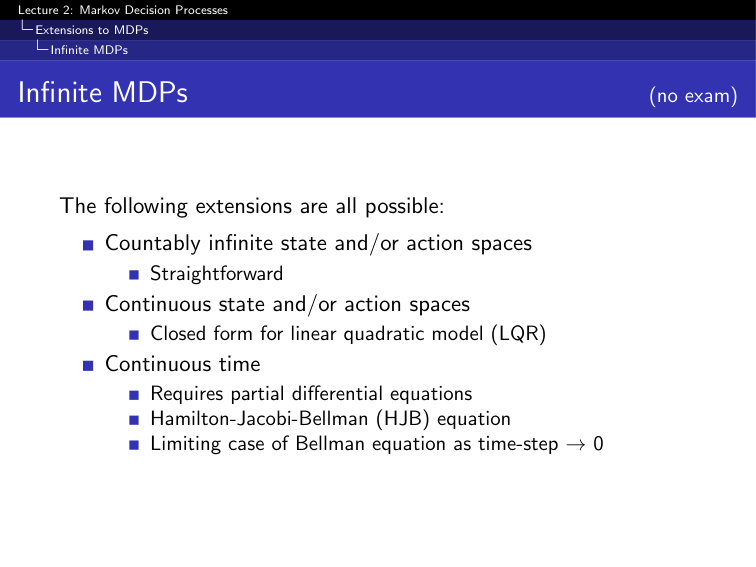

### 📝 Text Content

**Lecture 2: Markov Decision Processes**

-Extensions to MDPs
-Infinite MDPs
Infinite MDPs (no exam)
Thrloingetnsionsar al possible:
Countably infinite state and/or action spaces
Straightforward
Continuous state and /or action spaces
Closed form for linear quadratic model (LQR)
Continuous time
Requires partial differential equations
Hamilton-Jacobi-Bellman (HJB) equation
Limiting case of Bellman equation as time-step $\to0$

### ✍️ Notes

> [Add your notes here]

---

## Page 51

### 📷 Page Image

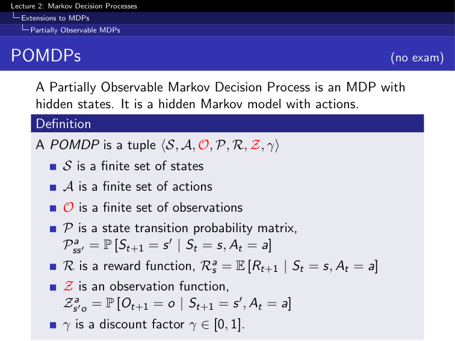

### ✍️ Notes

> [Add your notes here]

---

## Page 52

### 📷 Page Image

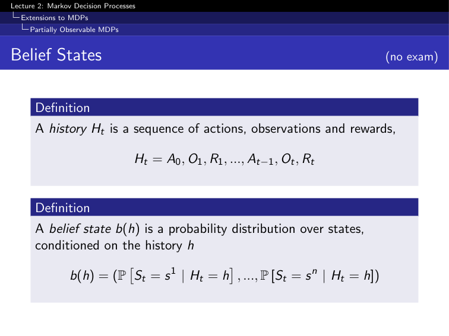

### ✍️ Notes

> [Add your notes here]

---

## Page 53

### 📷 Page Image

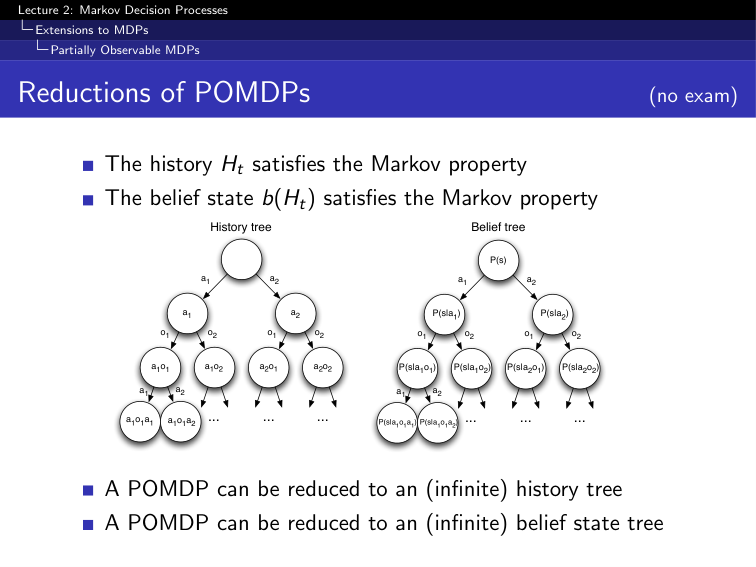

### ✍️ Notes

> [Add your notes here]

---

## Page 54

### 📷 Page Image

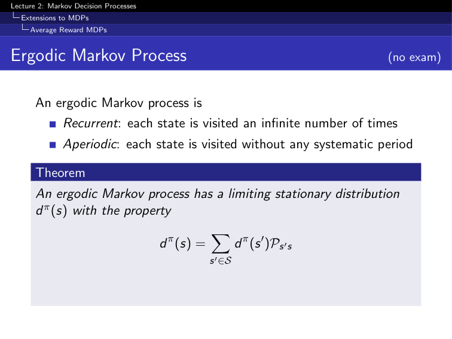

### 📝 Text Content

**Lecture 2: Markov Decision Processes**

-Extensions to MDPs
-Averge Reward MPs
Ergodic Markov Process (no exam)
An ergodic Markov process is
Recurrent: each state is vited an infinite number of times
Aperiodic: each state is visited without any systematic period
Theorem
$A n$ egodic Mropoes s alitin stinay disiotion
$d^{\pi} ( s )$ with the propery
$$
d^{\pi} ( s )=\sum_{s^{\prime} \in\mathcal{S}} d^{\pi} ( s^{\prime} ) \mathcal{P}_{s^{\prime} s}
$$

### ✍️ Notes

> [Add your notes here]

---

## Page 55

### 📷 Page Image

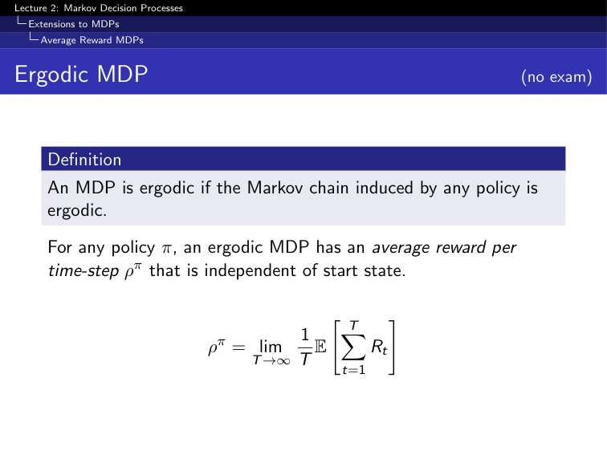

### 📝 Text Content

**Lecture 2: Markov Decision Processes**

Extensions to MDPs
-Average Reward MDPs
Ergodic MDP (no exam)）
Definition
Menrcsantnrnan d nrnde .
For any policy $\pi$ , an ergodic MDP has an average reward per
time-step $\rho^{\pi}$ that is independent of start state.
$$
\rho^{\pi}=\operatorname* {l i m}_{T \to\infty} \, \frac{1} {T} \mathbb{E} \left[ \sum_{t=1}^{T} R_{t} \right]
$$

### ✍️ Notes

> [Add your notes here]

---

## Page 56

### 📷 Page Image

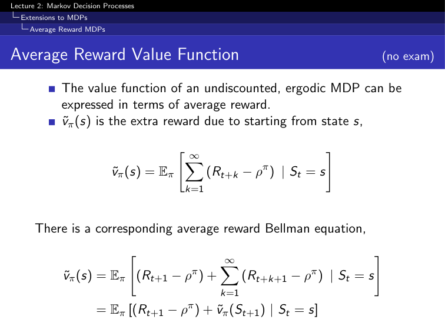

### ✍️ Notes

> [Add your notes here]

---

## Page 57

### 📷 Page Image

### 📝 Text Content

**Lecture 2: Markov Decision Processes**

Extensions to MDPs
-Avrae Reward DPs
Questions?
The only stupid question is the one you were afraid to ask but never did.
-Rich Sutton

### ✍️ Notes

> [Add your notes here]

---
