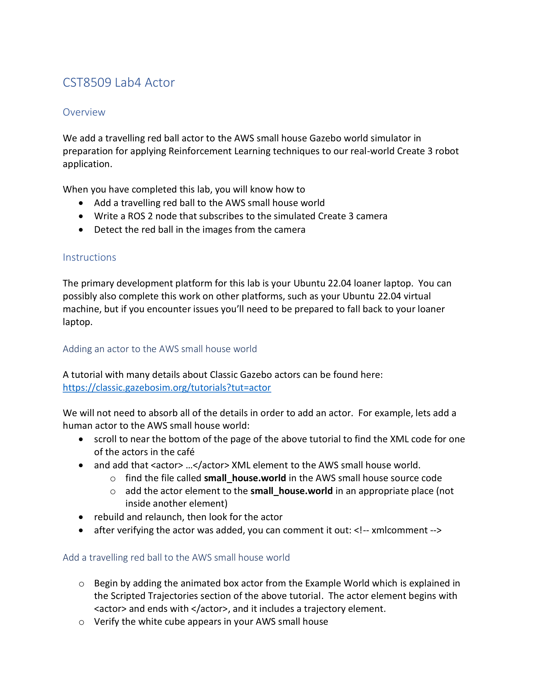
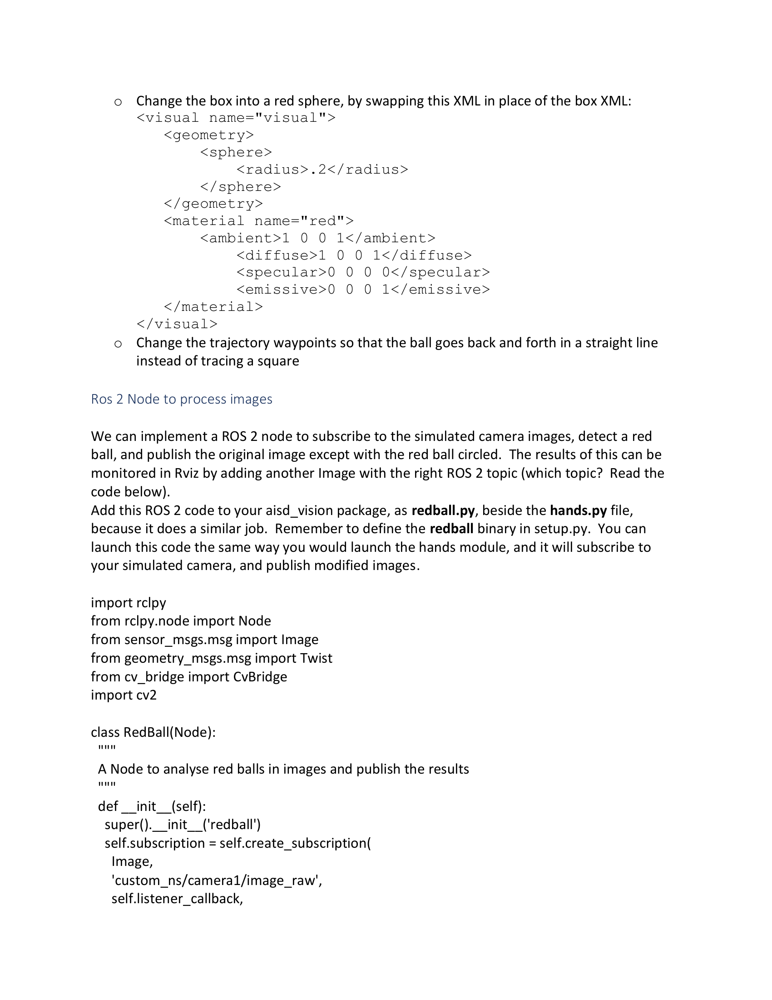
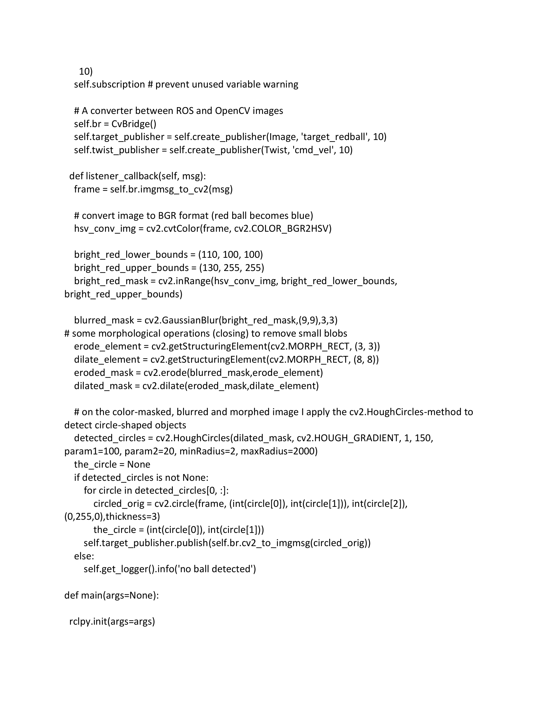
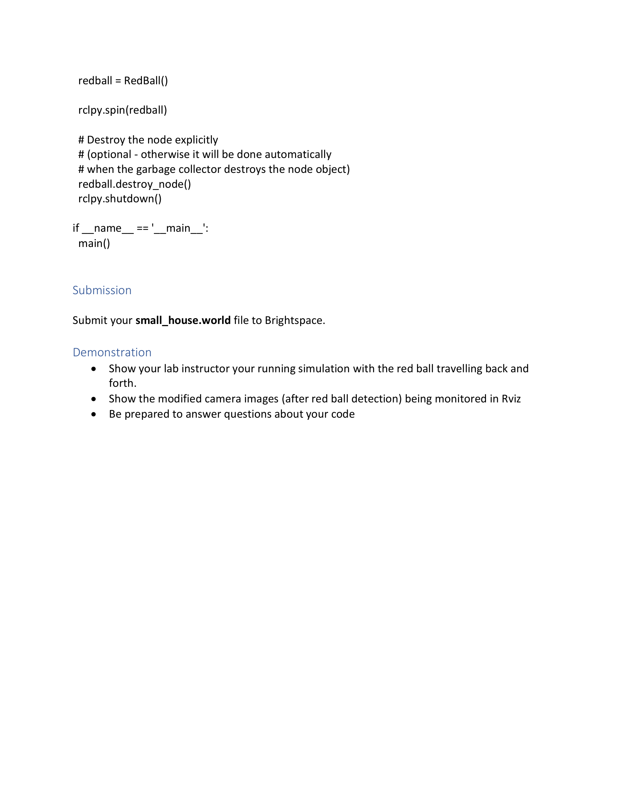

# Lab 4: Actor — 添加行走的红球Actor

> Source: `CST8509_Lab4_Actor.docx`
> Total pages: 4
> Course: CST8509 Reinforcement Learning

---

## 1. 概述 (Overview)



**Overview — 概述**

- We add a travelling red ball actor to the AWS small house Gazebo world simulator in preparation for applying Reinforcement Learning techniques to our real-world Create 3 robot application. — 我们在 AWS 小房子 Gazebo 仿真环境中添加一个行走的红球 actor，为将强化学习技术应用于真实的 Create 3 机器人做准备。

**When you have completed this lab, you will know how to — 完成本实验后，你将学会：**

- Add a travelling red ball to the AWS small house world — 在 AWS 小房子世界中添加一个行走的红球
- Write a ROS 2 node that subscribes to the simulated Create 3 camera — 编写一个订阅仿真 Create 3 相机的 ROS 2 节点
- Detect the red ball in the images from the camera — 从相机图像中检测红球

---

## 2. 开发环境说明 (Instructions)

- The primary development platform for this lab is your Ubuntu 22.04 loaner laptop. You can possibly also complete this work on other platforms, such as your Ubuntu 22.04 virtual machine, but if you encounter issues you'll need to be prepared to fall back to your loaner laptop. — 本实验的主要开发平台是你的 Ubuntu 22.04 借用笔记本电脑。你也可以在其他平台上完成（如 Ubuntu 22.04 虚拟机），但遇到问题时需准备好回退到借用笔记本。

---

## 3. 在 AWS 小房子世界中添加 Actor (Adding an Actor to the AWS Small House World)

- A tutorial with many details about Classic Gazebo actors can be found here: — 关于 Classic Gazebo actor 的详细教程可在此找到：

Ref: https://classic.gazebosim.org/tutorials?tut=actor

- We will not need to absorb all of the details in order to add an actor. For example, lets add a human actor to the AWS small house world: — 我们不需要了解所有细节来添加 actor。例如，在 AWS 小房子世界中添加一个人类 actor：
  - Scroll to near the bottom of the page of the above tutorial to find the XML code for one of the actors in the café — 滚动到上述教程页面底部附近，找到咖啡馆中某个 actor 的 XML 代码
  - And add that `<actor>…</actor>` XML element to the AWS small house world — 将该 `<actor>…</actor>` XML 元素添加到 AWS 小房子世界中
    - Find the file called `small_house.world` in the AWS small house source code — 在 AWS 小房子源代码中找到名为 `small_house.world` 的文件
    - Add the actor element to the `small_house.world` in an appropriate place (not inside another element) — 在适当位置添加 actor 元素（不要放在其他元素内部）
  - Rebuild and relaunch, then look for the actor — 重新构建并重新启动，然后查找 actor
  - After verifying the actor was added, you can comment it out: `<!-- xmlcomment -->` — 验证 actor 添加成功后，可以将其注释掉：`<!-- xmlcomment -->`

---

## 4. 添加行走的红球 (Add a Travelling Red Ball)



- Begin by adding the animated box actor from the Example World which is explained in the Scripted Trajectories section of the above tutorial. The actor element begins with `<actor>` and ends with `</actor>`, and it includes a trajectory element. — 首先从示例世界中添加动画盒子 actor，该内容在上述教程的 Scripted Trajectories 部分有说明。actor 元素以 `<actor>` 开始、`</actor>` 结尾，并包含一个 trajectory 元素。
- Verify the white cube appears in your AWS small house — 验证白色方块出现在你的 AWS 小房子中
- Change the box into a red sphere, by swapping this XML in place of the box XML: — 将盒子替换为红球，用以下 XML 代码替换盒子的 XML：

```xml
<visual name="visual">
  <geometry>
    <sphere>
      <radius>.2</radius>
    </sphere>
  </geometry>
  <material name="red">
    <ambient>1 0 0 1</ambient>
    <diffuse>1 0 0 1</diffuse>
    <specular>0 0 0 0</specular>
    <emissive>0 0 0 1</emissive>
  </material>
</visual>
```

- Change the trajectory waypoints so that the ball goes back and forth in a straight line instead of tracing a square — 修改轨迹路径点，使球沿直线来回移动，而不是走正方形路线

---

## 5. ROS 2 节点处理图像 (ROS 2 Node to Process Images)



- We can implement a ROS 2 node to subscribe to the simulated camera images, detect a red ball, and publish the original image except with the red ball circled. — 我们可以实现一个 ROS 2 节点，订阅仿真相机图像，检测红球，并发布标注了红球圆圈的原始图像。
- The results of this can be monitored in Rviz by adding another Image with the right ROS 2 topic (which topic? Read the code below). — 可以在 Rviz 中通过添加正确 ROS 2 话题的 Image 来监控结果（哪个话题？请看下面的代码）。
- Add this ROS 2 code to your `aisd_vision` package, as `redball.py`, beside the `hands.py` file, because it does a similar job. — 将此 ROS 2 代码添加到你的 `aisd_vision` 包中，命名为 `redball.py`，放在 `hands.py` 文件旁边，因为它们做类似的工作。
- Remember to define the `redball` binary in `setup.py`. — 记得在 `setup.py` 中定义 `redball` 二进制文件。
- You can launch this code the same way you would launch the `hands` module, and it will subscribe to your simulated camera, and publish modified images. — 你可以像启动 `hands` 模块一样启动此代码，它会订阅你的仿真相机并发布修改后的图像。

```python
import rclpy
from rclpy.node import Node
from sensor_msgs.msg import Image
from geometry_msgs.msg import Twist
from cv_bridge import CvBridge
import cv2

class RedBall(Node):
    """
    A Node to analyse red balls in images and publish the results
    # 一个用于分析图像中红球并发布结果的节点
    """
    def __init__(self):
        super().__init__('redball')
        self.subscription = self.create_subscription(
            Image,
            'custom_ns/camera1/image_raw',
            self.listener_callback,
            10)
        self.subscription  # prevent unused variable warning
        # A converter between ROS and OpenCV images
        # ROS 和 OpenCV 图像之间的转换器
        self.br = CvBridge()
        self.target_publisher = self.create_publisher(Image, 'target_redball', 10)
        self.twist_publisher = self.create_publisher(Twist, 'cmd_vel', 10)

    def listener_callback(self, msg):
        frame = self.br.imgmsg_to_cv2(msg)
        # convert image to BGR format (red ball becomes blue)
        # 将图像转换为 BGR 格式（红球变成蓝色）
        hsv_conv_img = cv2.cvtColor(frame, cv2.COLOR_BGR2HSV)

        bright_red_lower_bounds = (110, 100, 100)
        bright_red_upper_bounds = (130, 255, 255)
        bright_red_mask = cv2.inRange(hsv_conv_img, bright_red_lower_bounds,
                                       bright_red_upper_bounds)
        blurred_mask = cv2.GaussianBlur(bright_red_mask, (9, 9), 3, 3)

        # some morphological operations (closing) to remove small blobs
        # 一些形态学操作（闭运算）去除小斑点
        erode_element = cv2.getStructuringElement(cv2.MORPH_RECT, (3, 3))
        dilate_element = cv2.getStructuringElement(cv2.MORPH_RECT, (8, 8))
        eroded_mask = cv2.erode(blurred_mask, erode_element)
        dilated_mask = cv2.dilate(eroded_mask, dilate_element)

        # on the color-masked, blurred and morphed image
        # apply the cv2.HoughCircles method to detect circle-shaped objects
        # 在颜色掩码、模糊和形态学处理的图像上
        # 使用 cv2.HoughCircles 方法检测圆形物体
        detected_circles = cv2.HoughCircles(dilated_mask, cv2.HOUGH_GRADIENT, 1, 150,
                                             param1=100, param2=20,
                                             minRadius=2, maxRadius=2000)
        the_circle = None
        if detected_circles is not None:
            for circle in detected_circles[0, :]:
                circled_orig = cv2.circle(frame,
                    (int(circle[0]), int(circle[1])), int(circle[2]),
                    (0, 255, 0), thickness=3)
                the_circle = (int(circle[0]), int(circle[1]))
            self.target_publisher.publish(self.br.cv2_to_imgmsg(circled_orig))
        else:
            self.get_logger().info('no ball detected')

def main(args=None):
    rclpy.init(args=args)
    redball = RedBall()
    rclpy.spin(redball)
    # Destroy the node explicitly
    # 显式销毁节点
    # (optional - otherwise it will be done automatically
    # when the garbage collector destroys the node object)
    # （可选 - 否则垃圾回收器销毁节点对象时会自动完成）
    redball.destroy_node()
    rclpy.shutdown()

if __name__ == '__main__':
    main()
```

---

## 6. 提交要求 (Submission)



**Submission — 提交**

- Submit your `small_house.world` file to Brightspace. — 将你的 `small_house.world` 文件提交到 Brightspace。

**Demonstration — 演示**

- Show your lab instructor your running simulation with the red ball travelling back and forth. — 向实验指导老师展示红球来回移动的仿真运行效果。
- Show the modified camera images (after red ball detection) being monitored in Rviz — 展示在 Rviz 中监控的修改后的相机图像（红球检测后的结果）
- Be prepared to answer questions about your code — 准备好回答关于代码的问题
