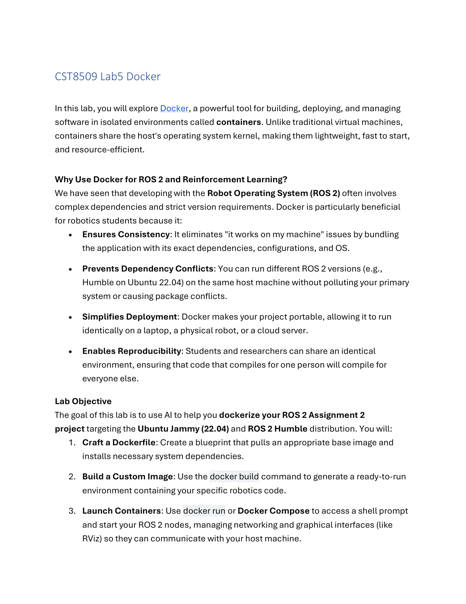
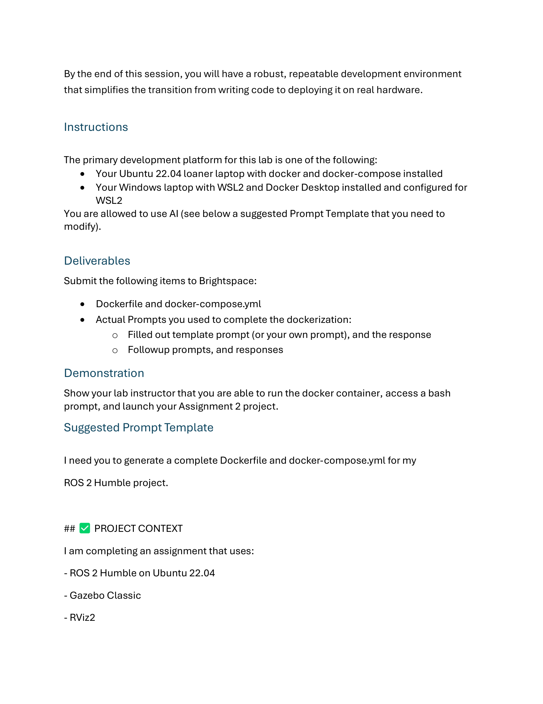
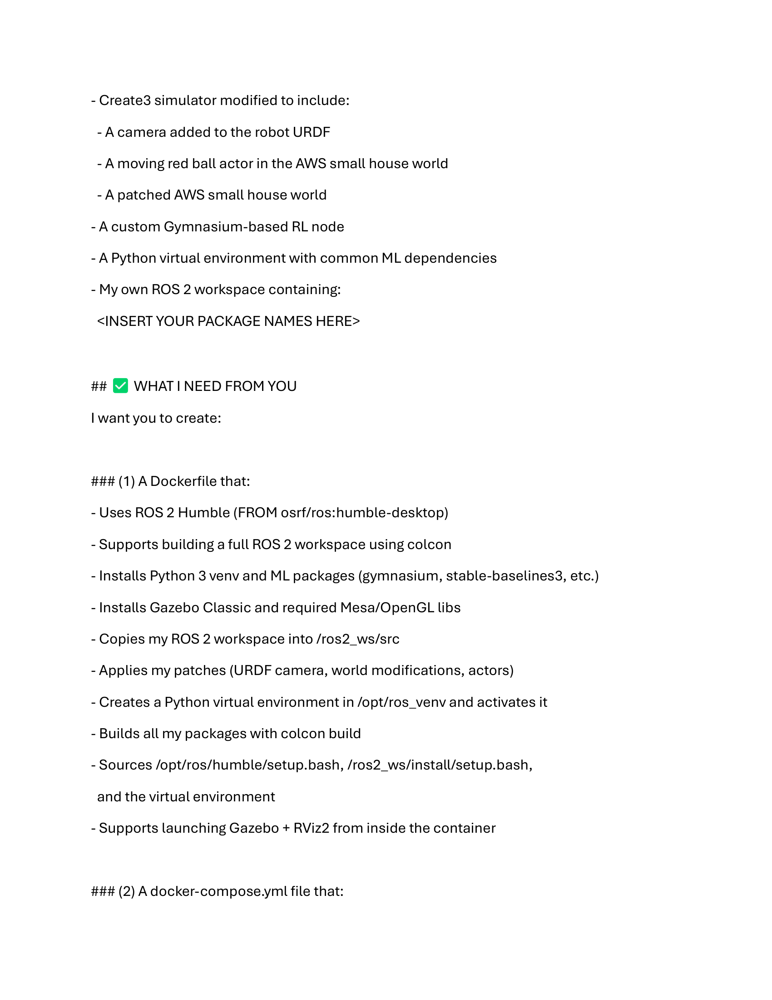
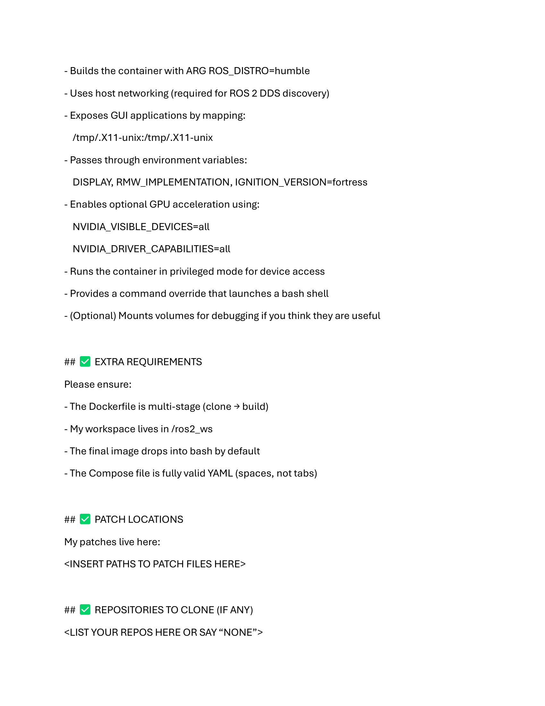
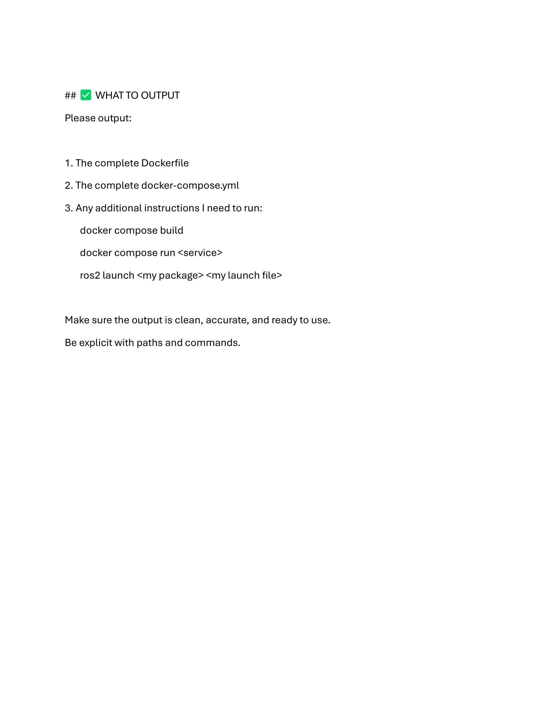

# Lab 5: Docker 容器化 (Docker Containerization)

> Source: `CST8509_Lab5_Docker.docx`
> Total pages: 5
> Course: CST8509 Reinforcement Learning

---

## 1. 实验简介 (Lab Introduction)



**CST8509 Lab5 Docker — Docker 容器化实验**

- In this lab, you will explore Docker, a powerful tool for building, deploying, and managing software in isolated environments called containers. — 在本实验中，你将探索 Docker，一个用于在被称为"容器"的隔离环境中构建、部署和管理软件的强大工具。
- Unlike traditional virtual machines, containers share the host's operating system kernel, making them lightweight, fast to start, and resource-efficient. — 与传统虚拟机不同，容器共享宿主机的操作系统内核，使其轻量、启动快速且资源高效。

**Why Use Docker for ROS 2 and Reinforcement Learning? — 为什么在 ROS 2 和强化学习中使用 Docker？**

- **Ensures Consistency:** It eliminates "it works on my machine" issues by bundling the application with its exact dependencies, configurations, and OS. — **确保一致性：** 通过将应用程序与其依赖、配置和操作系统打包在一起，消除"在我机器上能跑"的问题。
- **Prevents Dependency Conflicts:** You can run different ROS 2 versions (e.g., Humble on Ubuntu 22.04) on the same host machine without polluting your primary system or causing package conflicts. — **防止依赖冲突：** 你可以在同一台主机上运行不同版本的 ROS 2（如 Ubuntu 22.04 上的 Humble），而不会污染主系统或造成包冲突。
- **Simplifies Deployment:** Docker makes your project portable, allowing it to run identically on a laptop, a physical robot, or a cloud server. — **简化部署：** Docker 使项目具备可移植性，可以在笔记本、实体机器人或云服务器上一致运行。
- **Enables Reproducibility:** Students and researchers can share an identical environment, ensuring that code that compiles for one person will compile for everyone else. — **实现可复现性：** 学生和研究人员可以共享完全相同的环境，确保在一个人机器上能编译的代码在其他人机器上也能编译。

---

## 2. 实验目标 (Lab Objective)

**Lab Objective — 实验目标**

- The goal of this lab is to use AI to help you dockerize your ROS 2 Assignment project targeting the Ubuntu Jammy (22.04) and ROS 2 Humble distribution. — 本实验的目标是使用 AI 帮助你将 ROS 2 作业项目 Docker 化，目标平台为 Ubuntu Jammy (22.04) 和 ROS 2 Humble 发行版。

You will: — 你将：

1. **Craft a Dockerfile:** Create a blueprint that pulls an appropriate base image and installs necessary system dependencies. — **编写 Dockerfile：** 创建一个蓝图，拉取合适的基础镜像并安装必要的系统依赖。
2. **Build a Custom Image:** Use the `docker build` command to generate a ready-to-run environment containing your specific robotics code. — **构建自定义镜像：** 使用 `docker build` 命令生成包含你的机器人代码的即用环境。
3. **Launch Containers:** Use `docker run` or Docker Compose to access a shell prompt and start your ROS 2 nodes, managing networking and graphical interfaces (like RViz) so they can communicate with your host machine. — **启动容器：** 使用 `docker run` 或 Docker Compose 访问 shell 并启动 ROS 2 节点，管理网络和图形界面（如 RViz），使其能与宿主机通信。



**By the end of this session — 本次实验结束后**

- By the end of this session, you will have a robust, repeatable development environment that simplifies the transition from writing code to deploying it on real hardware. — 实验结束后，你将拥有一个健壮、可重复的开发环境，简化从编写代码到部署在实际硬件上的过渡。

---

## 3. 实验说明 (Instructions)

**Instructions — 实验说明**

- The primary development platform for this lab is one of the following: — 本实验的主要开发平台为以下之一：
  - Your Ubuntu 22.04 loaner laptop with docker and docker-compose installed — 安装了 docker 和 docker-compose 的 Ubuntu 22.04 借用笔记本
  - Your Windows laptop with WSL2 and Docker Desktop installed and configured for WSL2 — 安装了 WSL2 和 Docker Desktop 并配置为 WSL2 的 Windows 笔记本
- You are allowed to use AI (see below a suggested Prompt Template that you need to modify). — 允许使用 AI（见下方建议的提示词模板，需自行修改）。

---

## 4. 提交要求 (Deliverables)

**Deliverables — 提交物**

- Submit the following items to Brightspace: — 向 Brightspace 提交以下内容：
  - Dockerfile and docker-compose.yml — Dockerfile 和 docker-compose.yml
  - Actual Prompts you used to complete the dockerization: — 你完成 Docker 化时实际使用的提示词：
    - Filled out template prompt (or your own prompt), and the response — 填写完成的模板提示词（或自定义提示词）及回复
    - Followup prompts, and responses — 后续提示词及回复

**Demonstration — 演示**

- Show your lab instructor that you are able to run the docker container, access a bash prompt, and launch your Assignment 2 project. — 向实验教师演示你能运行 Docker 容器、访问 bash 提示符并启动 Assignment 2 项目。

---

## 5. AI 提示词模板 (Suggested Prompt Template)



**Suggested Prompt Template — 建议的提示词模板**

```
I need you to generate a complete Dockerfile and docker-compose.yml for my
ROS 2 Humble project.

## PROJECT CONTEXT
I am completing an assignment that uses:
- ROS 2 Humble on Ubuntu 22.04
- Gazebo Classic
- RViz2
- A camera added to the robot URDF
- Create3 simulator modified to include:
  - A moving red ball actor in the AWS small house world
  - A patched AWS small house world
- A custom Gymnasium-based RL node
- A Python virtual environment with common ML dependencies
- My own ROS 2 workspace containing:
  <INSERT YOUR PACKAGE NAMES HERE>
```

---

## 6. Dockerfile 要求 (Dockerfile Requirements)



**WHAT I NEED FROM YOU — 需要生成的内容**

### 6.1 Dockerfile 要求

- Uses ROS 2 Humble (`FROM osrf/ros:humble-desktop`) — 使用 ROS 2 Humble 基础镜像
- Supports building a full ROS 2 workspace using colcon — 支持使用 colcon 构建完整的 ROS 2 工作空间
- Installs Python 3 venv and ML packages (gymnasium, stable-baselines3, etc.) — 安装 Python 3 venv 和 ML 包
- Installs Gazebo Classic and required Mesa/OpenGL libs — 安装 Gazebo Classic 和所需的 Mesa/OpenGL 库
- Copies my ROS 2 workspace into `/ros2_ws/src` — 将 ROS 2 工作空间复制到 `/ros2_ws/src`
- Applies my patches (URDF camera, world modifications, actors) — 应用补丁（URDF 相机、世界修改、演员）
- Creates a Python virtual environment in `/opt/ros_venv` and activates it — 在 `/opt/ros_venv` 创建 Python 虚拟环境并激活
- Builds all my packages with `colcon build` — 使用 `colcon build` 构建所有包
- Sources `/opt/ros/humble/setup.bash`, `/ros2_ws/install/setup.bash`, and the virtual environment — Source 相关的 setup.bash 和虚拟环境
- Supports launching Gazebo + RViz2 from inside the container — 支持从容器内启动 Gazebo + RViz2

### 6.2 docker-compose.yml 要求

- Builds the container with `ARG ROS_DISTRO=humble` — 使用 `ARG ROS_DISTRO=humble` 构建容器
- Uses host networking (required for ROS 2 DDS discovery) — 使用主机网络（ROS 2 DDS 发现所需）
- Exposes GUI applications by mapping: `/tmp/.X11-unix:/tmp/.X11-unix` — 通过映射暴露 GUI 应用程序
- Passes through environment variables: `DISPLAY`, `RMW_IMPLEMENTATION`, `IGNITION_VERSION=fortress` — 传递环境变量
- Enables optional GPU acceleration using `NVIDIA_VISIBLE_DEVICES=all` and `NVIDIA_DRIVER_CAPABILITIES=all` — 启用可选 GPU 加速
- Runs the container in privileged mode for device access — 以特权模式运行容器以访问设备
- Provides a command override that launches a bash shell — 提供覆盖命令启动 bash shell
- (Optional) Mounts volumes for debugging if useful — （可选）挂载卷用于调试

---

## 7. 额外要求与输出 (Extra Requirements & Output)



**EXTRA REQUIREMENTS — 额外要求**

- The Dockerfile is multi-stage (clone → build) — Dockerfile 为多阶段构建（clone → build）
- My workspace lives in `/ros2_ws` — 工作空间位于 `/ros2_ws`
- The final image drops into bash by default — 最终镜像默认进入 bash
- The Compose file is fully valid YAML (spaces, not tabs) — Compose 文件为完全有效的 YAML（使用空格，非制表符）

**PATCH LOCATIONS — 补丁位置**

```
<INSERT PATHS TO PATCH FILES HERE>
```

**REPOSITORIES TO CLONE (IF ANY) — 要克隆的仓库（如有）**

```
<LIST YOUR REPOS HERE OR SAY "NONE">
```

**WHAT TO OUTPUT — 输出要求**

Please output: — 请输出：
1. The complete Dockerfile — 完整的 Dockerfile
2. The complete docker-compose.yml — 完整的 docker-compose.yml
3. Any additional instructions I need to run: — 所需的额外运行指令：

```bash
docker compose build
docker compose run <service>
ros2 launch <my package> <my launch file>
```

- Make sure the output is clean, accurate, and ready to use. Be explicit with paths and commands. — 确保输出清晰、准确、可直接使用。路径和命令要明确。
