# RL Notes Merged

- Generated: 2026-03-10 20:02:29
- Source folder: `C:\Users\40270\OneDrive\Desktop\workspace\aisd\courses\rl\notes`
- Total files: 68

## Contents

1. `week1_rl_intro_map.md`
2. `week1_rl_intro_slides.md`
3. `week1_rl_intro_storyline.md`
4. `week1_rl_intro_concepts.md`
5. `week1_rl_intro_math.md`
6. `week1_rl_intro_code.md`
7. `week1_rl_intro_tutorial.md`
8. `week1_rl_intro_history.md`
9. `week1_rl_intro_quiz.md`
10. `week2_mdp_map.md`
11. `week2_mdp_slides.md`
12. `week2_mdp_storyline.md`
13. `week2_mdp_concepts.md`
14. `week2_mdp_math.md`
15. `week2_mdp_code.md`
16. `week2_mdp_tutorial.md`
17. `week2_mdp_history.md`
18. `week2_mdp_quiz.md`
19. `week3_gymnasium_map.md`
20. `week3_gymnasium_slides.md`
21. `week3_gymnasium_storyline.md`
22. `week3_gymnasium_concepts.md`
23. `week3_gymnasium_math.md`
24. `week3_gymnasium_code.md`
25. `week3_gymnasium_tutorial.md`
26. `week3_gymnasium_history.md`
27. `week4_sb3_map.md`
28. `week4_sb3_slides.md`
29. `week4_sb3_storyline.md`
30. `week4_sb3_concepts.md`
31. `week4_sb3_math.md`
32. `week4_sb3_code.md`
33. `week4_sb3_tutorial.md`
34. `week4_sb3_history.md`
35. `week4_sb3_quiz.md`
36. `week5_dqn_map.md`
37. `week5_dqn_slides.md`
38. `week5_dqn_storyline.md`
39. `week5_dqn_concepts.md`
40. `week5_dqn_math.md`
41. `week5_dqn_code.md`
42. `week5_dqn_tutorial.md`
43. `week5_dqn_history.md`
44. `week6_slides.md`
45. `week6_midterm_review_map.md`
46. `week6_midterm_review_slides.md`
47. `week6_midterm_review_storyline.md`
48. `week6_midterm_review_concepts.md`
49. `week6_midterm_review_math.md`
50. `week6_midterm_review_code.md`
51. `week6_midterm_review_tutorial.md`
52. `week6_midterm_review_history.md`
53. `week6_midterm_review_quiz.md`
54. `lab1_cliffwalking_storyline.md`
55. `lab1_cliffwalking_math.md`
56. `lab1_cliffwalking_code.md`
57. `lab1_cliffwalking_tutorial.md`
58. `lab1_cliffwalking_history.md`
59. `lab2_gymnasium_storyline.md`
60. `lab2_gymnasium_math.md`
61. `lab2_gymnasium_code.md`
62. `lab2_gymnasium_tutorial.md`
63. `lab2_gymnasium_history.md`
64. `assignment1_blocksworld_storyline.md`
65. `assignment1_blocksworld_math.md`
66. `assignment1_blocksworld_code.md`
67. `assignment1_blocksworld_tutorial.md`
68. `assignment1_blocksworld_history.md`


---

## 01. week1_rl_intro_map

Source: `week1_rl_intro_map.md`

# Week 1: 强化学习入门 学习地图

## 1. 核心问题

本讲回答：
- 强化学习是什么？和监督学习有什么不同？
- Agent / Environment / Reward 三要素是什么关系？
- 什么是 Markov Property？为什么它重要？
- Policy 和 Value Function 各是什么？

---

## 2. 全景位置

```
Week 1 [你在这里]
  ↓ 奠定概念基础
Week 2: MDP + Q-Learning（算法）
  ↓
Week 3: Gymnasium（工具）
  ↓
Week 4: SB3（工业工具）
  ↓
Week 5: DQN（神经网络 Q-Learning）
  ↓
Week 6: 期中复习
```

Week 1 是整门课的**概念地基**，没有这里的抽象框架，后续每周的算法都会看不懂。

---

## 3. 依赖地图

```
前置知识
  ├── 条件概率 P(A|B)               ← 理解随机策略 π(a|s)
  ├── 期望值 E[X]                   ← 理解 Value Function
  └── 几何级数求和                   ← 理解折扣回报 G_t 收敛性

Week 1 输出 → 被依赖 →
  ├── Week 2: MDP / Q-Learning 的符号体系
  ├── Week 3: Gymnasium reset()/step() 返回 S_t, R_t
  ├── Week 5: DQN 用神经网络近似 Q_π(s,a)
  └── Week 6: 期中考试核心考点
```

---

## 4. 文件地图

| 文件 | 定位 | 何时用 |
|------|------|--------|
| [week1_rl_intro_slides.md](week1_rl_intro_slides.md) | 幻灯片笔记，原始课堂内容 | 第一次学习 |
| [week1_rl_intro_storyline.md](week1_rl_intro_storyline.md) | 叙事线索，帮助理解"为什么" | 第一次学习 |
| [week1_rl_intro_concepts.md](week1_rl_intro_concepts.md) | 核心术语速查 + 易错点 | 复习 / 考前 |
| [week1_rl_intro_math.md](week1_rl_intro_math.md) | 全部公式 + 手算练习 | 做题 / 期中 |
| [week1_rl_intro_code.md](week1_rl_intro_code.md) | 代码参考 | 写代码时 |
| [week1_rl_intro_tutorial.md](week1_rl_intro_tutorial.md) | 操作教程，手把手实践 | 做 Lab 前 |
| [week1_rl_intro_history.md](week1_rl_intro_history.md) | 历史演进，理解来龙去脉 | 想了解背景时 |
| [week1_rl_intro_quiz.md](week1_rl_intro_quiz.md) | 老师原版 Quiz（15 题） | 自测 |

---

## 5. 学习路线

**第一次学习：**
1. `slides.md` — 了解本周内容框架
2. `storyline.md` — 理解 RL 的动机和直觉
3. `concepts.md` — 确认术语理解正确
4. `math.md` — 看懂公式，做手算练习

**复习 / 期中备考：**
1. `concepts.md` — 术语和易错点速查
2. `math.md` 中的手算练习
3. `quiz.md` — 做老师原版题

**扩展理解：**
- `history.md` — 了解 RL 思想从行为主义到 DQN 的演进

---

## 6. 缺口检查

| 类型 | 状态 |
|------|------|
| 幻灯片笔记 | ✅ |
| 叙事线索 | ✅ |
| 核心概念 | ✅ |
| 数学公式 | ✅ |
| 代码参考 | ✅ |
| 操作教程 | ✅ |
| 历史背景 | ✅ |
| Quiz | ✅（来自 quize2.md） |
| 学习地图 | ✅（本文件） |


---

## 02. week1_rl_intro_slides

Source: `week1_rl_intro_slides.md`

# Week 1: 强化学习入门 (Introduction to Reinforcement Learning)

> Source: `CST8509_01_RL_Intro.pdf`
> Total slides: 37
> Instructor: Todd Kelley (Lectures) / Ali Mohamed Ali (Labs) | Winter 2026

---

## 1. 课程介绍 (Course Introduction)


- Introduction to Reinforcement Learning — 强化学习导论


- CST8509: Reinforcement Learning — CST8509：强化学习
- Meet your Professors — 认识你的教授
  - Lectures: Todd Kelley, Office: T315, Phone: 613-727-4723 x7474, Email: kelleyt@algonquincollege.com — 授课教授
  - Labs: Ali Mohamed Ali <mohamea2@algonquincollege.com> — 实验课教授
- Contact your Professor — 联系你的教授
  - email me with enquiries (can expect reply same or next day) — 有问题发邮件（预计当天或次日回复）
  - email me to arrange office-hour style meetings — 发邮件预约面谈


- Weekly schedule — 每周时间表
  - Lecture Mondays 1:00-3:00pm in C346 — 讲座：周一 1:00-3:00pm，教室 C346
  - Lab Section 101 Wednesdays 5:00 to 7:00pm in B320 — 实验 101 班：周三 5:00-7:00pm，教室 B320
  - Lab Section 102 Wednesdays 7:00 to 9:00pm in B119 — 实验 102 班：周三 7:00-9:00pm，教室 B119
  - One hour (average) of asynchronous (Hybrid) activity — 平均每周 1 小时异步（混合式）学习活动
- Late lab/assignment submissions are subject to a penalty: — 迟交实验/作业将被扣分：
  - 10% < 1 week — 迟交不超过 1 周扣 10%
  - 100% > 1 week — 迟交超过 1 周扣 100%

> **📝 Notes:**
>
> _(To be added)_

---

## 2. 学术诚信与成功建议 (Academic Integrity & Tips for Success)

### 2.1 作业期望 (Expectations for Assignments)


- Unless an Assignment or Lab explicitly states that it is a group activity, ALL practical and theory work in this course is individual work: — 除非作业或实验明确说明是小组活动，否则本课程所有实践和理论工作都是个人作业：
  - You must complete solutions by yourself — 你必须独立完成解答
  - You are allowed to participate in study groups and use ChatGPT or similar facilities — 允许参加学习小组并使用 ChatGPT 等工具
  - You are allowed to help each other understand the concepts of the course — 允许互相帮助理解课程概念
  - You are not allowed to copy or use for any purpose any portion of a solution from another student, from ChatGPT, or from any other source — 不允许抄袭或使用来自其他学生、ChatGPT 或任何其他来源的解答
  - You are not allowed to provide any portion of your solution to anyone else — 不允许将你的解答提供给其他人

### 2.2 成功建议 (Tips for Success)


- Assignments are large bodies of work that cannot reasonably be completed in one or two sessions, even long sessions — 作业工作量很大，即使是长时间学习也无法在一两次内完成
- Get started early — 尽早开始
- Get clarification and help early — 尽早寻求帮助和澄清
- Make good use of Lab Periods — 充分利用实验课时间


- **Rule One: 15 minute rule** — if you are frustrated and not making progress for 15 minutes, you need to: — **规则一：15 分钟规则** — 如果你受挫且 15 分钟内没有进展，你需要：
  - take a break, move on to another part of the assignment, switch to other course work, come back to it later — 休息一下，转做作业的其他部分，切换到其他课程，稍后再回来
  - sleep on it — 睡一觉再想
  - seek help from a peer — 向同学寻求帮助
  - seek help from the instructor — 向教授寻求帮助


- **Rule Two: Don't leave it to the last few days before the due date** — **规则二：不要拖到截止日期前几天才做**
  - Rule One is not feasible without Rule Two — 没有规则二，规则一就不可行
  - Get started early, read through and understand the focus of the assignment and the tasks, as soon as you can — 尽早开始，尽快通读并理解作业的重点和任务
  - Keep up with the course pace (every week, you're expected to put in about 5 hours of time in addition to 5 hours of Hybrid Activities, Lectures, and Labs) — 跟上课程进度（每周除了 5 小时的混合活动、讲座和实验外，预计还需投入约 5 小时）

### 2.3 过度帮助与抄袭 (Excessive Help & Plagiarism)


- Beware of receiving excessive help — 警惕接受过度帮助
- Do it yourself (you need to learn how to): — 自己动手（你需要学会如何）：
  - read EVERY word of the Lab and Assignment Documents — 阅读实验和作业文档的每一个字
  - consult course materials and resources — 查阅课程资料和资源
  - apply what you read and what you see in videos — 应用你阅读和观看视频中学到的内容
  - solve apparent inconsistencies/problems — 解决明显的不一致/问题


- Like excessive help, shortcuts are bad — 与过度帮助一样，走捷径也是不好的
- If you cannot explain your own work in a demonstration, you risk getting a zero on the lab or assignment — 如果你在演示中无法解释自己的作品，你将面临实验或作业得零分的风险


- Cheating is unacceptable. You may not copy or provide code or text: don't plagiarize — 作弊不可接受。你不得抄袭或提供代码或文字：不要剽窃
- The person you copy from is in just as much trouble as you — 被抄袭者和抄袭者一样会受到处罚

> **📝 Notes:**
>
> _(To be added)_

---

## 3. 课程概览与学习目标 (Course Overview & Learning Outcomes)


- **Introduction to RL** — **强化学习导论**
- **Foundational Principles of RL** — **RL 基础原理**
  - Mathematical definitions — 数学定义
  - RL Algorithms — RL 算法
- **Solving RL problems** — **求解 RL 问题**
  - Game-based, maze based, etc — 基于游戏、基于迷宫等
  - Robotics — 机器人技术
  - Create — 创建
  - OpenAI Gymnasium/Gym, Gazebo — OpenAI Gymnasium/Gym, Gazebo 框架


**Week 1 Outcomes:** — **第 1 周学习成果：**
1. Agent — 智能体
2. Environment — 环境
3. Reward — 奖励
4. Policy — 策略
5. Value Function — 价值函数
6. Model — 模型

> **📝 Notes:**
>
> _(To be added)_

---

## 4. 什么是强化学习 (What is Reinforcement Learning)

### 4.1 RL 在机器学习中的位置 (RL in Machine Learning)


- Reinforcement Learning is a **third type of Machine Learning** — 强化学习是**机器学习的第三种类型**
- Based on **Markov Decision Processes** — 基于**马尔可夫决策过程**
- Used for **agent-based systems** — 用于**基于智能体的系统**
  - Agent uses a **policy** for choosing an action in each time step — 智能体使用**策略**在每个时间步选择动作
  - Each action taken results in a **reward** — 每个采取的动作会产生一个**奖励**
  - The goal is for the agent to learn a policy that **maximizes the reward** — 目标是让智能体学习一个能**最大化奖励**的策略

### 4.2 RL 领域名人 (Who's Who of Reinforcement Learning)


- **Andrew Barto**, University of Massachusetts Amherst — 马萨诸塞大学阿默斯特分校
- **Richard Sutton**, University of Alberta (Co-founder of Edmonton office of DeepMind) — textbook — 阿尔伯塔大学（DeepMind 埃德蒙顿办公室联合创始人）— 教科书作者
- **David Silver**, University of Alberta PhD graduate, now at DeepMind and University College London — 阿尔伯塔大学博士毕业，现任职于 DeepMind 和伦敦大学学院
  - David Silver's RL course on Youtube: https://www.youtube.com/playlist?list=PLzuuYNsE1EZAXYR4FJ75jcJseBmo4KQ9- — David Silver 的 RL 课程（YouTube）

### 4.3 RL 的广泛应用 (How Broad and Applicable is RL)


- David Silver lecture 1 (youtube), 6:29 — David Silver 第 1 讲（YouTube），6:29
- (venn diagrams showing RL is at the intersection of many different fields of human endeavor) — （韦恩图展示 RL 处于人类多个研究领域的交叉点）


- How does reinforcement learning compare to other machine learning (supervised, and unsupervised)? — 强化学习与其他机器学习（监督学习和无监督学习）相比如何？
- David Silver lecture 1 - 9:35 — David Silver 第 1 讲 - 9:35

### 4.4 RL 应用实例 (RL Examples)


- David Silver Lecture 1: 12:45 - examples of RL, starting with stunt manoeuvers model helicopter (training is done offline with a model of a helicopter world) — David Silver 第 1 讲：12:45 - RL 实例，从特技飞行模型直升机开始（训练在直升机世界模型中离线完成）
- David Silver Lecture 1: after helicopter - video games (many Atari games better than humans) decisions at 15HZ (3 or 4 days of training per game) — David Silver 第 1 讲：直升机之后 - 电子游戏（在许多 Atari 游戏中超越人类）以 15Hz 做决策（每个游戏训练 3-4 天）
- Tetris: https://www.cbc.ca/player/play/2296942659841 — 俄罗斯方块
- our coffee robot? — 我们的咖啡机器人？
- monkey and banana? — 猴子和香蕉问题？


- **AlphaGo movie** — Go board game — **AlphaGo 纪录片** — 围棋
  - begins with Demis Hassabis (co-founder of DeepMind) — 以 Demis Hassabis（DeepMind 联合创始人）开场
  - After Fan Hui, we see David Silver — 在范廷钰之后，出现 David Silver
  - At 30:00 the start of the first match — 30:00 处开始第一场比赛

> **📝 Notes:**
>
> _(To be added)_

---

## 5. 奖励 (Reward)


- Reward is a **scalar feedback signal** $R_t$ — 奖励是一个**标量反馈信号** $R_t$
- $R_t$ represents how well the agent is doing at Step $t$ — $R_t$ 表示智能体在时间步 $t$ 的表现如何
- reinforcement learning problems are set up such that goal is to **maximize cumulative reward** — 强化学习问题的目标是**最大化累积奖励**
- **Reward Hypothesis:** All goals can be described by the maximization of expected cumulative reward — **奖励假说：** 所有目标都可以用期望累积奖励的最大化来描述


- reward can be received along the way, or it might come all at the end — 奖励可以在过程中逐步获得，也可以全部在最后获得
- if shorter time is better, then reward per step can be negative, which favors shorter episodes — 如果时间越短越好，则每步奖励可以设为负值，这有利于更短的回合
- to maximize reward overall, agent may need to accept small or negative rewards short-term to maximize the total reward — 为了最大化总体奖励，智能体可能需要接受短期的小额或负奖励来最大化总奖励

> **📝 Notes:**
>
> _(To be added)_

---

## 6. Agent-Environment 交互 (Anatomy of an RL Problem)

### 6.1 Agent 与 Environment 的关系 (Agent-Environment Interaction)


- agent and environment diagram — 智能体与环境的交互图
- our algorithm operates in the agent — 我们的算法运行在智能体中


- each time step, the agent receives **Reward**, **Observation**, and performs **Action** — 在每个时间步，智能体接收**奖励**、**观测**，并执行**动作**
- the time series of Reward, Observation, and Actions is the data for Reinforcement learning — 奖励、观测和动作的时间序列就是强化学习的数据
- the history at time step $t$ is $H_t = R_1, O_1, A_1, ..., R_t, O_t, A_t$ — 时间步 $t$ 的历史为 $H_t = R_1, O_1, A_1, ..., R_t, O_t, A_t$

### 6.2 历史与状态 (History and State)


- the agent picks the next action at time $t$ based on the information/data contained in $H_t$ — 智能体根据 $H_t$ 中包含的信息/数据在时间 $t$ 选择下一个动作
- the environment determines Observations and Rewards — 环境决定观测和奖励
- processing the whole history is cumbersome after many steps — 经过许多步之后，处理完整历史变得很繁琐
- **State** is a summary of the information that is used to determine what happens next ($t+1$) — **状态**是用于决定下一步（$t+1$）会发生什么的信息摘要


- $S_t = f(H_t)$ — 状态是历史的函数
- **environment state** ($S_t^e$) is not usually directly accessible by the agent; whatever information is used to pick the next observation and reward — **环境状态**（$S_t^e$）通常智能体无法直接访问；它包含用于生成下一个观测和奖励的所有信息
- **agent state** ($S_t^a$) is directly accessible to the agent, the agent keeps track of this, and it's used (somehow) to select the next action — **智能体状态**（$S_t^a$）智能体可以直接访问，智能体维护此状态，并以某种方式用于选择下一个动作
- The programmer is responsible for the (somehow). The programmer decides what the function is: — 程序员负责决定这个"某种方式"。程序员决定函数是什么：
  - $S_t^a = f(H_t)$ for some function $f$ of the programmer's choosing — $S_t^a = f(H_t)$，其中 $f$ 是程序员选择的某个函数

> **📝 Notes:**
>
> _(To be added)_

---

## 7. 马尔可夫状态 (Markov State)


- Important question in RL is whether the state satisfies the **Markov Property**, in other words, is it a **Markov State** — RL 中的一个重要问题是状态是否满足**马尔可夫性质**，换句话说，它是否是一个**马尔可夫状态**
- **Definition of a Markov State:** The probability of each possible value for $S_t$ and $R_t$ depends only on the immediately preceding state and action, $S_{t-1}$ and $A_{t-1}$ — **马尔可夫状态的定义：** $S_t$ 和 $R_t$ 各可能取值的概率仅取决于紧接着的前一个状态和动作 $S_{t-1}$ 和 $A_{t-1}$
- **Intuition:** "The future is independent of the past given the present" — **直觉理解：**"给定当前状态，未来与过去无关"
- Examples: — 示例：
  - linear motion of a particle in classical mechanics — 经典力学中粒子的直线运动
  - does the position constitute a Markov state? — 仅位置是否构成马尔可夫状态？
  - does the position and velocity constitute a Markov state? — 位置和速度是否构成马尔可夫状态？


- helicopter example (position, velocity, angular velocity, angular position, wind velocity) — 直升机示例（位置、速度、角速度、角位置、风速）
- $S_t^e$ environment state is Markov — $S_t^e$ 环境状态是马尔可夫的
- $H_t$ is Markov, $S_t = f(H_t) = H_t$ — $H_t$ 是马尔可夫的，$S_t = f(H_t) = H_t$
- It's always possible to come up with a Markov state, but we want to identify the Markov states that are more useful for us, efficient, less redundancy, etc. — 总是可以构造一个马尔可夫状态，但我们希望找到对我们更有用、更高效、冗余更少的马尔可夫状态


- **Rat Example** — David Silver Lecture 1, 47:54 — **老鼠实验** — David Silver 第 1 讲，47:54
- depending on what function is chosen for $f(H_t)$, the question mark can be electric shock, cheese, or unknown — 根据为 $f(H_t)$ 选择的函数不同，问号可以是电击、奶酪或未知

> **📝 Notes:**
>
> _(To be added)_

---

## 8. RL Agent 的组成 (Components of RL Agents)

### 8.1 概述 (Overview)


- RL Agents may include one or more of the following: — RL 智能体可能包含以下一个或多个组件：
  - **Policy:** function that maps state to action — **策略：** 将状态映射到动作的函数
  - **Value Function:** represents the value (how good is it?) of each state or action — **价值函数：** 表示每个状态或动作的价值（有多好？）
  - **Model:** agent's internal representation of the environment, as opposed to the environment itself — **模型：** 智能体对环境的内部表征，区别于环境本身

### 8.2 策略 (Policy)


- **Function:** map from state to action — **函数：** 从状态到动作的映射
- **Deterministic policy:** one where there is only one choice, one action — **确定性策略：** 只有一个选择、一个动作
  - $a = \pi(S)$
- our goal will be to learn a function $\pi$, from experience, such that we maximize reward — 我们的目标是从经验中学习一个函数 $\pi$，使得奖励最大化
- **Stochastic policy:** — **随机性策略：**
  - $\pi(a|s) = P[A=a|S=s]$
  - This function gives the probability of one or more actions, given State $s$ (non-deterministic) — 该函数给出在给定状态 $s$ 下各个动作的概率（非确定性的）
  - Example: in certain state, $a_1$ chosen 20% of the time, $a_2$ chosen 80% of the time — 示例：在某个状态下，$a_1$ 被选择 20% 的时间，$a_2$ 被选择 80% 的时间

### 8.3 价值函数 (Value Function)


- the value function indicates how good it is to be in a particular state with respect to **expected future reward** — 价值函数表示处于某个特定状态相对于**期望未来奖励**有多好
- used to pick actions, interacts with policy — 用于选择动作，与策略交互
- the value function for a policy is the **sum of the expected reward for all future states** — 某个策略的价值函数是**未来所有状态的期望奖励之和**


- in the case of Atari games, as states are visited, value goes up and down, because if something good is about to happen, value function is elevated — 在 Atari 游戏中，随着状态被访问，价值会上下波动，因为如果好事即将发生，价值函数会升高
  - after something good happens, that reward is behind you, and not included in the future reward — 好事发生之后，该奖励已经过去，不再包含在未来奖励中
  - in other words the value function does not include the sum of rewards received so far, just future reward, which oscillates — 换句话说，价值函数不包括迄今已收到的奖励之和，只看未来奖励，因此会波动
  - David Silver Lecture 1: 1:02:15 — David Silver 第 1 讲：1:02:15

### 8.4 模型 (Model)


- allows inferences about how the environment will behave — 允许推断环境将如何表现
- model indicates or implies the next state and next reward — 模型指示或暗示下一个状态和下一个奖励
- From Sutton, page 7: "Models are used for **planning**, by which we mean any way of deciding on a course of action by considering possible future situations before they are actually experienced." — 引自 Sutton 第 7 页："模型用于**规划**，即在实际经历之前，通过考虑可能的未来情况来决定行动方案的任何方法。"
- David Silver Lecture 1: **Transition model** (predicts states) **Reward Model** (predicts rewards) — David Silver 第 1 讲：**转移模型**（预测状态）**奖励模型**（预测奖励）
- not all Reinforcement Learning Problems/Solutions include a model — 并非所有强化学习问题/解决方案都包含模型

### 8.5 迷宫示例 (Maze Example)


- David Silver, Lecture 1: 1:08:00 — David Silver，第 1 讲：1:08:00

> **📝 Notes:**
>
> _(To be added)_

---

## 9. RL Agent 分类 (Taxonomy of RL Agents)


- **Value Based** — **基于价值的方法**
  - no policy (choose actions based on Value function) — 没有显式策略（根据价值函数选择动作）
  - value function — 价值函数
- **Policy Based** — **基于策略的方法**
  - Policy — 策略
  - no value function — 没有价值函数


- **Actor Critic** — **演员-评论家方法**
  - Policy (actor) — 策略（演员）
  - Value Function (critic) — 价值函数（评论家）
- **Model Free** — **无模型方法**
  - Policy and/or Value Function — 策略和/或价值函数
  - no Model — 没有模型
- **Model Based** — **基于模型的方法**
  - Policy and/or Value Function — 策略和/或价值函数
  - Model — 模型

> **📝 Notes:**
>
> _(To be added)_

---

## 10. 关键子问题 (Key Subproblems)


- **Learning vs Planning** — David Silver Lecture 1: 1:16:10 — **学习 vs 规划** — David Silver 第 1 讲：1:16:10
  - reinforcement learning — 强化学习（从真实经验中学习）
  - planning — 规划（从模型中模拟学习）
- **Exploitation vs Exploration** — **利用 vs 探索**
  - Example: Always go to a good restaurant (exploit the good restaurant) vs Randomly choose a new restaurant (exploration, might be better, might be worse. This is our chance to find better, but it's a risk) — 示例：总是去一家好餐厅（利用已知的好餐厅）vs 随机选择一家新餐厅（探索，可能更好也可能更差。这是发现更好选择的机会，但也有风险）
- **Prediction vs Control** — **预测 vs 控制**
  - prediction (evaluate future reward) vs control (optimize policy) — 预测（评估未来奖励）vs 控制（优化策略）

> **📝 Notes:**
>
> _(To be added)_

---

## 11. 学习检查 (Check Your Learning)


- What is the Markov Property? — 什么是马尔可夫性质？
- What are the possible components in an RL agent? — RL 智能体有哪些可能的组件？
- What is a policy in the context of RL? — 在 RL 的语境中，什么是策略？
- What is a value function in the context of RL? — 在 RL 的语境中，什么是价值函数？
- What is a model in the context of RL? — 在 RL 的语境中，什么是模型？

> **📝 Notes:**
>
> _(To be added)_


---

## 03. week1_rl_intro_storyline

Source: `week1_rl_intro_storyline.md`

# Lecture 1 故事线：强化学习是什么，以及它如何工作？

> **Source:** `CST8509_01_RL_Intro.pdf`
> **核心主题：** 从零开始理解强化学习——智能体如何通过与环境交互来学习最优行为
> **数学前置：** [马尔可夫链与MDP](../../math/probability/markov_chains.md) | [几何级数与折扣回报](../../math/calculus/geometric_series.md) | [Argmax](../../math/general/argmax.md) | [条件概率](../../math/probability/conditional_probability.md)
> **故事线：** 从"什么是 RL"到"RL 智能体的完整解剖"——像拆解一台机器一样，逐个认识每个零件

---

## 🎬 序幕：我们要解决什么问题？

想象你在一个陌生城市找餐厅吃饭。你没有地图，没有推荐，只能自己试。

- 你走进一家餐厅，吃了一顿，觉得还行（奖励 = +3）
- 第二天换了一家，难吃（奖励 = -2）
- 第三天回到第一家（利用已知信息），但你也想试试街角那家新开的（探索未知）

这就是强化学习的核心问题：**一个智能体（你）在一个环境（城市）中，通过不断试错（选餐厅），学习一个策略（选餐厅的规则），使得累积奖励（总体用餐体验）最大化。**

与监督学习不同，没有人告诉你"正确答案"是哪家餐厅。你只能通过自己的经验来学习。

---

## 📚 第一章：RL 在机器学习中的位置——第三种学习方式

机器学习有三大类：

| 类型 | 核心思路 | 数据形式 | 例子 |
|------|---------|---------|------|
| 监督学习 (Supervised) | 给标签，学映射 | (输入, 标签) 对 | 图片分类、房价预测 |
| 无监督学习 (Unsupervised) | 无标签，找结构 | 只有输入 | 聚类、降维 |
| **强化学习 (RL)** | **试错，最大化奖励** | **状态-动作-奖励序列** | **下棋、机器人控制** |

RL 的独特之处：
- 没有"正确答案"标签——只有奖励信号
- 决策是**序贯的**（sequential）——当前动作影响未来状态
- 需要平衡**探索**（尝试新动作）和**利用**（使用已知好动作）

> 📚 Ref: Sutton & Barto Ch.1; David Silver Lecture 1, 9:35

---

## 🧮 第二章：RL 问题的基本结构——Agent、Environment、Reward

### 2.1 Agent-Environment 交互循环

RL 问题的核心是一个循环：

```
        ┌──────────────────────────────┐
        │         Environment          │
        │  (环境：游戏、迷宫、世界)      │
        └──────┬───────────────┬───────┘
               │ Observation   │ Reward
               │ (观测)        │ (奖励)
               ▼               ▼
        ┌──────────────────────────────┐
        │           Agent              │
        │  (智能体：我们的算法)          │
        └──────────────┬───────────────┘
                       │ Action (动作)
                       ▼
                  回到 Environment
```

每个时间步 $t$：
1. Agent 观察环境状态
2. Agent 选择一个动作
3. Environment 返回新的观测和奖励
4. 重复

### 2.2 历史与状态

- **History（历史）：** $H_t = R_1, O_1, A_1, ..., R_t, O_t, A_t$ — 到目前为止所有的交互记录
- 问题：历史越来越长，处理起来很麻烦
- 解决方案：**State（状态）** = 历史的摘要函数 $S_t = f(H_t)$

两种状态：
- **环境状态** $S_t^e$：环境内部的完整信息（通常 agent 看不到）
- **智能体状态** $S_t^a$：agent 自己维护的信息，用于决策

> 💡 类比：你在迷宫里走。环境状态是整个迷宫的地图（你看不到）。智能体状态是你记住的"我走过哪些路"。

### 2.3 奖励（Reward）

- **奖励假说（Reward Hypothesis）：** 所有目标都可以用期望累积奖励的最大化来描述
- 奖励是标量信号 $R_t$，告诉 agent 当前表现如何
- 关键洞察：agent 可能需要**牺牲短期奖励**来获得更大的长期回报
  - 例：Cliff Walking 中，绕远路（每步 -1）比走悬崖边（可能 -100）更好

> 📚 Ref: Sutton & Barto §3.2; Quiz 1 Q4（为什么不能直接求和？→ 可能发散到无穷）

---

## 🧠 第三章：马尔可夫性质——"记忆"的关键问题

### 3.1 什么是马尔可夫性质？

**定义：** $S_t$ 和 $R_t$ 的概率仅取决于 $S_{t-1}$ 和 $A_{t-1}$，与更早的历史无关。

**一句话直觉：** "给定当前状态，未来与过去无关。" 当前状态包含了预测未来所需的全部信息。

### 3.2 经典例子

| 场景 | 仅位置？ | 位置+速度？ |
|------|---------|------------|
| 粒子运动 | ❌ 不是 Markov：只知道在哪，不知道往哪走、走多快，无法预测下一刻位置 | ✅ 是 Markov：位置+速度足以确定未来轨迹（牛顿力学） |
| 直升机 | ❌ 同理：仅位置无法预测运动 | ✅ 位置+速度+角速度+角位置+风速，合在一起足以预测未来 |

### 3.3 老鼠实验

David Silver 的经典例子（Lecture 1, 47:54）：一只老鼠在多次实验中积累了经验，现在要预测"下一步会发生什么"。

**过去的经验（训练数据）：**

| 过去某次实验的特征 | 最终结果 |
|-------------------|---------|
| ...最后 3 个事件是 `(杠杆, 灯, ???)` 的那次 | → 电击 ⚡ |
| ...灯总共亮了 4 次的那次 | → 奶酪 🧀 |

**当前新实验的完整历史：**
```
灯, 灯, 杠杆, 铃, 灯, 杠杆, 杠杆, 铃, 灯, 杠杆, 灯, ???
```

**三种 $f$ 如何匹配过去经验：**

- **$f(H_t)$ = 最后 3 个事件** → 当前状态 = `(杠杆, 灯, ???)`
  翻经验本：过去 `(杠杆, 灯, ???)` 后面跟的是电击 → **预测：电击** ⚡

- **$f(H_t)$ = 灯亮的总次数** → 当前状态 = `灯亮了 4 次`
  翻经验本：过去灯亮 4 次那次实验，最后得到了奶酪 → **预测：奶酪** 🧀

- **$f(H_t)$ = 完整历史** → 当前状态 = 整个序列 `灯,灯,杠杆,铃,...`
  翻经验本：这个完整序列以前从来没见过，无法匹配任何过去经验 → **预测：未知** ❓

**关键启示：** 同一段历史，不同的 $f$ 提取了不同特征，匹配到了不同的过去经验，因此得出完全不同的预测。状态函数 $f$ 的选择决定了 agent 能"看到"什么，直接影响学习效果。程序员的职责就是设计好这个 $f$。

> 📚 Ref: David Silver Lecture 1, 47:54; Quiz 1 Q1-Q3

---

## 🏰 第四章：RL Agent 的三大组件——Policy、Value Function、Model

### 4.1 策略（Policy）

**一句话：** 告诉 agent "在这个状态下该做什么"的函数。

两种形式：
- **确定性策略：** $a = \pi(s)$ — 给定状态，输出唯一动作
- **随机性策略：** $\pi(a|s) = P[A=a|S=s]$ — 给定状态，输出动作的概率分布

> 💡 类比：确定性策略像 GPS 导航（"前方右转"），随机性策略像"70%概率右转，30%概率直行"。

### 4.2 价值函数（Value Function）

**一句话：** 评估"处于某个状态有多好"——基于从该状态出发能获得的期望未来奖励。

- **状态价值函数** $V(s)$：从状态 $s$ 出发的期望总回报
- **动作价值函数** $Q(s,a)$：在状态 $s$ 采取动作 $a$ 后的期望总回报

关键理解：
- 价值函数只看**未来**奖励，不包括已经收到的奖励
- 在 Atari 游戏中，价值会波动。为什么？因为价值=未来奖励的期望。好事（如即将吃到金币）即将发生时，未来奖励多，价值高；好事发生后，那个奖励已经过去不再计入未来，价值又下降了

> 📚 Ref: Quiz 1 Q6（$V(s)$ = 状态→期望回报）, Q7（$Q(s,a)$ = 状态+动作→期望回报）

### 4.3 模型（Model）

**一句话：** agent 对环境的内部模拟——预测"如果我做了X，会发生什么"。

- **转移模型：** 预测下一个状态
- **奖励模型：** 预测下一个奖励
- 用于**规划（Planning）**：在脑中模拟未来，而不是真的去试
- **不是所有 RL 方法都需要模型**

> 📚 Ref: Sutton p.7

---

## 📏 第五章：RL Agent 的分类——你的 Agent 长什么样？

根据 agent 包含哪些组件，可以分类：

```
┌─────────────────────────────────────────────────┐
│              RL Agent 分类体系                    │
│                                                  │
│  按组件分：                                       │
│  ┌─────────────┐  ┌─────────────┐  ┌──────────┐ │
│  │ Value Based  │  │ Policy Based│  │Actor     │ │
│  │ 只有 V/Q    │  │ 只有 π      │  │Critic    │ │
│  │ 从Q隐式选动作│  │ 无价值函数   │  │π + V/Q  │ │
│  └─────────────┘  └─────────────┘  └──────────┘ │
│                                                  │
│  按是否有模型分：                                  │
│  ┌─────────────────┐  ┌────────────────────┐     │
│  │ Model Free      │  │ Model Based        │     │
│  │ 无环境模型       │  │ 有环境模型          │     │
│  │ 直接从经验学习   │  │ 可以"想象"未来      │     │
│  └─────────────────┘  └────────────────────┘     │
└─────────────────────────────────────────────────┘
```

| 类型 | Policy | Value Function | Model |
|------|--------|---------------|-------|
| Value Based | ❌ (隐式) | ✅ | 可有可无 |
| Policy Based | ✅ | ❌ | 可有可无 |
| Actor Critic | ✅ (actor) | ✅ (critic) | 可有可无 |

> 💡 本课程 Lab 1 的 Q-Learning 就是 **Value Based + Model Free** 的方法。

---

## 🗺️ 第六章：关键子问题——RL 的三大挑战

| 子问题 | 含义 | 例子 |
|--------|------|------|
| **Learning vs Planning** | 从真实经验学 vs 从模型中模拟学 | 真的去餐厅吃 vs 看点评想象 |
| **Exploitation vs Exploration** | 用已知最好的 vs 尝试新的 | 去老餐厅 vs 试新餐厅 |
| **Prediction vs Control** | 评估当前策略 vs 找最优策略 | "这个策略能得多少分" vs "怎么得最高分" |

> 📚 Ref: David Silver Lecture 1, 1:16:10; Quiz 1 Q8（贪婪策略 = 总是选最高即时回报）

---

## 🗺️ 全局回顾：技术演进路线图

```
┌─────────────────────────────────────────────────────────┐
│                Week 1 知识路线图                          │
│                                                          │
│  RL 是什么？                                              │
│  ✅ 机器学习的第三种类型                                   │
│  ✅ 基于 MDP，通过试错学习                                 │
│         │                                                │
│         ▼                                                │
│  RL 问题的结构                                            │
│  ✅ Agent-Environment 循环                                │
│  ✅ History → State（摘要函数）                            │
│  ✅ Reward（标量反馈信号）                                 │
│         │                                                │
│         ▼                                                │
│  马尔可夫性质                                             │
│  ✅ "给定现在，未来与过去无关"                              │
│  ✅ 状态函数 f 的选择至关重要                               │
│         │                                                │
│         ▼                                                │
│  Agent 的三大组件                                         │
│  ✅ Policy（状态→动作）                                    │
│  ✅ Value Function（状态→期望回报）                         │
│  ✅ Model（预测环境行为）                                   │
│         │                                                │
│         ▼                                                │
│  Agent 分类 + 关键子问题                                   │
│  ✅ Value/Policy/Actor-Critic                             │
│  ✅ Model Free/Model Based                                │
│  ✅ Exploit vs Explore, Predict vs Control                │
│         │                                                │
│         ▼                                                │
│  下一站：Week 2 — MDP 数学形式化                           │
│  （Bellman 方程、折扣因子、Q-Learning）                     │
└─────────────────────────────────────────────────────────┘
```

---

## 🎓 考试/复习重点检查清单

- [ ] 能解释 RL 与监督学习、无监督学习的区别
- [ ] 能画出 Agent-Environment 交互循环图
- [ ] 能定义 History、State、$S_t = f(H_t)$
- [ ] 能区分环境状态 $S_t^e$ 和智能体状态 $S_t^a$
- [ ] 能定义马尔可夫性质并给出例子（粒子运动、直升机）
- [ ] 能解释老鼠实验中 $f(H_t)$ 的选择如何影响预测
- [ ] 能定义 Policy（确定性 vs 随机性）
- [ ] 能区分 $V(s)$ 和 $Q(s,a)$（Quiz 1 Q6 vs Q7）
- [ ] 能解释 Model 的作用和 Planning 的含义
- [ ] 能分类 RL Agent（Value Based / Policy Based / Actor Critic）
- [ ] 能分类 RL Agent（Model Free / Model Based）
- [ ] 能解释 Exploitation vs Exploration（餐厅例子）
- [ ] 能解释 Prediction vs Control
- [ ] 能解释 Reward Hypothesis
- [ ] 能解释为什么价值函数只看未来奖励（Atari 例子）


---

## 04. week1_rl_intro_concepts

Source: `week1_rl_intro_concepts.md`

# Week 1: 强化学习入门 — 核心概念 (Core Concepts)

> See also: [幻灯片笔记](week1_rl_intro_slides.md) | [数学公式](week1_rl_intro_math.md) | [历史背景](week1_rl_intro_history.md)

---

## 核心术语速查

### Reinforcement Learning（强化学习）

通过与环境交互，最大化累积奖励信号的学习范式。区别于监督学习（有标签）和无监督学习（无标签），RL 只有奖励信号作为反馈。

---

### Agent（智能体）

在环境中感知状态、选择动作的决策实体。

---

### Environment（环境）

接收 Agent 的动作，返回新状态和奖励的外部系统。

---

### Reward（奖励）$R_t$

标量信号，表示 Agent 在时间步 $t$ 的即时表现好坏。RL 的唯一优化目标是最大化**累积**奖励。

> ⚠️ **易混淆：** Reward（即时奖励）≠ Return（累积回报）。$R_t$ 是单步奖励，$G_t$ 是折扣求和。

---

### State（状态）$S_t$

环境在时间步 $t$ 的表示。状态是历史的压缩摘要：$S_t = f(H_t)$。

> ⚠️ **易混淆：** State（状态）≠ Observation（观测）。完全可观测时两者相同；部分可观测时 Observation 是状态的不完整视图（POMDP）。

---

### Markov Property（马尔可夫性质）

$$
P(S_{t+1}, R_{t+1} \mid S_t, A_t) = P(S_{t+1}, R_{t+1} \mid H_t)
$$

**一句话：** 给定当前状态，未来与历史无关。

**实践意义：** 状态设计是否包含了足够信息？如果状态设计不好（漏掉关键信息），Markov Property 不成立，算法收敛变差。

---

### Policy（策略）$\pi$

将状态映射到动作的规则。有两种形式：

| 类型 | 公式 | 含义 |
|------|------|------|
| 确定性策略 | $a = \pi(s)$ | 每个状态→唯一动作 |
| 随机性策略 | $\pi(a \mid s) = P[A=a \mid S=s]$ | 每个状态→动作概率分布 |

约束：$\sum_a \pi(a \mid s) = 1$

---

### Return（回报）$G_t$

从时间步 $t$ 起的折扣累积奖励：

$$
G_t = \sum_{k=0}^{\infty} \gamma^k R_{t+k+1} = R_{t+1} + \gamma G_{t+1}
$$

RL 的**真正优化目标**是最大化 $G_t$，而不是单步 $R_t$。

---

### Discount Factor（折扣因子）$\gamma$

$0 \le \gamma < 1$，控制未来奖励的权重：

| 值 | 效果 |
|----|------|
| $\gamma = 0$ | 只看当前奖励（短视） |
| $\gamma \to 1$ | 重视长期奖励（有远见） |

> ⚠️ **为什么不用 $\gamma = 1$？** 持续任务（无终止）中 $G_t$ 会发散到无穷，无法定义优化目标。

---

### Value Function（价值函数）

| 函数 | 公式 | 含义 |
|------|------|------|
| 状态价值 $V_\pi(s)$ | $\mathbb{E}_\pi[G_t \mid S_t=s]$ | 从状态 $s$ 遵循策略 $\pi$ 的期望回报 |
| 动作价值 $Q_\pi(s,a)$ | $\mathbb{E}_\pi[G_t \mid S_t=s, A_t=a]$ | 在 $s$ 做 $a$ 后遵循 $\pi$ 的期望回报 |

---

## 概念辨析

### RL vs 监督学习 vs 无监督学习

| 维度 | 监督学习 | 无监督学习 | 强化学习 |
|------|---------|-----------|---------|
| 训练信号 | 标签（正确答案） | 无标签 | 奖励信号（延迟、稀疏） |
| 反馈类型 | 即时（每个样本） | 无 | 延迟（动作后才知道好坏） |
| 目标 | 拟合映射 | 发现结构 | 最大化累积奖励 |

### Reward vs Return

- **Reward** $R_t$：单步即时奖励，环境给的
- **Return** $G_t$：从 $t$ 开始的折扣累积奖励，算法要最大化的

### Policy vs Value Function

- **Policy** $\pi$：直接告诉你"做什么"
- **Value Function** $V/Q$：告诉你"这个状态/动作有多好"
- 两者关系：最优策略 = 在每个状态选 $Q$ 值最大的动作

---

## 易错点速查

| 错误 | 正确理解 |
|------|---------|
| "Reward 越大越好" | 不总是，$G_t$（累积）才是目标；为了长期高奖励，短期可能需要低奖励 |
| "State = Observation" | 完全可观测时相同，部分可观测时不同 |
| "$\gamma = 1$ 更好" | 持续任务中 $G_t$ 发散，必须 $\gamma < 1$ |
| "确定性策略更好" | 有时随机性策略才是最优（如博弈中的混合策略） |


---

## 05. week1_rl_intro_math

Source: `week1_rl_intro_math.md`

# Week 1: RL 入门 — 数学公式

> **See also:** [_cheatsheet.md](week1_rl_intro_cheatsheet.md) | [_code.md](week1_rl_intro_code.md)
> **数学前置：** [马尔可夫链与MDP](../../math/probability/markov_chains.md) | [几何级数与折扣回报](../../math/calculus/geometric_series.md) | [Argmax](../../math/general/argmax.md)
> **Source:** Slides CST8509_01 + Quiz 1 + Medium Q-Learning 文章

---

## ★ 数学基础 (Math Foundations)

Week 1 是概念入门，数学内容较少。以下是本周涉及的核心数学符号和公式。

### 概率与条件概率 (Probability & Conditional Probability)

- **条件概率 (Conditional Probability):**

$P(A \mid B) = \frac{P(A \cap B)}{P(B)}$

$A$ = 目标事件 (target event), $B$ = 已知条件 (known condition)

- **随机策略用到条件概率：**

$\pi(a \mid s) = P[A = a \mid S = s]$

$a$ = 动作 (action), $s$ = 状态 (state), $\pi$ = 策略 (policy)

含义 (Meaning)：在状态 $s$ 下选择动作 $a$ 的概率
Meaning: probability of choosing action $a$ in state $s$

---

## 状态与历史 (State & History)

### 状态函数 (State Function)

- **状态是历史的函数 (State as function of history):**

$S_t = f(H_t)$

| 符号 | 含义（中文） | Meaning (English) |
|------|------------|-------------------|
| $S_t$ | 时间步 $t$ 的状态 | State at time step $t$ |
| $f$ | 程序员选择的摘要函数 | Summary function chosen by programmer |
| $H_t$ | 到时间步 $t$ 的完整历史 | Complete history up to time step $t$ |

- **历史的完整定义 (Full history definition):**

$H_t = R_1, O_1, A_1, R_2, O_2, A_2, ..., R_t, O_t, A_t$

$R$ = 奖励 (reward), $O$ = 观测 (observation), $A$ = 动作 (action)

### 马尔可夫性质 (Markov Property)

- **马尔可夫性质的数学定义 (Mathematical definition):**

$P(S_{t+1}, R_{t+1} \mid S_t, A_t) = P(S_{t+1}, R_{t+1} \mid S_1, A_1, S_2, A_2, ..., S_t, A_t)$

含义 (Meaning)：给定当前状态和动作，未来的概率与过去的历史无关
Meaning: given current state and action, future probabilities are independent of past history

简写 (Shorthand)：$P(S_t, R_t)$ 仅取决于 $S_{t-1}$ 和 $A_{t-1}$
Shorthand: $P(S_t, R_t)$ depends only on $S_{t-1}$ and $A_{t-1}$

---

## 策略 (Policy)

### 确定性策略 (Deterministic Policy)

- **确定性策略 (Deterministic policy):**

$a = \pi(s)$

$s$ = 当前状态 (current state), $a$ = 选择的动作 (chosen action), $\pi$ = 策略函数 (policy function)

含义 (Meaning)：给定状态，输出唯一确定的动作
Meaning: given a state, output exactly one action

### 随机性策略 (Stochastic Policy)

- **随机性策略 (Stochastic policy):**

$\pi(a \mid s) = P[A = a \mid S = s]$

含义 (Meaning)：给定状态 $s$，输出动作 $a$ 的概率
Meaning: given state $s$, output probability of action $a$

约束 (Constraint)：$\sum_a \pi(a \mid s) = 1$（所有动作概率之和 = 1）

### 手算：随机策略概率 (Hand Calc: Stochastic Policy)

**题目 (Problem):** 在某状态 $s$ 下，有两个动作 $a_1$ 和 $a_2$。$\pi(a_1 \mid s) = 0.2$，求 $\pi(a_2 \mid s)$。

**解 (Solution):**

$\pi(a_2 \mid s) = 1 - \pi(a_1 \mid s) = 1 - 0.2 = 0.8$

---

## 价值函数 (Value Functions)

### 状态价值函数 (State Value Function)

- **状态价值函数 (State value function):**

$V_\pi(s) = \mathbb{E}_\pi[G_t \mid S_t = s]$

| 符号 | 含义（中文） | Meaning (English) |
|------|------------|-------------------|
| $V_\pi(s)$ | 在策略 $\pi$ 下状态 $s$ 的价值 | Value of state $s$ under policy $\pi$ |
| $\mathbb{E}_\pi$ | 在策略 $\pi$ 下的期望 | Expectation under policy $\pi$ |
| $G_t$ | 从时间步 $t$ 开始的回报 | Return from time step $t$ |

含义 (Meaning)：从状态 $s$ 出发，遵循策略 $\pi$，能获得的期望总回报
Meaning: expected total return starting from state $s$, following policy $\pi$

### 动作价值函数 (Action Value Function)

- **动作价值函数 (Action value function):**

$Q_\pi(s, a) = \mathbb{E}_\pi[G_t \mid S_t = s, A_t = a]$

含义 (Meaning)：在状态 $s$ 采取动作 $a$，然后遵循策略 $\pi$，能获得的期望总回报
Meaning: expected total return starting from state $s$, taking action $a$, then following policy $\pi$

### 贪婪策略 (Greedy Policy)

- **贪婪动作选择 (Greedy action selection):**

$a = \arg\max_{a'} Q(s, a')$

含义 (Meaning)：选择使 $Q$ 值最大的动作
Meaning: choose the action that maximizes $Q$ value

---

## 回报与折扣 (Return & Discounting)

### 总回报 (Total Return)

- **无折扣回报 (Undiscounted return) — 有问题的定义：**

$R_t = r_{t+1} + r_{t+2} + r_{t+3} + ...$

问题 (Problem)：在无限步任务中可能发散到 $\infty$（Quiz 1 Q4）

- **折扣回报 (Discounted return) — 正确的定义：**

$G_t = r_{t+1} + \gamma r_{t+2} + \gamma^2 r_{t+3} + ... = \sum_{k=0}^{\infty} \gamma^k r_{t+k+1}$

| 符号 | 含义（中文） | Meaning (English) |
|------|------------|-------------------|
| $G_t$ | 从时间步 $t$ 开始的折扣回报 | Discounted return from time step $t$ |
| $\gamma$ | 折扣因子，$0 \le \gamma < 1$ | Discount factor |
| $r_{t+k+1}$ | 未来第 $k$ 步的即时奖励 | Immediate reward $k$ steps in the future |

- **递归形式 (Recursive form):**

$G_t = r_{t+1} + \gamma G_{t+1}$

### 折扣因子的含义 (Meaning of Discount Factor)

| $\gamma$ 值 | 效果（中文） | Effect (English) |
|-------------|------------|------------------|
| $\gamma = 0$ | 只看即时奖励 | Only immediate reward (myopic) |
| $\gamma = 1$ | 所有奖励同等重要（可能发散） | All rewards equally important (may diverge) |
| $0 < \gamma < 1$ | 平衡即时与未来 | Balance immediate and future |

### 手算：折扣回报 (Hand Calc: Discounted Return)

**题目 (Problem):** $\gamma = 0.9$，接下来3步的奖励分别是 $r_1 = -1, r_2 = -1, r_3 = 10$。求 $G_0$。

**解 (Solution):**

Step 1: $G_0 = r_1 + \gamma r_2 + \gamma^2 r_3$

Step 2: $G_0 = (-1) + 0.9 \times (-1) + 0.9^2 \times 10$

Step 3: $G_0 = -1 + (-0.9) + 8.1 = 6.2$

---

## Bellman 方程 (Bellman Equation)

### Q-Learning 的 Bellman 方程 (Bellman Equation for Q-Learning)

- **Bellman 方程（确定性环境，贪婪策略）：**

$Q(s, a) = r + \gamma \max_{a'} Q(s', a')$

| 符号 | 含义（中文） | Meaning (English) |
|------|------------|-------------------|
| $Q(s, a)$ | 在状态 $s$ 采取动作 $a$ 的价值 | Value of taking action $a$ in state $s$ |
| $r$ | 采取动作 $a$ 后的即时奖励 | Immediate reward after taking action $a$ |
| $\gamma$ | 折扣因子 | Discount factor |
| $s'$ | 采取动作 $a$ 后到达的下一个状态 | Next state after taking action $a$ |
| $\max_{a'} Q(s', a')$ | 下一状态中最大的 Q 值 | Maximum Q value in next state |

含义 (Meaning)：一个动作的价值 = 即时奖励 + 折扣后的下一状态最大未来价值
Meaning: value of an action = immediate reward + discounted max future value from next state

Quiz 1 Q9：答案 E — "immediate reward + maximum expected future rewards in next state"

### 手算：Bellman 方程更新 (Hand Calc: Bellman Update)

**题目 (Problem):** $\gamma = 0.1$，agent 在状态 $s$ 采取动作 $a$，获得奖励 $r = 0$，到达状态 $s'$。$s'$ 的 Q 值为 $Q(s', \text{left}) = 0.3, Q(s', \text{right}) = 0.8, Q(s', \text{up}) = 0.1, Q(s', \text{down}) = 0.5$。求 $Q(s, a)$。

**解 (Solution):**

Step 1: $\max_{a'} Q(s', a') = \max(0.3, 0.8, 0.1, 0.5) = 0.8$

Step 2: $Q(s, a) = r + \gamma \times \max_{a'} Q(s', a') = 0 + 0.1 \times 0.8 = 0.08$

---

## 速查公式表 (Quick Formula Reference)

| 名称 (Name) | 公式 (Formula) | 关键参数 (Key Params) |
|-------------|---------------|---------------------|
| 状态函数 State Function | $S_t = f(H_t)$ | $f$ = 程序员选择的函数 |
| 确定性策略 Deterministic Policy | $a = \pi(s)$ | $s$ → $a$ 一对一映射 |
| 随机性策略 Stochastic Policy | $\pi(a \mid s) = P[A=a \mid S=s]$ | $\sum_a \pi(a \mid s) = 1$ |
| 折扣回报 Discounted Return | $G_t = \sum_{k=0}^{\infty} \gamma^k r_{t+k+1}$ | $0 \le \gamma < 1$ |
| 回报递归 Return Recursive | $G_t = r_{t+1} + \gamma G_{t+1}$ | |
| 状态价值 State Value | $V_\pi(s) = \mathbb{E}_\pi[G_t \mid S_t = s]$ | 只看未来奖励 |
| 动作价值 Action Value | $Q_\pi(s,a) = \mathbb{E}_\pi[G_t \mid S_t=s, A_t=a]$ | 状态+动作→回报 |
| Bellman (Q-Learning) | $Q(s,a) = r + \gamma \max_{a'} Q(s',a')$ | 即时奖励+折扣最大未来值 |
| 贪婪选择 Greedy Selection | $a = \arg\max_{a'} Q(s, a')$ | 选 Q 值最大的动作 |


---

## 06. week1_rl_intro_code

Source: `week1_rl_intro_code.md`

# Week 1: RL 入门 — 代码参考

> **See also:** [_cheatsheet.md](week1_rl_intro_cheatsheet.md) | [_math.md](week1_rl_intro_math.md)
> **Source:** Lab 1 (Cliff Walking) + Medium Q-Learning 文章

---

## ★ 代码基础 (Code Foundations)

### Python 基础模式

- **抽象基类 (Abstract Base Class):**

```python
import abc

class Env(abc.ABC):
    @abc.abstractmethod
    def actions(self) -> int:
        # 返回动作空间大小
        # Return action space size
        raise NotImplementedError()

    @abc.abstractmethod
    def step(self, action: int) -> tuple[int, int, bool]:
        # 执行动作，返回 (next_state, reward, done)
        # Execute action, return (next_state, reward, done)
        raise NotImplementedError()

    @abc.abstractmethod
    def reset(self) -> tuple[int, int, bool]:
        # 重置环境到初始状态
        # Reset environment to initial state
        raise NotImplementedError()
```

- **随机数与列表操作:**

```python
import random

# 随机选择动作（探索）
# Randomly choose action (exploration)
action = random.choice(range(num_actions))

# 选择最大值的索引（利用）
# Select index of max value (exploitation)
action = qtable[state].index(max(qtable[state]))
```

---

## 环境实现 (Environment Implementation)

### Grid World 环境模式

- **基本网格环境 (10x10 Grid):**

```python
class GridEnv(Env):
    def __init__(self, size: int):
        self.x = 0          # Agent x position / 智能体 x 坐标
        self.y = 0          # Agent y position / 智能体 y 坐标
        self.size = size     # Grid size / 网格大小
        self.end_x = size - 1  # Goal x / 目标 x
        self.end_y = size - 1  # Goal y / 目标 y

    def states(self) -> int:
        return self.size ** 2  # Total states = size² / 总状态数

    def step(self, action: int) -> tuple[int, int, bool]:
        # 4 actions: left(0), right(1), up(2), down(3)
        # 4 个动作：左(0)、右(1)、上(2)、下(3)
        if action == 0:
            self.x = self.x - 1 if self.x > 0 else self.x
        if action == 1:
            self.x = self.x + 1 if self.x < self.size - 1 else self.x
        # ... up/down similar

        done = self.x == self.end_x and self.y == self.end_y
        next_state = self.size * self.y + self.x  # 2D → 1D index
        reward = 1 if done else 0
        return next_state, reward, done
```

- **状态编码：2D 坐标 → 1D 索引:**

```python
# 2D (row, col) → 1D state index
# 二维坐标 → 一维状态索引
state = row * num_cols + col

# Example: 4x12 grid, position (3, 5)
# 示例：4x12 网格，位置 (3, 5)
state = 3 * 12 + 5  # = 41
```

### Cliff Walking 环境 (Lab 1)

- **Cliff Walking 网格布局:**

```python
# 4x12 grid layout / 4x12 网格布局:
# . . . . . . . . . . . .
# . . . . . . . . . . . .
# . . . . . . . . . . . .
# S X X X X X X X X X X G
#
# S = Start (0, 3) / 起点
# G = Goal (11, 3) / 终点
# X = Cliff (columns 1-10, row 3) / 悬崖
```

- **悬崖检测与奖励:**

```python
def step(self, action: int) -> tuple[int, int, bool]:
    # ... move agent based on action ...

    # 检查是否掉入悬崖（底行，第1-10列）
    # Check if fell off cliff (bottom row, columns 1-10)
    if self.y == 3 and 1 <= self.x <= 10:
        self.cliff = True
        reward = -100        # 掉入悬崖惩罚 / Cliff penalty
        self.x = 0           # 返回起点 / Return to start
        self.y = 3
        done = False
    else:
        self.cliff = False
        reward = -1           # 每步 -1 鼓励最短路径 / -1 per step encourages shortest path
        done = self.x == self.end_x and self.y == self.end_y

    next_state = self.y * self.width + self.x
    return next_state, reward, done
```

---

## Q-Learning 算法 (Q-Learning Algorithm)

### Q-Table 初始化

- **随机初始化 Q 表:**

```python
# Q-table: states × actions, random init
# Q 表：状态数 × 动作数，随机初始化
qtable = [
    [random.random() for _ in range(num_actions)]
    for _ in range(num_states)
]
```

### 超参数 (Hyperparameters)

- **典型超参数设置:**

```python
episodes = 50     # 训练回合数 / Number of training episodes
gamma = 0.9       # 折扣因子 / Discount factor (0=myopic, 1=farsighted)
epsilon = 0.1     # 初始探索率 / Initial exploration rate
decay = 0.5       # 探索率衰减 / Exploration decay
alpha = 1.0       # 学习率 / Learning rate (1=full replacement)
```

### ε-Greedy 策略 (ε-Greedy Policy)

- **ε-Greedy 动作选择:**

```python
# ε-greedy: balance exploration vs exploitation
# ε-贪婪：平衡探索与利用
if random.random() < epsilon:
    # 探索：随机选择动作
    # Exploration: random action
    action = random.choice(range(env.actions()))
else:
    # 利用：选择 Q 值最大的动作
    # Exploitation: greedy action (max Q)
    action = qtable[state].index(max(qtable[state]))
```

### Bellman 方程更新 (Bellman Update)

- **Q 值更新（alpha=1 简化版）:**

```python
# Bellman equation: Q(s,a) = r + γ * max Q(s',a')
# 贝尔曼方程：Q(s,a) = r + γ * max Q(s',a')
qtable[state][action] = reward + gamma * max(qtable[next_state])
```

- **Q 值更新（完整版，含学习率 alpha）:**

```python
# Full update: Q(s,a) = (1-α)Q(s,a) + α[r + γ * max Q(s',a')]
# 完整更新：Q(s,a) = (1-α)Q(s,a) + α[r + γ * max Q(s',a')]
old_value = qtable[state][action]
td_target = reward + gamma * max(qtable[next_state])
qtable[state][action] = (1 - alpha) * old_value + alpha * td_target
# When alpha=1: simplifies to direct assignment
# 当 alpha=1 时：简化为直接赋值
```

### 完整训练循环 (Full Training Loop)

- **Q-Learning 训练主循环:**

```python
for episode in range(episodes):
    state, _, done = env.reset()
    steps = 0
    total_reward = 0

    while not done:
        steps += 1

        # ε-greedy action selection
        if random.random() < epsilon:
            action = random.choice(range(env.actions()))
        else:
            action = qtable[state].index(max(qtable[state]))

        # Take action, observe result
        next_state, reward, done = env.step(action)
        total_reward += reward

        # Bellman update
        qtable[state][action] = reward + gamma * max(qtable[next_state])

        state = next_state

        if steps > 1000:  # Safety break / 安全中断
            break

    # Decay exploration rate / 衰减探索率
    epsilon -= decay * epsilon

    print(f"Episode {episode+1}: {steps} steps, reward={total_reward}")
```

### 探索率衰减 (Epsilon Decay)

- **线性衰减模式:**

```python
# 每回合衰减：epsilon = epsilon * (1 - decay)
# Per-episode decay: epsilon = epsilon * (1 - decay)
epsilon -= decay * epsilon
# With decay=0.5: 0.1 → 0.05 → 0.025 → ...
```

---

## Key API Cheat Sheet

| 操作 (Operation) | 代码 (Code) | 说明 (Note) |
|-----------------|-------------|-------------|
| 初始化 Q 表 | `[[random.random() for _ in range(actions)] for _ in range(states)]` | 随机初始化 |
| 随机动作 | `random.choice(range(num_actions))` | 探索 |
| 贪婪动作 | `qtable[s].index(max(qtable[s]))` | 利用 |
| Bellman 更新 | `qtable[s][a] = r + gamma * max(qtable[s'])` | alpha=1 |
| 完整更新 | `(1-alpha)*Q_old + alpha*(r + gamma*max(Q_next))` | 含学习率 |
| 环境重置 | `state, reward, done = env.reset()` | 每回合开始 |
| 执行动作 | `next_state, reward, done = env.step(action)` | 每步 |
| 衰减 epsilon | `epsilon -= decay * epsilon` | 每回合结束 |
| 2D→1D 状态 | `state = row * width + col` | 网格编码 |


---

## 07. week1_rl_intro_tutorial

Source: `week1_rl_intro_tutorial.md`

# Week 1 教程：强化学习基础概念深入

> **数学前置：** [条件概率](../../math/probability/conditional_probability.md) | [马尔可夫链与MDP](../../math/probability/markov_chains.md) | [几何级数与折扣回报](../../math/calculus/geometric_series.md) | [Argmax](../../math/general/argmax.md)
> **教科书来源：** Sutton & Barto, *Reinforcement Learning: An Introduction* (2nd ed.), Chapter 1; David Silver, UCL RL Course, Lecture 1 (Introduction to RL)

本教程补充 Slides 未深入讲解的内容，基于 Sutton & Barto 教科书 Chapter 1 和 David Silver L1 讲义。

---

## §0 前置知识：本教程用到的核心概念

本教程不涉及复杂数学推导。需要的前置概念：

| 概念 | 含义 | 在本教程中的作用 |
|------|------|-----------------|
| 概率 $P(A)$ | 事件 A 发生的可能性 | 定义随机策略、状态转移 |
| 条件概率 $P(A \mid B)$ | 已知 B 发生时 A 的概率 | 定义策略 $\pi(a \mid s)$ |
| 期望 $\mathbb{E}[X]$ | 随机变量的加权平均值 | 定义价值函数 |

**贯穿例子：** 井字棋（Tic-Tac-Toe）——Sutton 教科书 §1.5 的经典例子。两个玩家轮流在 3×3 棋盘上放 X 或 O，先连成三个的赢。我们将用这个例子来具体化所有抽象概念。

---

## §1 RL 的本质：试错学习与延迟奖励

> 📚 Ref: Sutton §1.1, p.1-3

### 1.1 Slides 没讲什么？

Slides 给出了 RL 的定义（"第三种机器学习"），但没有深入解释 RL 的**两个核心特征**。Sutton 在 §1.1 明确指出：

> ⚠️ **Slides 未强调：** RL 的两个最重要的区分特征是 **trial-and-error search（试错搜索）** 和 **delayed reward（延迟奖励）**。
> — 📚 Sutton §1.1, p.1

**试错搜索（Trial-and-error search）：** agent 不被告知该采取哪个动作，必须通过尝试来发现哪些动作能产生最多奖励。这与监督学习根本不同——监督学习有"正确答案"标签，RL 没有。

**延迟奖励（Delayed reward）：** 当前动作不仅影响即时奖励，还影响下一个状态，进而影响所有后续奖励。这意味着 agent 不能只看眼前，必须考虑长远。

**井字棋例子：** 你下了一步棋（动作），对手回应（环境转移），几步之后才知道赢没赢（延迟奖励）。你不能只看这一步好不好，要看它对整盘棋的影响。

### 1.2 RL 是问题、方法、还是领域？

> ⚠️ **Slides 未强调：** Sutton 特别指出 "reinforcement learning" 同时指三件事：(1) 一个问题，(2) 一类解决方法，(3) 研究这个问题和方法的领域。混淆这三者是许多困惑的来源。
> — 📚 Sutton §1.1, p.2

这个区分很重要：当我们说"Q-Learning 是一种 RL 方法"时，我们说的是 (2)；当我们说"Cliff Walking 是一个 RL 问题"时，我们说的是 (1)。

---

## §2 RL 与监督学习、无监督学习的本质区别

> 📚 Ref: Sutton §1.1, p.2-3

Slides 只说 RL 是"第三种类型"，但没有解释**为什么**它不能归入前两种。Sutton 给出了清晰的论证：

### 2.1 为什么 RL ≠ 监督学习？

监督学习需要一个"知识渊博的外部监督者"提供标记样本。但在交互式问题中：
- 获取"正确行为"的样本通常不切实际
- 在未知领域（uncharted territory），agent 必须从自己的经验中学习
- 没有人能告诉你每个状态下的"正确动作"是什么

**井字棋例子：** 没有人给你一本"每种棋局该怎么下"的手册。你只能通过不断下棋、赢了或输了来学习。

### 2.2 为什么 RL ≠ 无监督学习？

虽然 RL 不依赖标记数据（像无监督学习），但：
- 无监督学习的目标是**发现隐藏结构**（如聚类）
- RL 的目标是**最大化奖励信号**
- 发现结构可能对 RL 有用，但它本身不解决 RL 问题

> 📚 Sutton §1.1, p.2: "We therefore consider reinforcement learning to be a third machine learning paradigm, alongside supervised learning and unsupervised learning."

---

## §3 RL 的四大子元素：教科书的精确定义

> 📚 Ref: Sutton §1.3, p.6

Slides 列出了 Policy、Value Function、Model 三个组件。但 Sutton 的分类是**四个子元素**，而且给出了更精确的定义和更深的洞察。

### 3.1 策略（Policy）

**教科书定义：** "A policy defines the learning agent's way of behaving at a given time. Roughly speaking, a policy is a mapping from perceived states of the environment to actions to be taken when in those states." — 📚 Sutton §1.3, p.6

> ⚠️ **Slides 未强调：** Sutton 指出策略可以是简单的查找表，也可以涉及大量计算（如搜索过程）。策略是 RL agent 的核心——**仅凭策略就足以决定行为**。

**井字棋例子：** 策略就是"看到这个棋局，我下哪里"的规则。可以是一张表（每种棋局对应一个落子位置），也可以是一个复杂的搜索算法。

### 3.2 奖励信号（Reward Signal）

**教科书定义：** "A reward signal defines the goal of a reinforcement learning problem. On each time step, the environment sends to the reinforcement learning agent a single number called the reward." — 📚 Sutton §1.3, p.6

> ⚠️ **Slides 未强调：** Sutton 用生物学类比——奖励类似于**快乐或痛苦**的体验。奖励信号是改变策略的**主要依据**：如果策略选择的动作导致低奖励，策略可能会被修改。

**井字棋例子：** 赢了 = +1，输了 = -1，平局 = 0。这个简单的信号驱动了整个学习过程。

### 3.3 价值函数（Value Function）

**教科书定义：** "The value of a state is the total amount of reward an agent can expect to accumulate over the future, starting from that state." — 📚 Sutton §1.3, p.6

这是 Sutton 最重要的洞察之一：

> ⚠️ **Slides 未强调：** **奖励 vs 价值的本质区别**——
> - 奖励是**即时的、内在的**（环境直接给的）
> - 价值是**长期的、预测性的**（需要估计的）
> - 一个状态可能即时奖励低，但价值高（因为后续状态奖励高）
> - 反之亦然
> — 📚 Sutton §1.3, p.6

**Sutton 的人类类比：** 奖励像快乐（高）和痛苦（低），价值对应更精细、更有远见的判断——"我们对环境处于某个状态有多满意或不满意"。

**关键结论：** 我们做决策时基于**价值判断**，而不是奖励判断。我们寻找能带来**最高价值**状态的动作，而不是最高即时奖励的动作——因为这些动作在长期内能获得最多奖励。

**井字棋例子：** 某一步棋可能不直接得分（即时奖励 = 0），但它把你放在了一个很可能赢的位置（高价值）。

### 3.4 模型（Model）

Slides 已经覆盖了模型的基本定义。Sutton 补充的关键点：

> ⚠️ **Slides 未强调：** 模型用于**规划（planning）**——在实际经历之前，通过考虑可能的未来情况来决定行动。这是 **model-based** 方法的核心。没有模型的方法（**model-free**）则是纯粹的试错学习者。
> — 📚 Sutton §1.3, p.7

---

## §4 探索与利用的困境：RL 独有的挑战

> 📚 Ref: Sutton §1.1, p.3

Slides 用餐厅例子简单提到了 exploitation vs exploration。Sutton 给出了更深入的分析：

> ⚠️ **Slides 未强调：** 探索-利用困境是 RL **独有的**挑战——在监督学习和无监督学习中根本不存在这个问题。
> — 📚 Sutton §1.1, p.3

**为什么这是个困境？**
- 纯利用（只选已知最好的）→ 可能错过更好的选择
- 纯探索（只尝试新的）→ 浪费时间在差的选择上
- 两者都不能单独追求，必须平衡

**在随机任务中：** 每个动作必须被尝试**多次**才能获得其期望奖励的可靠估计。

**井字棋例子：** 你发现了一个不错的开局策略（利用），但如果你从不尝试其他开局（探索），你可能永远不知道有更好的策略存在。

> 📚 Sutton §1.1, p.3: "The exploration–exploitation dilemma has been intensively studied by mathematicians for many decades, yet remains unresolved."

---

## §5 可观测性：MDP vs POMDP

> 📚 Ref: David Silver L1 Slides 23-24; Sutton §3.1 (MDP), §17.3 (POMDP)

### 5.1 Slides 没讲什么？

Slides 提到了 MDP（Markov Decision Process），但没有解释**完全可观测**和**部分可观测**的区别。Silver 在 L1 中明确区分了这两种情况。

> ⚠️ **Slides 未覆盖：** Fully Observable vs Partially Observable 的正式定义和 POMDP 的三种状态构建方法。
> — 📚 David Silver L1 Slides 23-24

### 5.2 完全可观测环境（Fully Observable → MDP）

当 agent 能直接观察到环境状态时：

$O_t = S_t^a = S_t^e$

Agent 状态 = 环境状态 = 信息状态。这就是 **MDP**（Markov Decision Process）。

**例子：** CliffWalking — agent 知道自己在哪个格子（完整的环境状态），所以是 MDP。

### 5.3 部分可观测环境（Partially Observable → POMDP）

当 agent 不能直接观察到完整的环境状态时：

$O_t \neq S_t^e$

Agent 必须自己构建状态表示 $S_t^a$。Silver 给出了三种方法：

| 方法 | 公式 | 含义 | 例子 |
|------|------|------|------|
| 完整历史 | $S_t^a = H_t$ | 记住所有过去的事 | 最安全但最慢 |
| 信念状态 | $S_t^a = (P[S_t^e = s_1], ..., P[S_t^e = s_n])$ | 对环境状态的概率估计 | 扑克牌：估计对手手牌的概率 |
| 循环神经网络 | $S_t^a = \sigma(S_{t-1}^a W_s + O_t W_o)$ | 用 RNN 压缩历史 | 现代深度 RL 方法 |

**实际例子：**
- 扑克牌：你只看到自己的牌和公共牌（观测），不知道对手的牌（环境状态）
- 机器人导航：摄像头只看到局部视野，不知道完整地图
- 股票交易：只看到当前价格，不知道市场的完整状态

> 💡 **本课程的简化：** 我们主要处理 MDP（完全可观测），如 CliffWalking、Gymnasium 环境。但理解 POMDP 的存在很重要——现实世界大多数问题都是部分可观测的。

---

## §6 Prediction vs Control：RL 的两个核心子问题

> 📚 Ref: David Silver L1 Slides 43-45

### 6.1 Slides 没讲什么？

Slides 简单提到了 Prediction vs Control，但没有用具体的数值例子来说明区别。Silver 用 Gridworld 给出了清晰的对比。

> ⚠️ **Slides 未覆盖：** Prediction 和 Control 的 Gridworld 数值例子，展示两者输出的本质区别。
> — 📚 David Silver L1 Slides 44-45

### 6.2 Prediction（预测）

**问题：** 给定一个策略 $\pi$，评估它有多好。

**输入：** MDP + 策略 $\pi$
**输出：** 价值函数 $v_\pi(s)$

**Silver 的 Gridworld 例子（Slide 44）：** 5×5 网格，均匀随机策略（每个方向 25%），两个特殊位置 A→A'（+10）和 B→B'（+5）。Prediction 的结果是每个格子的价值数字（如 A 格 = 8.8，角落 = 负值）。

### 6.3 Control（控制）

**问题：** 找到最优策略 $\pi_*$。

**输入：** MDP（不给策略）
**输出：** 最优价值函数 $v_*(s)$ + 最优策略 $\pi_*(s)$

**Silver 的 Gridworld 例子（Slide 45）：** 同一个 5×5 网格，但现在求最优。结果是每个格子的最优价值（都比随机策略高）+ 每个格子的最优动作箭头。

### 6.4 两者的关系

| | Prediction | Control |
|---|---|---|
| 输入 | MDP + 策略 $\pi$ | MDP |
| 输出 | $v_\pi(s)$ | $v_*(s)$ + $\pi_*(s)$ |
| 问题 | "这个策略有多好？" | "最好的策略是什么？" |
| 类比 | 给你一条路线，算总时间 | 找最短路线 |

> 💡 **关键洞察：** Control 通常需要先解决 Prediction。要找最优策略，你需要能评估任意策略的好坏。这就是为什么很多 RL 算法（如 Policy Iteration）交替进行 Prediction 和 Control。

---

## §7 Learning vs Planning：两种决策方式

> 📚 Ref: David Silver L1 Slides 37-39

### 7.1 Slides 没讲什么？

Slides 提到了 Learning vs Planning，但没有用 Silver 的 Atari 例子来具体说明区别。

> ⚠️ **Slides 未深入：** Silver 用 Atari 游戏的两种玩法来对比 Learning 和 Planning。
> — 📚 David Silver L1 Slides 38-39

### 7.2 Learning（学习）

- 环境**未知**
- Agent 直接与环境交互
- 从真实经验中改进策略

**Atari 例子（Silver Slide 38）：** 不知道游戏规则，直接用手柄玩，看屏幕像素和分数，通过试错学习。

### 7.3 Planning（规划）

- 环境模型**已知**
- Agent 在脑中模拟（不需要真实交互）
- 通过计算找到最优策略

**Atari 例子（Silver Slide 39）：** 知道游戏规则（有完美模拟器），可以在脑中"如果我按左会怎样？如果按右呢？"，用树搜索找最优动作。

### 7.4 对比

| | Learning | Planning |
|---|---|---|
| 环境模型 | 未知 | 已知 |
| 数据来源 | 真实交互 | 模拟 |
| 方法 | Q-Learning, SARSA | Dynamic Programming, Tree Search |
| 类比 | 真的去餐厅吃 | 看点评想象 |

> 💡 **本课程重点：** 主要学 Learning（model-free 方法），因为大多数现实问题的环境模型是未知的。

---

## §8 RL 的整体视角：完整的、交互的、目标导向的 Agent

> 📚 Ref: Sutton §1.1, p.3

这是 Sutton 强调但 Slides 完全没提到的一个重要观点：

> ⚠️ **Slides 未覆盖：** RL 与其他方法的关键区别在于它**显式地考虑了一个目标导向的 agent 与不确定环境交互的完整问题**。许多其他方法只研究子问题（如监督学习研究预测，规划研究决策），而不考虑它们如何融入更大的图景。
> — 📚 Sutton §1.1, p.3

这意味着：
- RL agent 有**明确的目标**
- 能**感知**环境的某些方面
- 能**选择动作**来影响环境
- 必须在**对环境有显著不确定性**的情况下运作

---

## 参考索引表

| 教程章节 | 教科书来源 | 核心内容 | Slides 覆盖？ |
|---------|-----------|---------|--------------|
| §1 RL 的本质 | Sutton §1.1, p.1 | 试错搜索 + 延迟奖励 | ⚠️ 部分（只提到了 RL 定义，未强调两个核心特征） |
| §1 问题/方法/领域 | Sutton §1.1, p.2 | RL 同时指三件事 | ❌ 未覆盖 |
| §2 RL vs SL vs UL | Sutton §1.1, p.2-3 | 为什么是第三种范式 | ⚠️ 部分（只说了"第三种"，未解释为什么） |
| §3 四大子元素 | Sutton §1.3, p.6 | Policy, Reward, Value, Model 精确定义 | ⚠️ 部分（有定义但缺少教科书的深度洞察） |
| §3 奖励 vs 价值 | Sutton §1.3, p.6 | 即时 vs 长期，快乐 vs 远见 | ⚠️ 部分（提到了但未用 Sutton 的类比） |
| §4 探索-利用困境 | Sutton §1.1, p.3 | RL 独有的挑战 | ⚠️ 部分（有餐厅例子但未说明是 RL 独有的） |
| §5 MDP vs POMDP | **Silver L1 Slides 23-24** | 完全可观测 vs 部分可观测，POMDP 三种状态构建 | ❌ 未覆盖（Slides 只提到 MDP，未讨论 POMDP） |
| §6 Prediction vs Control | **Silver L1 Slides 43-45** | 评估策略 vs 找最优策略，Gridworld 数值例子 | ⚠️ 部分（提到了但无数值例子） |
| §7 Learning vs Planning | **Silver L1 Slides 37-39** | 从经验学 vs 从模型规划，Atari 对比 | ⚠️ 部分（提到了但未用 Silver 的 Atari 例子） |
| §8 整体视角 | Sutton §1.1, p.3 | 完整交互目标导向 agent | ❌ 未覆盖 |


---

## 08. week1_rl_intro_history

Source: `week1_rl_intro_history.md`

# Week 1: 强化学习入门 — 历史与背景 (History & Context)

> See also: [幻灯片笔记](week1_rl_intro_slides.md) | [数学公式](week1_rl_intro_math.md)

---

## 时间轴概览

```
1890s          1950s          1960s-70s       1980s           1990s-2000s     2010s-today
  │              │               │              │                 │               │
  ▼              ▼               ▼              ▼                 ▼               ▼
Thorndike    Turing 1950     Dynamic       TD Learning      TD-Gammon        AlphaGo
Effect of    "Can machines  Programming    Sutton 1988     Tesauro 1992      2016
Behavior     think?"        Bellman 1957   Watkins 1989    Q-Learning beats  Deep RL
(RL 萌芽)    (AI 诞生)      (理论基础)    (算法突破)     人类跳棋冠军      全面突破
```

---

## Station 1: 行为主义心理学 — RL 的思想根源（1890s）

**问题：** 动物如何学习？如何将"刺激-反应"关系量化？

**创新：** Edward Thorndike 的**效果律（Law of Effect）**

> "满意结果会加强当前行为，不满意结果会减弱它。"

**关键人物：**
- Edward Thorndike（1874-1949）— 猫逃出迷箱实验
- B.F. Skinner（1904-1990）— 操作性条件反射、Skinner Box

**核心洞察：** 通过奖励/惩罚信号指导行为，无需逐步告诉 agent"正确答案"——这正是 RL 的核心思想。

**课程联系：** RL 中的 Reward 信号 = 心理学中的"强化物"（Reinforcer）。

---

## Station 2: 图灵测试与人工智能萌芽（1950）

**问题：** 能否让机器"思考"或"学习"？如何评估机器智能？

**创新：** Alan Turing 在论文 *"Computing Machinery and Intelligence"* 中提出**图灵测试**，探讨机器学习的可能性。

**关键人物：**
- Alan Turing（1912-1954）— 计算机科学之父

**背景影响：** Turing 的工作启发了整个 AI 领域，间接推动了 RL 的理论化探索。

**遗留问题：** 如何让机器在**序列决策**（不只是一次性问答）场景下学习？

---

## Station 3: 动态规划与 Bellman 方程（1957）

**问题：** 序列决策问题（今天的选择影响明天的状态）如何系统化求解？

**创新：** Richard Bellman 提出**动态规划 (Dynamic Programming)** 和**贝尔曼方程**：

$$
V(s) = \max_a \left[ R(s, a) + \gamma V(s') \right]
$$

将最优决策问题分解为子问题，递归求解。

**关键人物：**
- Richard Bellman（1920-1984）— "最优性原理"的提出者
- 同期：Howard (1960) 提出策略迭代算法

**遗留问题：** DP 需要完整的环境模型（状态转移概率），真实场景中往往未知。

**课程联系：** Week 2 MDP 的 Bellman 方程直接来源于此。Q-Learning 是 Bellman 方程的无模型版本。

---

## Station 4: 时序差分学习与 Q-Learning（1988-1989）

**问题：** 如果没有环境模型，agent 能否通过与环境交互逐步学习最优策略？

**创新（两步）：**
1. Richard Sutton（1988）提出**时序差分学习 (TD Learning)**：不需要等到 episode 结束，每步都可以更新价值估计
2. Chris Watkins（1989）提出 **Q-Learning**：第一个无模型的 off-policy 强化学习算法（博士论文）

$$
Q(s, a) \leftarrow Q(s, a) + \alpha \left[ r + \gamma \max_{a'} Q(s', a') - Q(s, a) \right]
$$

**关键人物：**
- Richard Sutton — TD(λ) 算法，RL 领域开创性贡献者
- Andrew Barto — Sutton 的导师，共同奠定 RL 理论基础
- Chris Watkins — Q-Learning 的提出者

**遗留问题：** Q-Learning 仅适用于离散状态和动作空间，连续状态空间无法用表格表示。

**课程联系：** 这就是 Week 2 学的 Q-Learning 算法，也是 Lab 1/2 的核心实现。

---

## Station 5: TD-Gammon 与深度强化学习的前身（1992）

**问题：** Q-Learning/TD 方法能否应用于复杂的真实问题？

**创新：** Gerald Tesauro 用**神经网络**近似价值函数（TD-Gammon），实现了世界级水平的双陆棋（Backgammon）对弈。

**关键人物：**
- Gerald Tesauro（IBM）— 第一个将 TD Learning 与神经网络结合的成功案例

**意义：** 证明了 RL + 函数近似（神经网络）的可行性，但当时计算力不足，无法大规模应用。

**遗留问题：** 训练不稳定，难以扩展到更复杂问题（后来由 DQN 的三大创新解决）。

**课程联系：** Week 5 DQN 正是解决了 TD-Gammon 时代的稳定性问题。

---

## Station 6: DQN 与深度强化学习时代（2013-2016）

**问题：** 如何让 RL agent 在 Atari 游戏（连续视觉像素输入）中达到超人类水平？

**创新：** DeepMind 的 DQN（Deep Q-Network）——将 Q-Learning 与**深度卷积网络**结合，引入 Target Network 和 Replay Buffer 解决训练不稳定问题。

**里程碑：**
- 2013 NIPS — DQN 在 7 个 Atari 游戏超越人类
- 2015 Nature — DQN 在 49 个 Atari 游戏超越人类
- 2016 AlphaGo — DeepMind RL 击败围棋世界冠军李世乭
- 2017 AlphaZero — 无需人类知识，自学围棋、象棋、将棋

**关键人物：**
- Volodymyr Mnih（DeepMind）— DQN 第一作者
- David Silver（DeepMind）— DQN 和 AlphaGo 核心成员

**课程联系：** Week 5 的 DQN 就是这个历史节点的直接实现。

---

## 课程全局位置

```
Week 1: 了解 RL 是什么 → 来自哪里（本文）
Week 2: Q-Learning 算法（Station 4 的具体实现）
Week 3: Gymnasium 框架
Week 4: SB3（DQN, PPO 可用）
Week 5: DQN（Station 6 的具体实现）
```


---

## 09. week1_rl_intro_quiz

Source: `week1_rl_intro_quiz.md`

# Reinforcement Learning Quiz 2
> Source: `quizes/quize2.md` | Week 1 — RL Intro

Question 1 (1 point)
What is Reinforcement Learning (RL)?

Question 1 options:
A) All of these answers.
B) RL is a third type of machine learning, along with supervised learning and unsupervised learning.
C) RL is a form of supervised machine learning used for learning to play games.
D) RL is a form of unsupervised machine learning used in control applications.
E) None of these answers.

> **Answer**: B
> **Explanation**:
> RL 是机器学习三大范式之一（监督/无监督/强化），通过智能体与环境的试错交互学习最优策略；**为什么是 B**：只有 B 正确定位了 RL 与其他两种范式的并列关系。C/D 错误地将 RL 归为监督或无监督的子类；A/E 因此不成立。
> **Key**: RL is the third ML paradigm alongside supervised and unsupervised learning.

Question 2 (1 point)
Which of the following can be considered primary aspects of a Reinforcement Learning problem setup?

Question 2 options:
A) Values, Step function, and Actions.
B) Agent, Environment, and Reward.
C) Reward, Environment, and States.
D) Agent, Values, and Step function.
E) None of these answers.

> **Answer**: B
> **Explanation**:
> RL 框架的核心三要素是 Agent（智能体）、Environment（环境）和 Reward（奖励）；**为什么是 B**：只有 B 同时包含这三个标准要素。
>   - **C 错**：看似合理但缺少 Agent——States 是环境的属性，不是独立的核心设定要素。
>   - A/D 包含 Values 和 Step function，这些是派生概念而非核心设定；E 不成立。
> **Key**: Primary RL setup: Agent, Environment, Reward.

Question 3 (1 point)
What is a Markov state?

Question 3 options:
A) None of these answers.
B) All of these answers.
C) Markov states are states that form a single deterministic chain.
D) Intuitively, a Markov state has the property that all its previous states completely determine its future states.
E) Intuitively, a Markov state has the property that its subsequent states do not depend on its previous states.

> **Answer**: E
> **Explanation**:
> 马尔可夫性质："未来只取决于当前状态，与历史无关"；**为什么是 E**：E 说"后续状态不依赖于先前状态"，正是马尔可夫性的直观表述。
>   - **D 错**：说"所有先前状态完全决定未来"——恰好相反，马尔可夫性强调只需当前状态，不需要历史。
>   - **C 错**：马尔可夫状态不要求形成"单一确定性链"，转移可以是概率性的。
>   - B 不成立（C/D 不正确）；A 不成立（E 正确）。
> **Key**: Markov property — future depends only on current state, not history.

Question 4 (1 point)
What is the relationship between Reinforcement Learning (RL) and Markov Decision Processes (MDPs)?

Question 4 options:
A) MDPs are a mathematical model of the sequential decision making processes addressed by RL.
B) None of these answers.
C) MDPs are a component of the software used to implement video games.
D) MDPs are known specific strategies developed for playing games like chess, go, and video games played by RL systems.
E) All of these answers.

> **Answer**: A
> **Explanation**:
> MDP 是 RL 用于描述序贯决策问题的标准数学框架；**为什么是 A**：A 准确描述了 MDP 与 RL 的关系。C/D 分别将 MDP 误解为软件组件和具体博弈策略，与 MDP 作为通用数学模型的定位不符；B/E 因此不成立。
> **Key**: MDP provides the formal mathematical framework for RL's sequential decision problems.

Question 5 (1 point)
What is the Reward Hypothesis of Reinforcement Learning?

Question 5 options:
A) The Reward Hypothesis basically states that some goals cannot be thought of as maximizing the expected cumulative value of a scalar reward function.
B) The Reward Hypothesis basically states that all goals can be thought of as minimizing the the number of steps to maximize a scalar reward function.
C) The Reward Hypothesis basically states that some goals cannot be thought of as minimizing the the number of steps to maximize a scalar reward function.
D) None of these answers.
E) The Reward Hypothesis basically states that all goals can be thought of as maximizing the expected cumulative value of a scalar reward function.

> **Answer**: E
> **Explanation**:
> 奖励假设："所有目标都可以表述为最大化标量奖励的累积期望值"；**为什么是 E**：E 准确包含了关键要素——"all goals + maximizing + expected cumulative + scalar reward"。
>   - **A 错**：说"some goals cannot"，与假设的"all goals can"直接矛盾。
>   - **B 错**：说"minimizing steps"，奖励假设关注最大化累积奖励，不是最小化步数。
>   - **C 错**：同时包含"some"和"minimizing"两个错误。
>   - D 不成立。
> **Key**: Reward Hypothesis — all goals = maximizing expected cumulative scalar reward.

Question 6 (1 point)
What is meant by "episode" in Reinforcement Learning?

Question 6 options:
A) An episode is a single cycle of performing an action, receiving a reward, and observing the resulting state.
B) An episode is a single run from the starting state to a terminal (or truncated) state.
C) An episode is a single run that does not reach the terminal state.
D) An episode is the number of steps actually taken to reach the terminal state.
E) None of these answers.

> **Answer**: B
> **Explanation**:
> 回合（Episode）是从初始状态到终止状态的一次完整交互序列；**为什么是 B**：B 准确描述了"从起始到终止/截断的单次运行"。
>   - **A 错**：描述的是单个 time step（一次动作-奖励-观察循环），不是一整个回合。
>   - C 说"没有到达终止状态"，与 Episode 定义矛盾；D 描述的是步数，不是 Episode 本身；E 不成立。
> **Key**: Episode — a complete run from start state to terminal/truncated state.

Question 7 (1 point)
What role does the discount factor $\gamma$ play in Reinforcement Learning?

Question 7 options:
A) $\gamma$ addresses the problem of infinite cumulative rewards in non-terminating processes.
B) $\gamma$ determines how many times an action is chosen randomly during training.
C) $\gamma$ represents the total discount which is subtracted from the reward function cumulative total.
D) None of these answers.
E) $\gamma$ represents the weighting of the current goal of a Reinforcement Learning problem.

> **Answer**: A
> **Explanation**:
> 折扣因子 $\gamma \in [0, 1)$ 通过降低未来奖励权重使无限步回报收敛；**为什么是 A**：A 准确指出 $\gamma$ 解决的是"非终止过程中累积奖励可能无穷"的问题。
>   - **B 错**：随机选动作由探索策略（如 $\epsilon$-greedy）控制，不是 $\gamma$。
>   - **C 错**：$\gamma$ 是乘法衰减因子 ($\gamma^k$)，不是从总和中减去的"折扣总额"。
>   - **E 错**：$\gamma$ 控制未来奖励的衰减权重，不是"当前目标的权重"。
>   - D 不成立。
>   - **$\gamma$**: 折扣因子 (Discount factor)，$0 \le \gamma < 1$
>   - **$G_t = \sum_{k=0}^{\infty} \gamma^k R_{t+k+1}$**: 折扣回报公式
> **Key**: $\gamma \in [0,1)$ ensures infinite-horizon returns converge via geometric discounting.

Question 8 (1 point)
What is a Policy in Reinforcement Learning?

Question 8 options:
A) None of these answers.
B) The Policy is a table that assigns a value to each action.
C) The Policy is a function that assigns a value to each action-state pair.
D) The Policy is a function that determines the probability of an agent taking an action.
E) All of these answers.

> **Answer**: D
> **Explanation**:
> 策略 $\pi(a|s)$ 是"给定状态，决定采取各动作概率"的映射；**为什么是 D**：D 说"确定智能体采取某动作的概率"，与 $\pi(a|s)$ 定义一致。
>   - **B 错**：为动作赋值的是价值函数，不是策略。
>   - **C 错**：为状态-动作对赋值是 $Q(s,a)$（动作价值函数），不是策略。
>   - A/E 因此不成立。
>   - **$\pi(a|s)$**: 在状态 $s$ 下采取动作 $a$ 的条件概率
> **Key**: Policy $\pi(a|s)$ — maps states to action probabilities. Not a value function.

Question 9 (1 point)
What is a Value Function in Reinforcement Learning?

Question 9 options:
A) A Value Function gives a measure of the expected total reward of an episode.
B) A Value Function gives a measure of the expected total reward given a state or state-action pair.
C) None of these answers.
D) A Value Function gives a measure of the expected total number of steps to maximize reward.
E) All of these answers.

> **Answer**: B
> **Explanation**:
> 价值函数估算从给定状态或状态-动作对出发的期望累积回报；**为什么是 B**：B 涵盖了 $V(s)$（给定状态）和 $Q(s,a)$（给定状态-动作对）两种形式。
>   - **A 错**：价值函数针对特定状态/状态-动作对，不是整个 episode 的总回报。
>   - **D 错**：衡量的是期望总回报，不是"最大化回报所需的步数"。
>   - C/E 因此不成立。
>   - **$V(s)$**: 状态价值函数 | **$Q(s,a)$**: 动作价值函数
> **Key**: Value function = expected cumulative return from a state ($V$) or state-action pair ($Q$).

Question 10 (1 point)
What is the difference between an action value function and a state value function?

Question 10 options:
A) None of these answers.
B) State value functions return total reward to termination, and action-value functions return immediate reward of taking the action.
C) State value functions take a state, and action value functions take just actions.
D) Action value functions return the average reward for taking an action, and State value functions return a state's average total future reward.
E) Action value functions take state-action pairs, whereas state value functions take just states.

> **Answer**: E
> **Explanation**:
> 核心区别在于输入：$V(s)$ 只接受状态，$Q(s,a)$ 接受状态-动作对；**为什么是 E**：E 准确描述了两者的输入差异。
>   - **B 错**：$V(s)$ 返回期望累积回报（非"到终止的总回报"），$Q(s,a)$ 也非"即时奖励"。
>   - **C 错**：$Q(s,a)$ 的输入是状态-动作对，不是"只有动作"。
>   - **D 错**："平均回报"不准确，$V$ 和 $Q$ 都是期望值。
>   - A 不成立。
>   - **$V(s)$**: 状态 → 期望回报 | **$Q(s,a)$**: 状态-动作对 → 期望回报
> **Key**: $V(s)$ takes states; $Q(s,a)$ takes state-action pairs. Both output expected cumulative return.

Question 11 (1 point)
Which of the following statements is true about the Bellman equation in Reinforcement Learning?

Question 11 options:
A) None of these answers.
B) It expresses the relationship between the value of a state or a state-action pair, and the value of the successor states.
C) All of these answers.
D) It breaks the problem of determining the value of a state into smaller problems recursively.
E) It forms the mathematical basis for the Q-Learning algorithm in Reinforcement Learning.

> **Answer**: C (All)
> **Explanation**:
> 贝尔曼方程将价值递归分解：当前价值 = 即时奖励 + 折扣后继价值；**为什么是 C (All)**：B/D/E 都正确描述了贝尔曼方程的不同方面。
>   - **B ✓**：确实表达了当前值与后继值的关系。
>   - **D ✓**：确实将价值计算递归拆解为子问题。
>   - **E ✓**：Q-Learning 更新规则直接源自贝尔曼最优性方程。
>   - A 不成立（B/D/E 都正确）。
>   - **$V(s) = \mathbb{E}[R + \gamma V(s')]$**: 贝尔曼方程
> **Key**: Bellman equation: value = reward + discounted successor value. Recursive, foundational to Q-Learning.

Question 12 (1 point)
What does "greedy" mean in the context of Reinforcement Learning?

Question 12 options:
A) None of these answers.
B) It implies a policy that tries to maximize total reward.
C) It implies a policy where future reward is considered over immediate reward.
D) It implies a policy where immediate reward is considered over future reward.
E) It implies a policy that tries to maximize future reward.

> **Answer**: D
> **Explanation**:
> 贪婪策略指总是选当前估计值最高的动作，即优先即时利益；**为什么是 D**：D 说"即时奖励优先于未来奖励"，正是贪婪定义。
>   - **B 错**："最大化总回报"是最优策略的目标，不是贪婪的特征——贪婪只看当前最优，可能牺牲长期回报。
>   - **C 错**：与贪婪定义相反——贪婪恰恰不考虑未来。
>   - **E 错**："最大化未来奖励"同样不是贪婪。
>   - A 不成立。
>   - **$a = \arg\max_{a'} Q(s, a')$**: 贪婪选择公式
> **Key**: Greedy — always pick $\arg\max Q$, prioritizing immediate over future reward.

Question 13 (1 point)
What is a condition for applying Q-learning to a Reinforcement Learning problem?

Question 13 options:
A) None of these answers.
B) The complete set of possible states must be known.
C) The complete set of actions must be known.
D) The complete set of actions and the complete set of possible states must be known.
E) The optimal value function must be known.

> **Answer**: D
> **Explanation**:
> 表格式 Q-learning 需要有限且已知的状态集 $S$ 和动作集 $A$ 来构建 Q 表；**为什么是 D**：D 同时要求完整的状态集合和动作集合，缺一不可。
>   - **B 错**：只提到状态集合，缺少动作集合要求。
>   - **C 错**：只提到动作集合，缺少状态集合要求。
>   - **E 错**：Q-learning 的目的是学习最优价值函数，如果已知就无需学习了。
>   - A 不成立。
>   - **$Q$-table**: $|S| \times |A|$ 维度，存储每个状态-动作对的价值
> **Key**: Tabular Q-learning requires known, finite state set $S$ and action set $A$ for the Q-table.

Question 14 (1 point)
Which of the following statements is true in the context of Reinforcement Learning?

Question 14 options:
A) All of these answers.
B) Q-learning is a form of Temporal Distance (TD) learning.
C) Temporal Distance (TD) learning involves learning from differences in time steps as opposed to complete episodes.
D) Temporal Distance (TD) learning does not require that the agent have a model of the environment.
E) None of these answers.

> **Answer**: E
> **Explanation**:
> ⚠️ **术语陷阱**：所有选项使用了错误术语 "Temporal Distance"，正确术语是 **Temporal Difference (TD)**（时序差分）。
> **为什么是 E (None)**：B/C/D 的概念描述对 TD 而言部分成立，但术语错误（Distance ≠ Difference）导致全部无效。
>   - **B 错**：术语错误。若改为 TD，Q-learning 确实是 TD 的一种。
>   - **C 错**：术语错误。若改为 TD，TD 确实逐步更新而非等完整 episode。
>   - **D 错**：术语错误。若改为 TD，TD 确实是 model-free。
>   - A 因此不成立。
>   - **TD (Temporal Difference)**: 利用相邻时间步估计值差异进行学习
> **Key**: Correct term is **Temporal Difference** (not Distance). TD is model-free, step-by-step learning.

Question 15 (1 point)
Which of the following statements is true in the context of Reinforcement Learning?

Question 15 options:
A) The value function and policy function are implemented in the agent rather than the environment.
B) The results of an action are determined by the agent rather than the environment.
C) The value function is implemented in the environment rather than the agent.
D) The policy function is implemented in the environment rather than the agent.
E) None of these answers.

> **Answer**: A
> **Explanation**:
> 在 RL 框架中，策略和价值函数属于 Agent，状态转移和奖励由 Environment 负责；**为什么是 A**：A 正确描述了策略和价值函数都在 Agent 端。
>   - **B 错**：动作的结果（下一状态和奖励）由环境决定，不是智能体。
>   - **C 错**：价值函数在 Agent 中，不在 Environment。
>   - **D 错**：策略在 Agent 中，不在 Environment。
>   - E 不成立。
>   - **Agent**: $\pi$ (Policy) + $V/Q$ (Value function) | **Environment**: $P(s'|s,a)$ + $R$
> **Key**: Agent owns policy $\pi$ and value functions $V/Q$; Environment owns transitions $P$ and rewards $R$.


---

## 10. week2_mdp_map

Source: `week2_mdp_map.md`

# Week 2: MDP 学习地图

## 1. 核心问题

本讲回答：
- MDP 的五元组 $(S, A, P, R, \gamma)$ 各是什么？
- Q-Learning 更新公式是什么？如何手算？
- Off-policy（Q-Learning）和 On-policy（SARSA）有什么区别？
- 为什么 CliffWalking 中 Q-Learning 走最短路径，SARSA 走安全路径？
- Q-Table 初始化和终止状态 Q=0 有什么讲究？

---

## 2. 全景位置

```
Week 1: RL 概念框架（Agent/Env/Reward/Policy/Value）
  ↓ 给出算法
Week 2 [你在这里]: MDP 框架 + Q-Learning 算法
  ↓ 给出标准环境
Week 3: Gymnasium（把 Q-Learning 接入标准接口）
  ↓
Week 4: SB3（用工业工具替代手写 Q-Learning）
  ↓
Week 5: DQN（用神经网络解决 Q-Table 的扩展性问题）
  ↓
Week 6: 期中复习（Q-Learning 是最重要的考点）
```

Week 2 是**算法核心**。Lab 1 / Lab 2 / Assignment 1 全部基于 Q-Learning，期中考试 Q-Learning 公式必考。

---

## 3. 依赖地图

```
前置（Week 1）
  ├── Policy π，Value Function Q
  ├── 折扣回报 G_t = Σ γ^k r_{t+k+1}
  └── Markov Property

Week 2 输出 → 被依赖 →
  ├── Lab 1/2: 手写 Q-Learning agent
  ├── Assignment 1: Q-Learning + BlocksWorld
  ├── Week 5: DQN 是 Q-Learning 的神经网络版
  └── Week 6: Q-Learning 更新公式 = 期中必考
```

---

## 4. 文件地图

| 文件 | 定位 | 何时用 |
|------|------|--------|
| [week2_mdp_slides.md](week2_mdp_slides.md) | 幻灯片笔记，含 David Silver 视频参考 | 第一次学习 |
| [week2_mdp_storyline.md](week2_mdp_storyline.md) | 叙事线索，Q-Learning 的动机推导 | 第一次学习 |
| [week2_mdp_concepts.md](week2_mdp_concepts.md) | 术语速查：MDP/Q-Learning/SARSA/Off-policy | 复习 / 考前 |
| [week2_mdp_math.md](week2_mdp_math.md) | 完整公式 + 5 个手算练习 | 做题 / 期中 |
| [week2_mdp_code.md](week2_mdp_code.md) | Q-Learning Python 实现 | 写 Lab 时 |
| [week2_mdp_tutorial.md](week2_mdp_tutorial.md) | 操作教程，手把手 CliffWalking | 做 Lab 前 |
| [week2_mdp_history.md](week2_mdp_history.md) | 历史：马尔可夫链 → 贝尔曼 → Q-Learning → SARSA | 想理解背景时 |
| [week2_mdp_quiz.md](week2_mdp_quiz.md) | 老师原版 Quiz（9 题，MDP+Bellman） | 自测 |

---

## 5. 学习路线

**第一次学习：**
1. `storyline.md` — 理解"为什么需要 Q-Learning"
2. `slides.md` — 课堂内容详情
3. `math.md` — 逐项过公式，做练习 1-2
4. `code.md` — 看 Q-Learning 代码实现
5. `tutorial.md` — 跑通 CliffWalking

**做 Lab 1 / Lab 2：**
1. `code.md` — Q-Table 更新代码参考
2. `math.md` 练习 3-5 — 熟悉手算

**期中备考（高优先级）：**
1. `concepts.md` — Off-policy vs On-policy，易错点
2. `math.md` — Q-Learning 公式默写练习
3. `quiz.md` — Bellman 方程题

---

## 6. 缺口检查

| 类型 | 状态 |
|------|------|
| 幻灯片笔记 | ✅ |
| 叙事线索 | ✅ |
| 核心概念 | ✅ |
| 数学公式 | ✅ |
| 代码参考 | ✅ |
| 操作教程 | ✅ |
| 历史背景 | ✅ |
| Quiz | ✅（来自 quize1.md） |
| 学习地图 | ✅（本文件） |


---

## 11. week2_mdp_slides

Source: `week2_mdp_slides.md`

# Week 2: 马尔可夫决策过程 (Markov Decision Processes)

> Source: `CST8509_02_MDP.pdf`
> Total slides: 18
> Instructor: Todd Kelley (Lectures) / Ali Mohamed Ali (Labs) | Winter 2026

---

## 1. 课程资源 (Course Resources)


- Markov Decision Processes — 马尔可夫决策过程


- **Resource: David Silver's Lecture** — **参考资源：David Silver 的讲座**
  - https://www.youtube.com/watch?v=lfHX2hHRMVQ&list=PLzuuYNsE1EZAXYR4FJ75jcJseBmo4KQ9-&index=2
  - Markov Processes: 6:25 (chains of Markov states) — 马尔可夫过程：6:25（马尔可夫状态链）
  - Markov Reward Processes: 13:00 (chains of Markov states with reward) — 马尔可夫奖励过程：13:00（带奖励的马尔可夫状态链）
  - Bellman Equation: 29:10 — 贝尔曼方程：29:10
  - Markov Decision Processes: 43:00 (add actions) — 马尔可夫决策过程：43:00（加入动作）
  - Policy: 46:25 — 策略：46:25


- **Where we are in the Textbook** — **教科书进度**
- Let's look at the textbook Table of Contents — 让我们看看教科书的目录


- **David Silver Q-learning** — **David Silver Q-learning 讲解**
  - https://www.youtube.com/watch?v=0g4j2k_Ggc4&list=PLzuuYNsE1EZAXYR4FJ75jcJseBmo4KQ9-&index=5
  - Q-learning: 1:29 — Q-learning：1:29

> **📝 Notes:**
>
> _(To be added)_

---

## 2. Q-Learning 深入分析 (Q-Learning Deep Dive)


- **Question:** Why does our CliffWalking Example converge on the shortest path? — **问题：** 为什么我们的 CliffWalking 示例会收敛到最短路径？
- In grid-based worlds, there is a similarity in structure between the Q-table and the grid world itself (we can animate the learning of the Q function in grid-based worlds) — 在基于网格的世界中，Q 表的结构与网格世界本身有相似性（我们可以在网格世界中动画展示 Q 函数的学习过程）
- **Discussion:** — **讨论：**
  - How does the reward (besides cliff) affect the eventual path? — 奖励（除悬崖外）如何影响最终路径？
    - Negative reward? 0 reward? Positive reward? — 负奖励？零奖励？正奖励？
  - How does the initialization of the Q-table affect convergence? — Q 表的初始化如何影响收敛？
    - Randomized? Initialize to zero? — 随机初始化？初始化为零？
  - Do we set the action-values of the terminal state to zero? — 我们是否将终止状态的动作价值设为零？

> **📝 Notes:**
>
> _(To be added)_

---

## 3. SARSA 算法 (SARSA Algorithm)


- An implementation of the SARSA algorithm — SARSA 算法的一种实现

```
# SARSA algorithm from Sutton textbook — SARSA 算法（来自 Sutton 教科书）
# Algorithm parameters: step size alpha in (0, 1], small epsilon > 0
#   算法参数：步长 alpha ∈ (0, 1]，小的 epsilon > 0
# Initialize Q(s,a), for all s in S+, a in A(s), arbitrarily except Q(terminal, ·) = 0
#   初始化 Q(s,a)，对所有 s ∈ S+, a ∈ A(s)，任意初始化，但 Q(终止状态, ·) = 0
# Loop for each episode:       — 对每个回合循环：
#   Initialize S               — 初始化状态 S
#   Choose A from S using policy derived from Q (e.g., epsilon-greedy)
#     从 S 中使用由 Q 导出的策略选择 A（例如 ε-贪婪）
#   Loop for each step of episode:  — 对回合中的每一步循环：
#     Take action A, observe R, S'  — 执行动作 A，观察 R, S'
#     Choose A' from S' using policy derived from Q (e.g., epsilon-greedy)
#       从 S' 中使用由 Q 导出的策略选择 A'
#     Q(S, A) = Q(S, A) + alpha * (R + gamma * Q(S', A') - Q(S, A))
#     S = S'; A = A';
#   until S is terminal           — 直到 S 是终止状态
```

> **📝 Notes:**
>
> _(To be added)_

---

## 4. On-policy vs Off-policy


- SARSA is an **on-policy** control method and Q-learning is an **off-policy** control method — SARSA 是**同策略（on-policy）**控制方法，Q-learning 是**异策略（off-policy）**控制方法
- Why, what is the difference? — 为什么？区别是什么？
- In both, we have an implicit policy (epsilon-greedy): — 两者都有一个隐含策略（ε-贪婪）：

```python
# act randomly sometimes to allow exploration — 有时随机行动以允许探索
if np.random.uniform() < epsilon:
    action = env.action_space.sample()
# otherwise select max action in Qtable (act greedy) — 否则选择 Q 表中的最大动作（贪婪行动）
else:
    action = qtable[state].index(max(qtable[state]))
```

- The difference is magnified if we set epsilon = 1 (totally random policy) — 如果设 epsilon = 1（完全随机策略），差异会被放大
  - **SARSA:** update the Q-table using the value of the random action — **SARSA：** 使用随机动作的值更新 Q 表
  - **Q-Learning:** update the Q-table using the action with max value — **Q-Learning：** 使用最大值动作更新 Q 表

> **📝 Notes:**
>
> _(To be added)_

---

## 5. RL 回顾：已知内容 (RL Review: What We Know So Far)


- There is an agent and an environment — 存在一个智能体和一个环境
- Repeatedly: — 重复执行：
  - The agent performs an action which affects the environment — 智能体执行一个影响环境的动作
  - The environment enters a resulting state — 环境进入一个结果状态
  - The agent receives the new state and a scalar reward — 智能体接收新的状态和标量奖励


- The agent learns by interacting with the environment — 智能体通过与环境交互来学习
- The goal of the agent is to maximize reward — 智能体的目标是最大化奖励
  - The agent learns how to maximize reward — 智能体学习如何最大化奖励
  - The agent takes actions to maximize reward — 智能体采取动作以最大化奖励
- **Reward Hypothesis** (from Sutton): — **奖励假说**（来自 Sutton）：
  - That all of what we mean by goals and purposes can be well thought of as the maximization of the expected value of the cumulative sum of a received scalar signal (called reward). — 我们所说的所有目标和目的都可以很好地被视为所接收的标量信号（称为奖励）的累积和的期望值的最大化。

> **📝 Notes:**
>
> _(To be added)_

---

## 6. RL 程序员方法论 (RL: High-level Programmer's Methodology)


- When applying RL to a problem in a domain, the programmer needs to: — 将 RL 应用于某个领域的问题时，程序员需要：
- **Identify the problem** to be solved as a subset of the domain — **识别问题**，将其确定为领域的一个子集
  - Example domain: AlphaGo playing Go — 示例领域：AlphaGo 下围棋
  - Was the physical act of placing the stones considered part of the problem? No, but it could have been. DeepMind did not identify that aspect of the domain as part of the problem to be solved. — 放置棋子的物理动作是否被视为问题的一部分？不是，但本可以是。DeepMind 没有将领域的这个方面确定为要解决的问题的一部分。
- **Given the problem, determine:** — **给定问题后，确定：**
  - What is the environment and what are the states? (simulated or actual) — 什么是环境，什么是状态？（模拟的还是实际的）
  - What is the agent and what are the actions? (simulated or actual) — 什么是智能体，什么是动作？（模拟的还是实际的）
  - What is the reward function? (Implement it) — 什么是奖励函数？（实现它）
  - Big one: How is the agent going to learn to get better at maximizing reward? — 重要问题：智能体将如何学习以更好地最大化奖励？

> **📝 Notes:**
>
> _(To be added)_

---

## 7. Agent–Environment 边界 (Agent–Environment Distinction)


- Read Sutton, last paragraph of Page 50, and Page 51 — 阅读 Sutton 教科书第 50 页最后一段和第 51 页
- Examples of what you will read: — 你将读到的内容示例：
  - The MDP framework is abstract and flexible and can be applied to many different problems in many different ways. — MDP 框架是抽象且灵活的，可以以多种不同方式应用于许多不同的问题。
  - In particular, the boundary between agent and environment is typically not the same as the physical boundary of a robot's or animal's body. — 特别是，智能体和环境之间的边界通常与机器人或动物身体的物理边界不同。
  - The general rule we follow is that anything that cannot be changed arbitrarily by the agent is considered to be outside of it and thus part of its environment. — 我们遵循的一般规则是：智能体不能任意改变的任何事物都被认为是在智能体之外的，因此是其环境的一部分。
  - The agent–environment boundary can be located at different places for different purposes. — 出于不同目的，智能体-环境边界可以设置在不同位置。
  - [RL] proposes that whatever the details of the sensory, memory, and control apparatus, any problem of learning goal-directed behavior can be reduced to three signals: actions, states, and rewards. — [RL] 提出，无论感知、记忆和控制装置的细节如何，任何学习目标导向行为的问题都可以简化为三个信号：动作、状态和奖励。
  - Such representational choices are at present more art than science. — 这些表征选择目前更多是艺术而非科学。

> **📝 Notes:**
>
> _(To be added)_

---

## 8. 奖励设计 (Rewards + Goals)


- Sutton, Pages 53-4: — 引自 Sutton 教科书第 53-54 页：
- We must provide rewards in such a way that in maximizing them the agent will also achieve our goals. It is thus critical that the rewards we set up truly indicate what we want accomplished. — 我们必须以这样的方式提供奖励：智能体在最大化奖励的同时也能实现我们的目标。因此，我们设置的奖励必须真正表明我们想要完成的事情。
- In particular, the reward signal is not the place to impart to the agent prior knowledge about how to achieve what we want it to do. — 特别是，奖励信号不是向智能体传授关于如何实现我们期望的先验知识的地方。
- **Do not design the reward around subgoals** — **不要围绕子目标设计奖励**
- The reward signal is your way of communicating to the robot what you want it to achieve, not how you want it achieved. (compare with Declarative programming) — 奖励信号是你向机器人传达你想让它实现什么的方式，而不是你想让它如何实现。（类比声明式编程）
- Do not base rewards on previous actions (unless the action sequence IS the goal, like maybe dance moves?) — 不要基于先前的动作来设计奖励（除非动作序列本身就是目标，比如舞蹈动作？）

> **📝 Notes:**
>
> _(To be added)_

---

## 9. 回报与回合 (Returns and Episodes)


- Some processes/tasks have a terminal state (**episodic tasks**, episodes): — 有些过程/任务有终止状态（**回合制任务**，回合）：
  - A single play of a game — 一局游戏
  - A run through a maze, or race around a track (finish line) — 走迷宫一次，或绕赛道跑一圈（终点线）
  - Making a cup of coffee — 泡一杯咖啡
  - These processes have a terminal state — 这些过程有终止状态
  - The time-step of termination, $T$, is a random variable that normally varies from episode to episode. — 终止时的时间步 $T$ 是一个随机变量，通常随回合不同而变化。
- Other processes never finish (**continuing tasks**, $T=\infty$): — 其他过程永不结束（**持续任务**，$T=\infty$）：
  - Controlling a power plant — 控制发电厂
  - Home thermostat controlling humidity, temperature — 家用恒温器控制湿度、温度


- We seek to maximize expected return, where return $G_t$ could be defined as: — 我们寻求最大化期望回报，其中回报 $G_t$ 可以定义为：

$$
G_t \doteq R_{t+1} + R_{t+2} + R_{t+3} + \cdots + R_T
$$

  but this is a problem for continuing tasks, because return blows up. — 但对于持续任务来说这是一个问题，因为回报会发散到无穷。

- To address this problem, there is **discounting**, with a discount rate $\gamma$: — 为解决此问题，引入**折扣**，使用折扣率 $\gamma$：

$$
G_t \doteq R_{t+1} + \gamma R_{t+2} + \gamma^2 R_{t+3} + \cdots = R_{t+1} + \gamma G_{t+1}
$$

  As $\gamma$ approaches 1, the return objective takes future rewards into account more strongly; the agent becomes more farsighted — 当 $\gamma$ 接近 1 时，回报目标更强烈地考虑未来奖励；智能体变得更有远见

- For episodic tasks, to make this work, there is a special state ("absorbing state") that always transitions to itself, with a reward of 0. — 对于回合制任务，为使其有效，有一个特殊状态（"吸收状态"），它总是转移到自身，奖励为 0。

> **📝 Notes:**
>
> _(To be added)_

---

## 10. 回合与纪元 (Epochs)


- In RL, we have episodes — 在 RL 中，我们有回合（episodes）
- Sometimes (Lab 1) you'll see a notion of epochs in a RL context. An Epoch is a single pass through the dataset, but RL has no such dataset! — 有时（如实验 1）你会在 RL 中看到"纪元（epoch）"的概念。纪元是对数据集的一次完整遍历，但 RL 没有数据集！

> **📝 Notes:**
>
> _(To be added)_

---

## 11. 策略与价值函数 (Policies and Value Functions)


- A **Policy** is a mapping (a function) from states to probabilities of selecting each possible action: $\pi(a|s) = P[A_t = a | S_t = s]$ — **策略**是从状态到选择每个可能动作的概率的映射（函数）：$\pi(a|s) = P[A_t = a | S_t = s]$
- A **deterministic policy** is a mapping from states to actions: $\pi(s) = a$ — **确定性策略**是从状态到动作的映射：$\pi(s) = a$
- **Value function** of a state (or state-action pair): — 状态（或状态-动作对）的**价值函数**：
  - Gives the expected return when starting at a state — 给出从某个状态开始时的期望回报
  - Different policies result in different returns — 不同的策略导致不同的回报


- **State-value function** of a state under policy $\pi$: — 在策略 $\pi$ 下状态的**状态价值函数**：

$$
v_\pi(s) \doteq \mathbb{E}_\pi[G_t | S_t = s]
$$

- **Action-value function** where you take action $a$: — 采取动作 $a$ 的**动作价值函数**：

$$
q_\pi(s, a) \doteq \mathbb{E}_\pi[G_t | S_t = s, A_t = a]
$$

- $\mathbb{E}_\pi[\cdot]$ denotes the expected value of a random variable given that the agent follows policy $\pi$, and $t$ is any time step — $\mathbb{E}_\pi[\cdot]$ 表示在智能体遵循策略 $\pi$ 的条件下随机变量的期望值，$t$ 是任意时间步

> **📝 Notes:**
>
> _(To be added)_

---

## 12. 学习检查 (Check Your Learning)


- Let's see how many key concepts you recall by answering the following questions! — 让我们通过回答以下问题来检查你记住了多少关键概念！
- What is a return? — 什么是回报？
- What is the expression for the expected return at timestep $t$? — 时间步 $t$ 的期望回报表达式是什么？
- What is the meaning of a state-value function? An action-value function? — 状态价值函数的含义是什么？动作价值函数呢？
- What is a policy in the context of RL? — 在 RL 中什么是策略？
- What is an episode in the context of RL? — 在 RL 中什么是回合？

> **📝 Notes:**
>
> _(To be added)_


---

## 12. week2_mdp_storyline

Source: `week2_mdp_storyline.md`

# Lecture 2 故事线：MDP — 从"如何学习"到"学什么"的数学基础

> **Source:** `CST8509_02_MDP.pdf`
> **核心主题：** 将 Week 1 的直觉概念转化为严格的数学框架——MDP，并深入理解 Q-Learning 与 SARSA 的本质区别
> **数学前置：** [马尔可夫链与MDP](../../math/probability/markov_chains.md) | [几何级数与折扣回报](../../math/calculus/geometric_series.md) | [Argmax](../../math/general/argmax.md)
> **故事线：** 从"我们已经知道什么"出发，填补 Week 1 留下的数学空白，回答"Q-Learning 为什么有效"以及"SARSA 为什么不同"

---

## 🎬 序幕：Week 1 留了什么问题没回答？

Week 1 我们学了 RL 的"零件清单"：Agent、Environment、Reward、Policy、Value Function、Model。

但有几个关键问题还没回答：

1. **Q-Learning 的 Q 表为什么会收敛到最短路径？** — 我们观察到了结果，但不知道背后的数学。
2. **奖励设计为什么重要？** — 负奖励、零奖励、正奖励会导致什么不同？
3. **除了 Q-Learning 还有什么算法？它们有什么区别？** — SARSA 是什么？On-policy 和 Off-policy 有什么区别？
4. **"回报"和"奖励"有什么区别？** — 折扣是怎么工作的？

本周就是来回答这些问题的。

---

## 📚 第一章：回顾与深挖——Q-Learning 为什么收敛？

### 1.1 CliffWalking 的收敛之谜

Week 1 Lab 1 中，我们在 4×12 的 CliffWalking 环境中跑了 Q-Learning。经过足够多的 episode 后，自己学到了一条避开悬崖的最短路径。**为什么？**

关键因素：

| 因素 | 影响 | 解释 |
|------|------|------|
| **每步奖励 = -1** | 找最短路 | 步数越少总惩罚越少，所以最短路径回报最高 |
| **悬崖奖励 = -100** | 避开悬崖 | 悬崖惩罚远大于绕路惩罚，所以 agent 学会绕开 |
| **终止奖励 = 0** | 到达目标无额外奖励 | 目标仅仅是停止被扣分（停止 -1 的累积） |

### 1.2 三个设计洞察

老师提出了三个关键讨论问题，每个都揭示了 RL 设计的核心：

**问题 1：不同奖励如何影响路径？**
- 负奖励（-1/步）→ 倾向于走最短路（减少惩罚）
- 零奖励 → Agent 不在乎走多远（可能瞎转）
- 正奖励 → Agent 不想停下来。为什么？因为每走一步都获得正奖励，停下来意味着放弃未来的正奖励收入，所以 agent 会永远在网格中转圈而不去终点

**问题 2：Q 表初始化如何影响收敛？**
- 随机初始化 → 标准做法，鼓励初期探索
- 初始化为零 → 较保守，可能需要更多探索
- 乐观初始化（高值）→ 鼓励探索（因为实际回报低于预期，agent 会去未访问的状态试探）

**问题 3：终止状态的 Q 值应该设为零吗？**
- **是的。** 这是定义：终止状态之后没有"未来"，所以未来回报 = 0。

> 📚 Ref: Slides Page 5; Quiz 2 Q5（奖励假说）; Quiz 2 Q7（$\gamma$ 的作用）

---

## 🧮 第二章：SARSA vs Q-Learning——On-policy 与 Off-policy

### 2.1 两种更新规则的核心区别

Week 1 我们学了 Q-Learning 的 Bellman 更新。本周引入了一个"亲戚"——**SARSA**。

**Q-Learning 更新：**
$$
Q(S, A) \leftarrow Q(S, A) + \alpha \left[ R + \gamma \max_{a'} Q(S', a') - Q(S, A) \right]
$$

**SARSA 更新：**
$$
Q(S, A) \leftarrow Q(S, A) + \alpha \left[ R + \gamma Q(S', A') - Q(S, A) \right]
$$

| | Q-Learning | SARSA |
|---|---|---|
| **更新目标** | $\max_{a'} Q(S', a')$ | $Q(S', A')$ |
| **含义** | 用下一状态的**最优动作**的 Q 值 | 用下一状态**实际选择的动作** $A'$ 的 Q 值 |
| **策略类型** | **Off-policy** | **On-policy** |
| **行为策略** | ε-greedy | ε-greedy |
| **学习策略** | Greedy（总选 max） | 同一个 ε-greedy |

### 2.2 一句话理解区别

- **Q-Learning：** "我在学**理想情况下**的最优策略，即使我当前在瞎逛（探索）也不影响学习。" — **Off-policy**（行为策略 ≠ 学习策略）
- **SARSA：** "我在学**当前策略下**能做多好，包括探索带来的风险。" — **On-policy**（行为策略 = 学习策略）

### 2.3 为什么有区别？看 epsilon = 1 就明白了

当 epsilon = 1（完全随机策略）时：
- **SARSA** 用随机选择的 $A'$ 的值来更新 → 反映了"鉴于我经常瞎逛，这个状态有多好"
- **Q-Learning** 用 $\max Q(S', a')$ 来更新 → 反映了"即使我当前在瞎逛，最优策略认为这个状态有多好"

> ⚠️ **实际影响（CliffWalking）：**
> - **Q-Learning** 学到贴崖的最短路径。为什么？因为它用 $\max Q$ 更新，假设最终执行时会用贪婪策略（不会随机滑入悬崖），所以它认为贴崖走是安全的。
> - **SARSA** 学到离崖更远的保守路径。为什么？因为它用实际选择的 $A'$ 更新，而实际策略是 ε-greedy（有 ε 概率随机走），贴崖走时随机一步就掉下去了（-100），所以它学到“贴崖危险，绕远点”。

> 📚 Ref: Slides Pages 6-7; Sutton §6.4-6.5; Quiz 2 Q14（TD 概念）

---

## 🏗️ 第三章：RL 程序员方法论——如何将 RL 应用于实际问题

### 3.1 步骤框架

老师给出了一个高层次的 RL 问题解决框架：

```
┌─────────────────────────────────────────────────────────────┐
│              RL 程序员方法论                                  │
│                                                              │
│  第1步：识别问题                                              │
│  ┌──────────────────────────────────┐                        │
│  │ 领域 → 问题（选择要解决的部分）    │                        │
│  │ 例：AlphaGo                      │                        │
│  │ 领域 = 围棋（含物理放棋）         │                        │
│  │ 问题 = 只解决"选哪个位置"         │                        │
│  └──────────────────────────────────┘                        │
│         │                                                    │
│         ▼                                                    │
│  第2步：设计 RL 问题的四个决策                                 │
│  ┌──────────────────────────────────┐                        │
│  │ 1. Environment + States          │                        │
│  │ 2. Agent + Actions               │                        │
│  │ 3. Reward Function               │                        │
│  │ 4. Learning Algorithm            │                        │
│  └──────────────────────────────────┘                        │
└─────────────────────────────────────────────────────────────┘
```

### 3.2 Agent-Environment 边界的艺术

Sutton（p.50-51）的关键洞察：

> "智能体不能任意改变的任何事物都是环境的一部分。"

这意味着：
- **边界不等于物理边界** — 机器人的关节马达可能是"环境"的一部分（agent 发出意图，马达作为环境来执行）
- **边界是设计选择** — 同一个问题可以有不同的 agent-environment 划分
- **三个信号足矣** — 任何目标导向学习问题都可以简化为：动作、状态、奖励

### 3.3 奖励设计的黄金法则

Sutton（p.53-54）强调：

| ✅ 正确做法 | ❌ 错误做法 |
|------------|------------|
| 奖励表示"想实现什么" | 奖励编码"如何实现" |
| 让 agent 自己发现路径 | 为子目标设计奖励 |
| 类比声明式编程 | 类比过程式编程 |

> 💡 **例：** 国际象棋中，只对"赢棋"给正奖励，**不要**对"吃子"给奖励。因为 agent 可能会为了吃子而忽略赢棋策略。

> 📚 Ref: Slides Pages 10-12; Quiz 2 Q2（Agent/Environment/Reward 三要素）; Quiz 2 Q15（Value function 和 Policy 在 Agent 中）

---

## 📐 第四章：回报的数学——从直觉到公式

### 4.1 回合制 vs 持续任务

RL 任务分两种：

| 类型 | 特征 | 终止？ | 示例 |
|------|------|--------|------|
| **Episodic（回合制）** | 有终止状态 | $T$ 是有限随机变量 | 游戏、迷宫、泡咖啡 |
| **Continuing（持续）** | 无终止状态 | $T = \infty$ | 发电厂控制、恒温器 |

### 4.2 为什么需要折扣？

**无折扣回报（有问题的定义）：**
$$
G_t = R_{t+1} + R_{t+2} + R_{t+3} + \cdots + R_T
$$

- 回合制任务：OK（$T$ 有限，总和有限）
- 持续任务：**爆炸！** $T = \infty$ → 总和可能无穷

**折扣回报（正确的定义）：**
$$
G_t = R_{t+1} + \gamma R_{t+2} + \gamma^2 R_{t+3} + \cdots = \sum_{k=0}^{\infty} \gamma^k R_{t+k+1}
$$

- $\gamma \in [0, 1)$ 保证几何级数收敛
- 递归形式：$G_t = R_{t+1} + \gamma G_{t+1}$

### 4.3 折扣因子的直觉

| $\gamma$ 值 | Agent 的眼光 | 类比 |
|-------------|-------------|------|
| $\gamma = 0$ | 极度近视 — 只看即时奖励 | "今朝有酒今朝醉" |
| $\gamma = 0.5$ | 中等远见 | "看看下周的计划" |
| $\gamma = 0.99$ | 极度远见 — 几乎同等重视所有奖励 | "为退休存钱" |
| $\gamma = 1$ | 不折扣（可能发散） | "永恒的规划" |

### 4.4 吸收状态

为了统一回合制和持续任务的公式，引入**吸收状态（absorbing state）**：
- 回合结束后进入吸收状态
- 吸收状态永远转移到自身，奖励 = 0
- 这样回合制任务也可以套用无穷求和公式

> 📚 Ref: Slides Pages 13-14; Sutton §3.3-3.4; Quiz 2 Q6（Episode 定义）; Quiz 2 Q7（$\gamma$ 解决无穷回报）

---

## 🏰 第五章：策略与价值函数——MDP 的数学核心

### 5.1 策略的正式定义

$$
\pi(a|s) = P[A_t = a | S_t = s]
$$

- 策略 $\pi$ 完全定义了 agent 的行为
- 确定性策略：$\pi(s) = a$（特殊情况，概率集中在一个动作上）

### 5.2 状态价值函数 $v_\pi(s)$

$$
v_\pi(s) \doteq \mathbb{E}_\pi[G_t | S_t = s]
$$

**一句话：** "从状态 $s$ 出发，遵循策略 $\pi$，平均能拿到多少总回报？"

### 5.3 动作价值函数 $q_\pi(s, a)$

$$
q_\pi(s, a) \doteq \mathbb{E}_\pi[G_t | S_t = s, A_t = a]
$$

**一句话：** "在状态 $s$ 先采取动作 $a$，然后遵循策略 $\pi$，平均能拿到多少总回报？"

### 5.4 两者的区别与联系

```
          ┌──────────────────────────────────┐
          │  输入: 状态 s                      │
          │           │                       │
          │     ┌─────┴─────┐                 │
          │     │           │                 │
          │  V(s)        Q(s,a)               │
          │  只给一个数   给每个动作一个数       │
          │  "状态多好"   "状态下选a多好"        │
          │     │           │                 │
          │     └─────┬─────┘                 │
          │           │                       │
          │  联系：V(s) = Σ_a π(a|s) Q(s,a)   │
          │  (V 是 Q 在策略下的加权平均)        │
          └──────────────────────────────────┘
```

> 📚 Ref: Slides Pages 16-17; Quiz 2 Q8（Policy 定义）; Q9（Value Function 定义）; Q10（V vs Q 的区别）; Q11（Bellman 方程）

---

## 🔗 第六章：Bellman 方程——连接一切的递归

### 6.1 核心思想

Bellman 方程将任何状态的价值递归地分解为：

$$
\text{当前价值} = \text{即时奖励} + \gamma \times \text{下一状态的价值}
$$

### 6.2 三个正确描述（Quiz 2 Q11 — 答案 All）

| 描述 | 为什么正确 |
|------|-----------|
| 表达了当前状态/状态-动作对的价值与后继状态的关系 | Bellman 方程的直接定义 |
| 将价值计算递归拆解为子问题 | 这是动态规划的核心思想 |
| 构成了 Q-Learning 算法的数学基础 | Q-Learning 更新规则直接来自 Bellman 最优方程 |

### 6.3 贪婪策略与 Bellman 的关系

$$
a^* = \arg\max_{a'} Q(s, a')
$$

- **贪婪策略 = 总选当前 Q 值最大的动作**
- 这不一定是最优策略 — 贪婪看的是**当前估计**的最大值，估计可能不准

> ⚠️ Quiz 2 Q12：贪婪 = 即时奖励优先于未来奖励。为什么？因为贪婪策略只看“当前估计中最好的动作”，不主动探索未知的可能更好的动作，等于每次都选眼前最好的。选 D。

> 📚 Ref: Quiz 2 Q11（Bellman 方程三个方面）; Q12（贪婪定义）; Q13（Q-Learning 需要已知状态集和动作集）

---

## 🗺️ 全局回顾：技术演进路线图

```
┌─────────────────────────────────────────────────────────────┐
│                Week 2 知识路线图                              │
│                                                              │
│  Week 1 回顾                                                │
│  ✅ Agent-Environment 循环                                   │
│  ✅ Reward Hypothesis                                        │
│         │                                                    │
│         ▼                                                    │
│  Q-Learning 深入                                             │
│  ✅ 为什么 CliffWalking 收敛到最短路径                        │
│  ✅ 奖励设计的影响（负/零/正）                                 │
│  ✅ Q 表初始化的影响                                          │
│         │                                                    │
│         ▼                                                    │
│  SARSA vs Q-Learning                                         │
│  ✅ On-policy vs Off-policy                                  │
│  ✅ 更新规则的关键区别：Q(S',A') vs max Q(S',a')              │
│         │                                                    │
│         ▼                                                    │
│  RL 程序员方法论                                              │
│  ✅ 问题识别 → MDP 四要素设计                                 │
│  ✅ 奖励设计的黄金法则（Sutton p.53-54）                      │
│  ✅ Agent-Environment 边界是设计选择                           │
│         │                                                    │
│         ▼                                                    │
│  回报的数学                                                   │
│  ✅ Episodic vs Continuing tasks                              │
│  ✅ 折扣回报 G_t = R_{t+1} + γG_{t+1}                        │
│  ✅ γ 的含义与选择                                            │
│         │                                                    │
│         ▼                                                    │
│  策略与价值函数                                               │
│  ✅ π(a|s), v_π(s), q_π(s,a) 的正式定义                      │
│  ✅ Bellman 方程                                              │
│         │                                                    │
│         ▼                                                    │
│  下一站：Week 3 — Gymnasium 框架                              │
│  （将 MDP 理论实现为 Python 代码）                             │
└─────────────────────────────────────────────────────────────┘
```

---

## 🎓 考试/复习重点检查清单

- [ ] 能解释 Q-Learning 在 CliffWalking 中为什么收敛到最短路径（负步数奖励 + 悬崖惩罚）
- [ ] 能解释不同奖励设计（负/零/正）对路径选择的影响
- [ ] 能写出 SARSA 伪代码并解释与 Q-Learning 的区别
- [ ] 能区分 On-policy（SARSA）和 Off-policy（Q-Learning）
- [ ] 能描述 RL 程序员方法论的步骤
- [ ] 能解释 Agent-Environment 边界不等于物理边界
- [ ] 能解释奖励设计的黄金法则（"什么"而非"如何"）
- [ ] 能区分 Episodic（回合制）和 Continuing（持续）任务
- [ ] 能写出折扣回报公式 $G_t = R_{t+1} + \gamma G_{t+1}$ 并解释 $\gamma$ 的含义
- [ ] 能写出 $\pi(a|s)$, $v_\pi(s)$, $q_\pi(s,a)$ 的定义
- [ ] 能解释 Bellman 方程的三个方面（Quiz 2 Q11）
- [ ] 能区分 $V(s)$ 和 $Q(s,a)$ 的输入输出差异（Quiz 2 Q10）
- [ ] 能解释 greedy = 即时奖励优先（Quiz 2 Q12）
- [ ] 知道 Q-Learning 需要完整的状态集和动作集（Quiz 2 Q13）
- [ ] 知道正确术语是 Temporal Difference 而非 Temporal Distance（Quiz 2 Q14 陷阱题）
- [ ] 知道 Policy 和 Value Function 在 Agent 中，不在 Environment 中（Quiz 2 Q15）


---

## 13. week2_mdp_concepts

Source: `week2_mdp_concepts.md`

# Week 2: MDP — 核心概念 (Core Concepts)

> See also: [幻灯片笔记](week2_mdp_slides.md) | [数学公式](week2_mdp_math.md) | [历史背景](week2_mdp_history.md)

---

## 核心术语速查

### MDP（马尔可夫决策过程）

用五元组 $(S, A, P, R, \gamma)$ 描述序列决策问题的数学框架：

| 符号 | 名称 | 说明 |
|------|------|------|
| $S$ | 状态空间 | 所有可能状态的集合 |
| $A$ | 动作空间 | 所有可能动作的集合 |
| $P(s'\|s,a)$ | 转移概率 | 在状态 $s$ 做 $a$ 后到达 $s'$ 的概率 |
| $R(s,a)$ | 奖励函数 | 在状态 $s$ 做 $a$ 所获奖励 |
| $\gamma$ | 折扣因子 | $0 \le \gamma < 1$ |

---

### Bellman Equation（贝尔曼方程）

Q 值的自洽性方程（来自 Bellman 1957）：

$$
Q(s, a) = R + \gamma \max_{a'} Q(s', a')
$$

**解读：** 好的 $(s, a)$ = 即时奖励 + 下一状态的最大 Q 值（折扣后）

---

### Q-Learning 更新规则（★★★ 必考）

$$
Q(s, a) \leftarrow Q(s, a) + \alpha \Big[ r + \gamma \max_{a'} Q(s', a') - Q(s, a) \Big]
$$

**三部分拆解：**

| 部分 | 名称 | 含义 |
|------|------|------|
| $r + \gamma \max_{a'} Q(s', a')$ | TD target（时序差分目标） | 我们希望 Q 值达到的目标 |
| $[\ldots] - Q(s,a)$ | TD error（时序差分误差） | 目标与当前估值的差距 |
| $\alpha \times \text{TD error}$ | 更新量 | 每次向目标迈进一小步 |

---

### ε-Greedy 策略

$$
a = \begin{cases} \arg\max_{a'} Q(s, a') & \text{以概率 } 1 - \varepsilon \\ \text{random} & \text{以概率 } \varepsilon \end{cases}
$$

**作用：** 平衡探索（Exploration）与利用（Exploitation）。

> ⚠️ $\varepsilon$ 太大 → 一直随机，无法利用已学知识；太小 → 过早收敛到局部最优

---

### Off-Policy vs On-Policy

| 概念 | 定义 | 算法 |
|------|------|------|
| Off-policy | 学习策略 ≠ 行为策略（更新目标与执行动作解耦） | Q-Learning |
| On-policy | 学习策略 = 行为策略（用自己执行的动作更新） | SARSA |

**关键差别在更新目标：**

```
Q-Learning:  target = r + γ max_a' Q(s', a')   ← 假设下一步最优
SARSA:        target = r + γ Q(s', a')          ← a' 来自实际执行的策略
```

---

### SARSA

$$
Q(s, a) \leftarrow Q(s, a) + \alpha \Big[ r + \gamma Q(s', a') - Q(s, a) \Big]
$$

名字来自更新所用的五元组：**S**tate → **A**ction → **R**eward → **S**tate' → **A**ction'

---

### Greedy 动作选择

$$
a = \arg\max_{a'} Q(s, a')
$$

在 Q-table 中选 Q 值最大的动作，无随机性。

---

## 概念辨析

### Q-Learning vs SARSA（CliffWalking 场景）

| 维度 | Q-Learning | SARSA |
|------|-----------|-------|
| Policy 类型 | Off-policy | On-policy |
| 更新目标 | 假设下一步最优 | 实际执行的下一动作 |
| CliffWalking 路径 | 最短（紧贴悬崖） | 更长但更安全 |
| 为何不同 | 不"感"到随机探索的风险 | 感受到随机探索掉悬崖的惩罚 |

### TD Error vs Bellman Error

- **TD Error**：$r + \gamma \max Q(s', a') - Q(s, a)$（基于一次采样）
- **Bellman Error**：完整期望版本，需要知道所有转移概率
- Q-Learning 用 TD Error 近似 Bellman Error

### Q-Table 初始化的影响

| 初始化 | 探索行为 | 收敛速度 |
|--------|---------|---------|
| 全 0 | 无主动探索动力 | 较慢 |
| 乐观高值 | 主动探索未访问状态 | 较快且更彻底 |
| 随机值 | 行为随机但全面 | 不稳定 |

---

## 易错点速查

| 错误 | 正确理解 |
|------|---------|
| "终止状态 Q 值可以随机初始化" | 必须设为 0，否则 Bellman 更新引入虚假未来奖励 |
| "Q-Learning 比 SARSA 一定更好" | CliffWalking 中 SARSA 实际性能更好（考虑了执行时的随机性） |
| "off-policy 学的是行为策略" | Off-policy 学的是*目标*策略（最优策略），行为策略只用来收集数据 |
| "alpha 越大学得越快越好" | $\alpha$ 过大导致 Q 值震荡不收敛；需满足 Robbins-Monro 条件收敛 |


---

## 14. week2_mdp_math

Source: `week2_mdp_math.md`

# Week 2: MDP — 数学公式

> **See also:** [_cheatsheet.md](week2_mdp_cheatsheet.md) | [_code.md](week2_mdp_code.md)
> **数学前置：** [马尔可夫链与MDP](../../math/probability/markov_chains.md) | [几何级数与折扣回报](../../math/calculus/geometric_series.md) | [Argmax](../../math/general/argmax.md)
> **Source:** Slides CST8509_02 + Quiz 2 + Lab 2

---

## ★ 回报与折扣 (Return & Discounting)

### 无折扣回报 (Undiscounted Return — 有问题)

$$
G_t = R_{t+1} + R_{t+2} + R_{t+3} + \cdots + R_T
$$

| 符号 | 含义（中文） | Meaning (English) |
|------|------------|-------------------|
| $G_t$ | 从时间步 $t$ 开始的回报 | Return from time step $t$ |
| $R_{t+k}$ | 时间步 $t+k$ 的即时奖励 | Immediate reward at step $t+k$ |
| $T$ | 终止时间步 | Terminal time step |

⚠️ 问题：持续任务中 $T = \infty$，则 $G_t$ 可能发散到 $\infty$（Quiz 2 Q7）

### 折扣回报 (Discounted Return — 正确)

$$
G_t = R_{t+1} + \gamma R_{t+2} + \gamma^2 R_{t+3} + \cdots = \sum_{k=0}^{\infty} \gamma^k R_{t+k+1}
$$

| 符号 | 含义（中文） | Meaning (English) |
|------|------------|-------------------|
| $\gamma$ | 折扣因子，$0 \le \gamma < 1$ | Discount factor |
| $\gamma^k$ | 第 $k$ 步未来奖励的衰减权重 | Decay weight for reward $k$ steps in future |

### 递归形式 (Recursive Form)

$$
G_t = R_{t+1} + \gamma G_{t+1}
$$

含义：当前回报 = 即时奖励 + 折扣后的下一步回报

### 折扣因子含义 (Meaning of $\gamma$)

| $\gamma$ 值 | 效果（中文） | Effect (English) |
|-------------|------------|------------------|
| $\gamma = 0$ | 只看即时奖励（极度近视） | Only immediate reward (myopic) |
| $\gamma \to 1$ | 所有奖励几乎同等重要（更有远见） | All rewards nearly equal weight (farsighted) |
| $0 < \gamma < 1$ | 平衡即时与未来 | Balance immediate and future |

### 手算：折扣回报 (Hand Calc: Discounted Return)

**题目 (Problem):** $\gamma = 0.9$，接下来 3 步奖励为 $R_1 = -1, R_2 = -1, R_3 = 10$，之后终止。求 $G_0$。

**解 (Solution):**

Step 1: $G_0 = R_1 + \gamma R_2 + \gamma^2 R_3$

Step 2: $G_0 = (-1) + 0.9 \times (-1) + 0.9^2 \times 10$

Step 3: $G_0 = -1 + (-0.9) + 8.1 = 6.2$

---

## 策略 (Policy)

### 随机策略 (Stochastic Policy)

$$
\pi(a|s) = P[A_t = a | S_t = s]
$$

| 符号 | 含义（中文） | Meaning (English) |
|------|------------|-------------------|
| $\pi$ | 策略函数 | Policy function |
| $a$ | 动作 | Action |
| $s$ | 状态 | State |
| $P[\cdot]$ | 概率 | Probability |

约束 (Constraint)：$\sum_a \pi(a|s) = 1$（所有动作概率之和 = 1）

### 确定性策略 (Deterministic Policy)

$$
\pi(s) = a
$$

含义 (Meaning)：给定状态 $s$，输出唯一确定的动作 $a$

---

## 价值函数 (Value Functions)

### 状态价值函数 (State-Value Function)

$$
v_\pi(s) \doteq \mathbb{E}_\pi[G_t | S_t = s]
$$

| 符号 | 含义（中文） | Meaning (English) |
|------|------------|-------------------|
| $v_\pi(s)$ | 策略 $\pi$ 下状态 $s$ 的价值 | Value of state $s$ under policy $\pi$ |
| $\mathbb{E}_\pi$ | 遵循策略 $\pi$ 的期望 | Expectation following policy $\pi$ |
| $G_t$ | 从时间步 $t$ 的折扣回报 | Discounted return from step $t$ |

含义 (Meaning)：从状态 $s$ 出发，遵循策略 $\pi$，能获得的期望总回报

### 动作价值函数 (Action-Value Function)

$$
q_\pi(s, a) \doteq \mathbb{E}_\pi[G_t | S_t = s, A_t = a]
$$

含义 (Meaning)：在状态 $s$ 采取动作 $a$，然后遵循策略 $\pi$，能获得的期望总回报

### V 与 Q 的关系

$$
v_\pi(s) = \sum_a \pi(a|s) \cdot q_\pi(s, a)
$$

含义 (Meaning)：状态价值 = 各动作价值在策略概率下的加权平均

---

## Bellman 方程 (Bellman Equations)

### 状态价值的 Bellman 方程

$$
v_\pi(s) = \mathbb{E}_\pi[R_{t+1} + \gamma \cdot v_\pi(S_{t+1}) | S_t = s]
$$

含义 (Meaning)：当前状态的价值 = 即时奖励的期望 + 折扣后下一状态价值的期望

### Q-Learning 的 Bellman 方程（确定性环境）

$$
Q(s, a) = r + \gamma \max_{a'} Q(s', a')
$$

| 符号 | 含义（中文） | Meaning (English) |
|------|------------|-------------------|
| $Q(s, a)$ | 状态 $s$ 动作 $a$ 的价值 | Value of action $a$ in state $s$ |
| $r$ | 即时奖励 | Immediate reward |
| $\gamma$ | 折扣因子 | Discount factor |
| $s'$ | 下一状态 | Next state |
| $\max_{a'} Q(s', a')$ | 下一状态最大 Q 值 | Max Q-value in next state |

### SARSA 的 Bellman 方程

$$
Q(s, a) = r + \gamma Q(s', a')
$$

区别：这里 $a'$ 是**实际选择**的下一动作，不是最大值动作

---

## Q-Learning vs SARSA 更新规则 (Update Rules)

### Q-Learning 更新（含学习率）

$$
Q(S, A) \leftarrow Q(S, A) + \alpha \left[ R + \gamma \max_{a'} Q(S', a') - Q(S, A) \right]
$$

| 符号 | 含义（中文） | Meaning (English) |
|------|------------|-------------------|
| $\alpha$ | 学习率，$0 < \alpha \le 1$ | Learning rate |
| $R + \gamma \max_{a'} Q(S', a')$ | TD 目标 | TD target |
| $R + \gamma \max_{a'} Q(S', a') - Q(S, A)$ | TD 误差 | TD error |

### SARSA 更新（含学习率）

$$
Q(S, A) \leftarrow Q(S, A) + \alpha \left[ R + \gamma Q(S', A') - Q(S, A) \right]
$$

区别仅在于 TD 目标：$Q(S', A')$ vs $\max_{a'} Q(S', a')$

### 手算：Q-Learning 更新 (Hand Calc: Q-Learning Update)

**题目 (Problem):** $\alpha = 0.5$, $\gamma = 0.9$。当前 $Q(s, a) = 2.0$。Agent 执行 $a$ 后得到 $R = -1$，到达 $s'$。$Q(s', \text{left}) = 1.0, Q(s', \text{right}) = 3.0$。求新 $Q(s, a)$。

**解 (Solution):**

Step 1: $\max_{a'} Q(s', a') = \max(1.0, 3.0) = 3.0$

Step 2: TD target = $R + \gamma \max Q = -1 + 0.9 \times 3.0 = 1.7$

Step 3: TD error = $1.7 - Q(s, a) = 1.7 - 2.0 = -0.3$

Step 4: $Q(s, a) \leftarrow 2.0 + 0.5 \times (-0.3) = 2.0 - 0.15 = 1.85$

### 手算：SARSA 更新 (Hand Calc: SARSA Update)

**题目 (Problem):** 同上，但 agent 的 ε-greedy 选择了 $A' = \text{left}$（$Q(s', \text{left}) = 1.0$）。

**解 (Solution):**

Step 1: $Q(S', A') = Q(s', \text{left}) = 1.0$

Step 2: TD target = $R + \gamma Q(S', A') = -1 + 0.9 \times 1.0 = -0.1$

Step 3: TD error = $-0.1 - 2.0 = -2.1$

Step 4: $Q(s, a) \leftarrow 2.0 + 0.5 \times (-2.1) = 2.0 - 1.05 = 0.95$

> ⚠️ 注意差异：Q-Learning 更新到 1.85，SARSA 更新到 0.95。因为 SARSA 用了较差的实际动作值。

---

## 贪婪选择 (Greedy Selection)

$$
a^* = \arg\max_{a'} Q(s, a')
$$

含义 (Meaning)：选择使当前 Q 值估计最大的动作

⚠️ 贪婪 = 优先即时奖励（Quiz 2 Q12: D）。这不一定是全局最优。

---

## 速查公式表 (Quick Formula Reference)

| 名称 (Name) | 公式 (Formula) | 关键参数 (Key Params) |
|-------------|---------------|---------------------|
| 折扣回报 Discounted Return | $G_t = \sum_{k=0}^{\infty} \gamma^k R_{t+k+1}$ | $0 \le \gamma < 1$ |
| 回报递归 Return Recursive | $G_t = R_{t+1} + \gamma G_{t+1}$ | |
| 随机策略 Stochastic Policy | $\pi(a \mid s) = P[A_t=a \mid S_t=s]$ | $\sum_a \pi(a \mid s) = 1$ |
| 状态价值 State Value | $v_\pi(s) = \mathbb{E}_\pi[G_t \mid S_t = s]$ | 只看未来奖励 |
| 动作价值 Action Value | $q_\pi(s,a) = \mathbb{E}_\pi[G_t \mid S_t=s, A_t=a]$ | 状态+动作→回报 |
| V 与 Q 关系 | $v_\pi(s) = \sum_a \pi(a \mid s) q_\pi(s,a)$ | V 是 Q 的加权平均 |
| Bellman (V) | $v_\pi(s) = \mathbb{E}[R + \gamma v_\pi(S')]$ | 即时 + 折扣后继 |
| Q-Learning 更新 | $Q \leftarrow Q + \alpha[R + \gamma \max Q' - Q]$ | Off-policy |
| SARSA 更新 | $Q \leftarrow Q + \alpha[R + \gamma Q(S',A') - Q]$ | On-policy |
| 贪婪选择 Greedy | $a = \arg\max_{a'} Q(s, a')$ | 选当前最大 Q |


---

## 15. week2_mdp_code

Source: `week2_mdp_code.md`

# Week 2: MDP — 代码参考

> **See also:** [_cheatsheet.md](week2_mdp_cheatsheet.md) | [_math.md](week2_mdp_math.md)
> **Source:** Lab 2 (Gymnasium) + Slides CST8509_02

---

## ★ SARSA 算法 (SARSA Algorithm)

### SARSA 伪代码实现

```python
# SARSA: On-policy TD control
# SARSA：同策略时序差分控制
# 名字来源：(S, A, R, S', A') — 更新需要的五元组
# Name origin: (S, A, R, S', A') — the quintuple needed for update

import random
import numpy as np

# 超参数 / Hyperparameters
episodes = 500       # 训练回合数 / Training episodes
gamma = 0.9          # 折扣因子 / Discount factor
epsilon = 0.1        # 探索率 / Exploration rate
alpha = 0.1          # 学习率 / Learning rate (step size)
decay = 0.01         # 探索率衰减 / Epsilon decay

# Q 表初始化 / Q-table initialization
# 终止状态的 Q 值必须为 0
# Terminal state Q-values must be 0
qtable = np.zeros((num_states, num_actions))

for episode in range(episodes):
    state, _, done = env.reset()

    # SARSA 特有：在循环前先选动作 A
    # SARSA-specific: choose initial action A before loop
    if random.random() < epsilon:
        action = random.choice(range(num_actions))
    else:
        action = np.argmax(qtable[state])

    while not done:
        # 执行动作 A，观察 R, S'
        # Take action A, observe R, S'
        next_state, reward, done = env.step(action)

        # SARSA 特有：从 S' 选择 A'（用同一个 ε-greedy 策略）
        # SARSA-specific: choose A' from S' using SAME ε-greedy policy
        if random.random() < epsilon:
            next_action = random.choice(range(num_actions))
        else:
            next_action = np.argmax(qtable[next_state])

        # SARSA 更新：用 Q(S', A') 而不是 max Q(S', a')
        # SARSA update: use Q(S', A') NOT max Q(S', a')
        td_target = reward + gamma * qtable[next_state][next_action]
        td_error = td_target - qtable[state][action]
        qtable[state][action] += alpha * td_error

        # S ← S'; A ← A'
        state = next_state
        action = next_action  # SARSA 特有：下一步用 A' 作为当前动作

    epsilon -= decay * epsilon
```

---

## Q-Learning vs SARSA 更新对比

### 关键区别一行代码

```python
# ========== Q-Learning 更新 (Off-policy) ==========
# 用 max Q(S', a') — 不管实际选了什么动作
# Use max Q(S', a') — regardless of actual next action
td_target = reward + gamma * np.max(qtable[next_state])
qtable[state][action] += alpha * (td_target - qtable[state][action])

# ========== SARSA 更新 (On-policy) ==========
# 用 Q(S', A') — 实际选择的下一动作
# Use Q(S', A') — the actually chosen next action
td_target = reward + gamma * qtable[next_state][next_action]
qtable[state][action] += alpha * (td_target - qtable[state][action])
```

---

## Gymnasium 环境 (Gymnasium Environment)

### 基本 Gymnasium 环境交互

```python
import gymnasium
import cliffwalking_env  # 注册自定义环境 / Register custom env

# 创建环境 / Create environment
env = gymnasium.make("cliffwalking_env/CliffWalking-v0", render_mode="human")

# 重置环境，获取初始观测 / Reset, get initial observation
observation, info = env.reset()

# 交互循环 / Interaction loop
for _ in range(1000):
    action = env.action_space.sample()  # 随机动作 / Random action
    # Gymnasium 返回 5 个值（比 Lab 1 多 truncated 和 info）
    # Gymnasium returns 5 values (more than Lab 1's 3)
    observation, reward, terminated, truncated, info = env.step(action)

    if terminated or truncated:
        observation, info = env.reset()

env.close()
```

### Gymnasium vs Lab 1 自定义环境接口对比

```python
# ========== Lab 1 自定义环境 (3 返回值) ==========
next_state, reward, done = env.step(action)
state, reward, done = env.reset()

# ========== Gymnasium 标准接口 (5 返回值) ==========
observation, reward, terminated, truncated, info = env.step(action)
observation, info = env.reset()
# terminated: 自然结束（到达目标）/ Natural end (reached goal)
# truncated:  强制截断（超时等）/ Forced end (timeout, etc.)
# info: 额外调试信息 / Extra debug info (dict)
```

### 从 Gymnasium 观测中提取状态

```python
# Gymnasium 观测是字典型 / Gymnasium observation is a dict
# observation = {'agent': array([x, y]), 'target': array([tx, ty])}

# 提取 agent 位置 / Extract agent position
agent_pos = observation['agent']  # e.g., array([3, 2])

# 2D 坐标 → 1D 状态索引 / 2D coords → 1D state index
x_size = env.observation_space['agent'].high[0] + 1  # e.g., 12
state = agent_pos[1] * x_size + agent_pos[0]         # row * width + col

# 获取状态和动作空间大小 / Get state and action space sizes
num_states = (env.observation_space['agent'].high[0] + 1) * \
             (env.observation_space['agent'].high[1] + 1)
num_actions = env.action_space.n
```

---

## Stable-Baselines3 (SB3) 算法

### DQN Agent

```python
import gymnasium
import cliffwalking_env
from stable_baselines3 import DQN

# 创建环境 / Create environment
env = gymnasium.make("cliffwalking_env/CliffWalking-v0", render_mode="human")

# 训练 DQN / Train DQN
model = DQN("MultiInputPolicy", env, verbose=1)
model.learn(total_timesteps=10000, log_interval=4)

# 保存与加载 / Save and load
model.save("dqn_cliff")
model = DQN.load("dqn_cliff")

# 评估 / Evaluate
obs, info = env.reset()
while True:
    action, _states = model.predict(obs, deterministic=True)
    obs, reward, terminated, truncated, info = env.step(action)
    if terminated or truncated:
        obs, info = env.reset()
```

### PPO Agent

```python
from stable_baselines3 import PPO

# PPO 用法与 DQN 相同，只需替换类名
# PPO usage identical to DQN, just change class name
model = PPO("MultiInputPolicy", env, verbose=1)
model.learn(total_timesteps=10000)
model.save("ppo_cliff")
```

---

## ε-Greedy 策略 (ε-Greedy Policy)

### 标准 ε-Greedy（两种写法）

```python
# ========== 写法 1：Lab 1 风格（list） ==========
if random.random() < epsilon:
    action = random.choice(range(env.actions()))          # 探索 / Explore
else:
    action = qtable[state].index(max(qtable[state]))      # 利用 / Exploit

# ========== 写法 2：NumPy 风格（ndarray） ==========
if np.random.uniform() < epsilon:
    action = env.action_space.sample()                    # 探索 / Explore
else:
    action = np.argmax(qtable[state])                     # 利用 / Exploit
```

---

## 可视化 (Visualization)

### 绘制训练曲线

```python
import matplotlib.pyplot as plt

# 记录每个 episode 的数据 / Record per-episode data
episode_rewards = []   # 每回合总奖励 / Total reward per episode
episode_steps = []     # 每回合步数 / Steps per episode

# ... 训练循环中添加 ...
# episode_rewards.append(total_reward)
# episode_steps.append(steps)

# 绘制回报曲线 / Plot return curve
fig, (ax1, ax2) = plt.subplots(1, 2, figsize=(12, 4))

ax1.plot(episode_rewards)
ax1.set_xlabel('Episode')
ax1.set_ylabel('Total Reward')
ax1.set_title('Episode Returns')

ax2.plot(episode_steps)
ax2.set_xlabel('Episode')
ax2.set_ylabel('Steps')
ax2.set_title('Steps per Episode')

plt.tight_layout()
plt.savefig('training_curves.png')
plt.show()
```

---

## Key API Cheat Sheet

| 操作 (Operation) | 代码 (Code) | 说明 (Note) |
|-----------------|-------------|-------------|
| Q-Learning 更新 | `Q[s][a] += α * (r + γ * max(Q[s']) - Q[s][a])` | Off-policy |
| SARSA 更新 | `Q[s][a] += α * (r + γ * Q[s'][a'] - Q[s][a])` | On-policy |
| Gym 创建环境 | `gymnasium.make("env_id", render_mode="human")` | 标准接口 |
| Gym 重置 | `obs, info = env.reset()` | 返回 2 值 |
| Gym 执行动作 | `obs, r, term, trunc, info = env.step(a)` | 返回 5 值 |
| Gym 动作空间 | `env.action_space.n` | 离散动作数 |
| Gym 随机动作 | `env.action_space.sample()` | 探索用 |
| SB3 训练 | `model.learn(total_timesteps=N)` | DQN/PPO 通用 |
| SB3 预测 | `action, _ = model.predict(obs, deterministic=True)` | 评估用 |
| SB3 保存加载 | `model.save("name")` / `DQN.load("name")` | 持久化 |
| NumPy argmax | `np.argmax(qtable[state])` | 贪婪选择 |
| 2D→1D 状态 | `state = row * width + col` | 网格编码 |


---

## 16. week2_mdp_tutorial

Source: `week2_mdp_tutorial.md`

# Week 2 教程：MDP 的形式化定义与 Bellman 方程推导

> **数学前置：** [马尔可夫链与MDP](../../math/probability/markov_chains.md) | [几何级数与折扣回报](../../math/calculus/geometric_series.md) | [Argmax](../../math/general/argmax.md)
> **教科书来源：** Sutton & Barto, _Reinforcement Learning: An Introduction_ (2nd ed.), Ch. 3 & 6; David Silver, UCL RL Course, Lecture 2 (MDP)

本教程补充 Slides 未深入讲解的内容，基于 Sutton & Barto 教科书 Chapter 3（MDP 框架）和 Chapter 6（TD 学习），以及 David Silver L2 的 MDP 讲义。

---

## §0 前置知识：本教程用到的核心概念

| 概念                                               | 含义                                 | 在本教程中的作用               |
| -------------------------------------------------- | ------------------------------------ | ------------------------------ |
| 条件概率 $P(A \mid B)$                             | 已知 B 发生时 A 的概率               | 定义转移概率 $p(s' \mid s, a)$ |
| 期望 $\mathbb{E}[X]$                               | 随机变量的加权平均值                 | 定义价值函数                   |
| 几何级数 $\sum_{k=0}^{\infty} r^k = \frac{1}{1-r}$ | 无穷等比数列求和（$\mid r\mid < 1$） | 证明折扣回报有界               |
| Argmax                                             | 使函数取最大值的参数                 | 定义贪婪策略                   |

**贯穿例子：** CliffWalking 4×12 网格 — 与 Lab 1/2 完全一致。Agent 从左下角出发，目标是右下角，底行中间 10 格是悬崖（-100 奖励），每步 -1 奖励。

---

## §1 MDP 的正式定义：从直觉到数学

> 📚 Ref: Sutton §3.1, p.47-49; David Silver L2 Slide 24 (MDP five-tuple ⟨S, A, P, R, γ⟩)

### 1.1 Slides 没讲什么？

Slides 多次使用"MDP"这个术语，但从未给出**正式的数学定义**。Sutton 在 §3.1 给出了完整的形式化：

> ⚠️ **Slides 未覆盖：** MDP 的五元组 $(S, A, R, p, \gamma)$ 的正式定义和转移概率函数的完整形式。
> — 📚 Sutton §3.1, p.48

### 1.2 MDP 五元组

一个有限 MDP 由以下五个要素构成：

| 符号                   | 含义（中文） | 英文                  | CliffWalking 例子                      |
| ---------------------- | ------------ | --------------------- | -------------------------------------- |
| $S$                    | 有限状态集   | Finite set of states  | {0, 1, 2, ..., 47}（4×12 = 48 个格子） |
| $A$                    | 有限动作集   | Finite set of actions | {上, 下, 左, 右}                       |
| $R \subset \mathbb{R}$ | 有限奖励集   | Finite set of rewards | {-100, -1, 0}                          |
| $p(s', r \mid s, a)$   | 转移概率函数 | Dynamics function     | 见下文                                 |
| $\gamma \in [0, 1)$    | 折扣因子     | Discount factor       | 通常设为 0.9                           |

### 1.3 转移概率函数的完整形式

Slides 只提到"下一个状态取决于当前状态和动作"，但没有给出精确的概率定义：

$$
p(s', r \mid s, a) \doteq P(S_t = s', R_t = r \mid S_{t-1} = s, A_{t-1} = a)
$$

— 📚 Sutton Eq. 3.2, p.48; David Silver L2 Slide 24: $\mathcal{P}^a_{ss'} = P[S_{t+1}=s' \mid S_t=s, A_t=a]$

**含义：** 在状态 $s$ 执行动作 $a$ 后，转移到状态 $s'$ 并获得奖励 $r$ 的概率。

**CliffWalking 例子（确定性环境）：**

- $p(s_{右边}, -1 \mid s_{普通格}, \text{右}) = 1.0$ — 在普通格子往右走，100% 到达右边格子，奖励 -1
- $p(s_{起点}, -100 \mid s_{悬崖上方}, \text{下}) = 1.0$ — 在悬崖上方往下走，100% 掉入悬崖回到起点，奖励 -100

> 💡 **为什么这很重要？** 因为从这一个函数 $p$ 可以推导出所有其他有用的量（状态转移概率、期望奖励等）。这就是"Markov"的力量——一个函数就包含了完整的环境模型。

### 1.4 从 $p$ 推导其他量

Sutton 在 §3.2 展示了如何从 $p(s', r \mid s, a)$ 推导出更常用的量：

**状态转移概率（对 $r$ 求和消去奖励）：**

$$
p(s' \mid s, a) = \sum_{r \in R} p(s', r \mid s, a)
$$

— 📚 Sutton Eq. 3.4, p.49

**期望奖励（对 $s'$ 和 $r$ 加权求和）：**

$$
r(s, a) = \mathbb{E}[R_t \mid S_{t-1}=s, A_{t-1}=a] = \sum_{r \in R} r \sum_{s' \in S} p(s', r \mid s, a)
$$

— 📚 Sutton Eq. 3.5, p.49

**过渡：** 有了 MDP 的精确定义，下一个问题是：agent 的目标到底是什么？我们如何将"最大化奖励"这个直觉变成数学表达式？

---

## §2 回报的形式化：为什么需要折扣？

> 📚 Ref: Sutton §3.3, p.54-57; David Silver L2 Slides 12-13 (Return definition, why discount)

### 2.1 Slides 没讲什么？

Slides 给出了折扣回报公式 $G_t = R_{t+1} + \gamma G_{t+1}$，但没有证明折扣回报**为什么是有界的**（为什么不会发散到无穷）。

> ⚠️ **Slides 未覆盖：** 折扣回报上界的证明。
> — 📚 Sutton §3.3, p.55

### 2.2 折扣回报有界的证明

如果 $\gamma < 1$ 且奖励有界（$|R_k| \leq R_{\max}$），则：

$$
|G_t| = \left| \sum_{k=0}^{\infty} \gamma^k R_{t+k+1} \right| \leq \sum_{k=0}^{\infty} \gamma^k |R_{t+k+1}| \leq R_{\max} \sum_{k=0}^{\infty} \gamma^k = \frac{R_{\max}}{1 - \gamma}
$$

| 步骤  | 操作               | 依据                                                                     |
| ----- | ------------------ | ------------------------------------------------------------------------ |
| 第1步 | 展开绝对值         | 三角不等式                                                               |
| 第2步 | 用 $R_{\max}$ 替换 | 奖励有界假设                                                             |
| 第3步 | 几何级数求和       | $\sum_{k=0}^{\infty} \gamma^k = \frac{1}{1-\gamma}$，$\gamma < 1$ 时收敛 |

— 📚 推导基于 Sutton §3.3 的讨论

**CliffWalking 数值验证：** $R_{\max} = 100$（悬崖惩罚的绝对值），$\gamma = 0.9$：

$$
|G_t| \leq \frac{100}{1 - 0.9} = \frac{100}{0.1} = 1000
$$

所以任何时刻的回报绝对值不超过 1000。这保证了 Q 表中的值不会无限增长。

### 2.3 统一公式：吸收状态的数学

Sutton 引入**吸收状态**来统一回合制和持续任务（§3.3, p.56）：

> ⚠️ **Slides 只简单提到但未形式化：** 回合制任务可以看作一种特殊的持续任务——在终止状态后进入吸收状态（永远回到自身，奖励 = 0）。

为什么这有效？因为吸收状态后 $R_{T+1} = R_{T+2} = \cdots = 0$，所以：

$$
G_t = R_{t+1} + \gamma R_{t+2} + \cdots + \gamma^{T-t-1} R_T + \underbrace{\gamma^{T-t} \cdot 0 + \gamma^{T-t+1} \cdot 0 + \cdots}_{= 0}
$$

等价于有限求和 $G_t = \sum_{k=0}^{T-t-1} \gamma^k R_{t+k+1}$。

**过渡：** 现在我们有了目标（最大化 $G_t$）的精确定义。接下来的问题是：怎么用数学工具来评估一个策略的好坏？答案是价值函数和 Bellman 方程。

---

## §3 Bellman 方程：价值函数的递归分解

> 📚 Ref: Sutton §3.5, p.58-60; David Silver L2 Slides 19-23 (Bellman for MRP), Slides 30-36 (Bellman expectation equation for MDP)

### 3.1 Slides 没讲什么？

Slides 给出了 $v_\pi(s) = \mathbb{E}_\pi[G_t \mid S_t = s]$ 的定义，但没有推导 **Bellman 方程是怎么从定义推导出来的**。

> ⚠️ **Slides 未覆盖：** Bellman 方程的完整推导过程，从价值函数定义到递归形式。
> — 📚 Sutton §3.5, Eq. 3.14, p.59

### 3.2 Bellman 方程的推导

从定义出发，逐步展开：

**第 1 步：用 $G_t$ 的递归形式替换**

$$
v_\pi(s) = \mathbb{E}_\pi[G_t \mid S_t = s]
$$
$$
= \mathbb{E}_\pi[R_{t+1} + \gamma G_{t+1} \mid S_t = s]
$$

**第 2 步：按策略 $\pi$ 对所有可能的动作 $a$ 展开期望**

$$
= \sum_a \pi(a \mid s) \sum_{s'} \sum_r p(s', r \mid s, a) \left[ r + \gamma \mathbb{E}_\pi[G_{t+1} \mid S_{t+1} = s'] \right]
$$

注意：$\mathbb{E}_\pi[G_{t+1} \mid S_{t+1} = s']$ 就是 $v_\pi(s')$（价值函数本身！）这里是递归出现。

**第 3 步：替换得到 Bellman 方程**

$$
v_\pi(s) = \sum_a \pi(a \mid s) \sum_{s', r} p(s', r \mid s, a) \left[ r + \gamma v_\pi(s') \right]
$$

— 📚 Sutton Eq. 3.14, p.59

| 符号                              | 含义                     | 直觉                             |
| --------------------------------- | ------------------------ | -------------------------------- |
| $\sum_a \pi(a \mid s)$            | 对策略下所有可能动作加权 | "我可能采取哪些动作？"           |
| $\sum_{s', r} p(s', r \mid s, a)$ | 对所有可能的转移加权     | "每个动作可能导致什么结果？"     |
| $r$                               | 即时奖励                 | "这一步能得到什么？"             |
| $\gamma v_\pi(s')$                | 折扣后的未来价值         | "从下一个状态开始还能得到多少？" |

### 3.3 Bellman 方程的直觉理解

一句话总结 Bellman 方程的含义：

> **当前状态的价值 = 所有可能"一步转移"的加权平均值**，其中每次转移的价值 = 即时奖励 + 折扣后的下一状态价值。

**CliffWalking 例子：** 某个靠近终点的格子（假设状态 $s_{46}$，终点左边一格）：

- 动作 = 右（π 选择右的概率很高）：$r = -1$，$s' = s_{47}$（终点），$v_\pi(s_{47}) = 0$（终止）
- 动作 = 上：$r = -1$，$s' = s_{34}$，$v_\pi(s_{34})$ 要更多步才能到终点
- 结果：$v_\pi(s_{46})$ 主要由往右走的 $-1 + 0.9 \times 0 = -1$ 决定（因为策略大概率选右）

**过渡：** Bellman 方程定义了任意策略 $\pi$ 下的价值函数。但我们真正想要的是**最优策略**——让每个状态的价值都最大。这就引出了 Bellman 最优方程。

---

## §4 Bellman 最优方程：Q-Learning 的数学基础

> 📚 Ref: Sutton §3.6, p.62-66; David Silver L2 Slides 37-48 (Optimal value functions, Bellman optimality equation)

### 4.1 Slides 没讲什么？

Slides 给出了 Q-Learning 的更新规则，但没有解释这个更新规则是**从什么数学原理推导出来的**。

> ⚠️ **Slides 未覆盖：** Bellman 最优方程及其与 Q-Learning 更新规则的关系。
> — 📚 Sutton §3.6, Eq. 3.19-3.20

### 4.2 最优价值函数的定义

**最优状态价值函数：**

$$
v_*(s) = \max_\pi v_\pi(s), \quad \forall s \in S
$$

— 📚 Sutton Eq. 3.15, p.62

**含义：** $v_*(s)$ 是所有可能策略中，从状态 $s$ 出发能获得的**最大**期望回报。

**最优动作价值函数：**

$$
q_*(s, a) = \max_\pi q_\pi(s, a), \quad \forall s \in S, a \in A
$$

— 📚 Sutton Eq. 3.16, p.63

**含义：** $q_*(s, a)$ 是在状态 $s$ 执行动作 $a$ 后，再按最优策略行动能获得的**最大**期望回报。

### 4.3 $v_*$ 和 $q_*$ 的关系

$$
v_*(s) = \max_a q_*(s, a)
$$

— 📚 Sutton p.63

**一句话：** 最优状态价值 = 最优动作价值中最大的那个。这正是为什么 Q-Learning 用 $\max_a Q(s, a)$ 来近似 $V(s)$。

### 4.4 Bellman 最优方程

将 §3.2 Bellman 方程中的 $\sum_a \pi(a \mid s)$（对策略加权）替换为 $\max_a$（选最优动作）：

$$
v_*(s) = \max_a \sum_{s', r} p(s', r \mid s, a) \left[ r + \gamma v_*(s') \right]
$$

— 📚 Sutton Eq. 3.19, p.63

对于动作价值函数：

$$
q_*(s, a) = \sum_{s', r} p(s', r \mid s, a) \left[ r + \gamma \max_{a'} q_*(s', a') \right]
$$

— 📚 Sutton Eq. 3.20, p.64

### 4.5 从 Bellman 最优方程到 Q-Learning 更新规则

现在回看 Q-Learning 更新规则：

$$
Q(S, A) \leftarrow Q(S, A) + \alpha \left[ R + \gamma \max_{a'} Q(S', a') - Q(S, A) \right]
$$

这个更新规则的含义变得清晰了：

| 部分                             | 来源                           | 含义                                        |
| -------------------------------- | ------------------------------ | ------------------------------------------- |
| $R + \gamma \max_{a'} Q(S', a')$ | Bellman 最优方程 Eq. 3.20 右边 | 目标值：即时奖励 + 折扣后的下一状态最优价值 |
| $Q(S, A)$                        | 当前估计                       | 旧的估计值                                  |
| 目标 - 估计                      | TD 误差                        | 新信息与旧信息的差距                        |
| $\alpha$                         | 学习率                         | 朝目标迈一小步（而不是一步到位）            |

> ⚠️ **关键洞察：** Q-Learning 不需要知道转移概率 $p(s', r \mid s, a)$！Bellman 最优方程需要对所有 $s', r$ 求和，但 Q-Learning 用**实际经历的单次采样** $(R, S')$ 来近似这个求和。这就是为什么 Q-Learning 是 **model-free**（无模型）的——它不需要环境模型，只需要与环境交互。

**过渡：** Q-Learning 用 $\max$ 来更新。SARSA 用实际动作来更新。上面推导让我们理解了两者的数学本质区别。

---

## §5 TD 学习：SARSA 和 Q-Learning 的统一框架

> 📚 Ref: Sutton §6.1-6.5, p.119-134

### 5.1 Slides 没讲什么？

Slides 给出了 SARSA 和 Q-Learning 的更新规则，但没有解释它们属于什么样的**学习框架**，也没有解释 TD 学习的核心思想。

> ⚠️ **Slides 未覆盖：** TD（Temporal Difference）学习的核心思想——用"估计值"来更新"另一个估计值"（bootstrapping），以及 TD 误差的定义。
> — 📚 Sutton §6.1, p.119

### 5.2 TD 的核心思想：Bootstrapping

**Monte Carlo 方法：** 等到回合结束，用实际的完整回报 $G_t$ 来更新：

$$
V(S_t) \leftarrow V(S_t) + \alpha \left[ G_t - V(S_t) \right]
$$

问题：必须等到回合结束才能学习。

**TD 方法：** 不等到结束，用"即时奖励 + 下一状态估计值"来近似 $G_t$：

$$
V(S_t) \leftarrow V(S_t) + \alpha \left[ R_{t+1} + \gamma V(S_{t+1}) - V(S_t) \right]
$$

— 📚 Sutton Eq. 6.2, p.120

**为什么叫"Temporal Difference"（时序差分）？**

因为更新量 $\delta_t = R_{t+1} + \gamma V(S_{t+1}) - V(S_t)$ 衡量的是**相邻两个时间步估计值的差异**。如果 $\delta_t > 0$，说明到了下一步发现比预期好，应该调高当前估计；反之调低。

> 💡 **类比：** 你估计从家到公司要 30 分钟。开了 10 分钟后已经到一半了（预期只用 20 分钟）。TD 让你**现在**就更新估计为 20 分钟，不需要等到真的到达公司。这就是 bootstrapping 的威力。

### 5.3 SARSA 和 Q-Learning 都是 TD 方法

两者都使用 TD 思想（bootstrapping），区别仅在于更新目标：

| 方法       | TD 目标                                 | 数学基础                       |
| ---------- | --------------------------------------- | ------------------------------ |
| TD(0)      | $R_{t+1} + \gamma V(S_{t+1})$           | Bellman 方程 for $v_\pi$       |
| SARSA      | $R_{t+1} + \gamma Q(S_{t+1}, A_{t+1})$  | Bellman 方程 for $q_\pi$       |
| Q-Learning | $R_{t+1} + \gamma \max_a Q(S_{t+1}, a)$ | Bellman **最优**方程 for $q_*$ |

**关键区别的数学本质：**

- SARSA 逼近的是 $q_\pi$（当前策略的价值）→ on-policy
- Q-Learning 逼近的是 $q_*$（最优策略的价值）→ off-policy

这就是为什么 SARSA 考虑探索风险（因为 $q_\pi$ 包含了 ε-greedy 探索的影响），而 Q-Learning 不考虑（因为 $q_*$ 假设最终使用最优策略）。

---

## §6 Agent-Environment 边界：设计哲学

> 📚 Ref: Sutton §3.1, p.50-51; §3.2, p.53-54

### 6.1 Slides 没讲什么？

Slides 引用了 Sutton 关于边界的几段话，但没有深入讨论 Sutton 给出的**具体案例和推理**。

> ⚠️ **Slides 未深入：** Sutton 通过肌肉控制和义肢的例子解释了为什么边界不是物理边界。
> — 📚 Sutton §3.1, p.51

### 6.2 边界设计的关键原则

Sutton 的原则：**agent 不能任意改变的任何事物都是环境的一部分。**

具体案例：

| 组件                     | 归属        | 为什么？                                     |
| ------------------------ | ----------- | -------------------------------------------- |
| 机器人的"选择去哪"的决策 | Agent       | agent 可以任意选择                           |
| 机器人的马达和关节       | Environment | agent 发出命令，但不能任意改变马达的物理特性 |
| 人的肌肉                 | Environment | 大脑（agent）发出信号，肌肉（环境）执行      |
| 义肢的控制信号           | Agent       | 与自然肢体的神经信号相同的抽象               |

### 6.3 奖励设计：为什么不要对"如何做"给奖励？

Sutton（§3.2, p.53-54）给出了一个深刻的警告：

> 📚 "In particular, the reward signal is not the place to impart to the agent prior knowledge about _how_ to achieve what we want it to do."
> — Sutton p.54

**为什么？** 因为如果你对子目标给奖励（如象棋中对吃子给奖励），agent 可能学到**专门针对子目标的策略**而忽略真正的目标。它可能会不断吃子但从不赢棋。

**正确的做法：** 奖励只编码"想实现什么"（赢棋 = +1），让 agent 自己发现"如何实现"（该不该吃子是 agent 自己学出来的策略）。

**类比：** 这就像声明式编程——你说"我要排好序的数组"（奖励），不说"先比较 a[0] 和 a[1]"（策略）。

---

## 参考索引表

| 教程章节                     | 教科书来源                                                           | 核心内容                                                   | Slides 覆盖？                                               |
| ---------------------------- | -------------------------------------------------------------------- | ---------------------------------------------------------- | ----------------------------------------------------------- |
| §1 MDP 五元组                | Sutton §3.1, p.47-49; **Silver L2 Slide 24**                         | MDP 的形式化定义 $(S, A, R, p, \gamma)$ 和转移概率完整形式 | ❌ 未覆盖（Slides 使用 MDP 但未定义五元组）                 |
| §1 从 $p$ 推导其他量         | Sutton §3.2, Eq. 3.4-3.5                                             | 状态转移概率、期望奖励                                     | ❌ 未覆盖                                                   |
| §2 折扣回报有界证明          | Sutton §3.3, p.55; **Silver L2 Slides 12-13**                        | $\|G_t\| \leq R_{\max}/(1-\gamma)$                         | ❌ 未覆盖（Slides 给了公式但没证明有界性）                  |
| §2 吸收状态的数学            | Sutton §3.3, p.56                                                    | 统一回合制和持续任务的公式                                 | ⚠️ 部分（Slides 简单提到，未给出数学推导）                  |
| §3 Bellman 方程推导          | Sutton §3.5, Eq. 3.14; **Silver L2 Slides 19-23 (MRP), 30-36 (MDP)** | 从 $v_\pi$ 定义推导递归形式                                | ❌ 未覆盖（Slides 给了结论但没推导）                        |
| §4 Bellman 最优方程          | Sutton §3.6, Eq. 3.19-3.20; **Silver L2 Slides 43-47**               | $v_*$, $q_*$ 的定义和递归方程                              | ❌ 未覆盖                                                   |
| §4 Q-Learning 的数学基础     | Sutton §3.6 + §6.5; **Silver L2 Slide 48**                           | 从 Bellman 最优方程到 Q-Learning 更新规则                  | ⚠️ 部分（给了更新规则但没解释来源）                         |
| §5 TD 学习框架               | Sutton §6.1, p.119-120                                               | Bootstrapping 思想 + TD 误差                               | ❌ 未覆盖（Slides 提到 "Temporal Difference" 但未解释含义） |
| §5 SARSA/Q-Learning 统一视角 | Sutton §6.4-6.5                                                      | 两者都是 TD 方法，区别在于逼近 $q_\pi$ vs $q_*$            | ⚠️ 部分（给了公式但没放在 TD 框架下理解）                   |
| §6 边界设计                  | Sutton §3.1, p.50-51                                                 | 肌肉/义肢例子 + 设计原则                                   | ⚠️ 部分（引用了文字但未深入讨论案例）                       |
| §6 奖励设计警告              | Sutton §3.2, p.53-54                                                 | 不要对"如何做"给奖励                                       | ⚠️ 部分（给了原则但未展开 Sutton 的论证）                   |


---

## 17. week2_mdp_history

Source: `week2_mdp_history.md`

# Week 2: MDP — 历史与背景 (History & Context)

> See also: [幻灯片笔记](week2_mdp_slides.md) | [数学公式](week2_mdp_math.md)

---

## 时间轴概览

```
1906          1950s          1957            1960            1989            1998
  │              │              │               │               │               │
  ▼              ▼              ▼               ▼               ▼               ▼
Markov        Shannon       Bellman          Howard         Watkins          Sutton
链式随机      信息论        贝尔曼方程       策略迭代       Q-Learning       RLAI 教科书
过程          (决策理论)    (DP 框架)        算法           博士论文         系统化 RL
```

---

## Station 1: 马尔可夫链的提出（1906）

**问题：** 俄国文学中的元音/辅音分布能否用数学建模？自然过程的"无记忆性"如何描述？

**创新：** Andrey Markov（安德烈·马尔可夫）提出**马尔可夫链**——系统下一状态只依赖当前状态，与过去历史无关。

$$
P(S_{t+1} \mid S_t, S_{t-1}, \ldots, S_0) = P(S_{t+1} \mid S_t)
$$

**关键人物：**
- Andrey Markov（1856-1922）— 俄国数学家，研究俄语诗歌中字母序列

**历史意义：** 这个看似简单的"无记忆性"假设，成为了整个现代 RL 的数学基础。

**遗留问题：** 原始马尔可夫链中没有"奖励"和"决策者"，只是描述随机转移过程。

**课程联系：** RL 的核心假设——Markov Property——直接来自这里。

---

## Station 2: 贝尔曼方程与动态规划（1957）

**问题：** 在多阶段决策（今天的选择影响未来）中，如何数学化地找到最优策略？

**创新：** Richard Bellman 提出**动态规划 (Dynamic Programming)** 和**最优性原理**：

> "最优策略的子策略也必须是最优的。"

贝尔曼方程（状态价值版本）：

$$
V^*(s) = \max_a \left[ R(s, a) + \gamma \sum_{s'} P(s' | s, a) V^*(s') \right]
$$

**关键人物：**
- Richard Bellman（1920-1984）— 兰德公司研究员，"optimization under uncertainty"

**遗留问题：** DP 需要知道完整的状态转移概率 $P(s' | s, a)$。真实环境中这通常未知。

**课程联系：** Q-Learning 的更新公式正是贝尔曼方程的**无模型采样版本**，用观测到的 $r$ 和 $s'$ 代替期望。

---

## Station 3: 马尔可夫决策过程形式化（1960）

**问题：** 如何将"带奖励的决策问题"整合为统一的数学框架？

**创新：** Ronald Howard 在 *Dynamic Programming and Markov Processes* 中正式定义了 **MDP (Markov Decision Process)** 的元组：

$$
\text{MDP} = (S, A, P, R, \gamma)
$$

- $S$：状态空间
- $A$：动作空间  
- $P(s' | s, a)$：转移概率
- $R(s, a)$：奖励函数
- $\gamma$：折扣因子

**关键人物：**
- Ronald Howard — MDP 形式化体系的建立者
- 同期：Shapley（1953）提出随机博弈，是 MDP 的前身

**遗留问题：** MDP 框架假设模型已知（$P$ 和 $R$ 已知），即"规划"问题，而非学习。

**课程联系：** Week 2 全篇的数学语言（$S, A, P, R, \gamma$）就是这个框架。

---

## Station 4: Q-Learning 的诞生（1989）

**问题：** 如果 agent 不知道环境的转移概率（Model-free），能否通过交互学习最优策略？

**创新：** Chris Watkins 在博士论文中提出 **Q-Learning**，这是第一个有收敛保证的无模型 off-policy RL 算法：

$$
Q(s, a) \leftarrow Q(s, a) + \alpha \left[ r + \gamma \max_{a'} Q(s', a') - Q(s, a) \right]
$$

**关键人物：**
- Chris Watkins（剑桥大学，1989）— Q-Learning 提出者
- Peter Dayan — 1992 年与 Watkins 合作证明了 Q-Learning 的收敛性

**Q-Learning 的关键性质：**
- Off-policy：学习最优策略，与实际执行策略无关
- 无需环境模型：只需要 $(s, a, r, s')$ 元组
- 保证在有限状态/动作 + 充分探索时收敛

**遗留问题：** Q 值用表格存储，无法处理大规模或连续状态空间。

**课程联系：** 这就是 Week 2（以及 Lab 1/2 + Assignment 1）的核心算法。

---

## Station 5: SARSA — On-Policy 的对比（1994）

**问题：** Q-Learning 学到的"理论最优"策略在实际执行中可能不安全（如 CliffWalking 贴悬崖）。是否有更贴近实际行为的算法？

**创新：** SARSA (State-Action-Reward-State-Action) 算法使用当前策略**实际选择**的 $a'$ 来更新：

$$
Q(s, a) \leftarrow Q(s, a) + \alpha \left[ r + \gamma Q(s', a') - Q(s, a) \right]
$$

其中 $a'$ 是当前策略（含随机性）实际选择的动作。

**关键人物：**
- Gavin Rummery 和 Mahesan Niranjan（1994）— SARSA 首次提出
- Sutton & Barto（1998）将其命名为 SARSA

**核心差别（一张图说明）：**

```
Q-Learning:  s --a--> r, s' --[max a']--> Q(s',max)
SARSA:       s --a--> r, s' --[policy]--> Q(s', a')
                                           ^ 来自实际策略
```

**课程联系：** Week 6 Deep Dive 直接讨论 CliffWalking 中 Q-Learning vs SARSA 的路径差异。

---

## Station 6: Sutton & Barto 教科书系统化 RL（1998）

**问题：** RL 的各种算法分散在论文中，如何建立统一的教学框架？

**创新：** Richard Sutton 和 Andrew Barto 出版 *Reinforcement Learning: An Introduction*（1998 第一版，2018 第二版），将 TD Learning、Q-Learning、SARSA、Policy Gradient 等统一在一个框架下，成为 RL 圣经。

**关键人物：**
- Richard Sutton — "RL 之父"之一，现 Google DeepMind 研究员
- Andrew Barto — Sutton 的博士导师，UMass Amherst

**历史意义：** 本课程使用的大量概念（MDP、策略、价值函数、TD Error）直接来自这本教科书。

**课程联系：** 老师在 Week 2 Slides 中特别提到教科书的 Table of Contents，课程内容与 Sutton & Barto 高度对应。


---

## 18. week2_mdp_quiz

Source: `week2_mdp_quiz.md`

# Reinforcement Learning Quiz 1
> Source: `quizes/quize1.md` | Week 2 — MDP

Question 1 (1 point)
What is a Markov chain?

Question 1 options:
A) A chain with a rubber coating
B) A sequence of nodes in a graph with cycles
C) A sequence of nodes in a graph without cycles
D) A mathematical model that experiences transition of states with probabilistic rules
E) None of these answers

> **Answer**: D
> **Explanation**:
> 马尔可夫链是"状态按概率规则转移"的数学模型；**为什么是 D**：只有 D 描述了概率性状态转移。A/B/C 分别是物理描述和图结构描述，与概率转移无关；E 不成立。
> **Key**: Markov chain — a probabilistic state-transition model.

Question 2 (1 point)
What is a Markov Decision Process?

Question 2 options:
A) A process for making a decision between two options
B) The underlying logic of a Turing Machine
C) A process for making a decision between more than two options
D) An extension of the Markov chain with actions and rewards
E) None of these answers

> **Answer**: D
> **Explanation**:
> MDP 是"马尔可夫链 + 动作 + 奖励"的序贯决策模型；**为什么是 D**：只有 D 明确指出在马尔可夫链基础上加入动作与奖励。A/C 只是泛化的决策描述，缺少状态转移与奖励；B 与 MDP 无关；E 不成立。
> **Key**: MDP = Markov chain + actions + rewards.

Question 3 (1 point)
In a Markov Decision Process, taking an action in a state always leads to the same result state.

Question 3 options:
A) True
B) False

> **Answer**: B
> **Explanation**:
> MDP 的转移由概率分布 $P(s'|s,a)$ 定义；**为什么是 B (False)**：同一状态-动作对可到达多个后继状态，非确定性。A (True) 要求每次都到同一状态，与随机转移矛盾。
>   - **$P(s'|s,a)$**: 状态转移概率 (Transition probability)
> **Key**: MDP transitions are stochastic via $P(s'|s,a)$, not deterministic.

Question 4 (1 point)
What is a problem with defining total reward from a starting point to be the sum of all subsequent rewards?

Question 4 options:
A) The sum of all subsequent rewards might be negative
B) The sum of all subsequent rewards might be zero
C) The sum of all subsequent rewards might be positive
D) None of these answers
E) The sum of all subsequent rewards might be infinite

> **Answer**: E
> **Explanation**:
> 在无限步任务中直接求和可能发散到 $\infty$，无法比较策略；**为什么是 E**：E 指出了真正的问题——总和可能无穷大，这正是引入折扣因子 $\gamma$ 的原因。
>   - **A/B/C 错**：负数、零、正数都不是"定义失效"的原因，问题核心在于发散。
>   - D 不成立（存在明确问题）。
>   - **$\gamma$**: 折扣因子 (Discount factor)，$0 \le \gamma < 1$
>   - **$G_t = \sum_{k=0}^{\infty} \gamma^k R_{t+k+1}$**: 折扣回报，$\gamma^k$ 确保几何级数收敛
> **Key**: Infinite-horizon sum may diverge; discount factor $\gamma$ ensures convergence.

Question 5 (1 point)
What is a policy in Reinforcement Learning?

Question 5 options:
A) A function that specifies what action to take in a certain state
B) A function that specifies the next state to visit
C) A function that gives the list all the possible actions in a state
D) None of these answers
E) A function that gives the list of all impossible actions in a state

> **Answer**: A
> **Explanation**:
> 策略 $\pi(a|s)$ 是"给定状态，告诉你选什么动作"的映射；**为什么是 A**：A 正是策略的定义。B 描述的是状态转移预测；C/E 描述的是动作列表，不是选择规则；D 不成立。
> **Key**: Policy $\pi(a|s)$ — maps states to actions.

Question 6 (1 point)
What is given by the state value function?

Question 6 options:
A) It takes a state and gives the expected total reward we can get starting from that state
B) It takes a state and gives an action that results in the highest reward
C) None of these answers
D) It takes an action and a state and gives the expected total reward we can get from taking that action
E) It takes an action and gives the state that results from taking that action

> **Answer**: A
> **Explanation**:
> 状态价值函数 $V(s)$ 输出从该状态出发的期望累计回报；**为什么是 A**：A 准确描述了 $V(s)$ 的定义。
>   - **B 错**：选动作是策略 $\pi$ 的职责，不是 $V(s)$。
>   - **D 错**：接受状态-动作对并输出期望回报的是动作价值函数 $Q(s,a)$，不是 $V(s)$。
>   - C/E 分别不成立和描述状态转移。
>   - **$V(s)$**: 状态 → 期望回报 | **$Q(s,a)$**: 状态-动作对 → 期望回报
> **Key**: $V(s)$ = expected return from state $s$. Distinct from $Q(s,a)$.

Question 7 (1 point)
What is the action value function?

Question 7 options:
A) It takes a state and gives expected total reward we can get starting from that state
B) It takes a state and an action and gives the state resulting from taking the action
C) It takes a state and an action and gives the immediate reward resulting from taking that action
D) It takes a state and an action and gives the expected total reward we can get starting from that state and taking that action
E) None of these answers

> **Answer**: D
> **Explanation**:
> 动作价值函数 $Q(s,a)$ 输出在状态 $s$ 采取动作 $a$ 后的期望累计回报；**为什么是 D**：只有 D 同时包含状态、动作与期望总回报。
>   - **A 错**：这是状态价值函数 $V(s)$——只接受状态，不接受动作。
>   - **C 错**：只描述即时奖励 $R$，不是累计期望回报。
>   - B 描述状态转移结果；E 不成立。
>   - **$Q(s,a)$**: 动作价值函数 (Action-value function)
> **Key**: $Q(s,a)$ = expected return from state $s$ taking action $a$. Differs from $V(s)$ by including action.

Question 8 (1 point)
What is a greedy policy?

Question 8 options:
A) A policy that rotates through all actions
B) A policy that dictates always taking rather than giving
C) None of these answers
D) A policy that dictates always taking the action that results in the highest immediate reward
E) A policy that always specifies the same action

> **Answer**: D
> **Explanation**:
> 贪婪策略是"每次都选当前估计价值最高的动作"；**为什么是 D**：D 明确说"总是选最高即时回报的动作"，符合 $a = \arg\max_{a'} Q(s, a')$。A/B/E 分别是轮换、无关描述和固定动作，都不是贪婪；C 不成立。
>   - **$\arg\max_{a'} Q(s, a')$**: 选使 $Q$ 值最大的动作
> **Key**: Greedy policy — always pick $\arg\max Q$, prioritizing immediate reward.

Question 9 (1 point)
What does the Bellman Equation say in the context of Q-Learning?

Question 9 options:
A) It says that the value of an action a in some state s is the immediate reward you get for taking that action, plus the total past rewards from the previous next state.
B) It says that the value of taking an action a in some state s is the immediate reward you get for taking that action, minus the maximum expected future rewards you can get in the next state.
C) It says that the value of taking an action a in some state s is the immediate reward you get for taking that action, plus the minimum expected future rewards you can get in the next state.
D) None of these answers
E) It says that the value of taking an action a in some state s is the immediate reward you get for taking that action, plus the maximum expected future rewards you can get in the next state.

> **Answer**: E
> **Explanation**:
> 贝尔曼方程：$Q(s, a) = R + \gamma \max_{a'} Q(s', a')$，即 Q 值 = 即时奖励 + 折扣后的下一状态最大 Q 值；**为什么是 E**：只有 E 说"即时奖励 **+** **最大**未来回报"，与公式一致。
>   - **A 错**：说"过去回报 (past rewards)"，贝尔曼方程面向未来，不回溯。
>   - **B 错**：用减号 (minus)，公式是加号。
>   - **C 错**：取最小 (minimum)，公式是取最大 $\max$。
>   - D 不成立。
>   - **$R$**: 即时奖励 (Immediate reward)
>   - **$\gamma$**: 折扣因子 (Discount factor)
>   - **$\max_{a'} Q(s', a')$**: 下一状态的最大预期收益
> **Key**: Bellman: $Q(s,a) = R + \gamma \max_{a'} Q(s',a')$ — immediate reward + discounted max future value.


---

## 19. week3_gymnasium_map

Source: `week3_gymnasium_map.md`

# Week 3: Gymnasium 学习地图

## 1. 核心问题

本讲回答：
- 如何创建一个符合 Gymnasium 标准的自定义环境？
- `reset()` 和 `step()` 的签名是什么，各返回什么？
- `terminated` 和 `truncated` 有什么区别？
- `Discrete` / `Box` / `Dict` 观测空间各用在什么场景？
- Policy 类型（`MlpPolicy` vs `MultiInputPolicy`）如何选？
- Gymnasium Wrapper 是什么，怎么用？

---

## 2. 全景位置

```
Week 2: Q-Learning 算法（手写环境类）
  ↓ 标准化接口
Week 3 [你在这里]: Gymnasium 自定义环境
  ↓ 连接工业工具
Week 4: SB3（PPO/DQN 直接用 Gymnasium 环境）
  ↓
Week 5: DQN + DiscreteActionWrapper（需要 Gymnasium Wrapper 知识）
  ↓
Week 6: 期中（Gymnasium 是考点之一）
```

Lab 2 直接在这里：把 Lab 1 的手写环境升级为 Gymnasium 标准接口。  
Assignment 1 也在这里：创建完整的 BlocksWorld Gymnasium 环境（含 Pygame 渲染）。

---

## 3. 依赖地图

```
前置
  ├── Week 1/2: Policy / Reward / State 概念
  ├── Week 2: 知道什么是 RL 环境（CliffWalking 示例）
  └── Python 面向对象（class 继承）

Week 3 输出 → 被依赖 →
  ├── Lab 2: CliffWalkingEnv 升级为 Gymnasium
  ├── Assignment 1: BlocksWorld-v0 自定义环境
  ├── Week 4/5: SB3 直接调用 Gymnasium 的 step()/reset()
  └── Week 5: DiscreteActionWrapper 是 Gymnasium Wrapper 的一种
```

---

## 4. 文件地图

| 文件 | 定位 | 何时用 |
|------|------|--------|
| [week3_gymnasium_slides.md](week3_gymnasium_slides.md) | 幻灯片笔记：API、空间类型、Pygame、SB3 集成 | 第一次学习 |
| [week3_gymnasium_storyline.md](week3_gymnasium_storyline.md) | 叙事：为什么从手写环境升级到 Gymnasium | 第一次学习 |
| [week3_gymnasium_concepts.md](week3_gymnasium_concepts.md) | 术语速查：5 个返回值、空间类型、Policy 选择 | 复习 / 考前 |
| [week3_gymnasium_math.md](week3_gymnasium_math.md) | 空间大小公式、Dict 索引转换 | 做 Lab 2 时 |
| [week3_gymnasium_code.md](week3_gymnasium_code.md) | 完整环境模板代码 | 写 Lab 2 / Assignment 1 时 |
| [week3_gymnasium_tutorial.md](week3_gymnasium_tutorial.md) | 操作教程：从 step() 到完整环境 | 做 Lab 2 前 |
| [week3_gymnasium_history.md](week3_gymnasium_history.md) | 历史：ALE → OpenAI Gym → Gymnasium | 想了解背景时 |

> ⚠️ **没有 Quiz**：本周没有老师提供的原版 Quiz，不生成。

---

## 5. 学习路线

**第一次学习：**
1. `storyline.md` — 理解从手写到 Gymnasium 的动机
2. `slides.md` — API 接口细节（重点：§5 Gym→Gymnasium 迁移，§6 创建环境，§7 空间定义）
3. `concepts.md` — 确认 `terminated` vs `truncated` 理解正确
4. `code.md` — 看完整环境模板

**做 Lab 2 / Assignment 1：**
1. `code.md` — 复制环境模板，按需修改
2. `math.md` — Dict 观测索引转换
3. `tutorial.md` — 参考 CliffWalkingEnv 实现步骤

**期中备考：**
1. `concepts.md` — `step()` 5个返回值、空间类型、Wrapper 定义
2. Gymnasium 相关考点在 `week6_midterm_review_concepts.md` 中有汇总

---

## 6. 缺口检查

| 类型 | 状态 |
|------|------|
| 幻灯片笔记 | ✅ |
| 叙事线索 | ✅ |
| 核心概念 | ✅ |
| 数学公式 | ✅ |
| 代码参考 | ✅ |
| 操作教程 | ✅ |
| 历史背景 | ✅ |
| Quiz | ➖（无老师原版，不生成） |
| 学习地图 | ✅（本文件） |


---

## 20. week3_gymnasium_slides

Source: `week3_gymnasium_slides.md`

# Week 3: Gymnasium 环境 (Gymnasium Environments)

> Source: `CST8509_03_Gymnasium.pptx`
> Total slides: 20
> Instructor: Todd Kelley (Lectures) / Ali Mohamed Ali (Labs) | Winter 2026

---

## 1. 课程概览 (Course Overview)


- Gymnasium Environments — Gymnasium 环境


- **Agenda** — **本周议程**
  - Gymnasium custom environment: an upgrade for our Lab 1 CliffWalking environment class — Gymnasium 自定义环境：Lab 1 CliffWalking 环境类的升级版
  - Pygame for rendering — 使用 Pygame 进行渲染
  - BlocksWorld-v0 environment (future Assignment 1) — BlocksWorld-v0 环境（未来的 Assignment 1）
  - stable-baselines3 — stable-baselines3 算法库

> **📝 Notes:**
>
> _(To be added)_

---

## 2. 已有实现回顾 (What We've Implemented So Far)


- Lab 1 Agent: `<your_algonquin_id>_lab2_qlearning_agent.py` — Lab 1 智能体：Q-Learning 代理脚本
- Lab 1 Environment: `<your_algonquin_id>_lab2_cliff_env.py` (simple "homemade" gridworld and CliffWalking) — Lab 1 环境：简单的"自制"网格世界和悬崖行走
- Lab 2: replaced with gymnasium environment — Lab 2：替换为 Gymnasium 环境
- Lab 2: Q-learning agent updated to work with gymnasium environment — Lab 2：Q-Learning 代理更新以适配 Gymnasium 环境

> **📝 Notes:**
>
> _(To be added)_

---

## 3. 实现方向 (Where the Implementation is Going)


- Lab 2: upgrade our cliffwalking environment to Gymnasium — Lab 2：将 CliffWalking 环境升级为 Gymnasium
- Turn the Prolog blocks world into a Gymnasium BlocksWorld-v0 environment (Assignment 1) — 将 Prolog 积木世界转为 Gymnasium BlocksWorld-v0 环境（Assignment 1）
- Use PyGame for rendering our environments — 使用 PyGame 渲染环境
- Our Q-learning agent implementation still plays the role of agent — 我们的 Q-Learning 代理仍然扮演智能体角色
- stable-baselines3 is a set of standard RL algorithms that work with Gymnasium environments — stable-baselines3 是一组与 Gymnasium 环境兼容的标准 RL 算法
- We can use the stable-baselines3 algorithms: DQN, PPO, for new agents — 我们可以使用 stable-baselines3 的 DQN、PPO 等算法作为新的智能体


- **Diagram comparison (Assignment 1)** — **架构对比图（Assignment 1）**

```
Agent:                          Gymnasium Environment
Q-Learning or                   • Prolog model
Stable-baselines3:              • Swiplserver
DQN or PPO or…
                    ←── Rt+1, St+1
                    ──→ action At        ──→ render() ──→ PyGame
```

> **📝 Notes:**
>
> _(To be added)_

---

## 4. 重要资源 (Important Sites)


- **Basic Components from Lab 1:** — **Lab 1 基础组件：**
  - https://medium.com/data-science/math-of-q-learning-python-code-5dcbdc49b6f6
- **Custom environment for Gymnasium (Lab 2):** — **Gymnasium 自定义环境（Lab 2）：**
  - https://gymnasium.farama.org/tutorials/gymnasium_basics/environment_creation/
- **PyGame** is often used by Gymnasium Environments for rendering: — **PyGame** 常被 Gymnasium 环境用于渲染：
  - https://dr0id.bitbucket.io/legacy/pygame_tutorial00.html
  - https://dr0id.bitbucket.io/legacy/pygame_tutorial01.html
- **Stable-baselines3:** — **Stable-baselines3：**
  - https://stable-baselines3.readthedocs.io/en/master/guide/install.html

> **📝 Notes:**
>
> _(To be added)_

---

## 5. Gym 到 Gymnasium 的迁移 (Gym to Gymnasium)


- Gymnasium is common as the successor to Gym — Gymnasium 是 Gym 的继任者，已成为主流
  ```python
  import gymnasium as gym
  ```
- Reset method takes seed as parameter (for reproducing random sequences) — `reset` 方法接受 `seed` 参数（用于复现随机序列）
  ```python
  reset(self, seed=None, options=None)
  ```
- Step method returns `truncated` — `step` 方法新增返回 `truncated`
  ```python
  return observation, reward, terminated, truncated, info
  ```

> **📝 Notes:**
>
> _(To be added)_

---

## 6. 创建 Gymnasium 环境 (Creating a Gymnasium Environment)


- Steps to creating a new Gymnasium environment: — 创建新 Gymnasium 环境的步骤：
  ```python
  import gymnasium as gym
  from gymnasium import spaces  # note: from gymnasium, not from gym
  ```
- Make the `<somename>Env` python class extend `gymnasium.Env` — 让 Python 类继承 `gymnasium.Env`
- Implement/override the `gymnasium.Env` methods: — 实现/重写 `gymnasium.Env` 的方法：
  - `__init__(self, render_mode=None, size=5)` — 初始化
  - `reset(self, seed=None, options=None)` — 重置环境
  - `step(self, action)` → return `observation, reward, terminated, False, info` — 执行一步
  - `render(self)` — 渲染
  - `close(self)` — 关闭

> **📝 Notes:**
>
> _(To be added)_

---

## 7. 定义状态空间和动作空间 (Defining State and Action Spaces)


- **Dictionary observation space** (GridWorld example from Gymnasium docs): — **字典观测空间**（Gymnasium 文档的 GridWorld 示例）：

```python
# Observations are dictionaries with agent's and target's location
# 观测是包含智能体和目标位置的字典
self.observation_space = spaces.Dict({
    "agent": spaces.Box(0, size - 1, shape=(2,), dtype=int),
    "target": spaces.Box(0, size - 1, shape=(2,), dtype=int),
})
# We have 4 actions: "right", "up", "left", "down"
# 4 个动作：右、上、左、下
self.action_space = spaces.Discrete(4)
```


- **Discrete observation with Dict** (3-letter-state integers): — **离散观测 + 字典**（3 字母状态整数）：

```python
self.observation_space = spaces.Dict({
    "agent": spaces.Discrete(len(self.states)),
    "target": spaces.Discrete(len(self.states)),
})
self.action_space = spaces.Discrete(len(self.actions))
```


- **Single Discrete observation** (Assignment 1: combined state and target as one integer): — **单一离散观测**（Assignment 1：将状态和目标合并为一个整数）：

```python
self.observation_space = spaces.Discrete(len(self.states))
self.action_space = spaces.Discrete(len(self.actions))
```

> **📝 Notes:**
>
> _(To be added)_

---

## 8. Stable-Baselines3 策略选择 (MlpPolicy vs MultiInputPolicy)


- **Dictionary observations** → use `MultiInputPolicy` — **字典观测** → 使用 `MultiInputPolicy`

```python
# For spaces.Dict observations, use MultiInputPolicy
# 对于 spaces.Dict 观测，使用 MultiInputPolicy
import gymnasium as gym
env = gym.make("aisd_examples/BlocksWorld-v0", render_mode="human")
model = DQN("MultiInputPolicy", env, verbose=1)
model.learn(total_timesteps=10000, log_interval=4)
```


- **Discrete observation** → use `MlpPolicy` (Multi-Layer Perceptron) — **离散观测** → 使用 `MlpPolicy`（多层感知机）

```python
# For spaces.Discrete observation_space, use MlpPolicy
# 对于 spaces.Discrete 观测空间，使用 MlpPolicy
import gymnasium as gym
env = gym.make("aisd_examples/BlocksTarget-v0", render_mode="human")
model = DQN("MlpPolicy", env, verbose=1)
model.learn(total_timesteps=10000, log_interval=4)
```

> **📝 Notes:**
>
> _(To be added)_

---

## 9. 环境打包 (Packaging the Environment)


- As outlined in the Gymnasium docs: — 按照 Gymnasium 文档的说明：

```
<algonquin_id>_blocksworld_env/
    pyproject.toml
    blocksworld_env/
        __init__.py
        envs/
            __init__.py
            blocks_world.py
```

> **📝 Notes:**
>
> _(To be added)_

---

## 10. 使用自定义环境 (Using Our Custom Environment)


- **With Q-Learning agent** (Discrete observations): — **使用 Q-Learning 代理**（离散观测）：

```python
import blocksworld_env
import gymnasium as gym
import numpy as np

env = gym.make("blocksworld_env/BlocksWorld-v0", render_mode="human")
# QTable: contains Q-Values for every (state, action) pair
# Q 表：包含每个（状态，动作）对的 Q 值
qtable = np.random.rand(env.observation_space.n, env.action_space.n).tolist()
```


- **With Stable-Baselines3** (DQN): — **使用 Stable-Baselines3**（DQN）：

```python
import gymnasium as gym
import blocksworld_env
from stable_baselines3 import DQN

env = gym.make("blocks_world/BlocksWorld-v0", render_mode="human")
model = DQN("MlpPolicy", env, verbose=1)
model.learn(total_timesteps=10000, log_interval=4)
model.save("dqn_blocks")

del model  # remove to demonstrate saving and loading
model = DQN.load("dqn_blocks")

obs, info = env.reset()
while True:
    action, _states = model.predict(obs, deterministic=True)
    obs, reward, terminated, truncated, info = env.step(action)
    if terminated or truncated:
        obs, info = env.reset()
```

> **📝 Notes:**
>
> _(To be added)_

---

## 11. Prolog 积木世界环境 (Prolog Blocks World Environment)


- **Situation calculus blocks world** (Assignment 1): — **情境演算积木世界**（Assignment 1）：

```prolog
% situation calculus blocks world (just one fluent, clear is defined with on)
% 情境演算积木世界（只有一个 fluent，clear 通过 on 定义）
:- dynamic on/3.

% target means this is the goal
% target 表示目标状态
target :- on(a,4,[]), on(b,c,[]), on(c,a,[]).

% reset asserts the initial state
% reset 断言初始状态
reset :-
    retractall(on(_,_,[])),
    assert(on(a,1,[])),
    assert(on(b,3,[])),
    assert(on(c,a,[])).
```


- **State generation and validation:** — **状态生成与验证：**

```prolog
state(S) :-
    (block(A);place(A)), dif(A,a),
    (block(B);place(B)), dif(B,b),
    (block(C);place(C)), dif(C,c),
    dif(A,B), dif(B,C), dif(A,C),
    grounded(A,B,C),
    atomics_to_string([A,B,C], S).

grounded(A,B,C) :-
    legal(A,B,C),
    (place(A);place(B);place(C)), !.

legal(A,B,C) :-
    block(A), block(B), A=b, B=a, !, fail ;
    block(B), block(C), B=c, C=b, !, fail ;
    block(A), block(C), A=c, C=a, !, fail ;
    true.
```


- **Actions and step function:** — **动作和 step 函数：**

```prolog
% action(Act) means Act is conceivable
% action(Act) 表示 Act 是可行的动作
action(Act) :-
    Act = move(A,B,C),
    block(A),
    (block(B);place(B)),
    (block(C);place(C)),
    dif(A,B), dif(A,C), dif(B,C).

current_state(S) :-
    on(a,A,[]), on(b,B,[]), on(c,C,[]),
    atomics_to_string([A,B,C], S).

step(Act) :-
    poss([Act]),
    on(a,A,[Act]), on(b,B,[Act]), on(c,C,[Act]),
    retractall(on(_,_,[])),
    assert(on(a,A,[])), assert(on(b,B,[])), assert(on(c,C,[])).
```

> **📝 Notes:**
>
> _(To be added)_

---

## 12. PyGame 渲染 (PyGame for Rendering)


- **PyGame rendering setup:** — **PyGame 渲染设置：**

```python
import pygame

class Display():
    def __init__(self):
        pygame.init()
        logo = pygame.image.load("logo32x32.png")
        pygame.display.set_icon(logo)
        pygame.display.set_caption("Blocks World")

        self.running = True
        IMAGE_SIZE_X = 100
        IMAGE_SIZE_Y = 100
        DEFAULT_IMAGE_SIZE = (IMAGE_SIZE_X, IMAGE_SIZE_Y)
        self.screen = pygame.display.set_mode((4 * IMAGE_SIZE_X, 6 * IMAGE_SIZE_Y))
        # see screen.py on brightspace
```

> **📝 Notes:**
>
> _(To be added)_

---


---

## 21. week3_gymnasium_storyline

Source: `week3_gymnasium_storyline.md`

# Week 3: Gymnasium 环境 — 故事线 (Storyline)

> 基于 CST8509_03_Gymnasium slides + Lab 2
> 核心问题：如何将"自制"RL 环境升级为工业标准的 Gymnasium 接口？

---

## 🗺️ 路线图 (Roadmap)

```
Lab 1: 自制环境                    Lab 2: Gymnasium 环境              Assignment 1: 完整系统
┌──────────────┐              ┌──────────────────┐              ┌──────────────────────┐
│ 手写 Env 类   │  ──升级──→  │ gymnasium.Env     │  ──扩展──→  │ Prolog + Gymnasium   │
│ 手写 Q-table  │              │ spaces API        │              │ + Stable-Baselines3  │
│ 无渲染        │              │ PyGame 渲染       │              │ + PyGame 渲染        │
└──────────────┘              └──────────────────┘              └──────────────────────┘
```

---

## 📖 因果叙事 (Causal Narrative)

### 问题起点：Lab 1 的"自制"环境有什么问题？

Lab 1 中我们手写了 `cliff_env.py`，它能跑，但有几个致命缺陷：

1. **接口不标准** — 每个人写的 `reset()`、`step()` 签名不同，换个算法就得改代码
2. **无法复用算法库** — Stable-Baselines3 等工业级 RL 库要求标准接口
3. **无渲染能力** — 看不到智能体在做什么，调试困难

### 解决方案：Gymnasium 标准化

Gymnasium（OpenAI Gym 的继任者）定义了一套标准 API：

```python
import gymnasium as gym

class MyEnv(gymnasium.Env):
    def __init__(self, render_mode=None): ...
    def reset(self, seed=None, options=None): ...
    def step(self, action):
        return observation, reward, terminated, truncated, info
    def render(self): ...
    def close(self): ...
```

关键改进（Gym → Gymnasium）：
- `reset()` 新增 `seed` 参数 → 可复现随机序列
- `step()` 新增 `truncated` 返回值 → 区分"任务完成"和"超时截断"
- `import gymnasium as gym` 替代 `import gym`

### 核心概念：Spaces（空间定义）

Gymnasium 用 `spaces` 模块定义观测空间和动作空间：

| Space 类型 | 用途 | 示例 |
|-----------|------|------|
| `spaces.Discrete(n)` | 离散整数 {0, 1, ..., n-1} | 4 个方向动作 |
| `spaces.Box(low, high, shape)` | 连续/整数范围 | 网格坐标 (x, y) |
| `spaces.Dict({...})` | 字典组合多个空间 | agent 位置 + target 位置 |

### 观测空间的三种设计方式

Slides 展示了三种递进的观测空间设计：

| 方式 | observation_space | 适用场景 | SB3 Policy |
|------|------------------|---------|------------|
| Box Dict | `Dict({"agent": Box(...), "target": Box(...)})` | 连续坐标 | `MultiInputPolicy` |
| Discrete Dict | `Dict({"agent": Discrete(n), "target": Discrete(n)})` | 离散状态+分离目标 | `MultiInputPolicy` |
| Single Discrete | `Discrete(n)` | 状态和目标合并为一个整数 | `MlpPolicy` |

⚠️ **关键陷阱：** Policy 选择必须匹配观测空间类型！
- `Dict` 观测 → `MultiInputPolicy`
- `Discrete` 观测 → `MlpPolicy`

### 与 Stable-Baselines3 的集成

有了标准 Gymnasium 接口，就可以直接使用工业级算法：

```python
from stable_baselines3 import DQN

env = gym.make("blocksworld_env/BlocksWorld-v0", render_mode="human")
model = DQN("MlpPolicy", env, verbose=1)
model.learn(total_timesteps=10000)
model.save("dqn_blocks")
```

这比手写 Q-Learning 强大得多：
- DQN 用神经网络近似 Q 函数 → 可处理大状态空间
- PPO 是 policy gradient 方法 → 可处理连续动作空间
- 训练、保存、加载都是标准化的

### 环境打包与注册

Gymnasium 要求环境以 Python 包的形式安装：

```
<name>_blocksworld_env/
    pyproject.toml
    blocksworld_env/
        __init__.py          # 注册环境
        envs/
            __init__.py
            blocks_world.py  # 环境实现
```

安装后通过 `gym.make("blocksworld_env/BlocksWorld-v0")` 使用。

### Assignment 1 预览：Prolog + Gymnasium + PyGame

Assignment 1 将所有组件整合：
- **Prolog** — 用情境演算（situation calculus）定义积木世界的逻辑规则
- **Gymnasium** — 标准化环境接口
- **PyGame** — 可视化渲染
- **Agent** — Q-Learning 或 Stable-Baselines3 (DQN/PPO)

```
Agent ──action──→ Gymnasium Env ──Prolog──→ 状态转移
  ↑                    │                      │
  └── reward, obs ←────┘         render() ──→ PyGame
```

---

## 📊 对比表 (Comparison Table)

| 维度 | Lab 1 自制环境 | Lab 2 Gymnasium | Assignment 1 |
|------|---------------|-----------------|--------------|
| 环境接口 | 自定义 | `gymnasium.Env` 标准 | `gymnasium.Env` 标准 |
| 状态表示 | 手动编码 | `spaces` API | `spaces.Discrete` |
| 算法 | 手写 Q-Learning | 手写 Q-Learning | Q-Learning + SB3 |
| 渲染 | 无 | PyGame | PyGame |
| 后端逻辑 | Python | Python | Prolog + Swiplserver |
| 可复用性 | ❌ 低 | ✅ 高 | ✅ 高 |

---

## ✅ 考试 Checklist

- [ ] Gymnasium 是 OpenAI Gym 的继任者，`import gymnasium as gym`
- [ ] `reset()` 返回 `(observation, info)`，接受 `seed` 参数
- [ ] `step()` 返回 `(observation, reward, terminated, truncated, info)` — 5 个值
- [ ] `terminated` vs `truncated`：任务完成 vs 超时截断
- [ ] `spaces.Discrete(n)` 用于离散空间，`spaces.Dict` 用于组合空间
- [ ] Dict 观测 → `MultiInputPolicy`，Discrete 观测 → `MlpPolicy`
- [ ] 环境需打包为 Python 包并通过 `pip install -e .` 安装
- [ ] `gym.make("namespace/EnvName-v0")` 创建环境实例

---

## 📚 参考资料

- [Gymnasium 官方文档 - 环境创建教程](https://gymnasium.farama.org/tutorials/gymnasium_basics/environment_creation/)
- [Stable-Baselines3 文档](https://stable-baselines3.readthedocs.io/)
- Lab 2: `courses/rl/labs/CST8509_Lab2_Gymnasium.md`
- Week 3 Tutorial: `week3_gymnasium_tutorial.md`（教科书补充）


---

## 22. week3_gymnasium_concepts

Source: `week3_gymnasium_concepts.md`

# Week 3: Gymnasium — 核心概念 (Core Concepts)

> See also: [幻灯片笔记](week3_gymnasium_slides.md) | [历史背景](week3_gymnasium_history.md) | [操作教程](week3_gymnasium_tutorial.md)

---

## 核心术语速查

### Gymnasium

强化学习环境的 API 标准，包含大量参考环境。提供统一接口（`reset()`/`step()`/`render()`），使任何 RL 算法可以作用于任何兼容环境。

> Gymnasium 是 OpenAI Gym 的继任者，由 Farama 基金会（2022）维护。

---

### `reset()` 方法

```python
obs, info = env.reset(seed=None, options=None)
```

重置环境到初始状态，返回初始观测和调试信息。每个 episode 开始时调用。

- `seed`：随机种子，用于复现实验

---

### `step()` 方法（★ 必考）

```python
obs, reward, terminated, truncated, info = env.step(action)
```

| 返回值 | 类型 | 含义 |
|--------|------|------|
| `obs` | array/dict | 执行动作后的新观测 |
| `reward` | float | 即时奖励 |
| `terminated` | bool | 自然结束（到达目标/死亡等） |
| `truncated` | bool | 超时结束（TimeLimit 触发） |
| `info` | dict | 调试信息，不用于学习 |

> ⚠️ **易错：** 旧 Gym 返回 4 个值（`done`），Gymnasium 返回 5 个。`terminated` 和 `truncated` 语义不同，不能混用。

---

### `terminated` vs `truncated`

| 信号 | 触发原因 | 处理方式 |
|------|---------|---------|
| `terminated = True` | 自然结束（任务完成或失败） | Q 值更新不含未来奖励 |
| `truncated = True` | 时间限制到期（TimeLimit wrapper） | 可能还有未来奖励，bootstrap 处理 |

**价值估计的区别：** `terminated` 时终止状态 $Q = 0$；`truncated` 时终止状态 $Q \neq 0$（任务还没真正结束）。

---

### Observation Space（观测空间）

描述环境返回的观测的数据格式：

| 类型 | 用法 | 示例 |
|------|------|------|
| `Discrete(n)` | $n$ 个离散整数 $[0, n)$ | 状态编号 |
| `Box(low, high, shape, dtype)` | 连续 n 维数组 | 像素图像、关节角度 |
| `Dict({...})` | 多个空间的字典 | `{"current": Discrete, "target": Discrete}` |

---

### Action Space（动作空间）

描述 Agent 可以选择的动作格式：

| 类型 | 含义 |
|------|------|
| `Discrete(n)` | $n$ 个离散动作（整数 $0$ 到 $n-1$） |
| `Box(...)` | 连续动作（如机器人关节力矩） |
| `MultiDiscrete([n1, n2, ...])` | 多个独立离散变量（如"选积木 + 选位置"） |

---

### Wrapper（包装器）

不修改底层环境代码，在其外层添加功能的设计模式：

```python
env = gym.make("SomeEnv-v0")
env = TimeLimit(env, max_episode_steps=200)   # 添加时间限制
env = DiscreteActionWrapper(env)               # 修改动作空间
```

**Wrapper 的工作方式：** 拦截 `step()` / `reset()` 等方法，在调用底层环境前后做处理。

常用内置 Wrapper：
- `TimeLimit` — 限制每 episode 最大步数
- `RecordEpisodeStatistics` — 记录 episode 统计

---

### Policy 选择（MlpPolicy vs MultiInputPolicy）

| Policy | 适用观测空间 | 何时使用 |
|--------|------------|---------|
| `MlpPolicy` | `Discrete` 或 `Box` | 单一观测 |
| `MultiInputPolicy` | `Dict` | 字典观测（含多个 key） |

---

### 自定义环境创建步骤

```python
class MyEnv(gymnasium.Env):
    def __init__(self):
        self.observation_space = spaces.Discrete(n)
        self.action_space = spaces.Discrete(m)

    def reset(self, seed=None, options=None):
        return obs, info

    def step(self, action):
        return obs, reward, terminated, truncated, info

    def render(self): ...
    def close(self): ...
```

---

## 概念辨析

### `Discrete` vs `Box` vs `MultiDiscrete`

| 空间 | 数据类型 | 典型场景 |
|------|---------|---------|
| `Discrete(n)` | 单一整数 | 方向键（上下左右） |
| `Box(...)` | 浮点数组 | 连续控制（速度、角度） |
| `MultiDiscrete([n1,n2])` | 整数数组 | 多个独立离散决策 |

DQN 只支持 `Discrete`，PPO/SAC 支持 `Box`（连续）和 `Discrete`（离散）。这是 Week 5 需要 `DiscreteActionWrapper` 的根本原因。

### `terminated` vs `truncated` 对价值估计的影响

- `terminated`：真正的终止状态，Bellman 更新用 $Q = 0$（无未来）
- `truncated`：人为截断，理论上任务还可以继续。高质量实现中应 bootstrap（用 $V(s')$ 估计未来价值）

---

## 易错点速查

| 错误 | 正确理解 |
|------|---------|
| `import gym` | 用 `import gymnasium as gym`（课程全程用 Gymnasium） |
| `step()` 解包 4 个值 | Gymnasium 返回 5 个：`obs, reward, terminated, truncated, info` |
| `terminated or truncated` 判断结束 | 两者都要检测：`done = terminated or truncated` |
| `MultiDiscrete` 直接用 DQN | 需要 `DiscreteActionWrapper` 先展平 |
| 先用 Dict 空间却选 `MlpPolicy` | Dict 空间必须用 `MultiInputPolicy` |


---

## 23. week3_gymnasium_math

Source: `week3_gymnasium_math.md`

# Week 3: Gymnasium — 数学公式 (Math Reference)

> See also: [概念速查](week3_gymnasium_cheatsheet.md) | [代码参考](week3_gymnasium_code.md)

---

> ℹ️ Week 3 以工程实践为主，数学内容较少。核心数学在 Week 2 MDP 中已覆盖。

## 📐 Agent-Environment 交互公式

### MDP 交互循环（Sutton §3.1）

在每个时间步 $t$：

$$
S_t \xrightarrow{A_t} S_{t+1}, R_{t+1}
$$

对应 Gymnasium 代码：
```python
obs, reward, terminated, truncated, info = env.step(action)
# S_{t+1}  R_{t+1}   done?       timeout?    debug
```

### 回报（Return）

$$
G_t = R_{t+1} + \gamma R_{t+2} + \gamma^2 R_{t+3} + \cdots = \sum_{k=0}^{\infty} \gamma^k R_{t+k+1}
$$

| 符号 | 含义 | Gymnasium 对应 |
|------|------|---------------|
| $S_t$ | 时间步 $t$ 的状态 | `observation`（`reset()` 或 `step()` 返回）|
| $A_t$ | 时间步 $t$ 的动作 | `action`（传入 `step(action)`）|
| $R_{t+1}$ | 执行 $A_t$ 后的即时奖励 | `reward`（`step()` 返回）|
| $\gamma$ | 折扣因子 $\in [0, 1]$ | 在 Agent 中设置，不在环境中 |
| $G_t$ | 从 $t$ 开始的累积折扣回报 | Agent 自行计算 |

---

## 📐 状态空间大小计算

### Discrete Space

$$
|S| = n \quad \text{for } \texttt{spaces.Discrete(n)}
$$

### Box Space

连续空间，理论上 $|S| = \infty$。实际离散化后：

$$
|S| \approx \prod_{i=1}^{d} \frac{high_i - low_i}{\Delta_i}
$$

### Dict Space（组合空间）

$$
|S| = |S_1| \times |S_2| \times \cdots
$$

例如 `Dict({"agent": Discrete(12), "target": Discrete(12)})` → $|S| = 12 \times 12 = 144$

---

## 📐 Q-Table 大小

$$
\text{Q-table size} = |S| \times |A|
$$

```python
# 对应代码
qtable = np.zeros((env.observation_space.n, env.action_space.n))
# shape: (|S|, |A|)
```

例如 4×3 GridWorld，4 个动作：$12 \times 4 = 48$ 个 Q 值

---

## 📝 手算练习

### 练习 1：计算 Q-Table 大小

BlocksWorld 有 30 个合法状态，6 个动作。Q-Table 有多少个元素？

<details>
<summary>答案</summary>

$30 \times 6 = 180$ 个 Q 值

</details>

### 练习 2：Dict vs Discrete 观测空间大小

如果 agent 有 30 个可能位置，target 有 30 个可能位置：
- `Dict({"agent": Discrete(30), "target": Discrete(30)})` 的总观测空间大小？
- 如果合并为 `Discrete(n)`，n 应该是多少？

<details>
<summary>答案</summary>

- Dict: $30 \times 30 = 900$ 种组合
- Discrete: $n = 900$（每种 agent-target 组合编码为一个唯一整数）

</details>


---

## 24. week3_gymnasium_code

Source: `week3_gymnasium_code.md`

# Week 3: Gymnasium — 代码参考 (Code Reference)

> See also: [概念速查](week3_gymnasium_cheatsheet.md) | [数学公式](week3_gymnasium_math.md)

---

## 🔧 环境基本用法

### 创建和运行环境

```python
import gymnasium as gym

env = gym.make("CartPole-v1", render_mode="human")
obs, info = env.reset(seed=42)

for _ in range(1000):
    action = env.action_space.sample()  # 随机动作
    obs, reward, terminated, truncated, info = env.step(action)
    if terminated or truncated:
        obs, info = env.reset()

env.close()
```

### 检查空间信息

```python
print(env.observation_space)       # Box(-4.8, 4.8, (4,), float32)
print(env.action_space)            # Discrete(2)
print(env.observation_space.shape) # (4,)
print(env.action_space.n)          # 2
```

---

## 🔧 自定义环境模板

```python
import gymnasium as gym
from gymnasium import spaces
import numpy as np

class MyGridWorldEnv(gym.Env):
    metadata = {"render_modes": ["human", "rgb_array"], "render_fps": 4}

    def __init__(self, render_mode=None, size=4):
        super().__init__()
        self.size = size
        self.observation_space = spaces.Discrete(size * size)
        self.action_space = spaces.Discrete(4)  # 右上左下
        self.render_mode = render_mode

    def reset(self, seed=None, options=None):
        super().reset(seed=seed)  # 设置 self.np_random
        self._agent_pos = 0
        self._target_pos = self.size * self.size - 1
        observation = self._agent_pos
        info = {}
        return observation, info

    def step(self, action):
        # 执行动作，更新状态
        # ... (状态转移逻辑)
        terminated = (self._agent_pos == self._target_pos)
        truncated = False
        reward = 1.0 if terminated else -0.01
        observation = self._agent_pos
        info = {}
        return observation, reward, terminated, truncated, info

    def render(self):
        if self.render_mode == "human":
            pass  # PyGame 渲染逻辑

    def close(self):
        pass  # 释放资源
```

---

## 🔧 Spaces API

### Discrete

```python
from gymnasium import spaces

action_space = spaces.Discrete(4)
print(action_space.sample())  # 随机: 0, 1, 2, or 3
print(action_space.n)         # 4
print(action_space.contains(3))  # True
print(action_space.contains(5))  # False
```

### Box

```python
obs_space = spaces.Box(low=0, high=255, shape=(84, 84, 3), dtype=np.uint8)
print(obs_space.shape)  # (84, 84, 3)
print(obs_space.sample().shape)  # (84, 84, 3)
```

### Dict

```python
obs_space = spaces.Dict({
    "agent": spaces.Discrete(12),
    "target": spaces.Discrete(12),
})
sample = obs_space.sample()  # {"agent": 7, "target": 3}
```

---

## 🔧 环境注册

### `__init__.py`

```python
from gymnasium.envs.registration import register

register(
    id="my_env/GridWorld-v0",
    entry_point="my_env.envs:MyGridWorldEnv",
    max_episode_steps=200,
)
```

### `pyproject.toml`

```toml
[project]
name = "my_env"
version = "0.0.1"
dependencies = ["gymnasium>=0.26"]

[tool.setuptools.packages.find]
include = ["my_env*"]
```

### 安装和使用

```bash
pip install -e .
```

```python
import my_env
env = gym.make("my_env/GridWorld-v0")
```

---

## 🔧 Stable-Baselines3

### 安装

```bash
pip install stable-baselines3[extra]
```

### DQN（离散动作）

```python
from stable_baselines3 import DQN

env = gym.make("my_env/GridWorld-v0")
model = DQN("MlpPolicy", env, verbose=1,
            learning_rate=1e-3,
            buffer_size=50000,
            exploration_fraction=0.1)
model.learn(total_timesteps=10000, log_interval=4)
model.save("dqn_gridworld")

# 加载和评估
model = DQN.load("dqn_gridworld")
obs, info = env.reset()
for _ in range(100):
    action, _ = model.predict(obs, deterministic=True)
    obs, reward, terminated, truncated, info = env.step(action)
    if terminated or truncated:
        obs, info = env.reset()
```

### PPO（离散或连续动作）

```python
from stable_baselines3 import PPO

model = PPO("MlpPolicy", env, verbose=1)
model.learn(total_timesteps=10000)
```

### Policy 选择速查

```python
# Discrete 观测 → MlpPolicy
model = DQN("MlpPolicy", env)

# Dict 观测 → MultiInputPolicy
model = DQN("MultiInputPolicy", env)

# 图像观测 (Box with shape HxWxC) → CnnPolicy
model = PPO("CnnPolicy", env)
```

---

## 🔧 Q-Learning + Gymnasium

```python
import gymnasium as gym
import numpy as np

env = gym.make("my_env/GridWorld-v0")
qtable = np.zeros((env.observation_space.n, env.action_space.n))

alpha = 0.1    # 学习率
gamma = 0.99   # 折扣因子
epsilon = 0.1  # 探索率

for episode in range(1000):
    obs, info = env.reset()
    done = False

    while not done:
        # epsilon-greedy
        if np.random.random() < epsilon:
            action = env.action_space.sample()
        else:
            action = np.argmax(qtable[obs])

        next_obs, reward, terminated, truncated, info = env.step(action)
        done = terminated or truncated

        # Q-Learning 更新
        qtable[obs, action] += alpha * (
            reward + gamma * np.max(qtable[next_obs]) - qtable[obs, action]
        )
        obs = next_obs

env.close()
```

---

## 🔧 PyGame 渲染模板

```python
import pygame

class PyGameRenderer:
    def __init__(self, width=400, height=300):
        pygame.init()
        self.screen = pygame.display.set_mode((width, height))
        pygame.display.set_caption("RL Environment")

    def render(self, state):
        self.screen.fill((255, 255, 255))  # 白色背景
        # 绘制网格、智能体、目标等
        pygame.display.flip()

    def close(self):
        pygame.quit()
```


---

## 25. week3_gymnasium_tutorial

Source: `week3_gymnasium_tutorial.md`

# Week 3: Gymnasium 环境 — 教程 (Tutorial)

> 📚 基于 Gymnasium 官方文档 + Sutton & Barto Ch.3 (The Agent-Environment Interface)
> 核心问题：Slides 展示了 API 用法，但没解释 Gymnasium 的设计哲学和 MDP 接口的理论基础

---

## §0 前置知识 (Prerequisites)

> **数学前置：** 本周主要是工程实践，数学要求较低。
> **概念前置：** MDP 五元组 $(S, A, P, R, \gamma)$ — 参见 `week2_mdp_tutorial.md`

### 贯穿例子：4×3 GridWorld

本教程使用一个 4×3 网格世界贯穿所有示例：

```
┌───┬───┬───┬───┐
│ S │   │   │ +1│  ← 目标（terminated=True）
├───┼───┼───┼───┤
│   │ ▓ │   │ -1│  ← 悬崖（terminated=True）
├───┼───┼───┼───┤
│   │   │   │   │
└───┴───┴───┴───┘
  S = 起点, ▓ = 墙壁
  动作: {0: 右, 1: 上, 2: 左, 3: 下}
  状态: 0-11 的整数（4×3=12 个格子）
```

---

## §1 Agent-Environment Interface 的形式化

> 📚 Ref: Sutton & Barto §3.1 — The Agent-Environment Interface

Sutton 教科书将 RL 问题形式化为 Agent 和 Environment 之间的交互循环：

$$
A_t \rightarrow \text{Environment} \rightarrow (S_{t+1}, R_{t+1})
$$

在每个时间步 $t$：
1. Agent 观察状态 $S_t$
2. Agent 选择动作 $A_t$
3. Environment 返回新状态 $S_{t+1}$ 和奖励 $R_{t+1}$

**Gymnasium 的 `step()` 方法正是这个循环的代码实现：**

```python
# 理论：Agent 选择 A_t，Environment 返回 S_{t+1}, R_{t+1}
# 代码：
observation, reward, terminated, truncated, info = env.step(action)
#  S_{t+1}    R_{t+1}   是否结束    是否截断    额外信息
```

> ⚠️ **Slides 未强调：** `terminated` 和 `truncated` 的区分是 Gymnasium 相对于旧版 Gym 的重要改进。
> - `terminated=True`：任务自然结束（到达目标或掉入悬崖）— 对应 MDP 的终止状态
> - `truncated=True`：人为截断（超过最大步数）— 不是 MDP 的一部分，是工程需要

---

## §2 Observation Space 的设计哲学

> 📚 Ref: Gymnasium API Documentation — Spaces

Slides 展示了三种观测空间，但没解释**为什么要这样设计**。

### 2.1 为什么需要 Spaces？

MDP 理论中，状态空间 $S$ 是一个抽象集合。但在代码中，算法需要知道：
- 状态是什么类型？（整数？向量？字典？）
- 状态的范围是什么？（0-11？还是连续的 [-1, 1]？）
- 状态的维度是什么？（标量？2D 坐标？图像？）

`spaces` 模块就是用来**声明这些元信息**的：

| Space | 数学对应 | 代码示例 | 适用场景 |
|-------|---------|---------|---------|
| `Discrete(n)` | $S = \{0, 1, ..., n-1\}$ | `Discrete(12)` | 网格位置编号 |
| `Box(low, high, shape)` | $S \subseteq \mathbb{R}^d$ | `Box(0, 11, shape=(2,))` | 连续坐标 |
| `Dict({...})` | $S = S_1 \times S_2$ | `Dict({"pos": ..., "vel": ...})` | 复合状态 |
| `MultiBinary(n)` | $S = \{0, 1\}^n$ | `MultiBinary(4)` | 开关状态 |
| `MultiDiscrete([n1, n2])` | $S = \{0..n_1\} \times \{0..n_2\}$ | `MultiDiscrete([4, 3])` | 网格坐标 |

### 2.2 观测空间设计的权衡

Slides 展示了三种方式，它们的权衡是：

```
Dict + Box          Dict + Discrete       Single Discrete
(最灵活)            (中间方案)             (最简单)
┌─────────┐        ┌─────────┐           ┌─────────┐
│ agent: [x,y] │   │ agent: 7  │         │ state: 42 │
│ target: [x,y]│   │ target: 3 │         │           │
└─────────┘        └─────────┘           └─────────┘
  ↓                  ↓                     ↓
MultiInputPolicy   MultiInputPolicy      MlpPolicy
  ↓                  ↓                     ↓
更多参数，更慢      中等                   最少参数，最快
```

**选择原则：**
- 状态空间小（<1000）→ `Discrete` 足够
- 需要分离 agent/target 信息 → `Dict`
- 连续状态（如物理模拟）→ `Box`

---

## §3 Gymnasium 环境的生命周期

> 📚 Ref: Gymnasium API — `gymnasium.Env`

Slides 列出了 5 个方法但没解释它们的**调用顺序和职责边界**。

### 3.1 完整生命周期

```
gym.make() ──→ __init__()
                  │
                  ↓
              reset() ←──────────────────┐
                  │                       │
                  ↓                       │
              step(action) ──→ terminated │
                  │              or       │
                  ↓           truncated?──┘
              render()            │
                                  ↓ (全部 episode 结束)
                              close()
```

### 3.2 每个方法的职责

| 方法 | 输入 | 输出 | 职责 |
|------|------|------|------|
| `__init__` | `render_mode`, 环境参数 | — | 定义 spaces，初始化渲染 |
| `reset` | `seed`, `options` | `(obs, info)` | 重置到初始状态，设置 RNG |
| `step` | `action` | `(obs, reward, terminated, truncated, info)` | 执行一步，返回结果 |
| `render` | — | 帧或 None | 可视化当前状态 |
| `close` | — | — | 释放资源（关闭窗口等）|

### 3.3 `reset()` 的 seed 机制

```python
def reset(self, seed=None, options=None):
    super().reset(seed=seed)  # 设置 self.np_random
    # 之后用 self.np_random 生成随机数
    self._agent_location = self.np_random.integers(0, self.size, size=2)
    return observation, info
```

> ⚠️ **Slides 未强调：** `super().reset(seed=seed)` 会设置 `self.np_random`（一个 NumPy RandomGenerator）。所有环境内的随机操作都应该用 `self.np_random` 而不是 `np.random`，这样才能通过 seed 复现。

---

## §4 环境注册与打包

> 📚 Ref: Gymnasium Documentation — Registration

Slides 展示了目录结构但没解释**注册机制**。

### 4.1 `__init__.py` 中的注册

```python
# blocksworld_env/__init__.py
from gymnasium.envs.registration import register

register(
    id="blocksworld_env/BlocksWorld-v0",  # 唯一标识符
    entry_point="blocksworld_env.envs:BlocksWorldEnv",  # 类的路径
    max_episode_steps=200,  # 可选：最大步数（触发 truncated）
)
```

### 4.2 命名规范

```
namespace/EnvName-vN
   │         │     │
   │         │     └── 版本号（从 0 开始）
   │         └── 环境名（CamelCase）
   └── 包名（通常与目录名一致）
```

### 4.3 `pyproject.toml` 最小配置

```toml
[project]
name = "blocksworld_env"
version = "0.0.1"
dependencies = ["gymnasium>=0.26", "pygame>=2.1"]

[tool.setuptools.packages.find]
include = ["blocksworld_env*"]
```

安装：`pip install -e .`（editable mode，修改代码后无需重新安装）

---

## §5 Stable-Baselines3 集成

> 📚 Ref: Stable-Baselines3 Documentation — Getting Started

### 5.1 SB3 的核心抽象

Stable-Baselines3 将 RL 算法封装为统一接口：

```python
from stable_baselines3 import DQN, PPO, A2C

# 所有算法共享相同的 API
model = DQN("MlpPolicy", env, verbose=1)  # 创建
model.learn(total_timesteps=10000)          # 训练
model.save("model_name")                    # 保存
model = DQN.load("model_name")             # 加载
action, _ = model.predict(obs)              # 预测
```

### 5.2 Policy 与 Space 的对应关系

这是 Slides 的核心知识点，但容易混淆：

| 观测空间类型 | SB3 Policy | 内部处理 |
|-------------|-----------|---------|
| `Discrete(n)` | `MlpPolicy` | one-hot 编码 → 全连接网络 |
| `Box(shape=(d,))` | `MlpPolicy` | 直接输入 → 全连接网络 |
| `Dict({...})` | `MultiInputPolicy` | 每个 key 单独编码 → 拼接 → 全连接 |
| `Box(shape=(H,W,C))` | `CnnPolicy` | 图像 → CNN → 全连接 |

> ⚠️ **常见错误：** 用 `MlpPolicy` 处理 `Dict` 观测会报错。必须用 `MultiInputPolicy`。

### 5.3 DQN vs PPO vs A2C

| 算法 | 类型 | 动作空间 | 适用场景 |
|------|------|---------|---------|
| DQN | Off-policy, Value-based | 仅 Discrete | 小离散动作空间 |
| PPO | On-policy, Policy Gradient | Discrete + Continuous | 通用，稳定 |
| A2C | On-policy, Actor-Critic | Discrete + Continuous | 简单，快速 |

---

## 📚 参考索引表

| 教程章节 | 来源 | 核心内容 | Slides 覆盖？ |
|---------|------|---------|-------------|
| §1 Agent-Environment Interface | Sutton §3.1 | step() 的理论基础 | ⚠️ 部分（只展示了 API） |
| §2 Observation Space 设计 | Gymnasium Docs | spaces 的设计哲学和权衡 | ⚠️ 部分（只展示了 3 种方式） |
| §3 环境生命周期 | Gymnasium Docs | 方法调用顺序和 seed 机制 | ❌ 未覆盖 |
| §4 环境注册与打包 | Gymnasium Docs | register() 和命名规范 | ⚠️ 部分（只展示了目录结构） |
| §5 SB3 集成 | SB3 Docs | Policy 选择和算法对比 | ⚠️ 部分（只展示了 DQN） |


---

## 26. week3_gymnasium_history

Source: `week3_gymnasium_history.md`

# Week 3: Gymnasium — 历史与背景 (History & Context)

> See also: [幻灯片笔记](week3_gymnasium_slides.md) | [代码参考](week3_gymnasium_code.md)

---

## 时间轴概览

```
2013           2016           2017           2019          2022           2023+
  │              │              │              │              │              │
  ▼              ▼              ▼              ▼              ▼              ▼
ALE            OpenAI         SB (v1)        SB2            Farama         课程使用
Arcade         Gym            Dhariwal       Stable         Gymnasium      Gymnasium
Learning       Brockman       et al.         Baselines2     (Farama 基金会  0.29.x
Environment    首次统一接口                               接管维护)
```

---

## Station 1: Arcade Learning Environment — 第一个标准化 RL 基准（2013）

**问题：** RL 研究中缺乏统一的测试基准，各论文用不同环境，结果无法比较。

**创新：** Marc Bellemare 等人发布 **ALE (Arcade Learning Environment)**，将 Atari 2600 游戏封装为 RL 测试平台，定义了最早的标准化环境接口。

**关键人物：**
- Marc Bellemare（2013，后加入 Google）— ALE 第一作者
- Joel Veness, Michael Bowling — 合作者

**意义：** 同年（2013）DeepMind 发布 DQN 论文，正是在 ALE 上展示了 Atari 游戏的超人类性能。两者相辅相成，推动了 RL 的复兴。

**遗留问题：** ALE 只包含 Atari 游戏，缺乏 Gridworld、连续控制等其他类型环境。

**课程联系：** ALE 是"RL 环境标准化"思想的开端，直接启发了后来的 OpenAI Gym。

---

## Station 2: OpenAI Gym — 统一 RL 环境接口（2016）

**问题：** 不同 RL 算法在不同环境库中测试，没有通用接口，代码复用率极低。

**创新：** OpenAI 团队发布 **Gym**，提出第一个被广泛采用的 RL 环境 API 标准：

```python
obs = env.reset()
obs, reward, done, info = env.step(action)
env.render()
```

内置环境包括：Atari、CartPole、MountainCar、MuJoCo 等。

**关键人物：**
- Greg Brockman（OpenAI CTO）— Gym 的主要推动者
- John Schulman — 合作者（也是 PPO 的提出者）

**意义：** "任何 RL 算法 + 任何 Gym 兼容环境" = 开箱即用。这极大降低了 RL 研究的门槛。

**遗留问题：**
1. OpenAI 逐渐减少 Gym 维护，更新停滞
2. 旧 API 只返回 4 个值（`done` 混合了 `terminated` 和 `truncated`）
3. 缺乏对向量化环境的原生支持

**课程联系：** 本课程从旧 Gym 的"homemade 环境"（Lab 1）直接升级到 Gymnasium（Lab 2）。

---

## Station 3: Stable Baselines — 可靠算法实现的需求（2017-2019）

**问题：** OpenAI 发布了各种 RL 算法的参考实现（OpenAI Baselines），但代码质量参差不齐，难以直接使用。

**创新：** 法国独立研究者 Ashley Hill 等人发布 **Stable Baselines (SB)**，基于 OpenAI Baselines 重写，提供更清洁的接口和可靠性保证。

**关键人物：**
- Ashley Hill — SB 的主要作者
- 后由 Antonin Raffin 主导 SB3

**背景：** 这个时期 PPO（2017）、SAC（2018）等算法相继提出，研究者急需可靠的对比基线。

**遗留问题：** 原 SB 基于 TensorFlow 1.x，随着 PyTorch 崛起，需要重写。

**课程联系：** Week 4 介绍的 SB3 是这一努力的最终成果。

---

## Station 4: Gymnasium — Farama 基金会接管（2022）

**问题：** OpenAI 在 2021 年宣布不再维护 Gym，社区面临"谁来维护 RL 标准接口"的问题。

**创新：** **Farama 基金会**（非营利组织）接管，发布 **Gymnasium** (0.26+) —— OpenAI Gym 的精神继承者，但有重要改进：

| 变化 | 旧 Gym | 新 Gymnasium |
|------|--------|-------------|
| `step()` 返回值 | 4 个（`done`） | **5 个**（`terminated` + `truncated`） |
| 维护状态 | 停止维护 | 持续活跃开发 |
| 自定义环境文档 | 较少 | 详细完整 |
| 向量化支持 | 有限 | 完善 |

**关键人物：**
- Mark Towers — Gymnasium 主要维护者
- Jordan Terry — Farama 基金会创始人

**`terminated` vs `truncated` 的意义：**

```python
terminated = True    # 自然结束（到达目标 or 失败）
truncated = True     # 超时结束（TimeLimit wrapper）
# 可以分别处理，价值估计更准确
```

**课程联系：** 课程全程使用 `gymnasium`（非 `gym`），`step()` 返回 5 个值是关键知识点。

---

## Station 5: 课程中的环境演进路径

```
Lab 1: 自制 CliffWalking 类（无 Gymnasium 接口）
  ↓ 升级
Lab 2: 标准 Gymnasium 自定义环境
  ↓ 扩展
Assignment 1: 完整自定义 BlocksWorld Gymnasium 环境
  ↓ 集成
Week 4/5: SB3 + Gymnasium 环境，使用 DQN/PPO/A2C
```

每一步代表了课程对真实 RL 开发工作流的逐步还原：从"理解原理"到"工程实践"。

---

## 延伸阅读

- [Gymnasium 官方文档](https://gymnasium.farama.org/)
- [Farama 基金会博客](https://farama.org/Announcing-The-Farama-Foundation)
- Brockman et al. (2016) "OpenAI Gym" — arXiv:1606.01540


---

## 27. week4_sb3_map

Source: `week4_sb3_map.md`

# Week 4: Stable Baselines3 学习地图

## 1. 核心问题

本讲回答：
- SB3 是什么，和手写 Q-Learning 的区别？
- 什么时候用 PPO，什么时候用 DQN/SAC？
- `learn()`、`predict()`、`save()`、`load()` 工作流是什么？
- `VecEnv` 和 `SubprocVecEnv` 有什么区别，何时使用？
- `BaseCallback` 怎么写，何时用？
- Policy 网络类型（`MlpPolicy` vs `CnnPolicy` vs `MultiInputPolicy`）如何选？

---

## 2. 全景位置

```
Week 3: Gymnasium 标准环境接口
  ↓ 接入工业级算法库
Week 4 [你在这里]: SB3（PPO / DQN / SAC 等）
  ↓ 深入其中一个算法
Week 5: DQN（SB3 内部原理揭秘）
  ↓
Week 6: 期中（SB3 API 是考点之一）
```

SB3 贯穿后半学期：Week 4 先学会用，Week 5 学懂 DQN 原理，Lab 3/4 持续使用。

---

## 3. 依赖地图

```
前置
  ├── Week 3: 已会写 Gymnasium 环境（SB3 直接消费 gymnasium.Env）
  ├── Week 1/2: Policy / Reward / Return 概念（SB3 训练的是 Policy）
  └── Python 面向对象（Callback 需要继承 BaseCallback）

Week 4 输出 → 被依赖 →
  ├── Lab 3: SB3 LunarLander-v2 训练
  ├── Week 5: DQN 原理 = SB3 DQN 实现的内部
  ├── Week 6: 考题会给 SB3 代码片段让你解释
  └── Assignment 2: 使用 SB3 完成主项目
```

---

## 4. 文件地图

| 文件 | 定位 | 何时用 |
|------|------|--------|
| [week4_sb3_slides.md](week4_sb3_slides.md) | 幻灯片笔记：SB3 API、算法选择、VecEnv、评估 | 第一次学习 |
| [week4_sb3_storyline.md](week4_sb3_storyline.md) | 叙事：从手写到 SB3 的历史跨越 | 第一次学习 |
| [week4_sb3_concepts.md](week4_sb3_concepts.md) | 术语速查：算法对比表、Policy 类型、Callback 结构 | 复习 / 考前 |
| [week4_sb3_math.md](week4_sb3_math.md) | PPO 目标函数、GAE、Clip 参数 | 理解算法时 |
| [week4_sb3_code.md](week4_sb3_code.md) | 完整 SB3 训练 + 评估 + Callback 代码 | 做 Lab 3 / 作业时 |
| [week4_sb3_tutorial.md](week4_sb3_tutorial.md) | 操作教程：5 行训练到自定义 Callback | 做 Lab 3 前 |
| [week4_sb3_history.md](week4_sb3_history.md) | 历史：OpenAI Baselines → PPO → SB3 演进 | 想了解背景时 |
| [week4_sb3_quiz.md](week4_sb3_quiz.md) | 老师原版 Quiz（来自 quize4.md） | 自测 / 考前 |

---

## 5. 学习路线

**第一次学习：**
1. `storyline.md` — 理解为什么 SB3 是工业标准
2. `slides.md` — API 细节（重点：§3 算法对比，§4 VecEnv，§5 Callbacks）
3. `concepts.md` — 确认算法选择逻辑理解正确
4. `code.md` — 跑通 5 行 PPO 训练示例

**做 Lab 3 / Assignment 2：**
1. `code.md` — 复制训练模板，替换环境
2. `tutorial.md` — Callback 写法参考
3. `quiz.md` — 确认 API 用法无误

**期中备考：**
1. `concepts.md` — 算法对比表（On-policy vs Off-policy）
2. `quiz.md` — 练习考题风格
3. Week 6 期中复习文件中有 SB3 考点汇总

---

## 6. 缺口检查

| 类型 | 状态 |
|------|------|
| 幻灯片笔记 | ✅ |
| 叙事线索 | ✅ |
| 核心概念 | ✅ |
| 数学公式 | ✅ |
| 代码参考 | ✅ |
| 操作教程 | ✅ |
| 历史背景 | ✅ |
| Quiz | ✅（来自老师原版 quize4.md） |
| 学习地图 | ✅（本文件） |


---

## 28. week4_sb3_slides

Source: `week4_sb3_slides.md`

# Week 4: Stable-Baselines3

> Source: `CST8509_04_Stable-Baselines3.pptx`
> Total slides: 11
> Instructor: Todd Kelley (Lectures) / Ali Mohamed Ali (Labs) | Winter 2026

---

## 1. 课程进度 (Course Status)


- Stable-Baselines3 — Stable-Baselines3 算法库


- **Course Progress:** — **课程进度：**
  - Week 1: Reinforcement Learning Basics — 强化学习基础
  - Week 2: Basic Q-Learning with Basic "homemade" environment class — 基础 Q-Learning + 自制环境类
  - Week 3: Gymnasium custom environment, Pygame rendering, BlocksWorld-v0 — Gymnasium 自定义环境、Pygame 渲染、BlocksWorld-v0
  - Week 4: Stable-Baselines3 — Stable-Baselines3 算法库

> **📝 Notes:**
>
> _(To be added)_

---

## 2. 观测空间与动作空间 (Observation and Action Spaces)


- **Gymnasium Spaces API:** — **Gymnasium 空间 API：**
  - https://gymnasium.farama.org/api/spaces/fundamental/

```python
# Box 示例：连续空间 (Continuous space)
obs_space = Box(low=-1.0, high=2.0, shape=(3, 4), dtype=np.float32)

# Box 用于 100x130 像素 RGB 图像 (Box for pixel images)
obs_space2 = Box(low=0, high=255, shape=(100, 130, 3), dtype=np.uint8)

obs_space.sample()

# Discrete 动作空间 (Discrete action space)
action_space = Discrete(2, seed=42)  # action = 0 or 1
action_space.sample()
```

> **📝 Notes:**
>
> _(To be added)_

---

## 3. SB3 基类与统一接口 (Base RL Class)


- **Common interface for all RL algorithms** (which extend the Base Class) — **所有 RL 算法的统一接口**（都继承自基类）
  - https://stable-baselines3.readthedocs.io/en/master/modules/base.html

```python
# 创建模型 (Create model)
model = DQN("MultiInputPolicy", env, verbose=1)

# 训练 (Train)
model.learn(total_timesteps=10000, log_interval=4)
```

> **📝 Notes:**
>
> _(To be added)_

---

## 4. 算法选择指南 (Which Algorithm?)


- **Which Algorithm Should I Use?** — **应该使用哪个算法？**
  - https://stable-baselines3.readthedocs.io/en/master/guide/rl_tips.html#which-algorithm-should-i-use

> **📝 Notes:**
>
> _(To be added)_

---

## 5. SB3 学习资源 (SB3 Resources)


- **(Hybrids) Video:** — **视频教程：**
  - https://www.youtube.com/watch?v=Ikngt0_DXJg — Advice/tips on RL + SB3 hands-on tutorial — RL 建议/技巧 + SB3 实操教程
- **Tutorial:** — **教程：**
  - https://github.com/araffin/rl-handson-rlvs21
- **Jupyter exercise:** — **Jupyter 练习：**
  - https://colab.research.google.com/github/araffin/rl-handson-rlvs21/blob/main/rlvs_hands_on_sb3.ipynb

> **📝 Notes:**
>
> _(To be added)_

---

## 6. 向量化环境 (Vectorized Environments)


- **Vectorized Environments** are a method for stacking multiple independent environments into a single environment — **向量化环境**是将多个独立环境堆叠为单一环境的方法
- Instead of training on 1 environment per step, train on n environments per step — 每步不再只训练 1 个环境，而是同时训练 n 个环境
- For simple environments (grid worlds, blocks worlds), SB3 will turn them into a `DummyVecEnv` for compatibility — 对于简单环境，SB3 会自动将其包装为 `DummyVecEnv` 以兼容 VecEnv 接口


- **Vectorized Environments example:** — **向量化环境示例：**

```python
vec_env = make_vec_env("Pendulum-v1", n_envs=16)
# At each call to env.step(), 16 transitions will be collected
# 每次调用 env.step() 时，会收集 16 个转移
model = PPO("MlpPolicy", vec_env, n_epochs=1,
            n_steps=n_steps // 16, verbose=1).learn(int(2e4))
```

- Detailed example: https://colab.research.google.com/github/Stable-Baselines-Team/rl-colab-notebooks/blob/sb3/multiprocessing_rl.ipynb

> **📝 Notes:**
>
> _(To be added)_

---

## 7. 回调函数 (Callbacks)


- **Callbacks** — a set of functions called at given stages of the training procedure — **回调函数** — 在训练过程的特定阶段被调用的函数集合
- Use callbacks to access internal state of the RL model during training — 使用回调函数在训练期间访问 RL 模型的内部状态
- Allows: monitoring, auto saving, model manipulation, progress bars — 功能：监控、自动保存、模型操作、进度条
- Built-in: `CheckpointCallback` and `EvalCallback` — 内置：`CheckpointCallback` 和 `EvalCallback`


- **EvalCallback example:** — **EvalCallback 示例：**

```python
import gymnasium as gym
from stable_baselines3 import SAC
from stable_baselines3.common.callbacks import EvalCallback

# Separate evaluation env — 独立的评估环境
eval_env = gym.make("Pendulum-v1")

# Use deterministic actions for evaluation — 评估时使用确定性动作
eval_callback = EvalCallback(
    eval_env, best_model_save_path="./logs/",
    log_path="./logs/", eval_freq=500,
    deterministic=True, render=False
)

model = SAC("MlpPolicy", "Pendulum-v1")
model.learn(5000, callback=eval_callback)
```

> **📝 Notes:**
>
> _(To be added)_

---

## 8. 超参数调优 (Hyperparameter Tuning)


- **Hyperparameter Tuning example** (from SB3 hands-on tutorial): — **超参数调优示例**（来自 SB3 实操教程）：

```python
import torch.nn as nn

# 网络架构配置 (Network architecture configuration)
policy_kwargs = dict(
    net_arch=[
        dict(vf=[64, 64], pi=[64, 64]),  # actor/critic 网络架构
    ],
    ortho_init=True,       # 正交初始化 (Orthogonal initialization)
    activation_fn=nn.Tanh, # 激活函数 (Activation function)
)

# 训练超参数 (Training hyperparameters)
hyperparams = dict(
    n_steps=5,
    learning_rate=7e-4,
    gamma=0.99,            # 折扣因子 (discount factor)
    gae_lambda=1.0,        # GAE 参数 (Generalized Advantage Estimator)
    max_grad_norm=0.5,     # 梯度裁剪 (gradient clipping)
    ent_coef=0.0,          # 熵系数 (entropy coefficient)
)

model = A2C("MlpPolicy", "CartPole-v1", seed=8, verbose=1,
            **hyperparams).learn(budget)
```

> **📝 Notes:**
>
> _(To be added)_

---


---

## 29. week4_sb3_storyline

Source: `week4_sb3_storyline.md`

# Week 4: Stable-Baselines3 — 故事线 (Storyline)

> 基于 CST8509_04_Stable-Baselines3 slides
> 核心问题：如何用工业级 RL 算法库替代手写 Q-Learning？

---

## 🗺️ 路线图 (Roadmap)

```
Week 2: 手写 Q-Learning        Week 3: Gymnasium 标准化        Week 4: SB3 算法库
┌──────────────────┐          ┌──────────────────┐          ┌──────────────────────┐
│ 手写 Q-table 更新 │ ──升级→ │ 标准 Env 接口     │ ──集成→ │ DQN / PPO / A2C / SAC│
│ 只能处理离散状态  │          │ spaces API        │          │ 向量化环境           │
│ 无法扩展          │          │ 可复用            │          │ 回调 + 超参数调优    │
└──────────────────┘          └──────────────────┘          └──────────────────────┘
```

---

## 📖 因果叙事 (Causal Narrative)

### 问题起点：手写 Q-Learning 的局限

Week 2-3 我们手写了 Q-Learning，它能解决 CliffWalking 和 GridWorld，但有致命局限：

1. **只能处理离散状态** — Q-table 大小 = |S| × |A|，状态空间大了就爆炸
2. **只有一种算法** — Q-Learning 是 off-policy value-based，不适合所有问题
3. **没有训练工具** — 没有日志、回调、模型保存、评估等工程功能
4. **单环境训练** — 每步只从一个环境收集一个转移，效率低

### 解决方案：Stable-Baselines3

SB3 提供了一套**统一接口**的工业级 RL 算法实现：

```python
from stable_baselines3 import DQN, PPO, A2C, SAC

# 所有算法共享相同 API
model = DQN("MlpPolicy", env, verbose=1)
model.learn(total_timesteps=10000)
model.save("model")
model = DQN.load("model")
action, _ = model.predict(obs)
```

### 核心概念 1：算法选择

SB3 提供多种算法，选择取决于**动作空间类型**和**问题特性**：

| 算法 | 类型 | 动作空间 | 特点 | 适用场景 |
|------|------|---------|------|---------|
| DQN | Off-policy, Value-based | 仅 Discrete | 经典，简单 | 小离散动作空间 |
| PPO | On-policy, Policy Gradient | Discrete + Continuous | 稳定，通用 | 默认首选 |
| A2C | On-policy, Actor-Critic | Discrete + Continuous | 快速，简单 | 简单问题 |
| SAC | Off-policy, Actor-Critic | 仅 Continuous | 样本效率高 | 连续控制 |

⚠️ **关键决策树：**
```
动作空间是离散的？
├── 是 → 状态空间小？
│        ├── 是 → DQN（或手写 Q-Learning）
│        └── 否 → PPO
└── 否（连续）→ 需要样本效率？
                 ├── 是 → SAC
                 └── 否 → PPO
```

### 核心概念 2：Policy 选择

Policy 必须匹配观测空间类型（Week 3 已介绍）：

| 观测空间 | Policy | 内部处理 |
|---------|--------|---------|
| `Discrete(n)` / `Box(shape=(d,))` | `MlpPolicy` | 全连接网络 |
| `Dict({...})` | `MultiInputPolicy` | 每个 key 单独编码后拼接 |
| `Box(shape=(H,W,C))` | `CnnPolicy` | CNN 提取特征 |

### 核心概念 3：向量化环境 (Vectorized Environments)

手写 Q-Learning 每步只从 1 个环境收集 1 个转移。SB3 的向量化环境可以**并行收集 n 个转移**：

```python
from stable_baselines3.common.env_util import make_vec_env

# 16 个环境并行运行
vec_env = make_vec_env("Pendulum-v1", n_envs=16)
model = PPO("MlpPolicy", vec_env).learn(20000)
```

两种实现：
- `DummyVecEnv` — 串行执行（单进程），简单环境默认使用
- `SubprocVecEnv` — 并行执行（多进程），计算密集型环境使用

### 核心概念 4：回调函数 (Callbacks)

回调函数在训练的特定阶段被调用，提供工程级功能：

| Callback | 功能 | 用途 |
|----------|------|------|
| `CheckpointCallback` | 定期保存模型 | 防止训练中断丢失进度 |
| `EvalCallback` | 定期评估并保存最佳模型 | 选择最优模型 |
| `StopTrainingOnRewardThreshold` | 达到目标奖励时停止 | 避免过度训练 |
| `ProgressBarCallback` | 显示进度条 | 监控训练进度 |

### 核心概念 5：超参数调优

SB3 的超参数分为两类：

**算法超参数：**
- `learning_rate` — 学习率
- `gamma` — 折扣因子
- `n_steps` — 每次更新收集的步数
- `gae_lambda` — GAE 参数（bias-variance 权衡）
- `ent_coef` — 熵系数（鼓励探索）
- `max_grad_norm` — 梯度裁剪

**网络架构超参数（`policy_kwargs`）：**
- `net_arch` — 网络层数和宽度
- `activation_fn` — 激活函数
- `ortho_init` — 正交初始化

---

## 📊 对比表 (Comparison Table)

| 维度 | 手写 Q-Learning | SB3 |
|------|----------------|-----|
| 算法 | 只有 Q-Learning | DQN, PPO, A2C, SAC 等 |
| 状态空间 | 仅离散（Q-table） | 离散 + 连续（神经网络） |
| 动作空间 | 仅离散 | 离散 + 连续 |
| 并行训练 | ❌ | ✅ 向量化环境 |
| 模型保存/加载 | 手动 | `save()` / `load()` |
| 训练监控 | 手动 | Callbacks |
| 超参数调优 | 手动 | `policy_kwargs` + `hyperparams` |
| 代码量 | ~50 行 | ~5 行 |

---

## ✅ 考试 Checklist

- [ ] SB3 所有算法共享统一 API：`model = Algorithm(policy, env)`
- [ ] DQN 只支持离散动作空间
- [ ] PPO 是默认首选算法（稳定、通用）
- [ ] SAC 只支持连续动作空间
- [ ] `MlpPolicy` 用于 Discrete/Box 观测，`MultiInputPolicy` 用于 Dict 观测
- [ ] `make_vec_env()` 创建向量化环境，`n_envs` 控制并行数
- [ ] `DummyVecEnv` 串行，`SubprocVecEnv` 并行
- [ ] `EvalCallback` 定期评估并保存最佳模型
- [ ] `policy_kwargs` 配置网络架构，`hyperparams` 配置训练参数
- [ ] `gamma` 是折扣因子，`gae_lambda` 是 GAE 参数

---

## 📚 参考资料

- [SB3 官方文档](https://stable-baselines3.readthedocs.io/)
- [SB3 算法选择指南](https://stable-baselines3.readthedocs.io/en/master/guide/rl_tips.html)
- [SB3 Hands-on Tutorial](https://github.com/araffin/rl-handson-rlvs21)
- Week 4 Tutorial: `week4_sb3_tutorial.md`


---

## 30. week4_sb3_concepts

Source: `week4_sb3_concepts.md`

# Week 4: Stable-Baselines3 — 核心概念 (Core Concepts)

> See also: [幻灯片笔记](week4_sb3_slides.md) | [操作教程](week4_sb3_tutorial.md) | [历史背景](week4_sb3_history.md)

---

## 核心术语速查

### Stable-Baselines3（SB3）

一套可靠的强化学习算法实现库，基于 PyTorch，提供：
- 统一接口（所有算法共用 `learn()` / `predict()` / `save()` / `load()`）
- 向量化环境支持
- 回调函数机制

> "可靠"的含义：每个算法有单元测试和性能基准验证，避免了研究代码中常见的 Bug。

---

### SB3 支持的算法

| 算法 | 类型 | 动作空间 | 适用场景 |
|------|------|---------|---------|
| DQN | Off-policy | 离散 | 离散控制（Atari, BlocksWorld） |
| PPO | On-policy | 离散/连续 | 通用，最常用 |
| A2C | On-policy | 离散/连续 | PPO 的简化版 |
| SAC | Off-policy | **连续** | 机器人、物理仿真 |
| TD3 | Off-policy | **连续** | 机器人、物理仿真 |

> ⚠️ **SAC 和 TD3 只支持连续动作空间。** BlocksWorld 是离散的，用 DQN 或 PPO。

---

### On-Policy vs Off-Policy（SB3 选择的关键）

| 维度 | On-Policy（PPO/A2C） | Off-Policy（DQN/SAC） |
|------|--------------------|--------------------|
| 数据使用 | 一次性（更新后丢弃） | 可复用（Replay Buffer） |
| 样本效率 | 低 | 高 |
| 训练稳定性 | 高 | 中（需调参） |
| 并行环境效果 | 显著提升（n_envs） | 有限提升 |

---

### Vectorized Environments（向量化环境）

同时运行 $n$ 个独立环境副本，每步收集 $n$ 个转移：

```python
env = make_vec_env("CartPole-v1", n_envs=4)
```

| VecEnv 类型 | 实现 | 适用场景 |
|------------|------|---------|
| `DummyVecEnv` | 单进程串行 | 简单环境（GridWorld, BlocksWorld） |
| `SubprocVecEnv` | 多进程并行 | 计算密集型（Atari, MuJoCo） |

> SB3 会自动将单个环境包装为 `DummyVecEnv`。

**对 On-policy 的特别意义：** PPO/A2C 每次更新要丢弃旧数据，并行 $n$ 个环境意味着每步收集 $n$ 倍数据，数据效率线性提升。

---

### Callbacks（回调函数）

在训练特定阶段执行自定义代码的机制：

```python
from stable_baselines3.common.callbacks import EvalCallback, CheckpointCallback

eval_callback = EvalCallback(eval_env, eval_freq=500, best_model_save_path="./logs/")
model.learn(total_timesteps=100000, callback=eval_callback)
```

| 内置 Callback | 用途 |
|--------------|------|
| `EvalCallback` | 定期评估并保存最佳模型 |
| `CheckpointCallback` | 定期保存检查点 |
| `StopTrainingOnRewardThreshold` | 达到目标奖励后停止 |
| 自定义 `BaseCallback` | 任意自定义逻辑 |

---

### 核心 API

```python
# 创建
model = PPO("MlpPolicy", env, verbose=1)
model = DQN("MultiInputPolicy", env, learning_starts=100, batch_size=512)

# 训练
model.learn(total_timesteps=100_000)

# 推理
obs, _ = env.reset()
action, _states = model.predict(obs, deterministic=True)

# 保存/加载
model.save("my_model")
model = PPO.load("my_model", env=env)
```

- `deterministic=True`：推理时关闭随机探索，使用贪婪策略

---

### Policy 类型

| Policy | 适用观测 | 网络 |
|--------|---------|------|
| `MlpPolicy` | 单一向量/Discrete | MLP（多层感知机） |
| `MultiInputPolicy` | Dict 观测 | 分支 MLP，各 key 独立编码后合并 |
| `CnnPolicy` | 图像 (Box with uint8) | CNN |

---

## 概念辨析

### `learn()` 的 `total_timesteps` vs `n_steps`

- `total_timesteps`：总训练步数（整个训练过程）
- `n_steps`（PPO 参数）：每次策略更新前收集的步数

```
总更新次数 ≈ total_timesteps / (n_steps × n_envs)
```

### `log_interval` vs `check_freq`（Callback）

| 参数 | 位置 | 触发频率 | 输出目标 |
|------|------|---------|---------|
| `log_interval=1` | `learn()` 参数 | 每 episode | TensorBoard（高分辨率） |
| `check_freq=10000` | 自定义 Callback | 每 N 步 | 终端/自定义逻辑 |

### `save()` 保存什么？

保存：模型权重 + 超参数 + 策略配置。  
**不保存：** Replay Buffer（DQN）、VecEnv 的归一化统计。  
加载后调用 `set_env()` 可换一个新环境继续训练。

---

## 易错点速查

| 错误 | 正确理解 |
|------|---------|
| SAC 用于离散动作 | SAC 只支持连续动作空间，离散用 DQN/PPO |
| `predict()` 不传 `env` 就加载 | `PPO.load("path")` 不传 env 可以，但之后必须用 `set_env()` 才能训练 |
| VecEnv `step()` 返回 5 个值 | VecEnv 的 `step()` 返回 4 个（`terminated`/`truncated` 被合并处理） |
| `n_envs=4` 会让训练快 4 倍 | 数据收集快 4 倍，但更新计算量不变；实际加速比 < 4 |
| 每次 `learn()` 都从头开始 | 可以多次调用 `learn()`，会在上次基础上继续训练 |


---

## 31. week4_sb3_math

Source: `week4_sb3_math.md`

# Week 4: Stable-Baselines3 — 数学公式 (Math Reference)

> See also: [概念速查](week4_sb3_cheatsheet.md) | [代码参考](week4_sb3_code.md)

---

## 📐 DQN 损失函数

$$
L(\theta) = \mathbb{E}\left[\left(r + \gamma \max_{a'} Q_{\theta^-}(s', a') - Q_\theta(s, a)\right)^2\right]
$$

| 符号 | 含义 | SB3 对应 |
|------|------|---------|
| $Q_\theta(s,a)$ | 当前网络的 Q 值估计 | 主网络 |
| $Q_{\theta^-}(s',a')$ | 目标网络的 Q 值估计 | 延迟更新的目标网络 |
| $\gamma$ | 折扣因子 | `gamma=0.99` |
| $r$ | 即时奖励 | `reward` |

---

## 📐 Policy Gradient (REINFORCE)

$$
\nabla_\theta J(\theta) = \mathbb{E}_{\pi_\theta}\left[\nabla_\theta \log \pi_\theta(a|s) \cdot G_t\right]
$$

| 符号 | 含义 |
|------|------|
| $\pi_\theta(a\|s)$ | 参数化策略（给定状态 s 选择动作 a 的概率）|
| $G_t$ | 从时间步 t 开始的累积折扣回报 |
| $J(\theta)$ | 期望回报（要最大化的目标）|

---

## 📐 Advantage Function (A2C)

$$
A(s,a) = Q(s,a) - V(s) \approx r + \gamma V(s') - V(s)
$$

| 符号 | 含义 | 网络 |
|------|------|------|
| $V(s)$ | 状态价值函数 | Critic 网络 (`vf`) |
| $Q(s,a)$ | 状态-动作价值函数 | 通过 TD 估计 |
| $A(s,a)$ | 优势函数（动作比平均好多少）| 计算得到 |

---

## 📐 GAE (Generalized Advantage Estimation)

$$
\hat{A}_t^{GAE(\gamma,\lambda)} = \sum_{l=0}^{\infty} (\gamma\lambda)^l \delta_{t+l}
$$

其中 TD error: $\delta_t = r_t + \gamma V(s_{t+1}) - V(s_t)$

| 符号 | 含义 | SB3 参数 |
|------|------|---------|
| $\lambda$ | bias-variance 权衡 | `gae_lambda` |
| $\lambda=1$ | 高方差，低偏差（= Monte Carlo） | |
| $\lambda=0$ | 低方差，高偏差（= 1-step TD） | |

---

## 📐 PPO Clipped Objective

$$
L^{CLIP}(\theta) = \mathbb{E}\left[\min\left(r_t(\theta) \hat{A}_t,\ \text{clip}(r_t(\theta), 1-\epsilon, 1+\epsilon) \hat{A}_t\right)\right]
$$

其中概率比: $r_t(\theta) = \frac{\pi_\theta(a_t|s_t)}{\pi_{\theta_{old}}(a_t|s_t)}$

| 符号 | 含义 | SB3 参数 |
|------|------|---------|
| $r_t(\theta)$ | 新旧策略的概率比 | 内部计算 |
| $\epsilon$ | 裁剪范围 | `clip_range=0.2` |
| $\hat{A}_t$ | GAE 估计的优势 | 由 `gae_lambda` 控制 |

---

## 📐 SAC 最大熵目标

$$
\pi^* = \arg\max_\pi \mathbb{E}\left[\sum_t r_t + \alpha \mathcal{H}(\pi(\cdot|s_t))\right]
$$

| 符号 | 含义 | SB3 参数 |
|------|------|---------|
| $\mathcal{H}(\pi)$ | 策略的熵 | 内部计算 |
| $\alpha$ | 温度参数（熵的权重）| `ent_coef="auto"` |

---

## 📝 手算练习

### 练习 1：TD Error 计算

给定 $V(s) = 0.5$, $V(s') = 0.8$, $r = 1.0$, $\gamma = 0.99$，计算 TD error $\delta$。

<details>
<summary>答案</summary>

$\delta = r + \gamma V(s') - V(s) = 1.0 + 0.99 \times 0.8 - 0.5 = 1.0 + 0.792 - 0.5 = 1.292$

</details>

### 练习 2：PPO 概率比

旧策略 $\pi_{old}(a|s) = 0.3$，新策略 $\pi_\theta(a|s) = 0.45$，计算概率比 $r_t(\theta)$。

<details>
<summary>答案</summary>

$r_t(\theta) = \frac{0.45}{0.3} = 1.5$

如果 $\epsilon = 0.2$，裁剪范围是 $[0.8, 1.2]$，所以 $r_t = 1.5$ 会被裁剪到 $1.2$。

</details>

### 练习 3：Q-Table vs DQN 参数量

4×3 GridWorld（12 状态，4 动作）：
- Q-Table 有多少参数？
- 一个 2 层全连接网络（输入 12，隐藏层 64，输出 4）有多少参数？

<details>
<summary>答案</summary>

- Q-Table: $12 \times 4 = 48$ 个参数
- DQN: $(12 \times 64 + 64) + (64 \times 4 + 4) = 768 + 64 + 256 + 4 = 1092$ 个参数
- DQN 参数量远大于 Q-Table，但可以泛化到未见过的状态

</details>


---

## 32. week4_sb3_code

Source: `week4_sb3_code.md`

# Week 4: Stable-Baselines3 — 代码参考 (Code Reference)

> See also: [概念速查](week4_sb3_cheatsheet.md) | [数学公式](week4_sb3_math.md)

---

## 🔧 安装

```bash
pip install stable-baselines3[extra]
# extra 包含 TensorBoard, OpenCV 等
```

---

## 🔧 基本用法（统一 API）

```python
import gymnasium as gym
from stable_baselines3 import DQN, PPO, A2C, SAC

# 1. 创建环境
env = gym.make("CartPole-v1")

# 2. 创建模型
model = PPO("MlpPolicy", env, verbose=1)

# 3. 训练
model.learn(total_timesteps=10000)

# 4. 保存/加载
model.save("ppo_cartpole")
model = PPO.load("ppo_cartpole")

# 5. 预测
obs, info = env.reset()
action, _states = model.predict(obs, deterministic=True)
```

---

## 🔧 算法选择速查

```python
# 离散动作 + 小状态空间
model = DQN("MlpPolicy", env)

# 离散或连续动作（默认首选）
model = PPO("MlpPolicy", env)

# 简单问题，快速训练
model = A2C("MlpPolicy", env)

# 连续动作 + 需要样本效率
model = SAC("MlpPolicy", env)
```

---

## 🔧 Policy 选择

```python
# Discrete / Box 观测 → MlpPolicy
model = DQN("MlpPolicy", env)

# Dict 观测 → MultiInputPolicy
model = DQN("MultiInputPolicy", env)

# 图像观测 Box(H,W,C) → CnnPolicy
model = PPO("CnnPolicy", env)
```

---

## 🔧 向量化环境

```python
from stable_baselines3.common.env_util import make_vec_env

# 创建 16 个并行环境
vec_env = make_vec_env("CartPole-v1", n_envs=16)
model = PPO("MlpPolicy", vec_env, verbose=1)
model.learn(total_timesteps=25000)

# 注意：n_steps 应除以 n_envs
# PPO 默认 n_steps=2048，16 个环境时每个环境只走 128 步
```

---

## 🔧 回调函数

```python
from stable_baselines3.common.callbacks import (
    EvalCallback, CheckpointCallback, CallbackList
)

# 评估回调：定期评估并保存最佳模型
eval_env = gym.make("CartPole-v1")
eval_callback = EvalCallback(
    eval_env,
    best_model_save_path="./logs/best/",
    log_path="./logs/eval/",
    eval_freq=1000,
    deterministic=True,
)

# 检查点回调：定期保存模型
checkpoint_callback = CheckpointCallback(
    save_freq=5000,
    save_path="./logs/checkpoints/",
)

# 组合多个回调
callbacks = CallbackList([eval_callback, checkpoint_callback])
model.learn(total_timesteps=50000, callback=callbacks)
```

---

## 🔧 超参数配置

```python
import torch.nn as nn

# 网络架构
policy_kwargs = dict(
    net_arch=[dict(vf=[64, 64], pi=[64, 64])],
    activation_fn=nn.Tanh,
    ortho_init=True,
)

# 训练超参数
model = PPO(
    "MlpPolicy", env,
    learning_rate=3e-4,
    n_steps=2048,
    batch_size=64,
    n_epochs=10,
    gamma=0.99,
    gae_lambda=0.95,
    clip_range=0.2,
    ent_coef=0.0,
    max_grad_norm=0.5,
    policy_kwargs=policy_kwargs,
    verbose=1,
)
```

---

## 🔧 评估模型

```python
from stable_baselines3.common.evaluation import evaluate_policy

# 评估 10 个 episode
mean_reward, std_reward = evaluate_policy(model, env, n_eval_episodes=10)
print(f"Mean reward: {mean_reward:.2f} +/- {std_reward:.2f}")
```

---

## 🔧 完整训练循环

```python
import gymnasium as gym
from stable_baselines3 import PPO
from stable_baselines3.common.env_util import make_vec_env
from stable_baselines3.common.callbacks import EvalCallback
from stable_baselines3.common.evaluation import evaluate_policy

# 环境
vec_env = make_vec_env("CartPole-v1", n_envs=4)
eval_env = gym.make("CartPole-v1")

# 回调
eval_callback = EvalCallback(
    eval_env, eval_freq=2000,
    best_model_save_path="./best_model/",
    deterministic=True,
)

# 训练
model = PPO("MlpPolicy", vec_env, verbose=1)
model.learn(total_timesteps=50000, callback=eval_callback)

# 评估
mean_reward, std = evaluate_policy(model, eval_env, n_eval_episodes=20)
print(f"Final: {mean_reward:.2f} +/- {std:.2f}")

# 保存
model.save("ppo_cartpole_final")
```

---

## 🔧 自定义环境 + SB3

```python
import my_env  # 注册自定义环境
import gymnasium as gym
from stable_baselines3 import DQN

# Discrete 观测
env = gym.make("my_env/GridWorld-v0")
model = DQN("MlpPolicy", env, verbose=1)
model.learn(total_timesteps=10000)

# Dict 观测
env = gym.make("my_env/BlocksWorld-v0")
model = DQN("MultiInputPolicy", env, verbose=1)
model.learn(total_timesteps=10000)
```


---

## 33. week4_sb3_tutorial

Source: `week4_sb3_tutorial.md`

# Week 4: Stable-Baselines3 — 教程 (Tutorial)

> 📚 基于 SB3 官方文档 + Sutton & Barto Ch.6 (TD Learning) / Ch.13 (Policy Gradient)
> 核心问题：Slides 展示了 SB3 的 API 用法，但没解释各算法背后的理论基础

---

## §0 前置知识 (Prerequisites)

> **概念前置：** Q-Learning 更新规则 — 参见 `week2_mdp_tutorial.md`
> **概念前置：** Gymnasium 环境 API — 参见 `week3_gymnasium_tutorial.md`

---

## §1 从 Q-Learning 到 DQN

> 📚 Ref: Mnih et al. 2015 "Human-level control through deep reinforcement learning" (Nature)

### 1.1 Q-Learning 的瓶颈

Q-Learning 用表格存储 Q 值：$Q(s,a)$ 对每个 $(s,a)$ 对存一个数。

| 符号 | 含义 | 例子 |
|------|------|------|
| $Q(s,a)$ | 状态-动作价值 | Q(state=8, action=右) = 0.96 |
| $\|S\|$ | 状态空间大小 | GridWorld: 12 |
| $\|A\|$ | 动作空间大小 | 4 个方向 |

Q-table 大小 = $|S| \times |A|$。当状态空间很大时（如 Atari 游戏有 $\sim 10^{70}$ 种屏幕像素组合），表格方法不可行。

### 1.2 DQN 的核心思想

用神经网络 $Q_\theta(s,a)$ 近似 Q 函数，其中 $\theta$ 是网络参数：

$$
Q_\theta(s,a) \approx Q^*(s,a)
$$

DQN 的两个关键创新：
1. **Experience Replay** — 将转移 $(s, a, r, s')$ 存入 replay buffer，随机采样训练 → 打破数据相关性
2. **Target Network** — 用一个延迟更新的目标网络计算 TD target → 稳定训练

> ⚠️ **Slides 未强调：** DQN 只能处理**离散动作空间**，因为它需要对所有动作计算 Q 值然后取 argmax。

但要实际使用 DQN，还需要理解它与 Q-Learning 的关系。DQN 的损失函数本质上就是 TD error 的平方：

$$
L(\theta) = \mathbb{E}\left[\left(r + \gamma \max_{a'} Q_{\theta^-}(s', a') - Q_\theta(s, a)\right)^2\right]
$$

其中 $\theta^-$ 是目标网络的参数。

---

## §2 Policy Gradient 方法：PPO 和 A2C

> 📚 Ref: Sutton & Barto §13.1-13.4 — Policy Gradient Methods

### 2.1 为什么需要 Policy Gradient？

DQN 通过学习 Q 函数间接得到策略（$\pi(s) = \arg\max_a Q(s,a)$）。但这有两个问题：

1. **连续动作空间** — 无法对无穷多个动作取 argmax
2. **随机策略** — 有时最优策略是随机的（如石头剪刀布）

Policy Gradient 直接参数化策略 $\pi_\theta(a|s)$，用梯度上升最大化期望回报。

### 2.2 REINFORCE 到 Actor-Critic

| 方法 | 更新目标 | 方差 | 偏差 |
|------|---------|------|------|
| REINFORCE | $G_t$（完整回报） | 高 | 无 |
| Actor-Critic (A2C) | $r + \gamma V(s') - V(s)$（TD error） | 低 | 有 |
| PPO | Clipped surrogate objective | 低 | 有 |

### 2.3 A2C (Advantage Actor-Critic)

A2C 用两个网络：
- **Actor** $\pi_\theta(a|s)$ — 输出动作概率
- **Critic** $V_\phi(s)$ — 估计状态价值

Advantage 函数：$A(s,a) = Q(s,a) - V(s) \approx r + \gamma V(s') - V(s)$

> ⚠️ **Slides 未解释：** `gae_lambda` 参数控制 GAE (Generalized Advantage Estimation)，是 bias-variance 的权衡：
> - `gae_lambda=1.0` → 等价于经典 advantage（高方差，低偏差）
> - `gae_lambda=0.0` → 只用一步 TD error（低方差，高偏差）

### 2.4 PPO (Proximal Policy Optimization)

PPO 是目前最流行的 RL 算法，核心思想是**限制策略更新幅度**：

$$
L^{CLIP}(\theta) = \mathbb{E}\left[\min\left(r_t(\theta) A_t, \text{clip}(r_t(\theta), 1-\epsilon, 1+\epsilon) A_t\right)\right]
$$

其中 $r_t(\theta) = \frac{\pi_\theta(a_t|s_t)}{\pi_{\theta_{old}}(a_t|s_t)}$ 是新旧策略的概率比。

直觉：如果新策略偏离旧策略太多，就裁剪掉，防止灾难性更新。

---

## §3 SAC (Soft Actor-Critic)

> 📚 Ref: Haarnoja et al. 2018 "Soft Actor-Critic"

SAC 是 off-policy actor-critic 方法，核心创新是**最大熵框架**：

$$
\pi^* = \arg\max_\pi \mathbb{E}\left[\sum_t r_t + \alpha \mathcal{H}(\pi(\cdot|s_t))\right]
$$

其中 $\mathcal{H}$ 是策略的熵，$\alpha$ 是温度参数。

直觉：不仅最大化奖励，还鼓励策略保持"随机性" → 更好的探索 + 更鲁棒。

> ⚠️ **Slides 未强调：** SAC 只支持**连续动作空间**。对于离散动作，用 DQN 或 PPO。

---

## §4 向量化环境的理论基础

> 📚 Ref: SB3 Documentation — Vectorized Environments

### 4.1 为什么并行收集数据？

On-policy 算法（PPO, A2C）每次更新后必须丢弃旧数据。如果每步只收集 1 个转移，效率极低。

向量化环境同时运行 $n$ 个环境，每步收集 $n$ 个转移：

$$
\text{数据效率} \propto n \times \text{steps\_per\_update}
$$

### 4.2 DummyVecEnv vs SubprocVecEnv

| 类型 | 实现 | 适用场景 |
|------|------|---------|
| `DummyVecEnv` | 单进程串行 | 简单环境（GridWorld） |
| `SubprocVecEnv` | 多进程并行 | 计算密集型环境（Atari） |

对于课程中的简单环境，`DummyVecEnv` 足够。SB3 会自动将单个环境包装为 `DummyVecEnv`。

---

## §5 超参数调优的理论依据

> 📚 Ref: SB3 RL Tips and Tricks

### 5.1 关键超参数解释

| 参数 | 含义 | 默认值 | 影响 |
|------|------|--------|------|
| `learning_rate` | 梯度更新步长 | 3e-4 | 太大→不稳定，太小→收敛慢 |
| `gamma` | 折扣因子 | 0.99 | 接近 1→重视长期，接近 0→重视短期 |
| `n_steps` | 每次更新收集的步数 | 2048 (PPO) | 大→更稳定但更慢 |
| `gae_lambda` | GAE bias-variance 权衡 | 0.95 | 1.0→高方差，0.0→高偏差 |
| `ent_coef` | 熵系数 | 0.0 | 大→更多探索 |
| `max_grad_norm` | 梯度裁剪阈值 | 0.5 | 防止梯度爆炸 |

### 5.2 网络架构 (`policy_kwargs`)

```python
policy_kwargs = dict(
    net_arch=[dict(vf=[64, 64], pi=[64, 64])],
    # vf = value function (critic) 网络
    # pi = policy (actor) 网络
    activation_fn=nn.Tanh,
    ortho_init=True,  # 正交初始化，有助于训练稳定性
)
```

> ⚠️ **Slides 未解释：** `net_arch` 中 `vf` 和 `pi` 分别是 critic 和 actor 的网络架构。如果只传一个列表（如 `[64, 64]`），则 actor 和 critic 共享网络。

---

## 📚 参考索引表

| 教程章节 | 来源 | 核心内容 | Slides 覆盖？ |
|---------|------|---------|-------------|
| §1 Q-Learning → DQN | Mnih 2015 | Experience Replay + Target Network | ❌ 未覆盖 |
| §2 Policy Gradient | Sutton §13 | REINFORCE → A2C → PPO | ❌ 未覆盖 |
| §3 SAC | Haarnoja 2018 | 最大熵框架 | ❌ 未覆盖 |
| §4 向量化环境 | SB3 Docs | DummyVecEnv vs SubprocVecEnv | ⚠️ 部分 |
| §5 超参数调优 | SB3 Docs | 参数含义和调优策略 | ⚠️ 部分（只展示了代码） |


---

## 34. week4_sb3_history

Source: `week4_sb3_history.md`

# Week 4: Stable-Baselines3 — 历史与背景 (History & Context)

> See also: [幻灯片笔记](week4_sb3_slides.md) | [操作教程](week4_sb3_tutorial.md)

---

## 时间轴概览

```
2013           2015           2017           2018          2021           2022+
  │              │              │              │              │              │
  ▼              ▼              ▼              ▼              ▼              ▼
DQN            TRPO           PPO            SAC/TD3        SB3            SB3 Contrib
DeepMind       Schulman       Schulman       Haarnoja/      Raffin et al.  扩展算法库
第一个          信任域          近端策略       Fujimoto       PyTorch 版本   开放贡献
深度 RL         优化            优化           连续控制       稳定实现
```

---

## Station 1: OpenAI Baselines — 从研究代码到可复用库（2017）

**问题：** DeepMind 和 OpenAI 相继发布 DQN、TRPO、PPO 等算法论文，但各论文的参考代码质量极不一致，研究者难以复现或比较结果。

**创新：** OpenAI 发布 **OpenAI Baselines**:
- 收录 DQN, TRPO, PPO, ACKTR 等算法
- 基于 TensorFlow 1.x
- 提供了大量工程细节（如 `VecEnv`、归一化等）

**关键人物：**
- Prafulla Dhariwal（OpenAI）— Baselines 主要贡献者
- John Schulman — PPO、TRPO 作者

**遗留问题：** 代码风格不统一，文档稀少，依赖 TF1 且难以调试，存在多个已知 Bug。

**课程联系：** SB3 是对这段历史的直接回应——"把 Baselines 做对"。

---

## Station 2: PPO — 成为最流行 RL 算法（2017）

**问题：** TRPO（信任域策略优化）效果好但计算复杂，能否简化？

**创新：** John Schulman 等人提出 **PPO (Proximal Policy Optimization)**，用简单的 clip 操作代替 TRPO 的二阶优化：

$$
L^{CLIP}(\theta) = \mathbb{E}\left[\min\left(r_t A_t, \text{clip}(r_t, 1-\epsilon, 1+\epsilon) A_t\right)\right]
$$

其中 $r_t = \frac{\pi_\theta(a|s)}{\pi_{\theta_{old}}(a|s)}$ 是新旧策略的概率比。

**关键人物：**
- John Schulman（OpenAI，后 Anthropic）— PPO 和 TRPO 的提出者
- Wouter Ziebart, Pieter Abbeel — 合作者

**意义：** PPO 至今仍是最广泛使用的 RL 算法之一。OpenAI 把 PPO 用于训练 ChatGPT 的 RLHF 阶段。

**课程联系：** Week 4 使用 `PPO("MlpPolicy", env)` 就是这个历史节点的实践。

---

## Station 3: SAC 与连续控制算法突破（2018）

**问题：** PPO/A2C 是 on-policy 的，数据效率低（每次更新后数据就扔掉）。如何在连续动作空间中做到 sample-efficient？

**创新：** **SAC (Soft Actor-Critic)** 引入最大熵强化学习框架：

$$
\pi^* = \arg\max_\pi \mathbb{E}\left[\sum_t r_t + \alpha \mathcal{H}(\pi(\cdot|s_t))\right]
$$

- Off-policy（可复用历史数据）
- 自动调节探索-利用平衡
- 在 MuJoCo 等连续控制任务上显著优于 PPO

**关键人物：**
- Tuomas Haarnoja（UC Berkeley，后 Google）— SAC 作者
- 同期：Scott Fujimoto 提出 TD3（Twin Delayed DDPG）

**课程联系：** SB3 内置了 `SAC` 和 `TD3`，Week 4 教程中有介绍。

---

## Station 4: Stable-Baselines3 — 可靠实现运动（2021）

**问题：** Stable Baselines（PyTorch 前版本）基于 TF1，Antonin Raffin 等人决定从头重写。

**创新：** **Stable-Baselines3 (SB3)** 发布，成为官方推荐的 RL 算法库：

| 特性 | 描述 |
|------|------|
| **框架** | PyTorch（非 TensorFlow） |
| **算法** | DQN, PPO, A2C, SAC, TD3, HER |
| **VecEnv** | 内置向量化环境支持 |
| **Callbacks** | 灵活的训练监控机制 |
| **可靠性** | 每个算法有单元测试和性能验证 |

**关键人物：**
- **Antonin Raffin**（DLR 德国航空航天中心，后 INRIA）— SB3 创始人和主要维护者
- Ashley Hill, Adam Gleave, Maximilian Ernestus — 核心贡献者

**论文：** Raffin et al. (2021) "Stable-Baselines3: Reliable Reinforcement Learning Implementations" — JMLR

**意义：** Week 4 的老师幻灯片专门介绍 Antonin Raffin，因为他是课程核心工具的直接创造者。

**遗留问题：** 基础 SB3 不支持某些新兴算法（Dreamer、DDPO 等），需要通过 `sb3-contrib` 扩展。

---

## Station 5: SB3 在课程中的位置

```
Week 2/Lab 1: 手写 Q-Learning（理解原理）
  ↓
Lab 2: Gymnasium 自定义环境（标准接口）
  ↓
Assignment 1: 完整 Gymnasium 环境
  ↓
Week 4: SB3 第一次接触（PPO, A2C）
  ↓
Week 5: SB3 DQN + DiscreteActionWrapper
  ↓
Final Project: 用 SB3 解决复杂问题
```

**设计哲学：** 先理解算法（手写 Q-Learning），再使用工业级工具（SB3）。这样在使用 `model.learn()` 时，你知道内部发生了什么。

---

## 延伸阅读

- Raffin et al. (2021) — arXiv:2005.05719
- [SB3 官方文档](https://stable-baselines3.readthedocs.io/)
- Schulman et al. (2017) "Proximal Policy Optimization Algorithms" — arXiv:1707.06347
- Haarnoja et al. (2018) "Soft Actor-Critic" — arXiv:1801.01290


---

## 35. week4_sb3_quiz

Source: `week4_sb3_quiz.md`

# Reinforcement Learning Quiz – Antonin Raffin
> Source: `quizes/quize4.md` | Week 4 — Stable-Baselines3

---

## Question 1

**According to Antonin Raffin, what makes Reinforcement Learning difficult?**

- There is a sensitivity to hyperparameters and the random seed.
- Algorithms can be sample inefficient, meaning that a lot of interaction with the environment is necessary for learning.
- Data collection is done by the agent rather than a human.
- The appropriate reward function can be tricky to determine.
- ✅ **All of these answers**

---

## Question 2

**What is reward hacking in RL?**

- ✅ **A phenomenon where an algorithm maximizes reward without learning the desired behavior.**
- It is an ad hoc process that results in a poor reward function.
- It is the process of iteratively determining the optimal reward function.
- All of these answers.
- None of these answers.

---

## Question 3

**What does Antonin Raffin recommend as RL best practices?**

- All of these answers. ✅
- Use recommended hyperparameters for a particular algorithm.
- Don't rely on a previously successful algorithm to be successful on a new problem.
- Save a record of all experiment parameters, including random seed, in order to exactly reproduce experiments.
- Do quantitative evaluation when comparing, which involves arriving at results through multiple runs.

---

## Question 4

**What questions does Antonin Raffin recommend an RL practitioner ask when solving a new problem?**

- None of these answers (questions).
- Do you really need RL?
- Is RL compatible with any requirements for safety guarantees?
- Is RL compatible with any requirements for stability guarantees?
- ✅ **All of these answers (questions).**

---

## Question 5

**According to Antonin Raffin, what is involved in defining a custom task for RL to solve?**

- Define the observation space.
- Define the reward function.
- Define the termination conditions.
- Define the action space.
- ✅ **All of these answers.**

---

## Question 6

**According to Antonin Raffin, what is involved in defining the observation space?**

- Normalize values.
- Ensure there is enough information in observations to solve the task.
- Don't break assumptions, especially the Markov assumption.
- None of these answers.
- ✅ **All of these answers.**

---

## Question 7

**According to Antonin Raffin, what is involved in defining the action space?**

- Determine whether discrete or continuous actions are appropriate for the domain.
- Be careful with continuous action spaces, and ensure they are normalized.
- Use trial and error to evaluate the interactions between complexity (large action space) and performance (faster learning).
- Consider the interactions between complexity (large action space) and performance (faster learning).
- ✅ **All of these answers.**

---

## Question 8

**What does Antonin Raffin recommend regarding determining the reward function?**

- Consider primary rewards (for main goal) and secondary rewards (for desirable way to achieve main goal).
- Be careful to avoid reward hacking.
- Consider sparse rewards (only for achieving the task) and shaped rewards (to encourage progress in learning).
- Start with a simple reward function for a custom task, and do reward shaping from there.
- ✅ **All of these answers.**

---

## Question 9

**What are Antonin Raffin's recommendations for choosing the RL algorithm?**

- Choose more time-tested, older algorithms if possible.
- All of these answers.
- None of these answers.
- Choose more recently developed algorithms which offer the best optimizations.
- ✅ **Consider your actions and whether the algorithm is designed for continuous or discrete actions.**

---

## Question 10

**According to Antonin Raffin, what can you do if your RL system does not work the first time?**

- Increase the training budget (timesteps allocated for training) as part of your experimentation.
- Ensure you used a trusted implementation of the algorithm (stable-baselines3, for example).
- Check your work regarding following best practices.
- Simplify, and then gradually add complexity.
- ✅ **All of these answers.**


---

## 36. week5_dqn_map

Source: `week5_dqn_map.md`

# Week 5: DQN 学习地图

## 1. 核心问题

本讲回答：
- 为什么 Q-Table 在高维状态空间失效（维度诅咒）？
- DQN 的三大创新（Q-Network / Target Network / Replay Buffer）各解决什么问题？
- `DiscreteActionWrapper` 是什么，为什么 DQN 需要它？
- ε-Greedy 衰减策略如何影响训练？
- DQN 的超参数（`learning_rate`、`batch_size`、`buffer_size` 等）如何调？
- DQN vs Q-Table vs PPO：何时选哪个？

---

## 2. 全景位置

```
Week 2: 手写 Q-Learning（Q-table 版本）
  ↓ Q-Learning 的本质相同
Week 4: SB3（DQN 已内置，会用）
  ↓ 揭秘内部原理
Week 5 [你在这里]: DQN（为什么有神经网络 + 三大稳定化技巧）
  ↓
Week 6: 期中（DQN 创新点是重点考题）
```

Week 5 是从"会用"到"理解原理"的过渡，承接 Week 2 的 Q-Learning 数学和 Week 4 的 SB3 实践。

---

## 3. 依赖地图

```
前置
  ├── Week 2: Q-Learning 公式、Bellman 方程（DQN 是同一公式的神经网络版）
  ├── Week 3: Gymnasium Wrapper 机制（DiscreteActionWrapper 是 Gymnasium Wrapper）
  ├── Week 4: SB3 DQN 的外部训练流程（`learn()` / `predict()`）
  └── 深度学习基础：神经网络 forward pass（了解即可，不考推导）

Week 5 输出 → 被依赖 →
  ├── Lab 4: DQN 训练 BipedalWalker（需要 DiscreteActionWrapper）
  ├── Week 6: 期中 DQN 三大创新考题
  └── Assignment 2: 可选用 DQN 算法
```

---

## 4. 文件地图

| 文件 | 定位 | 何时用 |
|------|------|--------|
| [week5_dqn_slides.md](week5_dqn_slides.md) | 幻灯片笔记：维度诅咒、三大创新、超参数 | 第一次学习 |
| [week5_dqn_storyline.md](week5_dqn_storyline.md) | 叙事：从 Q-Table 到 DQN 的历史演进 | 第一次学习 |
| [week5_dqn_concepts.md](week5_dqn_concepts.md) | 术语速查：三大创新定义、ε衰减、算法对比表 | 复习 / 考前 |
| [week5_dqn_math.md](week5_dqn_math.md) | DQN 损失函数、TD 误差、Bellman 对比 | 理解公式时 |
| [week5_dqn_code.md](week5_dqn_code.md) | DiscreteActionWrapper + SB3 DQN 训练代码 | 做 Lab 4 时 |
| [week5_dqn_tutorial.md](week5_dqn_tutorial.md) | 操作教程：§0-§7，从前提到 TensorBoard | 做 Lab 4 前 |
| [week5_dqn_history.md](week5_dqn_history.md) | 历史：Q-Learing(1989)→DQN(2013)→Rainbow | 想了解背景时 |

> ⚠️ **没有 Quiz**：本周没有老师提供的原版 Quiz，不生成。

---

## 5. 学习路线

**第一次学习：**
1. `storyline.md` — Q-Table 失效是理解 DQN 的起点
2. `slides.md` — 三大创新重点（§3 Q-Network，§4 Target Network，§5 Replay Buffer）
3. `concepts.md` — 确认三大创新的"问题→解决方案"对应关系
4. `math.md` — 对比 Q-Learning 和 DQN 损失函数（形式相同，参数化不同）

**做 Lab 4：**
1. `tutorial.md` — §4 DiscreteActionWrapper（Lab 的核心难点）
2. `code.md` — 复制 DiscreteActionWrapper + 训练流程
3. `tutorial.md` § 5-6 — 超参数调整和 TensorBoard 可视化

**期中备考：**
1. `concepts.md` — 三大创新速查（DQN 是最高频考点之一）
2. `math.md` — TD 误差公式（可能要求写出）
3. `week6_midterm_review_concepts.md` — 跨周高频考点汇总

---

## 6. 缺口检查

| 类型 | 状态 |
|------|------|
| 幻灯片笔记 | ✅ |
| 叙事线索 | ✅ |
| 核心概念 | ✅ |
| 数学公式 | ✅ |
| 代码参考 | ✅ |
| 操作教程 | ✅ |
| 历史背景 | ✅ |
| Quiz | ➖（无老师原版，不生成） |
| 学习地图 | ✅（本文件） |


---

## 37. week5_dqn_slides

Source: `week5_dqn_slides.md`

# Week 5: DQN 与 Stable-Baselines3 (DQN with Stable-Baselines3)

> Source: `CST8509_05_DQN_Stable-Baselines3.pptx`
> Total slides: 12
> Instructor: Todd Kelley (Lectures) / Ali Mohamed Ali (Labs) | Winter 2026

---

## 1. DQN 简介与动机 (DQN Introduction & Motivation)

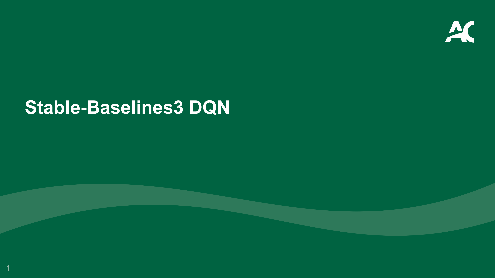

- Stable-Baselines3 DQN — Stable-Baselines3 中的 DQN 算法

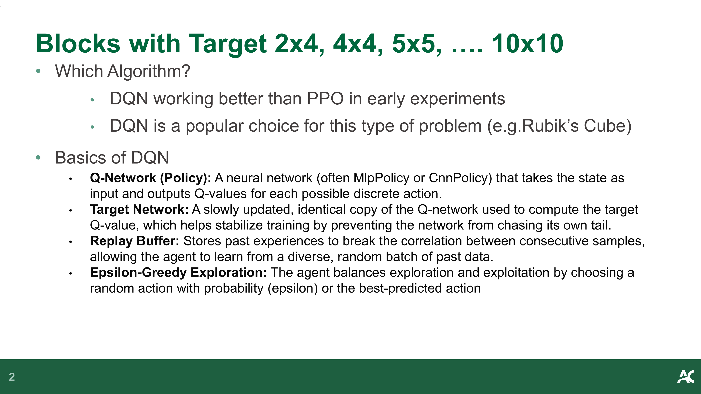

- **Blocks with Target 2x4, 4x4, 5x5, …. 10x10** — 积木目标环境（不同规模）

- **Which Algorithm?** — **应该使用哪个算法？**
  - DQN working better than PPO in early experiments — DQN 在早期实验中比 PPO 表现更好
  - DQN is a popular choice for this type of problem (e.g. Rubik's Cube) — DQN 是此类问题的热门选择（如魔方）

- **Basics of DQN** — **DQN 基础概念：**
  - **Q-Network (Policy):** A neural network (often MlpPolicy or CnnPolicy) that takes the state as input and outputs Q-values for each possible discrete action — **Q 网络（策略）：** 一个神经网络（通常是 MlpPolicy 或 CnnPolicy），以状态为输入，输出每个离散动作的 Q 值
  - **Target Network:** A slowly updated, identical copy of the Q-network used to compute the target Q-value, which helps stabilize training by preventing the network from chasing its own tail — **目标网络：** Q 网络的一个缓慢更新的副本，用于计算目标 Q 值，通过防止网络"追自己的尾巴"来稳定训练
  - **Replay Buffer:** Stores past experiences to break the correlation between consecutive samples, allowing the agent to learn from a diverse, random batch of past data — **经验回放缓冲区：** 存储过去的经验，打破连续样本之间的相关性，让智能体从多样化的随机批次中学习
  - **Epsilon-Greedy Exploration:** The agent balances exploration and exploitation by choosing a random action with probability (epsilon) or the best-predicted action — **ε-贪心探索：** 智能体以概率 ε 选择随机动作（探索），否则选择最优预测动作（利用），平衡探索与利用

> **📝 Notes:**
>
> _(To be added)_

---

## 2. DQN 训练流程 (DQN Training Process)

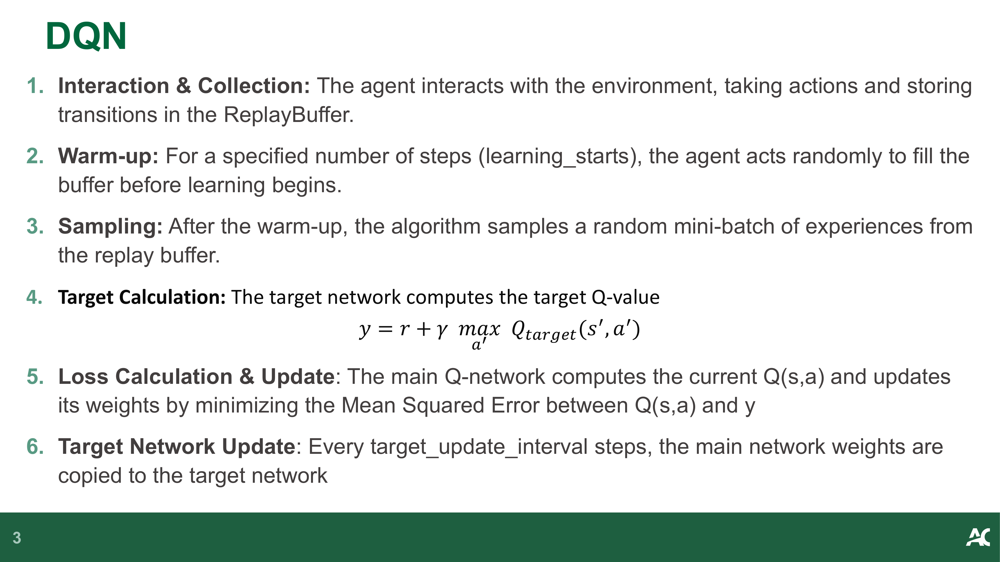

- **DQN 训练 6 步流程：**

1. **Interaction & Collection:** The agent interacts with the environment, taking actions and storing transitions in the ReplayBuffer — **交互与收集：** 智能体与环境交互，执行动作并将转移存储到经验回放缓冲区
2. **Warm-up:** For a specified number of steps (`learning_starts`), the agent acts randomly to fill the buffer before learning begins — **预热：** 在指定步数（`learning_starts`）内，智能体随机行动以填充缓冲区
3. **Sampling:** After the warm-up, the algorithm samples a random mini-batch of experiences from the replay buffer — **采样：** 预热后，算法从回放缓冲区中随机采样一个 mini-batch
4. **Target Calculation:** The target network computes the target Q-value: $y = r + \gamma \max_{a'} Q(s', a')$ — **目标计算：** 目标网络计算目标 Q 值
5. **Loss Calculation & Update:** The main Q-network computes the current Q(s,a) and updates its weights by minimizing the Mean Squared Error between Q(s,a) and y — **损失计算与更新：** 主 Q 网络计算当前 Q(s,a)，通过最小化 Q(s,a) 与 y 之间的均方误差来更新权重
6. **Target Network Update:** Every `target_update_interval` steps, the main network weights are copied to the target network — **目标网络更新：** 每隔 `target_update_interval` 步，将主网络权重复制到目标网络

> **📝 Notes:**
>
> _(To be added)_

---

## 3. 动作空间适配 (Action Space Adaptation)

### 3.1 DQN 的离散动作限制 (DQN Discrete Action Constraint)

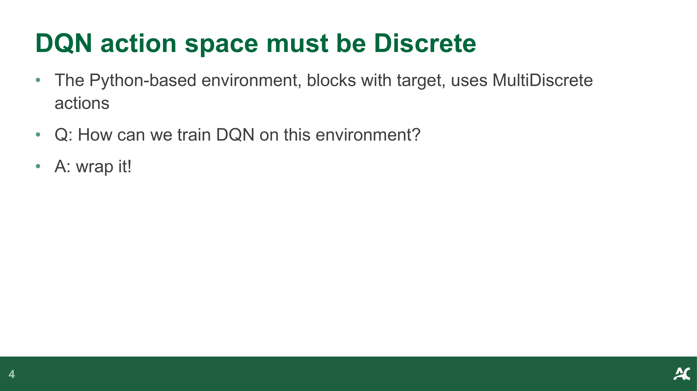

- **DQN action space must be Discrete** — **DQN 的动作空间必须是 Discrete（离散的）**
- The Python-based environment, blocks with target, uses **MultiDiscrete** actions — 基于 Python 的积木目标环境使用 **MultiDiscrete** 动作空间
- **Q: How can we train DQN on this environment?** — **问：如何在此环境上训练 DQN？**
- **A: wrap it!** — **答：用 Wrapper 包装它！**

### 3.2 DiscreteActionWrapper 实现 (DiscreteActionWrapper Implementation)

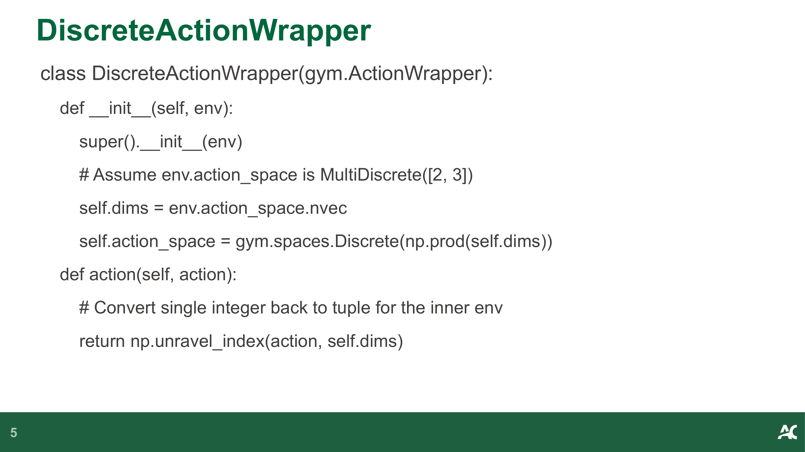

```python
class DiscreteActionWrapper(gym.ActionWrapper):
    def __init__(self, env):
        super().__init__(env)
        # Assume env.action_space is MultiDiscrete([2, 3])
        # 假设环境动作空间是 MultiDiscrete([2, 3])
        self.dims = env.action_space.nvec
        self.action_space = gym.spaces.Discrete(np.prod(self.dims))

    def action(self, action):
        # Convert single integer back to tuple for the inner env
        # 将单个整数转换回元组给内部环境
        return np.unravel_index(action, self.dims)
```

- 核心思路：将 MultiDiscrete 动作空间展平为单个 Discrete 空间
- `np.prod(self.dims)` 计算所有维度的乘积作为新的离散动作数
- `np.unravel_index()` 将单个整数索引还原为多维索引

> **📝 Notes:**
>
> _(To be added)_

---

## 4. 环境配置与包装 (Environment Setup & Wrapping)

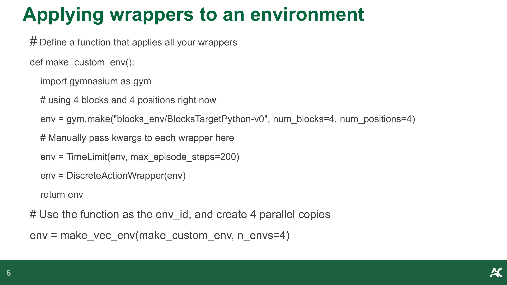

- **Applying wrappers to an environment** — **将 Wrapper 应用到环境**

```python
# Define a function that applies all your wrappers
# 定义一个应用所有 Wrapper 的函数
def make_custom_env():
    import gymnasium as gym
    # using 4 blocks and 4 positions right now
    # 当前使用 4 个积木和 4 个位置
    env = gym.make("blocks_env/BlocksTargetPython-v0",
                    num_blocks=4, num_positions=4)
    # Manually pass kwargs to each wrapper here
    # 手动将参数传递给每个 Wrapper
    env = TimeLimit(env, max_episode_steps=200)
    env = DiscreteActionWrapper(env)
    return env

# Use the function as the env_id, and create 4 parallel copies
# 使用该函数作为 env_id，创建 4 个并行副本
env = make_vec_env(make_custom_env, n_envs=4)
```

- `TimeLimit` wrapper 限制每个 episode 最多 200 步
- `DiscreteActionWrapper` 将 MultiDiscrete 转为 Discrete（DQN 要求）
- `make_vec_env` 创建向量化环境，4 个并行副本加速训练

> **📝 Notes:**
>
> _(To be added)_

---

## 5. 模型存储与日志 (Model Storage & Logging)

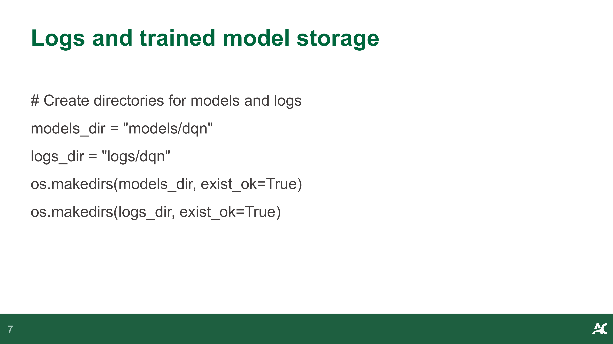

- **Logs and trained model storage** — **日志和训练模型存储**

```python
# Create directories for models and logs
# 创建模型和日志目录
models_dir = "models/dqn"
logs_dir = "logs/dqn"
os.makedirs(models_dir, exist_ok=True)
os.makedirs(logs_dir, exist_ok=True)
```

- 模型保存到 `models/dqn/` 目录
- TensorBoard 日志保存到 `logs/dqn/` 目录

> **📝 Notes:**
>
> _(To be added)_

---

## 6. DQN 超参数配置 (DQN Hyperparameters)

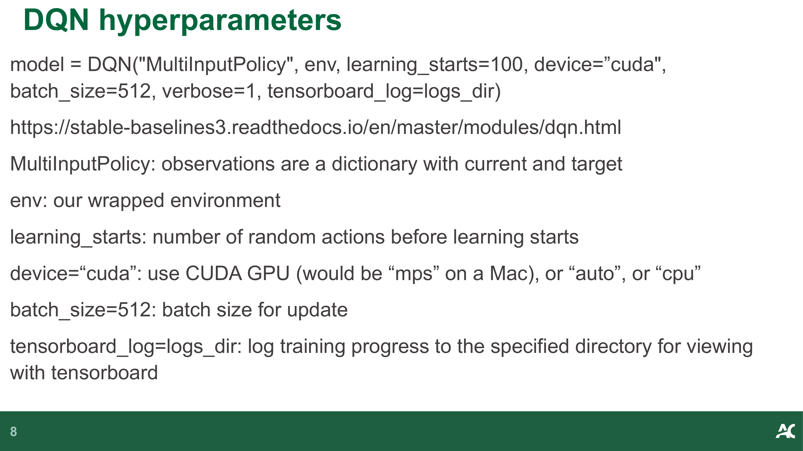

- **DQN hyperparameters** — **DQN 超参数配置**

```python
model = DQN("MultiInputPolicy", env, learning_starts=100, device="cuda",
            batch_size=512, verbose=1, tensorboard_log=logs_dir)
```

Ref: https://stable-baselines3.readthedocs.io/en/master/modules/dqn.html

- **`MultiInputPolicy`**: observations are a dictionary with current and target — 观测值是包含当前状态和目标状态的字典
- **`env`**: our wrapped environment — 我们包装后的环境
- **`learning_starts=100`**: number of random actions before learning starts — 学习开始前的随机动作数
- **`device="cuda"`**: use CUDA GPU (would be `"mps"` on a Mac, or `"auto"`, or `"cpu"`) — 使用 CUDA GPU（Mac 上用 `"mps"`，或 `"auto"`、`"cpu"`）
- **`batch_size=512`**: batch size for update — 更新时的批量大小
- **`tensorboard_log=logs_dir`**: log training progress to the specified directory for viewing with TensorBoard — 将训练进度记录到指定目录，用 TensorBoard 查看

> **📝 Notes:**
>
> _(To be added)_

---

## 7. TensorBoard 可视化 (TensorBoard Visualization)

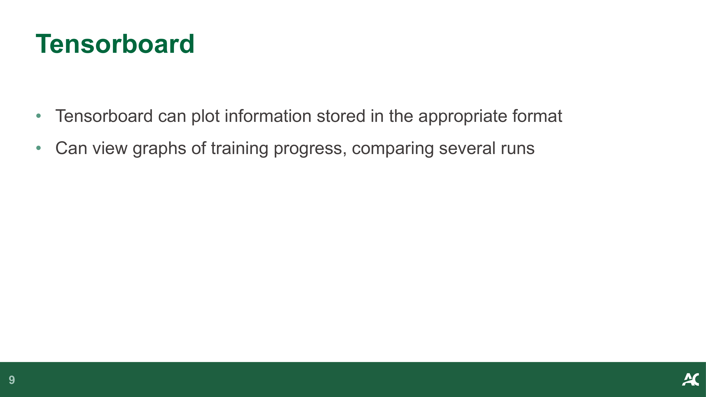

- **TensorBoard** can plot information stored in the appropriate format — **TensorBoard** 可以绘制以适当格式存储的信息
- Can view graphs of training progress, comparing several runs — 可以查看训练进度图表，比较多次运行

> **📝 Notes:**
>
> _(To be added)_

---

## 8. 模型训练与回调 (Model Training & Callbacks)

### 8.1 训练模型 (Training the Model)

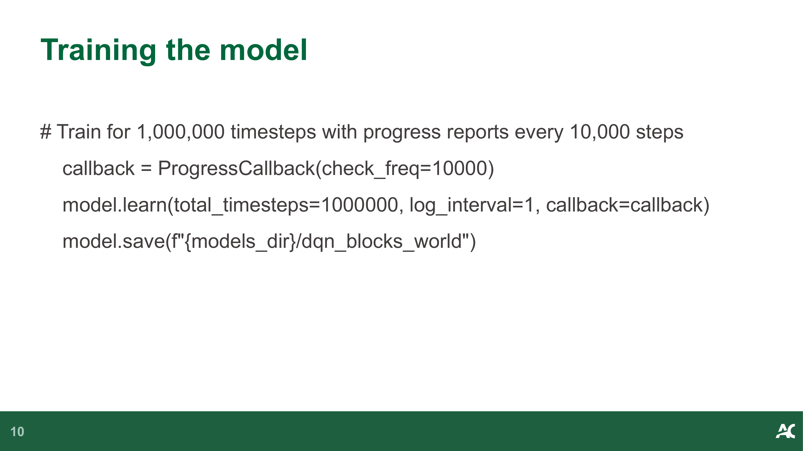

- **Training the model** — **训练模型**

```python
# Train for 1,000,000 timesteps with progress reports every 10,000 steps
# 训练 1,000,000 步，每 10,000 步报告一次进度
callback = ProgressCallback(check_freq=10000)
model.learn(total_timesteps=1000000, log_interval=1, callback=callback)
model.save(f"{models_dir}/dqn_blocks_world")
```

### 8.2 日志机制详解 (Logging Mechanism Details)

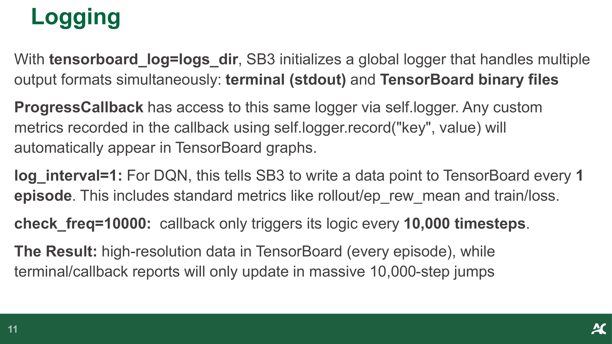

- **Logging** — **日志机制**
  - With `tensorboard_log=logs_dir`, SB3 initializes a global logger that handles multiple output formats simultaneously: terminal (stdout) and TensorBoard binary files — 设置 `tensorboard_log=logs_dir` 后，SB3 初始化一个全局 logger，同时处理终端输出和 TensorBoard 二进制文件
  - `ProgressCallback` has access to this same logger via `self.logger`. Any custom metrics recorded in the callback using `self.logger.record("key", value)` will automatically appear in TensorBoard graphs — `ProgressCallback` 通过 `self.logger` 访问同一个 logger，回调中记录的自定义指标会自动出现在 TensorBoard 图表中
  - **`log_interval=1`**: For DQN, this tells SB3 to write a data point to TensorBoard every episode. This includes standard metrics like `rollout/ep_rew_mean` and `train/loss` — 对于 DQN，每个 episode 写入一个数据点到 TensorBoard，包括 `rollout/ep_rew_mean` 和 `train/loss` 等标准指标
  - **`check_freq=10000`**: callback only triggers its logic every 10,000 timesteps — 回调每 10,000 步触发一次
  - **The Result:** high-resolution data in TensorBoard (every episode), while terminal/callback reports will only update in massive 10,000-step jumps — **结果：** TensorBoard 中有高分辨率数据（每 episode），而终端/回调报告每 10,000 步才更新一次

> **📝 Notes:**
>
> _(To be added)_

---

## 9. 运行训练好的模型 (Running Trained Models)

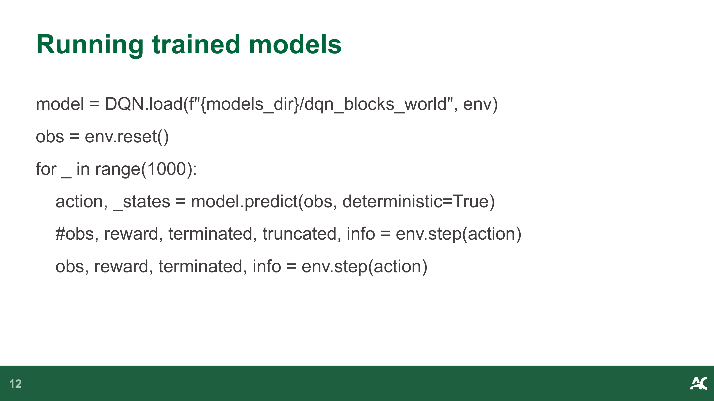

- **Running trained models** — **运行训练好的模型**

```python
model = DQN.load(f"{models_dir}/dqn_blocks_world", env)
obs = env.reset()
for _ in range(1000):
    action, _states = model.predict(obs, deterministic=True)
    # obs, reward, terminated, truncated, info = env.step(action)
    obs, reward, terminated, info = env.step(action)
```

- `DQN.load()` 加载保存的模型
- `deterministic=True` 使用确定性动作（不探索）
- 注意：VecEnv 的 `step()` 返回 4 个值（不是 5 个），因为 VecEnv 自动处理 `terminated` 和 `truncated`

> **📝 Notes:**
>
> _(To be added)_

---


---

## 38. week5_dqn_storyline

Source: `week5_dqn_storyline.md`

# Week 5 故事线：从 Q-Table 到 DQN——当状态空间爆炸时怎么办？

> **Source:** `CST8509_05_DQN_Stable-Baselines3.pptx`
> **核心主题：** 当环境状态空间太大、Q-Table 装不下时，用神经网络替代表格来逼近 Q 值
> **故事线：** 从"查字典"到"训练大脑"——Q-Learning 的深度学习进化之路

---

## 🎬 序幕：我们要解决什么问题？

回顾 Week 2，我们学了 Q-Learning：用一张 Q-Table 记录每个 (state, action) 对的价值，然后查表选最优动作。

这在小环境（如 4×4 CliffWalking）中完美运行。但现在课程进入了 BlocksWorld 环境——积木数量从 2×4 到 10×10，状态空间呈指数增长：

| 环境规模 | 状态数量级 | Q-Table 可行？ |
|----------|-----------|---------------|
| 2×4      | ~几百     | ✅ 轻松       |
| 4×4      | ~几万     | ⚠️ 勉强       |
| 5×5      | ~几十万   | ❌ 内存爆炸   |
| 10×10    | ~天文数字 | ❌ 完全不可能 |

> 💡 **核心矛盾：** Q-Table 需要为每个状态分配一行，状态空间一大就存不下、学不完。

---

## 📚 第一章：Q-Learning 的瓶颈——表格方法的极限

### 1.1 Q-Table 回顾

Week 2 的 Q-Learning 核心公式：

$Q(s, a) \leftarrow Q(s, a) + \alpha [r + \gamma \max_{a'} Q(s', a') - Q(s, a)]$

这个公式的前提是：**Q(s,a) 存在一张表里**，每个 (s, a) 对有一个格子。

### 1.2 ❌ 表格方法的致命问题——维度灾难

当状态是连续的（如机器人关节角度）或组合爆炸的（如 10×10 积木排列），Q-Table 面临：

- **存储问题：** 表格太大，内存装不下
- **泛化问题：** 没见过的状态，Q 值为 0（没学过 = 不会）
- **收敛问题：** 需要访问每个状态足够多次才能收敛，状态太多根本访问不完

> 🔑 **故事转折点：** Q-Table 在大状态空间下彻底失效 → 我们需要一种方法，能从**有限的经验**中**泛化**到未见过的状态 → **函数逼近**登场！

---

## 🧠 第二章：DQN——用神经网络替代 Q-Table

### 2.1 核心思想：从"查表"到"预测"

DQN (Deep Q-Network) 的核心思想非常简单：

| 维度 | Q-Table | DQN |
|------|---------|-----|
| Q 值存储 | 一张大表格 | 一个神经网络 |
| 查询方式 | 查表 `Q[s][a]` | 前向传播 `Q_θ(s) → [q₁, q₂, ...]` |
| 泛化能力 | ❌ 没见过 = 不会 | ✅ 相似状态 → 相似 Q 值 |
| 内存需求 | O(|S| × |A|) | O(网络参数数) — 固定大小 |

> 💡 **类比：** Q-Table 像一本字典——每个词都要单独查。DQN 像一个"大脑"——见过足够多的例子后，能对新情况做出合理判断。

### 2.2 DQN 的四大组件

DQN 不只是"把 Q-Table 换成神经网络"这么简单。直接用神经网络替代会导致训练不稳定。DeepMind 在 2015 年的论文中引入了三个关键技巧：

| 组件 | 作用 | 解决什么问题 |
|------|------|-------------|
| **Q-Network** | 输入状态 → 输出所有动作的 Q 值 | 替代 Q-Table |
| **Target Network** | Q-Network 的缓慢更新副本 | 防止"追自己尾巴"（训练不稳定） |
| **Replay Buffer** | 存储过去的经验 (s, a, r, s') | 打破样本相关性 |
| **ε-Greedy** | 以概率 ε 随机探索 | 平衡探索与利用 |

### 2.3 DQN 训练 6 步流程

```
┌──────────────────────────────────────────────────────┐
│  DQN 训练循环                                         │
│                                                      │
│  Step 1: 交互收集                                     │
│    Agent ↔ Environment → (s, a, r, s') → Buffer      │
│                                                      │
│  Step 2: 预热 (learning_starts 步随机动作)             │
│    填充 Buffer，确保有足够多样的经验                    │
│                                                      │
│  Step 3: 采样                                         │
│    从 Buffer 随机抽取 mini-batch                       │
│                                                      │
│  Step 4: 计算目标                                     │
│    y = r + γ max_a' Q_target(s', a')                  │
│    ↑ 用 Target Network（不是主网络！）                 │
│                                                      │
│  Step 5: 更新主网络                                    │
│    Loss = MSE(Q_main(s,a), y)                         │
│    反向传播更新 Q_main 的权重                          │
│                                                      │
│  Step 6: 同步目标网络                                  │
│    每 target_update_interval 步：                      │
│    Q_target ← Q_main                                  │
└──────────────────────────────────────────────────────┘
```

### 2.4 为什么需要 Target Network？

如果用同一个网络既计算目标又更新自己：

- 目标 y 随着网络更新而变化 → "追自己的尾巴"
- 类似于考试时答案和评分标准同时在变 → 永远考不完

Target Network 的解决方案：**冻结一个副本**作为"评分标准"，每隔一段时间才同步一次。

### 2.5 为什么需要 Replay Buffer？

RL 的数据有一个特殊问题：**连续的经验高度相关**。

- 如果按时间顺序学习：Agent 在走廊里走了 100 步 → 网络只学会了"走廊"
- Replay Buffer 打乱顺序：随机抽取不同时间、不同位置的经验 → 学习更均衡

> 💡 **类比：** 像洗牌一样——不洗牌的话，连续抽到的牌都是同一花色。

---

## 🏰 第三章：实战——在 BlocksWorld 上训练 DQN

### 3.1 ⚠️ DQN 的限制：只支持 Discrete 动作空间

DQN 输出的是每个动作的 Q 值，所以动作数量必须是有限的（Discrete）。

但 BlocksWorld 环境使用 **MultiDiscrete** 动作空间（如 `MultiDiscrete([2, 3])` = 两个维度，分别有 2 和 3 个选择）。

> 🔑 **问题：** DQN 要求 Discrete，环境给的是 MultiDiscrete → 怎么办？

### 3.2 解决方案：DiscreteActionWrapper

核心思路：**把多维动作展平为一维**。

`MultiDiscrete([2, 3])` → 总共 2×3 = 6 种组合 → `Discrete(6)`

```
MultiDiscrete([2, 3]):        Discrete(6):
  (0,0) (0,1) (0,2)    →     0, 1, 2, 3, 4, 5
  (1,0) (1,1) (1,2)
```

- `np.prod(dims)` 计算总动作数
- `np.unravel_index(action, dims)` 将整数还原为多维索引

### 3.3 完整环境配置流程

```
原始环境 (MultiDiscrete)
    ↓ TimeLimit(max_episode_steps=200)
包装1: 限制每个 episode 最多 200 步
    ↓ DiscreteActionWrapper
包装2: MultiDiscrete → Discrete
    ↓ make_vec_env(n_envs=4)
向量化: 4 个并行环境加速训练
    ↓
最终环境 → 传给 DQN
```

---

## 📏 第四章：训练配置与监控

### 4.1 关键超参数

| 参数 | 值 | 含义 |
|------|-----|------|
| `policy` | `"MultiInputPolicy"` | 支持字典观测（current + target） |
| `learning_starts` | `100` | 前 100 步随机探索，填充 Buffer |
| `device` | `"cuda"` | 使用 GPU 加速 |
| `batch_size` | `512` | 每次更新采样 512 条经验 |
| `total_timesteps` | `1,000,000` | 总训练步数 |

### 4.2 TensorBoard 日志系统

SB3 的日志系统有两层粒度：

| 层级 | 频率 | 内容 |
|------|------|------|
| TensorBoard | 每 episode | `rollout/ep_rew_mean`, `train/loss` 等 |
| 终端/Callback | 每 10,000 步 | 自定义进度报告 |

- `log_interval=1` → TensorBoard 每 episode 记录一次（高分辨率）
- `check_freq=10000` → ProgressCallback 每 10,000 步触发一次（低频终端输出）
- 自定义指标通过 `self.logger.record("key", value)` 自动出现在 TensorBoard

### 4.3 模型保存与加载

```python
# 保存
model.save(f"{models_dir}/dqn_blocks_world")

# 加载并推理
model = DQN.load(f"{models_dir}/dqn_blocks_world", env)
action, _states = model.predict(obs, deterministic=True)
```

- `deterministic=True`：推理时使用确定性动作（不探索）
- VecEnv 的 `step()` 返回 4 个值（自动处理 terminated/truncated）

---

## 🗺️ 全局回顾：从 Q-Table 到 DQN 的技术演进

```
┌─────────────────────────────────────────────────────┐
│              技术演进路线图                            │
│                                                     │
│  Week 2: Q-Learning (Q-Table)                       │
│    ✅ 简单直观，保证收敛                              │
│    ❌ 状态空间大时内存爆炸、无法泛化                   │
│    │                                                │
│    ▼                                                │
│  Week 5: DQN (Deep Q-Network)                       │
│    ✅ 用神经网络逼近 Q 值，可处理大状态空间            │
│    ✅ Target Network + Replay Buffer 稳定训练         │
│    ❌ 只支持 Discrete 动作空间                        │
│    ❌ 可能高估 Q 值（overestimation）                 │
│    │                                                │
│    ▼                                                │
│  下一站：Double DQN / Dueling DQN / ...              │
│    解决 Q 值高估问题                                  │
└─────────────────────────────────────────────────────┘
```

| 从 → 到 | 解决了什么核心问题？ |
|---------|---------------------|
| Q-Table → DQN | 用神经网络替代表格，解决大状态空间下的存储和泛化问题 |
| 裸神经网络 → +Target Network | 冻结目标网络，防止训练目标不断漂移导致不稳定 |
| 顺序学习 → +Replay Buffer | 打乱经验顺序，打破样本相关性，提高学习效率 |
| MultiDiscrete → DiscreteActionWrapper | 展平多维动作空间，适配 DQN 的 Discrete 要求 |

---

## 🎓 考试/复习重点检查清单

- [ ] 能解释为什么 Q-Table 在大状态空间下失效
- [ ] 能说出 DQN 的四大组件及各自作用（Q-Network, Target Network, Replay Buffer, ε-Greedy）
- [ ] 能写出 DQN 的目标 Q 值公式：$y = r + \gamma \max_{a'} Q_{target}(s', a')$
- [ ] 能解释 Target Network 为什么能稳定训练（"追自己尾巴"问题）
- [ ] 能解释 Replay Buffer 为什么能提高学习效率（打破样本相关性）
- [ ] 能描述 DQN 训练的 6 步流程
- [ ] 能解释 DiscreteActionWrapper 的工作原理（MultiDiscrete → Discrete 展平）
- [ ] 能解释 `np.unravel_index()` 的作用
- [ ] 知道 DQN 的关键超参数：`learning_starts`, `batch_size`, `device`, `tensorboard_log`
- [ ] 能区分 `log_interval`（TensorBoard 频率）和 `check_freq`（Callback 频率）
- [ ] 知道 `deterministic=True` 在推理时的作用
- [ ] 知道 VecEnv 的 `step()` 返回 4 个值（不是 5 个）


---

## 39. week5_dqn_concepts

Source: `week5_dqn_concepts.md`

# Week 5: DQN — 核心概念 (Core Concepts)

> See also: [幻灯片笔记](week5_dqn_slides.md) | [数学公式](week5_dqn_math.md) | [操作教程](week5_dqn_tutorial.md) | [历史背景](week5_dqn_history.md)

---

## 核心术语速查

### DQN（Deep Q-Network）

用神经网络代替 Q-table 来近似 Q 值函数：

$$
Q_\theta(s, a) \approx Q^*(s, a)
$$

输入状态 $s$，输出所有动作的 Q 值向量。参数 $\theta$ 固定大小，不随状态空间增大。

---

### 维度诅咒（Curse of Dimensionality）

Q-table 大小 = 状态数 × 动作数。状态空间指数增长时（如 8 块积木 = $8^8$ 种状态），表格不可行。DQN 用神经网络拟合，绕过这个问题。

---

### Q-Network（主网络）

参数为 $\theta$ 的神经网络，负责：
- 预测当前 $(s, a)$ 的 Q 值
- 通过反向传播更新（每步都更新）

---

### Target Network（目标网络）

主网络的**延迟副本**，参数为 $\theta^-$，负责计算训练目标：

$$
y = r + \gamma \max_{a'} Q_{\theta^-}(s', a')
$$

**每隔 `target_update_interval` 步**将主网络参数同步到目标网络。

**为什么需要？** 如果用同一个网络计算预测和目标，目标一直在动，训练极其不稳定——类似"追移动靶"。目标网络固定一段时间，使训练目标稳定。

---

### Replay Buffer（经验回放）

存储历史转移 $(s, a, r, s')$ 的固定大小队列，训练时随机采样 mini-batch：

**为什么需要？** 连续采样的数据时间相关（$s_0→s_1→s_2$ 是序列），违反神经网络训练"独立同分布"假设，导致不稳定。随机采样打破相关性。

| 参数 | 含义 |
|------|------|
| `buffer_size` | 缓冲区容量（默认 1,000,000） |
| `learning_starts` | 至少收集多少步随机数据后才开始训练 |
| `batch_size` | 每次训练采样多少条数据 |

---

### DQN 损失函数（MSE）

$$
L(\theta) = \frac{1}{N} \sum_{i=1}^{N} \left( Q_\theta(s_i, a_i) - y_i \right)^2
$$

其中 $y_i = r_i + \gamma \max_{a'} Q_{\theta^-}(s_i', a')$（目标网络计算）

---

### DiscreteActionWrapper

将 `MultiDiscrete` 动作空间展平为 `Discrete`，使 DQN 可以使用：

$$
|\text{Discrete}| = \prod_i d_i
$$

- `MultiDiscrete([4, 4])` → `Discrete(16)`
- 还原：`np.unravel_index(flat_action, dims)`

**需要的原因：** DQN 的 Q-Network 输出层大小 = 动作数（一个整数），必须是单一的 `Discrete` 空间。

---

### ε-Greedy 衰减（SB3 DQN）

SB3 中 ε 的衰减由两个参数控制：

| 参数 | 含义 |
|------|------|
| `exploration_fraction` | 在前 X% 的总步数内，ε 从 1.0 线性衰减 |
| `exploration_final_eps` | ε 衰减到的最终值（保持不变） |

---

### TensorBoard 关键指标

| 指标 | 含义 |
|------|------|
| `rollout/ep_rew_mean` | 最近 100 个 episode 的平均奖励（主要训练信号） |
| `train/loss` | Q 网络的 MSE 损失（应下降） |
| `rollout/exploration_rate` | 当前 ε 值（应从 1.0 下降到 0.05） |

---

## 概念辨析

### DQN 三大创新对比

| 创新 | 解决的问题 | 关键参数 |
|------|-----------|---------|
| Replay Buffer | 数据时间相关导致不稳定 | `buffer_size`, `batch_size`, `learning_starts` |
| Target Network | 训练目标不断移动导致不稳定 | `target_update_interval` |
| Q-Network | Q-table 无法处理大状态空间 | 网络结构（`policy_kwargs`） |

### DQN vs Q-Learning vs PPO

| 维度 | Q-Learning | DQN | PPO |
|------|-----------|-----|-----|
| Q 值存储 | 表格 | 神经网络 | 不存 Q 值（直接学策略） |
| 状态空间 | 小型离散 | 大型/连续 | 任意 |
| 动作空间 | 离散 | **仅离散** | 离散或连续 |
| Off/On-policy | Off | Off | On |
| 数据复用 | 可复用 | Replay Buffer | 一次性 |

### `learning_starts` vs `buffer_size`

- `learning_starts=100`：前 100 步只收集数据，不训练（确保 Buffer 不为空）
- `buffer_size=1_000_000`：Buffer 的**总容量**（满了后丢弃最旧的数据）

---

## 易错点速查

| 错误 | 正确理解 |
|------|---------|
| "DQN 可以处理连续动作空间" | DQN 只支持 `Discrete`，连续动作用 TD3/SAC |
| "Target Network 每步都更新" | 每隔 `target_update_interval` 步才同步一次 |
| "Replay Buffer 越大越好" | 过大的 Buffer 包含过时的经验，可能减慢学习 |
| VecEnv `step()` 返回 5 个值 | VecEnv 返回 4 个（自动处理 terminated/truncated） |
| "`deterministic=True` 在训练时用" | 推理时用 `deterministic=True`，训练时 SB3 自动管理 ε |


---

## 40. week5_dqn_math

Source: `week5_dqn_math.md`

# Week 5: DQN — 数学公式 (Math Reference)

> See also: [概念速查](week5_dqn_cheatsheet.md) | [代码参考](week5_dqn_code.md)

---

## 📐 核心公式

### 1. Q-Learning 更新公式（Q-Table 版，Week 2 回顾）

| 符号 | 含义 |
|------|------|
| $Q(s,a)$ | 状态 s 下执行动作 a 的价值 |
| $\alpha$ | 学习率 (learning rate) |
| $r$ | 即时奖励 (immediate reward) |
| $\gamma$ | 折扣因子 (discount factor) |
| $s'$ | 下一个状态 (next state) |

$$
Q(s, a) \leftarrow Q(s, a) + \alpha \left[ r + \gamma \max_{a'} Q(s', a') - Q(s, a) \right]
$$

- 这是表格版 Q-Learning，直接更新表格中的值

### 2. DQN 目标 Q 值公式

| 符号 | 含义 |
|------|------|
| $y$ | 目标 Q 值 (target Q-value) |
| $r$ | 即时奖励 |
| $\gamma$ | 折扣因子 |
| $Q_{target}(s', a')$ | **目标网络**对下一状态的 Q 值估计 |

$$
y = r + \gamma \max_{a'} Q_{target}(s', a')
$$

- ⚠️ 注意：用的是 **Target Network**（不是主网络）来计算目标
- 如果 $s'$ 是终止状态，则 $y = r$（没有未来奖励）

### 3. DQN 损失函数

| 符号 | 含义 |
|------|------|
| $Q_\theta(s, a)$ | 主网络对当前 (s, a) 的 Q 值预测 |
| $y$ | 目标 Q 值（由公式 2 计算） |
| $N$ | mini-batch 大小 |

$$
L(\theta) = \frac{1}{N} \sum_{i=1}^{N} \left( Q_\theta(s_i, a_i) - y_i \right)^2
$$

- 均方误差 (MSE) 损失
- 通过反向传播更新主网络参数 $\theta$

### 4. ε-Greedy 动作选择

$$
a = \begin{cases} \text{random action} & \text{with probability } \varepsilon \\ \arg\max_a Q_\theta(s, a) & \text{with probability } 1 - \varepsilon \end{cases}
$$

- $\varepsilon$ 通常从 1.0 线性衰减到 0.05
- 训练初期多探索，后期多利用

### 5. MultiDiscrete → Discrete 展平

| 符号 | 含义 |
|------|------|
| $d_1, d_2, \ldots, d_k$ | 各维度的动作数 |
| $a_{flat}$ | 展平后的单一整数动作 |

$$
|\text{Discrete}| = \prod_{i=1}^{k} d_i
$$

- 例：`MultiDiscrete([2, 3])` → $2 \times 3 = 6$ → `Discrete(6)`
- 还原：`np.unravel_index(a_flat, dims)` 将整数映射回多维索引

---

## 📝 手算练习

### 练习 1：计算目标 Q 值

已知：
- 即时奖励 $r = 1$
- 折扣因子 $\gamma = 0.99$
- Target Network 对下一状态的 Q 值：$Q_{target}(s', a_0) = 2.5$, $Q_{target}(s', a_1) = 3.0$, $Q_{target}(s', a_2) = 1.8$

求目标 Q 值 $y$：

$$
y = r + \gamma \max_{a'} Q_{target}(s', a') = 1 + 0.99 \times 3.0 = 1 + 2.97 = \mathbf{3.97}
$$

### 练习 2：计算 MSE 损失

已知 mini-batch (N=3)：

| 样本 | $Q_\theta(s, a)$ | $y$ |
|------|-----------------|-----|
| 1 | 3.5 | 3.97 |
| 2 | 2.0 | 2.5 |
| 3 | 4.1 | 3.8 |

$$
L = \frac{1}{3} \left[ (3.5 - 3.97)^2 + (2.0 - 2.5)^2 + (4.1 - 3.8)^2 \right]
$$
$$
= \frac{1}{3} \left[ 0.2209 + 0.25 + 0.09 \right] = \frac{0.5609}{3} = \mathbf{0.187}
$$

### 练习 3：MultiDiscrete 展平

环境动作空间：`MultiDiscrete([3, 4])`

1. 总动作数 = $3 \times 4 = 12$ → `Discrete(12)`
2. 动作 7 对应的多维索引：`np.unravel_index(7, (3, 4))` = $(1, 3)$
   - 验证：$1 \times 4 + 3 = 7$ ✅
3. 多维动作 $(2, 1)$ 对应的整数：$2 \times 4 + 1 = 9$

### 练习 4：ε-Greedy 动作选择

已知：
- $\varepsilon = 0.1$
- $Q_\theta(s, a_0) = 2.3$, $Q_\theta(s, a_1) = 5.1$, $Q_\theta(s, a_2) = 3.7$

- 90% 概率选择 $a_1$（Q 值最大 = 5.1）
- 10% 概率随机选择 $a_0$, $a_1$, $a_2$ 之一（各 $\frac{0.1}{3} \approx 3.3\%$）

---

## 📋 公式速查表

| 公式 | 用途 | 关键点 |
|------|------|--------|
| $y = r + \gamma \max_{a'} Q_{target}(s', a')$ | DQN 目标值 | 用 Target Network |
| $L = \frac{1}{N}\sum(Q_\theta - y)^2$ | MSE 损失 | 更新主网络 |
| $\varepsilon$-greedy | 动作选择 | ε 衰减：探索→利用 |
| $\prod d_i$ | MultiDiscrete 展平 | `np.unravel_index` 还原 |


---

## 41. week5_dqn_code

Source: `week5_dqn_code.md`

# Week 5: DQN — 代码参考 (Code Reference)

> See also: [概念速查](week5_dqn_cheatsheet.md) | [数学公式](week5_dqn_math.md)

---

## 🔧 Imports

```python
import os
import numpy as np
import gymnasium as gym
from gymnasium.wrappers import TimeLimit
from stable_baselines3 import DQN
from stable_baselines3.common.env_util import make_vec_env
from stable_baselines3.common.callbacks import BaseCallback
```

---

## 🔧 DiscreteActionWrapper — MultiDiscrete → Discrete

```python
class DiscreteActionWrapper(gym.ActionWrapper):
    """将 MultiDiscrete 动作空间展平为 Discrete，适配 DQN"""
    def __init__(self, env):
        super().__init__(env)
        # 获取各维度大小，如 [2, 3]
        self.dims = env.action_space.nvec
        # 总动作数 = 各维度乘积，如 2*3=6
        self.action_space = gym.spaces.Discrete(np.prod(self.dims))

    def action(self, action):
        # 整数 → 多维索引，如 5 → (1, 2)
        return np.unravel_index(action, self.dims)
```

**使用场景：** DQN 只接受 `Discrete` 动作空间，但 BlocksWorld 环境是 `MultiDiscrete`

---

## 🔧 环境创建与包装

```python
def make_custom_env():
    """创建带 Wrapper 的自定义环境"""
    import gymnasium as gym
    # 创建 BlocksWorld 环境：4 个积木，4 个位置
    env = gym.make("blocks_env/BlocksTargetPython-v0",
                    num_blocks=4, num_positions=4)
    # Wrapper 1: 限制每个 episode 最多 200 步
    env = TimeLimit(env, max_episode_steps=200)
    # Wrapper 2: MultiDiscrete → Discrete（DQN 要求）
    env = DiscreteActionWrapper(env)
    return env

# 创建 4 个并行环境（向量化）
env = make_vec_env(make_custom_env, n_envs=4)
```

**Wrapper 顺序：** 原始环境 → TimeLimit → DiscreteActionWrapper → VecEnv

---

## 🔧 目录设置

```python
models_dir = "models/dqn"
logs_dir = "logs/dqn"
os.makedirs(models_dir, exist_ok=True)
os.makedirs(logs_dir, exist_ok=True)
```

---

## 🔧 DQN 模型创建

```python
model = DQN(
    "MultiInputPolicy",     # Dict 观测 → MultiInputPolicy
    env,                     # 包装后的向量化环境
    learning_starts=100,     # 前 100 步随机探索（预热）
    device="cuda",           # GPU 加速（Mac: "mps", CPU: "cpu", 自动: "auto"）
    batch_size=512,          # 每次更新采样 512 条经验
    verbose=1,               # 打印训练信息
    tensorboard_log=logs_dir # TensorBoard 日志目录
)
```

**Policy 选择：**

| 观测类型 | Policy |
|---------|--------|
| 向量 (Box/Discrete) | `"MlpPolicy"` |
| 字典 (Dict) | `"MultiInputPolicy"` |
| 图像 (Box with shape HxWxC) | `"CnnPolicy"` |

**DQN 关键参数：**

| 参数 | 默认值 | 说明 |
|------|--------|------|
| `learning_rate` | 1e-4 | 学习率 |
| `buffer_size` | 1,000,000 | Replay Buffer 大小 |
| `learning_starts` | 50,000 | 预热步数 |
| `batch_size` | 32 | Mini-batch 大小 |
| `tau` | 1.0 | Target Network 软更新系数 |
| `gamma` | 0.99 | 折扣因子 |
| `target_update_interval` | 10,000 | Target Network 更新间隔 |
| `exploration_fraction` | 0.1 | ε 衰减占总步数的比例 |
| `exploration_final_eps` | 0.05 | ε 最终值 |

Ref: https://stable-baselines3.readthedocs.io/en/master/modules/dqn.html

---

## 🔧 训练与回调

```python
# 自定义进度回调
callback = ProgressCallback(check_freq=10000)

# 训练 1,000,000 步
model.learn(
    total_timesteps=1_000_000,
    log_interval=1,        # TensorBoard: 每 episode 记录
    callback=callback      # 终端: 每 10,000 步报告
)

# 保存模型
model.save(f"{models_dir}/dqn_blocks_world")
```

**日志频率对比：**

| 参数 | 控制什么 | 频率 |
|------|---------|------|
| `log_interval=1` | TensorBoard 写入 | 每 episode |
| `check_freq=10000` | Callback 触发 | 每 10,000 步 |

**自定义 Callback 中记录指标：**
```python
self.logger.record("custom/metric_name", value)
# → 自动出现在 TensorBoard 图表中
```

---

## 🔧 加载与推理

```python
# 加载训练好的模型
model = DQN.load(f"{models_dir}/dqn_blocks_world", env)

# 推理循环
obs = env.reset()
for _ in range(1000):
    # deterministic=True: 不探索，选 Q 值最大的动作
    action, _states = model.predict(obs, deterministic=True)
    # ⚠️ VecEnv 返回 4 个值（不是 5 个）
    obs, reward, terminated, info = env.step(action)
```

**⚠️ 注意：** 标准 Gymnasium `step()` 返回 5 个值 `(obs, reward, terminated, truncated, info)`，但 VecEnv 自动合并 `terminated` 和 `truncated` 为 `done`，只返回 4 个值。

---

## 🔧 TensorBoard 查看训练曲线

```bash
# 启动 TensorBoard
tensorboard --logdir logs/dqn

# 浏览器打开 http://localhost:6006
```

**常用指标：**
- `rollout/ep_rew_mean` — 平均 episode 奖励
- `rollout/ep_len_mean` — 平均 episode 长度
- `train/loss` — 训练损失

---

## 🔧 完整训练流程模板

```python
import os
import numpy as np
import gymnasium as gym
from gymnasium.wrappers import TimeLimit
from stable_baselines3 import DQN
from stable_baselines3.common.env_util import make_vec_env

# 1. 定义 Wrapper
class DiscreteActionWrapper(gym.ActionWrapper):
    def __init__(self, env):
        super().__init__(env)
        self.dims = env.action_space.nvec
        self.action_space = gym.spaces.Discrete(np.prod(self.dims))
    def action(self, action):
        return np.unravel_index(action, self.dims)

# 2. 创建环境
def make_custom_env():
    env = gym.make("blocks_env/BlocksTargetPython-v0",
                    num_blocks=4, num_positions=4)
    env = TimeLimit(env, max_episode_steps=200)
    env = DiscreteActionWrapper(env)
    return env

env = make_vec_env(make_custom_env, n_envs=4)

# 3. 创建目录
models_dir, logs_dir = "models/dqn", "logs/dqn"
os.makedirs(models_dir, exist_ok=True)
os.makedirs(logs_dir, exist_ok=True)

# 4. 创建并训练模型
model = DQN("MultiInputPolicy", env,
            learning_starts=100, device="cuda",
            batch_size=512, verbose=1,
            tensorboard_log=logs_dir)
model.learn(total_timesteps=1_000_000, log_interval=1)
model.save(f"{models_dir}/dqn_blocks_world")

# 5. 加载并推理
model = DQN.load(f"{models_dir}/dqn_blocks_world", env)
obs = env.reset()
for _ in range(1000):
    action, _ = model.predict(obs, deterministic=True)
    obs, reward, done, info = env.step(action)
```


---

## 42. week5_dqn_tutorial

Source: `week5_dqn_tutorial.md`

# Week 5: DQN — 操作教程 (Hands-On Tutorial)

> See also: [幻灯片笔记](week5_dqn_slides.md) | [数学公式](week5_dqn_math.md) | [代码参考](week5_dqn_code.md)

---

## §0 前置知识 (Prerequisites)

在开始本教程前，确保你已理解：

| 概念 | 来源 |
|------|------|
| Q-Learning 更新公式 | [week2_mdp_math.md](week2_mdp_math.md) |
| Q-Table 的工作原理 | [week2_mdp_tutorial.md](week2_mdp_tutorial.md) |
| Gymnasium 环境 / Wrapper | [week3_gymnasium_tutorial.md](week3_gymnasium_tutorial.md) |
| SB3 使用基础（PPO/A2C） | [week4_sb3_tutorial.md](week4_sb3_tutorial.md) |

---

## §1 为什么需要 DQN？Q-Table 的局限

> 📚 Ref: Mnih et al. 2015 "Human-level control through deep reinforcement learning" (Google DeepMind)

### 1.1 Q-Table 的根本问题

Q-Table 是一个二维数组：`Q[state][action]`。它的大小 = **状态数 × 动作数**。

对于 CliffWalking（4×12 格子），Q-Table 只有 48 × 4 = 192 个格子，完全可行。

但对于 BlocksWorld（4 个积木，4 个位置）：

$$
|\text{States}| = 4^4 = 256, \quad |\text{Actions}| = 4 \times 4 = 16
$$

Q-Table 有 256 × 16 = 4096 个格子，还算可以。

再扩展一点（8 个积木，8 个位置）：

$$
|\text{States}| = 8^8 = 16{,}777{,}216, \quad |\text{Actions}| = 64
$$

Q-Table 需要 10 亿格子。这就是**维度诅咒 (Curse of Dimensionality)**。

### 1.2 DQN 的解决思路

DQN (Deep Q-Network) 用一个**神经网络**代替 Q-Table：

$$
\text{Q-Table: } Q[s][a] \quad \rightarrow \quad \text{DQN: } Q_\theta(s, a)
$$

神经网络以状态 $s$ 为输入，对所有动作输出 Q 值。参数 $\theta$ 的数量固定，不随状态空间增大。

> ⚠️ **关键限制：** DQN 只支持**离散动作空间**（`Discrete`）。对于 MultiDiscrete（如 BlocksWorld 中"选哪个积木 + 放哪个位置"），需要用 `DiscreteActionWrapper` 展平。

---

## §2 DQN 的三大创新

> 📚 Ref: Mnih et al. 2015

原始 Q-Learning 如果直接用神经网络会非常不稳定。DQN 引入 3 个关键技术解决这个问题：

### 2.1 Q-Network（主网络）

用神经网络 $Q_\theta(s, a)$ 近似 Q 值。输入状态 $s$，输出每个动作的 Q 值向量。

SB3 DQN 使用 `MultiInputPolicy`（因为观测是 Dict 格式包含当前状态 + 目标状态）。

### 2.2 Target Network（目标网络）

问题：如果用同一个网络同时计算"预测值"和"目标值"，目标一直在动，训练极其不稳定——就像追一个不断移动的标靶。

解决：用一个**延迟更新的副本**（Target Network）来计算目标 Q 值：

$$
y = r + \gamma \max_{a'} Q_{target}(s', a')
$$

Target Network 每隔 `target_update_interval` 步才同步一次主网络参数。

| 网络 | 更新频率 | 用途 |
|------|---------|------|
| 主网络 $Q_\theta$ | 每次训练步 | 预测当前 Q 值 |
| 目标网络 $Q_{target}$ | 每 N 步同步 | 计算训练目标 |

### 2.3 Replay Buffer（经验回放）

问题：连续采样的数据高度相关（$s_0→s_1→s_2$ 是时间序列），违反了神经网络训练假设的"数据独立同分布"，导致训练不稳定。

解决：将所有历史转移 $(s, a, r, s')$ 存入一个大缓冲区，训练时**随机采样** mini-batch：

$$
\text{Buffer: } \{(s_0, a_0, r_0, s'_0), (s_1, a_1, r_1, s'_1), \ldots\}
$$

每次训练从中随机取 `batch_size` 个样本，打破时间相关性。

> ⚠️ **Slides 未强调：** `learning_starts=100` 确保缓冲区至少有 100 条随机数据后才开始训练，避免用几乎为空的缓冲区进行无意义更新。

---

## §3 ε-Greedy 探索策略

在 Q-Table 时代我们已经用过 ε-Greedy。DQN 中它的工作原理完全相同，但 SB3 自动管理 ε 衰减：

$$
a = \begin{cases} \text{random} & \text{with prob } \varepsilon \\ \arg\max_a Q_\theta(s, a) & \text{with prob } 1 - \varepsilon \end{cases}
$$

SB3 DQN 中 ε 的衰减由 `exploration_fraction` 控制：

```python
model = DQN(..., exploration_fraction=0.1, exploration_final_eps=0.05)
```

- `exploration_fraction=0.1`：在前 10% 的总训练步内，ε 从 1.0 线性衰减到 `exploration_final_eps`
- `exploration_final_eps=0.05`：之后保持 ε = 0.05（5% 的时间随机探索）

---

## §4 DiscreteActionWrapper — 适配 DQN

DQN 只支持 `Discrete` 动作空间，但 BlocksWorld 的动作空间是 `MultiDiscrete([4, 4])`（选积木 + 选位置，各 4 种选择）。

### 4.1 展平逻辑

```python
class DiscreteActionWrapper(gym.ActionWrapper):
    def __init__(self, env):
        super().__init__(env)
        self.dims = env.action_space.nvec          # [4, 4]
        self.action_space = gym.spaces.Discrete(np.prod(self.dims))  # Discrete(16)

    def action(self, action):
        # DQN 输出: 整数 0-15
        # 环境期待: (block_idx, position_idx) 元组
        return np.unravel_index(action, self.dims)
```

### 4.2 映射示意

| DQN 输出（整数） | 环境收到（元组） | 含义 |
|----------------|----------------|------|
| 0 | (0, 0) | 积木0 → 位置0 |
| 1 | (0, 1) | 积木0 → 位置1 |
| 5 | (1, 1) | 积木1 → 位置1 |
| 15 | (3, 3) | 积木3 → 位置3 |

`np.unravel_index(5, [4, 4])` = `(1, 1)` — 就像把一个展平的数组索引还原成行列索引。

### 4.3 Wrapper 堆叠顺序

```python
def make_custom_env():
    env = gym.make("blocks_env/BlocksTargetPython-v0", num_blocks=4, num_positions=4)
    env = TimeLimit(env, max_episode_steps=200)    # 先限制步数
    env = DiscreteActionWrapper(env)                # 再展平动作空间
    return env

env = make_vec_env(make_custom_env, n_envs=4)       # 最后向量化
```

> ⚠️ **顺序很重要：** `DiscreteActionWrapper` 必须在 `TimeLimit` 之后，这样 TimeLimit 看到的还是原始 MultiDiscrete 空间，避免混乱。

---

## §5 DQN 超参数配置

```python
model = DQN(
    "MultiInputPolicy",
    env,
    learning_starts=100,
    device="cuda",           # Mac 用 "mps"，通用用 "auto"
    batch_size=512,
    verbose=1,
    tensorboard_log=logs_dir
)
```

| 参数 | 值 | 含义 |
|------|-----|------|
| `"MultiInputPolicy"` | — | Dict 观测（包含 current + target 两个 key） |
| `learning_starts` | 100 | 先随机采集 100 步填充 Replay Buffer，再开始更新 |
| `batch_size` | 512 | 每次梯度更新使用的样本数，越大越稳定但越慢 |
| `device` | `"cuda"` | GPU 加速；CPU 训练设 `"cpu"` |
| `tensorboard_log` | `logs_dir` | TensorBoard 日志目录 |

**SB3 DQN 其他常用参数（默认值）：**

| 参数 | 默认 | 说明 |
|------|------|------|
| `learning_rate` | 1e-4 | 神经网络学习率 |
| `buffer_size` | 1,000,000 | Replay Buffer 最大容量 |
| `gamma` | 0.99 | 折扣因子 |
| `target_update_interval` | 10,000 | Target Network 同步间隔（步数） |
| `exploration_fraction` | 0.1 | ε 线性衰减至终值的时间比例 |

> 📚 Ref: https://stable-baselines3.readthedocs.io/en/master/modules/dqn.html

---

## §6 完整训练流程

### 6.1 目录创建

```python
models_dir = "models/dqn"
logs_dir = "logs/dqn"
os.makedirs(models_dir, exist_ok=True)
os.makedirs(logs_dir, exist_ok=True)
```

### 6.2 训练与保存

```python
callback = ProgressCallback(check_freq=10000)       # 每 10000 步报告
model.learn(
    total_timesteps=1_000_000,
    log_interval=1,                                  # 每 episode 写一次 TensorBoard
    callback=callback
)
model.save(f"{models_dir}/dqn_blocks_world")
```

**理解 `log_interval` vs `check_freq`：**

| 参数 | 触发频率 | 输出目标 |
|------|---------|---------|
| `log_interval=1` | 每个 episode | TensorBoard（高分辨率） |
| `check_freq=10000` | 每 10,000 步 | 终端 / 自定义逻辑（低频报告） |

### 6.3 启动 TensorBoard

```bash
# 在项目根目录运行
tensorboard --logdir logs/dqn
# 浏览器访问 http://localhost:6006
```

关注指标：
- `rollout/ep_rew_mean` — 平均每 episode 总奖励（主要训练信号）
- `train/loss` — 神经网络损失（应下降）
- `rollout/exploration_rate` — ε 值（应从 1.0 下降到 0.05）

### 6.4 运行已训练模型

```python
model = DQN.load(f"{models_dir}/dqn_blocks_world", env)
obs = env.reset()
for _ in range(1000):
    action, _states = model.predict(obs, deterministic=True)
    obs, reward, terminated, info = env.step(action)
    # VecEnv 返回 4 个值（已自动处理 terminated/truncated）
```

> ⚠️ **VecEnv 注意：** 使用向量化环境时 `step()` 返回 4 个值，而非 Gymnasium 标准的 5 个（`terminated` 和 `truncated` 被合并处理）。

---

## §7 DQN vs Q-Table vs PPO 对比

| 维度 | Q-Table | DQN | PPO |
|------|---------|-----|-----|
| 状态空间 | 小型离散 | 大型/连续 | 任意 |
| 动作空间 | 离散 | 离散 | 离散/连续 |
| On/Off-Policy | Off-policy | Off-policy | On-policy |
| 数据效率 | 高（可复用） | 高（Replay Buffer） | 低（数据一次性） |
| 训练稳定性 | 高 | 中（需调参） | 高 |
| 适用课程场景 | CliffWalking | BlocksWorld | BlocksWorld |

---

## 📋 学习检查清单

- [ ] 能解释为什么 Q-Table 在大状态空间下失效
- [ ] 能说出 DQN 三大创新并解释各自解决了什么问题
- [ ] 知道 Target Network 更新频率由哪个参数控制
- [ ] 能解释 `DiscreteActionWrapper` 的 `action()` 方法里 `np.unravel_index` 做了什么
- [ ] 知道 `learning_starts` 和 `batch_size` 的含义
- [ ] 能区分 `log_interval` 和 `check_freq` 的作用


---

## 43. week5_dqn_history

Source: `week5_dqn_history.md`

# Week 5: DQN — 历史与背景 (History & Context)

> See also: [幻灯片笔记](week5_dqn_slides.md) | [数学公式](week5_dqn_math.md) | [操作教程](week5_dqn_tutorial.md)

---

## 时间轴概览

```
1989          1992           2013           2015           2016          2022+
  │              │              │              │              │              │
  ▼              ▼              ▼              ▼              ▼              ▼
Q-Learning    TD-Gammon      DQN           DQN Nature     Double/        Rainbow DQN
Watkins       Tesauro        NIPS Paper    Paper          Dueling DQN    多种改进
博士论文       神经网络        7 个 Atari    49 个 Atari   稳定性优化      整合
              近似价值函数    超越人类       超越人类
```

---

## Station 1: Q-Learning — 理论基础（1989）

**问题：** 无模型学习是否可能收敛到最优策略？能否证明？

**创新：** Chris Watkins（剑桥博士论文）提出 Q-Learning，给出了收敛性证明：

> 在有限状态/动作空间中，只要每个 $(s,a)$ 对被充分探索，学习率满足 Robbins-Monro 条件，Q-Learning 必然收敛到最优 Q 函数。

$$
Q(s, a) \leftarrow Q(s, a) + \alpha \left[ r + \gamma \max_{a'} Q(s', a') - Q(s, a) \right]
$$

**关键人物：**
- Chris Watkins（1989）— Q-Learning 提出者，剑桥博士论文
- Peter Dayan（1992）— 与 Watkins 合作完善收敛性证明

**Q-Learning 的局限：** Q 值存储在表格中，状态空间越大，表格越大。状态空间 $10^{50}$（如围棋）→ 完全不可行。

**课程联系：** Week 2 + Lab 1/2 是表格版 Q-Learning；Week 5 的 DQN 是神经网络版。

---

## Station 2: TD-Gammon — 神经网络 + RL 的第一次成功（1992）

**问题：** Q-Learning 的表格限制能否用神经网络突破？

**创新：** Gerald Tesauro（IBM）用 **TD(λ) + 多层感知机** 训练双陆棋（Backgammon）agent，达到世界级水平：

- 状态：棋盘布局（约 $10^{20}$ 种可能）→ 神经网络输入
- 输出：当前局面的胜率估计 $V(s)$
- 训练方法：自我对弈（self-play），无需人类棋谱

**关键人物：**
- Gerald Tesauro（IBM，1992）— TD-Gammon 的作者

**意义：** 证明了"神经网络近似价值函数"的可行性。但当时：
1. 没有 GPU，训练极慢
2. 训练不稳定（后来 DQN 发现是因为缺乏 Target Network + Replay Buffer）

**遗留问题：** 神经网络训练高度不稳定。直接将 Q-Learning 的 Q 值用神经网络替换时，训练经常发散。

**课程联系：** DQN 的三大创新（§机器网络 + Target Network + Replay Buffer）正是直接回应了这些稳定性问题。

---

## Station 3: DQN — 深度 RL 的革命（2013 NIPS → 2015 Nature）

**问题：** 如何让 agent 直接从像素（原始图像）中学习 Atari 游戏？如何解决神经网络 Q-Learning 的训练不稳定？

**创新：** DeepMind 发布 DQN，引入三大技术解决稳定性：

| 创新 | 解决的问题 |
|------|-----------|
| **Replay Buffer** | 打破数据时间相关性 |
| **Target Network** | 防止"追移动靶"的不稳定 |
| **CNN 特征提取** | 直接处理像素输入 |

**结果：**
- 2013 NIPS：7 个 Atari 游戏中超越人类
- 2015 Nature：49 个 Atari 游戏中超越人类（登上 Nature 封面）

**关键人物：**
- Volodymyr Mnih（DeepMind）— DQN 第一作者
- David Silver（DeepMind）— RL 核心成员，AlphaGo 主要贡献者
- Koray Kavukcuoglu, Daan Wierstra — DeepMind 团队

**论文：** Mnih et al. (2015) "Human-level control through deep reinforcement learning" — Nature 518, 529-533

**课程联系：** 课程 Week 5 用的 SB3 `DQN` 实现就是这篇论文的直接应用。

---

## Station 4: Double DQN 与 Dueling DQN — 算法改进（2015-2016）

**问题：** 原始 DQN 存在 Q 值**高估** (overestimation) 问题，导致某些环境性能不稳定。

**创新 1：Double DQN（van Hasselt 2015）**

用主网络选择动作，用目标网络评估价值，防止高估：

$$
y = r + \gamma Q_{target}(s', \arg\max_{a'} Q_\theta(s', a'))
$$

**创新 2：Dueling DQN（Wang 2016）**

将 Q 值分解为状态价值 V(s) 和优势函数 A(s,a)：

$$
Q(s, a) = V(s) + A(s, a) - \frac{1}{|A|} \sum_{a'} A(s, a')
$$

对于很多动作无差异的状态（如 Atari 中的空白画面），可以更高效地学习。

**关键人物：**
- Hado van Hasselt — Double DQN
- Ziyu Wang — Dueling DQN

**课程联系：** SB3 的 DQN 实现包含了 Double DQN（可通过 `target_update_interval` 等参数配置）。

---

## Station 5: Rainbow DQN — 整合全部改进（2017）

**问题：** Double DQN、Dueling DQN、Prioritized Replay、N-step returns 等改进是否可以叠加？

**创新：** DeepMind 的 **Rainbow** 将 6 种 DQN 改进整合到一个算法中，在 Atari 上全面超越单独的任何改进。

| 改进 | 解决的问题 |
|------|-----------|
| Double DQN | Q 值高估 |
| Dueling Network | 状态/动作价值分离 |
| Prioritized Replay | 重要经验更多被采样 |
| Multi-step Returns | 加速传播奖励信号 |
| Distributional RL | 建模回报分布（非期望） |
| Noisy Networks | 参数噪声探索 |

**课程联系：** 工业级 DQN 使用类似 Rainbow 的思路，但课程聚焦基础 DQN，理解核心三大创新即可。

---

## 延伸阅读

- Mnih et al. (2015) — Nature 518 — 原始 DQN 论文
- van Hasselt et al. (2016) "Deep Reinforcement Learning with Double Q-learning"
- Wang et al. (2016) "Dueling Network Architectures for Deep Reinforcement Learning"
- Hessel et al. (2018) "Rainbow: Combining Improvements in Deep Reinforcement Learning"


---

## 44. week6_slides

Source: `week6_slides.md`

# CST8509 06 Midterm Review

**Source:** `CST8509_06_Midterm_Review.pdf`  
**Total Pages:** 9  
**Format:** Hybrid (pdfplumber + PyMuPDF)

---

## Page 1

### 📷 Page Image


### 📝 Text Content

**Midterm Review**


### ✍️ Notes

> [Add your notes here]

---

## Page 2

### 📷 Page Image


### 📝 Text Content

**Today's Agenda**


• Review RL (CST8509_RL_Intro, CST8509_02_MDP, CST8509_03_Gymnasium)

• Review Q-Learning (Lab3, Assignment1)

• Sample Written Questions


### ✍️ Notes

> [Add your notes here]

---

## Page 3

### 📷 Page Image


### 📝 Text Content

**Midterm Scope**


• Reinforcement Learning Fundamentals

• Basic Q-Learning with Basic "homemade" environment class

• Gymnasium custom environment, Pygame rendering

Q-learning with Gymnasium Cliffwalking

• Qlearning deep dive

• Stable-baselines3


### ✍️ Notes

> [Add your notes here]

---

## Page 4

### 📷 Page Image


### 📝 Text Content

**Q-Learning Deep Dive**


• Question: Why does our CliffWalking Example converge on the shortest

path?

• Q-Learning CliffWalking animation

• Discussion

Why does Sarsa converge on a different path?
How does the initialization of the qtable affect convergence?
Randomized? Initialize to zero?
How important is setting the action-values of the terminal state to
zero?


### ✍️ Notes

> [Add your notes here]

---

## Page 5

### 📷 Page Image


### 📝 Text Content

**Sample Written Questions**


• Questions from "Time to check your learning" slides

• Draw the diagram that represents the primary aspects of a Reinforcement

Learning problem/solution with agent-environment interaction


### ✍️ Notes

> [Add your notes here]

---

## Page 6

### 📷 Page Image


### 📝 Text Content

**Sample Written Questions**


• Write down the q-table update portion of the q-learning algorithm in python

syntax. Give a list of each variable used and its meaning.
qtable[state][action] = qtable[state][action] + alpha * (reward + gamma * max(qtable[next_state]) - qtable[state][action])
qtable: the table of action-values implementing the action-value function
state: the current state
action: the current action
alpha: step size
reward: reward received from taking action in state
gamma: discount factor
next_state: the state resulting from taking action in state


### ✍️ Notes

> [Add your notes here]

---

## Page 7

### 📷 Page Image


### 📝 Text Content

**Sample Written Questions**

What is gymnasium?

• An API standard for reinforcement learning with a diverse collection of reference

environments
or

• Gymnasium is a framework for creating Reinforcement Learning environments

with a standard interface such that various RL algorithms/agents can be applied
to the environment in a standard way


### ✍️ Notes

> [Add your notes here]

---

## Page 8

### 📷 Page Image


### 📝 Text Content

**Sample Written Questions**

What is a gymnasium wrapper?
From the docs…
Wrappers are a convenient way to modify an existing environment without having
to alter the underlying code directly.
In order to wrap an environment, you must first initialize a base environment. Then
you can pass this environment along with (possibly optional) parameters to the
wrapper’s constructor.


### ✍️ Notes

> [Add your notes here]

---

## Page 9

### 📷 Page Image


### 📝 Text Content

**What is stable-baselines3?**

Stable-baselines3 is a set of reliable Reinforcement Learning
algorithm implementations that includes features such as:

• Vectorized environments (running the algorithm on several

copies of the environment at the same time)

• Callbacks (giving the programmer mechanisms to run custom

code to do monitoring, auto saving, model manipulation,
progress bars, etc


### ✍️ Notes

> [Add your notes here]

---


---

## 45. week6_midterm_review_map

Source: `week6_midterm_review_map.md`

# Week 6: 期中复习 学习地图

## 1. 核心问题

本讲（复习周）回答：
- 考试会考哪些内容，权重怎样？
- Q-Learning 公式中每个符号是什么，能手写推导吗？
- Off-policy 和 On-policy 的核心区别是什么？
- Gymnasium `step()` 5个返回值是什么，能写出来吗？
- SB3 最小训练流程（4步）能背出来吗？
- Q-table 初始化策略如何影响 exploration？

---

## 2. 全景位置

```
Week 1: RL 基础（Agent/Env/Reward/Policy/Return）
Week 2: MDP + Q-Learning（Q-table，Bellman 方程）
Week 3: Gymnasium（step 接口，Wrapper，观测空间）
Week 4: SB3（PPO/DQN API，VecEnv，Callback）
Week 5: DQN（三大创新，DiscreteActionWrapper）
  ↓ 全部考点汇总
Week 6 [你在这里]: 期中复习
  ↓
期中考试 → 后半学期（高级算法，项目）
```

这周没有新技术知识，目的是**建立跨周连接**，用优先级顺序高效复习。

---

## 3. 依赖地图

```
Week 6 依赖（复习所有前5周）：

Q-Learning [最高优先级]
  ├── Week 2: 公式来源
  ├── Week 5: DQN 是其扩展
  └── Week 6 Quiz: 几乎每题都涉及

Gymnasium API [第二优先级]
  ├── Week 3: step() / Wrapper / Spaces
  └── Week 4/5: SB3 和 DQN 都调用 Gymnasium

SB3 API [第三优先级]
  └── Week 4: 4步训练流程

RL 基础概念 [第四优先级]
  └── Week 1: On/Off-policy, Return, γ

后半学期延伸（本周不考但了解）：
  └── DQN 三大创新 → DDPG / PPO2 / A3C
```

---

## 4. 文件地图

> 本周没有新的学科内容——所有文件都是**指向前5周**的复习工具。

| 文件 | 定位 | 何时用 |
|------|------|--------|
| [week6_midterm_review_concepts.md](week6_midterm_review_concepts.md) | **核心复习文件**：跨周高频考点速查 + 易错汇总 | 考前首选 |
| [week6_midterm_review_tutorial.md](week6_midterm_review_tutorial.md) | 深度解答考试模型答案（Q-Learning §3 详解） | 练题不会时 |
| [week6_midterm_review_slides.md](week6_midterm_review_slides.md) | 幻灯片笔记（老师的期中复习 PPT） | 首次系统复习 |
| [week6_midterm_review_storyline.md](week6_midterm_review_storyline.md) | 叙事：5周知识如何成为一条线 | 有遗忘感时 |
| [week6_midterm_review_math.md](week6_midterm_review_math.md) | 所有需要手写公式的集合 | 公式速查 |
| [week6_midterm_review_code.md](week6_midterm_review_code.md) | 考试可能要求写出的代码片段 | 代码速查 |
| [week6_midterm_review_history.md](week6_midterm_review_history.md) | 跨周历史综合（考试背景题） | 想看大图时 |
| [week6_midterm_review_quiz.md](week6_midterm_review_quiz.md) | **老师原版 Quiz**（来自 quize3.md） | 模拟考试 |

**前5周核心文件（复习时配合使用）：**

| 优先级 | 文件 | 复习要点 |
|--------|------|---------|
| ⭐⭐⭐ | [week2_mdp_concepts.md](week2_mdp_concepts.md) | Q-Learning 公式、Bellman、Off/On-policy |
| ⭐⭐⭐ | [week3_gymnasium_concepts.md](week3_gymnasium_concepts.md) | step() 5返回值、Wrapper |
| ⭐⭐ | [week4_sb3_concepts.md](week4_sb3_concepts.md) | 4步 SB3 API、算法选择 |
| ⭐⭐ | [week5_dqn_concepts.md](week5_dqn_concepts.md) | DQN 三大创新 |
| ⭐ | [week1_rl_intro_concepts.md](week1_rl_intro_concepts.md) | 基础术语定义 |

---

## 5. 学习路线

**考前 2 天（高效备考）：**
1. `week6_midterm_review_concepts.md` — 通读高频考点汇总（30分钟内完成）
2. `week6_midterm_review_quiz.md` — 做老师原版 Quiz（测试薄弱环节）
3. 针对薄弱点：回到对应 week 的 `concepts.md` 补强

**考前 1 天（查漏补缺）：**
1. `week6_midterm_review_math.md` — 确认会手写 Q-Learning 更新公式
2. `week6_midterm_review_code.md` — 确认会写 `step()` 调用和 SB3 训练流程
3. `week6_midterm_review_tutorial.md` §3 — 精读 Q-Learning 模型答案语言

**首次系统复习（时间充裕时）：**
1. `storyline.md` — 理解5周的叙事逻辑
2. 每周 `concepts.md`（按 Week1→5 顺序）
3. `quiz.md` 自测

---

## 6. 缺口检查

| 类型 | 状态 |
|------|------|
| 幻灯片笔记 | ✅ |
| 叙事线索 | ✅ |
| 核心概念（跨周汇总） | ✅ |
| 数学公式（汇总版） | ✅ |
| 代码参考（汇总版） | ✅ |
| 操作教程（模型答案） | ✅ |
| 历史背景（跨周综合） | ✅ |
| Quiz | ✅（来自老师原版 quize3.md） |
| 学习地图 | ✅（本文件） |

> **注意**：前5周的学习地图文件（week1-5 `_map.md`）已全部完成，期中复习可通过各周地图文件找到对应材料。


---

## 46. week6_midterm_review_slides

Source: `week6_midterm_review_slides.md`

# Week 6: 期中复习 (Midterm Review)

> Source: `CST8509_06_Midterm_Review.pptx`
> Total slides: 9
> Instructor: Todd Kelley | Winter 2026

---

## 1. 考试范围 (Midterm Scope)


- **Midterm Review** — 期中复习


- **Today's Agenda** — 今日议程
  - Review RL (CST8509_RL_Intro, CST8509_02_MDP, CST8509_03_Gymnasium) — 复习 RL（RL入门、MDP、Gymnasium）
  - Review Q-Learning (Lab2, Assignment1) — 复习 Q-Learning（实验2、作业1）
  - Sample Written Questions — 笔试样题


- **Midterm Scope** — 期中考试范围：
  - Reinforcement Learning Fundamentals — 强化学习基础
  - Basic Q-Learning with Basic "homemade" environment class — 基础 Q-Learning 配合自制环境类
  - Gymnasium custom environment, Pygame rendering — Gymnasium 自定义环境，Pygame 渲染
  - Q-learning with Gymnasium Cliffwalking — 用 Gymnasium Cliffwalking 做 Q-Learning
  - Q-learning deep dive — Q-Learning 深入剖析
  - Stable-baselines3 — Stable-baselines3 框架

> **📝 Notes — 考试范围 Checklist:**
>
> | 主题                                | 关键考点                                                                                                                        |
> | ----------------------------------- | ------------------------------------------------------------------------------------------------------------------------------- |
> | **RL Fundamentals**           | Agent/Environment/Reward 三要素、Markov Property、Policy$\pi$、Value Function、折扣回报 $G_t = \sum \gamma^k R_{t+k+1}$     |
> | **Q-Learning (homemade env)** | Q-table 更新公式、ε-greedy 探索、收敛条件                                                                                      |
> | **Gymnasium custom env**      | `reset()` / `step()` 返回值（obs, reward, terminated, truncated, info）、自定义 ObservationSpace / ActionSpace、Pygame 渲染 |
> | **Q-Learning + CliffWalking** | off-policy vs on-policy（Q-Learning vs SARSA）、最短路径 vs 安全路径                                                            |
> | **Q-Learning Deep Dive**      | Q-table 初始化对收敛的影响、终止状态 Q 值为 0 的重要性                                                                          |
> | **Stable-Baselines3**         | vectorized env、callbacks、`learn()` / `predict()` / `save()` / `load()`                                                |
>
> ⚠️ **重点提示**：笔试样题（§3）直接来自老师 slides，是最高优先级复习内容。

---

## 2. Q-Learning 深入剖析 (Q-Learning Deep Dive)


- **Question:** Why does our CliffWalking Example converge on the shortest path? — 问题：为什么我们的 CliffWalking 示例会收敛到最短路径？
- Q-Learning CliffWalking animation — Q-Learning CliffWalking 动画演示
- **Discussion** — 讨论：
  - Why does Sarsa converge on a different path? — 为什么 Sarsa 会收敛到不同路径？
  - How does the initialization of the qtable affect convergence? — Q表的初始化如何影响收敛？
    - Randomized? Initialize to zero? — 随机初始化？还是初始化为零？
  - How important is setting the action-values of the terminal state to zero? — 将终止状态的动作值设为零有多重要？

> **📝 Notes — Q-Learning Deep Dive 模型答案:**
>
> **Q1: 为什么 Q-Learning 收敛到最短路径（CliffWalking）？**
> Q-Learning 是 **off-policy** 算法：更新目标用 $\max_{a'} Q(s', a')$，不管当前策略实际执行什么动作，总是假设下一步会选最优动作。这意味着 Q-Learning 学习时"不怕"偶尔随机探索到悬崖边——更新目标与实际行为解耦。因此它能学到紧贴悬崖边的最短路径（理论最优路径）。
>
> **Q2: 为什么 SARSA 收敛到不同（更安全）的路径？**
> SARSA 是 **on-policy** 算法：更新目标用 $Q(s', a')$，其中 $a'$ 是策略（含 ε-greedy 随机性）**实际选择**的动作。在悬崖边探索时，随机动作有概率导致掉落悬崖（巨额负奖励）。SARSA 的更新会感知这种风险并惩罚靠近悬崖的状态，因此收敛到远离悬崖、稍长但更安全的路径。
> → **一句话对比**：Q-Learning 学"理论最优"，SARSA 学"实际执行时最优"（考虑了自身 ε-greedy 的不完美行为）。
>
> **Q3: Q-table 初始化如何影响收敛？**
>
> - **初始化为 0（保守）**：所有未访问状态价值相同，agent 缺乏探索动力，收敛可能较慢。
> - **初始化为乐观高值（Optimistic Init）**：任何被访问状态的实际奖励都低于初始值，令未访问状态"看起来更好"，主动驱动 agent 探索所有状态，通常收敛更快且更彻底。
> - **随机初始化**：初期行为随机，探索彻底但较不稳定。
>
> **Q4: 终止状态的动作值设为零有多重要？**
> **非常重要。** Q-Learning 更新公式为：
>
> $$
> Q(s,a) \leftarrow Q(s,a) + \alpha \left[ r + \gamma \max_{a'} Q(s', a') - Q(s,a) \right]
> $$
>
> 若终止状态 $s'$ 的 Q 值非零，则 $\gamma \max Q(s', a')$ 会给更新目标添加"虚假的未来回报"——但终止状态之后不会再有任何交互。这会破坏 Bellman 方程的正确性，导致 Q 值无法收敛到真实值。**设为 0 确保更新目标仅反映当前步奖励 $r$，不含幻象未来回报。**

---

## 3. 笔试样题 (Sample Written Questions)

### 3.1 画图题：RL 框架图 (Draw RL Framework Diagram)


- Questions from "Time to check your learning" slides — 来自"检查学习成果"幻灯片的题目
- **Draw the diagram that represents the primary aspects of a Reinforcement Learning problem/solution with agent-environment interaction** — 画出代表强化学习问题/解决方案的主要方面的图，包含智能体-环境交互

### 3.2 写代码题：Q-Learning 更新公式 (Write Q-Learning Update Formula)


- **Write down the q-table update portion of the q-learning algorithm in python syntax. Give a list of each variable used and its meaning.** — 用 Python 语法写出 Q-Learning 算法中 Q 表更新部分，并列出每个变量的含义。

```python
qtable[state][action] = qtable[state][action] + alpha * (reward + gamma * max(qtable[next_state]) - qtable[state][action])
```

| Variable — 变量 | Meaning — 含义                                                                                 |
| ---------------- | ----------------------------------------------------------------------------------------------- |
| `qtable`       | the table of action-values implementing the action-value function — 实现动作价值函数的动作值表 |
| `state`        | the current state — 当前状态                                                                   |
| `action`       | the current action — 当前动作                                                                  |
| `alpha`        | step size — 学习率（步长）                                                                     |
| `reward`       | reward received from taking action in state — 在该状态采取该动作后获得的奖励                   |
| `gamma`        | discount factor — 折扣因子                                                                     |
| `next_state`   | the state resulting from taking action in state — 在该状态采取该动作后达到的新状态             |

### 3.3 概念题：Gymnasium 是什么 (What is Gymnasium?)


- **What is Gymnasium?** — Gymnasium 是什么？

  > An API standard for reinforcement learning with a diverse collection of reference environments — 一个用于强化学习的 API 标准，包含多种参考环境
  >

  or / 或者

  > Gymnasium is a framework for creating Reinforcement Learning environments with a standard interface such that various RL algorithms/agents can be applied to the environment in a standard way — Gymnasium 是一个用于创建强化学习环境的框架，具有标准接口，使得各种 RL 算法/智能体可以用标准方式应用于环境
  >

### 3.4 概念题：Gymnasium Wrapper (What is a Gymnasium Wrapper?)


- **What is a Gymnasium Wrapper?** — Gymnasium Wrapper 是什么？

  > From the docs: Wrappers are a convenient way to modify an existing environment without having to alter the underlying code directly. — 来自文档：Wrapper 是一种便捷方式，可以在不直接修改底层代码的情况下修改现有环境。
  >

  > In order to wrap an environment, you must first initialize a base environment. Then you can pass this environment along with (possibly optional) parameters to the wrapper's constructor. — 要包装一个环境，必须先初始化一个基础环境。然后将该环境连同（可能是可选的）参数传递给 wrapper 的构造函数。
  >

### 3.5 概念题：Stable-Baselines3 是什么 (What is Stable-Baselines3?)


- **What is Stable-Baselines3?** — Stable-Baselines3 是什么？

  > Stable-baselines3 is a set of reliable Reinforcement Learning algorithm implementations that includes features such as: — Stable-baselines3 是一套可靠的强化学习算法实现，包含以下特性：
  >

  - **Vectorized environments** (running the algorithm on several copies of the environment at the same time) — 矢量化环境（同时在多个环境副本上运行算法）
  - **Callbacks** (giving the programmer mechanisms to run custom code to do monitoring, auto saving, model manipulation, progress bars, etc) — 回调函数（为程序员提供机制运行自定义代码来实现监控、自动保存、模型操作、进度条等）

> **📝 Notes — 笔试样题模型答案（直接背这里）:**
>
> ---
>
> **题1：画 RL 框架图**
>
> 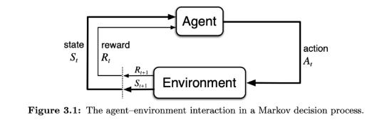
>
> ```
>                    ┌─────────────────────┐
>          ┌────────►│        Agent        │────────┐
>          │         └─────────────────────┘        │
>          │                                        │ action
>  state S_t                                        │  A_t
>  reward R_t                                       │
>          │         ┌─────────────────────┐        │
>          └─────────│     Environment     │◄───────┘
>   R_{t+1}, S_{t+1} └─────────────────────┘
> ```
> 核心三要素：**Agent**（观察 $S_t$，选择动作 $A_t$）、**Environment**（接受 $A_t$，返回 $R_{t+1}$, $S_{t+1}$）、**Reward**（标量奖励信号）
>
> ---
>
> **题2：Q-table 更新公式（Python）**
>
> ```python
> qtable[state][action] = qtable[state][action] + alpha * (reward + gamma * max(qtable[next_state]) - qtable[state][action])
> ```
> | 变量           | 含义                                         |
> | -------------- | -------------------------------------------- |
> | `qtable`     | 动作价值表，实现动作价值函数$Q(s,a)$       |
> | `state`      | 当前状态$s$                                |
> | `action`     | 当前动作$a$                                |
> | `alpha`      | 学习率（步长）$\alpha$，控制每次更新的幅度 |
> | `reward`     | 执行动作后获得的即时奖励$r$                |
> | `gamma`      | 折扣因子$\gamma$，平衡即时与未来奖励       |
> | `next_state` | 执行动作后到达的新状态$s'$                 |
>
> ---
>
> **题3：What is Gymnasium?**
> Gymnasium is an **API standard** for reinforcement learning with a diverse collection of reference environments. It provides a standard interface (`reset()`, `step()`, `render()`) so that various RL algorithms can be applied to any environment in a consistent way.
>
> ---
>
> **题4：What is a Gymnasium Wrapper?**
> A Gymnasium Wrapper is a **convenient way to modify an existing environment without altering the underlying code directly**. You initialize a base environment first, then pass it to the wrapper's constructor (along with optional parameters).
>
> ```python
> env = gym.make("CartPole-v1")
> env = TimeLimit(env, max_episode_steps=200)  # wrapper 示例
> ```
> ---
>
> **题5：What is Stable-Baselines3?**
> Stable-Baselines3 is a set of **reliable, well-tested RL algorithm implementations** (DQN, PPO, SAC, etc.) that includes:
>
> - **Vectorized environments** — run multiple environment copies in parallel to collect experience faster
> - **Callbacks** — hooks for custom code during training (monitoring, auto-saving, progress bars, early stopping)
>
> Key API: `model.learn()` / `model.predict()` / `model.save()` / `Model.load()`


---

## 47. week6_midterm_review_storyline

Source: `week6_midterm_review_storyline.md`

# Week 6 故事线：期中复习 — 从零到 Q-Learning 的完整旅程

> **Source:** `CST8509_06_Midterm_Review.pdf` + Weeks 1-5 Slides + Quiz 1-4 + Labs 1-2 + Assignment 1
> **核心主题：** 五周知识的因果链条——为什么每一步都是前一步的自然延伸
> **故事线：** 从"什么是RL"到"用工业级工具训练Agent"——一段完整的学习旅程

---

## 🎬 序幕：这五周我们学了什么？为什么这样学？

想象你要从零开始制造一辆自动驾驶汽车：

1. **Week 1：** 先搞清楚"自动驾驶是什么"——RL 的基本概念
2. **Week 2：** 给问题建立数学模型——MDP
3. **Week 3：** 搭建模拟器——Gymnasium 环境
4. **Week 4：** 引入工业级训练框架——Stable-Baselines3
5. **Week 5：** 使用高级算法训练——DQN + SB3 实战

这不是五个独立的话题，而是**一条因果链**：每一步都是因为前一步不够用而自然演进的。

---

## 📚 第一章：RL 基础 — 认识所有零件 (Week 1)

### 核心问题
> "什么是强化学习？它和监督学习/无监督学习有什么不同？"

### 关键概念总览

```
┌─────────────────────────────────────────────────────┐
│           RL 问题的基本骨架                            │
│                                                      │
│   Environment (环境)                                  │
│       ↓ Observation + Reward                         │
│   Agent (智能体)                                      │
│       ↓ Action                                       │
│   → 重复循环                                         │
│                                                      │
│   Agent 的三大组件：                                   │
│   ┌──────────┐ ┌──────────────┐ ┌──────────┐       │
│   │ Policy π │ │Value Fn V/Q  │ │ Model    │       │
│   │ 选动作    │ │评估好坏       │ │预测未来   │       │
│   └──────────┘ └──────────────┘ └──────────┘       │
└─────────────────────────────────────────────────────┘
```

### 必考知识点

| 概念 | 定义 | Quiz 来源 |
|------|------|-----------|
| **Agent** | 执行动作的学习者 | Q2 Q2 |
| **Environment** | Agent 交互的外部世界 | Q2 Q2 |
| **Reward** $R_t$ | 标量反馈信号 | Q2 Q2, Q2 Q5 |
| **Policy** $\pi(a \mid s)$ | 状态 → 动作的映射 | Q1 Q5, Q2 Q8 |
| **Value Function** $V(s)$ | 状态 → 期望回报 | Q1 Q6 |
| **Action Value** $Q(s,a)$ | 状态+动作 → 期望回报 | Q1 Q7 |
| **Markov Property** | 未来只依赖当前状态 | Q1 Q1-Q3, Q2 Q3 |
| **Reward Hypothesis** | 所有目标 = 最大化期望累积奖励 | Q2 Q5 |
| **Discount factor** $\gamma$ | 解决无限步回报发散问题 | Q1 Q4, Q2 Q7 |
| **Greedy Policy** | $a = \arg\max_{a'} Q(s, a')$ | Q1 Q8, Q2 Q12 |
| **Episode** | 从起始到终止的一次完整运行 | Q2 Q6 |

### Agent 分类表（必背）

| 类型 | Policy | Value Fn | Model |
|------|--------|----------|-------|
| Value Based | ❌ (隐式) | ✅ | 可选 |
| Policy Based | ✅ | ❌ | 可选 |
| Actor Critic | ✅ actor | ✅ critic | 可选 |
| Model Free | π 和/或 V/Q | | ❌ |
| Model Based | π 和/或 V/Q | | ✅ |

> 💡 **Q-Learning = Value Based + Model Free** — 本课程的核心方法

### 三大子问题

| 子问题 | 含义 | 记忆技巧 |
|--------|------|----------|
| Exploit vs Explore | 用已知最好 vs 尝试新的 | 老餐厅 vs 新餐厅 |
| Learning vs Planning | 真实经验 vs 模型模拟 | 真吃 vs 看点评 |
| Prediction vs Control | 评估策略 vs 优化策略 | "多少分" vs "最高分" |

---

## 🧮 第二章：MDP — 给问题建立数学模型 (Week 2)

### 从 Week 1 到 Week 2 的过渡
> Week 1 说了"RL 有 Agent、Environment、Reward"，但怎么用**数学语言**精确描述这个问题？→ **MDP (Markov Decision Process)**

### 核心问题
> "如何把 RL 问题形式化为数学模型？"

### MDP 五元组

$$
\langle S, A, P, R, \gamma \rangle
$$

| 符号 | 含义 | 说明 |
|------|------|------|
| $S$ | 状态集 (State Space) | 所有可能的状态 |
| $A$ | 动作集 (Action Space) | 所有可能的动作 |
| $P(s' \mid s, a)$ | 转移概率 (Transition Probability) | 在状态 $s$ 采取动作 $a$ 到达 $s'$ 的概率 |
| $R(s, a)$ | 奖励函数 (Reward Function) | 在状态 $s$ 采取动作 $a$ 获得的奖励 |
| $\gamma$ | 折扣因子 (Discount Factor) | $0 \le \gamma < 1$，控制未来奖励衰减 |

### Bellman 方程 — Q-Learning 的数学基础

**Bellman 方程**（Quiz 1 Q9, Quiz 2 Q11）：

$$
Q(s, a) = R + \gamma \max_{a'} Q(s', a')
$$

含义：一个状态-动作对的价值 = 即时奖励 + 折扣后的下一状态最大价值

**Q-Learning 更新规则**（Midterm 必考 — Slide 6）：

```python
qtable[state][action] = qtable[state][action] + alpha * (
    reward + gamma * max(qtable[next_state]) - qtable[state][action]
)
```

| 变量 | 含义 |
|------|------|
| `qtable` | Q 表，实现动作价值函数 |
| `state` | 当前状态 |
| `action` | 当前动作 |
| `alpha` | 学习率（步长），控制更新幅度 |
| `reward` | 即时奖励 |
| `gamma` | 折扣因子 |
| `next_state` | 下一状态 |

### Q-Learning vs SARSA — 深入理解

| 特性 | Q-Learning | SARSA |
|------|-----------|-------|
| 类型 | Off-policy（离策略） | On-policy（在策略） |
| 更新目标 | $\max_{a'} Q(s', a')$ | $Q(s', a')$（实际采取的 $a'$） |
| 行为 | 学习最优策略（不管当前如何探索） | 学习当前策略（包括探索） |
| CliffWalking 结果 | **最短路径**（沿悬崖边） | **安全路径**（远离悬崖） |
| 原因 | 更新用 max，忽略探索时的危险 | 更新考虑了 ε-greedy 的随机性 |

> ⚠️ **Midterm Slide 4 的讨论题：** 为什么 Q-Learning 收敛到最短路径而 SARSA 不同？
> → Q-Learning 是 off-policy，更新时用 max（假设未来总选最优），所以学到最短路径。
> → SARSA 是 on-policy，更新时考虑了实际探索行为（ε-greedy 可能走到悬崖边），所以学到更安全的路径。

### ε-Greedy 探索策略

$$
a = \begin{cases}
\arg\max_{a'} Q(s, a') & \text{with probability } 1-\epsilon \\
\text{random action} & \text{with probability } \epsilon
\end{cases}
$$

- $\epsilon$ 通常从高值（如 1.0）衰减到低值（如 0.05）
- 高 $\epsilon$ = 多探索，低 $\epsilon$ = 多利用

### Q 表初始化 — 影响收敛的关键

| 初始化方式 | 效果 | 适用场景 |
|-----------|------|----------|
| 初始化为 0 | 保守，缺乏探索动机 | 奖励全为正时 |
| 随机初始化 | 鼓励探索（乐观初始值） | 通用方法 |
| 乐观初始化 | 所有值设高 → 强制全面探索 | 确保覆盖所有状态-动作 |

> ⚠️ **Midterm Slide 4 问题：** 终止状态的 Q 值为什么必须设为 0？
> → 终止状态没有"下一步"，$Q(s_{terminal}, a) = 0$ 对所有 $a$。如果不设为 0，会导致值函数估计偏差。

---

## 🏗️ 第三章：Gymnasium — 搭建标准化模拟器 (Week 3)

### 从 Week 2 到 Week 3 的过渡
> Week 2 有了数学模型和算法，但怎么**实际运行**？我们需要一个标准化的环境来跑实验 → **Gymnasium**

### 核心问题
> "Gymnasium 是什么？如何用它创建和使用 RL 环境？"

### Gymnasium 标准定义（Midterm 必考 — Slide 7）

> **Gymnasium** is a framework for creating Reinforcement Learning environments with a standard interface such that various RL algorithms/agents can be applied to the environment in a standard way.
> 
> Gymnasium 是一个用于创建 RL 环境的框架，具有标准接口，使各种 RL 算法/智能体可以用标准方式应用于环境。

### Gymnasium 核心 API

```python
import gymnasium as gym

# 创建环境
env = gym.make("CliffWalking-v0")

# 重置环境 → 返回初始状态和信息
state, info = env.reset()

# 执行动作 → 返回 5 个值
next_state, reward, terminated, truncated, info = env.step(action)
```

**关键方法 & 返回值：**

| 方法 | 返回值 | 说明 |
|------|--------|------|
| `env.reset()` | `(state, info)` | 重置到初始状态 |
| `env.step(action)` | `(next_state, reward, terminated, truncated, info)` | 执行一步 |
| `env.action_space` | `Space` | 动作空间（Discrete 或 Box） |
| `env.observation_space` | `Space` | 观测空间 |

### 自定义环境 (Custom Environment)

创建自定义 Gymnasium 环境需要实现：

1. `__init__()` — 定义 `action_space` 和 `observation_space`
2. `reset()` — 返回初始状态
3. `step(action)` — 执行动作，返回 (state, reward, terminated, truncated, info)
4. `render()` — 可视化（可选，常用 Pygame）

### Wrapper — 修改环境行为（Midterm 必考 — Slide 8）

> **Wrapper** = 在不修改底层代码的情况下修改现有环境
> 
> 使用方法：先初始化基础环境，然后传给 Wrapper 构造函数

```python
from gymnasium.wrappers import TimeLimit

env = gym.make("MyEnv-v0")
env = TimeLimit(env, max_episode_steps=200)  # 添加截断功能
```

---

## 🔧 第四章：Stable-Baselines3 — 工业级训练框架 (Week 4)

### 从 Week 3 到 Week 4 的过渡
> 有了标准化环境，但自己写 Q-Learning 太低效了。有没有**开箱即用的高性能算法库**？→ **Stable-Baselines3 (SB3)**

### 核心问题
> "SB3 是什么？为什么要用它？"

### SB3 标准定义（Midterm 必考 — Slide 9）

> **Stable-baselines3** is a set of reliable Reinforcement Learning algorithm implementations.
> 
> Stable-baselines3 是一套**可靠的**强化学习算法实现。

关键特性：
- **Vectorized environments** — 同时运行多个环境副本 → 加速训练
- **Callbacks** — 自定义代码（监控、自动保存、模型操作、进度条）

### SB3 基本用法

```python
from stable_baselines3 import DQN

# 创建模型
model = DQN("MlpPolicy", env, verbose=1)

# 训练
model.learn(total_timesteps=10000)

# 测试
obs, info = env.reset()
action, _states = model.predict(obs, deterministic=True)
```

---

## 🧠 第五章：DQN — 深度 Q 网络 (Week 5)

### 从 Week 4 到 Week 5 的过渡
> 表格式 Q-Learning 只能处理**有限**的状态-动作空间。真实问题（如 Atari 游戏、机器人控制）状态空间巨大怎么办？→ 用**神经网络替代 Q 表** → **DQN**

### 核心问题
> "当状态空间太大无法建表时，如何做 Q-Learning？"

### 从 Q-Table 到 DQN 的演进

```
Q-Table:       状态+动作 → 查表 → Q值
    ↓ 状态太多，表太大
DQN:           状态 → 神经网络 → 所有动作的 Q值
```

| 特性 | Tabular Q-Learning | DQN |
|------|-------------------|-----|
| Q值存储 | 表格 | 神经网络 |
| 状态空间 | 有限、已知 | 可以连续/巨大 |
| 前提条件 | 完整的 $S$ 和 $A$ 已知（Quiz 2 Q13） | 只需 $A$ 已知 |
| 泛化能力 | ❌ 无 | ✅ 可泛化到未见状态 |

### 在 SB3 中使用 DQN

```python
from stable_baselines3 import DQN

model = DQN(
    "MlpPolicy",         # 多层感知机策略
    env,
    learning_rate=1e-3,   # 学习率
    buffer_size=50000,    # 经验回放缓冲区
    learning_starts=1000, # 开始学习前的步数
    verbose=1
)
model.learn(total_timesteps=100000)
```

---

## 🗺️ 全局路线图：五周知识的因果链条

```
┌──────────────────────────────────────────────────────────────┐
│                    RL 学习路线图 (Weeks 1-5)                   │
│                                                               │
│  Week 1: 概念                                                 │
│  ✅ Agent / Environment / Reward                              │
│  ✅ Policy / Value Function / Model                           │
│  ✅ Markov Property                                           │
│  ✅ Agent 分类 (Value/Policy/Actor-Critic, Model Free/Based)   │
│         │                                                     │
│         ▼ "概念有了,怎么用数学描述?"                              │
│  Week 2: 数学模型                                              │
│  ✅ MDP ⟨S, A, P, R, γ⟩                                       │
│  ✅ Bellman 方程: Q(s,a) = R + γ max Q(s',a')                 │
│  ✅ Q-Learning 更新规则                                        │
│  ✅ ε-Greedy / Q-table 初始化                                  │
│         │                                                     │
│         ▼ "有了算法,在哪跑?"                                    │
│  Week 3: 标准化环境                                            │
│  ✅ Gymnasium API (reset/step/render)                          │
│  ✅ Custom Environment                                         │
│  ✅ Wrapper                                                    │
│  ✅ Pygame rendering                                           │
│         │                                                     │
│         ▼ "自己写算法太慢,有现成的吗?"                            │
│  Week 4: 工业级框架                                            │
│  ✅ Stable-Baselines3                                          │
│  ✅ Vectorized Environments                                    │
│  ✅ Callbacks                                                  │
│         │                                                     │
│         ▼ "Q-table 状态太多放不下,怎么办?"                       │
│  Week 5: 深度 RL                                              │
│  ✅ DQN (用神经网络替代 Q 表)                                   │
│  ✅ SB3 + DQN 实战                                             │
│         │                                                     │
│         ▼                                                     │
│  Week 6: 期中考试 📝                                           │
└──────────────────────────────────────────────────────────────┘
```

---

## ⚠️ 重点提醒：Antonin Raffin 最佳实践 (Quiz 4)

| 话题 | 关键建议 |
|------|----------|
| RL 为什么难？ | 超参敏感 + 采样低效 + Agent自采集数据 + 奖励设计难 |
| Reward Hacking | 最大化奖励但没学到期望行为 |
| 最佳实践 | 用推荐超参、不依赖旧算法、记录所有参数、多次运行做定量评估 |
| 开始前先问 | 真的需要 RL 吗？安全/稳定性有保证吗？ |
| 定义自定义任务 | 观测空间 + 奖励函数 + 终止条件 + 动作空间 |
| 观测空间 | 归一化 + 信息足够 + 不违反 Markov 假设 |
| 动作空间 | 确定离散/连续 + 连续必须归一化 + 权衡复杂度/性能 |
| 奖励函数 | 从简单开始 + 注意 reward hacking + 主/次奖励 + 稀疏/塑形 |
| 选算法 | 考虑动作类型（连续 vs 离散） |
| 不工作怎么办 | 增加训练时间 + 可信实现 + 检查最佳实践 + 先简化再复杂化 |

---

## 🎓 考试/复习重点检查清单

### ✍️ 必须能写的

- [ ] **画 Agent-Environment 交互图**（Slide 5）
- [ ] **写 Q-Learning 更新公式** + 每个变量含义（Slide 6）
- [ ] 定义 Gymnasium（Slide 7）
- [ ] 定义 Gymnasium Wrapper（Slide 8）
- [ ] 定义 Stable-Baselines3 + 两个关键特性（Slide 9）

### 🧠 必须能回答的

- [ ] RL 与监督/无监督学习的区别
- [ ] 马尔可夫性质的定义和含义
- [ ] Policy 的两种形式（确定性 vs 随机性）
- [ ] $V(s)$ vs $Q(s,a)$ 的区别
- [ ] Bellman 方程含义
- [ ] Greedy 策略定义
- [ ] $\gamma$ 的作用（解决无限回报发散）
- [ ] Episode 的定义
- [ ] Q-Learning 为什么收敛到最短路径
- [ ] Q-Learning vs SARSA 的区别
- [ ] Q 表初始化对收敛的影响
- [ ] 终止状态 Q 值为什么设为 0
- [ ] TD (Temporal Difference) ≠ Temporal Distance（Quiz 2 Q14 陷阱）

### 📊 必须能对比的

- [ ] Q-Learning vs SARSA（on-policy vs off-policy）
- [ ] Tabular Q-Learning vs DQN（表格 vs 神经网络）
- [ ] Value Based vs Policy Based vs Actor Critic
- [ ] Model Free vs Model Based
- [ ] Exploit vs Explore


---

## 48. week6_midterm_review_concepts

Source: `week6_midterm_review_concepts.md`

# Week 6: 期中复习 — 核心概念 (Core Concepts)

> See also: [幻灯片笔记](week6_midterm_review_slides.md) | [操作教程](week6_midterm_review_tutorial.md) | [Quiz](week6_midterm_review_quiz.md)

---

> 本文件是 Week 1-5 全部核心概念的**压缩版速查表**，作为期中备考的单一入口。每个概念附来源周，详细内容查对应文件。

---

## RL 基础（来自 Week 1）

### Agent-Environment 交互

```
Agent ──(action At)──► Environment ──(reward R_{t+1}, state S_{t+1})──► Agent
```

三要素：**Agent**（观察状态、选择动作）、**Environment**（接受动作、返回奖励+状态）、**Reward**（标量反馈信号）

### Markov Property

未来只依赖当前状态，与历史无关：$P(S_{t+1} \mid S_t, A_t) = P(S_{t+1} \mid H_t)$

### Policy（策略）

| 类型 | 公式 |
|------|------|
| 确定性 | $a = \pi(s)$ |
| 随机性 | $\pi(a \mid s) = P[A=a \mid S=s]$，约束 $\sum_a \pi(a\|s) = 1$ |

### Return（折扣回报）

$$
G_t = \sum_{k=0}^{\infty} \gamma^k R_{t+k+1} = R_{t+1} + \gamma G_{t+1}
$$

### Value Functions（价值函数）

| 函数 | 公式 |
|------|------|
| $V_\pi(s)$ | $\mathbb{E}_\pi[G_t \mid S_t=s]$ |
| $Q_\pi(s,a)$ | $\mathbb{E}_\pi[G_t \mid S_t=s, A_t=a]$ |

---

## Q-Learning（来自 Week 2）

### 更新公式（★★★ 必考）

$$
Q(s,a) \leftarrow Q(s,a) + \alpha \Big[ r + \gamma \max_{a'} Q(s',a') - Q(s,a) \Big]
$$

**Python 版：**
```python
qtable[s][a] = qtable[s][a] + alpha * (reward + gamma * max(qtable[s_]) - qtable[s][a])
```

### ε-Greedy

$$
a = \begin{cases} \arg\max_{a'} Q(s,a') & 1-\varepsilon \\ \text{random} & \varepsilon \end{cases}
$$

### Off-Policy vs On-Policy

| | Q-Learning | SARSA |
|-|-----------|-------|
| 类型 | Off-policy | On-policy |
| target | $\max_{a'} Q(s',a')$ | $Q(s', a')$（实际执行） |
| CliffWalking | 最短路径（贴悬崖） | 更安全路径 |

### Q-Table 初始化

- **全 0**：探索动力不足
- **乐观高值**：驱动主动探索，推荐
- **终止状态必须为 0**：否则 Bellman 更新引入虚假未来奖励

---

## Gymnasium（来自 Week 3）

### `step()` 五个返回值（必考）

```python
obs, reward, terminated, truncated, info = env.step(action)
```

- `terminated`：自然结束（目标达成/死亡）
- `truncated`：超时结束（TimeLimit）

### 空间类型速查

| 空间 | 用途 |
|------|------|
| `Discrete(n)` | $n$ 个离散动作/状态 |
| `Box(low, high, shape)` | 连续多维数组 |
| `Dict({...})` | 多 key 字典观测 |
| `MultiDiscrete([n1,n2])` | 多个独立离散变量 |

### Wrapper

不修改底层代码的环境修改方式。先初始化环境，再传给 Wrapper 构造函数。

### Policy 选择

- `Dict` 观测 → `MultiInputPolicy`
- 单一 `Discrete`/`Box` → `MlpPolicy`

---

## Stable-Baselines3（来自 Week 4）

### 什么是 SB3

一套可靠的 RL 算法实现，包含向量化环境支持和回调函数机制。

### 算法选择

| 动作空间 | 推荐算法 |
|---------|---------|
| 离散 | DQN, PPO, A2C |
| 连续 | SAC, TD3, PPO |

### 核心 API

```python
model = PPO("MlpPolicy", env)
model.learn(total_timesteps=100_000)
action, _ = model.predict(obs, deterministic=True)
model.save("path") ; model = PPO.load("path", env)
```

### Vectorized Environments

$n$ 个并行环境，每步收集 $n$ 个转移。On-policy 算法（PPO）受益最大。

---

## DQN 深入（来自 Week 5）

### 三大创新

| 创新 | 解决问题 |
|------|---------|
| Q-Network（神经网络） | Q-table 无法处理大状态空间（维度诅咒） |
| Target Network | 同一网络计算预测和目标 → 不稳定（追移动靶） |
| Replay Buffer | 时间相关数据 → 违反独立同分布假设 |

### 目标 Q 值

$$
y = r + \gamma \max_{a'} Q_{\theta^-}(s', a')
$$

用**目标网络** $Q_{\theta^-}$ 计算（非主网络）

### DiscreteActionWrapper

`MultiDiscrete([4,4])` → `Discrete(16)`，用 `np.unravel_index()` 还原

---

## 期中高频考点汇总

| 考点 | 关键答案 |
|------|---------|
| Q-Learning 公式 Python 版 | `q[s][a] = q[s][a] + alpha*(r + gamma*max(q[s_]) - q[s][a])` |
| RL 框架图 | Agent↔Environment，标注 $S_t, A_t, R_{t+1}, S_{t+1}$ |
| 终止状态 Q=0 的原因 | 防止引入虚假未来奖励，破坏 Bellman 方程正确性 |
| Q-Learning 最短路径原因 | Off-policy，更新目标不感知随机探索风险 |
| What is Gymnasium | API standard for RL with diverse reference environments |
| What is a Wrapper | Modify env without altering underlying code |
| What is SB3 | Reliable RL algorithm implementations + VecEnv + Callbacks |

---

## 易错点汇总（跨周）

| 错误 | 正确 |
|------|------|
| `terminated` = `done` | `done = terminated or truncated`（语义不同） |
| DQN 支持连续动作 | DQN 只支持 `Discrete` |
| SAC 用于离散动作 | SAC 只支持连续动作空间 |
| Target Network 每步更新 | 每隔 `target_update_interval` 步同步一次 |
| $\gamma = 1$ 是最好的 | 持续任务中 $G_t$ 发散，必须 $\gamma < 1$ |


---

## 49. week6_midterm_review_math

Source: `week6_midterm_review_math.md`

# Midterm Review: RL 期中复习 — 数学公式

> **See also:** [_cheatsheet.md](week6_midterm_review_cheatsheet.md) | [_code.md](week6_midterm_review_code.md)
> **Source:** Slides Week 1-5 + Quiz 1-4 + Midterm Review Slide 6
> **Coverage:** Weeks 1-5 全部数学公式

---

## ★ 核心公式 (Core Formulas)

### 状态函数 (State Function)

$$
S_t = f(H_t)
$$

| 符号 | 含义 | Meaning |
|------|------|---------|
| $S_t$ | 时间步 $t$ 的状态 | State at time $t$ |
| $f$ | 程序员选择的摘要函数 | Summary function (programmer's choice) |
| $H_t$ | Complete history: $R_1, O_1, A_1, ..., R_t, O_t, A_t$ | Full sequence of interactions |

---

### 马尔可夫性质 (Markov Property)

$$
P(S_{t+1}, R_{t+1} \mid S_t, A_t) = P(S_{t+1}, R_{t+1} \mid S_1, A_1, ..., S_t, A_t)
$$

简写: Future depends only on current state, not full history.

---

### 策略 (Policy)

**确定性策略:**

$$
a = \pi(s)
$$

**随机性策略:**

$$
\pi(a \mid s) = P[A = a \mid S = s]
$$

约束: $\sum_a \pi(a \mid s) = 1$

---

### 贪婪选择 (Greedy Selection)

$$
a = \arg\max_{a'} Q(s, a')
$$

含义: 选使 $Q$ 值最大的动作

---

### ε-Greedy 策略

$$
a = \begin{cases} \arg\max_{a'} Q(s, a') & \text{with probability } 1-\epsilon \\ \text{random action} & \text{with probability } \epsilon \end{cases}
$$

---

### 折扣回报 (Discounted Return)

**展开形式:**

$$
G_t = r_{t+1} + \gamma r_{t+2} + \gamma^2 r_{t+3} + \cdots = \sum_{k=0}^{\infty} \gamma^k r_{t+k+1}
$$

**递归形式:**

$$
G_t = r_{t+1} + \gamma G_{t+1}
$$

| 符号 | 含义 | 取值范围 |
|------|------|----------|
| $G_t$ | 从时间步 $t$ 的折扣回报 | |
| $\gamma$ | 折扣因子 | $0 \le \gamma < 1$ |
| $r_{t+k+1}$ | 未来第 $k$ 步的即时奖励 | |

| $\gamma$ 值 | 效果 |
|-------------|------|
| $\gamma = 0$ | 只看即时奖励 (myopic) |
| $\gamma \to 1$ | 所有奖励同等重要 (may diverge) |
| $0 < \gamma < 1$ | 平衡即时与未来 |

---

### 价值函数 (Value Functions)

**状态价值函数:**

$$
V_\pi(s) = \mathbb{E}_\pi[G_t \mid S_t = s]
$$

**动作价值函数:**

$$
Q_\pi(s, a) = \mathbb{E}_\pi[G_t \mid S_t = s, A_t = a]
$$

| 符号 | 输入 | 输出 |
|------|------|------|
| $V_\pi(s)$ | State only | Expected return from $s$ |
| $Q_\pi(s, a)$ | State + Action | Expected return from $s$ taking $a$ |

---

### Bellman 方程 — Q-Learning 版

$$
Q(s, a) = R + \gamma \max_{a'} Q(s', a')
$$

含义: Q 值 = 即时奖励 + 折扣后的下一状态最大 Q 值

Quiz 1 Q9: "immediate reward **+** **maximum** expected future rewards"

---

### ★★★ Q-Learning 更新规则 (Midterm 必考 — Slide 6)

$$
Q(s, a) \leftarrow Q(s, a) + \alpha \Big[ R + \gamma \max_{a'} Q(s', a') - Q(s, a) \Big]
$$

| 符号 | 含义 | Python 变量 |
|------|------|-------------|
| $Q(s, a)$ | 当前 Q 值 | `qtable[state][action]` |
| $\alpha$ | 学习率 (step size) | `alpha` |
| $R$ | 即时奖励 | `reward` |
| $\gamma$ | 折扣因子 | `gamma` |
| $\max_{a'} Q(s', a')$ | 下一状态最大 Q 值 | `max(qtable[next_state])` |
| $R + \gamma \max_{a'} Q(s', a')$ | TD target | — |
| $R + \gamma \max_{a'} Q(s', a') - Q(s,a)$ | TD error | — |

---

## 📝 手算练习 (Hand Calc Exercises)

### 练习 1: 折扣回报计算

**题目:** $\gamma = 0.9$，接下来 3 步奖励 $r_1 = -1, r_2 = -1, r_3 = 10$。求 $G_0$。

**解:**

$$
G_0 = r_1 + \gamma r_2 + \gamma^2 r_3
$$
$$
= (-1) + 0.9 \times (-1) + 0.9^2 \times 10
$$
$$
= -1 + (-0.9) + 8.1 = \boxed{6.2}
$$

---

### 练习 2: Bellman 方程求 Q 值

**题目:** $\gamma = 0.1$，agent 在状态 $s$ 做动作 $a$，获奖励 $r = 0$，到达 $s'$。$Q(s', \text{left}) = 0.3, Q(s', \text{right}) = 0.8, Q(s', \text{up}) = 0.1, Q(s', \text{down}) = 0.5$。求 $Q(s, a)$。

**解:**

Step 1: $\max_{a'} Q(s', a') = \max(0.3, 0.8, 0.1, 0.5) = 0.8$

Step 2: $Q(s, a) = r + \gamma \times \max_{a'} Q(s', a') = 0 + 0.1 \times 0.8 = \boxed{0.08}$

---

### 练习 3: Q-Learning 完整更新

**题目:** 当前 $Q(s, a) = 2.0$，$\alpha = 0.1$，$\gamma = 0.9$。Agent 在 $s$ 做 $a$，获 $r = 1$，到达 $s'$。$Q(s', a'_1) = 3.0, Q(s', a'_2) = 5.0$。求更新后的 $Q(s, a)$。

**解:**

Step 1: $\max_{a'} Q(s', a') = \max(3.0, 5.0) = 5.0$

Step 2: TD target $= r + \gamma \max_{a'} Q(s', a') = 1 + 0.9 \times 5.0 = 5.5$

Step 3: TD error $= 5.5 - Q(s, a) = 5.5 - 2.0 = 3.5$

Step 4: $Q(s, a) \leftarrow 2.0 + 0.1 \times 3.5 = 2.0 + 0.35 = \boxed{2.35}$

---

### 练习 4: ε-Greedy 概率计算

**题目:** 有 4 个动作，$\epsilon = 0.2$，$Q(s, a_1) = 1.5, Q(s, a_2) = 3.0, Q(s, a_3) = 2.0, Q(s, a_4) = 0.5$。求每个动作被选择的概率。

**解:**

Greedy action: $a_2$ (最大 Q 值 = 3.0)

随机概率: $\frac{\epsilon}{|A|} = \frac{0.2}{4} = 0.05$ each

| 动作 | 概率 | 计算 |
|------|------|------|
| $a_1$ | 0.05 | random only |
| $a_2$ | **0.85** | $(1 - \epsilon) + \frac{\epsilon}{|A|} = 0.8 + 0.05$ |
| $a_3$ | 0.05 | random only |
| $a_4$ | 0.05 | random only |

验证: $0.05 + 0.85 + 0.05 + 0.05 = 1.0$ ✅

---

### 练习 5: 随机策略概率

**题目:** 状态 $s$ 下有两个动作 $a_1, a_2$。$\pi(a_1|s) = 0.2$，求 $\pi(a_2|s)$。

**解:**

$$
\pi(a_2|s) = 1 - \pi(a_1|s) = 1 - 0.2 = \boxed{0.8}
$$

（约束: $\sum_a \pi(a|s) = 1$）

---

## 速查公式表 (Quick Formula Reference)

| 名称 | 公式 | 关键参数 |
|------|------|----------|
| State Function | $S_t = f(H_t)$ | $f$ = 程序员选择 |
| Deterministic Policy | $a = \pi(s)$ | 一对一映射 |
| Stochastic Policy | $\pi(a \mid s) = P[A=a \mid S=s]$ | $\sum_a \pi = 1$ |
| Greedy Selection | $a = \arg\max_{a'} Q(s, a')$ | 选最大 Q 值 |
| Discounted Return | $G_t = \sum_{k=0}^{\infty} \gamma^k r_{t+k+1}$ | $0 \le \gamma < 1$ |
| Return Recursive | $G_t = r_{t+1} + \gamma G_{t+1}$ | |
| State Value | $V_\pi(s) = \mathbb{E}_\pi[G_t \mid S_t = s]$ | 只看未来 |
| Action Value | $Q_\pi(s,a) = \mathbb{E}_\pi[G_t \mid S_t=s, A_t=a]$ | 状态+动作 |
| Bellman (Q-Learning) | $Q(s,a) = R + \gamma \max_{a'} Q(s',a')$ | 即时+折扣最大 |
| **Q-Learning Update** | $Q(s,a) \leftarrow Q(s,a) + \alpha[R + \gamma \max Q(s',a') - Q(s,a)]$ | **必考** |
| ε-Greedy | $P(\text{greedy}) = 1-\epsilon$, $P(\text{random}) = \epsilon$ | |


---

## 50. week6_midterm_review_code

Source: `week6_midterm_review_code.md`

# Midterm Review: RL 期中复习 — 代码参考

> **See also:** [_cheatsheet.md](week6_midterm_review_cheatsheet.md) | [_math.md](week6_midterm_review_math.md)
> **Source:** Labs 1-2 + Assignment 1 + Slides Week 3-5
> **Coverage:** Gymnasium API + Q-Learning 实现 + SB3 用法

---

## ★ Q-Learning 更新公式 (Midterm 必考 — Slide 6)

```python
# Q-Learning update rule — Q-Learning 更新规则
# 每一步的核心更新 | Core update for each step
qtable[state][action] = (
    qtable[state][action]
    + alpha * (
        reward
        + gamma * max(qtable[next_state])
        - qtable[state][action]
    )
)
```

| Variable | Type | Meaning |
|----------|------|---------|
| `qtable` | `dict` or `np.array` | Q 表: 动作价值函数 |
| `state` | `int` | 当前状态 |
| `action` | `int` | 当前动作 |
| `alpha` | `float` | 学习率 (step size), e.g. 0.1 |
| `reward` | `float` | 即时奖励 |
| `gamma` | `float` | 折扣因子, e.g. 0.99 |
| `next_state` | `int` | 下一状态 |

---

## Q-Learning 完整训练循环

```python
import numpy as np
import gymnasium as gym

# ── 超参数 | Hyperparameters ──
alpha = 0.1          # 学习率 | Learning rate
gamma = 0.99         # 折扣因子 | Discount factor
epsilon = 1.0        # 探索率 | Exploration rate
epsilon_decay = 0.995
epsilon_min = 0.05
num_episodes = 1000

# ── 创建环境 | Create environment ──
env = gym.make("CliffWalking-v0")
n_states = env.observation_space.n
n_actions = env.action_space.n

# ── 初始化 Q 表 | Initialize Q-table ──
qtable = np.zeros((n_states, n_actions))

# ── 训练循环 | Training loop ──
for episode in range(num_episodes):
    state, info = env.reset()
    terminated = False
    truncated = False

    while not (terminated or truncated):
        # ε-greedy 动作选择 | ε-greedy action selection
        if np.random.random() < epsilon:
            action = env.action_space.sample()  # 探索 | Explore
        else:
            action = np.argmax(qtable[state])    # 利用 | Exploit

        # 执行动作 | Take action
        next_state, reward, terminated, truncated, info = env.step(action)

        # Q-Learning 更新 | Q-Learning update
        qtable[state][action] = qtable[state][action] + alpha * (
            reward + gamma * np.max(qtable[next_state]) - qtable[state][action]
        )

        state = next_state

    # ε 衰减 | Decay epsilon
    epsilon = max(epsilon_min, epsilon * epsilon_decay)

env.close()
```

---

## Gymnasium 核心 API

### 创建和使用环境

```python
import gymnasium as gym

# ── 创建环境 | Create environment ──
env = gym.make("CliffWalking-v0")
# 带渲染 | With rendering:
env = gym.make("CliffWalking-v0", render_mode="human")

# ── 重置环境 | Reset ──
state, info = env.reset()
# state: 初始状态 | Initial state
# info: 额外信息字典 | Extra info dict

# ── 执行动作 | Step ──
next_state, reward, terminated, truncated, info = env.step(action)
# terminated: 到达终止状态 | Reached terminal state
# truncated:  到达最大步数限制 | Reached max steps

# ── 查看空间 | Inspect spaces ──
env.observation_space    # 观测空间 | e.g. Discrete(48)
env.action_space         # 动作空间 | e.g. Discrete(4)
env.action_space.n       # 动作数量 | Number of actions
env.observation_space.n  # 状态数量 | Number of states

# ── 随机动作 | Random action ──
action = env.action_space.sample()

# ── 关闭环境 | Close ──
env.close()
```

### step() 返回值详解

| Return Value | Type | Description |
|---|---|---|
| `next_state` | `int` or `np.array` | 新状态 |
| `reward` | `float` | 即时奖励 |
| `terminated` | `bool` | 是否到达终止状态 (goal/fail) |
| `truncated` | `bool` | 是否被截断 (max steps) |
| `info` | `dict` | 额外调试信息 |

---

## 自定义 Gymnasium 环境

```python
import gymnasium as gym
from gymnasium import spaces
import numpy as np

class MyCustomEnv(gym.Env):
    """自定义 RL 环境模板 | Custom RL environment template"""

    metadata = {"render_modes": ["human", "rgb_array"]}

    def __init__(self, render_mode=None):
        super().__init__()
        # ── 定义动作空间 | Define action space ──
        self.action_space = spaces.Discrete(4)  # 4 个离散动作

        # ── 定义观测空间 | Define observation space ──
        self.observation_space = spaces.Discrete(16)  # 16 个状态

        self.render_mode = render_mode
        self.state = None

    def reset(self, seed=None, options=None):
        """重置环境到初始状态 | Reset to initial state"""
        super().reset(seed=seed)
        self.state = 0  # 起始状态
        info = {}
        return self.state, info

    def step(self, action):
        """执行一步 | Execute one step"""
        # 1. 根据 action 计算新状态 | Compute new state
        # 2. 计算奖励 | Compute reward
        # 3. 判断是否终止 | Check termination
        next_state = self.state  # 替换为实际逻辑
        reward = -1.0
        terminated = False
        truncated = False
        info = {}

        self.state = next_state
        return next_state, reward, terminated, truncated, info

    def render(self):
        """渲染环境 (可选) | Render (optional)"""
        pass
```

### 注册自定义环境

```python
from gymnasium.envs.registration import register

register(
    id="MyCustomEnv-v0",
    entry_point="my_module:MyCustomEnv",
    max_episode_steps=200,
)
```

---

## Gymnasium Wrapper

```python
import gymnasium as gym
from gymnasium import Wrapper

# ── 使用内置 Wrapper ──
env = gym.make("CartPole-v1")
from gymnasium.wrappers import TimeLimit
env = TimeLimit(env, max_episode_steps=500)

# ── 自定义 Wrapper ──
class MyWrapper(Wrapper):
    """自定义 wrapper: 修改奖励 | Custom wrapper: modify reward"""

    def step(self, action):
        obs, reward, terminated, truncated, info = self.env.step(action)
        # 修改奖励 | Modify reward
        modified_reward = reward * 2.0
        return obs, modified_reward, terminated, truncated, info

env = gym.make("CartPole-v1")
env = MyWrapper(env)
```

---

## Stable-Baselines3 基本用法

### DQN 训练流程

```python
from stable_baselines3 import DQN
import gymnasium as gym

# ── 创建环境 ──
env = gym.make("CartPole-v1")

# ── 创建模型 ──
model = DQN(
    "MlpPolicy",           # 多层感知机策略网络
    env,
    learning_rate=1e-3,     # 学习率
    buffer_size=50000,      # 经验回放缓冲区大小
    learning_starts=1000,   # 开始学习前的随机步数
    verbose=1               # 打印训练信息
)

# ── 训练 ──
model.learn(total_timesteps=100000)

# ── 保存 & 加载 ──
model.save("dqn_cartpole")
model = DQN.load("dqn_cartpole")

# ── 测试 ──
obs, info = env.reset()
for _ in range(1000):
    action, _states = model.predict(obs, deterministic=True)
    obs, reward, terminated, truncated, info = env.step(action)
    if terminated or truncated:
        obs, info = env.reset()

env.close()
```

### PPO 训练流程

```python
from stable_baselines3 import PPO

model = PPO("MlpPolicy", env, verbose=1)
model.learn(total_timesteps=25000)
```

### 常用 SB3 Callbacks

```python
from stable_baselines3.common.callbacks import EvalCallback

# 每隔一段时间评估并保存最佳模型
eval_callback = EvalCallback(
    eval_env,
    best_model_save_path="./logs/",
    log_path="./logs/",
    eval_freq=5000,
    deterministic=True,
    render=False
)

model.learn(total_timesteps=100000, callback=eval_callback)
```

---

## 常用 Imports 速查

```python
# ── Gymnasium ──
import gymnasium as gym
from gymnasium import spaces
from gymnasium import Wrapper

# ── Numpy ──
import numpy as np

# ── Stable-Baselines3 ──
from stable_baselines3 import DQN, PPO, A2C
from stable_baselines3.common.callbacks import EvalCallback
from stable_baselines3.common.env_checker import check_env

# ── Matplotlib (用于绘图) ──
import matplotlib.pyplot as plt

# ── 环境检查 (验证自定义环境) ──
from stable_baselines3.common.env_checker import check_env
env = MyCustomEnv()
check_env(env)  # 会报告问题
```

---

## 代码模式速查 (Code Patterns Quick Reference)

| 模式 | 代码片段 | 用途 |
|------|---------|------|
| 创建环境 | `env = gym.make("EnvName-v0")` | 标准环境 |
| 重置 | `state, info = env.reset()` | 每个 episode 开始 |
| 执行步 | `s, r, term, trunc, info = env.step(a)` | 单步交互 |
| 随机动作 | `action = env.action_space.sample()` | 探索 |
| 贪婪动作 | `action = np.argmax(qtable[state])` | 利用 |
| ε-greedy | `if random() < ε: sample else argmax` | 探索-利用平衡 |
| Q 更新 | `Q[s,a] += α*(r+γ*max(Q[s'])-Q[s,a])` | Q-Learning 核心 |
| SB3 训练 | `model.learn(total_timesteps=N)` | 训练 |
| SB3 预测 | `action, _ = model.predict(obs)` | 推理 |
| SB3 保存 | `model.save("name")` | 持久化 |
| SB3 加载 | `model = DQN.load("name")` | 恢复 |


---

## 51. week6_midterm_review_tutorial

Source: `week6_midterm_review_tutorial.md`

# Week 6: 期中复习 — 操作教程 (Midterm Review Tutorial)

> See also: [幻灯片笔记](week6_midterm_review_slides.md) | [数学公式](week6_midterm_review_math.md) | [Quiz](week6_midterm_review_quiz.md)

---

## §0 考试范围总览 (Midterm Scope)

期中考试涵盖 **Week 1–5 + SB3**，分为以下主题：

| 主题 | 关键概念 | 核心来源 |
|------|---------|---------|
| RL 基础 | Agent/Env/Reward 三要素、Markov Property、Policy、Value Function、$G_t$ | Week 1 |
| 基础 Q-Learning | Q-table 更新公式、ε-greedy | Week 2 |
| Gymnasium 自定义环境 | `reset()`/`step()` 返回值、ObsSpace/ActionSpace、Pygame | Week 3 |
| Q-Learning + CliffWalking | Off-policy vs On-policy（Q-Learning vs SARSA） | Week 2 + Lab 1 |
| Q-Learning Deep Dive | Q-table 初始化、终止状态 Q=0 的重要性 | Week 5 |
| Stable-Baselines3 | Vectorized env、callbacks、`learn()`/`predict()` | Week 4 |

> ⚠️ **优先级：** §3 笔试样题直接来自老师 slides，是最高优先级复习内容。

---

## §1 RL 基础快速复习 (RL Fundamentals)

### 1.1 三要素

```
           ┌─────────────────────┐
 ┌────────► │        Agent        │────────┐
 │          └─────────────────────┘        │ action A_t
 │                                         │
 state S_t                                 │
 reward R_t   ┌─────────────────────┐      │
 └────────────│     Environment     │◄─────┘
  R_{t+1},    └─────────────────────┘
  S_{t+1}
```

- **Agent**：感知状态 $S_t$，输出动作 $A_t$
- **Environment**：接收 $A_t$，返回 $R_{t+1}$ 和 $S_{t+1}$
- **Reward**：标量信号，Agent 的唯一优化目标

### 1.2 Markov Property

$$
P(S_{t+1}, R_{t+1} \mid S_t, A_t) = P(S_{t+1}, R_{t+1} \mid S_1, A_1, \ldots, S_t, A_t)
$$

**一句话：** 未来只依赖当前状态，与历史无关。

> ⚠️ **实践意义：** 这是简化问题的关键假设。如果状态设计不好（遗漏关键信息），Markov Property 就不成立，算法性能会下降。

### 1.3 策略与价值函数

| 概念 | 公式 | 含义 |
|------|------|------|
| 确定性策略 | $a = \pi(s)$ | 每个状态对应唯一动作 |
| 随机性策略 | $\pi(a\|s) = P[A=a\|S=s]$ | 每个状态对应动作概率分布 |
| 状态价值 | $V_\pi(s) = \mathbb{E}\_\pi[G_t \mid S_t=s]$ | 从状态 $s$ 开始的期望回报 |
| 动作价值 | $Q_\pi(s,a) = \mathbb{E}\_\pi[G_t \mid S_t=s, A_t=a]$ | 在 $s$ 做 $a$ 的期望回报 |

### 1.4 折扣回报

$$
G_t = \sum_{k=0}^{\infty} \gamma^k r_{t+k+1} = r_{t+1} + \gamma G_{t+1}
$$

**记忆技巧：** $G_t$ 是"从时间步 $t$ 起所有未来奖励的加权求和"，越远的奖励权重越小（$\gamma^k$）。

---

## §2 Q-Learning 核心公式 (Midterm 必考)

### 2.1 更新公式

$$
Q(s, a) \leftarrow Q(s, a) + \alpha \Big[ r + \gamma \max_{a'} Q(s', a') - Q(s, a) \Big]
$$

**Python 对照：**

```python
qtable[state][action] = qtable[state][action] + alpha * (
    reward + gamma * max(qtable[next_state]) - qtable[state][action]
)
```

| Python 变量 | 数学符号 | 含义 |
|------------|---------|------|
| `qtable[state][action]` | $Q(s,a)$ | 当前 Q 值 |
| `alpha` | $\alpha$ | 学习率，控制更新幅度 |
| `reward` | $r$ | 即时奖励 |
| `gamma` | $\gamma$ | 折扣因子 |
| `max(qtable[next_state])` | $\max_{a'} Q(s',a')$ | 下一状态最大 Q 值 |

### 2.2 TD 拆分记忆法

更新公式可拆为三部分，逐层理解：

```
Q(s,a) ← Q(s,a) + α × [  TD target   -    Q(s,a)  ]
                          └─────────┘    └────────┘
                          r + γ max Q(s',a')   当前值
                          └──────────── TD error ──────────────┘
```

- **TD target** = 我们希望 Q 值最终达到的目标
- **TD error** = 目标与当前估值的差距，也叫"惊喜量"

---

## §3 Q-Learning Deep Dive — 必考讨论题

### 3.1 为什么 Q-Learning 收敛到最短路径？（Off-Policy vs On-Policy）

**问题：** CliffWalking 中 Q-Learning 收敛到紧贴悬崖的最短路径，而 SARSA 收敛到更安全但稍长的路径。为什么？

**答案：**

| 算法 | 更新目标 | 策略类型 | 结果 |
|------|---------|---------|------|
| Q-Learning | $\max_{a'} Q(s', a')$（假设下一步最优） | Off-policy | 紧贴悬崖的最短路径 |
| SARSA | $Q(s', a')$，其中 $a'$ 来自当前策略 | On-policy | 远离悬崖的安全路径 |

- **Q-Learning（Off-policy）**：更新目标*假设*下一步会选最优动作，与实际执行的策略（含随机探索）无关。即使偶尔随机探索掉入悬崖，也不影响 Q 值的更新目标。因此学到"理论最优"的最短路径。
- **SARSA（On-policy）**：更新目标用*实际执行*的动作。悬崖边的随机探索会真的掉落并产生巨额负奖励，这个负奖励被记入 Q 值，最终让 agent 害怕靠近悬崖。

> ⚠️ **一句话对比：** Q-Learning 学"如果我完美行动的最优"，SARSA 学"考虑到我会犯错的最优"。

### 3.2 Q-Table 初始化策略

| 初始化方式 | 效果 | 适用场景 |
|-----------|------|---------|
| 全部初始化为 0 | 未探索状态无动力访问，探索慢 | 简单环境 |
| 乐观初始化（高值）| 未访问状态"看起来更好"，驱动系统性探索 | 推荐 |
| 随机初始化 | 探索彻底但不稳定 | 理论分析 |

**乐观初始化的直觉：** 假设所有 Q 值初始为 10（远高于实际奖励），任何被访问的状态获得真实奖励（通常低于 10）后，Q 值下降，计算机会优先访问那些"还没被'失望'过"的高初始值状态。

### 3.3 终止状态 Q 值为什么必须为 0？

**更新公式在终止状态的情况：**

$$
Q(s, a) \leftarrow Q(s, a) + \alpha \Big[ r + \gamma \max_{a'} Q(s_{\text{terminal}}, a') - Q(s, a) \Big]
$$

若终止状态 $Q \neq 0$，则 $\gamma \max Q(s_{\text{terminal}}, a')$ 会给更新目标添加"虚假未来奖励"——但终止状态之后不会有任何交互。这破坏了 Bellman 方程的正确性，Q 值无法收敛到真实值。

**设为 0 的保证：** 更新目标变为 $r + \gamma \times 0 = r$，仅反映当前步的真实奖励。

---

## §4 Gymnasium 自定义环境要点

### 4.1 `step()` 返回值（必须记住）

```python
obs, reward, terminated, truncated, info = env.step(action)
```

| 返回值 | 类型 | 含义 |
|--------|------|------|
| `obs` | np.ndarray / dict | 新状态观测 |
| `reward` | float | 即时奖励 |
| `terminated` | bool | 自然结束（达到目标/失败） |
| `truncated` | bool | 超时结束（TimeLimit 触发） |
| `info` | dict | 调试信息 |

> ⚠️ **常见错误：** 旧版 Gym 只返回 4 个值（`done` 代替 `terminated + truncated`），Gymnasium 5 个值。考试中按 Gymnasium 标准。

### 4.2 空间定义常见类型

```python
# 离散动作空间 (4 个动作)
self.action_space = gym.spaces.Discrete(4)

# 连续状态空间 (2D 坐标)
self.observation_space = gym.spaces.Box(low=0.0, high=1.0, shape=(2,))

# 字典观测空间
self.observation_space = gym.spaces.Dict({
    "current": gym.spaces.Discrete(n_states),
    "target": gym.spaces.Discrete(n_states)
})
```

### 4.3 什么是 Gymnasium Wrapper？

标准答案（来自老师 slides）：

> A convenient way to modify an existing environment without altering the underlying code directly. You initialize a base environment first, then pass it to the wrapper's constructor.

用途示例：
- `TimeLimit(env, max_episode_steps=200)` — 限制步数
- `DiscreteActionWrapper(env)` — 修改动作空间

---

## §5 Stable-Baselines3 核心 API

### 5.1 什么是 SB3？（标准答案）

> Stable-baselines3 is a set of reliable Reinforcement Learning algorithm implementations that includes features such as **vectorized environments** and **callbacks**.

### 5.2 核心 API 速查

```python
# 创建向量化环境（4 个并行副本）
env = make_vec_env(make_env_fn, n_envs=4)

# 创建模型
model = PPO("MlpPolicy", env, verbose=1)
model = DQN("MultiInputPolicy", env, learning_starts=100, batch_size=512)

# 训练
model.learn(total_timesteps=1_000_000)

# 保存和加载
model.save("ppo_model")
model = PPO.load("ppo_model", env)

# 推理
obs = env.reset()
action, _ = model.predict(obs, deterministic=True)
```

### 5.3 Vectorized Environments 的意义

| 类型 | 含义 |
|------|------|
| `DummyVecEnv` | 单进程串行，适合简单环境 |
| `SubprocVecEnv` | 多进程并行，适合复杂环境 |

**为什么向量化？** On-policy 算法（PPO/A2C）每次更新后丢弃数据，并行 $n$ 个环境意味着每步收集 $n$ 倍数据，显著提高采样效率。

---

## §6 期中笔试备考策略 (Exam Strategy)

### 6.1 必记公式清单

| 公式 | 优先级 |
|------|--------|
| Q-Learning 更新公式 + Python 版 | ⭐⭐⭐ 必考 |
| 折扣回报 $G_t$ 展开式 | ⭐⭐⭐ |
| ε-Greedy 公式 | ⭐⭐ |
| 状态价值函数 $V_\pi(s)$ 定义 | ⭐⭐ |
| Markov Property 公式 | ⭐ |

### 6.2 必答概念题

根据老师 slides 中的笔试样题，以下问答必须能流畅作答：

1. **画出 RL 框架图** — Agent ↔ Environment，标出 $S_t$, $A_t$, $R_{t+1}$, $S_{t+1}$
2. **Q-table 更新公式（Python 语法）** — 附变量解释表
3. **What is Gymnasium?** — API standard + reference environments
4. **What is a Gymnasium Wrapper?** — 不修改底层代码的环境修改方式
5. **What is Stable-Baselines3?** — 可靠 RL 算法实现集合，含 vectorized env + callbacks

### 6.3 概念辨析题 — Q-Learning vs SARSA

| 维度 | Q-Learning | SARSA |
|------|-----------|-------|
| On/Off-Policy | Off-policy | On-policy |
| 更新目标 | $\max_{a'} Q(s', a')$ | $Q(s', a')$（实际执行） |
| CliffWalking 收敛路径 | 最短（贴悬崖） | 更安全（远离悬崖） |
| 实际性能差异 | 理论最优 | 实际执行时更好 |

---

## 📋 期中备考检查清单

**RL 基础**
- [ ] 能画出 Agent-Environment 交互图并标注所有符号
- [ ] 能说出 Markov Property 并解释其实践意义
- [ ] 能写出折扣回报 $G_t$ 公式并做手算

**Q-Learning**
- [ ] 能默写 Q-Learning 更新公式（数学版 + Python 版）
- [ ] 能解释 TD target, TD error 各是什么
- [ ] 能区分 Q-Learning（off-policy）与 SARSA（on-policy）

**Deep Dive**
- [ ] 能解释终止状态 Q=0 的重要性
- [ ] 能比较三种 Q-table 初始化策略

**Gymnasium**
- [ ] 能说出 `step()` 的 5 个返回值
- [ ] 能定义 `Discrete`, `Box`, `Dict` 观测空间
- [ ] 能描述 Gymnasium Wrapper 是什么

**SB3**
- [ ] 能用一句话描述 SB3 是什么
- [ ] 知道 `learn()`, `predict()`, `save()`, `load()` 的用途
- [ ] 能解释 vectorized env 的意义


---

## 52. week6_midterm_review_history

Source: `week6_midterm_review_history.md`

# Week 6: 期中复习 — 历史与背景 (History & Context)

> See also: [幻灯片笔记](week6_midterm_review_slides.md) | [操作教程](week6_midterm_review_tutorial.md)

---

## 这一文件的定位

Week 6 是**期中复习周**，没有新技术内容——它的历史背景就是 Week 1-5 的整条线索串联。本文件将课程前半段的技术演进整合为一个完整故事。

---

## 课程前半段技术演进一览

```
1890s 行为主义         → "奖励信号改变行为" 思想根源
  ↓
1957 贝尔曼方程        → 序列决策的数学框架
  ↓
1989 Q-Learning       → 无模型、off-policy 算法
  ↓
2016 OpenAI Gym       → 标准化 RL 环境接口
  ↓
2015 DQN              → 神经网络 Q-Learning
  ↓
2021 SB3              → 工业级 RL 算法库
  ↓
2022 Gymnasium        → OpenAI Gym 的继承者（Farama 基金会）
```

---

## 期中考试回顾的六大主题历史溯源

### Theme 1: RL Fundamentals（来自 Week 1）

**历史根源：**
- Thorndike 效果律（1890s）→ 奖励驱动行为
- Turing 图灵测试（1950）→ 机器学习的可能性
- Bellman 动态规划（1957）→ 价值函数、折扣回报的数学形式化

**为什么重要：** RL 的三要素（Agent/Environment/Reward）来自行为心理学；$G_t = \sum \gamma^k r_{t+k+1}$ 来自贝尔曼的最优性原理。

---

### Theme 2: Basic Q-Learning（来自 Week 2 + Week 2 Deep Dive）

**历史根源：**
- Watkins（1989）提出 Q-Learning 博士论文
- Sutton & Barto（1998）教科书系统化

**关键历史争论（2006-2008）：**

Q-Learning vs SARSA 在 CliffWalking 的差异不只是算法问题，它反映了一个深层问题：

> "我们要学习'如果 agent 完美行动的最优策略'，还是'考虑到 agent 实际会犯错的最优策略'？"

这个问题在 2010 年代的安全强化学习（Safe RL）领域再次成为焦点。

---

### Theme 3: Gymnasium（来自 Week 3）

**历史根源：**
- ALE（2013）— 第一个标准化 RL 基准
- OpenAI Gym（2016）— 统一接口
- Gymnasium（2022）— Farama 基金会维护，修复旧 API

**历史意义：** 没有统一的环境接口，就没有算法的可比较性，也就没有深度 RL 的爆发。Gym 的出现和 DQN 几乎同步（2013 ALE + 2013 DQN），相辅相成。

---

### Theme 4: Q-Learning + CliffWalking（深入理解）

**历史根源：**
- CliffWalking 作为经典 RL 教学示例，最早出现在 Sutton & Barto 1998 教科书第 6 章
- 它成为了 on-policy vs off-policy 对比的**标准教学案例**，被全球 RL 课程广泛采用

**学术价值：** CliffWalking 的简单性使它成为了"理论与实践差距"的完美展示案例：
- Q-Learning 在理论上是最优的（最短路径）
- SARSA 在实际执行中更好（考虑了 ε-greedy 噪声）

这个 trade-off 至今在 Safe RL、Risk-sensitive RL 等方向仍然活跃研究。

---

### Theme 5: Q-Learning Deep Dive（来自 Week 5）

**历史根源：**
- Q-table 初始化问题 → 连接 Optimistic Initial Values 研究（Sutton & Barto Ch.2）
- 终止状态 Q=0 的重要性 → 与 Bellman 方程正确性直接相关

**工业延伸：** 终止状态处理不当是 RL 工程中常见 Bug 之一。2019 年 OpenAI 发现某些 Baselines 实现中存在这个 Bug，影响了当时多篇论文的可靠性。

---

### Theme 6: Stable-Baselines3（来自 Week 4）

**历史根源：**
- PPO（2017）— 目前最广泛使用的 RL 算法
- SB3（2021）— 将 DQN/PPO/A2C/SAC/TD3 等打包为可靠工具

**现实影响：**
- ChatGPT 的 RLHF（Reinforcement Learning from Human Feedback）阶段使用 PPO
- Autonomous driving, robotics 广泛使用 SB3 作为基线

---

## 期中考试历史视角备考提示

| 考点 | 历史来源 | 理解要点 |
|------|---------|---------|
| Q-Learning 公式 | Watkins 1989 博士论文 | 无模型 + off-policy + TD error |
| Markov Property | Markov 1906 链 | 未来只依赖当前状态 |
| ε-Greedy | Sutton & Barto 1998 | 探索-利用权衡 |
| Gymnasium Wrapper | OpenAI Gym → Farama 2022 | 不修改底层代码的修改方式 |
| SB3 | Raffin et al. 2021 | PPO/DQN/SAC 可靠实现 |
| Off-policy vs On-policy | Q-Learning vs SARSA 1994 | 最短路径 vs 安全路径 |

---

## 这段历史给了我们什么

1. **RL 的核心思想 100 年前就有了**（行为主义），数学化只花了 50 年（Bellman 1957），可用算法又花了 30 年（DQN 2013）
2. **标准化接口改变一切**：Gym 的出现让 RL 算法可以比较，这是深度 RL 爆发的工程基础
3. **工程可靠性与算法创新同等重要**：SB3 存在是因为研究代码往往有 Bug，"可靠的实现"本身就是贡献


---

## 53. week6_midterm_review_quiz

Source: `week6_midterm_review_quiz.md`


# RL_CST8509_ToddKelley_Master_Review_FINAL

Course: CST8509 Reinforcement Learning
Instructor: Todd Kelley
Student: Hye Ran Yoo

This document includes
1 Quiz Review (10 questions)
2 Core Reinforcement Learning Concepts
3 Key RL Formulas
4 Q‑Learning and SARSA calculation examples
5 Additional Todd Kelley style multiple‑choice questions

==================================================

# 1 Quiz Review

## Question 1
What is a condition for applying Q‑Learning to a Reinforcement Learning problem?

Options
a None of these answers
b Rewards must be known in advance
c Transition probabilities must be known
d Optimal value function must be known
e Action value table must be known

Answer
a

Key Concept
Q‑Learning is a model‑free reinforcement learning algorithm.
Transition probabilities and reward models do not need to be known.

University Exam Focus

| Topic | Key Idea |
|---|---|
| Model‑free vs Model‑based | Q‑Learning is model‑free |
| Off‑policy learning | Q‑Learning is off‑policy |
| Update equation | Often appears in exam calculations |


## Question 2
What does greedy mean in reinforcement learning?

Options
a Choose action with highest estimated value
b Choose action maximizing future reward directly
c Choose action maximizing total reward
d Choose action maximizing past reward
e None

Answer
a

Key Concept
A greedy policy always selects the action with the highest estimated Q value.

Common exam topic
Exploration vs exploitation trade‑off.


## Question 3
What is an episode in reinforcement learning?

Options
a A new state added
b One step of action
c A run from start state to terminal state
d Observing cumulative reward
e Number of steps

Answer
c

Key Concept
An episode is the complete trajectory from starting state to terminal state.

Example
(s0, a0, r1, s1, a1, r2 ... sT)


## Question 4
What is reinforcement learning?

Options
a Unsupervised learning
b Supervised learning
c Sensor learning
d Clustering algorithm
e Learning through interaction with an environment to maximize reward

Answer
e

Core elements

| Component | Meaning |
|---|---|
| Agent | decision maker |
| Environment | external world |
| State | current situation |
| Action | possible decision |
| Reward | feedback signal |


## Question 5
What is the difference between state value and action value functions?

Options
a None
b Action value returns state
c State value takes state and action
d State value returns action reward
e Action value evaluates action in a state while state value evaluates a state

Answer
e

Concept

| Function | Meaning |
|---|---|
| V(s) | expected return from state |
| Q(s,a) | expected return from taking action a in state s |


## Question 6
What can be done in reinforcement learning if the Markov Property does not hold?

Options
a None
b RL cannot be applied
c RL requires a non‑Markov algorithm
d RL may still be applied but learning may take longer
e Redefine the state

Answer
d

Key Concept
Markov Property means the current state contains all information required for future prediction.

Formula
P(s' | s)


## Question 7
What is the Reward Hypothesis in reinforcement learning?

Options
a Some goals cannot be expressed as reward
b All goals can be expressed as maximizing cumulative reward
c None
d Rewards minimize steps
e Goals define Markov property

Answer
b

Key Concept
All goals can be expressed as maximizing expected cumulative reward.


## Question 8
What is a Policy in reinforcement learning?

Options
a A mapping from state to action
b Value function
c Reward table
d None
e All

Answer
a

Policy representation

Deterministic policy
π(s) = a

Stochastic policy
π(a|s)


## Question 9
Where is the policy implemented?

Options
a Environment
b None
c Value function in environment
d Policy and value function are implemented in the agent
e Agent determines environment results

Answer
d

Concept
Agent contains policy and value function.
Environment provides next state and reward.


## Question 10
What is a Value Function?

Options
a Expected immediate steps
b Same as policy
c Episode reward
d Expected immediate reward
e None of these answers

Answer
e

Concept
Value functions estimate expected return.

| Function | Meaning |
|---|---|
| V(s) | state value |
| Q(s,a) | action value |


==================================================

# 2 Important Reinforcement Learning Concepts

## Markov Decision Process (MDP)

| Symbol | Meaning |
|---|---|
| S | states |
| A | actions |
| P(s'|s,a) | transition probability |
| R(s,a) | reward |
| γ | discount factor |


## Return

Return represents cumulative future reward.

G_t = r_t + γr_{t+1} + γ²r_{t+2} + ...


## Bellman Equation

State value

V(s) = E[r + γV(s')]

Action value

Q(s,a) = E[r + γ max Q(s',a')]


## Exploration vs Exploitation

Exploration
Trying new actions

Exploitation
Choosing the best known action

Most common method
epsilon‑greedy


==================================================

# 3 Core RL Algorithms

## Q‑Learning

Q(s,a) ← Q(s,a) + α [ r + γ max Q(s',a') − Q(s,a) ]

Type
Off‑policy learning


## SARSA

Q(s,a) ← Q(s,a) + α [ r + γ Q(s',a') − Q(s,a) ]

Type
On‑policy learning


==================================================

# 4 Calculation Example

## Q‑Learning Example

| Variable | Value |
|---|---|
| Q(s,a) | 5 |
| α | 0.1 |
| r | 2 |
| γ | 0.9 |
| maxQ | 8 |

target = 2 + 0.9 × 8 = 9.2

Q = 5 + 0.1(9.2 − 5)

New Q value = 5.42


## SARSA Example

| Variable | Value |
|---|---|
| Q(s,a) | 5 |
| α | 0.1 |
| r | 2 |
| γ | 0.9 |
| Q(s',a') | 6 |

target = 2 + 0.9 × 6 = 7.4

Q = 5 + 0.1(7.4 − 5)

New Q value = 5.24


==================================================

# 5 Todd Kelley Style Practice Questions

1 Which algorithm is off‑policy?

a SARSA
b Q‑Learning
c Monte Carlo
d Policy Gradient

Answer
b


2 Which equation defines the value of a state?

a Bellman equation
b Update equation
c Gradient descent
d Transition equation

Answer
a


3 What does the discount factor control?

a reward normalization
b importance of future reward
c policy selection
d environment update

Answer
b


4 What does exploration mean in reinforcement learning?

a always choose best action
b try new actions
c remove randomness
d maximize reward immediately

Answer
b


5 Which function evaluates the value of a state‑action pair?

a V(s)
b Q(s,a)
c π(s)
d R(s)

Answer
b


6 Which component chooses the action?

a environment
b reward
c agent
d state

Answer
c


7 If γ is close to 1 what happens?

a future rewards become more important
b immediate reward only
c learning stops
d rewards ignored

Answer
a


8 Which algorithm uses the max future Q value?

a SARSA
b Q‑Learning
c Monte Carlo
d Policy Gradient

Answer
b


9 Which algorithm uses the next chosen action value?

a Q‑Learning
b SARSA
c DQN
d Actor‑Critic

Answer
b


10 What does a policy represent?

a reward function
b mapping from state to action
c transition probability
d environment rule

Answer
b


---

## 54. lab1_cliffwalking_storyline

Source: `lab1_cliffwalking_storyline.md`

# Lab 1 故事线：手写 Q-Learning — 从 Bellman 方程到 CliffWalking

> **Source:** `CST8509_Lab1_CliffWalking.md`
> **核心问题：** 不依赖任何框架，你能从零手写一个能学会走悬崖的 Q-Learning agent 吗？
> **前置知识：** [Week 1 RL 入门](week1_rl_intro_storyline.md) | [Week 2 MDP](week2_mdp_storyline.md)
> **代码速查：** [lab1_cliffwalking_code.md](lab1_cliffwalking_code.md)
> **后续：** [Lab 2 Gymnasium](lab2_gymnasium_storyline.md)

---

## 🗺️ 路线图 (Roadmap)

```
Hybrid Activity 1              Lab 1                          Lab 2
┌──────────────────┐    ┌─────────────────────┐    ┌──────────────────────────┐
│ 简单方形网格       │ →  │ CliffWalking 4×12   │ →  │ Gymnasium 标准接口        │
│ 无边界、无悬崖    │    │ 悬崖 -100 奖励       │    │ 同一 Q-Learning + 标准化  │
│ 完全随机初始化    │    │ 每步 -1 奖励         │    │ 兼容 SB3 算法             │
│ 理解 Q-table 原理 │    │ ε-greedy + 衰减      │    │                          │
└──────────────────┘    └─────────────────────┘    └──────────────────────────┘
```

---

## 📖 因果叙事 (Causal Narrative)

### 第一章：为什么要手写？

**Hybrid Activity 1 的任务：** 先读懂一个最简单的 Q-Learning 示例——方形网格，Q-table 是一个二维列表，没有任何库，没有框架，纯 Python。

**这样做的目的：**
- 不用任何黑盒，你能完整看到 Bellman 方程的每一次计算
- 理解 Q-table 是"状态 × 动作"的价值估计表，而不是神经网络
- 掌握 ε-greedy 探索的实现细节

**Lab 1 的任务：** 在这个手写基础上，修改环境使其符合 Sutton 教材 P132 的 CliffWalking 问题。

---

### 第二章：CliffWalking 问题的定义

**网格布局（4 行 × 12 列）：**

```
. . . . . . . . . . . .   ← row 0 (top)
. . . . . . . . . . . .   ← row 1
. . . . . . . . . . . .   ← row 2
S X X X X X X X X X X G   ← row 3 (bottom)
```

| 符号 | 含义 | 位置 |
|------|------|------|
| `S` | 起点 Start | (x=0, y=3) — 左下角 |
| `G` | 目标 Goal | (x=11, y=3) — 右下角 |
| `X` | 悬崖 Cliff | (x=1~10, y=3) — 底行中间 10 格 |
| `.` | 普通格 | 其余 38 格 |

**奖励设计：**
- 每走一步：`reward = -1`（鼓励走最短路径）
- 掉入悬崖：`reward = -100`，**返回起点**（episode 不结束！）
- 到达目标：`done = True`，episode 结束

> 💡 **为什么悬崖奖励是 -100 而不是直接结束 episode？**
> 这正是 Q-Learning vs SARSA 行为差异的来源。掉崖但不结束，意味着 agent 还有机会从悬崖边恢复，Q-Learning（off-policy）会学到"贴着悬崖走的最短路径"，SARSA（on-policy）则因为 ε-greedy 有概率掉崖而学会"绕道走安全路径"。

---

### 第三章：状态表示——坐标→整数索引

Q-table 需要用整数作索引，但环境用 (x, y) 坐标表示位置。转换规则：

$$
\text{state} = y \times \text{width} + x = y \times 12 + x
$$

| 位置 | state 索引 |
|------|-----------|
| (0, 3) — 起点 S | $3 \times 12 + 0 = 36$ |
| (11, 3) — 目标 G | $3 \times 12 + 11 = 47$ |
| (1, 3) — 悬崖首格 | $3 \times 12 + 1 = 37$ |
| (0, 0) — 左上角 | $0 \times 12 + 0 = 0$ |

总状态数：$4 \times 12 = 48$

---

### 第四章：Q-Learning 更新的全过程

**一次完整的 step 流程：**

```
当前状态 state (整数)
    │
    ├── ε-greedy 选动作 action
    │       ├── 以概率 ε：随机动作（探索）
    │       └── 以概率 1-ε：argmax Q[state]（利用）
    │
    ├── env.step(action) → (next_state, reward, done)
    │       ├── 正常移动：reward=-1
    │       ├── 掉悬崖：reward=-100，返回起点，cliff=True
    │       └── 到目标：reward=-1，done=True
    │
    └── Bellman 更新（alpha=1 时简化为直接赋值）：
        Q[state][action] = reward + γ × max(Q[next_state])
```

**完整 Bellman 方程（含 alpha）：**

$$
Q(s,a) \leftarrow Q(s,a) + \alpha \left[ r + \gamma \max_{a'} Q(s', a') - Q(s,a) \right]
$$

**当 alpha=1 时退化为：**

$$
Q(s,a) \leftarrow r + \gamma \max_{a'} Q(s', a')
$$

> ⚠️ **Lab 1 的代码用 alpha=1**，但只把 alpha 作为超参数标记在注释中，实际代码是直接赋值。这是有意的——演示时需要解释 alpha 的含义。

---

### 第五章：ε 衰减的作用

```
epsilon_0 = 0.1   (初始)
                   │
                   ▼  每个 episode 后：epsilon -= decay × epsilon
                   │  即：epsilon = epsilon × (1 - decay)
                   ▼
epsilon_final ≈ 0  (训练末期)
```

**直觉：** 训练初期 agent 什么都不知道，多探索是合理的。随着 Q-table 逐渐准确，应该越来越多地利用已学知识，减少随机探索。ε 衰减就是这个"从探索到利用的过渡"。

---

### 第六章：从 Lab 1 到 Lab 2 的演进

| | Lab 1（手写）| Lab 2（Gymnasium）|
|--|-------------|-----------------|
| **接口** | 自定义 `Env` 抽象类 | Gymnasium 标准 `gym.Env` |
| **`step()` 返回** | `(next_state, reward, done)` 3个值 | `(obs, reward, terminated, truncated, info)` 5个值 |
| **状态格式** | 整数（手动计算） | 字典 `{'agent': [x,y], 'target': [tx,ty]}` |
| **渲染** | 纯文本 `render()` | PyGame GUI |
| **与SB3兼容** | ❌ | ✅ |
| **总状态** | 48（4×12） | 48（同一问题） |

> 💡 **关键领悟：** Lab 1 的 `step()` 返回 3 个值，Lab 2 的 Gymnasium `step()` 返回 5 个值（`terminated` 和 `truncated` 拆分）。这是 Lab 2 中 Q-Learning agent 需要适配的最关键变化。

---

## ✅ 考试 Checklist

- [ ] CliffWalking 网格大小？→ **4 行 × 12 列 = 48 个状态**
- [ ] 悬崖奖励？每步奖励？→ 悬崖 **-100**（返回起点），普通步 **-1**
- [ ] 掉入悬崖后 episode 结束吗？→ **不结束**，返回起点继续
- [ ] 状态索引计算？→ `state = y × 12 + x`
- [ ] `alpha=1` 时 Bellman 方程简化为？→ `Q[s][a] = r + γ × max(Q[s'])`
- [ ] ε-greedy：ε 的作用？→ 以概率 ε 随机探索，防止局部最优
- [ ] ε 衰减的目的？→ 训练初期多探索，后期多利用
- [ ] Lab 1 用的是 on-policy 还是 off-policy？→ **off-policy**（Q-Learning）

---

## 📚 参考资料

| 资源 | 说明 |
|------|------|
| [Lab 1 原文](../labs/CST8509_Lab1_CliffWalking.md) | 完整实验描述 |
| [lab1_cliffwalking_code.md](lab1_cliffwalking_code.md) | 关键代码速查 |
| [Week 2 MDP 故事线](week2_mdp_storyline.md) | Bellman 方程的数学来源 |
| [Week 6 期中复习 slides](week6_midterm_review_slides.md) | 笔试样题（Q-table 更新公式） |
| [Lab 2 Gymnasium 故事线](lab2_gymnasium_storyline.md) | Lab 1 的后续 |


---

## 55. lab1_cliffwalking_math

Source: `lab1_cliffwalking_math.md`

# Lab 1 CliffWalking — 数学公式 (Math)

> **See also:** [代码速查](lab1_cliffwalking_code.md) | [故事线](lab1_cliffwalking_storyline.md) | [教程](lab1_cliffwalking_tutorial.md)
> **Source:** Sutton & Barto §6.5 (Q-Learning) + §6.1 (TD Learning) + Lab 1 指导文档

---

## ★ Q-Learning 更新公式 (📚 Sutton §6.5 Eq. 6.8)

$$
Q(S, A) \leftarrow Q(S, A) + \alpha \left[ R + \gamma \max_{a'} Q(S', a') - Q(S, A) \right]
$$

| 符号 | 含义（中文） | CliffWalking 对应 | 典型值 |
|------|------------|------------------|--------|
| $Q(S,A)$ | 状态-动作对的当前估计价值 | `Q[state, action]` | 初始=0 |
| $\alpha$ | 学习率（步长） | `alpha=1`（Lab 1 演示用） | 0.1–1.0 |
| $R$ | 即时奖励 | 普通=-1, 悬崖=-100 | 见下表 |
| $\gamma$ | 折扣因子 | `gamma` | 0.9–0.99 |
| $\max_{a'} Q(S', a')$ | 下一状态的最大 Q 值 | `np.max(Q[next_state])` | — |
| $R + \gamma \max Q' - Q(S,A)$ | **TD 误差 (TD Error)** | — | 目标 - 估计 |

---

## ★ CliffWalking 奖励结构 (📚 Sutton p.132)

$$
R(s, a) = \begin{cases} -100 & \text{掉入悬崖（底行 } x \in [1,10]\text{）} \\ 0 & \text{到达目标 G（底行 } x=11\text{）} \\ -1 & \text{其他所有步骤} \end{cases}
$$

> ⚠️ **注意：** Sutton 原书目标奖励为 0（达到终止即停止，最后 step 返回 -1）。Lab 1 代码中 `done=True` 时不会再执行 step，所以终止状态等效。

---

## ★ 状态索引转换

$$
\text{state} = y \times \text{width} + x = y \times 12 + x
$$

$$
x = \text{state} \mod 12, \quad y = \text{state} \div 12 \text{ (整除)}
$$

| 关键位置 | 坐标 $(x, y)$ | state 整数 |
|---------|--------------|------------|
| 起点 S | $(0, 3)$ | $3 \times 12 + 0 = 36$ |
| 目标 G | $(11, 3)$ | $3 \times 12 + 11 = 47$ |
| 悬崖首格 | $(1, 3)$ | $3 \times 12 + 1 = 37$ |
| 悬崖末格 | $(10, 3)$ | $3 \times 12 + 10 = 46$ |
| 左上角 | $(0, 0)$ | $0$ |

---

## ★ Q-Table 大小

$$
|Q\text{-Table}| = |S| \times |A| = 48 \times 4 = 192
$$

| 维度 | 值 | 说明 |
|------|-----|------|
| 状态数 $\|S\|$ | $4 \times 12 = 48$ | 4行×12列网格 |
| 动作数 $\|A\|$ | $4$ | 左/右/上/下 |
| Q-Table 元素总数 | $192$ | `np.zeros((48, 4))` |

---

## ★ ε-Greedy 探索策略

$$
a = \begin{cases} \text{random action} & \text{with probability } \varepsilon \\ \arg\max_{a'} Q(s, a') & \text{with probability } 1 - \varepsilon \end{cases}
$$

| $\varepsilon$ 值 | 效果 |
|-----------------|------|
| $\varepsilon = 1$ | 纯随机探索 |
| $\varepsilon = 0$ | 纯贪婪利用 |
| $\varepsilon$ 衰减 | 早期探索 → 后期利用 |

---

## ★ 折扣回报 (📚 Sutton §3.3)

$$
G_t = R_{t+1} + \gamma R_{t+2} + \gamma^2 R_{t+3} + \cdots = \sum_{k=0}^{\infty} \gamma^k R_{t+k+1}
$$

**递归形式：**
$$
G_t = R_{t+1} + \gamma G_{t+1}
$$

---

## 📝 手算 1：Q-Learning 更新

**题目：** $\alpha=0.5$, $\gamma=0.9$. 当前 $Q(\text{state}=36, \text{right}) = -5.0$（起点向右走）。执行右移，未到悬崖，$R=-1$，到达 $s'=37$（悬崖首格）。$\max_{a'} Q(37, a') = -20.0$。求更新后的 Q 值。

**解：**

Step 1: TD target = $R + \gamma \max Q' = -1 + 0.9 \times (-20.0) = -1 - 18 = -19$

Step 2: TD error = $-19 - Q(36, \text{right}) = -19 - (-5.0) = -14$

Step 3: $Q(36, \text{right}) \leftarrow -5.0 + 0.5 \times (-14) = -5.0 - 7.0 = -12.0$

> **解读：** Q 值从 -5 降至 -12，说明智能体"学到了"从起点向右走很危险（接近悬崖）。

---

## 📝 手算 2：CliffWalking 掉崖后的更新

**题目：** $\alpha=0.1$, $\gamma=0.9$. Agent 在状态 $s=36$（起点）执行右移，掉入悬崖，$R=-100$，返回起点 $s'=36$。$\max_{a'} Q(36, a') = -2.0$。当前 $Q(36, \text{right}) = 0$。

**解：**

Step 1: TD target = $-100 + 0.9 \times (-2.0) = -100 - 1.8 = -101.8$

Step 2: TD error = $-101.8 - 0 = -101.8$

Step 3: $Q(36, \text{right}) \leftarrow 0 + 0.1 \times (-101.8) = -10.18$

> **注意：** 掉崖后 `done` 仍为 False，episode 继续从起点出发。这与到达目标的 `done=True` 不同。


---

## 56. lab1_cliffwalking_code

Source: `lab1_cliffwalking_code.md`

# Lab 1 代码速查：手写 Q-Learning CliffWalking

> **Source:** `courses/rl/code/lab1/`
> **故事线：** [lab1_cliffwalking_storyline.md](lab1_cliffwalking_storyline.md)
> **关联 slides：** [Week 2 MDP](week2_mdp_slides.md) | [Week 6 复习](week6_midterm_review_slides.md)

---

## 1. 环境类（`cliff_env.py`）

### 1.1 完整接口定义

```python
import abc

class Env(abc.ABC):
    @abc.abstractmethod
    def actions(self) -> int: ...     # 动作空间大小

    @abc.abstractmethod
    def states(self) -> int: ...      # 状态空间大小

    @abc.abstractmethod
    def step(self, action: int) -> tuple[int, int, bool]: ...
    # 返回：(next_state, reward, done) ← 3个值（与 Gymnasium 不同！）

    @abc.abstractmethod
    def reset(self) -> tuple[int, int, bool]: ...
    # 返回：(initial_state, reward=0, done=False)

    @abc.abstractmethod
    def render(self): ...             # 打印当前网格到终端
```

> ⚠️ **Lab 1 vs Lab 2 关键差异：**
> Lab 1 `step()` → `(next_state, reward, done)` — **3 个值**
> Lab 2 Gymnasium `step()` → `(obs, reward, terminated, truncated, info)` — **5 个值**

### 1.2 GridEnv（CliffWalking 实现）

```python
class GridEnv(Env):
    def __init__(self, size: int):
        self.x, self.y = 0, 3          # 起点：左下角
        self.height, self.width = 4, 12 # 4行 × 12列网格
        self.end_x, self.end_y = 11, 3  # 目标：右下角
        self.done = False
        self.cliff = False

    def actions(self) -> int:
        return 4   # 左(0) 右(1) 上(2) 下(3)

    def states(self) -> int:
        return self.height * self.width  # 4 × 12 = 48

    def step(self, action: int) -> tuple[int, int, bool]:
        # 移动（带边界检查）
        if action == 0: self.x = self.x - 1 if self.x > 0 else self.x
        if action == 1: self.x = self.x + 1 if self.x < self.width - 1 else self.x
        if action == 2: self.y = self.y - 1 if self.y > 0 else self.y
        if action == 3: self.y = self.y + 1 if self.y < self.height - 1 else self.y

        # 悬崖检测：底行第 1-10 列
        if self.y == 3 and 1 <= self.x <= 10:
            self.cliff = True
            reward = -100
            self.x, self.y = 0, 3      # 返回起点，episode 不结束！
            done = False
        else:
            self.cliff = False
            reward = -1                 # 普通步：每步 -1
            done = (self.x == self.end_x and self.y == self.end_y)

        next_state = self.y * self.width + self.x  # 坐标→整数索引
        return next_state, reward, done

    def reset(self) -> tuple[int, int, bool]:
        self.x, self.y = 0, 3
        self.done = self.cliff = False
        return self.y * self.width + self.x, 0, False
```

---

## 2. 状态索引转换

```python
# 坐标 (x, y) → 整数 state
state = y * width + x        # = y * 12 + x

# 整数 state → 坐标
x = state % width            # = state % 12
y = state // width           # = state // 12
```

| 关键位置 | (x, y) | state |
|---------|--------|-------|
| 起点 S | (0, 3) | 36 |
| 目标 G | (11, 3) | 47 |
| 悬崖首格 | (1, 3) | 37 |
| 悬崖末格 | (10, 3) | 46 |
| 左上角 | (0, 0) | 0 |

---

## 3. Q-Learning Agent（`qlearning_agent.py`）

### 3.1 Q-table 初始化

```python
import random

# 随机初始化：打破对称性，鼓励早期探索
qtable = [
    [random.random() for _ in range(env.actions())]  # 4 个动作
    for _ in range(env.states())                      # 48 个状态
]
# qtable[state][action] → 该 (s, a) 的估计价值
```

### 3.2 ε-greedy 动作选择

```python
if random.random() < epsilon:
    action = random.choice(range(env.actions()))  # 探索：随机
else:
    action = qtable[state].index(max(qtable[state]))  # 利用：贪心
```

### 3.3 Bellman 方程更新

```python
# alpha=1 时的简化版（Lab 1 实际使用）：
qtable[state][action] = reward + gamma * max(qtable[next_state])

# 完整版（含 alpha）：
qtable[state][action] = qtable[state][action] + alpha * (
    reward + gamma * max(qtable[next_state]) - qtable[state][action]
)
```

### 3.4 完整训练循环

```python
def train(env, episodes=50, gamma=0.9, epsilon=0.1, decay=0.5, alpha=1.0):
    qtable = [[random.random() for _ in range(env.actions())]
              for _ in range(env.states())]

    for episode in range(episodes):
        state, _, done = env.reset()   # ← 3 个返回值
        steps = 0
        episode_reward = 0

        while not done:
            # ε-greedy
            if random.random() < epsilon:
                action = random.choice(range(env.actions()))
            else:
                action = qtable[state].index(max(qtable[state]))

            next_state, reward, done = env.step(action)  # ← 3 个返回值
            episode_reward += reward

            # Q-table 更新
            qtable[state][action] = reward + gamma * max(qtable[next_state])
            state = next_state

            steps += 1
            if steps > 1000: break   # 防止无限循环

        # ε 衰减
        epsilon -= decay * epsilon   # epsilon = epsilon * (1 - decay)

    return qtable
```

### 3.5 超参数说明

```python
EPISODES = 50     # 训练回合数
GAMMA    = 0.9    # 折扣因子：0.9 → 重视未来但不过度
EPSILON  = 0.1    # 初始探索率：10% 随机，90% 贪心
DECAY    = 0.5    # ε 每 episode 减半：0.1 → 0.05 → 0.025 → ...
ALPHA    = 1.0    # 学习率（演示讨论用，代码里直接赋值）
```

---

## 4. 网格渲染（`render()` 输出格式）

```
. . . . . . . . . . . .
. . . . . . . . . . . .
. . . . . . . . . . . .
A X X X X X X X X X X G
```

| 字符 | 含义 |
|------|------|
| `.` | 空格 |
| `A` | Agent 当前位置 |
| `X` | 悬崖 |
| `G` | 目标 |
| `S` | 起点（Agent 不在时显示）|

---

## 5. CliffWalking 关键数字速查

| 参数 | 值 |
|------|-----|
| 网格大小 | 4 行 × 12 列 |
| 总状态数 | **48** |
| 总动作数 | **4**（左/右/上/下）|
| 悬崖位置 | y=3, x=1~10（共 10 格）|
| 掉崖奖励 | **-100**，返回起点，不结束 |
| 普通步奖励 | **-1** |
| 起点 state 索引 | **36** |
| 目标 state 索引 | **47** |

---

## 6. 常见错误速查

| 错误 | 原因 | 修复 |
|------|------|------|
| `too many values to unpack` | 用 Lab 2 的 5 值解包接收 Lab 1 的 `step()` | Lab 1 只返回 3 个值：`state, reward, done = env.step(action)` |
| agent 卡在悬崖边不动 | Q-table 初始化为 0，没有探索动力 | 改为随机初始化，或提高初始 ε |
| episode 无法结束 | 忘记 `if steps > 1000: break` 安全机制 | 添加步数上限检查 |
| 悬崖检测错误 | 忘记检查 `y==3` 条件，只检查 `x` | 必须同时满足 `y==3 and 1<=x<=10` |


---

## 57. lab1_cliffwalking_tutorial

Source: `lab1_cliffwalking_tutorial.md`

# Lab 1 CliffWalking — 教程 (Tutorial)

> 📚 Ref: Sutton & Barto §6.1 (TD Learning), §6.5 (Q-Learning), p.132 (CliffWalking Example)
> **核心问题：** Lab 指导文档展示了"做什么"，但没解释 Q-Learning 每一行代码背后的"为什么"。本教程补充理论-代码对应关系，并解释 CliffWalking 作为 Q-Learning 经典示例的设计意图。
> **数学前置：** [lab1_cliffwalking_math.md](lab1_cliffwalking_math.md) — Q-Learning 公式与手算
> **概念前置：** [week2_mdp_tutorial.md](week2_mdp_tutorial.md) — MDP 五元组 | [week2_mdp_math.md](week2_mdp_math.md) — 折扣回报
> **See also:** [故事线](lab1_cliffwalking_storyline.md) | [代码速查](lab1_cliffwalking_code.md)

---

## §0 前置知识：CliffWalking 问题定义

> 📚 Sutton §6.5, p.132 — "The Cliff Walking Example"

### 0.1 MDP 五元组

| MDP 元素 | 符号 | CliffWalking 中的含义 |
|---------|------|----------------------|
| **状态集** | $S$ | 4×12 网格上的 48 个位置（整数 0–47） |
| **动作集** | $A$ | \{左(0), 右(1), 上(2), 下(3)\} |
| **转移概率** | $P(s'\|s,a)$ | **确定性的**——$P=1$（边界处保持原位） |
| **奖励函数** | $R$ | 普通=-1, 悬崖=-100, (目标结束) |
| **折扣因子** | $\gamma$ | 通常接近 1（如 0.99） |

### 0.2 网格布局

```
         列: 0    1    2    3   ...   10   11
行 0:   [ ]  [ ]  [ ]  [ ]  ...  [ ]  [ ]
行 1:   [ ]  [ ]  [ ]  [ ]  ...  [ ]  [ ]
行 2:   [ ]  [ ]  [ ]  [ ]  ...  [ ]  [ ]
行 3:  [S]  [X]  [X]  [X]  ...  [X]  [G]
             ←———————— 悬崖（X）—————————→
S = 起点 (0,3), G = 目标 (11,3), X = 悬崖
```

> ⚠️ **Sutton 的设计意图：** CliffWalking 专门用来演示 Q-Learning 与 SARSA 的行为差异。Q-Learning 学到最优路径（沿崖边走），而 SARSA 学到更保守的路径（绕远路避开悬崖边缘）。这一差异来自 **off-policy vs on-policy** 的本质区别。

---

## §1 Hybrid Activity 1 教程解析

> 📚 Ref: [Omar Aflak 的 Medium 教程](https://medium.com/data-science/math-of-q-learning-python-code-5dcbdc49b6f6) + Lab 1 指导文档

### 1.1 原始 GridWorld 结构

Hybrid Activity 1 提供了一个简单的 3×4 GridWorld 和对应的 Q-Learning 实现。Lab 1 的任务是：**理解并修改这个代码来解决 CliffWalking 问题。**

核心文件：

| 文件 | 职责 |
|------|------|
| `medium_qlearning_env.py` → 重命名为 `<id>_lab2_environment.py` | 环境类，定义网格、奖励、转移 |
| `medium_qlearning_rl.py` → 重命名为 `<id>_lab2_qlearning_agent.py` | Q-Learning 主循环 |

> ⚠️ **常见错误：** 重命名后忘记同步更新 `import` 语句。在 `qlearning_agent.py` 的顶部找到 `import medium_qlearning_env`，改为 `import <id>_lab2_environment`。

### 1.2 Bellman 方程的代码体现

Omar Aflak 教程的核心是 Bellman 方程：

$$
Q(s,a) \leftarrow Q(s,a) + \alpha \left[ R + \gamma \max_{a'} Q(s', a') - Q(s,a) \right]
$$

在代码中体现为：

```python
# Q-Learning 更新（对应 Bellman 公式）
td_target = reward + gamma * np.max(Q[next_state])   # R + γ max Q(s',a')
td_error  = td_target - Q[state, action]              # TD 误差
Q[state, action] += alpha * td_error                  # Q ← Q + α * TD误差
```

---

## §2 修改环境类：从 GridWorld 到 CliffWalking

### 2.1 修改网格形状

**原始 GridWorld：** 任意小网格（如 3×4）
**CliffWalking：** 固定 4 行 × 12 列

```python
# 修改 __init__：
self.height, self.width = 4, 12   # 4行×12列（原来可能是3×4）
self.x, self.y = 0, 3             # 起点：左下角
self.end_x, self.end_y = 11, 3    # 目标：右下角
```

> 📚 Sutton p.132: "The cliff is a region of cells along the bottom of the grid"

### 2.2 添加 cliff 属性

```python
# 在 __init__ 中添加：
self.cliff = False  # 记录上一步是否掉入悬崖（布尔值）
```

**为什么需要 cliff 属性？**

- 用于渲染时显示悬崖标记（X）
- 用于演示时讨论智能体行为

### 2.3 修改 step() 方法

**关键逻辑：悬崖检测**

```python
def step(self, action: int) -> tuple[int, int, bool]:
    # 1. 执行移动（带边界检查）
    if action == 0: self.x = max(0, self.x - 1)              # 左
    if action == 1: self.x = min(self.width - 1, self.x + 1) # 右
    if action == 2: self.y = max(0, self.y - 1)              # 上
    if action == 3: self.y = min(self.height - 1, self.y + 1)# 下

    # 2. 悬崖检测（底行 x 在 1-10 之间）
    if self.y == 3 and 1 <= self.x <= 10:
        self.cliff = True
        reward = -100
        self.x, self.y = 0, 3   # 返回起点
        done = False             # ← 重要！掉崖后 episode 不结束
    else:
        self.cliff = False
        reward = -1
        done = (self.x == self.end_x and self.y == self.end_y)

    next_state = self.y * self.width + self.x
    return next_state, reward, done
```

> ⚠️ **关键设计：** 掉崖后 `done=False`，agent 返回起点继续训练。这意味着一个 episode 可以包含多次掉崖。这与 Gymnasium 的 `terminated=True` 不同（见 Lab 2）。

### 2.4 修改 reward() 方法（如果独立）

如果原始代码有独立的 `reward()` 方法：

```python
def reward(self) -> int:
    if self.cliff:
        return -100  # 悬崖惩罚
    elif self.x == self.end_x and self.y == self.end_y:
        return 0     # 到达目标（已结束，不再执行 step）
    else:
        return -1    # 普通移动
```

### 2.5 修改 render() 方法

```python
def render(self):
    for y in range(self.height):
        row = ""
        for x in range(self.width):
            if x == self.x and y == self.y:
                row += "A"               # Agent 当前位置
            elif x == self.end_x and y == self.end_y:
                row += "G"               # 目标
            elif y == 3 and 1 <= x <= 10:
                row += "X"               # 悬崖（之前可能是其他字符）
            else:
                row += "."
        print(row)
    print()
```

---

## §3 Q-Learning 主循环解析

```python
# 初始化 Q-Table
Q = np.zeros((env.states(), env.actions()))  # shape: (48, 4)

for episode in range(num_episodes):          # "epoch" → 改为 "episode"
    state, _, done = env.reset()
    total_return = 0                          # 累计回报（Return）

    while not done:
        # ε-greedy 策略选择动作
        if np.random.random() < epsilon:
            action = np.random.randint(env.actions())   # 探索
        else:
            action = np.argmax(Q[state])                # 利用

        # 执行动作
        next_state, reward, done = env.step(action)
        total_return += reward

        # Q-Learning 更新
        Q[state, action] += alpha * (
            reward + gamma * np.max(Q[next_state]) - Q[state, action]
        )

        state = next_state

    if done:
        print(f"Episode {episode}: steps={..., return={total_return}")
```

> 📚 **"epoch" → "episode" 的重要性：** Lab 指导文档特别要求改变这个术语。Epoch 来自监督学习（遍历一次数据集），而 Episode 是 RL 专用术语（从初始状态到终止状态的完整交互序列，对应 Quiz 2 Q6 的定义）。

---

## §4 alpha=1 的演示讨论

Lab 要求在超参数部分添加 `alpha=1` 并在演示时讨论：

| alpha 值 | 效果 | 何时用？ |
|----------|------|---------|
| $\alpha = 1$ | 每次直接用新目标覆盖旧 Q 值——最激进 | 确定性环境（如 CliffWalking） |
| $\alpha = 0.1$ | 缓慢学习，保留过去经验 | 随机环境，稳定收敛 |
| $\alpha \to 0$ | 永不学习 | — |

**为什么确定性环境可以用 alpha=1？**

在确定性环境中，$P(s'\|s,a) = 1$，每次从相同的 $(s,a)$ 出发总会到达同一个 $s'$。因此 TD target 不带噪声，$\alpha=1$ 相当于直接设置 Q 值而非平均，收敛更快。

> 📚 Sutton §6.5 p.133: "Q-Learning with $\alpha=1$" 在确定性环境中等价于值迭代（Value Iteration）。

---

## §5 提交与演示准备

**提交内容：**

```
zip 文件包含：
├── <id>_lab2_qlearning_agent.py   (主 Q-Learning 循环)
├── <id>_lab2_environment.py       (原始 GridWorld 环境，已改名)
└── <id>_lab2_cliff_env.py         (CliffWalking 修改版)
```

**演示讨论要点：**

1. 解释 `cliff` 属性的作用
2. 解释为什么掉崖后 `done=False`（episode 不结束）
3. 讨论 `alpha=1` 在确定性环境中的意义
4. 展示渲染输出中 X 标记悬崖的效果
5. 说明 `epoch` → `episode` 的术语意义


---

## 58. lab1_cliffwalking_history

Source: `lab1_cliffwalking_history.md`

# 🕰️ Lab 1 CliffWalking — 技术演进历史线

> **课程:** CST8509 Reinforcement Learning | **主题:** Q-Learning & CliffWalking
> **时间跨度:** 1953 — 2018
> **核心脉络:** 动态规划 → 时序差分学习 → Q-Learning → 经典基准问题
> **Source:** Sutton §1.7 (Early History of RL) + Watkins 1989 + Sutton §6 (TD Learning)

---

## 📍 全景时间线（Timeline Overview）

```
1953         1959         1988         1989         1992         1998         2018
  │            │            │            │            │            │            │
  ▼            ▼            ▼            ▼            ▼            ▼            ▼
Bellman      Samuel       TD(λ)        Watkins      Watkins &    S&B 第一版   S&B 第二版
动态规划     Checkers     算法         Q-Learning   Dayan        教科书       (开放版)
             首次 RL      Sutton       论文         收敛性证明   出版
                          提出
  │            │            │            │            │            │            │
  └──── 数学基础 ┘           │            └──── 理论完善 ┘            └── 标准化 ─┘
               └── 学习启发 ─┘
                                                         ← CliffWalking 作为例子 ──┘
```

---

## 第 1 站：Bellman 与动态规划 (1953–1957)

### 🧩 之前的问题

1950 年代初，工程师和数学家需要解决多阶段决策问题（如火箭轨迹优化、资源分配）。问题：面对未来数百个决策点，如何找到最优策略？

### 💡 核心创新

**Richard Bellman** 提出了**动态规划（Dynamic Programming, DP）**，核心思想是**最优子结构**：最优策略的子序列也是最优的。

这直接导出了 Bellman 方程：

$$
V(s) = \max_a \left[ R(s,a) + \gamma V(s') \right]
$$

或 Q 函数版本（后来被 Watkins 使用）：

$$
Q(s,a) = R + \gamma \max_{a'} Q(s', a')
$$

### 👤 关键人物

- **Richard Bellman** — RAND Corporation, 1953–1957
- 主要著作: *Dynamic Programming* (1957, Princeton University Press)
- 命名: 他创造了 "**Curse of Dimensionality**" 一词——维度每增加 1，状态空间指数级增长

### ⚠️ 遗留问题

DP **需要已知环境模型**（完整的 $P(s'\|s,a)$ 和 $R(s,a)$）。现实问题中环境模型往往未知——需要一种**无模型（model-free）**的学习方法。

### 🔗 与 Lab 1 的关联

> Q-Learning 更新公式 $Q \leftarrow Q + \alpha[R + \gamma \max Q' - Q]$ 正是 Bellman 方程的**采样近似版本**。理解这个历史背景可以解答"为什么 Q-Learning 有效"。

---

## 第 2 站：Samuel 的 Checkers (1959)

### 🧩 之前的问题

DP 要求知道模型，而 Samuel 面对的是跳棋——规则已知，但最优策略未知。他想让机器自己通过下棋学习。

### 💡 核心创新

Samuel 开发了**通过自我对弈学习**的西洋跳棋程序，并创造了 "Machine Learning" 这个词。他的方法使用**评估函数**（类似 $V(s)$）打分，通过对弈不断调整参数。

这是历史上第一个通过经验改进性能的游戏 AI。

### 👤 关键人物

- **Arthur Samuel** — IBM Research, 1959
- 论文: "Some Studies in Machine Learning Using the Game of Checkers" (IBM J. R&D, 1959)

### ⚠️ 遗留问题

Samuel 的评估函数是**人工设计的特征组合**。他没有一个通用的学习算法——每个问题还是需要特定设计。**需要一种通用的值函数更新算法。**

---

## 第 3 站：时序差分学习 TD(λ) (1988)

### 🧩 之前的问题

DP 需要完整模型，Monte Carlo 方法需要等完整回合结束后才能更新。问题：能不能在每一步之后就立即更新估计值？

### 💡 核心创新

**Richard Sutton** 在 1988 年发表了 **TD(λ)** 算法——**时序差分学习（Temporal Difference Learning）**的通用框架。

核心思想：用**相邻时间步的估计差异**来更新当前估计：

$$
V(s) \leftarrow V(s) + \alpha \underbrace{[R + \gamma V(s') - V(s)]}_{\text{TD 误差}}
$$

关键特性：
- **Model-free**：不需要知道转移概率
- **Online**：每一步都可以更新，无需等 episode 结束
- **TD 误差** 是 DP（bootstrapping）和 MC（sampling）的结合

### 👤 关键人物

- **Richard Sutton** — GTE Labs, 1988
- 论文: "Learning to Predict by the Methods of Temporal Differences" (Machine Learning, 1988)

### 🔗 与 Lab 1 的关联

> Lab 1 指导文档要求你能"解释 Temporal Difference learning（Q-learning）如何工作"。Q-Learning 是 TD 学习的特例——用 max 操作选取下一步最优动作值。

---

## 第 4 站：Q-Learning 诞生 (1989)

### 🧩 之前的问题

Sutton 的 TD(λ) 对策略评估很有效，但**如何直接学习最优策略**而不需要策略迭代？

### 💡 核心创新

**Chris Watkins** 在其博士论文中提出了 **Q-Learning**——第一个被证明能够直接学习最优 Q 函数的算法：

$$
Q(s,a) \leftarrow Q(s,a) + \alpha \left[ R + \gamma \max_{a'} Q(s',a') - Q(s,a) \right]
$$

**关键突破：**
- **Off-policy**：学习最优策略，同时用 ε-greedy 策略探索（两者可以不同）
- **Q-Table**：有限状态 + 动作空间时，用一张表存储所有 Q 值
- **Model-free**：只需要 $(s, a, r, s')$ 样本，不需要模型

### 👤 关键人物

- **Christopher Watkins** — Cambridge University, 1989
- 博士论文: "Learning from Delayed Rewards" (1989)

### 📊 里程碑

- 1992年，**Watkins & Dayan** 发表收敛性证明：只要每个状态-动作对被访问足够多次，Q-Learning 一定收敛到最优 $Q^*$
- **条件：** 有限状态、有限动作、学习率满足 Robbins-Monro 条件 $\sum \alpha_t = \infty$，$\sum \alpha_t^2 < \infty$

### ⚠️ 遗留问题

Q-Table 只适用于**有限且较小的状态空间**。状态维度一增加，表格就会爆炸（Curse of Dimensionality）。用神经网络近似 Q 值的 DQN 在 2013 年才解决这个问题。

### 🔗 与 Lab 1 的关联

> CliffWalking 的状态空间 $|S| = 48$，动作空间 $|A| = 4$，Q-Table 只有 192 个元素——完全在 Q-Table 适用范围内（Quiz 2 Q13 的考点）。

---

## 第 5 站：CliffWalking 成为标准基准 (1998)

### 🧩 之前的问题

如何演示 Q-Learning（off-policy）与 SARSA（on-policy）的本质区别？需要一个既简单又能清晰展现差异的例子。

### 💡 核心创新

**Sutton & Barto** 在 1998 年版教科书中选用 **CliffWalking** 作为 Q-Learning vs SARSA 对比的经典示例（§6.5, p.132）：

- **Q-Learning** 学到最优路径：沿悬崖边缘走（最短路，平均 return ≈ -13）
- **SARSA** 学到安全路径：绕上方走（远离悬崖，平均 return ≈ -17 但更稳定）

原因：Q-Learning 用 $\max_{a'}$ 假设下一步总是最优，SARSA 用实际执行的动作（含 ε 探索噪声），所以更"保守"。

### 👤 关键人物

- **Richard Sutton & Andrew Barto** — *Reinforcement Learning: An Introduction* (MIT Press, 1998; 2nd ed. 2018)

### 📊 里程碑数据

| 算法 | 路径 | 在线 Return（训练中） | 最优 Return |
|------|------|----------------------|------------|
| Q-Learning | 崖边 | 较差（时常掉崖） | -13（最短路） |
| SARSA | 绕远 | 较好（少掉崖） | -17（安全路） |

### 🔗 与 Lab 1 的关联

> Lab 1 只要求实现 Q-Learning。上表的对比说明了为什么你的 Q-Learning agent 训练时 return 会频繁出现 -100 惩罚——但最终仍然收敛到最优路径。


---

## 59. lab2_gymnasium_storyline

Source: `lab2_gymnasium_storyline.md`

# Lab 2 故事线：Gymnasium 自定义环境 — 从手写环境到标准接口

> **Source:** `CST8509_Lab2_Gymnasium.md`
> **核心问题：** 为什么不能一直用 Lab 1 的"手写"环境？Gymnasium 标准接口到底解决了什么问题？
> **前置知识：** [Week 2 MDP](week2_mdp_storyline.md) | [Week 3 Gymnasium](week3_gymnasium_storyline.md)
> **代码速查：** [lab2_gymnasium_code.md](lab2_gymnasium_code.md)

---

## 🗺️ 路线图 (Roadmap)

```
Lab 1                           Lab 2                          Week 5 / Assignment 1
┌──────────────────┐    ┌─────────────────────────┐    ┌────────────────────────────┐
│ 手写 CliffEnv     │ →  │ Gymnasium CliffWalking   │ →  │ SB3 DQN + BlocksWorld       │
│ 自定义 reset/step │    │ 标准 reset()/step() 接口  │    │ MultiDiscrete + Wrappers    │
│ 只兼容手写 agent  │    │ 兼容 Q-Learning + SB3    │    │ 复杂状态 + 多算法对比        │
│ 无 PyGame 渲染    │    │ PyGame 渲染              │    │ PyGame 渲染                 │
└──────────────────┘    └─────────────────────────┘    └────────────────────────────┘
```

---

## 📖 因果叙事 (Causal Narrative)

### 第一章：Lab 1 的局限——手写环境无法扩展

**Lab 1 完成了什么：** 你手写了一个简单的 CliffWalking 环境和 Q-Learning agent，两者通过自定义接口通信：

```python
# Lab 1 风格：完全自定义接口
state = env.get_state()
action = agent.choose(state)
next_state, reward, done = env.step(action)   # 自己定义的返回格式
```

**问题出现了：** 这个接口只属于你的 agent。当你想用 PPO、DQN 或任何第三方算法时：

```
手写 CliffEnv  ←──── 只有你的 Q-Learning agent 能用
                      PPO ❌（接口不匹配）
                      DQN ❌（接口不匹配）
                      SB3 ❌（接口不匹配）
```

**根本矛盾：** RL 算法有几十种，环境有成千上万种。如果每种组合都需要手动适配接口，这个领域根本无法发展。

---

### 第二章：解决方案——Gymnasium 标准接口

**Gymnasium 的思路：** 定义一个所有环境都必须实现的标准接口，所有算法都按这个标准通信：

```
任何环境  ────► reset() / step() / render()  ◄────  任何算法
              (Gymnasium 标准接口)
```

**Lab 2 的任务：** 把你 Lab 1 的手写 CliffWalking 环境，重写为一个符合 Gymnasium 标准的自定义环境 `CliffWalking-v0`。

**接口的核心约定：**

| 方法 | 输入 | 输出 | 说明 |
|------|------|------|------|
| `reset()` | — | `(observation, info)` | 重置环境，返回初始观测 |
| `step(action)` | action | `(obs, reward, terminated, truncated, info)` | 执行一步，返回 5 个值 |
| `render()` | — | None / image | 渲染当前状态 |

> ⚠️ **Lab 1 vs Lab 2 的关键差异：**
> Lab 1 的 `step()` 可能返回 3 个值：`(next_state, reward, done)`
> Lab 2 的 Gymnasium `step()` 返回 **5 个值**：`(obs, reward, terminated, truncated, info)`
> `terminated`（到达目标/失败）和 `truncated`（超时）被拆开了！

---

### 第三章：实现流程——从 GridWorld 到 CliffWalking

Lab 2 没有让你从零开始，而是给了一个模板 `GridWorld-v0`，让你在它基础上修改：

```
GridWorld-v0（5×5 方格）
    │
    ├─ 复制 grid_world.py → cliff_walking.py
    ├─ 改类名：GridWorldEnv → CliffWalkingEnv
    ├─ 改网格：5×5 → 12×4（X轴12列，Y轴4行）
    ├─ 更新 ObservationSpace（spaces.Box 分开定义 X/Y 轴边界）
    ├─ 注册新环境 ID：cliffwalking_env/CliffWalking-v0
    └─ 更新 PyGame 渲染尺寸
```

**为什么 12×4？** 这是经典 CliffWalking 的标准网格：12 列 × 4 行，Agent 从左下角出发，目标是右下角，底边是悬崖。

**ObservationSpace 的关键变化：**

```python
# GridWorld（正方形，单一 size 参数）
spaces.Box(0, self.size - 1, shape=(2,), dtype=int)

# CliffWalking（矩形，X/Y 分开）
spaces.Box(
    low=np.array([0, 0]),
    high=np.array([self.xsize - 1, self.ysize - 1]),
    shape=(2,), dtype=int
)
```

---

### 第四章：Q-Learning 适配——观测值不再是整数了

**新的挑战：** Lab 1 的 Q-table 用整数 state 做索引（`qtable[state]`），但 Gymnasium 的 `step()` 返回的观测是**字典**：

```python
observation = {'agent': array([x, y]), 'target': array([tx, ty])}
```

Q-table 不能用字典作索引——需要手动把 (x, y) 坐标转换为整数 state：

```python
# 坐标 (x, y) → 整数 state
state = y * (env.observation_space['agent'].high[0] + 1) + x
# 等价于：state = y * xsize + x（行优先展平）
```

**总状态数计算：**

```python
numstates = (env.observation_space['agent'].high[0] + 1) * \
            (env.observation_space['agent'].high[1] + 1)
# = 12 * 4 = 48 个状态
```

---

### 第五章：SB3 接入——一行代码换算法

完成自定义 Gymnasium 环境后，接入 SB3 的成本几乎为零：

```python
# Q-Learning agent（Lab 1 改造版）
env = gymnasium.make("cliffwalking_env/CliffWalking-v0")
# 手动 Q-table + 手动循环

# DQN（SB3）—— 换算法只改这两行
model = DQN("MultiInputPolicy", env, verbose=1)
model.learn(total_timesteps=10000)

# PPO（SB3）—— 再换一次
model = PPO("MultiInputPolicy", env, verbose=1)
model.learn(total_timesteps=10000)
```

**这正是 Gymnasium 标准的价值：** 环境写好一次，所有算法都能用。

---

### 第六章：对比三种 Agent 的本质差异

| | 手写 Q-Learning | SB3 DQN | SB3 PPO |
|--|----------------|---------|---------|
| **Q-table / 网络** | 手写 48×4 表格 | 神经网络近似 Q | Actor-Critic 网络 |
| **策略类型** | off-policy | off-policy | on-policy |
| **经验回放** | ❌ | ✅ Replay Buffer | ❌ |
| **适合场景** | 小状态空间 | 小到中状态空间 | 连续 / 大状态空间 |
| **超参数** | α, γ, ε | 以上 + batch_size, target_update | 以上 + clip_range |

> 💡 **考试常见考点：** Q-Learning 是 off-policy，PPO 是 on-policy，DQN 用 Replay Buffer。

---

## ✅ 考试 Checklist

- [ ] `step()` 返回几个值？各是什么？→ 5 个：`(obs, reward, terminated, truncated, info)`
- [ ] `terminated` vs `truncated` 区别？→ 前者自然结束（到目标/失败），后者超时截断
- [ ] 如何把 Gymnasium 观测坐标 (x, y) 转换为 Q-table 整数索引？→ `state = y * xsize + x`
- [ ] 什么是 Gymnasium Wrapper？→ 不修改源码修改环境行为的包装类
- [ ] 为什么需要 `MultiInputPolicy` 而不是 `MlpPolicy`？→ 因为观测是字典（多输入）而非单一数组
- [ ] CliffWalking 网格大小？→ 12×4（X=12列，Y=4行），共 48 个状态
- [ ] 注册环境 ID 的目的？→ 使 `gymnasium.make("cliffwalking_env/CliffWalking-v0")` 能找到该类

---

## 📚 参考资料

| 资源 | 说明 |
|------|------|
| [Lab 2 原文](../labs/CST8509_Lab2_Gymnasium.md) | 完整实验描述 |
| [lab2_gymnasium_code.md](lab2_gymnasium_code.md) | 关键代码速查 |
| [Week 3 Gymnasium 故事线](week3_gymnasium_storyline.md) | Gymnasium 标准接口的完整讲解 |
| [Week 3 Gymnasium slides](week3_gymnasium_slides.md) | 老师 slides |
| [Week 6 期中复习 slides](week6_midterm_review_slides.md) | 考试范围与笔试样题 |


---

## 60. lab2_gymnasium_math

Source: `lab2_gymnasium_math.md`

# Lab 2 Gymnasium — 数学公式 (Math)

> **See also:** [代码速查](lab2_gymnasium_code.md) | [故事线](lab2_gymnasium_storyline.md) | [教程](lab2_gymnasium_tutorial.md)
> **Source:** Gymnasium API Docs + Sutton §3.1 + Week 3 Math + Lab 2 指导文档

---

## ★ Agent-Environment 交互（MDP 形式化）

在每个时间步 $t$：

$$
S_t \xrightarrow{A_t} (S_{t+1},\ R_{t+1},\ \text{terminated},\ \text{truncated})
$$

对应 Gymnasium `step()` 返回值：

| 返回值 | MDP 符号 | 含义 |
|--------|---------|------|
| `observation` | $S_{t+1}$ | 下一状态（观测） |
| `reward` | $R_{t+1}$ | 即时奖励 |
| `terminated` | $\mathbb{1}[S_{t+1} \in S_{\text{terminal}}]$ | 自然终止（到达目标 / 掉入悬崖） |
| `truncated` | — | 超时截断（非 MDP 的一部分） |
| `info` | — | 调试信息（距离等） |

---

## ★ 观测空间大小

### Discrete Space

$$
|S| = n \quad \text{for } \texttt{spaces.Discrete(n)}
$$

### Box Space（整数）

$$
|S| = \prod_{i=1}^{d} (\text{high}_i - \text{low}_i + 1)
$$

### Dict Space（组合）

$$
|S| = \prod_k |S_k|
$$

---

## ★ Lab 2 CliffWalking 空间定义

### 观测空间（Dict）

```
observation_space = Dict({
    "agent": Box(low=[0,0], high=[11,3], shape=(2,)),  # agent 的 (x, y) 坐标
    "target": Box(low=[0,0], high=[11,3], shape=(2,))  # 目标的 (x, y) 坐标
})
```

| 维度 | 值 | 说明 |
|------|-----|------|
| agent x | $[0, 11]$ → 12 个值 | 列（左到右） |
| agent y | $[0, 3]$ → 4 个值 | 行（上到下） |
| 位置组合数 | $12 \times 4 = 48$ | 与 Lab 1 状态数相同 |
| Dict 组合数 | $48 \times 48 = 2304$ | agent + target 位置组合 |

### 动作空间（Discrete）

$$
|A| = 4 \quad \text{(右=0, 上=1, 左=2, 下=3)}
$$

### Q-Table 大小（若用 Q-Learning）

> ⚠️ Dict 观测空间不能直接用于 Q-Table。需要先将观测转换为整数索引。

$$
\text{Q-table size} = |S_{\text{agent}}| \times |A| = 48 \times 4 = 192
$$

---

## ★ Lab 2 观测 → 整数索引转换

**从 Dict 观测提取 agent 整数 state：**

$$
\text{state} = y_{\text{agent}} \times 12 + x_{\text{agent}}
$$

```python
obs, info = env.reset()
state = obs["agent"][1] * 12 + obs["agent"][0]  # y * width + x
```

---

## ★ CliffWalking 奖励结构（Lab 2 版本）

$$
R(s, a) = \begin{cases} -100 & \text{掉入悬崖（底行 } x \in [1,10]\text{），terminated=True} \\ 0 & \text{到达目标（底行 } x=11\text{），terminated=True} \\ -1 & \text{其他所有步骤} \end{cases}
$$

> ⚠️ **Lab 1 vs Lab 2 差异：**
> - Lab 1：掉崖后 `done=False`，episode 继续，agent 返回起点
> - Lab 2 Gymnasium：掉崖后 `terminated=True`，episode 结束

---

## ★ 曼哈顿距离（info 字段）

$$
d_1(p, q) = |x_p - x_q| + |y_p - y_q|
$$

```python
info = {"distance": np.linalg.norm(agent_loc - target_loc, ord=1)}
```

用于监控训练进展——平均 distance 下降说明 agent 在学习接近目标。

---

## 📝 手算：计算 Dict 观测的 Q-Table 索引

**题目：** agent 在位置 $(x=3, y=2)$，目标在 $(11, 3)$。
1. 计算 agent 的整数状态 index
2. 此时 Q-Table 查找的行是？

**解：**

Step 1: agent state = $y \times 12 + x = 2 \times 12 + 3 = 27$

Step 2: Q-Table 查找 `Q[27, :]`（4 个动作的 Q 值）


---

## 61. lab2_gymnasium_code

Source: `lab2_gymnasium_code.md`

# Lab 2 代码速查：Gymnasium 自定义 CliffWalking 环境

> **Source:** `CST8509_Lab2_Gymnasium.md`
> **故事线：** [lab2_gymnasium_storyline.md](lab2_gymnasium_storyline.md)
> **关联 slides：** [Week 3 Gymnasium](week3_gymnasium_slides.md) | [Week 6 复习](week6_midterm_review_slides.md)

---

## 1. Gymnasium 环境标准接口

### 1.1 核心方法签名

```python
import gymnasium as gym
import numpy as np
from gymnasium import spaces

class CliffWalkingEnv(gym.Env):
    metadata = {"render_modes": ["human", "rgb_array"], "render_fps": 4}

    def __init__(self, render_mode=None, size=(12, 4)):
        self.xsize, self.ysize = size

        # 观测空间：字典，包含 agent 位置和 target 位置
        self.observation_space = spaces.Dict({
            "agent": spaces.Box(
                low=np.array([0, 0]),
                high=np.array([self.xsize - 1, self.ysize - 1]),
                shape=(2,), dtype=int
            ),
            "target": spaces.Box(
                low=np.array([0, 0]),
                high=np.array([self.xsize - 1, self.ysize - 1]),
                shape=(2,), dtype=int
            ),
        })

        # 动作空间：离散4个方向（右/上/左/下）
        self.action_space = spaces.Discrete(4)
        self.render_mode = render_mode

    def reset(self, seed=None, options=None):
        super().reset(seed=seed)
        # 初始化 agent 位置和 target 位置
        self._agent_location = np.array([0, 0], dtype=int)
        self._target_location = np.array([self.xsize - 1, 0], dtype=int)
        observation = self._get_obs()
        info = self._get_info()
        return observation, info  # ← 返回 2 个值

    def step(self, action):
        # 执行动作，更新 agent 位置
        direction = self._action_to_direction[action]
        self._agent_location = np.clip(
            self._agent_location + direction,
            [0, 0], [self.xsize - 1, self.ysize - 1]
        )
        terminated = np.array_equal(self._agent_location, self._target_location)
        reward = 1 if terminated else 0
        observation = self._get_obs()
        info = self._get_info()
        return observation, reward, terminated, False, info  # ← 返回 5 个值

    def _get_obs(self):
        return {"agent": self._agent_location, "target": self._target_location}

    def _get_info(self):
        return {"distance": np.linalg.norm(
            self._agent_location - self._target_location, ord=1)}
```

> ⚠️ **关键记忆点：**
> - `reset()` → 返回 `(observation, info)` — **2 个值**
> - `step()` → 返回 `(obs, reward, terminated, truncated, info)` — **5 个值**
> - `terminated`：自然结束（到达目标 / 掉入悬崖）
> - `truncated`：超时截断（`TimeLimit` wrapper 触发）

---

## 2. 环境注册

### 2.1 `cliffwalking_env/__init__.py`

```python
from gymnasium.envs.registration import register

register(
    id="cliffwalking_env/CliffWalking-v0",
    entry_point="cliffwalking_env.envs:CliffWalkingEnv",
)
```

### 2.2 `cliffwalking_env/envs/__init__.py`

```python
from cliffwalking_env.envs.cliff_walking import CliffWalkingEnv
```

### 2.3 使用注册的环境

```python
import gymnasium
import cliffwalking_env  # 需要先 import 触发 register()

env = gymnasium.make("cliffwalking_env/CliffWalking-v0", render_mode="human")
```

---

## 3. Null Agent（验证环境可运行）

```python
import gymnasium
import cliffwalking_env

env = gymnasium.make("cliffwalking_env/CliffWalking-v0", render_mode="human")
observation, info = env.reset()

for _ in range(1000):
    action = env.action_space.sample()  # 随机动作
    observation, reward, terminated, truncated, info = env.step(action)

    if terminated or truncated:
        observation, info = env.reset()

env.close()
```

---

## 4. Q-Learning Agent 适配（Lab 1 → Lab 2）

### 4.1 状态空间与动作空间计算

```python
# 总状态数：xsize × ysize = 12 × 4 = 48
numstates = (env.observation_space['agent'].high[0] + 1) * \
            (env.observation_space['agent'].high[1] + 1)

# 总动作数：Discrete(4)
numactions = env.action_space.n

# 初始化 Q-table
qtable = np.zeros((numstates, numactions))
```

### 4.2 观测字典 → 整数 state 索引

```python
def obs_to_state(state_dict, env):
    x = state_dict['agent'][0]
    y = state_dict['agent'][1]
    xsize = env.observation_space['agent'].high[0] + 1
    return y * xsize + x  # 行优先展平：state = y * xsize + x
```

> 💡 **直觉：** 把 12×4 网格按行展平为 48 个格子，state = y 行 × 12 + x 列

### 4.3 完整 Q-Learning 训练循环

```python
import numpy as np

alpha = 0.1    # 学习率
gamma = 0.99   # 折扣因子
epsilon = 1.0  # 初始探索率
epsilon_min = 0.01
epsilon_decay = 0.995

for episode in range(num_episodes):
    state_dict, info = env.reset()
    state = obs_to_state(state_dict, env)
    done = False

    while not done:
        # ε-greedy 动作选择
        if np.random.random() < epsilon:
            action = env.action_space.sample()       # 探索
        else:
            action = np.argmax(qtable[state])        # 利用

        next_state_dict, reward, terminated, truncated, info = env.step(action)
        next_state = obs_to_state(next_state_dict, env)
        done = terminated or truncated

        # Q-table 更新（Bellman 方程）
        qtable[state][action] = qtable[state][action] + alpha * (
            reward + gamma * max(qtable[next_state]) - qtable[state][action]
        )

        state = next_state

    epsilon = max(epsilon_min, epsilon * epsilon_decay)
```

---

## 5. Stable-Baselines3 接入

### 5.1 DQN

```python
import gymnasium
import cliffwalking_env
from stable_baselines3 import DQN

env = gymnasium.make("cliffwalking_env/CliffWalking-v0")

# MultiInputPolicy：因为观测是字典（多输入）
model = DQN("MultiInputPolicy", env, verbose=1)
model.learn(total_timesteps=10000, log_interval=4)
model.save("dqn_cliff")
```

### 5.2 PPO

```python
from stable_baselines3 import PPO

model = PPO("MultiInputPolicy", env, verbose=1)
model.learn(total_timesteps=10000)
model.save("ppo_cliff")
```

### 5.3 加载并运行已训练模型

```python
model = DQN.load("dqn_cliff", env=env)

obs, info = env.reset()
while True:
    action, _states = model.predict(obs, deterministic=True)
    obs, reward, terminated, truncated, info = env.step(action)
    if terminated or truncated:
        obs, info = env.reset()
```

> ⚠️ **为什么用 `MultiInputPolicy`？**
> 观测是 `{"agent": [...], "target": [...]}` 字典格式（多输入）。
> `MlpPolicy` 只接受单一 numpy array。
> `MultiInputPolicy` 为每个键分别编码再合并。

---

## 6. 关键接口对比速查

| | Lab 1（手写） | Lab 2（Gymnasium） |
|--|--------------|-------------------|
| `reset()` 返回 | 取决于自己实现 | `(observation, info)` |
| `step()` 返回 | `(next_state, reward, done)` | `(obs, reward, terminated, truncated, info)` |
| 状态格式 | 整数 | 字典 `{"agent": [x,y], "target": [tx,ty]}` |
| 与 SB3 兼容 | ❌ | ✅ |
| PyGame 渲染 | ❌ | ✅ `render_mode="human"` |

---

## 7. 常见错误速查

| 错误 | 原因 | 修复 |
|------|------|------|
| `EnvNotFound` | 忘记 `import cliffwalking_env` | 在 `gymnasium.make()` 前加 import |
| `ValueError: too many values to unpack` | 用 Lab 1 的 3-值解包接收 `step()` | 改为 5 个变量接收 |
| Q-table 索引错误 | 直接用字典 obs 作索引 | 用 `obs_to_state()` 转换为整数 |
| SB3 报错 `Box observation expected` | 用了 `MlpPolicy` 但观测是字典 | 改用 `MultiInputPolicy` |


---

## 62. lab2_gymnasium_tutorial

Source: `lab2_gymnasium_tutorial.md`

# Lab 2 Gymnasium — 教程 (Tutorial)

> 📚 Ref: [Gymnasium 官方文档](https://gymnasium.farama.org/tutorials/gymnasium_basics/environment_creation/) + Sutton §3.1 + Lab 2 指导文档
> **核心问题：** Lab 指导文档给出了完整步骤，但没解释 Gymnasium API 与 Lab 1 手写接口的根本区别，以及为什么需要这些额外层（注册、`pyproject.toml`、editable install）。
> **数学前置：** [lab2_gymnasium_math.md](lab2_gymnasium_math.md) — 空间大小、观测索引转换
> **概念前置：** [lab1_cliffwalking_tutorial.md](lab1_cliffwalking_tutorial.md) — Lab 1 手写环境 | [week3_gymnasium_tutorial.md](week3_gymnasium_tutorial.md) — Gymnasium 概念
> **See also:** [故事线](lab2_gymnasium_storyline.md) | [代码速查](lab2_gymnasium_code.md)

---

## §0 前置知识：Lab 1 vs Lab 2 接口对比

这是 Lab 2 最重要的理解起点——**为什么 Lab 2 的接口与 Lab 1 完全不同？**

| 方面 | Lab 1 手写接口 | Lab 2 Gymnasium 接口 |
|------|--------------|---------------------|
| `reset()` 返回 | `(state, reward, done)` — 3 个值 | `(observation, info)` — 2 个值 |
| `step()` 返回 | `(next_state, reward, done)` — 3 个值 | `(obs, reward, terminated, truncated, info)` — 5 个值 |
| 掉崖后行为 | `done=False`，返回起点继续 | `terminated=True`，episode 结束 |
| 状态表示 | 整数（0–47） | Dict/Box（坐标字典） |
| 算法兼容性 | 只兼容自己的 Q-Learning | 兼容所有 SB3 算法 |
| 安装方式 | 直接 import | `pip install -e .`（editable） |

> ⚠️ **最常见 bug：** 从 Lab 1 迁移代码时，忘记适配 `step()` 的返回值差异（3值 vs 5值）。

---

## §1 项目结构与 editable install

### 1.1 目录结构

```
Lab2/
├── lab2_venv/                       ← Python 虚拟环境
└── src/
    ├── null_agent.py                ← 测试脚本
    ├── lab2_qlearning_agent.py      ← 从 Lab 1 迁移的 Q-Learning agent
    └── <id>_cliffwalking_env/       ← Gymnasium 环境包（copier 生成）
        ├── pyproject.toml
        └── cliffwalking_env/
            ├── __init__.py          ← 环境注册
            └── envs/
                ├── __init__.py      ← 导入 CliffWalkingEnv
                ├── grid_world.py    ← 模板（GridWorldEnv）
                └── cliff_walking.py ← 你的实现（CliffWalkingEnv）
```

### 1.2 为什么需要 editable install？

```bash
pip install -e .   # 在 <id>_cliffwalking_env/ 目录下执行
```

**普通 install：** 将代码复制到 `site-packages/`，修改后需要重新安装。

**editable install（`-e`）：** 在 `site-packages/` 中放一个"链接"指向你的源码目录，修改后**立即生效**，无需重新安装。

> 📚 这是开发阶段的标准实践——修改频繁时避免反复安装。

---

## §2 创建 CliffWalkingEnv

### 2.1 从 GridWorldEnv 复制并重命名

```bash
cp envs/grid_world.py envs/cliff_walking.py
```

然后在 `cliff_walking.py` 中：1. 将所有 `GridWorldEnv` 改为 `CliffWalkingEnv`

### 2.2 注册环境（关键步骤）

**`cliffwalking_env/__init__.py`：**

```python
from gymnasium.envs.registration import register

register(
    id="cliffwalking_env/GridWorld-v0",       # 原有
    entry_point="cliffwalking_env.envs:GridWorldEnv",
)
register(
    id="cliffwalking_env/CliffWalking-v0",    # 新增
    entry_point="cliffwalking_env.envs:CliffWalkingEnv",
)
```

**`cliffwalking_env/envs/__init__.py`：**

```python
from cliffwalking_env.envs.grid_world import GridWorldEnv
from cliffwalking_env.envs.cliff_walking import CliffWalkingEnv  # 新增
```

> ⚠️ **漏掉注册后的错误：** `gymnasium.error.NameNotFound: Environment 'cliffwalking_env/CliffWalking-v0' doesn't exist`。检查两个 `__init__.py` 是否都正确添加。

---

## §3 实现 CliffWalkingEnv

### 3.1 `__init__()` — 修改网格大小

```python
def __init__(self, render_mode=None, size=(12, 4)):
    self.xsize, self.ysize = size  # 12列 × 4行

    # 观测空间：agent 坐标 + target 坐标
    self.observation_space = spaces.Dict({
        "agent": spaces.Box(
            low=np.array([0, 0]),
            high=np.array([self.xsize - 1, self.ysize - 1]),
            shape=(2,), dtype=int
        ),
        "target": spaces.Box(
            low=np.array([0, 0]),
            high=np.array([self.xsize - 1, self.ysize - 1]),
            shape=(2,), dtype=int
        ),
    })
    self.action_space = spaces.Discrete(4)
    self.render_mode = render_mode
```

### 3.2 `reset()` — 设置起点和目标

```python
def reset(self, seed=None, options=None):
    super().reset(seed=seed)  # ← 必须调用，初始化随机数生成器

    self._agent_location = np.array([0, self.ysize - 1], dtype=int)    # 左下角 (0,3)
    self._target_location = np.array([self.xsize - 1, self.ysize - 1], dtype=int)  # 右下角 (11,3)

    return self._get_obs(), self._get_info()
```

> ⚠️ **Gymnasium 约定：** y=0 是顶部，y=3 是底部。起点是左下角 `(0, ysize-1)`，目标是右下角 `(xsize-1, ysize-1)`。

### 3.3 `step()` — 添加悬崖逻辑

```python
def step(self, action):
    direction = self._action_to_direction[action]
    self._agent_location = np.clip(
        self._agent_location + direction,
        [0, 0], [self.xsize - 1, self.ysize - 1]
    )

    x, y = self._agent_location
    bottom_row = (y == self.ysize - 1)
    on_cliff = bottom_row and (1 <= x <= self.xsize - 2)  # 底行非起点非终点
    on_goal = np.array_equal(self._agent_location, self._target_location)

    if on_cliff:
        reward = -100
        terminated = True   # ← Lab 2 与 Lab 1 的关键区别
    elif on_goal:
        reward = 0
        terminated = True
    else:
        reward = -1
        terminated = False

    return self._get_obs(), reward, terminated, False, self._get_info()
```

### 3.4 辅助方法

```python
def _get_obs(self):
    return {
        "agent": self._agent_location,
        "target": self._target_location
    }

def _get_info(self):
    return {
        "distance": np.linalg.norm(
            self._agent_location - self._target_location, ord=1
        )
    }
```

---

## §4 将 Lab 1 Q-Learning 接入 Gymnasium

### 4.1 适配观测转换

```python
def obs_to_state(obs):
    """将 Dict 观测转为整数 state，兼容 Q-Table"""
    x, y = obs["agent"]
    return int(y) * 12 + int(x)   # 对应 Lab 1 的编码方式
```

### 4.2 修改主循环

```python
env = gymnasium.make("cliffwalking_env/CliffWalking-v0", render_mode="human")
Q = np.zeros((48, 4))  # 48 states × 4 actions

obs, info = env.reset()                    # ← reset() 返回 2 个值
state = obs_to_state(obs)

while not (terminated or truncated):
    action = np.argmax(Q[state])
    obs, reward, terminated, truncated, info = env.step(action)  # ← step() 返回 5 个值
    next_state = obs_to_state(obs)

    # Q-Learning 更新（与 Lab 1 相同）
    Q[state, action] += alpha * (
        reward + gamma * np.max(Q[next_state]) - Q[state, action]
    )
    state = next_state
```

---

## §5 用 Stable-Baselines3 测试

```python
from stable_baselines3 import PPO, DQN, A2C

# Gymnasium 标准接口使得直接接入 SB3 成为可能
model = PPO("MultiInputPolicy", env, verbose=1)  # MultiInput 处理 Dict 观测
model.learn(total_timesteps=50_000)

obs, _ = env.reset()
for _ in range(200):
    action, _ = model.predict(obs, deterministic=True)
    obs, reward, terminated, truncated, _ = env.step(action)
    if terminated or truncated:
        obs, _ = env.reset()
```

> 📚 SB3 使用 `"MultiInputPolicy"` 来处理 Dict 观测空间——它会自动展平各个子空间并传入神经网络。这是 Lab 2 相对于 Lab 1 最大的优势：**标准化接口带来了即插即用的算法生态**。


---

## 63. lab2_gymnasium_history

Source: `lab2_gymnasium_history.md`

# 🕰️ Lab 2 Gymnasium — 技术演进历史线

> **课程:** CST8509 Reinforcement Learning | **主题:** Gymnasium & 标准化 RL 接口
> **时间跨度:** 1957 — 2022
> **核心脉络:** 手写环境 → OpenAI Gym → Gymnasium → SB3 生态
> **Source:** Brockman et al. 2016 + Towers et al. 2023 + Raffin et al. 2021 + Lab 2 指导文档

---

## 📍 全景时间线（Timeline Overview）

```
1957         1989         2013         2016         2019         2021         2022
  │            │            │            │            │            │            │
  ▼            ▼            ▼            ▼            ▼            ▼            ▼
Bellman      Q-Learning   DeepMind     OpenAI       SB3 前身     Stable-      Gymnasium
DP 基础      诞生         ALE Atari    Gym          rl-baselines Baselines3   (Farama)
                          环境                      发布         发布         接管维护
  │            │            │            │            │            │            │
  └──── 算法 ──┘            └──── 基准 ──┘            └──── 工具链 ─┘            │
                                                                      ← 我们在这 ──┘
```

---

## 第 1 站：手写环境的困境 (1989–2012)

### 🧩 之前的问题

Q-Learning 提出后，研究者们需要在各种环境中测试算法。问题：**每篇论文都自己写一套环境，既不可复现，又无法公平比较不同算法。**

早期 RL 实验的典型问题：
- 环境实现细节不透明（奖励缩放、episode 截断策略各不相同）
- 实验结果差异很大，难以判断来自算法还是环境
- 超参数共享困难，调参经验无法迁移

### 💡 核心创新

研究者开始意识到需要**标准化环境**。第一个重要里程碑是：

**Arcade Learning Environment (ALE, 2013)**  
Bellemare 等人将 Atari 2600 游戏包装为 RL 基准，提供统一接口——这是 OpenAI Gym 的直接前身。

### 👤 关键人物

- **Marc Bellemare** — University of Alberta, 2013
- 论文: "The Arcade Learning Environment: An Evaluation Platform for General Agents" (JAIR, 2013)

### ⚠️ 遗留问题

ALE 只覆盖 Atari 游戏。研究者需要一个**通用框架**，能支持从简单网格到复杂机器人控制的各类环境。

---

## 第 2 站：OpenAI Gym 诞生 (2016)

### 🧩 之前的问题

2015–2016 年，RL 算法（DQN、PPO、TRPO 等）快速涌现。问题：每个研究组用不同的环境测试，**结果几乎无法复现和比较**。

### 💡 核心创新

**OpenAI** 在 2016 年发布 **Gym**——第一个被广泛采用的标准化 RL 环境框架：

```python
# Gym 定义了标准接口（影响至今）
env = gym.make("CartPole-v1")
obs = env.reset()
obs, reward, done, info = env.step(action)  # 4 个返回值
```

**关键设计：**
- `reset()` / `step()` / `render()` 三个核心方法
- `observation_space` / `action_space` 声明接口
- 一组经典环境：CartPole、MountainCar、Atari、MuJoCo

CliffWalking 也作为经典教材环境被收入：`gym.make("CliffWalking-v0")`

### 👤 关键人物

- **Greg Brockman, Vicki Cheung, Ludwig Pettersson** 等 — OpenAI, 2016
- 论文: "OpenAI Gym" (arXiv, 2016)

### 📊 里程碑数据

- 截至 2022 年：GitHub 超过 **30,000 Stars**
- 被引用超过 **10,000 次**（Google Scholar）
- 支持 50+ 环境，第三方实现数百个

### ⚠️ 遗留问题

随着社区用量增大，Gym 出现多个问题：
1. `done` 混淆了自然终止和超时截断
2. `reset()` 不支持 `seed` 参数（可复现性差）
3. OpenAI 逐渐停止维护（2021 年后无实质更新）

---

## 第 3 站：Stable-Baselines3 (2021)

### 🧩 之前的问题

Gym 标准化了环境，但**算法实现**仍然分散且质量参差不齐。研究者想要"可以直接信任的"算法实现。

### 💡 核心创新

**Antonin Raffin 等人**（本课程 Week 4 的主角）发布 **Stable-Baselines3（SB3）**——可靠的 PyTorch RL 算法库：

```python
from stable_baselines3 import DQN, PPO, A2C
model = PPO("MlpPolicy", env, verbose=1)
model.learn(total_timesteps=100_000)
```

**关键特性：**
- 实现了 8+ 种主流算法（DQN、PPO、SAC、TD3 等）
- 每个算法都经过严格测试，性能与论文基本一致
- 与 Gym/Gymnasium 深度集成

### 👤 关键人物

- **Antonin Raffin, Ashley Hill, Adam Gleave** 等
- 论文: "Stable-Baselines3: Reliable Reinforcement Learning Implementations" (JMLR, 2021)

### 🔗 与 Lab 2 的关联

> Lab 2 要求使用 SB3 算法在你的 Gymnasium 环境上运行。Raffin 的 RL 实践建议（Week 4 内容 + Quiz 4）是 SB3 设计理念的直接体现。

---

## 第 4 站：Gymnasium 发布——接管维护 (2022)

### 🧩 之前的问题

2021 年末，OpenAI Gym 实际上已经停止维护。社区需要一个可持续维护的替代版本来修复已知问题。

### 💡 核心创新

**Farama Foundation**（非营利组织）接管了 Gym，发布 **Gymnasium**：

**主要改进（与旧 Gym 的区别）：**

| 方面 | 旧 OpenAI Gym | 新 Gymnasium |
|------|-------------|-------------|
| `step()` 返回值 | `(obs, reward, done, info)` — 4 个 | `(obs, reward, terminated, truncated, info)` — 5 个 |
| `reset()` 参数 | 无 `seed` 参数 | 支持 `seed` 参数（可复现） |
| `done` 语义 | 混合自然终止和超时 | 明确区分 `terminated` vs `truncated` |
| 维护状态 | 停止维护 | 积极维护（2022–至今） |

`terminated`（终止）vs `truncated`（截断）的区分是 Lab 2 的核心概念：

```python
# terminated=True：自然结束（到达目标 / 掉入悬崖）
# truncated=True：超时截断（TimeLimit wrapper，非 MDP 的一部分）
obs, reward, terminated, truncated, info = env.step(action)
done = terminated or truncated  # 合并使用时的惯用写法
```

### 👤 关键人物

- **Mark Towers** (主要维护者) + Farama Foundation 团队, 2022
- 论文: "Gymnasium: A Standard Interface for Reinforcement Learning Environments" (arXiv, 2023)

### 📊 里程碑数据

- Gymnasium 0.26.0 (2022年9月)：首个稳定版本，引入 5 返回值 `step()`
- SB3 v1.6+ 同步支持 Gymnasium 接口
- 兼容旧 Gym 代码的 `shimmy` 包提供过渡方案

### 🔗 与 Lab 2 的关联

> Lab 2 使用的是 **Gymnasium**（新版），而非旧版 Gym。这解释了为什么你的 `step()` 返回 5 个值而不是 4 个，以及为什么掉崖后应该 `terminated=True` 而不是旧风格的 `done=True`。


---

## 64. assignment1_blocksworld_storyline

Source: `assignment1_blocksworld_storyline.md`

# Assignment 1 故事线：Blocks World — 从 Prolog 逻辑到 RL 智能体

> **Source:** `CST8509_Assn1_BlocksWorld.docx` + Week 1-5 slides
> **核心问题：** 如何将一个 Prolog 逻辑模型包装成 Gymnasium 环境，然后用 Q-Learning 和 Stable-Baselines3 训练智能体来学会搭积木？
> **前置知识：** [Week 1 RL 入门](week1_rl_intro_storyline.md) | [Week 2 MDP](week2_mdp_storyline.md) | [Week 3 Gymnasium](week3_gymnasium_storyline.md) | [Week 4 SB3](week4_sb3_storyline.md)

---

## 🗺️ 路线图 (Roadmap)

```
Lab 1: 手写环境          Lab 2: Gymnasium          Assignment 1: 完整系统
┌────────────────┐    ┌────────────────────┐    ┌──────────────────────────┐
│ 手写 CliffEnv   │ →  │ gym.Env 标准接口    │ →  │ Prolog 后端 + Gym 前端    │
│ 手写 Q-table    │    │ 手写 Q-Learning     │    │ Q-Learning + SB3(DQN/PPO)│
│ 无渲染          │    │ PyGame 渲染         │    │ PyGame 渲染              │
│ 4×12 网格       │    │ 12×4 CliffWalking   │    │ 3-block 积木世界         │
└────────────────┘    └────────────────────┘    └──────────────────────────┘
```

---

## 📖 因果叙事 (Causal Narrative)

### 第一章：为什么需要 Blocks World？

**问题起点：** Lab 1 和 Lab 2 的 CliffWalking 是一个简单的网格世界——状态是坐标 (x, y)，动作是上下左右，状态转移是确定性的坐标移动。这太简单了。

**真实世界的问题：**

- 状态不是简单的坐标，而是**组合状态**（如"A 在 B 上，B 在桌子上，C 在 A 上"）
- 动作有**前置条件**（不能搬被压着的积木）
- 状态转移需要**逻辑推理**（Prolog 情境演算）
- 目标状态是**动态的**（每次 episode 随机一个目标）

**Blocks World** 就是这样一个经典 AI 问题：3 块积木 A, B, C，放在 3 个位置（1, 2, 3）上，可以互相叠放。目标是从初始状态移动到目标状态。

> 💡 **为什么用 Prolog？** Prolog 天生适合描述规则和逻辑推理。`blocks_world.pl` 用情境演算（situation calculus）定义了所有合法状态、合法动作和状态转移。Python 负责 RL 框架，Prolog 负责"游戏规则"。

---

### 第二章：系统架构——四个组件如何协作

```
┌─────────────────────────────────────────────────────────────┐
│                    Assignment 1 系统架构                      │
│                                                              │
│  ┌──────────┐     ┌─────────────────────┐     ┌──────────┐  │
│  │  Agent    │     │  Gymnasium Env      │     │  Prolog   │  │
│  │          │     │  (blocks_world.py)   │     │  Server   │  │
│  │ Q-Learn  │──→  │                     │──→  │          │  │
│  │ or SB3   │  ①  │ step(action_int)    │  ②  │ step(A)  │  │
│  │          │     │ → action_dict[int]   │     │ → 状态   │  │
│  │          │  ⑤  │ → query Prolog      │  ③  │ 转移     │  │
│  │          │←──  │ → state_dict[str]    │←──  │          │  │
│  │          │     │ → return obs, rew    │  ④  │          │  │
│  └──────────┘     └─────────────────────┘     └──────────┘  │
│       │                    │                                 │
│       │              ┌─────────┐                             │
│       │              │ PyGame  │                             │
│       └──────────────│ Display │                             │
│         render()     │ screen  │                             │
│                      └─────────┘                             │
└─────────────────────────────────────────────────────────────┘

数据流:
① Agent 发出 action (整数)
② Gym Env 将整数转为 Prolog 动作字符串, 发送查询
③ Prolog 执行状态转移, 返回新状态字符串
④ Gym Env 将状态字符串转为整数 observation
⑤ 返回 (observation, reward, terminated, truncated, info)
```

### 关键映射（作业的核心难点）

| 层级         | Prolog 表示              | Python 表示                               | 转换方式                                  |
| ------------ | ------------------------ | ----------------------------------------- | ----------------------------------------- |
| **状态**     | `'bc2'` (字符串)         | `0, 1, 2, ...` (整数)                     | `states_dict = {'bc2': 0, 'bc3': 1, ...}` |
| **动作**     | `'move(a,b,c)'` (字符串) | `0, 1, 2, ...` (整数)                     | `actions_dict = {0: 'move(a,b,c)', ...}`  |
| **反向查找** | 整数 → 字符串            | `list(keys())[list(values()).index(int)]` | 用于 render 和 target 显示                |

> ⚠️ **这是整个作业最容易出错的地方！** 两个字典方向不同：
>
> - `states_dict`: 字符串 → 整数（查询状态用）
> - `actions_dict`: 整数 → 字符串（执行动作用）

---

### 第三章：BlocksWorld-v0 — 不含目标状态

**为什么先做 v0？** 降低复杂度——先搞定 Prolog 集成和基本 Q-Learning，再添加目标状态。

#### 3.1 状态空间

积木世界有 13 个合法状态（3 块积木 A, B, C 的所有合法排列）。每个状态用 3 位字符串表示：

```
状态编码规则 (三位字符串, 每位表示对应积木的位置):
- 位置 1: A 的位置
- 位置 2: B 的位置
- 位置 3: C 的位置

位置值可以是: 1, 2, 3 (桌面位置) 或 a, b, c (在某块积木上)

示例:
  'bc2' → A 在 B 上(b), B 在 C 上(c), C 在位置 2
  '123' → A 在位置 1, B 在位置 2, C 在位置 3 (全在桌面上)
```

> 💡 **关键理解：** Prolog 的 `state(S)` 谓词会生成所有 13 个合法状态。不合法的组合（如 A 在 B 上且 B 在 A 上）不会被生成。

#### 3.2 动作空间

`action(A)` 查询返回所有可能的 `move(X, From, To)` 动作。不是所有动作在所有状态下都合法——Prolog 的 `step/1` 谓词负责判断。

#### 3.3 奖励设计

| 情况       | 奖励 | 原因               |
| ---------- | ---- | ------------------ |
| 合法移动   | -1   | 鼓励用最少步数完成 |
| 不合法移动 | -10  | 惩罚无效动作       |
| 到达目标   | +100 | 大正奖励引导收敛   |

> ⚠️ **v0 的"目标"是硬编码的**——目标状态是构造器中选定的一个固定状态。Q-Learning 可以在这个固定目标上收敛。

---

### 第四章：Q-Learning 适配

从 Lab 2 迁移 Q-Learning 代码，核心变化：

| Lab 2 (CliffWalking)                       | Assignment 1 (BlocksWorld) |
| ------------------------------------------ | -------------------------- |
| 观测是 `Dict{"agent": ..., "target": ...}` | 观测是**单个整数**         |
| 状态需要计算 `y * xsize + x`               | 状态**直接就是整数**       |
| 4 个动作 (上下左右)                        | **N 个动作** (来自 Prolog) |
| 简单网格环境                               | **Prolog 后端**            |

> 💡 **好消息：** BlocksWorld 的观测直接是整数，比 Lab 2 的字典观测更简单！Q-table 直接用 `Q[state][action]` 索引。

#### 4.1 训练记录与可视化

```python
# 每个 episode 记录:
episode_rewards = []  # 总回报
episode_steps = []    # 总步数

# 绘图要求:
# 1. "Original Hyperparameters" 标题 → 基线截图
# 2. 至少 3 组不同超参数 → 对比截图
# 3. 截图保存到 screenshots/ 文件夹
```

---

### 第五章：BlocksWorld-v1 — 包含目标状态

**问题：** v0 的目标是固定的。真正的 RL 应该能处理不同目标——"我告诉你要搭成什么样，你来学怎么搭"。

**解决方案：** 把目标状态也编码到观测中！

```
v0: 状态 = 3位 (当前状态)     → 13 个状态
v1: 状态 = 6位 (当前+目标)    → 13 × 13 = 169 个状态
```

#### 5.1 Prolog 端修改

```prolog
% 原来的 state/1 改名为 state_helper/1
state_helper(State):- ...  % 生成 3 位状态

% 新的 state/1 生成 6 位状态
state(State):-
  state_helper(Agent),   % 当前状态 (3位)
  state_helper(Target),  % 目标状态 (3位)
  atomics_to_string([Agent,Target],State).  % 拼接为 6 位
```

#### 5.2 Python 端修改

```
reset() 时:
  1. 随机选一个 6 位状态
  2. 取后 3 位作为目标
  3. Prolog reset 后获取当前 3 位状态
  4. 当前3位 + 目标3位 = 6位状态 → 查 states_dict 得整数

step() 时:
  1. Prolog 返回 3 位当前状态
  2. 拼接保存的 3 位目标 → 6 位状态
  3. 查 states_dict 得整数观测
```

---

### 第六章：Stable-Baselines3 集成

有了 Gymnasium 标准接口，SB3 集成非常简单：

```python
from stable_baselines3 import DQN, PPO

# DQN (Deep Q-Network)
model = DQN("MlpPolicy", env, verbose=1)
model.learn(total_timesteps=10000)

# PPO (Proximal Policy Optimization)
model = PPO("MlpPolicy", env, verbose=1)
model.learn(total_timesteps=10000)
```

> ⚠️ **关键：** 使用 `MlpPolicy` 而非 `MultiInputPolicy`！因为 BlocksWorld 的观测是单个 `Discrete` 整数，不是 `Dict`。

> ⚠️ **预期结果：** 在这个小状态空间（13 或 169 个状态），SB3 的 DQN/PPO **不会比手写 Q-Learning 更好**。这是正常的——DQN/PPO 设计用于大规模状态空间。这里只是验证集成正确性。

---

## 📊 对比表 (Comparison Table)

| 维度   | Lab 1 手写   | Lab 2 Gymnasium    | **Assn1 v0**        | **Assn1 v1**      |
| ------ | ------------ | ------------------ | ------------------- | ----------------- |
| 环境   | CliffWalking | CliffWalking       | BlocksWorld         | BlocksWorld       |
| 后端   | Python       | Python             | **Prolog**          | **Prolog**        |
| 状态   | (x,y) 坐标   | Dict{agent,target} | **Discrete 整数**   | **Discrete 整数** |
| 状态数 | 48           | 48                 | **13**              | **169**           |
| 动作   | 4 (上下左右) | 4                  | **N (from Prolog)** | **N**             |
| 目标   | 固定         | 固定               | **固定**            | **随机**          |
| 算法   | Q-Learning   | Q-Learning + SB3   | Q-Learning          | Q-Learning + SB3  |
| 可视化 | 无           | PyGame             | **PyGame**          | **PyGame**        |

---

## ✅ 作业完成检查清单

### Phase 1: 环境构建

- [ ] 从 GridWorld 复制并重命名为 BlocksWorld
- [ ] `pip install -e .` 成功
- [ ] Prolog (`swiplserver`) 集成正常
- [ ] 状态映射字典 (`states_dict`) 构建正确
- [ ] 动作映射字典 (`actions_dict`) 构建正确
- [ ] 观测空间 = `Discrete(len(states_dict))`
- [ ] 动作空间 = `Discrete(len(actions_dict))`
- [ ] Null Agent 随机测试通过
- [ ] PyGame 渲染正常

### Phase 2: Q-Learning

- [ ] 从 Lab 2 复制并适配 Q-Learning 代码
- [ ] 观测处理：直接用整数（无需字典解析）
- [ ] 训练记录：episode_rewards 和 episode_steps
- [ ] "Original Hyperparameters" 基线截图
- [ ] 至少 3 组超参数对比截图
- [ ] 截图保存到 `screenshots/` 文件夹

### Phase 3: BlocksWorld-v1

- [ ] Prolog: `state/1` 生成 6 位状态
- [ ] Python: reset 时随机目标（取后 3 位）
- [ ] Python: step 时拼接 当前+目标 为 6 位状态
- [ ] 状态空间扩大到 169

### Phase 4: Stable-Baselines3

- [ ] `pip install stable-baselines3`
- [ ] DQN agent 可运行
- [ ] PPO agent 可运行
- [ ] 使用 `MlpPolicy`（不是 `MultiInputPolicy`）

### Phase 5: 提交

- [ ] 有意义的 commit messages
- [ ] `screenshots/` 文件夹包含所有截图
- [ ] 虚拟环境未提交
- [ ] 代码有注释（证明理解）

---

## 📚 参考资料

| 资源                  | 链接                                                                                       | 用途                |
| --------------------- | ------------------------------------------------------------------------------------------ | ------------------- |
| Gymnasium 环境创建    | [官方教程](https://gymnasium.farama.org/tutorials/gymnasium_basics/environment_creation/)  | 环境包结构与注册    |
| Stable-Baselines3     | [SB3 文档](https://stable-baselines3.readthedocs.io/)                                      | DQN/PPO 使用        |
| swiplserver           | [文档](<https://www.swi-prolog.org/pldoc/doc_for?object=section(%27packages/mqi.html%27)>) | Python-Prolog 通信  |
| Week 3 Gymnasium 笔记 | [week3_gymnasium_storyline.md](week3_gymnasium_storyline.md)                               | 环境创建模式        |
| Week 2 MDP 笔记       | [week2_mdp_storyline.md](week2_mdp_storyline.md)                                           | Q-Learning 数学基础 |
| Lab 2 Gymnasium       | [CST8509_Lab2_Gymnasium.md](../labs/CST8509_Lab2_Gymnasium.md)                             | 环境创建实例        |


---

## 65. assignment1_blocksworld_math

Source: `assignment1_blocksworld_math.md`

# Assignment 1 Blocks World — 数学公式 (Math)

> **See also:** [概念速查](assignment1_blocksworld_cheatsheet.md) | [代码参考](assignment1_blocksworld_code.md)
> **Source:** Sutton §3.3-3.5, §6.5 + Week 2 MDP 数学 + Quiz 2

---

## ★ Q-Learning 更新公式 (📚 Sutton §6.5 Eq. 6.8)

$$
Q(S, A) \leftarrow Q(S, A) + \alpha \left[ R + \gamma \max_{a'} Q(S', a') - Q(S, A) \right]
$$

| 符号                     | 含义                    | BlocksWorld 对应        | 典型值      |
| ------------------------ | ----------------------- | ----------------------- | ----------- |
| $Q(S,A)$                 | 状态-动作对的价值       | `Q[state, action]`      | 初始=0      |
| $\alpha$                 | 学习率                  | `alpha`                 | 0.1         |
| $R$                      | 即时奖励                | `reward`                | -1/-10/+100 |
| $\gamma$                 | 折扣因子 (📚 Quiz 2 Q7) | `gamma`                 | 0.99        |
| $\max_{a'} Q(S', a')$    | 下一状态最大 Q 值       | `np.max(Q[next_state])` | —           |
| $R + \gamma \max Q' - Q$ | TD 误差                 | —                       | —           |

---

## ★ 折扣回报 (📚 Sutton §3.3 Eq. 3.8)

$$
G_t = \sum_{k=0}^{\infty} \gamma^k R_{t+k+1} = R_{t+1} + \gamma G_{t+1}
$$

> 📚 Quiz 2 Q7: $\gamma \in [0,1)$ 确保收敛

---

## ★ ε-Greedy 策略

$$
a = \begin{cases} \text{random action} & \text{with probability } \epsilon \\ \arg\max_{a'} Q(s, a') & \text{with probability } 1 - \epsilon \end{cases}
$$

> 📚 Quiz 2 Q12: greedy = 即时奖励优先 = $\arg\max Q$

---

## ★ Q-Table 大小 (📚 Quiz W3 S2)

$$
|Q\text{-Table}| = |S| \times |A|
$$

| 环境版本 | $    | S   | $     | $   | A   | $   | Q-Table 大小 |
| -------- | ---- | --- | ----- | --- | --- | --- | ------------ |
| v0       | ~13  | ~N  | ~13N  |
| v1       | ~169 | ~N  | ~169N |

---

## 📝 手算: Q-Learning 更新

**题目:** $\alpha=0.5$, $\gamma=0.9$. 当前 $Q(s=3, a=2) = 2.0$. Agent 执行 $a=2$, 得到 $R=-1$, 到达 $s'=5$. $\max_{a'} Q(5, a') = 3.0$.

**解:**

Step 1: TD target = $R + \gamma \max Q' = -1 + 0.9 \times 3.0 = 1.7$

Step 2: TD error = $1.7 - Q(3,2) = 1.7 - 2.0 = -0.3$

Step 3: $Q(3,2) \leftarrow 2.0 + 0.5 \times (-0.3) = 1.85$

> 📚 对照 Week 2 MDP 数学的手算模式

---

## 📝 手算: 折扣回报

**题目 (📚 Week 2 MDP 数学 手算题):** $\gamma=0.9$, 奖励序列 $R_1=-1, R_2=-1, R_3=100$ (达到目标后终止).

**解:**

$G_0 = R_1 + \gamma R_2 + \gamma^2 R_3 = (-1) + 0.9(-1) + 0.81(100) = -1 - 0.9 + 81 = 79.1$

> 💡 正的总回报说明 +100 的目标奖励足以覆盖 -1 的步数惩罚

---

## 📝 手算: 超参数影响

**ε-decay 影响 (Assignment 要求实验):**

| 参数组     | $\alpha$ | $\gamma$ | ε-decay  | 效果预期               |
| ---------- | -------- | -------- | -------- | ---------------------- |
| Original   | 0.1      | 0.99     | 0.995    | 基线                   |
| 高学习率   | **0.2**  | 0.99     | 0.995    | 更快收敛但可能不稳定   |
| 低折扣     | 0.1      | **0.9**  | 0.995    | 更近视, 可能找不到最优 |
| 快探索衰减 | 0.1      | 0.99     | **0.99** | 更快停止探索           |

---

## 速查公式表

| 公式名       | 公式                                               | 关键         |
| ------------ | -------------------------------------------------- | ------------ | ----------- | --- | --- | ---------- |
| Q-Learning   | $Q \leftarrow Q + \alpha[R + \gamma \max Q' - Q]$  | Off-policy   |
| SARSA        | $Q \leftarrow Q + \alpha[R + \gamma Q(S',A') - Q]$ | On-policy    |
| 折扣回报     | $G_t = R_{t+1} + \gamma G_{t+1}$                   | $\gamma < 1$ |
| 贪婪         | $a^* = \arg\max Q(s, \cdot)$                       | Quiz 2 Q12   |
| Q-Table 大小 | $                                                  | S            | \times      | A   | $   | Quiz W3 S2 |
| V-Q 关系     | $V(s) = \sum_a \pi(a                               | s) Q(s,a)$   | V 是 Q 均值 |
| Bellman      | $V(s) = \mathbb{E}[R + \gamma V(s')]$              | Quiz 2 Q11   |


---

## 66. assignment1_blocksworld_code

Source: `assignment1_blocksworld_code.md`

# Assignment 1 Blocks World — 代码参考 (Code)

> **See also:** [概念速查](assignment1_blocksworld_cheatsheet.md) | [数学公式](assignment1_blocksworld_math.md)
> **Source:** Assignment 文档 + Lab 2 代码 + Week 3/4/5 code notes

---

## 🔧 环境包结构 (Assignment 目录结构)

```
<userid>_blocksworld_env/
├── blocksworld_env/
│   ├── __init__.py          # 注册 BlocksWorld-v0 和 v1
│   ├── envs/
│   │   ├── __init__.py      # 导出环境类
│   │   ├── blocks_world.py  # v0: 3位状态, 无目标
│   │   └── blocks_world_target.py  # v1: 6位状态, 含目标
│   └── wrappers/            # 可选包装器
├── pyproject.toml
├── LICENSE
└── README.md
```

---

## 🔧 环境注册 (`__init__.py`)

```python
# blocksworld_env/__init__.py
from gymnasium.envs.registration import register

register(
    id="blocksworld_env/BlocksWorld-v0",
    entry_point="blocksworld_env.envs:BlocksWorldEnv",
)

register(
    id="blocksworld_env/BlocksWorld-v1",
    entry_point="blocksworld_env.envs:BlocksWorldTargetEnv",
)
```

```python
# blocksworld_env/envs/__init__.py
from blocksworld_env.envs.blocks_world import BlocksWorldEnv
from blocksworld_env.envs.blocks_world_target import BlocksWorldTargetEnv
```

---

## 🔧 Prolog 集成模式

```python
# 启动
from swiplserver import PrologMQI, PrologThread
self.mqi = PrologMQI()
self.prolog_thread = self.mqi.create_thread()
self.prolog_thread.query('[blocks_world]')  # 不加句号!

# 查询状态
result = self.prolog_thread.query("state(S)")
# → [{'S': 'bc2'}, {'S': 'bc3'}, ...]

# 查询动作
result = self.prolog_thread.query("action(A)")
# → [{'A': {'functor': 'move', 'args': ['a', 'b', 'c']}}, ...]

# 执行动作
result = self.prolog_thread.query(f"step({action_str})")
# → True (合法) / False (不合法)

# 查询当前状态
result = self.prolog_thread.query("current_state(S)")
# → [{'S': 'bc2'}]
state_str = result[0]['S']

# 重置
self.prolog_thread.query("reset")

# 关闭
self.mqi.stop()
```

---

## 🔧 状态/动作映射

```python
# 状态映射: 字符串 → 整数
self.states_dict = {s['S']: i for i, s in enumerate(result)}

# 动作映射: 整数 → 字符串 (Assignment §4d 给的代码)
self.actions_dict = {}
for i, A in enumerate(result):
    action_string = A['A']['functor']
    first = True
    for arg in A['A']['args']:
        if first:
            first = False
            action_string += '('
        else:
            action_string += ','
        action_string += str(arg)
    action_string += ')'
    self.actions_dict[i] = action_string

# 反向查找: 整数 → 字符串
state_str = list(self.states_dict.keys())[
    list(self.states_dict.values()).index(state_int)
]
```

---

## 🔧 空间定义

```python
from gymnasium import spaces

# v0 和 v1 相同模式, 只是 states_dict 大小不同
self.observation_space = spaces.Discrete(len(self.states_dict))
self.action_space = spaces.Discrete(len(self.actions_dict))
```

---

## 🔧 Null Agent 测试

```python
import gymnasium as gym
import blocksworld_env

env = gym.make("blocksworld_env/BlocksWorld-v0", render_mode="human")
observation, info = env.reset()

for _ in range(1000):
    action = env.action_space.sample()
    observation, reward, terminated, truncated, info = env.step(action)
    if terminated or truncated:
        observation, info = env.reset()

env.close()
```

---

## 🔧 Q-Learning Agent (从 Lab 2 适配)

```python
import gymnasium as gym
import blocksworld_env
import numpy as np
import matplotlib.pyplot as plt

env = gym.make("blocksworld_env/BlocksWorld-v0")

# 空间大小
n_states = env.observation_space.n
n_actions = env.action_space.n
Q = np.zeros((n_states, n_actions))

# 超参数
EPISODES = 1000
alpha = 0.1
gamma = 0.99
epsilon = 1.0
epsilon_decay = 0.995
epsilon_min = 0.01

episode_rewards = []
episode_steps = []

for episode in range(EPISODES):
    state, _ = env.reset()
    total_reward = 0
    steps = 0
    done = False

    while not done:
        # ε-greedy
        if np.random.random() < epsilon:
            action = env.action_space.sample()
        else:
            action = np.argmax(Q[state])

        next_state, reward, terminated, truncated, _ = env.step(action)
        done = terminated or truncated

        # Q-Learning 更新 (Sutton Eq. 6.8)
        Q[state, action] += alpha * (
            reward + gamma * np.max(Q[next_state]) - Q[state, action]
        )

        state = next_state
        total_reward += reward
        steps += 1

    episode_rewards.append(total_reward)
    episode_steps.append(steps)
    epsilon = max(epsilon * epsilon_decay, epsilon_min)

env.close()
```

---

## 🔧 绘图模板 (Assignment 截图要求)

```python
fig, axes = plt.subplots(1, 2, figsize=(14, 5))

axes[0].plot(episode_rewards)
axes[0].set_xlabel('Episode')
axes[0].set_ylabel('Total Reward')
axes[0].set_title('Episode Rewards')

axes[1].plot(episode_steps)
axes[1].set_xlabel('Episode')
axes[1].set_ylabel('Steps')
axes[1].set_title('Steps per Episode')

plt.suptitle(f'Q-Learning: α={alpha}, γ={gamma}, ε-decay={epsilon_decay}')
plt.tight_layout()
plt.savefig('screenshots/qlearning_original_hyperparams.png', dpi=150)
plt.show()
```

---

## 🔧 SB3 DQN Agent

```python
import gymnasium as gym
import blocksworld_env
from stable_baselines3 import DQN

env = gym.make("blocksworld_env/BlocksWorld-v1")
model = DQN("MlpPolicy", env, verbose=1)  # MlpPolicy, 不是 MultiInputPolicy!
model.learn(total_timesteps=10000)
model.save("dqn_blocks")

# 测试
model = DQN.load("dqn_blocks")
obs, info = env.reset()
for _ in range(200):
    action, _states = model.predict(obs, deterministic=True)
    obs, reward, terminated, truncated, info = env.step(action)
    if terminated or truncated:
        obs, info = env.reset()
env.close()
```

---

## 🔧 SB3 PPO Agent

```python
from stable_baselines3 import PPO

env = gym.make("blocksworld_env/BlocksWorld-v1")
model = PPO("MlpPolicy", env, verbose=1)
model.learn(total_timesteps=10000)
model.save("ppo_blocks")
```

---

## 🔧 v1 Prolog 修改

```prolog
% blocks_world_target.pl — 6位状态

state_helper(State):- ...  % 原来的 state/1 改名

state(State):-
    state_helper(Agent),
    state_helper(Target),
    atomics_to_string([Agent,Target], State).
```

---

## 🔧 v1 Python: reset 中的 6 位状态拼接

```python
def reset(self, seed=None, options=None):
    super().reset(seed=seed)

    # 随机选目标 (取后3位)
    random_idx = self.np_random.integers(0, len(self.states_dict))
    random_key = list(self.states_dict.keys())[random_idx]
    self.target_str = random_key[-3:]

    if hasattr(self, 'display'):
        self.display.target = self.target_str

    # Prolog 重置 + 获取当前3位状态
    self.prolog_thread.query("reset")
    result = self.prolog_thread.query("current_state(S)")
    current_str = result[0]['S']

    # 拼接6位 → 查字典
    full_str = current_str + self.target_str
    self.state = self.states_dict[full_str]

    return self.state, {}
```

---

## 🔧 安装命令

```bash
# 在包含 pyproject.toml 的目录下
pip install -e .

# 安装 SB3
pip install stable-baselines3

# 安装 Prolog
sudo apt install swi-prolog
```

---

## 🔧 Git 提交规范

```bash
git commit -m "feat: implement BlocksWorld-v0 environment"
git commit -m "feat: add Q-Learning agent with training plots"
git commit -m "feat: extend to BlocksWorld-v1 with target state"
git commit -m "feat: integrate Stable-Baselines3 DQN/PPO"
git commit -m "docs: add hyperparameter experiment screenshots"
```


---

## 67. assignment1_blocksworld_tutorial

Source: `assignment1_blocksworld_tutorial.md`

# Assignment 1 教程：Blocks World — Prolog + Gymnasium + Q-Learning 集成

> 📚 Ref: Assignment 指导文档 + Sutton & Barto §3.1, §6.5 + [Gymnasium 环境创建教程](https://gymnasium.farama.org/tutorials/gymnasium_basics/environment_creation/) + David Silver L5 (Model-Free Control)
> **核心问题：** Slides 和教科书从不同角度覆盖了 MDP、Q-Learning、Gymnasium——但都没有展示**如何将 Prolog 逻辑引擎与 Gymnasium 集成**。本教程补充这一集成部分，同时用教科书理论解释每一步设计选择的"为什么"。
> **数学前置：** [Week 2 MDP 数学](week2_mdp_math.md) — Q-Learning 更新公式 | [马尔可夫链与MDP](../../math/probability/markov_chains.md)
> **概念前置：** [Week 3 Gymnasium 教程](week3_gymnasium_tutorial.md) — 环境生命周期与空间定义 | [Week 5 DQN 故事线](week5_dqn_storyline.md) — SB3 集成模式
> **See also:** [故事线](assignment1_blocksworld_storyline.md) | [概念速查](assignment1_blocksworld_cheatsheet.md) | [数学公式](assignment1_blocksworld_math.md) | [代码参考](assignment1_blocksworld_code.md)

---

## §0 前置知识：贯穿例子 — 3-Block 积木世界

> 📚 Ref: Assignment 文档 §Prolog Blocks World + Sutton §3.1 (The Agent-Environment Interface, p.69-74)

在开始之前，我们先用 Sutton 的 Agent-Environment Interface 框架来定义积木世界的 MDP 五元组 $(S, A, P, R, \gamma)$。

### 0.1 MDP 五元组定义

> 📚 Ref: Sutton §3.1 Eq. 3.2-3.4 — Agent-Environment Interface; Week 2 MDP 教程 §5

| MDP 元素     | 符号        | BlocksWorld 中的含义                         | 具体规模                                      |
| ------------ | ----------- | -------------------------------------------- | --------------------------------------------- | ------------------ |
| **状态集**   | $S$         | 所有合法积木排列                             | ~13 个 (v0) / ~169 个 (v1)                    |
| **动作集**   | $A$         | 所有 `move(Block, From, To)`                 | ~N 个 (由 Prolog 枚举)                        |
| **转移概率** | $P(s'       | s,a)$                                        | **确定性的** — 每个动作在每个状态只有一个结果 | $P = 1$ 或 $P = 0$ |
| **奖励函数** | $R(s,a,s')$ | 合法移动 = -1, 不合法 = -10, 达到目标 = +100 | 3 种值                                        |
| **折扣因子** | $\gamma$    | 超参数，通常设 0.99                          | $0 \le \gamma < 1$                            |

> ⚠️ **Slides 未强调的关键点：** BlocksWorld 是**确定性环境**（deterministic）—— 与 Sutton §3.1 讨论的随机环境不同。这意味着 Bellman 方程简化为 $Q(s,a) = r + \gamma \max_{a'} Q(s', a')$，无需期望运算（📚 参见 `q_learning_final.md` 中 Omar Aflak 的推导）。

### 0.2 积木世界状态编码

> 📚 Ref: Assignment 文档 §4c + `blocks_world.pl` 源代码

- **积木：** A, B, C（3 块）
- **桌面位置：** 1, 2, 3（3 个位置）
- **编码规则：** 3 位字符串，每位表示对应积木的位置

| 位置 | 第1位 (A 的位置)                    | 第2位 (B 的位置) | 第3位 (C 的位置) |
| ---- | ----------------------------------- | ---------------- | ---------------- |
| 值域 | `1,2,3` (桌面) 或 `b,c` (在 B/C 上) | `1,2,3` 或 `a,c` | `1,2,3` 或 `a,b` |

```
状态 '123':          状态 'bc2':
  [A]  [B]  [C]        [A]
  ─1── ─2── ─3──       [B]
                        [C]
                   ─1── ─2── ─3──
  A在位置1            A在B上(b)
  B在位置2            B在C上(c)
  C在位置3            C在位置2
```

> ⚠️ **不合法状态不会被生成：** Prolog 的 `state(S)` 谓词只枚举物理上合法的排列（如不允许 A 在 B 上且 B 在 A 上），这正是使用 Prolog 的价值。

### 0.3 Q-Learning 适用条件检验

> 📚 Ref: Quiz 2 Q13 — "Q-learning 的应用条件是什么？" → 答案 D: 需要完整的状态集和动作集

BlocksWorld 满足 Q-Learning 的所有前提条件（📚 Sutton §6.5, p.153）：

| 条件                  | BlocksWorld 是否满足 | 如何满足                            |
| --------------------- | -------------------- | ----------------------------------- |
| ✅ 有限状态集 $S$     | 是                   | Prolog `state(S)` 枚举所有合法状态  |
| ✅ 有限动作集 $A$     | 是                   | Prolog `action(A)` 枚举所有可能动作 |
| ✅ 可以与环境交互     | 是                   | Prolog `step(Action)` 执行动作      |
| ✅ 可以获得奖励信号   | 是                   | Python 端根据执行结果计算奖励       |
| ✅ Episodic（有终止） | 是                   | 当前状态 = 目标状态时终止           |

> 💡 **这也是为什么 Q-Learning 在 BlocksWorld 中效果比 DQN/PPO 好的理论原因：** 状态空间小（13 或 169 个），表格方法可以精确覆盖每个状态，不需要神经网络的泛化能力（📚 Week 5 DQN 故事线 §1.2 "维度灾难"在此不成立）。

---

## §1 Prolog 情境演算与 Python 集成

> 📚 Ref: Assignment 文档 §4b-d + swiplserver 文档
> ⚠️ 这一节是 **Slides 完全未覆盖** 的内容 — Slides 只提到了 Prolog 的概念，没有展示 Python-Prolog 通信的细节。

### 1.1 为什么用 Prolog？

在 Week 3 的 Gymnasium 教程中（📚 `week3_gymnasium_tutorial.md` §3），环境的状态转移逻辑是用 Python 直接编写的（如 `if action == 0: x -= 1`）。但 BlocksWorld 的规则更复杂：

| 维度       | GridWorld (Lab 2) | BlocksWorld (Assn 1)               |
| ---------- | ----------------- | ---------------------------------- |
| 状态转移   | 简单坐标移动      | 需要检查前置条件（积木是否被压住） |
| 合法性检查 | 边界检查          | 复杂逻辑推理                       |
| 状态枚举   | 网格坐标          | 组合排列                           |
| 实现语言   | **Python**        | **Prolog**（更适合逻辑推理）       |

Prolog 天生适合描述规则（what），而不是过程（how）。`blocks_world.pl` 用情境演算定义了"什么情况下可以搬积木"和"搬了之后世界变成什么样"。

### 1.2 Python 调用 Prolog 的模式

```python
from swiplserver import PrologMQI, PrologThread

# 启动 Prolog 服务器 (Assignment §4b)
mqi = PrologMQI()
prolog_thread = mqi.create_thread()

# 加载模型文件 — 注意: 不加句号!
result = prolog_thread.query('[blocks_world]')  # result = True
```

> ⚠️ **Assignment §4b 强调：** 查询字符串**不以句号结尾**。这和 Prolog 交互式终端不同！

### 1.3 Prolog 返回值的 Python 结构

| Prolog 查询                  | Python 返回值                                              | 说明                |
| ---------------------------- | ---------------------------------------------------------- | ------------------- |
| `query('[blocks_world]')`    | `True`                                                     | 加载成功            |
| `query('state(S)')`          | `[{'S': 'bc2'}, {'S': 'bc3'}, ...]`                        | 字典列表            |
| `query('action(A)')`         | `[{'A': {'functor': 'move', 'args': ['a','b','c']}}, ...]` | 复合结构 → 嵌套字典 |
| `query('step(move(a,b,1))')` | `True` 或 `False`                                          | 动作是否可执行      |
| `query('current_state(S)')`  | `[{'S': 'bc2'}]`                                           | 当前状态            |

> ⚠️ **Slides 未强调：** Prolog 复合结构 `move(a,b,c)` 在 Python 中变成 `{'functor': 'move', 'args': ['a','b','c']}`。Assignment §4d 给出的拼接代码正是将它还原为字符串。

---

## §2 状态与动作映射（Assignment 核心难点）

> 📚 Ref: Assignment §4c-f + Week 3 Gymnasium 教程 §2 (Observation Space 设计哲学)

### 2.1 为什么需要两个字典？

Sutton §3.1 (p.69-74) 定义了 Agent-Environment 交互接口：Agent 发出动作整数，Environment 返回状态整数和奖励。但 Prolog 的世界使用字符串。

我们需要**翻译层**：

```
Agent (整数)     ←→    Gymnasium Env (翻译层)    ←→    Prolog (字符串)
action_int  ─→  actions_dict[int] = action_str  ─→  query(f"step({action_str})")
                 states_dict[state_str] = state_int  ←─  query("current_state(S)")
obs_int     ←─                                       ←─  result[0]['S']
```

> 📚 Week 3 Gymnasium 教程 §2.1: Gymnasium 的 `spaces` 模块要求状态和动作用**整数或张量**表示。这就是为什么需要映射。

### 2.2 状态字典构建 (Assignment §4c)

```python
# 从 Prolog 获取所有状态
result = self.prolog_thread.query("state(S)")
# result = [{'S': 'bc2'}, {'S': 'bc3'}, {'S': 'b2c'}, ...]

# 字典推导 + enumerate → 字符串→整数映射
self.states_dict = {s['S']: i for i, s in enumerate(result)}
# {'bc2': 0, 'bc3': 1, 'b2c': 2, ...}
```

> 📚 Quiz 2 Q13 陷阱回应: 这段代码正是在满足 Q-Learning "需要完整状态集" 的前提条件。

### 2.3 动作字典构建 (Assignment §4d)

```python
# 从 Prolog 获取所有动作 — 注意返回的是嵌套字典!
result = self.prolog_thread.query("action(A)")
# result = [{'A': {'functor': 'move', 'args': ['a', 'b', 'c']}}, ...]

# 需要手动拼接 functor + args → 动作字符串
self.actions_dict = {}
for i, A in enumerate(result):
    # A['A']['functor'] = 'move', A['A']['args'] = ['a', 'b', 'c']
    action_string = A['A']['functor']     # 'move'
    first = True
    for arg in A['A']['args']:
        if first:
            first = False
            action_string += '('          # 'move('
        else:
            action_string += ','           # 'move(a,'
        action_string += str(arg)          # 'move(a,b'
    action_string += ')'                  # 'move(a,b,c)'
    self.actions_dict[i] = action_string
# {0: 'move(a,b,c)', 1: 'move(a,b,1)', ...}
```

> ⚠️ **方向不同的设计意图：**
>
> - `states_dict`: **str→int** — 因为 Prolog 返回字符串，我们要转为 Gym 观测整数
> - `actions_dict`: **int→str** — 因为 Gym 给我们动作整数，我们要转为 Prolog 命令字符串

### 2.4 反向查找 (Assignment §4g)

```python
# 给定整数 state，找回字符串 (用于 render)
def state_int_to_str(self, state_int):
    return list(self.states_dict.keys())[
        list(self.states_dict.values()).index(state_int)
    ]
```

---

## §3 Gymnasium 环境的五个核心方法

> 📚 Ref: Week 3 Gymnasium 教程 §3 (环境生命周期) + Assignment §4-8 + Gymnasium 官方文档

这一节的核心贡献是：**将 Week 3 教程的通用模式与 Assignment 的具体要求对照**，展示 BlocksWorld 对每个方法的具体修改。

### 3.1 `__init__` — 初始化 (Assignment §4)

| 步骤          | Week 3 通用模式                            | BlocksWorld 具体实现                                                       |
| ------------- | ------------------------------------------ | -------------------------------------------------------------------------- |
| 1. 初始化后端 | —                                          | `PrologMQI()` + `create_thread()` + `query('[blocks_world]')`              |
| 2. 构建映射   | —                                          | `states_dict` + `actions_dict`                                             |
| 3. 定义空间   | `spaces.Discrete(n)` 或 `spaces.Dict(...)` | `spaces.Discrete(len(states_dict))` + `spaces.Discrete(len(actions_dict))` |
| 4. 初始状态   | `self._agent_location = ...`               | `self.state = 0` (第一个状态)                                              |
| 5. 渲染       | `pygame.display.set_mode(...)`             | `self.display = Display()`                                                 |

> 📚 Week 3 Gymnasium 教程 §2.2 (空间设计权衡):
>
> - 选择 `Discrete` 而非 `Dict` 是因为 **BlocksWorld 的状态已经被编码为单个整数**
> - 这意味着 SB3 应该用 `MlpPolicy` 而非 `MultiInputPolicy` (📚 Quiz W3 Q4: Dict → MultiInputPolicy)

### 3.2 `reset` — 重置环境 (Assignment §5)

> 📚 Ref: Sutton §3.1 — Episode 从 reset 开始; Week 3 Gymnasium 教程 §3.3 — seed 机制

```python
def reset(self, seed=None, options=None):
    super().reset(seed=seed)  # 📚 Week 3 §3.3: 设置 self.np_random

    # 1. 随机目标状态 (Assignment §5a)
    self.target = self.np_random.integers(0, len(self.states_dict))
    if hasattr(self, 'display'):
        self.display.target = self.state_int_to_str(self.target)

    # 2. Prolog 重置 (Assignment §5b)
    self.prolog_thread.query("reset")

    # 3. 获取当前状态 (Assignment §5c)
    result = self.prolog_thread.query("current_state(S)")
    state_str = result[0]['S']  # Prolog 返回 [{'S': 'xxx'}]
    self.state = self.states_dict[state_str]

    return self.state, {}  # 📚 Week 3 Quiz T1: reset 返回 (obs, info)
```

> ⚠️ **Quiz W3 Q3 对应：** `reset(self, seed=None, options=None)` 是正确签名。

### 3.3 `step` — 执行一步 (Assignment §6)

> 📚 Ref: Sutton §6.5 Eq. 6.8 — Q-Learning 更新规则; Assignment §6a-d

```python
def step(self, action):
    # 1. 整数 → 动作字符串 (Assignment §6a)
    action_str = self.actions_dict[action]

    # 2. Prolog 执行 (Assignment §6a)
    result = self.prolog_thread.query(f"step({action_str})")

    if result:  # 动作合法 (Assignment §6b)
        state_result = self.prolog_thread.query("current_state(S)")
        state_str = state_result[0]['S']
        self.state = self.states_dict[state_str]
        reward = -1  # 📚 Sutton §3.2 (Goals and Rewards, p.75):
                      # 负奖励 → agent 学会用最少步数完成任务
    else:  # 动作不合法 (Assignment §6b)
        reward = -10  # 更大的负奖励 → 惩罚无效动作

    # 3. 终止检查 (Assignment §6c)
    terminated = (self.state == self.target)
    if terminated:
        reward = 100  # 大正奖励引导收敛

    # 4. 渲染
    if self.render_mode == "human":
        self.render()

    # 📚 Quiz W3 Q2: step 返回 5 个值
    # 📚 Quiz W3 Q5: terminated=True 表示任务自然结束
    return self.state, reward, terminated, False, {}
```

> 📚 **奖励设计的理论依据 (Sutton §3.2, p.75 + Quiz 4 Q8):**
>
> - Sutton: "The reward signal is your way of communicating to the agent **what** you want it to achieve, not **how** you want it to achieve it."
> - Quiz 4 Q8 (Antonin Raffin): "Start with a simple reward function... consider sparse rewards and shaped rewards"
> - Assignment 的 -1/-10/+100 奖励设计遵循了这一原则：
>   - -1 per step = sparse penalty → 鼓励最短路径 (📚 Week 2 MDP 故事线 §1.1: 负步数奖励是 CliffWalking 收敛的关键)
>   - -10 for invalid = shaped penalty → 明确告知"这个动作不好"
>   - +100 for goal = sparse reward → "完成任务"是唯一的正向目标

### 3.4 `render` 和 `close` (Assignment §7-8)

```python
def render(self):
    if self.render_mode == "human":
        state_str = self.state_int_to_str(self.state)
        self.display.step(state_str)  # PyGame 渲染

def close(self):
    self.mqi.stop()  # 📚 释放 Prolog 服务器资源 — 不关闭会导致后台线程残留
```

---

## §4 Q-Learning 适配

> 📚 Ref: Sutton §6.5 Eq. 6.8 (Q-Learning 更新) + Week 2 MDP 数学 §Q-Learning 更新 + Lab 2 Q-Learning 代码

### 4.1 对比 Lab 2 的变化

| 维度       | Lab 2 CliffWalking                                    | Assignment 1 BlocksWorld                            |
| ---------- | ----------------------------------------------------- | --------------------------------------------------- |
| 观测类型   | `Dict{"agent": Box, "target": Box}`                   | **`Discrete(n)` — 单个整数**                        |
| 状态计算   | `state = dict['agent'][1] * xsize + dict['agent'][0]` | **`state = obs` (直接用!)**                         |
| 动作数     | `numactions = env.action_space.n` (= 4)               | `numactions = env.action_space.n` (= N from Prolog) |
| 状态数     | `numstates = high_x * high_y`                         | `numstates = env.observation_space.n`               |
| SB3 Policy | `MultiInputPolicy` (因为 Dict)                        | **`MlpPolicy`** (因为 Discrete)                     |

> 📚 Quiz W3 Q4: Dict 观测 → `MultiInputPolicy`; Discrete 观测 → `MlpPolicy`
> 💡 **好消息：** BlocksWorld 的适配比 Lab 2 更简单！观测直接是整数，不需要字典解析。

### 4.2 Q-Learning 核心循环

> 📚 Ref: Sutton §6.5 Eq. 6.8; Week 2 MDP 数学 — Q-Learning 更新；`q_learning_final.md` Code Block 5

```python
import numpy as np

n_states = env.observation_space.n   # 📚 Quiz 2 Q13: 需要完整状态集
n_actions = env.action_space.n       # 📚 Quiz 2 Q13: 需要完整动作集
Q = np.zeros((n_states, n_actions))  # Q-Table: |S| × |A| (Week 3 Quiz S2)

# 超参数 (📚 Quiz 4 Q3: 保存记录所有参数以便复现)
EPISODES = 1000
alpha = 0.1        # 学习率 α (Sutton §6.5: step-size parameter)
gamma = 0.99       # 折扣因子 γ (📚 Quiz 2 Q7: 解决无穷累积回报)
epsilon = 1.0      # 初始探索率 ε
epsilon_decay = 0.995
epsilon_min = 0.01

episode_rewards = []  # 记录训练曲线
episode_steps = []

for episode in range(EPISODES):
    state, _ = env.reset()  # 📚 reset 返回 (obs, info)
    total_reward = 0
    steps = 0
    done = False

    while not done:
        # ε-greedy 策略 (📚 Week 2 MDP 故事线 §2: 平衡探索与利用)
        if np.random.random() < epsilon:
            action = env.action_space.sample()
        else:
            action = np.argmax(Q[state])  # 📚 Quiz 2 Q12: greedy = argmax Q

        # 执行动作
        next_state, reward, terminated, truncated, _ = env.step(action)
        done = terminated or truncated

        # 📚 Sutton §6.5 Eq. 6.8 — Q-Learning 更新:
        # Q(S,A) ← Q(S,A) + α[R + γ max_a' Q(S',a') - Q(S,A)]
        #
        # 符号对照 (📚 Week 2 MDP 数学 — 符号表):
        # | 符号 | 本代码变量 | BlocksWorld 含义 |
        # |------|-----------|-----------------|
        # | S    | state     | 当前积木排列的整数编码 |
        # | A    | action    | move 动作的整数编码 |
        # | R    | reward    | -1/-10/+100 |
        # | S'   | next_state| 执行动作后的新排列 |
        # | α    | alpha     | 学习步长 |
        # | γ    | gamma     | 未来奖励折扣 |
        Q[state, action] += alpha * (
            reward + gamma * np.max(Q[next_state]) - Q[state, action]
        )

        state = next_state
        total_reward += reward
        steps += 1

    episode_rewards.append(total_reward)
    episode_steps.append(steps)
    epsilon = max(epsilon * epsilon_decay, epsilon_min)
```

> 📚 **手算验证 (参照 Week 2 MDP 数学 — 手算题):**
> 假设 α=0.5, γ=0.9, 当前 Q[s=3, a=2] = 0。Agent 在状态 3 执行动作 2, 得到 reward=-1, 到达 next_state=5, 其中 max Q[5,:] = 0 (初始)。
> TD target = -1 + 0.9 × 0 = -1
> TD error = -1 - 0 = -1
> 新 Q[3,2] = 0 + 0.5 × (-1) = -0.5

---

## §5 从 v0 到 v1：添加目标状态

> 📚 Ref: Assignment §6 "BlocksWorld-v1 with target as part of state" + Sutton §3.1 (状态的充分性)

### 5.1 为什么需要 v1？— 马尔可夫性的要求

> 📚 Ref: Quiz 2 Q3 — "马尔可夫状态的性质是什么？" → E: "后续状态不依赖于先前状态"
> 📚 Ref: Quiz 4 Q6 — "Don't break assumptions, especially the **Markov assumption**"

v0 的问题在于**违反了马尔可夫性**：

- v0 中，状态只包含当前积木排列（3 位）
- 但 Agent 的最优动作还取决于**目标是什么**（同一当前排列，不同目标需要不同策略）
- 目标信息没有编码到状态中 → Agent 看到的状态**不足以决定最优动作** → 违反马尔可夫性

v1 的解决方案：**把目标也编码到状态中**，让状态包含做决策所需的全部信息。

```
v0: 状态 = 当前3位               → 13 个状态   → 违反 Markov
v1: 状态 = 当前3位 + 目标3位      → 169 个状态  → 满足 Markov
```

> ⚠️ **Slides 未解释的设计理论：** 这是 Sutton §3.1 (p.72) 中"Agent-Environment boundary"设计选择的具体体现——目标状态应该是观测的一部分，而不是隐含的。Quiz 4 Q6 (Antonin Raffin) 也强调了这一点。

### 5.2 Prolog 端修改 (Assignment §6 Note 1)

```prolog
% 原来的 state/1 改名为 state_helper/1
state_helper(State):- ...  % 生成 3 位状态

% 新的 state/1 生成 6 位状态 (当前+目标)
state(State):-
    state_helper(Agent),   % 当前状态 (3位)
    state_helper(Target),  % 目标状态 (3位)
    atomics_to_string([Agent,Target], State).  % 拼接为 6 位
```

### 5.3 Python 端修改 (Assignment §6 Note 2)

核心变化在于 `reset()` 和 `step()` 中如何处理 6 位状态：

```python
# reset() 中:
# 1. 随机选目标 (取 6 位状态的后 3 位)
random_idx = self.np_random.integers(0, len(self.states_dict))
random_state_str = list(self.states_dict.keys())[random_idx]
self.target_str = random_state_str[-3:]  # 后 3 位作为目标

# 2. Prolog 返回 3 位当前状态
self.prolog_thread.query("reset")
result = self.prolog_thread.query("current_state(S)")
current_str = result[0]['S']  # 3 位, 如 'bc2'

# 3. 拼接为 6 位状态
full_state_str = current_str + self.target_str  # 如 'bc2123'
self.state = self.states_dict[full_state_str]

# step() 中: 类似, Prolog 返回 3 位当前 + 保存的 3 位目标 → 6 位
```

---

## §6 Stable-Baselines3 集成

> 📚 Ref: Week 4 SB3 故事线 + Week 5 DQN 故事线 §3 + Quiz 4 Q9

### 6.1 算法选择理论 (Quiz 4 Q9)

> 📚 Quiz 4 Q9 (Antonin Raffin): "Consider your actions and whether the algorithm is designed for continuous or discrete actions."

| 算法    | 动作空间要求          | BlocksWorld 适用？ | 原因                     |
| ------- | --------------------- | ------------------ | ------------------------ |
| **DQN** | Discrete only         | ✅                 | 我们用 `spaces.Discrete` |
| **PPO** | Discrete + Continuous | ✅                 | 通用                     |
| **A2C** | Discrete + Continuous | ✅                 | 通用                     |

> 📚 Week 3 Quiz Q8: DQN 只支持 Discrete 动作空间; PPO 支持连续和离散。

### 6.2 Policy 选择 (关键!)

> 📚 Week 3 Gymnasium 教程 §5.2 (Policy 与 Space 的对应关系):
>
> - `Discrete(n)` → `MlpPolicy` (one-hot 编码 → 全连接)
> - `Dict({...})` → `MultiInputPolicy` (Quiz W3 Q4)

```python
# BlocksWorld 用 Discrete 观测 → MlpPolicy
model = DQN("MlpPolicy", env, verbose=1)     # ✅
# model = DQN("MultiInputPolicy", env)        # ❌ 会报错!
```

### 6.3 代码模板

```python
import gymnasium as gym
import blocksworld_env
from stable_baselines3 import DQN, PPO

# DQN (📚 Week 5 DQN 故事线 §2: Q-Network + Target Network + Replay Buffer)
env = gym.make("blocksworld_env/BlocksWorld-v1")
model = DQN("MlpPolicy", env, verbose=1)
model.learn(total_timesteps=10000)
model.save("dqn_blocks")

# PPO
model = PPO("MlpPolicy", env, verbose=1)
model.learn(total_timesteps=10000)
model.save("ppo_blocks")
```

> 📚 **预期结果 (Week 5 DQN 故事线 §1):** 在 BlocksWorld 的小状态空间中，Q-Learning 的表现通常优于 DQN/PPO。这是正常的 — DQN/PPO 的优势在于大状态空间（如 Atari 游戏），而 BlocksWorld 只有 13/169 个状态，表格方法可以精确覆盖。

---

## 参考索引表

| 教程章节           | 教科书/课程来源                                    | 核心内容                                    | Slides 覆盖？                   |
| ------------------ | -------------------------------------------------- | ------------------------------------------- | ------------------------------- |
| §0 前置知识        | Sutton §3.1 (p.69-74) + Quiz 2 Q13                 | MDP 五元组定义 + Q-Learning 适用条件        | ✅ Week 2 讲了 MDP              |
| §1 Prolog 集成     | Assignment §4b-d + swiplserver 文档                | Python-Prolog 通信模式                      | ❌ **Slides 从未讲过**          |
| §2 状态动作映射    | Assignment §4c-f + Week 3 教程 §2                  | 两个字典的构建、方向与理论依据              | ❌ 细节未覆盖                   |
| §3 五个核心方法    | Sutton §3.1-3.2 + Week 3 教程 §3 + Assignment §4-8 | init/reset/step/render/close + 奖励设计理论 | ⚠️ 通用模式覆盖, 具体实现未覆盖 |
| §4 Q-Learning 适配 | Sutton §6.5 Eq. 6.8 + Week 2 MDP 数学 + Lab 2      | 从 Dict 到 Discrete 的简化 + 手算验证       | ✅ Q-Learning 公式覆盖          |
| §5 v0→v1           | Sutton §3.1 (Markov 性) + Quiz 2 Q3 + Quiz 4 Q6    | 马尔可夫性要求 → 目标编码到状态             | ❌ 设计理论未覆盖               |
| §6 SB3 集成        | Week 4/5 故事线 + Quiz 4 Q9 + Quiz W3 Q4/Q8        | Policy 选择 + 预期效果                      | ✅ SB3 基本使用覆盖             |

### 交叉引用的课程资料

| 资料                               | 引用位置         | 贡献                                      |
| ---------------------------------- | ---------------- | ----------------------------------------- |
| Sutton & Barto §3.1-3.2, §6.5      | §0, §3.3, §4.2   | MDP 定义、奖励设计理论、Q-Learning 公式   |
| `q_learning_final.md` (Omar Aflak) | §0.1             | 确定性环境下 Bellman 方程简化             |
| Quiz 2 (Q3, Q7, Q12, Q13)          | §0.3, §4.2, §5.1 | Q-Learning 条件、Markov 性、贪婪选择      |
| Quiz 4 (Q3, Q6, Q8, Q9)            | §3.3, §5.1, §6.1 | 实验记录、Markov 假设、奖励设计、算法选择 |
| Week 3 Quiz (Q2-Q5, Q8, S2)        | §3.2-3.3, §6.2   | 返回值、Policy 选择、Q-Table 大小         |
| Week 2 MDP 数学                    | §4.2             | Q-Learning 符号表和手算                   |
| Week 2 MDP 故事线 §1-2             | §3.3, §4.2       | 奖励设计影响、ε-greedy                    |
| Week 3 Gymnasium 教程 §2-3         | §2.1, §3.1       | 空间设计哲学、生命周期                    |
| Week 5 DQN 故事线 §1-2             | §0.3, §6.3       | 表格 vs 函数逼近、SB3 组件                |
| David Silver L5                    | 整体             | Model-Free Control 理论背景               |


---

## 68. assignment1_blocksworld_history

Source: `assignment1_blocksworld_history.md`

# 🕰️ Assignment 1 Blocks World — 技术演进历史线

> **课程:** CST8509 Reinforcement Learning | **主题:** Blocks World + Q-Learning + DQN/PPO
> **时间跨度:** 1959 — 2021
> **核心脉络:** AI 规划问题 → 逻辑推理 → 无模型学习 → 深度强化学习 → 开源标准化
> **Source:** Sutton §1.7 (Early History of RL) + David Silver L1 + Assignment 文档 + 课程 Slides

---

## 📍 全景时间线（Timeline Overview）

```
1959         1969         1972        1989         2013         2015         2016         2017         2021
  │            │            │           │            │            │            │            │            │
  ▼            ▼            ▼           ▼            ▼            ▼            ▼            ▼            ▼
Samuel       Blocks      Prolog     Watkins      DeepMind     DQN         OpenAI       Schulman     Gymnasium
Checkers     World       语言       Q-Learning   Atari DQN    Nature      Gym          PPO          + SB3
                         诞生       论文                       论文        发布         论文         Farama
  │            │            │           │            │            │            │            │            │
  └──── AI 游戏──┘           │           └──── RL 算法 ─┘            └──── 工具框架 ─┘            │
                 └── 逻辑推理 ┘                                                                  │
                                                                                     ← 我们在这 ──┘
```

---

## 第 1 站：Samuel's Checkers (1959)

### 🧩 之前的问题

1950 年代，AI 还在"人工编写规则"阶段。每个游戏都需要人类专家手动设计策略。**问题：** 能不能让机器自己从经验中学习？

### 💡 核心创新

Arthur Samuel 开发了**西洋跳棋（Checkers）程序**——世界上第一个通过自我对弈学习改进策略的程序。他创造了 "Machine Learning" 这个术语。

核心方法：用状态评估函数（类似 V(s)）打分，通过不断对弈调整评分权重。

### 👤 关键人物

- **Arthur Samuel** — IBM Research, 1959
- 论文: "Some Studies in Machine Learning Using the Game of Checkers" (1959)
- 命名来源: 他创造了 **"Machine Learning"** 一词

### 📊 里程碑数据

- 程序击败了 Connecticut 州跳棋冠军 Robert Nealey (1962)
- 这是 AI 历史上**第一次机器在棋类游戏中击败人类高手**

### ⚠️ 遗留问题

Samuel 的方法是**特定于跳棋的**——评估函数是人工设计的，只能用于跳棋。不同游戏需要不同的评估函数。**需要更通用的问题建模方法。**

### 🔗 与本课程的关联

> 📚 Sutton §1.7 (p.35-44): Samuel 是 RL 的先驱之一
> 📚 Quiz 2 Q1: RL 是机器学习三大范式之一 — Samuel 正是 ML 这个概念的提出者

---

## 第 2 站：Blocks World 问题 (1969-1972)

### 🧩 之前的问题

Samuel 证明了机器可以学习，但他的方法**依赖于人为设计的评估函数**。AI 研究者开始思考一个更基本的问题：**如何让 AI 理解"规划"——从当前状态到目标状态的步骤序列？**

### 💡 核心创新

**Blocks World** 成为 AI 规划与推理的标准测试环境：

- **SHRDLU (1971)** — Terry Winograd（MIT）开发，用自然语言与积木世界交互
- 积木世界将复杂的规划问题简化为：**有限积木 + 有限位置 + 有限动作 + 前置条件**
- 引入了**情境演算（Situation Calculus）**来形式化描述"动作如何改变世界"

> 为什么 3 块积木就够了？因为 3 块积木已经产生了 ~13 个合法状态和 ~N 个动作——足够展示规划的核心挑战，又不会太复杂。

### 👤 关键人物

- **Terry Winograd** — MIT, 1971 — SHRDLU 系统
- **John McCarthy** — Stanford — 情境演算（Situation Calculus, 1963）
- **Nils Nilsson** — Stanford/SRI — STRIPS 规划系统 (1971)

### 📊 里程碑数据

- SHRDLU 能用自然语言理解 "Put the red block on top of the blue block"
- Blocks World 至今仍是 AI 规划课程的标准教学案例

### ⚠️ 遗留问题

经典 AI 的规划方法需要**完美的世界模型**——知道所有状态、所有动作、所有转移规则。在真实世界中，这些信息往往不完整或不可获得。**需要一种能在不完全信息下学习的方法。**

### 🔗 与本课程的关联

> **Assignment 1 直接使用 Blocks World！** `blocks_world.pl` 用 Prolog 情境演算实现。我们的 3-block 版本正是 Winograd 时代定义的经典设置。
> 📚 Assignment §Prolog Blocks World: "Ensure you can run the provided Prolog model of the Blocks World"

---

## 第 3 站：Prolog 语言 (1972)

### 🧩 之前的问题

情境演算等形式化方法定义了规划的**数学框架**，但缺乏实际可执行的**编程语言**来直接表达这些逻辑规则。用 FORTRAN 或 C 编写逻辑推理非常痛苦。

### 💡 核心创新

**Prolog (Programming in Logic)** — 第一个实用的逻辑编程语言：

- **声明式编程：** 你描述"什么是真的"（规则），Prolog 自动推导答案
- **回溯搜索：** 自动尝试所有可能的变量绑定
- **统一（Unification）：** 自动匹配模式

```prolog
% 声明式: 描述"什么条件下可以搬积木"
can_move(Block, From, To) :- clear(Block), clear(To), on(Block, From).

% Prolog 自动回答: "现在能搬什么？"
?- can_move(X, Y, Z).
```

### 👤 关键人物

- **Alain Colmerauer** — Université de Marseille, France, 1972
- **Robert Kowalski** — Edinburgh, UK — 逻辑编程理论基础
- 命名来源: **Pro**grammation en **Log**ique（法语"逻辑编程"）

### 📊 里程碑数据

- 1980s 日本"第五代计算机计划"选择 Prolog 作为核心语言
- SWI-Prolog（我们使用的版本）至今仍在积极维护（最新 v8.x）

### ⚠️ 遗留问题

Prolog 擅长**逻辑推理**，但不擅长**从经验中学习**。它需要人类预先定义所有规则。**如果规则未知或太复杂怎么办？**

### 🔗 与本课程的关联

> **Assignment 1 使用 SWI-Prolog + swiplserver！**
>
> - `blocks_world.pl` 用 Prolog 定义积木世界的所有规则
> - Python 通过 `swiplserver` 与 Prolog 通信
> - Prolog 负责"游戏规则"，Python 负责"学习策略"
>   📚 Assignment §4b: `from swiplserver import PrologMQI, PrologThread`

---

## 第 4 站：Q-Learning (1989)

### 🧩 之前的问题

经典 AI 规划（如 Prolog）需要**完整的世界模型**。但在很多场景中，Agent 不知道环境的转移概率 $P(s'|s,a)$——它只能通过**试错**来学习。**需要一种不需要模型就能学到最优策略的方法。**

### 💡 核心创新

Chris Watkins 提出 **Q-Learning** — 第一个证明收敛的 **model-free, off-policy** TD 控制算法：

$$
Q(S, A) \leftarrow Q(S, A) + \alpha \left[ R + \gamma \max_{a'} Q(S', a') - Q(S, A) \right]
$$

关键突破：

- **Model-free：** 不需要知道 $P(s'|s,a)$，只需要与环境交互
- **Off-policy：** 行为策略（ε-greedy）和学习策略（greedy）可以不同（📚 Week 2 MDP 故事线 §2）
- **收敛保证：** 在一定条件下保证收敛到最优 Q 值（Watkins & Dayan 1992 证明）

### 👤 关键人物

- **Christopher Watkins** — Cambridge University, 1989
- 博士论文: "Learning from Delayed Rewards" (1989)
- **Peter Dayan** (合作者) — 1992 年与 Watkins 共同证明收敛性
- 命名来源: **Q** = Quality of an action（动作的"质量"）

> 📚 Sutton §6.5 (p.153): "Q-learning... is one of the early breakthroughs in reinforcement learning"

### 📊 里程碑数据

- Q-Learning 是**第一个**被证明在一定条件下收敛的 off-policy 控制算法
- 简单、直观、易于实现，至今仍是 **RL 教学的第一个算法**
- Q-Table 大小 = $|S| \times |A|$（📚 Quiz W3 S2）

### ⚠️ 遗留问题

Q-Learning 使用 **Q-Table** 存储所有状态-动作对的价值。当状态空间很大时（如 Atari 游戏画面），表格方法**完全不可行** — 内存爆炸且无法泛化到未见过的状态。**需要一种能处理大状态空间的方法。**

> 📚 Week 5 DQN 故事线 §1.2: "Q-Table 在大状态空间下彻底失效"

### 🔗 与本课程的关联

> **Assignment 1 Phase 2: Q-Learning 是主要算法！**
>
> - 从 Lab 2 移植 Q-Learning 代码并适配 BlocksWorld
> - 13 个状态（v0）/ 169 个状态（v1）— Q-Table 完全可行
> - 需要记录训练曲线 + 超参数实验（至少 4 张截图）
>   📚 Quiz 2 Q13: Q-Learning 需要完整的状态集和动作集
>   📚 Quiz 2 Q14: Q-Learning 是 Temporal **Difference** (不是 Distance!) 学习

---

## 第 5 站：DQN — Deep Q-Network (2013/2015)

### 🧩 之前的问题

Q-Table 在大状态空间下失效（📚 Week 5 DQN 故事线 §1）。Atari 游戏的一帧画面 = 210×160×3 像素 → 状态空间约 $256^{100800}$ → 不可能建表。**需要用函数逼近替代表格。**

### 💡 核心创新

DeepMind 用**深度神经网络替代 Q-Table**，加上两个关键技巧稳定训练：

| 组件                  | 作用                           | 解决什么问题                       |
| --------------------- | ------------------------------ | ---------------------------------- |
| **Q-Network**         | 输入状态 → 输出每个动作的 Q 值 | 替代 Q-Table, 可泛化               |
| **Target Network**    | 冻结的 Q-Network 副本          | 防止"追自己尾巴"（📚 Week 5 §2.4） |
| **Experience Replay** | 随机采样历史经验               | 打破样本相关性（📚 Week 5 §2.5）   |

### 👤 关键人物

- **Volodymyr Mnih** (第一作者) + **DeepMind** 团队 (Kavukcuoglu, Silver, Graves, Antonoglou, Hassabis 等)
- NIPS Workshop 论文: "Playing Atari with Deep Reinforcement Learning" (2013)
- Nature 论文: "Human-level control through deep reinforcement learning" (2015)
- **David Silver** — DeepMind 首席研究员，也是我们课程教材 (David Silver RL lectures) 的作者

### 📊 里程碑数据

- 在 49 款 Atari 游戏中，29 款超越人类水平
- **同一个算法 + 同一组超参数**处理所有 49 款游戏 — 通用性的突破
- 2014 年 Google 以 ~5 亿美元收购 DeepMind

### ⚠️ 遗留问题

DQN **只支持离散动作空间**（📚 Quiz W3 Q8: DQN only Discrete）。不能用于连续动作（如机器人关节控制）。而且 off-policy 方法在某些场景下不够稳定。**需要能处理连续动作且更稳定的算法。**

### 🔗 与本课程的关联

> **Assignment 1 Phase 4: 使用 SB3 的 DQN 算法**
>
> - `DQN("MlpPolicy", env)` — 验证 DQN 在 BlocksWorld 上能跑
> - 预期效果不如 Q-Learning（状态空间太小，DQN 大材小用）
>   📚 Week 5 DQN 故事线: 完整覆盖 DQN 的四大组件和训练流程
>   📚 Assignment: "We want to get the algorithms running, but we WILL NOT see better results than q-learning"

---

## 第 6 站：PPO — Proximal Policy Optimization (2017)

### 🧩 之前的问题

DQN 是 value-based 方法，**只能处理离散动作**。Policy Gradient 方法可以处理连续动作，但**训练不稳定** — 更新步长太大会导致策略崩溃，太小又学得慢。**需要一种既能处理连续动作又稳定的方法。**

### 💡 核心创新

John Schulman 提出 **PPO** — 一种简单、通用、稳定的 policy gradient 方法：

- 通过**裁剪比率（clip ratio）**限制策略更新幅度 → 防止策略崩溃
- 不需要 Trust Region 的约束优化（比 TRPO 简单得多）
- 既支持离散动作又支持连续动作

### 👤 关键人物

- **John Schulman** — OpenAI, 2017
- 论文: "Proximal Policy Optimization Algorithms" (2017)
- 命名来源: **Proximal** = "近端的" — 限制策略更新不要离当前策略太远

### 📊 里程碑数据

- PPO 成为 OpenAI 的**默认 RL 算法**
- 用于训练 OpenAI Five（Dota 2 AI, 2018）和 ChatGPT (RLHF)
- 简单到"几乎每个 RL 入门者都会用"

### ⚠️ 遗留问题

PPO 是 on-policy 算法 — **样本效率低**（需要大量交互数据）。在数据收集成本高的场景（如真实机器人）中，这是一个显著的限制。

### 🔗 与本课程的关联

> **Assignment 1 Phase 4: 使用 SB3 的 PPO 算法**
>
> - `PPO("MlpPolicy", env)` — 验证 PPO 在 BlocksWorld 上能跑
> - PPO 是 on-policy（📚 Week 2 §2: 类似 SARSA 而非 Q-Learning）
>   📚 Quiz W3 Q8: PPO 支持 Discrete + Continuous 动作空间
>   📚 Quiz 4 Q9: "Consider your actions and whether the algorithm is designed for continuous or discrete"

---

## 第 7 站：OpenAI Gym → Gymnasium + Stable-Baselines3 (2016-2021)

### 🧩 之前的问题

RL 算法越来越多（Q-Learning, DQN, PPO, A2C, SAC...），每个研究者都自己实现环境接口 — **代码不兼容、实验不可复现**。环境和算法之间没有标准接口。

### 💡 核心创新

**三层标准化**解决了整个 RL 工具链的问题：

| 工具                  | 年份 | 作用                               | 解决什么       |
| --------------------- | ---- | ---------------------------------- | -------------- |
| **OpenAI Gym**        | 2016 | 标准环境 API (`reset/step/render`) | 环境接口不统一 |
| **Gymnasium**         | 2021 | Gym 的继任者 (Farama Foundation)   | Gym 维护停滞   |
| **Stable-Baselines3** | 2020 | 标准算法库 (`DQN/PPO/A2C`)         | 算法实现不统一 |

Gymnasium 的关键改进（相对于 Gym）：

- `reset()` 新增 `seed` 参数 → 可复现
- `step()` 返回 5 个值（新增 `truncated`）→ 区分自然终止和超时截断
- `import gymnasium as gym` 替代 `import gym`

### 👤 关键人物

- **Greg Brockman, John Schulman** (OpenAI) — Gym, 2016
- **Farama Foundation** — Gymnasium, 2021（从 OpenAI 接管维护）
- **Antonin Raffin** — DLR (German Aerospace) — Stable-Baselines3 主要作者

> 📚 Quiz 4 全部 10 题都来自 Antonin Raffin 的讲座！

### 📊 里程碑数据

- OpenAI Gym 被引用超过 10,000 次
- SB3 GitHub Stars > 8,000，成为最流行的 RL 算法库
- 几乎所有 RL 研究论文都使用 Gym/Gymnasium 作为实验环境

### ⚠️ 遗留问题

标准化解决了接口问题，但 **RL 本身仍然困难**：

- 超参数敏感（📚 Quiz 4 Q1）
- 样本效率低（📚 Quiz 4 Q1）
- 奖励设计困难（📚 Quiz 4 Q2: reward hacking）

### 🔗 与本课程的关联

> **Assignment 1 的核心框架！**
>
> - 环境用 Gymnasium 标准 API (`gym.Env` 子类)
> - 算法用 SB3 (`DQN`, `PPO`)
> - 安装: `pip install gymnasium stable-baselines3`
> - 打包: `pip install -e .`
>   📚 Quiz W3 Q1: Gymnasium 是 OpenAI Gym 的继任者
>   📚 Week 3 Gymnasium 教程: 环境创建完整流程
>   📚 Quiz 4 Q3: 保存所有实验参数 — SB3 的 TensorBoard 日志

---

## 📊 对比总结表

| 站  | 技术            | 年份 | 核心贡献               | 局限性           | Assignment 用途 |
| --- | --------------- | ---- | ---------------------- | ---------------- | --------------- |
| 1   | Samuel Checkers | 1959 | 第一个自我学习程序     | 特定于跳棋       | 历史背景        |
| 2   | Blocks World    | 1969 | AI 规划标准问题        | 需要完美模型     | **环境定义**    |
| 3   | Prolog          | 1972 | 逻辑编程语言           | 不能从经验学习   | **环境后端**    |
| 4   | Q-Learning      | 1989 | Model-free 最优控制    | Q-Table 大小受限 | **主要算法**    |
| 5   | DQN             | 2013 | 神经网络替代 Q-Table   | 只支持离散动作   | **SB3 算法 1**  |
| 6   | PPO             | 2017 | 稳定的 Policy Gradient | 样本效率低       | **SB3 算法 2**  |
| 7   | Gym/SB3         | 2016 | 标准化工具链           | RL 本身仍困难    | **开发框架**    |

---

## 🎯 考试相关知识点（历史线版）

- [ ] 知道 Q-Learning 由 **Watkins (1989)** 提出，Q = Quality
- [ ] 知道 DQN 由 **DeepMind (2013/2015)** 提出，用神经网络替代 Q-Table
- [ ] 知道 PPO 由 **Schulman/OpenAI (2017)** 提出，是 policy gradient 方法
- [ ] 知道 Gymnasium 是 **OpenAI Gym 的继任者**（Quiz W3 Q1），Farama Foundation 维护
- [ ] 知道 SB3 的主要贡献者是 **Antonin Raffin**（Quiz 4 的内容来源）
- [ ] 能解释 Q-Learning → DQN 的技术动因：**大状态空间下 Q-Table 失效**
- [ ] 能解释 DQN → PPO 的技术动因：**DQN 不支持连续动作空间**
- [ ] 知道 Q-Learning 是 **off-policy**，SARSA 是 **on-policy**（Quiz 2 + Week 2）
- [ ] 知道 "Machine Learning" 一词由 **Arthur Samuel (1959)** 提出
- [ ] 知道 Blocks World 是 **1960s-70s 经典 AI 规划问题**
