# Week 1: 强化学习入门 (Introduction to Reinforcement Learning)

> Source: `CST8509_01_RL_Intro.pdf`
> Total slides: 37
> Instructor: Todd Kelley (Lectures) / Ali Mohamed Ali (Labs) | Winter 2026

---

## 1. 课程介绍 (Course Introduction)

- Introduction to Reinforcement Learning — 强化学习导论

- CST8509: Reinforcement Learning — CST8509：强化学习
- Meet your Professors — 认识你的教授
  - Lectures: Todd Kelley, Office: T315, Phone: 613-727-4723 x7474, Email: kelleyt@algonquincollege.com — 授课教授
  - Labs: Ali Mohamed Ali <mohamea2@algonquincollege.com> — 实验课教授
- Contact your Professor — 联系你的教授
  - email me with enquiries (can expect reply same or next day) — 有问题发邮件（预计当天或次日回复）
  - email me to arrange office-hour style meetings — 发邮件预约面谈

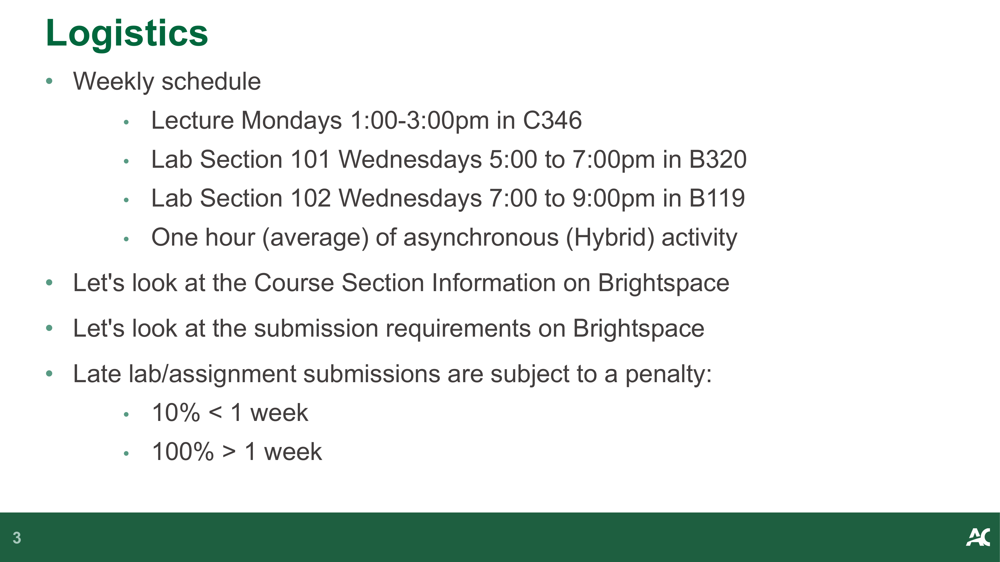

- Weekly schedule — 每周时间表
  - Lecture Mondays 1:00-3:00pm in C346 — 讲座：周一 1:00-3:00pm，教室 C346
  - Lab Section 101 Wednesdays 5:00 to 7:00pm in B320 — 实验 101 班：周三 5:00-7:00pm，教室 B320
  - Lab Section 102 Wednesdays 7:00 to 9:00pm in B119 — 实验 102 班：周三 7:00-9:00pm，教室 B119
  - One hour (average) of asynchronous (Hybrid) activity — 平均每周 1 小时异步（混合式）学习活动
- Late lab/assignment submissions are subject to a penalty: — 迟交实验/作业将被扣分：
  - 10% < 1 week — 迟交不超过 1 周扣 10%
  - 100% > 1 week — 迟交超过 1 周扣 100%

> **📝 Notes:**
>
> _(To be added)_

---

## 2. 学术诚信与成功建议 (Academic Integrity & Tips for Success)

### 2.1 作业期望 (Expectations for Assignments)

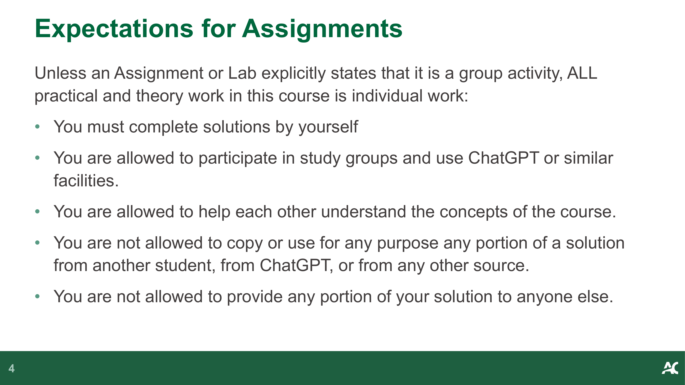

- Unless an Assignment or Lab explicitly states that it is a group activity, ALL practical and theory work in this course is individual work: — 除非作业或实验明确说明是小组活动，否则本课程所有实践和理论工作都是个人作业：
  - You must complete solutions by yourself — 你必须独立完成解答
  - You are allowed to participate in study groups and use ChatGPT or similar facilities — 允许参加学习小组并使用 ChatGPT 等工具
  - You are allowed to help each other understand the concepts of the course — 允许互相帮助理解课程概念
  - You are not allowed to copy or use for any purpose any portion of a solution from another student, from ChatGPT, or from any other source — 不允许抄袭或使用来自其他学生、ChatGPT 或任何其他来源的解答
  - You are not allowed to provide any portion of your solution to anyone else — 不允许将你的解答提供给其他人

### 2.2 成功建议 (Tips for Success)

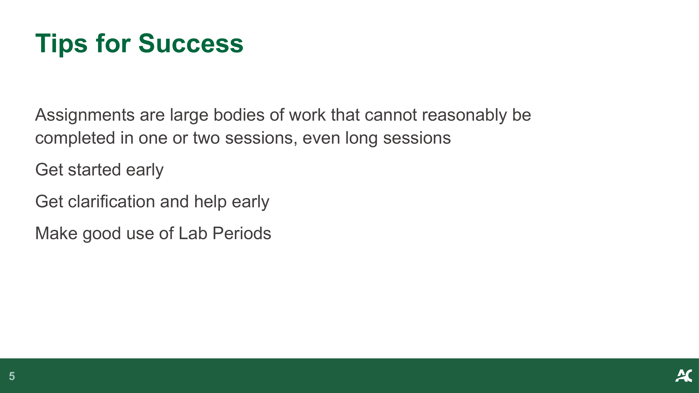

- Assignments are large bodies of work that cannot reasonably be completed in one or two sessions, even long sessions — 作业工作量很大，即使是长时间学习也无法在一两次内完成
- Get started early — 尽早开始
- Get clarification and help early — 尽早寻求帮助和澄清
- Make good use of Lab Periods — 充分利用实验课时间

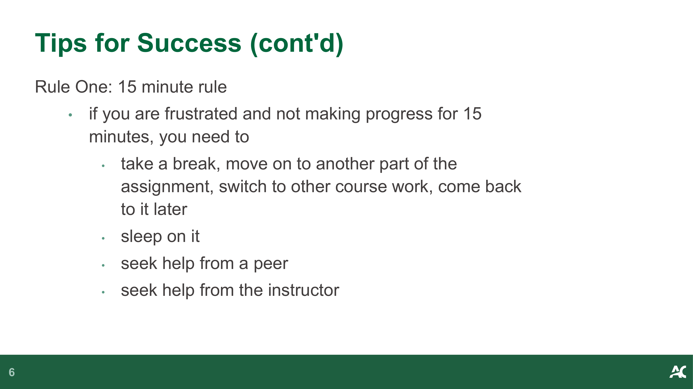

- **Rule One: 15 minute rule** — if you are frustrated and not making progress for 15 minutes, you need to: — **规则一：15 分钟规则** — 如果你受挫且 15 分钟内没有进展，你需要：
  - take a break, move on to another part of the assignment, switch to other course work, come back to it later — 休息一下，转做作业的其他部分，切换到其他课程，稍后再回来
  - sleep on it — 睡一觉再想
  - seek help from a peer — 向同学寻求帮助
  - seek help from the instructor — 向教授寻求帮助

- **Rule Two: Don't leave it to the last few days before the due date** — **规则二：不要拖到截止日期前几天才做**
  - Rule One is not feasible without Rule Two — 没有规则二，规则一就不可行
  - Get started early, read through and understand the focus of the assignment and the tasks, as soon as you can — 尽早开始，尽快通读并理解作业的重点和任务
  - Keep up with the course pace (every week, you're expected to put in about 5 hours of time in addition to 5 hours of Hybrid Activities, Lectures, and Labs) — 跟上课程进度（每周除了 5 小时的混合活动、讲座和实验外，预计还需投入约 5 小时）

### 2.3 过度帮助与抄袭 (Excessive Help & Plagiarism)

- Beware of receiving excessive help — 警惕接受过度帮助
- Do it yourself (you need to learn how to): — 自己动手（你需要学会如何）：
  - read EVERY word of the Lab and Assignment Documents — 阅读实验和作业文档的每一个字
  - consult course materials and resources — 查阅课程资料和资源
  - apply what you read and what you see in videos — 应用你阅读和观看视频中学到的内容
  - solve apparent inconsistencies/problems — 解决明显的不一致/问题

- Like excessive help, shortcuts are bad — 与过度帮助一样，走捷径也是不好的
- If you cannot explain your own work in a demonstration, you risk getting a zero on the lab or assignment — 如果你在演示中无法解释自己的作品，你将面临实验或作业得零分的风险

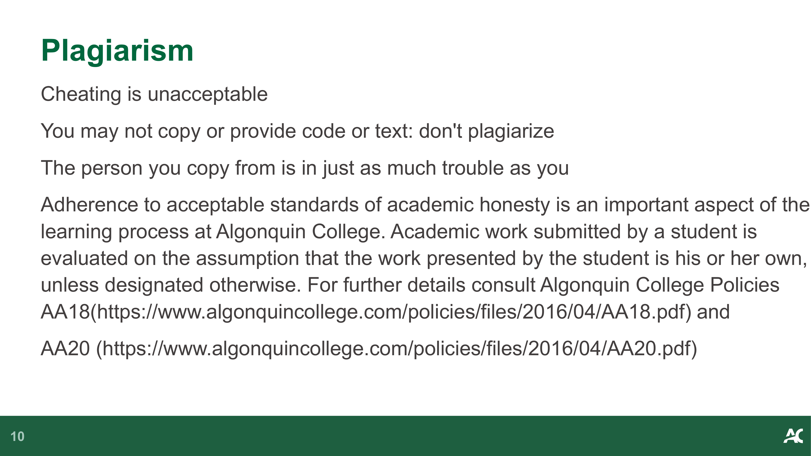

- Cheating is unacceptable. You may not copy or provide code or text: don't plagiarize — 作弊不可接受。你不得抄袭或提供代码或文字：不要剽窃
- The person you copy from is in just as much trouble as you — 被抄袭者和抄袭者一样会受到处罚

> **📝 Notes:**
>
> _(To be added)_

---

## 3. 课程概览与学习目标 (Course Overview & Learning Outcomes)

- **Introduction to RL** — **强化学习导论**
- **Foundational Principles of RL** — **RL 基础原理**
  - Mathematical definitions — 数学定义
  - RL Algorithms — RL 算法
- **Solving RL problems** — **求解 RL 问题**
  - Game-based, maze based, etc — 基于游戏、基于迷宫等
  - Robotics — 机器人技术
  - Create — 创建
  - OpenAI Gymnasium/Gym, Gazebo — OpenAI Gymnasium/Gym, Gazebo 框架

**Week 1 Outcomes:** — **第 1 周学习成果：**
1. Agent — 智能体
2. Environment — 环境
3. Reward — 奖励
4. Policy — 策略
5. Value Function — 价值函数
6. Model — 模型

> **📝 Notes:**
>
> _(To be added)_

---

## 4. 什么是强化学习 (What is Reinforcement Learning)

### 4.1 RL 在机器学习中的位置 (RL in Machine Learning)

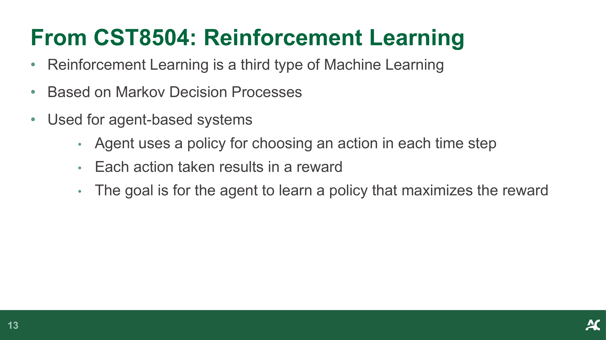

- Reinforcement Learning is a **third type of Machine Learning** — 强化学习是**机器学习的第三种类型**
- Based on **Markov Decision Processes** — 基于**马尔可夫决策过程**
- Used for **agent-based systems** — 用于**基于智能体的系统**
  - Agent uses a **policy** for choosing an action in each time step — 智能体使用**策略**在每个时间步选择动作
  - Each action taken results in a **reward** — 每个采取的动作会产生一个**奖励**
  - The goal is for the agent to learn a policy that **maximizes the reward** — 目标是让智能体学习一个能**最大化奖励**的策略

### 4.2 RL 领域名人 (Who's Who of Reinforcement Learning)

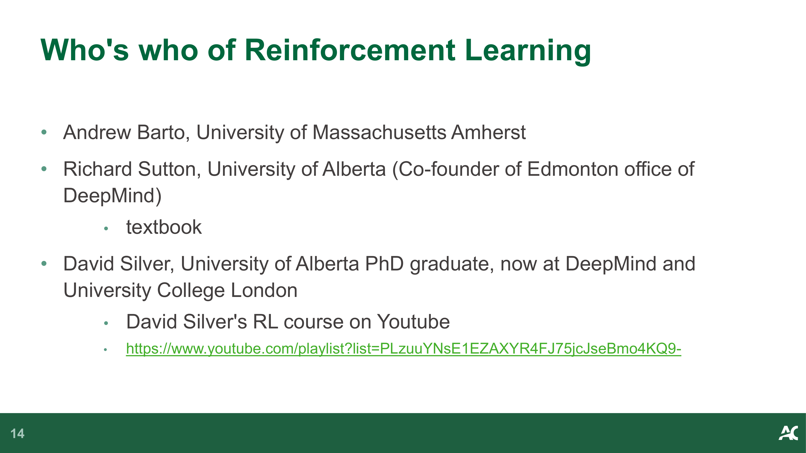

- **Andrew Barto**, University of Massachusetts Amherst — 马萨诸塞大学阿默斯特分校
- **Richard Sutton**, University of Alberta (Co-founder of Edmonton office of DeepMind) — textbook — 阿尔伯塔大学（DeepMind 埃德蒙顿办公室联合创始人）— 教科书作者
- **David Silver**, University of Alberta PhD graduate, now at DeepMind and University College London — 阿尔伯塔大学博士毕业，现任职于 DeepMind 和伦敦大学学院
  - David Silver's RL course on Youtube: https://www.youtube.com/playlist?list=PLzuuYNsE1EZAXYR4FJ75jcJseBmo4KQ9- — David Silver 的 RL 课程（YouTube）

### 4.3 RL 的广泛应用 (How Broad and Applicable is RL)

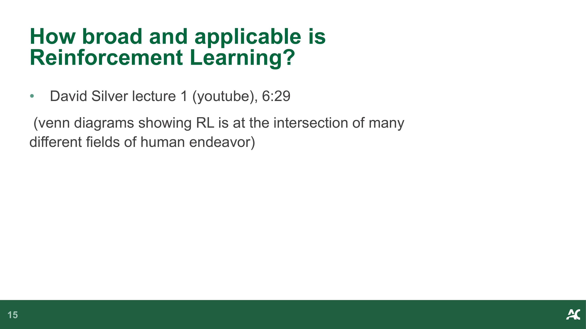

- David Silver lecture 1 (youtube), 6:29 — David Silver 第 1 讲（YouTube），6:29
- (venn diagrams showing RL is at the intersection of many different fields of human endeavor) — （韦恩图展示 RL 处于人类多个研究领域的交叉点）

- How does reinforcement learning compare to other machine learning (supervised, and unsupervised)? — 强化学习与其他机器学习（监督学习和无监督学习）相比如何？
- David Silver lecture 1 - 9:35 — David Silver 第 1 讲 - 9:35

### 4.4 RL 应用实例 (RL Examples)

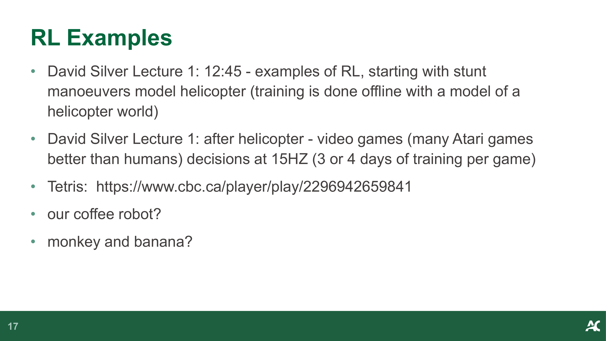

- David Silver Lecture 1: 12:45 - examples of RL, starting with stunt manoeuvers model helicopter (training is done offline with a model of a helicopter world) — David Silver 第 1 讲：12:45 - RL 实例，从特技飞行模型直升机开始（训练在直升机世界模型中离线完成）
- David Silver Lecture 1: after helicopter - video games (many Atari games better than humans) decisions at 15HZ (3 or 4 days of training per game) — David Silver 第 1 讲：直升机之后 - 电子游戏（在许多 Atari 游戏中超越人类）以 15Hz 做决策（每个游戏训练 3-4 天）
- Tetris: https://www.cbc.ca/player/play/2296942659841 — 俄罗斯方块
- our coffee robot? — 我们的咖啡机器人？
- monkey and banana? — 猴子和香蕉问题？

- **AlphaGo movie** — Go board game — **AlphaGo 纪录片** — 围棋
  - begins with Demis Hassabis (co-founder of DeepMind) — 以 Demis Hassabis（DeepMind 联合创始人）开场
  - After Fan Hui, we see David Silver — 在范廷钰之后，出现 David Silver
  - At 30:00 the start of the first match — 30:00 处开始第一场比赛

> **📝 Notes:**
>
> _(To be added)_

---

## 5. 奖励 (Reward)

- Reward is a **scalar feedback signal** $R_t$ — 奖励是一个**标量反馈信号** $R_t$
- $R_t$ represents how well the agent is doing at Step $t$ — $R_t$ 表示智能体在时间步 $t$ 的表现如何
- reinforcement learning problems are set up such that goal is to **maximize cumulative reward** — 强化学习问题的目标是**最大化累积奖励**
- **Reward Hypothesis:** All goals can be described by the maximization of expected cumulative reward — **奖励假说：** 所有目标都可以用期望累积奖励的最大化来描述

- reward can be received along the way, or it might come all at the end — 奖励可以在过程中逐步获得，也可以全部在最后获得
- if shorter time is better, then reward per step can be negative, which favors shorter episodes — 如果时间越短越好，则每步奖励可以设为负值，这有利于更短的回合
- to maximize reward overall, agent may need to accept small or negative rewards short-term to maximize the total reward — 为了最大化总体奖励，智能体可能需要接受短期的小额或负奖励来最大化总奖励

> **📝 Notes:**
>
> _(To be added)_

---

## 6. Agent-Environment 交互 (Anatomy of an RL Problem)

### 6.1 Agent 与 Environment 的关系 (Agent-Environment Interaction)

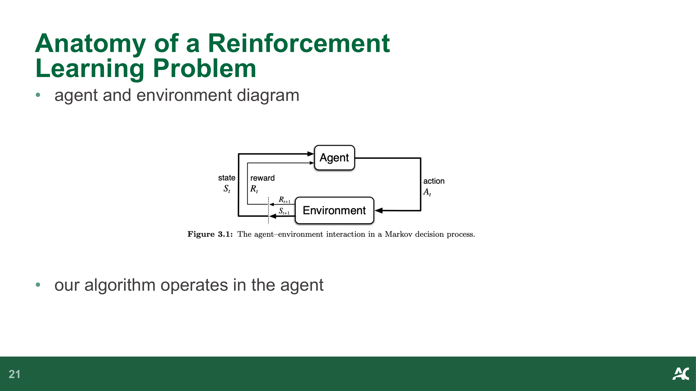

- agent and environment diagram — 智能体与环境的交互图
- our algorithm operates in the agent — 我们的算法运行在智能体中

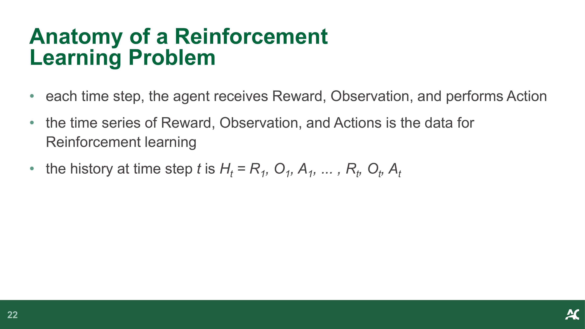

- each time step, the agent receives **Reward**, **Observation**, and performs **Action** — 在每个时间步，智能体接收**奖励**、**观测**，并执行**动作**
- the time series of Reward, Observation, and Actions is the data for Reinforcement learning — 奖励、观测和动作的时间序列就是强化学习的数据
- the history at time step $t$ is $H_t = R_1, O_1, A_1, ..., R_t, O_t, A_t$ — 时间步 $t$ 的历史为 $H_t = R_1, O_1, A_1, ..., R_t, O_t, A_t$

### 6.2 历史与状态 (History and State)

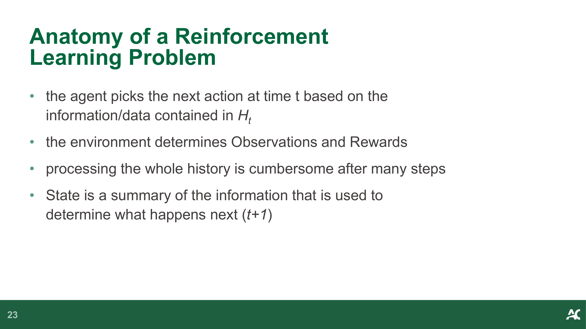

- the agent picks the next action at time $t$ based on the information/data contained in $H_t$ — 智能体根据 $H_t$ 中包含的信息/数据在时间 $t$ 选择下一个动作
- the environment determines Observations and Rewards — 环境决定观测和奖励
- processing the whole history is cumbersome after many steps — 经过许多步之后，处理完整历史变得很繁琐
- **State** is a summary of the information that is used to determine what happens next ($t+1$) — **状态**是用于决定下一步（$t+1$）会发生什么的信息摘要

- $S_t = f(H_t)$ — 状态是历史的函数
- **environment state** ($S_t^e$) is not usually directly accessible by the agent; whatever information is used to pick the next observation and reward — **环境状态**（$S_t^e$）通常智能体无法直接访问；它包含用于生成下一个观测和奖励的所有信息
- **agent state** ($S_t^a$) is directly accessible to the agent, the agent keeps track of this, and it's used (somehow) to select the next action — **智能体状态**（$S_t^a$）智能体可以直接访问，智能体维护此状态，并以某种方式用于选择下一个动作
- The programmer is responsible for the (somehow). The programmer decides what the function is: — 程序员负责决定这个"某种方式"。程序员决定函数是什么：
  - $S_t^a = f(H_t)$ for some function $f$ of the programmer's choosing — $S_t^a = f(H_t)$，其中 $f$ 是程序员选择的某个函数

> **📝 Notes:**
>
> _(To be added)_

---

## 7. 马尔可夫状态 (Markov State)

- Important question in RL is whether the state satisfies the **Markov Property**, in other words, is it a **Markov State** — RL 中的一个重要问题是状态是否满足**马尔可夫性质**，换句话说，它是否是一个**马尔可夫状态**
- **Definition of a Markov State:** The probability of each possible value for $S_t$ and $R_t$ depends only on the immediately preceding state and action, $S_{t-1}$ and $A_{t-1}$ — **马尔可夫状态的定义：** $S_t$ 和 $R_t$ 各可能取值的概率仅取决于紧接着的前一个状态和动作 $S_{t-1}$ 和 $A_{t-1}$
- **Intuition:** "The future is independent of the past given the present" — **直觉理解：**"给定当前状态，未来与过去无关"
- Examples: — 示例：
  - linear motion of a particle in classical mechanics — 经典力学中粒子的直线运动
  - does the position constitute a Markov state? — 仅位置是否构成马尔可夫状态？
  - does the position and velocity constitute a Markov state? — 位置和速度是否构成马尔可夫状态？

- helicopter example (position, velocity, angular velocity, angular position, wind velocity) — 直升机示例（位置、速度、角速度、角位置、风速）
- $S_t^e$ environment state is Markov — $S_t^e$ 环境状态是马尔可夫的
- $H_t$ is Markov, $S_t = f(H_t) = H_t$ — $H_t$ 是马尔可夫的，$S_t = f(H_t) = H_t$
- It's always possible to come up with a Markov state, but we want to identify the Markov states that are more useful for us, efficient, less redundancy, etc. — 总是可以构造一个马尔可夫状态，但我们希望找到对我们更有用、更高效、冗余更少的马尔可夫状态

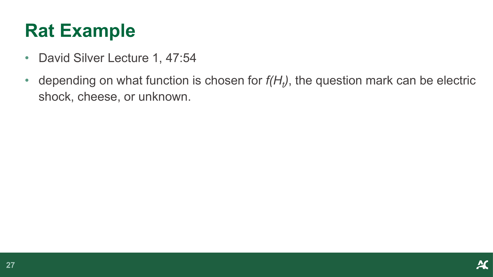

- **Rat Example** — David Silver Lecture 1, 47:54 — **老鼠实验** — David Silver 第 1 讲，47:54
- depending on what function is chosen for $f(H_t)$, the question mark can be electric shock, cheese, or unknown — 根据为 $f(H_t)$ 选择的函数不同，问号可以是电击、奶酪或未知

> **📝 Notes:**
>
> _(To be added)_

---

## 8. RL Agent 的组成 (Components of RL Agents)

### 8.1 概述 (Overview)

- RL Agents may include one or more of the following: — RL 智能体可能包含以下一个或多个组件：
  - **Policy:** function that maps state to action — **策略：** 将状态映射到动作的函数
  - **Value Function:** represents the value (how good is it?) of each state or action — **价值函数：** 表示每个状态或动作的价值（有多好？）
  - **Model:** agent's internal representation of the environment, as opposed to the environment itself — **模型：** 智能体对环境的内部表征，区别于环境本身

### 8.2 策略 (Policy)

- **Function:** map from state to action — **函数：** 从状态到动作的映射
- **Deterministic policy:** one where there is only one choice, one action — **确定性策略：** 只有一个选择、一个动作
  - $a = \pi(S)$
- our goal will be to learn a function $\pi$, from experience, such that we maximize reward — 我们的目标是从经验中学习一个函数 $\pi$，使得奖励最大化
- **Stochastic policy:** — **随机性策略：**
  - $\pi(a|s) = P[A=a|S=s]$
  - This function gives the probability of one or more actions, given State $s$ (non-deterministic) — 该函数给出在给定状态 $s$ 下各个动作的概率（非确定性的）
  - Example: in certain state, $a_1$ chosen 20% of the time, $a_2$ chosen 80% of the time — 示例：在某个状态下，$a_1$ 被选择 20% 的时间，$a_2$ 被选择 80% 的时间

### 8.3 价值函数 (Value Function)

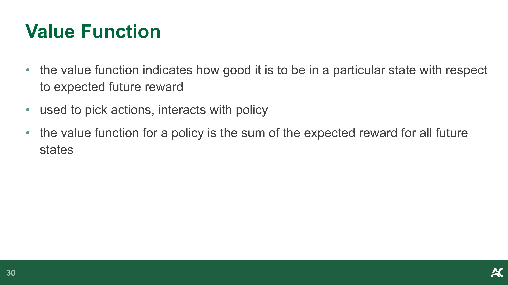

- the value function indicates how good it is to be in a particular state with respect to **expected future reward** — 价值函数表示处于某个特定状态相对于**期望未来奖励**有多好
- used to pick actions, interacts with policy — 用于选择动作，与策略交互
- the value function for a policy is the **sum of the expected reward for all future states** — 某个策略的价值函数是**未来所有状态的期望奖励之和**

- in the case of Atari games, as states are visited, value goes up and down, because if something good is about to happen, value function is elevated — 在 Atari 游戏中，随着状态被访问，价值会上下波动，因为如果好事即将发生，价值函数会升高
  - after something good happens, that reward is behind you, and not included in the future reward — 好事发生之后，该奖励已经过去，不再包含在未来奖励中
  - in other words the value function does not include the sum of rewards received so far, just future reward, which oscillates — 换句话说，价值函数不包括迄今已收到的奖励之和，只看未来奖励，因此会波动
  - David Silver Lecture 1: 1:02:15 — David Silver 第 1 讲：1:02:15

### 8.4 模型 (Model)

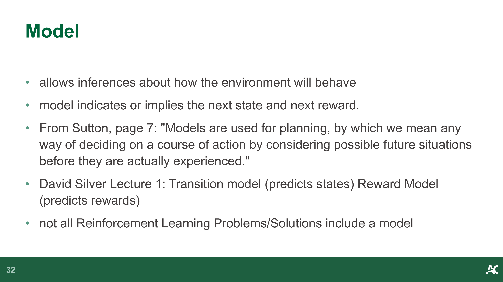

- allows inferences about how the environment will behave — 允许推断环境将如何表现
- model indicates or implies the next state and next reward — 模型指示或暗示下一个状态和下一个奖励
- From Sutton, page 7: "Models are used for **planning**, by which we mean any way of deciding on a course of action by considering possible future situations before they are actually experienced." — 引自 Sutton 第 7 页："模型用于**规划**，即在实际经历之前，通过考虑可能的未来情况来决定行动方案的任何方法。"
- David Silver Lecture 1: **Transition model** (predicts states) **Reward Model** (predicts rewards) — David Silver 第 1 讲：**转移模型**（预测状态）**奖励模型**（预测奖励）
- not all Reinforcement Learning Problems/Solutions include a model — 并非所有强化学习问题/解决方案都包含模型

### 8.5 迷宫示例 (Maze Example)

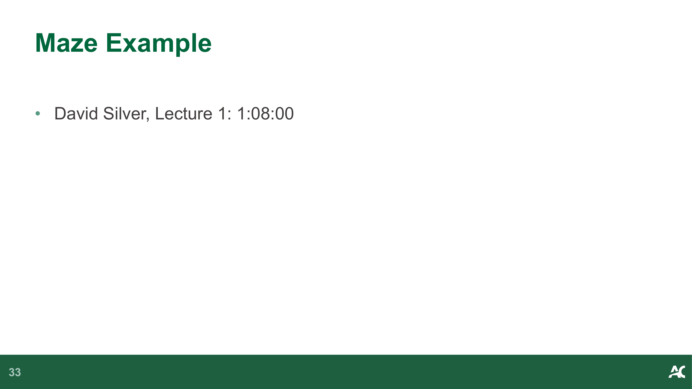

- David Silver, Lecture 1: 1:08:00 — David Silver，第 1 讲：1:08:00

> **📝 Notes:**
>
> _(To be added)_

---

## 9. RL Agent 分类 (Taxonomy of RL Agents)

- **Value Based** — **基于价值的方法**
  - no policy (choose actions based on Value function) — 没有显式策略（根据价值函数选择动作）
  - value function — 价值函数
- **Policy Based** — **基于策略的方法**
  - Policy — 策略
  - no value function — 没有价值函数

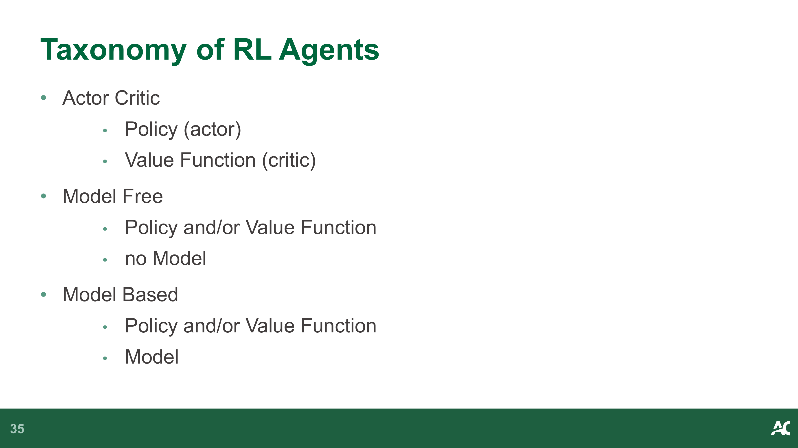

- **Actor Critic** — **演员-评论家方法**
  - Policy (actor) — 策略（演员）
  - Value Function (critic) — 价值函数（评论家）
- **Model Free** — **无模型方法**
  - Policy and/or Value Function — 策略和/或价值函数
  - no Model — 没有模型
- **Model Based** — **基于模型的方法**
  - Policy and/or Value Function — 策略和/或价值函数
  - Model — 模型

> **📝 Notes:**
>
> _(To be added)_

---

## 10. 关键子问题 (Key Subproblems)

- **Learning vs Planning** — David Silver Lecture 1: 1:16:10 — **学习 vs 规划** — David Silver 第 1 讲：1:16:10
  - reinforcement learning — 强化学习（从真实经验中学习）
  - planning — 规划（从模型中模拟学习）
- **Exploitation vs Exploration** — **利用 vs 探索**
  - Example: Always go to a good restaurant (exploit the good restaurant) vs Randomly choose a new restaurant (exploration, might be better, might be worse. This is our chance to find better, but it's a risk) — 示例：总是去一家好餐厅（利用已知的好餐厅）vs 随机选择一家新餐厅（探索，可能更好也可能更差。这是发现更好选择的机会，但也有风险）
- **Prediction vs Control** — **预测 vs 控制**
  - prediction (evaluate future reward) vs control (optimize policy) — 预测（评估未来奖励）vs 控制（优化策略）

> **📝 Notes:**
>
> _(To be added)_

---

## 11. 学习检查 (Check Your Learning)

- What is the Markov Property? — 什么是马尔可夫性质？
- What are the possible components in an RL agent? — RL 智能体有哪些可能的组件？
- What is a policy in the context of RL? — 在 RL 的语境中，什么是策略？
- What is a value function in the context of RL? — 在 RL 的语境中，什么是价值函数？
- What is a model in the context of RL? — 在 RL 的语境中，什么是模型？

> **📝 Notes:**
>
> _(To be added)_
