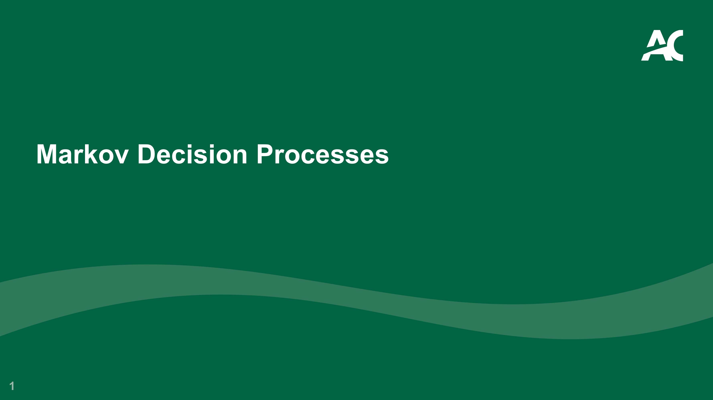
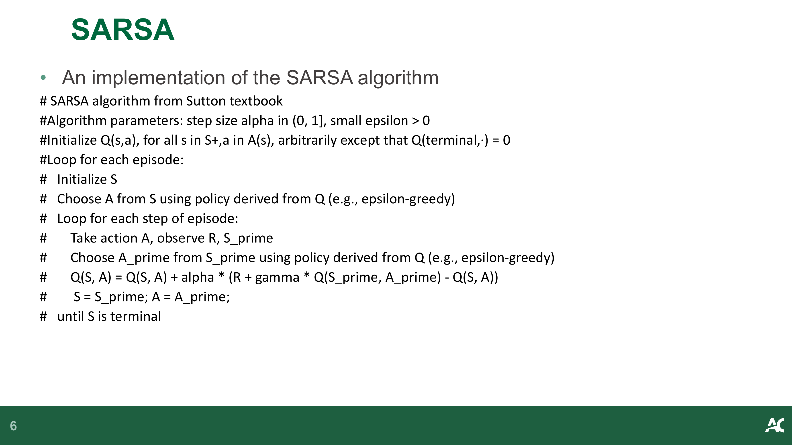
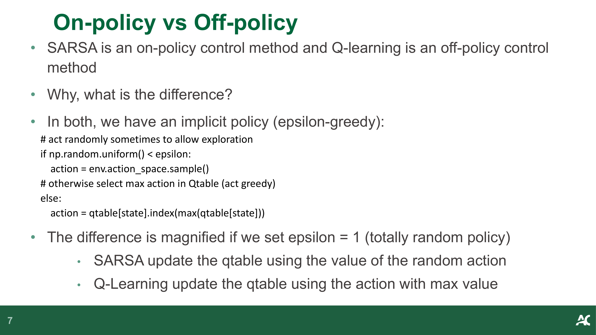
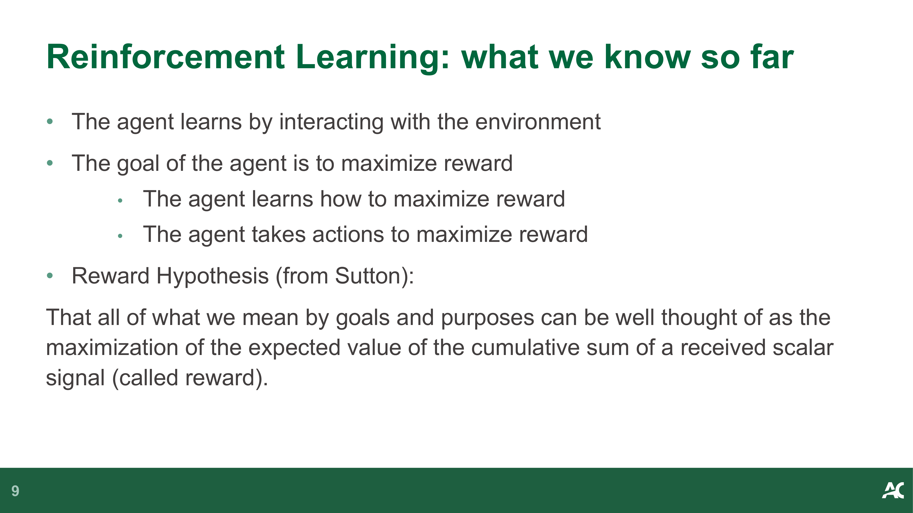
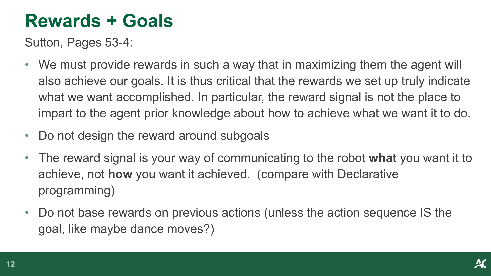
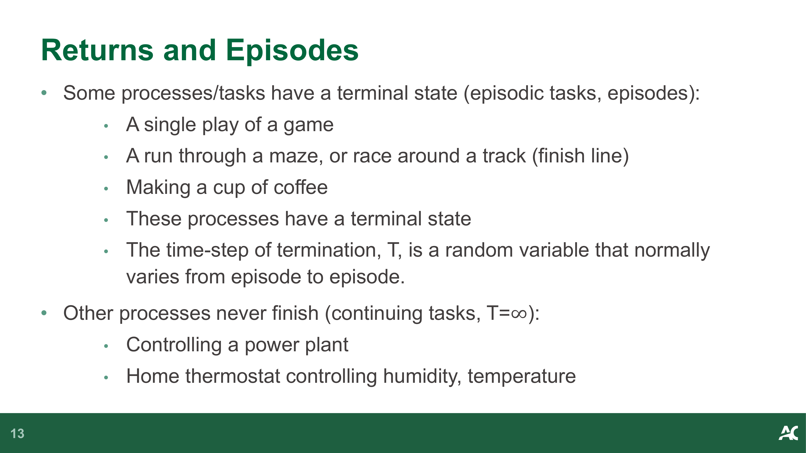
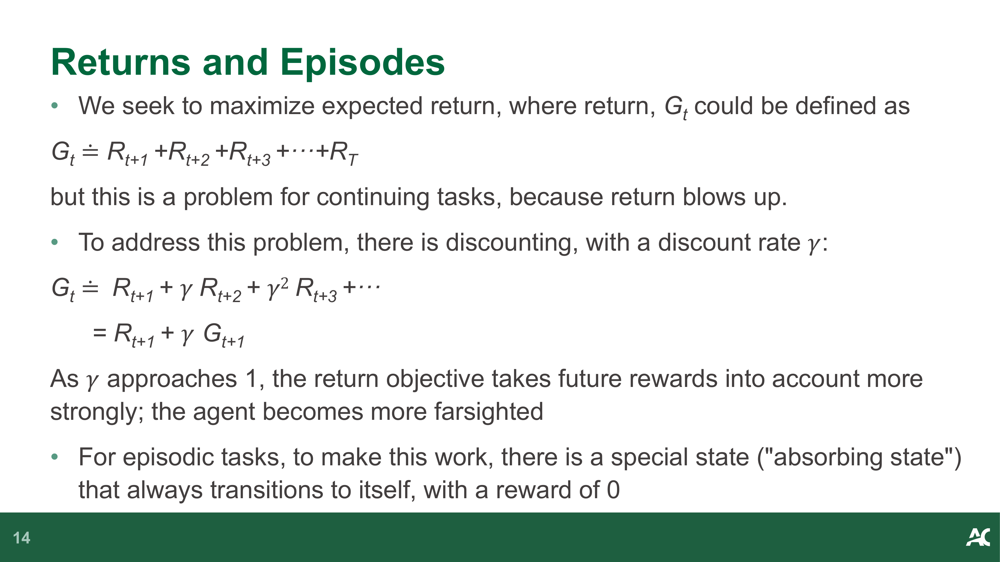
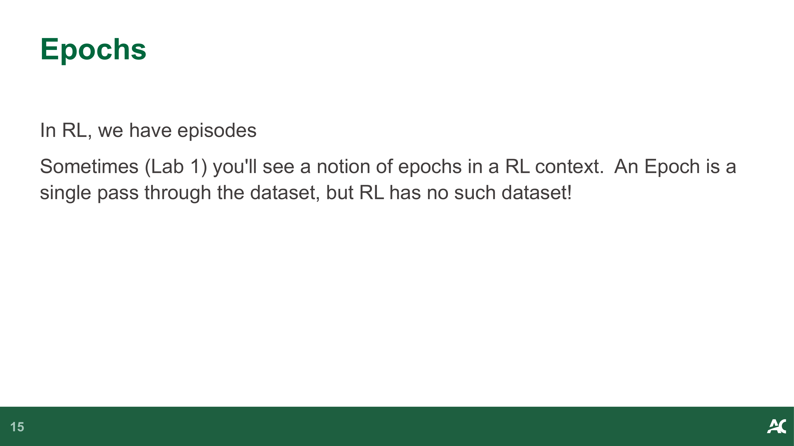
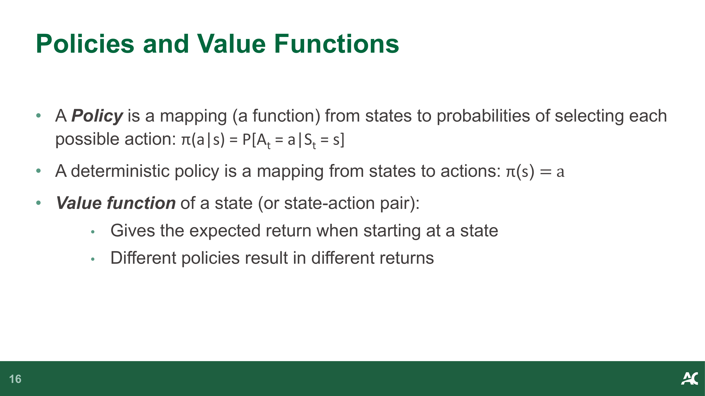

# Week 2: 马尔可夫决策过程 (Markov Decision Processes)

> Source: `CST8509_02_MDP.pdf`
> Total slides: 18
> Instructor: Todd Kelley (Lectures) / Ali Mohamed Ali (Labs) | Winter 2026

---

## 1. 课程资源 (Course Resources)



- Markov Decision Processes — 马尔可夫决策过程


- **Resource: David Silver's Lecture** — **参考资源：David Silver 的讲座**
  - https://www.youtube.com/watch?v=lfHX2hHRMVQ&list=PLzuuYNsE1EZAXYR4FJ75jcJseBmo4KQ9-&index=2
  - Markov Processes: 6:25 (chains of Markov states) — 马尔可夫过程：6:25（马尔可夫状态链）
  - Markov Reward Processes: 13:00 (chains of Markov states with reward) — 马尔可夫奖励过程：13:00（带奖励的马尔可夫状态链）
  - Bellman Equation: 29:10 — 贝尔曼方程：29:10
  - Markov Decision Processes: 43:00 (add actions) — 马尔可夫决策过程：43:00（加入动作）
  - Policy: 46:25 — 策略：46:25


- **Where we are in the Textbook** — **教科书进度**
- Let's look at the textbook Table of Contents — 让我们看看教科书的目录


- **David Silver Q-learning** — **David Silver Q-learning 讲解**
  - https://www.youtube.com/watch?v=0g4j2k_Ggc4&list=PLzuuYNsE1EZAXYR4FJ75jcJseBmo4KQ9-&index=5
  - Q-learning: 1:29 — Q-learning：1:29

> **📝 Notes:**
>
> _(To be added)_

---

## 2. Q-Learning 深入分析 (Q-Learning Deep Dive)


- **Question:** Why does our CliffWalking Example converge on the shortest path? — **问题：** 为什么我们的 CliffWalking 示例会收敛到最短路径？
- In grid-based worlds, there is a similarity in structure between the Q-table and the grid world itself (we can animate the learning of the Q function in grid-based worlds) — 在基于网格的世界中，Q 表的结构与网格世界本身有相似性（我们可以在网格世界中动画展示 Q 函数的学习过程）
- **Discussion:** — **讨论：**
  - How does the reward (besides cliff) affect the eventual path? — 奖励（除悬崖外）如何影响最终路径？
    - Negative reward? 0 reward? Positive reward? — 负奖励？零奖励？正奖励？
  - How does the initialization of the Q-table affect convergence? — Q 表的初始化如何影响收敛？
    - Randomized? Initialize to zero? — 随机初始化？初始化为零？
  - Do we set the action-values of the terminal state to zero? — 我们是否将终止状态的动作价值设为零？

> **📝 Notes:**
>
> _(To be added)_

---

## 3. SARSA 算法 (SARSA Algorithm)



- An implementation of the SARSA algorithm — SARSA 算法的一种实现

```
# SARSA algorithm from Sutton textbook — SARSA 算法（来自 Sutton 教科书）
# Algorithm parameters: step size alpha in (0, 1], small epsilon > 0
#   算法参数：步长 alpha ∈ (0, 1]，小的 epsilon > 0
# Initialize Q(s,a), for all s in S+, a in A(s), arbitrarily except Q(terminal, ·) = 0
#   初始化 Q(s,a)，对所有 s ∈ S+, a ∈ A(s)，任意初始化，但 Q(终止状态, ·) = 0
# Loop for each episode:       — 对每个回合循环：
#   Initialize S               — 初始化状态 S
#   Choose A from S using policy derived from Q (e.g., epsilon-greedy)
#     从 S 中使用由 Q 导出的策略选择 A（例如 ε-贪婪）
#   Loop for each step of episode:  — 对回合中的每一步循环：
#     Take action A, observe R, S'  — 执行动作 A，观察 R, S'
#     Choose A' from S' using policy derived from Q (e.g., epsilon-greedy)
#       从 S' 中使用由 Q 导出的策略选择 A'
#     Q(S, A) = Q(S, A) + alpha * (R + gamma * Q(S', A') - Q(S, A))
#     S = S'; A = A';
#   until S is terminal           — 直到 S 是终止状态
```

> **📝 Notes:**
>
> _(To be added)_

---

## 4. On-policy vs Off-policy



- SARSA is an **on-policy** control method and Q-learning is an **off-policy** control method — SARSA 是**同策略（on-policy）**控制方法，Q-learning 是**异策略（off-policy）**控制方法
- Why, what is the difference? — 为什么？区别是什么？
- In both, we have an implicit policy (epsilon-greedy): — 两者都有一个隐含策略（ε-贪婪）：

```python
# act randomly sometimes to allow exploration — 有时随机行动以允许探索
if np.random.uniform() < epsilon:
    action = env.action_space.sample()
# otherwise select max action in Qtable (act greedy) — 否则选择 Q 表中的最大动作（贪婪行动）
else:
    action = qtable[state].index(max(qtable[state]))
```

- The difference is magnified if we set epsilon = 1 (totally random policy) — 如果设 epsilon = 1（完全随机策略），差异会被放大
  - **SARSA:** update the Q-table using the value of the random action — **SARSA：** 使用随机动作的值更新 Q 表
  - **Q-Learning:** update the Q-table using the action with max value — **Q-Learning：** 使用最大值动作更新 Q 表

> **📝 Notes:**
>
> _(To be added)_

---

## 5. RL 回顾：已知内容 (RL Review: What We Know So Far)


- There is an agent and an environment — 存在一个智能体和一个环境
- Repeatedly: — 重复执行：
  - The agent performs an action which affects the environment — 智能体执行一个影响环境的动作
  - The environment enters a resulting state — 环境进入一个结果状态
  - The agent receives the new state and a scalar reward — 智能体接收新的状态和标量奖励



- The agent learns by interacting with the environment — 智能体通过与环境交互来学习
- The goal of the agent is to maximize reward — 智能体的目标是最大化奖励
  - The agent learns how to maximize reward — 智能体学习如何最大化奖励
  - The agent takes actions to maximize reward — 智能体采取动作以最大化奖励
- **Reward Hypothesis** (from Sutton): — **奖励假说**（来自 Sutton）：
  - That all of what we mean by goals and purposes can be well thought of as the maximization of the expected value of the cumulative sum of a received scalar signal (called reward). — 我们所说的所有目标和目的都可以很好地被视为所接收的标量信号（称为奖励）的累积和的期望值的最大化。

> **📝 Notes:**
>
> _(To be added)_

---

## 6. RL 程序员方法论 (RL: High-level Programmer's Methodology)


- When applying RL to a problem in a domain, the programmer needs to: — 将 RL 应用于某个领域的问题时，程序员需要：
- **Identify the problem** to be solved as a subset of the domain — **识别问题**，将其确定为领域的一个子集
  - Example domain: AlphaGo playing Go — 示例领域：AlphaGo 下围棋
  - Was the physical act of placing the stones considered part of the problem? No, but it could have been. DeepMind did not identify that aspect of the domain as part of the problem to be solved. — 放置棋子的物理动作是否被视为问题的一部分？不是，但本可以是。DeepMind 没有将领域的这个方面确定为要解决的问题的一部分。
- **Given the problem, determine:** — **给定问题后，确定：**
  - What is the environment and what are the states? (simulated or actual) — 什么是环境，什么是状态？（模拟的还是实际的）
  - What is the agent and what are the actions? (simulated or actual) — 什么是智能体，什么是动作？（模拟的还是实际的）
  - What is the reward function? (Implement it) — 什么是奖励函数？（实现它）
  - Big one: How is the agent going to learn to get better at maximizing reward? — 重要问题：智能体将如何学习以更好地最大化奖励？

> **📝 Notes:**
>
> _(To be added)_

---

## 7. Agent–Environment 边界 (Agent–Environment Distinction)


- Read Sutton, last paragraph of Page 50, and Page 51 — 阅读 Sutton 教科书第 50 页最后一段和第 51 页
- Examples of what you will read: — 你将读到的内容示例：
  - The MDP framework is abstract and flexible and can be applied to many different problems in many different ways. — MDP 框架是抽象且灵活的，可以以多种不同方式应用于许多不同的问题。
  - In particular, the boundary between agent and environment is typically not the same as the physical boundary of a robot's or animal's body. — 特别是，智能体和环境之间的边界通常与机器人或动物身体的物理边界不同。
  - The general rule we follow is that anything that cannot be changed arbitrarily by the agent is considered to be outside of it and thus part of its environment. — 我们遵循的一般规则是：智能体不能任意改变的任何事物都被认为是在智能体之外的，因此是其环境的一部分。
  - The agent–environment boundary can be located at different places for different purposes. — 出于不同目的，智能体-环境边界可以设置在不同位置。
  - [RL] proposes that whatever the details of the sensory, memory, and control apparatus, any problem of learning goal-directed behavior can be reduced to three signals: actions, states, and rewards. — [RL] 提出，无论感知、记忆和控制装置的细节如何，任何学习目标导向行为的问题都可以简化为三个信号：动作、状态和奖励。
  - Such representational choices are at present more art than science. — 这些表征选择目前更多是艺术而非科学。

> **📝 Notes:**
>
> _(To be added)_

---

## 8. 奖励设计 (Rewards + Goals)



- Sutton, Pages 53-4: — 引自 Sutton 教科书第 53-54 页：
- We must provide rewards in such a way that in maximizing them the agent will also achieve our goals. It is thus critical that the rewards we set up truly indicate what we want accomplished. — 我们必须以这样的方式提供奖励：智能体在最大化奖励的同时也能实现我们的目标。因此，我们设置的奖励必须真正表明我们想要完成的事情。
- In particular, the reward signal is not the place to impart to the agent prior knowledge about how to achieve what we want it to do. — 特别是，奖励信号不是向智能体传授关于如何实现我们期望的先验知识的地方。
- **Do not design the reward around subgoals** — **不要围绕子目标设计奖励**
- The reward signal is your way of communicating to the robot what you want it to achieve, not how you want it achieved. (compare with Declarative programming) — 奖励信号是你向机器人传达你想让它实现什么的方式，而不是你想让它如何实现。（类比声明式编程）
- Do not base rewards on previous actions (unless the action sequence IS the goal, like maybe dance moves?) — 不要基于先前的动作来设计奖励（除非动作序列本身就是目标，比如舞蹈动作？）

> **📝 Notes:**
>
> _(To be added)_

---

## 9. 回报与回合 (Returns and Episodes)



- Some processes/tasks have a terminal state (**episodic tasks**, episodes): — 有些过程/任务有终止状态（**回合制任务**，回合）：
  - A single play of a game — 一局游戏
  - A run through a maze, or race around a track (finish line) — 走迷宫一次，或绕赛道跑一圈（终点线）
  - Making a cup of coffee — 泡一杯咖啡
  - These processes have a terminal state — 这些过程有终止状态
  - The time-step of termination, $T$, is a random variable that normally varies from episode to episode. — 终止时的时间步 $T$ 是一个随机变量，通常随回合不同而变化。
- Other processes never finish (**continuing tasks**, $T=\infty$): — 其他过程永不结束（**持续任务**，$T=\infty$）：
  - Controlling a power plant — 控制发电厂
  - Home thermostat controlling humidity, temperature — 家用恒温器控制湿度、温度



- We seek to maximize expected return, where return $G_t$ could be defined as: — 我们寻求最大化期望回报，其中回报 $G_t$ 可以定义为：

$$G_t \doteq R_{t+1} + R_{t+2} + R_{t+3} + \cdots + R_T$$

  but this is a problem for continuing tasks, because return blows up. — 但对于持续任务来说这是一个问题，因为回报会发散到无穷。

- To address this problem, there is **discounting**, with a discount rate $\gamma$: — 为解决此问题，引入**折扣**，使用折扣率 $\gamma$：

$$G_t \doteq R_{t+1} + \gamma R_{t+2} + \gamma^2 R_{t+3} + \cdots = R_{t+1} + \gamma G_{t+1}$$

  As $\gamma$ approaches 1, the return objective takes future rewards into account more strongly; the agent becomes more farsighted — 当 $\gamma$ 接近 1 时，回报目标更强烈地考虑未来奖励；智能体变得更有远见

- For episodic tasks, to make this work, there is a special state ("absorbing state") that always transitions to itself, with a reward of 0. — 对于回合制任务，为使其有效，有一个特殊状态（"吸收状态"），它总是转移到自身，奖励为 0。

> **📝 Notes:**
>
> _(To be added)_

---

## 10. 回合与纪元 (Epochs)



- In RL, we have episodes — 在 RL 中，我们有回合（episodes）
- Sometimes (Lab 1) you'll see a notion of epochs in a RL context. An Epoch is a single pass through the dataset, but RL has no such dataset! — 有时（如实验 1）你会在 RL 中看到"纪元（epoch）"的概念。纪元是对数据集的一次完整遍历，但 RL 没有数据集！

> **📝 Notes:**
>
> _(To be added)_

---

## 11. 策略与价值函数 (Policies and Value Functions)



- A **Policy** is a mapping (a function) from states to probabilities of selecting each possible action: $\pi(a|s) = P[A_t = a | S_t = s]$ — **策略**是从状态到选择每个可能动作的概率的映射（函数）：$\pi(a|s) = P[A_t = a | S_t = s]$
- A **deterministic policy** is a mapping from states to actions: $\pi(s) = a$ — **确定性策略**是从状态到动作的映射：$\pi(s) = a$
- **Value function** of a state (or state-action pair): — 状态（或状态-动作对）的**价值函数**：
  - Gives the expected return when starting at a state — 给出从某个状态开始时的期望回报
  - Different policies result in different returns — 不同的策略导致不同的回报


- **State-value function** of a state under policy $\pi$: — 在策略 $\pi$ 下状态的**状态价值函数**：

$$v_\pi(s) \doteq \mathbb{E}_\pi[G_t | S_t = s]$$

- **Action-value function** where you take action $a$: — 采取动作 $a$ 的**动作价值函数**：

$$q_\pi(s, a) \doteq \mathbb{E}_\pi[G_t | S_t = s, A_t = a]$$

- $\mathbb{E}_\pi[\cdot]$ denotes the expected value of a random variable given that the agent follows policy $\pi$, and $t$ is any time step — $\mathbb{E}_\pi[\cdot]$ 表示在智能体遵循策略 $\pi$ 的条件下随机变量的期望值，$t$ 是任意时间步

> **📝 Notes:**
>
> _(To be added)_

---

## 12. 学习检查 (Check Your Learning)


- Let's see how many key concepts you recall by answering the following questions! — 让我们通过回答以下问题来检查你记住了多少关键概念！
- What is a return? — 什么是回报？
- What is the expression for the expected return at timestep $t$? — 时间步 $t$ 的期望回报表达式是什么？
- What is the meaning of a state-value function? An action-value function? — 状态价值函数的含义是什么？动作价值函数呢？
- What is a policy in the context of RL? — 在 RL 中什么是策略？
- What is an episode in the context of RL? — 在 RL 中什么是回合？

> **📝 Notes:**
>
> _(To be added)_
