# Week 3: Gymnasium 环境 (Gymnasium Environments)

> Source: `CST8509_03_Gymnasium.pptx`
> Total slides: 20
> Instructor: Todd Kelley (Lectures) / Ali Mohamed Ali (Labs) | Winter 2026

---

## 1. 课程概览 (Course Overview)

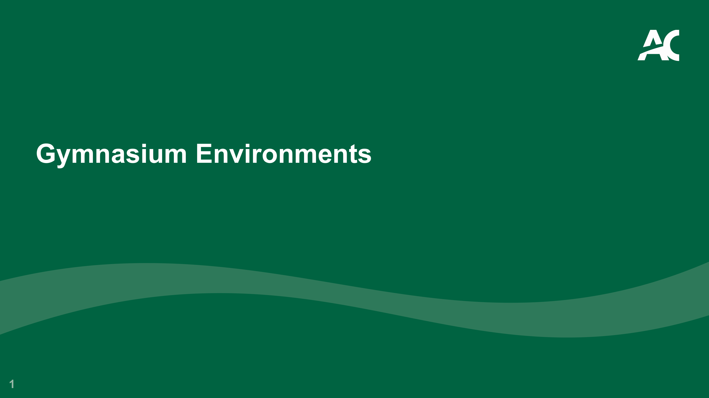

- Gymnasium Environments — Gymnasium 环境

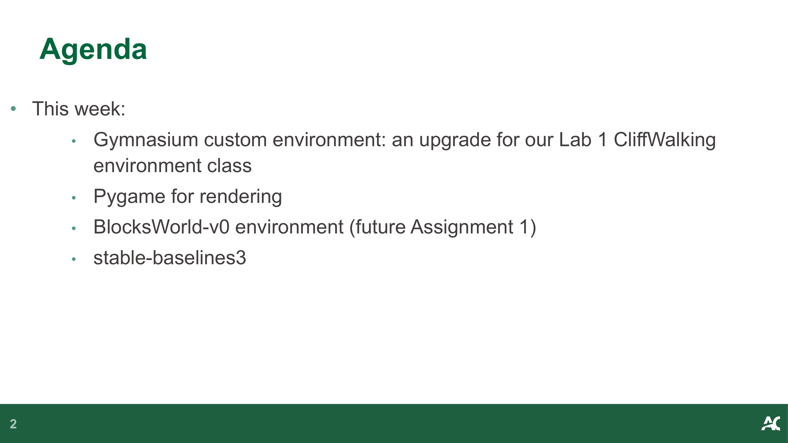

- **Agenda** — **本周议程**
  - Gymnasium custom environment: an upgrade for our Lab 1 CliffWalking environment class — Gymnasium 自定义环境：Lab 1 CliffWalking 环境类的升级版
  - Pygame for rendering — 使用 Pygame 进行渲染
  - BlocksWorld-v0 environment (future Assignment 1) — BlocksWorld-v0 环境（未来的 Assignment 1）
  - stable-baselines3 — stable-baselines3 算法库

> **📝 Notes:**
>
> _(To be added)_

---

## 2. 已有实现回顾 (What We've Implemented So Far)

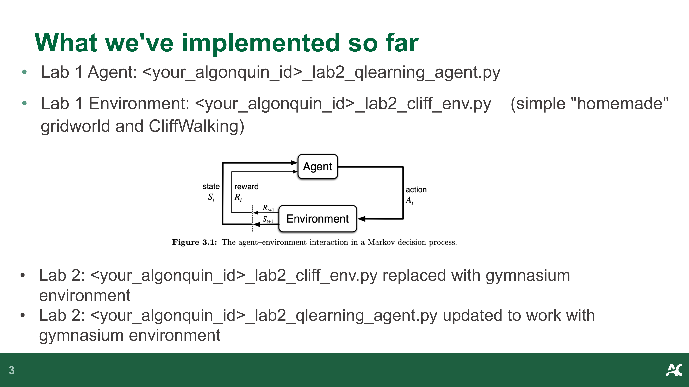

- Lab 1 Agent: `<your_algonquin_id>_lab2_qlearning_agent.py` — Lab 1 智能体：Q-Learning 代理脚本
- Lab 1 Environment: `<your_algonquin_id>_lab2_cliff_env.py` (simple "homemade" gridworld and CliffWalking) — Lab 1 环境：简单的"自制"网格世界和悬崖行走
- Lab 2: replaced with gymnasium environment — Lab 2：替换为 Gymnasium 环境
- Lab 2: Q-learning agent updated to work with gymnasium environment — Lab 2：Q-Learning 代理更新以适配 Gymnasium 环境

> **📝 Notes:**
>
> _(To be added)_

---

## 3. 实现方向 (Where the Implementation is Going)

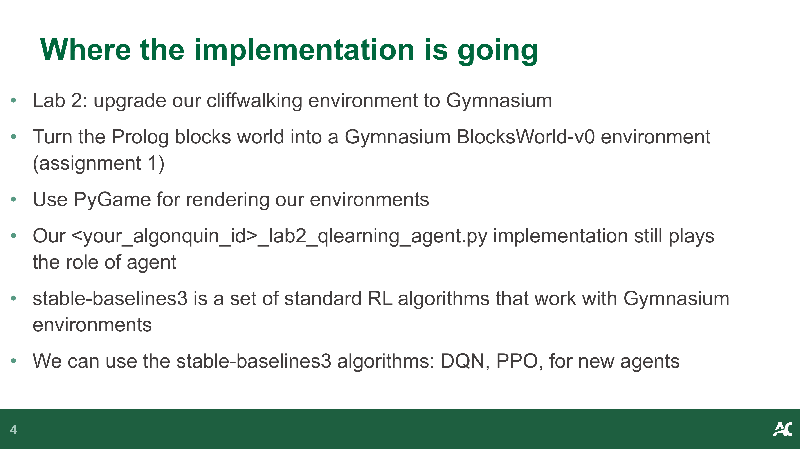

- Lab 2: upgrade our cliffwalking environment to Gymnasium — Lab 2：将 CliffWalking 环境升级为 Gymnasium
- Turn the Prolog blocks world into a Gymnasium BlocksWorld-v0 environment (Assignment 1) — 将 Prolog 积木世界转为 Gymnasium BlocksWorld-v0 环境（Assignment 1）
- Use PyGame for rendering our environments — 使用 PyGame 渲染环境
- Our Q-learning agent implementation still plays the role of agent — 我们的 Q-Learning 代理仍然扮演智能体角色
- stable-baselines3 is a set of standard RL algorithms that work with Gymnasium environments — stable-baselines3 是一组与 Gymnasium 环境兼容的标准 RL 算法
- We can use the stable-baselines3 algorithms: DQN, PPO, for new agents — 我们可以使用 stable-baselines3 的 DQN、PPO 等算法作为新的智能体

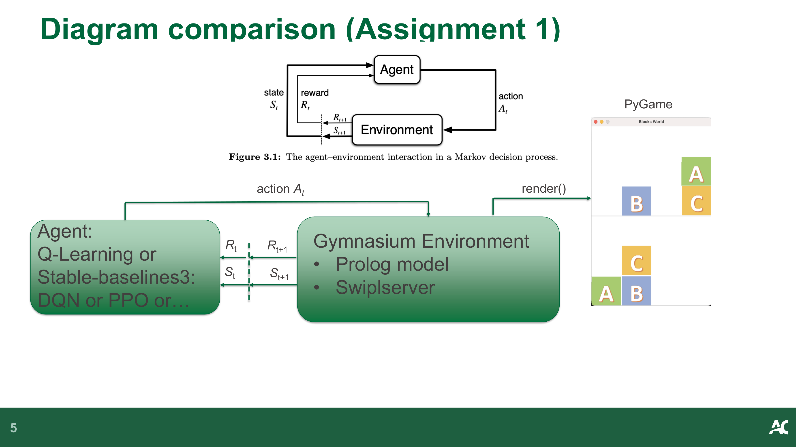

- **Diagram comparison (Assignment 1)** — **架构对比图（Assignment 1）**

```
Agent:                          Gymnasium Environment
Q-Learning or                   • Prolog model
Stable-baselines3:              • Swiplserver
DQN or PPO or…
                    ←── Rt+1, St+1
                    ──→ action At        ──→ render() ──→ PyGame
```

> **📝 Notes:**
>
> _(To be added)_

---

## 4. 重要资源 (Important Sites)

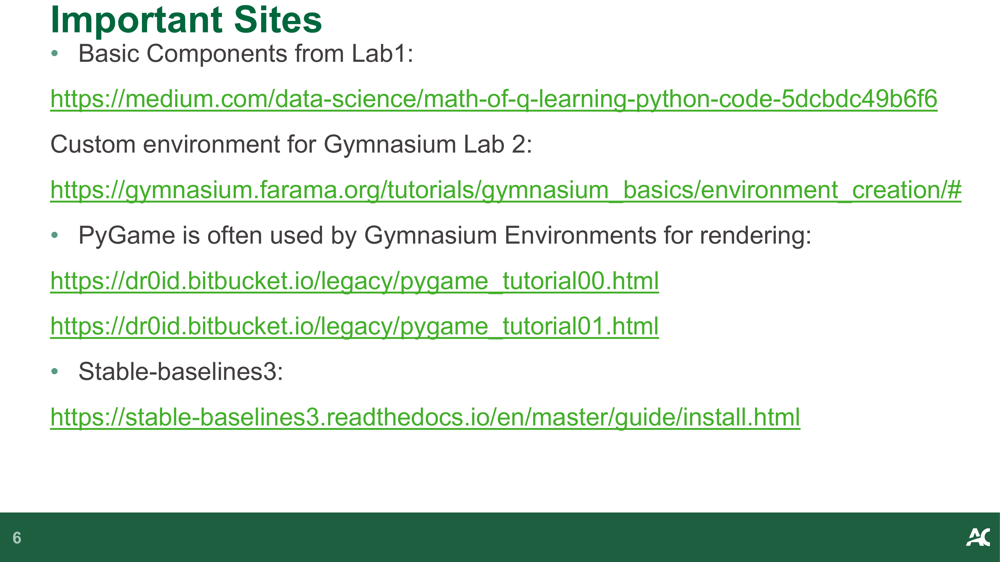

- **Basic Components from Lab 1:** — **Lab 1 基础组件：**
  - https://medium.com/data-science/math-of-q-learning-python-code-5dcbdc49b6f6
- **Custom environment for Gymnasium (Lab 2):** — **Gymnasium 自定义环境（Lab 2）：**
  - https://gymnasium.farama.org/tutorials/gymnasium_basics/environment_creation/
- **PyGame** is often used by Gymnasium Environments for rendering: — **PyGame** 常被 Gymnasium 环境用于渲染：
  - https://dr0id.bitbucket.io/legacy/pygame_tutorial00.html
  - https://dr0id.bitbucket.io/legacy/pygame_tutorial01.html
- **Stable-baselines3:** — **Stable-baselines3：**
  - https://stable-baselines3.readthedocs.io/en/master/guide/install.html

> **📝 Notes:**
>
> _(To be added)_

---

## 5. Gym 到 Gymnasium 的迁移 (Gym to Gymnasium)

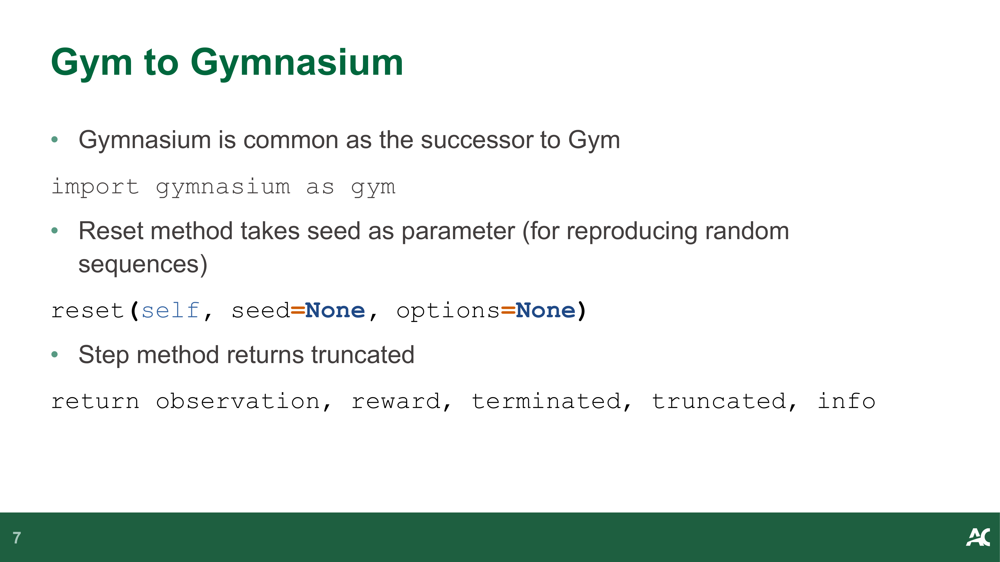

- Gymnasium is common as the successor to Gym — Gymnasium 是 Gym 的继任者，已成为主流
  ```python
  import gymnasium as gym
  ```
- Reset method takes seed as parameter (for reproducing random sequences) — `reset` 方法接受 `seed` 参数（用于复现随机序列）
  ```python
  reset(self, seed=None, options=None)
  ```
- Step method returns `truncated` — `step` 方法新增返回 `truncated`
  ```python
  return observation, reward, terminated, truncated, info
  ```

> **📝 Notes:**
>
> _(To be added)_

---

## 6. 创建 Gymnasium 环境 (Creating a Gymnasium Environment)

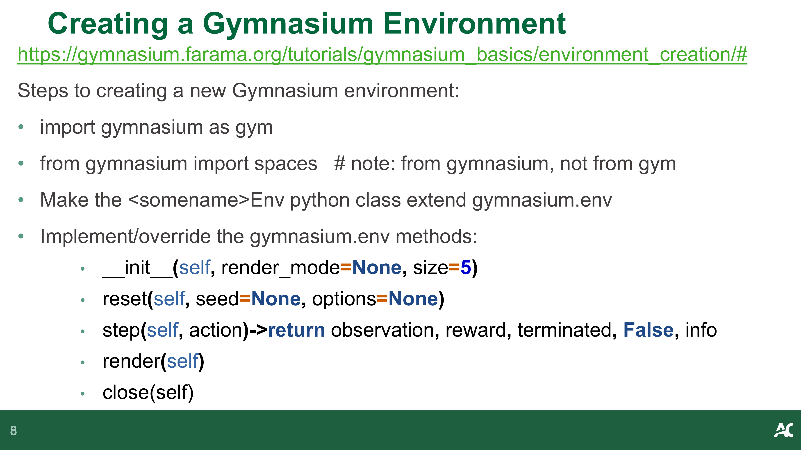

- Steps to creating a new Gymnasium environment: — 创建新 Gymnasium 环境的步骤：
  ```python
  import gymnasium as gym
  from gymnasium import spaces  # note: from gymnasium, not from gym
  ```
- Make the `<somename>Env` python class extend `gymnasium.Env` — 让 Python 类继承 `gymnasium.Env`
- Implement/override the `gymnasium.Env` methods: — 实现/重写 `gymnasium.Env` 的方法：
  - `__init__(self, render_mode=None, size=5)` — 初始化
  - `reset(self, seed=None, options=None)` — 重置环境
  - `step(self, action)` → return `observation, reward, terminated, False, info` — 执行一步
  - `render(self)` — 渲染
  - `close(self)` — 关闭

> **📝 Notes:**
>
> _(To be added)_

---

## 7. 定义状态空间和动作空间 (Defining State and Action Spaces)

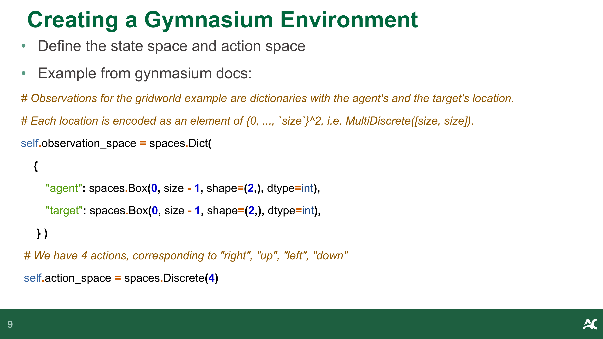

- **Dictionary observation space** (GridWorld example from Gymnasium docs): — **字典观测空间**（Gymnasium 文档的 GridWorld 示例）：

```python
# Observations are dictionaries with agent's and target's location
# 观测是包含智能体和目标位置的字典
self.observation_space = spaces.Dict({
    "agent": spaces.Box(0, size - 1, shape=(2,), dtype=int),
    "target": spaces.Box(0, size - 1, shape=(2,), dtype=int),
})
# We have 4 actions: "right", "up", "left", "down"
# 4 个动作：右、上、左、下
self.action_space = spaces.Discrete(4)
```

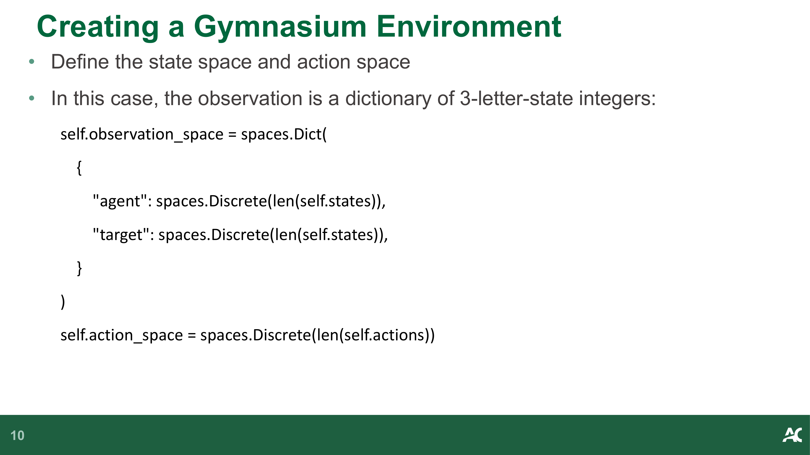

- **Discrete observation with Dict** (3-letter-state integers): — **离散观测 + 字典**（3 字母状态整数）：

```python
self.observation_space = spaces.Dict({
    "agent": spaces.Discrete(len(self.states)),
    "target": spaces.Discrete(len(self.states)),
})
self.action_space = spaces.Discrete(len(self.actions))
```

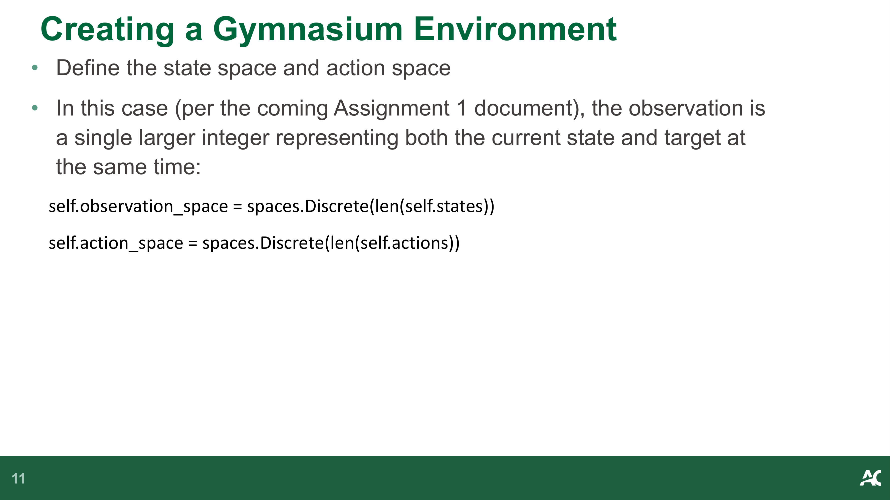

- **Single Discrete observation** (Assignment 1: combined state and target as one integer): — **单一离散观测**（Assignment 1：将状态和目标合并为一个整数）：

```python
self.observation_space = spaces.Discrete(len(self.states))
self.action_space = spaces.Discrete(len(self.actions))
```

> **📝 Notes:**
>
> _(To be added)_

---

## 8. Stable-Baselines3 策略选择 (MlpPolicy vs MultiInputPolicy)

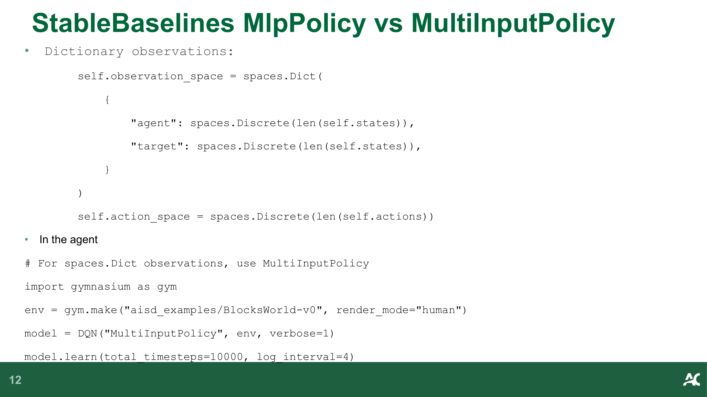

- **Dictionary observations** → use `MultiInputPolicy` — **字典观测** → 使用 `MultiInputPolicy`

```python
# For spaces.Dict observations, use MultiInputPolicy
# 对于 spaces.Dict 观测，使用 MultiInputPolicy
import gymnasium as gym
env = gym.make("aisd_examples/BlocksWorld-v0", render_mode="human")
model = DQN("MultiInputPolicy", env, verbose=1)
model.learn(total_timesteps=10000, log_interval=4)
```

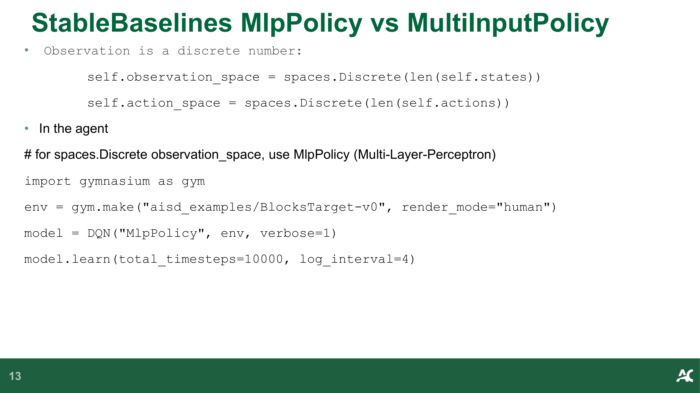

- **Discrete observation** → use `MlpPolicy` (Multi-Layer Perceptron) — **离散观测** → 使用 `MlpPolicy`（多层感知机）

```python
# For spaces.Discrete observation_space, use MlpPolicy
# 对于 spaces.Discrete 观测空间，使用 MlpPolicy
import gymnasium as gym
env = gym.make("aisd_examples/BlocksTarget-v0", render_mode="human")
model = DQN("MlpPolicy", env, verbose=1)
model.learn(total_timesteps=10000, log_interval=4)
```

> **📝 Notes:**
>
> _(To be added)_

---

## 9. 环境打包 (Packaging the Environment)

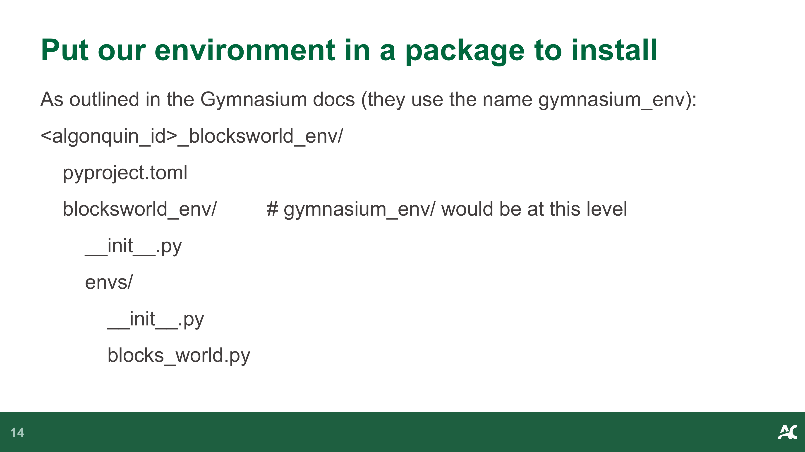

- As outlined in the Gymnasium docs: — 按照 Gymnasium 文档的说明：

```
<algonquin_id>_blocksworld_env/
    pyproject.toml
    blocksworld_env/
        __init__.py
        envs/
            __init__.py
            blocks_world.py
```

> **📝 Notes:**
>
> _(To be added)_

---

## 10. 使用自定义环境 (Using Our Custom Environment)

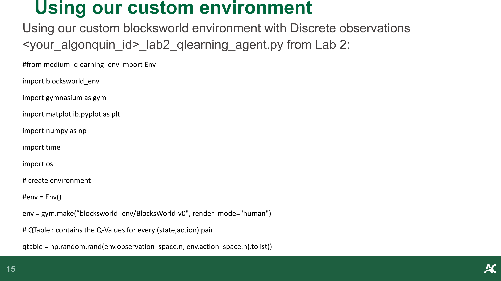

- **With Q-Learning agent** (Discrete observations): — **使用 Q-Learning 代理**（离散观测）：

```python
import blocksworld_env
import gymnasium as gym
import numpy as np

env = gym.make("blocksworld_env/BlocksWorld-v0", render_mode="human")
# QTable: contains Q-Values for every (state, action) pair
# Q 表：包含每个（状态，动作）对的 Q 值
qtable = np.random.rand(env.observation_space.n, env.action_space.n).tolist()
```

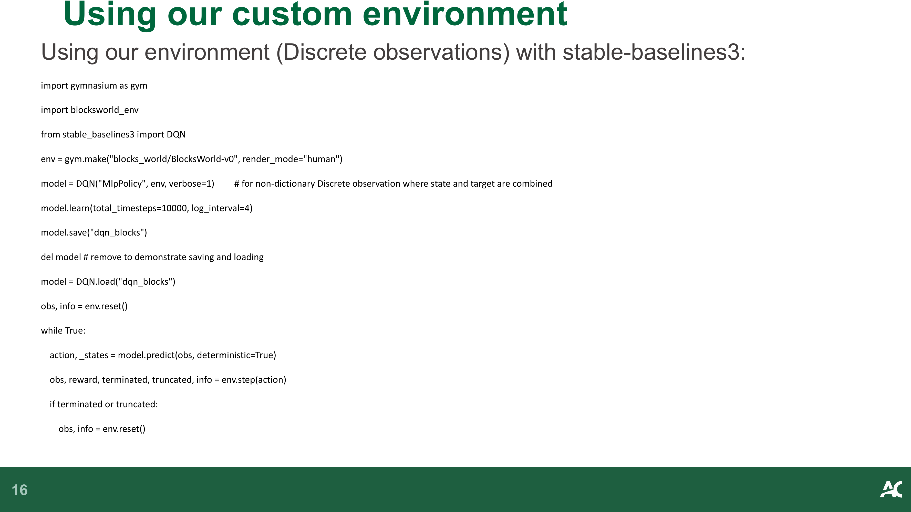

- **With Stable-Baselines3** (DQN): — **使用 Stable-Baselines3**（DQN）：

```python
import gymnasium as gym
import blocksworld_env
from stable_baselines3 import DQN

env = gym.make("blocks_world/BlocksWorld-v0", render_mode="human")
model = DQN("MlpPolicy", env, verbose=1)
model.learn(total_timesteps=10000, log_interval=4)
model.save("dqn_blocks")

del model  # remove to demonstrate saving and loading
model = DQN.load("dqn_blocks")

obs, info = env.reset()
while True:
    action, _states = model.predict(obs, deterministic=True)
    obs, reward, terminated, truncated, info = env.step(action)
    if terminated or truncated:
        obs, info = env.reset()
```

> **📝 Notes:**
>
> _(To be added)_

---

## 11. Prolog 积木世界环境 (Prolog Blocks World Environment)

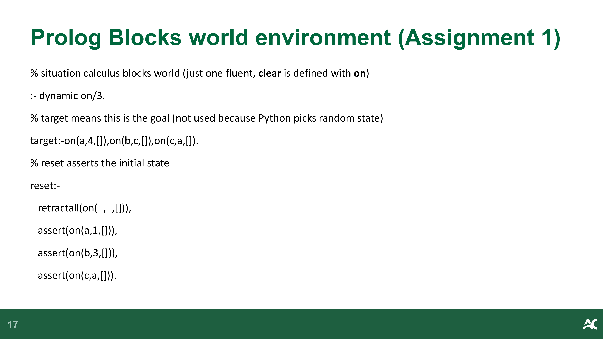

- **Situation calculus blocks world** (Assignment 1): — **情境演算积木世界**（Assignment 1）：

```prolog
% situation calculus blocks world (just one fluent, clear is defined with on)
% 情境演算积木世界（只有一个 fluent，clear 通过 on 定义）
:- dynamic on/3.

% target means this is the goal
% target 表示目标状态
target :- on(a,4,[]), on(b,c,[]), on(c,a,[]).

% reset asserts the initial state
% reset 断言初始状态
reset :-
    retractall(on(_,_,[])),
    assert(on(a,1,[])),
    assert(on(b,3,[])),
    assert(on(c,a,[])).
```

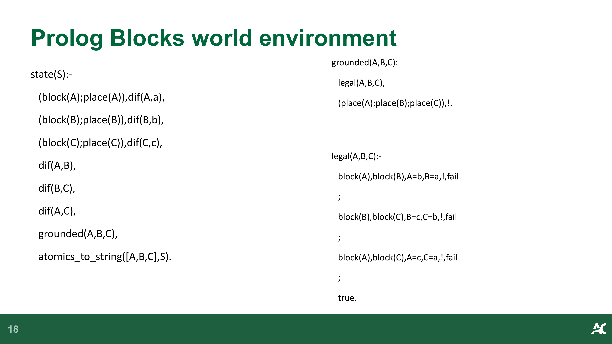

- **State generation and validation:** — **状态生成与验证：**

```prolog
state(S) :-
    (block(A);place(A)), dif(A,a),
    (block(B);place(B)), dif(B,b),
    (block(C);place(C)), dif(C,c),
    dif(A,B), dif(B,C), dif(A,C),
    grounded(A,B,C),
    atomics_to_string([A,B,C], S).

grounded(A,B,C) :-
    legal(A,B,C),
    (place(A);place(B);place(C)), !.

legal(A,B,C) :-
    block(A), block(B), A=b, B=a, !, fail ;
    block(B), block(C), B=c, C=b, !, fail ;
    block(A), block(C), A=c, C=a, !, fail ;
    true.
```

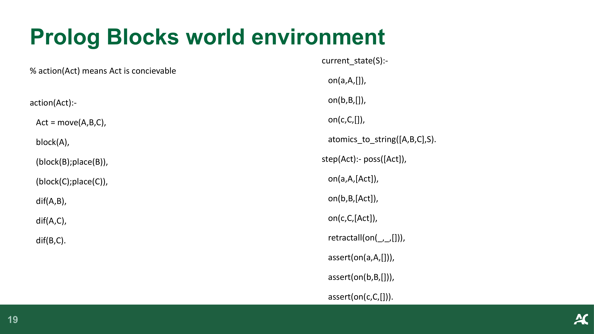

- **Actions and step function:** — **动作和 step 函数：**

```prolog
% action(Act) means Act is conceivable
% action(Act) 表示 Act 是可行的动作
action(Act) :-
    Act = move(A,B,C),
    block(A),
    (block(B);place(B)),
    (block(C);place(C)),
    dif(A,B), dif(A,C), dif(B,C).

current_state(S) :-
    on(a,A,[]), on(b,B,[]), on(c,C,[]),
    atomics_to_string([A,B,C], S).

step(Act) :-
    poss([Act]),
    on(a,A,[Act]), on(b,B,[Act]), on(c,C,[Act]),
    retractall(on(_,_,[])),
    assert(on(a,A,[])), assert(on(b,B,[])), assert(on(c,C,[])).
```

> **📝 Notes:**
>
> _(To be added)_

---

## 12. PyGame 渲染 (PyGame for Rendering)

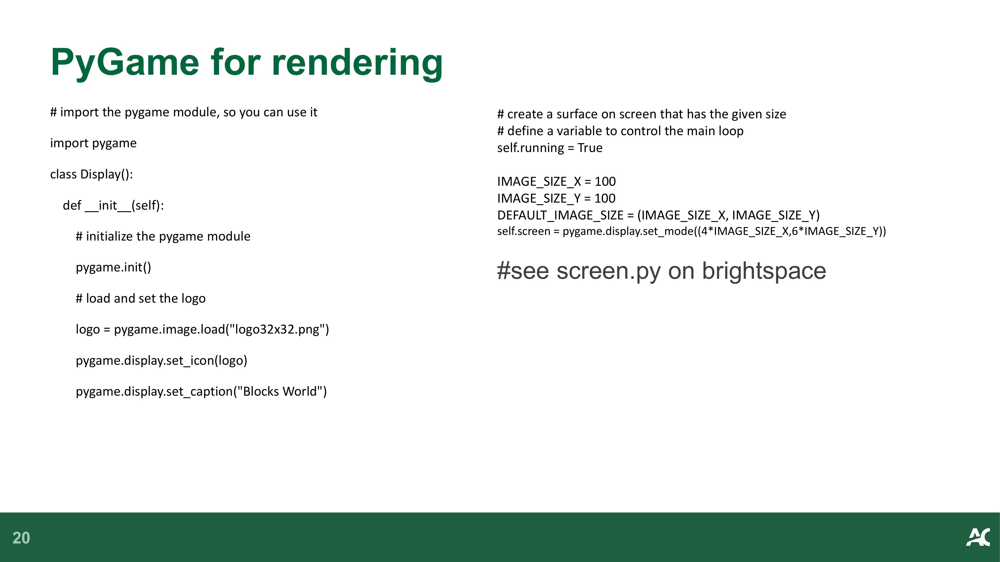

- **PyGame rendering setup:** — **PyGame 渲染设置：**

```python
import pygame

class Display():
    def __init__(self):
        pygame.init()
        logo = pygame.image.load("logo32x32.png")
        pygame.display.set_icon(logo)
        pygame.display.set_caption("Blocks World")

        self.running = True
        IMAGE_SIZE_X = 100
        IMAGE_SIZE_Y = 100
        DEFAULT_IMAGE_SIZE = (IMAGE_SIZE_X, IMAGE_SIZE_Y)
        self.screen = pygame.display.set_mode((4 * IMAGE_SIZE_X, 6 * IMAGE_SIZE_Y))
        # see screen.py on brightspace
```

> **📝 Notes:**
>
> _(To be added)_

---
