# Week 4: Stable-Baselines3

> Source: `CST8509_04_Stable-Baselines3.pptx`
> Total slides: 11
> Instructor: Todd Kelley (Lectures) / Ali Mohamed Ali (Labs) | Winter 2026

---

## 1. 课程进度 (Course Status)

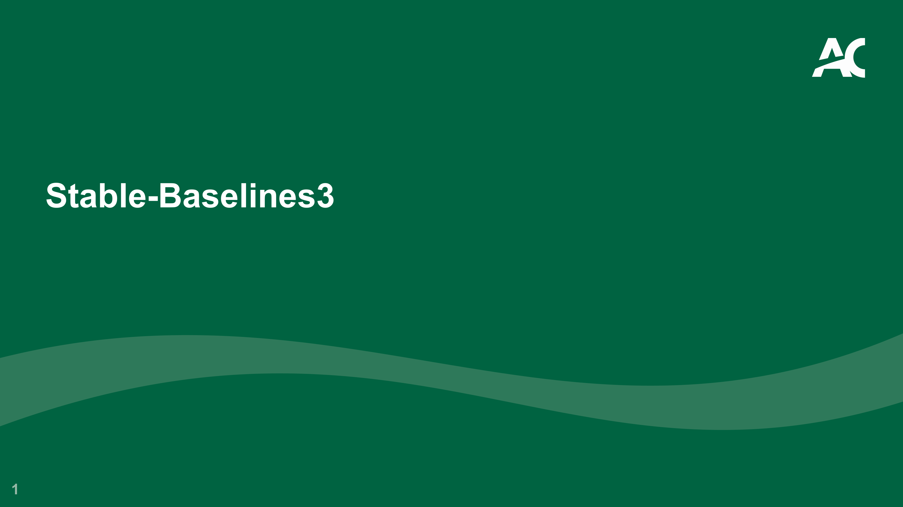

- Stable-Baselines3 — Stable-Baselines3 算法库

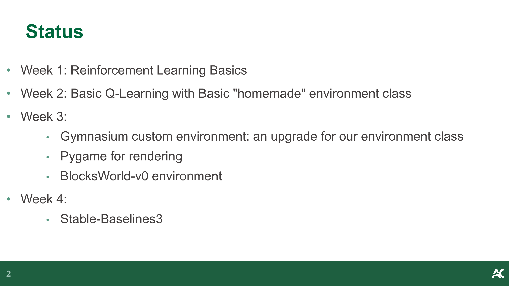

- **Course Progress:** — **课程进度：**
  - Week 1: Reinforcement Learning Basics — 强化学习基础
  - Week 2: Basic Q-Learning with Basic "homemade" environment class — 基础 Q-Learning + 自制环境类
  - Week 3: Gymnasium custom environment, Pygame rendering, BlocksWorld-v0 — Gymnasium 自定义环境、Pygame 渲染、BlocksWorld-v0
  - Week 4: Stable-Baselines3 — Stable-Baselines3 算法库

> **📝 Notes:**
>
> _(To be added)_

---

## 2. 观测空间与动作空间 (Observation and Action Spaces)

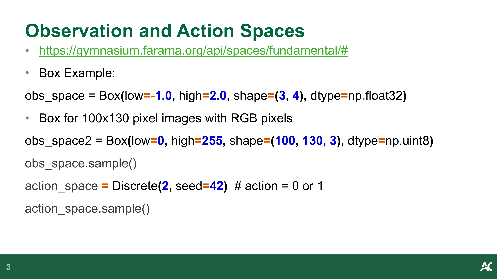

- **Gymnasium Spaces API:** — **Gymnasium 空间 API：**
  - https://gymnasium.farama.org/api/spaces/fundamental/

```python
# Box 示例：连续空间 (Continuous space)
obs_space = Box(low=-1.0, high=2.0, shape=(3, 4), dtype=np.float32)

# Box 用于 100x130 像素 RGB 图像 (Box for pixel images)
obs_space2 = Box(low=0, high=255, shape=(100, 130, 3), dtype=np.uint8)

obs_space.sample()

# Discrete 动作空间 (Discrete action space)
action_space = Discrete(2, seed=42)  # action = 0 or 1
action_space.sample()
```

> **📝 Notes:**
>
> _(To be added)_

---

## 3. SB3 基类与统一接口 (Base RL Class)

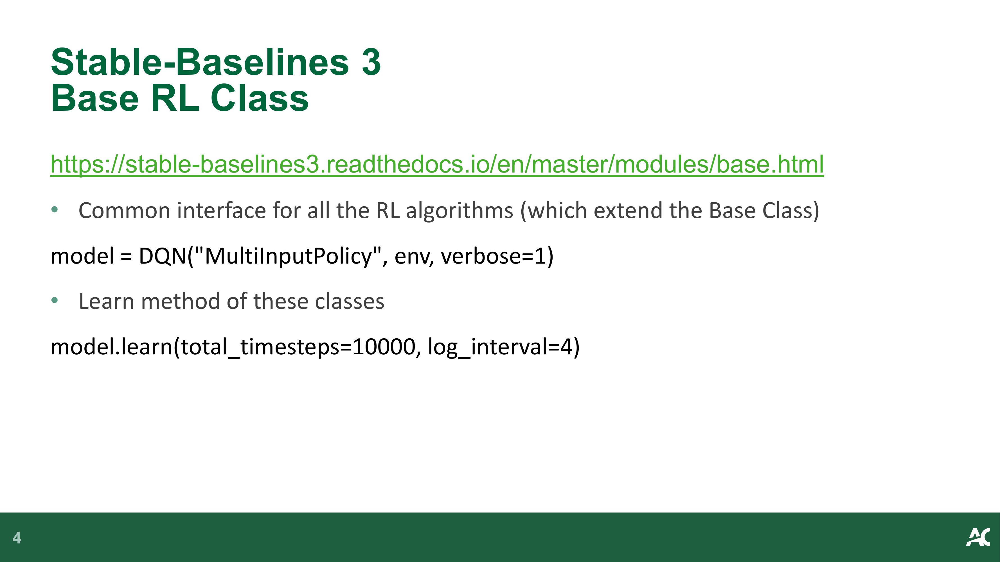

- **Common interface for all RL algorithms** (which extend the Base Class) — **所有 RL 算法的统一接口**（都继承自基类）
  - https://stable-baselines3.readthedocs.io/en/master/modules/base.html

```python
# 创建模型 (Create model)
model = DQN("MultiInputPolicy", env, verbose=1)

# 训练 (Train)
model.learn(total_timesteps=10000, log_interval=4)
```

> **📝 Notes:**
>
> _(To be added)_

---

## 4. 算法选择指南 (Which Algorithm?)

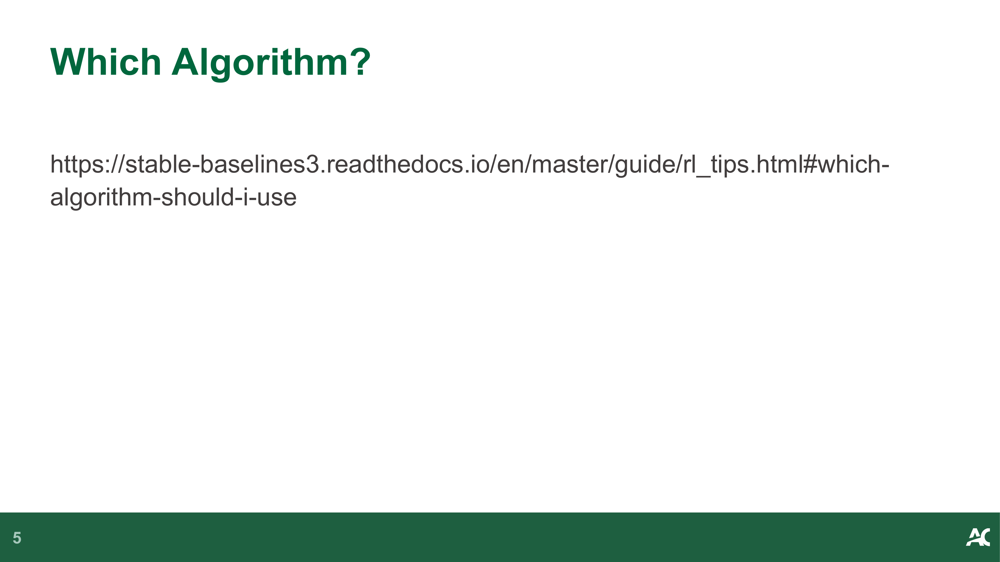

- **Which Algorithm Should I Use?** — **应该使用哪个算法？**
  - https://stable-baselines3.readthedocs.io/en/master/guide/rl_tips.html#which-algorithm-should-i-use

> **📝 Notes:**
>
> _(To be added)_

---

## 5. SB3 学习资源 (SB3 Resources)

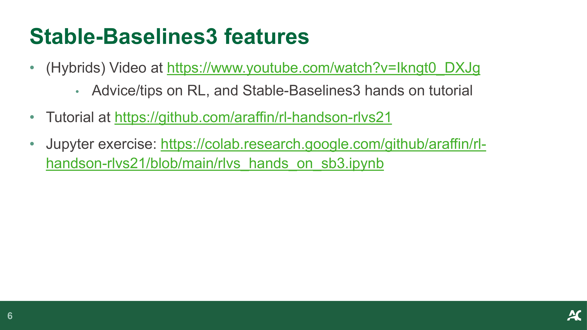

- **(Hybrids) Video:** — **视频教程：**
  - https://www.youtube.com/watch?v=Ikngt0_DXJg — Advice/tips on RL + SB3 hands-on tutorial — RL 建议/技巧 + SB3 实操教程
- **Tutorial:** — **教程：**
  - https://github.com/araffin/rl-handson-rlvs21
- **Jupyter exercise:** — **Jupyter 练习：**
  - https://colab.research.google.com/github/araffin/rl-handson-rlvs21/blob/main/rlvs_hands_on_sb3.ipynb

> **📝 Notes:**
>
> _(To be added)_

---

## 6. 向量化环境 (Vectorized Environments)

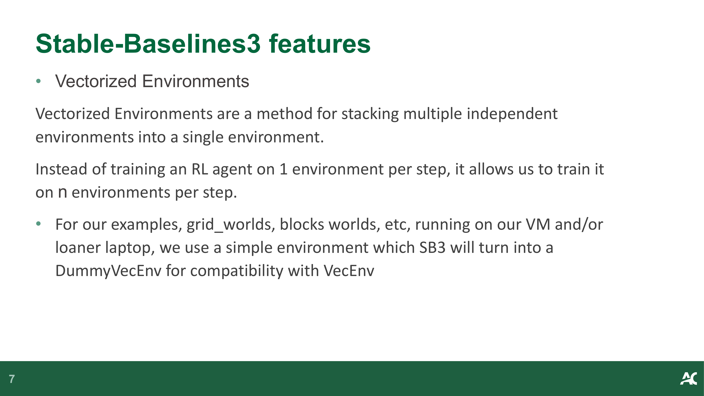

- **Vectorized Environments** are a method for stacking multiple independent environments into a single environment — **向量化环境**是将多个独立环境堆叠为单一环境的方法
- Instead of training on 1 environment per step, train on n environments per step — 每步不再只训练 1 个环境，而是同时训练 n 个环境
- For simple environments (grid worlds, blocks worlds), SB3 will turn them into a `DummyVecEnv` for compatibility — 对于简单环境，SB3 会自动将其包装为 `DummyVecEnv` 以兼容 VecEnv 接口

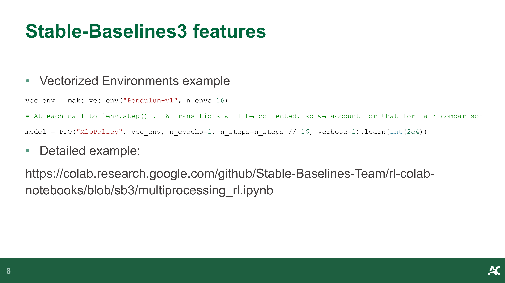

- **Vectorized Environments example:** — **向量化环境示例：**

```python
vec_env = make_vec_env("Pendulum-v1", n_envs=16)
# At each call to env.step(), 16 transitions will be collected
# 每次调用 env.step() 时，会收集 16 个转移
model = PPO("MlpPolicy", vec_env, n_epochs=1,
            n_steps=n_steps // 16, verbose=1).learn(int(2e4))
```

- Detailed example: https://colab.research.google.com/github/Stable-Baselines-Team/rl-colab-notebooks/blob/sb3/multiprocessing_rl.ipynb

> **📝 Notes:**
>
> _(To be added)_

---

## 7. 回调函数 (Callbacks)

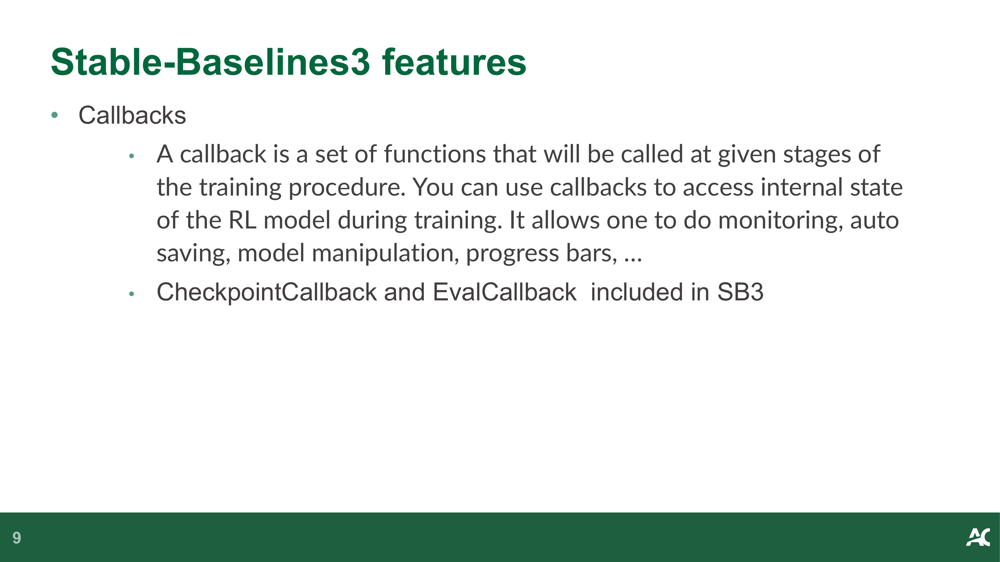

- **Callbacks** — a set of functions called at given stages of the training procedure — **回调函数** — 在训练过程的特定阶段被调用的函数集合
- Use callbacks to access internal state of the RL model during training — 使用回调函数在训练期间访问 RL 模型的内部状态
- Allows: monitoring, auto saving, model manipulation, progress bars — 功能：监控、自动保存、模型操作、进度条
- Built-in: `CheckpointCallback` and `EvalCallback` — 内置：`CheckpointCallback` 和 `EvalCallback`

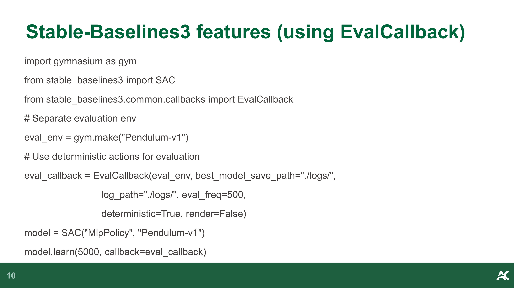

- **EvalCallback example:** — **EvalCallback 示例：**

```python
import gymnasium as gym
from stable_baselines3 import SAC
from stable_baselines3.common.callbacks import EvalCallback

# Separate evaluation env — 独立的评估环境
eval_env = gym.make("Pendulum-v1")

# Use deterministic actions for evaluation — 评估时使用确定性动作
eval_callback = EvalCallback(
    eval_env, best_model_save_path="./logs/",
    log_path="./logs/", eval_freq=500,
    deterministic=True, render=False
)

model = SAC("MlpPolicy", "Pendulum-v1")
model.learn(5000, callback=eval_callback)
```

> **📝 Notes:**
>
> _(To be added)_

---

## 8. 超参数调优 (Hyperparameter Tuning)

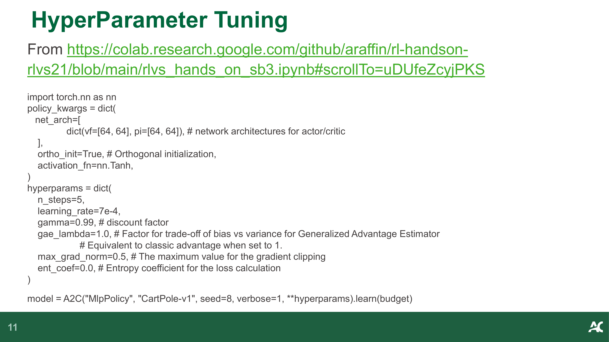

- **Hyperparameter Tuning example** (from SB3 hands-on tutorial): — **超参数调优示例**（来自 SB3 实操教程）：

```python
import torch.nn as nn

# 网络架构配置 (Network architecture configuration)
policy_kwargs = dict(
    net_arch=[
        dict(vf=[64, 64], pi=[64, 64]),  # actor/critic 网络架构
    ],
    ortho_init=True,       # 正交初始化 (Orthogonal initialization)
    activation_fn=nn.Tanh, # 激活函数 (Activation function)
)

# 训练超参数 (Training hyperparameters)
hyperparams = dict(
    n_steps=5,
    learning_rate=7e-4,
    gamma=0.99,            # 折扣因子 (discount factor)
    gae_lambda=1.0,        # GAE 参数 (Generalized Advantage Estimator)
    max_grad_norm=0.5,     # 梯度裁剪 (gradient clipping)
    ent_coef=0.0,          # 熵系数 (entropy coefficient)
)

model = A2C("MlpPolicy", "CartPole-v1", seed=8, verbose=1,
            **hyperparams).learn(budget)
```

> **📝 Notes:**
>
> _(To be added)_

---
