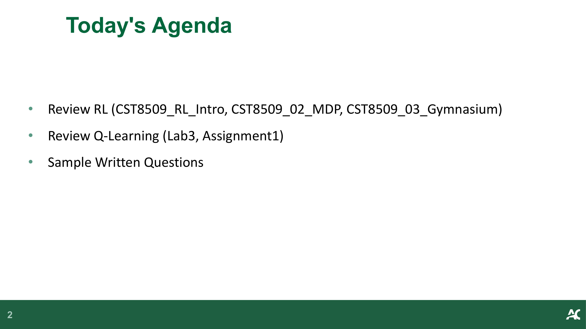
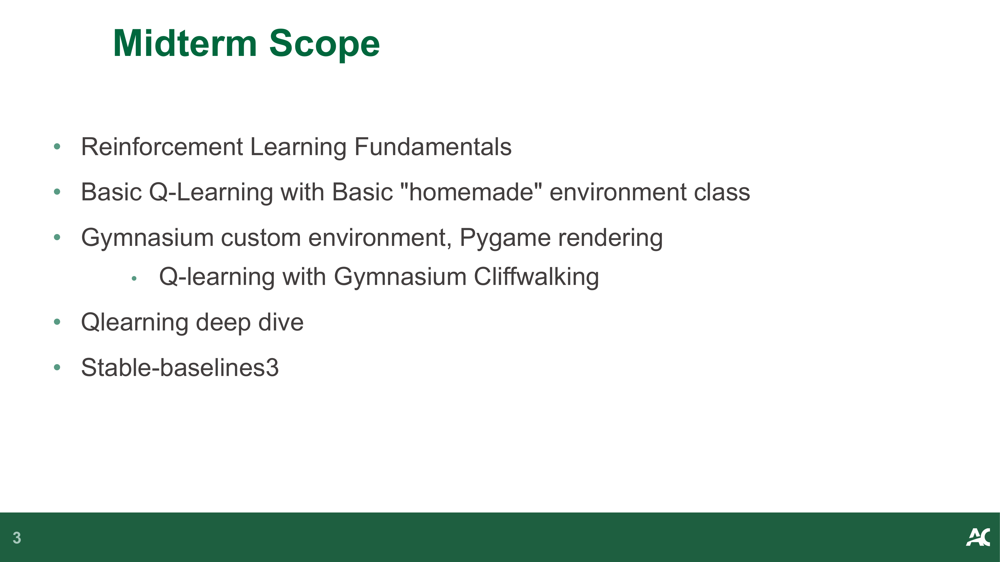
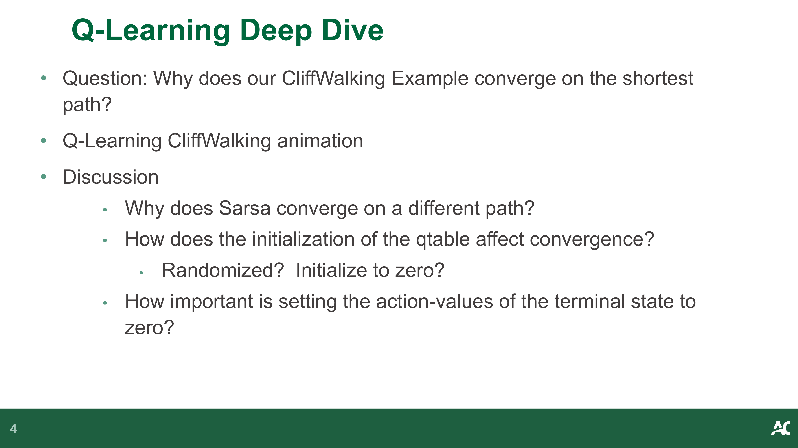
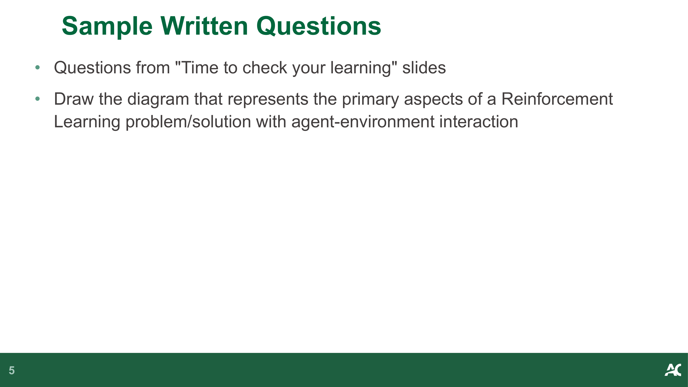
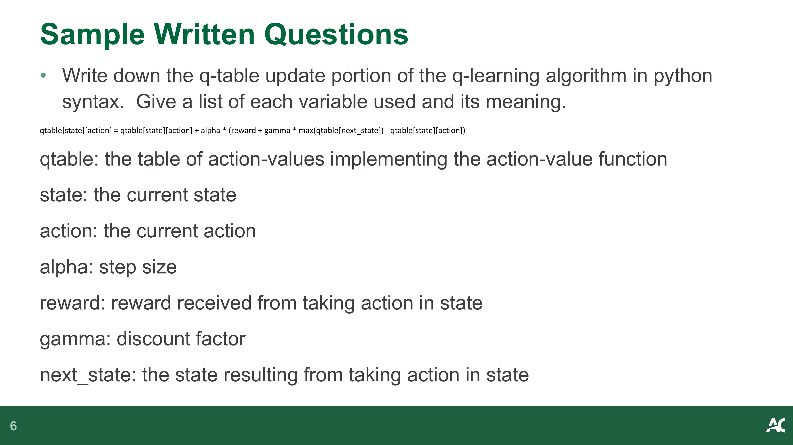
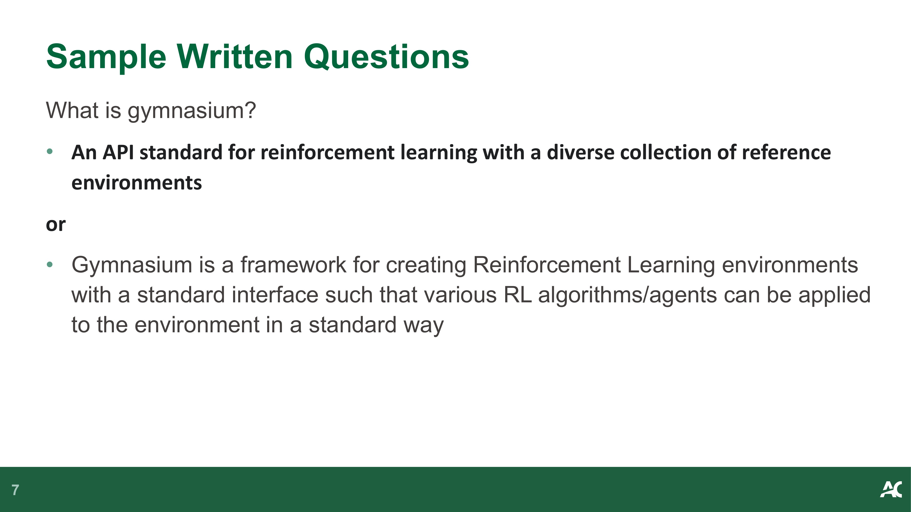
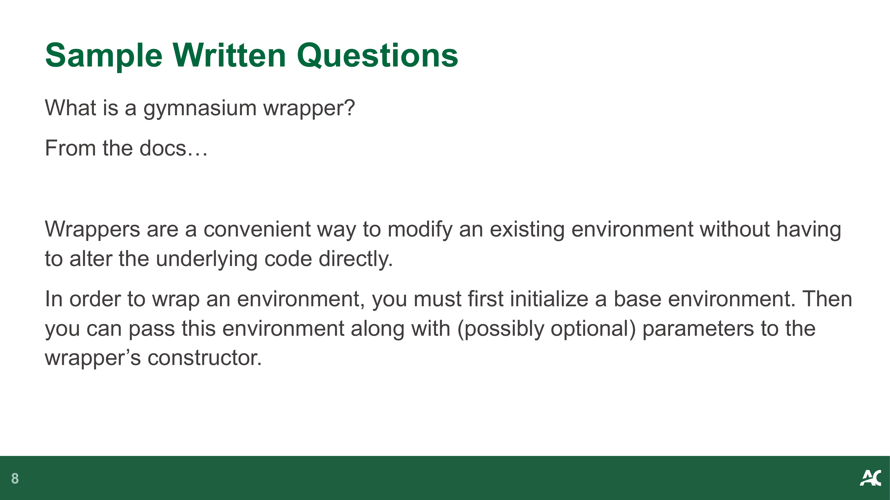
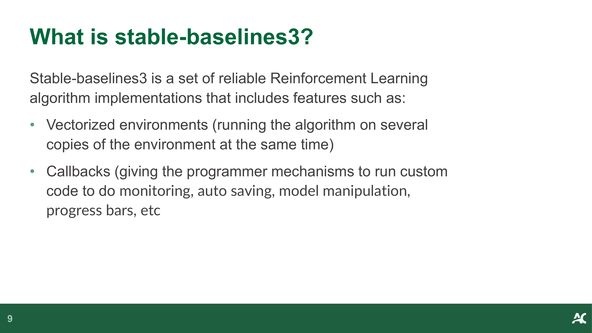

# CST8509 06 Midterm Review

**Source:** `CST8509_06_Midterm_Review.pdf`  
**Total Pages:** 9  
**Format:** Hybrid (pdfplumber + PyMuPDF)

---

## Page 1

### 📷 Page Image

### 📝 Text Content

**Midterm Review**

### ✍️ Notes

> [Add your notes here]

---

## Page 2

### 📷 Page Image

### 📝 Text Content

**Today's Agenda**

• Review RL (CST8509_RL_Intro, CST8509_02_MDP, CST8509_03_Gymnasium)

• Review Q-Learning (Lab3, Assignment1)

• Sample Written Questions

### ✍️ Notes

> [Add your notes here]

---

## Page 3

### 📷 Page Image

### 📝 Text Content

**Midterm Scope**

• Reinforcement Learning Fundamentals

• Basic Q-Learning with Basic "homemade" environment class

• Gymnasium custom environment, Pygame rendering

Q-learning with Gymnasium Cliffwalking

• Qlearning deep dive

• Stable-baselines3

### ✍️ Notes

> [Add your notes here]

---

## Page 4

### 📷 Page Image

### 📝 Text Content

**Q-Learning Deep Dive**

• Question: Why does our CliffWalking Example converge on the shortest

path?

• Q-Learning CliffWalking animation

• Discussion

Why does Sarsa converge on a different path?
How does the initialization of the qtable affect convergence?
Randomized? Initialize to zero?
How important is setting the action-values of the terminal state to
zero?

### ✍️ Notes

> [Add your notes here]

---

## Page 5

### 📷 Page Image

### 📝 Text Content

**Sample Written Questions**

• Questions from "Time to check your learning" slides

• Draw the diagram that represents the primary aspects of a Reinforcement

Learning problem/solution with agent-environment interaction

### ✍️ Notes

> [Add your notes here]

---

## Page 6

### 📷 Page Image

### 📝 Text Content

**Sample Written Questions**

• Write down the q-table update portion of the q-learning algorithm in python

syntax. Give a list of each variable used and its meaning.
qtable[state][action] = qtable[state][action] + alpha * (reward + gamma * max(qtable[next_state]) - qtable[state][action])
qtable: the table of action-values implementing the action-value function
state: the current state
action: the current action
alpha: step size
reward: reward received from taking action in state
gamma: discount factor
next_state: the state resulting from taking action in state

### ✍️ Notes

> [Add your notes here]

---

## Page 7

### 📷 Page Image

### 📝 Text Content

**Sample Written Questions**

What is gymnasium?

• An API standard for reinforcement learning with a diverse collection of reference

environments
or

• Gymnasium is a framework for creating Reinforcement Learning environments

with a standard interface such that various RL algorithms/agents can be applied
to the environment in a standard way

### ✍️ Notes

> [Add your notes here]

---

## Page 8

### 📷 Page Image

### 📝 Text Content

**Sample Written Questions**

What is a gymnasium wrapper?
From the docs…
Wrappers are a convenient way to modify an existing environment without having
to alter the underlying code directly.
In order to wrap an environment, you must first initialize a base environment. Then
you can pass this environment along with (possibly optional) parameters to the
wrapper’s constructor.

### ✍️ Notes

> [Add your notes here]

---

## Page 9

### 📷 Page Image

### 📝 Text Content

**What is stable-baselines3?**

Stable-baselines3 is a set of reliable Reinforcement Learning
algorithm implementations that includes features such as:

• Vectorized environments (running the algorithm on several

copies of the environment at the same time)

• Callbacks (giving the programmer mechanisms to run custom

code to do monitoring, auto saving, model manipulation,
progress bars, etc

### ✍️ Notes

> [Add your notes here]

---
