# Week 7: Gazebo、动态规划与蒙特卡洛 (Gazebo, Dynamic Programming & Monte Carlo)

> Source: `CST8509_07_Gazebo_DynamicP_MC.pptx`
> Total slides: 21
> Instructor: Todd Kelley | Winter 2026

---

## 1. 议程 (Today's Agenda)


**CST8509 Part II:** — CST8509 第二部分


**Today's Agenda:** — 今日议程

- Midterm results — 期中考试结果
- Gazebo — Gazebo 仿真器
- RViz — RViz 可视化工具
- Dynamic Programming — 动态规划
- Monte Carlo — 蒙特卡洛方法

---

## 2. RL 工具箱 (RL Toolbox)

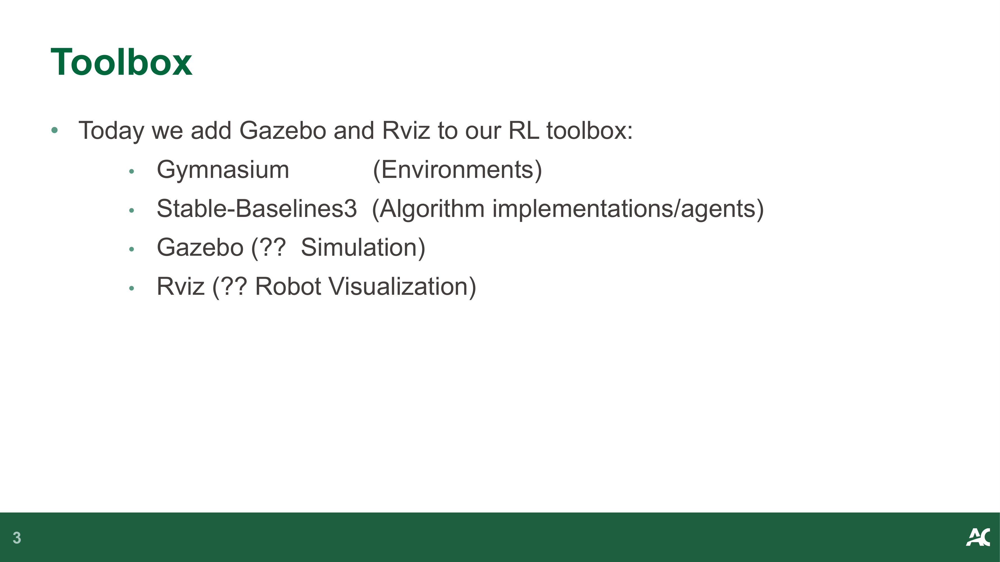

**Toolbox:** — 工具箱

- Today we add Gazebo and Rviz to our RL toolbox: — 今天我们将 Gazebo 和 Rviz 加入 RL 工具箱：
  - **Gymnasium** (Environments) — **Gymnasium**（环境）
  - **Stable-Baselines3** (Algorithm implementations/agents) — **Stable-Baselines3**（算法实现/智能体）
  - **Gazebo** (🤖 Simulation) — **Gazebo**（🤖 仿真）
  - **Rviz** (🤖 Robot Visualization) — **Rviz**（🤖 机器人可视化）

---

## 3. Gazebo 仿真器 (Gazebo Simulator)

### 3.1 Gazebo 简介 (Gazebo Introduction)

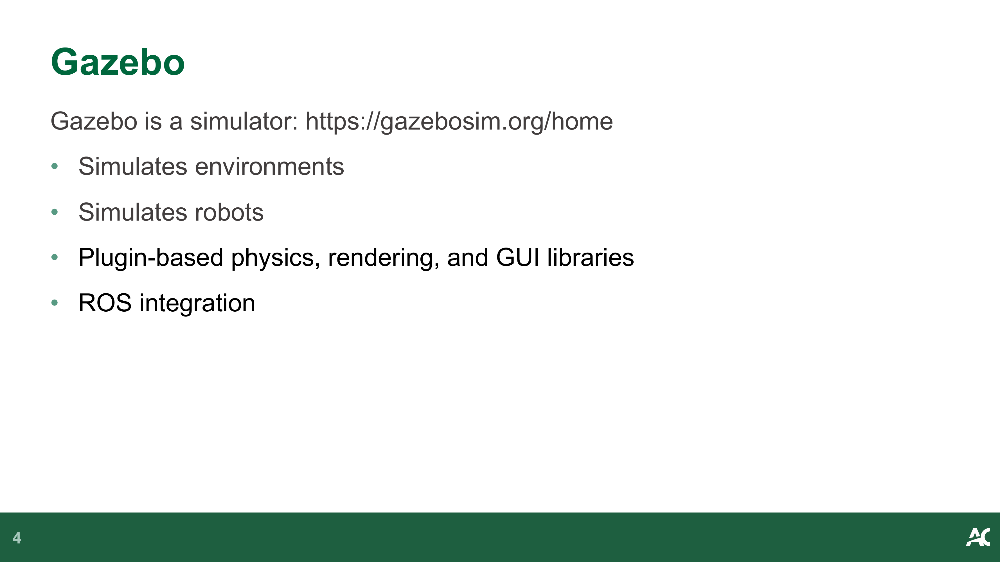

**Gazebo:** — Gazebo 仿真器

- Gazebo is a simulator: https://gazebosim.org/home — Gazebo 是一个仿真器
- Simulates environments — 模拟环境
- Simulates robots — 模拟机器人
- Plugin-based physics, rendering, and GUI libraries — 基于插件的物理引擎、渲染和 GUI 库
- ROS integration — ROS 集成

### 3.2 Gazebo 版本 (Gazebo Versions)

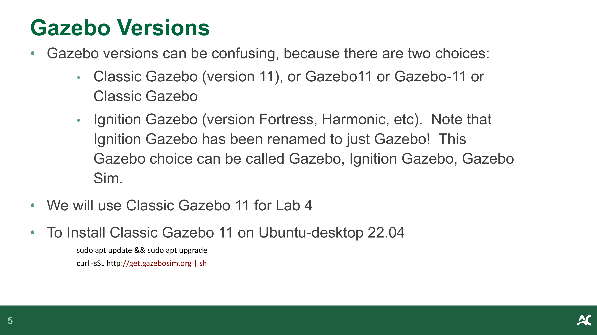

**Gazebo Versions:** — Gazebo 版本

- Gazebo versions can be confusing, because there are two choices: — Gazebo 版本容易混淆，因为有两种选择：
  - **Classic Gazebo** (version 11), or Gazebo11 or Gazebo-11 or Classic Gazebo — **经典 Gazebo**（版本 11），也叫 Gazebo11 或 Gazebo-11
  - **Ignition Gazebo** (version Fortress, Harmonic, etc). Note that Ignition Gazebo has been renamed to just Gazebo! This Gazebo choice can be called Gazebo, Ignition Gazebo, Gazebo Sim. — **Ignition Gazebo**（版本 Fortress、Harmonic 等）。注意 Ignition Gazebo 已重命名为 Gazebo！可叫作 Gazebo、Ignition Gazebo 或 Gazebo Sim。
- We will use Classic Gazebo 11 for Lab 4 — 我们将在 Lab 4 中使用经典 Gazebo 11
- To Install Classic Gazebo 11 on Ubuntu-desktop 22.04 — 在 Ubuntu-desktop 22.04 上安装经典 Gazebo 11：

```bash
sudo apt update && sudo apt upgrade
curl -sSL http://get.gazebosim.org | sh
```

---

## 4. 在 Create3 机器人上应用 RL (RL with Create3 Robot)

### 4.1 Create3 RL 架构 (Create3 RL Architecture)

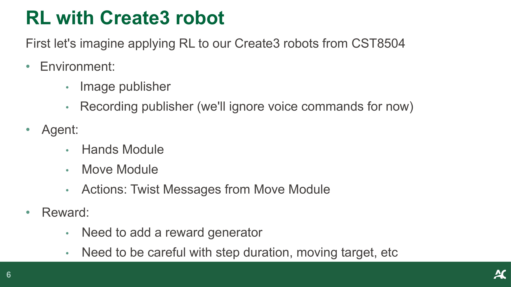

**RL with Create3 robot:** — 在 Create3 机器人上应用 RL

- First let's imagine applying RL to our Create3 robots from CST8504 — 首先想象将 RL 应用到 CST8504 课程的 Create3 机器人
- **Environment:** — **环境：**
  - Image publisher — 图像发布器
  - Recording publisher (we'll ignore voice commands for now) — 录音发布器（暂时忽略语音指令）
- **Agent:** — **智能体：**
  - Hands Module — 手部模块
  - Move Module — 移动模块
  - Actions: Twist Messages from Move Module — 动作：来自移动模块的 Twist 消息
- **Reward:** — **奖励：**
  - Need to add a reward generator — 需要添加奖励生成器
  - Need to be careful with step duration, moving target, etc — 需要注意步长时间、移动目标等

### 4.2 实物 Create3 配置 (Physical Create3 Setup)

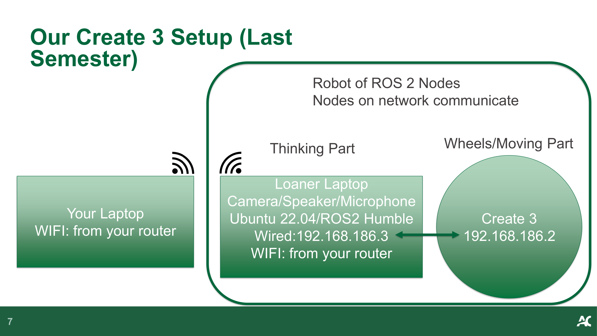

**Our Create 3 Setup (Last Semester):** — 我们的 Create 3 配置（上学期）

- Create 3 — Create 3 机器人
  - 192.168.186.2
- Loaner Laptop — 借用笔记本
  - Camera/Speaker/Microphone — 摄像头/扬声器/麦克风
  - Ubuntu 22.04/ROS2 Humble
  - Wired: 192.168.186.3
  - WIFI: from your router — WIFI：从你的路由器
- Your Laptop — 你的笔记本
  - WIFI: from your router — WIFI：从你的路由器
- Robot of ROS 2 Nodes — ROS 2 节点组成的机器人
- Nodes on network communicate — 网络上的节点通信
- Thinking Part — 思考部分
- Wheels/Moving Part — 轮子/移动部分

### 4.3 仿真 Create3 配置 (Simulated Create3 Setup)

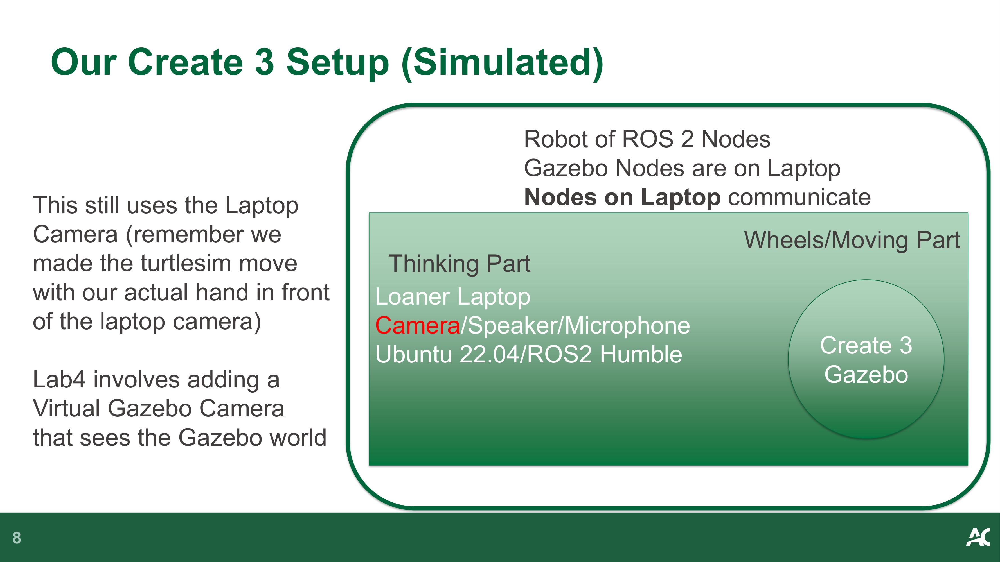

**Our Create 3 Setup (Simulated):** — 我们的 Create 3 配置（仿真版）

- Loaner Laptop — 借用笔记本
  - Camera/Speaker/Microphone — 摄像头/扬声器/麦克风
  - Ubuntu 22.04/ROS2 Humble
- Create 3 → Gazebo — Create 3 → Gazebo 仿真
- Robot of ROS 2 Nodes — ROS 2 节点组成的机器人
- Gazebo Nodes are on Laptop — Gazebo 节点在笔记本上
- Nodes on Laptop communicate — 笔记本上的节点通信
- Thinking Part — 思考部分
- Wheels/Moving Part — 轮子/移动部分
- This still uses the Laptop Camera (remember we made the turtlesim move with our actual hand in front of the laptop camera) — 这仍然使用笔记本摄像头（记得我们用实际的手在笔记本摄像头前面控制 turtlesim 移动）
- Lab4 involves adding a Virtual Gazebo Camera that sees the Gazebo world — Lab4 涉及添加一个虚拟 Gazebo 摄像头来观察 Gazebo 世界

---

## 5. 为什么 Gazebo 对 RL 重要 (Why Gazebo Matters for RL)

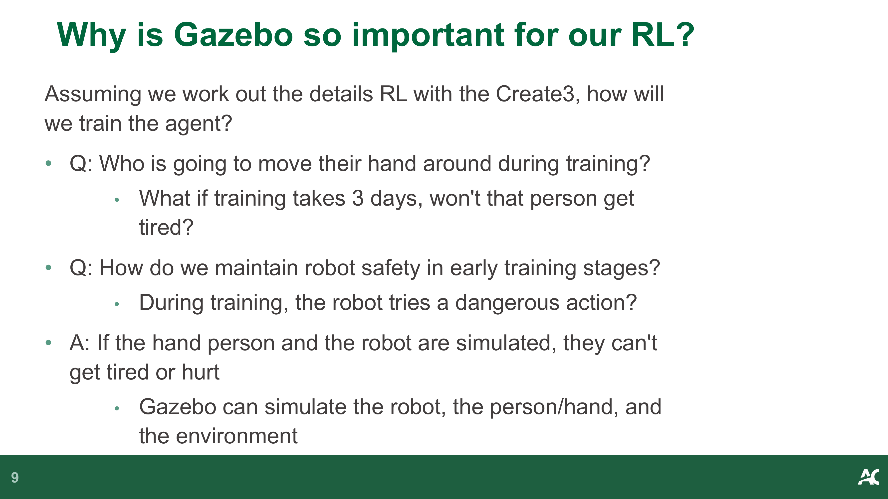

**Why is Gazebo so important for our RL?** — 为什么 Gazebo 对我们的 RL 如此重要？

- Assuming we work out the details RL with the Create3, how will we train the agent? — 假设我们解决了 Create3 的 RL 细节，我们将如何训练智能体？
- **Q:** Who is going to move their hand around during training? — **问：** 训练期间谁来移动手？
  - What if training takes 3 days, won't that person get tired? — 如果训练需要 3 天，那个人不会累吗？
- **Q:** How do we maintain robot safety in early training stages? — **问：** 在训练早期阶段如何保证机器人安全？
  - During training, the robot tries a dangerous action? — 训练时，机器人尝试了危险动作怎么办？
- **A:** If the hand person and the robot are simulated, they can't get tired or hurt — **答：** 如果手和机器人都是仿真的，它们不会疲劳也不会受伤
  - Gazebo can simulate the robot, the person/hand, and the environment — Gazebo 可以仿真机器人、人/手和环境

---

## 6. RL 架构图 (RL Architecture Diagrams)

### 6.1 当前 RL 架构 (Current RL Architecture)

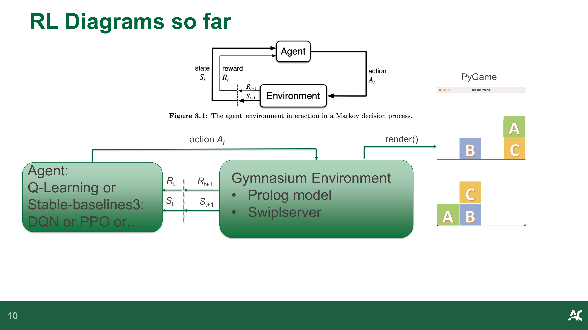

**RL Diagrams so far:** — 目前的 RL 架构图

- **Agent:** Q-Learning or Stable-baselines3: DQN or PPO or… — **智能体：** Q-Learning 或 Stable-baselines3：DQN 或 PPO 等
- **Gymnasium Environment:** — **Gymnasium 环境：**
  - Prolog model — Prolog 模型
  - Swiplserver
- action A_t → render() → PyGame — 动作 A_t → 渲染 → PyGame
- R_t, S_t ↔ R_t+1, S_t+1 — 奖励和状态的交互循环

### 6.2 ROS 2 与 Gazebo 的位置 (Where ROS 2 & Gazebo Fit)

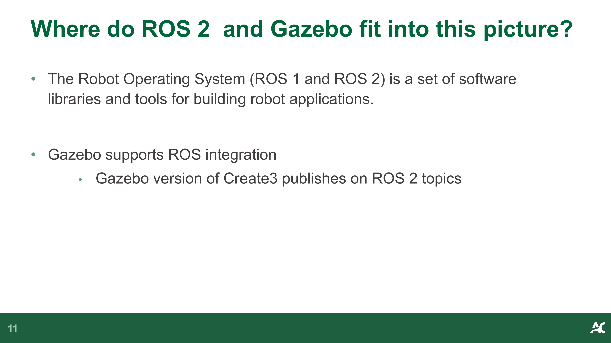

**Where do ROS 2 and Gazebo fit into this picture?** — ROS 2 和 Gazebo 在这个架构中的位置？

- The Robot Operating System (ROS 1 and ROS 2) is a set of software libraries and tools for building robot applications. — 机器人操作系统（ROS 1 和 ROS 2）是一组用于构建机器人应用的软件库和工具。
- Gazebo supports ROS integration — Gazebo 支持 ROS 集成
  - Gazebo version of Create3 publishes on ROS 2 topics — Gazebo 版本的 Create3 发布 ROS 2 话题

### 6.3 虚拟 Create3 架构 (Virtual Create3 Architecture)

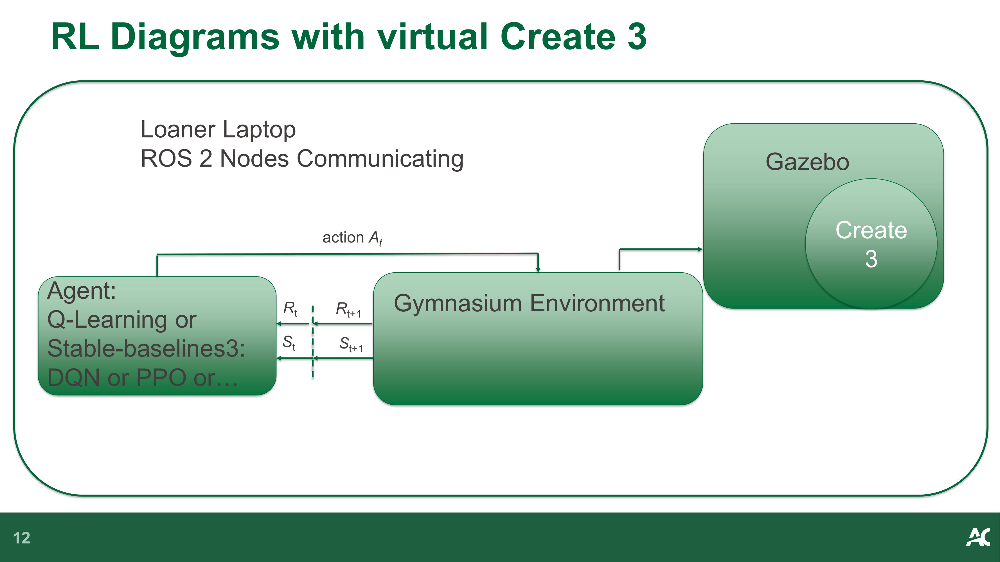

**RL Diagrams with virtual Create 3:** — 虚拟 Create 3 的 RL 架构图

- **Agent:** Q-Learning or Stable-baselines3: DQN or PPO or… — **智能体：** Q-Learning 或 Stable-baselines3：DQN 或 PPO 等
- **Gymnasium Environment** — **Gymnasium 环境**
- **Gazebo** → Create 3 (simulated) — **Gazebo** → Create 3（仿真）
- Loaner Laptop — 借用笔记本
- ROS 2 Nodes Communicating — ROS 2 节点通信

---

## 7. Create3 仿真器安装 (Create3 Simulator Setup)

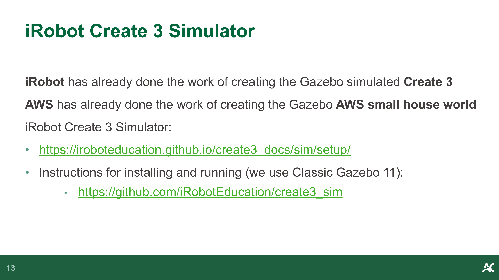

**iRobot Create 3 Simulator:** — iRobot Create 3 仿真器

- iRobot has already done the work of creating the Gazebo simulated Create 3 — iRobot 已经完成了创建 Gazebo 仿真 Create 3 的工作
- AWS has already done the work of creating the Gazebo AWS small house world — AWS 已经完成了创建 Gazebo AWS 小房子世界的工作
- iRobot Create 3 Simulator: — iRobot Create 3 仿真器：
  - Ref: https://iroboteducation.github.io/create3_docs/sim/setup/
  - Instructions for installing and running (we use Classic Gazebo 11): — 安装和运行说明（我们使用经典 Gazebo 11）：
  - Ref: https://github.com/iRobotEducation/create3_sim

---

## 8. 给 Create3 添加摄像头 (Adding a Camera to Create3)

### 8.1 机器人描述格式 (Robot Description Formats)

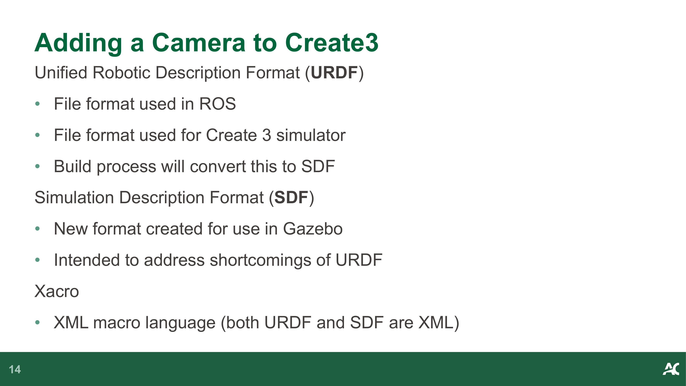

**Adding a Camera to Create3:** — 给 Create3 添加摄像头

- **Unified Robotic Description Format (URDF)** — **统一机器人描述格式 (URDF)**
  - File format used in ROS — ROS 中使用的文件格式
  - File format used for Create 3 simulator — Create 3 仿真器使用的文件格式
  - Build process will convert this to SDF — 构建过程会将其转换为 SDF
- **Simulation Description Format (SDF)** — **仿真描述格式 (SDF)**
  - New format created for use in Gazebo — 为 Gazebo 创建的新格式
  - Intended to address shortcomings of URDF — 旨在解决 URDF 的不足
- **Xacro** — **Xacro**
  - XML macro language (both URDF and SDF are XML) — XML 宏语言（URDF 和 SDF 都是 XML）

### 8.2 URDF 详细信息 (URDF Details)

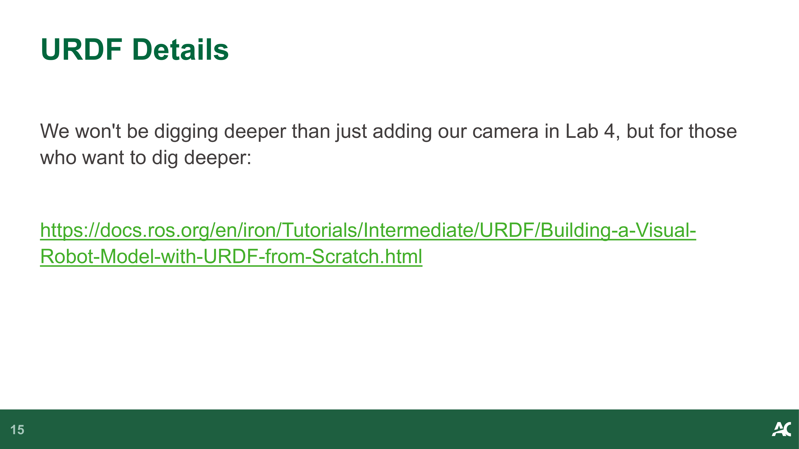

**URDF Details:** — URDF 详情

- We won't be digging deeper than just adding our camera in Lab 4, but for those who want to dig deeper: — 我们在 Lab 4 中只添加摄像头不会深入研究，但想深入了解的同学可以参考：

Ref: https://docs.ros.org/en/iron/Tutorials/Intermediate/URDF/Building-a-Visual-Robot-Model-with-URDF-from-Scratch.html

---

## 9. Rviz 可视化工具 (Rviz Visualization Tool)

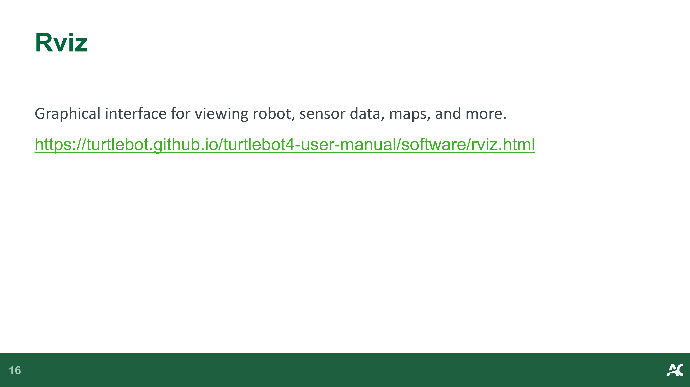

**Rviz:** — Rviz 可视化工具

- Graphical interface for viewing robot, sensor data, maps, and more. — 用于查看机器人、传感器数据、地图等的图形界面。

Ref: https://turtlebot.github.io/turtlebot4-user-manual/software/rviz.html

---

## 10. 动态规划 (Dynamic Programming)

### 10.1 DP 概述 (DP Overview)

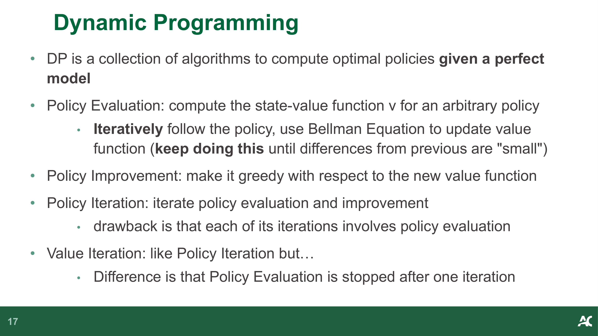

**Dynamic Programming:** — 动态规划

- DP is a collection of algorithms to compute optimal policies given a perfect model — DP 是一组在给定完美模型的情况下计算最优策略的算法
- **Policy Evaluation:** compute the state-value function v for an arbitrary policy — **策略评估：** 计算任意策略的状态值函数 v
  - Iteratively follow the policy, use Bellman Equation to update value function (keep doing this until differences from previous are "small") — 迭代地遵循策略，使用 Bellman 方程更新值函数（持续直到与上一次的差异"足够小"）
- **Policy Improvement:** make it greedy with respect to the new value function — **策略改进：** 使策略对新值函数贪心
- **Policy Iteration:** iterate policy evaluation and improvement — **策略迭代：** 交替进行策略评估和策略改进
  - drawback is that each of its iterations involves policy evaluation — 缺点是每次迭代都涉及策略评估
- **Value Iteration:** like Policy Iteration but… — **值迭代：** 类似策略迭代，但…
  - Difference is that Policy Evaluation is stopped after one iteration — 区别在于策略评估只进行一次迭代就停止

### 10.2 DP 实现 (DP Implementation)

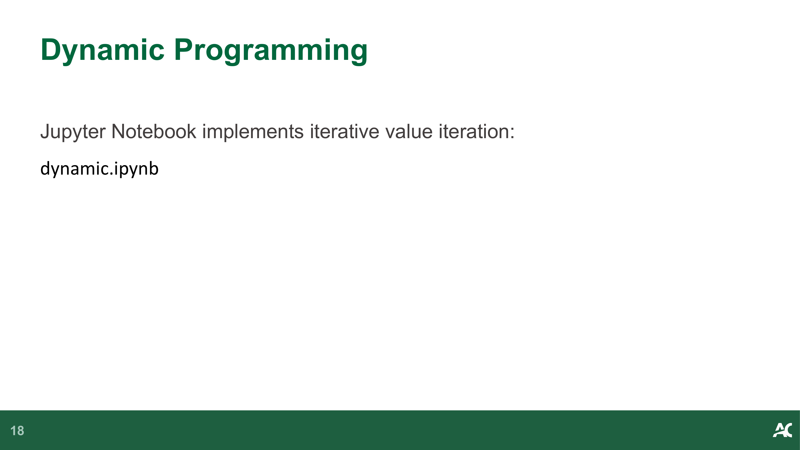

**Dynamic Programming:** — 动态规划

- Jupyter Notebook implements iterative value iteration: `dynamic.ipynb` — Jupyter Notebook 实现了迭代值迭代：`dynamic.ipynb`

---

## 11. 蒙特卡洛方法 (Monte Carlo Methods)

### 11.1 MC 基本概念 (MC Basic Concepts)

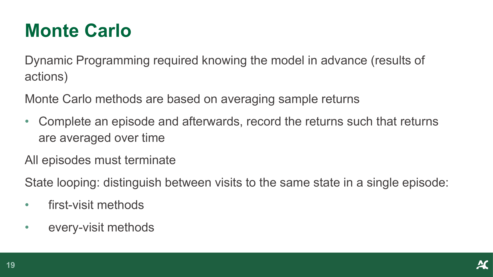

**Monte Carlo:** — 蒙特卡洛方法

- Dynamic Programming required knowing the model in advance (results of actions) — 动态规划需要事先知道模型（动作的结果）
- Monte Carlo methods are based on averaging sample returns — 蒙特卡洛方法基于对样本回报求平均
- Complete an episode and afterwards, record the returns such that returns are averaged over time — 完成一个 episode 后记录回报，使得回报随时间被平均
- All episodes must terminate — 所有 episode 必须终止
- State looping: distinguish between visits to the same state in a single episode: — 状态循环：区分同一个 episode 中对同一状态的访问：
  - **first-visit methods** — **首次访问方法**
  - **every-visit methods** — **每次访问方法**

### 11.2 MC 探索方法 (MC Exploration Methods)

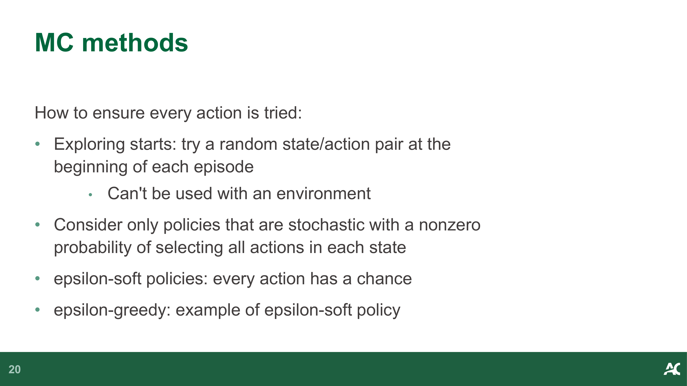

**MC methods:** — MC 方法

- How to ensure every action is tried: — 如何确保每个动作都被尝试：
- **Exploring starts:** try a random state/action pair at the beginning of each episode — **探索起始：** 在每个 episode 开始时尝试随机的状态/动作对
  - Can't be used with an environment — 不能与真实环境一起使用
- Consider only policies that are stochastic with a nonzero probability of selecting all actions in each state — 只考虑在每个状态下以非零概率选择所有动作的随机策略
- **epsilon-soft policies:** every action has a chance — **ε-软策略：** 每个动作都有机会被选择
- **epsilon-greedy:** example of epsilon-soft policy — **ε-贪心：** ε-软策略的一个例子

### 11.3 MC 实现 (MC Implementation)

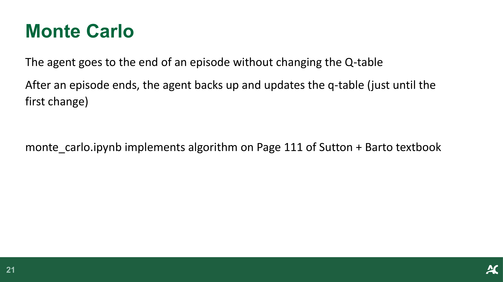

**Monte Carlo:** — 蒙特卡洛方法

- The agent goes to the end of an episode without changing the Q-table — 智能体走到 episode 结束时不改变 Q 表
- After an episode ends, the agent backs up and updates the q-table (just until the first change) — episode 结束后，智能体回溯并更新 Q 表（仅到第一次变化处）
- `monte_carlo.ipynb` implements algorithm on Page 111 of Sutton + Barto textbook — `monte_carlo.ipynb` 实现了 Sutton + Barto 教科书第 111 页的算法

---
