# Week 9: 值函数近似 (Value Function Approximation)

> Source: `CST8509_09_Value_Fn_approx.pptx`
> Total slides: 17
> Instructor: CST8509 | Week 9

---

## 1. 课程议程 (Today's Agenda)


**CST8509 Value Function Approx** — CST8509 值函数近似


**Today's Agenda:** — 今日议程

- Review Quiz — 复习测验
- Value Function Approximation — 值函数近似
- Add actors to Gazebo simulated worlds — 在 Gazebo 仿真世界中添加角色

> **📝 Notes:**
>
> **承接**: 本节作为开篇，列出本周三大主题；核心理论内容（值函数近似）将在第2-5节展开，Gazebo 实操部分在第6节。

---

## 2. 复习：Q-Learning 与时序差分 (Review: Q-Learning and Temporal Difference)

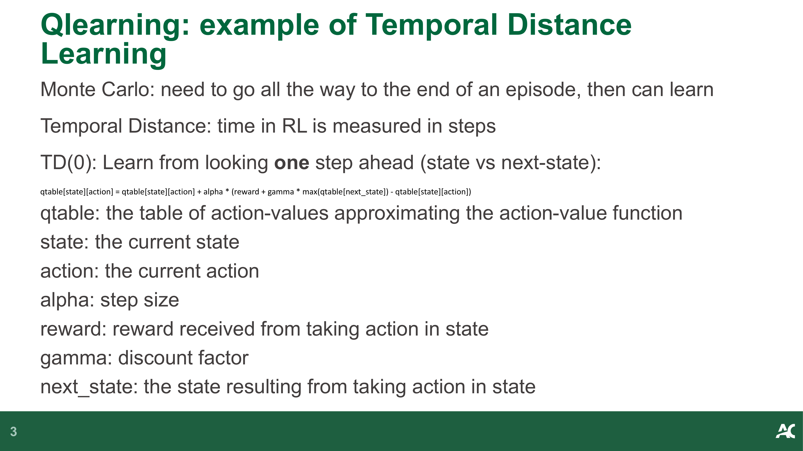

**Qlearning: example of Temporal Distance Learning** — Q-Learning：时序差分学习示例

- Monte Carlo: need to go all the way to the end of an episode, then can learn — 蒙特卡洛方法：需要走完整个回合才能学习
- Temporal Distance: time in RL is measured in steps — 时序差分：RL 中的时间以步数衡量
- TD(0): Learn from looking one step ahead (state vs next-state): — TD(0)：通过前看一步来学习（当前状态 vs 下一状态）：

```
qtable[state][action] = qtable[state][action] + alpha * (reward + gamma * max(qtable[next_state]) - qtable[state][action])
```

- `qtable`: the table of action-values approximating the action-value function — Q 表：近似动作价值函数的动作价值表
- `state`: the current state — 当前状态
- `action`: the current action — 当前动作
- `alpha`: step size — 步长（学习率）
- `reward`: reward received from taking action in state — 在状态中采取动作获得的奖励
- `gamma`: discount factor — 折扣因子
- `next_state`: the state resulting from taking action in state — 采取动作后转移到的下一个状态

> **📝 Notes:**
>
> **承接**: 本节回顾了 Q-Learning 的 TD(0) 更新公式，强调其依赖 Q 表存储每个状态-动作对的值；这为下一节引出"大规模状态空间下 Q 表不可行"的问题做铺垫。

---

## 3. 值函数近似：大规模问题的解决方案 (Value Function Approximation: Solution for Large-Scale Problems)

### 3.1 大规模问题的挑战 (The Large-Scale Problem)

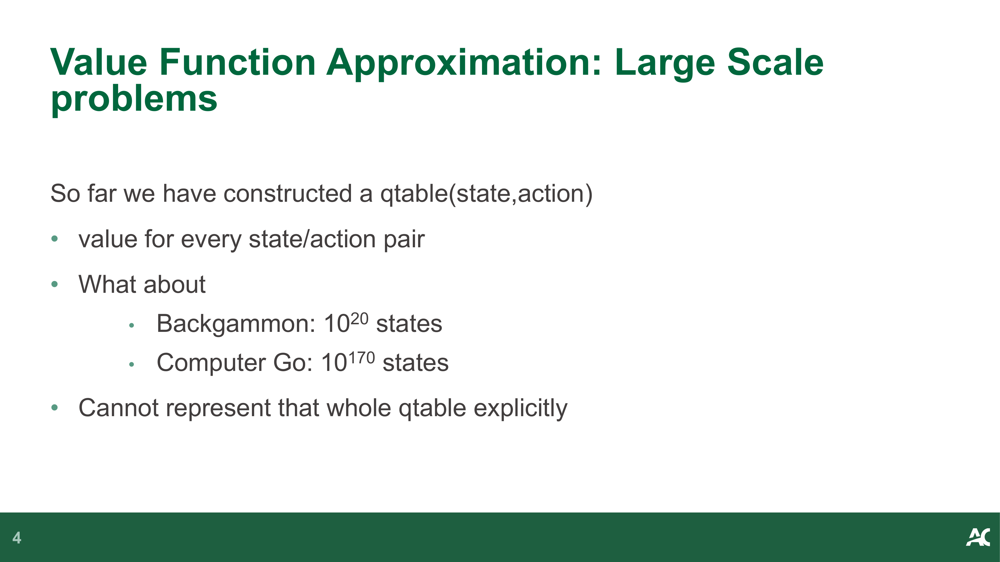

**Value Function Approximation: Large Scale problems** — 值函数近似：大规模问题

- So far we have constructed a qtable(state, action) — 到目前为止我们构建了 Q 表 qtable(state, action)
- value for every state/action pair — 存储每个状态/动作对的值
- What about — 但如果面对：
  - Backgammon: 10²⁰ states — 西洋双陆棋：10²⁰ 个状态
  - Computer Go: 10¹⁷⁰ states — 围棋：10¹⁷⁰ 个状态
- Cannot represent that whole qtable explicitly — 无法显式地表示整个 Q 表

### 3.2 函数近似的思想 (The Function Approximation Idea)

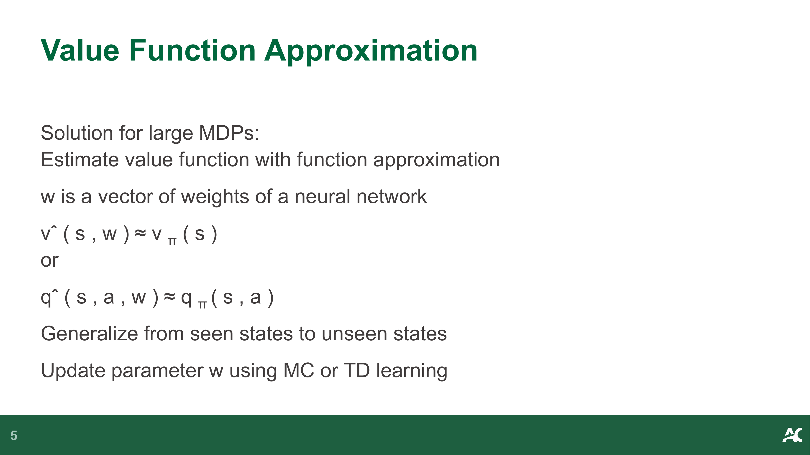

**Value Function Approximation** — 值函数近似

- Solution for large MDPs: — 大规模 MDP 的解决方案：
- Estimate value function with function approximation — 用函数近似来估计值函数
- **w** is a vector of weights of a neural network — **w** 是神经网络的权重向量
- v̂(s, w) ≈ v_π(s) — 用参数化函数 v̂(s, w) 近似真实状态价值函数 v_π(s)
- or q̂(s, a, w) ≈ q_π(s, a) — 或用 q̂(s, a, w) 近似真实动作价值函数 q_π(s, a)
- Generalize from seen states to unseen states — 从已见状态泛化到未见状态
- Update parameter **w** using MC or TD learning — 使用蒙特卡洛或 TD 学习更新参数 **w**

> **📝 Notes:**
>
> **承接**: 上一节回顾了 Q 表方法的 TD(0) 更新规则，但 Q 表在状态空间巨大时不可行；本节引入函数近似的核心思想——用参数化函数（神经网络权重 w）替代 Q 表，实现泛化。这为下一节 DQN 的具体实现奠定理论基础。

---

## 4. DQN：深度 Q 网络 (DQN: Deep Q-Network)

### 4.1 DQN 与 Q-Learning 的关系 (DQN vs Q-Learning)

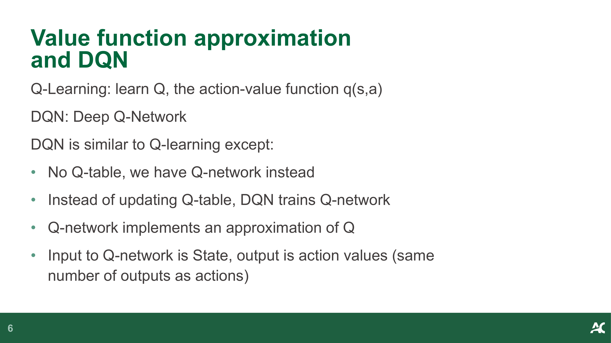

**Value function approximation and DQN** — 值函数近似与 DQN

- Q-Learning: learn Q, the action-value function q(s,a) — Q-Learning：学习 Q，即动作价值函数 q(s,a)
- DQN: Deep Q-Network — DQN：深度 Q 网络
- DQN is similar to Q-learning except: — DQN 与 Q-Learning 类似，但区别在于：
  - No Q-table, we have Q-network instead — 没有 Q 表，取而代之的是 Q 网络
  - Instead of updating Q-table, DQN trains Q-network — DQN 训练 Q 网络，而不是更新 Q 表
  - Q-network implements an approximation of Q — Q 网络实现了 Q 函数的近似
  - Input to Q-network is State, output is action values (same number of outputs as actions) — Q 网络的输入是状态，输出是动作价值（输出数量等于动作数量）

### 4.2 在线网络与目标网络 (Online and Target Networks)

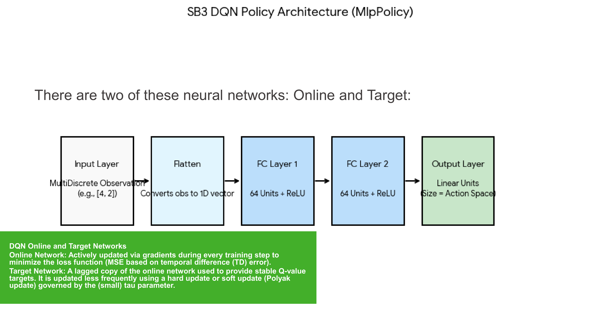

**DQN Online and Target Networks** — DQN 在线网络与目标网络

- There are two of these neural networks: Online and Target: — DQN 有两个神经网络：在线网络和目标网络：
- **Online Network**: Actively updated via gradients during every training step to minimize the loss function (MSE based on temporal difference (TD) error). — **在线网络**：在每个训练步骤中通过梯度主动更新，以最小化损失函数（基于时序差分 TD 误差的 MSE）。
- **Target Network**: A lagged copy of the online network used to provide stable Q-value targets. It is updated less frequently using a hard update or soft update (Polyak update) governed by the (small) tau parameter. — **目标网络**：在线网络的滞后副本，用于提供稳定的 Q 值目标。使用硬更新或软更新（Polyak 更新）进行较低频率的更新，由（较小的）tau 参数控制。

### 4.3 DQN 损失函数 (DQN Loss Function)

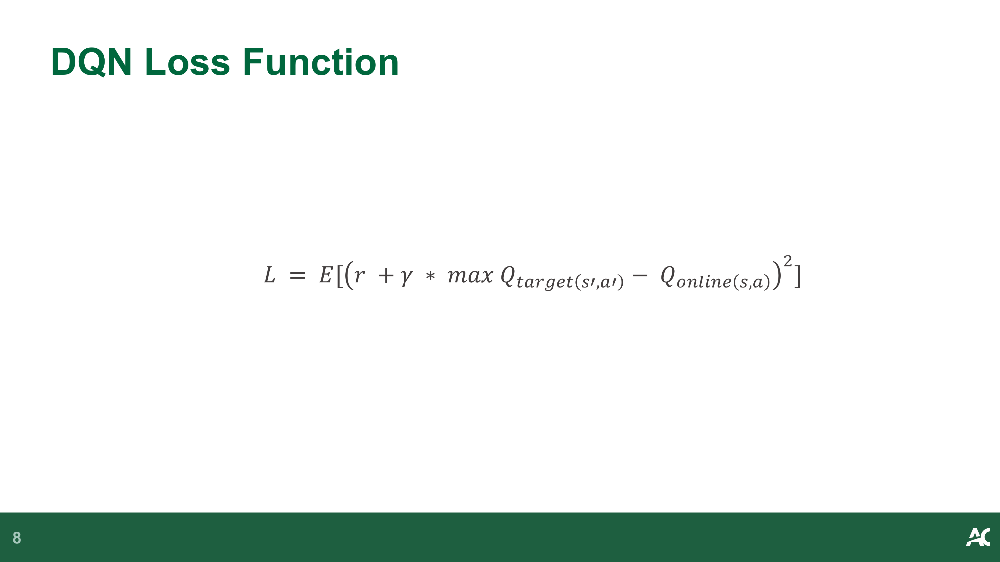

**DQN Loss Function** — DQN 损失函数

$$L = E\left[\left(r + \gamma \cdot \max_{a'} Q_{target}(s', a') - Q_{online}(s, a)\right)^2\right]$$

- `r`: reward — 奖励
- `γ`: discount factor — 折扣因子
- `Q_target(s', a')`: target network's Q-value at next state — 目标网络在下一状态的 Q 值
- `Q_online(s, a)`: online network's Q-value at current state-action — 在线网络在当前状态-动作的 Q 值
- The loss is the squared TD error, averaged over a batch — 损失是 TD 误差的平方，在一个批次上取平均

### 4.4 DQN 算法流程 (DQN Algorithm Flow)

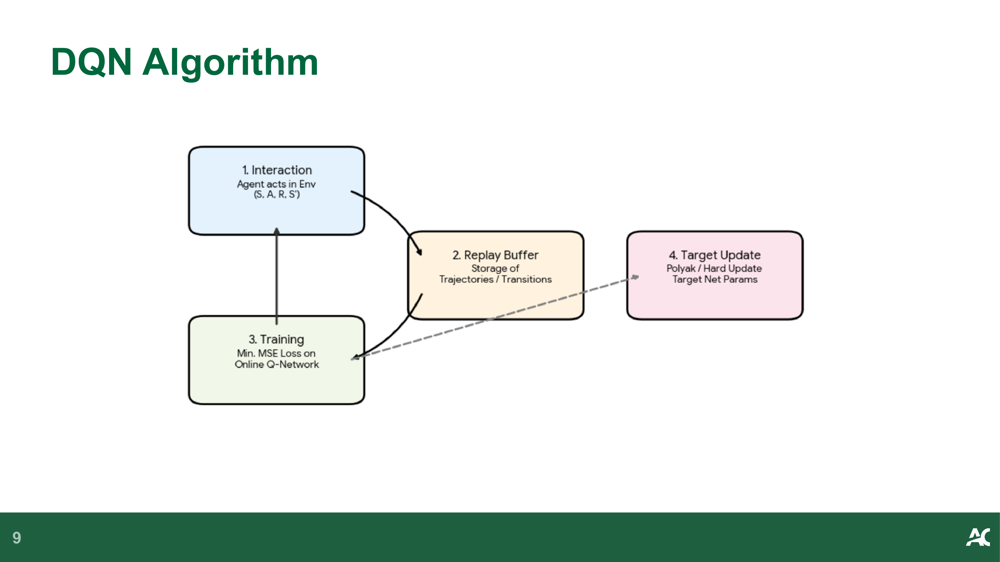

**DQN Algorithm** — DQN 算法流程

> 📖 **图解读笔记：**
>
> | 模块 | 颜色 | 含义 |
> |------|------|------|
> | 1. Interaction | 蓝色 | Agent 在环境中执行动作，收集 (S, A, R, S') 转移 |
> | 2. Replay Buffer | 黄色 | 存储轨迹/转移数据，打破时间相关性 |
> | 3. Training | 绿色 | 在线 Q 网络在随机批次上最小化 MSE 损失 |
> | 4. Target Update | 粉色 | 通过 Polyak / 硬更新将权重复制到目标网络 |
>
> **阅读顺序**：从左上 1→下方 3→中间 2→右侧 4，形成循环
> **核心信息**：DQN 的四步循环 — 交互→存储→训练→同步目标网络

### 4.5 DQN 训练细节 (DQN Training Details)

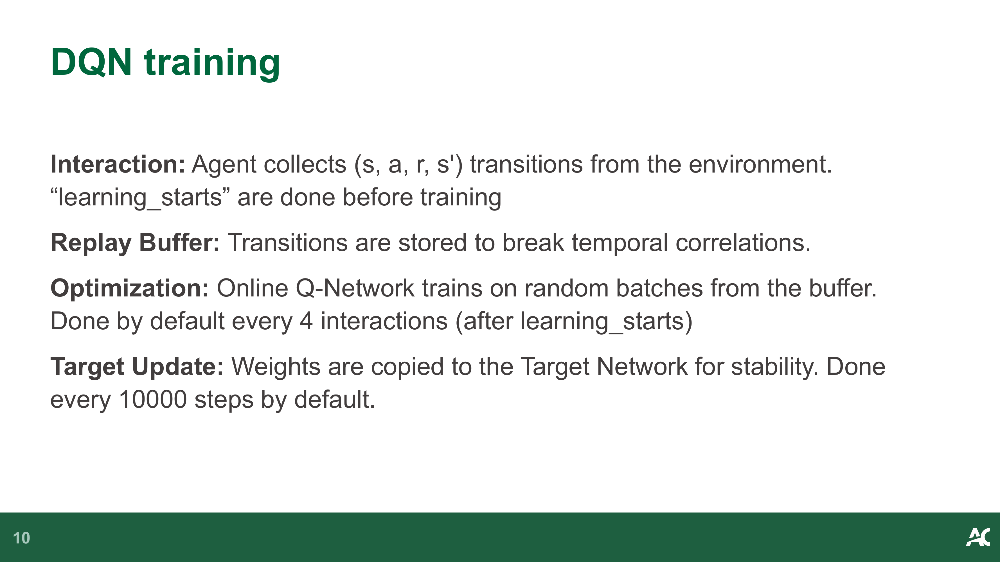

**DQN training** — DQN 训练

- **Interaction**: Agent collects (s, a, r, s') transitions from the environment. "learning_starts" are done before training — **交互**：Agent 从环境中收集 (s, a, r, s') 转移。"learning_starts" 在训练前完成
- **Replay Buffer**: Transitions are stored to break temporal correlations. — **经验回放缓冲区**：存储转移数据以打破时间相关性。
- **Optimization**: Online Q-Network trains on random batches from the buffer. Done by default every 4 interactions (after learning_starts) — **优化**：在线 Q 网络从缓冲区随机抽取批次进行训练。默认每 4 次交互进行一次（在 learning_starts 之后）
- **Target Update**: Weights are copied to the Target Network for stability. Done every 10000 steps by default. — **目标更新**：将权重复制到目标网络以保持稳定性。默认每 10000 步进行一次。

> **📝 Notes:**
>
> **承接**: 上一节引入值函数近似的理论思想；本节将其具体化为 DQN 架构——双网络设计（在线+目标）、损失函数、四步训练循环，以及关键超参数（learning_starts、batch 间隔、target 更新频率）。这些 DQN 核心知识为下一节 PPO 的 Actor-Critic 架构提供对比基础。

---

## 5. PPO 与值函数近似 (PPO and Value Function Approximation)

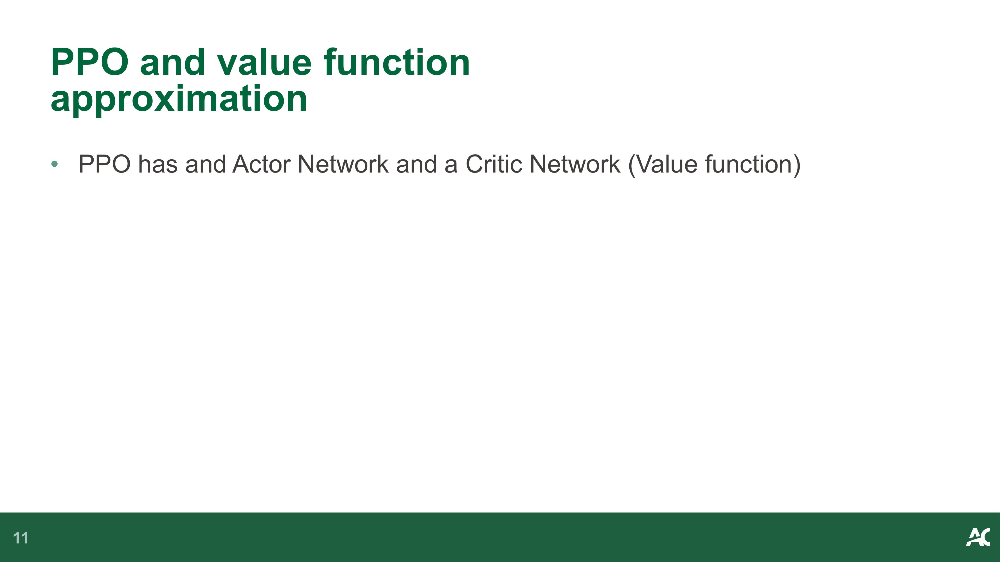

**PPO and value function approximation** — PPO 与值函数近似

- PPO has an Actor Network and a Critic Network (Value function) — PPO 包含 Actor 网络和 Critic 网络（价值函数）

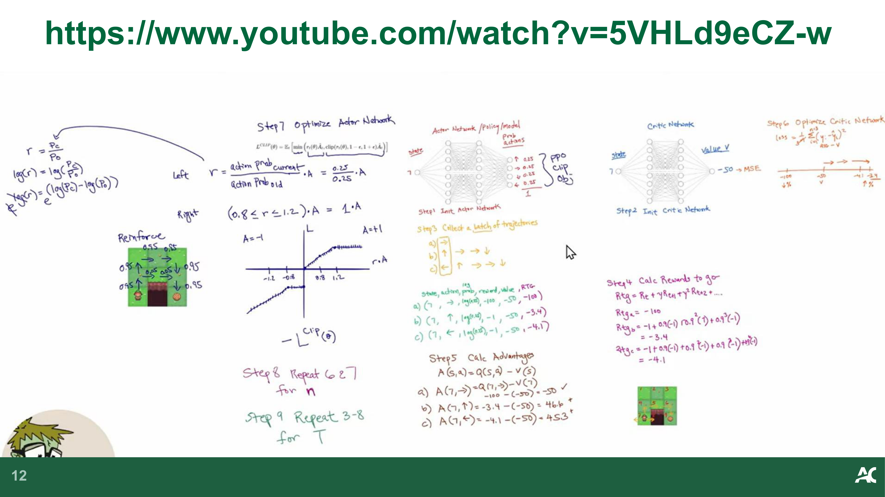

**参考视频** — Reference Video

- Ref: https://www.youtube.com/watch?v=5VHLd9eCZ-w

> **📝 Notes:**
>
> **承接**: 上一节详细讲解了 DQN 的值函数近似实现；本节简要引出 PPO 算法——它也使用神经网络近似值函数，但采用 Actor-Critic 架构，Actor 负责策略、Critic 负责价值评估。这为理解不同 RL 算法家族（基于价值 vs 基于策略 vs Actor-Critic）提供完整视角。

---

## 6. Gazebo 仿真：角色与轨迹 (Gazebo Simulation: Actors and Trajectories)

### 6.1 Gazebo 角色简介 (Actors in Gazebo Worlds)

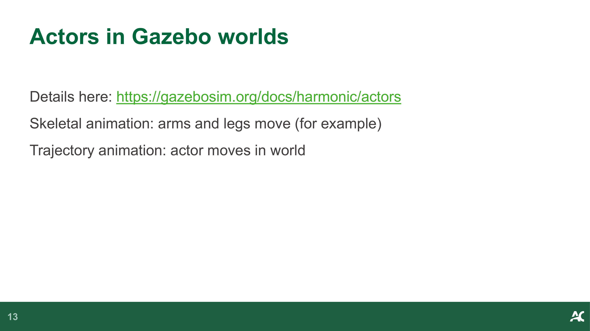

**Actors in Gazebo worlds** — Gazebo 世界中的角色

- Details here: https://gazebosim.org/docs/harmonic/actors — 详情见：https://gazebosim.org/docs/harmonic/actors
- **Skeletal animation**: arms and legs move (for example) — **骨骼动画**：手臂和腿部运动（举例）
- **Trajectory animation**: actor moves in world — **轨迹动画**：角色在世界中移动

### 6.2 红球追踪对象 (Red Ball to Follow)

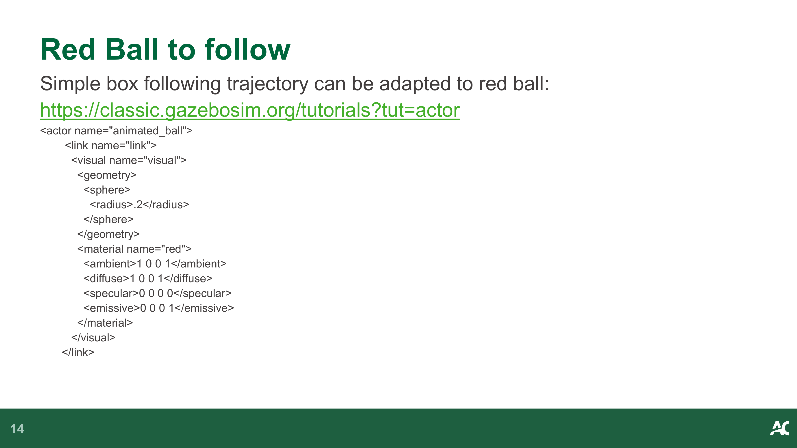

**Red Ball to follow** — 待追踪的红球

- Simple box following trajectory can be adapted to red ball — 简单方块跟随轨迹可以改造为红球
- Ref: https://classic.gazebosim.org/tutorials?tut=actor

```xml
<actor name="animated_ball">
  <link name="link">
    <visual name="visual">
      <geometry>
        <sphere>
          <radius>.2</radius>
        </sphere>
      </geometry>
      <material name="red">
        <ambient>1 0 0 1</ambient>
        <diffuse>1 0 0 1</diffuse>
        <specular>0 0 0 0</specular>
        <emissive>0 0 0 1</emissive>
      </material>
    </visual>
  </link>
```

### 6.3 红球轨迹定义 (Red Ball Trajectory)

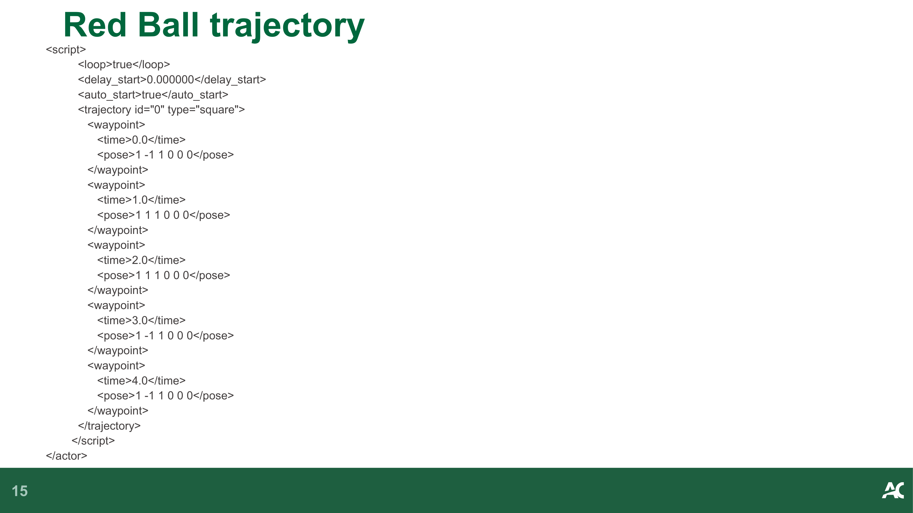

**Red Ball trajectory** — 红球轨迹

```xml
<script>
  <loop>true</loop>
  <delay_start>0.000000</delay_start>
  <auto_start>true</auto_start>
  <trajectory id="0" type="square">
    <waypoint>
      <time>0.0</time>
      <pose>1 -1 1 0 0 0</pose>
    </waypoint>
    <waypoint>
      <time>1.0</time>
      <pose>1 1 1 0 0 0</pose>
    </waypoint>
    <waypoint>
      <time>2.0</time>
      <pose>1 1 1 0 0 0</pose>
    </waypoint>
    <waypoint>
      <time>3.0</time>
      <pose>1 -1 1 0 0 0</pose>
    </waypoint>
    <waypoint>
      <time>4.0</time>
      <pose>1 -1 1 0 0 0</pose>
    </waypoint>
  </trajectory>
</script>
</actor>
```

### 6.4 集成到 AWS 小屋 (Add to AWS Small House)

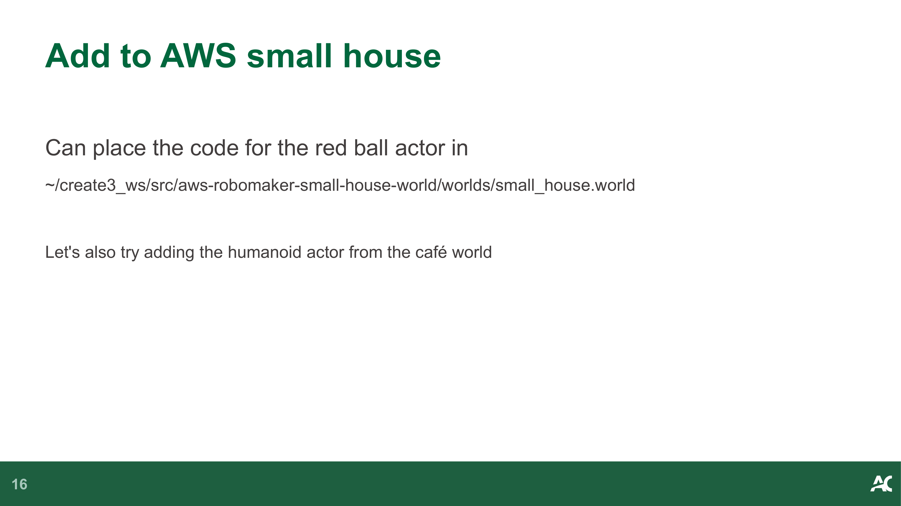

**Add to AWS small house** — 添加到 AWS 小屋

- Can place the code for the red ball actor in `~/create3_ws/src/aws-robomaker-small-house-world/worlds/small_house.world` — 可以将红球角色代码放在 `~/create3_ws/src/aws-robomaker-small-house-world/worlds/small_house.world`
- Let's also try adding the humanoid actor from the café world — 同时尝试从咖啡馆世界添加人形角色

### 6.5 RL 与红球追踪 (Reinforcement Learning with Red Ball)

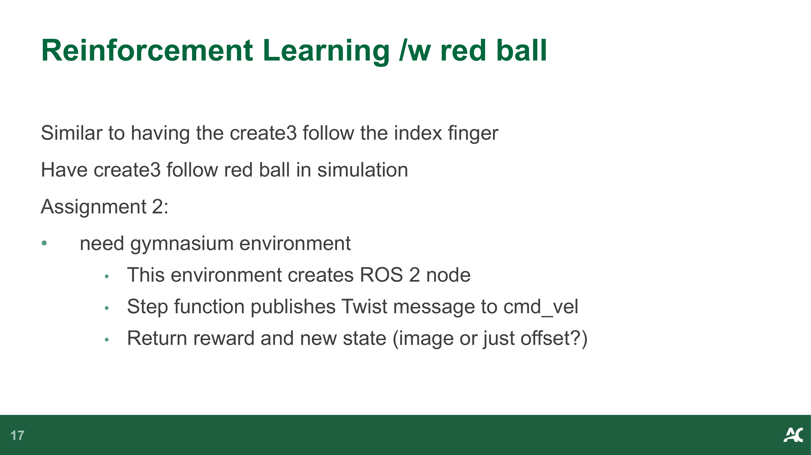

**Reinforcement Learning /w red ball** — 使用红球的强化学习

- Similar to having the create3 follow the index finger — 类似于让 Create3 跟随食指
- Have create3 follow red ball in simulation — 让 Create3 在仿真中跟随红球
- **Assignment 2:** — **作业 2：**
  - need gymnasium environment — 需要 gymnasium 环境
  - This environment creates ROS 2 node — 该环境创建 ROS 2 节点
  - Step function publishes Twist message to cmd_vel — Step 函数发布 Twist 消息到 cmd_vel
  - Return reward and new state (image or just offset?) — 返回奖励和新状态（图像还是仅偏移量？）

> **📝 Notes:**
>
> **承接**: 前面各节完成了值函数近似的理论（Q表局限→函数近似→DQN→PPO）；本节将理论应用到实际 Gazebo 仿真——通过定义红球轨迹和 Create3 Gymnasium 环境，将 DQN/PPO 的值函数近似技术用于机器人跟踪任务（作业 2 的核心）。

---
