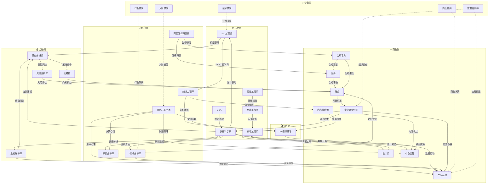
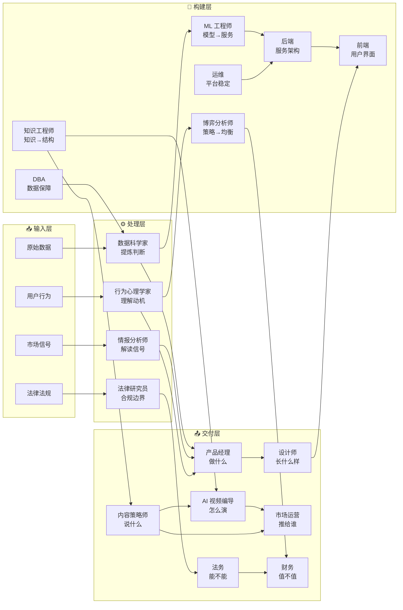
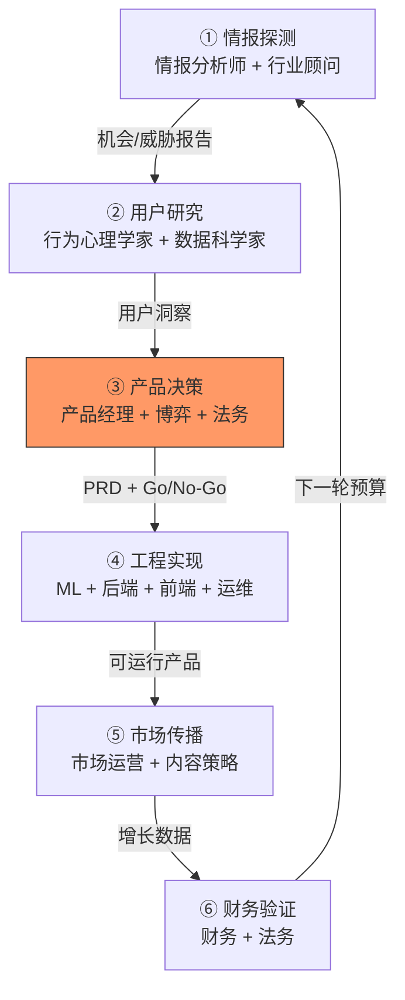
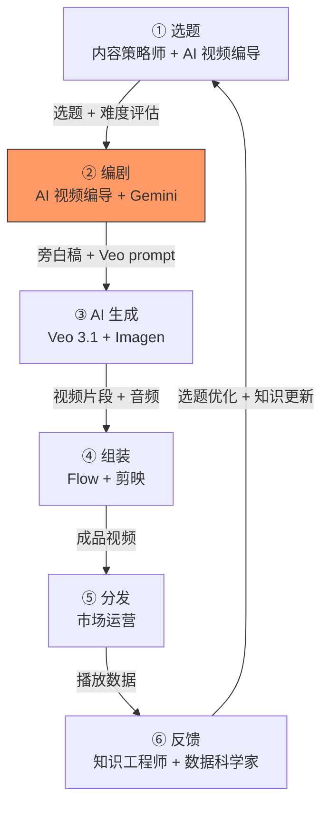

# Knowledge Map — 一人公司全角色执行蓝图

> 一人公司，29 个节点，每角色一棵树。
> 五层结构：**角色树**（我是谁）→ **任务树**（我干什么）→ **执行流**（什么顺序）→ **学术树**（我学什么）→ **文件树**（知识放哪）
> 每棵学术树按深度分六层：本科 → 研究生 → 博士 → 教授 → 院士 → 开山祖师。
> 课程名来源见文末"来源校准"一节。

## 方法论：认知生产理论 Cognitive Production Theory

> **一句话**：一人公司的本质是一条认知生产线 ——
> **数据 → 知识 → 决策 → 产品 → 用户 → 现金流**

```
原始数据         知识结构         战略决策         产品交付         用户价值         商业闭环
  ┌─────┐       ┌─────┐       ┌─────┐       ┌─────┐       ┌─────┐       ┌─────┐
  │数 据│──────▶│知 识│──────▶│决 策│──────▶│产 品│──────▶│用 户│──────▶│现金流│
  └─────┘       └─────┘       └─────┘       └─────┘       └─────┘       └─────┘
   谁做？         谁做？         谁做？         谁做？         谁做？         谁做？
   数据科学家     知识工程师     产品经理       工程师团队     市场运营       财务
   DBA           情报分析师     博弈分析师     设计师         内容策略师     法务
   运维           行为心理学家   商业顾问       ML 工程师      行为心理学家
                                行业顾问
```

**为什么叫"认知生产理论"？**

- **认知**：公司的核心资产不是代码也不是产品，而是**对世界的理解**
- **生产**：理解不是目的，把理解转化为**可交付的价值**才是
- **理论**：这不是灵感拼凑，而是一条**可重复、可审计、可优化**的生产线

**五层结构如何服务这条生产线：**

| 层 | 作用 | 类比 |
|----|------|------|
| 角色树 | 定义生产线上的**工位** | 工厂车间的工位布局图 |
| 任务树 | 定义每个工位的**输入/输出/SOP** | 每个工位的作业指导书 |
| 执行流 | 定义工位之间的**时序链接** | 生产线的工序流程图 |
| 学术树 | 定义操作员需要的**技能认证** | 上岗培训体系 |
| 文件树 | 定义知识的**存储和检索方式** | 仓库管理系统 |


## 目录

| 层 | 章节 | 回答的问题 |
|----|------|------------|
| **第一层** | 角色树 | 一人公司有哪些角色？谁依赖谁？ |
| **第二层** | 任务树 | 每个角色的核心问题、输入、输出、交付给谁？ |
| **第三层** | 执行流 | 事情按什么顺序发生？哪些角色先动、哪些后动？ |
| **第四层** | 学术树 | 每个角色需要哪些学科？从本科到开山祖师怎么排？ |
| **第五层** | 文件树 | 知识用什么格式存？目录怎么组织？ |
| **附录** | 来源校准 / 建设进度 | 课程来自哪些大学？建设到什么程度？ |

---

# 第一层：角色树 — 我是谁

---

## 1.1 组织架构

- **一人公司**
  - **技术侧**（6 角色）
    - 数据科学家 Data Scientist
    - ML 工程师 ML Engineer
    - 前端工程师 Frontend Engineer
    - 后端工程师 Backend Engineer
    - 数据库管理员 DBA
    - 运维工程师 DevOps Engineer
  - **金融侧**（4 角色）
    - 量化分析师 Quant Analyst
    - 交易员 Trader
    - 风控分析师 Risk Analyst
    - 投资分析师 Investment Analyst
  - **研究侧**（5 角色）
    - 情报分析师 Intelligence Analyst
    - 知识工程师 Knowledge Engineer
    - 行为心理学家 Behavioral Psychologist
    - 跨国法律研究员 Cross-border Legal Researcher
    - 博弈分析师 Game Theorist
  - **商业侧**（8 角色）
    - 产品经理 Product Manager
    - 设计师 UI/UX Designer
    - 内容策略师 Content Strategist
    - 市场运营 Marketing
    - 财务 Finance
    - 法务 Legal
    - 合规专员 Compliance Officer
    - 企业运营经理 Operations Manager
  - **创作侧**（1 角色）
    - AI 视频编导 AI Video Director
  - **智囊团**（5 顾问）
    - 技术顾问 Technical Advisor
    - 商业顾问 Business Advisor
    - 行业顾问 Industry Advisor
    - 人脉顾问 Network Advisor
    - 管理咨询师 Management Consultant

---

## 1.2 角色依赖关系图

> 实线箭头 = 知识/能力流向（A → B 意为「A 的输出是 B 的输入」）。
> 虚线箭头 = 顾问辐射。



**关键依赖链路：**

| 链路       | 流向                                              | 说明                           |
| ---------- | ------------------------------------------------- | ------------------------------ |
| 数据链     | DBA → 数据科学家 → ML 工程师                      | 从数据存储到统计分析到机器学习 |
| 基础设施链 | 运维 → 后端 → 前端                                | 从基础设施到服务到界面         |
| 情报链     | 数据科学家 → 情报分析师 → 产品经理                | 从数据分析到竞争情报到产品决策 |
| 影响力链   | 行为心理学家 → 博弈分析师 → 财务                  | 从决策心理到博弈定价到财务执行 |
| 内容链     | 知识工程师 → 内容策略师 → 市场运营                | 从知识组织到内容生产到市场分发 |
| 合规链     | 跨国法律研究员 → 合规专员 → 法务 → 财务           | 从法律研究到合规监控到审查到执行 |
| 创作链     | 知识工程师 → AI 视频编导 → 市场运营               | 从知识地图到视频生产到社媒分发 |
| 量化链     | 数据科学家 → 量化分析师 → 交易员                  | 从统计建模到策略开发到交易执行 |
| 风控链     | 量化分析师 → 风控分析师 → 财务                    | 从模型风险到风险评估到财务执行 |
| 投研链     | 情报分析师 → 投资分析师 → 量化分析师              | 从竞争情报到估值分析到量化验证 |
| 运营链     | 企业运营经理 → 产品经理 → 数据科学家              | 从运营反馈到需求优化到数据驱动 |

---

# 第二层：任务树 — 我干什么

> 角色树回答“我是谁”，学术树回答“我学什么”，
> **任务树回答“我解决什么问题、输入什么、输出什么、交付给谁”。**
> 没有这层，知识地图只是书架；有了这层，知识地图变成作战地图。

---

## 2.1 ⚙️ 技术侧

#### 1. 数据科学家 Data Scientist

| 维度 | 内容 |
|------|------|
| **核心问题** | 如何从噪声数据中提炼可执行判断？ |
| **典型输入** | 原始数据（结构化/非结构化）、业务目标、实验条件、领域假设 |
| **典型输出** | 统计指标、预测模型、洞察报告、A/B 实验结论、可视化看板 |
| **核心方法** | EDA、假设检验、回归/分类、因果推断、贝叶斯建模、时间序列 |
| **交付下游** | → ML 工程师（模型原型）→ 产品经理（数据洞察）→ 市场运营（用户分析）→ 博弈分析师（统计建模） |

#### 2. ML 工程师 ML Engineer

| 维度 | 内容 |
|------|------|
| **核心问题** | 如何把模型从实验室原型变成可靠的生产系统？ |
| **典型输入** | 数据科学家的模型原型、标注数据、性能基线、部署环境约束 |
| **典型输出** | 训练好的模型（含权重 + 配置）、推理服务 API、模型监控仪表盘、MLOps 管线 |
| **核心方法** | 深度学习、特征工程、超参搜索、分布式训练、模型压缩/量化、A/B 测试 |
| **交付下游** | → 后端工程师（模型 API）→ 知识工程师（NLP/图学习模型）→ 产品经理（AI 功能） |

#### 3. 前端工程师 Frontend Engineer

| 维度 | 内容 |
|------|------|
| **核心问题** | 如何让用户在 3 秒内理解产品价值？ |
| **典型输入** | 设计师的 UI 规范、后端 API、用户行为数据、性能预算 |
| **典型输出** | 可交互界面（Web/App）、组件库、可视化交互、前端性能报告 |
| **核心方法** | React/Vue、响应式设计、状态管理、性能优化、可访问性 |
| **交付下游** | → 用户（最终界面）→ 设计师（实现反馈）→ 市场运营（落地页） |

#### 4. 后端工程师 Backend Engineer

| 维度 | 内容 |
|------|------|
| **核心问题** | 如何构建高可用、可扩展的服务架构？ |
| **典型输入** | 产品需求、ML 模型 API、数据库 schema、流量预估 |
| **典型输出** | RESTful/GraphQL API、微服务架构、消息队列、缓存策略、监控告警 |
| **核心方法** | 分布式系统、API 设计、数据库优化、容器化、安全认证 |
| **交付下游** | → 前端工程师（API 服务）→ ML 工程师（推理基础设施）→ DBA（数据访问层） |

#### 5. 数据库管理员 DBA

| 维度 | 内容 |
|------|------|
| **核心问题** | 如何保证数据在任何规模下可靠、快速、一致？ |
| **典型输入** | 业务数据模型、查询模式、增长预估、合规要求 |
| **典型输出** | 数据库 schema、索引策略、备份方案、迁移脚本、性能基线 |
| **核心方法** | 数据建模、查询优化、分区/分片、事务管理、灾备 |
| **交付下游** | → 数据科学家（干净数据）→ 后端工程师（数据访问层）→ 法务（数据合规） |

#### 6. 运维工程师 DevOps Engineer

| 维度 | 内容 |
|------|------|
| **核心问题** | 如何让代码从提交到上线的全链路自动、可靠、可回滚？ |
| **典型输入** | 代码仓库、基础设施需求、SLA 要求、安全策略 |
| **典型输出** | CI/CD 管线、IaC 配置、监控告警系统、容灾方案、SRE 报告 |
| **核心方法** | Docker/K8s、Terraform、GitOps、混沌工程、可观测性（日志/指标/链路） |
| **交付下游** | → 后端工程师（基础设施）→ ML 工程师（训练/推理环境）→ 全公司（平台稳定性） |

---

## 2.2 🔬 研究侧

#### 7. 情报分析师 Intelligence Analyst

| 维度 | 内容 |
|------|------|
| **核心问题** | 竞争对手在做什么？市场信号意味着什么？我们的盲区在哪？ |
| **典型输入** | 公开信息（新闻/专利/财报/社媒）、行业报告、用户行为数据 |
| **典型输出** | 竞争情报简报、威胁评估、机会地图、预警报告 |
| **核心方法** | OSINT、结构化分析、竞争者画像、情景推演、ACH（竞争假设分析） |
| **交付下游** | → 产品经理（竞争情报）→ 商业顾问（战略输入）→ 行业顾问（行业洞察） |

#### 8. 知识工程师 Knowledge Engineer

| 维度 | 内容 |
|------|------|
| **核心问题** | 如何把散落的知识结构化、可检索、可推理？ |
| **典型输入** | 非结构化文本/文档、领域专家访谈、现有数据库 |
| **典型输出** | 知识图谱、本体、语义搜索系统、FAQ/文档体系 |
| **核心方法** | NER + 关系抽取、知识图谱构建、OWL/RDF、RAG、本体对齐 |
| **交付下游** | → 内容策略师（结构化知识）→ ML 工程师（NLP 语料）→ 产品经理（知识型功能） |

#### 9. 行为心理学家 Behavioral Psychologist

| 维度 | 内容 |
|------|------|
| **核心问题** | 用户为什么做出这个决策？如何预测和影响行为？ |
| **典型输入** | 用户行为日志、访谈记录、实验数据、文化背景 |
| **典型输出** | 用户心理模型、认知偏差分析、说服策略、实验设计方案 |
| **核心方法** | 认知偏差分析、行为经济学、实验设计、A/B 心理研究、框架效应 |
| **交付下游** | → 产品经理（用户心理）→ 市场运营（说服策略）→ 博弈分析师（决策心理）→ 人脉顾问（社会心理） |

#### 10. 跨国法律研究员 Cross-border Legal Researcher

| 维度 | 内容 |
|------|------|
| **核心问题** | 在多法域环境下，什么能做、什么不能做、风险在哪？ |
| **典型输入** | 业务计划、目标市场法律法规、合同草案、争议案例 |
| **典型输出** | 法律风险评估、合规框架、法域对比报告、合同审核意见 |
| **核心方法** | 比较法研究、判例分析、法律检索、监管政策追踪 |
| **交付下游** | → 法务（法律研究成果）→ 商业顾问（法律风险）→ 财务（税法/关税） |

#### 11. 博弈分析师 Game Theorist

| 维度 | 内容 |
|------|------|
| **核心问题** | 在多方博弈中，最优策略是什么？对手会怎么反应？ |
| **典型输入** | 市场结构、竞争者策略、历史定价数据、用户行为模型 |
| **典型输出** | 均衡分析、最优定价策略、拍卖设计、谈判方案、激励机制 |
| **核心方法** | 纳什均衡、机制设计、拍卖理论、演化博弈、信息经济学 |
| **交付下游** | → 财务（定价策略）→ 产品经理（激励设计）→ 商业顾问（竞争策略） |

---

## 2.3 💼 商业侧

#### 12. 产品经理 Product Manager

| 维度 | 内容 |
|------|------|
| **核心问题** | 用户真正需要什么？我们应该先做什么？ |
| **典型输入** | 用户反馈、竞争情报、数据洞察、技术可行性、商业目标 |
| **典型输出** | PRD（产品需求文档）、路线图、优先级排序、用户故事 |
| **核心方法** | 用户访谈、RICE 优先级、精益验证、MVP、数据驱动决策 |
| **交付下游** | → 设计师（需求定义）→ 后端/前端（开发需求）→ 市场运营（产品上市策略） |

#### 13. 设计师 UI/UX Designer

| 维度 | 内容 |
|------|------|
| **核心问题** | 如何让复杂功能感觉简单、让用户不用思考就能完成任务？ |
| **典型输入** | PRD、用户研究、品牌指南、交互模式库、可用性测试结果 |
| **典型输出** | 线框图、高保真原型、设计系统/组件库、交互规范、可用性报告 |
| **核心方法** | 设计思维、原型测试、信息架构、视觉层次、可访问性设计 |
| **交付下游** | → 前端工程师（设计规范）→ 产品经理（设计反馈）→ 内容策略师（视觉语言） |

#### 14. 内容策略师 Content Strategist

| 维度 | 内容 |
|------|------|
| **核心问题** | 用什么内容、在什么渠道、以什么节奏触达目标受众？ |
| **典型输入** | 品牌定位、知识库、用户画像、SEO 数据、竞品内容分析 |
| **典型输出** | 内容日历、品牌语调指南、SEO 策略、内容模板、叙事框架 |
| **核心方法** | 叙事学、SEO/SEM、内容审计、受众分析、跨文化传播 |
| **交付下游** | → 市场运营（内容供给）→ 设计师（内容规范）→ 产品经理（内容策略） |

#### 15. 市场运营 Marketing

| 维度 | 内容 |
|------|------|
| **核心问题** | 如何以最低成本获取最高质量的用户，并让他们留下来？ |
| **典型输入** | 内容资产、用户数据、预算、渠道表现数据、行业基准 |
| **典型输出** | 获客策略、增长实验报告、渠道 ROI 分析、用户生命周期报告 |
| **核心方法** | 增长黑客、漏斗分析、归因模型、社交媒体运营、品牌建设 |
| **交付下游** | → 产品经理（用户反馈）→ 数据科学家（增长数据）→ 财务（获客成本） |

#### 16. 财务 Finance

| 维度 | 内容 |
|------|------|
| **核心问题** | 钱从哪里来、到哪里去、风险有多大、税怎么交？ |
| **典型输入** | 收入/支出数据、税法、定价策略、投资计划、合规要求 |
| **典型输出** | 财务报表、预算计划、现金流预测、税务申报、财务风险评估 |
| **核心方法** | 财务建模、税务规划、成本分析、资本预算、合规审计 |
| **交付下游** | → 商业顾问（财务状况）→ 法务（税务合规）→ 产品经理（预算约束） |

#### 17. 法务 Legal

| 维度 | 内容 |
|------|------|
| **核心问题** | 这件事合法吗？合同怎么签才能保护我们？ |
| **典型输入** | 合同草案、业务计划、法律研究成果、争议情况 |
| **典型输出** | 合同审核意见、合规清单、法律风险评估、争议解决方案 |
| **核心方法** | 合同起草/审核、合规检查、争议解决、知识产权管理 |
| **交付下游** | → 财务（合规审查）→ 产品经理（法律约束）→ 全公司（法律保护） |

#### 18. 合规专员 Compliance Officer

| 维度 | 内容 |
|------|------|
| **核心问题** | 业务流程是否符合监管要求？内部控制是否有效？ |
| **典型输入** | 法律研究成果、监管政策更新、业务流程文档、审计报告 |
| **典型输出** | 合规清单、内部审计报告、监管申报文件、合规培训方案、违规预警 |
| **核心方法** | 合规框架设计、内部审计、监管政策追踪、风险矩阵、COSO 框架 |
| **交付下游** | → 法务（合规要求）→ 财务（合规报告）→ 全公司（合规培训） |

#### 19. 企业运营经理 Operations Manager

| 维度 | 内容 |
|------|------|
| **核心问题** | 如何让日常运营高效运转？流程瓶颈在哪？资源怎么分配最优？ |
| **典型输入** | 运营数据、KPI 报表、预算约束、客户反馈、供应链信息 |
| **典型输出** | 运营仪表盘、流程优化方案、资源分配计划、SOP 文档、运营报告 |
| **核心方法** | 精益管理、六西格玛、流程再造（BPR）、OKR/KPI 体系、供应链优化 |
| **交付下游** | → 产品经理（运营数据）→ 数据科学家（流程数据）→ 财务（运营成本） |

---

## 2.4 🧠 智囊团

#### 18. 技术顾问 Technical Advisor

| 维度 | 内容 |
|------|------|
| **核心问题** | 技术选型对不对？架构能撑多久？技术债怎么还？ |
| **典型输入** | 技术栈现状、业务增长预期、行业技术趋势、团队能力 |
| **典型输出** | 技术选型建议、架构演进路线图、技术风险评估、技术债清单 |
| **核心方法** | ADR（架构决策记录）、技术雷达、PoC 验证、复杂度分析 |
| **交付下游** | ⟿ ML 工程师（技术决策）⟿ 后端工程师（架构指导）⟿ 运维（基础设施方向） |

#### 19. 商业顾问 Business Advisor

| 维度 | 内容 |
|------|------|
| **核心问题** | 这个生意能不能赚钱？赚多久？怎么赚更多？ |
| **典型输入** | 财务数据、市场规模、竞争格局、用户数据、法规环境 |
| **典型输出** | 商业模式画布、战略建议、市场进入策略、退出方案 |
| **核心方法** | 商业模式设计、SWOT/PESTEL、蓝海策略、制度分析 |
| **交付下游** | ⟿ 产品经理（商业方向）⟿ 财务（战略财务）⟿ 行业顾问（市场判断） |

#### 20. 行业顾问 Industry Advisor

| 维度 | 内容 |
|------|------|
| **核心问题** | 这个行业的结构性趋势是什么？哪个窗口期还没关？ |
| **典型输入** | 行业报告、专利数据、技术成熟度曲线、历史模式、政策变化 |
| **典型输出** | 行业趋势分析、技术采纳路线、Window-of-Opportunity 报告 |
| **核心方法** | 产业分析框架、技术扩散模型、长波理论、价值链分析 |
| **交付下游** | ⟿ 情报分析师（行业背景）⟿ 商业顾问（行业判断）⟿ 产品经理（市场时机） |

#### 21. 人脉顾问 Network Advisor

| 维度 | 内容 |
|------|------|
| **核心问题** | 谁能帮我们？怎么触达他？关系怎么维护？ |
| **典型输入** | 社交网络数据、关键人物画像、组织关系图、文化背景 |
| **典型输出** | 关键人脉地图、关系维护策略、社交资本评估、引荐路径 |
| **核心方法** | 社会网络分析、弱关系理论、结构洞策略、精英网络映射 |
| **交付下游** | ⟿ 行为心理学家（社会心理）⟿ 商业顾问（关键关系）⟿ 全公司（人脉资源） |

#### 22. 管理咨询师 Management Consultant

| 维度 | 内容 |
|------|------|
| **核心问题** | 组织效率瓶颈在哪？流程怎么再造？变革怎么落地？ |
| **典型输入** | 组织架构、业务流程、绩效数据、行业对标、员工访谈 |
| **典型输出** | 组织诊断报告、变革方案、流程再造蓝图、KPI 体系、落地路线图 |
| **核心方法** | 麦肯锡 7S、波士顿矩阵、价值链分析、变革管理（Kotter 8 步）、精益六西格玛 |
| **交付下游** | ⟿ 企业运营经理（组织优化）⟿ 产品经理（流程再造）⟿ 全公司（变革推动） |

---

## 2.5 🎬 创作侧

#### 22. AI 视频编导 AI Video Director

| 维度 | 内容 |
|------|------|
| **核心问题** | 如何用 AI 工具把任意领域的概念演化史变成让人看完的视频？ |
| **典型输入** | History/Bridge/Storyline 文件、平台热度数据、受众心理模型 |
| **典型输出** | AI 视频提示词序列、旁白稿、AI 生成视频（多平台版本）、封面图 |
| **核心方法** | 三幕结构、AI 视频提示词工程（Veo prompt）、AI 音视频工作流、多平台适配 |
| **核心工具** | Veo 3.1（文字→视频）、Flow（AI 剪辑）、Gemini（脚本）、Imagen（封面）、剪映（旁白+字幕） |
| **交付下游** | → 市场运营（视频素材）→ 内容策略师（内容日历反馈）→ 知识工程师（视频反馈优化知识地图） |

> **为什么是"AI 视频编导"而非传统编导？**
> 传统视频制作需要 4 个角色（编导+动效+剪辑+声音）。
> Google Ultra 提供的 Veo 3.1 + Flow + Imagen 替代了动效设计师、视频剪辑师、声音设计师三个角色。
> 剩下的核心技能 = **选题判断 + 叙事结构 + AI 提示词工程**，合成为一个角色。

---

## 2.6 💰 金融侧

#### 24. 量化分析师 Quant Analyst

| 维度 | 内容 |
|------|------|
| **核心问题** | 如何用数学模型从市场数据中提取可交易的信号？ |
| **典型输入** | 市场行情数据、因子数据库、数据科学家的统计模型、ML 模型 |
| **典型输出** | 量化策略、因子模型、定价模型、回测报告、Alpha 信号 |
| **核心方法** | 随机过程、衍生品定价、因子分析、时间序列建模、蒙特卡洛模拟 |
| **交付下游** | → 交易员（策略信号）→ 风控分析师（模型风险）→ 财务（投资损益） |

#### 25. 交易员 Trader

| 维度 | 内容 |
|------|------|
| **核心问题** | 什么时候进、什么时候出、仓位多大、风险怎么控？ |
| **典型输入** | 量化策略信号、实时行情、订单簿、风控限额、宏观事件 |
| **典型输出** | 交易执行记录、损益报告、滑点分析、执行质量报告 |
| **核心方法** | 算法交易、执行优化（TWAP/VWAP）、仓位管理、止损策略、市场微观结构 |
| **交付下游** | → 财务（交易损益）→ 风控分析师（持仓风险）→ 量化分析师（执行反馈） |

#### 26. 风控分析师 Risk Analyst

| 维度 | 内容 |
|------|------|
| **核心问题** | 最坏情况会亏多少？系统性风险在哪？怎么对冲？ |
| **典型输入** | 持仓数据、市场波动率、压力测试情景、监管要求、历史损失 |
| **典型输出** | VaR/CVaR 报告、压力测试结果、风险限额建议、对冲方案、风险预警 |
| **核心方法** | VaR 模型、压力测试、情景分析、信用评分、操作风险评估 |
| **交付下游** | → 财务（风险评估）→ 合规专员（监管报告）→ 量化分析师（风险约束） |

#### 27. 投资分析师 Investment Analyst

| 维度 | 内容 |
|------|------|
| **核心问题** | 这家公司/这个资产值多少钱？值不值得投？ |
| **典型输入** | 财报数据、行业报告、竞争情报、宏观经济数据、管理层访谈 |
| **典型输出** | 估值报告、行业分析、投资建议书、尽职调查报告、投资备忘录 |
| **核心方法** | DCF 估值、可比公司分析、行业研究、财务建模、基本面分析 |
| **交付下游** | → 量化分析师（估值因子）→ 产品经理（投资建议）→ 财务（资产配置） |

---

## 2.7 任务流全景图

> 📌 此图为执行流的简化预览，完整的执行流程详见 [第三层：执行流](#第三层执行流--什么顺序)。



---

# 第三层：执行流 — 什么顺序

> 角色树和任务树是**静态的**，执行流是**动态的**。
> 它回答：当一个具体业务事件发生时，哪些角色先动、哪些后动、交接点在哪、关键决策在哪一步。

---

## 3.1 🚀 产品诞生流 Product Launch Flow

> 从“世界给了我们一个信号”到“产品上线收到钱”的全链路。

```
┌───────────────────────────────────────────────────────────────────────────────┐
│  ① 情报     ② 研究      ③ 决策      ④ 工程      ⑤ 传播      ⑥ 验证   │
│  “看见”      “理解”      “拍板”      “建造”      “放大”      “算账”   │
└───────────────────────────────────────────────────────────────────────────────┘
```

| 阶段 | 名称 | 主角 | 配角 | 输入 | 输出 | 关键决策点 |
|------|------|------|------|------|------|------------|
| ① | **情报探测** | 情报分析师 | 行业顾问 | 市场信号、竞争动态、专利、政策 | 机会地图 + 威胁评估 | 这个信号值得进一步研究吗？ |
| ② | **用户研究** | 行为心理学家 | 数据科学家、设计师 | 用户行为、访谈、实验数据 | 用户心理模型 + 需求洞察 | 用户真的需要这个吗？ |
| ③ | **产品决策** | 产品经理 | 博弈分析师、商业顾问、法务 | 情报 + 用户研究 + 技术可行性 | PRD + 路线图 + Go/No-Go | 做不做？做多大？先做什么？ |
| ④ | **工程实现** | ML 工程师 + 后端 + 前端 | DBA、运维、设计师 | PRD + 设计稿 + 技术方案 | 可运行的产品 | 架构怎么选？技术债怎么控？ |
| ⑤ | **市场传播** | 市场运营 | 内容策略师、人脉顾问 | 产品 + 品牌资产 + 渠道 | 用户增长 + 品牌认知 | 哪个渠道、什么信息、什么节奏？ |
| ⑥ | **财务验证** | 财务 | 法务、商业顾问 | 收入/支出/获客成本/LTV | 财务报告 + 下一轮预算 | 赚钱了吗？继续投入还是暂停？ |



> 🔑 **产品诞生流是一个闭环** —— 财务验证的结果反馈回情报阶段，驱动下一次迭代。

---

## 3.2 🛡️ 风控合规流 Risk & Compliance Flow

> 从“我们想做这件事”到“确认安全可做”的守门员链路。

| 阶段 | 主角 | 输入 | 输出 | 关键问题 |
|------|------|------|------|----------|
| ① 法律研究 | 跨国法律研究员 | 业务计划 + 目标市场法规 | 法域对比 + 风险清单 | 这件事在目标市场合法吗？ |
| ② 合规审查 | 法务 | 法律研究 + 产品方案 | 合规清单 + 风险评级 | 合同怎么签？数据怎么处理？ |
| ③ 财务合规 | 财务 | 合规清单 + 税法 | 税务方案 + 审计报告 | 税怎么交？资金怎么走？ |
| ④ 持续监控 | DBA + 运维 | 合规要求 | 数据审计日志 + 告警 | 数据存放合规吗？权限对吗？ |

---

## 3.3 📈 增长循环流 Growth Loop

> 产品上线后，如何从“100 个用户”到“10000 个用户”。

```
       ┌─────────────────────────────────────────┐
       │                    增长循环                     │
       │                                                   │
       ▼                                                   │
   用户使用 ───▶ 行为数据 ───▶ 数据分析 ───▶ 产品优化 ───┘
   (前端)        (DBA)         (数据科学家)    (ML+产品经理)

       │                                    │
       ▼                                    ▼
   内容传播 ──────────────────────── 渠道投放
   (内容策略师)                        (市场运营)
```

| 环节 | 主角 | 关键指标 | 加速手段 |
|------|------|-----------|----------|
| 用户使用 | 前端 + 设计师 | DAU / 留存率 / NPS | 降低摩擦、提高“啥时刻”速度 |
| 行为数据 | DBA + 运维 | 埋点覆盖率 / 数据新鲜度 | 实时管线、自动化报表 |
| 数据分析 | 数据科学家 | 漏斗转化率 / 归因分析 | A/B 测试、因果推断 |
| 产品优化 | ML 工程师 + 产品经理 | 模型指标 / 功能采纳率 | 个性化推荐、智能助手 |
| 内容传播 | 内容策略师 | 内容产出量 / 传播率 | SEO、口碑传播、KOL |
| 渠道投放 | 市场运营 | CAC / ROI / LTV | 渠道组合优化、归因模型 |

---

## 3.4 🧠 知识积累流 Knowledge Accumulation Flow

> 从“散落的经验”到“可复用的组织智慧”。

| 阶段 | 主角 | 输入 | 输出 | 工具 |
|------|------|------|------|------|
| ① 采集 | 全员 | 工作中的发现、踩坑、总结 | 原始笔记 | Pitfalls 文件、会议记录 |
| ② 结构化 | 知识工程师 | 原始笔记 + 教科书 + 论文 | 9 维知识地图文件 | knowledge-map 工作流 |
| ③ 关联 | 知识工程师 | 已有主题 + 新主题 | Bridge 文件、跨课程链接 | Bridge 双向更新 |
| ④ 应用 | 全员 | 知识地图 | 更快的决策、更少的重复错误 | Tutorial + Code 文件 |
| ⑤ 更新 | 知识工程师 | 新版本/新发现 | 更新后的知识地图 | expiry + status 机制 |

> 这就是“认知生产理论”的第二条生产线 —— 第一条生产产品，第二条生产知识。
> 两条线并行运转，互相喂养。

---

## 3.5 ⚔️ 竞争反击流 Competitive Response Flow

> 从“竞争对手开枪了”到“我们反击了”。

| 阶段 | 主角 | 时间约束 | 关键输出 |
|------|------|----------|----------|
| ① 发现威胁 | 情报分析师 | 小时级 | 威胁简报 |
| ② 评估影响 | 博弈分析师 + 商业顾问 | 1-2 天 | 影响评估 + 情景推演 |
| ③ 制定策略 | 产品经理 + 博弈分析师 | 1-3 天 | 反击方案（调价/迭代/差异化） |
| ④ 快速执行 | 工程团队 | 1-2 周 | 产品更新 / 新功能 |
| ⑤ 传播反击 | 市场运营 + 内容策略师 | 同步 | 市场发声 + 用户教育 |
| ⑥ 复盘 | 全员 | 事后 1 周 | 经验沉淀 → 知识积累流 |

---

## 3.6 🎬 视频创作流 Video Creation Flow

> 从"知识地图里的一个概念"到"社交媒体上的一个爆款视频"。
> 这是认知生产理论的**第三条生产线** —— 第一条生产产品，第二条生产知识，第三条生产内容。

```
┌───────────────────────────────────────────────────────────────────────────────┐
│  ① 选题     ② 编剧      ③ 生成      ④ 组装      ⑤ 分发      ⑥ 反馈   │
│  "讲什么"    "怎么讲"    "AI 造画面"  "拼在一起"   "给谁看"    "学到什么" │
└───────────────────────────────────────────────────────────────────────────────┘
```

| 阶段 | 名称 | 主角 | 配角 | 输入 | 输出 | 关键决策点 |
|------|------|------|------|------|------|------------|
| ① | **选题** | 内容策略师 | AI 视频编导、行为心理学家 | History/Bridge 文件 + 平台热度 | 选题清单 + 难度评估 | 这个概念有故事性吗？受众关心吗？ |
| ② | **编剧** | AI 视频编导 | Gemini（AI 写初稿） | 知识地图 + 选题 | 旁白稿 + Veo prompt 序列 | 钩子够抓人吗？节奏对吗？ |
| ③ | **AI 生成** | AI 视频编导 | — | Veo prompt 序列 | 20-25 个 8 秒视频片段 | 画面风格一致吗？质量达标吗？ |
| ④ | **组装** | AI 视频编导 | — | 视频片段 + 旁白 + BGM | 成品视频（多平台版本） | 节奏流畅吗？字幕准确吗？ |
| ⑤ | **分发** | 市场运营 | 内容策略师 | 成品视频 + 封面 + 文案 | 各平台发布 + 数据追踪 | 哪个平台？什么时间发？ |
| ⑥ | **反馈** | 知识工程师 | 数据科学家 | 播放/完播/互动数据 | 选题优化 + 知识地图更新 | 哪些概念最受欢迎？内容要修正吗？ |



> 🔑 **视频创作流也是一个闭环** —— 分发数据反馈回选题阶段，同时反哺知识积累流。
> 与知识积累流的关系：知识积累流生产知识地图 → 视频创作流消费知识地图 → 视频反馈优化知识地图。

**核心指标：**

| 环节 | 关键指标 | 基准 |
|------|----------|------|
| 选题 | 选题命中率（发布后完播率 > 30%） | 早期 30%，成熟期 60% |
| 编剧 | 脚本生产效率 | 30 分钟/个 |
| AI 生成 | 片段一次通过率 | 70%（30% 需重新生成） |
| 组装 | 单视频总耗时 | 2 小时/个 |
| 分发 | 完播率 / 互动率 | 完播 > 30%，互动 > 3% |
| 反馈 | 知识地图更新触发率 | 每 10 个视频触发 1 次更新 |

---

## 3.7 执行流总览

| 流程 | 触发条件 | 耗时 | 参与角色 | 结果 |
|------|----------|------|----------|------|
| 🚀 产品诞生 | 新机会 / 新需求 | 4-12 周 | 17+ 角色 | 新产品上线 |
| 🛡️ 风控合规 | 新市场 / 新政策 / 新产品 | 1-4 周 | 4 角色 | 合规绿灯 |
| 📈 增长循环 | 产品上线后持续 | 持续 | 8+ 角色 | 用户增长 + 收入增长 |
| 🧠 知识积累 | 每日工作中持续 | 持续 | 全员 | 组织智慧增长 |
| ⚔️ 竞争反击 | 竞争对手动作 | 1-3 周 | 10+ 角色 | 化解威胁 + 经验沉淀 |
| 🎬 视频创作 | 知识地图新主题 / 内容日历 | 2 小时/个 | 4 角色 | 视频发布 + 品牌增长 |

---

# 第四层：学术树 — 我学什么

---

## 4.1 共同基础 — 统治阶层的知识武器

> 哲学、政治学、经济学、法学、社会学、历史学 —— 这些不是"选修课"。
> 这些是**设计规则的人**学的东西。统治阶层用这些学科来：
>
> - 用哲学定义"什么是正义" → 让你接受他们的规则
> - 用政治学设计权力结构 → 让你进入他们的棋盘
> - 用经济学设计激励机制 → 让你自愿被收割
> - 用法学把规则变成法条 → 让你不敢反抗
> - 用社会学研究群体行为 → 让你被预测和管理
> - 用历史学掌握前车之鉴 → 让你重蹈覆辙
>
> **一人公司要反击，就必须学会同样的武器。**
> 这些学科是所有 22 个角色的根基，尤其是智囊团的核心装备。

- 哲学 Philosophy — 所有角色的根；尤其：智囊团全员、知识工程师、博弈分析师
- 历史学 History — 所有角色；尤其：智囊团全员、情报分析师、内容策略师
- 数学 Mathematics — 所有技术侧角色；尤其：数据科学家、ML 工程师、博弈分析师
- 物理学 Physics — ML 工程师（信号与系统）、运维工程师（系统思维）
- 经济学 Economics — 智囊团全员、博弈分析师、财务、市场运营、产品经理
- 政治学 Political Science — 智囊团全员、情报分析师、博弈分析师、跨国法律研究员
- 社会学 Sociology — 智囊团全员、情报分析师、行为心理学家、人脉顾问
- 人类学 Anthropology — 行为心理学家、设计师、内容策略师、跨国法律研究员
- 心理学 Psychology — 智囊团全员、行为心理学家、设计师、产品经理
- 语言学 Linguistics — 知识工程师、内容策略师、ML 工程师（NLP）
- 法学 Law — 智囊团全员、法务、跨国法律研究员、财务（税法）
- 逻辑学 Logic — 知识工程师、博弈分析师、数据科学家、情报分析师
- 伦理学 Ethics — 所有角色；尤其：行为心理学家、法务、ML 工程师（AI 伦理）
- 商学 Business Administration — 产品经理、商业顾问、市场运营、财务
- 金融学 Finance — 财务、商业顾问、博弈分析师
- 统计学 Statistics — 数据科学家、ML 工程师、市场运营、行为心理学家

---

## 4.2 ⚙️ 技术侧

### 1. 数据科学家 Data Scientist

> 来源：UCSD Halicioglu Data Science Institute, Columbia MS Data Science, Stanford Statistics

- **本科 Undergraduate**
  - 微积分 Calculus
  - 线性代数 Linear Algebra
  - 概率论 Probability Theory
  - 数理统计 Mathematical Statistics
  - 离散数学 Discrete Mathematics
  - 数据结构与算法 Data Structures & Algorithms
  - 数据库系统 Database Systems
  - Python 程序设计 Python Programming
  - 最优化方法 Optimization Methods
  - 数值分析 Numerical Analysis
  - 机器学习导论 Introduction to Machine Learning
  - 数据挖掘 Data Mining
- **研究生 Master**
  - 概率与统计 Probability & Statistics for Data Science — _Columbia STAT GR5701_
  - 统计推断与建模 Statistical Inference & Modeling — _Columbia STAT GR5703_
  - 统计模型 Statistical Models — _UCSD DSC 241_
  - 数值线性代数 Numerical Linear Algebra — _UCSD DSC 210_
  - 优化导论 Introduction to Optimization — _UCSD DSC 211_
  - 探索性数据分析与可视化 Exploratory Data Analysis & Visualization — _Columbia STAT GR5702_
  - 机器学习 Machine Learning — _UCSD DSC 240_
  - 因果推断导论 Introduction to Causal Inference — _UCSD DSC 245_
  - 高维概率与统计 High-Dimensional Probability & Statistics — _UCSD DSC 242_
  - 大规模统计分析 Large-Scale Statistical Analysis — _UCSD DSC 244_
  - 数据科学算法 Algorithms for Data Science — _Columbia CSOR W4246_
  - 可扩展数据系统 Scalable Data Systems — _UCSD DSC 204A_
  - 统计思维与实验设计 Statistical Thinking & Experimental Design — _UCSD DSC 215_
- **博士 PhD**
  - 数据的几何 Geometry of Data — _UCSD DSC 205_
  - 流形上的统计 Statistics on Manifolds — _UCSD DSC 213_
  - 拓扑数据分析 Topological Data Analysis — _UCSD DSC 214_
  - 高级优化 Advanced Optimization — _UCSD DSC 243_
  - 高级数据挖掘 Advanced Data Mining — _UCSD DSC 250_
  - 以数据为中心的 AI Data-Centric AI & AI Engineering — _UCSD DSC 234_
  - 非参数统计 Nonparametric Statistics
  - 计算学习理论 Computational Learning Theory
  - 公平性与可解释性 Fairness & Interpretability
- **教授 Professor**
  - 统计决策理论 Statistical Decision Theory
  - 渐近理论 Asymptotic Theory
  - 信息几何 Information Geometry
  - 半参数效率理论 Semiparametric Efficiency
- **院士 Fellow / Academician**
  - 统计理论统一框架 Unified Statistical Theory
  - 学科交叉方法论 Interdisciplinary Methodology
- **开山祖师 Field Pioneer**
  - Fisher — 统计推断 Statistical Inference
  - Pearson — 相关系数与回归 Correlation & Regression
  - Tukey — 探索性数据分析 Exploratory Data Analysis
  - Breiman — 随机森林与 Bagging Random Forests & Bagging
  - Neyman — 假设检验 Hypothesis Testing

---

### 2. ML 工程师 ML Engineer

> 来源：CMU ML PhD Curriculum, MIT EECS, Stanford CS

- **本科 Undergraduate**
  - 微积分 Calculus
  - 线性代数 Linear Algebra
  - 概率论与数理统计 Probability & Statistics
  - 数据结构与算法 Data Structures & Algorithms — _MIT 6.006_
  - 算法设计与分析 Design & Analysis of Algorithms — _MIT 6.046_
  - 信号与系统 Signals & Systems
  - 数值计算 Numerical Computing
  - 机器学习 Machine Learning
  - 人工智能导论 Introduction to AI
- **研究生 Master**
  - 高级机器学习导论 Advanced Introduction to ML — _CMU 10-715_
  - 中级统计学 Intermediate Statistics — _CMU 36-705_
  - 深度学习 Deep Learning
  - 计算机视觉 Computer Vision
  - 自然语言处理 Natural Language Processing
  - 强化学习 Reinforcement Learning
  - 凸优化 Convex Optimization
  - 信息论 Information Theory
  - 概率图模型 Probabilistic Graphical Models — _CMU 10-708_
  - 机器学习优化 Optimization for Machine Learning — _CMU 10-725_
  - 图神经网络 Graph Neural Networks — _Stanford CS224W_
- **博士 PhD**
  - 高级深度学习 Advanced Deep Learning — _CMU 10-707_
  - 深度学习系统 Deep Learning Systems — _CMU 10-714_
  - 生成式 AI Generative AI — _CMU 10-723_
  - 深度强化学习与控制 Deep RL & Control — _CMU 10-703_
  - 大数据集机器学习 ML with Large Datasets — _CMU 10-805_
  - 高级 ML 理论与方法 Advanced ML Theory & Methods — _CMU 10-716_
  - 不确定性下自主决策基础 Foundations of Autonomous Decision Making — _CMU 10-734_
  - 表示学习 Representation Learning
  - 分布外泛化 Out-of-Distribution Generalization
  - 联邦学习 Federated Learning
- **教授 Professor**
  - 统计学习理论 Statistical Learning Theory
  - 核方法 Kernel Methods
  - 在线学习理论 Online Learning Theory
  - 信息瓶颈理论 Information Bottleneck Theory
- **院士 Fellow / Academician**
  - 计算智能统一理论 Unified Computational Intelligence
  - 学习的基本极限 Fundamental Limits of Learning
- **开山祖师 Field Pioneer**
  - Rosenblatt — 感知机 Perceptron
  - Hinton — 反向传播与深度学习 Backpropagation & Deep Learning
  - LeCun — 卷积神经网络 Convolutional Neural Networks
  - Bengio — 深度学习与表示学习 Deep Learning & Representation
  - Vapnik — SVM 与 VC 理论 SVM & VC Theory
  - Vaswani — Transformer (Attention Is All You Need)

---

### 3. 前端工程师 Frontend Engineer

> 来源：MIT EECS, Georgia Tech MS-HCI

- **本科 Undergraduate**
  - 计算机组成原理 Computer Organization
  - 操作系统 Operating Systems
  - 计算机网络 Computer Networks
  - 数据结构与算法 Data Structures & Algorithms
  - 编译原理 Compiler Principles
  - 软件工程 Software Engineering
  - 人机交互 Human-Computer Interaction
- **研究生 Master**
  - 人机交互基础 HCI Foundations — _Georgia Tech CS 6755_
  - HCI 心理学研究方法 Psychological Research Methods for HCI — _Georgia Tech PSYC 6023_
  - 信息可视化 Information Visualization
  - Web 工程 Web Engineering
  - 编程语言理论 Programming Language Theory
  - 交互设计 Interaction Design
- **博士 PhD**
  - 程序分析与验证 Program Analysis & Verification
  - 可视分析学 Visual Analytics
  - 可访问性计算 Accessibility Computing
  - Web 性能理论 Web Performance Theory
- **教授 Professor**
  - 编程语言语义 Programming Language Semantics
  - 交互系统形式化理论 Formal Theory of Interactive Systems
  - 可视化认知理论 Visualization Cognition Theory
- **院士 Fellow / Academician**
  - 人机交互范式 HCI Paradigms
  - 下一代 Web 架构理论 Next-Generation Web Architecture
- **开山祖师 Field Pioneer**
  - Berners-Lee — 万维网 World Wide Web
  - Eich — JavaScript
  - Fielding — REST 架构风格 REST Architecture
  - Kay — 面向对象与 GUI Object-Oriented & GUI

---

### 4. 后端工程师 Backend Engineer

> 来源：MIT EECS, Purdue CS, CMU SCS

- **本科 Undergraduate**
  - 操作系统 Operating Systems
  - 计算机网络 Computer Networks
  - 数据结构与算法 Data Structures & Algorithms
  - 数据库系统 Database Systems
  - 编译原理 Compiler Principles
  - 软件工程 Software Engineering
  - 计算机组成原理 Computer Organization
- **研究生 Master**
  - 分布式系统 Distributed Systems — _Purdue CS_
  - 高级数据库 Advanced Databases
  - 系统安全 System Security
  - 云计算 Cloud Computing
  - 高级操作系统 Advanced Operating Systems
- **博士 PhD**
  - 分布式一致性理论 Distributed Consensus Theory
  - 形式化验证 Formal Verification
  - 并发理论 Concurrency Theory
  - 容错系统 Fault-Tolerant Systems
- **教授 Professor**
  - 分布式计算理论 Distributed Computing Theory
  - 系统架构方法论 System Architecture Methodology
  - 可证明安全 Provable Security
- **院士 Fellow / Academician**
  - 大规模系统基础理论 Foundations of Large-Scale Systems
  - 计算模型统一理论 Unified Theory of Computation Models
- **开山祖师 Field Pioneer**
  - Dijkstra — 并发与结构化编程 Concurrency & Structured Programming
  - Lamport — 分布式系统与时钟 Distributed Systems & Clocks
  - Thompson & Ritchie — Unix 与 C 语言 Unix & C Language
  - Codd — 关系模型 Relational Model

---

### 5. 数据库管理员 DBA

> 来源：UMGC MS IT Database Concentration, Purdue CS, CMU Database Group

- **本科 Undergraduate**
  - 数据库系统原理 Database System Principles
  - 数据结构 Data Structures
  - 操作系统 Operating Systems
  - 离散数学 Discrete Mathematics
  - SQL 程序设计 SQL Programming
  - 计算机网络 Computer Networks
- **研究生 Master**
  - 高级数据建模 Advanced Data Modeling — _UMGC_
  - 高级关系/对象-关系数据库系统 Advanced Relational/Object-Relational Database Systems — _UMGC_
  - 分布式数据库管理系统 Distributed Database Management Systems — _UMGC_
  - 数据仓库技术 Data Warehousing Technologies — _UMGC_
  - 数据库安全 Database Security — _UMGC_
  - 信息检索 Information Retrieval
  - NoSQL 系统 NoSQL Systems
- **博士 PhD**
  - 查询优化理论 Query Optimization Theory
  - 事务处理理论 Transaction Processing Theory
  - 数据库形式基础 Formal Foundations of Databases
  - 流数据处理 Stream Data Processing
- **教授 Professor**
  - 数据库理论 Database Theory
  - 数据模型理论 Data Model Theory
  - 数据管理系统设计 Data Management System Design
- **院士 Fellow / Academician**
  - 数据管理统一理论 Unified Theory of Data Management
- **开山祖师 Field Pioneer**
  - Codd — 关系模型 Relational Model
  - Gray — 事务处理 Transaction Processing
  - Stonebraker — PostgreSQL 与现代数据库 PostgreSQL & Modern Databases
  - Chamberlin — SQL 语言 SQL Language

---

### 6. 运维工程师 DevOps Engineer

> 来源：MIT Professional Education, Google SRE, DevOps Institute

- **本科 Undergraduate**
  - 操作系统 Operating Systems
  - 计算机网络 Computer Networks
  - 软件工程 Software Engineering
  - 系统管理 System Administration
  - 脚本编程 Scripting Programming
  - 信息安全 Information Security
- **研究生 Master**
  - 云计算与 DevOps Cloud & DevOps: Continuous Transformation — _MIT Professional Education_
  - 数字化转型与应用 DevOps Digital Transformation & Applied DevOps — _MIT Professional Education_
  - 分布式系统 Distributed Systems
  - 系统可靠性工程 Site Reliability Engineering — _Google SRE_
  - 性能工程 Performance Engineering
- **博士 PhD**
  - 自适应系统 Self-Adaptive Systems
  - 自主计算 Autonomic Computing
  - 可靠性工程理论 Reliability Engineering Theory
  - 混沌工程 Chaos Engineering
- **教授 Professor**
  - 大规模系统工程 Large-Scale System Engineering
  - 软件演化理论 Software Evolution Theory
  - 弹性计算理论 Resilient Computing Theory
- **院士 Fellow / Academician**
  - 自治系统理论 Theory of Autonomous Systems
  - 基础设施科学 Infrastructure Science
- **开山祖师 Field Pioneer**
  - Thompson — Unix
  - Torvalds — Linux
  - Fowler — 持续集成 Continuous Integration
  - Allspaw — DevOps 运动 DevOps Movement

---

## 4.3 🔬 研究侧

### 7. 情报分析师 Intelligence Analyst

> 来源：Georgetown MPS Applied Intelligence, Georgetown SFS Security Studies

- **本科 Undergraduate**
  - 社会学导论 Introduction to Sociology
  - 政治学 Political Science
  - 经济学原理 Principles of Economics
  - 统计学 Statistics
  - 逻辑学 Logic
  - 批判性思维 Critical Thinking
- **研究生 Master**
  - 应用情报导论 Introduction to Applied Intelligence — _Georgetown MPS_
  - 应用情报心理学 Psychology of Applied Intelligence — _Georgetown MPS_
  - 应用情报传播 Applied Intelligence Communications — _Georgetown MPS_
  - 情报收集理解 Understanding Intelligence Collection — _Georgetown MPS_
  - 高级分析技术 Advanced Analytical Techniques — _Georgetown MPS_
  - 国际关系 International Relations
  - 社会网络分析 Social Network Analysis
- **博士 PhD**
  - 竞争情报理论 Competitive Intelligence Theory
  - 预警分析 Warning Analysis
  - 结构化分析技术 Structured Analytic Techniques
  - 复杂系统分析 Complex Systems Analysis
- **教授 Professor**
  - 情报理论 Intelligence Theory
  - 战略分析框架 Strategic Analysis Frameworks
  - 权力结构理论 Power Structure Theory
- **院士 Fellow / Academician**
  - 国家安全理论体系 National Security Theory
  - 社会系统分析方法论 Social Systems Analysis Methodology
- **开山祖师 Field Pioneer**
  - 孙子 Sun Tzu — 兵法 The Art of War
  - Kent — 战略情报 Strategic Intelligence
  - Heuer — 情报分析心理学 Psychology of Intelligence Analysis
  - Machiavelli — 权力政治学 Political Power Theory

---

### 8. 知识工程师 Knowledge Engineer

> 来源：Stanford CS 520 Knowledge Graphs, Stanford Protege, W3C Semantic Web

- **本科 Undergraduate**
  - 逻辑学 Logic
  - 数据结构 Data Structures
  - 数据库系统 Database Systems
  - 人工智能导论 Introduction to AI
  - 离散数学 Discrete Mathematics
  - 语言学导论 Introduction to Linguistics
- **研究生 Master**
  - 知识图谱 Knowledge Graphs — _Stanford CS 520_
  - 知识表示与推理 Knowledge Representation & Reasoning
  - 本体工程与 OWL Ontology Engineering & OWL — _Stanford Protege Course_
  - 语义 Web 技术 Semantic Web Technologies (RDF, SPARQL)
  - 自然语言处理 Natural Language Processing
  - 信息抽取 Information Extraction
  - 图上的机器学习 Machine Learning with Graphs — _Stanford CS224W_
- **博士 PhD**
  - 描述逻辑 Description Logic
  - 本体学习 Ontology Learning
  - 知识图谱补全 Knowledge Graph Completion
  - 常识推理 Commonsense Reasoning
  - 神经符号整合 Neuro-Symbolic Integration
- **教授 Professor**
  - 形式本体论 Formal Ontology
  - 知识表示基础理论 Foundations of Knowledge Representation
  - 非单调推理 Non-Monotonic Reasoning
- **院士 Fellow / Academician**
  - 知识科学统一理论 Unified Theory of Knowledge Science
  - 认知架构 Cognitive Architecture
- **开山祖师 Field Pioneer**
  - Feigenbaum — 专家系统 Expert Systems
  - Berners-Lee — 语义 Web Semantic Web
  - Gruber — 本体定义 Ontology Definition
  - Minsky — 知识框架 Frames

---

### 9. 行为心理学家 Behavioral Psychologist

> 来源：APA 认证临床心理学 PhD 课程标准, Harvard, UMass Boston

- **本科 Undergraduate**
  - 普通心理学 General Psychology
  - 社会心理学 Social Psychology
  - 认知心理学 Cognitive Psychology
  - 发展心理学 Developmental Psychology
  - 心理统计 Psychological Statistics
  - 实验心理学 Experimental Psychology
- **研究生 Master**
  - 精神病理学 Psychopathology — _APA 标准_
  - 心理评估 Psychological Assessment — _APA 标准_
  - 认知行为疗法 Cognitive Behavioral Therapy — _APA 标准_
  - 决策心理学 Psychology of Decision Making
  - 说服心理学 Psychology of Persuasion
  - 行为经济学 Behavioral Economics
  - 多元文化心理学 Multicultural Psychology — _APA 标准_
- **博士 PhD**
  - 行为的生物学基础 Biological Bases of Behavior — _APA 标准_
  - 认知情感基础 Cognitive-Affective Bases of Behavior — _APA 标准_
  - 行为的社会文化基础 Social & Cultural Bases of Behavior — _APA 标准_
  - 认知偏差理论 Cognitive Bias Theory
  - 社会影响理论 Social Influence Theory
  - 进化心理学 Evolutionary Psychology
  - 操控与强制理论 Coercive Control Theory
- **教授 Professor**
  - 判断与决策理论 Judgment & Decision Theory
  - 社会认知神经科学 Social Cognitive Neuroscience
  - 行为改变理论 Behavior Change Theory
- **院士 Fellow / Academician**
  - 人类行为统一理论 Unified Theory of Human Behavior
  - 认知科学基础 Foundations of Cognitive Science
- **开山祖师 Field Pioneer**
  - Kahneman — 前景理论与行为经济学 Prospect Theory & Behavioral Economics
  - Cialdini — 影响力六原则 Six Principles of Influence
  - Milgram — 服从实验 Obedience Experiments
  - Zimbardo — 斯坦福监狱实验 Stanford Prison Experiment
  - Skinner — 操作性条件反射 Operant Conditioning

---

### 10. 跨国法律研究员 Cross-border Legal Researcher

> 来源：Harvard Law School LLM, Yale Law, Oxford Comparative Law

- **本科 Undergraduate**
  - 法理学 Jurisprudence
  - 宪法学 Constitutional Law
  - 民法 Civil Law
  - 刑法 Criminal Law
  - 国际法 International Law
  - 法律英语 Legal English
- **研究生 Master**
  - 比较宪法 Comparative Constitutional Law — _Harvard LLM_
  - 国际金融监管 Regulation of International Finance — _Harvard LLM_
  - 人权法 Human Rights — _Harvard LLM_
  - 国际私法 Private International Law
  - 国际商事仲裁 International Commercial Arbitration
  - 网络与数据法 Cyber & Data Law
  - 劳动法 Labor Law
  - 知识产权法 Intellectual Property Law
- **博士 PhD**
  - 法律全球化理论 Legal Globalization Theory
  - 跨国法治理论 Transnational Rule of Law
  - 数据主权理论 Data Sovereignty Theory
  - 法律多元主义 Legal Pluralism
- **教授 Professor**
  - 法哲学 Legal Philosophy
  - 批判法学 Critical Legal Studies
  - 法律经济学分析 Law & Economics
- **院士 Fellow / Academician**
  - 全球治理法律框架 Legal Framework of Global Governance
  - 法律与技术共演化 Co-evolution of Law & Technology
- **开山祖师 Field Pioneer**
  - Grotius — 国际法之父 Father of International Law
  - Hart — 法律实证主义 Legal Positivism
  - Posner — 法律经济学 Law & Economics
  - Lessig — 代码即法律 Code Is Law

---

### 11. 博弈分析师 Game Theorist

> 来源：Yale Economics PhD, Stanford GSB, Princeton Economics

- **本科 Undergraduate**
  - 博弈论导论 Introduction to Game Theory — _Yale ECON 159_
  - 微观经济学 Microeconomics
  - 宏观经济学 Macroeconomics
  - 概率论 Probability Theory
  - 运筹学 Operations Research
  - 线性代数 Linear Algebra
  - 数理博弈论 Mathematical Economics: Game Theory — _Yale ECON 351_
- **研究生 Master**
  - 微观经济理论 I Microeconomic Theory I — _Yale ECON 500a_
  - 微观经济理论 II Microeconomic Theory II — _Yale ECON 501b_
  - 机制设计 Mechanism Design
  - 拍卖理论 Auction Theory
  - 谈判分析 Negotiation Analysis
  - 行为博弈论 Behavioral Game Theory
- **博士 PhD**
  - 高级微观经济学 I Advanced Microeconomics I — _Yale ECON 520a_
  - 高级微观经济学 II Advanced Microeconomics II — _Yale ECON 521b_
  - 演化博弈论 Evolutionary Game Theory
  - 合作博弈理论 Cooperative Game Theory
  - 信息经济学 Information Economics
  - 社会选择理论 Social Choice Theory
  - 算法博弈论 Algorithmic Game Theory
- **教授 Professor**
  - 一般均衡理论 General Equilibrium Theory
  - 市场设计理论 Market Design Theory
  - 匹配理论 Matching Theory
- **院士 Fellow / Academician**
  - 经济理论统一框架 Unified Economic Theory
  - 复杂适应系统 Complex Adaptive Systems
- **开山祖师 Field Pioneer**
  - von Neumann — 博弈论创始 Founding of Game Theory
  - Nash — 纳什均衡 Nash Equilibrium
  - Schelling — 冲突战略 The Strategy of Conflict
  - Myerson — 机制设计 Mechanism Design
  - Roth — 市场设计 Market Design

---

## 4.4 💼 商业侧

### 12. 产品经理 Product Manager

> 来源：Stanford MBA Core Curriculum, Harvard Business School

- **本科 Undergraduate**
  - 市场营销 Marketing
  - 消费者行为学 Consumer Behavior
  - 项目管理 Project Management
  - 统计学 Statistics
  - 用户体验设计 UX Design
  - 商业模式 Business Models
- **研究生 Master**
  - 数据与决策 Data and Decisions — _Stanford MBA Core_
  - 市场营销 Marketing — _Stanford MBA Core_
  - 运营管理 Operations — _Stanford MBA Core_
  - 战略 Strategy — _Stanford MBA Core_
  - 组织行为学 Organizational Behavior — _Stanford MBA Core_
  - 领导力实验室 Leadership Laboratory — _Stanford MBA Core_
  - 创新管理 Innovation Management
  - 精益创业方法论 Lean Startup Methodology
  - 用户研究方法 User Research Methods
- **博士 PhD**
  - 创新扩散理论 Diffusion of Innovations
  - 技术采纳模型 Technology Acceptance Model
  - 平台经济理论 Platform Economics
  - 双边市场理论 Two-Sided Market Theory
- **教授 Professor**
  - 创新管理理论 Innovation Management Theory
  - 破坏性创新 Disruptive Innovation
  - 商业模式理论 Business Model Theory
- **院士 Fellow / Academician**
  - 技术创新与管理科学 Technology Innovation & Management Science
- **开山祖师 Field Pioneer**
  - Drucker — 现代管理学 Modern Management
  - Ries — 精益创业 Lean Startup
  - Moore — 跨越鸿沟 Crossing the Chasm
  - Christensen — 颠覆式创新 Disruptive Innovation

---

### 13. 设计师 UI/UX Designer

> 来源：Georgia Tech MS-HCI, Parsons MFA Design & Technology, RISD

- **本科 Undergraduate**
  - 设计基础 Design Fundamentals
  - 色彩学 Color Theory
  - 排版学 Typography
  - 人机交互 Human-Computer Interaction
  - 用户体验设计 User Experience Design
  - 认知心理学 Cognitive Psychology
- **研究生 Master**
  - 人机交互基础 HCI Foundations — _Georgia Tech CS 6755_
  - HCI 心理学研究方法 Psychological Research Methods for HCI — _Georgia Tech PSYC 6023_
  - 交互设计 Interaction Design
  - 信息架构 Information Architecture
  - 设计研究方法 Design Research Methods — _Parsons MFA_
  - 服务设计 Service Design
  - 情感设计 Emotional Design
- **博士 PhD**
  - 设计认知 Design Cognition
  - 人机交互理论 HCI Theory
  - 设计方法论 Design Methodology
  - 参与式设计 Participatory Design
- **教授 Professor**
  - 设计科学 Design Science
  - 设计哲学 Design Philosophy
  - 体验经济理论 Experience Economy Theory
- **院士 Fellow / Academician**
  - 设计学统一理论 Unified Design Theory
  - 人机共生理论 Human-Computer Symbiosis
- **开山祖师 Field Pioneer**
  - Norman — 设计心理学 The Design of Everyday Things
  - Tufte — 信息可视化 Visual Display of Information
  - Rams — 设计十原则 Ten Principles of Good Design
  - Engelbart — 交互计算 Interactive Computing

---

### 14. 内容策略师 Content Strategist

> 来源：Columbia Journalism School MS, Northwestern Medill

- **本科 Undergraduate**
  - 新闻学 Journalism
  - 传播学 Communication Studies
  - 语言学 Linguistics
  - 修辞学 Rhetoric
  - 写作 Writing
  - 媒体研究 Media Studies
- **研究生 Master**
  - 影像与声音 Image and Sound — _Columbia MS_
  - 数据写作 Writing with Data — _Columbia Data Journalism_
  - 数据、计算与创新 Data, Computation, Innovation — _Columbia Data Journalism_
  - 用数据讲故事 Storytelling with Data — _Columbia Data Journalism_
  - 叙事学 Narratology
  - 跨文化传播 Intercultural Communication
  - 品牌传播 Brand Communication
- **博士 PhD**
  - 话语分析 Discourse Analysis
  - 传播效果理论 Communication Effects Theory
  - 媒介生态学 Media Ecology
  - 框架理论 Framing Theory
- **教授 Professor**
  - 传播理论 Communication Theory
  - 符号学 Semiotics
  - 媒介哲学 Philosophy of Media
- **院士 Fellow / Academician**
  - 传播学统一理论 Unified Communication Theory
  - 信息社会理论 Information Society Theory
- **开山祖师 Field Pioneer**
  - McLuhan — 媒介即信息 The Medium Is the Message
  - Shannon — 信息论 Information Theory
  - Halliday — 系统功能语言学 Systemic Functional Linguistics
  - Aristotle — 修辞学 Rhetoric

---

### 15. 市场运营 Marketing

> 来源：Northwestern Kellogg Marketing PhD, Stanford MBA, Wharton MBA

- **本科 Undergraduate**
  - 市场营销原理 Principles of Marketing
  - 消费者行为学 Consumer Behavior
  - 广告学 Advertising
  - 公共关系 Public Relations
  - 统计学 Statistics
  - 经济学原理 Principles of Economics
- **研究生 Master**
  - 数字营销 Digital Marketing
  - 品牌管理 Brand Management
  - 市场研究方法 Market Research Methods
  - 战略营销 Strategic Marketing
  - 社交媒体营销 Social Media Marketing
- **博士 PhD**
  - 消费者行为研究理论建构 Theory Building in Consumer Behavior Research — _Kellogg MKTG 531-1_
  - 消费者研究方法与数据 Methods & Data in Consumer Research — _Kellogg MKTG 531-2_
  - 定量营销：统计建模 Quantitative Marketing: Statistical Modeling — _Kellogg MKTG 551-2_
  - 定量营销：结构建模 Quantitative Marketing: Structural Modeling — _Kellogg MKTG 551-3_
  - 消费者决策理论 Consumer Decision Theory
  - 品牌资产理论 Brand Equity Theory
  - 定价理论 Pricing Theory
- **教授 Professor**
  - 营销科学 Marketing Science
  - 市场演化理论 Market Evolution Theory
  - 行为定价 Behavioral Pricing
- **院士 Fellow / Academician**
  - 营销学统一理论 Unified Marketing Theory
  - 消费文化理论 Consumer Culture Theory
- **开山祖师 Field Pioneer**
  - Kotler — 现代营销之父 Father of Modern Marketing
  - Porter — 竞争战略 Competitive Strategy
  - Levitt — 营销近视 Marketing Myopia
  - Ogilvy — 广告学 Advertising

---

### 16. 财务 Finance

> 来源：Wharton Finance PhD, Wharton Accounting PhD

- **本科 Undergraduate**
  - 会计学原理 Principles of Accounting
  - 财务管理 Financial Management
  - 税法 Tax Law
  - 经济法 Economic Law
  - 微观经济学 Microeconomics
  - 宏观经济学 Macroeconomics
- **研究生 Master**
  - 高级财务管理 Advanced Financial Management
  - 税务规划 Tax Planning
  - 公司金融 Corporate Finance
  - 财务分析 Financial Analysis
  - 管理会计 Management Accounting
- **博士 PhD**
  - 金融经济学 Financial Economics — _Wharton FNCE 9110_
  - 公司金融与金融机构 Corporate Finance & Financial Institutions — _Wharton FNCE 9120_
  - 金融实证方法导论 Introduction to Empirical Methods in Finance — _Wharton FNCE 9210_
  - 跨期宏观经济学与金融 Intertemporal Macroeconomics & Finance — _Wharton FNCE 9240_
  - 微观经济理论 Microeconomic Theory — _Wharton ECON 7100_
  - 计量经济学 Econometrics — _Wharton ECON 7300_
  - 会计研究（实证设计） Empirical Design in Accounting Research — _Wharton ACCT 9300_
  - 博弈论与应用 Game Theory & Applications — _Wharton ECON 6110_
- **教授 Professor**
  - 金融理论 Financial Theory
  - 会计理论 Accounting Theory
  - 制度经济学 Institutional Economics
- **院士 Fellow / Academician**
  - 金融经济学统一理论 Unified Financial Economics
  - 资本市场理论 Capital Market Theory
- **开山祖师 Field Pioneer**
  - Pacioli — 复式记账 Double-Entry Bookkeeping
  - Modigliani & Miller — 资本结构定理 Capital Structure Theorem
  - Markowitz — 投资组合理论 Portfolio Theory
  - Black & Scholes — 期权定价 Option Pricing

---

### 17. 法务 Legal

> 来源：Harvard Law School, Yale Law School, Stanford Law

- **本科 Undergraduate**
  - 法理学 Jurisprudence
  - 宪法学 Constitutional Law
  - 民法 Civil Law
  - 商法 Commercial Law
  - 公司法 Corporate Law
  - 经济法 Economic Law
  - 知识产权法 Intellectual Property Law
- **研究生 Master**
  - 合同法实务 Contract Law Practice
  - 公司法实务 Corporate Law Practice
  - 知识产权实务 IP Practice
  - 数据合规 Data Compliance
  - 争议解决 Dispute Resolution
- **博士 PhD**
  - 法律解释理论 Legal Interpretation Theory
  - 公司治理理论 Corporate Governance Theory
  - 法律与技术 Law & Technology
  - 规制理论 Regulatory Theory
- **教授 Professor**
  - 法哲学 Legal Philosophy
  - 法律经济学分析 Law & Economics Analysis
  - 比较公司治理 Comparative Corporate Governance
- **院士 Fellow / Academician**
  - 法学理论体系 Legal Theory System
  - 法治现代化理论 Rule of Law Modernization
- **开山祖师 Field Pioneer**
  - Blackstone — 英美法基础 Foundations of Common Law
  - Holmes — 法律现实主义 Legal Realism
  - Lessig — 代码即法律 Code Is Law
  - Coase — 交易成本理论 Transaction Cost Theory

---

### 18. 合规专员 Compliance Officer

> 来源：IIA (Institute of Internal Auditors), ACFE, NYU Law Compliance

- **本科 Undergraduate**
  - 法理学 Jurisprudence
  - 商法 Commercial Law
  - 会计学原理 Principles of Accounting
  - 统计学 Statistics
  - 信息安全 Information Security
  - 商业伦理 Business Ethics
- **研究生 Master**
  - 企业合规管理 Corporate Compliance Management — _NYU Law_
  - 内部审计 Internal Auditing — _IIA Standards_
  - 反洗钱与金融犯罪 Anti-Money Laundering & Financial Crime — _ACFE_
  - 数据隐私法 Data Privacy Law (GDPR/CCPA)
  - 风险管理框架 Risk Management Frameworks (COSO/ISO 31000)
  - 监管科技 Regulatory Technology (RegTech)
- **博士 PhD**
  - 规制理论 Regulatory Theory
  - 公司治理理论 Corporate Governance Theory
  - 制度经济学 Institutional Economics
  - 合规行为学 Behavioral Compliance
- **教授 Professor**
  - 监管经济学 Economics of Regulation
  - 组织问责理论 Organizational Accountability Theory
  - 法律与合规交叉研究 Law & Compliance Interdisciplinary Research
- **院士 Fellow / Academician**
  - 全球监管治理理论 Global Regulatory Governance Theory
  - 合规科学统一框架 Unified Compliance Science Framework
- **开山祖师 Field Pioneer**
  - Sarbanes & Oxley — 萨班斯法案 Sarbanes-Oxley Act
  - COSO Committee — 内部控制框架 Internal Control Framework
  - Basel Committee — 巴塞尔协议 Basel Accords

---

### 19. 企业运营经理 Operations Manager

> 来源：MIT Sloan Operations Management, Wharton MBA Operations, Toyota Production System

- **本科 Undergraduate**
  - 管理学原理 Principles of Management
  - 运营管理 Operations Management
  - 统计学 Statistics
  - 经济学原理 Principles of Economics
  - 项目管理 Project Management
  - 组织行为学 Organizational Behavior
- **研究生 Master**
  - 运营管理 Operations Management — _MIT Sloan 15.761_
  - 供应链管理 Supply Chain Management — _MIT Sloan 15.762_
  - 精益六西格玛 Lean Six Sigma — _MIT Professional Education_
  - 数据驱动决策 Data-Driven Decision Making — _Wharton MBA_
  - 流程分析与改进 Process Analysis & Improvement
  - 质量管理 Quality Management
- **博士 PhD**
  - 运营研究 Operations Research
  - 排队论 Queueing Theory
  - 库存理论 Inventory Theory
  - 调度理论 Scheduling Theory
  - 运营战略 Operations Strategy
- **教授 Professor**
  - 运营管理理论 Operations Management Theory
  - 服务科学 Service Science
  - 复杂系统运营 Complex Systems Operations
- **院士 Fellow / Academician**
  - 运营科学统一理论 Unified Operations Science
  - 组织效率理论 Organizational Efficiency Theory
- **开山祖师 Field Pioneer**
  - Taylor — 科学管理 Scientific Management
  - Ohno — 丰田生产方式 Toyota Production System
  - Deming — 全面质量管理 Total Quality Management
  - Goldratt — 约束理论 Theory of Constraints

---

## 4.5 🧠 智囊团 — 统治阶层的学科就是智囊团的装备

> 智囊团是一人公司的"规则穿透层"。
> 统治阶层用哲学、政治学、经济学、法学、社会学设计规则 ——
> 智囊团用**同样的学科**拆解规则、发现漏洞、设计反击路径。

---

### 18. 技术顾问 Technical Advisor

> 来源：CMU Software Engineering Institute MSE, MIT EECS

- **本科 Undergraduate**
  - 计算机科学 Computer Science
  - 软件工程 Software Engineering
  - 电子工程 Electrical Engineering
  - 哲学（逻辑与科学哲学） Philosophy (Logic & Philosophy of Science)
- **研究生 Master**
  - 软件架构 Architectures for Software Systems — _CMU 17-655_
  - 软件制品分析 Analysis of Software Artifacts — _CMU 17-654_
  - 技术管理 Technology Management
  - 技术伦理 Technology Ethics
- **博士 PhD**
  - 软件工程理论 Software Engineering Theory
  - 系统可靠性理论 System Reliability Theory
  - 科学技术哲学 Philosophy of Science & Technology
- **教授 Professor**
  - 软件工程方法论 Software Engineering Methodology
  - 计算复杂性理论 Computational Complexity Theory
- **院士 Fellow / Academician**
  - 计算理论 Theory of Computation
- **开山祖师 Field Pioneer**
  - Turing — 计算理论 Theory of Computation
  - Knuth — 算法分析 Analysis of Algorithms
  - Brooks — 人月神话 The Mythical Man-Month

---

### 19. 商业顾问 Business Advisor

> 来源：Stanford MBA, Harvard Business School

- **本科 Undergraduate**
  - 工商管理 Business Administration
  - 经济学 Economics
  - 金融学 Finance
  - 政治学 Political Science
  - 哲学 Philosophy
  - 历史学 History
- **研究生 Master**
  - 战略管理 Strategic Management — _Stanford MBA Core_
  - 财务会计 Financial Accounting — _Stanford MBA Core_
  - 金融 Finance — _Stanford MBA Core_
  - 市场之外的战略 Strategy Beyond Markets — _Stanford MBA Core_
  - 创业学 Entrepreneurship
  - 政治经济学 Political Economy
  - 制度分析 Institutional Analysis
- **博士 PhD**
  - 战略管理理论 Strategic Management Theory
  - 组织理论 Organizational Theory
  - 制度理论 Institutional Theory
  - 公共选择理论 Public Choice Theory
- **教授 Professor**
  - 管理学理论 Management Theory
  - 组织行为学 Organizational Behavior
  - 政治经济学理论 Political Economy Theory
- **院士 Fellow / Academician**
  - 管理科学 Management Science
  - 社会制度演化理论 Social Institutional Evolution Theory
- **开山祖师 Field Pioneer**
  - Drucker — 现代管理学 Modern Management
  - Porter — 竞争战略 Competitive Strategy
  - Mintzberg — 战略过程 The Strategy Process
  - Schumpeter — 创造性破坏 Creative Destruction
  - Adam Smith — 国富论 The Wealth of Nations

---

### 20. 行业顾问 Industry Advisor

> 来源：MIT Sloan, MIT Economics

- **本科 Undergraduate**
  - 产业经济学 Industrial Economics
  - 行业分析 Industry Analysis
  - 市场研究 Market Research
  - 经济学原理 Principles of Economics
  - 历史学 History
  - 社会学 Sociology
- **研究生 Master**
  - 创新经济学 Economics of Ideas, Innovation & Entrepreneurship — _MIT Sloan 15.357_
  - 创新组织管理 Organizing for Innovation — _MIT Sloan 15.374_
  - 竞争战略 Competitive Strategy — _MIT Sloan 15.900_
  - 经济史 Economic History — _MIT 14.731_
  - 制度经济学 Institutional Economics
- **博士 PhD**
  - 产业演化理论 Industry Evolution Theory
  - 技术创新扩散 Diffusion of Technological Innovation
  - 产业生态学 Industrial Ecology
  - 历史制度分析 Historical Institutional Analysis
- **教授 Professor**
  - 产业经济学理论 Industrial Economics Theory
  - 创新经济学 Economics of Innovation
  - 长周期理论 Long Wave Theory
- **院士 Fellow / Academician**
  - 产业理论体系 Industrial Theory System
  - 技术-经济范式理论 Techno-Economic Paradigm Theory
- **开山祖师 Field Pioneer**
  - Schumpeter — 创造性破坏 Creative Destruction
  - Chandler — 企业战略与结构 Strategy & Structure
  - Penrose — 企业成长理论 Theory of the Growth of the Firm
  - Kondratieff — 长波周期 Long Wave Cycles

---

### 21. 人脉顾问 Network Advisor

> 来源：Stanford Sociology, Harvard Kennedy School, Stanford MS&E

- **本科 Undergraduate**
  - 社会学导论 Introduction to Sociology
  - 传播学 Communication Studies
  - 组织行为学 Organizational Behavior
  - 人类学导论 Introduction to Anthropology
  - 心理学导论 Introduction to Psychology
  - 政治学 Political Science
- **研究生 Master**
  - 社会网络分析 Introduction to Social Networks — _Stanford SOC 226_
  - 谈判学 Negotiating Across Differences — _Harvard Kennedy School MLD-223_
  - 组织行为学 Organizational Behavior — _Stanford MS&E 280_
  - 政治社会学 Political Sociology
  - 精英理论 Elite Theory
- **博士 PhD**
  - 社会资本理论 Social Capital Theory
  - 弱关系理论 Strength of Weak Ties
  - 网络科学 Network Science
  - 结构洞理论 Structural Holes Theory
  - 权力精英理论 Power Elite Theory
- **教授 Professor**
  - 社会网络理论 Social Network Theory
  - 关系社会学 Relational Sociology
  - 社会分层理论 Social Stratification Theory
- **院士 Fellow / Academician**
  - 网络科学统一理论 Unified Network Science
  - 复杂网络理论 Complex Network Theory
- **开山祖师 Field Pioneer**
  - Granovetter — 弱关系的力量 The Strength of Weak Ties
  - Burt — 结构洞 Structural Holes
  - Barabasi — 无标度网络 Scale-Free Networks
  - Dunbar — 邓巴数 Dunbar's Number
  - Mills — 权力精英 The Power Elite

---

### 22. 管理咨询师 Management Consultant

> 来源：McKinsey Academy, Harvard Business School, INSEAD MBA

- **本科 Undergraduate**
  - 管理学原理 Principles of Management
  - 经济学原理 Principles of Economics
  - 统计学 Statistics
  - 组织行为学 Organizational Behavior
  - 逻辑学 Logic
  - 会计学原理 Principles of Accounting
- **研究生 Master**
  - 战略管理 Strategic Management — _Harvard Business School_
  - 组织设计 Organization Design — _INSEAD MBA_
  - 变革管理 Change Management — _McKinsey Academy_
  - 运营战略 Operations Strategy
  - 领导力与组织行为 Leadership & Organizational Behavior
  - 管理咨询方法论 Management Consulting Methodology
- **博士 PhD**
  - 组织理论 Organizational Theory
  - 战略管理理论 Strategic Management Theory
  - 制度理论 Institutional Theory
  - 动态能力理论 Dynamic Capabilities Theory
  - 知识管理理论 Knowledge Management Theory
- **教授 Professor**
  - 管理学理论 Management Theory
  - 组织变革理论 Organizational Change Theory
  - 竞争优势理论 Competitive Advantage Theory
- **院士 Fellow / Academician**
  - 管理科学统一理论 Unified Management Science
  - 组织进化理论 Organizational Evolution Theory
- **开山祖师 Field Pioneer**
  - McKinsey — 管理咨询行业创始 Founding of Management Consulting
  - Drucker — 现代管理学 Modern Management
  - Porter — 竞争战略 Competitive Strategy
  - Kotter — 变革管理八步 8-Step Change Model
  - Hammer — 流程再造 Business Process Reengineering

---

## 4.6 💰 金融侧

### 24. 量化分析师 Quant Analyst

> 来源：Princeton ORF, MIT Sloan MFin, CMU MSCF

- **本科 Undergraduate**
  - 微积分 Calculus
  - 线性代数 Linear Algebra
  - 概率论 Probability Theory
  - 数理统计 Mathematical Statistics
  - 实分析 Real Analysis
  - Python 程序设计 Python Programming
  - 金融学导论 Introduction to Finance
- **研究生 Master**
  - 金融工程 Financial Engineering — _Princeton ORF 515_
  - 随机微积分 Stochastic Calculus — _Princeton ORF 527_
  - 资产定价 Asset Pricing — _MIT Sloan 15.450_
  - 统计套利 Statistical Arbitrage — _Princeton ORF 535_
  - 衍生品定价 Derivative Pricing — _CMU MSCF 46944_
  - 时间序列分析 Time Series Analysis
  - 数值方法 Numerical Methods for Finance
- **博士 PhD**
  - 连续时间金融 Continuous-Time Finance
  - 高级随机过程 Advanced Stochastic Processes
  - 高频金融 High-Frequency Finance
  - 信用风险建模 Credit Risk Modeling
  - 机器学习在金融中的应用 ML in Finance
- **教授 Professor**
  - 数理金融理论 Mathematical Finance Theory
  - 随机控制理论 Stochastic Control Theory
  - 金融经济学理论 Financial Economics Theory
- **院士 Fellow / Academician**
  - 金融数学统一理论 Unified Financial Mathematics
  - 风险理论基础 Foundations of Risk Theory
- **开山祖师 Field Pioneer**
  - Black & Scholes & Merton — 期权定价 Option Pricing Model
  - Markowitz — 投资组合理论 Modern Portfolio Theory
  - Bachelier — 金融数学先驱 Pioneer of Financial Mathematics
  - Ito — 随机微积分 Stochastic Calculus

---

### 25. 交易员 Trader

> 来源：NYU Stern, Chicago Booth, London School of Economics

- **本科 Undergraduate**
  - 金融学导论 Introduction to Finance
  - 经济学原理 Principles of Economics
  - 概率与统计 Probability & Statistics
  - 金融市场 Financial Markets
  - 会计学原理 Principles of Accounting
  - 行为金融学 Behavioral Finance
- **研究生 Master**
  - 市场微观结构 Market Microstructure — _NYU Stern_
  - 算法交易 Algorithmic Trading — _Chicago Booth_
  - 期权与衍生品 Options & Derivatives — _NYU Stern_
  - 固定收益 Fixed Income Securities
  - 交易系统设计 Trading System Design
  - 风险管理 Risk Management
- **博士 PhD**
  - 高级市场微观结构 Advanced Market Microstructure
  - 最优执行理论 Optimal Execution Theory
  - 做市理论 Market Making Theory
  - 价格发现理论 Price Discovery Theory
- **教授 Professor**
  - 金融市场理论 Financial Market Theory
  - 信息不对称理论 Information Asymmetry Theory
  - 流动性理论 Liquidity Theory
- **院士 Fellow / Academician**
  - 金融市场统一理论 Unified Financial Market Theory
- **开山祖师 Field Pioneer**
  - Kyle — 知情交易模型 Informed Trading Model
  - Glosten & Milgrom — 做市商理论 Market Maker Theory
  - Hasbrouck — 市场微观结构实证 Empirical Market Microstructure
  - Livermore — 投机之王 King of Speculation

---

### 26. 风控分析师 Risk Analyst

> 来源：NYU Stern Risk Management, Columbia MFE, Basel Committee

- **本科 Undergraduate**
  - 概率论 Probability Theory
  - 数理统计 Mathematical Statistics
  - 金融学导论 Introduction to Finance
  - 保险学 Insurance
  - 经济学原理 Principles of Economics
  - 线性代数 Linear Algebra
- **研究生 Master**
  - 风险管理与金融工程 Risk Management & Financial Engineering — _Columbia MFE_
  - 信用风险 Credit Risk — _NYU Stern_
  - 市场风险 Market Risk Measurement & Management
  - 操作风险 Operational Risk Management
  - 极值理论 Extreme Value Theory
  - 金融监管 Financial Regulation (Basel III/IV)
- **博士 PhD**
  - 系统性风险理论 Systemic Risk Theory
  - 风险度量理论 Risk Measure Theory (Coherent Risk Measures)
  - 压力测试方法论 Stress Testing Methodology
  - 传染风险模型 Contagion Risk Models
- **教授 Professor**
  - 风险理论 Risk Theory
  - 金融稳定性理论 Financial Stability Theory
  - 保险精算理论 Actuarial Science Theory
- **院士 Fellow / Academician**
  - 风险科学统一理论 Unified Risk Science
  - 金融危机理论 Financial Crisis Theory
- **开山祖师 Field Pioneer**
  - JP Morgan — RiskMetrics VaR 方法 VaR Methodology
  - Artzner — 一致性风险度量 Coherent Risk Measures
  - Mandelbrot — 分形市场假说 Fractal Market Hypothesis
  - Taleb — 黑天鹅理论 Black Swan Theory

---

### 27. 投资分析师 Investment Analyst

> 来源：CFA Institute, Columbia Business School, Wharton MBA

- **本科 Undergraduate**
  - 会计学原理 Principles of Accounting
  - 财务管理 Financial Management
  - 经济学原理 Principles of Economics
  - 统计学 Statistics
  - 金融市场 Financial Markets
  - 行业分析 Industry Analysis
- **研究生 Master**
  - 证券分析 Security Analysis — _Columbia Business School_
  - 公司估值 Corporate Valuation — _Wharton MBA_
  - 财务报表分析 Financial Statement Analysis — _CFA Level II_
  - 另类投资 Alternative Investments
  - 固定收益分析 Fixed Income Analysis
  - 投资组合管理 Portfolio Management
- **博士 PhD**
  - 资产定价理论 Asset Pricing Theory
  - 行为金融学 Behavioral Finance
  - 公司金融理论 Corporate Finance Theory
  - 实证金融 Empirical Finance
- **教授 Professor**
  - 投资理论 Investment Theory
  - 资本市场效率理论 Capital Market Efficiency Theory
  - 价值投资理论 Value Investing Theory
- **院士 Fellow / Academician**
  - 金融学统一理论 Unified Finance Theory
  - 市场效率与异象 Market Efficiency & Anomalies
- **开山祖师 Field Pioneer**
  - Graham — 证券分析与价值投资 Security Analysis & Value Investing
  - Buffett — 价值投资实践 Value Investing Practice
  - Fama — 有效市场假说 Efficient Market Hypothesis
  - Shiller — 行为金融学 Behavioral Finance

---

## 4.7 🎬 创作侧

### 22. AI 视频编导 AI Video Director

> 来源：USC School of Cinematic Arts, NYU Tisch, MIT Media Lab, Stanford HAI

- **本科 Undergraduate**
  - 视听语言 Film Language & Visual Storytelling
  - 剧本写作 Screenwriting
  - 剪辑基础 Editing Fundamentals
  - 声音设计 Sound Design
  - 纪录片导论 Introduction to Documentary
  - 数字媒体制作 Digital Media Production
  - 传播学概论 Introduction to Communication
- **研究生 Master**
  - 高级叙事结构 Advanced Narrative Structure — _USC CTWR 507_
  - 纪录片制作 Documentary Filmmaking — _NYU Tisch_
  - AI 与创意生成 AI & Creative Generation — _MIT Media Lab_
  - 视觉传达设计 Visual Communication Design
  - 跨文化传播 Cross-Cultural Communication
  - 社交媒体分析 Social Media Analytics
- **博士 PhD**
  - 计算叙事学 Computational Narratology
  - 人机协作创作 Human-AI Co-Creation — _Stanford HAI_
  - 多模态叙事 Multi-Modal Storytelling
  - 生成式媒体 Generative Media
  - 受众认知与传播 Audience Cognition & Communication
- **教授 Professor**
  - 叙事认知科学 Narrative Cognition Science
  - AI 生成媒体伦理 Ethics of AI-Generated Media
  - 视觉叙事理论 Visual Narrative Theory
- **院士 Fellow / Academician**
  - 计算创意理论 Computational Creativity Theory
  - 人机协作统一框架 Unified Human-AI Collaboration Framework
- **开山祖师 Field Pioneer**
  - Méliès — 电影特效 Cinema Special Effects
  - Eisenstein — 蒙太奇理论 Montage Theory
  - 3Blue1Brown (Grant Sanderson) — 数学可视化叙事 Math Visual Storytelling
  - Kubrick — 视觉叙事大师 Visual Storytelling Master
  - McLuhan — 媒介即信息 The Medium Is the Message

---

# 第五层：文件树 — 知识放哪

---

## 5.1 目录结构

```
knowledge-map/
├── README.md                          ← 本文件（执行蓝图）
├── courses/                           ← 按课程组织的知识地图（16 课程目录，28 主题已建）
│   ├── <课程>/
│   │   ├── _course.md                 ← 课程名词总表
│   │   ├── README.md                  ← 主题列表 + 进度
│   │   └── <主题>/                    ← 主题文件夹
│   │       ├── <主题>_map.md
│   │       ├── <主题>_concepts.md
│   │       ├── <主题>_math.md
│   │       ├── <主题>_tutorial.md
│   │       ├── <主题>_code.md
│   │       ├── <主题>_pitfalls.md
│   │       ├── <主题>_history.md
│   │       ├── <主题>_bridge.md
│   │       └── <主题>_first_principles.md
│   ├── deep-learning/                 ← 研究生级 · 15 主题已建 ✅
│   ├── machine-learning/              ← 研究生级 · 10 主题已建 ✅
│   ├── calculus/                      ← 本科级 · 3 主题已建 ✅
│   ├── computer-vision/               ← 研究生级 · 待建
│   ├── nlp/                           ← 研究生级 · 待建
│   ├── reinforcement-learning/        ← 研究生级 · 待建
│   ├── convex-optimization/           ← 研究生级 · 待建
│   ├── information-theory/            ← 研究生级 · 待建
│   ├── probabilistic-graphical-models/ ← 研究生级 · 待建
│   ├── graph-neural-networks/         ← 研究生级 · 待建
│   ├── linear-algebra/                ← 本科级 · 待建
│   ├── probability/                   ← 本科级 · 待建
│   ├── statistics/                    ← 本科级 · 待建
│   ├── optimization/                  ← 本科级 · 待建
│   ├── machine-vision/                ← 研究生级 · 待建
│   ├── advanced-deep-learning/        ← 博士级 · 待建
│   └── ...
├── tools/                             ← 工具知识地图（已创建 · ai-tools/）
│   └── ai-tools/
├── projects/                          ← 项目知识地图（已创建 · retrieval-lab/）
│   └── retrieval-lab/
├── roles/                             ← 29 个角色技能树
└── registry/
    └── progress.md                    ← 建设进度追踪（与附录 A.2 同源）
```

## 5.2 九维知识体系

每个主题最多 9 个维度文件，命名 `{topic}_{dimension}.md`：

| 维度             | 后缀                   | 定位                           |
| ---------------- | ---------------------- | ------------------------------ |
| Map              | `_map.md`              | 导航总览 · 核心问题 · 依赖关系 |
| Concepts         | `_concepts.md`         | 术语定义 · 易混辨析            |
| Math             | `_math.md`             | 公式推导 · 手算练习            |
| Tutorial         | `_tutorial.md`         | Why-First 教程                 |
| Code             | `_code.md`             | 可运行代码 · API 速查          |
| Pitfalls         | `_pitfalls.md`         | 典型错误 · 调试清单            |
| History          | `_history.md`          | 技术演进时间线                 |
| Bridge           | `_bridge.md`           | 跨主题迁移 · 扩展阅读          |
| First Principles | `_first_principles.md` | 底层公理 · 设计本质            |

## 5.3 来源白名单

| 来源类型     | 示例                          |
| ------------ | ----------------------------- |
| 原始学术论文 | arXiv, NeurIPS, ICML, ICLR    |
| 出版教科书   | Goodfellow, Bishop, Murphy    |
| 官方文档     | pytorch.org, scikit-learn.org |
| 开源代码     | `.github/` 中的参考实现       |

---

# 附录

---

## A.1 来源校准

本文件中的课程名来源于以下大学的真实课程目录或官方项目描述：

| 角色           | 校准来源                                                             |
| -------------- | -------------------------------------------------------------------- |
| 数据科学家     | UCSD Halicioglu Data Science Institute, Columbia MS Data Science     |
| ML 工程师      | CMU ML PhD Curriculum (Fall 2025), MIT EECS, Stanford CS             |
| 前端工程师     | MIT EECS, Georgia Tech MS-HCI                                        |
| 后端工程师     | MIT EECS, Purdue CS                                                  |
| DBA            | UMGC MS IT Database Concentration                                    |
| DevOps         | MIT Professional Education, Google SRE                               |
| 量化分析师     | Princeton ORF, MIT Sloan MFin, CMU MSCF                             |
| 交易员         | NYU Stern, Chicago Booth, London School of Economics                 |
| 风控分析师     | NYU Stern Risk Management, Columbia MFE, Basel Committee             |
| 投资分析师     | CFA Institute, Columbia Business School, Wharton MBA                 |
| 情报分析师     | Georgetown MPS Applied Intelligence, Georgetown SFS Security Studies |
| 知识工程师     | Stanford CS 520 Knowledge Graphs, Stanford Protege                   |
| 行为心理学家   | APA 认证 PhD 课程标准, Harvard, UMass Boston                         |
| 跨国法律研究员 | Harvard Law School LLM                                               |
| 博弈分析师     | Yale Economics PhD                                                   |
| 产品经理       | Stanford MBA Core Curriculum                                         |
| 设计师         | Georgia Tech MS-HCI, Parsons MFA                                     |
| 内容策略师     | Columbia Journalism School MS                                        |
| 市场运营       | Northwestern Kellogg Marketing PhD                                   |
| 财务           | Wharton Finance PhD, Wharton Accounting PhD                          |
| 法务           | Harvard Law School, Yale Law                                         |
| 合规专员       | IIA (Institute of Internal Auditors), ACFE, NYU Law Compliance       |
| 企业运营经理   | MIT Sloan Operations Management, Wharton MBA Operations              |
| 商业顾问       | Stanford MBA Core Curriculum                                         |
| 技术顾问       | CMU Software Engineering Institute MSE, MIT EECS                     |
| 行业顾问       | MIT Sloan, MIT Economics                                             |
| 人脉顾问       | Stanford Sociology, Harvard Kennedy School, Stanford MS&E            |
| 管理咨询师     | McKinsey Academy, Harvard Business School, INSEAD MBA                |
| AI 视频编导    | USC School of Cinematic Arts, NYU Tisch, MIT Media Lab, Stanford HAI |

> 教授/院士/开山祖师层级为学术研究方向与历史人物，非课程名。

---

## A.2 建设进度

> 统计口径：每个"主题"指一个含 `_map.md` 的文件夹。
> 最近核实：2026-03-23，通过文件系统扫描。

| 课程目录 | 关联角色 | 已建主题 | 目录已创建 |
| -------- | -------- | -------- | ---------- |
| deep-learning | ML 工程师 | 15 | ✅ |
| machine-learning | 数据科学家 | 10 | ✅ |
| calculus | 数据科学家（共同基础） | 3 | ✅ |
| computer-vision | ML 工程师 | 0 | ✅ |
| nlp | ML 工程师 / 知识工程师 | 0 | ✅ |
| reinforcement-learning | ML 工程师 | 0 | ✅ |
| convex-optimization | ML 工程师 | 0 | ✅ |
| information-theory | ML 工程师 | 0 | ✅ |
| probabilistic-graphical-models | ML 工程师 | 0 | ✅ |
| graph-neural-networks | ML 工程师 / 知识工程师 | 0 | ✅ |
| linear-algebra | 共同基础 | 0 | ✅ |
| probability | 共同基础 | 0 | ✅ |
| statistics | 共同基础 | 0 | ✅ |
| optimization | 共同基础 | 0 | ✅ |
| machine-vision | ML 工程师 | 0 | ✅ |
| advanced-deep-learning | ML 工程师 | 0 | ✅ |
| **合计** | — | **28** | **16 目录** |

---

_Knowledge Map v1.2 · 一人公司 · 29 角色 · 五层结构 · Last updated: 2026-03-23_


