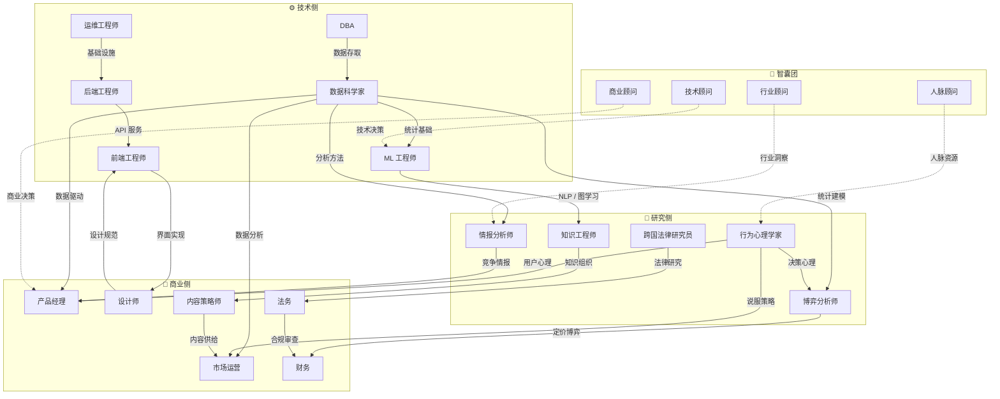

# Knowledge Map — 一人公司全角色技能树

> 一人公司，21 个节点，每角色一棵树。
> 每棵树按学术深度分六层：本科 → 研究生 → 博士 → 教授 → 院士 → 开山祖师。
> 课程名来源见文末"来源校准"一节。

---

## 组织架构

- **一人公司**
  - **技术侧**（6 角色）
    - 数据科学家 Data Scientist
    - ML 工程师 ML Engineer
    - 前端工程师 Frontend Engineer
    - 后端工程师 Backend Engineer
    - 数据库管理员 DBA
    - 运维工程师 DevOps Engineer
  - **研究侧**（5 角色）
    - 情报分析师 Intelligence Analyst
    - 知识工程师 Knowledge Engineer
    - 行为心理学家 Behavioral Psychologist
    - 跨国法律研究员 Cross-border Legal Researcher
    - 博弈分析师 Game Theorist
  - **商业侧**（6 角色）
    - 产品经理 Product Manager
    - 设计师 UI/UX Designer
    - 内容策略师 Content Strategist
    - 市场运营 Marketing
    - 财务 Finance
    - 法务 Legal
  - **智囊团**（4 顾问）
    - 技术顾问 Technical Advisor
    - 商业顾问 Business Advisor
    - 行业顾问 Industry Advisor
    - 人脉顾问 Network Advisor

---

## 角色依赖关系图

> 实线箭头 = 知识/能力流向（A → B 意为「A 的输出是 B 的输入」）。
> 虚线箭头 = 顾问辐射。

**关键依赖链路：**

| 链路       | 流向                               | 说明                           |
| ---------- | ---------------------------------- | ------------------------------ |
| 数据链     | DBA → 数据科学家 → ML 工程师       | 从数据存储到统计分析到机器学习 |
| 基础设施链 | 运维 → 后端 → 前端                 | 从基础设施到服务到界面         |
| 情报链     | 数据科学家 → 情报分析师 → 产品经理 | 从数据分析到竞争情报到产品决策 |
| 影响力链   | 行为心理学家 → 博弈分析师 → 财务   | 从决策心理到博弈定价到财务执行 |
| 内容链     | 知识工程师 → 内容策略师 → 市场运营 | 从知识组织到内容生产到市场分发 |
| 合规链     | 跨国法律研究员 → 法务 → 财务       | 从法律研究到合规审查到财务执行 |

---

## 共同基础 — 统治阶层的知识武器

> 哲学、政治学、经济学、法学、社会学、历史学 —— 这些不是"选修课"。
> 这些是**设计规则的人**学的东西。统治阶层用这些学科来：
>
> - 用哲学定义"什么是正义" → 让你接受他们的规则
> - 用政治学设计权力结构 → 让你进入他们的棋盘
> - 用经济学设计激励机制 → 让你自愿被收割
> - 用法学把规则变成法条 → 让你不敢反抗
> - 用社会学研究群体行为 → 让你被预测和管理
> - 用历史学掌握前车之鉴 → 让你重蹈覆辙
>
> **一人公司要反击，就必须学会同样的武器。**
> 这些学科是所有 21 个角色的根基，尤其是智囊团的核心装备。

- 哲学 Philosophy — 所有角色的根；尤其：智囊团全员、知识工程师、博弈分析师
- 历史学 History — 所有角色；尤其：智囊团全员、情报分析师、内容策略师
- 数学 Mathematics — 所有技术侧角色；尤其：数据科学家、ML 工程师、博弈分析师
- 物理学 Physics — ML 工程师（信号与系统）、运维工程师（系统思维）
- 经济学 Economics — 智囊团全员、博弈分析师、财务、市场运营、产品经理
- 政治学 Political Science — 智囊团全员、情报分析师、博弈分析师、跨国法律研究员
- 社会学 Sociology — 智囊团全员、情报分析师、行为心理学家、人脉顾问
- 人类学 Anthropology — 行为心理学家、设计师、内容策略师、跨国法律研究员
- 心理学 Psychology — 智囊团全员、行为心理学家、设计师、产品经理
- 语言学 Linguistics — 知识工程师、内容策略师、ML 工程师（NLP）
- 法学 Law — 智囊团全员、法务、跨国法律研究员、财务（税法）
- 逻辑学 Logic — 知识工程师、博弈分析师、数据科学家、情报分析师
- 伦理学 Ethics — 所有角色；尤其：行为心理学家、法务、ML 工程师（AI 伦理）
- 商学 Business Administration — 产品经理、商业顾问、市场运营、财务
- 金融学 Finance — 财务、商业顾问、博弈分析师
- 统计学 Statistics — 数据科学家、ML 工程师、市场运营、行为心理学家

---

## 技术侧

---

### 1. 数据科学家 Data Scientist

> 来源：UCSD Halicioglu Data Science Institute, Columbia MS Data Science, Stanford Statistics

- **本科 Undergraduate**
  - 微积分 Calculus
  - 线性代数 Linear Algebra
  - 概率论 Probability Theory
  - 数理统计 Mathematical Statistics
  - 离散数学 Discrete Mathematics
  - 数据结构与算法 Data Structures & Algorithms
  - 数据库系统 Database Systems
  - Python 程序设计 Python Programming
  - 最优化方法 Optimization Methods
  - 数值分析 Numerical Analysis
  - 机器学习导论 Introduction to Machine Learning
  - 数据挖掘 Data Mining
- **研究生 Master**
  - 概率与统计 Probability & Statistics for Data Science — _Columbia STAT GR5701_
  - 统计推断与建模 Statistical Inference & Modeling — _Columbia STAT GR5703_
  - 统计模型 Statistical Models — _UCSD DSC 241_
  - 数值线性代数 Numerical Linear Algebra — _UCSD DSC 210_
  - 优化导论 Introduction to Optimization — _UCSD DSC 211_
  - 探索性数据分析与可视化 Exploratory Data Analysis & Visualization — _Columbia STAT GR5702_
  - 机器学习 Machine Learning — _UCSD DSC 240_
  - 因果推断导论 Introduction to Causal Inference — _UCSD DSC 245_
  - 高维概率与统计 High-Dimensional Probability & Statistics — _UCSD DSC 242_
  - 大规模统计分析 Large-Scale Statistical Analysis — _UCSD DSC 244_
  - 数据科学算法 Algorithms for Data Science — _Columbia CSOR W4246_
  - 可扩展数据系统 Scalable Data Systems — _UCSD DSC 204A_
  - 统计思维与实验设计 Statistical Thinking & Experimental Design — _UCSD DSC 215_
- **博士 PhD**
  - 数据的几何 Geometry of Data — _UCSD DSC 205_
  - 流形上的统计 Statistics on Manifolds — _UCSD DSC 213_
  - 拓扑数据分析 Topological Data Analysis — _UCSD DSC 214_
  - 高级优化 Advanced Optimization — _UCSD DSC 243_
  - 高级数据挖掘 Advanced Data Mining — _UCSD DSC 250_
  - 以数据为中心的 AI Data-Centric AI & AI Engineering — _UCSD DSC 234_
  - 非参数统计 Nonparametric Statistics
  - 计算学习理论 Computational Learning Theory
  - 公平性与可解释性 Fairness & Interpretability
- **教授 Professor**
  - 统计决策理论 Statistical Decision Theory
  - 渐近理论 Asymptotic Theory
  - 信息几何 Information Geometry
  - 半参数效率理论 Semiparametric Efficiency
- **院士 Fellow / Academician**
  - 统计理论统一框架 Unified Statistical Theory
  - 学科交叉方法论 Interdisciplinary Methodology
- **开山祖师 Field Pioneer**
  - Fisher — 统计推断 Statistical Inference
  - Pearson — 相关系数与回归 Correlation & Regression
  - Tukey — 探索性数据分析 Exploratory Data Analysis
  - Breiman — 随机森林与 Bagging Random Forests & Bagging
  - Neyman — 假设检验 Hypothesis Testing

---

### 2. ML 工程师 ML Engineer

> 来源：CMU ML PhD Curriculum, MIT EECS, Stanford CS

- **本科 Undergraduate**
  - 微积分 Calculus
  - 线性代数 Linear Algebra
  - 概率论与数理统计 Probability & Statistics
  - 数据结构与算法 Data Structures & Algorithms — _MIT 6.006_
  - 算法设计与分析 Design & Analysis of Algorithms — _MIT 6.046_
  - 信号与系统 Signals & Systems
  - 数值计算 Numerical Computing
  - 机器学习 Machine Learning
  - 人工智能导论 Introduction to AI
- **研究生 Master**
  - 高级机器学习导论 Advanced Introduction to ML — _CMU 10-715_
  - 中级统计学 Intermediate Statistics — _CMU 36-705_
  - 深度学习 Deep Learning
  - 计算机视觉 Computer Vision
  - 自然语言处理 Natural Language Processing
  - 强化学习 Reinforcement Learning
  - 凸优化 Convex Optimization
  - 信息论 Information Theory
  - 概率图模型 Probabilistic Graphical Models — _CMU 10-708_
  - 机器学习优化 Optimization for Machine Learning — _CMU 10-725_
  - 图神经网络 Graph Neural Networks — _Stanford CS224W_
- **博士 PhD**
  - 高级深度学习 Advanced Deep Learning — _CMU 10-707_
  - 深度学习系统 Deep Learning Systems — _CMU 10-714_
  - 生成式 AI Generative AI — _CMU 10-723_
  - 深度强化学习与控制 Deep RL & Control — _CMU 10-703_
  - 大数据集机器学习 ML with Large Datasets — _CMU 10-805_
  - 高级 ML 理论与方法 Advanced ML Theory & Methods — _CMU 10-716_
  - 不确定性下自主决策基础 Foundations of Autonomous Decision Making — _CMU 10-734_
  - 表示学习 Representation Learning
  - 分布外泛化 Out-of-Distribution Generalization
  - 联邦学习 Federated Learning
- **教授 Professor**
  - 统计学习理论 Statistical Learning Theory
  - 核方法 Kernel Methods
  - 在线学习理论 Online Learning Theory
  - 信息瓶颈理论 Information Bottleneck Theory
- **院士 Fellow / Academician**
  - 计算智能统一理论 Unified Computational Intelligence
  - 学习的基本极限 Fundamental Limits of Learning
- **开山祖师 Field Pioneer**
  - Rosenblatt — 感知机 Perceptron
  - Hinton — 反向传播与深度学习 Backpropagation & Deep Learning
  - LeCun — 卷积神经网络 Convolutional Neural Networks
  - Bengio — 深度学习与表示学习 Deep Learning & Representation
  - Vapnik — SVM 与 VC 理论 SVM & VC Theory
  - Vaswani — Transformer (Attention Is All You Need)

---

### 3. 前端工程师 Frontend Engineer

> 来源：MIT EECS, Georgia Tech MS-HCI

- **本科 Undergraduate**
  - 计算机组成原理 Computer Organization
  - 操作系统 Operating Systems
  - 计算机网络 Computer Networks
  - 数据结构与算法 Data Structures & Algorithms
  - 编译原理 Compiler Principles
  - 软件工程 Software Engineering
  - 人机交互 Human-Computer Interaction
- **研究生 Master**
  - 人机交互基础 HCI Foundations — _Georgia Tech CS 6755_
  - HCI 心理学研究方法 Psychological Research Methods for HCI — _Georgia Tech PSYC 6023_
  - 信息可视化 Information Visualization
  - Web 工程 Web Engineering
  - 编程语言理论 Programming Language Theory
  - 交互设计 Interaction Design
- **博士 PhD**
  - 程序分析与验证 Program Analysis & Verification
  - 可视分析学 Visual Analytics
  - 可访问性计算 Accessibility Computing
  - Web 性能理论 Web Performance Theory
- **教授 Professor**
  - 编程语言语义 Programming Language Semantics
  - 交互系统形式化理论 Formal Theory of Interactive Systems
  - 可视化认知理论 Visualization Cognition Theory
- **院士 Fellow / Academician**
  - 人机交互范式 HCI Paradigms
  - 下一代 Web 架构理论 Next-Generation Web Architecture
- **开山祖师 Field Pioneer**
  - Berners-Lee — 万维网 World Wide Web
  - Eich — JavaScript
  - Fielding — REST 架构风格 REST Architecture
  - Kay — 面向对象与 GUI Object-Oriented & GUI

---

### 4. 后端工程师 Backend Engineer

> 来源：MIT EECS, Purdue CS, CMU SCS

- **本科 Undergraduate**
  - 操作系统 Operating Systems
  - 计算机网络 Computer Networks
  - 数据结构与算法 Data Structures & Algorithms
  - 数据库系统 Database Systems
  - 编译原理 Compiler Principles
  - 软件工程 Software Engineering
  - 计算机组成原理 Computer Organization
- **研究生 Master**
  - 分布式系统 Distributed Systems — _Purdue CS_
  - 高级数据库 Advanced Databases
  - 系统安全 System Security
  - 云计算 Cloud Computing
  - 高级操作系统 Advanced Operating Systems
- **博士 PhD**
  - 分布式一致性理论 Distributed Consensus Theory
  - 形式化验证 Formal Verification
  - 并发理论 Concurrency Theory
  - 容错系统 Fault-Tolerant Systems
- **教授 Professor**
  - 分布式计算理论 Distributed Computing Theory
  - 系统架构方法论 System Architecture Methodology
  - 可证明安全 Provable Security
- **院士 Fellow / Academician**
  - 大规模系统基础理论 Foundations of Large-Scale Systems
  - 计算模型统一理论 Unified Theory of Computation Models
- **开山祖师 Field Pioneer**
  - Dijkstra — 并发与结构化编程 Concurrency & Structured Programming
  - Lamport — 分布式系统与时钟 Distributed Systems & Clocks
  - Thompson & Ritchie — Unix 与 C 语言 Unix & C Language
  - Codd — 关系模型 Relational Model

---

### 5. 数据库管理员 DBA

> 来源：UMGC MS IT Database Concentration, Purdue CS, CMU Database Group

- **本科 Undergraduate**
  - 数据库系统原理 Database System Principles
  - 数据结构 Data Structures
  - 操作系统 Operating Systems
  - 离散数学 Discrete Mathematics
  - SQL 程序设计 SQL Programming
  - 计算机网络 Computer Networks
- **研究生 Master**
  - 高级数据建模 Advanced Data Modeling — _UMGC_
  - 高级关系/对象-关系数据库系统 Advanced Relational/Object-Relational Database Systems — _UMGC_
  - 分布式数据库管理系统 Distributed Database Management Systems — _UMGC_
  - 数据仓库技术 Data Warehousing Technologies — _UMGC_
  - 数据库安全 Database Security — _UMGC_
  - 信息检索 Information Retrieval
  - NoSQL 系统 NoSQL Systems
- **博士 PhD**
  - 查询优化理论 Query Optimization Theory
  - 事务处理理论 Transaction Processing Theory
  - 数据库形式基础 Formal Foundations of Databases
  - 流数据处理 Stream Data Processing
- **教授 Professor**
  - 数据库理论 Database Theory
  - 数据模型理论 Data Model Theory
  - 数据管理系统设计 Data Management System Design
- **院士 Fellow / Academician**
  - 数据管理统一理论 Unified Theory of Data Management
- **开山祖师 Field Pioneer**
  - Codd — 关系模型 Relational Model
  - Gray — 事务处理 Transaction Processing
  - Stonebraker — PostgreSQL 与现代数据库 PostgreSQL & Modern Databases
  - Chamberlin — SQL 语言 SQL Language

---

### 6. 运维工程师 DevOps Engineer

> 来源：MIT Professional Education, Google SRE, DevOps Institute

- **本科 Undergraduate**
  - 操作系统 Operating Systems
  - 计算机网络 Computer Networks
  - 软件工程 Software Engineering
  - 系统管理 System Administration
  - 脚本编程 Scripting Programming
  - 信息安全 Information Security
- **研究生 Master**
  - 云计算与 DevOps Cloud & DevOps: Continuous Transformation — _MIT Professional Education_
  - 数字化转型与应用 DevOps Digital Transformation & Applied DevOps — _MIT Professional Education_
  - 分布式系统 Distributed Systems
  - 系统可靠性工程 Site Reliability Engineering — _Google SRE_
  - 性能工程 Performance Engineering
- **博士 PhD**
  - 自适应系统 Self-Adaptive Systems
  - 自主计算 Autonomic Computing
  - 可靠性工程理论 Reliability Engineering Theory
  - 混沌工程 Chaos Engineering
- **教授 Professor**
  - 大规模系统工程 Large-Scale System Engineering
  - 软件演化理论 Software Evolution Theory
  - 弹性计算理论 Resilient Computing Theory
- **院士 Fellow / Academician**
  - 自治系统理论 Theory of Autonomous Systems
  - 基础设施科学 Infrastructure Science
- **开山祖师 Field Pioneer**
  - Thompson — Unix
  - Torvalds — Linux
  - Fowler — 持续集成 Continuous Integration
  - Allspaw — DevOps 运动 DevOps Movement

---

## 研究侧

---

### 7. 情报分析师 Intelligence Analyst

> 来源：Georgetown MPS Applied Intelligence, Georgetown SFS Security Studies

- **本科 Undergraduate**
  - 社会学导论 Introduction to Sociology
  - 政治学 Political Science
  - 经济学原理 Principles of Economics
  - 统计学 Statistics
  - 逻辑学 Logic
  - 批判性思维 Critical Thinking
- **研究生 Master**
  - 应用情报导论 Introduction to Applied Intelligence — _Georgetown MPS_
  - 应用情报心理学 Psychology of Applied Intelligence — _Georgetown MPS_
  - 应用情报传播 Applied Intelligence Communications — _Georgetown MPS_
  - 情报收集理解 Understanding Intelligence Collection — _Georgetown MPS_
  - 高级分析技术 Advanced Analytical Techniques — _Georgetown MPS_
  - 国际关系 International Relations
  - 社会网络分析 Social Network Analysis
- **博士 PhD**
  - 竞争情报理论 Competitive Intelligence Theory
  - 预警分析 Warning Analysis
  - 结构化分析技术 Structured Analytic Techniques
  - 复杂系统分析 Complex Systems Analysis
- **教授 Professor**
  - 情报理论 Intelligence Theory
  - 战略分析框架 Strategic Analysis Frameworks
  - 权力结构理论 Power Structure Theory
- **院士 Fellow / Academician**
  - 国家安全理论体系 National Security Theory
  - 社会系统分析方法论 Social Systems Analysis Methodology
- **开山祖师 Field Pioneer**
  - 孙子 Sun Tzu — 兵法 The Art of War
  - Kent — 战略情报 Strategic Intelligence
  - Heuer — 情报分析心理学 Psychology of Intelligence Analysis
  - Machiavelli — 权力政治学 Political Power Theory

---

### 8. 知识工程师 Knowledge Engineer

> 来源：Stanford CS 520 Knowledge Graphs, Stanford Protege, W3C Semantic Web

- **本科 Undergraduate**
  - 逻辑学 Logic
  - 数据结构 Data Structures
  - 数据库系统 Database Systems
  - 人工智能导论 Introduction to AI
  - 离散数学 Discrete Mathematics
  - 语言学导论 Introduction to Linguistics
- **研究生 Master**
  - 知识图谱 Knowledge Graphs — _Stanford CS 520_
  - 知识表示与推理 Knowledge Representation & Reasoning
  - 本体工程与 OWL Ontology Engineering & OWL — _Stanford Protege Course_
  - 语义 Web 技术 Semantic Web Technologies (RDF, SPARQL)
  - 自然语言处理 Natural Language Processing
  - 信息抽取 Information Extraction
  - 图上的机器学习 Machine Learning with Graphs — _Stanford CS224W_
- **博士 PhD**
  - 描述逻辑 Description Logic
  - 本体学习 Ontology Learning
  - 知识图谱补全 Knowledge Graph Completion
  - 常识推理 Commonsense Reasoning
  - 神经符号整合 Neuro-Symbolic Integration
- **教授 Professor**
  - 形式本体论 Formal Ontology
  - 知识表示基础理论 Foundations of Knowledge Representation
  - 非单调推理 Non-Monotonic Reasoning
- **院士 Fellow / Academician**
  - 知识科学统一理论 Unified Theory of Knowledge Science
  - 认知架构 Cognitive Architecture
- **开山祖师 Field Pioneer**
  - Feigenbaum — 专家系统 Expert Systems
  - Berners-Lee — 语义 Web Semantic Web
  - Gruber — 本体定义 Ontology Definition
  - Minsky — 知识框架 Frames

---

### 9. 行为心理学家 Behavioral Psychologist

> 来源：APA 认证临床心理学 PhD 课程标准, Harvard, UMass Boston

- **本科 Undergraduate**
  - 普通心理学 General Psychology
  - 社会心理学 Social Psychology
  - 认知心理学 Cognitive Psychology
  - 发展心理学 Developmental Psychology
  - 心理统计 Psychological Statistics
  - 实验心理学 Experimental Psychology
- **研究生 Master**
  - 精神病理学 Psychopathology — _APA 标准_
  - 心理评估 Psychological Assessment — _APA 标准_
  - 认知行为疗法 Cognitive Behavioral Therapy — _APA 标准_
  - 决策心理学 Psychology of Decision Making
  - 说服心理学 Psychology of Persuasion
  - 行为经济学 Behavioral Economics
  - 多元文化心理学 Multicultural Psychology — _APA 标准_
- **博士 PhD**
  - 行为的生物学基础 Biological Bases of Behavior — _APA 标准_
  - 认知情感基础 Cognitive-Affective Bases of Behavior — _APA 标准_
  - 行为的社会文化基础 Social & Cultural Bases of Behavior — _APA 标准_
  - 认知偏差理论 Cognitive Bias Theory
  - 社会影响理论 Social Influence Theory
  - 进化心理学 Evolutionary Psychology
  - 操控与强制理论 Coercive Control Theory
- **教授 Professor**
  - 判断与决策理论 Judgment & Decision Theory
  - 社会认知神经科学 Social Cognitive Neuroscience
  - 行为改变理论 Behavior Change Theory
- **院士 Fellow / Academician**
  - 人类行为统一理论 Unified Theory of Human Behavior
  - 认知科学基础 Foundations of Cognitive Science
- **开山祖师 Field Pioneer**
  - Kahneman — 前景理论与行为经济学 Prospect Theory & Behavioral Economics
  - Cialdini — 影响力六原则 Six Principles of Influence
  - Milgram — 服从实验 Obedience Experiments
  - Zimbardo — 斯坦福监狱实验 Stanford Prison Experiment
  - Skinner — 操作性条件反射 Operant Conditioning

---

### 10. 跨国法律研究员 Cross-border Legal Researcher

> 来源：Harvard Law School LLM, Yale Law, Oxford Comparative Law

- **本科 Undergraduate**
  - 法理学 Jurisprudence
  - 宪法学 Constitutional Law
  - 民法 Civil Law
  - 刑法 Criminal Law
  - 国际法 International Law
  - 法律英语 Legal English
- **研究生 Master**
  - 比较宪法 Comparative Constitutional Law — _Harvard LLM_
  - 国际金融监管 Regulation of International Finance — _Harvard LLM_
  - 人权法 Human Rights — _Harvard LLM_
  - 国际私法 Private International Law
  - 国际商事仲裁 International Commercial Arbitration
  - 网络与数据法 Cyber & Data Law
  - 劳动法 Labor Law
  - 知识产权法 Intellectual Property Law
- **博士 PhD**
  - 法律全球化理论 Legal Globalization Theory
  - 跨国法治理论 Transnational Rule of Law
  - 数据主权理论 Data Sovereignty Theory
  - 法律多元主义 Legal Pluralism
- **教授 Professor**
  - 法哲学 Legal Philosophy
  - 批判法学 Critical Legal Studies
  - 法律经济学分析 Law & Economics
- **院士 Fellow / Academician**
  - 全球治理法律框架 Legal Framework of Global Governance
  - 法律与技术共演化 Co-evolution of Law & Technology
- **开山祖师 Field Pioneer**
  - Grotius — 国际法之父 Father of International Law
  - Hart — 法律实证主义 Legal Positivism
  - Posner — 法律经济学 Law & Economics
  - Lessig — 代码即法律 Code Is Law

---

### 11. 博弈分析师 Game Theorist

> 来源：Yale Economics PhD, Stanford GSB, Princeton Economics

- **本科 Undergraduate**
  - 博弈论导论 Introduction to Game Theory — _Yale ECON 159_
  - 微观经济学 Microeconomics
  - 宏观经济学 Macroeconomics
  - 概率论 Probability Theory
  - 运筹学 Operations Research
  - 线性代数 Linear Algebra
  - 数理博弈论 Mathematical Economics: Game Theory — _Yale ECON 351_
- **研究生 Master**
  - 微观经济理论 I Microeconomic Theory I — _Yale ECON 500a_
  - 微观经济理论 II Microeconomic Theory II — _Yale ECON 501b_
  - 机制设计 Mechanism Design
  - 拍卖理论 Auction Theory
  - 谈判分析 Negotiation Analysis
  - 行为博弈论 Behavioral Game Theory
- **博士 PhD**
  - 高级微观经济学 I Advanced Microeconomics I — _Yale ECON 520a_
  - 高级微观经济学 II Advanced Microeconomics II — _Yale ECON 521b_
  - 演化博弈论 Evolutionary Game Theory
  - 合作博弈理论 Cooperative Game Theory
  - 信息经济学 Information Economics
  - 社会选择理论 Social Choice Theory
  - 算法博弈论 Algorithmic Game Theory
- **教授 Professor**
  - 一般均衡理论 General Equilibrium Theory
  - 市场设计理论 Market Design Theory
  - 匹配理论 Matching Theory
- **院士 Fellow / Academician**
  - 经济理论统一框架 Unified Economic Theory
  - 复杂适应系统 Complex Adaptive Systems
- **开山祖师 Field Pioneer**
  - von Neumann — 博弈论创始 Founding of Game Theory
  - Nash — 纳什均衡 Nash Equilibrium
  - Schelling — 冲突战略 The Strategy of Conflict
  - Myerson — 机制设计 Mechanism Design
  - Roth — 市场设计 Market Design

---

## 商业侧

---

### 12. 产品经理 Product Manager

> 来源：Stanford MBA Core Curriculum, Harvard Business School

- **本科 Undergraduate**
  - 市场营销 Marketing
  - 消费者行为学 Consumer Behavior
  - 项目管理 Project Management
  - 统计学 Statistics
  - 用户体验设计 UX Design
  - 商业模式 Business Models
- **研究生 Master**
  - 数据与决策 Data and Decisions — _Stanford MBA Core_
  - 市场营销 Marketing — _Stanford MBA Core_
  - 运营管理 Operations — _Stanford MBA Core_
  - 战略 Strategy — _Stanford MBA Core_
  - 组织行为学 Organizational Behavior — _Stanford MBA Core_
  - 领导力实验室 Leadership Laboratory — _Stanford MBA Core_
  - 创新管理 Innovation Management
  - 精益创业方法论 Lean Startup Methodology
  - 用户研究方法 User Research Methods
- **博士 PhD**
  - 创新扩散理论 Diffusion of Innovations
  - 技术采纳模型 Technology Acceptance Model
  - 平台经济理论 Platform Economics
  - 双边市场理论 Two-Sided Market Theory
- **教授 Professor**
  - 创新管理理论 Innovation Management Theory
  - 破坏性创新 Disruptive Innovation
  - 商业模式理论 Business Model Theory
- **院士 Fellow / Academician**
  - 技术创新与管理科学 Technology Innovation & Management Science
- **开山祖师 Field Pioneer**
  - Drucker — 现代管理学 Modern Management
  - Ries — 精益创业 Lean Startup
  - Moore — 跨越鸿沟 Crossing the Chasm
  - Christensen — 颠覆式创新 Disruptive Innovation

---

### 13. 设计师 UI/UX Designer

> 来源：Georgia Tech MS-HCI, Parsons MFA Design & Technology, RISD

- **本科 Undergraduate**
  - 设计基础 Design Fundamentals
  - 色彩学 Color Theory
  - 排版学 Typography
  - 人机交互 Human-Computer Interaction
  - 用户体验设计 User Experience Design
  - 认知心理学 Cognitive Psychology
- **研究生 Master**
  - 人机交互基础 HCI Foundations — _Georgia Tech CS 6755_
  - HCI 心理学研究方法 Psychological Research Methods for HCI — _Georgia Tech PSYC 6023_
  - 交互设计 Interaction Design
  - 信息架构 Information Architecture
  - 设计研究方法 Design Research Methods — _Parsons MFA_
  - 服务设计 Service Design
  - 情感设计 Emotional Design
- **博士 PhD**
  - 设计认知 Design Cognition
  - 人机交互理论 HCI Theory
  - 设计方法论 Design Methodology
  - 参与式设计 Participatory Design
- **教授 Professor**
  - 设计科学 Design Science
  - 设计哲学 Design Philosophy
  - 体验经济理论 Experience Economy Theory
- **院士 Fellow / Academician**
  - 设计学统一理论 Unified Design Theory
  - 人机共生理论 Human-Computer Symbiosis
- **开山祖师 Field Pioneer**
  - Norman — 设计心理学 The Design of Everyday Things
  - Tufte — 信息可视化 Visual Display of Information
  - Rams — 设计十原则 Ten Principles of Good Design
  - Engelbart — 交互计算 Interactive Computing

---

### 14. 内容策略师 Content Strategist

> 来源：Columbia Journalism School MS, Northwestern Medill

- **本科 Undergraduate**
  - 新闻学 Journalism
  - 传播学 Communication Studies
  - 语言学 Linguistics
  - 修辞学 Rhetoric
  - 写作 Writing
  - 媒体研究 Media Studies
- **研究生 Master**
  - 影像与声音 Image and Sound — _Columbia MS_
  - 数据写作 Writing with Data — _Columbia Data Journalism_
  - 数据、计算与创新 Data, Computation, Innovation — _Columbia Data Journalism_
  - 用数据讲故事 Storytelling with Data — _Columbia Data Journalism_
  - 叙事学 Narratology
  - 跨文化传播 Intercultural Communication
  - 品牌传播 Brand Communication
- **博士 PhD**
  - 话语分析 Discourse Analysis
  - 传播效果理论 Communication Effects Theory
  - 媒介生态学 Media Ecology
  - 框架理论 Framing Theory
- **教授 Professor**
  - 传播理论 Communication Theory
  - 符号学 Semiotics
  - 媒介哲学 Philosophy of Media
- **院士 Fellow / Academician**
  - 传播学统一理论 Unified Communication Theory
  - 信息社会理论 Information Society Theory
- **开山祖师 Field Pioneer**
  - McLuhan — 媒介即信息 The Medium Is the Message
  - Shannon — 信息论 Information Theory
  - Halliday — 系统功能语言学 Systemic Functional Linguistics
  - Aristotle — 修辞学 Rhetoric

---

### 15. 市场运营 Marketing

> 来源：Northwestern Kellogg Marketing PhD, Stanford MBA, Wharton MBA

- **本科 Undergraduate**
  - 市场营销原理 Principles of Marketing
  - 消费者行为学 Consumer Behavior
  - 广告学 Advertising
  - 公共关系 Public Relations
  - 统计学 Statistics
  - 经济学原理 Principles of Economics
- **研究生 Master**
  - 数字营销 Digital Marketing
  - 品牌管理 Brand Management
  - 市场研究方法 Market Research Methods
  - 战略营销 Strategic Marketing
  - 社交媒体营销 Social Media Marketing
- **博士 PhD**
  - 消费者行为研究理论建构 Theory Building in Consumer Behavior Research — _Kellogg MKTG 531-1_
  - 消费者研究方法与数据 Methods & Data in Consumer Research — _Kellogg MKTG 531-2_
  - 定量营销：统计建模 Quantitative Marketing: Statistical Modeling — _Kellogg MKTG 551-2_
  - 定量营销：结构建模 Quantitative Marketing: Structural Modeling — _Kellogg MKTG 551-3_
  - 消费者决策理论 Consumer Decision Theory
  - 品牌资产理论 Brand Equity Theory
  - 定价理论 Pricing Theory
- **教授 Professor**
  - 营销科学 Marketing Science
  - 市场演化理论 Market Evolution Theory
  - 行为定价 Behavioral Pricing
- **院士 Fellow / Academician**
  - 营销学统一理论 Unified Marketing Theory
  - 消费文化理论 Consumer Culture Theory
- **开山祖师 Field Pioneer**
  - Kotler — 现代营销之父 Father of Modern Marketing
  - Porter — 竞争战略 Competitive Strategy
  - Levitt — 营销近视 Marketing Myopia
  - Ogilvy — 广告学 Advertising

---

### 16. 财务 Finance

> 来源：Wharton Finance PhD, Wharton Accounting PhD

- **本科 Undergraduate**
  - 会计学原理 Principles of Accounting
  - 财务管理 Financial Management
  - 税法 Tax Law
  - 经济法 Economic Law
  - 微观经济学 Microeconomics
  - 宏观经济学 Macroeconomics
- **研究生 Master**
  - 高级财务管理 Advanced Financial Management
  - 税务规划 Tax Planning
  - 公司金融 Corporate Finance
  - 财务分析 Financial Analysis
  - 管理会计 Management Accounting
- **博士 PhD**
  - 金融经济学 Financial Economics — _Wharton FNCE 9110_
  - 公司金融与金融机构 Corporate Finance & Financial Institutions — _Wharton FNCE 9120_
  - 金融实证方法导论 Introduction to Empirical Methods in Finance — _Wharton FNCE 9210_
  - 跨期宏观经济学与金融 Intertemporal Macroeconomics & Finance — _Wharton FNCE 9240_
  - 微观经济理论 Microeconomic Theory — _Wharton ECON 7100_
  - 计量经济学 Econometrics — _Wharton ECON 7300_
  - 会计研究（实证设计） Empirical Design in Accounting Research — _Wharton ACCT 9300_
  - 博弈论与应用 Game Theory & Applications — _Wharton ECON 6110_
- **教授 Professor**
  - 金融理论 Financial Theory
  - 会计理论 Accounting Theory
  - 制度经济学 Institutional Economics
- **院士 Fellow / Academician**
  - 金融经济学统一理论 Unified Financial Economics
  - 资本市场理论 Capital Market Theory
- **开山祖师 Field Pioneer**
  - Pacioli — 复式记账 Double-Entry Bookkeeping
  - Modigliani & Miller — 资本结构定理 Capital Structure Theorem
  - Markowitz — 投资组合理论 Portfolio Theory
  - Black & Scholes — 期权定价 Option Pricing

---

### 17. 法务 Legal

> 来源：Harvard Law School, Yale Law School, Stanford Law

- **本科 Undergraduate**
  - 法理学 Jurisprudence
  - 宪法学 Constitutional Law
  - 民法 Civil Law
  - 商法 Commercial Law
  - 公司法 Corporate Law
  - 经济法 Economic Law
  - 知识产权法 Intellectual Property Law
- **研究生 Master**
  - 合同法实务 Contract Law Practice
  - 公司法实务 Corporate Law Practice
  - 知识产权实务 IP Practice
  - 数据合规 Data Compliance
  - 争议解决 Dispute Resolution
- **博士 PhD**
  - 法律解释理论 Legal Interpretation Theory
  - 公司治理理论 Corporate Governance Theory
  - 法律与技术 Law & Technology
  - 规制理论 Regulatory Theory
- **教授 Professor**
  - 法哲学 Legal Philosophy
  - 法律经济学分析 Law & Economics Analysis
  - 比较公司治理 Comparative Corporate Governance
- **院士 Fellow / Academician**
  - 法学理论体系 Legal Theory System
  - 法治现代化理论 Rule of Law Modernization
- **开山祖师 Field Pioneer**
  - Blackstone — 英美法基础 Foundations of Common Law
  - Holmes — 法律现实主义 Legal Realism
  - Lessig — 代码即法律 Code Is Law
  - Coase — 交易成本理论 Transaction Cost Theory

---

## 智囊团 — 统治阶层的学科就是智囊团的装备

> 智囊团是一人公司的"规则穿透层"。
> 统治阶层用哲学、政治学、经济学、法学、社会学设计规则 ——
> 智囊团用**同样的学科**拆解规则、发现漏洞、设计反击路径。

---

### 18. 技术顾问 Technical Advisor

> 来源：CMU Software Engineering Institute MSE, MIT EECS

- **本科 Undergraduate**
  - 计算机科学 Computer Science
  - 软件工程 Software Engineering
  - 电子工程 Electrical Engineering
  - 哲学（逻辑与科学哲学） Philosophy (Logic & Philosophy of Science)
- **研究生 Master**
  - 软件架构 Architectures for Software Systems — _CMU 17-655_
  - 软件制品分析 Analysis of Software Artifacts — _CMU 17-654_
  - 技术管理 Technology Management
  - 技术伦理 Technology Ethics
- **博士 PhD**
  - 软件工程理论 Software Engineering Theory
  - 系统可靠性理论 System Reliability Theory
  - 科学技术哲学 Philosophy of Science & Technology
- **教授 Professor**
  - 软件工程方法论 Software Engineering Methodology
  - 计算复杂性理论 Computational Complexity Theory
- **院士 Fellow / Academician**
  - 计算理论 Theory of Computation
- **开山祖师 Field Pioneer**
  - Turing — 计算理论 Theory of Computation
  - Knuth — 算法分析 Analysis of Algorithms
  - Brooks — 人月神话 The Mythical Man-Month

---

### 19. 商业顾问 Business Advisor

> 来源：Stanford MBA, Harvard Business School

- **本科 Undergraduate**
  - 工商管理 Business Administration
  - 经济学 Economics
  - 金融学 Finance
  - 政治学 Political Science
  - 哲学 Philosophy
  - 历史学 History
- **研究生 Master**
  - 战略管理 Strategic Management — _Stanford MBA Core_
  - 财务会计 Financial Accounting — _Stanford MBA Core_
  - 金融 Finance — _Stanford MBA Core_
  - 市场之外的战略 Strategy Beyond Markets — _Stanford MBA Core_
  - 创业学 Entrepreneurship
  - 政治经济学 Political Economy
  - 制度分析 Institutional Analysis
- **博士 PhD**
  - 战略管理理论 Strategic Management Theory
  - 组织理论 Organizational Theory
  - 制度理论 Institutional Theory
  - 公共选择理论 Public Choice Theory
- **教授 Professor**
  - 管理学理论 Management Theory
  - 组织行为学 Organizational Behavior
  - 政治经济学理论 Political Economy Theory
- **院士 Fellow / Academician**
  - 管理科学 Management Science
  - 社会制度演化理论 Social Institutional Evolution Theory
- **开山祖师 Field Pioneer**
  - Drucker — 现代管理学 Modern Management
  - Porter — 竞争战略 Competitive Strategy
  - Mintzberg — 战略过程 The Strategy Process
  - Schumpeter — 创造性破坏 Creative Destruction
  - Adam Smith — 国富论 The Wealth of Nations

---

### 20. 行业顾问 Industry Advisor

> 来源：MIT Sloan, MIT Economics

- **本科 Undergraduate**
  - 产业经济学 Industrial Economics
  - 行业分析 Industry Analysis
  - 市场研究 Market Research
  - 经济学原理 Principles of Economics
  - 历史学 History
  - 社会学 Sociology
- **研究生 Master**
  - 创新经济学 Economics of Ideas, Innovation & Entrepreneurship — _MIT Sloan 15.357_
  - 创新组织管理 Organizing for Innovation — _MIT Sloan 15.374_
  - 竞争战略 Competitive Strategy — _MIT Sloan 15.900_
  - 经济史 Economic History — _MIT 14.731_
  - 制度经济学 Institutional Economics
- **博士 PhD**
  - 产业演化理论 Industry Evolution Theory
  - 技术创新扩散 Diffusion of Technological Innovation
  - 产业生态学 Industrial Ecology
  - 历史制度分析 Historical Institutional Analysis
- **教授 Professor**
  - 产业经济学理论 Industrial Economics Theory
  - 创新经济学 Economics of Innovation
  - 长周期理论 Long Wave Theory
- **院士 Fellow / Academician**
  - 产业理论体系 Industrial Theory System
  - 技术-经济范式理论 Techno-Economic Paradigm Theory
- **开山祖师 Field Pioneer**
  - Schumpeter — 创造性破坏 Creative Destruction
  - Chandler — 企业战略与结构 Strategy & Structure
  - Penrose — 企业成长理论 Theory of the Growth of the Firm
  - Kondratieff — 长波周期 Long Wave Cycles

---

### 21. 人脉顾问 Network Advisor

> 来源：Stanford Sociology, Harvard Kennedy School, Stanford MS&E

- **本科 Undergraduate**
  - 社会学导论 Introduction to Sociology
  - 传播学 Communication Studies
  - 组织行为学 Organizational Behavior
  - 人类学导论 Introduction to Anthropology
  - 心理学导论 Introduction to Psychology
  - 政治学 Political Science
- **研究生 Master**
  - 社会网络分析 Introduction to Social Networks — _Stanford SOC 226_
  - 谈判学 Negotiating Across Differences — _Harvard Kennedy School MLD-223_
  - 组织行为学 Organizational Behavior — _Stanford MS&E 280_
  - 政治社会学 Political Sociology
  - 精英理论 Elite Theory
- **博士 PhD**
  - 社会资本理论 Social Capital Theory
  - 弱关系理论 Strength of Weak Ties
  - 网络科学 Network Science
  - 结构洞理论 Structural Holes Theory
  - 权力精英理论 Power Elite Theory
- **教授 Professor**
  - 社会网络理论 Social Network Theory
  - 关系社会学 Relational Sociology
  - 社会分层理论 Social Stratification Theory
- **院士 Fellow / Academician**
  - 网络科学统一理论 Unified Network Science
  - 复杂网络理论 Complex Network Theory
- **开山祖师 Field Pioneer**
  - Granovetter — 弱关系的力量 The Strength of Weak Ties
  - Burt — 结构洞 Structural Holes
  - Barabasi — 无标度网络 Scale-Free Networks
  - Dunbar — 邓巴数 Dunbar's Number
  - Mills — 权力精英 The Power Elite

---

## 来源校准

本文件中的课程名来源于以下大学的真实课程目录或官方项目描述：

| 角色           | 校准来源                                                             |
| -------------- | -------------------------------------------------------------------- |
| 数据科学家     | UCSD Halicioglu Data Science Institute, Columbia MS Data Science     |
| ML 工程师      | CMU ML PhD Curriculum (Fall 2025), MIT EECS, Stanford CS             |
| 前端工程师     | MIT EECS, Georgia Tech MS-HCI                                        |
| 后端工程师     | MIT EECS, Purdue CS                                                  |
| DBA            | UMGC MS IT Database Concentration                                    |
| DevOps         | MIT Professional Education, Google SRE                               |
| 情报分析师     | Georgetown MPS Applied Intelligence, Georgetown SFS Security Studies |
| 知识工程师     | Stanford CS 520 Knowledge Graphs, Stanford Protege                   |
| 行为心理学家   | APA 认证 PhD 课程标准, Harvard, UMass Boston                         |
| 跨国法律研究员 | Harvard Law School LLM                                               |
| 博弈分析师     | Yale Economics PhD                                                   |
| 产品经理       | Stanford MBA Core Curriculum                                         |
| 设计师         | Georgia Tech MS-HCI, Parsons MFA                                     |
| 内容策略师     | Columbia Journalism School MS                                        |
| 市场运营       | Northwestern Kellogg Marketing PhD                                   |
| 财务           | Wharton Finance PhD, Wharton Accounting PhD                          |
| 法务           | Harvard Law School, Yale Law                                         |
| 商业顾问       | Stanford MBA Core Curriculum                                         |
| 技术顾问       | CMU Software Engineering Institute MSE, MIT EECS                     |
| 行业顾问       | MIT Sloan, MIT Economics                                             |
| 人脉顾问       | Stanford Sociology, Harvard Kennedy School, Stanford MS&E            |

> 教授/院士/开山祖师层级为学术研究方向与历史人物，非课程名。

---

## 建设进度

| 板块     | 角色   | 已建   | 待建   | 完成度  |
| -------- | ------ | ------ | ------ | ------- |
| 技术侧   | 6      | 32     | 36     | 47%     |
| 研究侧   | 5      | 0      | 26     | 0%      |
| 商业侧   | 6      | 0      | 30     | 0%      |
| 智囊团   | 4      | —      | 按需   | —       |
| **总计** | **21** | **32** | **92** | **26%** |

---

## 九维知识体系

每个主题最多 9 个维度文件，命名 `{topic}_{dimension}.md`：

| 维度             | 后缀                   | 定位                           |
| ---------------- | ---------------------- | ------------------------------ |
| Map              | `_map.md`              | 导航总览 · 核心问题 · 依赖关系 |
| Concepts         | `_concepts.md`         | 术语定义 · 易混辨析            |
| Math             | `_math.md`             | 公式推导 · 手算练习            |
| Tutorial         | `_tutorial.md`         | Why-First 教程                 |
| Code             | `_code.md`             | 可运行代码 · API 速查          |
| Pitfalls         | `_pitfalls.md`         | 典型错误 · 调试清单            |
| History          | `_history.md`          | 技术演进时间线                 |
| Bridge           | `_bridge.md`           | 跨主题迁移 · 扩展阅读          |
| First Principles | `_first_principles.md` | 底层公理 · 设计本质            |

---

## 来源白名单

| 来源类型     | 示例                          |
| ------------ | ----------------------------- |
| 原始学术论文 | arXiv, NeurIPS, ICML, ICLR    |
| 出版教科书   | Goodfellow, Bishop, Murphy    |
| 官方文档     | pytorch.org, scikit-learn.org |
| 开源代码     | `.github/` 中的参考实现       |

---

_一人公司 · 17 角色 + 4 智囊 · 21 棵技能树 · 6 层学术深度 · Last updated: 2026-03-15_
