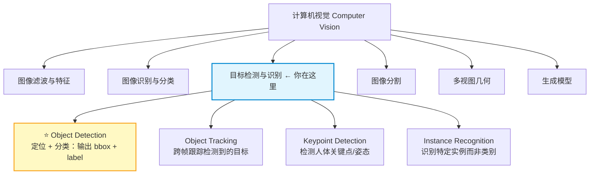
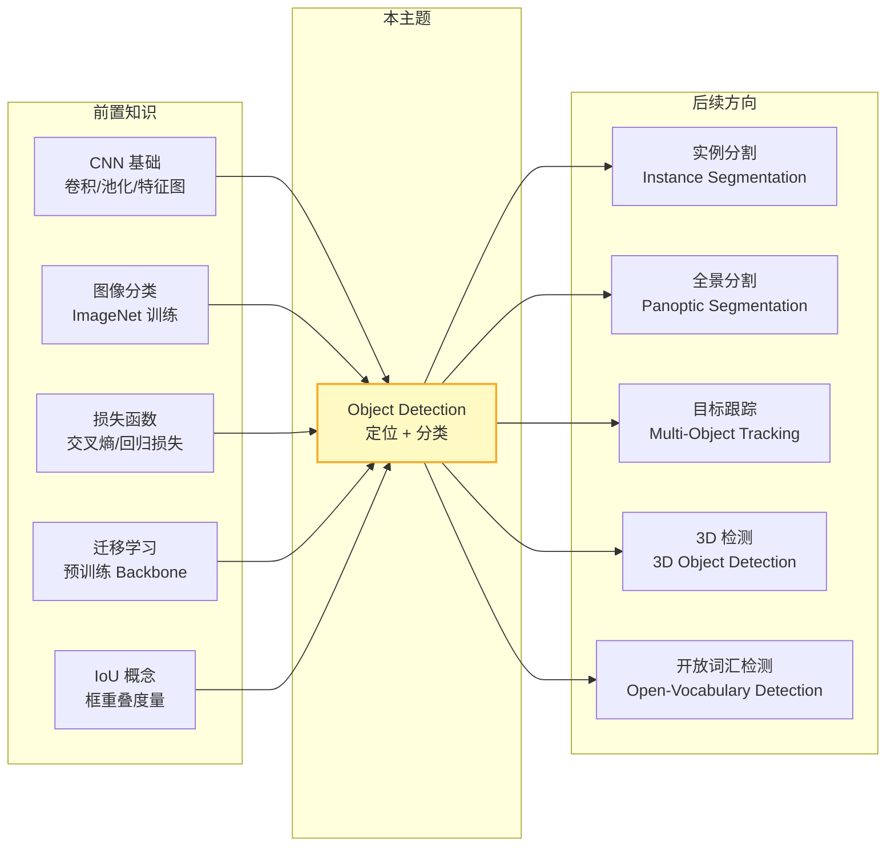

# Object Detection 知识地图

> 📚 Book: Szeliski, [《Computer Vision: Algorithms and Applications》](../../../textbooks/szeliski_cv.pdf), Ch.6 "Recognition"
> 📖 Paper: Girshick et al., [R-CNN](../../../.documents/papers/object_detection/girshick_2014_rcnn.pdf), CVPR 2014

## 1. 核心问题

- **什么是目标检测？和图像分类有什么区别？** → 图像分类只回答"图里有什么"，目标检测还要回答"在哪里" —— 输出是一组 bounding box + 类别标签 + 置信度分数
- **Two-Stage 和 One-Stage 检测器有什么区别？** → Two-Stage（如 Faster R-CNN）先生成候选区域再分类，精度高但慢；One-Stage（如 YOLO）一步到位预测 box + 类别，快但精度曾经较低
- **Anchor-Based 和 Anchor-Free 有什么区别？** → Anchor-Based 预设一组先验框并学习偏移量；Anchor-Free 直接预测目标中心和边界，不需要预定义锚框
- **NMS 是什么？为什么目标检测需要它？** → Non-Maximum Suppression 是后处理步骤，因为检测器对同一目标会产生多个重叠预测框，NMS 保留置信度最高的并删除其他
- **mAP 怎么算？** → Mean Average Precision：对每个类别算 Precision-Recall 曲线下面积（AP），然后取所有类别的均值

> 📚 Book: Szeliski, [《CV》](../../../textbooks/szeliski_cv.pdf), Ch.6.2 "Object Detection"
> 📖 Paper: Ren et al., [Faster R-CNN](../../../.documents/papers/object_detection/ren_2015_faster_rcnn.pdf), NeurIPS 2015

---

## 2. 全景位置

> 📚 Book: Szeliski, [《CV》](../../../textbooks/szeliski_cv.pdf), Ch.6 "Recognition"

---

## 3. 依赖地图

> 📚 Book: Goodfellow et al., [《Deep Learning》](../../../textbooks/goodfellow_deep_learning.pdf), Ch.9 "Convolutional Networks"
> 📖 Paper: Girshick et al., [R-CNN](../../../.documents/papers/object_detection/girshick_2014_rcnn.pdf), CVPR 2014

---

## 4. 文件地图

| 文件 | 定位 | 何时用 |
|------|------|--------|
| [object_detection_map.md](object_detection_map.md) | ① 导航 | 第一次接触、需要全局视角 |
| [object_detection_concepts.md](object_detection_concepts.md) | ② 概念 | 理解 anchor/IoU/NMS/mAP 等术语 |
| [object_detection_math.md](object_detection_math.md) | ③ 公式 | 推导 IoU/NMS/损失函数/mAP 计算 |
| [object_detection_tutorial.md](object_detection_tutorial.md) | ④ 教程 | Why-First 理解 two-stage vs one-stage 设计 |
| [object_detection_code.md](object_detection_code.md) | ⑤ 代码 | 用 torchvision 跑 Faster R-CNN / YOLO 推理 |
| [object_detection_pitfalls.md](object_detection_pitfalls.md) | ⑥ 踩坑 | 调试检测模型常见问题 |
| [object_detection_history.md](object_detection_history.md) | ⑦ 历史 | 从 HOG+SVM 到 DETR 的技术演进 |
| [object_detection_bridge.md](object_detection_bridge.md) | ⑧ 衔接 | 找相关主题（分割、跟踪、3D 检测） |
| [object_detection_first_principles.md](object_detection_first_principles.md) | ⑨ 第一性原理 | 追问"为什么用 bounding box 而不是其他表示" |

> 📖 Norman, [《The Design of Everyday Things》](../../../textbooks/norman_design_everyday_things.pdf), Ch.3 "Knowledge in the World"

---

## 5. 学习/使用路线

### 第一次学习 🎒

1. 读 [object_detection_map.md](object_detection_map.md) 了解全局位置
2. 读 [object_detection_tutorial.md](object_detection_tutorial.md) Section 1 理解痛点：为什么光有分类不够
3. 读 [object_detection_concepts.md](object_detection_concepts.md) 掌握核心术语：anchor / IoU / NMS / mAP
4. 读 [object_detection_math.md](object_detection_math.md) 手算一次 IoU 和 AP
5. 跟 [object_detection_code.md](object_detection_code.md) 快速跑一个 Faster R-CNN 推理示例
6. 读 [object_detection_history.md](object_detection_history.md) 了解从滑动窗口到 Transformer 的演进
7. 读 [object_detection_first_principles.md](object_detection_first_principles.md) 追问 bbox 回归的公理基础

### 日常参考 🔧

1. 查 [object_detection_code.md](object_detection_code.md) torchvision API 速查表
2. 查 [object_detection_math.md](object_detection_math.md) IoU / NMS / mAP 公式速查
3. 查 [object_detection_pitfalls.md](object_detection_pitfalls.md) 排查检测模型问题

### 深度研究 🔬

1. 读 [object_detection_history.md](object_detection_history.md) 完整演进线
2. 读 [object_detection_first_principles.md](object_detection_first_principles.md) 追问 anchor 设计的公理
3. 读 [object_detection_bridge.md](object_detection_bridge.md) 探索分割、跟踪、3D 检测
4. 阅读 R-CNN → Fast R-CNN → Faster R-CNN → YOLO → DETR 原始论文

---

## 6. 缺口检查

| 维度 | 状态 |
|------|------|
| Map | ✅ 已完成 |
| Concepts | ✅ 已完成 |
| Math | ✅ 已完成 |
| Tutorial | ✅ 已完成 |
| Code | ✅ 已完成 |
| Pitfalls | ✅ 已完成 |
| History | ✅ 已完成 |
| Bridge | ✅ 已完成 |
| First Principles | ✅ 已完成 |

---

## 7. 新鲜度状态

| 维度 | 上次验证 | 过期时间 | 状态 |
|------|---------|---------|------|
| Map | 2026-03-18 | 12m | ✅ current |
| Concepts | 2026-03-18 | 12m | ✅ current |
| Math | 2026-03-18 | 12m | ✅ current |
| Tutorial | 2026-03-18 | 12m | ✅ current |
| Code | 2026-03-18 | 6m | ✅ current |
| Pitfalls | 2026-03-18 | 6m | ✅ current |
| History | 2026-03-18 | never | ✅ current |
| Bridge | 2026-03-18 | 12m | ✅ current |
| First Principles | 2026-03-18 | 12m | ✅ current |

---

## 8. 参考来源表

| 来源 | 类型 | 使用位置 |
|------|------|---------|
| [《CV》Ch.6](../../../textbooks/szeliski_cv.pdf) | 📚 教科书 | 全文核心参考：检测框架、评估指标 |
| [《Deep Learning》Ch.9](../../../textbooks/goodfellow_deep_learning.pdf) | 📚 教科书 | CNN 基础、卷积计算 |
| [Girshick 2014 R-CNN](../../../.documents/papers/object_detection/girshick_2014_rcnn.pdf) | 📖 论文 | 深度学习目标检测开山之作 |
| [Girshick 2015 Fast R-CNN](../../../.documents/papers/object_detection/girshick_2015_fast_rcnn.pdf) | 📖 论文 | RoI Pooling + 多任务损失 |
| [Ren 2015 Faster R-CNN](../../../.documents/papers/object_detection/ren_2015_faster_rcnn.pdf) | 📖 论文 | RPN + end-to-end 训练 |
| [Redmon 2016 YOLO](../../../.documents/papers/object_detection/redmon_2016_yolo.pdf) | 📖 论文 | One-Stage 检测范式 |
| [Liu 2016 SSD](../../../.documents/papers/object_detection/liu_2016_ssd.pdf) | 📖 论文 | 多尺度特征图检测 |
| [Lin 2017 FPN](../../../.documents/papers/object_detection/lin_2017_fpn.pdf) | 📖 论文 | 特征金字塔网络 |
| [Carion 2020 DETR](../../../.documents/papers/object_detection/carion_2020_detr.pdf) | 📖 论文 | Transformer 检测、去除 NMS |
| [torchvision Detection](https://pytorch.org/vision/stable/models.html#object-detection) | 📖 文档 | 代码实现参考 |
