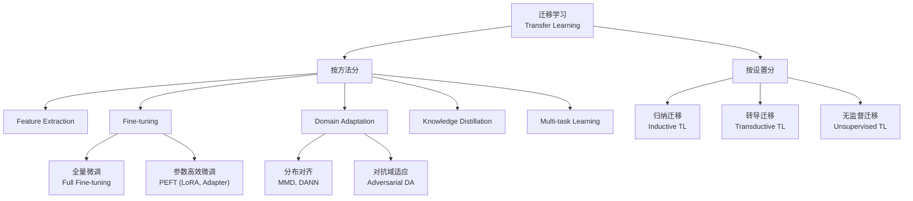

# Transfer Learning 核心概念

> 📚 Book: Goodfellow et al., [《Deep Learning》](../../../textbooks/goodfellow_deep_learning.pdf), Ch.15
> 📖 Paper: Pan & Yang, [A Survey on Transfer Learning (2010)](../../../.documents/papers/transfer_learning/A_Survey_on_Transfer_Learning.pdf)

---

## 术语定义

### 迁移学习 (Transfer Learning)

把在一个任务或领域（**源域 Source Domain**）上学到的知识，应用到另一个不同但相关的任务或领域（**目标域 Target Domain**）上。核心动机：减少目标任务所需的标注数据、训练时间和算力。

> 别名：**知识迁移 (Knowledge Transfer)** / **归纳迁移 (Inductive Transfer)**（早期文献）— 都是同一个思想的不同叫法

> 📖 Paper: Pan & Yang, [A Survey on Transfer Learning (2010)](../../../.documents/papers/transfer_learning/A_Survey_on_Transfer_Learning.pdf), Definition 1

### 源域 / 目标域 (Source Domain / Target Domain)

**源域** $\mathcal{D}_S = \{X_S, P(X_S)\}$ 是提供知识的一方（通常数据量大、标签丰富）；**目标域** $\mathcal{D}_T = \{X_T, P(X_T)\}$ 是接收知识的一方（通常数据量小、标签稀缺）。迁移学习假设 $\mathcal{D}_S \neq \mathcal{D}_T$ 或 $\mathcal{T}_S \neq \mathcal{T}_T$（域不同或任务不同）。

> 易混淆：**域 (Domain) vs 任务 (Task)** — 域是特征空间+边缘分布 $\{X, P(X)\}$；任务是标签空间+条件分布 $\{Y, P(Y|X)\}$。两者可以独立变化

> 📖 Paper: Pan & Yang, [A Survey on Transfer Learning (2010)](../../../.documents/papers/transfer_learning/A_Survey_on_Transfer_Learning.pdf), Section 2

### 预训练 (Pre-training)

在大规模数据集（如 ImageNet 的 120 万张图片或 Common Crawl 的网页文本）上训练一个大模型，让它学到通用的特征表示。这个阶段不关心具体的下游任务，只"打好地基"。

> 📚 Book: Goodfellow et al., [《Deep Learning》](../../../textbooks/goodfellow_deep_learning.pdf), Ch.15.1

### 微调 (Fine-tuning)

把预训练模型的参数作为初始化（而非随机初始化），在目标任务的数据上继续训练。通常使用较小的学习率，防止把预训练学到的好特征"冲掉"。

> 易混淆：**Fine-tuning vs Feature Extraction** — Fine-tuning 会更新（部分或全部）预训练参数；Feature Extraction 冻结所有预训练参数，只训练新加的分类头

> 📖 Paper: Howard & Ruder, [ULMFiT (2018)](../../../.documents/papers/transfer_learning/howard_2018_ulmfit.pdf)

### 特征提取 (Feature Extraction)

冻结预训练模型的所有层（作为固定的特征提取器），只在最后接一个新的分类/回归头进行训练。适用于目标数据集非常小（几百张图）的场景，防止过拟合。

> 📖 Docs: [PyTorch Transfer Learning Tutorial](https://pytorch.org/tutorials/beginner/transfer_learning_tutorial.html)

### 冻结层 (Freezing Layers)

把模型的某些层的参数设为不可训练（`param.requires_grad = False`），梯度不传回这些层。底层通常冻结（学到了通用的边缘/纹理特征），高层解冻让其适应新任务。

> 📖 Paper: Yosinski et al., [How transferable are features? (2014)](../../../.documents/papers/transfer_learning/yosinski_2014_transferable_features.pdf)

### 域适应 (Domain Adaptation)

源域和目标域的特征空间相同但边缘分布不同：$P(X_S) \neq P(X_T)$。目标是学习一个变换，使得源域数据在变换后"看起来像"目标域数据。例如：在合成图上训练的模型适应到真实照片。

> 易混淆：**Domain Adaptation vs Fine-tuning** — DA 强调分布对齐（通常目标域无标签或极少标签），Fine-tuning 强调参数调整（需要目标域标签）

> 📖 Paper: Pan & Yang, [A Survey on Transfer Learning (2010)](../../../.documents/papers/transfer_learning/A_Survey_on_Transfer_Learning.pdf), Section 3.2

### 负迁移 (Negative Transfer)

迁移后模型性能比不迁移时更差。通常发生在源域和目标域关联度太低时。例如用医学影像上预训练的模型去做自然语言情感分析。

> 📖 Paper: Zhuang et al., [A Comprehensive Survey (2020)](../../../.documents/papers/transfer_learning/zhuang_2020_transfer_learning_survey.pdf), Section 4.5

### 知识蒸馏 (Knowledge Distillation)

用一个大模型（**教师 Teacher**）的输出概率分布作为软标签，去训练一个小模型（**学生 Student**）。学生学习教师的"暗知识"（soft probabilities），而不仅仅是硬标签。

> 易混淆：**Knowledge Distillation vs Model Compression** — 蒸馏是压缩手段之一；压缩还包括量化、剪枝等不涉及迁移学习的方法

> 📚 Book: Goodfellow et al., [《Deep Learning》](../../../textbooks/goodfellow_deep_learning.pdf), Ch.15

### 多任务学习 (Multi-task Learning)

同时训练模型解决多个相关任务，共享底层特征表示。与迁移学习不同的是，多任务学习**同时**优化所有任务，而迁移学习是**先源后目标**。

> 📖 Paper: Zhuang et al., [A Comprehensive Survey (2020)](../../../.documents/papers/transfer_learning/zhuang_2020_transfer_learning_survey.pdf), Section 2.3

### 自监督预训练 (Self-supervised Pre-training)

不依赖人工标注，通过设计**代理任务 (Pretext Task)**让模型从数据本身学习特征。例如 BERT 的掩码语言模型（遮住一些词让模型预测）或 SimCLR 的对比学习。

> 📚 Book: Goodfellow et al., [《Deep Learning》](../../../textbooks/goodfellow_deep_learning.pdf), Ch.15

---

## 概念辨析

### 迁移学习三大类（Pan & Yang 2010 分类体系）

| 维度 | 归纳迁移 (Inductive TL) | 转导迁移 (Transductive TL) | 无监督迁移 (Unsupervised TL) |
|------|------------------------|---------------------------|----------------------------|
| **目标域标签** | ✅ 有标签 | ❌ 无标签 | ❌ 无标签 |
| **源域标签** | 有或无 | ✅ 有标签 | ❌ 无标签 |
| **核心方法** | Fine-tuning, Multi-task | Domain Adaptation, Sample Selection | Transfer Clustering |
| **典型场景** | ImageNet → 医学影像分类 | 产品评论(源) → 电影评论(目标) | 无监督跨域特征学习 |

> 📖 Paper: Pan & Yang, [A Survey on Transfer Learning (2010)](../../../.documents/papers/transfer_learning/A_Survey_on_Transfer_Learning.pdf), Section 3

### Feature Extraction vs Fine-tuning vs 从头训练

| 维度 | Feature Extraction | Fine-tuning | 从头训练 (Training from Scratch) |
|------|-------------------|-------------|-------------------------------|
| **预训练参数** | 全部冻结 | 部分或全部解冻 | 不使用 |
| **新层** | 只训练分类头 | 训练分类头 + 解冻的层 | 训练全部 |
| **学习率** | 较大（只影响新层） | 较小（保护预训练特征） | 标准 |
| **目标数据量** | 极小（< 1K） | 中等（1K-100K） | 极大（> 100K） |
| **过拟合风险** | 低 | 中 | 高（小数据时） |

> 📖 Paper: Yosinski et al., [How transferable are features? (2014)](../../../.documents/papers/transfer_learning/yosinski_2014_transferable_features.pdf)

### 深度迁移学习四大类（Tan et al. 2018 分类）

| 方法 | 核心思想 | 代表 |
|------|---------|------|
| **Instance-based** | 对源域样本加权，使其接近目标域分布 | TrAdaBoost |
| **Feature-based** | 学习域不变特征表示 | DANN, MMD |
| **Parameter-based** | 共享/迁移模型参数 | Fine-tuning, LoRA |
| **Relational-based** | 迁移数据之间的关系/规则 | 知识图谱迁移 |

> 📖 Paper: Tan et al., [A Survey on Deep Transfer Learning (2018)](../../../.documents/papers/transfer_learning/tan_2018_deep_transfer_survey.pdf)

---

## 核心属性

### 信息架构

### 适用场景 ✅

- 目标域数据少，但有大量相关源域数据（→ Fine-tuning）
- 需要快速建立基线模型（→ Feature Extraction）
- 源域和目标域特征空间相同但分布不同（→ Domain Adaptation）
- 部署资源有限，需要小模型（→ Knowledge Distillation）
- 需要用大量无标注数据学特征，再迁移到下游（→ Self-supervised Pre-training）

### 不适用场景 ❌

- 源域和目标域完全无关（→ 负迁移风险高）
- 目标域数据足够多、计算资源充足（→ 从头训练可能更好）
- 任务对安全性/可解释性要求极高（→ 预训练模型的偏差可能被继承）

> 📖 Paper: Zhuang et al., [A Comprehensive Survey (2020)](../../../.documents/papers/transfer_learning/zhuang_2020_transfer_learning_survey.pdf), Section 4

---

## 速查表

| 项 | 说明 | 示例 |
|-----|------|------|
| Pre-training | 大数据上训练通用模型 | ResNet on ImageNet (120 万张) |
| Fine-tuning | 用小学习率在目标数据上继续训练 | ResNet → 猫狗分类 (1000 张) |
| Feature Extraction | 冻结模型，只训练分类头 | ResNet 特征 + Linear 分类器 |
| Freezing | 设置 requires_grad=False | 冻结 conv1-conv4，解冻 conv5 |
| Domain Adaptation | 对齐源域和目标域分布 | 合成数据 → 真实照片 |
| Knowledge Distillation | 大模型教小模型 | BERT-large → DistilBERT |
| Negative Transfer | 迁移后反而更差 | 医学影像模型 → NLP 任务 |
| ULMFiT 三步法 | LM Pre-train → LM Fine-tune → Classifier Fine-tune | 通用文本 → 领域文本 → 分类 |
| LoRA | 低秩适配器，不改原参数 | rank=8，只加 0.1% 参数 |
| Discriminative LR | 不同层用不同学习率 | 底层 1e-5，高层 1e-3 |
