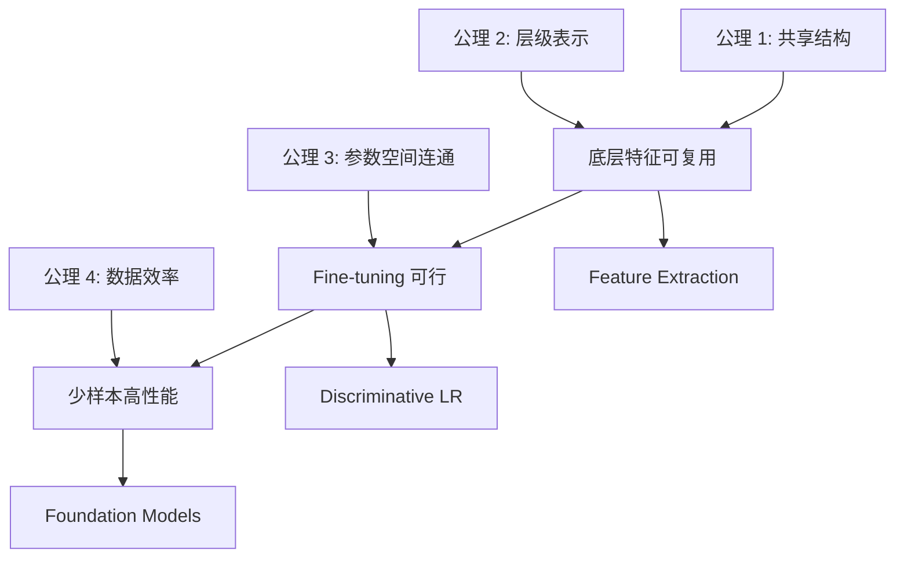

# Transfer Learning 第一性原理

> 📚 Book: Goodfellow et al., [《Deep Learning》](../../../textbooks/goodfellow_deep_learning.pdf), Ch.15
> 📖 Paper: Yosinski et al., [How transferable are features? (2014)](../../../.documents/papers/transfer_learning/yosinski_2014_transferable_features.pdf)

---

## 核心问题链

> 用"5 个为什么"递归追问，从表层功能到不可再分公理。

1. **迁移学习在做什么？** → 把源域学到的知识复用到目标域，减少目标域所需的数据和训练
2. **为什么源域的知识能用在目标域？** → 因为两个域共享某些底层结构（如自然图片都有边缘/纹理）
3. **为什么存在共享的底层结构？** → 因为现实世界有层级的因果结构：物理规律 → 材质纹理 → 物体形状 → 语义类别
4. **这个层级结构为什么能被深度网络学到？** → 深度网络的多层架构天然对应层级表示：每一层学习一个抽象层次
5. **能否继续拆分？** → 不能 → **到达公理：世界的层级因果结构 + 深度网络的层级表示能力**

---

## 公理与基本假设

### 公理 1: 共享结构假设 (Shared Structure Assumption)

**陈述：** 源域和目标域共享某些底层数据生成机制（因果结构、统计规律、特征模式）。

**白话：** 猫和狗虽然是不同类别，但都有"毛皮纹理""眼睛""四条腿"——这些共同特征可以迁移。

**来源：** Pan & Yang 2010 的迁移学习定义隐含此假设。

**可验证性：**
- ✅ 成立：自然图片之间（ImageNet → 医学影像中的自然结构）
- ✅ 成立：同语系语言（英文 → 法文）
- ❌ 不成立：源域和目标域完全无关（音频频谱 → 蛋白质结构）

> 📖 Paper: Pan & Yang, [A Survey on Transfer Learning (2010)](../../../.documents/papers/transfer_learning/A_Survey_on_Transfer_Learning.pdf), Section 2

### 公理 2: 层级表示假设 (Hierarchical Representation)

**陈述：** 深度网络的每一层学到的特征对应不同抽象层次——底层通用、高层特定。

**白话：** 第 1 层学"边缘"，第 3 层学"纹理组合"，第 5 层学"物体部件"——越底层越通用。

**来源：** Yosinski et al. (2014) 通过实验定量验证了这一假设。

**可验证性：**
- ✅ 成立：CNN（视觉特征层级已被大量实验验证）
- ✅ 成立：Transformer（底层注意力更局部/通用，高层更全局/任务特定）
- ❌ 不成立：浅层模型（单层感知机、SVM 没有层级结构）

> 📖 Paper: Yosinski et al., [How transferable are features? (2014)](../../../.documents/papers/transfer_learning/yosinski_2014_transferable_features.pdf)

### 公理 3: 参数空间连通性 (Parameter Space Connectivity)

**陈述：** 预训练参数 $\theta_{\text{pre}}$ 和目标最优参数 $\theta^*_T$ 在损失曲面上处于同一连通区域——从前者出发可以通过梯度下降到达后者。

**白话：** 预训练模型已经在"正确的山谷"里了，Fine-tuning 只需要在山谷里微调位置。

**来源：** Goodfellow et al. 2015 《Deep Learning》Ch.15 讨论了预训练的正则化效果。

**可验证性：**
- ✅ 成立：源域和目标域相关时（同类图片、同语言家族）
- ❌ 不成立：域差异太大时（预训练参数在错误的山谷，需要"翻山越岭"）

> 📚 Book: Goodfellow et al., [《Deep Learning》](../../../textbooks/goodfellow_deep_learning.pdf), Ch.15

### 公理 4: 数据效率假设 (Data Efficiency)

**陈述：** 好的初始化（预训练参数）可以显著减少达到目标性能所需的训练样本数量。

**白话：** 不用从零开始学，而是在一个好的起点上修正，需要的数据自然少。

**来源：** 统计学习理论中的样本复杂度分析。

**可验证性：**
- ✅ 成立：几乎所有 Fine-tuning 实验都证实了这一点
- ⚠️ 有限制：目标域数据极少（< 10 张）时仍可能过拟合

---

## 从公理到技术的推导链

### Step 1: 从公理 1 (共享结构) + 公理 2 (层级表示) → 特征可迁移

**推理：** 源域和目标域共享底层结构（公理 1），深度网络的底层学到通用特征（公理 2）。因此底层特征可以直接复用。

**结果：** Feature Extraction — 冻结底层，只训练分类头

### Step 2: 从 Step 1 + 公理 3 (参数空间连通) → Fine-tuning

**推理：** 底层特征已经很好（Step 1），且预训练参数和目标最优参数在同一区域（公理 3）。用小学习率微调就能从预训练位置"走到"目标最优位置。

**结果：** Fine-tuning — 用小 LR 调整部分或全部参数

### Step 3: 从 Step 2 + 公理 4 (数据效率) → 少样本学习

**推理：** 好初始化减少所需样本（公理 4），Fine-tuning 只需微调（Step 2）。

**结果：** 用几百张图就能达到从头训练几万张的效果

### 推导链全景图

---

## 如果公理不成立？

### 公理 1 失效：域之间没有共享结构

**如果不成立：** 源域和目标域完全无关
**技术后果：** 负迁移——迁移后性能比从头训练更差
**替代方案：** 从头训练；或寻找与目标域更相关的预训练模型

### 公理 2 失效：模型没有层级表示

**如果不成立：** 使用浅层模型（SVM、单层网络）
**技术后果：** 所有特征都是任务特定的，无法分离通用/特定特征
**替代方案：** 使用深度模型；或用 Instance-based TL（样本加权）

### 公理 3 失效：参数空间不连通

**如果不成立：** 预训练参数在错误的"山谷"
**技术后果：** Fine-tuning 无法收敛到目标最优点
**替代方案：** 加大学习率重新搜索；或用 Domain Adaptation 先对齐分布

### 公理 4 失效：数据极端稀缺

**如果不成立：** 目标域只有 5-10 个样本
**技术后果：** 即使有好初始化，分类头还是过拟合
**替代方案：** Zero-shot / In-context Learning；或增加数据增强

---

## 第一性原理速查表

| 公理/假设 | 一句话陈述 | 成立条件 | 失效后果 |
|----------|-----------|---------|---------| 
| 共享结构 | 源域目标域有共同底层模式 | 域相关 | 负迁移 |
| 层级表示 | 深度网络底层通用、高层特定 | 深度模型 | 无法分离特征 |
| 参数连通 | 预训练参数和目标最优在同区域 | 域相似 | Fine-tune 不收敛 |
| 数据效率 | 好初始化减少所需样本 | ≥ 几十样本 | 过拟合 |
