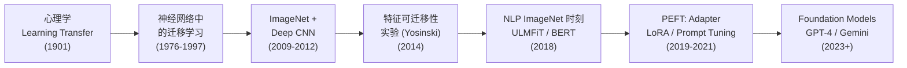

# 迁移学习的故事线：从认知心理学到 Foundation Models

> **核心主题：** 如何让机器像人类一样"举一反三"——把旧知识用在新问题上
> **故事线：** 从心理学家的观察到工程师的落地，一条"知识复用"的进化史

---

## 🎬 序幕：一切从什么问题开始？

### 一句话概括

> 人类学会骑自行车很快就能学摩托车，学会英语后再学法语也更快——为什么机器学习模型做不到？

传统机器学习假设训练数据和测试数据来自同一分布（i.i.d.）。但现实中，新任务往往只有少量数据，而相关领域却有大量数据。能不能借用相关领域的知识？

> 🔑 **问题提出：** 能不能让模型在一个任务上学到的知识，帮助它更快更好地学另一个任务？

---

## 📚 第一章：心理学的启发与早期探索（1976-1997）

> **关键人物：** Stevo Bozinovski（最早在神经网络中形式化迁移学习概念）
> **关键论文：** Bozinovski & Fulgosi, "The influence of pattern similarity and transfer learning upon training of a base perceptron B2" (1976)

### 发生了什么？

心理学家早在 20 世纪初就研究了"学习迁移"——一种学习如何影响另一种学习（Thorndike, 1901）。1976 年，Bozinovski 和 Fulgosi 在一篇发表于《Informatica》期刊的论文中，首次在神经网络的上下文中研究了迁移学习。

1990 年代，Pratt (1993) 和 Thrun (1996) 分别从"如何复用网络权重"和"学习多个相关任务"的角度推进了该领域。Thrun 提出了 **"learning to learn"** 的概念框架。

### 为什么这很重要？

确立了迁移学习的理论动机：**学习不应该每次都从零开始**。但当时的模型（浅层神经网络、SVM）能学到的特征有限，迁移效果不稳定。

### 但还有一个问题……

浅层模型学到的特征太简单、太任务特定，没有"通用特征"可以迁移。

> 🔑 **故事转折点：** 需要更强的模型来学习层次化的、从通用到特定的特征表示。

---

## 📚 第二章：深度学习 + ImageNet 来了（2009-2014）

> **关键人物：** Deng, Krizhevsky, Donahue, Yosinski
> **关键事件：** ImageNet (2009), AlexNet (2012), DeCAF (2014), Yosinski 实验 (2014)

#### 🎥 视觉素材

| 素材 | 来源 | 链接 | 版权 |
|------|------|------|------|
| ImageNet 样例 | ImageNet 官网 | `https://www.image-net.org` | 学术引用 |
| Yosinski 论文 Figure 2 | arXiv | `https://arxiv.org/abs/1411.1792` | 学术引用 |

### 发生了什么？

2009 年 ImageNet 数据集（120 万张图片, 1000 类）的出现和 2012 年 AlexNet 的突破，提供了第一个**大规模预训练的深度模型**。

2014 年，两个关键工作确立了深度迁移学习的范式：

1. **DeCAF (Donahue et al., 2014)**：实验证明，把 AlexNet 的中间层输出作为固定特征，用在新任务上效果惊人地好——比手工特征好得多
2. **Yosinski et al. (2014)**：系统实验量化了深度网络每一层特征的"可迁移性"——底层特征（边缘/纹理）高度通用，高层特征逐渐变得任务特定

### 为什么这很重要？

确立了 **"ImageNet 预训练 + Fine-tuning"** 范式——几乎所有 CV 任务都不再从头训练，而是从 ImageNet 预训练模型开始。这是 CV 领域的一次范式转移。

### 但还有一个问题……

CV 领域的迁移学习非常成功，但 NLP 领域一直没有对应的"ImageNet 时刻"。Word2Vec/GloVe 只是词向量，不是完整的语言理解模型。

> 🔑 **故事转折点：** NLP 需要自己的"ImageNet 预训练"方案。

> 📖 Paper: Yosinski et al., [How transferable are features? (2014)](../../../.documents/papers/transfer_learning/yosinski_2014_transferable_features.pdf)

---

## 📚 第三章：NLP 的 ImageNet 时刻（2018）

> **关键人物：** Jeremy Howard, Sebastian Ruder, Jacob Devlin, Alec Radford
> **关键论文：** ULMFiT (Howard & Ruder), ELMo (Peters et al.), GPT (Radford et al.), BERT (Devlin et al.) — 全部在 2018 年

#### 🎥 视觉素材

| 素材 | 来源 | 链接 | 版权 |
|------|------|------|------|
| ULMFiT 论文 | arXiv | `https://arxiv.org/abs/1801.06146` | 学术引用 |
| BERT 论文 | arXiv | `https://arxiv.org/abs/1810.04805` | 学术引用 |

### 发生了什么？

2018 年被称为 NLP 的"ImageNet 时刻"，四个工作在短短几个月内改写了 NLP：

1. **ULMFiT (Howard & Ruder, 2018.01)**：提出三阶段法（LM Pre-train → LM Fine-tune → Classifier Fine-tune）+ Discriminative LR + Gradual Unfreezing。第一个系统的 NLP 迁移学习方法
2. **ELMo (Peters et al., 2018.02)**：用双向 LSTM 语言模型生成上下文相关的词向量——"同一个词在不同句子中含义不同"
3. **GPT (Radford et al., 2018.06)**：用 Transformer Decoder 做自回归语言模型预训练，然后 Fine-tune
4. **BERT (Devlin et al., 2018.10)**：用 Transformer Encoder 做掩码语言模型预训练，成为 NLP 的新基线

### 为什么这很重要？

BERT 在 11 项 NLP 基准测试上刷新了记录。从此 NLP 也进入了 **"预训练 + Fine-tuning"** 时代。一个预训练模型可以适配情感分析、问答、NER 等各种任务。

### 但还有一个问题……

Full Fine-tuning 大模型（BERT-large: 3.4 亿参数, GPT-3: 1750 亿参数）需要大量 GPU 内存和存储。每个下游任务保存一份完整模型的副本成本太高。

> 🔑 **故事转折点：** 能不能只调整一小部分参数就适配新任务？

> 📖 Paper: Howard & Ruder, [ULMFiT (2018)](../../../.documents/papers/transfer_learning/howard_2018_ulmfit.pdf)

---

## 📚 第四章：参数高效微调与 Foundation Models（2019-2025）

> **关键人物：** Houlsby (Adapter), Hu (LoRA), Bommasani (Foundation Models)
> **关键论文：** Adapter (2019), LoRA (2021), Foundation Models Report (2021)

### 发生了什么？

模型越来越大（GPT-3: 175B, PaLM: 540B），Full Fine-tuning 不可行。**参数高效微调（PEFT）**方法应运而生：

1. **Adapter (Houlsby et al., 2019)**：在 Transformer 层间插入小型"适配器"模块，只训练适配器（约 3% 参数）
2. **Prompt Tuning (Lester et al., 2021)**：不改模型参数，而是学习输入前的"软提示"向量
3. **LoRA (Hu et al., 2021)**：在权重矩阵旁加低秩分解矩阵 $\Delta W = BA$（rank=8 时只加 0.1% 参数），效果接近 Full Fine-tuning
4. **Foundation Models (Bommasani et al., 2021)**：提出"基础模型"概念——一个在超大数据上预训练的模型，通过迁移适配到无数下游任务

### 为什么这很重要？

LoRA 等 PEFT 方法让普通用户用消费级 GPU（RTX 4090）也能微调 70B 参数模型。迁移学习从学术研究走向了**全民化**。

> 📖 Paper: Zhuang et al., [A Comprehensive Survey (2020)](../../../.documents/papers/transfer_learning/zhuang_2020_transfer_learning_survey.pdf)

---

## 🗺️ 全局回顾：技术演进路线图

### 每一步升级解决了什么问题？

| 从 → 到 | 解决了什么核心问题？ |
|---------|-------------------|
| 浅层模型 → 深度模型 | 从"特征太简单无法迁移"到"层级特征可迁移" |
| 手动特征 → DeCAF | 从"手工特征"到"自动学到可迁移特征" |
| CV-only → NLP (BERT) | 从"只有视觉能迁移"到"语言也能预训练+Fine-tune" |
| Full Fine-tuning → LoRA | 从"微调整个大模型"到"只调 0.1% 参数" |
| 单任务预训练 → Foundation Models | 从"一个预训练配一个下游"到"一个基础模型适配一切" |

### 🎥 视觉素材总表（视频制作用）

| 章节 | 人物/事件 | 肖像来源 | 论文/事件图片 | 版权 |
|------|----------|---------|-------------|------|
| 第二章 | Yosinski et al. | — | arXiv: `1411.1792` Figure 2 | 学术引用 |
| 第三章 | Howard & Ruder | — | arXiv: `1801.06146` | 学术引用 |
| 第三章 | Devlin (BERT) | — | arXiv: `1810.04805` | 学术引用 |
| 第四章 | Hu (LoRA) | — | arXiv: `2106.09685` | 学术引用 |

> ⚠️ **素材查找优先级：**
> 1. **Wikimedia Commons** — 首选，多数科学家有公有领域肖像
> 2. **大学官网/档案馆** — 本校教授的官方照片
> 3. **论文首页截图** — arXiv / Google Scholar
>
> ❌ **禁止：** AI 生成肖像、库存图片网站、无版权标注的图片
