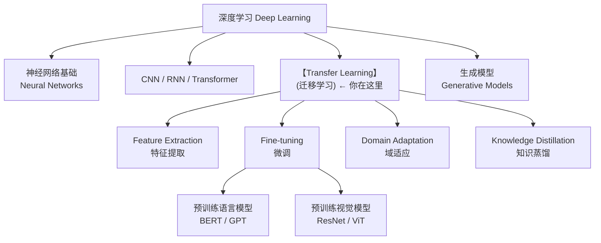
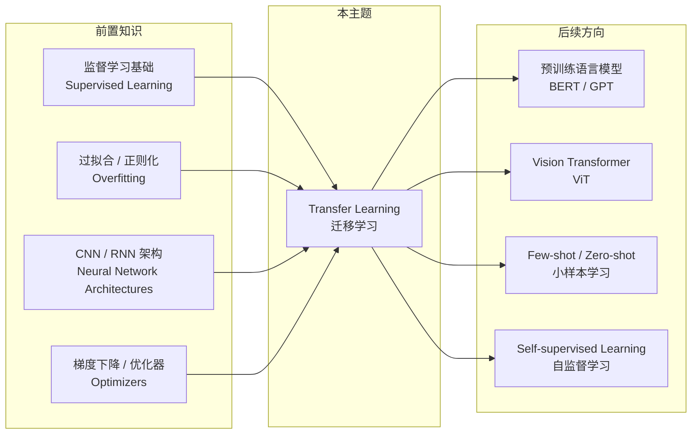

# Transfer Learning 知识地图

> 📚 Book: Goodfellow et al., [《Deep Learning》](../../../textbooks/goodfellow_deep_learning.pdf), Ch.15
> 📖 Paper: Pan & Yang, [A Survey on Transfer Learning (2010)](../../../.documents/papers/transfer_learning/A_Survey_on_Transfer_Learning.pdf)
> 📖 Paper: Yosinski et al., [How transferable are features? (2014)](../../../.documents/papers/transfer_learning/yosinski_2014_transferable_features.pdf)

## 1. 核心问题

- **为什么不能每次都从头训练？** → 从头训练需要大量标注数据和算力，小数据集容易过拟合；而预训练模型已经学到了通用特征
- **迁移学习和从头训练有什么本质区别？** → 迁移学习复用源域学到的知识（特征/参数/分布），减少目标域所需的数据和时间
- **什么时候迁移学习反而会帮倒忙？** → 源域和目标域差异太大时产生"负迁移"(Negative Transfer)，性能比从头训练更差
- **Fine-tuning 时应该冻结哪些层？** → 底层特征（边缘/纹理）通用性强应冻结，高层特征（语义）任务相关应微调
- **Domain Adaptation 和 Fine-tuning 有什么区别？** → Fine-tuning 适用于标签充足时调整参数，Domain Adaptation 解决的是源域和目标域分布不同的问题

> 📖 Paper: Yosinski et al., [How transferable are features? (2014)](../../../.documents/papers/transfer_learning/yosinski_2014_transferable_features.pdf)
> 📚 Book: Goodfellow et al., [《Deep Learning》](../../../textbooks/goodfellow_deep_learning.pdf), Ch.15

---

## 2. 全景位置

> 📖 Paper: Pan & Yang, [A Survey on Transfer Learning (2010)](../../../.documents/papers/transfer_learning/A_Survey_on_Transfer_Learning.pdf)
> 📖 Paper: Tan et al., [A Survey on Deep Transfer Learning (2018)](../../../.documents/papers/transfer_learning/tan_2018_deep_transfer_survey.pdf)

---

## 3. 依赖地图

> 📚 Book: Goodfellow et al., [《Deep Learning》](../../../textbooks/goodfellow_deep_learning.pdf), Ch.15.1
> 📖 Paper: Zhuang et al., [A Comprehensive Survey on Transfer Learning (2020)](../../../.documents/papers/transfer_learning/zhuang_2020_transfer_learning_survey.pdf)

---

## 4. 文件地图

| 文件 | 定位 | 何时用 |
|------|------|--------|
| [transfer_learning_map.md](transfer_learning_map.md) | ① 导航 | 第一次接触、需要全局视角 |
| [transfer_learning_concepts.md](transfer_learning_concepts.md) | ② 概念 | 理解术语定义、辨析易混淆概念 |
| [transfer_learning_math.md](transfer_learning_math.md) | ③ 公式 | 推导公式、理解数学基础 |
| [transfer_learning_tutorial.md](transfer_learning_tutorial.md) | ④ 教程 | Why-First 理解设计动机与原理 |
| [transfer_learning_code.md](transfer_learning_code.md) | ⑤ 代码 | 快速上手实现 |
| [transfer_learning_pitfalls.md](transfer_learning_pitfalls.md) | ⑥ 踩坑 | 调试问题 |
| [transfer_learning_history.md](transfer_learning_history.md) | ⑦ 历史 | 了解技术演进 |
| [transfer_learning_bridge.md](transfer_learning_bridge.md) | ⑧ 衔接 | 找相关主题、扩展阅读 |
| [transfer_learning_first_principles.md](transfer_learning_first_principles.md) | ⑨ 第一性原理 | 追问底层公理、理解边界 |

---

## 5. 学习/使用路线

### 第一次学习 🎒

1. 读 [transfer_learning_map.md](transfer_learning_map.md) 了解全局位置
2. 读 [transfer_learning_tutorial.md](transfer_learning_tutorial.md) Section 1 理解动机
3. 读 [transfer_learning_concepts.md](transfer_learning_concepts.md) 掌握核心术语
4. 读 [transfer_learning_math.md](transfer_learning_math.md) 理解域差异度量公式
5. 跟 [transfer_learning_code.md](transfer_learning_code.md) 快速跑一个 Fine-tuning 示例
6. 读 [transfer_learning_history.md](transfer_learning_history.md) 了解技术演进
7. 读 [transfer_learning_first_principles.md](transfer_learning_first_principles.md) 追问底层公理

### 日常参考 🔧

1. 查 [transfer_learning_code.md](transfer_learning_code.md) API 速查表
2. 查 [transfer_learning_concepts.md](transfer_learning_concepts.md) 概念辨析
3. 查 [transfer_learning_pitfalls.md](transfer_learning_pitfalls.md) 排查问题

### 深度研究 🔬

1. 读 [transfer_learning_history.md](transfer_learning_history.md) 完整演进线
2. 读 [transfer_learning_first_principles.md](transfer_learning_first_principles.md) 追问底层公理
3. 读 [transfer_learning_bridge.md](transfer_learning_bridge.md) 探索下游任务
4. 阅读 Pan & Yang 2010 综述 + Yosinski 2014 特征迁移实验

---

## 6. 缺口检查

| 维度 | 状态 |
|------|------|
| Map | ✅ 已完成 |
| Concepts | ✅ 已完成 |
| Math | ✅ 已完成 |
| Tutorial | ✅ 已完成 |
| Code | ✅ 已完成 |
| Pitfalls | ✅ 已完成 |
| History | ✅ 已完成 |
| Bridge | ✅ 已完成 |
| First Principles | ✅ 已完成 |

---

## 7. 新鲜度状态

| 维度 | 上次验证 | 过期时间 | 状态 |
|------|---------|---------|------|
| Map | 2026-03-18 | 12m | ✅ current |
| Concepts | 2026-03-18 | 12m | ✅ current |
| Math | 2026-03-18 | 12m | ✅ current |
| Tutorial | 2026-03-18 | 12m | ✅ current |
| Code | 2026-03-18 | 6m | ✅ current |
| Pitfalls | 2026-03-18 | 6m | ✅ current |
| History | 2026-03-18 | never | ✅ current |
| Bridge | 2026-03-18 | 12m | ✅ current |
| First Principles | 2026-03-18 | 12m | ✅ current |

---

## 8. 参考来源表

| 来源 | 类型 | 使用位置 |
|------|------|---------|
| [《Deep Learning》Ch.15](../../../textbooks/goodfellow_deep_learning.pdf) | 📚 教科书 | 全文核心：迁移学习理论框架 |
| [Pan & Yang 2010](../../../.documents/papers/transfer_learning/A_Survey_on_Transfer_Learning.pdf) | 📖 论文 | 迁移学习分类体系（归纳/转导/无监督） |
| [Yosinski et al. 2014](../../../.documents/papers/transfer_learning/yosinski_2014_transferable_features.pdf) | 📖 论文 | 深度网络特征可迁移性的量化实验 |
| [Tan et al. 2018](../../../.documents/papers/transfer_learning/tan_2018_deep_transfer_survey.pdf) | 📖 论文 | 深度迁移学习四类方法综述 |
| [Howard & Ruder 2018](../../../.documents/papers/transfer_learning/howard_2018_ulmfit.pdf) | 📖 论文 | ULMFiT: NLP 微调三步法 |
| [Zhuang et al. 2020](../../../.documents/papers/transfer_learning/zhuang_2020_transfer_learning_survey.pdf) | 📖 论文 | 最全面的迁移学习综述 |
| [PyTorch Transfer Learning](https://pytorch.org/tutorials/beginner/transfer_learning_tutorial.html) | 📖 文档 | PyTorch 官方 Fine-tuning 教程 |
| [TensorFlow Hub](https://www.tensorflow.org/hub) | 📖 文档 | TF 预训练模型中心 |
