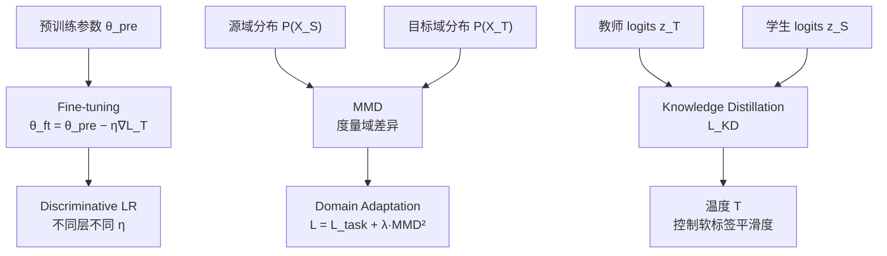

# Transfer Learning 数学基础

> 📚 Book: Goodfellow et al., [《Deep Learning》](../../../textbooks/goodfellow_deep_learning.pdf), Ch.15
> 📖 Paper: Pan & Yang, [A Survey on Transfer Learning (2010)](../../../.documents/papers/transfer_learning/A_Survey_on_Transfer_Learning.pdf)

---

## 符号对照表

| 符号 | 含义（白话） | 英文 | 取值范围 |
|------|-------------|------|---------| 
| $\mathcal{D}_S$ | 源域 | Source Domain | $\{X_S, P(X_S)\}$ |
| $\mathcal{D}_T$ | 目标域 | Target Domain | $\{X_T, P(X_T)\}$ |
| $\mathcal{T}_S$ | 源任务 | Source Task | $\{Y_S, P(Y_S|X_S)\}$ |
| $\mathcal{T}_T$ | 目标任务 | Target Task | $\{Y_T, P(Y_T|X_T)\}$ |
| $\theta_{\text{pre}}$ | 预训练参数 | Pre-trained parameters | $\mathbb{R}^d$ |
| $\theta_{\text{ft}}$ | 微调后参数 | Fine-tuned parameters | $\mathbb{R}^d$ |
| $\eta$ | 学习率 | Learning rate | $(0, 1)$ |
| $\text{MMD}$ | 最大均值差异 | Maximum Mean Discrepancy | $\geq 0$ |
| $T$ | 蒸馏温度 | Distillation temperature | $> 0$ |
| $\alpha$ | 蒸馏损失权重 | Distillation loss weight | $[0, 1]$ |

> 📖 Paper: Pan & Yang, [A Survey on Transfer Learning (2010)](../../../.documents/papers/transfer_learning/A_Survey_on_Transfer_Learning.pdf), Section 2

---

## 核心公式

### 公式 1: 迁移学习形式化定义

**直觉：** 源域和目标域不同（域不同或任务不同），但利用源域的知识来提升目标域的学习效果。

给定源域 $\mathcal{D}_S$、源任务 $\mathcal{T}_S$、目标域 $\mathcal{D}_T$、目标任务 $\mathcal{T}_T$：

$$
\text{Transfer Learning}: \mathcal{D}_S, \mathcal{T}_S \Rightarrow f_T(\cdot) \quad \text{s.t.} \quad \mathcal{D}_S \neq \mathcal{D}_T \;\text{or}\; \mathcal{T}_S \neq \mathcal{T}_T
$$

其中 $f_T$ 是目标域的预测函数，利用了从 $\mathcal{D}_S, \mathcal{T}_S$ 中获取的知识。

> 📖 Paper: Pan & Yang, [A Survey on Transfer Learning (2010)](../../../.documents/papers/transfer_learning/A_Survey_on_Transfer_Learning.pdf), Definition 1

---

### 公式 2: Fine-tuning 参数更新

**直觉：** 不从随机参数开始，而是从预训练的好参数开始，用小学习率慢慢调整。

$$
\theta_{\text{ft}} = \theta_{\text{pre}} - \eta \cdot \nabla_\theta \mathcal{L}_T(\theta_{\text{pre}})
$$

> 📚 Book: Goodfellow et al., [《Deep Learning》](../../../textbooks/goodfellow_deep_learning.pdf), Ch.15

**参数解释：**

| 参数 | 含义 | 例子中对应 |
|------|------|-----------|
| $\theta_{\text{pre}}$ | ImageNet 上预训练的 ResNet 参数 | 2300 万个参数 |
| $\eta$ | Fine-tuning 学习率，通常比从头训练小 10-100 倍 | 1e-4 vs 1e-2 |
| $\mathcal{L}_T$ | 目标任务的损失函数 | 交叉熵（分类）或 MSE（回归） |
| $\theta_{\text{ft}}$ | 调整后的参数 | 适配了新任务 |

**为什么用小学习率？**

预训练参数处于一个"好的"损失曲面区域。太大的学习率会把参数推到远离这个好区域的地方，破坏已学到的特征表示——这叫做 **catastrophic forgetting（灾难性遗忘）**。

---

### 公式 3: Discriminative Learning Rate（分层学习率）

**直觉：** 底层（通用特征）用小学习率保护，高层（任务特征）用大学习率快速适应。

$$
\eta_l = \eta_{\text{base}} \cdot \gamma^{(L - l)}, \quad l = 1, 2, \ldots, L
$$

> 📖 Paper: Howard & Ruder, [ULMFiT (2018)](../../../.documents/papers/transfer_learning/howard_2018_ulmfit.pdf), Section 3.3

**参数解释：**

| 参数 | 含义 | 例子中对应 |
|------|------|-----------|
| $\eta_l$ | 第 $l$ 层的学习率 | 第 1 层: 1e-5，第 L 层: 1e-3 |
| $\eta_{\text{base}}$ | 最后一层的基准学习率 | 1e-3 |
| $\gamma$ | 衰减因子 | 0.1（每深一层学习率缩小 10 倍） |
| $L$ | 总层数 | 12 (例如 BERT-base) |

---

### 公式 4: Maximum Mean Discrepancy (MMD)

**直觉：** 衡量两个分布有多不一样——把两组样本映射到高维空间，如果它们的平均位置一样，就认为分布一样。

$$
\text{MMD}^2(\mathcal{D}_S, \mathcal{D}_T) = \left\| \frac{1}{n_S}\sum_{i=1}^{n_S}\phi(x_i^S) - \frac{1}{n_T}\sum_{j=1}^{n_T}\phi(x_j^T) \right\|_{\mathcal{H}}^2
$$

> 📖 Paper: Zhuang et al., [A Comprehensive Survey (2020)](../../../.documents/papers/transfer_learning/zhuang_2020_transfer_learning_survey.pdf), Section 3.2

**参数解释：**

| 参数 | 含义 | 例子中对应 |
|------|------|-----------|
| $\phi(\cdot)$ | 核映射函数（映射到再生核希尔伯特空间 RKHS） | 高斯核 |
| $n_S, n_T$ | 源域/目标域样本数 | 10000, 500 |
| $\mathcal{H}$ | RKHS 范数 | — |

**在 Domain Adaptation 中如何使用：** 在训练目标中加上 MMD 正则项，迫使模型学到的特征在两个域上分布相似：

$$
\mathcal{L} = \mathcal{L}_{\text{task}} + \lambda \cdot \text{MMD}^2(h(X_S), h(X_T))
$$

---

### 公式 5: Knowledge Distillation Loss

**直觉：** 学生不仅学"正确答案"（硬标签），还学老师对所有选项的"信心分配"（软标签）。温度 T 越高，软标签越平滑，暗知识越丰富。

$$
\mathcal{L}_{\text{KD}} = \alpha \cdot T^2 \cdot \text{KL}\!\left(\sigma\!\left(\frac{z_T}{T}\right) \| \sigma\!\left(\frac{z_S}{T}\right)\right) + (1-\alpha) \cdot \text{CE}(y, \sigma(z_S))
$$

> 📚 Book: Goodfellow et al., [《Deep Learning》](../../../textbooks/goodfellow_deep_learning.pdf), Ch.15

**参数解释：**

| 参数 | 含义 | 例子中对应 |
|------|------|-----------|
| $z_T, z_S$ | 教师/学生的 logits（softmax 前的输出） | 10 类的 10 维向量 |
| $T$ | 温度参数，越高输出越平滑 | T=4（常用） |
| $\sigma(\cdot/T)$ | 带温度的 softmax | softmax([2,1,0]/4) ≈ [0.38, 0.34, 0.28] |
| $\alpha$ | 软标签 vs 硬标签的权重 | 0.7（偏重软标签） |
| $\text{KL}$ | KL 散度 | 教师和学生分布的距离 |
| $\text{CE}$ | 交叉熵 | 学生输出和真实标签的差距 |
| $T^2$ | 温度补偿因子 | 因为高温降低了梯度幅度，需要乘回来 |

---

## 公式关系图

> 📚 Book: Goodfellow et al., [《Deep Learning》](../../../textbooks/goodfellow_deep_learning.pdf), Ch.15

---

## 手算练习

### 练习 1: Discriminative Learning Rate

**题目：** 模型有 4 层 (L=4)，$\eta_{\text{base}} = 10^{-3}$，$\gamma = 0.1$。求每层学习率。

**解答步骤：**

1. $\eta_4 = 10^{-3} \times 0.1^{(4-4)} = 10^{-3} \times 1 = 10^{-3}$
2. $\eta_3 = 10^{-3} \times 0.1^{(4-3)} = 10^{-3} \times 0.1 = 10^{-4}$
3. $\eta_2 = 10^{-3} \times 0.1^{(4-2)} = 10^{-3} \times 0.01 = 10^{-5}$
4. $\eta_1 = 10^{-3} \times 0.1^{(4-1)} = 10^{-3} \times 0.001 = 10^{-6}$

→ 底层学习率比顶层小 1000 倍

### 练习 2: KD 温度对 Softmax 的影响

**题目：** logits $z = [3, 1, 0]$，分别算 $T=1$ 和 $T=4$ 时的 softmax。

**解答步骤 (T=1)：**

1. $e^{3}, e^{1}, e^{0} = 20.09, 2.72, 1.00$ → sum = 23.81
2. softmax = $[0.844, 0.114, 0.042]$ — 高度集中在第一类

**解答步骤 (T=4)：**

1. $e^{3/4}, e^{1/4}, e^{0} = 2.12, 1.28, 1.00$ → sum = 4.40
2. softmax = $[0.482, 0.291, 0.227]$ — 分布更平滑，暗知识更可见

→ T 越高，概率分布越均匀，"不确定性"信息保留越多

---

## 公式速查表

| 名称 | 公式 | 用途 | 前置公式 |
|------|------|------|---------| 
| TL 定义 | $\mathcal{D}_S, \mathcal{T}_S \Rightarrow f_T$ | 形式化框架 | — |
| Fine-tuning | $\theta_{\text{ft}} = \theta_{\text{pre}} - \eta\nabla\mathcal{L}_T$ | 参数微调 | 梯度下降 |
| Discriminative LR | $\eta_l = \eta_{\text{base}} \cdot \gamma^{(L-l)}$ | 分层学习率 | Fine-tuning |
| MMD | $\|\frac{1}{n_S}\sum\phi(x^S) - \frac{1}{n_T}\sum\phi(x^T)\|^2_\mathcal{H}$ | 域差异度量 | 核方法 |
| KD Loss | $\alpha T^2 \text{KL}(\sigma(z_T/T)\|\sigma(z_S/T)) + (1-\alpha)\text{CE}$ | 知识蒸馏 | KL 散度, Softmax |
